```{r setup, include=FALSE}
library(CursoR)
library(learnr)
library(dplyr)
library(tidyr)
library(ggplot2)
library(jpeg)
library(gridGraphics)
library(curl)
library(fontawesome)
library(gradethis)
library(kableExtra)
library(patchwork)
library(showtext)
font_add_google('Gochi Hand', 'gochi')
tutorial_options(exercise.timelimit = 60, exercise.checker = gradethis::grade_learnr)
knitr::opts_chunk$set(echo = FALSE)
```

## ¡Bienvenido!

```{r, echo = FALSE, eval = TRUE, out.width = "44%", fig.align = "center"}

  
```

<section style="text-align: center;"><small>Ilustracíon hecha por <font color = "black"><u>@allison_horst</u></font>.</small></section>

### Descripción

Este curso pretende ser una introducción básica del `R`. Su objetivo consiste en enseñar habilidades en la limpieza, manipulación y visualización de datos mediante el uso del `R`. Tenga en cuenta que este curso no pretende ser un sustituto de un curso completo de programación o de estadística.

```{r, eval = FALSE, echo = FALSE, fig.align = 'center', message = FALSE, fig.showtext = TRUE, out.width = '520'}

hex_tidyverse <- readJPEG('images/tidyverse.jpg', native = TRUE)
hex_tidyverse <- rasterGrob(hex_tidyverse, interpolate = FALSE)

hex_readr <- readJPEG('images/readr.jpg', native = TRUE)
hex_readr <- rasterGrob(hex_readr, interpolate = FALSE)

hex_tidyr <- readJPEG('images/tidyr.jpg', native = TRUE)
hex_tidyr <- rasterGrob(hex_tidyr, interpolate = FALSE)

hex_dplyr <- readJPEG('images/dplyr.jpg', native = TRUE)
hex_dplyr <- rasterGrob(hex_dplyr, interpolate = FALSE)

hex_ggplot2 <- readJPEG('images/ggplot2.jpg', native = TRUE)
hex_ggplot2 <- rasterGrob(hex_ggplot2, interpolate = FALSE)

hex_broom <- readJPEG('images/broom.jpg', native = TRUE)
hex_broom <- rasterGrob(hex_broom, interpolate = FALSE)

hex_rmarkdown <- readJPEG('images/rmarkdown.jpg', native = TRUE)
hex_rmarkdown <- rasterGrob(hex_rmarkdown, interpolate = FALSE)

data.frame(
  x = c(2:5.0), y = c(1.6:4.6)
) %>%
  ggplot(aes(x, y)) +
  geom_blank() +
  annotate(geom = 'rect', xmin = 2.95, xmax = 3.93, ymin = 2.5, ymax = 3.6, colour = 'yellow', fill = 'yellow', alpha = 0.4) +
  annotate(geom = 'text', x = 2.2, y = 3.0, label = 'Importar', family = 'gochi', size = 10.4, colour = 'black') +
  geom_curve(x = 2.4, xend = 2.5, y = 3.0, yend = 3.0, arrow = arrow(length = unit(0.1, 'inch')), size = 1.0, color = 'black', curvature = 0.0) +
  annotate(geom = 'text', x = 2.7, y = 3.0, label = 'Ordenar', family = 'gochi', size = 10.4, colour = 'black') +
  geom_curve(x = 2.9, xend = 3.0, y = 3.0, yend = 3.0, arrow = arrow(length = unit(0.1, 'inch')), size = 1.0, color = 'black', curvature = 0.0) +
  annotate(geom = 'text', x = 3.25, y = 3.0, label = 'Transformar', family = 'gochi', size = 10.4, colour = 'black') +
  annotate(geom = 'text', x = 3.7, y = 3.5, label = 'Visualizar', family = 'gochi', size = 10.4, colour = 'black') +
  geom_curve(x = 3.4, xend = 3.6, y = 3.1, yend = 3.4, arrow = arrow(length = unit(0.1, 'inch')), size = 1.0, color = 'black', curvature = -0.2) +
  annotate(geom = 'text', x = 3.75, y = 2.6, label = 'Modelar', family = 'gochi', size = 10.4, colour = 'black') +
  geom_curve(x = 3.65, xend = 3.4, y = 2.7, yend = 2.9, arrow = arrow(length = unit(0.1, 'inch')), size = 1.0, color = 'black', curvature = -0.2) +
  geom_curve(x = 3.8, xend = 3.8, y = 3.4, yend = 2.7, arrow = arrow(length = unit(0.1, 'inch')), size = 1.0, color = 'black', curvature = -0.3) +
  geom_curve(x = 3.96, xend = 4.06, y = 3.0, yend = 3.0, arrow = arrow(length = unit(0.1, 'inch')), size = 1.0, color = 'black', curvature = 0.0) +
  annotate(geom = 'text', x = 4.3, y = 3.0, label = 'Comunicar', family = 'gochi', size = 10.4, colour = 'black') +
  annotate(geom = 'text', x = 2.98, y = 2.4, label = 'Explorar', family = 'gochi', size = 10.4, colour = 'black') +
  annotation_custom(hex_tidyverse, xmin = 4.0, xmax = 5.0, ymin = 3.8, ymax = 4.8) +
  annotation_custom(hex_readr, xmin = 2.1, xmax = 2.3, ymin = 3.1, ymax = 3.5) +
  annotation_custom(hex_tidyr, xmin = 3.1, xmax = 2.3, ymin = 3.1, ymax = 3.5) +
  annotation_custom(hex_dplyr, xmin = 4.1, xmax = 2.3, ymin = 3.14, ymax = 3.54) +
  annotation_custom(hex_ggplot2, xmin = 3.45, xmax = 3.95, ymin = 3.60, ymax = 4.08) +
  annotation_custom(hex_rmarkdown, xmin = 4.05, xmax = 4.55, ymin = 2.45, ymax = 2.95) +
  annotation_custom(hex_broom, xmin = 3.55, xmax = 3.95, ymin = 2.05, ymax = 2.45) +
  scale_x_continuous(limits = c(2, 4.6)) +
  theme_void() +
  theme(axis.text = element_blank(),
        axis.ticks = element_blank(),
        axis.title = element_blank())
```

```{r, eval = TRUE, echo = FALSE, fig.align = 'center', message = FALSE, fig.showtext = TRUE, out.width = '520'}

datos_ordenados <- readJPEG('images/datos_ordenados.jpg', native = TRUE)
datos_ordenados <- rasterGrob(datos_ordenados, interpolate = FALSE)

visualizacion <- readJPEG('images/visualizacion.jpg', native = TRUE)
visualizacion <- rasterGrob(visualizacion, interpolate = FALSE)

ciencia_datos <- data.frame(
  x = c(1.0:7.0), y = c(-1.0:5.0)
) %>%
  ggplot(aes(x, y)) +
  geom_blank() +
  annotate(geom = 'text', x = 1.7, y = 4.4, label = 'Importar', family = 'gochi', size = 10.4, colour = 'black') +
  annotation_custom(datos_ordenados, xmin = 1.0, xmax = 2.4, ymin = 2.1, ymax = 4.7) +
  geom_curve(x = 1.7, xend = 1.7, y = 4.2, yend = 2.6, arrow = arrow(length = unit(0.1, 'inch')), size = 1.0, color = 'black', curvature = 0.0) +
   annotate(geom = 'text', x = 1.7, y = 2.45, label = 'Ordenar', family = 'gochi', size = 10.4, colour = 'black') +
  geom_curve(x = 2.1, xend = 2.8, y = 2.45, yend = 2.45, arrow = arrow(length = unit(0.1, 'inch')), size = 1.0, color = 'black', curvature = 0.0) +
  annotate(geom = 'text', x = 3.36, y = 2.45, label = 'Manipular', family = 'gochi', size = 10.4, colour = 'black') +
  annotate(geom = 'text', x = 4.38, y = 3.5, label = 'Visualizar', family = 'gochi', size = 10.4, colour = 'black') +
  annotate(geom = 'text', x = 4.8, y = 1.5, label = 'Modelar', family = 'gochi', size = 10.4, colour = 'black') +
  annotation_custom(visualizacion, xmin = 4.2, xmax = 5.6, ymin = -1.1, ymax = 1.7) +
  annotate(geom = 'text', x = 3.8, y = -0.6, label = 'Comunicar', family = 'gochi', size = 10.4, colour = 'black') +
  geom_curve(x = 3.45, xend = 4.0, y = 2.64, yend = 3.5, arrow = arrow(length = unit(0.1, 'inch')), size = 1.0, color = 'black', curvature = -0.4) +
  geom_curve(x = 4.7, xend = 4.74, y = 3.3, yend = 1.7, arrow = arrow(length = unit(0.1, 'inch')), size = 1.0, color = 'black', curvature = -0.4) +
  geom_curve(x = 4.4, xend = 3.45, y = 1.5, yend = 2.25, arrow = arrow(length = unit(0.1, 'inch')), size = 1.0, color = 'black', curvature = -0.4) +
  geom_curve(x = 3.7, xend = 3.7, y = 1.7, yend = -0.45, arrow = arrow(length = unit(0.1, 'inch')), size = 1.0, color = 'black', curvature = 0.0) +
  scale_x_continuous(limits = c(1.0, 6.0)) +
  theme_void() +
  theme(axis.text = element_blank(),
        axis.ticks = element_blank(),
        axis.title = element_blank())

ciencia_datos
```

A lo largo del curso podrá encontrar fragmentos de código para realizar ejemplos y ejercicios de codificación. Abajo encontrara como podrán ser usados:

:::example
#### Fragmentos de código para realizar ejemplos
Los ejemplos contienen código previamente escrito para que pueda explorarlo y ejecutarlo presionando el botón amarillo "Run Code" (ejecutar) en la esquina superior derecha. Puede actualizar el código en cualquiera de los ejemplos presionando "Start Over" (iniciar de nuevo) en la esquina superior izquierda y el código se restablecerá automáticamente al valor predeterminado.
:::

```{r addition_ejemplos, exercise = TRUE}


```

:::exercise
#### Fragmentos de código para realizar ejercicios de codificación
Aquí se indican ejercicios prácticos de codificación donde se le pedirá que escriba el código manualmente. Si no da con la solución, puede buscar ayuda dando clic en los botones "Solution" (solución) o "Hints" (sugerencias). En la mayoría de los casos el código podrá ser evaluado con el botón "Submit Answer" (Enviar Respuesta), indicándole cuando la respuesta sea acertada.
:::

```{r exercise_ejercicios, exercise = TRUE}

```

```{r exercise_ejercicios-solution}

Ejercicio_código
```

También se encontrara con el siguiente bloque informativo:

:::caution
#### Bloque informativo de aclaración
En ocasiones se dara alguna recomendación sobre un tema. Este bloque se usará para llevar a cabo esto.
:::

<br>

### Acerca de nosotros

<div class="row">
  <div class="col-md-6" markdown="1">
  __Jorge Leonardo López Martínez__ es zootecnista con interés en el uso de la programación y la bioestadística aplicada al campo de la genética animal.
  <HR>
  <i class="fab fa-black-tie"></i> [leo4luffy.github.io](https://leo4luffy.github.io/)<br>
  <i class="fas fa-envelope"></i> jollopezma@unal.edu.co<br>
  <i class="fa fa-github"></i> [Leo4Luffy](https://github.com/Leo4Luffy)
  </div>
  <div class="col-md-6" markdown="1">
  __Duvan Ariel Nieves Ruiz__ es estudiante de ingeniería ambiental apasionado por el software libre con interés en la ecología y la programación.
  <HR>
  <i class="fab fa-black-tie"></i> [duvancho321.github.io](https://duvancho321.github.io/)<br>
  <i class="fas fa-envelope"></i> dnieves@unal.edu.co<br>
  <i class="fa fa-github"></i> [Duvancho321](https://github.com/Duvancho321)
  </div>
</div>

<br>

No dude en comunicarse con nosotros por correo electrónico si tiene preguntas acerca del curso y su contenido.

Tenga en cuenta que este curso está bajo la licencia <a rel="license" href="http://creativecommons.org/licenses/by-nc-sa/4.0/">Creative Commons Attribution-NonCommercial-ShareAlike 4.0 International License</a>. Por tanto el contenido del curso debe acreditarse a sus autores.

<section style="text-align: center;"><a rel="license" href="http://creativecommons.org/licenses/by-nc-sa/4.0/"></a><br/></section>

## 1. Una breve introducción al R

### 1.1 ¿Qué es el `R`?

`R` es un lenguaje de programación creado por __Robert Gentleman__ y __Ross Ihaka__ en el año de 1992. Ambos creadores le dieron el nombre de `R` al lenguaje implementado por las iniciales de sus nombres (a modo de broma).

```{r, echo = FALSE, eval = TRUE, out.width = "28%", fig.align = "center"}

knitr::include_graphics("images/Creadores.jpg")
```

Se trata de un lenguaje __interpretado__ o de script, con __tipado dinámico__, __multiplataforma__ y __orientado a objetos__:

+ __Lenguaje interpretado__ o de script: se ejecuta utilizando
un programa intermedio llamado __intérprete__ (IDE).

+ __Orientado a objetos__: `R` realiza acciones objetos (un número, un conjunto de datos, una palabra o un resumen estadístico como una media o varianza).

:::example
#### Ejemplo 1.1.1
:::

```{r addition_eje, exercise = TRUE}

a <- 12

b <- c(4, 6, 8, 12)

c <- matrix(data = 1:4,
            nrow = 2,
            ncol = 2)
```

:::caution
Para crear nuevos objetos en `R`, se debe hacer la __asignación__ del objeto. La asignación de objetos es la forma de almacenar información. Para hacer una asignación, se suele emplear el simbolo __<-__. Por ejemplo la notación __a <- ...__, asigna __...__ (lo que se quiere almacenar) al objeto __a__.
:::

+ __Multiplataforma__: el intérprete de `R` está disponible en muchas plataformas (Linux, Windows, UNIX, Mac OS, etc), por lo que podrá ejecutarse en muchos computadores.

+ __Tipado dinámico__: se refiere a que no es necesario
declarar el __tipo de dato__. A su vez, `R` es __fuertemente tipado__.

:::example
#### Ejemplo 1.1.2
:::

```{r addition, exercise = TRUE}

a <- 'Hola'
typeof(a)

b <- 1L
typeof(b)

c <- 12.3
typeof(c)

d <- 1 + 2i
typeof(d)

e <- c(FALSE, TRUE)
typeof(e)
```

### 1.2 ¿Por qué usar `R`?

El lenguaje de programación `R` se puede obtener y distribuir de forma gratuita, debido a que se encuentra bajo __Licencia Pública General__ del proyecto GNU. Por lo tanto es un programa de código abierto y gratis.

<div class="row">
  <div class="col-md-8" markdown="1">
  `R` cuenta con una __comunidad__ de usuarios alrededor del mundo. Al contar con una comunidad es posible dar con la solución de algún problema de programación, así como el desarrollo de paquetes utilizados en temas específicos, desarrolados por especialistas en alguna parte del mundo.
  </div>
  <div class="col-md-4" markdown="1">
```{r, echo = FALSE, eval = TRUE, out.width = "54%", fig.align = "center"}

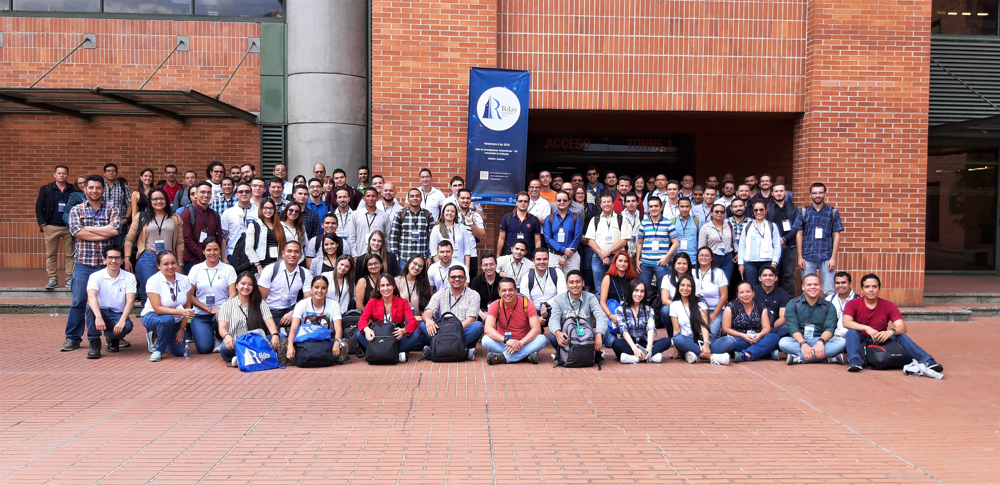
```
<section style="text-align: center;"><small>Encuentro en el [Rday 2019](https://rdaymedellin.github.io/).</small></section>
  </div>
</div>

Finalmente, el uso del `R` garantiza que otro investigador pueda repetir el experimento, comprobar los resultados obtenidos y estar en la condición de ampliar o refutar las interpretaciones del estudio realizado.

```{r, echo = FALSE, eval = TRUE, out.width = "30%", fig.align = "center"}

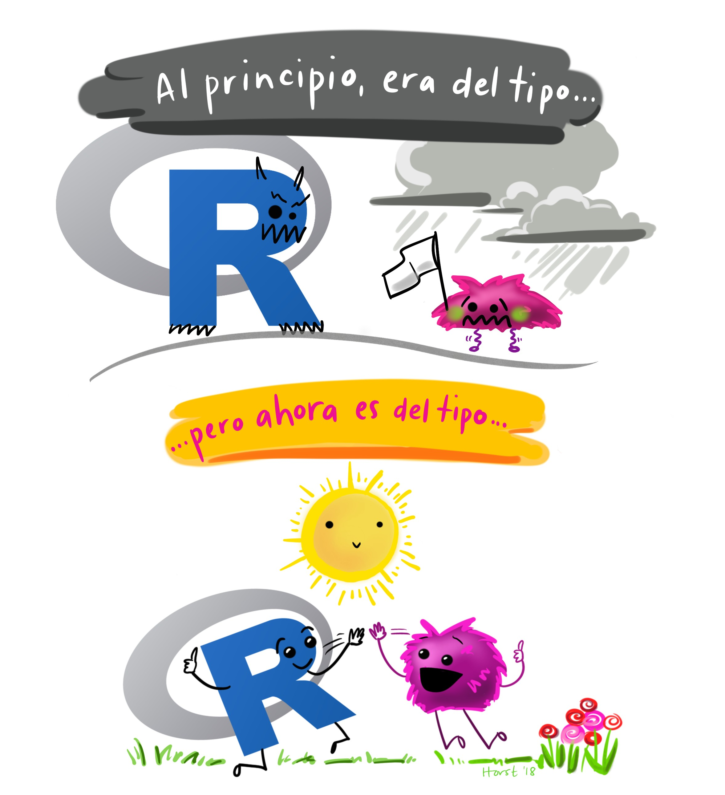
```

<section style="text-align: center;"><small>Ilustracíon hecha por <font color = "black"><u>@allison_horst</u></font>.</small></section>

__¡No se desanime!__ Los lenguajes de programación como el `R` no son sencillos de aprender, pero con trabajo y motivación vera como en poco tiempo se lograrán grandes avances. 

### 1.3 Instalación de `R` base y RStudio

`R` base es el software básico que contiene el lenguaje de programación `R`. RStudio es un software que facilita la programación en `R`.

#### `R` base:

<div class="row">
  <div class="col-md-6" markdown="1">
  + Windows: la instalación de `R` base en windows se realiza a través de la [CRAN](https://cran.r-project.org/mirrors.html) (Comprehensive R Archive Network).
  + Linux: la instalación de `R` base en Linux se realiza escribiendo el siguiente código en la terminal:<br>
  <div style="background-color:#262626">
  <font color = "white"><p> sudo apt-get update</p></font>
  <font color = "white"><p> sudo apt-get install r-base r-base-dev</p></font>
  </div>
  </div>
  <div class="col-md-6" markdown="1">
```{r, echo = FALSE, eval = TRUE, out.width = "54%", fig.align = "center"}

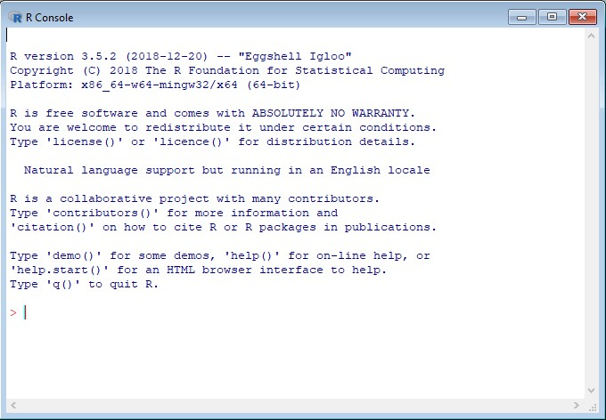
```
  </div>
</div>

#### RStudio:

<div class="row">
  <div class="col-md-6" markdown="1">
  Se puede instalar directamente desde la [página de RStudio](https://rstudio.com/products/rstudio/download/). Hay se encuentran los archivos de instalación tanto en windows como en Linux.
  
  Cuando se abre RStudio se pueden ver cuatro paneles: 
  </div>
  <div class="col-md-6" markdown="1">
```{r, echo = FALSE, eval = TRUE, out.width = "34%", fig.align = "center"}


```
  <section style="text-align: center;"><small>Ilustracíon hecha por <font color = "black"><u>@allison_horst</u></font>.</small></section>
  </div>
</div>

+ La fuente: la libreta de notas para el código

```{r, echo = FALSE, eval = TRUE, out.width = "64%", fig.align = "center"}

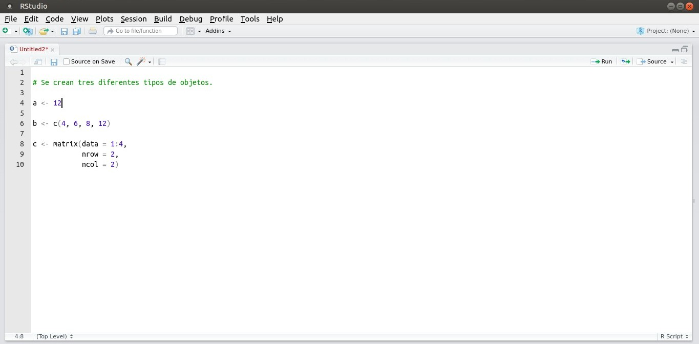
```

:::caution
Un texto insertado en el código el cual es omitido en la ejecución, se denomina como __comentario__. En `R`, un comentario es un texto que comienza con el símbolo __#__ y se extiende hasta el final de la línea. Este permite que `R` no intente interpretarlo como parte del código.
:::

+ La consola: el corazón de `R`

```{r, echo = FALSE, eval = TRUE, out.width = "64%", fig.align = "center"}

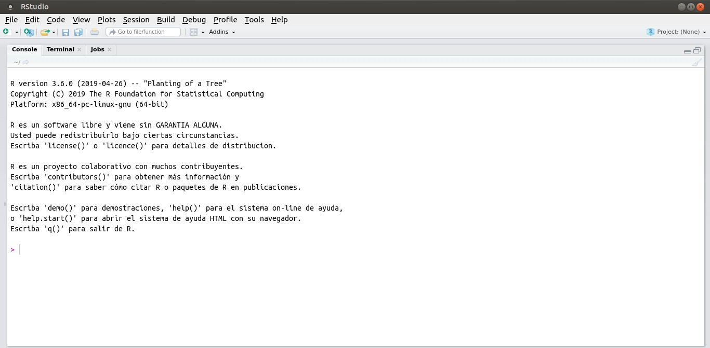
```

+ El ambiente / el historial

<div class="row">
  <div class="col-md-6" markdown="1">
```{r, echo = FALSE, eval = TRUE, out.width = "64%", fig.align = "center"}

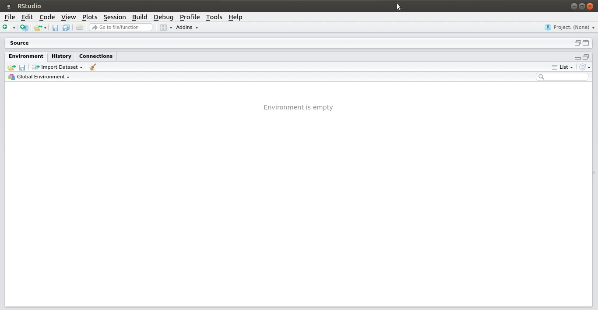
```
  </div>
  <div class="col-md-6" markdown="1">
```{r, echo = FALSE, eval = TRUE, out.width = "64%", fig.align = "center"}

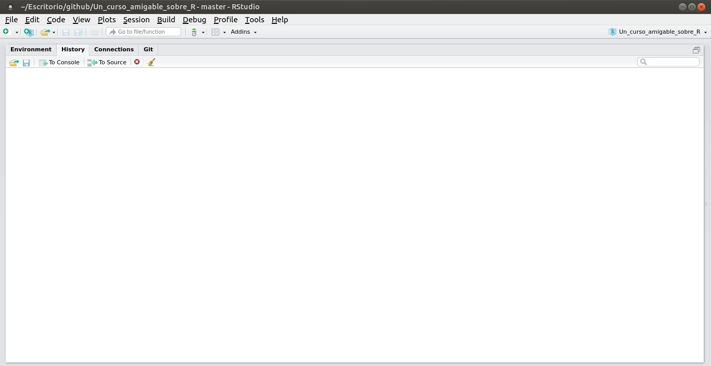
```
  </div>
</div>

+ Los archivos / las gráficas / la ayuda / los paquetes

<div class="row">
  <div class="col-md-6" markdown="1">
```{r, echo = FALSE, eval = TRUE, out.width = "64%", fig.align = "center"}

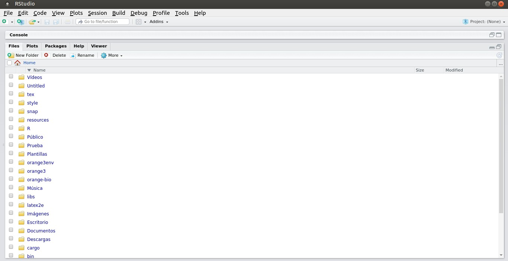
```
  </div>
  <div class="col-md-6" markdown="1">
```{r, echo = FALSE, eval = TRUE, out.width = "64%", fig.align = "center"}

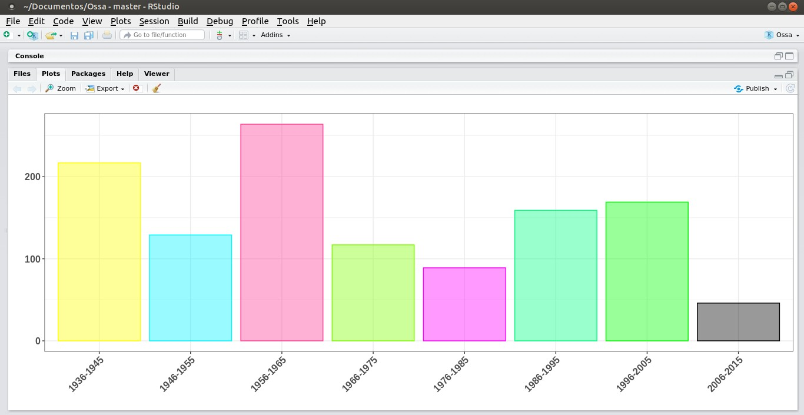
```
  </div>
</div>

<br>

<div class="row">
  <div class="col-md-6" markdown="1">
```{r, echo = FALSE, eval = TRUE, out.width = "64%", fig.align = "center"}

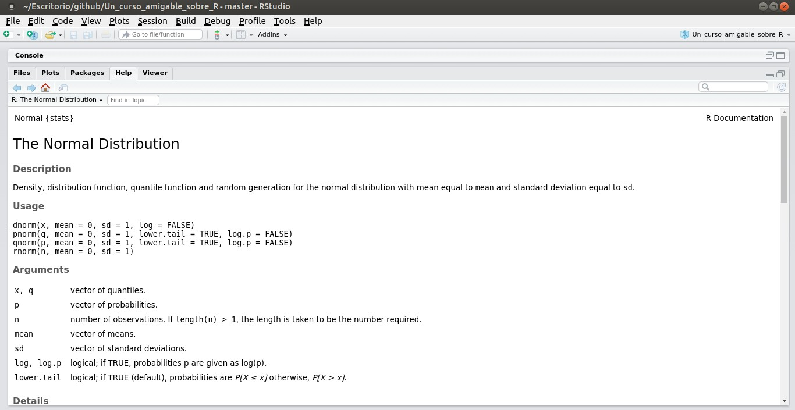
```
  </div>
  <div class="col-md-6" markdown="1">
```{r, echo = FALSE, eval = TRUE, out.width = "64%", fig.align = "center"}

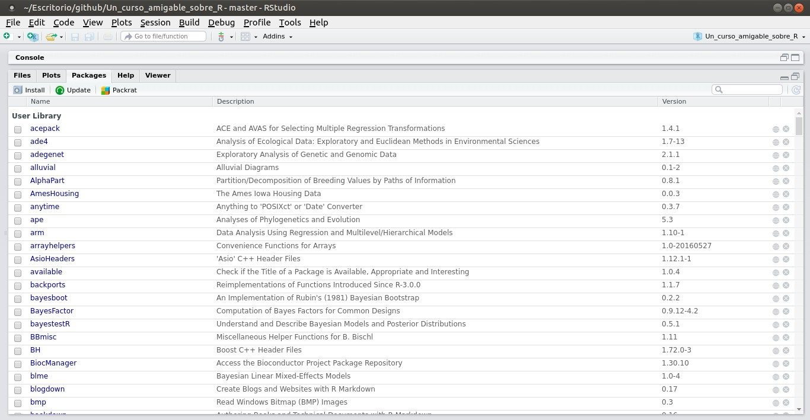
```
  </div>
</div>

### 1.4 Los paquetes en `R`

<div class="row">
  <div class="col-md-5" markdown="1">
Los paquetes en `R` son colecciones de funciones y conjunto de datos desarrollados por la comunidad. Un paquete de `R` incluye código, documentación para su uso y conjuntos de datos.

Existen dos formas de instalar nuevos paquetes en `R`:

1) Descargarlos de la [CRAN](https://cran.r-project.org/mirrors.html) (Comprehensive R Archive Network) por medio de la función `install.packages()`.

:::example
#### Ejemplo 1.4.1
:::
  </div>
  <div class="col-md-7" markdown="1">
```{r, echo = FALSE, eval = TRUE, out.width = "62%", fig.align = "center"}

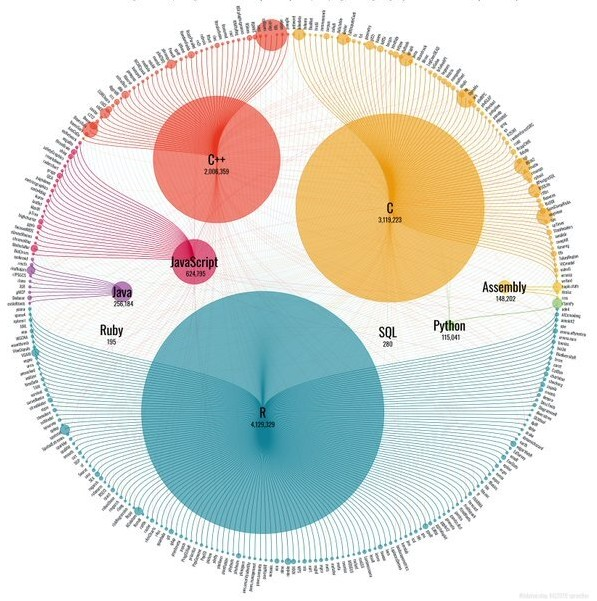
```
<section style="text-align: center;"><small>Ilustracíon hecha por <font color = "black"><u>@spren9er</u></font>.</small></section>
  </div>
</div>

```{r addition_4, exercise = TRUE}

install.packages('tidyr', 'dplyr', 'ggplot2')
```

2) Mediante el uso del paquete `devtools`, el cual permite instalar paquetes alojados en distintos servidores:

  + `install_bioc()` desde [Bioconductor](https://www.bioconductor.org/),
  + `install_cran()` desde [CRAN](https://cran.r-project.org/index.html),
  + `install_git()` desde un repositorio [git](https://git-scm.com/),
  + `install_github()` desde [GitHub](https://github.com/).

:::example
#### Ejemplo 1.4.2
:::

```{r addition_5, exercise = TRUE}

install.packages('devtools')
devtools::install_github('tidyverse/dplyr')
```

Una vez haya instalado un paquete, estará en la computadora. Si se desea usar una función o un conjunto de datos del paquete instalado, debe cargar el paquete en la sesión de `R`. Para esto, existen dos formas:

1) Con la notación `nombrepaquete::nombrefunción()` para hacer un uso temporal de la función o conjunto de datos.

:::example
#### Ejemplo 1.4.3
:::

```{r addition_8, exercise = TRUE}

dplyr::starwars
```

:::caution
Una ventaja del método anterior es que es inmediatamente claro para cualquier persona que lea el código qué paquete contiene la función. Sin embargo, un inconveniente es que si usa una función de un paquete con frecuencia, lo obliga a volver a escribir constantemente el nombre del paquete.
:::

2) Cargándolo en la memoria del computador mediante el uso de la función `library()` si su uso es permanente.

:::example
#### Ejemplo 1.4.4
:::

```{r addition_9, exercise = TRUE}

library(dplyr)
Datos_starwars <- starwars
```

Para acceder a la descripción de un paquete desde `R` se puede emplear las funciones `packageDescription()` y `help()`.

:::example
#### Ejemplo 1.4.5
:::

```{r addition_6, exercise = TRUE}

packageDescription('dplyr')
help(package = 'dplyr')
```

Otras funciones que permiten la gestión de los paquetes instalados en el computador:

```{r addition_7, exercise = TRUE}

installed.packages() # Para ver que paquetes se tienen instalados.
remove.packages('dplyr') # Si se desease eliminar un paquete (en este caso el paquete dplyr).
old.packages() # Para comprobar que paquetes necesitan ser actualizados.
update.packages() # Para actualizar todo los paquetes instalados.
```

### 1.5 Trabajando con proyectos

Un __directorio de trabajo__ en `R` es el lugar en la computadora en el que se encuentran los archivos con los que se esta trabajando. Es el lugar donde `R` buscara los archivos para importarlos y al que serán exportados.

Con la función `getwd()` se puede encontrar el directorio en el que se esta trabajando.

:::example
#### Ejemplo 1.5.1
:::

```{r addition_10, exercise = TRUE}

getwd() # Da como resultado la ruta "/home/leo/Escritorio/github/Un_curso_amigable_sobre_R".
```

Para cambiar el directorio de trabajo se puede emplear la función `setwd()`, dando como argumento la ruta del directorio que se quiere usar. 

:::example
#### Ejemplo 1.5.2
:::

```{r addition_11, exercise = TRUE}

setwd(dir = "/home/leo/Escritorio/Curso_estadística") # Se cambia el directorio de trabajo a la carpeta Curso_estadistica.
```

Sin embargo como señala [Jenny Bryan](https://www.tidyverse.org/blog/2017/12/workflow-vs-script/), con la función `setwd()` es practicamente imposible para cualquier otra persona que no sea el autor original del código `R`, en su computadora, hacer que las rutas de archivo funcionen.<!--"La posibilidad de que el comando setwd() tenga el efecto deseado (hacer que las rutas de archivo funcionen) para cualquier persona además de su autor es 0%. También es poco probable que funcione para el autor dentro de uno o dos años o para computadoras a partir de ahora. El proyecto no es autónomo y portátil. Para recrear y tal vez extender esta trama, el destinatario afortunado deberá editar manualmente uno o más caminos para reflejar dónde ha aterrizado el proyecto en su máquina. Cuando haces esto por 73a vez en 2 días, mientras marcas una tarea, comienzas a fantasear con encender la computadora del perpetrador."--> La solución consistiría en trabajar con __proyectos__. 

<div class="row">
  <div class="col-md-5" markdown="1">
  Un proyecto es un directorio de trabajo nombrado como un archivo __.Rproj__. Cuando se abre un proyecto, el directorio de trabajo se establecerá automáticamente en el directorio en el que se encuentra el archivo __.Rproj__.
  
  El archivo __.Rproj__ se puede crear yendo a "File" (archivo) &#8594; "New Project..." (nuevo proyecto) en RStudio, que luego se asocia con la carpeta o directorio especificado. 
  
  Configurar un directorio de trabajo correctamente también ayuda a desarrollar buenos hábitos que conducen a un __análisis reproducible__.
  </div>
  <div class="col-md-7" markdown="1">
```{r, echo = FALSE, eval = TRUE, out.width = "60%", fig.align = "center"}

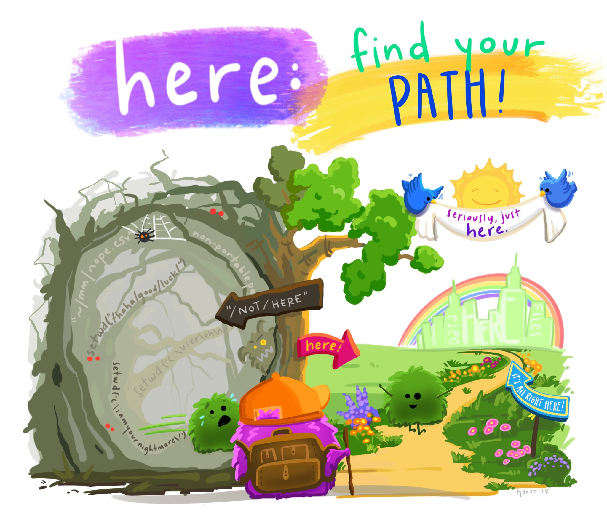
```

<section style="text-align: center;"><small>Ilustracíon hecha por <font color = "black"><u>@allison_horst</u></font>.</small></section>
  </div>
</div>

#### Estructurando el directorio de trabajo

Además de usar proyectos, también es una buena práctica estructurar el directorio de una manera que ayude a cualquier persona con la que se esta colaborando, o una versión futura de usted intente reproducir algunos análisis.

```{r, eval = TRUE, echo = FALSE, fig.align = 'center', message = FALSE, fig.showtext = TRUE, out.width = '520'}

carpeta <- readJPEG('images/imagen_carpeta.jpg', native = TRUE)
carpeta <- rasterGrob(carpeta, interpolate = FALSE)

rstudio_imagen <- readJPEG('images/rstudio.jpg', native = TRUE)
rstudio_imagen <- rasterGrob(rstudio_imagen, interpolate = FALSE)

data.frame(
  x = c(1.0:5.0), y = c(1.0:5.0)
) %>%
  ggplot(aes(x, y)) +
  geom_blank() +
  annotation_custom(carpeta, xmin = 1.0, xmax = 1.7, ymin = 4.3, ymax = 5.0) +
  annotate(geom = 'text', x = 2.3, y = 4.72, label = 'Nombre de la carpeta del proyecto', family = 'gochi', size = 10.4, colour = 'black') +
  annotate(geom = 'rect', xmin = 1.33, xmax = 1.38, ymin = 1.43, ymax = 4.3, colour = 'black', fill = 'gray34') +
  annotation_custom(rstudio_imagen, xmin = 1.65, xmax = 2.15, ymin = 3.9, ymax = 4.4) +
  annotate(geom = 'rect', xmin = 1.38, xmax = 1.74, ymin = 4.13, ymax = 4.18, colour = 'black', fill = 'gray34') +
  annotate(geom = 'text', x = 2.36, y = 4.15, label = 'Archivo .Rproj', family = 'gochi', size = 10.4, colour = 'black') +
  annotation_custom(carpeta, xmin = 1.65, xmax = 2.15, ymin = 3.4, ymax = 3.9) +
  annotate(geom = 'rect', xmin = 1.38, xmax = 1.74, ymin = 3.63, ymax = 3.68, colour = 'black', fill = 'gray34') +
  annotate(geom = 'text', x = 2.21, y = 3.65, label = 'Datos', family = 'gochi', size = 10.4, colour = 'black') +
  annotation_custom(carpeta, xmin = 1.65, xmax = 2.15, ymin = 2.9, ymax = 3.4) +
  annotate(geom = 'rect', xmin = 1.38, xmax = 1.74, ymin = 3.13, ymax = 3.18, colour = 'black', fill = 'gray34') +
  annotate(geom = 'text', x = 2.25, y = 3.15, label = 'Código', family = 'gochi', size = 10.4, colour = 'black') +
  annotate(geom = 'rect', xmin = 1.85, xmax = 1.88, ymin = 1.86, ymax = 2.9, colour = 'black', fill = 'gray34') +
  annotation_custom(carpeta, xmin = 2.05, xmax = 2.45, ymin = 2.5, ymax = 2.9) +
  annotate(geom = 'rect', xmin = 1.88, xmax = 2.12, ymin = 2.71, ymax = 2.76, colour = 'black', fill = 'gray34') +
  annotate(geom = 'text', x = 2.63, y = 2.74, label = 'Funciones', family = 'gochi', size = 10.4, colour = 'black') +
  annotation_custom(rstudio_imagen, xmin = 2.05, xmax = 2.45, ymin = 2.1, ymax = 2.5) +
  annotate(geom = 'rect', xmin = 1.88, xmax = 2.12, ymin = 2.3, ymax = 2.35, colour = 'black', fill = 'gray34') +
  annotate(geom = 'text', x = 2.64, y = 2.34, label = 'Análisis A', family = 'gochi', size = 10.4, colour = 'black') +
  annotation_custom(rstudio_imagen, xmin = 2.05, xmax = 2.45, ymin = 1.7, ymax = 2.1) +
  annotate(geom = 'rect', xmin = 1.88, xmax = 2.12, ymin = 1.86, ymax = 1.91, colour = 'black', fill = 'gray34') +
  annotate(geom = 'text', x = 2.64, y = 1.94, label = 'Análisis B', family = 'gochi', size = 10.4, colour = 'black') +
  annotation_custom(carpeta, xmin = 1.65, xmax = 2.15, ymin = 1.2, ymax = 1.7) +
  annotate(geom = 'text', x = 2.3, y = 1.5, label = 'Resultados', family = 'gochi', size = 10.4, colour = 'black') +
  annotate(geom = 'rect', xmin = 1.38, xmax = 1.74, ymin = 1.43, ymax = 1.48, colour = 'black', fill = 'gray34') +
  annotate(geom = 'rect', xmin = 1.85, xmax = 1.88, ymin = 0.62, ymax = 1.2, colour = 'black', fill = 'gray34') +
  annotation_custom(carpeta, xmin = 2.05, xmax = 2.45, ymin = 0.8, ymax = 1.2) +
  annotation_custom(carpeta, xmin = 2.05, xmax = 2.45, ymin = 0.4, ymax = 0.8) +
  annotate(geom = 'rect', xmin = 1.88, xmax = 2.12, ymin = 1.02, ymax = 1.07, colour = 'black', fill = 'gray34') +
  annotate(geom = 'rect', xmin = 1.88, xmax = 2.12, ymin = 0.62, ymax = 0.67, colour = 'black', fill = 'gray34') +
  annotate(geom = 'text', x = 2.56, y = 1.0, label = 'Gráficos', family = 'gochi', size = 10.4, colour = 'black') +
  annotate(geom = 'text', x = 2.55, y = 0.6, label = 'Datos', family = 'gochi', size = 10.4, colour = 'black') +
  scale_x_continuous(limits = c(1, 4.0)) +
  theme_void() +
  theme(axis.text = element_blank(),
        axis.ticks = element_blank(),
        axis.title = element_blank())
```

## 2. Operaciones básicas en R

Antes de realizar operaciones sobre algunos objetos en `R`, veamos cuales de estas podemos realizar.

* Suma y diferencia (+, -)
* Producto y división (*, /)
* Potencia (^, **)
* Residuo (%%)
* Mayor, mayor o igual, menor, menor o igual, igual y diferente que (>, >=, <, <=, ==, !=)
* Conjunción (&, &&), disyunción (|, ||)

### Indexación

Dentro de los múltiples objetos de `R` sean estos simples como un vector o compuestos como un dataframe debemos tener claro el manejo de nuestra información, por lo cual es necesario saber cómo acceder a ella, segmentarla, seleccionarla y/o cambiarla. Para cualquiera de los casos se utiliza la indexación, lo cual significa que los elementos de nuestros objetos están identificados usualmente mediante un índice entero que inicia con el número uno `[1]`.

En las secciones posteriores se explorará cada objeto con detalle, abordando las distintas operaciones que se pueden realizar sobre cada uno de ellos incluyendo la segmentación, selección y modificación.


<div class="row">
  <div class="col-md-6" markdown="1">
```{r,echo=F, comment=""}
print("[1][2][3][4][5][6][7][8][9]")
11:19
```
  </div>
  <div class="col-md-6" markdown="1">
```{r,echo=F,comment=""}
matrix(1:25,nrow = 5)
```
  </div>
</div>

### Coerción

Existe una forma de convertir el tipo de un vector o matriz a otro tipo y para ello se cuentan con funciones base del tipo `as.*`

+------------------+--------------------------------------+
| Función          | Acción                               |
+==================+======================================+
| `as.character()` | Convertir objetos a tipo caracter    |
+------------------+--------------------------------------+
| `as.complex()`   | Convertir objetos a tipo complejo    |
+------------------+--------------------------------------+
| `as.data.frame()`| Convertir objetos a tipo dataframe   |
+------------------+--------------------------------------+
| `as.Date()`      | Convertir objetos a tipo fecha       |
+------------------+--------------------------------------+
| `as.double()`    | Convertir objetos a tipo doble       |
+------------------+--------------------------------------+
| `as.factor()`    | Convertir objetos a tipo factor      |
+------------------+--------------------------------------+
| `as.integer()`   | Convertir objetos a tipo entero      |
+------------------+--------------------------------------+
| `as.list()`      | Convertir objetos a tipo lista       |
+------------------+--------------------------------------+
| `as.logical()`   | Convertir objetos a tipo lógico      |
+------------------+--------------------------------------+
| `as.matrix()`    | Convertir objetos a tipo matriz      |
+------------------+--------------------------------------+
| `as.numeric()`   | Convertir objetos a tipo numérico    |
+------------------+--------------------------------------+
| `as.POSIXct()`   | Convertir objetos a tipo fecha y hora|
+------------------+--------------------------------------+
| `as.vector()`    | Convertir objetos a tipo vector      |
+------------------+--------------------------------------+

### Funciones de prueba 

En algunos casos diferenciar o reconocer el tipo de un vector o matriz que se tiene no es tan simple, en estos casos se utiliza la función `typeof()`, sin embargo existe también la opción de utilizar funciones que devuelvan valores de `TRUE` o `FALSE`.  En las funciones base de `R` se encuentran funciones del tipo `is.*`. Una alternativa a las funciones base de `R` son las del paquete **purr** los cuales son del tipo `is_*`

+------------------+-----------------+
| R base           | purr            |
+==================+=================+
| `is.logical()`   | `is_logical()`  |
+------------------+-----------------+
| `is.integer()`   | `is_integer()`  |
+------------------+-----------------+
| `is.double()`    | `is_double()`   |
+------------------+-----------------+
| `is.numeric()`   | `is_numeric()`  |
+------------------+-----------------+
| `is.character()` | `is_character()`|
+------------------+-----------------+
| `is.list()`      | `is_list()`     |
+------------------+-----------------+
| `is.vector()`    | `is_vector()`   |
+------------------+-----------------+

### Funciones útiles

En `R` se cuenta con las conocidas funciones base, muchas con utilidades matemáticas o estadísticas. A continuación podra ver algunas de ellas los cuales pueden ser muy útiles en cualquier proyecto de análisis. 

+-------------+-------------------------------------------------------------------+
| Función     | Acción                                                            |
+=============+===================================================================+
| `str()`     | Devuelve la estructura de un objeto                               |
+-------------+-------------------------------------------------------------------+
| `sample()`  | Toma una muestra del tamaño especificado de determiando objeto    |
+-------------+-------------------------------------------------------------------+
| `length()`  | Calcula el número de elementos del objeto                         |
+-------------+-------------------------------------------------------------------+
| `table()`   | Devuelve tablas de contingencia de conteos                        |
+-------------+-------------------------------------------------------------------+
| `sort()`    | Ordena los elementos ascendentemente                              |
+-------------+-------------------------------------------------------------------+
| `round()`   | Redondea los valor sin decimales por defecto                      |
+-------------+-------------------------------------------------------------------+
| `floor()`   | Devuelve el entero más grande que no sea mayor que el número dado |
+-------------+-------------------------------------------------------------------+
| `sqrt()`    | Calcula la raíz cuadrada de un vector numérico                    |
+-------------+-------------------------------------------------------------------+
| `sum()`     | Calcula la suma de los elementos del objeto                       |
+-------------+-------------------------------------------------------------------+
| `prod()`    | Calcula la producto de los elementos del objeto                   |
+-------------+-------------------------------------------------------------------+
| `abs()`     | Devuelve el valor absoluto de un vector numérico                  |
+-------------+-------------------------------------------------------------------+
| `mean()`    | Calcula la media de un vector numérico                            |
+-------------+-------------------------------------------------------------------+
| `median()`  | Calcula la media de un vector numérico                            |
+-------------+-------------------------------------------------------------------+
| `sd()`      | Calcula la desviacion estandar de un vector numérico              |
+-------------+-------------------------------------------------------------------+
| `IQR()`     | Calcula el rango intercuartílico de un vector numérico            |
+-------------+-------------------------------------------------------------------+
| `var()`     | Calcula la varianza estandar de un vector numérico                |
+-------------+-------------------------------------------------------------------+
| `cor()`     | Calcula la correlación de dos vectores numéricos                  |
+-------------+-------------------------------------------------------------------+
| `quantile()`| Devuelve los cuantiles seleccionados de un vector numérico        |
+-------------+-------------------------------------------------------------------+

<details><summary>2.1 Operaciones con vectores</summary> 

Antes de iniciar con ejemplos y ejercicios se debe tener presente que un vector es una colección de elementos de la misma clase atómica, es decir que un vector puede contener `n` elementos del mismo tipo, ya sean estos números, caracteres, factores o lógicos, y nunca podrán ser de dos o más tipos. A medida que vea los ejemplos y realice los ejercicios aprenderá distintas formas de crear vectores.

A continuación podra observar vectores con distintas clases atómicas y qué sucede si intenta mezclarlas.

:::example
#### Ejemplo 2.1.1
:::

```{r addition_211, exercise = TRUE}
#Vector numérico
num <- c(1, 2, 3, 4, 5)
num
#Vector de caracteres
let <- c("a", "b", "c", "d", "e", "f")
let
#Vector de Factores
fac <- factor(c("f1", "f2", "f3", "f2", "f1"))
fac
#Vector logico
log <- c(TRUE, FALSE, TRUE, TRUE, TRUE, FALSE)
log
#mezcla de clases atomicas
c(num, let)
c(num, log)
```

Como vio en la última parte, al mezclar dos clases atómicas no se obtiene un error. Sin embargo los vectores mezclados toman la clase solo de uno de ellos (la más compleja). En el primero, los números de `num` quedan entre comillas, lo cual implica que ahora son caracteres, de igual forma en el vector de valores lógicos `log`, los elementos son convertidos a su equivalente numérico.

A continuación se plantea un ejemplo en el cual se genera un vector de prueba, y con el mismo se realizará algunas operaciones aritméticas básicas como suma, resta, división, multiplicación y exponenciación.

Operaciones de suma.

:::example
#### Ejemplo 2.1.2
:::

```{r addition_212, exercise = TRUE}
#Vector de prueba
x <- c(1:8)
x
#Suma sobre cada elemento del vector de prueba
test_1 <- x + 2
test_1
#Suma repetitiva sobre los elementos del vector de prueba
test_2 <- x + c(10, 20)
test_2
#Suma uno a uno sobre nuestro vector de prueba 
test_3 <- x + c(8:1) 
test_3
```

De igual forma se puede utilizar la resta. Te invito a que restablezcas el vector de prueba `x` a partir de los vectores test_1, test_2, test_3. Para ello copia los vectores del fragmento de código anterior y crear de nuevo el vector `x`. __¡Vamos confio en que podrás hacerlo!__

:::exercise
#### Ejercicio 2.1.1
:::

```{r exe_211, exercise = TRUE}
test_1 <- c(1:8) + 2
test_2 <- c(1:8) + c(10, 20)
test_3 <- c(1:8) + 8:1
# Ahora es tu turno
```

```{r exe_211-solution}
test_1 - 2
test_2 - c(10, 20)
test_3 - 8:1
```

```{r exe_211-check}
grade_code("Excelente lo lograste, sigamos adelante")
```

Vamos ahora con la operación de producto. 

:::example
#### Ejemplo 2.1.3
:::

```{r addition_213, exercise = TRUE}
#Vector de prueba
y <- seq(2, 20, 2)
y
#Producto sobre cada elemento del vector de prueba
test_1 <- y*2
test_1
#Producto repetitivo sobre los dos elementos del vector de prueba
test_2 <- y * c(5, 7)
test_2
#Producto uno a uno sobre nuestro vector de prueba 
test_3 <- y * 10:1 
test_3
```

Ya que vimos cómo funciona el producto en `R`, te propongo que utilizando la operación inversa restablezcas el vector de prueba `y`. __¡Intentalo, se que podrás hacerlo!__

:::exercise
#### Ejercicio 2.1.2
:::

```{r exe_212, exercise = TRUE}
test_1 <- seq(2, 20, 2) * 2
test_2 <- seq(2, 20, 2) * c(5, 7)
test_3 <- seq(2, 20, 2) * 10:1 
# Ahora es tu turno
```

```{r exe_212-solution}
test_1 / 2
test_2 / c(10, 20)
test_3 / 10:1
```

```{r exe_212-check}
grade_code("Excelente lo lograste, sigamos adelante")
```

Hagamos un ejercicio un poco más corto para la potenciación y su operación inversa. Para esto, calcule la séptima potencia del 4 y la raíz cúbica del 27. Te dejamos un par de ejemplos para que puedas guiarte. 

:::exercise
#### Ejercicio 2.1.3
:::

```{r exe_213, exercise = TRUE}
8**5
16**(1/4)
# Ahora es tu turno
```

```{r exe_213-solution}
4**7
27**(1/3)
```

```{r exe_213-check}
grade_code("Excelente lo lograste, sigamos adelante")
```

Ahora hagamos un par de ejercicios de operaciones lógicas, los cuales son muy útiles  en cualquier campo de la programación y del análisis. Crearemos un vector de prueba y de él seleccionaremos los elementos que cumplan la condición específica de ser menores a 20.

:::example
#### Ejemplo 2.1.4
:::

```{r addition_214, exercise = TRUE}
#Vector de prueba
vec <- seq(1, 100, length.out = 20)
vec
#Condición
filt_1 <- vec < 20
filt_1
#Selección
vec_filt <- vec[filt_1]
vec_filt
```

Encontremos ahora dentro de un vector de prueba los números diferentes de los pares, de igual manera te invito a que encuentres los números pares modificando el ejercicio planteado.

:::exercise
#### Ejercicio 2.1.4
:::

```{r exe_214, exercise = TRUE}
#Vector de prueba
vec <- seq(1, 150, 3)
vec
#Condición y selección
vec[vec%%2 != 0]
# Ahora es tu turno
```

```{r exe_214-solution}
vec[vec%%2 == 0]
```

```{r exe_214-check}
grade_code("Excelente lo lograste, sigamos adelante")
```

Veamos ahora una ejercicio con dos condiciones simultáneas y deberás realizar una operación similar para nuestro vector de prueba, en el cual elegirás los valores mayores a 15 y menores a 80.

* `r fa("far fa-sticky-note")`Recuerda los operadores lógicos que nombramos en la parte inicial de esta sección.

:::exercise
#### Ejercicio 2.1.5
:::

```{r exe_215, exercise = TRUE}
#Vector de prueba
vec <- seq(1, 100, length.out = 20)
vec
#Condición y selección
vec[vec>90 | vec<45]
# Ahora es tu turno
```

```{r exe_215-solution}
vec[vec>15 &  vec<80]
```

```{r exe_215-check}
grade_code("Excelente lo lograste, sigamos adelante")
```

Trabajemos ahora algunos ejercicios de indexación que nos permitan segmentar y modificar nuestros vectores. Veamos cómo tomar una sección de nuestro vector de prueba y además modificar algunos de sus valores.

* `r fa("far fa-sticky-note")`Recuerda que la indexación en `R` inicia con uno `[1]`

:::example
#### Ejemplo 2.1.5
:::

```{r addition_215, exercise = TRUE}
#Vector de prueba
vec <- letters
vec
#Seleccion
vec[1:10] #primeras 10 letras
vec[-16:-1] # ultimas 10 letras 
#Modificación
vec[1] = "letra.a" #solo la primera posición
vec
vec[c(1, 26)] = c("la.letra.a","la.letra.z") #multiples posiciones
vec
```

Exclusivamente para los ejemplos de selección de los primeros y los últimos elementos de un objeto se pueden utilizar las funciones `head()`  y `tail()`, respectivamente. 

```{r addition_2151, exercise = TRUE}
#Vector de prueba
vec <- letters
#Seleccion
head(vec, 10)#primeras 10 letras
tail(vec, 10)#ultimas 10 letras 
```

Observemos un ejemplo en el que se acceda a elementos de un vector para hacer operaciones con estos.

:::example
#### Ejemplo 2.1.6
:::

```{r addition_216, exercise = TRUE}
#Vectores de prueba
vec1 <- 20:40
vec2 <- letters
#Operaciones
vec1[5] + vec1[21] #operaciones aritmeticas uno a uno
vec1[c(5, 10)] + vec1[c(18, 21)] #operaciones aritmeticas 
paste0(vec2[3], vec2[18], vec2[1], vec2[14]) #concatenar caracteres 
```

Como último ejemplo de esta sección visualicemos las conversiones y veamos su efectividad utilizando las funciones de prueba.

:::example
#### Ejemplo 2.1.7
:::

```{r addition_217, exercise = TRUE}
#Vectores de prueba
vec1 <- 20:40
vec2 <- letters
vec3 <- c(TRUE, FALSE, TRUE, TRUE, TRUE, FALSE)
#conversiones
test_1 <- as.character(vec1)
test_2 <- as.factor(vec2)
test_3 <- as.numeric(vec3)
#funciones de prueba
is.character(test_1)
is.factor(test_2)
is.numeric(test_3)
```

Como último ejercicio de esta sección deberás generar dos vectores uno que corresponda a la secuencia de números de 50 a 75 con una longitud de 20 elementos y otro vector con los números del 35 al -8. Estos vectores tendrán el nombre de `vec1` y `vec2`, respectivamente. `filt1` será un vector que cumpla la condición de números mayores a 64 de `vec1`, mientras que `filt2` será la selección de los números pares de `vec2`. Para `filt1` calcularemos la media y para `filt2` obtendremos la suma de los valores absolutos de las posiciones 2, 3, 7, 19, 20, 21 y 22. 

* `r fa("far fa-sticky-note")` Recuerda lo aprendido anteriormente y ten presente las funciones útiles nombradas al inicio de esta sección. 

:::exercise
#### Ejercicio 2.1.6
:::

```{r exe_216, exercise = TRUE}
#Vector de prueba
vec1 <- 
vec2 <- 
filt_1 <- 
filt_2 <- 
```

```{r exe_216-solution}
vec1 <- seq(50, 75, length.out = 20)
vec2 <- 35:-8
filt_1 <- vec1 > 64
filt_2 <- vec2[vec2 %% 2 == 0 ]
mean(filt1)
sum(abs(filt_2[c(2, 3, 7, 19:22)]))
```

```{r exe_216-check}
grade_code("Excelente lo lograste, sigamos adelante")
```

</details>

<details><summary>2.2 Operaciones con matrices </summary> 

Ahora trabajaremos con las matrices, que desde la perspectiva de `R` son vectores con el atributo `dim` definido como un vector entero de dos elementos: número de filas y número de columnas. Las matrices son útiles para almacenar muchos datos y son bastante similares a las hojas de cálculo de Excel, puede pensar en ellas como un conjunto de `n` vectores de la misma longitud.

En lo que se refiere a matrices, la indexación funciona nombrando primero las filas y después las columnas, de tal forma que teniendo una matriz `M` de dimensiones `mxn` se tendran `m` filas y `n` columnas. Si utiliza el comando `M[1,]` obtendra la primera fila  y al utilizar `M[,1]` obtendra la primera columna. Más adelante abordaremos ejercicios que nos permitan manejar e identificar las columnas y filas de una matriz.

<div class="row">
  <div class="col-md-6" markdown="1">
```{r,echo=F, comment=""}
matrix(1:25, nrow = 5)
```
  </div>
  <div class="col-md-6" markdown="1">
```{r,echo=F,comment=""}
m <- matrix(1:25, nrow = 5)
print("M[1,]")
m[1,]
print("M[,1]")
m[,1]
```
  </div>
</div>

Generalmente las matrices en `R` tienen connotación matemática y pese a ser utilizadas para almacenar información, debe recordar que todos sus elementos sólo pueden pertenecer a un solo tipo ya sea numérico, lógico o caracter. Teniendo presente esto veamos los operadores y funciones que pueden resultarnos útiles en el contexto matemático y operativo de `R`. 

+---------------+---------------------------------+
| Función       | Acción                          |
+===============+=================================+
| `dim(M)`      | Dimesión de la matriz           |
+---------------+---------------------------------+
| `t(M)`        | Transpuesta de la matriz        |
+---------------+---------------------------------+ 
| `det(M)`      | Determinate de la matriz        |
+---------------+---------------------------------+
| `solve(M)`    | Inversa de la matriz            |
+---------------+---------------------------------+
| `diag(M)`     | Diagonal de la matriz           |
+---------------+---------------------------------+
| `M1%*%M2`     | Producto matricial              |
+---------------+---------------------------------+
| `colSums(M)`  | Suma por colunnas de la Matriz  |
+---------------+---------------------------------+
| `rowSums(M)`  | Suma por filas de la Matriz     |
+---------------+---------------------------------+
| `colMeans(M)` | Media por colunnas de la Matriz |
+---------------+---------------------------------+
| `rowMeans(M)` | Media por filas de la Matriz    |
+---------------+---------------------------------+
| `cbind()`     | Unir vectores por columnas      |
+---------------+---------------------------------+
| `rbin()`      | Unir vectores por filas         |
+---------------+---------------------------------+

Generemos una matriz de prueba y realicemos algunas operaciones sobre esta, recordando que podemos operar sobre filas y/o columnas. Iniciemos con operaciones aritméticas básicas con vectores.

:::example
#### Ejemplo 2.2.1
:::

```{r addition_221, exercise = TRUE}
#Matriz de prueba
m <- matrix(11:30, nrow = 5)
m
#Producto sobre cada elemento de la matriz de prueba
test_1 <- m*3
test_1
#Potencia repetitiva sobre los elementos de la matriz de prueba (columna)
test_2 <- m **c(2, 3)
test_2
#Suma sobre la matriz de prueba (columna)
test_3 <- m + seq(7, 1, length.out = 20) 
test_3
```

Ahora veamos cómo funcionan las operaciones entre matrices.

:::example
#### Ejemplo 2.2.2
:::

```{r addition_222, exercise = TRUE}
#Matriz de prueba 1
m1 <- 21:40
dim(m1) <- c(5, 4)
#Matriz de prueba 2
m2 <- cbind(1:5, 6:10, 11:15, 16:20)
#suma de matrices
m1 + m2
#Producto uno a uno
m1*m2
#Producto matricial
m1 %*% t(m2)
```

Tratemos de ver otras operaciones directamente con ejercicios. Te invito a que generes la matrices `m1` del ejercicio anterior utilizando la función `rbind()` y `m2` utilizando la función `matrix()`, y posteriormente calcules el producto matricial de `m1` traspuesta con `m2` nombrandolo `m3`. Por último calcula la suma de la diagonal de `m3`.

:::exercise
#### Ejercicio 2.2.1
:::

```{r exe_221, exercise = TRUE}
#Matriz de prueba 1
m1 <- 
#Matriz de prueba 2
m2 <-
#Producto Matricial
m3 <- 
#suma de la diagonal
```

```{r exe_221-solution}
#Matriz de prueba 1
m1 <- rbind(seq(21, 36, 5),
            seq(22, 37, 5),
            seq(23, 38, 5),
            seq(24, 39, 5),
            seq(25, 40, 5))
#Matriz de prueba 2
m2 <- matrix(1:20, nrow = 5)
#Producto Matricial
m3 <- t(m1) %*% m2 
#suma de la diagonal
sum(diag(m3))
```

```{r exe_221-check}
grade_code("Excelente lo lograste, sigamos adelante")
```

En el siguiente ejemplo, calcularemos la suma de los valores de cada columna y determinaremos su representación en porcentaje de la suma calculada. El porcentaje lo aproximáremos a dos cifras decimales y haremos un ejercicio de indexación con este resultado, imprimiendo un vector con los resultados de la diagonal.

:::example
#### Ejemplo 2.2.3
:::

```{r addition_223, exercise = TRUE}
#Matriz de prueba 1
m <- matrix(seq(18, 2, length.out = 16), ncol = 4, byrow = TRUE)
m
#suma de cada columnas
tcol <- colSums(m)
tcol
#Porcentaje de cada columna
pm <- cbind(m[,1]/tcol[1],
            m[,2]/tcol[2],
            m[,3]/tcol[3],
            m[,4]/tcol[4])
pm <- round(pm*100, 2)
pm
#Diagonal con funcion
diag(pm)
#diagonal con índice
c(pm[1,1],pm[2,2],pm[3,3],pm[4,4])
```

Hagamos un ejercicio similar al ejemplo anterior. Para ello usaremos la matriz `m` y calcularemos en `pm` el porcentaje aproximado a tres cifras decimales que cada elemento representa de la suma de cada fila. Con él debemos imprimir un vector con los resultados de la diagonal secundaria.

:::exercise
#### Ejercicio 2.2.2
:::

```{r exe_222, exercise = TRUE}
#Matriz de prueba
m <- matrix(seq(42, 2, length.out = 16), ncol = 4, byrow = TRUE)
#Suma de cada fila
tfil <-
#Porcenatje de cada fila 
pm <- 
#diagonal secundaria
c()
```

```{r exe_222-solution}
#Matriz de prueba
m <- matrix(seq(42, 2, length.out = 16),ncol = 4, byrow = TRUE)
#Suma de cada fila
tfil <- rowSums(m)
#Porcenatje de cada fila 
pm <- rbind(m[1,]/tfil[1],
            m[2,]/tfil[2],
            m[3,]/tfil[3],
            m[4,]/tfil[4])
pm <- round(pm*100,3)
#diagonal secundaria
c(pm[1,4],pm[2,3],pm[3,2],pm[4,1])
```

```{r exe_222-check}
grade_code("Excelente lo lograste, sigamos adelante")
```

Veamos otra forma de solucionar el ejercicio anterior.

```{r exe_2221, exercise = TRUE}
#Matriz de prueba
m <- matrix(seq(42, 2, length.out = 16), ncol = 4, byrow = TRUE)
#matriz transpuesta
tm <- t(m)
#suma de cada columnas,
tcol <- colSums(tm)
#Porcentaje de cada columna
pm <- cbind(tm[,1]/tcol[1],
            tm[,2]/tcol[2],
            tm[,3]/tcol[3],
            tm[,4]/tcol[4])
pm <- round(pm*100,3)
#Diagonal con funcion
c(pm[4,1],pm[3,2],pm[2,3],pm[1,4])

```

Ahora trabajemos lo que se denomina como estandarización sobre una matriz. Para ello, calcule la media y la desviación estándar por columnas y a cada elemento de la columna correspondiente deberas restarle la media y dividir por la desviación estándar. 

:::exercise
#### Ejercicio 2.2.3
:::

```{r}
set.seed(10)
```

```{r exe_223, exercise = TRUE}
#Matriz de prueba
m <- matrix(sample(1:8, 16, replace = TRUE), ncol = 4, byrow = TRUE)
#Media
mmean <- 
#Desviación estandar
msd <-
#Estandarización
sm <- 
#Resultado
sm
```

```{r}
set.seed(20)
```

```{r exe_223-solution}
#Matriz de prueba
m <- matrix(sample(1:8, 16, replace = TRUE), ncol = 4, byrow = TRUE)
#Media
mmean <- colMeans(m)
#Desviación estandar
msd <- c(sd(m[,1]),
         sd(m[,2]),
         sd(m[,3]),
         sd(m[,4]))
#Estandarización
sm <- cbind((m[,1]-mmean[1])/msd[1],
            (m[,2]-mmean[2])/msd[2],
            (m[,3]-mmean[3])/msd[3],
            (m[,4]-mmean[4])/msd[4])  
#Resultado
sm
```

```{r exe_223-check}
grade_code("Excelente lo lograste, sigamos adelante")
```

Para tener una mayor comprensión de la indexación en las matrices, nombremos cada una de las filas y de las columnas de un matriz `m`, y llamemos las filas y las columnas individualmente, tambien los elementos individuales y por último modifiquemos algunos valores.

:::example
#### Ejemplo 2.2.4
:::

```{r addition_224, exercise = TRUE}
#Matriz de prueba 1
m <- matrix(letters[1:25], ncol = 5, byrow = TRUE)
m
#nombre de filas y columnas
rownames(m) <- c("fila1", "fila2", "fila3", "fila4", "fila5")
colnames(m) <- c("columna1", "columna2", "columna3", "columna4", "columna5")
m
#llamado filas y columnas
m["fila2",]
m[,"columna3"]
#llamado letra "r"
m["fila4", "columna3"]
m[4,3]
#modificaciones
m["fila2", "columna5"] <- "letraj"
m[5,2] <- "letrav"
m
```

Para afianzar algunos conceptos trabajaremos sobre la matriz `m`. Para esto, tendrás que calcular la suma y la media tanto por filas como por columnas, añadirlas a la matriz original utilizando `cbind`  y `rbind`, y por último nombrar cada una de las filas y de las columnas añadiendo los nombres contenidos en los vectores `rname` y `cname`

:::exercise
#### Ejercicio 2.2.4
:::

```{r}
set.seed(25)
```

```{r exe_224, exercise = TRUE}
#Matriz de prueba
m <- matrix(sample(1:16, 16), ncol = 4, byrow = TRUE)
#vectores
rname <- c("fila1", "fila2", "fila3", "fila4", "csum", "cmean")
cname <- c("columna1", "columna2", "columna3", "columna4", "fsum", "fmean")
#Nueva matriz

#nombres para la matriz 

```

```{r}
set.seed(25)
```

```{r exe_224-solution}
#Matriz de prueba
m <- matrix(sample(1:16, 16), ncol = 4, byrow = TRUE)
#vectores
rname <- c("fila1", "fila2", "fila3", "fila4", "csum", "cmean")
cname <- c("columna1", "columna2", "columna3", "columna4", "fsum", "fmean")
#Nueva matriz
m <- rbind(m, colSums(m), colMeans(m))
m <- cbind(m, rowSums(m), rowMeans(m))
#nombres para la matriz 
rownames(m) <- rname
colnames(m) <- cname
```

```{r exe_224-check}
grade_code("Excelente lo lograste, sigamos adelante")
```

Para finalizar esta sección te invito a que trabajes con la matriz `M`. Primero suma `vec1` a la primera columna de la matriz de prueba, después multiplica el elemento de la primera columna y tercera fila por 1.375, y por último multiplica la tercera columna por `vec2`. Estas operaciones deben hacerse sobre la matriz, de tal forma que al terminar las operaciones y llamar a `M`, está guarde las operaciones realizadas.

:::exercise
#### Ejercicio 2.2.5
:::

```{r exe_225, exercise = TRUE}
#Objetos de prueba
M <- matrix(seq(100, 700, length.out = 9), 3)
vec1 <- c(3, 1.5, 3)*100
vec2 <- c(1, .76, 1/1.75)
#Operaciones

M
```

```{r exe_225-solution}
#Objetos de prueba
M <- matrix(seq(100, 700, length.out = 9), 3)
vec1 <- c(3, 1.5, 1.5)*100
vec2 <- c(1, .76, 1/1.75)
#Operaciones
M[,1] <- M[,1] + vec1
M[3,1] <- M[3,1] * 1.375
M[,3] <- M[,3] * vec2
M
```

```{r exe_225-check}
grade_code("Excelente lo lograste, sigamos adelante")
```

</details>

<details><summary>2.3 Operaciones con conjuntos de datos</summary> 

Los conjuntos de datos, dataframe, son muy similares a las matrices en lo que se refiere a la indexación. Sin embargo, su principal diferencia radica en el tipo de datos que albergan. En las matrices, todos sus elementos pertenecen al mismo tipo de dato, mientras que en los dataframe cada columna puede tener un tipo de dato diferente siempre que las columnas tengan la misma longitud. Ahora creemos un dataframe a partir vectores de diferentes tipos utilizando la función `data.frame()`.

:::example
#### Ejemplo 2.3.1
:::

```{r addition_231, exercise = TRUE}
#vectores de prueba
letras <- letters[1:15]
numeros <- seq(1, 100, length.out = 15)
logicos <- c(TRUE, TRUE, FALSE, FALSE, TRUE, TRUE, TRUE, FALSE, FALSE, FALSE, FALSE, TRUE, TRUE, FALSE, FALSE)
#Dataframe
df <- data.frame(letras, numeros, logicos)
df
#Estructura
str(df)
```

Puede notar que al utilizar la función `data.frame()`, el vector de letras es convertido a factor, lo que en algunos casos puede no ser conveniente. Para evitar este problema se puede utilizar el argumento `stringsAsFactors = FALSE`.

```{r,eval=TRUE,message=FALSE,echo=FALSE}
#vectores de prueba
letras <- letters[1:15]
numeros <- seq(1, 100, length.out = 15)
logicos <- c(TRUE, TRUE, FALSE, FALSE, TRUE, TRUE, TRUE, FALSE, FALSE, FALSE, FALSE, TRUE, TRUE, FALSE, FALSE)
```

```{r,eval=FALSE}
save(letras,file = "data_pkg/letras.rda")
save(numeros,file = "data_pkg/numeros.rda")
save(logicos,file = "data_pkg/logicos.rda")
```

```{r addition_2311, exercise = TRUE}
#Dataframe
df <- data.frame(letras, numeros, logicos, stringsAsFactors = FALSE)
df
#Estructura
str(df)
```

También puede crear un dataframe a partir de matrices y vectores utilizando la coerción. En el siguiente ejercicio debes convertir los objetos de prueba a conjuntos de datos conservando sus propiedades originales. No olvides verificar su estructura.

* `r fa("far fa-sticky-note")` Recuerda la sección de coerción y las funciones allí nombradas.

:::exercise
#### Ejercicio 2.3.1
:::

```{r exe_231, exercise = TRUE}
#Objetos de prueba
m <- matrix(seq(100, 700, length.out = 9), 3)
letras <- letters[1:15]
#conversión
mdf <- 
mdf
letrasdf <- 
letrasdf
#estructura
str()
str()  
```

```{r exe_231-solution}
#Objetos de prueba
m <- matrix(seq(100, 700, length.out = 9), 3)
letras <- letters[1:5]
#conversión
mdf <- as.data.frame(m)
mdf
letrasdf <- as.data.frame(letras, stringsAsFactors = FALSE)
letrasdf
#estructura
str(mdf)
str(letrasdf) 
```

```{r exe_231-check}
grade_code("Excelente lo lograste, sigamos adelante")
```

Recordemos que los dataframe son similares a las matrices en cuanto a indexación. Para probarlo trabajaremos el siguiente ejercicio con la base de datos `Starwars`.

```{r, eval = TRUE, message = FALSE, echo = FALSE}

data("starwars")
Starwars <- starwars %>% 
  select(-c(11:14))
Starwars
```

```{r,eval=FALSE}
save(Starwars, file="data_pkg/Starwars.rda")
```

El ejercicio consiste en seleccionar las primeras 5 columnas de nuestra base de datos, seleccionar las primeras 20 filas de la columna name y por último  seleccionar las filas entre 20 y 40 para las columnas height y mass.

:::exercise
#### Ejercicio 2.3.2
:::

```{r exe_232, exercise = TRUE}
#Primeras 5 columnas
Starwars[]
#primeras 20 filas de name
Starwars[]
#filas entre 20:40 para height y mass.
Starwars[]
```

```{r exe_232-solution}
#Primeras 5 columnas
Starwars[, 1:5]
#primeras 20 filas de name
Starwars[1:20,"name"]
#filas entre 20:40 para height y mass.
Starwars[20:40, c(2, 3)]
```

```{r exe_232-check}
grade_code("Excelente lo lograste, sigamos adelante")
```

Otra posible solución a este ejercicio seria la siguiente.

```{r exe_2321, exercise = TRUE}
#Primeras 5 columnas
Starwars[, c("name", "height", "mass", "hair_color", "skin_color")]
#primeras 20 filas de name
Starwars[1:20, 1]
#filas entre 20:40 para height y mass.
Starwars[20:40, c("height","mass")]
```

Como vimos en el ejercicio anterior podemos acceder a una columna de un dataframe utilizando expresiones del tipo `Starwars[, 1]` o `Starwars[, ”name”]`, sin embargo la forma más popular y simple es utilizar la expresión `Starwars$name`. Esta última no solo permite acceder a una columna de nuestro conjunto de datos, sino que también permite crear nuevas variables. Veamos un ejemplo en el que seleccionemos la columna `species` y creemos una nueva columna que enumere nuestros datos.

:::example
#### Ejemplo 2.3.2
:::

```{r addition_232, exercise = TRUE}
#seleccion
Starwars$species
#nueva variable
Starwars$numero <- 1:87
#Nueva Starwars
Starwars
```

```{r,eval=TRUE,message=FALSE,echo=FALSE}
Starwars$numero <- 1:87
```

Veamos en acción la función `table()` para conocer el numero de individuos por especies de la base de datos Starwars.

```{r addition_2321, exercise = TRUE,comment=""}
table(Starwars$species)
```

```{r}
tibble(x=1:3, y = list(1:3, 2:4, 3:5))
data.frame(x = 1:3, y = list(1:3, 2:4, 3:5))
tibble(x = 1:3, y = x*3)
#data.frame(x = 1:3, y = x*3)
#merge
#subset
#aggregate()
#order
# colMEans para matrices
```

</details>

## 4. Datos ordenados y el tidyverse

```{r, eval = TRUE, echo = FALSE, fig.align = 'center', message = FALSE, fig.showtext = TRUE, out.width = '520'}

ciencia_datos
```

### 4.1 El `tidyverse`

El `tidyverse` es una colección de paquetes `R` que trabajan en armonía con el objetivo de cubrir todo el espectro de análisis de datos dentro de `R`<!--, cada uno de los cuales apoya al otro en conceptos y resultados-->. Los paquetes dentro del `tidyverse` (al menos los abordados en este curso) son:

<div class="row">
  <div class="col-md-4" markdown="1">
  `readr` cuyo objetivo consiste en proporcionar una forma rápida y amigable de leer (__importar__) los datos.
  </div>
  <div class="col-md-2" markdown="1">
```{r, echo = FALSE, eval = TRUE, out.width = "64%", fig.align = "center"}


```
  </div>
  <div class="col-md-4" markdown="1">
  `tidyr` cuyo objetivo consiste en ayudar a crear __datos ordenados__.
  </div>
  <div class="col-md-2" markdown="1">
```{r, echo = FALSE, eval = TRUE, out.width = "66%", fig.align = "center"}

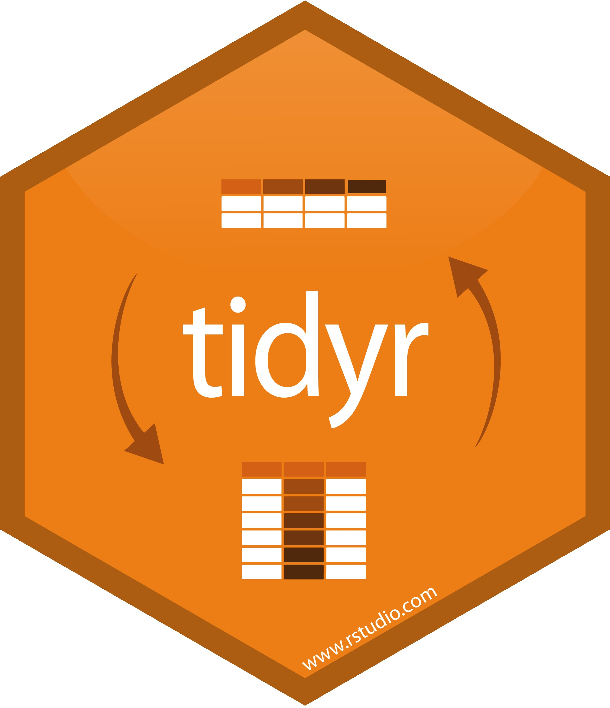
```
  </div>
</div>

<div class="row">
  <div class="col-md-4" markdown="1">
  `dplyr` que proporciona un conjunto consistente de funciones que ayudan a resolver los desafíos más comunes de la __manipulación__ de datos.
  </div>
  <div class="col-md-2" markdown="1">
```{r, echo = FALSE, eval = TRUE, out.width = "62%", fig.align = "center"}


```
  </div>
  <div class="col-md-4" markdown="1">
  `ggplot2` para crear __gráficos__ declarativamente, basado en la denominada gramática de gráficos.
  </div>
  <div class="col-md-2" markdown="1">
```{r, echo = FALSE, eval = TRUE, out.width = "74%", fig.align = "center"}

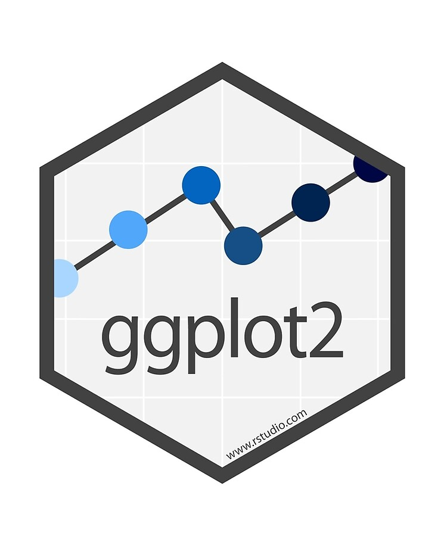
```
  </div>
</div>

Para usar los paquetes del `tidyverse` se deben instalar primero. Para esto, los paquetes se pueden instalar de forma individual:

```{r addition_4_1_1, exercise = TRUE}

install.packages('readr')
install.packages('tidyr')
install.packages('dplyr')
install.packages('ggplot2')
```

y luego cargarlos una vez se necesiten:

```{r addition_4_1_2, exercise = TRUE}

library(readr)
library(tidyr)
library(dplyr)
library(ggplot2)
```

O simplemente se puede instalar y cargar el paquete `tidyverse`:

```{r addition_4_1_3, exercise = TRUE}

install.packages('tidyverse')

library(tidyverse)

tidyverse_update() # Si desea actualizar el tidyverse.
```

<!--
El `tidyverse` está en constante evolución. Las mejores formas de mantenerse al día con él son:

1) Seguir el blog de [`RStudio`]( https://blog.rstudio.com/ ),

2) Seguir en twitter a personas como Mara Averick (@dataandme), Hadley Wickham (@hadleywickham), Max Kuhn (@topepos), David Robinson (@drob) y Julia Silge (@juliasilge).

Si bien el tidyverse se compone principalmente de un conjunto de paquetes de `R` muy útiles, también es una forma de pensar en implementar el análisis de __datos ordenados__.
-->

### 4.2 Datos ordenados

<!--
Los conjuntos de datos ordenados son todos iguales, pero cada conjunto de datos desordenado es desordenado a su manera".
- Hadley Wickham
-->

En la naturaleza, los conjuntos de datos vienen en muchos formatos diferentes.

:::example
#### Ejemplo 4.2.1
:::

+ Conjunto de datos __1__

```{r, echo = FALSE, eval = TRUE, message = FALSE}

library(DSR)

table1 %>%
  rename('País' = country, 'Año' = year, 'Casos' = cases, 'Población' = population) %>%
  mutate(País = case_when(
    País == 'Afghanistan' ~ 'Afganistán',
    País == 'Brazil' ~ 'Brasil',
    País == 'China' ~ 'China'
    ))%>%
  kable() %>% 
  kable_styling(full_width = FALSE,
                bootstrap_options = (c('striped', 'bordered')))
```

+ Conjunto de datos __2__

```{r, echo = FALSE, eval = TRUE, message = FALSE}

table2 %>%
  rename('País' = country, 'Año' = year, 'Variables' = key, 'Valor' = value) %>%
  mutate(País = case_when(
    País == 'Afghanistan' ~ 'Afganistán',
    País == 'Brazil' ~ 'Brasil',
    País == 'China' ~ 'China'),
    Variables = case_when(
    Variables == 'cases' ~ 'Casos',
    Variables == 'population' ~ 'Población')
    ) %>%
  kable() %>% 
  kable_styling(full_width = FALSE,
                bootstrap_options = (c('striped', 'bordered')))
```

+ Conjunto de datos __3__

```{r, echo = FALSE, eval = TRUE, message = FALSE}

table3 %>%
  rename('País' = country, 'Año' = year, 'Tasa' = rate) %>%
  mutate(País = case_when(
    País == 'Afghanistan' ~ 'Afganistán',
    País == 'Brazil' ~ 'Brasil',
    País == 'China' ~ 'China'
    ))%>%
  kable() %>% 
  kable_styling(full_width = FALSE,
                bootstrap_options = (c('striped', 'bordered')))
```

+ Conjunto de datos __4__

<div class="row">
  <div class="col-md-6" markdown="1">
```{r, echo = FALSE, eval = TRUE, message = FALSE}

table4 %>%
  rename('País' = country) %>%
  mutate(País = case_when(
    País == 'Afghanistan' ~ 'Afganistán',
    País == 'Brazil' ~ 'Brasil',
    País == 'China' ~ 'China'
    )) %>%
  kable() %>% 
  kable_styling(full_width = FALSE,
                bootstrap_options = (c('striped', 'bordered'))) %>%
  add_header_above(c(' ', 'Casos' = 2))
```
  </div>
  <div class="col-md-6" markdown="1">
```{r, echo = FALSE, eval = TRUE, message = FALSE}

table5 %>%
  rename('País' = country) %>%
  mutate(País = case_when(
    País == 'Afghanistan' ~ 'Afganistán',
    País == 'Brazil' ~ 'Brasil',
    País == 'China' ~ 'China'
    )) %>%
  kable() %>% 
  kable_styling(full_width = FALSE,
                bootstrap_options = (c('striped', 'bordered'))) %>%
  add_header_above(c(' ', 'Población' = 2))
```
  </div>
</div>

Los conjuntos de datos anteriores muestran los mismos datos organizados en cuatro formas diferentes. Sin embargo el conjunto de datos que cumple las siguientes tres reglas es mucho más fácil para trabajar en `R`:

<!--
1) Cada variable en el conjunto de datos se coloca en su propia columna,
2) Cada observación se coloca en su propia fila,
3) Cada valor se coloca en su propia celda.
-->

```{r, echo = FALSE, eval = TRUE, message = FALSE, fig.align = 'center', fig.showtext = TRUE, out.width = '460'}

Variables <- data.frame(
  x = c(1:8), y = c(1:8)
) %>%
  ggplot(aes(x, y)) +
  geom_blank() +
  annotate(geom = 'rect', xmin = 3.0, xmax = 3.5, ymin = 1.0, ymax = 1.5, colour = 'black', fill = 'black', alpha = 0.4) +
  annotate(geom = 'rect', xmin = 3.0, xmax = 3.5, ymin = 1.5, ymax = 2.0, color = 'black', fill = 'black', alpha = 0.4) +
  annotate(geom = 'rect', xmin = 3.0, xmax = 3.5, ymin = 2.0, ymax = 2.5, color = 'black', fill = 'black', alpha = 0.4) +
  annotate(geom = 'rect', xmin = 3.0, xmax = 3.5, ymin = 2.5, ymax = 3.0, color = 'black', fill = 'black', alpha = 0.4) +
  geom_curve(x = 3.25, xend = 3.25, y = 1.0, yend = 3.0, arrow = arrow(length = unit(0.1, 'inch')), size = 1.8, color = 'black', curvature = 0.0) +
  geom_curve(x = 3.25, xend = 3.25, y = 3.0, yend = 1.0, arrow = arrow(length = unit(0.1, 'inch')), size = 1.8, color = 'black', curvature = 0.0) +
  annotate(geom = 'rect', xmin = 3.5, xmax = 4.0, ymin = 1.0, ymax = 1.5, colour = 'black', fill = 'black', alpha = 0.4) +
  annotate(geom = 'rect', xmin = 3.5, xmax = 4.0, ymin = 1.5, ymax = 2.0, colour = 'black', fill = 'black', alpha = 0.4) +
  annotate(geom = 'rect', xmin = 3.5, xmax = 4.0, ymin = 2.0, ymax = 2.5, colour = 'black', fill = 'black', alpha = 0.4) +
  annotate(geom = 'rect', xmin = 3.5, xmax = 4.0, ymin = 2.5, ymax = 3.0, colour = 'black', fill = 'black', alpha = 0.4) +
  geom_curve(x = 3.75, xend = 3.75, y = 1.0, yend = 3.0, arrow = arrow(length = unit(0.1, 'inch')), size = 1.8, color = 'black', curvature = 0.0) +
  geom_curve(x = 3.75, xend = 3.75, y = 3.0, yend = 1.0, arrow = arrow(length = unit(0.1, 'inch')), size = 1.8, color = 'black', curvature = 0.0) +
  annotate(geom = 'rect', xmin = 4.0, xmax = 4.5, ymin = 1.0, ymax = 1.5, colour = 'black', fill = 'black', alpha = 0.4) +
  annotate(geom = 'rect', xmin = 4.0, xmax = 4.5, ymin = 1.5, ymax = 2.0, colour = 'black', fill = 'black', alpha = 0.4) +
  annotate(geom = 'rect', xmin = 4.0, xmax = 4.5, ymin = 2.0, ymax = 2.5, colour = 'black', fill = 'black', alpha = 0.4) +
  annotate(geom = 'rect', xmin = 4.0, xmax = 4.5, ymin = 2.5, ymax = 3.0, colour = 'black', fill = 'black', alpha = 0.4) +
  geom_curve(x = 4.25, xend = 4.25, y = 1.0, yend = 3.0, arrow = arrow(length = unit(0.1, 'inch')), size = 1.8, color = 'black', curvature = 0.0) +
  geom_curve(x = 4.25, xend = 4.25, y = 3.0, yend = 1.0, arrow = arrow(length = unit(0.1, 'inch')), size = 1.8, color = 'black', curvature = 0.0) +
  annotate(geom = 'rect', xmin = 4.5, xmax = 5.0, ymin = 1.0, ymax = 1.5, colour = 'black', fill = 'black', alpha = 0.4) +
  annotate(geom = 'rect', xmin = 4.5, xmax = 5.0, ymin = 1.5, ymax = 2.0, colour = 'black', fill = 'black', alpha = 0.4) +
  annotate(geom = 'rect', xmin = 4.5, xmax = 5.0, ymin = 2.0, ymax = 2.5, colour = 'black', fill = 'black', alpha = 0.4) +
  annotate(geom = 'rect', xmin = 4.5, xmax = 5.0, ymin = 2.5, ymax = 3.0, colour = 'black', fill = 'black', alpha = 0.4) +
  geom_curve(x = 4.75, xend = 4.75, y = 1.0, yend = 3.0, arrow = arrow(length = unit(0.1, 'inch')), size = 1.8, color = 'black', curvature = 0.0) +
  geom_curve(x = 4.75, xend = 4.75, y = 3.0, yend = 1.0, arrow = arrow(length = unit(0.1, 'inch')), size = 1.8, color = 'black', curvature = 0.0) +
  annotate(geom = 'text', x = 4.0, y = 3.25, label = 'Variables', family = 'gochi', size = 14.4, colour = 'black') +
  scale_y_continuous(limits = c(1, 3.3)) +
  scale_x_continuous(limits = c(3, 5.0)) +
  theme_void() +
  theme(axis.text = element_blank(),
        axis.ticks = element_blank(),
        axis.title = element_blank())

Observaciones <- data.frame(
  x = c(1:8), y = c(1:8)
) %>%
  ggplot(aes(x, y)) +
  geom_blank() +
  annotate(geom = 'rect', xmin = 3.0, xmax = 3.5, ymin = 1.0, ymax = 1.5, colour = 'black', fill = 'black', alpha = 0.4) +
  annotate(geom = 'rect', xmin = 3.0, xmax = 3.5, ymin = 1.5, ymax = 2.0, colour = 'black', fill = 'black', alpha = 0.4) +
  annotate(geom = 'rect', xmin = 3.0, xmax = 3.5, ymin = 2.0, ymax = 2.5, colour = 'black', fill = 'black', alpha = 0.4) +
  annotate(geom = 'rect', xmin = 3.0, xmax = 3.5, ymin = 2.5, ymax = 3.0, colour = 'black', fill = 'black', alpha = 0.4) +
  geom_curve(x = 3.0, xend = 5.0, y = 1.25, yend = 1.25, arrow = arrow(length = unit(0.1, 'inch')), size = 1.8, color = 'black', curvature = 0.0) +
  geom_curve(x = 5.0, xend = 3.0, y = 1.25, yend = 1.25, arrow = arrow(length = unit(0.1, 'inch')), size = 1.8, color = 'black', curvature = 0.0) +
  annotate(geom = 'rect', xmin = 3.5, xmax = 4.0, ymin = 1.0, ymax = 1.5, colour = 'black', fill = 'black', alpha = 0.4) +
  annotate(geom = 'rect', xmin = 3.5, xmax = 4.0, ymin = 1.5, ymax = 2.0, colour = 'black', fill = 'black', alpha = 0.4) +
  annotate(geom = 'rect', xmin = 3.5, xmax = 4.0, ymin = 2.0, ymax = 2.5, colour = 'black', fill = 'black', alpha = 0.4) +
  annotate(geom = 'rect', xmin = 3.5, xmax = 4.0, ymin = 2.5, ymax = 3.0, colour = 'black', fill = 'black', alpha = 0.4) +
  geom_curve(x = 3.0, xend = 5.0, y = 1.75, yend = 1.75, arrow = arrow(length = unit(0.1, 'inch')), size = 1.8, color = 'black', curvature = 0.0) +
  geom_curve(x = 5.0, xend = 3.0, y = 1.75, yend = 1.75, arrow = arrow(length = unit(0.1, 'inch')), size = 1.8, color = 'black', curvature = 0.0) +
  annotate(geom = 'rect', xmin = 4.0, xmax = 4.5, ymin = 1.0, ymax = 1.5, colour = 'black', fill = 'black', alpha = 0.4) +
  annotate(geom = 'rect', xmin = 4.0, xmax = 4.5, ymin = 1.5, ymax = 2.0, colour = 'black', fill = 'black', alpha = 0.4) +
  annotate(geom = 'rect', xmin = 4.0, xmax = 4.5, ymin = 2.0, ymax = 2.5, colour = 'black', fill = 'black', alpha = 0.4) +
  annotate(geom = 'rect', xmin = 4.0, xmax = 4.5, ymin = 2.5, ymax = 3.0, colour = 'black', fill = 'black', alpha = 0.4) +
  geom_curve(x = 3.0, xend = 5.0, y = 2.25, yend = 2.25, arrow = arrow(length = unit(0.1, 'inch')), size = 1.8, color = 'black', curvature = 0.0) +
  geom_curve(x = 5.0, xend = 3.0, y = 2.25, yend = 2.25, arrow = arrow(length = unit(0.1, 'inch')), size = 1.8, color = 'black', curvature = 0.0) +
  annotate(geom = 'rect', xmin = 4.5, xmax = 5.0, ymin = 1.0, ymax = 1.5, colour = 'black', fill = 'black', alpha = 0.4) +
  annotate(geom = 'rect', xmin = 4.5, xmax = 5.0, ymin = 1.5, ymax = 2.0, colour = 'black', fill = 'black', alpha = 0.4) +
  annotate(geom = 'rect', xmin = 4.5, xmax = 5.0, ymin = 2.0, ymax = 2.5, colour = 'black', fill = 'black', alpha = 0.4) +
  annotate(geom = 'rect', xmin = 4.5, xmax = 5.0, ymin = 2.5, ymax = 3.0, colour = 'black', fill = 'black', alpha = 0.4) +
  geom_curve(x = 3.0, xend = 5.0, y = 2.75, yend = 2.75, arrow = arrow(length = unit(0.1, 'inch')), size = 1.8, color = 'black', curvature = 0.0) +
  geom_curve(x = 5.0, xend = 3.0, y = 2.75, yend = 2.75, arrow = arrow(length = unit(0.1, 'inch')), size = 1.8, color = 'black', curvature = 0.0) +
  annotate(geom = 'text', x = 4.0, y = 3.25, label = 'Observaciones', family = 'gochi', size = 14.4, colour = 'black') +
  scale_y_continuous(limits = c(1, 3.3)) +
  scale_x_continuous(limits = c(3, 5.0)) +
  theme_void() +
  theme(axis.text = element_blank(),
        axis.ticks = element_blank(),
        axis.title = element_blank())

Valores_1 <- data.frame(
  x = c(3.25, 3.25, 3.25, 3.25, 3.75, 3.75, 3.75, 3.75, 4.25, 4.25, 4.25, 4.25, 4.75, 4.75, 4.75, 4.75),
  y = c(1.25, 1.75, 2.25, 2.75, 1.25, 1.75, 2.25, 2.75, 1.25, 1.75, 2.25, 2.75, 1.25, 1.75, 2.25, 2.75)
)

Valores_2 <- data.frame(
  x = c(1:8), y = c(1:8)
) %>%
  ggplot(aes(x, y)) +
  geom_blank() +
  annotate(geom = 'rect', xmin = 3.0, xmax = 3.5, ymin = 1.0, ymax = 1.5, colour = 'black', fill = 'black', alpha = 0.4) +
  annotate(geom = 'rect', xmin = 3.0, xmax = 3.5, ymin = 1.5, ymax = 2.0, colour = 'black', fill = 'black', alpha = 0.4) +
  annotate(geom = 'rect', xmin = 3.0, xmax = 3.5, ymin = 2.0, ymax = 2.5, colour = 'black', fill = 'black', alpha = 0.4) +
  annotate(geom = 'rect', xmin = 3.0, xmax = 3.5, ymin = 2.5, ymax = 3.0, colour = 'black', fill = 'black', alpha = 0.4) +
  annotate(geom = 'rect', xmin = 3.5, xmax = 4.0, ymin = 1.0, ymax = 1.5, colour = 'black', fill = 'black', alpha = 0.4) +
  annotate(geom = 'rect', xmin = 3.5, xmax = 4.0, ymin = 1.5, ymax = 2.0, colour = 'black', fill = 'black', alpha = 0.4) +
  annotate(geom = 'rect', xmin = 3.5, xmax = 4.0, ymin = 2.0, ymax = 2.5, colour = 'black', fill = 'black', alpha = 0.4) +
  annotate(geom = 'rect', xmin = 3.5, xmax = 4.0, ymin = 2.5, ymax = 3.0, colour = 'black', fill = 'black', alpha = 0.4) +
  annotate(geom = 'rect', xmin = 4.0, xmax = 4.5, ymin = 1.0, ymax = 1.5, colour = 'black', fill = 'black', alpha = 0.4) +
  annotate(geom = 'rect', xmin = 4.0, xmax = 4.5, ymin = 1.5, ymax = 2.0, colour = 'black', fill = 'black', alpha = 0.4) +
  annotate(geom = 'rect', xmin = 4.0, xmax = 4.5, ymin = 2.0, ymax = 2.5, colour = 'black', fill = 'black', alpha = 0.4) +
  annotate(geom = 'rect', xmin = 4.0, xmax = 4.5, ymin = 2.5, ymax = 3.0, colour = 'black', fill = 'black', alpha = 0.4) +
  annotate(geom = 'rect', xmin = 4.5, xmax = 5.0, ymin = 1.0, ymax = 1.5, colour = 'black', fill = 'black', alpha = 0.4) +
  annotate(geom = 'rect', xmin = 4.5, xmax = 5.0, ymin = 1.5, ymax = 2.0, colour = 'black', fill = 'black', alpha = 0.4) +
  annotate(geom = 'rect', xmin = 4.5, xmax = 5.0, ymin = 2.0, ymax = 2.5, colour = 'black', fill = 'black', alpha = 0.4) +
  annotate(geom = 'rect', xmin = 4.5, xmax = 5.0, ymin = 2.5, ymax = 3.0, colour = 'black', fill = 'black', alpha = 0.4) +
  annotate(geom = 'text', x = 4.0, y = 3.25, label = 'Valores', family = 'gochi', size = 14.4, colour = 'black') +
  geom_point(data = Valores_1, aes(x, y), colour = 'black', fill = 'black', size = 2.4) +
  scale_y_continuous(limits = c(1, 3.3)) +
  scale_x_continuous(limits = c(3, 5.0)) +
  theme_void() +
  theme(axis.text = element_blank(),
        axis.ticks = element_blank(),
        axis.title = element_blank())

(Variables)|(Observaciones)|(Valores_2)
```

Los datos que satisfacen estas reglas se conocen como __datos ordenados__.

:::exercise
#### Ejercicio 4.2.1
Teniendo en cuenta las reglas sobre datos ordenados, ¿cual de los cuatro conjuntos de datos anteriormente mencionados considera cumple con este principio?
:::

```{r letter_4_2_1, echo = FALSE}
question(" ",
  answer("Conjunto de datos 4", message = "No estas en lo correcto, sigue intentandolo."),
  answer("Conjunto de datos 1", correct = TRUE, message = "Estas en lo correcto... en este conjunto de datos cada variable se coloco en su propia columna, cada observación en su propia fila y cada valor en su propia celda."),
  answer("Conjunto de datos 2", message = "No estas en lo correcto, sigue intentandolo."),
  answer("Conjunto de datos 3", message = "No estas en lo correcto, sigue intentandolo."),
  allow_retry = TRUE,
  random_answer_order = TRUE
)
```

Los datos ordenados funcionan bien en `R` porque `R` es un lenguaje de programación vectorizado. Los conjuntos de datos en `R` están construidos a partir de vectores y las operaciones de `R` están optimizadas para trabajar con vectores. Los datos ordenados aprovechan estas dos características.

```{r, echo = FALSE, eval = TRUE, message = FALSE, fig.align = 'center', fig.showtext = TRUE, out.width = '460'}

Dato_ordenado_1 <- data.frame(
  x = c(1:8), y = c(1:8)
) %>%
  ggplot(aes(x, y)) +
  geom_blank() +
  annotate(geom = 'rect', xmin = 3.0, xmax = 3.5, ymin = 1.0, ymax = 5.5, colour = 'black', fill = 'white', alpha = 0.4) +
  annotate(geom = 'rect', xmin = 3.75, xmax = 4.25, ymin = 1.0, ymax = 5.5, colour = 'black', fill = 'white', alpha = 0.4) +
  annotate(geom = 'rect', xmin = 4.5, xmax = 5.0, ymin = 1.0, ymax = 5.5, colour = 'black', fill = 'white', alpha = 0.4) +
  annotate(geom = 'rect', xmin = 5.25, xmax = 5.75, ymin = 1.0, ymax = 5.5, colour = 'black', fill = 'white', alpha = 0.4) +
  annotate(geom = 'text', x = 3.25, y = 5.25, label = 'Vec1', family = 'gochi', size = 9.4, colour = 'black') +
  annotate(geom = 'segment', x = 3.0, xend = 3.5, y = 5.0, yend = 5.0, colour = 'black') +
  annotate(geom = 'text', x = 4.0, y = 5.25, label = 'Vec2', family = 'gochi', size = 9.4, colour = 'black') +
  annotate(geom = 'segment', x = 3.75, xend = 4.25, y = 5.0, yend = 5.0, colour = 'black') +
  annotate(geom = 'text', x = 4.75, y = 5.25, label = 'Vec3', family = 'gochi', size = 9.4, colour = 'black') +
  annotate(geom = 'segment', x = 4.5, xend = 5.0, y = 5.0, yend = 5.0, colour = 'black') +
  annotate(geom = 'text', x = 5.5, y = 5.25, label = 'Vec4', family = 'gochi', size = 9.4, colour = 'black') +
  annotate(geom = 'segment', x = 5.25, xend = 5.75, y = 5.0, yend = 5.0, colour = 'black') +
  annotate(geom = 'segment', x = 3.0, xend = 3.5, y = 2.0, yend = 2.0, colour = 'black', linetype = 'dashed') +
  annotate(geom = 'segment', x = 3.0, xend = 3.5, y = 3.0, yend = 3.0, colour = 'black', linetype = 'dashed') +
  annotate(geom = 'segment', x = 3.0, xend = 3.5, y = 4.0, yend = 4.0, colour = 'black', linetype = 'dashed') +
  annotate(geom = 'segment', x = 3.75, xend = 4.25, y = 2.0, yend = 2.0, colour = 'black', linetype = 'dashed') +
  annotate(geom = 'segment', x = 3.75, xend = 4.25, y = 3.0, yend = 3.0, colour = 'black', linetype = 'dashed') +
  annotate(geom = 'segment', x = 3.75, xend = 4.25, y = 4.0, yend = 4.0, colour = 'black', linetype = 'dashed') +
  annotate(geom = 'segment', x = 4.5, xend = 5.0, y = 2.0, yend = 2.0, colour = 'black', linetype = 'dashed') +
  annotate(geom = 'segment', x = 4.5, xend = 5.0, y = 3.0, yend = 3.0, colour = 'black', linetype = 'dashed') +
  annotate(geom = 'segment', x = 4.5, xend = 5.0, y = 4.0, yend = 4.0, colour = 'black', linetype = 'dashed') +
  annotate(geom = 'segment', x = 5.25, xend = 5.75, y = 2.0, yend = 2.0, colour = 'black', linetype = 'dashed') +
  annotate(geom = 'segment', x = 5.25, xend = 5.75, y = 3.0, yend = 3.0, colour = 'black', linetype = 'dashed') +
  annotate(geom = 'segment', x = 5.25, xend = 5.75, y = 4.0, yend = 4.0, colour = 'black', linetype = 'dashed') +
  annotate(geom = 'segment', x = 3.25, xend = 3.25, y = 5.5, yend = 6.0, colour = 'black') +
  annotate(geom = 'segment', x = 4.0, xend = 4.0, y = 5.5, yend = 6.0, colour = 'black') +
  annotate(geom = 'segment', x = 4.75, xend = 4.75, y = 5.5, yend = 6.0, colour = 'black') +
  annotate(geom = 'segment', x = 5.5, xend = 5.5, y = 5.5, yend = 6.0, colour = 'black') +
  annotate(geom = 'segment', x = 3.25, xend = 5.5, y = 6.0, yend = 6.0, colour = 'black') +
  annotate(geom = 'text', x = 4.25, y = 6.5, label = 'data.frame', family = 'gochi', size = 10.4, colour = 'black') +
  scale_y_continuous(limits = c(1, 7.0)) +
  scale_x_continuous(limits = c(2.85, 6.0)) +
  theme_void() +
  theme(axis.text = element_blank(),
        axis.ticks = element_blank(),
        axis.title = element_blank())


Dato_ordenado_2 <- data.frame(
  x = c(1:8), y = c(1:8)
) %>%
  ggplot(aes(x, y)) +
  geom_blank() +
  annotate(geom = 'rect', xmin = 3.0, xmax = 3.5, ymin = 1.0, ymax = 5.5, colour = 'black', fill = 'black', alpha = 0.4) +
  annotate(geom = 'rect', xmin = 3.75, xmax = 4.25, ymin = 1.0, ymax = 5.5, colour = 'black', fill = 'black', alpha = 0.4) +
  annotate(geom = 'rect', xmin = 4.5, xmax = 5.0, ymin = 1.0, ymax = 5.5, colour = 'black', fill = 'black', alpha = 0.4) +
  annotate(geom = 'rect', xmin = 5.25, xmax = 5.75, ymin = 1.0, ymax = 5.5, colour = 'black', fill = 'black', alpha = 0.4) +
  annotate(geom = 'text', x = 3.25, y = 5.25, label = 'País', family = 'gochi', size = 9.4, colour = 'black') +
  annotate(geom = 'segment', x = 3.0, xend = 3.5, y = 5.0, yend = 5.0, colour = 'black') +
  annotate(geom = 'text', x = 4.0, y = 5.25, label = 'Año', family = 'gochi', size = 9.4, colour = 'black') +
  annotate(geom = 'segment', x = 3.75, xend = 4.25, y = 5.0, yend = 5.0, colour = 'black') +
  annotate(geom = 'text', x = 4.75, y = 5.25, label = 'Casos', family = 'gochi', size = 9.4, colour = 'black') +
  annotate(geom = 'segment', x = 4.5, xend = 5.0, y = 5.0, yend = 5.0, colour = 'black') +
  annotate(geom = 'text', x = 5.5, y = 5.25, label = 'Pob.', family = 'gochi', size = 9.4, colour = 'black') +
  annotate(geom = 'segment', x = 5.25, xend = 5.75, y = 5.0, yend = 5.0, colour = 'black') +
  annotate(geom = 'segment', x = 3.0, xend = 3.5, y = 2.0, yend = 2.0, colour = 'black', linetype = 'dashed') +
  annotate(geom = 'segment', x = 3.0, xend = 3.5, y = 3.0, yend = 3.0, colour = 'black', linetype = 'dashed') +
  annotate(geom = 'segment', x = 3.0, xend = 3.5, y = 4.0, yend = 4.0, colour = 'black', linetype = 'dashed') +
  annotate(geom = 'segment', x = 3.75, xend = 4.25, y = 2.0, yend = 2.0, colour = 'black', linetype = 'dashed') +
  annotate(geom = 'segment', x = 3.75, xend = 4.25, y = 3.0, yend = 3.0, colour = 'black', linetype = 'dashed') +
  annotate(geom = 'segment', x = 3.75, xend = 4.25, y = 4.0, yend = 4.0, colour = 'black', linetype = 'dashed') +
  annotate(geom = 'segment', x = 4.5, xend = 5.0, y = 2.0, yend = 2.0, colour = 'black', linetype = 'dashed') +
  annotate(geom = 'segment', x = 4.5, xend = 5.0, y = 3.0, yend = 3.0, colour = 'black', linetype = 'dashed') +
  annotate(geom = 'segment', x = 4.5, xend = 5.0, y = 4.0, yend = 4.0, colour = 'black', linetype = 'dashed') +
  annotate(geom = 'segment', x = 5.25, xend = 5.75, y = 2.0, yend = 2.0, colour = 'black', linetype = 'dashed') +
  annotate(geom = 'segment', x = 5.25, xend = 5.75, y = 3.0, yend = 3.0, colour = 'black', linetype = 'dashed') +
  annotate(geom = 'segment', x = 5.25, xend = 5.75, y = 4.0, yend = 4.0, colour = 'black', linetype = 'dashed') +
  annotate(geom = 'segment', x = 3.25, xend = 3.25, y = 5.5, yend = 6.0, colour = 'black') +
  annotate(geom = 'segment', x = 4.0, xend = 4.0, y = 5.5, yend = 6.0, colour = 'black') +
  annotate(geom = 'segment', x = 4.75, xend = 4.75, y = 5.5, yend = 6.0, colour = 'black') +
  annotate(geom = 'segment', x = 5.5, xend = 5.5, y = 5.5, yend = 6.0, colour = 'black') +
  annotate(geom = 'segment', x = 3.25, xend = 5.5, y = 6.0, yend = 6.0, colour = 'black') +
  annotate(geom = 'text', x = 4.25, y = 6.5, label = 'Conjunto de datos 1', family = 'gochi', size = 10.4, colour = 'black') +
  scale_y_continuous(limits = c(1, 7.0)) +
  scale_x_continuous(limits = c(2.85, 6.0)) +
  theme_void() +
  theme(axis.text = element_blank(),
        axis.ticks = element_blank(),
        axis.title = element_blank())

(Dato_ordenado_1)|(Dato_ordenado_2)
```

Los datos ordenados fueron popularizados por __Hadley Wickham__, y sirven como base para muchos paquetes y funciones de `R`. Puede obtener más información sobre datos ordenados leyendo [Tidy Data](www.jstatsoft.org/v59/i10/paper), un documento escrito por __Hadley Wickham__ y publicado en el Journal of Statistical Software.

### 4.3 Ordenar los datos con `tidyr`

El paquete `tidyr` tiene como objetivo ayudarle a ordenar sus datos. Contiene varias funciones que alteran el diseño de los conjuntos de datos, al tiempo que conserva los valores:

+ `pivot_wider()`

La función `pivot_wider()` es usada cuando se tiene una observación dispersa en múltiples filas.

:::example
#### Ejemplo 4.3.1
:::

```{r, echo = FALSE, eval = TRUE, message = FALSE}

datos_2 <- DSR::table2 %>%
  rename('País' = country, 'Año' = year, 'Variables' = key, 'Valor' = value) %>%
  mutate(País = case_when(
    País == 'Afghanistan' ~ 'Afganistán',
    País == 'Brazil' ~ 'Brasil',
    País == 'China' ~ 'China'),
    Variables = case_when(
    Variables == 'cases' ~ 'Casos',
    Variables == 'population' ~ 'Población')
    )
```

```{r,eval=FALSE}
save(datos_2,file = "data_pkg/datos_2.rda")
```


```{r addition_4_3_1_a, exercise = TRUE}
datos_2
```

```{r, echo = FALSE, eval = TRUE, message = FALSE, fig.align = 'center', fig.showtext = TRUE, out.width = '520'}

ancho <- data.frame(
  x = c(1:20), y = c(1:20)
) %>%
  ggplot(aes(x, y)) +
  geom_blank() +
  annotate(geom = 'rect', xmin = 1.0, xmax = 3.0, ymin = 7.5, ymax = 8.0, colour = 'black', fill = 'black', alpha = 0.2) +
  annotate(geom = 'text', x = 2.0, y = 7.75, label = 'País', family = 'gochi', size = 6.4, colour = 'black') +
  annotate(geom = 'rect', xmin = 1.0, xmax = 3.0, ymin = 7.0, ymax = 7.5, colour = 'black', fill = 'white', alpha = 0.4) +
  annotate(geom = 'text', x = 2.0, y = 7.25, label = 'Afganistán', family = 'gochi', size = 6.4, colour = 'black') +
  annotate(geom = 'rect', xmin = 1.0, xmax = 3.0, ymin = 6.5, ymax = 7.0, colour = 'black', fill = 'white', alpha = 0.4) +
  annotate(geom = 'text', x = 2.0, y = 6.75, label = 'Afganistán', family = 'gochi', size = 6.4, colour = 'black') +
  annotate(geom = 'rect', xmin = 1.0, xmax = 3.0, ymin = 6.0, ymax = 6.5, colour = 'black', fill = 'white', alpha = 0.4) +
  annotate(geom = 'text', x = 2.0, y = 6.25, label = 'Afganistán', family = 'gochi', size = 6.4, colour = 'black') +
  annotate(geom = 'rect', xmin = 1.0, xmax = 3.0, ymin = 5.5, ymax = 6.0, colour = 'black', fill = 'white', alpha = 0.4) +
  annotate(geom = 'text', x = 2.0, y = 5.75, label = 'Afganistán', family = 'gochi', size = 6.4, colour = 'black') +
  annotate(geom = 'rect', xmin = 1.0, xmax = 3.0, ymin = 5.0, ymax = 5.5, colour = 'black', fill = 'white', alpha = 0.4) +
  annotate(geom = 'text', x = 2.0, y = 5.25, label = 'Brasil', family = 'gochi', size = 6.4, colour = 'black') +
  annotate(geom = 'rect', xmin = 1.0, xmax = 3.0, ymin = 4.5, ymax = 5.0, colour = 'black', fill = 'white', alpha = 0.4) +
  annotate(geom = 'text', x = 2.0, y = 4.75, label = 'Brasil', family = 'gochi', size = 6.4, colour = 'black') +
  annotate(geom = 'rect', xmin = 1.0, xmax = 3.0, ymin = 4.0, ymax = 4.5, colour = 'black', fill = 'white', alpha = 0.4) +
  annotate(geom = 'text', x = 2.0, y = 4.25, label = 'Brasil', family = 'gochi', size = 6.4, colour = 'black') +
  annotate(geom = 'rect', xmin = 1.0, xmax = 3.0, ymin = 3.5, ymax = 4.0, colour = 'black', fill = 'white', alpha = 0.4) +
  annotate(geom = 'text', x = 2.0, y = 3.75, label = 'Brasil', family = 'gochi', size = 6.4, colour = 'black') +
  annotate(geom = 'rect', xmin = 1.0, xmax = 3.0, ymin = 3.0, ymax = 3.5, colour = 'black', fill = 'white', alpha = 0.4) +
  annotate(geom = 'text', x = 2.0, y = 3.25, label = 'China', family = 'gochi', size = 6.4, colour = 'black') +
  annotate(geom = 'rect', xmin = 1.0, xmax = 3.0, ymin = 2.5, ymax = 3.0, colour = 'black', fill = 'white', alpha = 0.4) +
  annotate(geom = 'text', x = 2.0, y = 2.75, label = 'China', family = 'gochi', size = 6.4, colour = 'black') +
  annotate(geom = 'rect', xmin = 1.0, xmax = 3.0, ymin = 2.0, ymax = 2.5, colour = 'black', fill = 'white', alpha = 0.4) +
  annotate(geom = 'text', x = 2.0, y = 2.25, label = 'China', family = 'gochi', size = 6.4, colour = 'black') +
  annotate(geom = 'rect', xmin = 1.0, xmax = 3.0, ymin = 1.5, ymax = 2.0, colour = 'black', fill = 'white', alpha = 0.4) +
  annotate(geom = 'text', x = 2.0, y = 1.75, label = 'China', family = 'gochi', size = 6.4, colour = 'black') +
  annotate(geom = 'rect', xmin = 3.0, xmax = 5.0, ymin = 7.5, ymax = 8.0, colour = 'black', fill = 'black', alpha = 0.2) +
  annotate(geom = 'text', x = 4.0, y = 7.75, label = 'Año', family = 'gochi', size = 6.4, colour = 'black') +
  annotate(geom = 'rect', xmin = 3.0, xmax = 5.0, ymin = 7.0, ymax = 7.5, colour = 'black', fill = 'white', alpha = 0.4) +
  annotate(geom = 'text', x = 4.0, y = 7.25, label = '1999', family = 'gochi', size = 6.4, colour = 'black') +
  annotate(geom = 'rect', xmin = 3.0, xmax = 5.0, ymin = 6.5, ymax = 7.0, colour = 'black', fill = 'white', alpha = 0.4) +
  annotate(geom = 'text', x = 4.0, y = 6.75, label = '1999', family = 'gochi', size = 6.4, colour = 'black') +
  annotate(geom = 'rect', xmin = 3.0, xmax = 5.0, ymin = 6.0, ymax = 6.5, colour = 'black', fill = 'white', alpha = 0.4) +
  annotate(geom = 'text', x = 4.0, y = 6.25, label = '2000', family = 'gochi', size = 6.4, colour = 'black') +
  annotate(geom = 'rect', xmin = 3.0, xmax = 5.0, ymin = 5.5, ymax = 6.0, colour = 'black', fill = 'white', alpha = 0.4) +
  annotate(geom = 'text', x = 4.0, y = 5.75, label = '2000', family = 'gochi', size = 6.4, colour = 'black') +
  annotate(geom = 'rect', xmin = 3.0, xmax = 5.0, ymin = 5.0, ymax = 5.5, colour = 'black', fill = 'white', alpha = 0.4) +
  annotate(geom = 'text', x = 4.0, y = 5.25, label = '1999', family = 'gochi', size = 6.4, colour = 'black') +
  annotate(geom = 'rect', xmin = 3.0, xmax = 5.0, ymin = 4.5, ymax = 5.0, colour = 'black', fill = 'white', alpha = 0.4) +
  annotate(geom = 'text', x = 4.0, y = 4.75, label = '1999', family = 'gochi', size = 6.4, colour = 'black') +
  annotate(geom = 'rect', xmin = 3.0, xmax = 5.0, ymin = 4.0, ymax = 4.5, colour = 'black', fill = 'white', alpha = 0.4) +
  annotate(geom = 'text', x = 4.0, y = 4.25, label = '2000', family = 'gochi', size = 6.4, colour = 'black') +
  annotate(geom = 'rect', xmin = 3.0, xmax = 5.0, ymin = 3.5, ymax = 4.0, colour = 'black', fill = 'white', alpha = 0.4) +
  annotate(geom = 'text', x = 4.0, y = 3.75, label = '2000', family = 'gochi', size = 6.4, colour = 'black') +
  annotate(geom = 'rect', xmin = 3.0, xmax = 5.0, ymin = 3.0, ymax = 3.5, colour = 'black', fill = 'white', alpha = 0.4) +
  annotate(geom = 'text', x = 4.0, y = 3.25, label = '1999', family = 'gochi', size = 6.4, colour = 'black') +
  annotate(geom = 'rect', xmin = 3.0, xmax = 5.0, ymin = 2.5, ymax = 3.0, colour = 'black', fill = 'white', alpha = 0.4) +
  annotate(geom = 'text', x = 4.0, y = 2.75, label = '1999', family = 'gochi', size = 6.4, colour = 'black') +
  annotate(geom = 'rect', xmin = 3.0, xmax = 5.0, ymin = 2.0, ymax = 2.5, colour = 'black', fill = 'white', alpha = 0.4) +
  annotate(geom = 'text', x = 4.0, y = 2.25, label = '2000', family = 'gochi', size = 6.4, colour = 'black') +
  annotate(geom = 'rect', xmin = 3.0, xmax = 5.0, ymin = 1.5, ymax = 2.0, colour = 'black', fill = 'white', alpha = 0.4) +
  annotate(geom = 'text', x = 4.0, y = 1.75, label = '2000', family = 'gochi', size = 6.4, colour = 'black') +
  annotate(geom = 'rect', xmin = 5.0, xmax = 7.0, ymin = 7.5, ymax = 8.0, colour = 'black', fill = 'black', alpha = 0.2) +
  annotate(geom = 'text', x = 6.0, y = 7.75, label = 'Variables', family = 'gochi', size = 6.4, colour = 'black') +
  annotate(geom = 'rect', xmin = 5.0, xmax = 7.0, ymin = 7.0, ymax = 7.5, colour = 'black', fill = 'white', alpha = 0.4) +
  annotate(geom = 'text', x = 6.0, y = 7.25, label = 'Casos', family = 'gochi', size = 6.4, colour = 'black') +
  annotate(geom = 'rect', xmin = 5.0, xmax = 7.0, ymin = 6.5, ymax = 7.0, colour = 'black', fill = 'white', alpha = 0.4) +
  annotate(geom = 'text', x = 6.0, y = 6.75, label = 'Población', family = 'gochi', size = 6.4, colour = 'black') +
  annotate(geom = 'rect', xmin = 5.0, xmax = 7.0, ymin = 6.0, ymax = 6.5, colour = 'black', fill = 'white', alpha = 0.4) +
  annotate(geom = 'text', x = 6.0, y = 6.25, label = 'Casos', family = 'gochi', size = 6.4, colour = 'black') +
  annotate(geom = 'rect', xmin = 5.0, xmax = 7.0, ymin = 5.5, ymax = 6.0, colour = 'black', fill = 'white', alpha = 0.4) +
  annotate(geom = 'text', x = 6.0, y = 5.75, label = 'Población', family = 'gochi', size = 6.4, colour = 'black') +
  annotate(geom = 'rect', xmin = 5.0, xmax = 7.0, ymin = 5.0, ymax = 5.5, colour = 'black', fill = 'white', alpha = 0.4) +
  annotate(geom = 'text', x = 6.0, y = 5.25, label = 'Casos', family = 'gochi', size = 6.4, colour = 'black') +
  annotate(geom = 'rect', xmin = 5.0, xmax = 7.0, ymin = 4.5, ymax = 5.0, colour = 'black', fill = 'white', alpha = 0.4) +
  annotate(geom = 'text', x = 6.0, y = 4.75, label = 'Población', family = 'gochi', size = 6.4, colour = 'black') +
  annotate(geom = 'rect', xmin = 5.0, xmax = 7.0, ymin = 4.0, ymax = 4.5, colour = 'black', fill = 'white', alpha = 0.4) +
  annotate(geom = 'text', x = 6.0, y = 4.25, label = 'Casos', family = 'gochi', size = 6.4, colour = 'black') +
  annotate(geom = 'rect', xmin = 5.0, xmax = 7.0, ymin = 3.5, ymax = 4.0, colour = 'black', fill = 'white', alpha = 0.4) +
  annotate(geom = 'text', x = 6.0, y = 3.75, label = 'Población', family = 'gochi', size = 6.4, colour = 'black') +
  annotate(geom = 'rect', xmin = 5.0, xmax = 7.0, ymin = 3.0, ymax = 3.5, colour = 'black', fill = 'white', alpha = 0.4) +
  annotate(geom = 'text', x = 6.0, y = 3.25, label = 'Casos', family = 'gochi', size = 6.4, colour = 'black') +
  annotate(geom = 'rect', xmin = 5.0, xmax = 7.0, ymin = 2.5, ymax = 3.0, colour = 'black', fill = 'white', alpha = 0.4) +
  annotate(geom = 'text', x = 6.0, y = 2.75, label = 'Población', family = 'gochi', size = 6.4, colour = 'black') +
  annotate(geom = 'rect', xmin = 5.0, xmax = 7.0, ymin = 2.0, ymax = 2.5, colour = 'black', fill = 'white', alpha = 0.4) +
  annotate(geom = 'text', x = 6.0, y = 2.25, label = 'Casos', family = 'gochi', size = 6.4, colour = 'black') +
  annotate(geom = 'rect', xmin = 5.0, xmax = 7.0, ymin = 1.5, ymax = 2.0, colour = 'black', fill = 'white', alpha = 0.4) +
  annotate(geom = 'text', x = 6.0, y = 1.75, label = 'Población', family = 'gochi', size = 6.4, colour = 'black') +
  annotate(geom = 'rect', xmin = 7.0, xmax = 9.0, ymin = 7.5, ymax = 8.0, colour = 'black', fill = 'black', alpha = 0.2) +
  annotate(geom = 'text', x = 8.0, y = 7.75, label = 'Valor', family = 'gochi', size = 6.4, colour = 'black') +
  annotate(geom = 'rect', xmin = 7.0, xmax = 9.0, ymin = 7.0, ymax = 7.5, colour = 'yellow', fill = 'yellow', alpha = 0.2) +
  annotate(geom = 'text', x = 8.0, y = 7.25, label = '745', family = 'gochi', size = 6.4, colour = 'black') +
  annotate(geom = 'rect', xmin = 7.0, xmax = 9.0, ymin = 6.5, ymax = 7.0, colour = 'red', fill = 'red', alpha = 0.2) +
  annotate(geom = 'text', x = 8.0, y = 6.75, label = '19987071', family = 'gochi', size = 6.4, colour = 'black') +
  annotate(geom = 'rect', xmin = 7.0, xmax = 9.0, ymin = 6.0, ymax = 6.5, colour = 'yellow', fill = 'yellow', alpha = 0.2) +
  annotate(geom = 'text', x = 8.0, y = 6.25, label = '2666', family = 'gochi', size = 6.4, colour = 'black') +
  annotate(geom = 'rect', xmin = 7.0, xmax = 9.0, ymin = 5.5, ymax = 6.0, colour = 'red', fill = 'red', alpha = 0.2) +
  annotate(geom = 'text', x = 8.0, y = 5.75, label = '20595360', family = 'gochi', size = 6.4, colour = 'black') +
  annotate(geom = 'rect', xmin = 7.0, xmax = 9.0, ymin = 5.0, ymax = 5.5, colour = 'yellow', fill = 'yellow', alpha = 0.2) +
  annotate(geom = 'text', x = 8.0, y = 5.25, label = '37737', family = 'gochi', size = 6.4, colour = 'black') +
  annotate(geom = 'rect', xmin = 7.0, xmax = 9.0, ymin = 4.5, ymax = 5.0, colour = 'red', fill = 'red', alpha = 0.2) +
  annotate(geom = 'text', x = 8.0, y = 4.75, label = '172006362', family = 'gochi', size = 6.4, colour = 'black') +
  annotate(geom = 'rect', xmin = 7.0, xmax = 9.0, ymin = 4.0, ymax = 4.5, colour = 'yellow', fill = 'yellow', alpha = 0.2) +
  annotate(geom = 'text', x = 8.0, y = 4.25, label = '80488', family = 'gochi', size = 6.4, colour = 'black') +
  annotate(geom = 'rect', xmin = 7.0, xmax = 9.0, ymin = 3.5, ymax = 4.0, colour = 'red', fill = 'red', alpha = 0.2) +
  annotate(geom = 'text', x = 8.0, y = 3.75, label = '174504896', family = 'gochi', size = 6.4, colour = 'black') +
  annotate(geom = 'rect', xmin = 7.0, xmax = 9.0, ymin = 3.0, ymax = 3.5, colour = 'yellow', fill = 'yellow', alpha = 0.2) +
  annotate(geom = 'text', x = 8.0, y = 3.25, label = '212258', family = 'gochi', size = 6.4, colour = 'black') +
  annotate(geom = 'rect', xmin = 7.0, xmax = 9.0, ymin = 2.5, ymax = 3.0, colour = 'red', fill = 'red', alpha = 0.2) +
  annotate(geom = 'text', x = 8.0, y = 2.75, label = '1272915272', family = 'gochi', size = 6.4, colour = 'black') +
  annotate(geom = 'rect', xmin = 7.0, xmax = 9.0, ymin = 2.0, ymax = 2.5, colour = 'yellow', fill = 'yellow', alpha = 0.2) +
  annotate(geom = 'text', x = 8.0, y = 2.25, label = '213766', family = 'gochi', size = 6.4, colour = 'black') +
  annotate(geom = 'rect', xmin = 7.0, xmax = 9.0, ymin = 1.5, ymax = 2.0, colour = 'red', fill = 'red', alpha = 0.2) +
  annotate(geom = 'text', x = 8.0, y = 1.75, label = '1280428583', family = 'gochi', size = 6.4, colour = 'black') +
  annotate(geom = 'rect', xmin = 12.0, xmax = 14.0, ymin = 7.5, ymax = 8.0, colour = 'black', fill = 'black', alpha = 0.2) +
  annotate(geom = 'text', x = 13.0, y = 7.75, label = 'País', family = 'gochi', size = 6.4, colour = 'black') +
  annotate(geom = 'rect', xmin = 12.0, xmax = 14.0, ymin = 7.0, ymax = 7.5, colour = 'black', fill = 'white', alpha = 0.4) +
  annotate(geom = 'text', x = 13.0, y = 7.25, label = 'Afganistán', family = 'gochi', size = 6.4, colour = 'black') +
  annotate(geom = 'rect', xmin = 12.0, xmax = 14.0, ymin = 6.5, ymax = 7.0, colour = 'black', fill = 'white', alpha = 0.4) +
  annotate(geom = 'text', x = 13.0, y = 6.75, label = 'Afganistán', family = 'gochi', size = 6.4, colour = 'black') +
  annotate(geom = 'rect', xmin = 12.0, xmax = 14.0, ymin = 6.0, ymax = 6.5, colour = 'black', fill = 'white', alpha = 0.4) +
  annotate(geom = 'text', x = 13.0, y = 6.25, label = 'Brasil', family = 'gochi', size = 6.4, colour = 'black') +
  annotate(geom = 'rect', xmin = 12.0, xmax = 14.0, ymin = 5.5, ymax = 6.0, colour = 'black', fill = 'white', alpha = 0.4) +
  annotate(geom = 'text', x = 13.0, y = 5.75, label = 'Brasil', family = 'gochi', size = 6.4, colour = 'black') +
  annotate(geom = 'rect', xmin = 12.0, xmax = 14.0, ymin = 5.0, ymax = 5.5, colour = 'black', fill = 'white', alpha = 0.4) +
  annotate(geom = 'text', x = 13.0, y = 5.25, label = 'China', family = 'gochi', size = 6.4, colour = 'black') +
  annotate(geom = 'rect', xmin = 12.0, xmax = 14.0, ymin = 4.5, ymax = 5.0, colour = 'black', fill = 'white', alpha = 0.4) +
  annotate(geom = 'text', x = 13.0, y = 4.75, label = 'China', family = 'gochi', size = 6.4, colour = 'black') +
  annotate(geom = 'rect', xmin = 14.0, xmax = 16.0, ymin = 7.5, ymax = 8.0, colour = 'black', fill = 'black', alpha = 0.2) +
  annotate(geom = 'text', x = 15.0, y = 7.75, label = 'Año', family = 'gochi', size = 6.4, colour = 'black') +
  annotate(geom = 'rect', xmin = 14.0, xmax = 16.0, ymin = 7.0, ymax = 7.5, colour = 'black', fill = 'white', alpha = 0.4) +
  annotate(geom = 'text', x = 15.0, y = 7.25, label = '1999', family = 'gochi', size = 6.4, colour = 'black') +
  annotate(geom = 'rect', xmin = 14.0, xmax = 16.0, ymin = 6.5, ymax = 7.0, colour = 'black', fill = 'white', alpha = 0.4) +
  annotate(geom = 'text', x = 15.0, y = 6.75, label = '2000', family = 'gochi', size = 6.4, colour = 'black') +
  annotate(geom = 'rect', xmin = 14.0, xmax = 16.0, ymin = 6.0, ymax = 6.5, colour = 'black', fill = 'white', alpha = 0.4) +
  annotate(geom = 'text', x = 15.0, y = 6.25, label = '1999', family = 'gochi', size = 6.4, colour = 'black') +
  annotate(geom = 'rect', xmin = 14.0, xmax = 16.0, ymin = 5.5, ymax = 6.0, colour = 'black', fill = 'white', alpha = 0.4) +
  annotate(geom = 'text', x = 15.0, y = 5.75, label = '2000', family = 'gochi', size = 6.4, colour = 'black') +
  annotate(geom = 'rect', xmin = 14.0, xmax = 16.0, ymin = 5.0, ymax = 5.5, colour = 'black', fill = 'white', alpha = 0.4) +
  annotate(geom = 'text', x = 15.0, y = 5.25, label = '1999', family = 'gochi', size = 6.4, colour = 'black') +
  annotate(geom = 'rect', xmin = 14.0, xmax = 16.0, ymin = 4.5, ymax = 5.0, colour = 'black', fill = 'white', alpha = 0.4) +
  annotate(geom = 'text', x = 15.0, y = 4.75, label = '2000', family = 'gochi', size = 6.4, colour = 'black') +
  annotate(geom = 'rect', xmin = 16.0, xmax = 18.0, ymin = 7.5, ymax = 8.0, colour = 'black', fill = 'black', alpha = 0.2) +
  annotate(geom = 'text', x = 17.0, y = 7.75, label = 'Casos', family = 'gochi', size = 6.4, colour = 'black') +
  annotate(geom = 'rect', xmin = 16.0, xmax = 18.0, ymin = 7.0, ymax = 7.5, colour = 'yellow', fill = 'yellow', alpha = 0.2) +
  annotate(geom = 'text', x = 17.0, y = 7.25, label = '745', family = 'gochi', size = 6.4, colour = 'black') +
  annotate(geom = 'rect', xmin = 16.0, xmax = 18.0, ymin = 6.5, ymax = 7.0, colour = 'yellow', fill = 'yellow', alpha = 0.2) +
  annotate(geom = 'text', x = 17.0, y = 6.75, label = '2666', family = 'gochi', size = 6.4, colour = 'black') +
  annotate(geom = 'rect', xmin = 16.0, xmax = 18.0, ymin = 6.0, ymax = 6.5, colour = 'yellow', fill = 'yellow', alpha = 0.2) +
  annotate(geom = 'text', x = 17.0, y = 6.25, label = '37737', family = 'gochi', size = 6.4, colour = 'black') +
  annotate(geom = 'rect', xmin = 16.0, xmax = 18.0, ymin = 5.5, ymax = 6.0, colour = 'yellow', fill = 'yellow', alpha = 0.2) +
  annotate(geom = 'text', x = 17.0, y = 5.75, label = '80488', family = 'gochi', size = 6.4, colour = 'black') +
  annotate(geom = 'rect', xmin = 16.0, xmax = 18.0, ymin = 5.0, ymax = 5.5, colour = 'yellow', fill = 'yellow', alpha = 0.2) +
  annotate(geom = 'text', x = 17.0, y = 5.25, label = '212258', family = 'gochi', size = 6.4, colour = 'black') +
  annotate(geom = 'rect', xmin = 16.0, xmax = 18.0, ymin = 4.5, ymax = 5.0, colour = 'yellow', fill = 'yellow', alpha = 0.2) +
  annotate(geom = 'text', x = 17.0, y = 4.75, label = '213766', family = 'gochi', size = 6.4, colour = 'black') +
  annotate(geom = 'rect', xmin = 18.0, xmax = 20.0, ymin = 7.5, ymax = 8.0, colour = 'black', fill = 'black', alpha = 0.2) +
  annotate(geom = 'text', x = 19.0, y = 7.75, label = 'Población', family = 'gochi', size = 6.4, colour = 'black') +
  annotate(geom = 'rect', xmin = 18.0, xmax = 20.0, ymin = 7.0, ymax = 7.5, colour = 'red', fill = 'red', alpha = 0.2) +
  annotate(geom = 'text', x = 19.0, y = 7.25, label = '19987071', family = 'gochi', size = 6.4, colour = 'black') +
  annotate(geom = 'rect', xmin = 18.0, xmax = 20.0, ymin = 6.5, ymax = 7.0, colour = 'red', fill = 'red', alpha = 0.2) +
  annotate(geom = 'text', x = 19.0, y = 6.75, label = '20595360', family = 'gochi', size = 6.4, colour = 'black') +
  annotate(geom = 'rect', xmin = 18.0, xmax = 20.0, ymin = 6.0, ymax = 6.5, colour = 'red', fill = 'red', alpha = 0.2) +
  annotate(geom = 'text', x = 19.0, y = 6.25, label = '172006362', family = 'gochi', size = 6.4, colour = 'black') +
  annotate(geom = 'rect', xmin = 18.0, xmax = 20.0, ymin = 5.5, ymax = 6.0, colour = 'red', fill = 'red', alpha = 0.2) +
  annotate(geom = 'text', x = 19.0, y = 5.75, label = '174504896', family = 'gochi', size = 6.4, colour = 'black') +
  annotate(geom = 'rect', xmin = 18.0, xmax = 20.0, ymin = 5.0, ymax = 5.5, colour = 'red', fill = 'red', alpha = 0.2) +
  annotate(geom = 'text', x = 19.0, y = 5.25, label = '1272915272', family = 'gochi', size = 6.4, colour = 'black') +
  annotate(geom = 'rect', xmin = 18.0, xmax = 20.0, ymin = 4.5, ymax = 5.0, colour = 'red', fill = 'red', alpha = 0.2) +
  annotate(geom = 'text', x = 19.0, y = 4.75, label = '1280428583', family = 'gochi', size = 6.4, colour = 'black') +
  geom_curve(x = 9.0, xend = 16.0, y = 7.25, yend = 7.25, arrow = arrow(length = unit(0.1, 'inch')), size = 0.5, color = 'black', curvature = -0.4) +
  geom_curve(x = 9.0, xend = 16.0, y = 6.25, yend = 6.75, arrow = arrow(length = unit(0.1, 'inch')), size = 0.5, color = 'black', curvature = -0.4) +
  geom_curve(x = 9.0, xend = 16.0, y = 5.25, yend = 6.25, arrow = arrow(length = unit(0.1, 'inch')), size = 0.5, color = 'black', curvature = -0.4) +
  geom_curve(x = 9.0, xend = 16.0, y = 4.25, yend = 5.75, arrow = arrow(length = unit(0.1, 'inch')), size = 0.5, color = 'black', curvature = -0.4) +
  geom_curve(x = 9.0, xend = 16.0, y = 3.25, yend = 5.25, arrow = arrow(length = unit(0.1, 'inch')), size = 0.5, color = 'black', curvature = -0.4) +
  geom_curve(x = 9.0, xend = 16.0, y = 2.25, yend = 4.75, arrow = arrow(length = unit(0.1, 'inch')), size = 0.5, color = 'black', curvature = -0.4) +
  geom_curve(x = 9.0, xend = 18.0, y = 6.75, yend = 7.25, arrow = arrow(length = unit(0.1, 'inch')), size = 0.5, color = 'black', curvature = -0.4) +
  geom_curve(x = 9.0, xend = 18.0, y = 5.75, yend = 6.75, arrow = arrow(length = unit(0.1, 'inch')), size = 0.5, color = 'black', curvature = -0.4) +
  geom_curve(x = 9.0, xend = 18.0, y = 4.75, yend = 6.25, arrow = arrow(length = unit(0.1, 'inch')), size = 0.5, color = 'black', curvature = -0.4) +
  geom_curve(x = 9.0, xend = 18.0, y = 3.75, yend = 5.75, arrow = arrow(length = unit(0.1, 'inch')), size = 0.5, color = 'black', curvature = -0.4) +
  geom_curve(x = 9.0, xend = 18.0, y = 2.75, yend = 5.25, arrow = arrow(length = unit(0.1, 'inch')), size = 0.5, color = 'black', curvature = -0.4) +
  geom_curve(x = 9.0, xend = 18.0, y = 1.75, yend = 4.75, arrow = arrow(length = unit(0.1, 'inch')), size = 0.5, color = 'black', curvature = -0.4) +
  scale_y_continuous(limits = c(1.5, 8.0)) +
  #scale_x_continuous(limits = c(3, 5.0)) +
  theme_void() +
  theme(axis.text = element_blank(),
        axis.ticks = element_blank(),
        axis.title = element_blank())
ancho
```

```{r addition_4_3_1_b, exercise = TRUE}

datos_2_ancho <- pivot_wider(
  data = datos_2, # El nombre del conjunto de datos a ordenar.
  names_from = Variables, # Argumento que indica el nombre de la columna donde se encuentran las variables.
  values_from = Valor # Argumento que indica el nombre de la columna que contiene los valores de las variables.
  )

datos_2_ancho
```

+ `pivot_longer()`

La función `pivot_longer()` permite resolver las situaciones en donde se tienen columnas que realmente no representan variables, sino valores de una misma variable.

:::example
#### Ejemplo 4.3.2
:::

```{r, echo = FALSE, eval = TRUE, message = FALSE}

datos_4_a <- DSR::table4 %>%
  rename('País' = country) %>%
  mutate(País = case_when(
    País == 'Afghanistan' ~ 'Afganistán',
    País == 'Brazil' ~ 'Brasil',
    País == 'China' ~ 'China'
    ))
```

```{r,eval=FALSE}
save(datos_4_a,file = "data_pkg/datos_4_a.rda")
```

```{r addition_4_3_2_a, exercise = TRUE}
datos_4_a
```

```{r, echo = FALSE, eval = TRUE, message = FALSE, fig.align = 'center', fig.showtext = TRUE, out.width = '500'}

largo_1 <- data.frame(
  x = c(12:27), y = c(12:27)
) %>%
  ggplot(aes(x, y)) +
  geom_blank() +
  annotate(geom = 'rect', xmin = 12.0, xmax = 14.0, ymin = 7.5, ymax = 8.0, colour = 'black', fill = 'black', alpha = 0.2) +
  annotate(geom = 'text', x = 13.0, y = 7.75, label = 'País', family = 'gochi', size = 8.4, colour = 'black') +
  annotate(geom = 'rect', xmin = 12.0, xmax = 14.0, ymin = 7.0, ymax = 7.5, colour = 'black', fill = 'white', alpha = 0.4) +
  annotate(geom = 'text', x = 13.0, y = 7.25, label = 'Afganistán', family = 'gochi', size = 8.4, colour = 'black') +
  annotate(geom = 'rect', xmin = 12.0, xmax = 14.0, ymin = 6.5, ymax = 7.0, colour = 'black', fill = 'white', alpha = 0.4) +
  annotate(geom = 'text', x = 13.0, y = 6.75, label = 'Afganistán', family = 'gochi', size = 8.4, colour = 'black') +
  annotate(geom = 'rect', xmin = 12.0, xmax = 14.0, ymin = 6.0, ymax = 6.5, colour = 'black', fill = 'white', alpha = 0.4) +
  annotate(geom = 'text', x = 13.0, y = 6.25, label = 'Brasil', family = 'gochi', size = 8.4, colour = 'black') +
  annotate(geom = 'rect', xmin = 12.0, xmax = 14.0, ymin = 5.5, ymax = 6.0, colour = 'black', fill = 'white', alpha = 0.4) +
  annotate(geom = 'text', x = 13.0, y = 5.75, label = 'Brasil', family = 'gochi', size = 8.4, colour = 'black') +
  annotate(geom = 'rect', xmin = 12.0, xmax = 14.0, ymin = 5.0, ymax = 5.5, colour = 'black', fill = 'white', alpha = 0.4) +
  annotate(geom = 'text', x = 13.0, y = 5.25, label = 'China', family = 'gochi', size = 8.4, colour = 'black') +
  annotate(geom = 'rect', xmin = 12.0, xmax = 14.0, ymin = 4.5, ymax = 5.0, colour = 'black', fill = 'white', alpha = 0.4) +
  annotate(geom = 'text', x = 13.0, y = 4.75, label = 'China', family = 'gochi', size = 8.4, colour = 'black') +
  annotate(geom = 'rect', xmin = 14.0, xmax = 16.0, ymin = 7.5, ymax = 8.0, colour = 'black', fill = 'black', alpha = 0.2) +
  annotate(geom = 'text', x = 15.0, y = 7.75, label = 'Año', family = 'gochi', size = 8.4, colour = 'black') +
  annotate(geom = 'rect', xmin = 14.0, xmax = 16.0, ymin = 7.0, ymax = 7.5, colour = 'black', fill = 'white', alpha = 0.4) +
  annotate(geom = 'text', x = 15.0, y = 7.25, label = '1999', family = 'gochi', size = 8.4, colour = 'black') +
  annotate(geom = 'rect', xmin = 14.0, xmax = 16.0, ymin = 6.5, ymax = 7.0, colour = 'black', fill = 'white', alpha = 0.4) +
  annotate(geom = 'text', x = 15.0, y = 6.75, label = '2000', family = 'gochi', size = 8.4, colour = 'black') +
  annotate(geom = 'rect', xmin = 14.0, xmax = 16.0, ymin = 6.0, ymax = 6.5, colour = 'black', fill = 'white', alpha = 0.4) +
  annotate(geom = 'text', x = 15.0, y = 6.25, label = '1999', family = 'gochi', size = 8.4, colour = 'black') +
  annotate(geom = 'rect', xmin = 14.0, xmax = 16.0, ymin = 5.5, ymax = 6.0, colour = 'black', fill = 'white', alpha = 0.4) +
  annotate(geom = 'text', x = 15.0, y = 5.75, label = '2000', family = 'gochi', size = 8.4, colour = 'black') +
  annotate(geom = 'rect', xmin = 14.0, xmax = 16.0, ymin = 5.0, ymax = 5.5, colour = 'black', fill = 'white', alpha = 0.4) +
  annotate(geom = 'text', x = 15.0, y = 5.25, label = '1999', family = 'gochi', size = 8.4, colour = 'black') +
  annotate(geom = 'rect', xmin = 14.0, xmax = 16.0, ymin = 4.5, ymax = 5.0, colour = 'black', fill = 'white', alpha = 0.4) +
  annotate(geom = 'text', x = 15.0, y = 4.75, label = '2000', family = 'gochi', size = 8.4, colour = 'black') +
  annotate(geom = 'rect', xmin = 16.0, xmax = 18.0, ymin = 7.5, ymax = 8.0, colour = 'black', fill = 'black', alpha = 0.2) +
  annotate(geom = 'text', x = 17.0, y = 7.75, label = 'Casos', family = 'gochi', size = 8.4, colour = 'black') +
  annotate(geom = 'rect', xmin = 16.0, xmax = 18.0, ymin = 7.0, ymax = 7.5, colour = 'yellow', fill = 'yellow', alpha = 0.2) +
  annotate(geom = 'text', x = 17.0, y = 7.25, label = '745', family = 'gochi', size = 8.4, colour = 'black') +
  annotate(geom = 'rect', xmin = 16.0, xmax = 18.0, ymin = 6.5, ymax = 7.0, colour = 'red', fill = 'red', alpha = 0.2) +
  annotate(geom = 'text', x = 17.0, y = 6.75, label = '2666', family = 'gochi', size = 8.4, colour = 'black') +
  annotate(geom = 'rect', xmin = 16.0, xmax = 18.0, ymin = 6.0, ymax = 6.5, colour = 'yellow', fill = 'yellow', alpha = 0.2) +
  annotate(geom = 'text', x = 17.0, y = 6.25, label = '37737', family = 'gochi', size = 8.4, colour = 'black') +
  annotate(geom = 'rect', xmin = 16.0, xmax = 18.0, ymin = 5.5, ymax = 6.0, colour = 'red', fill = 'red', alpha = 0.2) +
  annotate(geom = 'text', x = 17.0, y = 5.75, label = '80488', family = 'gochi', size = 8.4, colour = 'black') +
  annotate(geom = 'rect', xmin = 16.0, xmax = 18.0, ymin = 5.0, ymax = 5.5, colour = 'yellow', fill = 'yellow', alpha = 0.2) +
  annotate(geom = 'text', x = 17.0, y = 5.25, label = '212258', family = 'gochi', size = 8.4, colour = 'black') +
  annotate(geom = 'rect', xmin = 16.0, xmax = 18.0, ymin = 4.5, ymax = 5.0, colour = 'red', fill = 'red', alpha = 0.2) +
  annotate(geom = 'text', x = 17.0, y = 4.75, label = '213766', family = 'gochi', size = 8.4, colour = 'black') +
  annotate(geom = 'rect', xmin = 21.0, xmax = 23.0, ymin = 7.5, ymax = 8.0, colour = 'black', fill = 'black', alpha = 0.2) +
  annotate(geom = 'text', x = 22.0, y = 7.75, label = 'País', family = 'gochi', size = 8.4, colour = 'black') +
  annotate(geom = 'rect', xmin = 21.0, xmax = 23.0, ymin = 7.0, ymax = 7.5, colour = 'black', fill = 'white', alpha = 0.4) +
  annotate(geom = 'text', x = 22.0, y = 7.25, label = 'Afganistán', family = 'gochi', size = 8.4, colour = 'black') +
  annotate(geom = 'rect', xmin = 21.0, xmax = 23.0, ymin = 6.5, ymax = 7.0, colour = 'black', fill = 'white', alpha = 0.4) +
  annotate(geom = 'text', x = 22.0, y = 6.75, label = 'Brasil', family = 'gochi', size = 8.4, colour = 'black') +
  annotate(geom = 'rect', xmin = 21.0, xmax = 23.0, ymin = 6.0, ymax = 6.5, colour = 'black', fill = 'white', alpha = 0.4) +
  annotate(geom = 'text', x = 22.0, y = 6.25, label = 'China', family = 'gochi', size = 8.4, colour = 'black') +
  annotate(geom = 'rect', xmin = 23.0, xmax = 25.0, ymin = 7.5, ymax = 8.0, colour = 'black', fill = 'black', alpha = 0.2) +
  annotate(geom = 'text', x = 24.0, y = 7.75, label = '1999', family = 'gochi', size = 8.4, colour = 'black') +
  annotate(geom = 'rect', xmin = 23.0, xmax = 25.0, ymin = 7.0, ymax = 7.5, colour = 'yellow', fill = 'yellow', alpha = 0.2) +
  annotate(geom = 'text', x = 24.0, y = 7.25, label = '745', family = 'gochi', size = 8.4, colour = 'black') +
  annotate(geom = 'rect', xmin = 23.0, xmax = 25.0, ymin = 6.5, ymax = 7.0, colour = 'yellow', fill = 'yellow', alpha = 0.2) +
  annotate(geom = 'text', x = 24.0, y = 6.75, label = '37737', family = 'gochi', size = 8.4, colour = 'black') +
  annotate(geom = 'rect', xmin = 23.0, xmax = 25.0, ymin = 6.0, ymax = 6.5, colour = 'yellow', fill = 'yellow', alpha = 0.2) +
  annotate(geom = 'text', x = 24.0, y = 6.25, label = '212258', family = 'gochi', size = 8.4, colour = 'black') +
  annotate(geom = 'rect', xmin = 25.0, xmax = 27.0, ymin = 7.5, ymax = 8.0, colour = 'black', fill = 'black', alpha = 0.2) +
  annotate(geom = 'text', x = 26.0, y = 7.75, label = '2000', family = 'gochi', size = 8.4, colour = 'black') +
  annotate(geom = 'rect', xmin = 25.0, xmax = 27.0, ymin = 7.0, ymax = 7.5, colour = 'red', fill = 'red', alpha = 0.2) +
  annotate(geom = 'text', x = 26.0, y = 7.25, label = '2666', family = 'gochi', size = 8.4, colour = 'black') +
  annotate(geom = 'rect', xmin = 25.0, xmax = 27.0, ymin = 6.5, ymax = 7.0, colour = 'red', fill = 'red', alpha = 0.2) +
  annotate(geom = 'text', x = 26.0, y = 6.75, label = '80488', family = 'gochi', size = 8.4, colour = 'black') +
  annotate(geom = 'rect', xmin = 25.0, xmax = 27.0, ymin = 6.0, ymax = 6.5, colour = 'red', fill = 'red', alpha = 0.2) +
  annotate(geom = 'text', x = 26.0, y = 6.25, label = '213766', family = 'gochi', size = 8.4, colour = 'black') +
  geom_curve(x = 23.0, xend = 18.0, y = 7.25, yend = 7.25, arrow = arrow(length = unit(0.1, 'inch')), size = 0.5, color = 'black', curvature = +0.4) +
  geom_curve(x = 23.0, xend = 18.0, y = 6.75, yend = 6.25, arrow = arrow(length = unit(0.1, 'inch')), size = 0.5, color = 'black', curvature = +0.4) +
  geom_curve(x = 23.0, xend = 18.0, y = 6.25, yend = 5.25, arrow = arrow(length = unit(0.1, 'inch')), size = 0.5, color = 'black', curvature = +0.4) +
  geom_curve(x = 25.0, xend = 18.0, y = 7.25, yend = 6.75, arrow = arrow(length = unit(0.1, 'inch')), size = 0.5, color = 'black', curvature = +0.4) +
  geom_curve(x = 25.0, xend = 18.0, y = 6.75, yend = 5.75, arrow = arrow(length = unit(0.1, 'inch')), size = 0.5, color = 'black', curvature = +0.4) +
  geom_curve(x = 25.0, xend = 18.0, y = 6.25, yend = 4.75, arrow = arrow(length = unit(0.1, 'inch')), size = 0.5, color = 'black', curvature = +0.4) +
  scale_y_continuous(limits = c(4.0, 8.0)) +
  #scale_x_continuous(limits = c(8, 5.0)) +
  theme_void() +
  theme(axis.text = element_blank(),
        axis.ticks = element_blank(),
        axis.title = element_blank())
largo_1
```

```{r addition_4_3_2_b, exercise = TRUE}

datos_4_a_largo <- pivot_longer(
  data = datos_4_a, # El nombre del conjunto de datos a ordenar.
  cols = c('1999', '2000'), # Argumento donde se indican las columnas que pueden ser una variable.
  names_to = 'Años', # Argumento donde se indica el nombre de la columna a crear a partir de los datos almacenados anteriormente como columna de datos.
  values_to = 'Casos' # Argumento donde se indica el nombre de la columna a crear a partir de los datos almacenados anteriormente como valores de celda.
  )

datos_4_a_largo
```

:::exercise
#### Ejercicio 4.3.1
Teniendo en cuenta el ejemplo planteado anteriormente con la función `pivot_longer()`, por favor intente hacer lo mismo con el siguiente conjunto de datos llamado __datos_4_b__ con el fin obtener la estructura de datos ordenados presentada en la imagen a continuación.
:::

```{r, echo = FALSE, eval = TRUE, message = FALSE}

datos_4_b <- DSR::table5 %>%
  rename('País' = country) %>%
  mutate(País = case_when(
    País == 'Afghanistan' ~ 'Afganistán',
    País == 'Brazil' ~ 'Brasil',
    País == 'China' ~ 'China'
    ))
```

```{r,eval=FALSE}
save(datos_4_b,file = "data_pkg/datos_4_b.rda")
```

```{r addition_4_3_2_c, exercise = TRUE}
datos_4_b
```

```{r, echo = FALSE, eval = TRUE, message = FALSE, fig.align = 'center', fig.showtext = TRUE, out.width = '500'}

largo_2 <- data.frame(
  x = c(12:27), y = c(12:27)
) %>%
  ggplot(aes(x, y)) +
  geom_blank() +
  annotate(geom = 'rect', xmin = 12.0, xmax = 14.0, ymin = 7.5, ymax = 8.0, colour = 'black', fill = 'black', alpha = 0.2) +
  annotate(geom = 'text', x = 13.0, y = 7.75, label = 'País', family = 'gochi', size = 8.4, colour = 'black') +
  annotate(geom = 'rect', xmin = 12.0, xmax = 14.0, ymin = 7.0, ymax = 7.5, colour = 'black', fill = 'white', alpha = 0.4) +
  annotate(geom = 'text', x = 13.0, y = 7.25, label = 'Afganistán', family = 'gochi', size = 8.4, colour = 'black') +
  annotate(geom = 'rect', xmin = 12.0, xmax = 14.0, ymin = 6.5, ymax = 7.0, colour = 'black', fill = 'white', alpha = 0.4) +
  annotate(geom = 'text', x = 13.0, y = 6.75, label = 'Afganistán', family = 'gochi', size = 8.4, colour = 'black') +
  annotate(geom = 'rect', xmin = 12.0, xmax = 14.0, ymin = 6.0, ymax = 6.5, colour = 'black', fill = 'white', alpha = 0.4) +
  annotate(geom = 'text', x = 13.0, y = 6.25, label = 'Brasil', family = 'gochi', size = 8.4, colour = 'black') +
  annotate(geom = 'rect', xmin = 12.0, xmax = 14.0, ymin = 5.5, ymax = 6.0, colour = 'black', fill = 'white', alpha = 0.4) +
  annotate(geom = 'text', x = 13.0, y = 5.75, label = 'Brasil', family = 'gochi', size = 8.4, colour = 'black') +
  annotate(geom = 'rect', xmin = 12.0, xmax = 14.0, ymin = 5.0, ymax = 5.5, colour = 'black', fill = 'white', alpha = 0.4) +
  annotate(geom = 'text', x = 13.0, y = 5.25, label = 'China', family = 'gochi', size = 8.4, colour = 'black') +
  annotate(geom = 'rect', xmin = 12.0, xmax = 14.0, ymin = 4.5, ymax = 5.0, colour = 'black', fill = 'white', alpha = 0.4) +
  annotate(geom = 'text', x = 13.0, y = 4.75, label = 'China', family = 'gochi', size = 8.4, colour = 'black') +
  annotate(geom = 'rect', xmin = 14.0, xmax = 16.0, ymin = 7.5, ymax = 8.0, colour = 'black', fill = 'black', alpha = 0.2) +
  annotate(geom = 'text', x = 15.0, y = 7.75, label = 'Año', family = 'gochi', size = 8.4, colour = 'black') +
  annotate(geom = 'rect', xmin = 14.0, xmax = 16.0, ymin = 7.0, ymax = 7.5, colour = 'black', fill = 'white', alpha = 0.4) +
  annotate(geom = 'text', x = 15.0, y = 7.25, label = '1999', family = 'gochi', size = 8.4, colour = 'black') +
  annotate(geom = 'rect', xmin = 14.0, xmax = 16.0, ymin = 6.5, ymax = 7.0, colour = 'black', fill = 'white', alpha = 0.4) +
  annotate(geom = 'text', x = 15.0, y = 6.75, label = '2000', family = 'gochi', size = 8.4, colour = 'black') +
  annotate(geom = 'rect', xmin = 14.0, xmax = 16.0, ymin = 6.0, ymax = 6.5, colour = 'black', fill = 'white', alpha = 0.4) +
  annotate(geom = 'text', x = 15.0, y = 6.25, label = '1999', family = 'gochi', size = 8.4, colour = 'black') +
  annotate(geom = 'rect', xmin = 14.0, xmax = 16.0, ymin = 5.5, ymax = 6.0, colour = 'black', fill = 'white', alpha = 0.4) +
  annotate(geom = 'text', x = 15.0, y = 5.75, label = '2000', family = 'gochi', size = 8.4, colour = 'black') +
  annotate(geom = 'rect', xmin = 14.0, xmax = 16.0, ymin = 5.0, ymax = 5.5, colour = 'black', fill = 'white', alpha = 0.4) +
  annotate(geom = 'text', x = 15.0, y = 5.25, label = '1999', family = 'gochi', size = 8.4, colour = 'black') +
  annotate(geom = 'rect', xmin = 14.0, xmax = 16.0, ymin = 4.5, ymax = 5.0, colour = 'black', fill = 'white', alpha = 0.4) +
  annotate(geom = 'text', x = 15.0, y = 4.75, label = '2000', family = 'gochi', size = 8.4, colour = 'black') +
  annotate(geom = 'rect', xmin = 16.0, xmax = 18.0, ymin = 7.5, ymax = 8.0, colour = 'black', fill = 'black', alpha = 0.2) +
  annotate(geom = 'text', x = 17.0, y = 7.75, label = 'Población', family = 'gochi', size = 8.4, colour = 'black') +
  annotate(geom = 'rect', xmin = 16.0, xmax = 18.0, ymin = 7.0, ymax = 7.5, colour = 'yellow', fill = 'yellow', alpha = 0.2) +
  annotate(geom = 'text', x = 17.0, y = 7.25, label = '19987071', family = 'gochi', size = 8.4, colour = 'black') +
  annotate(geom = 'rect', xmin = 16.0, xmax = 18.0, ymin = 6.5, ymax = 7.0, colour = 'red', fill = 'red', alpha = 0.2) +
  annotate(geom = 'text', x = 17.0, y = 6.75, label = '20595360', family = 'gochi', size = 8.4, colour = 'black') +
  annotate(geom = 'rect', xmin = 16.0, xmax = 18.0, ymin = 6.0, ymax = 6.5, colour = 'yellow', fill = 'yellow', alpha = 0.2) +
  annotate(geom = 'text', x = 17.0, y = 6.25, label = '172006362', family = 'gochi', size = 8.4, colour = 'black') +
  annotate(geom = 'rect', xmin = 16.0, xmax = 18.0, ymin = 5.5, ymax = 6.0, colour = 'red', fill = 'red', alpha = 0.2) +
  annotate(geom = 'text', x = 17.0, y = 5.75, label = '174504896', family = 'gochi', size = 8.4, colour = 'black') +
  annotate(geom = 'rect', xmin = 16.0, xmax = 18.0, ymin = 5.0, ymax = 5.5, colour = 'yellow', fill = 'yellow', alpha = 0.2) +
  annotate(geom = 'text', x = 17.0, y = 5.25, label = '1272915272', family = 'gochi', size = 8.4, colour = 'black') +
  annotate(geom = 'rect', xmin = 16.0, xmax = 18.0, ymin = 4.5, ymax = 5.0, colour = 'red', fill = 'red', alpha = 0.2) +
  annotate(geom = 'text', x = 17.0, y = 4.75, label = '1280428583', family = 'gochi', size = 8.4, colour = 'black') +
  annotate(geom = 'rect', xmin = 21.0, xmax = 23.0, ymin = 7.5, ymax = 8.0, colour = 'black', fill = 'black', alpha = 0.2) +
  annotate(geom = 'text', x = 22.0, y = 7.75, label = 'País', family = 'gochi', size = 8.4, colour = 'black') +
  annotate(geom = 'rect', xmin = 21.0, xmax = 23.0, ymin = 7.0, ymax = 7.5, colour = 'black', fill = 'white', alpha = 0.4) +
  annotate(geom = 'text', x = 22.0, y = 7.25, label = 'Afganistán', family = 'gochi', size = 8.4, colour = 'black') +
  annotate(geom = 'rect', xmin = 21.0, xmax = 23.0, ymin = 6.5, ymax = 7.0, colour = 'black', fill = 'white', alpha = 0.4) +
  annotate(geom = 'text', x = 22.0, y = 6.75, label = 'Brasil', family = 'gochi', size = 8.4, colour = 'black') +
  annotate(geom = 'rect', xmin = 21.0, xmax = 23.0, ymin = 6.0, ymax = 6.5, colour = 'black', fill = 'white', alpha = 0.4) +
  annotate(geom = 'text', x = 22.0, y = 6.25, label = 'China', family = 'gochi', size = 8.4, colour = 'black') +
  annotate(geom = 'rect', xmin = 23.0, xmax = 25.0, ymin = 7.5, ymax = 8.0, colour = 'black', fill = 'black', alpha = 0.2) +
  annotate(geom = 'text', x = 24.0, y = 7.75, label = '1999', family = 'gochi', size = 8.4, colour = 'black') +
  annotate(geom = 'rect', xmin = 23.0, xmax = 25.0, ymin = 7.0, ymax = 7.5, colour = 'yellow', fill = 'yellow', alpha = 0.2) +
  annotate(geom = 'text', x = 24.0, y = 7.25, label = '19987071', family = 'gochi', size = 8.4, colour = 'black') +
  annotate(geom = 'rect', xmin = 23.0, xmax = 25.0, ymin = 6.5, ymax = 7.0, colour = 'yellow', fill = 'yellow', alpha = 0.2) +
  annotate(geom = 'text', x = 24.0, y = 6.75, label = '172006362', family = 'gochi', size = 8.4, colour = 'black') +
  annotate(geom = 'rect', xmin = 23.0, xmax = 25.0, ymin = 6.0, ymax = 6.5, colour = 'yellow', fill = 'yellow', alpha = 0.2) +
  annotate(geom = 'text', x = 24.0, y = 6.25, label = '1272915272', family = 'gochi', size = 8.4, colour = 'black') +
  annotate(geom = 'rect', xmin = 25.0, xmax = 27.0, ymin = 7.5, ymax = 8.0, colour = 'black', fill = 'black', alpha = 0.2) +
  annotate(geom = 'text', x = 26.0, y = 7.75, label = '2000', family = 'gochi', size = 8.4, colour = 'black') +
  annotate(geom = 'rect', xmin = 25.0, xmax = 27.0, ymin = 7.0, ymax = 7.5, colour = 'red', fill = 'red', alpha = 0.2) +
  annotate(geom = 'text', x = 26.0, y = 7.25, label = '20595360', family = 'gochi', size = 8.4, colour = 'black') +
  annotate(geom = 'rect', xmin = 25.0, xmax = 27.0, ymin = 6.5, ymax = 7.0, colour = 'red', fill = 'red', alpha = 0.2) +
  annotate(geom = 'text', x = 26.0, y = 6.75, label = '174504896', family = 'gochi', size = 8.4, colour = 'black') +
  annotate(geom = 'rect', xmin = 25.0, xmax = 27.0, ymin = 6.0, ymax = 6.5, colour = 'red', fill = 'red', alpha = 0.2) +
  annotate(geom = 'text', x = 26.0, y = 6.25, label = '1280428583', family = 'gochi', size = 8.4, colour = 'black') +
  geom_curve(x = 23.0, xend = 18.0, y = 7.25, yend = 7.25, arrow = arrow(length = unit(0.1, 'inch')), size = 0.5, color = 'black', curvature = +0.4) +
  geom_curve(x = 23.0, xend = 18.0, y = 6.75, yend = 6.25, arrow = arrow(length = unit(0.1, 'inch')), size = 0.5, color = 'black', curvature = +0.4) +
  geom_curve(x = 23.0, xend = 18.0, y = 6.25, yend = 5.25, arrow = arrow(length = unit(0.1, 'inch')), size = 0.5, color = 'black', curvature = +0.4) +
  geom_curve(x = 25.0, xend = 18.0, y = 7.25, yend = 6.75, arrow = arrow(length = unit(0.1, 'inch')), size = 0.5, color = 'black', curvature = +0.4) +
  geom_curve(x = 25.0, xend = 18.0, y = 6.75, yend = 5.75, arrow = arrow(length = unit(0.1, 'inch')), size = 0.5, color = 'black', curvature = +0.4) +
  geom_curve(x = 25.0, xend = 18.0, y = 6.25, yend = 4.75, arrow = arrow(length = unit(0.1, 'inch')), size = 0.5, color = 'black', curvature = +0.4) +
  scale_y_continuous(limits = c(4.0, 8.0)) +
  #scale_x_continuous(limits = c(8, 5.0)) +
  theme_void() +
  theme(axis.text = element_blank(),
        axis.ticks = element_blank(),
        axis.title = element_blank())
largo_2
```

```{r exe_4_3_2_c, exercise = TRUE}


```

```{r exe_4_3_2_c-solution}

datos_4_b_largo <- pivot_longer(
  data = datos_4_b,
  cols = c('1999', '2000'),
  names_to = 'Años',
  values_to = 'Población'
  )

datos_4_b_largo
```

```{r exe_4_3_2_c-check}

grade_code("¡Muy bien!, a partir de este cambio cada variable se coloco en su propia columna, cada observación en su propia fila y cada valor en su propia celda.")
```

:::caution
Como se observó, la función `pivot_longer()` hace lo opuesto a `pivot_wider()`. Por lo tanto, ambas funciones son complementarias, es decir, si al resultado de aplicar la función `pivot_wider()` se le aplica la función `pivot_longer()` se llega al conjunto de datos original. Otra observación interesante es que `pivot_longer()` __alarga__ los conjuntos de datos, mientras que `pivot_wider()` los hace más __anchos__.
:::

+ `separate()` y `unite()`

La función `separate()` lo que hace es dividir una columna en múltiples columnas, tomando como separador algún símbolo, mientras que la función `unite()` toma múltiples columnas y las une en una única columna, separando los elementos mediante un separador.

:::example
#### Ejemplo 4.3.3
:::

```{r, echo = FALSE, eval = TRUE, message = FALSE}

datos_3 <- DSR::table3 %>%
  rename('País' = country, 'Año' = year, 'Tasa' = rate) %>%
  mutate(País = case_when(
    País == 'Afghanistan' ~ 'Afganistán',
    País == 'Brazil' ~ 'Brasil',
    País == 'China' ~ 'China'
    ))
```

```{r,eval=FALSE}
save(datos_3,file = "data_pkg/datos_3.rda")
```

```{r addition_4_3_3_a, exercise = TRUE}
datos_3
```

```{r, echo = FALSE, eval = TRUE, message = FALSE, fig.align = 'center', fig.showtext = TRUE, out.width = '500'}

combinando_separando <- data.frame(
  x = c(1:21), y = c(1:21)
) %>%
  ggplot(aes(x, y)) +
  geom_blank() +
  annotate(geom = 'rect', xmin = 12.0, xmax = 14.0, ymin = 7.5, ymax = 8.0, colour = 'black', fill = 'black', alpha = 0.2) +
  annotate(geom = 'text', x = 13.0, y = 7.75, label = 'País', family = 'gochi', size = 7.0, colour = 'black') +
  annotate(geom = 'rect', xmin = 12.0, xmax = 14.0, ymin = 7.0, ymax = 7.5, colour = 'black', fill = 'white', alpha = 0.4) +
  annotate(geom = 'text', x = 13.0, y = 7.25, label = 'Afganistán', family = 'gochi', size = 7.0, colour = 'black') +
  annotate(geom = 'rect', xmin = 12.0, xmax = 14.0, ymin = 6.5, ymax = 7.0, colour = 'black', fill = 'white', alpha = 0.4) +
  annotate(geom = 'text', x = 13.0, y = 6.75, label = 'Afganistán', family = 'gochi', size = 7.0, colour = 'black') +
  annotate(geom = 'rect', xmin = 12.0, xmax = 14.0, ymin = 6.0, ymax = 6.5, colour = 'black', fill = 'white', alpha = 0.4) +
  annotate(geom = 'text', x = 13.0, y = 6.25, label = 'Brasil', family = 'gochi', size = 7.0, colour = 'black') +
  annotate(geom = 'rect', xmin = 12.0, xmax = 14.0, ymin = 5.5, ymax = 6.0, colour = 'black', fill = 'white', alpha = 0.4) +
  annotate(geom = 'text', x = 13.0, y = 5.75, label = 'Brasil', family = 'gochi', size = 7.0, colour = 'black') +
  annotate(geom = 'rect', xmin = 12.0, xmax = 14.0, ymin = 5.0, ymax = 5.5, colour = 'black', fill = 'white', alpha = 0.4) +
  annotate(geom = 'text', x = 13.0, y = 5.25, label = 'China', family = 'gochi', size = 7.0, colour = 'black') +
  annotate(geom = 'rect', xmin = 12.0, xmax = 14.0, ymin = 4.5, ymax = 5.0, colour = 'black', fill = 'white', alpha = 0.4) +
  annotate(geom = 'text', x = 13.0, y = 4.75, label = 'China', family = 'gochi', size = 7.0, colour = 'black') +
  annotate(geom = 'rect', xmin = 14.0, xmax = 16.0, ymin = 7.5, ymax = 8.0, colour = 'black', fill = 'black', alpha = 0.2) +
  annotate(geom = 'text', x = 15.0, y = 7.75, label = 'Año', family = 'gochi', size = 7.0, colour = 'black') +
  annotate(geom = 'rect', xmin = 14.0, xmax = 16.0, ymin = 7.0, ymax = 7.5, colour = 'black', fill = 'white', alpha = 0.4) +
  annotate(geom = 'text', x = 15.0, y = 7.25, label = '1999', family = 'gochi', size = 7.0, colour = 'black') +
  annotate(geom = 'rect', xmin = 14.0, xmax = 16.0, ymin = 6.5, ymax = 7.0, colour = 'black', fill = 'white', alpha = 0.4) +
  annotate(geom = 'text', x = 15.0, y = 6.75, label = '2000', family = 'gochi', size = 7.0, colour = 'black') +
  annotate(geom = 'rect', xmin = 14.0, xmax = 16.0, ymin = 6.0, ymax = 6.5, colour = 'black', fill = 'white', alpha = 0.4) +
  annotate(geom = 'text', x = 15.0, y = 6.25, label = '1999', family = 'gochi', size = 7.0, colour = 'black') +
  annotate(geom = 'rect', xmin = 14.0, xmax = 16.0, ymin = 5.5, ymax = 6.0, colour = 'black', fill = 'white', alpha = 0.4) +
  annotate(geom = 'text', x = 15.0, y = 5.75, label = '2000', family = 'gochi', size = 7.0, colour = 'black') +
  annotate(geom = 'rect', xmin = 14.0, xmax = 16.0, ymin = 5.0, ymax = 5.5, colour = 'black', fill = 'white', alpha = 0.4) +
  annotate(geom = 'text', x = 15.0, y = 5.25, label = '1999', family = 'gochi', size = 7.0, colour = 'black') +
  annotate(geom = 'rect', xmin = 14.0, xmax = 16.0, ymin = 4.5, ymax = 5.0, colour = 'black', fill = 'white', alpha = 0.4) +
  annotate(geom = 'text', x = 15.0, y = 4.75, label = '2000', family = 'gochi', size = 7.0, colour = 'black') +
  annotate(geom = 'rect', xmin = 16.0, xmax = 18.0, ymin = 7.5, ymax = 8.0, colour = 'black', fill = 'black', alpha = 0.2) +
  annotate(geom = 'text', x = 17.0, y = 7.75, label = 'Casos', family = 'gochi', size = 7.0, colour = 'black') +
  annotate(geom = 'rect', xmin = 16.0, xmax = 18.0, ymin = 7.0, ymax = 7.5, colour = 'yellow', fill = 'yellow', alpha = 0.2) +
  annotate(geom = 'text', x = 17.0, y = 7.25, label = '745', family = 'gochi', size = 7.0, colour = 'black') +
  annotate(geom = 'rect', xmin = 16.0, xmax = 18.0, ymin = 6.5, ymax = 7.0, colour = 'yellow', fill = 'yellow', alpha = 0.2) +
  annotate(geom = 'text', x = 17.0, y = 6.75, label = '2666', family = 'gochi', size = 7.0, colour = 'black') +
  annotate(geom = 'rect', xmin = 16.0, xmax = 18.0, ymin = 6.0, ymax = 6.5, colour = 'yellow', fill = 'yellow', alpha = 0.2) +
  annotate(geom = 'text', x = 17.0, y = 6.25, label = '37737', family = 'gochi', size = 7.0, colour = 'black') +
  annotate(geom = 'rect', xmin = 16.0, xmax = 18.0, ymin = 5.5, ymax = 6.0, colour = 'yellow', fill = 'yellow', alpha = 0.2) +
  annotate(geom = 'text', x = 17.0, y = 5.75, label = '80488', family = 'gochi', size = 7.0, colour = 'black') +
  annotate(geom = 'rect', xmin = 16.0, xmax = 18.0, ymin = 5.0, ymax = 5.5, colour = 'yellow', fill = 'yellow', alpha = 0.2) +
  annotate(geom = 'text', x = 17.0, y = 5.25, label = '212258', family = 'gochi', size = 7.0, colour = 'black') +
  annotate(geom = 'rect', xmin = 16.0, xmax = 18.0, ymin = 4.5, ymax = 5.0, colour = 'yellow', fill = 'yellow', alpha = 0.2) +
  annotate(geom = 'text', x = 17.0, y = 4.75, label = '213766', family = 'gochi', size = 7.0, colour = 'black') +
  annotate(geom = 'rect', xmin = 18.0, xmax = 21.0, ymin = 7.5, ymax = 8.0, colour = 'black', fill = 'black', alpha = 0.2) +
  annotate(geom = 'text', x = 19.5, y = 7.75, label = 'Población', family = 'gochi', size = 7.0, colour = 'black') +
  annotate(geom = 'rect', xmin = 18.0, xmax = 21.0, ymin = 7.0, ymax = 7.5, colour = 'red', fill = 'red', alpha = 0.2) +
  annotate(geom = 'text', x = 19.5, y = 7.25, label = '19987071', family = 'gochi', size = 7.0, colour = 'black') +
  annotate(geom = 'rect', xmin = 18.0, xmax = 21.0, ymin = 6.5, ymax = 7.0, colour = 'red', fill = 'red', alpha = 0.2) +
  annotate(geom = 'text', x = 19.5, y = 6.75, label = '20595360', family = 'gochi', size = 7.0, colour = 'black') +
  annotate(geom = 'rect', xmin = 18.0, xmax = 21.0, ymin = 6.0, ymax = 6.5, colour = 'red', fill = 'red', alpha = 0.2) +
  annotate(geom = 'text', x = 19.5, y = 6.25, label = '172006362', family = 'gochi', size = 7.0, colour = 'black') +
  annotate(geom = 'rect', xmin = 18.0, xmax = 21.0, ymin = 5.5, ymax = 6.0, colour = 'red', fill = 'red', alpha = 0.2) +
  annotate(geom = 'text', x = 19.5, y = 5.75, label = '174504896', family = 'gochi', size = 7.0, colour = 'black') +
  annotate(geom = 'rect', xmin = 18.0, xmax = 21.0, ymin = 5.0, ymax = 5.5, colour = 'red', fill = 'red', alpha = 0.2) +
  annotate(geom = 'text', x = 19.5, y = 5.25, label = '1272915272', family = 'gochi', size = 7.0, colour = 'black') +
  annotate(geom = 'rect', xmin = 18.0, xmax = 21.0, ymin = 4.5, ymax = 5.0, colour = 'red', fill = 'red', alpha = 0.2) +
  annotate(geom = 'text', x = 19.5, y = 4.75, label = '1280428583', family = 'gochi', size = 7.0, colour = 'black') +
  annotate(geom = 'rect', xmin = 5.0, xmax = 9.0, ymin = 7.5, ymax = 8.0, colour = 'black', fill = 'black', alpha = 0.2) +
  annotate(geom = 'text', x = 7.0, y = 7.75, label = 'Tasa', family = 'gochi', size = 7.0, colour = 'black') +
  annotate(geom = 'rect', xmin = 5.0, xmax = 9.0, ymin = 7.0, ymax = 7.5, colour = 'black', fill = 'white', alpha = 0.4) +
  annotate(geom = 'text', x = 7.0, y = 7.25, label = '745/19987071', family = 'gochi', size = 7.0, colour = 'black') +
  annotate(geom = 'rect', xmin = 5.0, xmax = 9.0, ymin = 6.5, ymax = 7.0, colour = 'black', fill = 'white', alpha = 0.4) +
  annotate(geom = 'text', x = 7.0, y = 6.75, label = '2666/20595360', family = 'gochi', size = 7.0, colour = 'black') +
  annotate(geom = 'rect', xmin = 5.0, xmax = 9.0, ymin = 6.0, ymax = 6.5, colour = 'black', fill = 'white', alpha = 0.4) +
  annotate(geom = 'text', x = 7.0, y = 6.25, label = '37737/172006362', family = 'gochi', size = 7.0, colour = 'black') +
  annotate(geom = 'rect', xmin = 5.0, xmax = 9.0, ymin = 5.5, ymax = 6.0, colour = 'black', fill = 'white', alpha = 0.4) +
  annotate(geom = 'text', x = 7.0, y = 5.75, label = '80488/174504898', family = 'gochi', size = 7.0, colour = 'black') +
  annotate(geom = 'rect', xmin = 5.0, xmax = 9.0, ymin = 5.0, ymax = 5.5, colour = 'black', fill = 'white', alpha = 0.4) +
  annotate(geom = 'text', x = 7.0, y = 5.25, label = '212258/1272915272', family = 'gochi', size = 7.0, colour = 'black') +
  annotate(geom = 'rect', xmin = 5.0, xmax = 9.0, ymin = 4.5, ymax = 5.0, colour = 'black', fill = 'white', alpha = 0.4) +
  annotate(geom = 'text', x = 7.0, y = 4.75, label = '213766/1280428583', family = 'gochi', size = 7.0, colour = 'black') +
  annotate(geom = 'rect', xmin = 3.0, xmax = 5.0, ymin = 7.5, ymax = 8.0, colour = 'black', fill = 'black', alpha = 0.2) +
  annotate(geom = 'text', x = 4.0, y = 7.75, label = 'Año', family = 'gochi', size = 7.0, colour = 'black') +
  annotate(geom = 'rect', xmin = 3.0, xmax = 5.0, ymin = 7.0, ymax = 7.5, colour = 'black', fill = 'white', alpha = 0.4) +
  annotate(geom = 'text', x = 4.0, y = 7.25, label = '1999', family = 'gochi', size = 7.0, colour = 'black') +
  annotate(geom = 'rect', xmin = 3.0, xmax = 5.0, ymin = 6.5, ymax = 7.0, colour = 'black', fill = 'white', alpha = 0.4) +
  annotate(geom = 'text', x = 4.0, y = 6.75, label = '2000', family = 'gochi', size = 7.0, colour = 'black') +
  annotate(geom = 'rect', xmin = 3.0, xmax = 5.0, ymin = 6.0, ymax = 6.5, colour = 'black', fill = 'white', alpha = 0.4) +
  annotate(geom = 'text', x = 4.0, y = 6.25, label = '1999', family = 'gochi', size = 7.0, colour = 'black') +
  annotate(geom = 'rect', xmin = 3.0, xmax = 5.0, ymin = 5.5, ymax = 6.0, colour = 'black', fill = 'white', alpha = 0.4) +
  annotate(geom = 'text', x = 4.0, y = 5.75, label = '2000', family = 'gochi', size = 7.0, colour = 'black') +
  annotate(geom = 'rect', xmin = 3.0, xmax = 5.0, ymin = 5.0, ymax = 5.5, colour = 'black', fill = 'white', alpha = 0.4) +
  annotate(geom = 'text', x = 4.0, y = 5.25, label = '1999', family = 'gochi', size = 7.0, colour = 'black') +
  annotate(geom = 'rect', xmin = 3.0, xmax = 5.0, ymin = 4.5, ymax = 5.0, colour = 'black', fill = 'white', alpha = 0.4) +
  annotate(geom = 'text', x = 4.0, y = 4.75, label = '2000', family = 'gochi', size = 7.0, colour = 'black') +
  annotate(geom = 'rect', xmin = 1.0, xmax = 3.0, ymin = 7.5, ymax = 8.0, colour = 'black', fill = 'black', alpha = 0.2) +
  annotate(geom = 'text', x = 2.0, y = 7.75, label = 'País', family = 'gochi', size = 7.0, colour = 'black') +
  annotate(geom = 'rect', xmin = 1.0, xmax = 3.0, ymin = 7.0, ymax = 7.5, colour = 'black', fill = 'white', alpha = 0.4) +
  annotate(geom = 'text', x = 2.0, y = 7.25, label = 'Afganistán', family = 'gochi', size = 7.0, colour = 'black') +
  annotate(geom = 'rect', xmin = 1.0, xmax = 3.0, ymin = 6.5, ymax = 7.0, colour = 'black', fill = 'white', alpha = 0.4) +
  annotate(geom = 'text', x = 2.0, y = 6.75, label = 'Afganistán', family = 'gochi', size = 7.0, colour = 'black') +
  annotate(geom = 'rect', xmin = 1.0, xmax = 3.0, ymin = 6.0, ymax = 6.5, colour = 'black', fill = 'white', alpha = 0.4) +
  annotate(geom = 'text', x = 2.0, y = 6.25, label = 'Brasil', family = 'gochi', size = 7.0, colour = 'black') +
  annotate(geom = 'rect', xmin = 1.0, xmax = 3.0, ymin = 5.5, ymax = 6.0, colour = 'black', fill = 'white', alpha = 0.4) +
  annotate(geom = 'text', x = 2.0, y = 5.75, label = 'Brasil', family = 'gochi', size = 7.0, colour = 'black') +
  annotate(geom = 'rect', xmin = 1.0, xmax = 3.0, ymin = 5.0, ymax = 5.5, colour = 'black', fill = 'white', alpha = 0.4) +
  annotate(geom = 'text', x = 2.0, y = 5.25, label = 'China', family = 'gochi', size = 7.0, colour = 'black') +
  annotate(geom = 'rect', xmin = 1.0, xmax = 3.0, ymin = 4.5, ymax = 5.0, colour = 'black', fill = 'white', alpha = 0.4) +
  annotate(geom = 'text', x = 2.0, y = 4.75, label = 'China', family = 'gochi', size = 7.0, colour = 'black') +
  geom_curve(x = 9.0, xend = 16.0, y = 7.25, yend = 7.25, arrow = arrow(length = unit(0.1, 'inch')), size = 0.5, color = 'black', curvature = -0.4) +
  geom_curve(x = 9.0, xend = 18.0, y = 7.25, yend = 7.25, arrow = arrow(length = unit(0.1, 'inch')), size = 0.5, color = 'black', curvature = -0.4) +
  geom_curve(x = 9.0, xend = 16.0, y = 6.75, yend = 6.75, arrow = arrow(length = unit(0.1, 'inch')), size = 0.5, color = 'black', curvature = -0.4) +
  geom_curve(x = 9.0, xend = 18.0, y = 6.75, yend = 6.75, arrow = arrow(length = unit(0.1, 'inch')), size = 0.5, color = 'black', curvature = -0.4) +
  geom_curve(x = 9.0, xend = 16.0, y = 6.25, yend = 6.25, arrow = arrow(length = unit(0.1, 'inch')), size = 0.5, color = 'black', curvature = -0.4) +
  geom_curve(x = 9.0, xend = 18.0, y = 6.25, yend = 6.25, arrow = arrow(length = unit(0.1, 'inch')), size = 0.5, color = 'black', curvature = -0.4) +
  geom_curve(x = 9.0, xend = 16.0, y = 5.75, yend = 5.75, arrow = arrow(length = unit(0.1, 'inch')), size = 0.5, color = 'black', curvature = -0.4) +
  geom_curve(x = 9.0, xend = 18.0, y = 5.75, yend = 5.75, arrow = arrow(length = unit(0.1, 'inch')), size = 0.5, color = 'black', curvature = -0.4) +
  geom_curve(x = 9.0, xend = 16.0, y = 5.25, yend = 5.25, arrow = arrow(length = unit(0.1, 'inch')), size = 0.5, color = 'black', curvature = -0.4) +
  geom_curve(x = 9.0, xend = 18.0, y = 5.25, yend = 5.25, arrow = arrow(length = unit(0.1, 'inch')), size = 0.5, color = 'black', curvature = -0.4) +
  geom_curve(x = 9.0, xend = 16.0, y = 4.75, yend = 4.75, arrow = arrow(length = unit(0.1, 'inch')), size = 0.5, color = 'black', curvature = -0.4) +
  geom_curve(x = 9.0, xend = 18.0, y = 4.75, yend = 4.75, arrow = arrow(length = unit(0.1, 'inch')), size = 0.5, color = 'black', curvature = -0.4) +
  scale_y_continuous(limits = c(4.0, 8.0)) +
  #scale_x_continuous(limits = c(8, 5.0)) +
  theme_void() +
  theme(axis.text = element_blank(),
        axis.ticks = element_blank(),
        axis.title = element_blank())
combinando_separando
```

```{r addition_4_3_3_b, exercise = TRUE}

datos_3_separado <- separate(
  data = datos_3, # El nombre del conjunto de datos a ordenar.
  col = Tasa, # Argumento donde se indica el nombre de la columna que se quiere dividir.
  into =  c('Casos', 'Población'), # Argumento donde se indica los nombres de las nuevas variables.
  sep  =  '/'#, # Argumento donde se indica el símbolo que separa las dos variables en una misma columna.
  #convert = TRUE # Opción que permite hacer la conversión de tipo caracter a numérico.
  )

datos_3_separado
```

<!--
Esto puede parecer un lugar extraño para comenzar, pero ordenar datos es la habilidad más fructífera que puedes aprender como científico de datos. Le ahorrará horas de tiempo y hará que sus datos sean mucho más fáciles de visualizar, manipular y modelar con R.
-->

:::exercise
#### Ejercicio de repaso
:::

El siguiente conjunto de datos contiene casos de tuberculosis registrados en distintos años. Dichos datos se encuentran en el _Informe Gobal de Tuberculosis_ de la Organización Mundial de la Salud, disponible para descargar [aquí](https://www.who.int/tb/country/data/download/en/). Este conjunto de datos proporciona un ejemplo realista de datos desordenados.

```{r,eval=TRUE,message=FALSE,echo=FALSE}

data('who')

Tuberculosis <- DSR::who
Tuberculosis
```

La característica más peculiar del anterior conjunto de datos es su sistema de codificación. Las columnas cinco a sesenta codifican cuatro partes de información que separadas significan lo siguiente:

1) Las primeras tres letras de cada columna indican si los casos de tuberculosis corresponden a casos nuevos o antiguos. En este conjunto de datos, cada columna contiene solo nuevos casos.

2) Las siguientes dos letras describen el tipo de caso de tuberculosis:
- `rel` significa casos de recaída,
- `ep` significa casos de tuberculosis extrapulmonar,
- `sn` significa casos de tuberculosis pulmonar que no pudieron ser diagnosticados por un frotis pulmonar (frotis negativo),
- `sp` significa casos de tuberculosis pulmonar que podrían diagnosticarse por un frotis pulmonar (frotis positivo).
  
3) La sexta parte describe el sexo de los pacientes con tuberculosis: `m` para hombres y `f` para mujeres.
  
4) La última parte describe el grupo de edad de los pacientes con tuberculosis. El conjunto de datos agrupa los casos en siete grupos de edad:
- `014` significa pacientes de 0 a 14 años de edad,
- `1524` significa pacientes de 15 a 24 años de edad,
- `2534` representa pacientes de 25 a 34 años de edad,
- `3544` significa pacientes que tienen entre 35 y 44 años,
- `4554` significa pacientes de 45 a 54 años de edad,
- `5564` significa pacientes de 55 a 64 años de edad,
- `65` significa pacientes que tienen 65 años o más.

El ejercicio de repaso propuesto consiste en que haciendo uso de las funciones mecionadas del paquete `tidyr` trate de ordenar el conjunto de datos `Tuberculosis`, e intente obtener un conjunto de datos similar a como se observa en la imagen a continuación.

```{r, echo = FALSE, eval = TRUE, message = FALSE, fig.align = 'center', fig.showtext = TRUE, out.width = '520'}

ejercicio <- data.frame(
  x = c(1:23), y = c(1:23)
) %>%
  ggplot(aes(x, y)) +
  geom_blank() +
  annotate(geom = 'rect', xmin = 1.0, xmax = 3.0, ymin = 7.5, ymax = 8.0, colour = 'black', fill = 'black', alpha = 0.2) +
  annotate(geom = 'text', x = 2.0, y = 7.75, label = 'country', family = 'gochi', size = 7.4, colour = 'black') +
  annotate(geom = 'rect', xmin = 1.0, xmax = 3.0, ymin = 7.0, ymax = 7.5, colour = 'black', fill = 'white', alpha = 0.4) +
  annotate(geom = 'rect', xmin = 1.0, xmax = 3.0, ymin = 6.5, ymax = 7.0, colour = 'black', fill = 'white', alpha = 0.4) +
  annotate(geom = 'rect', xmin = 1.0, xmax = 3.0, ymin = 6.0, ymax = 6.5, colour = 'black', fill = 'white', alpha = 0.4) +
  annotate(geom = 'rect', xmin = 1.0, xmax = 3.0, ymin = 5.5, ymax = 6.0, colour = 'black', fill = 'white', alpha = 0.4) +
  annotate(geom = 'rect', xmin = 1.0, xmax = 3.0, ymin = 5.0, ymax = 5.5, colour = 'black', fill = 'white', alpha = 0.4) +
  annotate(geom = 'rect', xmin = 1.0, xmax = 3.0, ymin = 4.5, ymax = 5.0, colour = 'black', fill = 'white', alpha = 0.4) +
  annotate(geom = 'rect', xmin = 1.0, xmax = 3.0, ymin = 4.0, ymax = 4.5, colour = 'black', fill = 'white', alpha = 0.4) +
  annotate(geom = 'rect', xmin = 1.0, xmax = 3.0, ymin = 3.5, ymax = 4.0, colour = 'black', fill = 'white', alpha = 0.4) +
  annotate(geom = 'rect', xmin = 3.0, xmax = 5.0, ymin = 7.5, ymax = 8.0, colour = 'black', fill = 'black', alpha = 0.2) +
  annotate(geom = 'text', x = 4.0, y = 7.75, label = 'iso2', family = 'gochi', size = 7.4, colour = 'black') +
  annotate(geom = 'rect', xmin = 3.0, xmax = 5.0, ymin = 7.0, ymax = 7.5, colour = 'black', fill = 'white', alpha = 0.4) +
  annotate(geom = 'rect', xmin = 3.0, xmax = 5.0, ymin = 6.5, ymax = 7.0, colour = 'black', fill = 'white', alpha = 0.4) +
  annotate(geom = 'rect', xmin = 3.0, xmax = 5.0, ymin = 6.0, ymax = 6.5, colour = 'black', fill = 'white', alpha = 0.4) +
  annotate(geom = 'rect', xmin = 3.0, xmax = 5.0, ymin = 5.5, ymax = 6.0, colour = 'black', fill = 'white', alpha = 0.4) +
  annotate(geom = 'rect', xmin = 5.0, xmax = 7.0, ymin = 7.5, ymax = 8.0, colour = 'black', fill = 'black', alpha = 0.2) +
  annotate(geom = 'rect', xmin = 3.0, xmax = 5.0, ymin = 5.0, ymax = 5.5, colour = 'black', fill = 'white', alpha = 0.4) +
  annotate(geom = 'rect', xmin = 3.0, xmax = 5.0, ymin = 4.5, ymax = 5.0, colour = 'black', fill = 'white', alpha = 0.4) +
  annotate(geom = 'rect', xmin = 3.0, xmax = 5.0, ymin = 4.0, ymax = 4.5, colour = 'black', fill = 'white', alpha = 0.4) +
  annotate(geom = 'rect', xmin = 3.0, xmax = 5.0, ymin = 3.5, ymax = 4.0, colour = 'black', fill = 'white', alpha = 0.4) +
  annotate(geom = 'text', x = 6.0, y = 7.75, label = 'iso3', family = 'gochi', size = 7.4, colour = 'black') +
  annotate(geom = 'rect', xmin = 5.0, xmax = 7.0, ymin = 7.0, ymax = 7.5, colour = 'black', fill = 'white', alpha = 0.4) +
  annotate(geom = 'rect', xmin = 5.0, xmax = 7.0, ymin = 6.5, ymax = 7.0, colour = 'black', fill = 'white', alpha = 0.4) +
  annotate(geom = 'rect', xmin = 5.0, xmax = 7.0, ymin = 6.0, ymax = 6.5, colour = 'black', fill = 'white', alpha = 0.4) +
  annotate(geom = 'rect', xmin = 5.0, xmax = 7.0, ymin = 5.5, ymax = 6.0, colour = 'black', fill = 'white', alpha = 0.4) +
  annotate(geom = 'rect', xmin = 5.0, xmax = 7.0, ymin = 5.0, ymax = 5.5, colour = 'black', fill = 'white', alpha = 0.4) +
  annotate(geom = 'rect', xmin = 5.0, xmax = 7.0, ymin = 4.5, ymax = 5.0, colour = 'black', fill = 'white', alpha = 0.4) +
  annotate(geom = 'rect', xmin = 5.0, xmax = 7.0, ymin = 4.0, ymax = 4.5, colour = 'black', fill = 'white', alpha = 0.4) +
  annotate(geom = 'rect', xmin = 5.0, xmax = 7.0, ymin = 3.5, ymax = 4.0, colour = 'black', fill = 'white', alpha = 0.4) +
  annotate(geom = 'rect', xmin = 7.0, xmax = 9.0, ymin = 7.5, ymax = 8.0, colour = 'black', fill = 'black', alpha = 0.2) +
  annotate(geom = 'text', x = 8.0, y = 7.75, label = 'year', family = 'gochi', size = 7.4, colour = 'black') +
  annotate(geom = 'rect', xmin = 7.0, xmax = 9.0, ymin = 7.0, ymax = 7.5, colour = 'black', fill = 'white', alpha = 0.2) +
  annotate(geom = 'rect', xmin = 7.0, xmax = 9.0, ymin = 6.5, ymax = 7.0, colour = 'black', fill = 'white', alpha = 0.2) +
  annotate(geom = 'rect', xmin = 7.0, xmax = 9.0, ymin = 6.0, ymax = 6.5, colour = 'black', fill = 'white', alpha = 0.2) +
  annotate(geom = 'rect', xmin = 7.0, xmax = 9.0, ymin = 5.5, ymax = 6.0, colour = 'black', fill = 'white', alpha = 0.2) +
  annotate(geom = 'rect', xmin = 7.0, xmax = 9.0, ymin = 5.0, ymax = 5.5, colour = 'black', fill = 'white', alpha = 0.4) +
  annotate(geom = 'rect', xmin = 7.0, xmax = 9.0, ymin = 4.5, ymax = 5.0, colour = 'black', fill = 'white', alpha = 0.4) +
  annotate(geom = 'rect', xmin = 7.0, xmax = 9.0, ymin = 4.0, ymax = 4.5, colour = 'black', fill = 'white', alpha = 0.4) +
  annotate(geom = 'rect', xmin = 7.0, xmax = 9.0, ymin = 3.5, ymax = 4.0, colour = 'black', fill = 'white', alpha = 0.4) +
  annotate(geom = 'rect', xmin = 9.0, xmax = 11.0, ymin = 7.5, ymax = 8.0, colour = 'black', fill = 'black', alpha = 0.2) +
  annotate(geom = 'text', x = 10.0, y = 7.75, label = 'new', family = 'gochi', size = 7.4, colour = 'black') +
  annotate(geom = 'rect', xmin = 9.0, xmax = 11.0, ymin = 7.0, ymax = 7.5, colour = 'black', fill = 'white', alpha = 0.4) +
  annotate(geom = 'rect', xmin = 9.0, xmax = 11.0, ymin = 6.5, ymax = 7.0, colour = 'black', fill = 'white', alpha = 0.4) +
  annotate(geom = 'rect', xmin = 9.0, xmax = 11.0, ymin = 6.0, ymax = 6.5, colour = 'black', fill = 'white', alpha = 0.4) +
  annotate(geom = 'rect', xmin = 9.0, xmax = 11.0, ymin = 5.5, ymax = 6.0, colour = 'black', fill = 'white', alpha = 0.4) +
  annotate(geom = 'rect', xmin = 9.0, xmax = 11.0, ymin = 5.0, ymax = 5.5, colour = 'black', fill = 'white', alpha = 0.4) +
  annotate(geom = 'rect', xmin = 9.0, xmax = 11.0, ymin = 4.5, ymax = 5.0, colour = 'black', fill = 'white', alpha = 0.4) +
  annotate(geom = 'rect', xmin = 9.0, xmax = 11.0, ymin = 4.0, ymax = 4.5, colour = 'black', fill = 'white', alpha = 0.4) +
  annotate(geom = 'rect', xmin = 9.0, xmax = 11.0, ymin = 3.5, ymax = 4.0, colour = 'black', fill = 'white', alpha = 0.4) +
  annotate(geom = 'rect', xmin = 11.0, xmax = 13.0, ymin = 7.5, ymax = 8.0, colour = 'black', fill = 'black', alpha = 0.2) +
  annotate(geom = 'text', x = 12.0, y = 7.75, label = 'sex', family = 'gochi', size = 7.4, colour = 'black') +
  annotate(geom = 'rect', xmin = 11.0, xmax = 13.0, ymin = 7.0, ymax = 7.5, colour = 'black', fill = 'white', alpha = 0.4) +
  annotate(geom = 'rect', xmin = 11.0, xmax = 13.0, ymin = 6.5, ymax = 7.0, colour = 'black', fill = 'white', alpha = 0.4) +
  annotate(geom = 'rect', xmin = 11.0, xmax = 13.0, ymin = 6.0, ymax = 6.5, colour = 'black', fill = 'white', alpha = 0.4) +
  annotate(geom = 'rect', xmin = 11.0, xmax = 13.0, ymin = 5.5, ymax = 6.0, colour = 'black', fill = 'white', alpha = 0.4) +
  annotate(geom = 'rect', xmin = 11.0, xmax = 13.0, ymin = 5.0, ymax = 5.5, colour = 'black', fill = 'white', alpha = 0.4) +
  annotate(geom = 'rect', xmin = 11.0, xmax = 13.0, ymin = 4.5, ymax = 5.0, colour = 'black', fill = 'white', alpha = 0.4) +
  annotate(geom = 'rect', xmin = 11.0, xmax = 13.0, ymin = 4.0, ymax = 4.5, colour = 'black', fill = 'white', alpha = 0.4) +
  annotate(geom = 'rect', xmin = 11.0, xmax = 13.0, ymin = 3.5, ymax = 4.0, colour = 'black', fill = 'white', alpha = 0.4) +
  annotate(geom = 'rect', xmin = 13.0, xmax = 15.0, ymin = 7.5, ymax = 8.0, colour = 'black', fill = 'black', alpha = 0.2) +
  annotate(geom = 'text', x = 14.0, y = 7.75, label = 'age', family = 'gochi', size = 7.4, colour = 'black') +
  annotate(geom = 'rect', xmin = 13.0, xmax = 15.0, ymin = 7.0, ymax = 7.5, colour = 'black', fill = 'white', alpha = 0.2) +
  annotate(geom = 'rect', xmin = 13.0, xmax = 15.0, ymin = 6.5, ymax = 7.0, colour = 'black', fill = 'white', alpha = 0.2) +
  annotate(geom = 'rect', xmin = 13.0, xmax = 15.0, ymin = 6.0, ymax = 6.5, colour = 'black', fill = 'white', alpha = 0.2) +
  annotate(geom = 'rect', xmin = 13.0, xmax = 15.0, ymin = 5.5, ymax = 6.0, colour = 'black', fill = 'white', alpha = 0.2) +
  annotate(geom = 'rect', xmin = 13.0, xmax = 15.0, ymin = 5.0, ymax = 5.5, colour = 'black', fill = 'white', alpha = 0.4) +
  annotate(geom = 'rect', xmin = 13.0, xmax = 15.0, ymin = 4.5, ymax = 5.0, colour = 'black', fill = 'white', alpha = 0.4) +
  annotate(geom = 'rect', xmin = 13.0, xmax = 15.0, ymin = 4.0, ymax = 4.5, colour = 'black', fill = 'white', alpha = 0.4) +
  annotate(geom = 'rect', xmin = 13.0, xmax = 15.0, ymin = 3.5, ymax = 4.0, colour = 'black', fill = 'white', alpha = 0.4) +
  annotate(geom = 'rect', xmin = 15.0, xmax = 17.0, ymin = 7.5, ymax = 8.0, colour = 'black', fill = 'black', alpha = 0.2) +
  annotate(geom = 'text', x = 16.0, y = 7.75, label = 'ep', family = 'gochi', size = 7.4, colour = 'black') +
  annotate(geom = 'rect', xmin = 15.0, xmax = 17.0, ymin = 7.0, ymax = 7.5, colour = 'black', fill = 'white', alpha = 0.2) +
  annotate(geom = 'rect', xmin = 15.0, xmax = 17.0, ymin = 6.5, ymax = 7.0, colour = 'black', fill = 'white', alpha = 0.2) +
  annotate(geom = 'rect', xmin = 15.0, xmax = 17.0, ymin = 6.0, ymax = 6.5, colour = 'black', fill = 'white', alpha = 0.2) +
  annotate(geom = 'rect', xmin = 15.0, xmax = 17.0, ymin = 5.5, ymax = 6.0, colour = 'black', fill = 'white', alpha = 0.2) +
  annotate(geom = 'rect', xmin = 15.0, xmax = 17.0, ymin = 5.0, ymax = 5.5, colour = 'black', fill = 'white', alpha = 0.4) +
  annotate(geom = 'rect', xmin = 15.0, xmax = 17.0, ymin = 4.5, ymax = 5.0, colour = 'black', fill = 'white', alpha = 0.4) +
  annotate(geom = 'rect', xmin = 15.0, xmax = 17.0, ymin = 4.0, ymax = 4.5, colour = 'black', fill = 'white', alpha = 0.4) +
  annotate(geom = 'rect', xmin = 15.0, xmax = 17.0, ymin = 3.5, ymax = 4.0, colour = 'black', fill = 'white', alpha = 0.4) +
  annotate(geom = 'rect', xmin = 17.0, xmax = 19.0, ymin = 7.5, ymax = 8.0, colour = 'black', fill = 'black', alpha = 0.2) +
  annotate(geom = 'text', x = 18.0, y = 7.75, label = 'rel', family = 'gochi', size = 7.4, colour = 'black') +
  annotate(geom = 'rect', xmin = 17.0, xmax = 19.0, ymin = 7.0, ymax = 7.5, colour = 'black', fill = 'white', alpha = 0.2) +
  annotate(geom = 'rect', xmin = 17.0, xmax = 19.0, ymin = 6.5, ymax = 7.0, colour = 'black', fill = 'white', alpha = 0.2) +
  annotate(geom = 'rect', xmin = 17.0, xmax = 19.0, ymin = 6.0, ymax = 6.5, colour = 'black', fill = 'white', alpha = 0.2) +
  annotate(geom = 'rect', xmin = 17.0, xmax = 19.0, ymin = 5.5, ymax = 6.0, colour = 'black', fill = 'white', alpha = 0.2) +
  annotate(geom = 'rect', xmin = 17.0, xmax = 19.0, ymin = 5.0, ymax = 5.5, colour = 'black', fill = 'white', alpha = 0.4) +
  annotate(geom = 'rect', xmin = 17.0, xmax = 19.0, ymin = 4.5, ymax = 5.0, colour = 'black', fill = 'white', alpha = 0.4) +
  annotate(geom = 'rect', xmin = 17.0, xmax = 19.0, ymin = 4.0, ymax = 4.5, colour = 'black', fill = 'white', alpha = 0.4) +
  annotate(geom = 'rect', xmin = 17.0, xmax = 19.0, ymin = 3.5, ymax = 4.0, colour = 'black', fill = 'white', alpha = 0.4) +
  annotate(geom = 'rect', xmin = 19.0, xmax = 21.0, ymin = 7.5, ymax = 8.0, colour = 'black', fill = 'black', alpha = 0.2) +
  annotate(geom = 'text', x = 20.0, y = 7.75, label = 'sn', family = 'gochi', size = 7.4, colour = 'black') +
  annotate(geom = 'rect', xmin = 19.0, xmax = 21.0, ymin = 7.0, ymax = 7.5, colour = 'black', fill = 'white', alpha = 0.2) +
  annotate(geom = 'rect', xmin = 19.0, xmax = 21.0, ymin = 6.5, ymax = 7.0, colour = 'black', fill = 'white', alpha = 0.2) +
  annotate(geom = 'rect', xmin = 19.0, xmax = 21.0, ymin = 6.0, ymax = 6.5, colour = 'black', fill = 'white', alpha = 0.2) +
  annotate(geom = 'rect', xmin = 19.0, xmax = 21.0, ymin = 5.5, ymax = 6.0, colour = 'black', fill = 'white', alpha = 0.2) +
  annotate(geom = 'rect', xmin = 19.0, xmax = 21.0, ymin = 5.0, ymax = 5.5, colour = 'black', fill = 'white', alpha = 0.4) +
  annotate(geom = 'rect', xmin = 19.0, xmax = 21.0, ymin = 4.5, ymax = 5.0, colour = 'black', fill = 'white', alpha = 0.4) +
  annotate(geom = 'rect', xmin = 19.0, xmax = 21.0, ymin = 4.0, ymax = 4.5, colour = 'black', fill = 'white', alpha = 0.4) +
  annotate(geom = 'rect', xmin = 19.0, xmax = 21.0, ymin = 3.5, ymax = 4.0, colour = 'black', fill = 'white', alpha = 0.4) +
  annotate(geom = 'rect', xmin = 21.0, xmax = 23.0, ymin = 7.5, ymax = 8.0, colour = 'black', fill = 'black', alpha = 0.2) +
  annotate(geom = 'text', x = 22.0, y = 7.75, label = 'sp', family = 'gochi', size = 7.4, colour = 'black') +
  annotate(geom = 'rect', xmin = 21.0, xmax = 23.0, ymin = 7.0, ymax = 7.5, colour = 'black', fill = 'white', alpha = 0.2) +
  annotate(geom = 'rect', xmin = 21.0, xmax = 23.0, ymin = 6.5, ymax = 7.0, colour = 'black', fill = 'white', alpha = 0.2) +
  annotate(geom = 'rect', xmin = 21.0, xmax = 23.0, ymin = 6.0, ymax = 6.5, colour = 'black', fill = 'white', alpha = 0.2) +
  annotate(geom = 'rect', xmin = 21.0, xmax = 23.0, ymin = 5.5, ymax = 6.0, colour = 'black', fill = 'white', alpha = 0.2) +
  annotate(geom = 'rect', xmin = 21.0, xmax = 23.0, ymin = 5.0, ymax = 5.5, colour = 'black', fill = 'white', alpha = 0.4) +
  annotate(geom = 'rect', xmin = 21.0, xmax = 23.0, ymin = 4.5, ymax = 5.0, colour = 'black', fill = 'white', alpha = 0.4) +
  annotate(geom = 'rect', xmin = 21.0, xmax = 23.0, ymin = 4.0, ymax = 4.5, colour = 'black', fill = 'white', alpha = 0.4) +
  annotate(geom = 'rect', xmin = 21.0, xmax = 23.0, ymin = 3.5, ymax = 4.0, colour = 'black', fill = 'white', alpha = 0.4) +
  scale_y_continuous(limits = c(3.5, 8.0)) +
  #scale_x_continuous(limits = c(3, 5.0)) +
  theme_void() +
  theme(axis.text = element_blank(),
        axis.ticks = element_blank(),
        axis.title = element_blank())
ejercicio
```

```{r, eval = FALSE}

save(Tuberculosis, file = 'data_pkg/Tuberculosis.rda')
```


```{r addition_ejercicio, exercise = TRUE}

Tuberculosis
```

## 5. Limpieza y manipulación de datos


<!--
+ `_join()`
-->


