```{r setup, include=FALSE}
require(CursoR)
require(learnr)
require(tidyverse)
require(curl)
require(gradethis)
require(kableExtra)
require(palmerpenguins)
require(tibble)
require(timevis)
require(fontawesome)
#require(jpeg)
#require(grid)
#require(gridGraphics)
#require(patchwork)
#require(showtext)
#font_add_google('Gochi Hand', 'gochi')
tutorial_options(exercise.timelimit = 60, exercise.checker = gradethis::grade_learnr)
knitr::opts_chunk$set(echo = F,
                      warning = F,
                      error = F,
                      message = F)
```

## ¡Bienvenido!

```{r, echo = FALSE, eval = TRUE, out.width = "44%", fig.align = "center"}
knitr::include_graphics("images/Mundo_R.jpg")  
```

<section style="text-align: center;"><small>Ilustracíon hecha por <font color = "black"><u>\@allison_horst</u></font>.</small></section>

### Descripción

Este curso pretende ser una introducción básica del `R`. Su objetivo consiste en enseñar habilidades en la limpieza, manipulación y visualización de datos mediante el uso del `R`. Tenga en cuenta que este curso no pretende ser un sustituto de un curso completo de programación o de estadística.

```{r, echo = FALSE, eval = TRUE, out.width = "74%", fig.align = "center"}
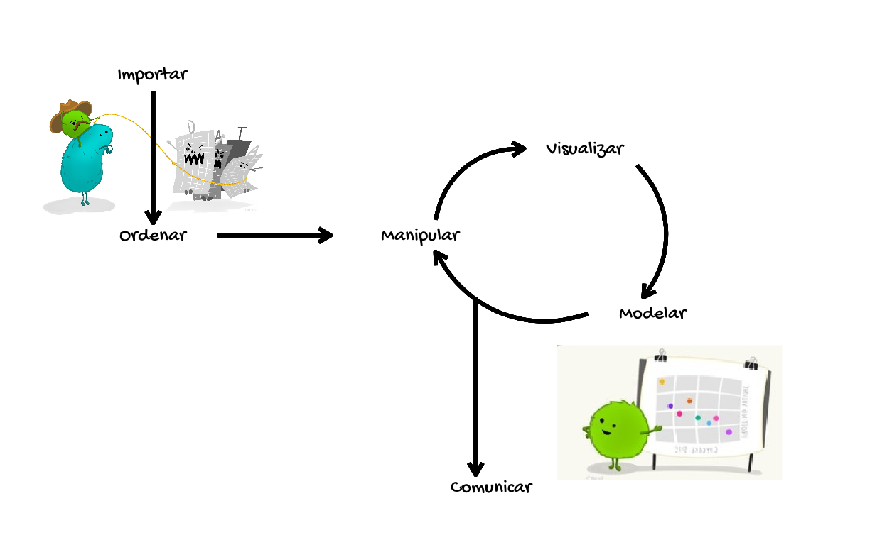  
```

A lo largo del curso podrá encontrar fragmentos de código para realizar ejemplos y ejercicios de codificación. Abajo encontrara como podrán ser usados:

:::example
#### Fragmentos de código para realizar ejemplos
Los ejemplos contienen código previamente escrito para que pueda explorarlo y ejecutarlo presionando el botón amarillo "Run Code" (ejecutar) en la esquina superior derecha. Puede actualizar el código en cualquiera de los ejemplos presionando "Start Over" (iniciar de nuevo) en la esquina superior izquierda y el código se restablecerá automáticamente al valor predeterminado.
:::

```{r addition_ejemplos, exercise = TRUE}

```

:::exercise
#### Fragmentos de código para realizar ejercicios de codificación
Aquí se indican ejercicios prácticos de codificación donde se le pedirá que escriba el código manualmente. Si no da con la solución, puede buscar ayuda dando clic en los botones "Solution" (solución) o "Hints" (sugerencias). En la mayoría de los casos el código podrá ser evaluado con el botón "Submit Answer" (Enviar Respuesta), indicándole cuando la respuesta sea acertada.
:::

```{r exercise_ejercicios, exercise = TRUE}

```

```{r exercise_ejercicios-solution}
#Ejercicio_código
```

También se encontrara con el siguiente bloque informativo:

:::caution
#### Bloque informativo de aclaración
En ocasiones se dara alguna recomendación sobre un tema. Este bloque se usará para llevar a cabo esto.
:::

<br>

### Acerca de nosotros

<div class="row">
  <div class="col-md-6" markdown="1">
  __Jorge Leonardo López Martínez__ es zootecnista con interés en el uso de la programación y la bioestadística aplicada al campo de la genética animal.
  <HR>
  <i class="fab fa-black-tie"></i> [leo4luffy.github.io](https://leo4luffy.github.io/)<br>
  <i class="fas fa-envelope"></i> jollopezma@unal.edu.co<br>
  <i class="fa fa-github"></i> [Leo4Luffy](https://github.com/Leo4Luffy)
  </div>
  <div class="col-md-6" markdown="1">
  __Duvan Ariel Nieves Ruiz__ es estudiante de ingeniería ambiental apasionado por el software libre con interés en la ecología y la programación.
  <HR>
  <i class="fab fa-black-tie"></i> [duvancho321.github.io](https://duvancho321.github.io/)<br>
  <i class="fas fa-envelope"></i> dnieves@unal.edu.co<br>
  <i class="fa fa-github"></i> [Duvancho321](https://github.com/Duvancho321)
  </div>
</div>

<br>

No dude en comunicarse con nosotros por correo electrónico si tiene preguntas acerca del curso y su contenido.

Tenga en cuenta que este curso está bajo la licencia <a rel="license" href="http://creativecommons.org/licenses/by-nc-sa/4.0/">Creative Commons Attribution-NonCommercial-ShareAlike 4.0 International License</a>. Por tanto el contenido del curso debe acreditarse a sus autores.

<section style="text-align: center;"><a rel="license" href="http://creativecommons.org/licenses/by-nc-sa/4.0/"></a><br/></section>

## 1. Una breve introducción al R

### 1.1 ¿Qué es el `R`?

`R` es un lenguaje de programación creado por __Robert Gentleman__ y __Ross Ihaka__ en el año de 1992. Ambos creadores le dieron el nombre de `R` al lenguaje implementado por las iniciales de sus nombres (a modo de broma).

```{r, echo = FALSE, eval = TRUE, out.width = "28%", fig.align = "center"}
knitr::include_graphics("images/Creadores.jpg")
```

Se trata de un lenguaje __interpretado__ o de script, con __tipado dinámico__, __multiplataforma__ y __orientado a objetos__:

+ __Lenguaje interpretado__ o de script: se ejecuta utilizando
un programa intermedio llamado __intérprete__ (IDE).

+ __Orientado a objetos__: `R` realiza acciones objetos (un número, un conjunto de datos, una palabra o un resumen estadístico como una media o varianza).

:::example
#### Ejemplo 1.1.1
:::

```{r addition_eje, exercise = TRUE}

a <- 12

b <- c(4, 6, 8, 12)

c <- matrix(data = 1:4,
            nrow = 2,
            ncol = 2)
```

:::caution
Para crear nuevos objetos en `R`, se debe hacer la __asignación__ del objeto. La asignación de objetos es la forma de almacenar información. Para hacer una asignación, se suele emplear el simbolo __<-__. Por ejemplo la notación __a <- ...__, asigna __...__ (lo que se quiere almacenar) al objeto __a__.
:::

+ __Multiplataforma__: el intérprete de `R` está disponible en muchas plataformas (Linux, Windows, UNIX, Mac OS, etc), por lo que podrá ejecutarse en muchos computadores.

+ __Tipado dinámico__: se refiere a que no es necesario
declarar el __tipo de dato__. A su vez, `R` es __fuertemente tipado__.

:::example
#### Ejemplo 1.1.2
:::

```{r addition, exercise = TRUE}

a <- 'Hola'
typeof(a)

b <- 1L
typeof(b)

c <- 12.3
typeof(c)

d <- 1 + 2i
typeof(d)

e <- c(FALSE, TRUE)
typeof(e)
```

### 1.2 ¿Por qué usar `R`?

El lenguaje de programación `R` se puede obtener y distribuir de forma gratuita, debido a que se encuentra bajo __Licencia Pública General__ del proyecto GNU. Por lo tanto es un programa de código abierto y gratis.

<div class="row">
  <div class="col-md-8" markdown="1">
  `R` cuenta con una __comunidad__ de usuarios alrededor del mundo. Al contar con una comunidad es posible dar con la solución de algún problema de programación, así como el desarrollo de paquetes utilizados en temas específicos, desarrolados por especialistas en alguna parte del mundo.
  </div>
  <div class="col-md-4" markdown="1">
```{r, echo = FALSE, eval = TRUE, out.width = "54%", fig.align = "center"}
knitr::include_graphics("images/Rday.jpg")
```
<section style="text-align: center;"><small>Encuentro en el [Rday 2019](https://rdaymedellin.github.io/).</small></section>
  </div>
</div>

Finalmente, el uso del `R` garantiza que otro investigador pueda repetir el experimento, comprobar los resultados obtenidos y estar en la condición de ampliar o refutar las interpretaciones del estudio realizado.

```{r, echo = FALSE, eval = TRUE, out.width = "30%", fig.align = "center"}
knitr::include_graphics("images/al_principio_pero_ahora.jpg")
```

<section style="text-align: center;"><small>Ilustracíon hecha por <font color = "black"><u>\@allison_horst</u></font>.</small></section>

__¡No se desanime!__ Los lenguajes de programación como el `R` no son sencillos de aprender, pero con trabajo y motivación vera como en poco tiempo se lograrán grandes avances. 

### 1.3 Instalación de `R` base y RStudio

`R` base es el software básico que contiene el lenguaje de programación `R`. RStudio es un software que facilita la programación en `R`.

#### 1.3.1 `R` base:

<div class="row">
  <div class="col-md-6" markdown="1">
  + Windows: la instalación de `R` base en windows se realiza a través de la [CRAN](https://cran.r-project.org/mirrors.html) (Comprehensive R Archive Network).
  + Linux: la instalación de `R` base en Linux se realiza escribiendo el siguiente código en la terminal:<br>
  <div style="background-color:#262626">
  <font color = "white"><p> sudo apt-get update</p></font>
  <font color = "white"><p> sudo apt-get install r-base r-base-dev</p></font>
  </div>
  </div>
  <div class="col-md-6" markdown="1">
```{r, echo = FALSE, eval = TRUE, out.width = "54%", fig.align = "center"}
knitr::include_graphics("images/consola_R_base.jpg")
```
  </div>
</div>

#### 1.3.2 RStudio:

<div class="row">
  <div class="col-md-6" markdown="1">
  Se puede instalar directamente desde la [página de RStudio](https://rstudio.com/products/rstudio/download/). Hay se encuentran los archivos de instalación tanto en windows como en Linux.
  
  Cuando se abre RStudio se pueden ver cuatro paneles: 
  </div>
  <div class="col-md-6" markdown="1">
```{r, echo = FALSE, eval = TRUE, out.width = "34%", fig.align = "center"}

```
  <section style="text-align: center;"><small>Ilustracíon hecha por <font color = "black"><u>\@allison_horst</u></font>.</small></section>
  </div>
</div>

+ La fuente: la libreta de notas para el código

```{r, echo = FALSE, eval = TRUE, out.width = "64%", fig.align = "center"}
knitr::include_graphics("images/source_RStudio.jpg")
```

:::caution
Un texto insertado en el código el cual es omitido en la ejecución, se denomina como __comentario__. En `R`, un comentario es un texto que comienza con el símbolo __#__ y se extiende hasta el final de la línea. Este permite que `R` no intente interpretarlo como parte del código.
:::

+ La consola: el corazón de `R`

```{r, echo = FALSE, eval = TRUE, out.width = "64%", fig.align = "center"}
knitr::include_graphics("images/console.jpg")
```

+ El ambiente / el historial

<div class="row">
  <div class="col-md-6" markdown="1">
```{r, echo = FALSE, eval = TRUE, out.width = "64%", fig.align = "center"}
knitr::include_graphics("images/environment.jpg")
```
  </div>
  <div class="col-md-6" markdown="1">
```{r, echo = FALSE, eval = TRUE, out.width = "64%", fig.align = "center"}
knitr::include_graphics("images/history.jpg")
```
  </div>
</div>

+ Los archivos / las gráficas / la ayuda / los paquetes

<div class="row">
  <div class="col-md-6" markdown="1">
```{r, echo = FALSE, eval = TRUE, out.width = "64%", fig.align = "center"}
knitr::include_graphics("images/files.jpg")
```
  </div>
  <div class="col-md-6" markdown="1">
```{r, echo = FALSE, eval = TRUE, out.width = "64%", fig.align = "center"}
knitr::include_graphics("images/plots.jpg")
```
  </div>
</div>

<br>

<div class="row">
  <div class="col-md-6" markdown="1">
```{r, echo = FALSE, eval = TRUE, out.width = "64%", fig.align = "center"}
knitr::include_graphics("images/help.jpg")
```
  </div>
  <div class="col-md-6" markdown="1">
```{r, echo = FALSE, eval = TRUE, out.width = "64%", fig.align = "center"}
knitr::include_graphics("images/packages.jpg")
```
  </div>
</div>

### 1.4 Los paquetes en `R`

<div class="row">
  <div class="col-md-5" markdown="1">
Los paquetes en `R` son colecciones de funciones y conjunto de datos desarrollados por la comunidad. Un paquete de `R` incluye código, documentación para su uso y conjuntos de datos.

Existen dos formas de instalar nuevos paquetes en `R`:

1) Descargarlos de la [CRAN](https://cran.r-project.org/mirrors.html) (Comprehensive R Archive Network) por medio de la función `install.packages()`.

:::example
#### Ejemplo 1.4.1
:::
  </div>
  <div class="col-md-7" markdown="1">
```{r, echo = FALSE, eval = TRUE, out.width = "62%", fig.align = "center"}
knitr::include_graphics("images/Lenguajes_en_paquetes_R.jpg")
```
<section style="text-align: center;"><small>Ilustracíon hecha por <font color = "black"><u>\@spren9er</u></font>.</small></section>
  </div>
</div>

```{r addition_4, exercise = TRUE}
install.packages('tidyr', 'dplyr', 'ggplot2')
```

2) Mediante el uso del paquete `devtools`, el cual permite instalar paquetes alojados en distintos servidores:

  + `install_bioc()` desde [Bioconductor](https://www.bioconductor.org/).
  + `install_cran()` desde [CRAN](https://cran.r-project.org/index.html).
  + `install_git()` desde un repositorio [git](https://git-scm.com/).
  + `install_github()` desde [GitHub](https://github.com/).

:::example
#### Ejemplo 1.4.2
:::

```{r addition_5, exercise = TRUE}
install.packages('devtools')
devtools::install_github('tidyverse/dplyr')
```

Una vez haya instalado un paquete, estará en la computadora. Si se desea usar una función o un conjunto de datos del paquete instalado, debe cargar el paquete en la sesión de `R`. Para esto, existen dos formas:

1) Con la notación `nombrepaquete::nombrefunción()` para hacer un uso temporal de la función o conjunto de datos.

:::example
#### Ejemplo 1.4.3
:::

```{r addition_8, exercise = TRUE}
dplyr::starwars
```

:::caution
Una ventaja del método anterior es que es inmediatamente claro para cualquier persona que lea el código qué paquete contiene la función. Sin embargo, un inconveniente es que si usa una función de un paquete con frecuencia, lo obliga a volver a escribir constantemente el nombre del paquete.
:::

2) Cargándolo en la memoria del computador mediante el uso de la función `library()` si su uso es permanente.

:::example
#### Ejemplo 1.4.4
:::

```{r addition_9, exercise = TRUE}
library(dplyr)
Datos_starwars <- starwars
```

Para acceder a la descripción de un paquete desde `R` se puede emplear las funciones `packageDescription()` y `help()`.

:::example
#### Ejemplo 1.4.5
:::

```{r addition_6, exercise = TRUE}
packageDescription('dplyr')
help(package = 'dplyr')
```

Otras funciones que permiten la gestión de los paquetes instalados en el computador:

```{r addition_7, exercise = TRUE}
installed.packages() # Para ver que paquetes se tienen instalados.
remove.packages('dplyr') # Si se desease eliminar un paquete (en este caso el paquete dplyr).
old.packages() # Para comprobar que paquetes necesitan ser actualizados.
update.packages() # Para actualizar todo los paquetes instalados.
```

### 1.5 Trabajando con proyectos

Un __directorio de trabajo__ en `R` es el lugar en la computadora en el que se encuentran los archivos con los que se esta trabajando. Es el lugar donde `R` buscara los archivos para importarlos y al que serán exportados.

Con la función `getwd()` se puede encontrar el directorio en el que se esta trabajando.

:::example
#### Ejemplo 1.5.1
:::

```{r addition_10, exercise = TRUE}
getwd() # Da como resultado la ruta "/home/leo/Escritorio/github/Un_curso_amigable_sobre_R".
```

Para cambiar el directorio de trabajo se puede emplear la función `setwd()`, dando como argumento la ruta del directorio que se quiere usar. 

:::example
#### Ejemplo 1.5.2
:::

```{r addition_11, exercise = TRUE}
setwd(dir = "/home/leo/Escritorio/Curso_estadística") # Se cambia el directorio de trabajo a la carpeta Curso_estadistica.
```

Sin embargo como señala [Jenny Bryan](https://www.tidyverse.org/blog/2017/12/workflow-vs-script/), con la función `setwd()` es practicamente imposible para cualquier otra persona que no sea el autor original del código `R`, en su computadora, hacer que las rutas de archivo funcionen.<!--"La posibilidad de que el comando setwd() tenga el efecto deseado (hacer que las rutas de archivo funcionen) para cualquier persona además de su autor es 0%. También es poco probable que funcione para el autor dentro de uno o dos años o para computadoras a partir de ahora. El proyecto no es autónomo y portátil. Para recrear y tal vez extender esta trama, el destinatario afortunado deberá editar manualmente uno o más caminos para reflejar dónde ha aterrizado el proyecto en su máquina. Cuando haces esto por 73a vez en 2 días, mientras marcas una tarea, comienzas a fantasear con encender la computadora del perpetrador."--> La solución consistiría en trabajar con __proyectos__. 

<div class="row">
  <div class="col-md-5" markdown="1">
  Un proyecto es un directorio de trabajo nombrado como un archivo __.Rproj__. Cuando se abre un proyecto, el directorio de trabajo se establecerá automáticamente en el directorio en el que se encuentra el archivo __.Rproj__.
  
  El archivo __.Rproj__ se puede crear yendo a "File" (archivo) &#8594; "New Project..." (nuevo proyecto) en RStudio, que luego se asocia con la carpeta o directorio especificado. 
  
  Configurar un directorio de trabajo correctamente también ayuda a desarrollar buenos hábitos que conducen a un __análisis reproducible__.
  </div>
  <div class="col-md-7" markdown="1">
```{r, echo = FALSE, eval = TRUE, out.width = "60%", fig.align = "center"}
knitr::include_graphics("images/Proyectos.jpg")
```

<section style="text-align: center;"><small>Ilustracíon hecha por <font color = "black"><u>\@allison_horst</u></font>.</small></section>
  </div>
</div>

#### 1.5.1 Estructurando el directorio de trabajo

Además de usar proyectos, también es una buena práctica estructurar el directorio de una manera que ayude a cualquier persona con la que se esta colaborando, o una versión futura de usted intente reproducir algunos análisis.

```{r, echo = FALSE, eval = TRUE, out.width = "74%", fig.align = "center"}
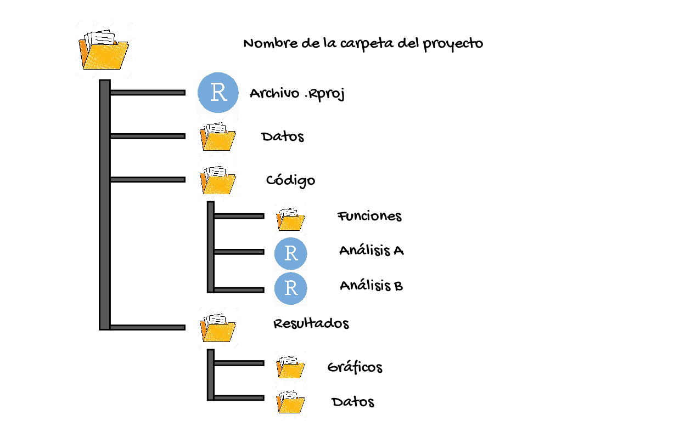  
```

## 2. Operaciones básicas en R

Antes de realizar operaciones sobre algunos objetos en `R`, veamos cuales de estas podemos realizar.

* Suma y diferencia (+, -)
* Producto y división (*, /)
* Potencia (^, **)
* Residuo (%%)
* Mayor, mayor o igual, menor, menor o igual, igual y diferente que (>, >=, <, <=, ==, !=)
* Conjunción (&, &&), disyunción (|, ||)

### Indexación

Dentro de los múltiples objetos de `R` sean estos simples como un vector o compuestos como un dataframe debemos tener claro el manejo de nuestra información, por lo cual es necesario saber cómo acceder a ella, segmentarla, seleccionarla y/o cambiarla. Para cualquiera de los casos se utiliza la indexación, lo cual significa que los elementos de nuestros objetos están identificados usualmente mediante un índice entero que inicia con el número uno `[1]`.

En las secciones posteriores se explorará cada objeto con detalle, abordando las distintas operaciones que se pueden realizar sobre cada uno de ellos incluyendo la segmentación, selección y modificación.


<div class="row">
  <div class="col-md-6" markdown="1">
```{r,echo=F, comment=""}
print("[1][2][3][4][5][6][7][8][9]")
11:19
```
  </div>
  <div class="col-md-6" markdown="1">
```{r,echo=F,comment=""}
matrix(1:25,nrow = 5)
```
  </div>
</div>

### Coerción

Existe una forma de convertir el tipo de un vector o matriz a otro tipo y para ello se cuentan con funciones base del tipo `as.*`

+------------------+--------------------------------------+
| Función          | Acción                               |
+==================+======================================+
| `as.character()` | Convertir objetos a tipo caracter    |
+------------------+--------------------------------------+
| `as.complex()`   | Convertir objetos a tipo complejo    |
+------------------+--------------------------------------+
| `as.data.frame()`| Convertir objetos a tipo dataframe   |
+------------------+--------------------------------------+
| `as.Date()`      | Convertir objetos a tipo fecha       |
+------------------+--------------------------------------+
| `as.double()`    | Convertir objetos a tipo doble       |
+------------------+--------------------------------------+
| `as.factor()`    | Convertir objetos a tipo factor      |
+------------------+--------------------------------------+
| `as.integer()`   | Convertir objetos a tipo entero      |
+------------------+--------------------------------------+
| `as.list()`      | Convertir objetos a tipo lista       |
+------------------+--------------------------------------+
| `as.logical()`   | Convertir objetos a tipo lógico      |
+------------------+--------------------------------------+
| `as.matrix()`    | Convertir objetos a tipo matriz      |
+------------------+--------------------------------------+
| `as.numeric()`   | Convertir objetos a tipo numérico    |
+------------------+--------------------------------------+
| `as.POSIXct()`   | Convertir objetos a tipo fecha y hora|
+------------------+--------------------------------------+
| `as.vector()`    | Convertir objetos a tipo vector      |
+------------------+--------------------------------------+

### Funciones de prueba 

En algunos casos diferenciar o reconocer el tipo de un vector o matriz que se tiene no es tan simple, en estos casos se utiliza la función `typeof()`, sin embargo existe también la opción de utilizar funciones que devuelvan valores de `TRUE` o `FALSE`.  En las funciones base de `R` se encuentran funciones del tipo `is.*`. Una alternativa a las funciones base de `R` son las del paquete **purr** los cuales son del tipo `is_*`

+------------------+-----------------+
| R base           | purr            |
+==================+=================+
| `is.logical()`   | `is_logical()`  |
+------------------+-----------------+
| `is.integer()`   | `is_integer()`  |
+------------------+-----------------+
| `is.double()`    | `is_double()`   |
+------------------+-----------------+
| `is.numeric()`   | `is_numeric()`  |
+------------------+-----------------+
| `is.character()` | `is_character()`|
+------------------+-----------------+
| `is.list()`      | `is_list()`     |
+------------------+-----------------+
| `is.vector()`    | `is_vector()`   |
+------------------+-----------------+

### Funciones útiles

En `R` se cuenta con las conocidas funciones base, muchas con utilidades matemáticas o estadísticas. A continuación podra ver algunas de ellas los cuales pueden ser muy útiles en cualquier proyecto de análisis. 

+-------------+-------------------------------------------------------------------+
| Función     | Acción                                                            |
+=============+===================================================================+
| `str()`     | Devuelve la estructura de un objeto                               |
+-------------+-------------------------------------------------------------------+
| `sample()`  | Toma una muestra del tamaño especificado de determiando objeto    |
+-------------+-------------------------------------------------------------------+
| `length()`  | Calcula el número de elementos del objeto                         |
+-------------+-------------------------------------------------------------------+
| `nrow()`    | Calcula el número de filas en un objeto de dos dimensiones        |
+-------------+-------------------------------------------------------------------+
| `ncol()`    | Calcula el número de columnas en un objeto de dos dimensiones     |
+-------------+-------------------------------------------------------------------+
| `table()`   | Devuelve tablas de contingencia de conteos                        |
+-------------+-------------------------------------------------------------------+
| `sort()`    | Ordena los elementos de un vector ascendentemente                 |
+-------------+-------------------------------------------------------------------+
| `order()`   | Devuelve una permutación que reorganiza su primer argumento       |
+-------------+-------------------------------------------------------------------+
| `round()`   | Redondea los valor sin decimales por defecto                      |
+-------------+-------------------------------------------------------------------+
| `floor()`   | Devuelve el entero más grande que no sea mayor que el número dado |
+-------------+-------------------------------------------------------------------+
| `sqrt()`    | Calcula la raíz cuadrada de un vector numérico                    |
+-------------+-------------------------------------------------------------------+
| `sum()`     | Calcula la suma de los elementos del objeto                       |
+-------------+-------------------------------------------------------------------+
| `prod()`    | Calcula la producto de los elementos del objeto                   |
+-------------+-------------------------------------------------------------------+
| `abs()`     | Devuelve el valor absoluto de un vector numérico                  |
+-------------+-------------------------------------------------------------------+
| `mean()`    | Calcula la media de un vector numérico                            |
+-------------+-------------------------------------------------------------------+
| `median()`  | Calcula la media de un vector numérico                            |
+-------------+-------------------------------------------------------------------+
| `sd()`      | Calcula la desviacion estandar de un vector numérico              |
+-------------+-------------------------------------------------------------------+
| `IQR()`     | Calcula el rango intercuartílico de un vector numérico            |
+-------------+-------------------------------------------------------------------+
| `var()`     | Calcula la varianza estandar de un vector numérico                |
+-------------+-------------------------------------------------------------------+
| `cor()`     | Calcula la correlación de dos vectores numéricos                  |
+-------------+-------------------------------------------------------------------+
| `quantile()`| Devuelve los cuantiles seleccionados de un vector numérico        |
+-------------+-------------------------------------------------------------------+

<details><summary>2.1 Operaciones con vectores</summary> 

Antes de iniciar con ejemplos y ejercicios se debe tener presente que un vector es una colección de elementos de la misma clase atómica, es decir que un vector puede contener `n` elementos del mismo tipo, ya sean estos números, caracteres, factores o lógicos, y nunca podrán ser de dos o más tipos. A medida que vea los ejemplos y realice los ejercicios aprenderá distintas formas de crear vectores.

A continuación podra observar vectores con distintas clases atómicas y qué sucede si intenta mezclarlas.

:::example
#### Ejemplo 2.1.1
:::

```{r addition_211, exercise = TRUE}
#Vector numérico
num <- c(1, 2, 3, 4, 5)
num
#Vector de caracteres
let <- c("a", "b", "c", "d", "e", "f")
let
#Vector de Factores
fac <- factor(c("f1", "f2", "f3", "f2", "f1"))
fac
#Vector logico
log <- c(TRUE, FALSE, TRUE, TRUE, TRUE, FALSE)
log
#mezcla de clases atomicas
c(num, let)
c(num, log)
```

Como vio en la última parte, al mezclar dos clases atómicas no se obtiene un error. Sin embargo los vectores mezclados toman la clase solo de uno de ellos (la más compleja). En el primero, los números de `num` quedan entre comillas, lo cual implica que ahora son caracteres, de igual forma en el vector de valores lógicos `log`, los elementos son convertidos a su equivalente numérico.

A continuación se plantea un ejemplo en el cual se genera un vector de prueba, y con el mismo se realizará algunas operaciones aritméticas básicas como suma, resta, división, multiplicación y exponenciación.

Operaciones de suma.

:::example
#### Ejemplo 2.1.2
:::

```{r addition_212, exercise = TRUE}
#Vector de prueba
x <- c(1:8)
x
#Suma sobre cada elemento del vector de prueba
test_1 <- x + 2
test_1
#Suma repetitiva sobre los elementos del vector de prueba
test_2 <- x + c(10, 20)
test_2
#Suma uno a uno sobre nuestro vector de prueba 
test_3 <- x + c(8:1) 
test_3
```

De igual forma se puede utilizar la resta. Te invito a que restablezcas el vector de prueba `x` a partir de los vectores test_1, test_2, test_3. Para ello copia los vectores del fragmento de código anterior y crear de nuevo el vector `x`. __¡Vamos confio en que podrás hacerlo!__

:::exercise
#### Ejercicio 2.1.1
:::

```{r exe_211, exercise = TRUE}
test_1 <- c(1:8) + 2
test_2 <- c(1:8) + c(10, 20)
test_3 <- c(1:8) + 8:1
# Ahora es tu turno
```

```{r exe_211-solution}
test_1 - 2
test_2 - c(10, 20)
test_3 - 8:1
```

```{r exe_211-check}
grade_code("Excelente lo lograste, sigamos adelante")
```

Vamos ahora con la operación de producto. 

:::example
#### Ejemplo 2.1.3
:::

```{r addition_213, exercise = TRUE}
#Vector de prueba
y <- seq(2, 20, 2)
y
#Producto sobre cada elemento del vector de prueba
test_1 <- y*2
test_1
#Producto repetitivo sobre los dos elementos del vector de prueba
test_2 <- y * c(5, 7)
test_2
#Producto uno a uno sobre nuestro vector de prueba 
test_3 <- y * 10:1 
test_3
```

Ya que vimos cómo funciona el producto en `R`, te propongo que utilizando la operación inversa restablezcas el vector de prueba `y`. __¡Intentalo, se que podrás hacerlo!__

:::exercise
#### Ejercicio 2.1.2
:::

```{r exe_212, exercise = TRUE}
test_1 <- seq(2, 20, 2) * 2
test_2 <- seq(2, 20, 2) * c(5, 7)
test_3 <- seq(2, 20, 2) * 10:1 
# Ahora es tu turno
```

```{r exe_212-solution}
test_1 / 2
test_2 / c(10, 20)
test_3 / 10:1
```

```{r exe_212-check}
grade_code("Excelente lo lograste, sigamos adelante")
```

Hagamos un ejercicio un poco más corto para la potenciación y su operación inversa. Para esto, calcule la séptima potencia del 4 y la raíz cúbica del 27. Te dejamos un par de ejemplos para que puedas guiarte. 

:::exercise
#### Ejercicio 2.1.3
:::

```{r exe_213, exercise = TRUE}
8**5
16**(1/4)
# Ahora es tu turno
```

```{r exe_213-solution}
4**7
27**(1/3)
```

```{r exe_213-check}
grade_code("Excelente lo lograste, sigamos adelante")
```

Ahora hagamos un par de ejercicios de operaciones lógicas, los cuales son muy útiles  en cualquier campo de la programación y del análisis. Crearemos un vector de prueba y de él seleccionaremos los elementos que cumplan la condición específica de ser menores a 20.

:::example
#### Ejemplo 2.1.4
:::

```{r addition_214, exercise = TRUE}
#Vector de prueba
vec <- seq(1, 100, length.out = 20)
vec
#Condición
filt_1 <- vec < 20
filt_1
#Selección
vec_filt <- vec[filt_1]
vec_filt
```

Encontremos ahora dentro de un vector de prueba los números diferentes de los pares, de igual manera te invito a que encuentres los números pares modificando el ejercicio planteado.

:::exercise
#### Ejercicio 2.1.4
:::

```{r exe_214, exercise = TRUE}
#Vector de prueba
vec <- seq(1, 150, 3)
vec
#Condición y selección
vec[vec%%2 != 0]
# Ahora es tu turno
```

```{r exe_214-solution}
vec[vec%%2 == 0]
```

```{r exe_214-check}
grade_code("Excelente lo lograste, sigamos adelante")
```

Veamos ahora una ejercicio con dos condiciones simultáneas y deberás realizar una operación similar para nuestro vector de prueba, en el cual elegirás los valores mayores a 15 y menores a 80.

* `r fa("far fa-sticky-note")`Recuerda los operadores lógicos que nombramos en la parte inicial de esta sección.

:::exercise
#### Ejercicio 2.1.5
:::

```{r exe_215, exercise = TRUE}
#Vector de prueba
vec <- seq(1, 100, length.out = 20)
vec
#Condición y selección
vec[vec>90 | vec<45]
# Ahora es tu turno
```

```{r exe_215-solution}
vec[vec>15 &  vec<80]
```

```{r exe_215-check}
grade_code("Excelente lo lograste, sigamos adelante")
```

Trabajemos ahora algunos ejercicios de indexación que nos permitan segmentar y modificar nuestros vectores. Veamos cómo tomar una sección de nuestro vector de prueba y además modificar algunos de sus valores.

* `r fa("far fa-sticky-note")`Recuerda que la indexación en `R` inicia con uno `[1]`

:::example
#### Ejemplo 2.1.5
:::

```{r addition_215, exercise = TRUE}
#Vector de prueba
vec <- letters
vec
#Seleccion
vec[1:10] #primeras 10 letras
vec[-16:-1] # ultimas 10 letras 
#Modificación
vec[1] = "letra.a" #solo la primera posición
vec
vec[c(1, 26)] = c("la.letra.a","la.letra.z") #multiples posiciones
vec
```

Exclusivamente para los ejemplos de selección de los primeros y los últimos elementos de un objeto se pueden utilizar las funciones `head()`  y `tail()`, respectivamente. 

```{r addition_2151, exercise = TRUE}
#Vector de prueba
vec <- letters
#Seleccion
head(vec, 10)#primeras 10 letras
tail(vec, 10)#ultimas 10 letras 
```

Observemos un ejemplo en el que se acceda a elementos de un vector para hacer operaciones con estos.

:::example
#### Ejemplo 2.1.6
:::

```{r addition_216, exercise = TRUE}
#Vectores de prueba
vec1 <- 20:40
vec2 <- letters
#Operaciones
vec1[5] + vec1[21] #operaciones aritmeticas uno a uno
vec1[c(5, 10)] + vec1[c(18, 21)] #operaciones aritmeticas 
paste0(vec2[3], vec2[18], vec2[1], vec2[14]) #concatenar caracteres 
```

Como último ejemplo de esta sección visualicemos las conversiones y veamos su efectividad utilizando las funciones de prueba.

:::example
#### Ejemplo 2.1.7
:::

```{r addition_217, exercise = TRUE}
#Vectores de prueba
vec1 <- 20:40
vec2 <- letters
vec3 <- c(TRUE, FALSE, TRUE, TRUE, TRUE, FALSE)
#conversiones
test_1 <- as.character(vec1)
test_2 <- as.factor(vec2)
test_3 <- as.numeric(vec3)
#funciones de prueba
is.character(test_1)
is.factor(test_2)
is.numeric(test_3)
```

Como último ejercicio de esta sección deberás generar dos vectores uno que corresponda a la secuencia de números de 50 a 75 con una longitud de 20 elementos y otro vector con los números del 35 al -8. Estos vectores tendrán el nombre de `vec1` y `vec2`, respectivamente. `filt1` será un vector que cumpla la condición de números mayores a 64 de `vec1`, mientras que `filt2` será la selección de los números pares de `vec2`. Para `filt1` calcularemos la media y para `filt2` obtendremos la suma de los valores absolutos de las posiciones 2, 3, 7, 19, 20, 21 y 22. 

* `r fa("far fa-sticky-note")` Recuerda lo aprendido anteriormente y ten presente las funciones útiles nombradas al inicio de esta sección. 

:::exercise
#### Ejercicio 2.1.6
:::

```{r exe_216, exercise = TRUE}
#Vector de prueba
vec1 <- 
vec2 <- 
filt_1 <- 
filt_2 <- 
```

```{r exe_216-solution}
vec1 <- seq(50, 75, length.out = 20)
vec2 <- 35:-8
filt_1 <- vec1 > 64
filt_2 <- vec2[vec2 %% 2 == 0 ]
mean(filt1)
sum(abs(filt_2[c(2, 3, 7, 19:22)]))
```

```{r exe_216-check}
grade_code("Excelente lo lograste, sigamos adelante")
```

</details>

<details><summary>2.2 Operaciones con matrices </summary> 

Ahora trabajaremos con las matrices, que desde la perspectiva de `R` son vectores con el atributo `dim` definido como un vector entero de dos elementos: número de filas y número de columnas. Las matrices son útiles para almacenar muchos datos y son bastante similares a las hojas de cálculo de Excel, puede pensar en ellas como un conjunto de `n` vectores de la misma longitud.

En lo que se refiere a matrices, la indexación funciona nombrando primero las filas y después las columnas, de tal forma que teniendo una matriz `M` de dimensiones `mxn` se tendran `m` filas y `n` columnas. Si utiliza el comando `M[1,]` obtendra la primera fila  y al utilizar `M[,1]` obtendra la primera columna. Más adelante abordaremos ejercicios que nos permitan manejar e identificar las columnas y filas de una matriz.

<div class="row">
  <div class="col-md-6" markdown="1">
```{r,echo=F, comment=""}
matrix(1:25, nrow = 5)
```
  </div>
  <div class="col-md-6" markdown="1">
```{r,echo=F,comment=""}
m <- matrix(1:25, nrow = 5)
print("M[1,]")
m[1,]
print("M[,1]")
m[,1]
```
  </div>
</div>

Generalmente las matrices en `R` tienen connotación matemática y pese a ser utilizadas para almacenar información, debe recordar que todos sus elementos sólo pueden pertenecer a un solo tipo ya sea numérico, lógico o caracter. Teniendo presente esto veamos los operadores y funciones que pueden resultarnos útiles en el contexto matemático y operativo de `R`. 

+---------------+---------------------------------+
| Función       | Acción                          |
+===============+=================================+
| `dim(M)`      | Dimesión de la matriz           |
+---------------+---------------------------------+
| `t(M)`        | Transpuesta de la matriz        |
+---------------+---------------------------------+ 
| `det(M)`      | Determinate de la matriz        |
+---------------+---------------------------------+
| `solve(M)`    | Inversa de la matriz            |
+---------------+---------------------------------+
| `diag(M)`     | Diagonal de la matriz           |
+---------------+---------------------------------+
| `M1%*%M2`     | Producto matricial              |
+---------------+---------------------------------+
| `colSums(M)`  | Suma por colunnas de la Matriz  |
+---------------+---------------------------------+
| `rowSums(M)`  | Suma por filas de la Matriz     |
+---------------+---------------------------------+
| `colMeans(M)` | Media por colunnas de la Matriz |
+---------------+---------------------------------+
| `rowMeans(M)` | Media por filas de la Matriz    |
+---------------+---------------------------------+
| `cbind()`     | Unir vectores por columnas      |
+---------------+---------------------------------+
| `rbin()`      | Unir vectores por filas         |
+---------------+---------------------------------+

Generemos una matriz de prueba y realicemos algunas operaciones sobre esta, recordando que podemos operar sobre filas y/o columnas. Iniciemos con operaciones aritméticas básicas con vectores.

:::example
#### Ejemplo 2.2.1
:::

```{r addition_221, exercise = TRUE}
#Matriz de prueba
m <- matrix(11:30, nrow = 5)
m
#Producto sobre cada elemento de la matriz de prueba
test_1 <- m*3
test_1
#Potencia repetitiva sobre los elementos de la matriz de prueba (columna)
test_2 <- m **c(2, 3)
test_2
#Suma sobre la matriz de prueba (columna)
test_3 <- m + seq(7, 1, length.out = 20) 
test_3
```

Ahora veamos cómo funcionan las operaciones entre matrices.

:::example
#### Ejemplo 2.2.2
:::

```{r addition_222, exercise = TRUE}
#Matriz de prueba 1
m1 <- 21:40
dim(m1) <- c(5, 4)
#Matriz de prueba 2
m2 <- cbind(1:5, 6:10, 11:15, 16:20)
#suma de matrices
m1 + m2
#Producto uno a uno
m1*m2
#Producto matricial
m1 %*% t(m2)
```

Tratemos de ver otras operaciones directamente con ejercicios. Te invito a que generes la matrices `m1` del ejercicio anterior utilizando la función `rbind()` y `m2` utilizando la función `matrix()`, y posteriormente calcules el producto matricial de `m1` traspuesta con `m2` nombrandolo `m3`. Por último calcula la suma de la diagonal de `m3`.

:::exercise
#### Ejercicio 2.2.1
:::

```{r exe_221, exercise = TRUE}
#Matriz de prueba 1
m1 <- 
#Matriz de prueba 2
m2 <-
#Producto Matricial
m3 <- 
#suma de la diagonal
```

```{r exe_221-solution}
#Matriz de prueba 1
m1 <- rbind(seq(21, 36, 5),
            seq(22, 37, 5),
            seq(23, 38, 5),
            seq(24, 39, 5),
            seq(25, 40, 5))
#Matriz de prueba 2
m2 <- matrix(1:20, nrow = 5)
#Producto Matricial
m3 <- t(m1) %*% m2 
#suma de la diagonal
sum(diag(m3))
```

```{r exe_221-check}
grade_code("Excelente lo lograste, sigamos adelante")
```

En el siguiente ejemplo, calcularemos la suma de los valores de cada columna y determinaremos su representación en porcentaje de la suma calculada. El porcentaje lo aproximáremos a dos cifras decimales y haremos un ejercicio de indexación con este resultado, imprimiendo un vector con los resultados de la diagonal.

:::example
#### Ejemplo 2.2.3
:::

```{r addition_223, exercise = TRUE}
#Matriz de prueba 1
m <- matrix(seq(18, 2, length.out = 16), ncol = 4, byrow = TRUE)
m
#suma de cada columnas
tcol <- colSums(m)
tcol
#Porcentaje de cada columna
pm <- cbind(m[,1]/tcol[1],
            m[,2]/tcol[2],
            m[,3]/tcol[3],
            m[,4]/tcol[4])
pm <- round(pm*100, 2)
pm
#Diagonal con funcion
diag(pm)
#diagonal con índice
c(pm[1,1],pm[2,2],pm[3,3],pm[4,4])
```

Hagamos un ejercicio similar al ejemplo anterior. Para ello usaremos la matriz `m` y calcularemos en `pm` el porcentaje aproximado a tres cifras decimales que cada elemento representa de la suma de cada fila. Con él debemos imprimir un vector con los resultados de la diagonal secundaria.

:::exercise
#### Ejercicio 2.2.2
:::

```{r exe_222, exercise = TRUE}
#Matriz de prueba
m <- matrix(seq(42, 2, length.out = 16), ncol = 4, byrow = TRUE)
#Suma de cada fila
tfil <-
#Porcenatje de cada fila 
pm <- 
#diagonal secundaria
c()
```

```{r exe_222-solution}
#Matriz de prueba
m <- matrix(seq(42, 2, length.out = 16),ncol = 4, byrow = TRUE)
#Suma de cada fila
tfil <- rowSums(m)
#Porcenatje de cada fila 
pm <- rbind(m[1,]/tfil[1],
            m[2,]/tfil[2],
            m[3,]/tfil[3],
            m[4,]/tfil[4])
pm <- round(pm*100,3)
#diagonal secundaria
c(pm[1,4],pm[2,3],pm[3,2],pm[4,1])
```

```{r exe_222-check}
grade_code("Excelente lo lograste, sigamos adelante")
```

Veamos otra forma de solucionar el ejercicio anterior.

```{r exe_2221, exercise = TRUE}
#Matriz de prueba
m <- matrix(seq(42, 2, length.out = 16), ncol = 4, byrow = TRUE)
#matriz transpuesta
tm <- t(m)
#suma de cada columnas,
tcol <- colSums(tm)
#Porcentaje de cada columna
pm <- cbind(tm[,1]/tcol[1],
            tm[,2]/tcol[2],
            tm[,3]/tcol[3],
            tm[,4]/tcol[4])
pm <- round(pm*100,3)
#Diagonal con funcion
c(pm[4,1],pm[3,2],pm[2,3],pm[1,4])

```

Ahora trabajemos lo que se denomina como estandarización sobre una matriz. Para ello, calcule la media y la desviación estándar por columnas y a cada elemento de la columna correspondiente deberas restarle la media y dividir por la desviación estándar. 

:::exercise
#### Ejercicio 2.2.3
:::

```{r}
set.seed(10)
```

```{r exe_223, exercise = TRUE}
#Matriz de prueba
m <- matrix(sample(1:8, 16, replace = TRUE), ncol = 4, byrow = TRUE)
#Media
mmean <- 
#Desviación estandar
msd <-
#Estandarización
sm <- 
#Resultado
sm
```

```{r}
set.seed(20)
```

```{r exe_223-solution}
#Matriz de prueba
m <- matrix(sample(1:8, 16, replace = TRUE), ncol = 4, byrow = TRUE)
#Media
mmean <- colMeans(m)
#Desviación estandar
msd <- c(sd(m[,1]),
         sd(m[,2]),
         sd(m[,3]),
         sd(m[,4]))
#Estandarización
sm <- cbind((m[,1]-mmean[1])/msd[1],
            (m[,2]-mmean[2])/msd[2],
            (m[,3]-mmean[3])/msd[3],
            (m[,4]-mmean[4])/msd[4])  
#Resultado
sm
```

```{r exe_223-check}
grade_code("Excelente lo lograste, sigamos adelante")
```

Para tener una mayor comprensión de la indexación en las matrices, nombremos cada una de las filas y de las columnas de un matriz `m`, y llamemos las filas y las columnas individualmente, tambien los elementos individuales y por último modifiquemos algunos valores.

:::example
#### Ejemplo 2.2.4
:::

```{r addition_224, exercise = TRUE}
#Matriz de prueba 1
m <- matrix(letters[1:25], ncol = 5, byrow = TRUE)
m
#nombre de filas y columnas
rownames(m) <- c("fila1", "fila2", "fila3", "fila4", "fila5")
colnames(m) <- c("columna1", "columna2", "columna3", "columna4", "columna5")
m
#llamado filas y columnas
m["fila2",]
m[,"columna3"]
#llamado letra "r"
m["fila4", "columna3"]
m[4,3]
#modificaciones
m["fila2", "columna5"] <- "letraj"
m[5,2] <- "letrav"
m
```

Para afianzar algunos conceptos trabajaremos sobre la matriz `m`. Para esto, tendrás que calcular la suma y la media tanto por filas como por columnas, añadirlas a la matriz original utilizando `cbind`  y `rbind`, y por último nombrar cada una de las filas y de las columnas añadiendo los nombres contenidos en los vectores `rname` y `cname`

:::exercise
#### Ejercicio 2.2.4
:::

```{r}
set.seed(25)
```

```{r exe_224, exercise = TRUE}
#Matriz de prueba
m <- matrix(sample(1:16, 16), ncol = 4, byrow = TRUE)
#vectores
rname <- c("fila1", "fila2", "fila3", "fila4", "csum", "cmean")
cname <- c("columna1", "columna2", "columna3", "columna4", "fsum", "fmean")
#Nueva matriz

#nombres para la matriz 

```

```{r}
set.seed(25)
```

```{r exe_224-solution}
#Matriz de prueba
m <- matrix(sample(1:16, 16), ncol = 4, byrow = TRUE)
#vectores
rname <- c("fila1", "fila2", "fila3", "fila4", "csum", "cmean")
cname <- c("columna1", "columna2", "columna3", "columna4", "fsum", "fmean")
#Nueva matriz
m <- rbind(m, colSums(m), colMeans(m))
m <- cbind(m, rowSums(m), rowMeans(m))
#nombres para la matriz 
rownames(m) <- rname
colnames(m) <- cname
```

```{r exe_224-check}
grade_code("Excelente lo lograste, sigamos adelante")
```

Para finalizar esta sección te invito a que trabajes con la matriz `M`. Primero suma `vec1` a la primera columna de la matriz de prueba, después multiplica el elemento de la primera columna y tercera fila por 1.375, y por último multiplica la tercera columna por `vec2`. Estas operaciones deben hacerse sobre la matriz, de tal forma que al terminar las operaciones y llamar a `M`, está guarde las operaciones realizadas.

:::exercise
#### Ejercicio 2.2.5
:::

```{r exe_225, exercise = TRUE}
#Objetos de prueba
M <- matrix(seq(100, 700, length.out = 9), 3)
vec1 <- c(3, 1.5, 3)*100
vec2 <- c(1, .76, 1/1.75)
#Operaciones

M
```

```{r exe_225-solution}
#Objetos de prueba
M <- matrix(seq(100, 700, length.out = 9), 3)
vec1 <- c(3, 1.5, 1.5)*100
vec2 <- c(1, .76, 1/1.75)
#Operaciones
M[,1] <- M[,1] + vec1
M[3,1] <- M[3,1] * 1.375
M[,3] <- M[,3] * vec2
M
```

```{r exe_225-check}
grade_code("Excelente lo lograste, sigamos adelante")
```

</details>

<details><summary>2.3 Operaciones con conjuntos de datos</summary> 

Los conjuntos de datos, dataframe, son muy similares a las matrices en lo que se refiere a la indexación. Sin embargo, su principal diferencia radica en el tipo de datos que albergan. En las matrices, todos sus elementos pertenecen al mismo tipo de dato, mientras que en los dataframe cada columna puede tener un tipo de dato diferente siempre que las columnas tengan la misma longitud. Ahora creemos un dataframe a partir vectores de diferentes tipos utilizando la función `data.frame()`.

:::example
#### Ejemplo 2.3.1
:::

```{r addition_231, exercise = TRUE}
#vectores de prueba
letras <- letters[1:15]
numeros <- seq(1, 100, length.out = 15)
logicos <- c(TRUE, TRUE, FALSE, FALSE, TRUE, TRUE, TRUE, FALSE, FALSE, FALSE, FALSE, TRUE, TRUE, FALSE, FALSE)
#Dataframe
df <- data.frame(letras, numeros, logicos)
df
#Estructura
str(df)
```

Puede notar que al utilizar la función `data.frame()`, el vector de letras es convertido a factor, lo que en algunos casos puede no ser conveniente. Para evitar este problema se puede utilizar el argumento `stringsAsFactors = FALSE`.

```{r,eval=TRUE,message=FALSE,echo=FALSE}
#vectores de prueba
letras <- letters[1:15]
numeros <- seq(1, 100, length.out = 15)
logicos <- c(TRUE, TRUE, FALSE, FALSE, TRUE, TRUE, TRUE, FALSE, FALSE, FALSE, FALSE, TRUE, TRUE, FALSE, FALSE)
```

```{r,eval=FALSE}
save(letras,file = "data_pkg/letras.rda")
save(numeros,file = "data_pkg/numeros.rda")
save(logicos,file = "data_pkg/logicos.rda")
```

```{r addition_231_1, exercise = TRUE}
#Dataframe
df <- data.frame(letras, numeros, logicos, stringsAsFactors = FALSE)
df
#Estructura
str(df)
```

También puede crear un dataframe a partir de matrices y vectores utilizando la coerción. En el siguiente ejercicio debes convertir los objetos de prueba a conjuntos de datos conservando sus propiedades originales. No olvides verificar su estructura.

* `r fa("far fa-sticky-note")` Recuerda la sección de coerción y las funciones allí nombradas.

:::exercise
#### Ejercicio 2.3.1
:::

```{r exe_231, exercise = TRUE}
#Objetos de prueba
m <- matrix(seq(100, 700, length.out = 9), 3)
letras <- letters[1:15]
#conversión
mdf <- 
mdf
letrasdf <- 
letrasdf
#estructura
str()
str()  
```

```{r exe_231-solution}
#Objetos de prueba
m <- matrix(seq(100, 700, length.out = 9), 3)
letras <- letters[1:5]
#conversión
mdf <- as.data.frame(m)
mdf
letrasdf <- as.data.frame(letras, stringsAsFactors = FALSE)
letrasdf
#estructura
str(mdf)
str(letrasdf) 
```

```{r exe_231-check}
grade_code("Excelente lo lograste, sigamos adelante")
```

Recordemos que los dataframe son similares a las matrices en cuanto a indexación. Para probarlo trabajaremos el siguiente ejercicio con la base de datos `Starwars`.

```{r, eval = TRUE, message = FALSE, echo = FALSE}

data("starwars")
Starwars <- starwars %>% 
  select(-c(12:14))
Starwars <- as.data.frame(Starwars)
```

```{r,eval=FALSE}
save(Starwars, file="data_pkg/Starwars.rda")
```

El ejercicio consiste en seleccionar las primeras 5 columnas de nuestra base de datos, seleccionar las primeras 20 filas de la columna name y por último  seleccionar las filas entre 20 y 40 para las columnas height y mass.

:::exercise
#### Ejercicio 2.3.2
:::

```{r exe_232, exercise = TRUE}
#Primeras 5 columnas
Starwars[]
#primeras 20 filas de name
Starwars[]
#filas entre 20:40 para height y mass.
Starwars[]
```

```{r exe_232-solution}
#Primeras 5 columnas
Starwars[, 1:5]
#primeras 20 filas de name
Starwars[1:20,"name"]
#filas entre 20:40 para height y mass.
Starwars[20:40, c(2, 3)]
```

```{r exe_232-check}
grade_code("Excelente lo lograste, sigamos adelante")
```

Otra posible solución a este ejercicio seria la siguiente.

```{r exe_2321, exercise = TRUE}
#Primeras 5 columnas
Starwars[, c("name", "height", "mass", "hair_color", "skin_color")]
#primeras 20 filas de name
Starwars[1:20, 1]
#filas entre 20:40 para height y mass.
Starwars[20:40, c("height","mass")]
```

Como vimos en el ejercicio anterior podemos acceder a una columna de un dataframe utilizando expresiones del tipo `Starwars[, 1]` o `Starwars[, ”name”]`, sin embargo la forma más popular y simple es utilizar la expresión `Starwars$name`. Esta última no solo permite acceder a una columna de nuestro conjunto de datos, sino que también permite crear nuevas variables. Veamos un ejemplo en el que seleccionemos la columna `species` y creemos una nueva columna que enumere nuestros datos.

:::example
#### Ejemplo 2.3.2
:::

```{r addition_232, exercise = TRUE}
#seleccion
Starwars$species
#nueva variable
Starwars$numero <- 1:nrow(Starwars)
#Nueva Starwars
Starwars
```

```{r,eval=TRUE,message=FALSE,echo=FALSE}
Starwars$numero <- 1:nrow(Starwars)
```

Veamos en acción la función `table()` para conocer el numero de individuos por especies de la base de datos Starwars.

```{r addition_2321, exercise = TRUE,comment=""}
table(Starwars$species)
```

Del fragmento de código anterior sabemos que la gran mayoría de personajes de Starwars son humanos, ahora veamos cómo seleccionar un subconjunto de los datos en el cual solo estén los personajes humanos, conservando también las otras características presentes en la base de datos. Además de ello con `Starwars_human` podemos probar la función `order()` utilizando la masa de los individuos y visualizar los hombres provenientes de Tatooine.

:::example
#### Ejemplo 2.3.3
:::

```{r addition_233, exercise = TRUE}
#Subconjunto
Starwars_human <- Starwars[Starwars$species =="Human",]
Starwars_human
#Ordenar por altura ascendentemente
Starwars_human[order(Starwars_human$mass),]
#Ordenar por altura descendentemente
Starwars_human[order(Starwars_human$mass,decreasing = T),]
#Hombres de Tatooine
Starwars_human[Starwars_human$gender =="masculine" & Starwars_human$homeworld =="Tatooine",]
```

En lo referente a la función `order()` todo salio de acuerdo a lo planteado, sin embargo con los subconjuntos de datos no podemos hacer la misma afirmación, si nos fijamos en el dataset de los  hombres proveniente de Tatooine podemos ver que hay filas totalmente vacías, por esta razón la forma más adecuada y corta  de obtener subconjuntos de datos es con la función `subset()` como veremos a continuación.

```{r addition_2331, exercise = TRUE}
#Subconjunto
Starwars_human <- subset(Starwars, species =="Human")
Starwars_human
#Hombres de Tatooine
subset(Starwars_human,gender =="masculine" & homeworld =="Tatooine")
```

Ahora te invito a que crees un subconjunto de datos con el nombre `Starwars_fem` en el cual debes seleccionar el género femenino y la especie humana, adicionalmente ordena descendentemente el dataset de acuerdo a su altura eliminado la variable sex.

:::exercise
#### Ejercicio 2.3.3
:::

```{r exe_233, exercise = TRUE}
#Subconjunto
Starwars_fem <- 
#Reordenado
Starwars_fem[]
```

```{r exe_233-solution}
#Subconjunto
Starwars_fem <- subset(Starwars, gender == "feminine" & species =="Human")
#Reordenado
Starwars_fem[order(Starwars_fem$height,decreasing = T),c(1:7,9:11)]
```

```{r exe_233-check}
grade_code("Excelente lo lograste, sigamos adelante")
```

Aplicando lo aprendido en el ejemplo 2.3.2 crea la variable `IMC` ($IMC = \frac{Masa\ (kg)}{Altura(m)^2}$), para ello debes transformar la altura a metros. Además debes crear otra variable llamada `Obesidad` que corresponde a un puntaje de IMC de por lo menos 30 unidades. 

:::exercise
#### Ejercicio 2.3.4
:::

```{r exe_234, exercise = TRUE}
#IMC
Starwars$IMC <- 
#Obesidad
Starwars$Obesidad <- 
```

```{r exe_234-solution}
#IMC
Starwars$IMC <- (Starwars$mass) / (Starwars$height/100)**2
#Obesidad
Starwars$Obesidad <- Starwars$IMC >= 30
Starwars
```

```{r exe_234-check}
grade_code("Excelente lo lograste, sigamos adelante")
```

Una función bastante útil cuando trabajamos en R es `summary( )` la cual se utiliza para producir resúmenes de objetos, sean estos modelos, dataframe o vectores. De momento trabajaremos sobre dataframe y veamos que resulta.

:::example
#### Ejemplo 2.3.4
:::

```{r addition_234, exercise = TRUE, comment=""}
#Subconjunto
summary(Starwars)
```

Supongamos que ahora necesitamos medidas resumen de peso y altura por género, `summary()` ya no sería útil, entonces debemos utilizar otra función que nos permita lograr nuestro objetivo. La función `with()` nos ayudará con estas nuevas medidas resumen.

:::example
#### Ejemplo 2.3.5
:::

```{r addition_235, exercise = TRUE, comment=""}
#Medidas resumen
with(Starwars,mean(height[gender =="feminine"],na.rm = T))
with(Starwars,max(mass[gender =="masculine"],na.rm = T))
with(Starwars,median(height[gender =="masculine"],na.rm = T))
with(Starwars,min(mass[gender =="feminine"],na.rm = T))
```

Con esta función podemos hacer algunas cosas interesantes como por ejemplo conocer los nombres de los personajes con obesidad solo creando la variable IMC. Podemos hacerlo de cuatro formas que veremos a continuación. 

```{r addition_2351, exercise = TRUE, comment=""}
#IMC
Starwars$IMC <- (Starwars$mass) / (Starwars$height/100)**2
#Obesos forma 1
Starwars[Starwars$IMC>=30,]$name
#Obesos forma 2
subset(Starwars,IMC>=30)$name
#Obesos forma 3
with(Starwars,name[IMC>=30])
#Obesos forma 4
with(subset(Starwars,IMC>=30),name[])
```

Teniendo en cuenta lo que hemos trabajado sobre los dataframe, cual o cuales son las formas más adecuadas de obtener los nombres de las personas con obesidad de Starwars.

```{r addition_2352, echo = FALSE}
question(" ",
  answer("Forma 1", message = "No estas en lo correcto, sigue intentandolo."),
  answer("Forma 3", message = "No estas en lo correcto, sigue intentandolo."),
  answer("Formas 3 y 4", message = "No estas en lo correcto, sigue intentandolo."),
  answer("Formas 2 y 4",correct = TRUE, message = "Estas en lo correcto.."),
  answer("Formas 1 y 3", message = "No estas en lo correcto, sigue intentandolo."),
  allow_retry = TRUE,
  random_answer_order = TRUE
)
```


Realiza el siguiente ejercicio en el debes utilizar las funciones `with()` y `subset()` para calcular la mediana de la masa de las mujeres y guardarlo en `medfem`. Con medfem calculada debes obtener el nombre de los personajes cuyo peso sea a lo sumo el valor obtenido en la mediana de la masa de las mujeres.

:::exercise
#### Ejercicio 2.3.5
:::

```{r exe_235, exercise = TRUE}
#Mediana
medfem <- 
#Nombres

```

```{r exe_235-solution}
#Mediana
medfem <- with(Starwars,min(mass[gender =="feminine"],na.rm = T))
#Nombres
with(subset(Starwars,mass<=medfem),name[])
```

```{r exe_235-check}
grade_code("Excelente lo lograste, sigamos adelante")
```

Ya vimos como obtener medidas resumen como la media para las mujeres o los hombres, veamos en este momento como obtener la media de la altura para los dos generos utilizando la función `aggregate()`.

:::example
#### Ejemplo 2.3.6
:::

```{r addition_236, exercise = TRUE, comment=""}
#Media de peso
aggregate(height~gender,Starwars,mean)
```

Pero qué sucede si necesitamos la media para la altura y la masa, la primera opción sería utilizar `aggregate()` con cada una variable, sin embargo hay una opción más cómoda valiéndonos de una función que ya hemos utilizado antes `cbind()`. Veamos cómo hacerlo:

```{r addition_2361, exercise = TRUE, comment=""}
#Media de altura y masa
aggregate(cbind(height,mass)~gender,Starwars,mean)
```

Genial verdad?, es mucho más rápido que utilizar `with()` y `subset()` varias veces, pero hagamos algo más interesante, veamos la media de la altura y la masa por género teniendo en cuenta su lugar de origen.

```{r addition_2362, exercise = TRUE, comment=""}
#Media de altura y masa por genero y mundo natal
aggregate(cbind(height,mass)~homeworld+gender,Starwars,mean)
```

Para hacerlo más interesante e incluir media, mediana, máximos y mínimos de altura y masa debemos apoyarnos en las funciones `do.call()` y `function()`, esta última función la retomaremos más adelante con mayor detalle, do.call() debes consultarla por tu cuenta.

```{r addition_2363, exercise = TRUE, comment=""}
#Media, madiana... de altura y masa por genero y mundo natal
ag_st <- aggregate(cbind(height,mass)~homeworld+gender,Starwars,function(x) c(mn=mean(x), med=median(x),max = max(x),min=min(x)))
do.call(data.frame,ag_st)
```

Apliquemos lo que acabamos de aprender, para ello debes calcular la altura y peso máximo por género y especie en la primera parte, en la segunda parte debes calcular la mediana y la mitad del rango intercuartílico para las mismas variables por género y especie.

:::exercise
#### Ejercicio 2.3.6
:::

```{r exe_236, exercise = TRUE}
#Primera parte

#Segunda aprte
ag_st <- 
do.call(data.frame,ag_st)
```

```{r exe_236-solution}
#Primera parte
aggregate(cbind(height,mass)~species+gender,Starwars,mean)
#Segunda aprte
ag_st <- aggregate(cbind(height,mass)~species+gender,Starwars,function(x) c(med=median(x),IQR_2 = IQR(x)/2))
do.call(data.frame,ag_st)
```

```{r exe_236-check}
grade_code("Excelente lo lograste, sigamos adelante")
```

Para continuar con el manejo de los marcos de datos trabajaremos con la función `merge()`, la cual sirve para unir diferentes dataframe de acuerdo a variables en común, para utilizarla dividiremos Starwars en varios marcos de datos conservando en cada uno de ellos la variable `name`, luego cambiaremos su orden y al final los uniremos.

:::example
#### Ejemplo 2.3.7
:::

```{r addition_237, exercise = TRUE, comment=""}
#Divisiones 
starw_1 <- Starwars[order(Starwars$height),c(1:5)]
starw_2 <- Starwars[order(Starwars$mass),c(1,6:11)]
starw_1
starw_2
#Union
merge(starw_1,starw_2)
```

Esto funcionó muy bien uniendo dos marcos de datos, sin embargo para unir tres o más marcos de datos el proceso es algo diferente, ya que solo se puede unir dos a la vez. veamos cómo funciona con dos o más dataframe.

```{r addition_2371, exercise = TRUE, comment=""}
#Divisiones 
starw_1 <- Starwars[order(Starwars$height),c(1,2,4)]
starw_2 <- Starwars[order(Starwars$mass),c(1,3,5,7)]
starw_3 <- Starwars[order(Starwars$homeworld),c(1,6,8:11)]
starw_1
starw_2
starw_3
#Union
starw_1_2 <- merge(starw_1,starw_2,by = "name")
merge(starw_1_2,starw_3)
```

A medida que aumente el número de dataframe a unir aumentará el número de variables que debemos crear y el proceso se hará mucho más largo, para evitar realizar muchos pasos podemos utilizar la función `Reduce()` de la siguiente manera.

```{r addition_2372, exercise = TRUE, comment=""}
#Divisiones 
starw_1 <- Starwars[order(Starwars$height),c(1,2)]
starw_2 <- Starwars[order(Starwars$mass),c(1,4,5)]
starw_3 <- Starwars[order(Starwars$homeworld),c(1,6)]
starw_4 <- Starwars[order(Starwars$eye_color),c(1,7)]
starw_5 <- Starwars[order(Starwars$gender),c(1,3,8)]
starw_6 <- Starwars[order(Starwars$birth_year),c(1,9:11)]
#Union
Reduce(function(...) merge(...,by="name"),list(starw_1,starw_2,starw_3,starw_4,starw_5,starw_6))
```

Con lo anterior logramos ahorrarnos por lo menos 4 o 5 pasos para lograr el mismo objetivo. Veamos ahora un ejemplo del cual no tengamos previo conocimiento del resultado

:::example
#### Ejemplo 2.3.8
:::

```{r, eval = TRUE, message = FALSE, echo = FALSE}
data("mtcars")
mtcars_1 <- mtcars %>% mutate(cars = rownames(mtcars)) %>% relocate(cars) %>% 
  as_tibble() %>% select(c(1,3,5)) %>% slice(1:10) %>% arrange(hp)
mtcars_2 <- mtcars %>% mutate(cars = rownames(mtcars)) %>% relocate(cars)%>% 
  as_tibble() %>% select(1,7) %>% slice(8:14) %>% arrange(wt)
mtcars_3 <- mtcars %>% mutate(cars = rownames(mtcars)) %>% relocate(cars)%>% 
  as_tibble() %>% select(c(1,10,12)) %>% slice(5,13,14,30,32) %>%
  mutate(am = "manual") %>% arrange(-carb)
```

```{r,eval=FALSE}
save(mtcars_1, file="data_pkg/mtcars_1.rda")
save(mtcars_2, file="data_pkg/mtcars_2.rda")
save(mtcars_3, file="data_pkg/mtcars_3.rda")
```

Trabajaremos ahora con tres bases de datos modificadas para cierta cantidad de autos de la revista Motor Trend US de 1974 que comprenden 5 variables, `mpg` millas por galón, `hp` potencia bruta, `wt` peso, `am` transmisión y `carb` número de carburadores. A diferencia del ejemplo anterior en el que todas bases de datos separadas tenían exactamente los mismos nombre en esta solo coinciden algunos nombres de carros.  En el siguiente ejemplo veremos en la primera parte cómo unir solo las coincidencias, en la segunda parte veremos cómo unir conservando inclusive los carros que no coinciden.

```{r addition_238, exercise = TRUE, comment=""}
#bases de datos
mtcars_1
mtcars_2
#Primera = coincidencias
merge(mtcars_1,mtcars_2, by ="cars")
#Segunda = todo
merge(mtcars_1,mtcars_2, by ="cars",all = TRUE)
```

Une `mtcars_1`, `mtcars_2`, `mtcars_3` utilizando la función `Reduce ()` para los carros que están en las 3 base de datos incluyendo los que no coinciden.

:::exercise
#### Ejercicio 2.3.7
:::

```{r exe_237, exercise = TRUE}
#bases de datos
mtcars_1
mtcars_2
mtcars_3
#Union completa
```

```{r exe_237-solution}
#bases de datos
mtcars_1
mtcars_2
mtcars_3
#Union completa
Reduce(function(...) merge(...,by="cars",all = T),list(mtcars_1,mtcars_2,mtcars_3))
```

```{r exe_237-check}
grade_code("Excelente lo lograste, sigamos adelante")
```

Ya vimos cómo funciona la indexación, los subconjuntos, las medidas resumen y la selección de columnas y filas en los dataframe. Pero faltan algunas cosas referente a ellos, empezando por la cuestión de que en `R` la función que los define fue creada en 1992 para el lenguaje S, es por ello que hoy en día son considerados levemente obsoletos. En reemplazo del dataframe tradicional se creó el formato de datos `Tibble`, el cual recoge todo lo bueno de su antecesor con mejoras que potencian su rendimiento y usabilidad, lo que quiere decir que podemos utilizar `order()`, `subset()`, `summary()`, `with()`, `aggregate()`, `merge()` y demás funciones que utilizamos en esta subsección. Cabe mencionar que este nuevo formato no hace parte de las funciones básicas de `R`, por lo que necesitaremos instalar y cargar un paquete para trabajar con él.

```{r addition_23001, exercise = TRUE, comment=""}
install.packages("tibble")
library(tibble)
```

Las primeras mejoras inician con problemas que ya tratamos en el ejemplo 2.3.1 y es la cuestión que los data.frame convierten los caracteres a factores cosa que no hacen los tibble, otra diferencia es que tibble nunca cambia los nombres de las variables y nunca crean nombres de fila.

Para reconocer estas mejoras debes trabajar el siguiente ejercicio en consola, crea de nuevo el marco de datos df del ejemplo 2.3.1  utilizando la función `data.frame()` y luego crea df2 con la función `tibble()`, sigue los pasos que estan a continuacion:

:::exercise
#### Ejercicio 2.3.8
:::

1. Carga las librerías necesarias

```{r,eval=FALSE,echo=TRUE}
library(CursoR)
library(tibble)
```

2. Crea `df` y `df2`

```{r,eval=FALSE,echo=TRUE}
df <- data.frame(letras, numeros, logicos)
df2 <- tibble(letras,numeros,logicos)
```

3. Imprime en pantalla los dos marcos de datos 

```{r,eval=FALSE,echo=TRUE}
df
df2
```

Al final de estos tres pasos debes obtener los siguientes resultados, en los cuales notarás otra mejora en relación a la impresión, como se ve, los tibble arroja el tipo de dato de cada columna cosa que no sucede con los dataframe tradicionales.

<div class="row">
  <div class="col-md-6" markdown="1">
```{r, echo = FALSE, eval = TRUE, out.width = "64%", fig.align = "center"}
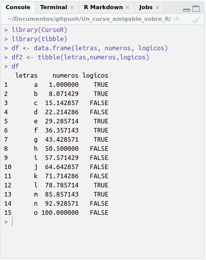
```
  </div>
  <div class="col-md-6" markdown="1">
```{r, echo = FALSE, eval = TRUE, out.width = "64%", fig.align = "center"}
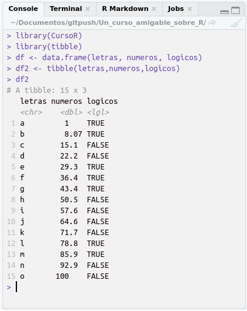
```
  </div>
</div>

Una mejora que poseen los tibble es la forma en que se escriben los datos ya que no es necesario escribir vectores con nuestra información, veamos un ejemplo. 

:::example
#### Ejemplo 2.3.9
:::

```{r addition_239, exercise = TRUE, comment=""}
amigos <- tribble(
  ~nombre ,~edad,~ altura,~soltero,
  "Andres",  23 ,    181 ,  TRUE   ,
  "Julian",  24 ,    179 ,  FALSE  ,
  "Maria" ,  19 ,    167 ,  TRUE   ,
  "sandra",  21 ,    174 ,  TRUE   ,
  "Karol" ,  26 ,    171 ,  FALSE  ,
  "Javier",  18 ,    164 ,  TRUE  
)
amigos
```

Otra de las diferencias con los dataframe, es la capacidad que tienen los tibble para hace referencia a variables que se acaban de crear, veamos cómo funciona

:::example
#### Ejemplo 2.3.10
:::

```{r addition_2310, exercise = TRUE, comment=""}
tibble(x = 1:5, 
       y = 1, 
       z = x ^ 2 + y)
```

Hagamos un ejercicio para reforzar esta última diferencia. En él debes crear dos objetos `df_vol` y `tb_vol`, en ellos debes guardar la información de 10 cilindros y calcular las variables radio y volumen para cada uno, de tal forma que cada objeto contenga exactamente la misma información. Para el objeto df_vol utiliza `data.frame()` y para tb_vol `tibble()`. Al finalizar debes imprimir los dos objetos en pantalla.

:::exercise
#### Ejercicio 2.3.9
:::

```{r exe_239, exercise = TRUE}
#Informacion
referencia <- paste("Cilindro",seq(1,10))
seq(1.5,100,length.out = 10) #altura
seq(3,50,length.out = 10) #diametro
#dataframe
df_vol <- 
#tibble
tb_vol <- 
#verificacion
df_vol
tb_vol
```

```{r exe_239-solution}
#Informacion
referencia <- paste("Cilindro",seq(1,10))
seq(1.5,100,length.out = 10) #altura
seq(3,50,length.out = 10) #diametro
#dataframe
df_vol <- data.frame(referencia,
                     altura = seq(1.5,100,length.out = 10),
                     diametro = seq(3,50,length.out = 10))
df_vol$radio <- df_vol$diametro /2
df_vol$volumen <- pi * df_vol$radio^2 * df_vol$altura
#tibble
tb_vol <- tibble(referencia,
                 altura = seq(1.5,100,length.out = 10),
                 diametro = seq(3,50,length.out = 10),
                 radio = diametro/2,
                 volumen = pi * radio^2 *altura)
#verificacion
df_vol
tb_vol
```

```{r exe_239-check}
grade_code("Excelente lo lograste, sigamos adelante")
```

Otra de las capacidades que tiene tibble es conservar la estructura de objetos anidados, sean estos, vectores, matrices, dataframe, listas e incluso otro tibble, solo necesitamos cumplir la regla de que nuestra variable que anida objetos tenga la misma extensión de nuestras filas.

Para entender esto retomemos la base de datos del ejemplo 2.3.9 con algunas modificaciones, las variables serán nombre,físico y sentimental, donde fisco tendrá edad y altura mientras que sentimental tendrá si es soltero y si tiene hijos, esta forma de guardar información es relativamente complicada en los dataframe. Veamos cómo podemos lograrlo.

:::example
#### Ejemplo 2.3.11
:::

```{r addition_2311, exercise = TRUE, comment=""}
amigos <- tribble(
  ~nombre ,         ~fisico          ,  ~ sentimental    ,
  "Andres", c(edad=23,altura=181) , c(soltero=T,hijos=F) ,
  "Julian", c(edad=24,altura=179) , c(soltero=F,hijos=T) ,
  "Maria" , c(edad=19,altura=167) , c(soltero=T,hijos=F) ,
  "sandra", c(edad=21,altura=174) , c(soltero=T,hijos=F) ,
  "Karol" , c(edad=26,altura=171) , c(soltero=F,hijos=T) ,
  "Javier", c(edad=18,altura=164) , c(soltero=T,hijos=F) ,
)
amigos
```

Como se pueda notar el tipo de datos  que reporta las columnas físico y sentimental pertenece a lista, lo cual es un requerimiento para anidar objetos con los tibble. De las listas hablaremos en la siguiente subsección y retomaremos este ejemplo para acceder a elementos individuales del marco de datos `amigos`.

</details>

<details><summary>2.4 Operaciones con listas </summary> 

Se entiende por lista a la colección de elementos de cualquier longitud que pueden ser de una clase diferente cada uno, lo que indica que en una lista podemos almacenar todos los objetos de los que tenemos conocimiento, sean estos vectores, matrices, dataframe, tibble en incuso otras listas. Para crear listas utilizamos la función `list()`, veamos un ejemplo sencillo de cómo se crea una lista objetos de diferente clase.

:::example
#### Ejemplo 2.4.1
:::

```{r addition_241, exercise = TRUE}
my_lista <- list(vector = 1:10,
                 matriz = matrix(1:25,ncol = 5),
                 dataframe = Starwars[1:10,],
                 tible = as_tibble(mtcars_3))
my_lista
```

```{r, eval = TRUE, message = FALSE, echo = FALSE}
my_lista <- list(vector = 1:10,
                 matriz = matrix(1:25,ncol = 5),
                 dataframe = Starwars[1:10,],
                 tible = as_tibble(mtcars_3))
```

```{r,eval=FALSE}
save(my_lista, file="data_pkg/my_lista.rda")
```

Como se puede ver crear listas es relativamente sencillo, se recomienda nombrar los objetos para facilitar el acceso a estos, sin embargo no es estrictamente necesario.

Ya vimos lo sencillo que es crear una lista con las clases de objetos que conocíamos previamente, ahora con el siguiente ejercicio debes crear una lista que contenga otras listas dentro de ella, la lista principal se llamará `mis_listas`,  las listas dentro de ella no tendrán nombre. La primera lista debe contener los bases de datos `Starwars` y `mtcars_3` y la segunda lista debe contar con dos subconjuntos de datos, el primero debe tener los personajes de Starwars de la especie humana y el segundo los autos de mtcars_3 con más de dos carburadores. Adicionalmente se agregarán nombres a la lista principal con la función `names()`.

:::exercise
#### Ejercicio 2.4.1
:::

```{r exe_241, exercise = TRUE}
mis_listas <- 
mis_listas
#nombres 
names(mis_listas) <- c("dataset","subconjuntos")
mis_listas
```

```{r exe_241-solution}
mis_listas <- list(list(Starwars,mtcars_3),
                   list(subset(Starwars,species == "Human"),
                        subset(mtcars_3,carb>2)))
mis_listas
#nombres 
names(mis_listas) <- c("dataset","subconjuntos")
mis_listas
```

```{r exe_241-check}
grade_code("Excelente lo lograste, sigamos adelante")
```

Veamos cómo funciona la indexación y el acceso a elementos individuales de una lista utilizando `my_lista`. Primero vamos a llamar a dataframe, después añadiremos nombres a la matriz, seguido seleccionaremos los autos del tibble con más de dos carburadores  y por último vamos a reemplazar cada elemento del vector por su correspondiente raíz cuadrada.

:::example
#### Ejemplo 2.4.2
:::

```{r addition_242, exercise = TRUE}
#lista
my_lista
#dataframe
my_lista[["dataframe"]] #Opcion 1
my_lista$dataframe #Opcion 2
#nombres de la matriz
row.names(my_lista$matriz) <-c(paste("fila",1:5))
colnames(my_lista[["matriz"]]) <- c(paste("col",1:5))
my_lista$matriz
#tibble
subset(my_lista$tible,carb>2)
#vector
my_lista$vector <- sqrt(my_lista$vector)
my_lista$vector
```

El próximo ejercicio consiste en modificar una lista a partir de la siguiente tabla que contiene datos de los padres, hermanos e hijos de carlos; una lista `carlos_fam` fue creada para almacenar la información, sin embargo se presentaron errores en la transcripción y la lista es imprecisa. 

+-------------+----------------+------+
| Relación    | Nombre         | Edad |
+=============+================+======+
| Padre       | Juan Carlos    |  55  |
+-------------+----------------+------+
| Madre       | Luz Estela     |  53  |
+-------------+----------------+------+
| Hijo        | Juan Camilo    |  3   |
+-------------+----------------+------+
| Hijo        | Juan Fernado   |  5   |
+-------------+----------------+------+
| Hijo        | Juliana        |  1   |
+-------------+----------------+------+
| Hermano     | Andres Felipe  |  25  |
+-------------+----------------+------+
| Hermano     | Maria Camila   |  21  |
+-------------+----------------+------+

```{r, eval = TRUE, message = FALSE, echo = FALSE}
carlos_fam <- list(Padres = list(Relacion=c("Padre","Madre"),
                                 Nombre = c("Juan Camilo","Maria Camila"),
                                 Edad=c(32,3)),
                   Hijos = list(Relacion=c(rep("Hijo",2),"Hija"),
                                 Nombre = c("Juan Camilo","Luz Estela","Juan Fernado"),
                                 Edad=c(3,25,1)),
                   Hermanos = list(Relacion=c("Hermano","Hermana"),
                                 Nombre = c("Andres Felipe","Juliana"),
                                 Edad=c(5,21)))
```

```{r,eval=FALSE}
save(carlos_fam, file="data_pkg/carlos_fam.rda")
```

Debes modificar la lista `carlos_fam` de modo que coincida con los datos proporcionados en la tabla. Pueden existir múltiples formas de lograr este objetivo, en la solución encontraras solo una de ellas.

:::exercise
#### Ejercicio 2.4.2
:::

```{r exe_242, exercise = TRUE}
#lista imprecisa
carlos_fam
str(carlos_fam)
#modificaciones
```

```{r exe_242-solution}
#lista imprecisa
carlos_fam
str(carlos_fam)
#modificaciones
carlos_fam$Padres$Nombre <- c("Juan Carlos","Luz Estela")
carlos_fam$Padres$Edad <- c(55,53)
carlos_fam$Hijos$Nombre[2:3] <- c("Juan Fernado","Juliana")
carlos_fam$Hijos$Edad[2:3] <- c(5,1)
carlos_fam$Hermanos$Nombre[2] <- "Maria Camila" 
carlos_fam$Hermanos$Edad[1] <- 25 
```

```{r exe_242-check}
grade_code("Excelente lo lograste, sigamos adelante")
```

Dándole continuidad al ejercicio anterior se propone que se agregue la estatura de cada uno de los integrantes de la familia conforme a la siguiente tabla.

+-------------+----------------+------+--------+
| Relación    | Nombre         | Edad | Altura |
+=============+================+======+========+
| Padre       | Juan Carlos    |  55  |   180  |
+-------------+----------------+------+--------+
| Madre       | Luz Estela     |  53  |   165  |
+-------------+----------------+------+--------+
| Hijo        | Juan Camilo    |  3   |   95   |
+-------------+----------------+------+--------+
| Hijo        | Juan Fernado   |  5   |   105  |
+-------------+----------------+------+--------+
| Hijo        | Juliana        |  1   |   77   |
+-------------+----------------+------+--------+
| Hermano     | Andres Felipe  |  25  |   183  |
+-------------+----------------+------+--------+
| Hermano     | Maria Camila   |  21  |   176  |
+-------------+----------------+------+--------+

Recuerda que el acceso individual a las variables de una lista es muy similar al acceso a un dataframe, por lo que debe resultar familiar crear nuevas variable en una lista utilizando el mismo método `$`. Crea la variable __Estatura__ para padres, hijos y Hermanos en `carlos_fam_g`.

```{r, eval = TRUE, message = FALSE, echo = FALSE}
carlos_fam_g <- list(Padres = list(Relacion=c("Padre","Madre"),
                                 Nombre = c("Juan Carlos","Luz Estela"),
                                 Edad=c(55,53)),
                   Hijos = list(Relacion=c(rep("Hijo",2),"Hija"),
                                 Nombre = c("Juan Camilo","Juan Fernado","Juliana"),
                                 Edad=c(3,5,1)),
                   Hermanos = list(Relacion=c("Hermano","Hermana"),
                                 Nombre = c("Andres Felipe","Maria Camila"),
                                 Edad=c(25,21)))
```

```{r,eval=FALSE}
save(carlos_fam_g, file="data_pkg/carlos_fam_g.rda")
```

:::exercise
#### Ejercicio 2.4.3
:::

```{r exe_243, exercise = TRUE}
#Datos
carlos_fam_g
str(carlos_fam_g)
#Estatura

```

```{r exe_243-solution}
#Datos
carlos_fam_g
str(carlos_fam_g)
#Estatura
carlos_fam_g$Padres$Estatura <- c(180,165)
carlos_fam_g$Hijos$Estatura <- c(95,105,77)
carlos_fam_g$Hermanos$Estatura <- c(183,176)
```

```{r exe_243-check}
grade_code("Excelente lo lograste, sigamos adelante")
```

Ya que sabemos un poco más de las listas retomemos el ejemplo 2.3.11  y veamos cómo funciona el acceso individual para nuestro set de datos `amigos`. Cabe mencionar que altura esta en cm y la masa en kg. Encontremos las edades de maria y julian y verifiquemos si Andres tiene hijos.

```{r, eval = TRUE, message = FALSE, echo = FALSE}
amigos <- tribble(
  ~nombre ,         ~fisico          ,  ~ sentimental    ,
  "Andres", c(edad=23,altura=181,masa=98) , c(soltero=T,hijos=F) ,
  "Julian", c(edad=24,altura=179,masa=75) , c(soltero=F,hijos=T) ,
  "Maria" , c(edad=19,altura=167,masa=71) , c(soltero=T,hijos=F) ,
  "sandra", c(edad=21,altura=174,masa=68) , c(soltero=T,hijos=F) ,
  "Karol" , c(edad=26,altura=171,masa=70) , c(soltero=F,hijos=T) ,
  "Javier", c(edad=18,altura=164,masa=64) , c(soltero=T,hijos=F) ,
)
```

```{r,eval=FALSE}
save(amigos, file="data_pkg/amigos.rda")
```

:::example
#### Ejemplo 2.4.3
:::

```{r addition_243, exercise = TRUE}
#Datos
amigos
#Edades
amigos$fisico[[3]][1] #Maria
amigos$fisico[[2]][1] #Julian
#Hijos
amigos$sentimental[[1]][2]
```

Como ultimo ejercicio trabajaremos con el IMC ($IMC = \frac{Masa\ (kg)}{Altura(m)^2}$), ahora debes calcularlo para Karol y Javier utilizando la indexación que ya conoces.

:::exercise
#### Ejercicio 2.4.4
:::

```{r exe_244, exercise = TRUE}
#Caculo IMC
```

```{r exe_244-solution}
#Caculo IMC
amigos$fisico[[5]][3][[1]] / (amigos$fisico[[5]][2][[1]]/100)^2 #Karol
amigos$fisico[[6]][3][[1]] / (amigos$fisico[[6]][2][[1]]/100)^2 #Javier
```

```{r exe_244-check}
grade_code("Excelente lo lograste, sigamos adelante")
```

</details>

## 3. Condiciones, bucles y funciones

En esta sección aprenderemos a crear y utilizar estructuras de control como funciones de usuario, bucles y condicionales que nos permitan automatizar nuestra manipulación y análisis de datos. Además esta sección nos permitirá entender cómo trabajan algunas de las funciones que conocemos, dejándonos entender y manipular mejor el `R` como lenguaje de programación. Cuando utilizamos programación para resolver algún problema académico, laboral u de otra índole es común encontrarnos con particularidades que corresponde únicamente a nuestro problema, por ello en muchos casos funciones generales o procesos generales no aplican para nuestra situación, es allí donde entran las famosas funciones de usuario que conoceremos a lo largo de la sección. La sección cuenta con cuatro subsecciones 1) Condicionales, 2) Bucles, 3) Funciones y 4) Familia `apply`.

* Algunas de las funciones nuevas que utilizaremos en esta sección deberás consultar en la ayuda de `R` , cada vez que no entiendas un función que utilicemos puedes ejecutar un comando de la forma `?mean()` 

* Para los ejercicios de esta sección existen muchas posibles soluciones que realicen la misma tarea planteada, sin embargo en `Solution` encontrarás solo una de todas las posibles.

<details><summary>3.1 Condicionales </summary> 

Son conocidos como construcciones y se articulan con los operadores lógicos, de conjunción y de disyunción. Utilizan expresiones lógicas para denotar diferentes alternativas, es decir, funcionan como una condición a partir de la expresión lógica.La primera función que utilizaremos será `if(){}` acompañada de `print()`. Para ello recordemos con un ejemplo expresiones lógicas que ya conocemos y agreguemos la sintaxis de una condición para utilizar estas nuevas funciones. 

:::example
#### Ejemplo 3.1.1
:::

```{r addition_311, exercise = TRUE}
#Expresiones logicas
35 > 20
35 != 35.4
#Condiciones
if(35>20) {print("Es mayor a 20")}
if(35 != 35.4) {print("Son diferentes")}
```

Como vimos con el ejemplo la condición evalúa la expresión lógica correspondiente, en el primer caso, si 35 es mayor a 20 imprime “Es mayor”, en el segundo si 35 es diferente a 35.4 imprime “Son diferentes”. Esta sintaxis aplica para cualquier condición `si la expresión lógica se cumple realice determinada acción`, en nuestro caso la acción es imprimir, pero podemos ejecutar cualquier acción que necesitemos.

Veamos qué acciones podemos ejecutar si nuestra expresión lógica no se cumple, para esto nos valdremos del argumento `else{}`. Utilicemos uno de los ejemplos anteriores para visualizarlo.

:::example
#### Ejemplo 3.1.2
:::

```{r addition_312, exercise = TRUE}
#Se cumple la expresion logica
if(35>20) {
  print("Es mayor a 20")
} else {
  print("Es menor a 20")
}
#No se cumple la expresion logica
if(10>20) {
  print("Es mayor a 20")
} else {
  print("Es menor a 20")
}
```

La sintaxis para este caso tendría una modificación, siendo expresada por `si expresión lógica se cumple realice determinada acción, de lo contrario realice otra acción`, en este caso en especifico seria, si determinado numero es mayor a 20 imprima es mayor de lo contrario imprima es menor. Podríamos además agregar una condición extra en la que verifiquemos si el número es igual a 20, para ello podemos valernos del argumento `else if{}`. Para evidenciar su funcionamiento te invito a que cambies el valor de `x` por distintos números incluyendo el 20.

```{r addition_3121, exercise = TRUE}
#para cada modificacion de x ejecute "Run code"
x = 18
if(x>20) {
  print("Es mayor a 20")
} else if (x==20){
  print("Es igual a 20")
}else {
  print("Es menor a 20")
}
```

A continuación trabajaremos con acciones diferentes a `print()` y utilizaremos conceptos de operaciones básicas que manejamos anteriormente, usando además una función nueva denominada `paste()`. Para este ejemplo `x` es el número de rosas compradas en una floristería, en la cual se tiene una oferta, si se compran más de 10 rosas se regalan 3 rosas, si se compran exactamente 10 se regala una rosa, de lo contrario el cliente solo se lleva las rosas que compro. Para evidenciar su funcionamiento te invito a que cambies el valor de `x` por distintos números.

:::example
#### Ejemplo 3.1.3
:::

```{r addition_313, exercise = TRUE}
#para cada modificacion de x ejecute "Run code"
x = -13
if(x<=0) {
  paste(x,"no es un número de compra valido")
} else if (x==10){
  print("Llevarás una rosa extra")
  paste("Total de Rosas:",x+1)
} else if(x>10){
  print("Llevarás tres rosas extra")
  paste("Total de Rosas:",x+3)
}else {
  print("Llevarás las rosas que compraste")
  paste("Total de Rosas:",x)
}
```

Trabajemos ahora un ejercicio similar, en el cual hay una oferta del 50% en bolsas de comida de perro y un descuento del 10% adicional si se compran por lo menos 10 bolsas de comida. El precio normal de una bolsa de comida son 6800 pesos, `x` corresponde al número de bolsas de comida. Si se ejecuta el código con `x=0` se debe imprimir en pantalla "No es un número de compra válido" , con `x=8` "Total a pagar: 27200" y con `x=20` "Total a pagar: 54400".

:::exercise
#### Ejercicio 3.1.1
:::

```{r exe_311, exercise = TRUE}
#para cada modificacion de x ejecute "Run code"
x <- 0
precio = 6800
```

```{r exe_311-solution}
#para cada modificacion de x ejecute "Run code"
x <- 0
precio = 6800
if(x<= 0){
  paste("No es un número de compra válido")
} else if (x<10){
  cobro = x*.5*precio
  paste("Total a pagar:",cobro)
} else{
  cobro = x*.4*precio
  paste("Total a pagar:",cobro)
}
```

```{r exe_311-check}
grade_code("Excelente lo lograste, sigamos adelante")
```

Ya vimos como trabajar con condiciones numéricas y algunos operadores lógicos, veamos cómo trabajar con coincidencias exactas con caracteres. Retomemos el ejercicio anterior, añadiendo que los descuentos solo aplican en dias especificos, para diferenciar cuando se aplica o no el descuento se creo la variable `des` que puede ser “Hay descuento” o “No hay descuento”, veamos como funcionaria con esta nueva condición al variar los valores de `x` y cambiar los valores de `des` por las dos opciones válidas.

:::example
#### Ejemplo 3.1.4
:::

```{r addition_314, exercise = TRUE}
#para cada modificacion de x y/o des ejecute "Run code"
x <- 10
precio = 6800
des = "Hay descuento"
#Cuando no hay descuento
if(des == "No hay descuento"){
  if(x<= 0){
  paste("No es un número de compra válido")
  } else{
  cobro = x * precio
  paste("Total a pagar:",cobro)  
  }
#Cuando hay descuento
} else if(des == "Hay descuento"){
  if(x<= 0){
  paste("No es un número de compra válido")
} else if (x<10){
  cobro = x*.5*precio
  paste("Total a pagar:",cobro)
} else{
  cobro = x*.4*precio
  paste("Total a pagar:",cobro)
}
#Opcion de clasificación no valida
} else {
  paste(des,"No es un opción válida de clasificación de descuento")
}
```

Este ejemplo contiene una condición principal, que es si hay descuento o no;  dependiendo de ella se despliega el cobro con o sin descuento con condiciones para cada caso, esta forma de incluir condiciones dentro de otras condiciones se conoce como __anidar__ y aplica también para funciones, procesos y bucles. Para solucionar problemas con condicionales podemos apoyarnos de los diagramas de flujo como el siguiente, que simplifica el proceso cuando las entradas son correctas.

```{r, eval = FALSE, echo = FALSE, fig.align = 'center', message = FALSE, fig.showtext = TRUE, out.width = '720'}

rombo_1 <- data.frame(
  x = c(3.1, 3.6, 4.1, 3.6), y = c(3.0, 3.55, 3.0, 2.45)
)

rombo_2 <- data.frame(
  x = c(4.0, 4.75, 5.5, 4.75), y = c(2.25, 2.8, 2.25, 1.7)
)

data.frame(
  x = c(1.8:7.0), y = c(-0.8:4.2)
) %>%
  ggplot(aes(x, y)) +
  geom_blank() +
  annotate(geom = 'rect', xmin = 1.85, xmax = 2.95, ymin = 2.7, ymax = 3.3, colour = 'yellow', fill = 'yellow', alpha = 0.2) +
  annotate(geom = 'text', x = 2.4, y = 3.0, label = 'Costo comida de perro', family = 'gochi', size = 6.4, colour = 'black') +
  geom_curve(x = 2.95, xend = 3.1, y = 3.0, yend = 3.0, arrow = arrow(length = unit(0.1, 'inch')), size = 1.0, color = 'black', curvature = 0.0) +
  geom_polygon(data = rombo_1, aes(x = x, y = y), fill = 'red', colour = 'red', alpha = 0.2) +
  annotate(geom = 'text', x = 3.6, y = 3.0, label = '¿Hay descuento?', family = 'gochi', size = 6.4, colour = 'black') +
  annotate(geom = 'segment', x = 3.6, xend = 3.6, y = 3.55, yend = 3.75, size = 1.0, colour = 'black') +
  geom_curve(x = 3.6, xend = 4.0, y = 3.75, yend = 3.75, arrow = arrow(length = unit(0.1, 'inch')), size = 1.0, color = 'black', curvature = 0.0) +
  annotate(geom = 'text', x = 3.8, y = 3.85, label = 'No', family = 'gochi', size = 6.4, colour = 'black') +
  annotate(geom = 'rect', xmin = 4.0, xmax = 5.5, ymin = 3.45, ymax = 4.05, colour = 'yellow', fill = 'yellow', alpha = 0.2) +
  annotate(geom = 'text', x = 4.75, y = 3.75, label = 'Paga valor habitual por unidad', family = 'gochi', size = 6.4, colour = 'black') +
  annotate(geom = 'segment', x = 3.6, xend = 3.6, y = 2.45, yend = 2.25, size = 1.0, colour = 'black') +
  geom_curve(x = 3.6, xend = 4.0, y = 2.25, yend = 2.25, arrow = arrow(length = unit(0.1, 'inch')), size = 1.0, color = 'black', curvature = 0.0) +
  annotate(geom = 'text', x = 3.8, y = 2.15, label = 'Si', family = 'gochi', size = 6.4, colour = 'black') +
  geom_polygon(data = rombo_2, aes(x = x, y = y), fill = 'red', colour = 'red', alpha = 0.2) +
  annotate(geom = 'text', x = 4.75, y = 2.35, label = '¿Esta comprando', family = 'gochi', size = 6.4, colour = 'black') +
  annotate(geom = 'text', x = 4.75, y = 2.15, label = 'más de 10 unidades?', family = 'gochi', size = 6.4, colour = 'black') +
  annotate(geom = 'segment', x = 4.75, xend = 4.75, y = 2.8, yend = 3.0, size = 1.0, colour = 'black') +
  geom_curve(x = 4.75, xend = 5.15, y = 3.0, yend = 3.0, arrow = arrow(length = unit(0.1, 'inch')), size = 1.0, color = 'black', curvature = 0.0) +
  annotate(geom = 'text', x = 4.95, y = 3.1, label = 'No', family = 'gochi', size = 6.4, colour = 'black') +
  annotate(geom = 'segment', x = 4.75, xend = 4.75, y = 1.7, yend = 1.5, size = 1.0, colour = 'black') +
  geom_curve(x = 4.75, xend = 5.15, y = 1.5, yend = 1.5, arrow = arrow(length = unit(0.1, 'inch')), size = 1.0, color = 'black', curvature = 0.0) +
  annotate(geom = 'text', x = 4.95, y = 1.4, label = 'Si', family = 'gochi', size = 6.4, colour = 'black') +
  annotate(geom = 'rect', xmin = 5.15, xmax = 6.15, ymin = 2.7, ymax = 3.3, colour = 'yellow', fill = 'yellow', alpha = 0.2) +
  annotate(geom = 'text', x = 5.65, y = 3.0, label = 'Descuento del 50%', family = 'gochi', size = 6.4, colour = 'black') +
  annotate(geom = 'rect', xmin = 5.15, xmax = 6.15, ymin = 1.2, ymax = 1.8, colour = 'yellow', fill = 'yellow', alpha = 0.2) +
  annotate(geom = 'text', x = 5.65, y = 1.5, label = 'Descuento del 60%', family = 'gochi', size = 6.4, colour = 'black') +
  scale_x_continuous(limits = c(1.8, 6.5)) +
  scale_y_continuous(limits = c(0.5, 4.2)) +
  theme_void() +
  theme(axis.text = element_blank(),
        axis.ticks = element_blank(),
        axis.title = element_blank())
```

```{r, echo = FALSE, eval = TRUE, out.width = "74%", fig.align = "center"}

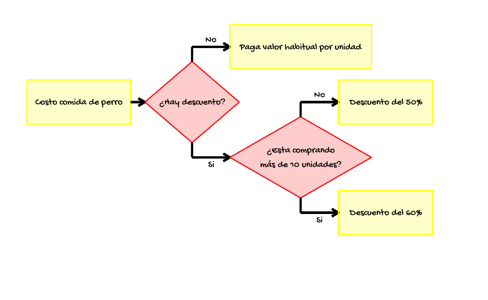  
```

<!--
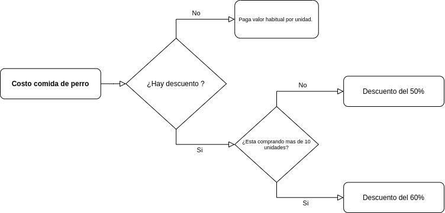
-->
Vamos con un ejercicio similar, en el que una heladería ofrece descuentos del 25% sobre  el total de la compra los días lunes, martes y miércoles, adicionalmente si la compra supera el valor de 50.000 ofrece un 10% adicional de descuento, los otros días de la semana ofrece un 15% de descuento sobre el total de la compra si esta supera el valor de 60.000.  el programa debe arrojar el total, el descuento y el total con descuento en cualquiera de los casos. Si se hacen las siguientes compras el programa debe dar las salidas enunciadas:

* Domingo total de la compra 69500:
  * "Total: 69500"
  * "Descuento: 10425"
  * "Total con descuento: 59075"

* Lunes total de la compra 71350
  * "Total: 71350"
  * "Descuento: 24972.5"
  * "Total con descuento: 46377.5"
  
* Miercoles total de la compra 33700
  * "Total: 33700"
  * "Descuento: 8425"
  * "Total con descuento: 25275"

:::exercise
#### Ejercicio 3.1.2
:::

```{r exe_312, exercise = TRUE}
#para cada modificacion del dia y del valor total de la compra ejecute "Run code"

```

```{r exe_312-solution}
#para cada modificacion del dia y del valor total de la compra ejecute "Run code"
#Recuerda esta es solo una posible solucion 
dia = "Miercoles"
total_compra = 33700
if(dia =="Lunes" | dia =="Martes" | dia =="Miercoles" ){
  if(total_compra<=0){
    print("No es un valor de compra válido")
  } else if(total_compra>50000){
    descuento = total_compra * .35
    nuevo_total = total_compra - descuento
    print(paste("Total:", total_compra))
    print(paste("Descuento:", descuento))
    print(paste("Total con descuento:",nuevo_total))
  } else{
    print(paste("Total:", total_compra))
    print(paste("Descuento:", total_compra * .25))
    print(paste("Total con descuento:",total_compra*.75))
  }
} else if(dia =="Jueves" | dia =="Viernes" | dia =="Sabado" | dia =="Domingo"){
  if(total_compra<=0){
    print("No es un valor de compra válido")
  } else if (total_compra>60000){
    print(paste("Total:", total_compra))
    print(paste("Descuento:", total_compra * .15))
    print(paste("Total con descuento:",total_compra*.85)) 
  } else{
    print(paste("Total:", total_compra))
    print(paste("Descuento:", total_compra * 0))
    print(paste("Total con descuento:",total_compra))     
  }
} else{
  print("No es una dia de la semana valido")
}
```

```{r exe_312-check}
grade_code("Excelente lo lograste, sigamos adelante")
```

En los anteriores ejemplos debíamos cambiar los valores para cada caso, ahora veamos cómo utilizar el código ágilmente sobre un o unos vectores para obtener resultados en simultaneo para cada caso. Retomemos entonces el ejemplo 3.1.2 para utilizar la función `ifelse()` y comparar varios números al mismo tiempo.

:::example
#### Ejemplo 3.1.5
:::

```{r addition_315, exercise = TRUE}
#vector de prueba
numeros <- c(35,10,18,70,80,5,18,34,19)
#comparacion
ifelse(test = numeros>20,yes = paste("Es mayor a 20"),no = paste("Es menor a 20"))
```

Veamos la adaptación para el ejemplo con la condición de igualdad con el numero 20.

```{r addition_3151, exercise = TRUE}
#vector de prueba
numeros <- c(35,10,18,20,70,80,5,18,34,19,20)
#comparacion
ifelse(test = numeros==20,yes = paste("Es igual a 20"),no = 
         ifelse(numeros>20,paste("Es mayor a 20"),paste("Es menor a 20")))
```

En ejemplos simples como este es fácil adaptar, la función `ifelse()` para usarla con vectores, sin embargo ya hemos trabajado ejemplos un poco más elaborados en los que modificamos las variables y obtenemos unas nuevas, para estos últimos esta función es difícil de adaptar y tenemos que valernos de los bucles que aprenderemos en la siguiente subsección.

Para seguir con los condicionales realiza el siguiente ejercicio usando `ifelse()`, en él debes encontrar los números pares de un vector de prueba, imprimiendo en pantalla la afirmación “Es par” cuando cumpla la condición, y “No es par” cuando no lo haga.

:::exercise
#### Ejercicio 3.1.3
:::

```{r exe_313, exercise = TRUE}
#vector de prueba
vec <- c(20,17,48,03,95,47,97,65,46,24,98,14,86,93,75,200,350,257,301,1,3,5,12,2)
#condicion
```

```{r exe_313-solution}
#vector de prueba
vec <- c(20,17,48,03,95,47,97,65,46,24,98,14,86,93,75,200,350,257,301,1,3,5,12,2)
#condicion
ifelse(vec%%2==0,paste("Es par"),paste("No es par"))
```

```{r exe_313-check}
grade_code("Excelente lo lograste, sigamos adelante")
```

Como último ejercicio de esta subsección debes utilizar `ifelse()` para clasificar los números en determinado rango, de tal manera que para los números en entre 20 y 60 en el vector de prueba se imprima “Están en el intervalo” y para los que no estén entre 20 y 60 se imprima “No están en el intervalo”.

:::exercise
#### Ejercicio 3.1.4
:::

```{r exe_314, exercise = TRUE}
#vector de prueba
vec <- seq(1,100,length.out = 20)
#condicion
```

```{r exe_314-solution}
#vector de prueba
vec <- seq(1,100,length.out = 20)
#condicion
ifelse(vec>20 & vec<60,paste("Está en el intervalo"),paste("No está en el intervalo"))
```

```{r exe_314-check}
grade_code("Excelente lo lograste, sigamos adelante")
```

</details>

<details><summary>3.2 Bucles </summary> 

Los bucles o ciclos son estructuras de control que permiten recorrer los elementos de un objeto iterable (vector,lista,dataframe,tibble, array,...) repitiendo determinado número de veces el bloque de código o instrucción para cada iteración. Las estructuras de control asociadas con los ciclos  son:

+------------+-------------------+
| Estructura | Descripción       |
+============+===================+
| `for()`    | Para cada uno en  |
+------------+-------------------+
| `while()`  | Mientras          |
+------------+-------------------+
| `break`    | Interrupción      |
+------------+-------------------+
| `next`     | Siguiente         |
+------------+-------------------+
| `repeat`   | Repetir           |
+------------+-------------------+

Para empezar trabajaremos con el ciclo `for` ilustrando cómo funcionan las iteraciones en cada elemento del vector `letras` el cual posee una longitud de 15. 

:::example
#### Ejemplo 3.2.1
:::

```{r addition_321, exercise = TRUE}
#vector
letras
#ciclo for
for (i in 1:length(letras)){
  print(paste("la letra en la posición",i,"es",letras[i]))
}
```

Una modificación con la cual podemos obtener el mismo resultado del fragmento de código anterior es utilizando la función `seq_along()` de la siguiente forma.

```{r addition_321_1, exercise = TRUE}
#vector
letras
#ciclo for
for (i in seq_along(letras)){
  print(paste("la letra en la posición",i,"es",letras[i]))
}
```

Si la posición no es relevante para nuestras operaciones podemos utilizar el ciclo `for` de la siguiente forma, olvidándonos de la longitud y del índice de cada iteración.

```{r addition_321_2, exercise = TRUE}
#vector
letras
#ciclo for
for (i in letras){
  print(i)
}
```

Veamos una modificación del ejemplo anterior en el cual nos interesa obtener los elementos con índices pares del vector `letras`. 

:::example
#### Ejemplo 3.2.2
:::

```{r addition_322, exercise = TRUE}
#vector
letras
#ciclo for
for (i in seq(2,length(letras),2)){
  print(paste("la letra en la posición",i,"es",letras[i]))
}
```

También podemos utilizar condicionales y `seq_along()` de una forma estratégica para lograr el mismo objetivo.

```{r addition_3221, exercise = TRUE}
#vector
letras
#ciclo for con condicional
for (i in seq_along(letras)){
  if(i%%2 == 0){
    print(paste("la letra en la posición",i,"es",letras[i]))
  }
}
```

Hagamos un ejemplo un poco más elaborado usando el ejemplo 3.1.4 del descuento de comida de perro, utilizando en esta ocasión dos vectores, `x` vector con distintos números de bolsas de comida (cada número una compra diferente) y `des` vector que se señala cuando se aplica descuento y cuando no (1= Hay descuento, 0= No hay descuento). Cabe recordar que las ocasiones en la aplica el descuento este es de un 50% con un 10% adicional si el número de bolsas de comida es mayor a 10. El precio por bolsa es de 6800 pesos.

:::example
#### Ejemplo 3.2.3
:::

```{r addition_323, exercise = TRUE}
#Información
x = c(10,0,2,15,13,18,4,9,7,2,8,16) #numero de bolsas
des = c(1,0,0,1,0,0,1,1,1,0,0,10) #clasificación
#ciclo for
for (i in seq_along(x)){
  cobro = 6800 * x[i]
  #cuando no hay descuento
  if(des[i]==0){
    if(x[i]<=0){
      print("No es un número de compra válido")
    } else{
      print(paste("Total a pagar:",cobro))
    }
  #cuando hay descuento
  } else if(des[i]==1){
    if(x[i]<=0){
      print("No es un número de compra válido")
    } else if(x[i]<10){
      print(paste("Total a pagar:",cobro*.5))
    } else{
      print(paste("Total a pagar:",cobro*.4))
    }
  } else{
    print(paste(des[i],"No es un opción válida de clasificación de descuento"))
  }
}
```

Ya vimos cómo funciona el ciclo for con vectores, veamos un ejemplo con `my_lista`, y obtengamos el resumen con `summary()` para cada objeto de la lista.

:::example
#### Ejemplo 3.2.4
:::

```{r addition_324, exercise = TRUE}
for (i in seq_along(my_lista)){
  objeto <- my_lista[[i]]
  print(summary(objeto))
}
```

Se puede ver que el proceso con las listas es tan simple como con los vectores, por ello en el siguiente ejercicio debes retomar la lista `carlos_fam_g` del ejercicio 2.4.3 y obtener todos los nombres de los familiares de carlos e imprimirlos en pantalla junto con el tipo de relación que tienen y su edad. Por ejemplo para el padre se debe mostrar en pantalla : “El padre de carlos es Juan carlos y tiene 55 años”.

:::exercise
#### Ejercicio 3.2.1
:::

```{r exe_321, exercise = TRUE}
# carlos_fam_g
```

```{r exe_321-solution}
# carlos_fam_g
for (objeto in carlos_fam_g){
  for (i in seq_along(objeto[[1]])){
    print(paste("Relacion con carlos:",objeto[[1]][i],"su nombre es",objeto[[2]][i], "y tiene",objeto[[3]][i],"años"))
  }
}
```

```{r exe_321-check}
grade_code("Excelente lo lograste, sigamos adelante")
```

Como se puede notar el ejercicio se ve más sencillo de lo que es, veamos otro ejercicio para reforzar el aprendizaje del ciclo `for`. Para este ejercicio usaremos los datos `amigos` y retomaremos el ejercicio 2.4.4 calculando el IMC ($IMC = \frac{Masa\ (kg)}{Altura(m)^2}$) para todas las personas del conjunto de datos imprimiendo en pantalla una expresión del tipo: “Andres tiene un altura de 1,81 m, una masa de 98 kg y su IMC es 29.91”

:::exercise
#### Ejercicio 3.2.2
:::

```{r exe_322, exercise = TRUE}
# amigos
```

```{r exe_322-solution}
# amigos
for (i in seq_along(amigos$nombre)){
  nombre <- amigos$nombre[i]
  masa <- amigos$fisico[[i]][3][[1]]
  altura <- amigos$fisico[[i]][2][[1]]/100
  IMC <- masa/altura^2
  print(paste(nombre,"tiene una altura de",altura,"m, una masa de",masa,"u su IMC es",round(IMC,2)))
}
```

```{r exe_322-check}
grade_code("Excelente lo lograste, sigamos adelante")
```

Modifica el código del ejercicio anterior y úsalo para incluir la variable IMC en la lista de fisco del dataset `amigos`. Recuerda la indexación y creación de variables tanto en los dataframe como en las listas.

:::exercise
#### Ejercicio 3.2.3
:::

```{r exe_323, exercise = TRUE}
# amigos
```

```{r exe_323-solution}
# amigos
for (i in seq_along(amigos$nombre)){
  masa <- amigos$fisico[[i]][3][[1]]
  altura <- amigos$fisico[[i]][2][[1]]/100
  IMC <- masa/altura^2
  amigos$fisico[[i]][4] <- round(IMC,2)
  names(amigos$fisico[[i]]) <- c("edad","altura","masa","IMC")
}
amigos$fisico
```

```{r exe_323-check}
grade_code("Excelente lo lograste, sigamos adelante")
```

Ya sabemos un poco mas de como acceder y crear variables con el ciclo `for`, ahora tendrás que usarlo para crear una variable adicional en el dataset `amigos`. La nueva variable se obtuvo de preguntarle a los personajes cuantos meses llevaban solteros, sin embargo se descubrió que los personajes que no están solteros mintieron al respecto. Las respuestas están alojadas en el vector `tsoltero` y tu tarea es crear la variable adicional `tiempo_soltero` en el dataset amigos, asignando a los mentirosos el valor de `NA`.

:::exercise
#### Ejercicio 3.2.4
:::

```{r exe_324, exercise = TRUE}
# amigos
tsoltero <- c(4,1,9,5,2,6) #tiempo soltero en meses
amigos$tiempo_soltero <- 0
#tiempo_soltero

```

```{r exe_324-solution}
# amigos
tsoltero <- c(4,1,9,5,2,6) #tiempo soltero en meses
amigos$tiempo_soltero <- 0
#tiempo_soltero
for (i in seq_along(amigos$nombre)){
  soltero <- amigos$sentimental[[i]][1][[1]]
  if (soltero == T){
    amigos$tiempo_soltero[i]<- tsoltero[i]
  } else{
    amigos$tiempo_soltero[i] <- NA
  }
}
amigos
```

```{r exe_324-check}
grade_code("Excelente lo lograste, sigamos adelante")
```

En R también está presente el ciclo `while()` el cual permite repetir la ejecución de un grupo de instrucciones mientras se cumpla una condición, debemos ser precavidos ya que es muy fácil programar un bucle infinito en el cual la condición siempre se cumpla. Iniciemos adaptando el ejemplo 3.2.1 para las primeras 10 letras del vector `letras`,usando además un contador. Veamos cómo funciona.

:::example
#### Ejemplo 3.2.5
:::

```{r addition_325, exercise = TRUE}
i =1 #contador
while(i<=10){
  print(letras[i])
  i =i+1
}
```

El siguiente ejemplo consiste en la comparación de números de un vector `x`, que solo funciona mientras los números sean cada vez más grandes, al terminar el ciclo se muestra la razón y el índice por el cual se finalizó.

:::example
#### Ejemplo 3.2.6
:::

```{r addition_326, exercise = TRUE}
x = c(5,8,12,19,48,95,106,208,406,512,683,791,790,805,900,931)
i = 1
while(x[i]<x[i+1]){
  print(paste(x[i],"es menor que",x[i+1]))
  i=i+1
}
print(paste(x[i],"no es menor que",x[i+1],",error en el indice",i+1,"del vector x"))
```

Veamos con un ejemplo cómo usar el ciclo `while` para generar los primeros 20 números de la sucesión de Fibonacci.

:::example
#### Ejemplo 3.2.7
:::

```{r addition_327, exercise = TRUE}
a = 0
b = 1
count = 1
while(count<=20){
  print(a)
  c<-a+b
  a<-b
  b<-c
  count = count +1
}
```

Como se puede ver el ciclo `while` puede adaptarse para funcionar igual que el ciclo `for`, sin embargo su uso en el lenguaje `R` es poco frecuente y suele ser más común utilizar el ciclo `for` acompañado de condicionales. Veamos los anteriores ejemplos adaptados al ciclo `for` utilizando un nuevo argumento denominado `break`. El ejemplo 3.2.5 utilizando el ciclo `for` se ve de la siguiente manera:

:::example
#### Ejemplo 3.2.8
:::

```{r addition_328, exercise = TRUE}
for (i in seq_along(letras)){
  print(letras[i])
  if(i==10){
    break
  }
}
```

La adaptación del ejemplo 3.2.6 sería la siguiente:

```{r addition_3281, exercise = TRUE}
x = c(5,8,12,19,48,95,106,208,406,512,683,791,790,805,900,931)
for (i in seq_along(x)){
  if (x[i]<x[i+1]){
    print(paste(x[i],"es menor que",x[i+1]))
  }else{
    print(paste(x[i],"no es menor que",x[i+1],",error en el indice",i+1,"del vector x"))
    break
  }
}
```

Ahora debes adaptar el ejemplo 3.2.7 de la sucesión de Fibonacci usando el ciclo `for`.

:::exercise
#### Ejercicio 3.2.5
:::

```{r exe_325, exercise = TRUE}

```

```{r exe_325-solution}
a=0
b=1
for (i in 1:20){
  print(a)
  c<-a+b
  a<-b
  b<-c
}

```

```{r exe_325-check}
grade_code("Excelente lo lograste, sigamos adelante")
```

Otro de los ciclos que posee R es `repeat{}`, que es incluso de menor uso que el ciclo `while`. En general `repeat{}` repite un grupo de instrucciones indefinidamente, por ello el uso del argumento `break` resulta obligatorio en este ciclo. veamos algunos de los ejemplos anteriores adaptados al ciclo `repeat{}`

:::example
#### Ejemplo 3.2.9
:::

Iniciemos adaptando el ejemplo 3.2.2

```{r addition_329, exercise = TRUE}
# letras
i=0
repeat{
  i=i+2
  if(i<=length(letras)){
    print(paste("la letra en la posición",i,"es",letras[i]))
  } else{ break }
}
```

Veamos la adaptación del ejercicio 3.2.2 con el ciclo `repeat{}`

```{r addition_3291, exercise = TRUE}
# amigos
j=0
repeat{
  j=j+1
  if(is.na(amigos$nombre[j])){break}
  nombre <- amigos$nombre[j]
  masa <- amigos$fisico[[j]][3][[1]]
  altura <- amigos$fisico[[j]][2][[1]]/100
  IMC <- masa/altura^2
  print(paste(nombre,"tiene una altura de",altura,"m, una masa de",masa,"u su IMC es",round(IMC,2)))
}

```

Para finalizar esta subsección entendamos cómo trabaja el argumento `next` con un ejemplo simple, en el cual evitaremos imprimir los números de 8 y 12 en la serie de números de 1 a 15.

:::example
#### Ejemplo 3.2.10
:::

```{r addition_3210, exercise = TRUE}
for (i in 1:15){
  if(i == 8 | i == 12){
    next
  }
  print(i)
}
```

Apliquemos también el argumento `next` al ejemplo 3.2.3 del descuento de comida para perro, en este caso el argumento nos ayuda a hacer un poco más corto el código desarrollado anteriormente, evitando seguir el proceso cuando encontramos opciones de descuento o de compra inválidos. 

:::example
#### Ejemplo 3.2.11
:::

```{r addition_3211, exercise = TRUE}
x = c(10,0,2,15,13,18,4,9,7,2,8,16) #numero de bolsas
des = c(1,0,0,1,0,0,1,1,1,0,0,10) #clasificación
for (i in seq_along(x)){
  cobro = 6800*x[i]
  if(x[i]<=0){
    print("No es un número de compra válido")
    next
  }
  if(des[i]!=0 & des[i]!=1){
    print(paste(des[i],"No es un opción válida de clasificación de descuento"))
    next
  }
  if(des[i]==1 & x[i]<10){
    cobro = cobro *.5
  } else if(des[i]==1 & x[i]>=10){
    cobro = cobro * .4
  }
  print(paste("Total a pagar:",cobro))
}
```

Modifiquemos la respuesta del ejercicio 3.2.1 utilizando el ciclo `for` en compañía del argumento `next` para múltiples compras en la heladería, de modo que obtengamos el número de compra, el total correspondiente, el descuento y el total con descuento para cada caso. 

:::example
#### Ejemplo 3.2.12
:::

```{r addition_3212, exercise = TRUE}
dia = c("Domingo", "Lunes","Miercoles","jueves","Domingo","Martes","Viernes")
total_compra = c(69500,71350,33700,54000,0,38000,52300)
for (i in seq_along(dia)){
  print(paste("Número de compra", i))  
  descuento = 0
  if(total_compra[i]<=0){
    print("No es un valor de compra válido")
    next
  }
  if(dia[i] =="Lunes" | dia[i] =="Martes" | dia[i] =="Miercoles"){
    if(total_compra[i]>50000){
      descuento = total_compra[i] * .35
    }else{
      descuento = total_compra[i] * .25
    }
  }else if(dia[i] =="Jueves" | dia[i] =="Viernes" | dia[i] =="Sabado" | dia[i] =="Domingo"){
    if(total_compra[i]>60000){
      descuento = total_compra[i] * .15
    }
  } else{
    print("No es una dia de la semana valido")
    next
  }
  print(paste("Total:", total_compra[i]))
  print(paste("Descuento:", descuento))
  print(paste("Total con descuento:",total_compra[i]-descuento)) 
}
```

Como se ha dicho anteriormente algunos de los ciclos son de poco uso en el lenguaje `R` 
, por lo que es más común utilizar funciones vectoriales como `ifelse()` y funciones derivadas de la familia `apply`. Primero apliquemos `ifelse()` a algunos de los ejemplos y ejercicios de esta subsección modificandolos como dataframe o tibble. La familia apply se verá en una subsección posterior. 

Retomando el ejemplo 3.1.3 de la promoción en la floristería, observemos su adaptación en un tibble usando `ifelse()` para multiples compras 

:::example
#### Ejemplo 3.2.13
:::

```{r addition_3213, exercise = TRUE}
#promocion de rosas
tibble(rosas= c(2,5,10,21,17,10,2,0,8,3),
       rosas_extra = ifelse(rosas<=0,NA, #numero de rosas validas
                            ifelse(rosas<10,0, # rosas menores a 10
                                   ifelse(rosas==10,1,3))), # Adicion de rosas en 10 unidades y mayores 
       rosas_total = rosas +rosas_extra
       )
```

La siguiente adaptación corresponde a la promoción de comida de perro.

```{r addition_3213_1, exercise = TRUE}
#descuento comida de perro
tibble(bolsas= c(10,0,2,15,13,18,4,9,7,2,8,16),
       des = c(1,0,0,1,0,0,1,1,1,0,0,10),
       descuento = ifelse(bolsas<=0,NA, #numero de bolsas validas
                          ifelse(des==0,0, #ocasiones sin descuento
                                 ifelse(des!=1,NA, #descuento valido
                                        ifelse(bolsas<10,.5,.6)))), # descuento del 50% general y 60% por al menos diaz bolsas
       cobro = ifelse(bolsas<=0,NA,
                      ifelse(des==0,bolsas*6800,
                             ifelse(des!=1,NA,(1-descuento)*bolsas*6800)))
       )
```

Y como último ejemplo de esta subsección veremos la adaptación del ejercicio 3.1.2 como un tible con `ifelse()`.

```{r addition_3213_2, exercise = TRUE}
#descuentos heladeria
dias_semana = c("Lunes","Martes","Miercoles","Jueves","Viernes","Sabado","Domingo")
tibble(dia = c("Domingo", "Lunes","Miercoles","jueves","Domingo","Martes","Viernes"),
       total_compra = c(69500,71350,33700,54000,0,38000,53200),
       descuento_porcentaje = ifelse(total_compra<= 0,NA, #Valor de compra valido
                                     ifelse(dia %in% dias_semana, #dias validos
                                            ifelse(dia %in% dias_semana[1:3], # Descuento de lunes a miercoles
                                                   ifelse(total_compra>50000,.35,.25), # Descuento de lunes a miercoles por compras superiores a 50mil
                                                   ifelse(total_compra>60000,.15,0)),NA)), # Descuento por compras mayores a 60mil en el resto de dias
       descuento_valor = total_compra * descuento_porcentaje,
       total_a_pagar = total_compra - descuento_valor
       )
```

</details>

<details><summary>3.3 Funciones </summary> 

`R` en su instalación base cuenta por lo menos con 1302 funciones para realizar diversas tareas, sin embargo es común crear nuevas funciones que se ajusten a nuestras necesidades. Pero antes de crear una función debemos entenderla y reconocer sus 3 componentes:  1) argumentos, 2) cuerpo y 3) entorno. Iniciemos creando con `function()` una función simple para ilustrar los tres componentes y sus atributos.

```{r, echo = FALSE, eval = TRUE, out.width = "44%", fig.align = "center"}
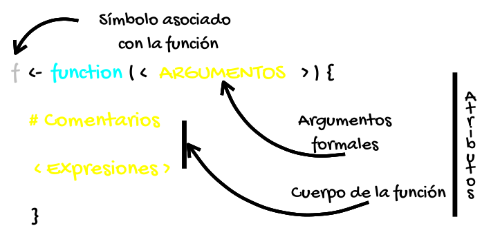  
```

:::example
#### Ejemplo 3.3.1
:::

```{r addition_331, exercise = TRUE}
# Funcion
fun_1 <- function(x,y){
  # comentario
  x+y
}
# Argumentos
formals(fun_1)
# Cuerpo
body(fun_1)
# Entorno
environment(fun_1)
# Atributos
attr(fun_1,"srcref")
```

En general cualquier función creada en lenguaje `R` posee componentes y atributos, sin embargo algunas funciones base como `sum()` `mean()` y otras no posee poseen estos componentes, debido a que llaman código C directamente. Intenta hallar los componentes y atributos para la funciones `prod()` y `abs()`.

:::exercise
#### Ejercicio 3.3.1
:::

```{r exe_331, exercise = TRUE}

```

```{r exe_331-solution}
# Argumentos
formals(prod)
formals(abs)
# Cuerpo
body(prod)
body(abs)
# Entorno
environment(prod)
environment(abs)
# Atributos
attr(prod,"srcref")
attr(abs,"srcref")
```

```{r exe_331-check}
grade_code("Excelente lo lograste, sigamos adelante")
```

Como se puede ver estas funciones no poseen componentes y atributos propios de una función creada en `R` sin embargo no todas las funciones base llaman código C. Veamos los componentes y atributos de la función `rowMeans()`

```{r exe_331_1, exercise = TRUE}
# Argumentos
formals(rowMeans)
# Cuerpo
body(rowMeans)
# Entorno
environment(rowMeans)
# Atributos
attr(rowMeans,"srcref")
```

En la sección anterior en los ejemplos y ejercicios 2.3.6 y 2.3.7  usamos `function()` en conjunto con otras funciones, en esos casos utilizamos lo que se denomina funciones anónimas, las cuales se caracterizan por ser breves (se pueden escribir en una sola línea de código) y por no poseer frecuentemente los  `{}`.  Veamos un ejemplo de una función anónima para la integral $\pi \int_{0}^{6}  \frac{x}{12} \sqrt{36-x^2}$, donde la función anónima corresponde al integrando.

:::example
#### Ejemplo 3.3.2
:::

```{r addition_332, exercise = TRUE}
integrate(function(x) pi * (x/12) * sqrt(36- x^2),0,6 )
```

El ejemplo muestra que el integrando es lo suficientemente corto como para escribirlo en una línea de código, sin embargo observemos una escritura un poco más extensa para el mismo ejemplo. 

```{r addition_332_1, exercise = TRUE}
integrando <- function(x){
  pi * (x/12) * sqrt(36- x^2)
}
integrate(integrando,0,6 )
```

Una cuestión importante en las funciones, es el léxico que se maneja, en él debemos entender que los argumentos son válidos dentro de la función y que crearlos o nombrarlos en el exterior no siempre los afecta. Veamos las salidas del siguiente ejemplo para entender mejor este concepto. 

:::example
#### Ejemplo 3.3.3
:::

```{r addition_333, exercise = TRUE}
# Función
fun_2 <- function() {
  x = 5
  y=10
  x+y
}
#variables independientes
x = 7
y = 3
# Usando fun_2
fun_2()
```

Retomemos `fun_1` y selecciona la salida correcta para el siguiente fragmento de código.

:::exercise
#### Ejercicio 3.3.2
:::

```{r,echo=TRUE, eval= FALSE}
#funcion
fun_1 <- function(x,y){
  # suma de x y y
  x+y
}
#variables independientes
x= 30
y = x
x = 5
#usando fun_1
fun_1(6,7)
```

```{r exe_332, echo=FALSE}
question(" ",
  answer("[1] 30", message = "No estas en lo correcto, sigue intentandolo."),
  answer("[1] 60", message = "No estas en lo correcto, sigue intentandolo."),
  answer("[1] 10", message = "No estas en lo correcto, sigue intentandolo."),
  answer("[1] 13",correct = TRUE, message = "Estas en lo correcto.."),
  answer("[1] 35", message = "No estas en lo correcto, sigue intentandolo."),
  allow_retry = TRUE,
  random_answer_order = TRUE
)
```

Pero qué sucedería con el léxico, si nuestra función no posee argumentos pero requiere de una variable? o si los argumentos de nuestra función no son declarados y se requiere una variable ?. Veamos primero una función sin argumentos y cómo funciona la denominada búsqueda dinámica.

:::example
#### Ejemplo 3.3.4
:::

```{r addition_334, exercise = TRUE}
# Función
fun_3 <- function() x+y
# Usando fun_2
fun_3()
```

Como nuestra función requiere internamente de un `x` y un `y` obtenemos un error que nos notifica que el objeto `x` no se encuentra, es aquí donde podemos aplicar el concepto de búsqueda dinámica, agregando `x` y `y` como variables independientes.

```{r addition_334_1, exercise = TRUE}
# Variables independientes
x = 5
y = 10
# Función
fun_3 <- function() x+y
# Usando fun_2
fun_3()
```

Ensayemos con el caso en el que nuestra función tiene un argumento pero falta una variable interna.

:::example
#### Ejemplo 3.3.5
:::

```{r addition_335, exercise = TRUE}
# Función
fun_4 <- function(x) x+y
# Usando fun_2
fun_4(10)
```

Apliquemos el concepto de búsqueda dinámica añadiendo como variable independiente `y` e incluyendo el argumento `x` requerido al usar la función.

```{r addition_335_1, exercise = TRUE}
#variable independiente 
y = 15
# Función
fun_4 <- function(x) x+y
# Usando fun_2
fun_4(10)
```

Ya que entendimos ciertos conceptos básicos de las funciones creemos algunas que cumplan las mismas tareas que las funciones base, como por ejemplo `mean()`.

:::example
#### Ejemplo 3.3.6
:::

```{r addition_336, exercise = TRUE}
my.mean <- function(x){
  #calculo
  sum(x) / length(x)
}
#prueba
my.mean(1:956)
#comparación
mean(1:956)
```

Personalicemos un poco `my.mean` con la función `message()` para que envíe un mensaje mientras hace las operaciones necesarias y además incluyamos `return()` para devolver los resultados de las operaciones. Para ver la salida de los mensajes debes copiar la función en `R` y ejecutarla allí, la versión dinámica del curso no permite mostrar en pantalla los mensajes.

```{r addition_336_1, exercise = TRUE}
my.mean <- function(x){
  message("Calulando...")
  calc <- sum(x) / length(x)
  message("Cálculo terminado")
  return(calc)
}
#prueba
my.mean(1:956)
#comparación
mean(1:956)
```

Es tu turno de crear funciones y comparar el resultado con una función predeterminada de `R`. En esta ocasión debes crear la funciones `my.var` y `my.sd` para comparar tus resultados con las funciones `var()` y `sd()`. Recuerda que la varianza obedece a la siguiente ecuación $\mathrm{Var}(x) = \frac{1}{n - 1} \sum_{i=1}^n (x_i - \bar{x}) ^2$. Compara tus resultados con los vectores de prueba.

:::exercise
#### Ejercicio 3.3.3
:::

```{r exe_333, exercise = TRUE}
#vectores de prueba 
x = seq(1,50,5)
y = seq(1,15,length.out = 30)
#Funciones
my.var <-function(){}
my.sd <-function(){}
#pruebas
my.var(x)
my.sd(x)
my.var(y)
my.sd(y)
#comparacion
var(x)
sd(x)
var(y)
sd(y)
```

```{r exe_333-hint}
#vectores de prueba 
x = seq(1,50,5)
y = seq(1,15,length.out = 30)
#Funciones
my.var <-function(x){
  var = sum((x -mean(x))^2) / (length(x)-1)
  return(var)
}
my.sd <-function(){}
#pruebas
my.var(x)
my.sd(x)
my.var(y)
my.sd(y)
#comparacion
var(x)
sd(x)
var(y)
sd(y)
```

```{r exe_333-solution}
#vectores de prueba 
x = seq(1,50,5)
y = seq(1,15,length.out = 30)
#Funciones
my.var <-function(x){
  var = sum((x -mean(x))^2) / (length(x)-1)
  return(var)
}
my.sd <-function(x){
  sd = sqrt(my.var(x))
  return(sd)
}
#pruebas
my.var(x)
my.sd(x)
my.var(y)
my.sd(y)
#comparacion
var(x)
sd(x)
var(y)
sd(y)
```

```{r exe_333-check}
grade_code("Excelente lo lograste, sigamos adelante")
```

Retomemos el ejemplo 3.1.4 de descuento de comida para perro y creemos una función que haga todo el trabajo cada vez que lo necesitemos, al ser una función cambiaremos algunos argumentos y detendremos el proceso con `stop()` cada vez que se encuentre un error, sea en los valores de compra o en los de descuento. Además se incluirá un argumento predeterminado que define si la salida es impresiones en pantalla o un vector.

:::example
#### Ejemplo 3.3.7
:::

```{r addition_337, exercise = TRUE}
descuento_perros <- function(bolsas,descuentos,to_vector = FALSE){
  total <- c()
  if(length(bolsas) != length(descuentos)){
    stop("La longitud de bolsas y descuentos no es la misma")
  }
  for( i in seq_along(bolsas)){
    cobro = 6800*bolsas[i]
    if(bolsas[i]<=0){
      stop(paste("El número de bolsas en la posición",i,"no es válido"))
    }
    if(descuentos[i]!=0 &descuentos[i]!=1){
      stop(paste("El código de descuento en la posición",i,"no es válido"))
    }
    if(descuentos[i]==1 & bolsas[i]<10){
      cobro = cobro *.5
    } else if(descuentos[i]==1 & bolsas[i]>=10){
      cobro = cobro * .4
    }
    if(to_vector == F){
      print(paste("Total a pagar:",cobro))
    } else{
      total <- c(total,cobro)
    }
  }
  if(to_vector==T){
    return(total)
  }
}
```

Creada la función podemos realizar múltiples pruebas sin necesidad de escribir repetidamente el código. Veamos algunas pruebas e intenta otras por tu cuenta. Para ejecutar las pruebas debes comentar las que presenten errores, ya que para ilustrar su funcionamiento hay pruebas que arrojan error, estas están marcadas con el comentario `#error` al final.

```{r addition_337_1, exercise = TRUE}
#Prueba 1
descuento_perros(c(10,0,2,15,13,18,4,9,7,2,8,16),c(1,0,0,1,0,0,1,1,1,0,0,10)) #error
#Prueba 2
descuento_perros(c(10,2,15,18,16),c(1,0,0,1,10)) # error
#prueba 3
descuento_perros(c(10,2,15,18,16),c(1,0,0,1)) #error
#prueba 4
descuento_perros(c(10,2,15,18,16),c(1,0,0,1,0))
#prueba 5
descuento_perros(c(10,2,15,18,16),c(1,0,0,1,0),to_vector = TRUE)
```

Es tu turno de adaptar una función al ejercicio de las rosas tratado en el ejemplo 3.1.3. Como ya sabes en esta sección hay muchas posibles soluciones a los problemas planteados, en `solution` encontraras una sola de todas las posibles. Verifica los resultados de la función con los dos objetos de prueba. Para ejecutar las pruebas debes comentar las que presenten errores, ya que para ilustrar su funcionamiento hay pruebas que arrojan error, estas están marcadas con el comentario `#error` al final.

:::exercise
#### Ejercicio 3.3.4
:::

```{r exe_334, exercise = TRUE}
# Objetos de prueba
val_1 <- -13
val_2 <- 16
vec_1 <- c(2,5,10,21,17,10,2,0,8,3)
vec_2 <- c(5,10,8,19,21,16,9,3)
#función
promocion_rosas <- function(){}
#Pruebas
promocion_rosas(val_1) #error
promocion_rosas(val_2)
promocion_rosas(vec_1) #error
promocion_rosas(vec_2)
```

```{r exe_334-solution}
# Objetos de prueba
val_1 <- -13
val_2 <- 16
vec_1 <- c(2,5,10,21,17,10,2,0,8,3)
vec_2 <- c(5,10,8,19,21,16,9,3)
#función
promocion_rosas <- function(rosas){
  for (i in seq_along(rosas)){
    rosas_total = rosas[i]
    if (rosas[i]<=0){
      stop(paste("El número de rosas en la posición",i,"no es válido"))
    }else if(rosas[i]==10){
      rosas_total = rosas[i] + 1
    }else if(rosas[i]>10){
      rosas_total = rosas[i] +3
    }
    print(paste("levarás",rosas_total - rosas[i], "rosas extra, total de rosas",rosas_total))
  }
}
#Pruebas
promocion_rosas(val_1) #error
promocion_rosas(val_2)
promocion_rosas(vec_1) #error
promocion_rosas(vec_2)
```

```{r exe_334-check}
grade_code("Excelente lo lograste, sigamos adelante")
```

Implementa ahora una función para el ejercicio 3.1.2 de descuentos en la heladeria. Recuerda el operador %in% utilizado en el ejemplo 3.2.13. Verifica los resultados de la función con los dos objetos de prueba. Para ejecutar las pruebas debes comentar las que presenten errores, ya que para ilustrar su funcionamiento hay pruebas que arrojan error, estas están marcadas con el comentario `#error` al final.

:::exercise
#### Ejercicio 3.3.5
:::

```{r exe_335, exercise = TRUE}
#objetos de prueba
dia_x = "Miercoles"
total_x = 33700
vec_dias_1 = c("Domingo", "Lunes","Miercoles","jueves","Domingo","Martes","Viernes")
vec_total_1 = c(69500,71350,33700,54000,0,38000,53200)
vec_dias_2 = c("Domingo", "Lunes","Miercoles","Jueves","Domingo","Martes","Viernes")
vec_total_2 = c(69500,71350,33700,54000,12000,38000,53200)
# funcion
descuento_helados <- function(){}
#pruebas
descuento_helados(dia_x,total_x)
descuento_helados(vec_dias_1,vec_total_1) #error
descuento_helados(vec_dias_2,vec_total_2)
```

```{r exe_335-solution}
#objetos de prueba
dia_x = "Miercoles"
total_x = 33700
vec_dias_1 = c("Domingo", "Lunes","Miercoles","jueves","Domingo","Martes","Viernes")
vec_total_1 = c(69500,71350,33700,54000,0,38000,53200)
vec_dias_2 = c("Domingo", "Lunes","Miercoles","Jueves","Domingo","Martes","Viernes")
vec_total_2 = c(69500,71350,33700,54000,12000,38000,53200)
# funcion
descuento_helados <- function(dias,totales){
  dias_semana = c("Lunes","Martes","Miercoles","Jueves","Viernes","Sabado","Domingo")
  if(length(dias)!=length(totales)){
    stop("La longitud de dias y totales no es la misma")
  }
  for (i in seq_along(dias)){
    descuento = 0
    if(totales[i]<=0){
      stop(paste("El valor proporcionado en la posición",i,"no es válido"))
    }
    if(!dias[i] %in% dias_semana ){
      stop(paste("El día proporcionado en la posición",i,"no es válido"))
    }else if(dias[i] %in% dias_semana[1:3]){
      descuento = descuento + .25
      if (totales[i]>50000){
        descuento = descuento + .1
      }
    }else if(totales[i]>60000){
      descuento = descuento + .15
    }
    print(paste("Total:",totales[i],"Descuento:",totales[i]*descuento,"Total a pagar:" ,totales[i]*(1-descuento)))
  }
  
}
#pruebas
descuento_helados(dia_x,total_x)
descuento_helados(vec_dias_1,vec_total_1) #error
descuento_helados(vec_dias_2,vec_total_2)
```

```{r exe_335-check}
grade_code("Excelente lo lograste, sigamos adelante")
```

Continuando con teoría acerca de las funciones trabajaremos el argumento especial `...`, el cual tiene dos usos comunes: 1) Para extender una función y 2) Para permitir que la función posea cualquier número de argumentos adicionales. El primer caso es usado comúnmente cuando se anidan funciones, como se vio en los ejemplos y ejercicios 2.3.7. Veamos un ejemplo de este primer caso utilizando dos funciones `my_fun_1` y `my_fun_2`.

:::example
#### Ejemplo 3.3.8
:::

```{r addition_338, exercise = TRUE}
#Funcion 1 : suma
my_fun_1<- function(v,w,x,y,z){v+w+x+y+z}
my_fun_1(1,2,3,4,5)
#Funcion 2 : suma * 2
my_fun_2 <- function(...){
  my_fun_1(...)*2
}
my_fun_2(1,2,3,4,5)
```

Para este ejemplo el argumento especial `...` permite que `my_fun_2` herede los mismos argumentos que `my_fun_1`, permitiendo hacer operaciones sobre el calculo de `my_fun_1`. Otro ejemplo simple del uso de `...` que puede resultar un poco más familiar es una adaptación de las funciones `my.var` y `my.sd` en la solución del ejercicio 3.3.3. Veamos esta adaptación:

:::example
#### Ejemplo 3.3.9
:::

```{r addition_339, exercise = TRUE}
#Funcion de calculo de varianza
my.var <-function(x){
  var = sum((x -mean(x))^2) / (length(x)-1)
  return(var)
}
#Funcion de calculo de sd
my.sd <-function(...){
  sd = sqrt(my.var(...))
  return(sd)
}
# Prueba
my.sd(1:15)
sd(1:15)
```

Tratemos una adaptación un poco más elaborada, en la cual se extiendan al mismo tiempo las funciones de  `descuento_perros` y `descuento_helados` cada una con sus respectivos argumentos.

:::example
#### Ejemplo 3.3.10
:::

```{r addition_3310, exercise = TRUE}
#objetos de prueba
vec_dias_2 = c("Domingo", "Lunes","Miercoles","Jueves","Domingo","Martes","Viernes")
vec_total_2 = c(69500,71350,33700,54000,12000,38000,53200)
#Funcion descuentos 
descuentos <- function(...,perros=F,helados=F){
  if(helados==T & perros == F){
    message("Descuento en heladería")
    descuento_helados(...)
  }else if(perros == T & helados==F){
    message("Descuento en comida para perro")
    descuento_perros(...)
  }else{
    stop("Seleccione adecuadamente la opción de descuento")
  }
}

#pruebas
descuentos(c(10,2,15,18,16),c(1,0,0,1,0),perros = T)
descuentos(vec_dias_2,vec_total_2,helados = T)
descuentos(c(10,2,15,18,16),c(1,0,0,1,0),perros = T,to_vector=T)
```

Aunque el ejercicio de la floristería no corresponde exactamente a un descuento, en el siguiente problema debes volver a crear la función `descuentos` añadiendo la función `promocion_rosas()` usando el argumento especial `...`.

:::exercise
#### Ejercicio 3.3.6
:::

```{r exe_336, exercise = TRUE}
#objetos de prueba
vec_dias_2 = c("Domingo", "Lunes","Miercoles","Jueves","Domingo","Martes","Viernes")
vec_total_2 = c(69500,71350,33700,54000,12000,38000,53200)
#Funcion descuentos 
descuentos <- function(...,perros=F,helados=F,rosas=F){}
#pruebas
descuentos(c(10,2,15,18,16),c(1,0,0,1,0),perros = T)
descuentos(vec_dias_2,vec_total_2,helados = T)
descuentos(c(10,2,15,18,16),c(1,0,0,1,0),perros = T,to_vector=T)
descuentos(c(5,6,8,10,12,47),rosas = T)
```

```{r exe_336-hint}
#objetos de prueba
vec_dias_2 = c("Domingo", "Lunes","Miercoles","Jueves","Domingo","Martes","Viernes")
vec_total_2 = c(69500,71350,33700,54000,12000,38000,53200)
#Funcion descuentos 
descuentos <- function(...,perros=F,helados=F,rosas=F){
  if(helados==T & perros == F & rosas ==F){
    message("Descuento en heladería")
    descuento_helados(...)
  }else if(perros == T & helados==F & rosas==F){
    message("Descuento en comida para perro")
    descuento_perros(...)
  }else if(rosas==T & perros==F & helados==F){
    
  }else{
    stop("Seleccione adecuadamente la opción de descuento")
  }
}

#pruebas
descuentos(c(10,2,15,18,16),c(1,0,0,1,0),perros = T)
descuentos(vec_dias_2,vec_total_2,helados = T)
descuentos(c(10,2,15,18,16),c(1,0,0,1,0),perros = T,to_vector=T)
descuentos(c(5,6,8,10,12,47),rosas = T)
```

```{r exe_336-solution}
#objetos de prueba
vec_dias_2 = c("Domingo", "Lunes","Miercoles","Jueves","Domingo","Martes","Viernes")
vec_total_2 = c(69500,71350,33700,54000,12000,38000,53200)
#Funcion descuentos 
descuentos <- function(...,perros=F,helados=F,rosas=F){
  if(helados==T & perros == F & rosas ==F){
    message("Descuento en heladería")
    descuento_helados(...)
  }else if(perros == T & helados==F & rosas==F){
    message("Descuento en comida para perro")
    descuento_perros(...)
  }else if(rosas==T & perros==F & helados==F){
    message("Promoción de rosas")
    promocion_rosas(...)
  }else{
    stop("Seleccione adecuadamente la opción de descuento")
  }
}

#pruebas
descuentos(c(10,2,15,18,16),c(1,0,0,1,0),perros = T)
descuentos(vec_dias_2,vec_total_2,helados = T)
descuentos(c(10,2,15,18,16),c(1,0,0,1,0),perros = T,to_vector=T)
descuentos(c(5,6,8,10,12,47),rosas = T)
```

```{r exe_336-check}
grade_code("Excelente lo lograste, sigamos adelante")
```

El otro uso del argumento especial `...` es en funciones que reciben cualquier número de argumentos, como ejemplo de ellas tenemos `sum()` , `prod()`, `paste()`, `paste0()` y otras más. veamos cómo funcionan estas y creemos una que reciba cualquier cantidad de argumentos.

:::example
#### Ejemplo 3.3.11
:::

```{r addition_3311, exercise = TRUE}
#Funciones base
sum(1,3,5,7,89,c=5,b=8)
prod(3,5,d=8,9)
paste("Hola","Soy una función","con",ar=4,"argumentos")
paste0("c","i","n","c","o")
#Funcion
fun_5 <- function(...){
  list(...)
}
#pruebas
fun_5(1,3,5,7,89,c=5,b=8)
fun_5("Hola","Soy una función","con",ar=4,"argumentos")
```

`fun_5` recibe cualquier cantidad de elementos y los guarda en una lista , el uso que le demos a ella depende de nuestras necesidades y habilidades con las listas. 

</details>

## 4. Datos ordenados y el tidyverse

```{r, echo = FALSE, eval = TRUE, out.width = "74%", fig.align = "center"}
  
```

### 4.1 El `tidyverse`

El `tidyverse` es una colección de paquetes `R` que trabajan en armonía con el objetivo de cubrir todo el espectro de análisis de datos dentro de `R`<!--, cada uno de los cuales apoya al otro en conceptos y resultados-->. Los paquetes dentro del `tidyverse` (al menos los abordados en este curso) son:

<div class="row">
  <div class="col-md-4" markdown="1">
  `readr` cuyo objetivo consiste en proporcionar una forma rápida y amigable de leer (__importar__) los datos.
  </div>
  <div class="col-md-2" markdown="1">
```{r, echo = FALSE, eval = TRUE, out.width = "64%", fig.align = "center"}
knitr::include_graphics("images/readr.jpg")
```
  </div>
  <div class="col-md-4" markdown="1">
  `tidyr` cuyo objetivo consiste en ayudar a crear __datos ordenados__.
  </div>
  <div class="col-md-2" markdown="1">
```{r, echo = FALSE, eval = TRUE, out.width = "66%", fig.align = "center"}
knitr::include_graphics("images/tidyr.jpg")
```
  </div>
</div>

<div class="row">
  <div class="col-md-4" markdown="1">
  `dplyr` que proporciona un conjunto consistente de funciones que ayudan a resolver los desafíos más comunes de la __manipulación__ de datos.
  </div>
  <div class="col-md-2" markdown="1">
```{r, echo = FALSE, eval = TRUE, out.width = "62%", fig.align = "center"}
knitr::include_graphics("images/dplyr_1.png")
```
  </div>
  <div class="col-md-4" markdown="1">
  `ggplot2` para crear __gráficos__ declarativamente, basado en la denominada gramática de gráficos.
  </div>
  <div class="col-md-2" markdown="1">
```{r, echo = FALSE, eval = TRUE, out.width = "74%", fig.align = "center"}
knitr::include_graphics("images/ggplot2.jpg")
```
  </div>
</div>

Para usar los paquetes del `tidyverse` se deben instalar primero. Para esto, los paquetes se pueden instalar de forma individual:

```{r addition_4_1_1, exercise = TRUE}
install.packages('readr')
install.packages('tidyr')
install.packages('dplyr')
install.packages('ggplot2')
```

y luego cargarlos una vez se necesiten:

```{r addition_4_1_2, exercise = TRUE}
library(readr)
library(tidyr)
library(dplyr)
library(ggplot2)
```

O simplemente se puede instalar y cargar el paquete `tidyverse`:

```{r addition_4_1_3, exercise = TRUE}

install.packages('tidyverse')

library(tidyverse)

tidyverse_update() # Si desea actualizar el tidyverse.
```

<!--
El `tidyverse` está en constante evolución. Las mejores formas de mantenerse al día con él son:

1) Seguir el blog de [`RStudio`]( https://blog.rstudio.com/ ),

2) Seguir en twitter a personas como Mara Averick (@dataandme), Hadley Wickham (@hadleywickham), Max Kuhn (@topepos), David Robinson (@drob) y Julia Silge (@juliasilge).

Si bien el tidyverse se compone principalmente de un conjunto de paquetes de `R` muy útiles, también es una forma de pensar en implementar el análisis de __datos ordenados__.
-->

### 4.2 Datos ordenados

<!--
Los conjuntos de datos ordenados son todos iguales, pero cada conjunto de datos desordenado es desordenado a su manera".
- Hadley Wickham
-->

En la naturaleza, los conjuntos de datos vienen en muchos formatos diferentes.

:::example
#### Ejemplo 4.2.1
:::

+ Conjunto de datos __1__

```{r, echo = FALSE, eval = TRUE, message = FALSE}
library(DSR)

table1 %>%
  rename('País' = country, 'Año' = year, 'Casos' = cases, 'Población' = population) %>%
  mutate(País = case_when(
    País == 'Afghanistan' ~ 'Afganistán',
    País == 'Brazil' ~ 'Brasil',
    País == 'China' ~ 'China'
    ))%>%
  kable() %>% 
  kable_styling(full_width = FALSE,
                bootstrap_options = (c('striped', 'bordered')))
```

+ Conjunto de datos __2__

```{r, echo = FALSE, eval = TRUE, message = FALSE}

table2 %>%
  rename('País' = country, 'Año' = year, 'Variables' = key, 'Valor' = value) %>%
  mutate(País = case_when(
    País == 'Afghanistan' ~ 'Afganistán',
    País == 'Brazil' ~ 'Brasil',
    País == 'China' ~ 'China'),
    Variables = case_when(
    Variables == 'cases' ~ 'Casos',
    Variables == 'population' ~ 'Población')
    ) %>%
  kable() %>% 
  kable_styling(full_width = FALSE,
                bootstrap_options = (c('striped', 'bordered')))
```

+ Conjunto de datos __3__

```{r, echo = FALSE, eval = TRUE, message = FALSE}

table3 %>%
  rename('País' = country, 'Año' = year, 'Tasa' = rate) %>%
  mutate(País = case_when(
    País == 'Afghanistan' ~ 'Afganistán',
    País == 'Brazil' ~ 'Brasil',
    País == 'China' ~ 'China'
    ))%>%
  kable() %>% 
  kable_styling(full_width = FALSE,
                bootstrap_options = (c('striped', 'bordered')))
```

+ Conjunto de datos __4__

<div class="row">
  <div class="col-md-6" markdown="1">
```{r, echo = FALSE, eval = TRUE, message = FALSE}

table4 %>%
  rename('País' = country) %>%
  mutate(País = case_when(
    País == 'Afghanistan' ~ 'Afganistán',
    País == 'Brazil' ~ 'Brasil',
    País == 'China' ~ 'China'
    )) %>%
  kable() %>% 
  kable_styling(full_width = FALSE,
                bootstrap_options = (c('striped', 'bordered'))) %>%
  add_header_above(c(' ', 'Casos' = 2))
```
  </div>
  <div class="col-md-6" markdown="1">
```{r, echo = FALSE, eval = TRUE, message = FALSE}

table5 %>%
  rename('País' = country) %>%
  mutate(País = case_when(
    País == 'Afghanistan' ~ 'Afganistán',
    País == 'Brazil' ~ 'Brasil',
    País == 'China' ~ 'China'
    )) %>%
  kable() %>% 
  kable_styling(full_width = FALSE,
                bootstrap_options = (c('striped', 'bordered'))) %>%
  add_header_above(c(' ', 'Población' = 2))
```
  </div>
</div>

Los conjuntos de datos anteriores muestran los mismos datos organizados en cuatro formas diferentes. Sin embargo el conjunto de datos que cumple las siguientes tres reglas es mucho más fácil para trabajar en `R`:

<!--
1) Cada variable en el conjunto de datos se coloca en su propia columna,
2) Cada observación se coloca en su propia fila,
3) Cada valor se coloca en su propia celda.
-->

```{r, echo = FALSE, eval = TRUE, out.width = "64%", fig.align = "center"}
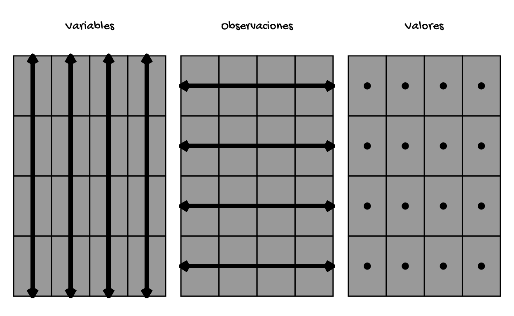  
```

Los datos que satisfacen estas reglas se conocen como __datos ordenados__.

:::exercise
#### Ejercicio 4.2.1
Teniendo en cuenta las reglas sobre datos ordenados, ¿cual de los cuatro conjuntos de datos anteriormente mencionados considera cumple con este principio?
:::

```{r letter_4_2_1, echo = FALSE}
question(" ",
  answer("Conjunto de datos 4", message = "No estas en lo correcto, sigue intentandolo."),
  answer("Conjunto de datos 1", correct = TRUE, message = "Estas en lo correcto... en este conjunto de datos cada variable se coloco en su propia columna, cada observación en su propia fila y cada valor en su propia celda."),
  answer("Conjunto de datos 2", message = "No estas en lo correcto, sigue intentandolo."),
  answer("Conjunto de datos 3", message = "No estas en lo correcto, sigue intentandolo."),
  allow_retry = TRUE,
  random_answer_order = TRUE
)
```

Los datos ordenados funcionan bien en `R` porque `R` es un lenguaje de programación vectorizado. Los conjuntos de datos en `R` están construidos a partir de vectores y las operaciones de `R` están optimizadas para trabajar con vectores. Los datos ordenados aprovechan estas dos características.

```{r, echo = FALSE, eval = TRUE, out.width = "64%", fig.align = "center"}
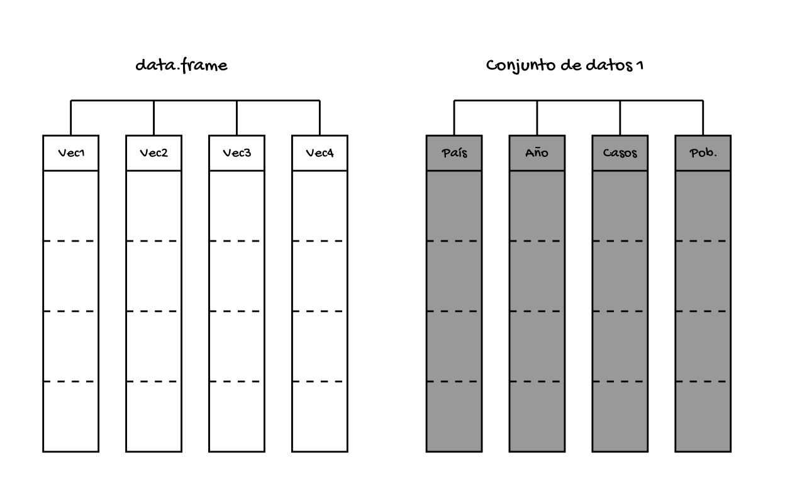  
```

Los datos ordenados fueron popularizados por __Hadley Wickham__, y sirven como base para muchos paquetes y funciones de `R`. Puede obtener más información sobre datos ordenados leyendo [Tidy Data](www.jstatsoft.org/v59/i10/paper), un documento escrito por __Hadley Wickham__ y publicado en el Journal of Statistical Software.

### 4.3 Ordenando los datos con `tidyr`

El paquete `tidyr` tiene como objetivo ayudarle a ordenar sus datos. Contiene varias funciones que alteran el diseño de los conjuntos de datos, al tiempo que conserva los valores:

+ `pivot_wider()`

La función `pivot_wider()` es usada cuando se tiene una observación dispersa en múltiples filas.

:::example
#### Ejemplo 4.3.1
:::

```{r, echo = FALSE, eval = TRUE, message = FALSE}

datos_2 <- DSR::table2 %>%
  rename('País' = country, 'Año' = year, 'Variables' = key, 'Valor' = value) %>%
  mutate(País = case_when(
    País == 'Afghanistan' ~ 'Afganistán',
    País == 'Brazil' ~ 'Brasil',
    País == 'China' ~ 'China'),
    Variables = case_when(
    Variables == 'cases' ~ 'Casos',
    Variables == 'population' ~ 'Población')
    )
```

```{r,eval=FALSE}
save(datos_2,file = "data_pkg/datos_2.rda")
```

```{r addition_4_3_1_a, exercise = TRUE}
datos_2
```

```{r, echo = FALSE, eval = TRUE, out.width = "64%", fig.align = "center"}
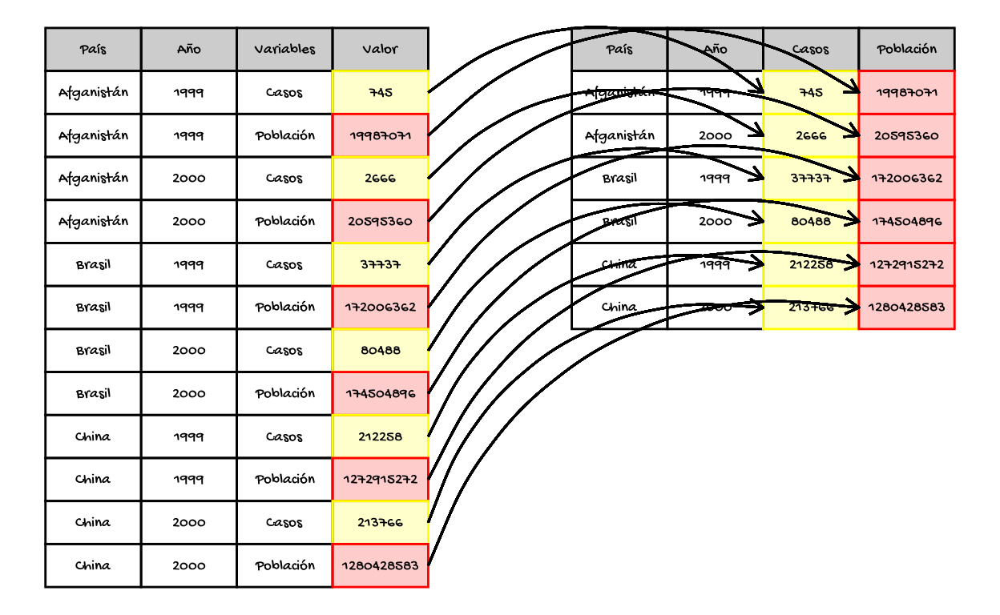  
```

```{r addition_4_3_1_b, exercise = TRUE}

datos_2_ancho <- pivot_wider(
  data = datos_2, # El nombre del conjunto de datos a ordenar.
  names_from = Variables, # Argumento que indica el nombre de la columna donde se encuentran las variables.
  values_from = Valor # Argumento que indica el nombre de la columna que contiene los valores de las variables.
  )

datos_2_ancho
```

+ `pivot_longer()`

La función `pivot_longer()` permite resolver las situaciones en donde se tienen columnas que realmente no representan variables, sino valores de una misma variable.

:::example
#### Ejemplo 4.3.2
:::

```{r, echo = FALSE, eval = TRUE, message = FALSE}
datos_4_a <- DSR::table4 %>%
  rename('País' = country) %>%
  mutate(País = case_when(
    País == 'Afghanistan' ~ 'Afganistán',
    País == 'Brazil' ~ 'Brasil',
    País == 'China' ~ 'China'
    ))
```

```{r,eval=FALSE}
save(datos_4_a,file = "data_pkg/datos_4_a.rda")
```

```{r addition_4_3_2_a, exercise = TRUE}
datos_4_a
```

```{r, echo = FALSE, eval = TRUE, out.width = "64%", fig.align = "center"}
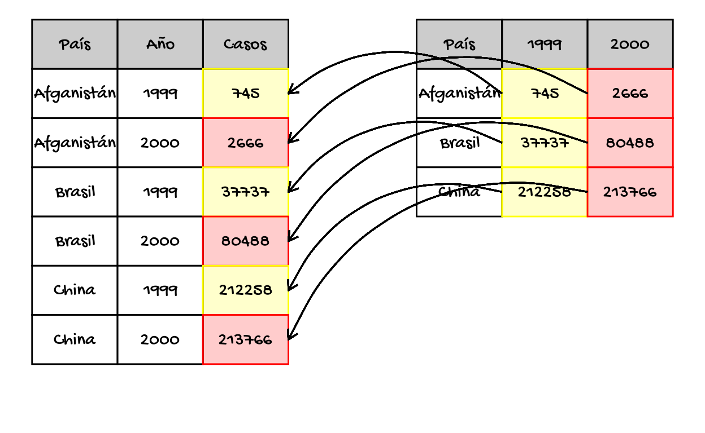  
```

```{r addition_4_3_2_b, exercise = TRUE}

datos_4_a_largo <- pivot_longer(
  data = datos_4_a, # El nombre del conjunto de datos a ordenar.
  cols = c('1999', '2000'), # Argumento donde se indican las columnas que pueden ser una variable.
  names_to = 'Año', # Argumento donde se indica el nombre de la columna a crear a partir de los datos almacenados anteriormente como columna de datos.
  values_to = 'Casos' # Argumento donde se indica el nombre de la columna a crear a partir de los datos almacenados anteriormente como valores de celda.
  )

datos_4_a_largo
```

:::exercise
#### Ejercicio 4.3.1
Teniendo en cuenta el ejemplo planteado anteriormente con la función `pivot_longer()`, por favor intente hacer lo mismo con el siguiente conjunto de datos llamado __datos_4_b__ con el fin obtener la estructura de datos ordenados presentada en la imagen a continuación.
:::

```{r, echo = FALSE, eval = TRUE, message = FALSE}
datos_4_b <- DSR::table5 %>%
  rename('País' = country) %>%
  mutate(País = case_when(
    País == 'Afghanistan' ~ 'Afganistán',
    País == 'Brazil' ~ 'Brasil',
    País == 'China' ~ 'China'
    ))
```

```{r,eval=FALSE}
save(datos_4_b,file = "data_pkg/datos_4_b.rda")
```

```{r addition_4_3_2_c, exercise = TRUE}
datos_4_b
```

```{r, echo = FALSE, eval = TRUE, out.width = "64%", fig.align = "center"}
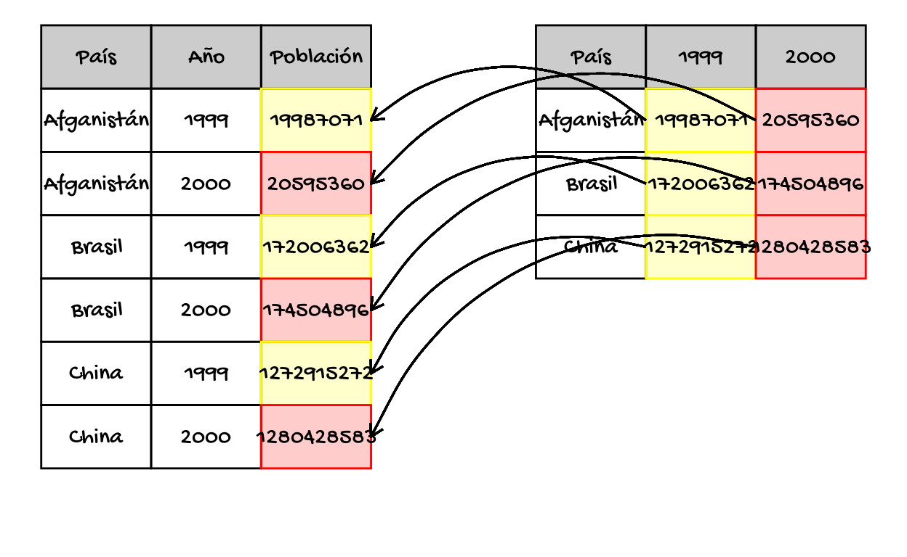  
```

```{r exe_4_3_2_c, exercise = TRUE}

```

```{r exe_4_3_2_c-solution}

datos_4_b_largo <- pivot_longer(
  data = datos_4_b,
  cols = c('1999', '2000'),
  names_to = 'Años',
  values_to = 'Población'
  )

datos_4_b_largo
```

```{r exe_4_3_2_c-check}

grade_code("¡Muy bien!, a partir de este cambio cada variable se coloco en su propia columna, cada observación en su propia fila y cada valor en su propia celda.")
```

:::caution
Como se observó, la función `pivot_longer()` hace lo opuesto a `pivot_wider()`. Por lo tanto, ambas funciones son complementarias, es decir, si al resultado de aplicar la función `pivot_wider()` se le aplica la función `pivot_longer()` se llega al conjunto de datos original. Otra observación interesante es que `pivot_longer()` __alarga__ los conjuntos de datos, mientras que `pivot_wider()` los hace más __anchos__.
:::

+ `separate()` y `unite()`

La función `separate()` lo que hace es dividir una columna en múltiples columnas, tomando como separador algún símbolo, mientras que la función `unite()` toma múltiples columnas y las une en una única columna, separando los elementos mediante un separador.

:::example
#### Ejemplo 4.3.3
:::

```{r, echo = FALSE, eval = TRUE, message = FALSE}

datos_3 <- DSR::table3 %>%
  rename('País' = country, 'Año' = year, 'Tasa' = rate) %>%
  mutate(País = case_when(
    País == 'Afghanistan' ~ 'Afganistán',
    País == 'Brazil' ~ 'Brasil',
    País == 'China' ~ 'China'
    ))
```

```{r,eval=FALSE}
save(datos_3,file = "data_pkg/datos_3.rda")
```

```{r addition_4_3_3_a, exercise = TRUE}
datos_3
```

```{r, echo = FALSE, eval = TRUE, out.width = "64%", fig.align = "center"}
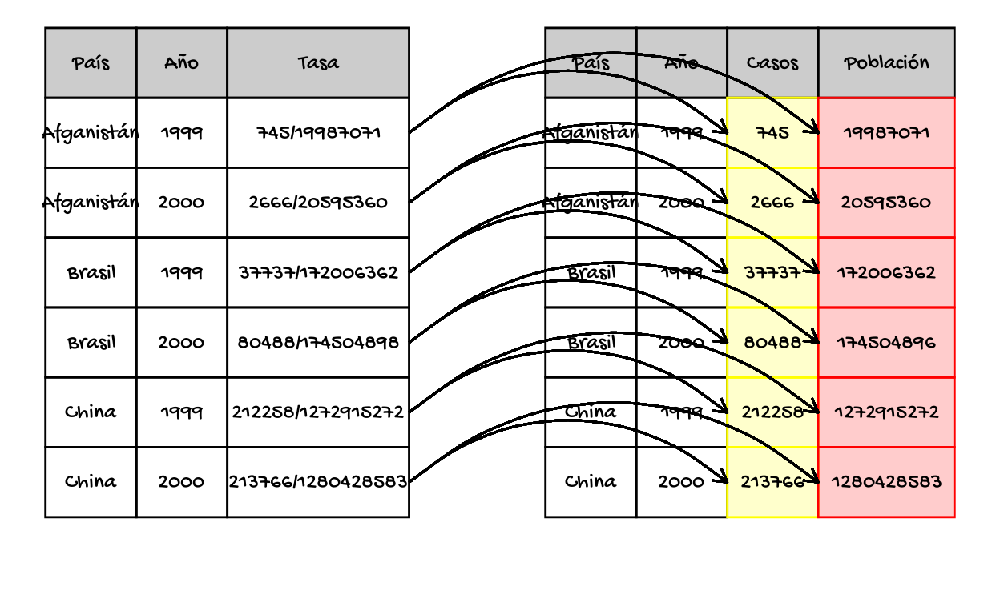  
```

```{r addition_4_3_3_b, exercise = TRUE}
datos_3_separado <- separate(
  data = datos_3, # El nombre del conjunto de datos a ordenar.
  col = Tasa, # Argumento donde se indica el nombre de la columna que se quiere dividir.
  into =  c('Casos', 'Población'), # Argumento donde se indica los nombres de las nuevas variables.
  sep  =  '/'#, # Argumento donde se indica el símbolo que separa las dos variables en una misma columna.
  #convert = TRUE # Opción que permite hacer la conversión de tipo caracter a numérico.
  )

datos_3_separado
```

<!--
Esto puede parecer un lugar extraño para comenzar, pero ordenar datos es la habilidad más fructífera que puedes aprender como científico de datos. Le ahorrará horas de tiempo y hará que sus datos sean mucho más fáciles de visualizar, manipular y modelar con R.
-->

:::exercise
#### Ejercicio de repaso
:::

El siguiente conjunto de datos contiene casos de tuberculosis registrados en distintos años. Dichos datos se encuentran en el _Informe Gobal de Tuberculosis_ de la Organización Mundial de la Salud, disponible para descargar [aquí](https://www.who.int/tb/country/data/download/en/). Este conjunto de datos proporciona un ejemplo realista de datos desordenados.

```{r,eval=TRUE,message=FALSE,echo=FALSE}
data('who')

Tuberculosis <- DSR::who
Tuberculosis
```

La característica más peculiar del anterior conjunto de datos es su sistema de codificación. Las columnas cinco a sesenta codifican cuatro partes de información que separadas significan lo siguiente:

1) Las primeras tres letras de cada columna indican si los casos de tuberculosis corresponden a casos nuevos o antiguos. En este conjunto de datos, cada columna contiene solo nuevos casos.

2) Las siguientes dos letras describen el tipo de caso de tuberculosis:
- `rel` significa casos de recaída,
- `ep` significa casos de tuberculosis extrapulmonar,
- `sn` significa casos de tuberculosis pulmonar que no pudieron ser diagnosticados por un frotis pulmonar (frotis negativo),
- `sp` significa casos de tuberculosis pulmonar que podrían diagnosticarse por un frotis pulmonar (frotis positivo).
  
3) La sexta parte describe el sexo de los pacientes con tuberculosis: `m` para hombres y `f` para mujeres.
  
4) La última parte describe el grupo de edad de los pacientes con tuberculosis. El conjunto de datos agrupa los casos en siete grupos de edad:
- `014` significa pacientes de 0 a 14 años de edad,
- `1524` significa pacientes de 15 a 24 años de edad,
- `2534` representa pacientes de 25 a 34 años de edad,
- `3544` significa pacientes que tienen entre 35 y 44 años,
- `4554` significa pacientes de 45 a 54 años de edad,
- `5564` significa pacientes de 55 a 64 años de edad,
- `65` significa pacientes que tienen 65 años o más.

El ejercicio de repaso propuesto consiste en que haciendo uso de las funciones mecionadas del paquete `tidyr` trate de ordenar el conjunto de datos `Tuberculosis`, e intente obtener un conjunto de datos similar a como se observa en la imagen a continuación.

```{r, echo = FALSE, eval = TRUE, out.width = "64%", fig.align = "center"}
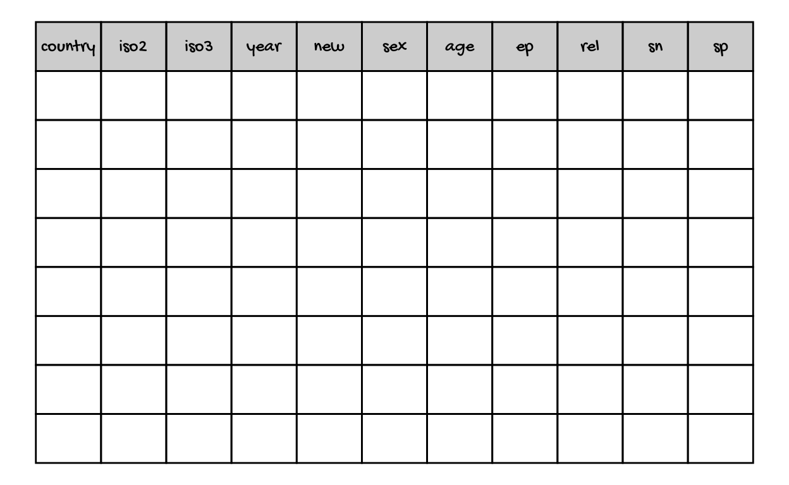  
```

```{r, eval = FALSE}

save(Tuberculosis, file = 'data_pkg/Tuberculosis.rda')
```

```{r addition_ejercicio, exercise = TRUE}

```

```{r addition_ejercicio-hint, warning = FALSE}

Tuberculosis_2 <- pivot_longer(
  data = ,
  cols = c(),
  names_to = 'codificacion',
  values_to = 'valor'
  )

Tuberculosis_3 <- (
  data = Tuberculosis_2,
  col = codificacion,
  into = c('new', 'type', 'sexage'),
  sep = ' '
  )

Tuberculosis_4 <- separate(
  data = ,
  col = sexage,
  into = c(' ', ' '),
  sep = 1 # Aqui 1 indica el primer elemento dentro de la variable sexage, es decir m o f.
  )

Tuberculosis_5 <- pivot_wider(
  data = Tuberculosis_4,
  names_from = type,
  values_from = Valor
  )
```

```{r addition_ejercicio-solution, warning = FALSE}

Tuberculosis_2 <- pivot_longer(
  data = Tuberculosis,
  cols = c(5:60),
  names_to = 'codificacion',
  values_to = 'valor'
  )

Tuberculosis_3 <- separate(
  data = Tuberculosis_2,
  col = codificacion,
  into = c('new', 'tipo', 'sexage'),
  sep = '_'
  )

Tuberculosis_4 <- separate(
  data = Tuberculosis_3,
  col = sexage,
  into = c('sex', 'age'),
  sep = 1 # Aqui 1 indica el primer elemento dentro de la variable sexage.
  )

Tuberculosis_5 <- pivot_wider(
  data = Tuberculosis_4,
  names_from = tipo,
  values_from = valor
  )
```

## 5. Manipulación/limpieza de datos

### 5.1 Descripción de los datos a usar

En esta parte del curso sobre la __manipulación de datos__ se empleara el conjunto de datos `penguins`, el cual resultó de una investigación donde se examinó el dimorfismo sexual ecológico entre pingüinos del género _Pygoscelis_.

```{r, echo = FALSE, eval = TRUE, out.width = "38%", fig.align = "center"}
knitr::include_graphics("images/Pygoscelis_penguins.png")  
```

<section style="text-align: center;"><small>Ilustracíon hecha por <font color = "black"><u>\@allison_horst</u></font>.</small></section>

#### 5.1.1 Información sobre el conjunto de datos

Descargo de responsabilidad: El conjunto de datos `penguins` hace parte del paquete [palmerpenguins](https://github.com/allisonhorst/palmerpenguins). Este conjunto de datos debe entenderse como datos de muestra para aprender sobre herramientas de manipulación y visualización<!--, y cualquier persona interesada en publicarlos deberá comunicarse previamente con las personas responables de su recopilación-->.

Cita de datos: Gorman KB, Williams TD, Fraser WR (2014) Dimorfismo sexual ecológico y variabilidad ambiental dentro de una comunidad de Pingüinos antárticos (Género _Pygoscelis_). PLoS ONE 9 (3): e90081. https://doi.org/10.1371/journal.pone.0090081

Estructura general de lo datos: A continuación podrá hechar un vistazo de la estructura del conjunto de datos `penguins`:

```{r datos_pinguinos, exercise = TRUE}

palmerpenguins::penguins
```

  1) En `species`podrá encontrar las tres especies existentes del genéro de pingüinos _Pygoscelis_.

  2) En `island` podrá encontrar el nombre de las islas donde fueron ubicadas las colonias de pingüinos.

<div class="row">
  <div class="col-md-6" markdown="1">
  3) En `culmen_length_mm` se registró la longitud del culmen (margen superior del pico) de las tres especies de pingüinos.
  
  4) En `culmen_depth_mm` se registró la profundidad del culmen de las tres especies de pingüinos.
  </div>
  <div class="col-md-6" markdown="1">
```{r, echo = FALSE, eval = TRUE, out.width = "38%", fig.align = "center"}
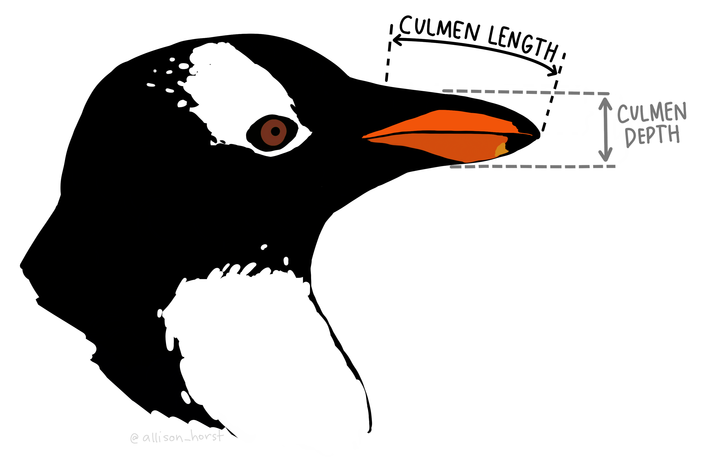
```

<section style="text-align: center;"><small>Ilustracíon hecha por <font color = "black"><u>\@allison_horst</u></font>.</small></section>
  </div>
</div>

  5) En `flipper_length_mm` se registró la longitud de la aleta de las tres especies de pingüinos.

  6) En `body_mass_g` se registró la masa corporal de cada uno de los pingüinos.

  7) En `sex` podrá encontrar la información sobre el sexo (FEMALE para hembras y MALE para machos) de cada uno de los pingüinos.

### 5.2 Manipulación de datos con `dplyr`

Se suele decir que la manipulación y la limpieza de los datos suele ocupar un 80% del tiempo en el análisis de datos. También es sabido que esta no es una experiencia alegre. Sin embargo, existen herramientas disponibles que ayudan en esta tarea.

El paquete `dplyr` es un paquete que permite obtener partes de los datos de una manera rápida, fácil de entender y fácil de replicar. Aprender y usar este paquete hará del proceso de manipulación y limpieza de datos una tarea más agradable. <!-- Este paquete está escrito en C++, por lo cual las funciones que provee permiten hacer operaciones más rápido que su equivalente del paquete base.-->

```{r, echo = FALSE, eval = TRUE, out.width = "54%", fig.align = "center"}
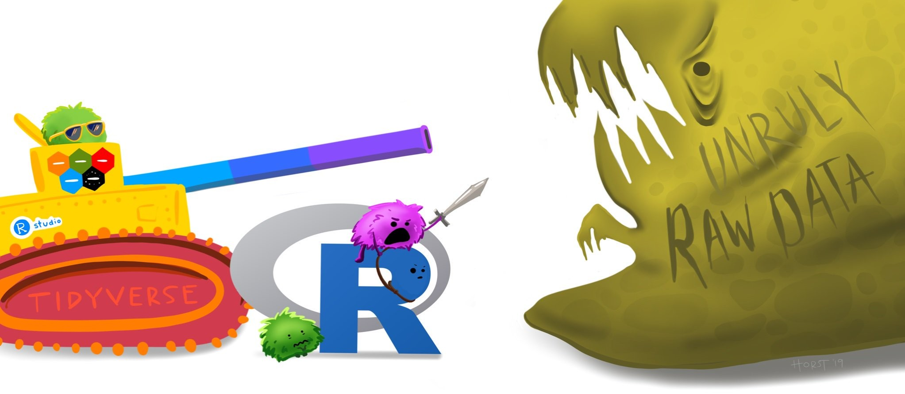  
```

<section style="text-align: center;"><small>Ilustracíon hecha por <font color = "black"><u>\@allison_horst</u></font>.</small></section>

#### 5.2.1 Una gramática para la manipulación de datos

El paquete `dplyr` tiene como objetivo proporcionar una función para cada verbo básico de la manipulación de datos. Estos verbos se pueden organizar en tres categorías según el componente del conjunto de datos sobre el que trabajan:

<div class="row">
  <div class="col-md-4" markdown="1">
1) Filas:
  + `filter()`.
  + `slice()`.
  + `arrange()`.

2) Columnas:
  + `select()`.
  + `rename()`.
  + `mutate()`.
  + `relocate()`.

3) Grupos de filas y columnas:
  + `summarise()`.
</div>
  <div class="col-md-8" markdown="1">
```{r, echo = FALSE, eval = TRUE, out.width = "70%", fig.align = "center"}
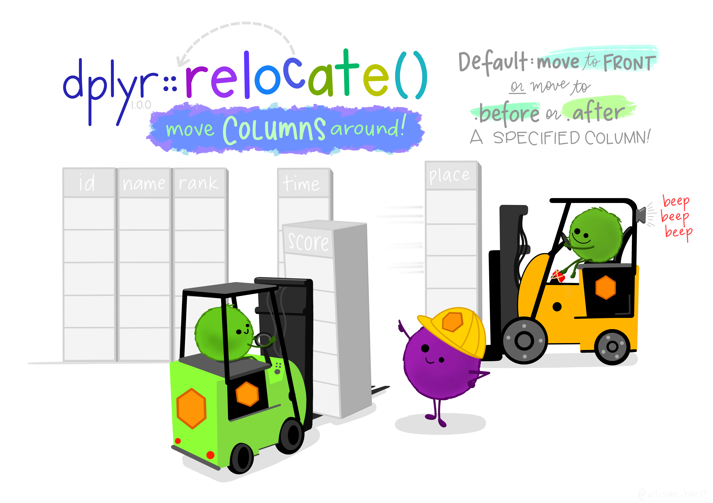  
```

<section style="text-align: center;"><small>Ilustracíon hecha por <font color = "black"><u>\@allison_horst</u></font>.</small></section>
  </div>
</div>

##### 5.2.1.1 Filtrar filas con `filter()`

La función `filter()` permite elegir y extraer filas que satisfacen ciertas condiciones. La sintaxis general de `filter()` es: `filter(dataset, condition)`.

+ Filtrar filas basado en coincidencias exactas de variables de tipo carácter

Si desea seleccionar un grupo específico de valores de una variable de tipo carácter, se puede usar el operador de comparación `==`.

:::example
#### Ejemplo 5.2.1.1.1
:::

```{r, echo = FALSE, eval = TRUE, out.width = "64%", fig.align = "center"}
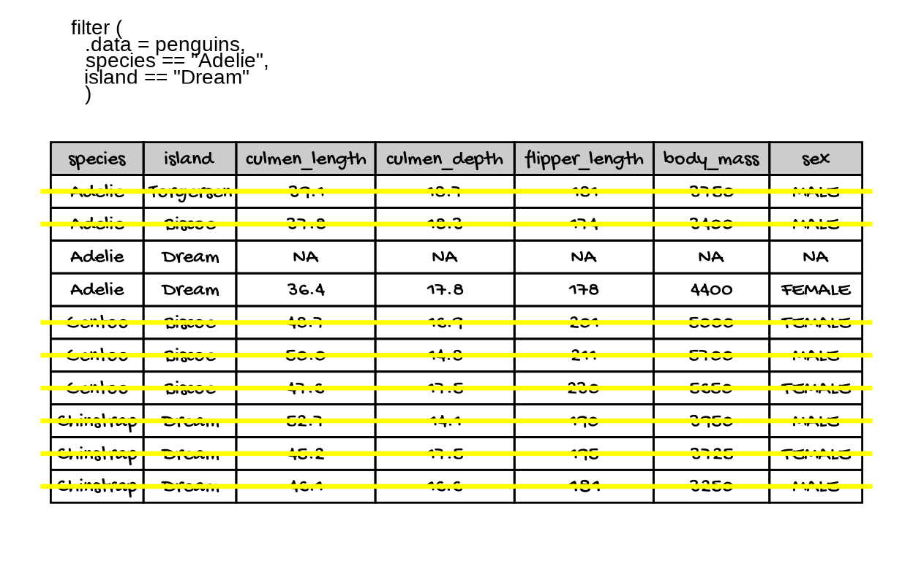  
```

```{r ejemplo_5_2_1_1_1, exercise = TRUE}

filter(
  .data = penguins,
  species == 'Adelie',
  island == 'Dream'
  )
```

:::caution
Si bien en el ejemplo se uso el operador de comparación igual a (`==`), se pueden utilizar otros operadores. Por ejemplo, `filter(.data = penguins, species != 'Adelie')`, seleccionará todas las filas diferentes de (`!=`) Adelie.
:::

+ Filtrar filas basado en variables numéricas

Si desea filtrar variables numéricas en función de sus valores, puede hacerlo por medio de los operadores `>`, `>=`, `<`, `<=`, `==` y `!=`.

:::example
#### Ejemplo 5.2.1.1.2
:::

```{r ejemplo_5_2_1_1_2_a, exercise = TRUE}
filter(
  .data = penguins,
  body_mass_g < 4400
  )
```

```{r ejemplo_5_2_1_1_2_b, exercise = TRUE}

filter(
  .data = penguins,
  body_mass_g <= 4400,
  body_mass_g >= 3800
  )

filter(
  .data = penguins,
  between(body_mass_g, 3800, 4400)
  )
```

+ Filtrar filas vacías

Para filtrar filas vacías se puede usar la función `is.na()` dentro de `filter()`.

:::example
#### Ejemplo 5.2.1.1.3
:::

```{r ejemplo_5_2_1_1_3, exercise = TRUE}

filter(
  .data = penguins,
  !is.na(culmen_length_mm)
  )
```

#### 5.2.1.2 Elegir filas usando su posición con `slice()`

La función `slice()` permite indexar filas por sus ubicaciones dentro del conjunto de datos. Esta permite seleccionar, eliminar y duplicar filas.

:::example
#### Ejemplo 5.2.1.2.1
:::

```{r, echo = FALSE, eval = TRUE, out.width = "64%", fig.align = "center"}
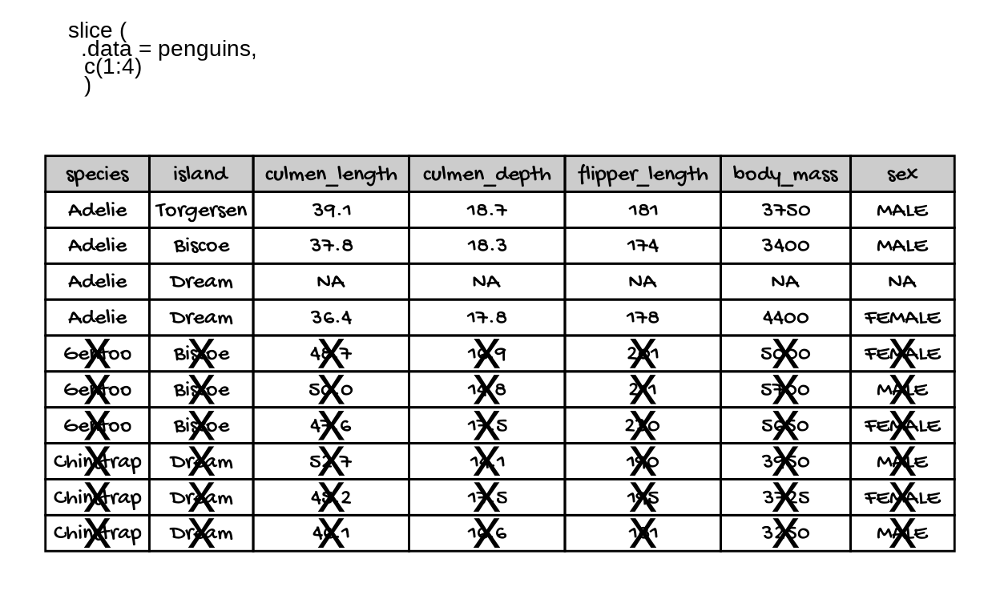  
```

```{r ejemplo_5_2_1_2_1_a, exercise = TRUE}

slice(
  .data = penguins,
  c(1:4)
  )
```

```{r ejemplo_5_2_1_2_1_b, exercise = TRUE}

slice_head(
  .data = penguins,
  n = 4
  )

slice_tail(
  .data = penguins,
  n = 4
  )
```

```{r ejemplo_5_2_1_2_1_c, exercise = TRUE}

slice_sample(
  .data = penguins,
  n = 4
  )
```

```{r ejemplo_5_2_1_2_1_d, exercise = TRUE}

slice_min(
  .data = penguins,
  culmen_depth_mm, n = 4
  )

slice_max(
  .data = penguins,
  body_mass_g, n = 4
  )
```

#### 5.2.1.3 Organizar filas con `arrange()`

La función `arrange()` permite reordenar las filas un conjunto de datos en función del valor de una determinada variable. Esto puede ser útil si se desea ver rápidamente qué mediciones tuvieron los valores más altos o más bajos.

:::example
#### Ejemplo 5.2.1.3.1
:::

```{r, echo = FALSE, eval = TRUE, out.width = "64%", fig.align = "center"}
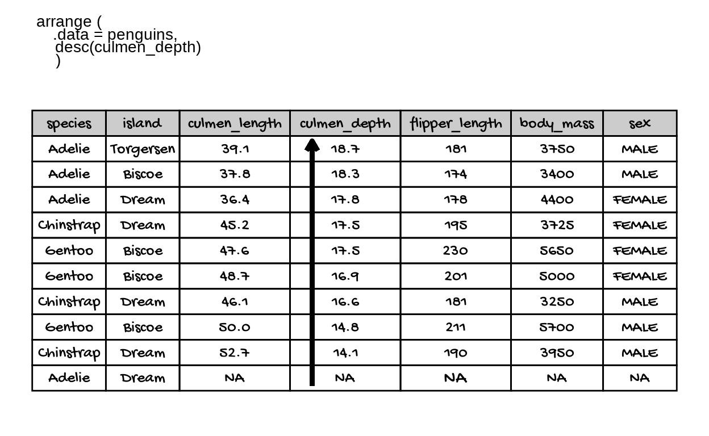  
```

```{r ejemplo_5_2_1_3_1_b, exercise = TRUE}

arrange(
  .data = penguins,
  desc(culmen_depth_mm)
  )
```

```{r ejemplo_5_2_1_3_1_a, exercise = TRUE}

arrange(
  .data = penguins,
  culmen_depth_mm
  )
```

:::caution
Al usar la función `arrange()` siempre se pondrán los valores de `NA` al final del conjunto de datos.
:::

#### 5.2.1.4 Seleccionar columnas con `select()`

La función `select()` permite elegir y extraer columnas de interés de un conjunto de datos.

:::example
#### Ejemplo 5.2.1.4.1
:::

```{r, echo = FALSE, eval = TRUE, out.width = "64%", fig.align = "center"}
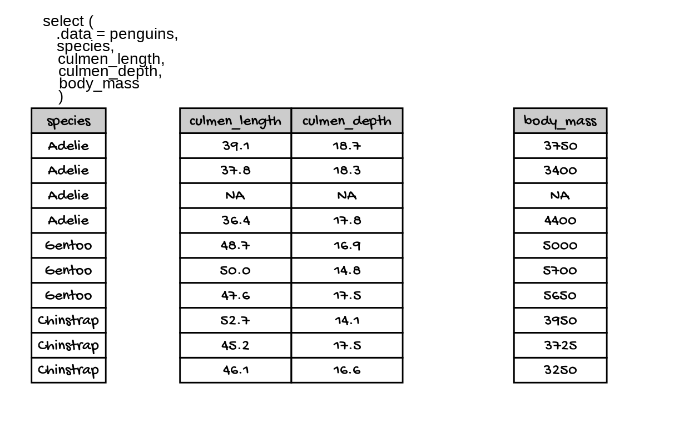  
```

```{r ejemplo_5_2_1_4_1, exercise = TRUE}

select(
  .data = penguins,
  species,
  culmen_length_mm,
  culmen_depth_mm,
  body_mass_g
  )

select(
  .data = penguins,
  species,
  culmen_length_mm:culmen_depth_mm,
  body_mass_g
  )

select(
  .data = penguins,
  -island,
  -flipper_length_mm,
  -sex
  )

select(
  .data = penguins,
  -(species:sex),
   species,
   culmen_length_mm,
   culmen_depth_mm,
   body_mass_g
  )
```

+ Seleccionar columnas basadas en nombres parciales de columnas

Si se tiene una gran cantidad de columnas o variables con una estructura similar, se puede utilizar la concordancia parcial mediante la adición de `starts_with()`, `ends_with()` o `contains()` en la sentencia de selección.

:::example
#### Ejemplo 5.2.1.4.2
:::

```{r ejemplo_5_2_1_4_2, exercise = TRUE}

select(
  .data = penguins,
  starts_with('culmen')
  )

select(
  .data = penguins,
  ends_with('mm')
  )

select(
  .data = penguins,
  contains('length')
  )
```

+ Seleccionar columnas basadas en columnas preidentificadas

Puede identificar el nombre de las columnas inicialmente, y luego referirse a ellas dentro de la función `select()` por medio de la función `one_of()` o utilizando el operador `!!`.

:::example
#### Ejemplo 5.2.1.4.3
:::

```{r ejemplo_5_2_1_4_3, exercise = TRUE}

variables_cualitativas <- c('species', 'island', 'sex')

select(
  .data = penguins,
  one_of(variables_cualitativas)
  )

select(
  .data = penguins,
  !!variables_cualitativas
  )
```

+ Seleccionar columnas por su tipo de dato

La función `select_if()` permite seleccionar columnas en base a su tipo de dato. Para esto, se puede emplear las funciones `is.character()`, `is.numeric()`, `is.integer()`, `is.double()`, `is.logical()`, `is.factor()`.

:::example
#### Ejemplo 5.2.1.4.4
:::

```{r ejemplo_5_2_1_4_4, exercise = TRUE}

select_if(
  penguins,
  is.factor
  )

select_if(
  penguins,
  ~!is.numeric(.)
  )
```

:::exercise
#### Ejercicio 5.2.1.4.1

En el ejemplo anterior se seleccionaron solo las columnas o variables cuyo valor es de tipo distinto al numérico. Intente por favor seleccionar esta vez aquellas columnas o variables numéricas.
:::

```{r ejercicio_5_2_1_4_4, exercise = TRUE}

```

```{r ejercicio_5_2_1_4_4-solution, warning = FALSE}

select_if(
  penguins,
  is.numeric
  )

select_if(
  penguins,
  ~!is.factor(.)
  )
```

```{r ejercicio_5_2_1_4_4-check}

grade_code("¡Muy bien! Sigue así y lograras grandes avances.")
```

+ Uso de `select()` para renombrar columnas

Puede cambiar el nombre de las columnas o variables con la función `select()`.

:::example
#### Ejemplo 5.2.1.4.5
:::

```{r ejercicio_5_2_1_4_5, exercise = TRUE}

select(
  .data = penguins,
  gender = sex
  )
```

#### 5.2.1.5 Cambiar el nombre de las columnas con `rename()`

La función `rename()` permite cambiar los nombres de las columnas o variables.

:::example
#### Ejemplo 5.2.1.5.1
:::

```{r, echo = FALSE, eval = TRUE, out.width = "64%", fig.align = "center"}
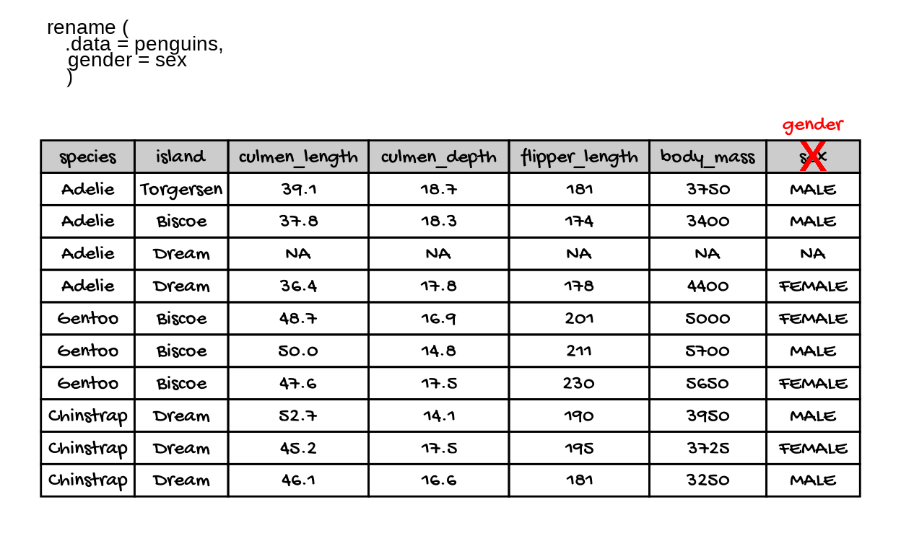  
```

```{r ejemplo_5_2_1_5_1, exercise = TRUE}

rename(
  .data = penguins,
  gender = sex
  )
```

#### 5.2.1.6 Agregar nuevas columnas con `mutate()`

A menudo es útil agregar nuevas variables o columnas que son funciones de las ya existentes. Esto se puede hacer por medio de la función `mutate()`.

:::example
#### Ejemplo 5.2.1.6.1
:::

```{r, echo = FALSE, eval = TRUE, out.width = "64%", fig.align = "center"}
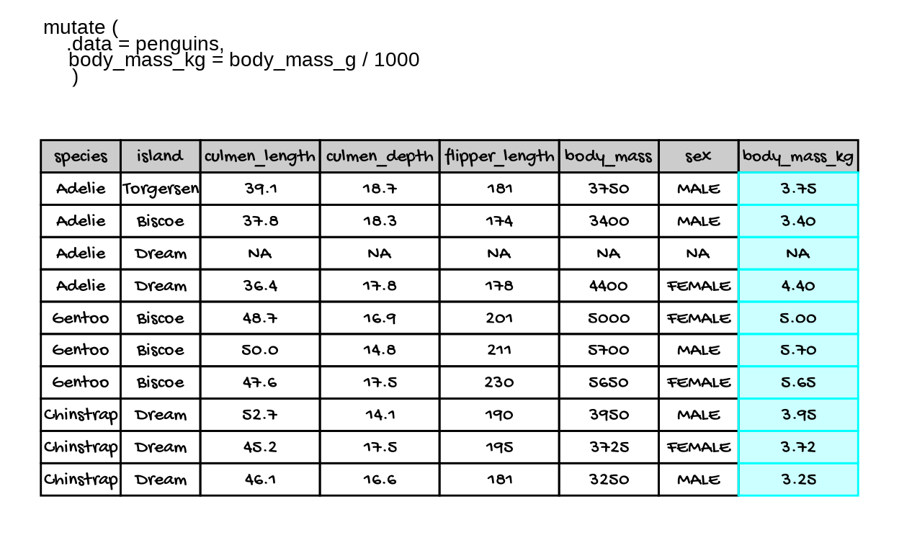  
```

```{r ejemplo_5_2_1_6_1_a, exercise = TRUE}

mutate(
  .data = penguins,
  body_mass_kg = body_mass_g / 1000
  )

transmute(
  .data = penguins,
  body_mass_kg = body_mass_g / 1000
  )
```

```{r ejemplo_5_2_1_6_1_b, exercise = TRUE}

mutate(
  .data = penguins,
  body_mass_g_VS_prom_body_mass = body_mass_g - round(mean(body_mass_g, na.rm = TRUE), digits = 1),
  body_mass_g_VS_min_body_mass = body_mass_g - min(body_mass_g, na.rm = TRUE)
  )
```

+ Recodificación de columnas cualitativas

Para cambiar el nombre de los valores de las columnas o variables cualitativas, se puede usar la función `recode()` dentro de la función `mutate()`.

:::example
#### Ejemplo 5.2.1.6.2
:::

```{r ejemplo_5_2_1_6_2, exercise = TRUE}

mutate(
  .data = penguins,
  sex_2 = recode(
    .x = sex,
    'FEMALE' = 'Hembra',
    'MALE' = 'Macho'
    )
  )
```

+ Crear nuevas columnas cualitativas

Si desea convertir una columna numérica en una columna o variable cualitativa, puede hacer uso de la función `case_when()`.

:::example
#### Ejemplo 5.2.1.6.3
:::

```{r ejemplo_5_2_1_6_3, exercise = TRUE}

mutate(
  .data = penguins,
  body_mass_2 = case_when(
    body_mass_g < 3400 ~ 'Liviano',
    body_mass_g >= 3400 & body_mass_g <= 4400 ~ 'Normal',
    body_mass_g > 4400 ~ 'Pesado'
    )
  )
```

#### 5.2.1.7 Cambiar el orden de las columnas con `relocate()`

Una forma fácil de cambiar el orden de las columnas en el conjunto de datos es mediante el uso de la función `relocate()`.

:::example
#### Ejemplo 5.2.1.7.1
:::

```{r, echo = FALSE, eval = TRUE, out.width = "64%", fig.align = "center"}
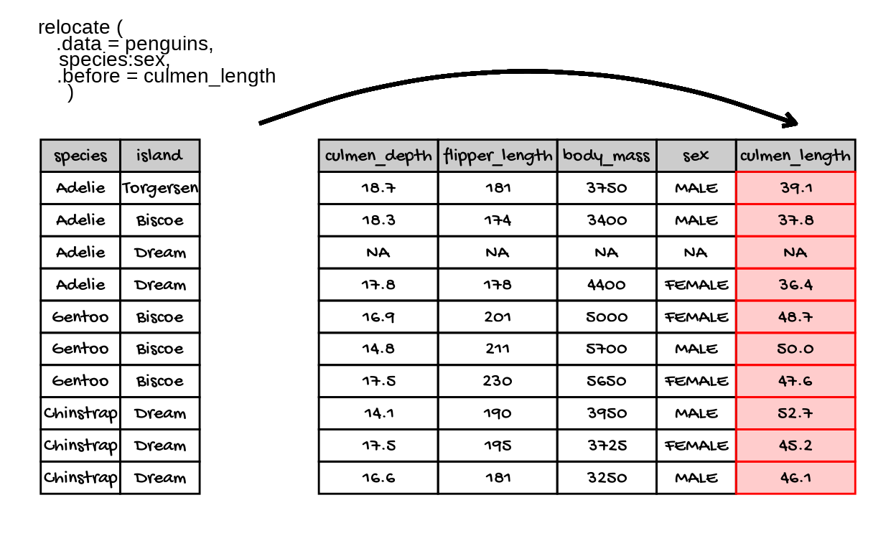  
```

```{r ejemplo_5_2_1_7_1, exercise = TRUE}

relocate(
  .data = penguins,
  species:sex,
  .before = culmen_length_mm
  )
```

:::exercise
#### Ejercicio 5.2.1.7.1

En el ejemplo anterior la columna `culmen_length_mm` se movio hacia la última columna por medio de la función `.before()`. Intente por favor haciendo uso de la función `.after()` mover esa misma columna para que sea la primera columna.
:::

```{r ejercicio_5_2_1_7_1, exercise = TRUE}

```

```{r ejercicio_5_2_1_7_1-solution, warning = FALSE}

relocate(
  .data = penguins,
  species:sex,
  .after = culmen_length_mm
  )
```

#### 5.2.1.8 Resumir valores con `summarise()`/`summarize()` y `group_by()`

La función `summarise()` (o `summarize()`) permite obtener un nuevo conjunto de datos el cual contiene un resumen de una determinada columna, calculando un valor único de los múltiples valores en esa columna.

:::example
#### Ejemplo 5.2.1.8.1
:::

```{r ejemplo_5_2_1_8_1_a, exercise = TRUE}

summarise(
  .data = penguins,
  Prom_length = round(mean(culmen_length_mm, na.rm = TRUE), digits = 2),
  Prom_depth = round(mean(culmen_depth_mm, na.rm = TRUE), digits = 2)
  )

Promedio <- function(x){
  x = na.omit(x)
  Suma = sum(x)
  Total = length(x)
  Media = Suma/Total
  print(Media)
  }


summarise(
  .data = penguins,
  Prom_length = Promedio(culmen_length_mm),
  Prom_depth = Promedio(culmen_depth_mm)
  )
```

Usar la función `summarise()` puede ser útil por sí sola, pero es aún más útil cuando se usa para saber las diferencias entre grupos. Para hacer esto, se puede combinar con la función `group_by()`.

:::example
#### Ejemplo 5.2.1.8.2
:::

```{r, echo = FALSE, eval = TRUE, out.width = "64%", fig.align = "center"}
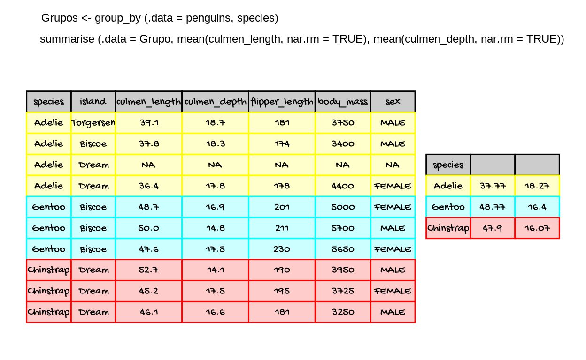  
```

```{r ejemplo_5_2_1_8_1_b, exercise = TRUE, message = FALSE}

Grupos <- group_by(
  .data = penguins,
  species
  )
Grupos

summarise(
  .data = Grupos,
  Prom_lenght = round(mean(culmen_length_mm, na.rm = TRUE), digits = 2),
  Prom_depth = round(mean(culmen_depth_mm, na.rm = TRUE), digits = 2)
  )
```

:::caution
La agrupación permite comparar rápidamente diferentes subconjuntos de los datos. La agrupación permite enmarcar la pregunta de análisis en términos de comparar grupos de observaciones, en lugar de observaciones individuales. Esta forma hace que sea más fácil hacer y responder preguntas complejas sobre los datos.
:::

#### 5.2.1.9 Resumir valores con `summarise()`/`summarize()` y `across()`

A menudo es útil realizar la misma operación en varias columnas. La función `across()` permite realizar esto.

:::example
#### Ejemplo 5.2.1.9.1
:::

```{r, echo = FALSE, eval = TRUE, out.width = "64%", fig.align = "center"}
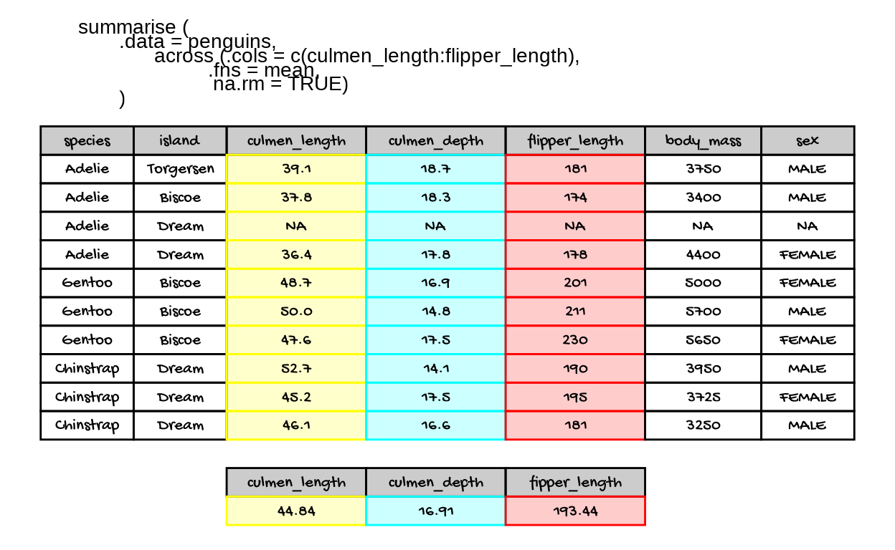  
```

```{r ejemplo_5_2_1_9_1, exercise = TRUE, message = FALSE}

summarise(
  .data = penguins,
  across(
    .cols = c(culmen_length_mm, culmen_depth_mm, flipper_length_mm),
    .fns = mean,
    na.rm = TRUE
    )
  )

summarise(
  .data = penguins,
  across(
    .cols = ends_with('mm'),
    .fns = mean,
    na.rm = TRUE
    )
  )

summarise(
  .data = penguins,
  across(
    .cols = where(is.numeric),
    .fns = mean,
    na.rm = TRUE
    ),
  across(
    .cols = where(is.factor),
    .fns = nlevels
    )
  )
```

#### 5.2.1.10 Realización de operaciones secuenciales con `%>%`

Un enfoque para realizar análisis de datos complejos consiste en crear objetos intermedios para usar en dicho análisis. Este es un flujo de trabajo muy común.

:::example
#### Ejemplo 5.2.1.10.1
:::

```{r ejemplo_5_2_1_10_1_a, exercise = TRUE, message = FALSE}

a1 <- rename(
  .data = penguins,
  gender = sex
  )
a2 <- filter(
  .data = a1,
  gender == 'FEMALE'
  )
a3 <- mutate(
  .data = a2,
  body_mass_kg = body_mass_g / 1000
)

mutate(
  filter(
    rename(
      .data = penguins,
      gender = sex
      ),
    gender == 'FEMALE'
    ),
  body_mass_kg = body_mass_g / 1000
  )
```

Para solucionar el problema que puede resultar del enfoque anterior, el paquete `dplyr` proporciona el operador de tubería (`%>%`). El `%>%` es un operador que permite encadenas funciones. Lo que hace es tomar la salida de una función y pasarla como entrada de la siguiente función.

:::example
#### Ejemplo 5.2.1.10.2
:::

```{r, echo = FALSE, eval = TRUE, out.width = "64%", fig.align = "center"}
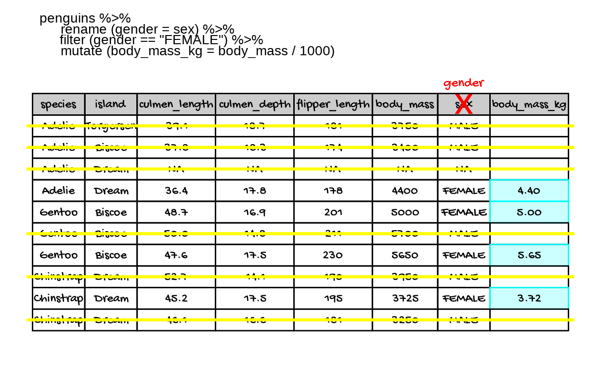  
```

```{r ejemplo_5_2_1_10_1_b, exercise = TRUE}

Peso_fem_kg <- penguins %>%
  rename(gender = sex) %>%
  filter(gender == 'FEMALE') %>%
  mutate(body_mass_kg = body_mass_g / 1000)
Peso_fem_kg
```

:::exercise
#### Ejercicio 5.2.1.10.1
Intente por favor calcular el valor medio de la longitud de la aleta (`flipper_length_mm`) de las tres especies de pinguinos del conjunto de datos `penguins`, pero que sean solo de sexo (`sex`) macho (`MALE`).
:::

```{r ejercicio_5_2_1_10_1, exercise = TRUE}


```

```{r ejercicio_5_2_1_10_1-solution, message = FALSE}

penguins %>%
  filter(sex == 'MALE') %>%
  summarise(
    across(
      .cols = flipper_length_mm,
      .fns = mean,
      na.rm = TRUE
      )
  )
```

#### 5.2.1.11 Unir conjuntos de datos con `_join()`

A menudo los datos se pueden almacenar en múltiples conjuntos de datos. En algún momento se querrá acceder a la información de dichos conjuntos de datos, por lo cual necesitará una forma de poder combinarlos. A este proceso se le denomina unión (__join__) por la sencilla razón de que unira dichos conjuntos de datos.

El paquete `dplyr` cuenta con un conjunto de funciones de combinación para realizar este procedimiento.

```{r, echo = FALSE, eval = TRUE, message = FALSE}

Datos_a <- tribble(
  ~ID , ~x1,
  '1', 'a1',
  '2', 'a2'
  )

Datos_b <- tribble(
  ~ID , ~x2,
  '2', 'b1',
  '3', 'b2'
  )
```

```{r, eval = FALSE}

save(Datos_a, file = 'data_pkg/Datos_a.rda')
save(Datos_b, file = 'data_pkg/Datos_b.rda')
```

<div class="row">
  <div class="col-md-6" markdown="1">
```{r, echo = FALSE, eval = TRUE, message = FALSE}

Datos_a %>%
  kable() %>% 
  kable_styling(full_width = FALSE,
                bootstrap_options = (c('striped', 'bordered')))
```
  </div>
  <div class="col-md-6" markdown="1">
```{r, echo = FALSE, eval = TRUE, message = FALSE}

Datos_b %>%
  kable() %>% 
  kable_styling(full_width = FALSE,
                bootstrap_options = (c('striped', 'bordered')))
```
  </div>
</div>

+ `inner_join()`

Esta unión retorna todas las columnas del primer y segundo conjunto de datos, pero solo retorna las filas del primer conjunto de datos que coinciden con el segundo conjunto de datos.

:::example
#### Ejemplo 5.2.1.11.1
:::

```{r, echo = FALSE, eval = TRUE, out.width = "54%", fig.align = "center"}
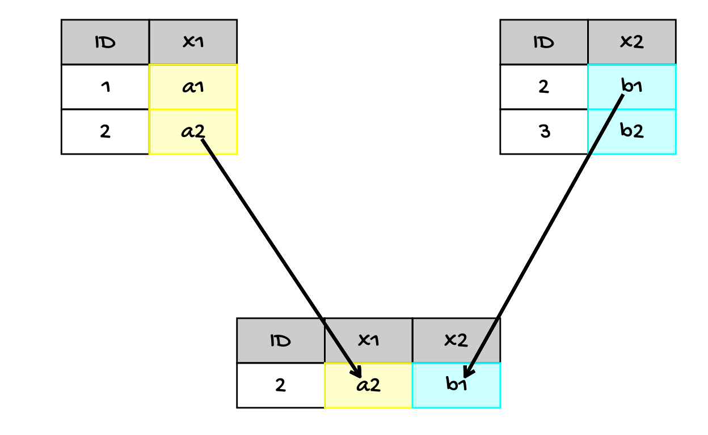  
```

```{r ejemplo_5_2_1_11_1, exercise = TRUE}

inner_join(
  x = Datos_a,
  y = Datos_b,
  by = 'ID'
  )
```

:::caution
Generalmente, las uniones llevadas a cabo usando la función `inner_join()` no son apropiadas para su uso en el análisis de datos dado que es muy fácil perder observaciones.
:::

+ `left_join()`

Esta unión retorna todas las columnas del primer y segundo conjunto de datos, pero solo retorna las filas del conjunto de datos que se especifica en `x` como argumento.

:::example
#### Ejemplo 5.2.1.11.2
:::

```{r, echo = FALSE, eval = TRUE, out.width = "54%", fig.align = "center"}
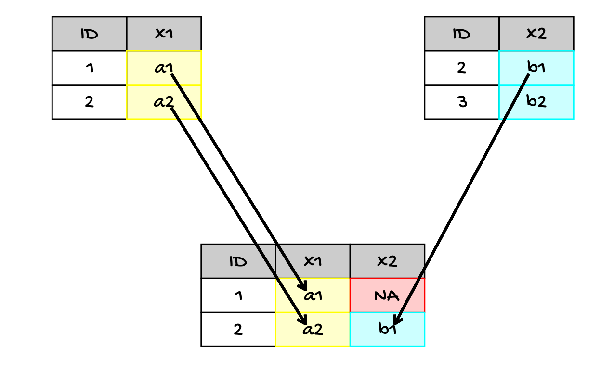  
```

```{r ejemplo_5_2_1_11_2, exercise = TRUE}

left_join(
  x = Datos_a,
  y = Datos_b,
  by = 'ID'
  )
```

+ `right_join()`

Esta función es opuesta a la función `left_join()`, en el sentido de que solo retorna las filas del conjunto de datos que se especifica en `y` como argumento.

:::example
#### Ejemplo 5.2.1.11.3
:::

```{r, echo = FALSE, eval = TRUE, out.width = "54%", fig.align = "center"}
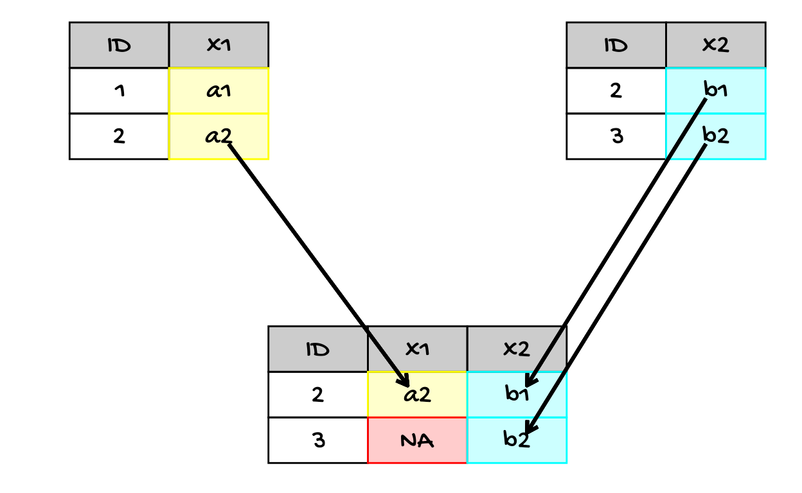  
```

```{r ejemplo_5_2_1_11_3, exercise = TRUE}

right_join(
  x = Datos_a,
  y = Datos_b,
  by = 'ID'
  )
```

+ `full_join()`

Esta unión retorna toda las columnas y filas de ambos conjunto de datos. De esta forma, retorna una fila para cualquier observación independiente si coinciden o no.

:::example
#### Ejemplo 5.2.1.11.4
:::

```{r, echo = FALSE, eval = FALSE, out.width = "54%", fig.align = "center"}
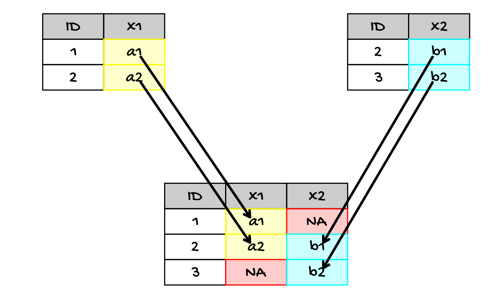  
```

```{r ejemplo_5_2_1_11_4, exercise = TRUE}

full_join(
  x = Datos_a,
  y = Datos_b,
  by = 'ID'
  )
```

:::caution
Si deseas ver un resumen de las posibilidades que ofrece el paquete `dplyr` y profundizar más en su uso, puedes mirar su hoja de trucos [aquí](https://github.com/Leo4Luffy/Un_curso_amigable_sobre_R/blob/master/Documentos/cheat_sheet_dplyr.pdf).
:::

## 6. Visualización de datos

### 6.1 ¿Que es la visualización de datos? Definición e historia

La __visualización de datos__ es la práctica de convertir datos en una representación gráfica. Para comprender cuán significativa es la visualización de los datos, un hecho simple es que a los cerebros humanos les resulta más difícil comprender datos complejos cuando están codificados en números y texto en comparación con los gráficos.

Es impensable cualquier sector profesional sin el uso de elementos de visualización, pues estos facilitan la transmisión de información. Es erróneo considerar a la visualización de datos como un recurso secundario o adicional, finalmente prescindible.

La representación gráfica de la información tiene [raíces profundas](https://jorge-leonardo-lopez-martinez.shinyapps.io/historia_visualizacion/?_ga=2.152978873.160297420.1593535028-503089247.1593365860). Estas raíces alcanzan historias de cartografía temática, gráficos estadísticos y visualización de datos, que se entrelazan entre sí. También se conectan con el auge del pensamiento estadístico del siglo XIX y el desarrollo tecnológico en el siglo XX.

### 6.2 La gramática de los gráficos

```{r, echo = FALSE, eval = TRUE, out.width = "54%", fig.align = "center"}
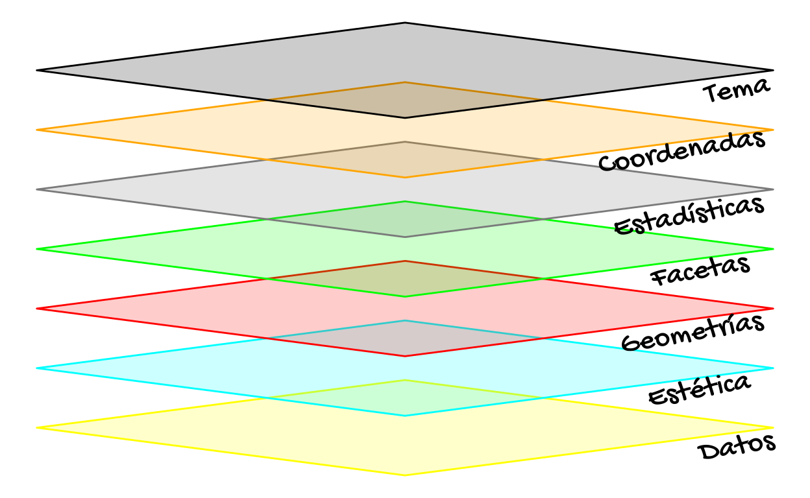  
```

```{r, echo = FALSE, eval = TRUE, out.width = "70%", fig.align = "center"}
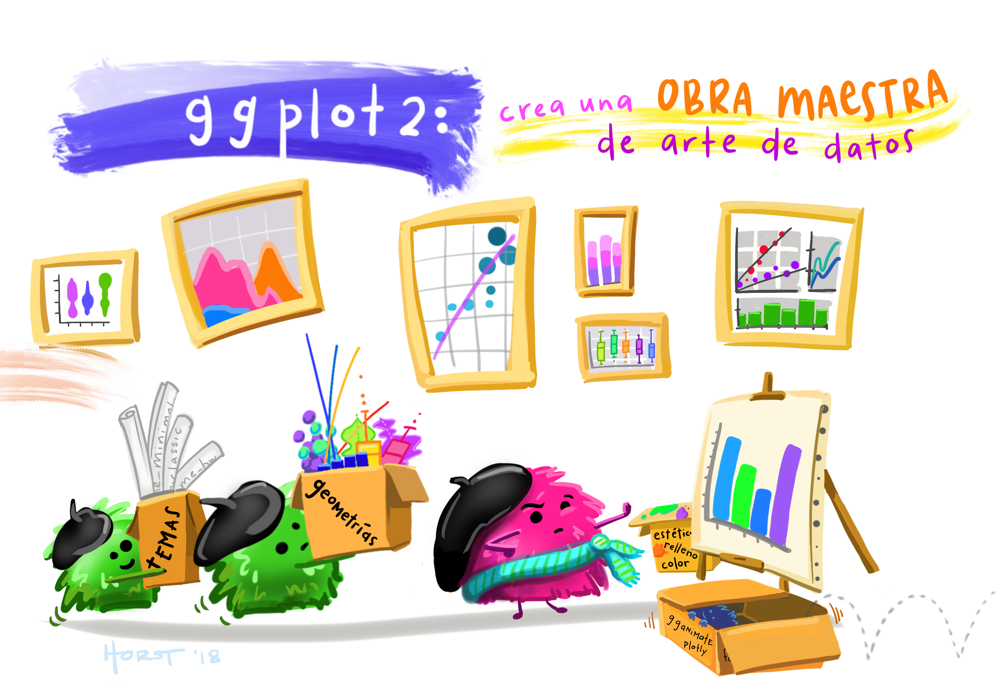  
```

## 8. Referencias