```{r setup, include=FALSE}
require(CursoR)
require(learnr)
require(tidyverse)
require(curl)
require(gradethis)
require(kableExtra)
require(palmerpenguins)
library(gapminder)
require(tibble)
require(timevis)
require(ggplot2)
require(patchwork)
require(fontawesome)
#PARA COMENTAR AL FINALIZAR
#require(jpeg)
#require(grid)
#require(gridGraphics)
require(showtext)
font_add_google('Gochi Hand', 'gochi')
#PARA COMENTAR AL FINALIZAR
tutorial_options(exercise.timelimit = 60, exercise.checker = gradethis::grade_learnr)
knitr::opts_chunk$set(echo = F,
                      warning = F,
                      error = F,
                      message = F)
```

## ¡Bienvenido!

```{r, echo = FALSE, eval = TRUE, out.width = "28%", fig.align = "center"}
knitr::include_graphics("images/imagen_curso.png")  
```

### Descripción

Este curso pretende ser una introducción básica del `R`. Su objetivo consiste en enseñar habilidades en la limpieza, manipulación y visualización de datos mediante el uso del `R`. Tenga en cuenta que este curso no pretende ser un sustituto de un curso completo de programación o de estadística.

```{r, echo = FALSE, eval = TRUE, out.width = "74%", fig.align = "center"}
knitr::include_graphics("images/1ra_imagen.png")  
```

A lo largo del curso podrá encontrar fragmentos de código para realizar ejemplos y ejercicios de codificación. Abajo encontrara como podrán ser usados:

:::example
#### Fragmentos de código para realizar ejemplos
Los ejemplos contienen código previamente escrito para que pueda explorarlo y ejecutarlo presionando el botón amarillo "Run Code" (ejecutar) en la esquina superior derecha. Puede actualizar el código en cualquiera de los ejemplos presionando "Start Over" (iniciar de nuevo) en la esquina superior izquierda y el código se restablecerá automáticamente al valor predeterminado.
:::

```{r addition_ejemplos, exercise = TRUE}

```

:::exercise
#### Fragmentos de código para realizar ejercicios de codificación
Aquí se indican ejercicios prácticos de codificación donde se le pedirá que escriba el código manualmente. Si no da con la solución, puede buscar ayuda dando clic en los botones "Solution" (solución) o "Hints" (sugerencias). En la mayoría de los casos el código podrá ser evaluado con el botón "Submit Answer" (Enviar Respuesta), indicándole cuando la respuesta sea acertada.
:::

```{r exercise_ejercicios, exercise = TRUE}

```

```{r exercise_ejercicios-solution}
#Ejercicio_código
```

También se encontrara con el siguiente bloque informativo:

:::caution
#### Bloque informativo de aclaración
En ocasiones se dara alguna recomendación sobre un tema. Este bloque se usará para llevar a cabo esto.
:::

<br>

### Acerca de nosotros

<div class="row">
  <div class="col-md-6" markdown="1">
  __Jorge Leonardo López Martínez__ es zootecnista con interés en el uso de la programación y la bioestadística aplicada al campo de la genética animal.
  <HR>
  <i class="fab fa-black-tie"></i> [leo4luffy.github.io](https://leo4luffy.github.io/)<br>
  <i class="fas fa-envelope"></i> jollopezma@unal.edu.co<br>
  <i class="fa fa-github"></i> [Leo4Luffy](https://github.com/Leo4Luffy)
  </div>
  <div class="col-md-6" markdown="1">
  __Duvan Ariel Nieves Ruiz__ es estudiante de ingeniería ambiental apasionado por el software libre con interés en la ecología y la programación.
  <HR>
  <i class="fab fa-black-tie"></i> [duvancho321.github.io](https://duvancho321.github.io/)<br>
  <i class="fas fa-envelope"></i> dnieves@unal.edu.co<br>
  <i class="fa fa-github"></i> [Duvancho321](https://github.com/Duvancho321)
  </div>
</div>

<br>

No dude en comunicarse con nosotros por correo electrónico si tiene preguntas acerca del curso y su contenido.

Tenga en cuenta que este curso está bajo la licencia <a rel="license" href="http://creativecommons.org/licenses/by-nc-sa/4.0/">Creative Commons Attribution-NonCommercial-ShareAlike 4.0 International License</a>. Por tanto el contenido del curso debe acreditarse a sus autores.

<section style="text-align: center;"><a rel="license" href="http://creativecommons.org/licenses/by-nc-sa/4.0/"></a><br/></section>

## 1. Una breve introducción al R

### 1.1 ¿Qué es el `R`?

`R` es un lenguaje de programación creado por __Robert Gentleman__ y __Ross Ihaka__ en el año de 1992. Ambos creadores le dieron el nombre de `R` al lenguaje implementado por las iniciales de sus nombres (a modo de broma).

```{r, echo = FALSE, eval = TRUE, out.width = "28%", fig.align = "center"}
knitr::include_graphics("images/Creadores.jpg")
```

Se trata de un lenguaje __interpretado__ o de script, con __tipado dinámico__, __multiplataforma__ y __orientado a objetos__:

+ __Lenguaje interpretado__ o de script: se ejecuta utilizando
un programa intermedio llamado __intérprete__ (IDE).

+ __Orientado a objetos__: `R` realiza acciones objetos (un número, un conjunto de datos, una palabra o un resumen estadístico como una media o varianza).

:::example
#### Ejemplo 1.1.1
:::

```{r addition_eje, exercise = TRUE}

a <- 12

b <- c(4, 6, 8, 12)

c <- matrix(data = 1:4,
            nrow = 2,
            ncol = 2)
```

:::caution
Para crear nuevos objetos en `R`, se debe hacer la __asignación__ del objeto. La asignación de objetos es la forma de almacenar información. Para hacer una asignación, se suele emplear el simbolo __<-__. Por ejemplo la notación __a <- ...__, asigna __...__ (lo que se quiere almacenar) al objeto __a__.
:::

+ __Multiplataforma__: el intérprete de `R` está disponible en muchas plataformas (Linux, Windows, UNIX, Mac OS, etc), por lo que podrá ejecutarse en muchos computadores.

+ __Tipado dinámico__: se refiere a que no es necesario
declarar el __tipo de dato__. A su vez, `R` es __fuertemente tipado__.

:::example
#### Ejemplo 1.1.2
:::

```{r addition, exercise = TRUE}

a <- 'Hola'
typeof(a)

b <- 1L
typeof(b)

c <- 12.3
typeof(c)

d <- 1 + 2i
typeof(d)

e <- c(FALSE, TRUE)
typeof(e)
```

### 1.2 ¿Por qué usar `R`?

El lenguaje de programación `R` se puede obtener y distribuir de forma gratuita, debido a que se encuentra bajo __Licencia Pública General__ del proyecto GNU. Por lo tanto es un programa de código abierto y gratis.

<div class="row">
  <div class="col-md-8" markdown="1">
  `R` cuenta con una __comunidad__ de usuarios alrededor del mundo. Al contar con una comunidad es posible dar con la solución de algún problema de programación, así como el desarrollo de paquetes utilizados en temas específicos, desarrolados por especialistas en alguna parte del mundo.
  </div>
  <div class="col-md-4" markdown="1">
```{r, echo = FALSE, eval = TRUE, out.width = "54%", fig.align = "center"}
knitr::include_graphics("images/Rday.jpg")
```
<section style="text-align: center;"><small>Encuentro en el [Rday 2019](https://rdaymedellin.github.io/).</small></section>
  </div>
</div>

Finalmente, el uso del `R` garantiza que otro investigador pueda repetir el experimento, comprobar los resultados obtenidos y estar en la condición de ampliar o refutar las interpretaciones del estudio realizado.

```{r, echo = FALSE, eval = TRUE, out.width = "30%", fig.align = "center"}

```

<section style="text-align: center;"><small>Ilustracíon hecha por <font color = "black"><u>\@allison_horst</u></font>.</small></section>

__¡No se desanime!__ Los lenguajes de programación como el `R` no son sencillos de aprender, pero con trabajo y motivación vera como en poco tiempo se lograrán grandes avances. 

### 1.3 Instalación de `R` base y RStudio

`R` base es el software básico que contiene el lenguaje de programación `R`. RStudio es un software que facilita la programación en `R`.

#### 1.3.1 `R` base:

<div class="row">
  <div class="col-md-6" markdown="1">
  + Windows: la instalación de `R` base en windows se realiza a través de la [CRAN](https://cran.r-project.org/mirrors.html) (Comprehensive R Archive Network).
  + Linux: la instalación de `R` base en Linux se realiza escribiendo el siguiente código en la terminal:<br>
  <div style="background-color:#262626">
  <font color = "white"><p> sudo apt-get update</p></font>
  <font color = "white"><p> sudo apt-get install r-base r-base-dev</p></font>
  </div>
  </div>
  <div class="col-md-6" markdown="1">
```{r, echo = FALSE, eval = TRUE, out.width = "54%", fig.align = "center"}
knitr::include_graphics("images/consola_R_base.jpg")
```
  </div>
</div>

#### 1.3.2 RStudio:

<div class="row">
  <div class="col-md-6" markdown="1">
  Se puede instalar directamente desde la [página de RStudio](https://rstudio.com/products/rstudio/download/). Hay se encuentran los archivos de instalación tanto en windows como en Linux.
  
  Cuando se abre RStudio se pueden ver cuatro paneles: 
  </div>
  <div class="col-md-6" markdown="1">
```{r, echo = FALSE, eval = TRUE, out.width = "34%", fig.align = "center"}
knitr::include_graphics("images/RStudio_2.jpg")
```
  <section style="text-align: center;"><small>Ilustracíon hecha por <font color = "black"><u>\@allison_horst</u></font>.</small></section>
  </div>
</div>

+ La fuente: la libreta de notas para el código

```{r, echo = FALSE, eval = TRUE, out.width = "64%", fig.align = "center"}
knitr::include_graphics("images/source_RStudio.jpg")
```

:::caution
Un texto insertado en el código el cual es omitido en la ejecución, se denomina como __comentario__. En `R`, un comentario es un texto que comienza con el símbolo __#__ y se extiende hasta el final de la línea. Este permite que `R` no intente interpretarlo como parte del código.
:::

+ La consola: el corazón de `R`

```{r, echo = FALSE, eval = TRUE, out.width = "64%", fig.align = "center"}
knitr::include_graphics("images/console.jpg")
```

+ El ambiente / el historial

<div class="row">
  <div class="col-md-6" markdown="1">
```{r, echo = FALSE, eval = TRUE, out.width = "64%", fig.align = "center"}
knitr::include_graphics("images/environment.jpg")
```
  </div>
  <div class="col-md-6" markdown="1">
```{r, echo = FALSE, eval = TRUE, out.width = "64%", fig.align = "center"}
knitr::include_graphics("images/history.jpg")
```
  </div>
</div>

+ Los archivos / las gráficas / la ayuda / los paquetes

<div class="row">
  <div class="col-md-6" markdown="1">
```{r, echo = FALSE, eval = TRUE, out.width = "64%", fig.align = "center"}
knitr::include_graphics("images/files.jpg")
```
  </div>
  <div class="col-md-6" markdown="1">
```{r, echo = FALSE, eval = TRUE, out.width = "64%", fig.align = "center"}
knitr::include_graphics("images/plots.jpg")
```
  </div>
</div>

<br>

<div class="row">
  <div class="col-md-6" markdown="1">
```{r, echo = FALSE, eval = TRUE, out.width = "64%", fig.align = "center"}
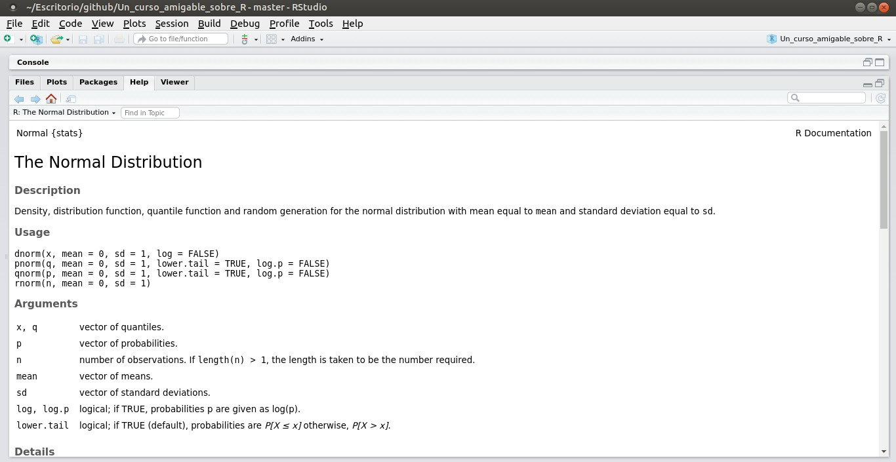
```
  </div>
  <div class="col-md-6" markdown="1">
```{r, echo = FALSE, eval = TRUE, out.width = "64%", fig.align = "center"}
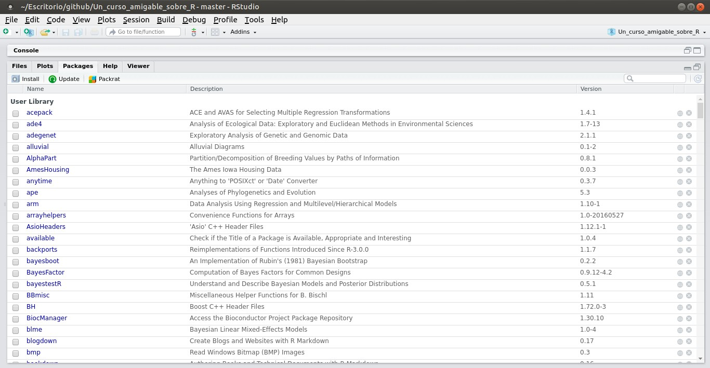
```
  </div>
</div>

### 1.4 Los paquetes en `R`

<div class="row">
  <div class="col-md-5" markdown="1">
Los paquetes en `R` son colecciones de funciones y conjunto de datos desarrollados por la comunidad. Un paquete de `R` incluye código, documentación para su uso y conjuntos de datos.

Existen dos formas de instalar nuevos paquetes en `R`:

1) Descargarlos de la [CRAN](https://cran.r-project.org/mirrors.html) (Comprehensive R Archive Network) por medio de la función `install.packages()`.

:::example
#### Ejemplo 1.4.1
:::
  </div>
  <div class="col-md-7" markdown="1">
```{r, echo = FALSE, eval = TRUE, out.width = "62%", fig.align = "center"}
knitr::include_graphics("images/Lenguajes_en_paquetes_R.jpg")
```
<section style="text-align: center;"><small>Ilustracíon hecha por <font color = "black"><u>\@spren9er</u></font>.</small></section>
  </div>
</div>

```{r addition_4, exercise = TRUE}
install.packages('tidyr', 'dplyr', 'ggplot2')
```

2) Mediante el uso del paquete `devtools`, el cual permite instalar paquetes alojados en distintos servidores:

  + `install_bioc()` desde [Bioconductor](https://www.bioconductor.org/).
  + `install_cran()` desde [CRAN](https://cran.r-project.org/index.html).
  + `install_git()` desde un repositorio [git](https://git-scm.com/).
  + `install_github()` desde [GitHub](https://github.com/).

:::example
#### Ejemplo 1.4.2
:::

```{r addition_5, exercise = TRUE}
install.packages('devtools')
devtools::install_github('tidyverse/dplyr')
```

Una vez haya instalado un paquete, estará en la computadora. Si se desea usar una función o un conjunto de datos del paquete instalado, debe cargar el paquete en la sesión de `R`. Para esto, existen dos formas:

1) Con la notación `nombrepaquete::nombrefunción()` para hacer un uso temporal de la función o conjunto de datos.

:::example
#### Ejemplo 1.4.3
:::

```{r addition_8, exercise = TRUE}
dplyr::starwars
```

:::caution
Una ventaja del método anterior es que es inmediatamente claro para cualquier persona que lea el código qué paquete contiene la función. Sin embargo, un inconveniente es que si usa una función de un paquete con frecuencia, lo obliga a volver a escribir constantemente el nombre del paquete.
:::

2) Cargándolo en la memoria del computador mediante el uso de la función `library()` si su uso es permanente.

:::example
#### Ejemplo 1.4.4
:::

```{r addition_9, exercise = TRUE}
library(dplyr)
Datos_starwars <- starwars
```

Para acceder a la descripción de un paquete desde `R` se puede emplear las funciones `packageDescription()` y `help()`.

:::example
#### Ejemplo 1.4.5
:::

```{r addition_6, exercise = TRUE}
packageDescription('dplyr')
help(package = 'dplyr')
```

Otras funciones que permiten la gestión de los paquetes instalados en el computador:

```{r addition_7, exercise = TRUE}
installed.packages() # Para ver que paquetes se tienen instalados.
remove.packages('dplyr') # Si se desease eliminar un paquete (en este caso el paquete dplyr).
old.packages() # Para comprobar que paquetes necesitan ser actualizados.
update.packages() # Para actualizar todo los paquetes instalados.
```

### 1.5 Trabajando con proyectos

Un __directorio de trabajo__ en `R` es el lugar en la computadora en el que se encuentran los archivos con los que se esta trabajando. Es el lugar donde `R` buscara los archivos para importarlos y al que serán exportados.

Con la función `getwd()` se puede encontrar el directorio en el que se esta trabajando.

:::example
#### Ejemplo 1.5.1
:::

```{r addition_10, exercise = TRUE}
getwd() # Da como resultado la ruta "/home/leo/Escritorio/github/Un_curso_amigable_sobre_R".
```

Para cambiar el directorio de trabajo se puede emplear la función `setwd()`, dando como argumento la ruta del directorio que se quiere usar. 

:::example
#### Ejemplo 1.5.2
:::

```{r addition_11, exercise = TRUE}
setwd(dir = "/home/leo/Escritorio/Curso_estadística") # Se cambia el directorio de trabajo a la carpeta Curso_estadistica.
```

Sin embargo como señala [Jenny Bryan](https://www.tidyverse.org/blog/2017/12/workflow-vs-script/), con la función `setwd()` es practicamente imposible para cualquier otra persona que no sea el autor original del código `R`, en su computadora, hacer que las rutas de archivo funcionen.<!--"La posibilidad de que el comando setwd() tenga el efecto deseado (hacer que las rutas de archivo funcionen) para cualquier persona además de su autor es 0%. También es poco probable que funcione para el autor dentro de uno o dos años o para computadoras a partir de ahora. El proyecto no es autónomo y portátil. Para recrear y tal vez extender esta trama, el destinatario afortunado deberá editar manualmente uno o más caminos para reflejar dónde ha aterrizado el proyecto en su máquina. Cuando haces esto por 73a vez en 2 días, mientras marcas una tarea, comienzas a fantasear con encender la computadora del perpetrador."--> La solución consistiría en trabajar con __proyectos__. 

<div class="row">
  <div class="col-md-5" markdown="1">
  Un proyecto es un directorio de trabajo nombrado como un archivo __.Rproj__. Cuando se abre un proyecto, el directorio de trabajo se establecerá automáticamente en el directorio en el que se encuentra el archivo __.Rproj__.
  
  El archivo __.Rproj__ se puede crear yendo a "File" (archivo) &#8594; "New Project..." (nuevo proyecto) en RStudio, que luego se asocia con la carpeta o directorio especificado. 
  
  Configurar un directorio de trabajo correctamente también ayuda a desarrollar buenos hábitos que conducen a un __análisis reproducible__.
  </div>
  <div class="col-md-7" markdown="1">
```{r, echo = FALSE, eval = TRUE, out.width = "60%", fig.align = "center"}
knitr::include_graphics("images/Proyectos.jpg")
```

<section style="text-align: center;"><small>Ilustracíon hecha por <font color = "black"><u>\@allison_horst</u></font>.</small></section>
  </div>
</div>

#### 1.5.1 Estructurando el directorio de trabajo

Además de usar proyectos, también es una buena práctica estructurar el directorio de una manera que ayude a cualquier persona con la que se esta colaborando, o una versión futura de usted intente reproducir algunos análisis.

```{r, echo = FALSE, eval = TRUE, out.width = "74%", fig.align = "center"}
knitr::include_graphics("images/2da_imagen.png")  
```

## 2. Lo básico en el uso del R

```{r, echo = FALSE, eval = TRUE, out.width = "54%", fig.align = "center"}

knitr::include_graphics("images/38va_imagen.png")  
```

### 2.1 Escalares

Los escalares son el tipo de objeto más simple en `R`. Un objeto escalar es un objeto de un único valor, sin embargo estos se pueden clasificar en cinco clases (clases atómicas):

+ `character` (caracteres)
+ `integer` (números enteros)
+ `double` (números reales)
+ `complex` (números complejos)
+ `logical` (lógicos o boleanos)

:::example
#### Ejemplo 2.1.1
:::

```{r ejemplo_2_1_1, exercise = TRUE}

a <- 'Hola'
typeof(a)

b <- 1L
typeof(b)

b_2 <- 1
typeof(b_2)

c <- 12.3
typeof(c)

d <- 1 + 2i
typeof(d)

e <- c(FALSE, TRUE)
typeof(e)
```

:::caution
En `R` existen las llamadas __palabras clave__ o __palabras reservadas__. Estas no se deben usar como nombres ni para crear objetos, ni para crear funciones.
:::

### 2.2 Vectores

Un vector consiste en una colección de escalares de la misma clase atómica, ya sean estos números, caracteres o lógicos, pero nunca podrán ser de dos o más clases diferentes.

Hay muchas formas de crear vectores en `R`. A continuación podrá encontrar una tabla con ejemplos de estas formas:

```{r, echo = FALSE, eval = TRUE, out.width = "54%", fig.align = "center"}

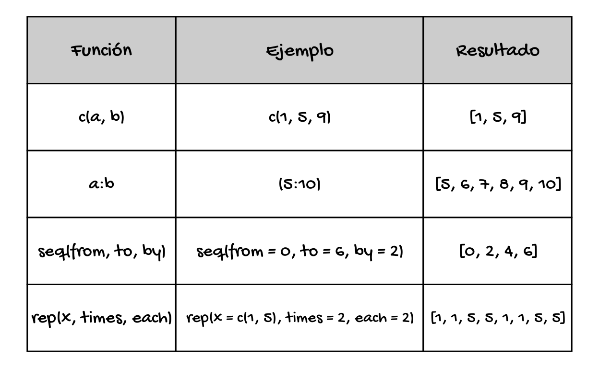  
```

:::example
#### Ejemplo 2.2.1
:::

```{r ejemplo_2_2_1, exercise = TRUE}

num <- c(1, 2, 3, 4, 5)
num

let <- c('a', 'b', 'c', 'd', 'e', 'f')
let

num_2 <- 1:10
num_2

num_3 <- 10:1
num_3

num_4 <- seq(from = 0, to = 100, by = 10)
num_4

num_5 <- rep(x = 4, times = 10)
num_5

num_6 <- rep(x = c(1, 2), each = 2)
num_6
```

:::caution
Una __función__ en `R` es un procedimiento que generalmente toma un objeto como argumento, hace algo con ese objeto y luego devuelve un nuevo objeto.
:::

```{r, echo = FALSE, eval = TRUE, out.width = "32%", fig.align = "center"}

knitr::include_graphics("images/40va_imagen.png")  
```

<details><summary> Lista de funciones útiles</summary>

```{r, echo = FALSE, eval = TRUE, out.width = "74%", fig.align = "center"}

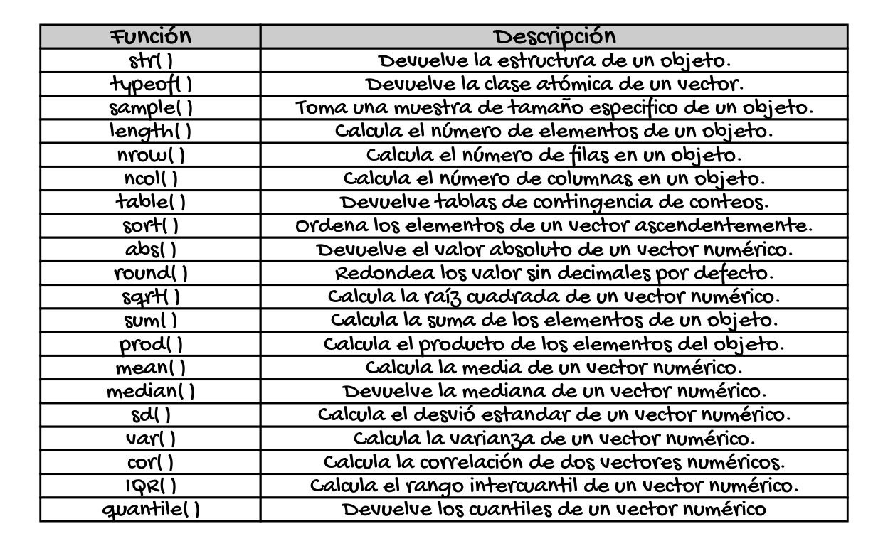  
```

</details>

:::caution
Los __argumentos__ de una función son una serie de valores (objetos o incluso el resultado de otra función) que se pasan dentro de la función para que esta realice un proceso.
:::

:::example
#### Ejemplo 2.2.2
:::

```{r ejemplo_2_2_2, exercise = TRUE}

args(round)
#?round
#help(round)
```

#### 2.2.1 Operaciones sencillas con vectores

Las operaciones aritméticas más comunes están definidas para vectores. A continuación podrá encontrar una tabla con los operadores básicos:

```{r, echo = FALSE, eval = TRUE, out.width = "40%", fig.align = "center"}

knitr::include_graphics("images/41va_imagen.png")  
```

:::example
#### Ejemplo 2.2.1.1
:::

```{r ejemplo_2_2_1_1, exercise = TRUE}

vec_1 <- c(1:8)
vec_2 <- 2
sum_vec_1_vec_2 <- vec_1 + vec_2
sum_vec_1_vec_2
```

:::example
#### Ejemplo 2.2.1.2
:::

```{r ejemplo_2_2_1_2, exercise = TRUE}

vec_1 <- seq(from = 1, to = 4, by = 1)
vec_2 <- rep(x = 2, times = 4)
div_vec_1_vec_2 <- vec_1 / vec_2
div_vec_1_vec_2
```

#### 2.2.2 Resumen estadístico en vectores

Debido a que el `R` es un lenguaje creado para estadísticas, el mismo contiene muchas funciones básicas que permiten calcular estadísticas descriptivas a partir de un vector de datos. A continuación podrá encontrar una tabla de estas funciones:

```{r, echo = FALSE, eval = TRUE, out.width = "54%", fig.align = "center"}

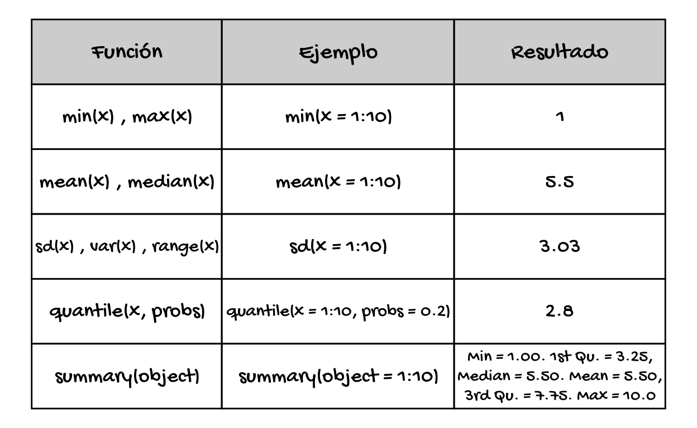  
```

:::example
#### Ejemplo 2.2.2.1
:::

```{r ejemplo_2_2_2_1, exercise = TRUE}

Pesos_rn <- rnorm(n = 12, mean = 3768, sd = 572)
Pesos_rn

min(x = Pesos_rn)

mean(x = Pesos_rn)

sd(x = Pesos_rn)

quantile(x = Pesos_rn)

summary(object = Pesos_rn)
```

:::caution
En el `R` los datos faltantes se identifican como `NA` (not available). La mayoría de las funciones estadísticas en `R` en presencia de valores `NA` pueden generar resultados inconsistentes.  
:::

:::example
#### Ejemplo 2.2.2.2
:::

```{r ejemplo_2_2_2_2, exercise = TRUE}

val_NA <- c(1, 5, NA, 2, 10)
mean(val_NA)
#mean(val_NA, na.rm = TRUE)
```

#### 2.2.3 Indexación de vectores

Dentro de los múltiples objetos en `R`, como los vectores en este caso, se debe tener claro como manejar o acceder a la información contenida en los mismos. Para estos casos se utiliza la __indexación__.

La indexación consiste en la selección de subconjuntos de datos por medio de operadores de selección, que en el caso de los vectores corresponde al operador `[ ]`. Existen dos tipos de indexación:

+ Indexación numérica

:::caution
La posición de los valores de un vector se pueden identificar mediante su índice. En el caso del lenguaje de programación `R`, el tipo de indexación es en base-uno (**[1]**).
:::

:::example
#### Ejemplo 2.2.3.1
:::

```{r ejemplo_2_2_3_1, exercise = TRUE}

seq(from = 1, to = 100, by = 1)
```

La indexación numérica permite acceder a los valores de un vector de acuerdo a su posición especifica dentro del vector. Para esto, se emplea la forma __a[index]__, donde __a__ es el nombre del vector e __index__ es es el índice del vector.

:::example
#### Ejemplo 2.2.3.2
:::

```{r ejemplo_2_2_3_2, exercise = TRUE}

indice <- seq(from = 1, to = 100, by = 1)
indice[44]
indice[2:10]
indice[c(4, 4, 4)]

seleccion <- 2:8
indice[seleccion]
```

:::example
#### Ejemplo 2.2.3.3
:::

```{r ejemplo_2_2_3_3, exercise = TRUE}

fechas <- c('Ene', 'Feb', 'Mar', 'Abr', 'May', 'Jun', 'Jul', 'Ago', 'Sep', 'Oct', 'Nov', 'Dic')
fechas[c(1, 6, 11)]
fechas[-c(2:5, 7:10, 12)]
```

+ Indexación lógica

:::caution
En el lenguaje de programación `R` existen los denominados __operadores lógicos__. Estos pueden ser usados para hacer comparaciones u operaciones lógicas cuyo resultado del mismo será un __vector lógico__ (`TRUE` y `FALSE`).
:::

```{r, echo = FALSE, eval = TRUE, out.width = "26%", fig.align = "center"}

knitr::include_graphics("images/44va_imagen.png")  
```

:::example
#### Ejemplo 2.2.3.4
:::

```{r ejemplo_2_2_3_4, exercise = TRUE}

numeros <- seq(from = 1, to = 40, by = 1)
numeros >= 34
```

La segunda forma de indexar vectores es mediante el uso de __vectores lógicos__ (vector que solo contiene valores `TRUE` y `FALSE` como el ejemplo anterior).

:::example
#### Ejemplo 2.2.3.5
:::

```{r, echo = FALSE, eval = TRUE, out.width = "30%", fig.align = "center"}

knitr::include_graphics("images/43va_imagen.png")  
```

```{r ejemplo_2_2_3_5, exercise = TRUE}

ind_logica <- c(4, 8, -1, 9, -3)
ind_logica[ind_logica > 0]
ind_logica[!(ind_logica < 0)]
```

:::example
#### Ejemplo 2.2.3.6
:::

```{r ejemplo_2_2_3_6, exercise = TRUE}

meses <- c('Ene', 'Feb', 'Mar', 'Abr', 'May', 'Jun', 'Jul', 'Ago', 'Sep', 'Oct', 'Nov', 'Dic')
meses[meses == 'Nov']
meses[meses != 'Nov']
```

:::example
#### Ejemplo 2.2.3.7
:::

```{r ejemplo_2_2_3_7, exercise = TRUE}

numeros <- seq(from = -10, to = 10, by = 1)
numeros[numeros >= 0 & numeros != 4]
```

### 2.3 Matrices y conjuntos de datos

```{r, echo = FALSE, eval = TRUE, out.width = "38%", fig.align = "center"}

knitr::include_graphics("images/46va_imagen.png")  
```

Las matrices y los conjuntos de datos son dos tipos de objetos que representan estructuras de datos grandes. Si bien las matrices y los conjuntos de datos se ven muy similares, dada su estructura tabular, no son exactamente lo mismo: las matrices pueden contener solo una clase de datos (ya sea numérico o carácter), mientras que los conjuntos de datos pueden contener columnas tanto numéricas como de caracteres.

Hay muchas formas de crear matrices y conjuntos de datos en `R`. A continuación podrá encontrar una tabla de estas formas:

```{r, echo = FALSE, eval = TRUE, out.width = "54%", fig.align = "center"}

knitr::include_graphics("images/45va_imagen.png")  
```

:::example
#### Ejemplo 2.3.1
:::

```{r ejemplo_2_3_1, exercise = TRUE}

x <- 1:5
y <- 6:10
z <- 11:15

x_y_z <- cbind(x, y, z)
x_y_z

x_y_z <- rbind(x, y, z)
x_y_z
```

:::example
#### Ejemplo 2.3.2
:::

```{r ejemplo_2_3_2, exercise = TRUE}

x <- c(1, 2, 3, 4, 5)
y <- c('a', 'b', 'c', 'd', 'e')

x_y <- cbind(x, y)
x_y
```

:::caution
Recuerden, las matrices pueden contener números o caracteres, ¡no ambos!. Si intenta crear una matriz con números y caracteres, el `R` convertirá todos los números en caracteres (__coerción implicita__).
:::

```{r, echo = FALSE, eval = TRUE, out.width = "38%", fig.align = "center"}

knitr::include_graphics("images/58va_imagen.png")  
```

:::example
#### Ejemplo 2.3.3
:::

```{r ejemplo_2_3_3, exercise = TRUE}

matrices_1 <- matrix(
  data = 1:15,
  nrow = 5,
  ncol = 3
  )
matrices_1

matrices_2 <- matrix(
  data = 1:15,
  nrow = 5,
  ncol = 3,
  byrow = TRUE
  )
matrices_2
```

:::example
#### Ejemplo 2.3.4
:::

```{r ejemplo_2_3_4, exercise = TRUE}

con_dtos <- data.frame(
  'Identificación' = 1:5,
  'Sexo' = c('Mujer', 'Mujer', 'Hombre', 'Mujer', 'Hombre'),
  'Edad' = c(99, 34, 43, 50, 88)
  )
con_dtos
```

#### 2.3.1 Conjuntos de datos preinstalados en `R` y disponibes en paquetes de `R`

El lenguaje de programación `R` cuenta con conjuntos de datos preinstalados en un paquete llamado `datasets`, el cual no requiere ser instalado una vez el mismo viene incluido en el software `R` base. Una lista completa de estos conjuntos de datos incluidos en el paquete `datasets` se puede ver al ejecutar el código `library(help = 'datasets')`.

A continuación podrá encontrar una tabla del nombre de algunos de estos conjuntos de datos acompañado de una pequeña descripción:

```{r, echo = FALSE, eval = TRUE, out.width = "56%", fig.align = "center"}

knitr::include_graphics("images/47va_imagen.png")  
```

:::example
#### Ejemplo 2.3.1.1
:::

```{r ejemplo_2_3_1_1, exercise = TRUE}

data('iris')
```

También pueden existir conjuntos de datos disponibles dentro de paquetes del `R`. En la tabla a continuación podrá encontrar el nombre de algunos de estos conjuntos de datos acompañado del nombre del paquete donde se encuentra alojado y una pequeña descripción:

```{r, echo = FALSE, eval = TRUE, out.width = "56%", fig.align = "center"}

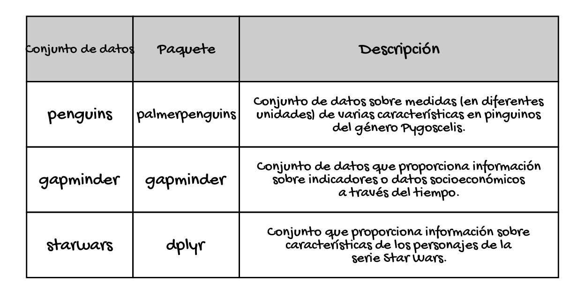  
```

:::example
#### Ejemplo 2.3.1.2
:::

```{r ejemplo_2_3_1_2, exercise = TRUE}

data(package = 'dplyr')
#library(dplyr)
#data('starwars')
```

#### 2.3.2 Operaciones sencillas con matrices y conjuntos de datos

El lenguaje de programación `R` proporciona operadores o funciones útiles para trabajar con matrices. En la tabla a continuación podrá encontrar un ejemplo del uso de estas funciones:

```{r, echo = FALSE, eval = TRUE, out.width = "58%", fig.align = "center"}

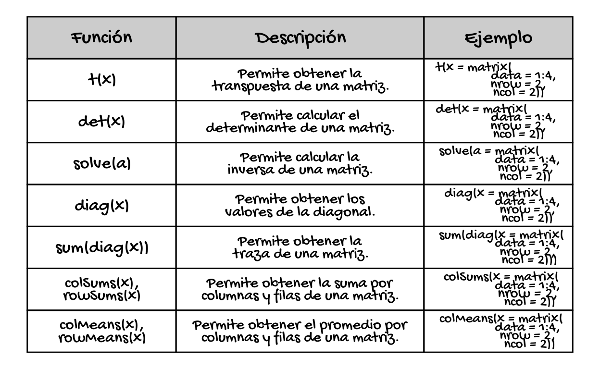  
```

:::example
#### Ejemplo 2.3.2.1
:::

```{r ejemplo_2_3_2_1, exercise = TRUE}

A <- matrix(data = 1:9, nrow = 3, ncol = 3, byrow = TRUE)

a <- c(4, 5, 4)
b <- c(3, 4, 4)
d <- c(8, 7, 7)
B <- rbind(a, b, d)

M_1 <- A + B
M_1

M_2 <- A %*% B
M_2

M_3 <- 4 * A
M_3
```

:::example
#### Ejemplo 2.3.2.2
:::

```{r ejemplo_2_3_2_2, exercise = TRUE}

Juan <- c(4.4, 3.8, 4.2, 3.4)
Andres <- c(3.2, 3.6, 4.4, 4.6)
Laura <- c(4.1, 3.4, 3.2, 5.0)
Notas <- rbind(Juan, Andres, Laura)

Prom_persona <- rowMeans(x = Notas)
Prom_persona
```

El lenguaje de programación `R` contiene también funciones para ver matrices y conjuntos de datos y proporcionar información sobre ambos tipos de objetos. En la tabla a continuación podrá encontrar el nombre de estas funciones acompañada de una pequeña descripción:

```{r, echo = FALSE, eval = TRUE, out.width = "44%", fig.align = "center"}

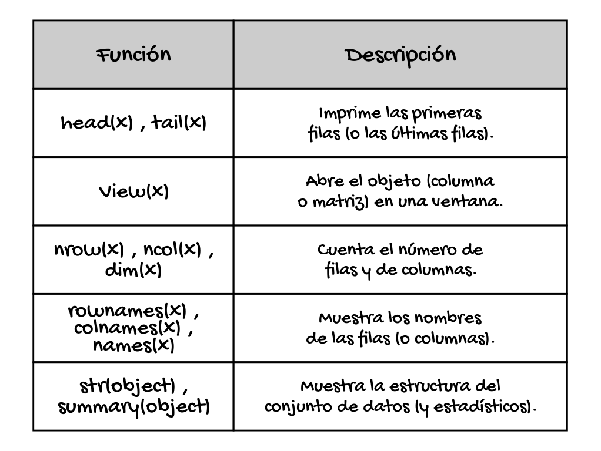  
```

Para explicar tanto las funciones anteriores como las que se veran posteriormente en lo que resta de este capitulo, se empleara el conjunto de datos `Starwars`:

```{r, eval = TRUE, message = FALSE, echo = FALSE}

data("starwars")
Starwars <- starwars %>% 
  select(-c(12:14))
Starwars <- as.data.frame(Starwars)
```

```{r,eval=TRUE}
save(Starwars, file="data_pkg/Starwars.rda", compress='xz')
```

```{r Conjuntos_datos, exercise = TRUE}

#library(CursoR)
#data('Starwars')
```

```{r, echo = FALSE, eval = TRUE, out.width = "74%", fig.align = "center"}

knitr::include_graphics("images/51va_imagen.png")  
```

:::example
#### Ejemplo 2.3.2.3
:::

```{r ejemplo_2_3_2_3, exercise = TRUE}

head(x = Starwars)

tail(x = Starwars)

#View(x = Starwars)
```

<details><summary>Ejemplo de lo que se observa con `View()`</summary>

```{r, echo = FALSE, eval = TRUE, out.width = "94%", fig.align = "center"}

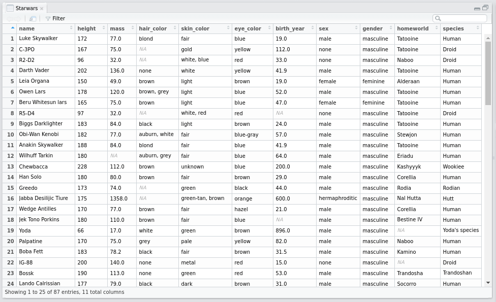  
```

</details>

:::example
#### Ejemplo 2.3.2.4
:::

```{r ejemplo_2_3_2_4, exercise = TRUE}

nrow(x = Starwars)

ncol(x = Starwars)

dim(x = Starwars)
```

:::example
#### Ejemplo 2.3.2.5
:::

```{r ejemplo_2_3_2_5, exercise = TRUE}

summary(object = Starwars)
```

#### 2.3.3 Indexación de matrices y conjuntos de datos

Al igual que con los vectores, tanto en matrices como en conjunto de datos el lenguaje de programación `R` permite usar el operador `[ ]` para acceder a valores específicos dentro de los mismos, y al igual que con los vectores, la indexación de matrices y conjuntos de datos pueden ser de dos tipos:

+ Indexación numérica

En matrices y conjuntos de datos, y a diferencia de lo visto con vectores, el operador `[ ]` requiere de dos argumentos para acceder a los valores de acuerdo a su posición: el primer argumento el cual se aplica a las filas y el segundo a las columnas.

:::example
#### Ejemplo 2.3.3.1
:::

```{r ejemplo_2_3_3_1, exercise = TRUE}

A <- matrix(data = 1:9, nrow = 3, ncol = 3)
A
A[3, ]
A[, 3]
```

:::caution
Al usar una coma (`,`) dentro del operador `[ ]` se esta dando la instrucción al `R` de buscar los valores solicitados en más de una dimensión. Así, el número antes de la coma será buscado en la primera dimensión del objeto, y el número después de la coma en la segunda dimensión.
:::

:::example
#### Ejemplo 2.3.3.2
:::

```{r ejemplo_2_3_3_2, exercise = TRUE}

a <- c(3, 2, 4, 6, 5, 1)
a[2, 4]
#a[c(2, 4)]
```

:::exercise
#### Ejercicio 2.3.3.1
Por favor, haciendo uso del conjunto de datos `Starwars` intente seleccionar las primeras 5 columnas de este conjunto de datos, luego seleccionar las primeras 20 filas de la primera columna y por último seleccionar de forma conjunta las columnas 2 y 3, y las filas 20 a la 40.
:::

```{r ejercicio_2_3_3_1, exercise = TRUE}

# Primeras 5 columnas ----
Starwars[]
# Primeras 20 filas de la columna 1 ----
Starwars[]
# Filas de la 20 a la 40 de las columnas 2 y 3 ----
Starwars[]
```

```{r ejercicio_2_3_3_1-solution}

# Primeras 5 columnas ----
Starwars[, 1:5]
# Primeras 20 filas de la columna 1 ----
Starwars[1:20, 1]
# Filas de la 20 a la 40 de las columnas 2 y 3 ----
Starwars[20:40, c(2, 3)]
```

```{r ejercicio_2_3_3_1-check}

grade_code("¡Excelente lo lograste, sigamos adelante!")
```

:::example
#### Ejemplo 2.3.3.3
:::

```{r ejemplo_2_3_3_3, exercise = TRUE}

names(Starwars)

# Primeras 5 columnas ----
Starwars[, c('name', 'height', 'mass', 'hair_color', 'skin_color')]
# Primeras 20 filas de la columna 1 ----
Starwars[1:20, 'name']
# Filas de la 20 a la 40 de las columnas 2 y 3 ----
Starwars[20:40, c('height', 'mass')]
```

<!--
En el siguiente ejemplo, calcularemos la suma de los valores de cada columna y determinaremos su representación en porcentaje de la suma calculada. El porcentaje lo aproximáremos a dos cifras decimales y haremos un ejercicio de indexación con este resultado, imprimiendo un vector con los resultados de la diagonal.
-->
:::example
#### Ejemplo 2.3.3.4
:::

```{r ejemplo_2_3_3_4, exercise = TRUE}

M <- matrix(seq(from = 18, to = 2, length.out = 16), ncol = 4, byrow = TRUE)
M

t_col <- colSums(m)
t_col

porc_M <- cbind(
  m[, 1] / t_col[1],
  m[, 2] / t_col[2],
  m[, 3] / t_col[3],
  m[, 4] / t_col[4]
  )
porc_M <- round(porc_M * 100, 2)
porc_M

diag(porc_M) # Vector con los resultados de la diagonal (1ra forma)

c(porc_M[1, 1], porc_M[2, 2], porc_M[3, 3], porc_M[4, 4]) # Vector con los resultados de la diagonal (2da forma)
```

+ Indexación lógica

Indexar matrices y conjuntos de datos mediante el uso de vectores lógicos es muy similar a lo visto con vectores:

  1- Se crea un vector lógico que contiene solo valores `TRUE` y `FALSE`.
  
  2- Usando el vector lógico se indexa la matriz o conjunto de datos, devolviendo solo aquellos valores para los que dicho vector lógico es igual a `TRUE`.

:::example
#### Ejemplo 2.3.3.5
:::

```{r ejemplo_2_3_3_5, exercise = TRUE}

Starwars[, 'species'] == 'Human'
#Starwars[Starwars[, 'species'] == 'Human', ]
```

+ Indexación mediante el uso del operador `$`

El operador `$` permite acceder a una columna especifica en una matriz o conjuntos de datos mediante el nombre de las columnas de la forma `df$name`, donde `df` es el nombre del objeto y `name` es el nombre de la columna. De esta forma, este operador establece una forma de tener acceso a los valores de las matrices y conjuntos de datos mediante los nombres de las variables o columnas.

:::example
#### Ejemplo 2.3.3.6
:::

```{r ejemplo_2_3_3_6, exercise = TRUE}

#Starwars[Starwars[, 'species'] == 'Human', ]
Starwars[Starwars$species == 'Human', ]
```

El operador `$` no solo permite acceder a los valores de la matriz y conjunto de datos, sino que también permite crear nuevas columnas o variables.

:::example
#### Ejemplo 2.3.3.7
:::

```{r ejemplo_2_3_3_7, exercise = TRUE}

Starwars$numero <- 1:nrow(Starwars)
Starwars
```

+ Indexación mediante el uso de la función `subset()`

La función `subset()` es una de las funciones de manejo de datos más útiles en `R`. Esta función permite extraer subconjuntos de datos como se haría con el operador `[ ]` mediante los diferentes tipos de indexación ya vistos, pero el código es mucho más fácil de escribir.

La tabla a continuación muestra los argumentos principales de esta función:

```{r, echo = FALSE, eval = TRUE, out.width = "44%", fig.align = "center"}

knitr::include_graphics("images/52va_imagen.png")  
```

:::example
#### Ejemplo 2.3.3.8
:::

```{r ejemplo_2_3_3_8, exercise = TRUE}

#Starwars[Starwars[, 'species'] == 'Human', ]
#Starwars[Starwars$species == 'Human', ]
subset(
  x = Starwars,
  subset = species == 'Human'
  )
```

:::example
#### Ejemplo 2.3.3.9
:::

```{r ejemplo_2_3_3_9, exercise = TRUE}

subconjunto <- subset(
  x = Starwars,
  subset = species == 'Human' & homeworld != 'Tatooine'
  )
subconjunto
```

:::example
#### Ejemplo 2.3.3.10
:::

```{r ejemplo_2_3_3_10, exercise = TRUE}

prom_peso <- subset(
  x = Starwars,
  subset = species == 'Human' & homeworld == 'Tatooine'
  )
mean(x = prom_peso$mass, na.rm = TRUE)
```

#### 2.3.4 Lectura y exportación de conjuntos de datos

Frecuentemente, los conjuntos de datos que seran leidos en el programa `R` se almacenan en dos formatos: archivos de Excel o similares con extensión __.csv__ o archivos de texto plano con extensión __.txt__.

<details><summary>Ejemplo de almacenamiento en __.csv__</summary>

<div class="row">
  <div class="col-md-5" markdown="1">
```{r, echo = FALSE, eval = TRUE, out.width = "84%", fig.align = "center"}

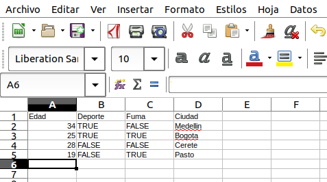  
```  
  </div>
  <div class="col-md-7" markdown="1">
```{r, echo = FALSE, eval = TRUE, out.width = "94%", fig.align = "center"}

knitr::include_graphics("images/datos_csv_2.png")  
```  
  </div>
</div>

</details>

<details><summary>Ejemplo de almacenamiento en __.txt__</summary>

<div class="row">
  <div class="col-md-5" markdown="1">
```{r, echo = FALSE, eval = TRUE, out.width = "84%", fig.align = "center"}

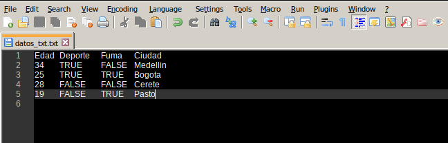  
```  
  </div>
  <div class="col-md-7" markdown="1">
```{r, echo = FALSE, eval = TRUE, out.width = "94%", fig.align = "center"}

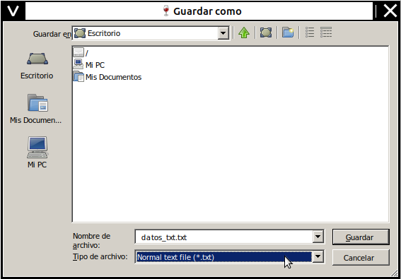  
```  
  </div>
</div>

</details>

<br>

Independientemente del tipo de formato con que se guarde el conjunto de datos, se puede emplear una de las funciones incluidas en el software `R` base para llevar a cabo la lectura de dicho conjunto de datos: la función `read.table()`.

La tabla a continuación muestra los argumentos principales de esta función:

```{r, echo = FALSE, eval = TRUE, out.width = "44%", fig.align = "center"}

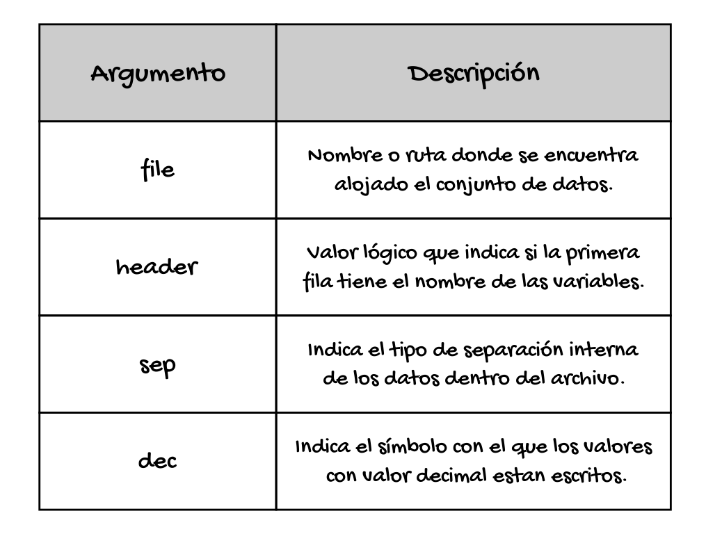  
```

:::example
#### Ejemplo 2.3.4.1
:::

```{r ejemplo_2_3_4_1, exercise = TRUE}

#read.table(file = 'datos_csv.csv', header = TRUE, sep = ',')
#read.table(file = 'datos_txt.txt', header = TRUE, sep = '\t')

datos_csv <- data.frame(
  'Edad' = c(34, 25, 28, 19),
  'Deporte' = c(TRUE, TRUE, FALSE, FALSE),
  'Fuma' = c(FALSE, TRUE, FALSE, TRUE),
  'Ciudad' = c('Medellin', 'Bogota', 'Cerete', 'Pasto') 
)

str(datos_csv)
```

<details><summary>Ejemplo de lectura de datos</summary>

<div class="row">
  <div class="col-md-6" markdown="1">
```{r, echo = FALSE, eval = TRUE, out.width = "84%", fig.align = "center"}

knitr::include_graphics("images/imp_datos_csv.png")  
```  
  </div>
  <div class="col-md-6" markdown="1">
```{r, echo = FALSE, eval = TRUE, out.width = "84%", fig.align = "center"}

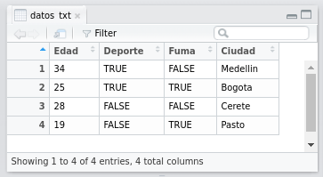  
```  
  </div>
</div>

</details>

<br>

<!--Con la función `read.table()` también es posible cargar archivos de texto de la web (suponiendo que la misma se encuentra en línea).

:::example
#### Ejemplo 2.3.4.2
:::

```{r ejemplo_2_3_4_2, echo = FALSE, eval = FALSE}

datos_web <- read.table(file = 'https://raw.githubusercontent.com/fhernanb/datos/master/orellana', header = TRUE)
```

<details><summary>Ejemplo de almacenamiento en la web</summary>

<div class="row">
  <div class="col-md-6" markdown="1">
```{r, echo = FALSE, eval = TRUE, out.width = "94%", fig.align = "center"}

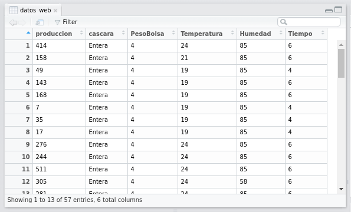  
```  
  </div>
  <div class="col-md-6" markdown="1">
```{r, echo = FALSE, eval = TRUE, out.width = "94%", fig.align = "center"}

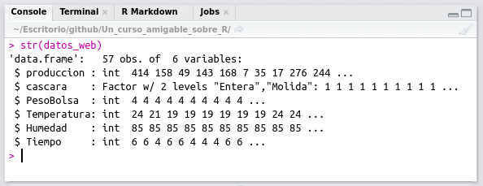  
```  
  </div>
</div>

</details>

<br>

En caso contrario que no desee leer un conjunto de datos sino exportarlo, puede emplear la función `write.table()`. La tabla a continuación muestra los argumentos principales de esta función:

```{r, echo = FALSE, eval = FALSE, message = FALSE, fig.align = 'center', fig.showtext = TRUE, out.width = '500'}

data.frame(
  x = c(1:6), y = c(1:6)
) %>%
  ggplot(aes(x, y)) +
  geom_blank() +
  annotate(geom = 'rect', xmin = 1.0, xmax = 2.5, ymin = 5.0, ymax = 6.0, colour = 'black', fill = 'black', alpha = 0.2) +
  annotate(geom = 'text', x = 1.75, y = 5.5, label = 'Argumento', family = 'gochi', size = 5.5, colour = 'black') +
  annotate(geom = 'rect', xmin = 1.0, xmax = 2.5, ymin = 4.0, ymax = 5.0, colour = 'black', fill = 'white', alpha = 0.2) +
  annotate(geom = 'text', x = 1.75, y = 4.5, label = 'x', family = 'gochi', size = 5.0, colour = 'black') +
  annotate(geom = 'rect', xmin = 1.0, xmax = 2.5, ymin = 3.0, ymax = 4.0, colour = 'black', fill = 'white', alpha = 0.2) +
  annotate(geom = 'text', x = 1.75, y = 3.5, label = 'file', family = 'gochi', size = 5.0, colour = 'black') +
  annotate(geom = 'rect', xmin = 1.0, xmax = 2.5, ymin = 2.0, ymax = 3.0, colour = 'black', fill = 'white', alpha = 0.2) +
  annotate(geom = 'text', x = 1.75, y = 2.5, label = 'sep', family = 'gochi', size = 5.0, colour = 'black') +
  annotate(geom = 'rect', xmin = 1.0, xmax = 2.5, ymin = 1.0, ymax = 2.0, colour = 'black', fill = 'white', alpha = 0.2) +
  annotate(geom = 'text', x = 1.75, y = 1.5, label = 'row.names', family = 'gochi', size = 5.0, colour = 'black') +
  annotate(geom = 'rect', xmin = 2.5, xmax = 5.0, ymin = 5.0, ymax = 6.0, colour = 'black', fill = 'black', alpha = 0.2) +
  annotate(geom = 'text', x = 3.75, y = 5.5, label = 'Descripción', family = 'gochi', size = 5.5, colour = 'black') +
  annotate(geom = 'rect', xmin = 2.5, xmax = 5.0, ymin = 4.0, ymax = 5.0, colour = 'black', fill = 'white', alpha = 0.2) +
  annotate(geom = 'text', x = 3.75, y = 4.65, label = 'Nombre del objeto creado en R,', family = 'gochi', size = 4.4, colour = 'black') +
  annotate(geom = 'text', x = 3.75, y = 4.35, label = 'generalmente un conjunto de datos.', family = 'gochi', size = 4.4, colour = 'black') +
  annotate(geom = 'rect', xmin = 2.5, xmax = 5.0, ymin = 3.0, ymax = 4.0, colour = 'black', fill = 'white', alpha = 0.2) +
  annotate(geom = 'text', x = 3.75, y = 3.65, label = 'Ruta del directorio de trabajo', family = 'gochi', size = 4.4, colour = 'black') +
  annotate(geom = 'text', x = 3.75, y = 3.35, label = 'donde desea guardar el archivo.', family = 'gochi', size = 4.4, colour = 'black') +
  annotate(geom = 'rect', xmin = 2.5, xmax = 5.0, ymin = 2.0, ymax = 3.0, colour = 'black', fill = 'white', alpha = 0.2) +
  annotate(geom = 'text', x = 3.75, y = 2.65, label = 'Indica el tipo de separación interna', family = 'gochi', size = 4.4, colour = 'black') +
  annotate(geom = 'text', x = 3.75, y = 2.35, label = 'de los datos dentro del archivo.', family = 'gochi', size = 4.4, colour = 'black') +
  annotate(geom = 'rect', xmin = 2.5, xmax = 5.0, ymin = 1.0, ymax = 2.0, colour = 'black', fill = 'white', alpha = 0.2) +
  annotate(geom = 'text', x = 3.75, y = 1.65, label = 'Un valor lógico que indica si se guardan', family = 'gochi', size = 4.4, colour = 'black') +
  annotate(geom = 'text', x = 3.75, y = 1.35, label = 'o no los nombres de fila en el archivo.', family = 'gochi', size = 4.4, colour = 'black') +
  #scale_y_continuous(limits = c(2.05, 5.0)) +
  #scale_x_continuous(limits = c(1.0, 7.0)) +
  theme_void() +
  theme(axis.text = element_blank(),
        axis.ticks = element_blank(),
        axis.title = element_blank())
```

```{r, echo = FALSE, eval = FALSE, out.width = "44%", fig.align = "center"}

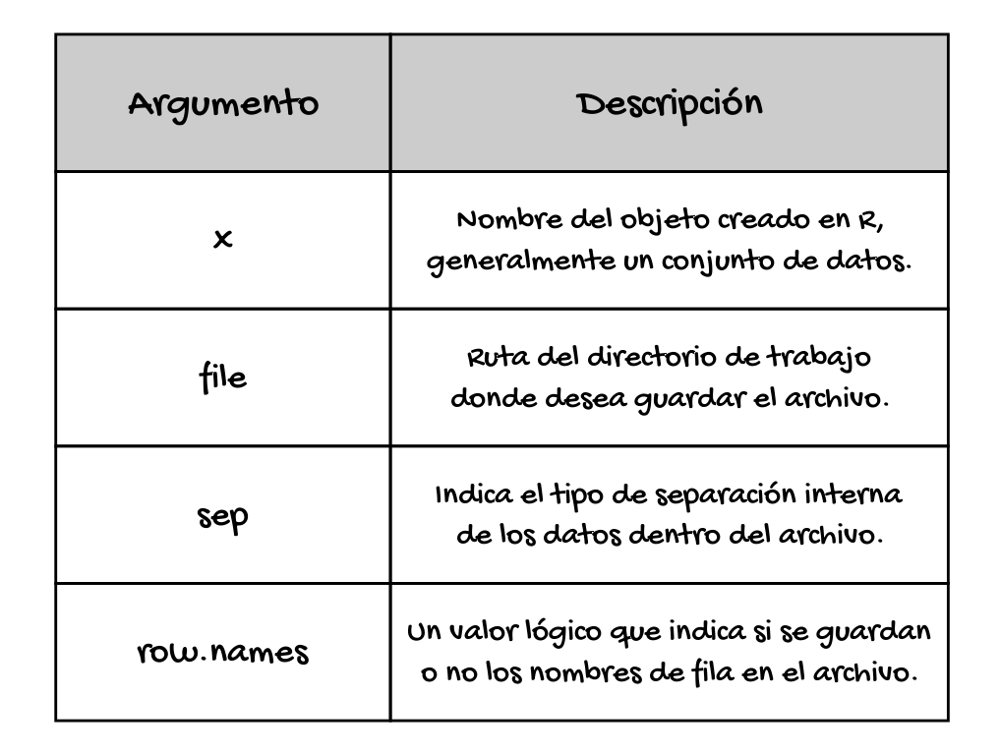  
```
-->

#### 2.3.5 Crear y convertir conjuntos de datos en __tibbles__

<div class="row">
  <div class="col-md-7" markdown="1">
  Los __tibbles__ son una reinvención de la forma en como se creaban e importaban los conjuntos de datos a partir de las funciones del sistema base del `R` anteriormente descritas. Los tibbles al heredarse de los conjuntos de datos usando el sistema base del `R`, funcionan también con las funciones disponibles para estos últimos. Adicionalmente, los tibbles proporcionan un mejor comportamiento al momento de crear conjuntos de datos.
  
  Cabe mencionar que este nueva forma de crear conjuntos de datos no hace parte de las funciones básicas del `R`, por lo que es necesario instalar y cargar previamente un paquete para trabajar con ellos:
  </div>
  <div class="col-md-5" markdown="1">
```{r, echo = FALSE, eval = TRUE, out.width = "48%", fig.align = "center"}

  
```  
  </div>
</div>

```{r instalacion_tibble, exercise = TRUE, comment = ""}
install.packages('tibble')
library(tibble)
```

Las ventajas de los tibbles son:

+ Los tibbles proporcionan una mejor forma de escribir los datos a la hora de crear un conjunto de datos, sin necesidad de escribir vectores:

:::example
#### Ejemplo 2.3.5.1
:::

```{r ejemplo_2_3_5_1, exercise = TRUE}

datos_csv <- data.frame(
  'Edad' = c(34, 25, 28, 19),
  'Deporte' = c(TRUE, TRUE, FALSE, FALSE),
  'Fuma' = c(FALSE, TRUE, FALSE, TRUE),
  'Ciudad' = c('Medellin', 'Bogota', 'Cerete', 'Pasto') 
)

datos_tibble <- tribble(
  ~Edad, ~Deporte, ~Fuma,    ~Ciudad,
     34,     TRUE, FALSE, 'Medellin',
     25,     TRUE,  TRUE,   'Bogota',
     28,    FALSE, FALSE,   'Cerete',
     19,    FALSE,  TRUE,    'Pasto'
)
```

+ Cuando se imprime un tibble en la consola del `R`, se especifica la clase atómica de cada una de las variables o columnas del conjunto de datos:

:::example
#### Ejemplo 2.3.5.2
:::

```{r ejemplo_2_3_5_2, exercise = TRUE}

datos_csv <- data.frame(
  'Edad' = c(34, 25, 28, 19),
  'Deporte' = c(TRUE, TRUE, FALSE, FALSE),
  'Fuma' = c(FALSE, TRUE, FALSE, TRUE),
  'Ciudad' = c('Medellin', 'Bogota', 'Cerete', 'Pasto') 
)
datos_csv

datos_tibble <- tribble(
  ~Edad, ~Deporte, ~Fuma,    ~Ciudad,
     34,     TRUE, FALSE, 'Medellin',
     25,     TRUE,  TRUE,   'Bogota',
     28,    FALSE, FALSE,   'Cerete',
     19,    FALSE,  TRUE,    'Pasto'
)
datos_tibble
```

<details><summary>Ejemplo observado en la consola</summary>

<div class="row">
  <div class="col-md-6" markdown="1">
```{r, echo = FALSE, eval = TRUE, out.width = "84%", fig.align = "center"}

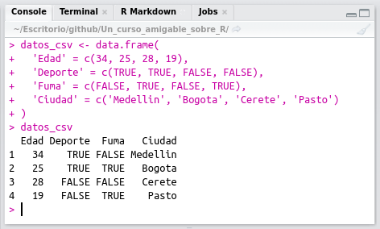  
```  
  </div>
  <div class="col-md-6" markdown="1">
```{r, echo = FALSE, eval = TRUE, out.width = "84%", fig.align = "center"}

knitr::include_graphics("images/consola_tibble.png")  
```    
  </div>
</div>

</details>

<br>

+ Al crear un tibble, nunca se convierte una variable con clase atómica `character` (caracter) a `Factor` (factor). 

:::example
#### Ejemplo 2.3.5.3
:::

```{r ejemplo_2_3_5_3, exercise = TRUE}

datos_csv <- data.frame(
  'Edad' = c(34, 25, 28, 19),
  'Deporte' = c(TRUE, TRUE, FALSE, FALSE),
  'Fuma' = c(FALSE, TRUE, FALSE, TRUE),
  'Ciudad' = c('Medellin', 'Bogota', 'Cerete', 'Pasto') 
)
str(datos_csv)

datos_tibble <- tribble(
  ~Edad, ~Deporte, ~Fuma,    ~Ciudad,
     34,     TRUE, FALSE, 'Medellin',
     25,     TRUE,  TRUE,   'Bogota',
     28,    FALSE, FALSE,   'Cerete',
     19,    FALSE,  TRUE,    'Pasto'
)
str(datos_tibble)
```

:::caution
La coerción es una característica del lenguaje de programación `R` que permite, implícita o explícitamente, convertir un elemento de una clase de datos en otra. Para ello se cuenta con funciones del tipo `as.*`
:::

```{r, echo = FALSE, eval = TRUE, out.width = "54%", fig.align = "center"}

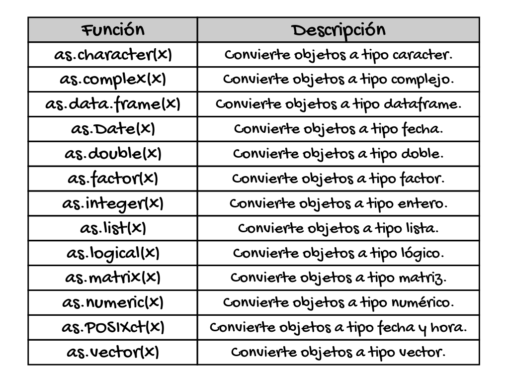  
```

:::example
#### Ejemplo 2.3.5.4
:::

```{r ejemplo_2_3_5_4, exercise = TRUE}

datos_csv <- as_tibble(
  data.frame(
    'Edad' = c(34, 25, 28, 19),
    'Deporte' = c(TRUE, TRUE, FALSE, FALSE),
    'Fuma' = c(FALSE, TRUE, FALSE, TRUE),
    'Ciudad' = c('Medellin', 'Bogota', 'Cerete', 'Pasto') 
    )
  )
str(datos_csv)
```

:::example
#### Ejemplo 2.3.5.5
:::

```{r ejemplo_2_3_5_5, exercise = TRUE}

amigos <- tribble(
   ~nombre,                               ~fisico,                      ~sentimental,
  'Andres', c(edad = 23, altura = 181, masa = 98),  c(soltero = TRUE, hijos = FALSE),
  'Julian', c(edad = 24, altura = 179, masa = 75),  c(soltero = FALSE, hijos = TRUE),
   'Maria', c(edad = 19, altura = 167, masa = 71), c(soltero = TRUE , hijos = FALSE),
  'sandra', c(edad = 21, altura = 174, masa = 68),  c(soltero = TRUE, hijos = FALSE),
   'Karol', c(edad = 26, altura = 171, masa = 70),  c(soltero = FALSE, hijos = TRUE),
  'Javier', c(edad = 18, altura = 164), masa = 64,  c(soltero = TRUE, hijos = FALSE)
)
amigos
```

### 2.4 Listas y arreglos

```{r, echo = FALSE, eval = TRUE, out.width = "64%", fig.align = "center"}

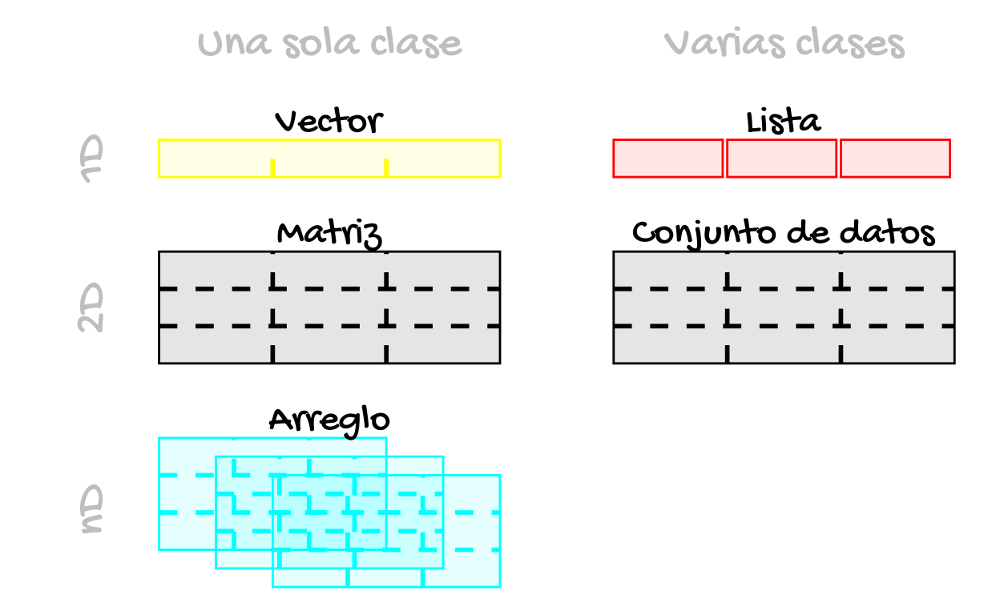  
```

+ Listas

Las listas son como los vectores debido a que almacenan datos en una estructura unidimensional. Sin embargo, las listas a diferencia de los vectores no almacenan valores individuales sino que almacenan objetos, como escalares, conjuntos de datos, funciones e inclusive otras listas. Para crear una lista se emplea la función `list()`.

:::example
#### Ejemplo 2.4.1
:::

```{r ejemplo_2_4_1, exercise = TRUE}

lista_1 <- list(
  L_1 = 40:80, 
  L_2 = 'Hola', 
  L_3 = list(VERDADERO = TRUE, FALSO = FALSE)
  )
lista_1
```

Si se desea extraer los elementos almacenados en una lista, se pueden usar los operadores `$`, `[[ ]]` o `[ ]`.

:::example
#### Ejemplo 2.4.2
:::

```{r ejemplo_2_4_2, exercise = TRUE}

lista_1 <- list(
  L_1 = 40:80, 
  L_2 = 'Hola', 
  L_3 = list(VERDADERO = TRUE, FALSO = FALSE)
  )

lista_1$L_2 # Si queremos extraer el vector con el nombre "L_2" dentro del objeto "lista_1".

lista_1[[2]] # Si queremos extraer el vector con el nombre "L_2", pero esta vez no por su nombre sino por su posición dentro del objeto "lista_1".

lista_1$L_3[2]
```

:::example
#### Ejemplo 2.4.3
:::

```{r ejemplo_2_4_3, exercise = TRUE}

amigos <- tribble(
   ~nombre,                               ~fisico,                      ~sentimental,
  'Andres', c(edad = 23, altura = 181, masa = 98),  c(soltero = TRUE, hijos = FALSE),
  'Julian', c(edad = 24, altura = 179, masa = 75),  c(soltero = FALSE, hijos = TRUE),
   'Maria', c(edad = 19, altura = 167, masa = 71), c(soltero = TRUE,  hijos = FALSE),
  'sandra', c(edad = 21, altura = 174, masa = 68),  c(soltero = TRUE, hijos = FALSE),
   'Karol', c(edad = 26, altura = 171, masa = 70),  c(soltero = FALSE, hijos = TRUE),
  'Javier', c(edad = 18, altura = 164, masa = 64),  c(soltero = TRUE, hijos = FALSE)
  )

# Selección de los elementos del anterior tibble ----
amigos$fisico[[3]][1] # Edad de Maria.
amigos$fisico[[2]][1] # Edad de Julian.
amigos$sentimental[[6]][2] # Hijos de Javier. 
```

:::exercise
#### Ejercicio 2.4.1
Sabiendo que el índice de masa corporal de una persona se calcula con base en la expresión ($IMC = \frac{Masa\ (kg)}{Altura(m)^2}$), intente por favor calcular este párametro para Karol y Javier por medio de indexación. Aquí, la altura esta expresada en centímetros, por lo cual requerirá cambiarse a metros.
:::

```{r ejercicio_2_4_1, exercise = TRUE}

amigos <- tribble(
   ~nombre,                               ~fisico,                      ~sentimental,
  'Andres', c(edad = 23, altura = 181, masa = 98),  c(soltero = TRUE, hijos = FALSE),
  'Julian', c(edad = 24, altura = 179, masa = 75),  c(soltero = FALSE, hijos = TRUE),
   'Maria', c(edad = 19, altura = 167, masa = 71), c(soltero = TRUE,  hijos = FALSE),
  'sandra', c(edad = 21, altura = 174, masa = 68),  c(soltero = TRUE, hijos = FALSE),
   'Karol', c(edad = 26, altura = 171, masa = 70),  c(soltero = FALSE, hijos = TRUE),
  'Javier', c(edad = 18, altura = 164, masa = 64),  c(soltero = TRUE, hijos = FALSE)
  )

# Calculo del IMC del anterior tibble ----
amigos$fisico[[5]][3] / (amigos$fisico[[5]][2] / 100)^2 # IMC de Karol
amigos$fisico[[6]][3] / (amigos$fisico[[6]][2] / 100)^2 # IMC de Javier
```

+ Arreglos

Un arreglo es una matriz n-dimensional. Por lo tanto los arreglos, al igual que en una matriz, se pueden almacenar datos de una sola clase atómica. Para construir una arreglo se usa la función `array()`.

:::example
#### Ejemplo 2.4.4
:::

```{r ejemplo_2_4_4, exercise = TRUE}

arreglo_1 <- array(
  data = c(11:14, 21:24, 31:34),
  dim = c(2, 2, 3)
)
arreglo_1
```

Si se desea extraer los elementos almacenados en un arreglo, se usa el operador `[ ]` al igual que en una matriz.

:::example
#### Ejemplo 2.4.5
:::

```{r ejemplo_2_4_5, exercise = TRUE}

arreglo_1 <- array(
  data = c(11:14, 21:24, 31:34),
  dim = c(2, 2, 3)
)

arreglo_1[2, 1, 3] # Si se quiere extraer el número almacenado en la fila 2 y la columna 1 de la tercera matriz. 
arreglo_1[, , 2] # Si se quiere extraer la segunda matriz completa.  
arreglo_1[, 2, ] # Si se quiere extraer la columna 2 de todas las matrices.
arreglo_1[1, , ] # Si se quiere extraer la fila 1 de todas las matrices.
```

## 3. Condiciones, bucles y funciones

En esta sección aprenderemos a crear y utilizar estructuras de control como funciones de usuario, bucles y condicionales que nos permitan automatizar nuestra manipulación y análisis de datos. Además esta sección nos permitirá entender cómo trabajan algunas de las funciones que conocemos, dejándonos entender y manipular mejor el `R` como lenguaje de programación. Cuando utilizamos programación para resolver algún problema académico, laboral u de otra índole es común encontrarnos con particularidades que corresponde únicamente a nuestro problema, por ello en muchos casos funciones generales o procesos generales no aplican para nuestra situación, es allí donde entran las famosas funciones de usuario que conoceremos a lo largo de la sección. La sección cuenta con cuatro subsecciones 1) Condicionales, 2) Bucles, 3) Funciones y 4) Familia `apply`.

* Algunas de las funciones nuevas que utilizaremos en esta sección deberás consultar en la ayuda de `R` , cada vez que no entiendas un función que utilicemos puedes ejecutar un comando de la forma `?mean()` 

* Para los ejercicios de esta sección existen muchas posibles soluciones que realicen la misma tarea planteada, sin embargo en `Solution` encontrarás solo una de todas las posibles.

<details><summary>3.1 Condicionales </summary> 

Son conocidos como construcciones y se articulan con los operadores lógicos, de conjunción y de disyunción. Utilizan expresiones lógicas para denotar diferentes alternativas, es decir, funcionan como una condición a partir de la expresión lógica. La primera función que utilizaremos será `if(){}` acompañada de `print()`. Para ello recordemos con un ejemplo expresiones lógicas que ya conocemos y agreguemos la sintaxis de una condición para utilizar estas nuevas funciones. 

:::example
#### Ejemplo 3.1.1
:::

```{r addition_311, exercise = TRUE}
#Expresiones logicas
35 > 20
35 != 35.4
#Condiciones
if(35>20) {print("Es mayor a 20")}
if(35 != 35.4) {print("Son diferentes")}
```

Como vimos con el ejemplo la condición evalúa la expresión lógica correspondiente, en el primer caso, si 35 es mayor a 20 imprime “Es mayor”, en el segundo si 35 es diferente a 35.4 imprime “Son diferentes”. Esta sintaxis aplica para cualquier condición `si la expresión lógica se cumple realice determinada acción`, en nuestro caso la acción es imprimir, pero podemos ejecutar cualquier acción que necesitemos.

Veamos qué acciones podemos ejecutar si nuestra expresión lógica no se cumple, para esto nos valdremos del argumento `else{}`. Utilicemos uno de los ejemplos anteriores para visualizarlo.

:::example
#### Ejemplo 3.1.2
:::

```{r addition_312, exercise = TRUE}
#Se cumple la expresion logica
if(35>20) {
  print("Es mayor a 20")
} else {
  print("Es menor a 20")
}
#No se cumple la expresion logica
if(10>20) {
  print("Es mayor a 20")
} else {
  print("Es menor a 20")
}
```

La sintaxis para este caso tendría una modificación, siendo expresada por `si expresión lógica se cumple realice determinada acción, de lo contrario realice otra acción`, en este caso en especifico seria, si determinado numero es mayor a 20 imprima es mayor de lo contrario imprima es menor. Podríamos además agregar una condición extra en la que verifiquemos si el número es igual a 20, para ello podemos valernos del argumento `else if{}`. Para evidenciar su funcionamiento te invito a que cambies el valor de `x` por distintos números incluyendo el 20.

```{r addition_3121, exercise = TRUE}
#para cada modificacion de x ejecute "Run code"
x = 18
if(x>20) {
  print("Es mayor a 20")
} else if (x==20){
  print("Es igual a 20")
}else {
  print("Es menor a 20")
}
```

A continuación trabajaremos con acciones diferentes a `print()` y utilizaremos conceptos de operaciones básicas que manejamos anteriormente, usando además una función nueva denominada `paste()`. Para este ejemplo `x` es el número de rosas compradas en una floristería, en la cual se tiene una oferta, si se compran más de 10 rosas se regalan 3 rosas, si se compran exactamente 10 se regala una rosa, de lo contrario el cliente solo se lleva las rosas que compro. Para evidenciar su funcionamiento te invito a que cambies el valor de `x` por distintos números.

:::example
#### Ejemplo 3.1.3
:::

```{r addition_313, exercise = TRUE}
#para cada modificacion de x ejecute "Run code"
x = -13
if(x<=0) {
  paste(x,"no es un número de compra valido")
} else if (x==10){
  print("Llevarás una rosa extra")
  paste("Total de Rosas:",x+1)
} else if(x>10){
  print("Llevarás tres rosas extra")
  paste("Total de Rosas:",x+3)
}else {
  print("Llevarás las rosas que compraste")
  paste("Total de Rosas:",x)
}
```

Trabajemos ahora un ejercicio similar, en el cual hay una oferta del 50% en bolsas de comida de perro y un descuento del 10% adicional si se compran por lo menos 10 bolsas de comida. El precio normal de una bolsa de comida son 6800 pesos, `x` corresponde al número de bolsas de comida. Si se ejecuta el código con `x=0` se debe imprimir en pantalla "No es un número de compra válido" , con `x=8` "Total a pagar: 27200" y con `x=20` "Total a pagar: 54400".

:::exercise
#### Ejercicio 3.1.1
:::

```{r exe_311, exercise = TRUE}
#para cada modificacion de x ejecute "Run code"
x <- 0
precio = 6800
```

```{r exe_311-solution}
#para cada modificacion de x ejecute "Run code"
x <- 0
precio = 6800
if(x<= 0){
  paste("No es un número de compra válido")
} else if (x<10){
  cobro = x*.5*precio
  paste("Total a pagar:",cobro)
} else{
  cobro = x*.4*precio
  paste("Total a pagar:",cobro)
}
```

```{r exe_311-check}
grade_code("Excelente lo lograste, sigamos adelante")
```

Ya vimos como trabajar con condiciones numéricas y algunos operadores lógicos, veamos cómo trabajar con coincidencias exactas con caracteres. Retomemos el ejercicio anterior, añadiendo que los descuentos solo aplican en dias especificos, para diferenciar cuando se aplica o no el descuento se creo la variable `des` que puede ser “Hay descuento” o “No hay descuento”, veamos como funcionaria con esta nueva condición al variar los valores de `x` y cambiar los valores de `des` por las dos opciones válidas.

:::example
#### Ejemplo 3.1.4
:::

```{r addition_314, exercise = TRUE}
#para cada modificacion de x y/o des ejecute "Run code"
x <- 10
precio = 6800
des = "Hay descuento"
#Cuando no hay descuento
if(des == "No hay descuento"){
  if(x<= 0){
  paste("No es un número de compra válido")
  } else{
  cobro = x * precio
  paste("Total a pagar:",cobro)  
  }
#Cuando hay descuento
} else if(des == "Hay descuento"){
  if(x<= 0){
  paste("No es un número de compra válido")
} else if (x<10){
  cobro = x*.5*precio
  paste("Total a pagar:",cobro)
} else{
  cobro = x*.4*precio
  paste("Total a pagar:",cobro)
}
#Opcion de clasificación no valida
} else {
  paste(des,"No es un opción válida de clasificación de descuento")
}
```

Este ejemplo contiene una condición principal, que es si hay descuento o no;  dependiendo de ella se despliega el cobro con o sin descuento con condiciones para cada caso, esta forma de incluir condiciones dentro de otras condiciones se conoce como __anidar__ y aplica también para funciones, procesos y bucles. Para solucionar problemas con condicionales podemos apoyarnos de los diagramas de flujo como el siguiente, que simplifica el proceso cuando las entradas son correctas.

```{r, echo = FALSE, eval = TRUE, out.width = "74%", fig.align = "center"}
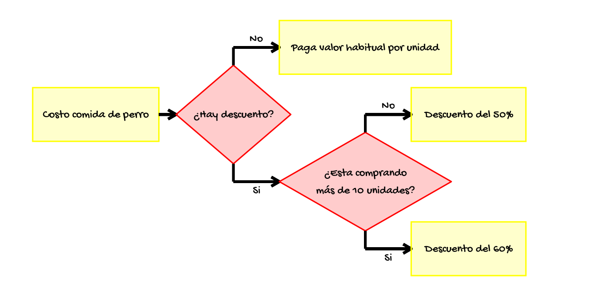  
```

Vamos con un ejercicio similar, en el que una heladería ofrece descuentos del 25% sobre  el total de la compra los días lunes, martes y miércoles, adicionalmente si la compra supera el valor de 50.000 ofrece un 10% adicional de descuento, los otros días de la semana ofrece un 15% de descuento sobre el total de la compra si esta supera el valor de 60.000.  el programa debe arrojar el total, el descuento y el total con descuento en cualquiera de los casos. Si se hacen las siguientes compras el programa debe dar las salidas enunciadas:

* Domingo total de la compra 69500:
  * "Total: 69500"
  * "Descuento: 10425"
  * "Total con descuento: 59075"

* Lunes total de la compra 71350
  * "Total: 71350"
  * "Descuento: 24972.5"
  * "Total con descuento: 46377.5"
  
* Miercoles total de la compra 33700
  * "Total: 33700"
  * "Descuento: 8425"
  * "Total con descuento: 25275"

:::exercise
#### Ejercicio 3.1.2
:::

```{r exe_312, exercise = TRUE}
#para cada modificacion del dia y del valor total de la compra ejecute "Run code"

```

```{r exe_312-solution}
#para cada modificacion del dia y del valor total de la compra ejecute "Run code"
#Recuerda esta es solo una posible solucion 
dia = "Miercoles"
total_compra = 33700
if(dia =="Lunes" | dia =="Martes" | dia =="Miercoles" ){
  if(total_compra<=0){
    print("No es un valor de compra válido")
  } else if(total_compra>50000){
    descuento = total_compra * .35
    nuevo_total = total_compra - descuento
    print(paste("Total:", total_compra))
    print(paste("Descuento:", descuento))
    print(paste("Total con descuento:",nuevo_total))
  } else{
    print(paste("Total:", total_compra))
    print(paste("Descuento:", total_compra * .25))
    print(paste("Total con descuento:",total_compra*.75))
  }
} else if(dia =="Jueves" | dia =="Viernes" | dia =="Sabado" | dia =="Domingo"){
  if(total_compra<=0){
    print("No es un valor de compra válido")
  } else if (total_compra>60000){
    print(paste("Total:", total_compra))
    print(paste("Descuento:", total_compra * .15))
    print(paste("Total con descuento:",total_compra*.85)) 
  } else{
    print(paste("Total:", total_compra))
    print(paste("Descuento:", total_compra * 0))
    print(paste("Total con descuento:",total_compra))     
  }
} else{
  print("No es una dia de la semana valido")
}
```

```{r exe_312-check}
grade_code("Excelente lo lograste, sigamos adelante")
```

En los anteriores ejemplos debíamos cambiar los valores para cada caso, ahora veamos cómo utilizar el código ágilmente sobre uno o varios vectores para obtener resultados en simultaneo para cada caso. Retomemos entonces el ejemplo 3.1.2 para utilizar la función `ifelse()` y comparar varios números al mismo tiempo.

:::example
#### Ejemplo 3.1.5
:::

```{r addition_315, exercise = TRUE}
#vector de prueba
numeros <- c(35,10,18,70,80,5,18,34,19)
#comparacion
ifelse(test = numeros>20,yes = paste("Es mayor a 20"),no = paste("Es menor a 20"))
```

Veamos la adaptación para el ejemplo con la condición de igualdad con el numero 20.

```{r addition_3151, exercise = TRUE}
#vector de prueba
numeros <- c(35,10,18,20,70,80,5,18,34,19,20)
#comparacion
ifelse(test = numeros==20,yes = paste("Es igual a 20"),no = 
         ifelse(numeros>20,paste("Es mayor a 20"),paste("Es menor a 20")))
```

En ejemplos simples como este es fácil adaptar la función `ifelse()` para usarla con vectores, sin embargo ya hemos trabajado ejemplos un poco más elaborados en los que modificamos las variables y obtenemos unas nuevas, para estos últimos esta función es difícil de adaptar y tenemos que valernos de los bucles que aprenderemos en la siguiente subsección.

Para seguir con los condicionales realiza el siguiente ejercicio usando `ifelse()`, en él debes encontrar los números pares de un vector de prueba, imprimiendo en pantalla la afirmación “Es par” cuando cumpla la condición, y “No es par” cuando no lo haga.

:::exercise
#### Ejercicio 3.1.3
:::

```{r exe_313, exercise = TRUE}
#vector de prueba
vec <- c(20,17,48,03,95,47,97,65,46,24,98,14,86,93,75,200,350,257,301,1,3,5,12,2)
#condicion
```

```{r exe_313-solution}
#vector de prueba
vec <- c(20,17,48,03,95,47,97,65,46,24,98,14,86,93,75,200,350,257,301,1,3,5,12,2)
#condicion
ifelse(vec%%2==0,paste("Es par"),paste("No es par"))
```

```{r exe_313-check}
grade_code("Excelente lo lograste, sigamos adelante")
```

Como último ejercicio de esta subsección debes utilizar `ifelse()` para clasificar los números en determinado rango, de tal manera que para los números entre 20 y 60 en el vector de prueba se imprima “Están en el intervalo” y para los que no estén entre 20 y 60 se imprima “No están en el intervalo”.

:::exercise
#### Ejercicio 3.1.4
:::

```{r exe_314, exercise = TRUE}
#vector de prueba
vec <- seq(1,100,length.out = 20)
#condicion
```

```{r exe_314-solution}
#vector de prueba
vec <- seq(1,100,length.out = 20)
#condicion
ifelse(vec>20 & vec<60,paste("Está en el intervalo"),paste("No está en el intervalo"))
```

```{r exe_314-check}
grade_code("Excelente lo lograste, sigamos adelante")
```

</details>

<details><summary>3.2 Bucles </summary> 

Los bucles o ciclos son estructuras de control que permiten recorrer los elementos de un objeto iterable (vector, lista, dataframe, tibble, array,...) repitiendo determinado número de veces el bloque de código o instrucción para cada iteración. Las estructuras de control asociadas con los ciclos  son:

+------------+-------------------+
| Estructura | Descripción       |
+============+===================+
| `for()`    | Para cada uno en  |
+------------+-------------------+
| `while()`  | Mientras          |
+------------+-------------------+
| `break`    | Interrupción      |
+------------+-------------------+
| `next`     | Siguiente         |
+------------+-------------------+
| `repeat`   | Repetir           |
+------------+-------------------+

Para empezar trabajaremos con el ciclo `for` ilustrando cómo funcionan las iteraciones en cada elemento del vector `letras` el cual posee una longitud de 15. 

Para empezar trabajaremos con el ciclo `for` viendo la siguiente ilustracion y observando el funcionamiento de las iteraciones en cada elemento en el vector `letras` del ejemplo 3.2.1. Recordemos que `letras`  posee 15 elementos.

```{r, echo = FALSE, eval = TRUE, out.width = "95%", fig.align = "center"}
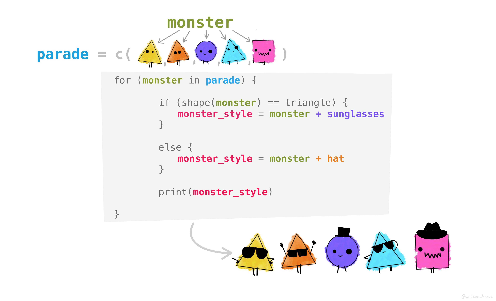
```

<section style="text-align: center;"><small>Ilustracíon hecha por <font color = "black"><u>\@allison_horst</u></font>.</small></section> 

:::example
#### Ejemplo 3.2.1
:::

```{r addition_321, exercise = TRUE}
#vector
letras
#ciclo for
for (i in 1:length(letras)){
  print(paste("la letra en la posición",i,"es",letras[i]))
}
```

Una modificación con la cual podemos obtener el mismo resultado del fragmento de código anterior es utilizando la función `seq_along()` de la siguiente forma.

```{r addition_321_1, exercise = TRUE}
#vector
letras
#ciclo for
for (i in seq_along(letras)){
  print(paste("la letra en la posición",i,"es",letras[i]))
}
```

Si la posición no es relevante para nuestras operaciones podemos utilizar el ciclo `for` de la siguiente forma, olvidándonos de la longitud y del índice de cada iteración.

```{r addition_321_2, exercise = TRUE}
#vector
letras
#ciclo for
for (i in letras){
  print(i)
}
```

Veamos una modificación del ejemplo anterior en el cual nos interesa obtener los elementos con índices pares del vector `letras`. 

:::example
#### Ejemplo 3.2.2
:::

```{r addition_322, exercise = TRUE}
#vector
letras
#ciclo for
for (i in seq(2,length(letras),2)){
  print(paste("la letra en la posición",i,"es",letras[i]))
}
```

También podemos utilizar condicionales y `seq_along()` de una forma estratégica para lograr el mismo objetivo.

```{r addition_3221, exercise = TRUE}
#vector
letras
#ciclo for con condicional
for (i in seq_along(letras)){
  if(i%%2 == 0){
    print(paste("la letra en la posición",i,"es",letras[i]))
  }
}
```

Hagamos un ejemplo un poco más elaborado usando el ejemplo 3.1.4 del descuento de comida de perro, utilizando en esta ocasión dos vectores, `x` vector con distintos números de bolsas de comida (cada número una compra diferente) y `des` vector que se señala cuando se aplica descuento y cuando no (1= Hay descuento, 0= No hay descuento). Cabe recordar que las ocasiones en la que se aplica un descuento, este es de un 50% con un 10% adicional si el número de bolsas de comida es mayor a 10. El precio por bolsa es de 6800 pesos.

:::example
#### Ejemplo 3.2.3
:::

```{r addition_323, exercise = TRUE}
#Información
x = c(10,0,2,15,13,18,4,9,7,2,8,16) #numero de bolsas
des = c(1,0,0,1,0,0,1,1,1,0,0,10) #clasificación
#ciclo for
for (i in seq_along(x)){
  cobro = 6800 * x[i]
  #cuando no hay descuento
  if(des[i]==0){
    if(x[i]<=0){
      print("No es un número de compra válido")
    } else{
      print(paste("Total a pagar:",cobro))
    }
  #cuando hay descuento
  } else if(des[i]==1){
    if(x[i]<=0){
      print("No es un número de compra válido")
    } else if(x[i]<10){
      print(paste("Total a pagar:",cobro*.5))
    } else{
      print(paste("Total a pagar:",cobro*.4))
    }
  } else{
    print(paste(des[i],"No es un opción válida de clasificación de descuento"))
  }
}
```

Ya vimos cómo funciona el ciclo for con vectores, veamos un ejemplo con `my_lista`, y obtengamos el resumen con `summary()` para cada objeto de la lista.

:::example
#### Ejemplo 3.2.4
:::

```{r addition_324, exercise = TRUE}
for (i in seq_along(my_lista)){
  objeto <- my_lista[[i]]
  print(summary(objeto))
}
```

Se puede ver que el proceso con las listas es tan simple como con los vectores, por ello en el siguiente ejercicio debes retomar la lista `carlos_fam_g` del ejercicio 2.4.3 y obtener todos los nombres de los familiares de carlos e imprimirlos en pantalla junto con el tipo de relación que tienen y su edad. Por ejemplo para el padre se debe mostrar en pantalla : “El padre de carlos es Juan carlos y tiene 55 años”.

:::exercise
#### Ejercicio 3.2.1
:::

```{r exe_321, exercise = TRUE}
# carlos_fam_g
```

```{r exe_321-solution}
# carlos_fam_g
for (objeto in carlos_fam_g){
  for (i in seq_along(objeto[[1]])){
    print(paste("Relacion con carlos:",objeto[[1]][i],"su nombre es",objeto[[2]][i], "y tiene",objeto[[3]][i],"años"))
  }
}
```

```{r exe_321-check}
grade_code("Excelente lo lograste, sigamos adelante")
```

Como se puede notar el ejercicio se ve más sencillo de lo que es, veamos otro ejercicio para reforzar el aprendizaje del ciclo `for`. Para este ejercicio usaremos los datos `amigos` y retomaremos el ejercicio 2.4.1 calculando el IMC ($IMC = \frac{Masa\ (kg)}{Altura(m)^2}$) para todas las personas del conjunto de datos imprimiendo en pantalla una expresión del tipo: “Andres tiene un altura de 1.81 m, una masa de 98 kg y su IMC es 29.91”

:::exercise
#### Ejercicio 3.2.2
:::

```{r exe_322, exercise = TRUE}
# amigos
```

```{r exe_322-solution}
# amigos
for (i in seq_along(amigos$nombre)){
  nombre <- amigos$nombre[i]
  masa <- amigos$fisico[[i]][3][[1]]
  altura <- amigos$fisico[[i]][2][[1]]/100
  IMC <- masa/altura^2
  print(paste(nombre,"tiene una altura de",altura,"m, una masa de",masa,"u su IMC es",round(IMC,2)))
}
```

```{r exe_322-check}
grade_code("Excelente lo lograste, sigamos adelante")
```

Modifica el código del ejercicio anterior y úsalo para incluir la variable IMC en la lista de fisico del dataset `amigos`. Recuerda la indexación y creación de variables tanto en los dataframe como en las listas.

:::exercise
#### Ejercicio 3.2.3
:::

```{r exe_323, exercise = TRUE}
# amigos
```

```{r exe_323-solution}
# amigos
for (i in seq_along(amigos$nombre)){
  masa <- amigos$fisico[[i]][3][[1]]
  altura <- amigos$fisico[[i]][2][[1]]/100
  IMC <- masa/altura^2
  amigos$fisico[[i]][4] <- round(IMC,2)
  names(amigos$fisico[[i]]) <- c("edad","altura","masa","IMC")
}
amigos$fisico
```

```{r exe_323-check}
grade_code("Excelente lo lograste, sigamos adelante")
```

Ya sabemos un poco mas de como acceder y crear variables con el ciclo `for`, ahora tendrás que usarlo para crear una variable adicional en el dataset `amigos`. La nueva variable se obtuvo de preguntarle a los personajes cuantos meses llevaban solteros, sin embargo se descubrió que los personajes que no están solteros mintieron al respecto. Las respuestas están alojadas en el vector `tsoltero` y tu tarea es crear la variable adicional `tiempo_soltero` en el dataset amigos, asignando a los mentirosos el valor de `NA`.

:::exercise
#### Ejercicio 3.2.4
:::

```{r exe_324, exercise = TRUE}
# amigos
tsoltero <- c(4,1,9,5,2,6) #tiempo soltero en meses
amigos$tiempo_soltero <- 0
#tiempo_soltero

```

```{r exe_324-solution}
# amigos
tsoltero <- c(4,1,9,5,2,6) #tiempo soltero en meses
amigos$tiempo_soltero <- 0
#tiempo_soltero
for (i in seq_along(amigos$nombre)){
  soltero <- amigos$sentimental[[i]][1][[1]]
  if (soltero == T){
    amigos$tiempo_soltero[i]<- tsoltero[i]
  } else{
    amigos$tiempo_soltero[i] <- NA
  }
}
amigos
```

```{r exe_324-check}
grade_code("Excelente lo lograste, sigamos adelante")
```

En `R` también está presente el ciclo `while()` el cual permite repetir la ejecución de un grupo de instrucciones mientras se cumpla una condición, debemos ser precavidos ya que es muy fácil programar un bucle infinito en el cual la condición siempre se cumpla. Iniciemos adaptando el ejemplo 3.2.1 para las primeras 10 letras del vector `letras`, usando además un contador. Veamos cómo funciona.

:::example
#### Ejemplo 3.2.5
:::

```{r addition_325, exercise = TRUE}
i =1 #contador
while(i<=10){
  print(letras[i])
  i =i+1
}
```

El siguiente ejemplo consiste en la comparación de números de un vector `x`, que solo funciona mientras los números sean cada vez más grandes, al terminar el ciclo se muestra la razón y el índice por el cual se finalizó.

:::example
#### Ejemplo 3.2.6
:::

```{r addition_326, exercise = TRUE}
x = c(5,8,12,19,48,95,106,208,406,512,683,791,790,805,900,931)
i = 1
while(x[i]<x[i+1]){
  print(paste(x[i],"es menor que",x[i+1]))
  i=i+1
}
print(paste(x[i],"no es menor que",x[i+1],",error en el indice",i+1,"del vector x"))
```

Veamos con un ejemplo cómo usar el ciclo `while` para generar los primeros 20 números de la sucesión de Fibonacci.

:::example
#### Ejemplo 3.2.7
:::

```{r addition_327, exercise = TRUE}
a = 0
b = 1
count = 1
while(count<=20){
  print(a)
  c<-a+b
  a<-b
  b<-c
  count = count +1
}
```

Como se puede ver el ciclo `while` puede adaptarse para funcionar igual que el ciclo `for`, sin embargo su uso en el lenguaje `R` es poco frecuente y suele ser más común utilizar el ciclo `for` acompañado de condicionales. Veamos los anteriores ejemplos adaptados al ciclo `for` utilizando un nuevo argumento denominado `break`. El ejemplo 3.2.5 utilizando el ciclo `for` se ve de la siguiente manera:

:::example
#### Ejemplo 3.2.8
:::

```{r addition_328, exercise = TRUE}
for (i in seq_along(letras)){
  print(letras[i])
  if(i==10){
    break
  }
}
```

La adaptación del ejemplo 3.2.6 sería la siguiente:

```{r addition_3281, exercise = TRUE}
x = c(5,8,12,19,48,95,106,208,406,512,683,791,790,805,900,931)
for (i in seq_along(x)){
  if (x[i]<x[i+1]){
    print(paste(x[i],"es menor que",x[i+1]))
  }else{
    print(paste(x[i],"no es menor que",x[i+1],",error en el indice",i+1,"del vector x"))
    break
  }
}
```

Ahora debes adaptar el ejemplo 3.2.7 de la sucesión de Fibonacci usando el ciclo `for`.

:::exercise
#### Ejercicio 3.2.5
:::

```{r exe_325, exercise = TRUE}

```

```{r exe_325-solution}
a=0
b=1
for (i in 1:20){
  print(a)
  c<-a+b
  a<-b
  b<-c
}

```

```{r exe_325-check}
grade_code("Excelente lo lograste, sigamos adelante")
```

Otro de los ciclos que posee `R` es `repeat{}`, que es incluso de menor uso que el ciclo `while`. En general `repeat{}` repite un grupo de instrucciones indefinidamente, por ello el uso del argumento `break` resulta obligatorio en este ciclo. Veamos algunos de los ejemplos anteriores adaptados al ciclo `repeat{}`

:::example
#### Ejemplo 3.2.9
:::

Iniciemos adaptando el ejemplo 3.2.2

```{r addition_329, exercise = TRUE}
# letras
i=0
repeat{
  i=i+2
  if(i<=length(letras)){
    print(paste("la letra en la posición",i,"es",letras[i]))
  } else{ break }
}
```

Veamos la adaptación del ejercicio 3.2.2 con el ciclo `repeat{}`

```{r addition_3291, exercise = TRUE}
# amigos
j=0
repeat{
  j=j+1
  if(is.na(amigos$nombre[j])){break}
  nombre <- amigos$nombre[j]
  masa <- amigos$fisico[[j]][3][[1]]
  altura <- amigos$fisico[[j]][2][[1]]/100
  IMC <- masa/altura^2
  print(paste(nombre,"tiene una altura de",altura,"m, una masa de",masa,"u su IMC es",round(IMC,2)))
}

```

Para finalizar esta subsección entendamos cómo trabaja el argumento `next` con un ejemplo simple, en el cual evitaremos imprimir los números de 8 y 12 en la serie de números de 1 a 15.

:::example
#### Ejemplo 3.2.10
:::

```{r addition_3210, exercise = TRUE}
for (i in 1:15){
  if(i == 8 | i == 12){
    next
  }
  print(i)
}
```

Apliquemos también el argumento `next` al ejemplo 3.2.3 del descuento de comida para perro, en este caso el argumento nos ayuda a hacer un poco más corto el código desarrollado anteriormente, evitando seguir el proceso cuando encontramos opciones de descuento o de compra inválidos. 

:::example
#### Ejemplo 3.2.11
:::

```{r addition_3211, exercise = TRUE}
x = c(10,0,2,15,13,18,4,9,7,2,8,16) #numero de bolsas
des = c(1,0,0,1,0,0,1,1,1,0,0,10) #clasificación
for (i in seq_along(x)){
  cobro = 6800*x[i]
  if(x[i]<=0){
    print("No es un número de compra válido")
    next
  }
  if(des[i]!=0 & des[i]!=1){
    print(paste(des[i],"No es un opción válida de clasificación de descuento"))
    next
  }
  if(des[i]==1 & x[i]<10){
    cobro = cobro *.5
  } else if(des[i]==1 & x[i]>=10){
    cobro = cobro * .4
  }
  print(paste("Total a pagar:",cobro))
}
```

Modifiquemos la respuesta del ejercicio 3.2.1 utilizando el ciclo `for` en compañía del argumento `next` para múltiples compras en la heladería, de modo que obtengamos el número de compra, el total correspondiente, el descuento y el total con descuento para cada caso. 

:::example
#### Ejemplo 3.2.12
:::

```{r addition_3212, exercise = TRUE}
dia = c("Domingo", "Lunes","Miercoles","jueves","Domingo","Martes","Viernes")
total_compra = c(69500,71350,33700,54000,0,38000,52300)
for (i in seq_along(dia)){
  print(paste("Número de compra", i))  
  descuento = 0
  if(total_compra[i]<=0){
    print("No es un valor de compra válido")
    next
  }
  if(dia[i] =="Lunes" | dia[i] =="Martes" | dia[i] =="Miercoles"){
    if(total_compra[i]>50000){
      descuento = total_compra[i] * .35
    }else{
      descuento = total_compra[i] * .25
    }
  }else if(dia[i] =="Jueves" | dia[i] =="Viernes" | dia[i] =="Sabado" | dia[i] =="Domingo"){
    if(total_compra[i]>60000){
      descuento = total_compra[i] * .15
    }
  } else{
    print("No es una dia de la semana valido")
    next
  }
  print(paste("Total:", total_compra[i]))
  print(paste("Descuento:", descuento))
  print(paste("Total con descuento:",total_compra[i]-descuento)) 
}
```

Como se ha dicho anteriormente algunos de los ciclos son de poco uso en el lenguaje `R`, por lo que es más común utilizar funciones vectoriales como `ifelse()` y funciones derivadas de la familia `apply`. Primero apliquemos `ifelse()` a algunos de los ejemplos y ejercicios de esta subsección modificandolos como dataframe o tibble. La familia apply se verá en una subsección posterior. 

Retomando el ejemplo 3.1.3 de la promoción en la floristería, observemos su adaptación en un tibble usando `ifelse()` para multiples compras 

:::example
#### Ejemplo 3.2.13
:::

```{r addition_3213, exercise = TRUE}
#promocion de rosas
tibble(rosas= c(2,5,10,21,17,10,2,0,8,3),
       rosas_extra = ifelse(rosas<=0,NA, #numero de rosas validas
                            ifelse(rosas<10,0, # rosas menores a 10
                                   ifelse(rosas==10,1,3))), # Adicion de rosas en 10 unidades y mayores 
       rosas_total = rosas +rosas_extra
       )
```

La siguiente adaptación corresponde a la promoción de comida de perro.

```{r addition_3213_1, exercise = TRUE}
#descuento comida de perro
tibble(bolsas= c(10,0,2,15,13,18,4,9,7,2,8,16),
       des = c(1,0,0,1,0,0,1,1,1,0,0,10),
       descuento = ifelse(bolsas<=0,NA, #numero de bolsas validas
                          ifelse(des==0,0, #ocasiones sin descuento
                                 ifelse(des!=1,NA, #descuento valido
                                        ifelse(bolsas<10,.5,.6)))), # descuento del 50% general y 60% por al menos diaz bolsas
       cobro = ifelse(bolsas<=0,NA,
                      ifelse(des==0,bolsas*6800,
                             ifelse(des!=1,NA,(1-descuento)*bolsas*6800)))
       )
```

Y como último ejemplo de esta subsección veremos la adaptación del ejercicio 3.1.2 como un tible con `ifelse()`.

```{r addition_3213_2, exercise = TRUE}
#descuentos heladeria
dias_semana = c("Lunes","Martes","Miercoles","Jueves","Viernes","Sabado","Domingo")
tibble(dia = c("Domingo", "Lunes","Miercoles","jueves","Domingo","Martes","Viernes"),
       total_compra = c(69500,71350,33700,54000,0,38000,53200),
       descuento_porcentaje = ifelse(total_compra<= 0,NA, #Valor de compra valido
                                     ifelse(dia %in% dias_semana, #dias validos
                                            ifelse(dia %in% dias_semana[1:3], # Descuento de lunes a miercoles
                                                   ifelse(total_compra>50000,.35,.25), # Descuento de lunes a miercoles por compras superiores a 50mil
                                                   ifelse(total_compra>60000,.15,0)),NA)), # Descuento por compras mayores a 60mil en el resto de dias
       descuento_valor = total_compra * descuento_porcentaje,
       total_a_pagar = total_compra - descuento_valor
       )
```

</details>

<details><summary>3.3 Funciones </summary> 

`R` en su instalación base cuenta por lo menos con 1302 funciones para realizar diversas tareas, sin embargo es común crear nuevas funciones que se ajusten a nuestras necesidades. Pero antes de crear una función debemos entenderla y reconocer sus 3 componentes:  1) argumentos, 2) cuerpo y 3) entorno. Iniciemos creando con `function()` una función simple para ilustrar los tres componentes y sus atributos.

```{r, echo = FALSE, eval = TRUE, out.width = "44%", fig.align = "center"}
knitr::include_graphics("images/4ta_imagen.png")  
```

:::example
#### Ejemplo 3.3.1
:::

```{r addition_331, exercise = TRUE}
# Funcion
fun_1 <- function(x,y){
  # comentario
  x+y
}
# Argumentos
formals(fun_1)
# Cuerpo
body(fun_1)
# Entorno
environment(fun_1)
# Atributos
attr(fun_1,"srcref")
```

En general cualquier función creada en lenguaje `R` posee componentes y atributos, sin embargo algunas funciones base como `sum()` `mean()` y otras no poseen estos componentes, debido a que llaman código C directamente. Intenta hallar los componentes y atributos para la funciones `prod()` y `abs()`.

:::exercise
#### Ejercicio 3.3.1
:::

```{r exe_331, exercise = TRUE}

```

```{r exe_331-solution}
# Argumentos
formals(prod)
formals(abs)
# Cuerpo
body(prod)
body(abs)
# Entorno
environment(prod)
environment(abs)
# Atributos
attr(prod,"srcref")
attr(abs,"srcref")
```

```{r exe_331-check}
grade_code("Excelente lo lograste, sigamos adelante")
```

Como se puede ver estas funciones no poseen componentes y atributos propios de una función creada en `R` sin embargo no todas las funciones base llaman código C. Veamos los componentes y atributos de la función `rowMeans()`

```{r exe_331_1, exercise = TRUE}
# Argumentos
formals(rowMeans)
# Cuerpo
body(rowMeans)
# Entorno
environment(rowMeans)
# Atributos
attr(rowMeans,"srcref")
```

En la sección anterior en los ejemplos y ejercicios 2.3.6 y 2.3.7  usamos `function()` en conjunto con otras funciones, en esos casos utilizamos lo que se denomina funciones anónimas, las cuales se caracterizan por ser breves (se pueden escribir en una sola línea de código) y por no poseer frecuentemente los  `{}`.  Veamos un ejemplo de una función anónima para la integral $\pi \int_{0}^{6}  \frac{x}{12} \sqrt{36-x^2}$, donde la función anónima corresponde al integrando.

:::example
#### Ejemplo 3.3.2
:::

```{r addition_332, exercise = TRUE}
integrate(function(x) pi * (x/12) * sqrt(36- x^2),0,6 )
```

El ejemplo muestra que el integrando es lo suficientemente corto como para escribirlo en una línea de código, sin embargo observemos una escritura un poco más extensa para el mismo ejemplo. 

```{r addition_332_1, exercise = TRUE}
integrando <- function(x){
  pi * (x/12) * sqrt(36- x^2)
}
integrate(integrando,0,6 )
```

Una cuestión importante en las funciones, es el léxico que se maneja, en él que debemos entender que los argumentos son válidos dentro de la función y que crearlos o nombrarlos en el exterior no siempre los afecta. Veamos las salidas del siguiente ejemplo para entender mejor este concepto. 

:::example
#### Ejemplo 3.3.3
:::

```{r addition_333, exercise = TRUE}
# Función
fun_2 <- function() {
  x = 5
  y=10
  x+y
}
#variables independientes
x = 7
y = 3
# Usando fun_2
fun_2()
```

Retomemos `fun_1` y selecciona la salida correcta para el siguiente fragmento de código.

:::exercise
#### Ejercicio 3.3.2
:::

```{r,echo=TRUE, eval= FALSE}
#funcion
fun_1 <- function(x,y){
  # suma de x y y
  x+y
}
#variables independientes
x= 30
y = x
x = 5
#usando fun_1
fun_1(6,7)
```

```{r exe_332, echo=FALSE}
question(" ",
  answer("[1] 30", message = "No estas en lo correcto, sigue intentandolo."),
  answer("[1] 60", message = "No estas en lo correcto, sigue intentandolo."),
  answer("[1] 10", message = "No estas en lo correcto, sigue intentandolo."),
  answer("[1] 13",correct = TRUE, message = "Estas en lo correcto.."),
  answer("[1] 35", message = "No estas en lo correcto, sigue intentandolo."),
  allow_retry = TRUE,
  random_answer_order = TRUE
)
```

¿Pero qué sucedería con el léxico, si nuestra función no posee argumentos pero requiere de una variable? ¿o si los argumentos de nuestra función no son declarados y se requiere una variable?. Veamos primero una función sin argumentos y cómo funciona la denominada búsqueda dinámica.

:::example
#### Ejemplo 3.3.4
:::

```{r addition_334, exercise = TRUE}
# Función
fun_3 <- function() x+y
# Usando fun_2
fun_3()
```

Como nuestra función requiere internamente de un `x` y un `y`, obtenemos un error que nos notifica que el objeto `x` no se encuentra. Es aquí donde podemos aplicar el concepto de búsqueda dinámica, agregando `x` y `y` como variables independientes.

```{r addition_334_1, exercise = TRUE}
# Variables independientes
x = 5
y = 10
# Función
fun_3 <- function() x+y
# Usando fun_2
fun_3()
```

Ensayemos con el caso en el que nuestra función tiene un argumento pero falta una variable interna.

:::example
#### Ejemplo 3.3.5
:::

```{r addition_335, exercise = TRUE}
# Función
fun_4 <- function(x) x+y
# Usando fun_2
fun_4(10)
```

Apliquemos el concepto de búsqueda dinámica añadiendo como variable independiente `y` e incluyendo el argumento `x` requerido al usar la función.

```{r addition_335_1, exercise = TRUE}
#variable independiente 
y = 15
# Función
fun_4 <- function(x) x+y
# Usando fun_2
fun_4(10)
```

Ya que entendimos ciertos conceptos básicos de las funciones creemos algunas que cumplan las mismas tareas que las funciones base, como por ejemplo `mean()`.

:::example
#### Ejemplo 3.3.6
:::

```{r addition_336, exercise = TRUE}
my.mean <- function(x){
  #calculo
  sum(x) / length(x)
}
#prueba
my.mean(1:956)
#comparación
mean(1:956)
```

Personalicemos un poco `my.mean` con la función `message()` para que envíe un mensaje mientras hace las operaciones necesarias y además incluyamos `return()` para devolver los resultados de las operaciones. Para ver la salida de los mensajes debes copiar la función en `R` y ejecutarla allí, la versión dinámica del curso no permite mostrar en pantalla los mensajes.

```{r addition_336_1, exercise = TRUE}
my.mean <- function(x){
  message("Calulando...")
  calc <- sum(x) / length(x)
  message("Cálculo terminado")
  return(calc)
}
#prueba
my.mean(1:956)
#comparación
mean(1:956)
```

Es tu turno de crear funciones y comparar el resultado con una función predeterminada de `R`. En esta ocasión debes crear la funciones `my.var` y `my.sd` para comparar tus resultados con las funciones `var()` y `sd()`. Recuerda que la varianza obedece a la siguiente ecuación: $\mathrm{Var}(x) = \frac{1}{n - 1} \sum_{i=1}^n (x_i - \bar{x}) ^2$. Compara tus resultados con los vectores de prueba.

:::exercise
#### Ejercicio 3.3.3
:::

```{r exe_333, exercise = TRUE}
#vectores de prueba 
x = seq(1,50,5)
y = seq(1,15,length.out = 30)
#Funciones
my.var <-function(){}
my.sd <-function(){}
#pruebas
my.var(x)
my.sd(x)
my.var(y)
my.sd(y)
#comparacion
var(x)
sd(x)
var(y)
sd(y)
```

```{r exe_333-hint}
#vectores de prueba 
x = seq(1,50,5)
y = seq(1,15,length.out = 30)
#Funciones
my.var <-function(x){
  var = sum((x -mean(x))^2) / (length(x)-1)
  return(var)
}
my.sd <-function(){}
#pruebas
my.var(x)
my.sd(x)
my.var(y)
my.sd(y)
#comparacion
var(x)
sd(x)
var(y)
sd(y)
```

```{r exe_333-solution}
#vectores de prueba 
x = seq(1,50,5)
y = seq(1,15,length.out = 30)
#Funciones
my.var <-function(x){
  var = sum((x -mean(x))^2) / (length(x)-1)
  return(var)
}
my.sd <-function(x){
  sd = sqrt(my.var(x))
  return(sd)
}
#pruebas
my.var(x)
my.sd(x)
my.var(y)
my.sd(y)
#comparacion
var(x)
sd(x)
var(y)
sd(y)
```

```{r exe_333-check}
grade_code("Excelente lo lograste, sigamos adelante")
```

Retomemos el ejemplo 3.1.4 de descuento de comida para perro y creemos una función que haga todo el trabajo cada vez que lo necesitemos. Al ser una función, cambiaremos algunos argumentos y detendremos el proceso con `stop()` cada vez que se encuentre un error, sea en los valores de compra o en los de descuento. Además se incluirá un argumento predeterminado que define si la salida es impresiones en pantalla o un vector.

:::example
#### Ejemplo 3.3.7
:::

```{r addition_337, exercise = TRUE}
descuento_perros <- function(bolsas,descuentos,to_vector = FALSE){
  total <- c()
  if(length(bolsas) != length(descuentos)){
    stop("La longitud de bolsas y descuentos no es la misma")
  }
  for( i in seq_along(bolsas)){
    cobro = 6800*bolsas[i]
    if(bolsas[i]<=0){
      stop(paste("El número de bolsas en la posición",i,"no es válido"))
    }
    if(descuentos[i]!=0 &descuentos[i]!=1){
      stop(paste("El código de descuento en la posición",i,"no es válido"))
    }
    if(descuentos[i]==1 & bolsas[i]<10){
      cobro = cobro *.5
    } else if(descuentos[i]==1 & bolsas[i]>=10){
      cobro = cobro * .4
    }
    if(to_vector == F){
      print(paste("Total a pagar:",cobro))
    } else{
      total <- c(total,cobro)
    }
  }
  if(to_vector==T){
    return(total)
  }
}
```

Creada la función podemos realizar múltiples pruebas sin necesidad de escribir repetidamente el código. Veamos algunas pruebas e intenta otras por tu cuenta. Para ejecutar las pruebas debes comentar las que presenten errores, ya que para ilustrar su funcionamiento hay pruebas que arrojan error. Estas están marcadas con el comentario `#error` al final.

```{r addition_337_1, exercise = TRUE}
#Prueba 1
descuento_perros(c(10,0,2,15,13,18,4,9,7,2,8,16),c(1,0,0,1,0,0,1,1,1,0,0,10)) #error
#Prueba 2
descuento_perros(c(10,2,15,18,16),c(1,0,0,1,10)) # error
#prueba 3
descuento_perros(c(10,2,15,18,16),c(1,0,0,1)) #error
#prueba 4
descuento_perros(c(10,2,15,18,16),c(1,0,0,1,0))
#prueba 5
descuento_perros(c(10,2,15,18,16),c(1,0,0,1,0),to_vector = TRUE)
```

Es tu turno de adaptar una función al ejercicio de las rosas tratado en el ejemplo 3.1.3. Como ya sabes en esta sección hay muchas posibles soluciones a los problemas planteados, sin embargo en `solution` encontraras una sola de todas las posibles. Verifica los resultados de la función con los dos objetos de prueba. Para ejecutar las pruebas debes comentar las que presenten errores, ya que para ilustrar su funcionamiento hay pruebas que arrojan error, estas están marcadas con el comentario `#error` al final.

:::exercise
#### Ejercicio 3.3.4
:::

```{r exe_334, exercise = TRUE}
# Objetos de prueba
val_1 <- -13
val_2 <- 16
vec_1 <- c(2,5,10,21,17,10,2,0,8,3)
vec_2 <- c(5,10,8,19,21,16,9,3)
#función
promocion_rosas <- function(){}
#Pruebas
promocion_rosas(val_1) #error
promocion_rosas(val_2)
promocion_rosas(vec_1) #error
promocion_rosas(vec_2)
```

```{r exe_334-solution}
# Objetos de prueba
val_1 <- -13
val_2 <- 16
vec_1 <- c(2,5,10,21,17,10,2,0,8,3)
vec_2 <- c(5,10,8,19,21,16,9,3)
#función
promocion_rosas <- function(rosas){
  for (i in seq_along(rosas)){
    rosas_total = rosas[i]
    if (rosas[i]<=0){
      stop(paste("El número de rosas en la posición",i,"no es válido"))
    }else if(rosas[i]==10){
      rosas_total = rosas[i] + 1
    }else if(rosas[i]>10){
      rosas_total = rosas[i] +3
    }
    print(paste("levarás",rosas_total - rosas[i], "rosas extra, total de rosas",rosas_total))
  }
}
#Pruebas
promocion_rosas(val_1) #error
promocion_rosas(val_2)
promocion_rosas(vec_1) #error
promocion_rosas(vec_2)
```

```{r exe_334-check}
grade_code("Excelente lo lograste, sigamos adelante")
```

Implementa ahora una función para el ejercicio 3.1.2 de descuentos en la heladeria. Recuerda el operador %in% utilizado en el ejemplo 3.2.13. Verifica los resultados de la función con los dos objetos de prueba. Para ejecutar las pruebas debes comentar las que presenten errores, ya que para ilustrar su funcionamiento hay pruebas que arrojan error, estas están marcadas con el comentario `#error` al final.

:::exercise
#### Ejercicio 3.3.5
:::

```{r exe_335, exercise = TRUE}
#objetos de prueba
dia_x = "Miercoles"
total_x = 33700
vec_dias_1 = c("Domingo", "Lunes","Miercoles","jueves","Domingo","Martes","Viernes")
vec_total_1 = c(69500,71350,33700,54000,0,38000,53200)
vec_dias_2 = c("Domingo", "Lunes","Miercoles","Jueves","Domingo","Martes","Viernes")
vec_total_2 = c(69500,71350,33700,54000,12000,38000,53200)
# funcion
descuento_helados <- function(){}
#pruebas
descuento_helados(dia_x,total_x)
descuento_helados(vec_dias_1,vec_total_1) #error
descuento_helados(vec_dias_2,vec_total_2)
```

```{r exe_335-solution}
#objetos de prueba
dia_x = "Miercoles"
total_x = 33700
vec_dias_1 = c("Domingo", "Lunes","Miercoles","jueves","Domingo","Martes","Viernes")
vec_total_1 = c(69500,71350,33700,54000,0,38000,53200)
vec_dias_2 = c("Domingo", "Lunes","Miercoles","Jueves","Domingo","Martes","Viernes")
vec_total_2 = c(69500,71350,33700,54000,12000,38000,53200)
# funcion
descuento_helados <- function(dias,totales){
  dias_semana = c("Lunes","Martes","Miercoles","Jueves","Viernes","Sabado","Domingo")
  if(length(dias)!=length(totales)){
    stop("La longitud de dias y totales no es la misma")
  }
  for (i in seq_along(dias)){
    descuento = 0
    if(totales[i]<=0){
      stop(paste("El valor proporcionado en la posición",i,"no es válido"))
    }
    if(!dias[i] %in% dias_semana ){
      stop(paste("El día proporcionado en la posición",i,"no es válido"))
    }else if(dias[i] %in% dias_semana[1:3]){
      descuento = descuento + .25
      if (totales[i]>50000){
        descuento = descuento + .1
      }
    }else if(totales[i]>60000){
      descuento = descuento + .15
    }
    print(paste("Total:",totales[i],"Descuento:",totales[i]*descuento,"Total a pagar:" ,totales[i]*(1-descuento)))
  }
  
}
#pruebas
descuento_helados(dia_x,total_x)
descuento_helados(vec_dias_1,vec_total_1) #error
descuento_helados(vec_dias_2,vec_total_2)
```

```{r exe_335-check}
grade_code("Excelente lo lograste, sigamos adelante")
```

Continuando con teoría acerca de las funciones trabajaremos el argumento especial `...`, el cual tiene dos usos comunes: 1) Para extender una función y 2) Para permitir que la función posea cualquier número de argumentos adicionales. El primer caso es usado comúnmente cuando se anidan funciones, como se vio en los ejemplos y ejercicios 2.3.7. Veamos un ejemplo de este primer caso utilizando dos funciones `my_fun_1` y `my_fun_2`.

:::example
#### Ejemplo 3.3.8
:::

```{r addition_338, exercise = TRUE}
#Funcion 1 : suma
my_fun_1<- function(v,w,x,y,z){v+w+x+y+z}
my_fun_1(1,2,3,4,5)
#Funcion 2 : suma * 2
my_fun_2 <- function(...){
  my_fun_1(...)*2
}
my_fun_2(1,2,3,4,5)
```

Para este ejemplo el argumento especial `...` permite que `my_fun_2` herede los mismos argumentos que `my_fun_1`, permitiendo hacer operaciones sobre el calculo de `my_fun_1`. Otro ejemplo simple del uso de `...` que puede resultar un poco más familiar es una adaptación de las funciones `my.var` y `my.sd` en la solución del ejercicio 3.3.3. Veamos esta adaptación:

:::example
#### Ejemplo 3.3.9
:::

```{r addition_339, exercise = TRUE}
#Funcion de calculo de varianza
my.var <-function(x){
  var = sum((x -mean(x))^2) / (length(x)-1)
  return(var)
}
#Funcion de calculo de sd
my.sd <-function(...){
  sd = sqrt(my.var(...))
  return(sd)
}
# Prueba
my.sd(1:15)
sd(1:15)
```

Tratemos una adaptación un poco más elaborada, en la cual se extiendan al mismo tiempo las funciones de  `descuento_perros` y `descuento_helados` cada una con sus respectivos argumentos.

:::example
#### Ejemplo 3.3.10
:::

```{r addition_3310, exercise = TRUE}
#objetos de prueba
vec_dias_2 = c("Domingo", "Lunes","Miercoles","Jueves","Domingo","Martes","Viernes")
vec_total_2 = c(69500,71350,33700,54000,12000,38000,53200)
#Funcion descuentos 
descuentos <- function(...,perros=F,helados=F){
  if(helados==T & perros == F){
    message("Descuento en heladería")
    descuento_helados(...)
  }else if(perros == T & helados==F){
    message("Descuento en comida para perro")
    descuento_perros(...)
  }else{
    stop("Seleccione adecuadamente la opción de descuento")
  }
}

#pruebas
descuentos(c(10,2,15,18,16),c(1,0,0,1,0),perros = T)
descuentos(vec_dias_2,vec_total_2,helados = T)
descuentos(c(10,2,15,18,16),c(1,0,0,1,0),perros = T,to_vector=T)
```

Aunque el ejercicio de la floristería no corresponde exactamente a un descuento, en el siguiente problema debes volver a crear la función `descuentos` añadiendo la función `promocion_rosas()` usando el argumento especial `...`.

:::exercise
#### Ejercicio 3.3.6
:::

```{r exe_336, exercise = TRUE}
#objetos de prueba
vec_dias_2 = c("Domingo", "Lunes","Miercoles","Jueves","Domingo","Martes","Viernes")
vec_total_2 = c(69500,71350,33700,54000,12000,38000,53200)
#Funcion descuentos 
descuentos <- function(...,perros=F,helados=F,rosas=F){}
#pruebas
descuentos(c(10,2,15,18,16),c(1,0,0,1,0),perros = T)
descuentos(vec_dias_2,vec_total_2,helados = T)
descuentos(c(10,2,15,18,16),c(1,0,0,1,0),perros = T,to_vector=T)
descuentos(c(5,6,8,10,12,47),rosas = T)
```

```{r exe_336-hint}
#objetos de prueba
vec_dias_2 = c("Domingo", "Lunes","Miercoles","Jueves","Domingo","Martes","Viernes")
vec_total_2 = c(69500,71350,33700,54000,12000,38000,53200)
#Funcion descuentos 
descuentos <- function(...,perros=F,helados=F,rosas=F){
  if(helados==T & perros == F & rosas ==F){
    message("Descuento en heladería")
    descuento_helados(...)
  }else if(perros == T & helados==F & rosas==F){
    message("Descuento en comida para perro")
    descuento_perros(...)
  }else if(rosas==T & perros==F & helados==F){
    
  }else{
    stop("Seleccione adecuadamente la opción de descuento")
  }
}

#pruebas
descuentos(c(10,2,15,18,16),c(1,0,0,1,0),perros = T)
descuentos(vec_dias_2,vec_total_2,helados = T)
descuentos(c(10,2,15,18,16),c(1,0,0,1,0),perros = T,to_vector=T)
descuentos(c(5,6,8,10,12,47),rosas = T)
```

```{r exe_336-solution}
#objetos de prueba
vec_dias_2 = c("Domingo", "Lunes","Miercoles","Jueves","Domingo","Martes","Viernes")
vec_total_2 = c(69500,71350,33700,54000,12000,38000,53200)
#Funcion descuentos 
descuentos <- function(...,perros=F,helados=F,rosas=F){
  if(helados==T & perros == F & rosas ==F){
    message("Descuento en heladería")
    descuento_helados(...)
  }else if(perros == T & helados==F & rosas==F){
    message("Descuento en comida para perro")
    descuento_perros(...)
  }else if(rosas==T & perros==F & helados==F){
    message("Promoción de rosas")
    promocion_rosas(...)
  }else{
    stop("Seleccione adecuadamente la opción de descuento")
  }
}

#pruebas
descuentos(c(10,2,15,18,16),c(1,0,0,1,0),perros = T)
descuentos(vec_dias_2,vec_total_2,helados = T)
descuentos(c(10,2,15,18,16),c(1,0,0,1,0),perros = T,to_vector=T)
descuentos(c(5,6,8,10,12,47),rosas = T)
```

```{r exe_336-check}
grade_code("Excelente lo lograste, sigamos adelante")
```

El otro uso del argumento especial `...` es en funciones que reciben cualquier número de argumentos, como ejemplo de ellas tenemos `sum()`, `prod()`, `paste()`, `paste0()` y otras más. Veamos cómo funcionan estas y creemos una que reciba cualquier cantidad de argumentos.

:::example
#### Ejemplo 3.3.11
:::

```{r addition_3311, exercise = TRUE}
#Funciones base
sum(1,3,5,7,89,c=5,b=8)
prod(3,5,d=8,9)
paste("Hola","Soy una función","con",ar=4,"argumentos")
paste0("c","i","n","c","o")
#Funcion
fun_5 <- function(...){
  list(...)
}
#pruebas
fun_5(1,3,5,7,89,c=5,b=8)
fun_5("Hola","Soy una función","con",ar=4,"argumentos")
```

`fun_5` recibe cualquier cantidad de elementos y los guarda en una lista. El uso que le demos a ella depende de nuestras necesidades y habilidades con las listas. 

</details>

<details><summary>3.4 Familia apply </summary> 

Se conoce como familia `apply` al conjunto de funciones usadas para aplicar funciones en matrices, dataframe, arreglos y listas. Corresponden a una de las características distintivas de `R` como lenguaje de programación y se utilizan frecuentemente para automatizar tareas complejas. Las funciones de la familia `apply` se caracterizan por recibir como argumentos a un objeto y al menos una función. Las funciones pertenecientes a esta familia son las siguientes:

* `apply()`
* `lapply()`
* `sapply()`
* `eapply()`
* `mapply()`
* `rapply()`
* `tapply()`
* `vapply()`

Algunas de estas funciones tienen aplicaciones sumamente específicas y profundizar en ellas no resulta apropiado para un curso corto. Por esta razón, se profundizará solo en algunas de ellas iniciando con la función `apply()`.

```{r, echo=TRUE,eval=FALSE}
apply(X,MARGIN,FUN,...)
```

Esta función recibe 3 argumentos esenciales y argumentos adicionales inherentes a una función específica, donde:

* `X` : Una matriz o un objeto que pueda coercionarse a una matriz.
* `MARGIN` : 1 para operar sobre filas, 2 para operar sobre columnas.
* `FUN` : Operador o función aplicada.
* `...` : Argumentos adicionales de la función aplicada.

`apply()` devuelve generalmente un vector y en los casos donde la función devuelve un vector de longitud n devuelve una matriz. Veamos algunos ejemplos.

:::example
#### Ejemplo 3.4.1
:::

```{r addition_341, exercise = TRUE}
#objetos de prueba
df = data.frame(x=1:10,y=11:20,z=21:30)
m = matrix(1:25,ncol = 5)
#producto de elementos por filas
apply(X = df,MARGIN = 1,FUN = prod)
apply(X = m,MARGIN = 1,FUN = prod)
#producto de elementos por columna
apply(X = df,MARGIN = 2,FUN = prod)
apply(X = m,MARGIN = 2,FUN = prod)
#raiz cuadrada orientacíon filas
apply(df,1,sqrt)
```

También podemos usar `apply()` con funciones de usuario e incluso con funciones anónimas. Para ilustrar un ejemplo con estas funciones recordemos el ejemplo de la floristería, tomando como objeto de prueba un dataset que contiene la venta de tres días en la semana. 

:::example
#### Ejemplo 3.4.2
:::

```{r addition_342, exercise = TRUE}
#objetos de prueba
rosas <-  data.frame(lunes=c(2,5,10,21,17,10,2,8,3),
                     martes=c(5,10,8,19,21,16,9,3,19),
                     miercoles=c(10,4,8,19,29,1,2,10,2))
#apply por columna
apply(rosas,2,promocion_rosas)
#funcion anonima filas
apply(rosas,1, function(x) ifelse(x<10,x,ifelse(x==10,x+1,x+3)))
#funcion anonima columnas
apply(rosas,2, function(x) ifelse(x<10,x,ifelse(x==10,x+1,x+3)))
```

Para entender cómo funcionan los argumentos adicionales al usar `apply()` utilizaremos la función `quantile()`, sobre los tres días de ventas de rosas. Primero utilizaremos la función sin argumentos adicionales, de la siguiente forma:

:::example
#### Ejemplo 3.4.3
:::

```{r addition_343, exercise = TRUE}
#objetos de prueba
rosas <-  data.frame(lunes=c(2,5,10,21,17,10,2,8,3),
                     martes=c(5,10,8,19,21,16,9,3,19),
                     miercoles=c(10,4,8,19,29,1,2,10,2))
#apply por dias
apply(rosas,2,quantile)
```

Recuerda para conocer los argumentos de una función y la ayuda de la misma puedes ejecutar `?quantile`. Ahora usemos los argumentos adicionales para seleccionar cuantiles de interés diferentes a los que están por defecto.

```{r addition_343_1, exercise = TRUE}
#objetos de prueba
rosas <-  data.frame(lunes=c(2,5,10,21,17,10,2,8,3),
                     martes=c(5,10,8,19,21,16,9,3,19),
                     miercoles=c(10,4,8,19,29,1,2,10,2))
#apply por dias
apply(rosas,2,quantile,probs=c(.33,.66,.99))
```

Recordemos el ejemplo 2.3.3.4 en el cual determinamos la representación en porcentual de cada elemento de la columna sobre la suma total de la misma. En aquella ocasión determinar esa representación porcentual tomó aproximadamente 8 líneas de código. Ahora con `apply()`, debes lograrlo en una sola línea.

:::exercise
#### Ejercicio 3.4.1
:::

```{r exe_341, exercise = TRUE}
#Matriz de prueba 1
m <- matrix(seq(18, 2, length.out = 16), ncol = 4, byrow = TRUE)
m
#porcentaje columna
```

```{r exe_341-solution}
#Matriz de prueba 1
m <- matrix(seq(18, 2, length.out = 16), ncol = 4, byrow = TRUE)
m
#porcentaje columna
apply(m, 2, function(x) round(100*x/sum(x), 2))
```

```{r exe_341-check}
grade_code("Excelente lo lograste, sigamos adelante")
```

Intenta ahora la estandarización por columnas de la siguiente matriz. Recuerda que la estandarización para este caso corresponde a restar la media de la columna y dividir por la desviación estándar a cada elemento de la misma columna.

:::exercise
#### Ejercicio 3.4.2
:::

```{r}
set.seed(20)
```

```{r exe_342, exercise = TRUE}
#Matriz de prueba 1
m <- matrix(seq(8, 2, length.out = 16), ncol = 4, byrow = TRUE)
m
#estandarización
```

```{r}
set.seed(20)
```

```{r exe_342-solution}
#Matriz de prueba 1
m <- matrix(sample(1:8, 16, replace = TRUE), ncol = 4, byrow = TRUE)
m
#estandarización
apply(m,2,function(x) (x-mean(x))/sd(x))
```

```{r exe_342-check}
grade_code("Excelente lo lograste, sigamos adelante")
```

La siguiente función de la familia `apply` en la que profundizaremos es `lapply()`

```{r, echo=TRUE,eval=FALSE}
lapply(X,FUN,...)
```

Esta función recibe 2 argumentos esenciales y argumentos adicionales inherentes a una función específica, donde:

* `X` : Es una lista o un objeto que pueda coercionarse a una lista.
* `FUN` : Operador o función aplicada.
* `...` : Argumentos adicionales de la función aplicada.

`lapply()` devuelve una lista. Veamos algunos ejemplos, iniciando con la adaptación del ejemplo 3.4.1

:::example
#### Ejemplo 3.4.4
:::

```{r addition_344, exercise = TRUE}
#objetos de prueba
df = data.frame(x=1:10,y=11:20,z=21:30)
m = matrix(1:25,ncol = 5)
#producto de elementos por columnas
lapply(X = df,FUN = prod)
lapply(X = as.data.frame(m),FUN = prod)
#raiz cuadrada de cada elemento
lapply(df,sqrt)
```

Al igual que `apply()`, `lapply()` admite funciones anónimas, usemos el ejemplo 3.4.2 para verlo.  

:::example
#### Ejemplo 3.4.5
:::

```{r addition_345, exercise = TRUE}
#venta de rosas
rosas <-  data.frame(lunes=c(2,5,10,21,17,10,2,8,3),
                     martes=c(5,10,8,19,21,16,9,3,19),
                     miercoles=c(10,4,8,19,29,1,2,10,2))
#promoción 
lapply(rosas, function(x) ifelse(x<10,x,ifelse(x==10,x+1,x+3)))
```

Veamos un ejemplo involucrando el descuento en comida de perro, en el cual se registraron ventas en tres días de la semana en una lista `ventas`, cada una con una lista contiene el número de bolsas compradas y el código de descuento. En este ejemplo usaremos además una función anónima que llama una función de usuario.

:::example
#### Ejemplo 3.4.6
:::

```{r addition_346, exercise = TRUE}
#ventas
ventas = list(lunes=list(bolsas=c(10,2,15,18,16),des=c(1,0,0,1,0)),
              martes=list(bolsas=c(11,13,1,4,6,9),des=c(0,0,1,1,0,1)),
              miercoles=list(bolsas=c(3,10,4,1),des=c(1,1,0,1)))
#descuento comida de perros
lapply(ventas,function(x) descuento_perros(x[[1]],x[[2]],to_vector = T))
```

Tratemos un ejemplo más familiar recordando el dataset `amigos` y calculemos el IMC de cada individuo utilizando `lapply()`.

:::example
#### Ejemplo 3.4.7
:::

```{r addition_347, exercise = TRUE}
#datos 
amigos$fisico
#Calculo IMC
lapply(amigos$fisico,function(list) unname(list[3]/(list[2]/100)**2))
```

Para terminar con la función `lapply()` veamos un ejemplo en el que utilicemos una función anónima para llamar la función `apply()` y aplicarla sobre tres matrices tal cual como se hizo en el ejercicio 3.4.2.

:::example
#### Ejemplo 3.4.8
:::

```{r addition_348, exercise = TRUE}
#Matrices de prueba 
m1 <- matrix(seq(18, 2, length.out = 16), ncol = 4, byrow = TRUE)
m2 <- matrix(1:16, ncol = 4)
m3 <- matrix(seq(10, 74, length.out = 16), ncol = 4, byrow = TRUE)
#lista de matrices
mm <- list(m1,m2,m3)
#porcentaje
lapply(mm,function(m) apply(m,2,function(x) round(100*x/sum(x),2)))
```

La última función de la familia `apply` que trataremos será `sappply()`, la cual es muy similar a `lapply()` salvo por la devolución, ya que `sapply()` devuelve, cuando es posible un objeto mas simple (vector o matriz) en lugar de una lista.

```{r, echo=TRUE,eval=FALSE}
sapply(X,FUN,...,simplify = TRUE)
```

Esta función recibe 2 argumentos esenciales, y argumentos adicionales inherentes a una función específica, además permite modificar dos argumentos por defecto,donde:

* `X` : Es una lista o un objeto que pueda coercionarse a una lista.
* `FUN` : Operador o función aplicada.
* `...` : Argumentos adicionales de la función aplicada.
* `simplify` : TRUE, devuelve un vector cuando sea posible; FALSE, cumple la misma función que `lapply()`

Para entender los casos en los que `sapply()` funciona debes adaptar los ejemplo de `lapply()`, iniciando con el ejemplo 3.4.4.

:::exercise
#### Ejercicio 3.4.3
:::

```{r exe_343, exercise = TRUE}
#objetos de prueba
df = data.frame(x=1:10,y=11:20,z=21:30)
m = matrix(1:25,ncol = 5)
#producto de elementos por columnas
sapply()
sapply()
#raiz cuadrada de cada elemento
sapply()
```

```{r exe_343-solution}
#objetos de prueba
df = data.frame(x=1:10,y=11:20,z=21:30)
m = matrix(1:25,ncol = 5)
#producto de elementos por columnas
sapply(X = df,FUN = prod)
sapply(X = as.data.frame(m),FUN = prod)
#raiz cuadrada de cada elemento
sapply(df,sqrt)
```

```{r exe_343-check}
grade_code("Excelente lo lograste, sigamos adelante")
```

Intenta ahora con el ejemplo 3.4.5 de la promoción de rosas.

:::exercise
#### Ejercicio 3.4.4
:::

```{r exe_344, exercise = TRUE}
#venta de rosas
rosas <-  data.frame(lunes=c(2,5,10,21,17,10,2,8,3),
                     martes=c(5,10,8,19,21,16,9,3,19),
                     miercoles=c(10,4,8,19,29,1,2,10,2))
#promoción 
```

```{r exe_344-solution}
#venta de rosas
rosas <-  data.frame(lunes=c(2,5,10,21,17,10,2,8,3),
                     martes=c(5,10,8,19,21,16,9,3,19),
                     miercoles=c(10,4,8,19,29,1,2,10,2))
#promoción 
sapply(rosas, function(x) ifelse(x<10,x,ifelse(x==10,x+1,x+3)))
```

```{r exe_344-check}
grade_code("Excelente lo lograste, sigamos adelante")
```

Por último para evidenciar un caso en el que la simplificación no es posible intenta la adaptación del ejemplo 3.4.6.

:::exercise
#### Ejercicio 3.4.5
:::

```{r exe_345, exercise = TRUE}
#ventas
ventas = list(lunes=list(bolsas=c(10,2,15,18,16),des=c(1,0,0,1,0)),
              martes=list(bolsas=c(11,13,1,4,6,9),des=c(0,0,1,1,0,1)),
              miercoles=list(bolsas=c(3,10,4,1),des=c(1,1,0,1)))
#descuento comida de perros
```

```{r exe_345-solution}
#ventas
ventas = list(lunes=list(bolsas=c(10,2,15,18,16),des=c(1,0,0,1,0)),
              martes=list(bolsas=c(11,13,1,4,6,9),des=c(0,0,1,1,0,1)),
              miercoles=list(bolsas=c(3,10,4,1),des=c(1,1,0,1)))
#descuento comida de perros
sapply(ventas,function(x) descuento_perros(x[[1]],x[[2]],to_vector = T))
```

```{r exe_345-check}
grade_code("Excelente lo lograste, sigamos adelante")
```

A partir de las funciones de la familia `apply` nombradas anteriormente, se puede obtener una noción básica del funcionamiento de la familia completa. Para abordar y conocer mejor las otras funciones de esta familia de funciones, te recomendamos revisar la documentación de `R`.

</details>

## 4. Datos ordenados y el tidyverse

```{r, echo = FALSE, eval = TRUE, out.width = "74%", fig.align = "center"}
knitr::include_graphics("images/1ra_imagen.png")  
```

### 4.1 El `tidyverse`

El `tidyverse` es una colección de paquetes `R` que trabajan en armonía con el objetivo de cubrir todo el espectro de análisis de datos dentro de `R`<!--, cada uno de los cuales apoya al otro en conceptos y resultados-->. Los paquetes dentro del `tidyverse` (al menos los abordados en este curso) son:

<div class="row">
  <div class="col-md-4" markdown="1">
  `readr` cuyo objetivo consiste en proporcionar una forma rápida y amigable de leer (__importar__) los datos.
  </div>
  <div class="col-md-2" markdown="1">
```{r, echo = FALSE, eval = TRUE, out.width = "64%", fig.align = "center"}

```
  </div>
  <div class="col-md-4" markdown="1">
  `tidyr` cuyo objetivo consiste en ayudar a crear __datos ordenados__.
  </div>
  <div class="col-md-2" markdown="1">
```{r, echo = FALSE, eval = TRUE, out.width = "66%", fig.align = "center"}
knitr::include_graphics("images/tidyr.jpg")
```
  </div>
</div>

<div class="row">
  <div class="col-md-4" markdown="1">
  `dplyr` que proporciona un conjunto consistente de funciones que ayudan a resolver los desafíos más comunes de la __manipulación__ de datos.
  </div>
  <div class="col-md-2" markdown="1">
```{r, echo = FALSE, eval = TRUE, out.width = "62%", fig.align = "center"}
knitr::include_graphics("images/dplyr_1.png")
```
  </div>
  <div class="col-md-4" markdown="1">
  `ggplot2` para crear __gráficos__ declarativamente, basado en la denominada gramática de gráficos.
  </div>
  <div class="col-md-2" markdown="1">
```{r, echo = FALSE, eval = TRUE, out.width = "74%", fig.align = "center"}
knitr::include_graphics("images/ggplot2.jpg")
```
  </div>
</div>

Para usar los paquetes del `tidyverse` se deben instalar primero. Para esto, los paquetes se pueden instalar de forma individual:

```{r addition_4_1_1, exercise = TRUE}
install.packages('readr')
install.packages('tidyr')
install.packages('dplyr')
install.packages('ggplot2')
```

y luego cargarlos una vez se necesiten:

```{r addition_4_1_2, exercise = TRUE}
library(readr)
library(tidyr)
library(dplyr)
library(ggplot2)
```

O simplemente se puede instalar y cargar el paquete `tidyverse`:

```{r addition_4_1_3, exercise = TRUE}

install.packages('tidyverse')

library(tidyverse)

tidyverse_update() # Si desea actualizar el tidyverse.
```

<!--
El `tidyverse` está en constante evolución. Las mejores formas de mantenerse al día con él son:

1) Seguir el blog de [`RStudio`]( https://blog.rstudio.com/ ),

2) Seguir en twitter a personas como Mara Averick (@dataandme), Hadley Wickham (@hadleywickham), Max Kuhn (@topepos), David Robinson (@drob) y Julia Silge (@juliasilge).

Si bien el tidyverse se compone principalmente de un conjunto de paquetes de `R` muy útiles, también es una forma de pensar en implementar el análisis de __datos ordenados__.
-->

### 4.2 Datos ordenados

<!--
Los conjuntos de datos ordenados son todos iguales, pero cada conjunto de datos desordenado es desordenado a su manera".
- Hadley Wickham
-->

En la naturaleza, los conjuntos de datos vienen en muchos formatos diferentes.

:::example
#### Ejemplo 4.2.1
:::

+ Conjunto de datos __1__

```{r, echo = FALSE, eval = TRUE, message = FALSE}
library(DSR)

table1 %>%
  rename('País' = country, 'Año' = year, 'Casos' = cases, 'Población' = population) %>%
  mutate(País = case_when(
    País == 'Afghanistan' ~ 'Afganistán',
    País == 'Brazil' ~ 'Brasil',
    País == 'China' ~ 'China'
    ))%>%
  kable() %>% 
  kable_styling(full_width = FALSE,
                bootstrap_options = (c('striped', 'bordered')))
```

+ Conjunto de datos __2__

```{r, echo = FALSE, eval = TRUE, message = FALSE}

table2 %>%
  rename('País' = country, 'Año' = year, 'Variables' = key, 'Valor' = value) %>%
  mutate(País = case_when(
    País == 'Afghanistan' ~ 'Afganistán',
    País == 'Brazil' ~ 'Brasil',
    País == 'China' ~ 'China'),
    Variables = case_when(
    Variables == 'cases' ~ 'Casos',
    Variables == 'population' ~ 'Población')
    ) %>%
  kable() %>% 
  kable_styling(full_width = FALSE,
                bootstrap_options = (c('striped', 'bordered')))
```

+ Conjunto de datos __3__

```{r, echo = FALSE, eval = TRUE, message = FALSE}

table3 %>%
  rename('País' = country, 'Año' = year, 'Tasa' = rate) %>%
  mutate(País = case_when(
    País == 'Afghanistan' ~ 'Afganistán',
    País == 'Brazil' ~ 'Brasil',
    País == 'China' ~ 'China'
    ))%>%
  kable() %>% 
  kable_styling(full_width = FALSE,
                bootstrap_options = (c('striped', 'bordered')))
```

+ Conjunto de datos __4__

<div class="row">
  <div class="col-md-6" markdown="1">
```{r, echo = FALSE, eval = TRUE, message = FALSE}

table4 %>%
  rename('País' = country) %>%
  mutate(País = case_when(
    País == 'Afghanistan' ~ 'Afganistán',
    País == 'Brazil' ~ 'Brasil',
    País == 'China' ~ 'China'
    )) %>%
  kable() %>% 
  kable_styling(full_width = FALSE,
                bootstrap_options = (c('striped', 'bordered'))) %>%
  add_header_above(c(' ', 'Casos' = 2))
```
  </div>
  <div class="col-md-6" markdown="1">
```{r, echo = FALSE, eval = TRUE, message = FALSE}

table5 %>%
  rename('País' = country) %>%
  mutate(País = case_when(
    País == 'Afghanistan' ~ 'Afganistán',
    País == 'Brazil' ~ 'Brasil',
    País == 'China' ~ 'China'
    )) %>%
  kable() %>% 
  kable_styling(full_width = FALSE,
                bootstrap_options = (c('striped', 'bordered'))) %>%
  add_header_above(c(' ', 'Población' = 2))
```
  </div>
</div>

Los conjuntos de datos anteriores muestran los mismos datos organizados en cuatro formas diferentes. Sin embargo el conjunto de datos que cumple las siguientes tres reglas es mucho más fácil para trabajar en `R`:

<!--
1) Cada variable en el conjunto de datos se coloca en su propia columna,
2) Cada observación se coloca en su propia fila,
3) Cada valor se coloca en su propia celda.
-->

```{r, echo = FALSE, eval = TRUE, out.width = "64%", fig.align = "center"}
knitr::include_graphics("images/5ta_imagen.png")  
```

Los datos que satisfacen estas reglas se conocen como __datos ordenados__.

:::exercise
#### Ejercicio 4.2.1
Teniendo en cuenta las reglas sobre datos ordenados, ¿cual de los cuatro conjuntos de datos anteriormente mencionados considera cumple con este principio?
:::

```{r letter_4_2_1, echo = FALSE}
question(" ",
  answer("Conjunto de datos 4", message = "No estas en lo correcto, sigue intentandolo."),
  answer("Conjunto de datos 1", correct = TRUE, message = "Estas en lo correcto... en este conjunto de datos cada variable se coloco en su propia columna, cada observación en su propia fila y cada valor en su propia celda."),
  answer("Conjunto de datos 2", message = "No estas en lo correcto, sigue intentandolo."),
  answer("Conjunto de datos 3", message = "No estas en lo correcto, sigue intentandolo."),
  allow_retry = TRUE,
  random_answer_order = TRUE
)
```

Los datos ordenados funcionan bien en `R` porque `R` es un lenguaje de programación vectorizado. Los conjuntos de datos en `R` están construidos a partir de vectores y las operaciones de `R` están optimizadas para trabajar con vectores. Los datos ordenados aprovechan estas dos características.

```{r, echo = FALSE, eval = TRUE, out.width = "64%", fig.align = "center"}
knitr::include_graphics("images/6ta_imagen.png")  
```

:::caution
Los datos ordenados fueron popularizados por __Hadley Wickham__, y sirven como base para muchos paquetes y funciones de `R`. Puede obtener más información sobre datos ordenados leyendo [Tidy Data](www.jstatsoft.org/v59/i10/paper), un documento escrito por __Hadley Wickham__ y publicado en el Journal of Statistical Software.
:::

### 4.3 Ordenando los datos con `tidyr`

El paquete `tidyr` tiene como objetivo ayudarle a ordenar sus datos. Contiene varias funciones que alteran el diseño de los conjuntos de datos, al tiempo que conserva los valores:

+ `pivot_wider()`

La función `pivot_wider()` es usada cuando se tiene una observación dispersa en múltiples filas.

:::example
#### Ejemplo 4.3.1
:::

```{r, echo = FALSE, eval = TRUE, message = FALSE}

datos_2 <- DSR::table2 %>%
  rename('País' = country, 'Año' = year, 'Variables' = key, 'Valor' = value) %>%
  mutate(País = case_when(
    País == 'Afghanistan' ~ 'Afganistán',
    País == 'Brazil' ~ 'Brasil',
    País == 'China' ~ 'China'),
    Variables = case_when(
    Variables == 'cases' ~ 'Casos',
    Variables == 'population' ~ 'Población')
    )
```

```{r,eval=FALSE}
save(datos_2,file = "data_pkg/datos_2.rda", compress='xz')
```

```{r addition_4_3_1_a, exercise = TRUE}
datos_2
```

```{r, echo = FALSE, eval = TRUE, out.width = "64%", fig.align = "center"}
knitr::include_graphics("images/7ma_imagen.png")  
```

```{r addition_4_3_1_b, exercise = TRUE}

datos_2_ancho <- pivot_wider(
  data = datos_2, # El nombre del conjunto de datos a ordenar.
  names_from = Variables, # Argumento que indica el nombre de la columna donde se encuentran las variables.
  values_from = Valor # Argumento que indica el nombre de la columna que contiene los valores de las variables.
  )

datos_2_ancho
```

+ `pivot_longer()`

La función `pivot_longer()` permite resolver las situaciones en donde se tienen columnas que realmente no representan variables, sino valores de una misma variable.

:::example
#### Ejemplo 4.3.2
:::

```{r, echo = FALSE, eval = TRUE, message = FALSE}
datos_4_a <- DSR::table4 %>%
  rename('País' = country) %>%
  mutate(País = case_when(
    País == 'Afghanistan' ~ 'Afganistán',
    País == 'Brazil' ~ 'Brasil',
    País == 'China' ~ 'China'
    ))
```

```{r,eval=FALSE}
save(datos_4_a,file = "data_pkg/datos_4_a.rda", compress='xz')
```

```{r addition_4_3_2_a, exercise = TRUE}
datos_4_a
```

```{r, echo = FALSE, eval = TRUE, out.width = "64%", fig.align = "center"}
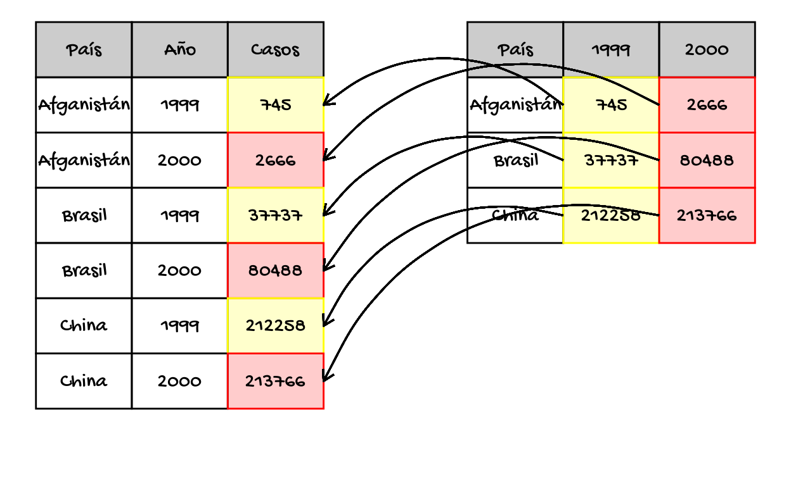  
```

```{r addition_4_3_2_b, exercise = TRUE}

datos_4_a_largo <- pivot_longer(
  data = datos_4_a, # El nombre del conjunto de datos a ordenar.
  cols = c('1999', '2000'), # Argumento donde se indican las columnas que pueden ser una variable.
  names_to = 'Año', # Argumento donde se indica el nombre de la columna a crear a partir de los datos almacenados anteriormente como columna de datos.
  values_to = 'Casos' # Argumento donde se indica el nombre de la columna a crear a partir de los datos almacenados anteriormente como valores de celda.
  )

datos_4_a_largo
```

:::exercise
#### Ejercicio 4.3.1
Teniendo en cuenta el ejemplo planteado anteriormente con la función `pivot_longer()`, por favor intente hacer lo mismo con el siguiente conjunto de datos llamado __datos_4_b__ con el fin obtener la estructura de datos ordenados presentada en la imagen a continuación.
:::

```{r, echo = FALSE, eval = TRUE, message = FALSE}
datos_4_b <- DSR::table5 %>%
  rename('País' = country) %>%
  mutate(País = case_when(
    País == 'Afghanistan' ~ 'Afganistán',
    País == 'Brazil' ~ 'Brasil',
    País == 'China' ~ 'China'
    ))
```

```{r,eval=FALSE}
save(datos_4_b,file = "data_pkg/datos_4_b.rda", compress='xz')
```

```{r addition_4_3_2_c, exercise = TRUE}
datos_4_b
```

```{r, echo = FALSE, eval = TRUE, out.width = "64%", fig.align = "center"}
knitr::include_graphics("images/9na_imagen.png")  
```

```{r exe_4_3_2_c, exercise = TRUE}

```

```{r exe_4_3_2_c-solution}

datos_4_b_largo <- pivot_longer(
  data = datos_4_b,
  cols = c('1999', '2000'),
  names_to = 'Años',
  values_to = 'Población'
  )

datos_4_b_largo
```

```{r exe_4_3_2_c-check}

grade_code("¡Muy bien!, a partir de este cambio cada variable se coloco en su propia columna, cada observación en su propia fila y cada valor en su propia celda.")
```

:::caution
Como se observó, la función `pivot_longer()` hace lo opuesto a `pivot_wider()`. Por lo tanto, ambas funciones son complementarias, es decir, si al resultado de aplicar la función `pivot_wider()` se le aplica la función `pivot_longer()` se llega al conjunto de datos original. Otra observación interesante es que `pivot_longer()` __alarga__ los conjuntos de datos, mientras que `pivot_wider()` los hace más __anchos__.
:::

+ `separate()` y `unite()`

La función `separate()` lo que hace es dividir una columna en múltiples columnas, tomando como separador algún símbolo, mientras que la función `unite()` toma múltiples columnas y las une en una única columna, separando los elementos mediante un separador.

:::example
#### Ejemplo 4.3.3
:::

```{r, echo = FALSE, eval = TRUE, message = FALSE}

datos_3 <- DSR::table3 %>%
  rename('País' = country, 'Año' = year, 'Tasa' = rate) %>%
  mutate(País = case_when(
    País == 'Afghanistan' ~ 'Afganistán',
    País == 'Brazil' ~ 'Brasil',
    País == 'China' ~ 'China'
    ))
```

```{r,eval=FALSE}
save(datos_3,file = "data_pkg/datos_3.rda", compress='xz')
```

```{r addition_4_3_3_a, exercise = TRUE}
datos_3
```

```{r, echo = FALSE, eval = TRUE, out.width = "64%", fig.align = "center"}
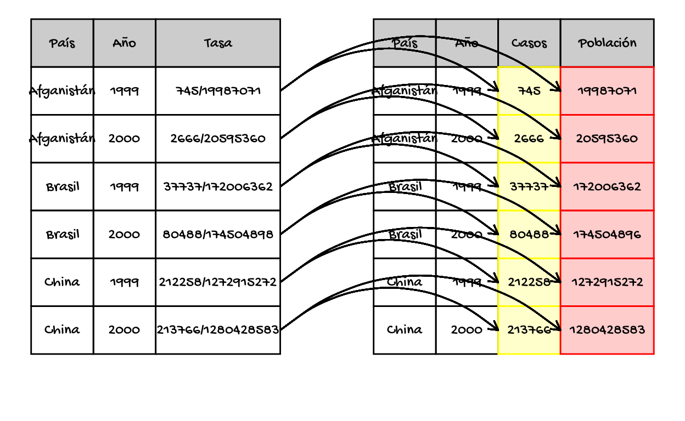  
```

```{r addition_4_3_3_b, exercise = TRUE}
datos_3_separado <- separate(
  data = datos_3, # El nombre del conjunto de datos a ordenar.
  col = Tasa, # Argumento donde se indica el nombre de la columna que se quiere dividir.
  into =  c('Casos', 'Población'), # Argumento donde se indica los nombres de las nuevas variables.
  sep  =  '/'#, # Argumento donde se indica el símbolo que separa las dos variables en una misma columna.
  #convert = TRUE # Opción que permite hacer la conversión de tipo caracter a numérico.
  )

datos_3_separado
```

<!--
Esto puede parecer un lugar extraño para comenzar, pero ordenar datos es la habilidad más fructífera que puedes aprender como científico de datos. Le ahorrará horas de tiempo y hará que sus datos sean mucho más fáciles de visualizar, manipular y modelar con R.
-->

:::exercise
#### Ejercicio de repaso
:::

El siguiente conjunto de datos contiene casos de tuberculosis registrados en distintos años. Dichos datos se encuentran en el _Informe Gobal de Tuberculosis_ de la Organización Mundial de la Salud, disponible para descargar [aquí](https://www.who.int/tb/country/data/download/en/). Este conjunto de datos proporciona un ejemplo realista de datos desordenados.

```{r,eval=TRUE,message=FALSE,echo=FALSE}
data('who')

Tuberculosis <- DSR::who
Tuberculosis
```

La característica más peculiar del anterior conjunto de datos es su sistema de codificación. Las columnas cinco a sesenta codifican cuatro partes de información que separadas significan lo siguiente:

1) Las primeras tres letras de cada columna indican si los casos de tuberculosis corresponden a casos nuevos o antiguos. En este conjunto de datos, cada columna contiene solo nuevos casos.

2) Las siguientes dos letras describen el tipo de caso de tuberculosis:
- `rel` significa casos de recaída,
- `ep` significa casos de tuberculosis extrapulmonar,
- `sn` significa casos de tuberculosis pulmonar que no pudieron ser diagnosticados por un frotis pulmonar (frotis negativo),
- `sp` significa casos de tuberculosis pulmonar que podrían diagnosticarse por un frotis pulmonar (frotis positivo).
  
3) La sexta parte describe el sexo de los pacientes con tuberculosis: `m` para hombres y `f` para mujeres.
  
4) La última parte describe el grupo de edad de los pacientes con tuberculosis. El conjunto de datos agrupa los casos en siete grupos de edad:
- `014` significa pacientes de 0 a 14 años de edad,
- `1524` significa pacientes de 15 a 24 años de edad,
- `2534` representa pacientes de 25 a 34 años de edad,
- `3544` significa pacientes que tienen entre 35 y 44 años,
- `4554` significa pacientes de 45 a 54 años de edad,
- `5564` significa pacientes de 55 a 64 años de edad,
- `65` significa pacientes que tienen 65 años o más.

El ejercicio de repaso propuesto consiste en que haciendo uso de las funciones mecionadas del paquete `tidyr` trate de ordenar el conjunto de datos `Tuberculosis`, e intente obtener un conjunto de datos similar a como se observa en la imagen a continuación.

```{r, echo = FALSE, eval = TRUE, out.width = "64%", fig.align = "center"}
knitr::include_graphics("images/11va_imagen.png")  
```

```{r, eval = FALSE}

save(Tuberculosis, file = 'data_pkg/Tuberculosis.rda', compress='xz')
```

```{r addition_ejercicio, exercise = TRUE}

```

```{r addition_ejercicio-hint, warning = FALSE}

Tuberculosis_2 <- pivot_longer(
  data = ,
  cols = c(),
  names_to = 'codificacion',
  values_to = 'valor'
  )

Tuberculosis_3 <- (
  data = Tuberculosis_2,
  col = codificacion,
  into = c('new', 'type', 'sexage'),
  sep = ' '
  )

Tuberculosis_4 <- separate(
  data = ,
  col = sexage,
  into = c(' ', ' '),
  sep = 1 # Aqui 1 indica el primer elemento dentro de la variable sexage, es decir m o f.
  )

Tuberculosis_5 <- pivot_wider(
  data = Tuberculosis_4,
  names_from = type,
  values_from = Valor
  )
```

```{r addition_ejercicio-solution, warning = FALSE}

Tuberculosis_2 <- pivot_longer(
  data = Tuberculosis,
  cols = c(5:60),
  names_to = 'codificacion',
  values_to = 'valor'
  )

Tuberculosis_3 <- separate(
  data = Tuberculosis_2,
  col = codificacion,
  into = c('new', 'tipo', 'sexage'),
  sep = '_'
  )

Tuberculosis_4 <- separate(
  data = Tuberculosis_3,
  col = sexage,
  into = c('sex', 'age'),
  sep = 1 # Aqui 1 indica el primer elemento dentro de la variable sexage.
  )

Tuberculosis_5 <- pivot_wider(
  data = Tuberculosis_4,
  names_from = tipo,
  values_from = valor
  )
```

## 5. Manipulación/limpieza de datos

### 5.1 Descripción de los datos a usar

En esta parte del curso sobre la __manipulación de datos__ se empleara el conjunto de datos `penguins`, el cual resultó de una investigación donde se examinó el dimorfismo sexual ecológico entre pingüinos del género _Pygoscelis_.

```{r, echo = FALSE, eval = TRUE, out.width = "38%", fig.align = "center"}
knitr::include_graphics("images/Pygoscelis_penguins.png")  
```

<section style="text-align: center;"><small>Ilustracíon hecha por <font color = "black"><u>\@allison_horst</u></font>.</small></section>

#### 5.1.1 Información sobre el conjunto de datos

Descargo de responsabilidad: El conjunto de datos `penguins` hace parte del paquete [palmerpenguins](https://github.com/allisonhorst/palmerpenguins). Este conjunto de datos debe entenderse como datos de muestra para aprender sobre herramientas de manipulación y visualización<!--, y cualquier persona interesada en publicarlos deberá comunicarse previamente con las personas responables de su recopilación-->.

Cita de datos: Gorman KB, Williams TD, Fraser WR (2014) Dimorfismo sexual ecológico y variabilidad ambiental dentro de una comunidad de Pingüinos antárticos (Género _Pygoscelis_). PLoS ONE 9 (3): e90081. https://doi.org/10.1371/journal.pone.0090081

Estructura general de lo datos: A continuación podrá hechar un vistazo de la estructura del conjunto de datos `penguins`:

```{r datos_pinguinos, exercise = TRUE}

palmerpenguins::penguins
```

  1) En `species`podrá encontrar las tres especies existentes del genéro de pingüinos _Pygoscelis_.

  2) En `island` podrá encontrar el nombre de las islas donde fueron ubicadas las colonias de pingüinos.

<div class="row">
  <div class="col-md-6" markdown="1">
  3) En `culmen_length_mm` se registró la longitud del culmen (margen superior del pico) de las tres especies de pingüinos.
  
  4) En `culmen_depth_mm` se registró la profundidad del culmen de las tres especies de pingüinos.
  </div>
  <div class="col-md-6" markdown="1">
```{r, echo = FALSE, eval = TRUE, out.width = "38%", fig.align = "center"}
knitr::include_graphics("images/culmen_penguins.png")
```

<section style="text-align: center;"><small>Ilustracíon hecha por <font color = "black"><u>\@allison_horst</u></font>.</small></section>
  </div>
</div>

  5) En `flipper_length_mm` se registró la longitud de la aleta de las tres especies de pingüinos.

  6) En `body_mass_g` se registró la masa corporal de cada uno de los pingüinos.

  7) En `sex` podrá encontrar la información sobre el sexo (FEMALE para hembras y MALE para machos) de cada uno de los pingüinos.

### 5.2 Manipulación de datos con `dplyr`

Se suele decir que la manipulación y la limpieza de los datos suele ocupar un 80% del tiempo en el análisis de datos. También es sabido que esta no es una experiencia alegre. Sin embargo, existen herramientas disponibles que ayudan en esta tarea.

El paquete `dplyr` es un paquete que permite obtener partes de los datos de una manera rápida, fácil de entender y fácil de replicar. Aprender y usar este paquete hará del proceso de manipulación y limpieza de datos una tarea más agradable. <!-- Este paquete está escrito en C++, por lo cual las funciones que provee permiten hacer operaciones más rápido que su equivalente del paquete base.-->

```{r, echo = FALSE, eval = TRUE, out.width = "54%", fig.align = "center"}
knitr::include_graphics("images/tidyverse_war.jpg")  
```

<section style="text-align: center;"><small>Ilustracíon hecha por <font color = "black"><u>\@allison_horst</u></font>.</small></section>

#### 5.2.1 Una gramática para la manipulación de datos

El paquete `dplyr` tiene como objetivo proporcionar una función para cada verbo básico de la manipulación de datos. Estos verbos se pueden organizar en tres categorías según el componente del conjunto de datos sobre el que trabajan:

<div class="row">
  <div class="col-md-4" markdown="1">
1) Filas:
  + `filter()`.
  + `slice()`.
  + `arrange()`.

2) Columnas:
  + `select()`.
  + `rename()`.
  + `mutate()`.
  + `relocate()`.

3) Grupos de filas y columnas:
  + `summarise()`.
</div>
  <div class="col-md-8" markdown="1">
```{r, echo = FALSE, eval = TRUE, out.width = "70%", fig.align = "center"}
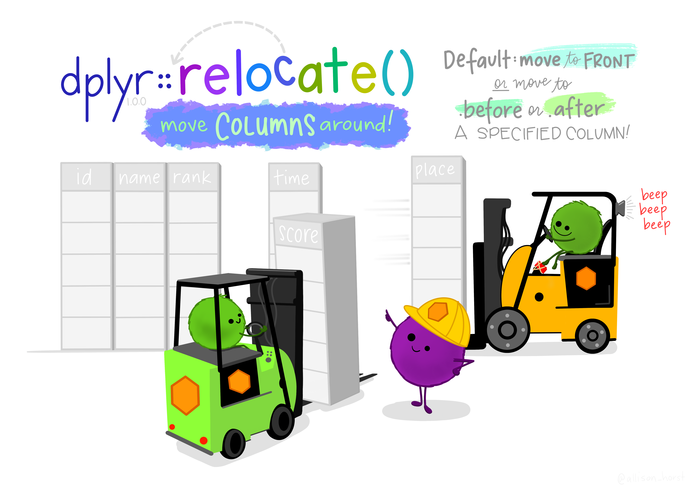  
```

<section style="text-align: center;"><small>Ilustracíon hecha por <font color = "black"><u>\@allison_horst</u></font>.</small></section>
  </div>
</div>

##### 5.2.1.1 Filtrar filas con `filter()`

La función `filter()` permite elegir y extraer filas que satisfacen ciertas condiciones. La sintaxis general de `filter()` es: `filter(dataset, condition)`.

+ Filtrar filas basado en coincidencias exactas de variables de tipo carácter

Si desea seleccionar un grupo específico de valores de una variable de tipo carácter, se puede usar el operador de comparación `==`.

:::example
#### Ejemplo 5.2.1.1.1
:::

```{r, echo = FALSE, eval = TRUE, out.width = "64%", fig.align = "center"}
knitr::include_graphics("images/12va_imagen.png")  
```

```{r ejemplo_5_2_1_1_1, exercise = TRUE}

filter(
  .data = penguins,
  species == 'Adelie',
  island == 'Dream'
  )
```

:::caution
Si bien en el ejemplo se uso el operador de comparación igual a (`==`), se pueden utilizar otros operadores. Por ejemplo, `filter(.data = penguins, species != 'Adelie')`, seleccionará todas las filas diferentes de (`!=`) Adelie.
:::

+ Filtrar filas basado en variables numéricas

Si desea filtrar variables numéricas en función de sus valores, puede hacerlo por medio de los operadores `>`, `>=`, `<`, `<=`, `==` y `!=`.

:::example
#### Ejemplo 5.2.1.1.2
:::

```{r ejemplo_5_2_1_1_2_a, exercise = TRUE}
filter(
  .data = penguins,
  body_mass_g < 4400
  )
```

```{r ejemplo_5_2_1_1_2_b, exercise = TRUE}

filter(
  .data = penguins,
  body_mass_g <= 4400,
  body_mass_g >= 3800
  )

filter(
  .data = penguins,
  between(body_mass_g, 3800, 4400)
  )
```

+ Filtrar filas vacías

Para filtrar filas vacías se puede usar la función `is.na()` dentro de `filter()`.

:::example
#### Ejemplo 5.2.1.1.3
:::

```{r ejemplo_5_2_1_1_3, exercise = TRUE}

filter(
  .data = penguins,
  !is.na(culmen_length_mm)
  )
```

#### 5.2.1.2 Elegir filas usando su posición con `slice()`

La función `slice()` permite indexar filas por sus ubicaciones dentro del conjunto de datos. Esta permite seleccionar, eliminar y duplicar filas.

:::example
#### Ejemplo 5.2.1.2.1
:::

```{r, echo = FALSE, eval = TRUE, out.width = "64%", fig.align = "center"}
knitr::include_graphics("images/13va_imagen.png")  
```

```{r ejemplo_5_2_1_2_1_a, exercise = TRUE}

slice(
  .data = penguins,
  c(1:4)
  )
```

```{r ejemplo_5_2_1_2_1_b, exercise = TRUE}

slice_head(
  .data = penguins,
  n = 4
  )

slice_tail(
  .data = penguins,
  n = 4
  )
```

```{r ejemplo_5_2_1_2_1_c, exercise = TRUE}

slice_sample(
  .data = penguins,
  n = 4
  )
```

```{r ejemplo_5_2_1_2_1_d, exercise = TRUE}

slice_min(
  .data = penguins,
  culmen_depth_mm, n = 4
  )

slice_max(
  .data = penguins,
  body_mass_g, n = 4
  )
```

#### 5.2.1.3 Organizar filas con `arrange()`

La función `arrange()` permite reordenar las filas un conjunto de datos en función del valor de una determinada variable. Esto puede ser útil si se desea ver rápidamente qué mediciones tuvieron los valores más altos o más bajos.

:::example
#### Ejemplo 5.2.1.3.1
:::

```{r, echo = FALSE, eval = TRUE, out.width = "64%", fig.align = "center"}
knitr::include_graphics("images/14va_imagen.png")  
```

```{r ejemplo_5_2_1_3_1_b, exercise = TRUE}

arrange(
  .data = penguins,
  desc(culmen_depth_mm)
  )
```

```{r ejemplo_5_2_1_3_1_a, exercise = TRUE}

arrange(
  .data = penguins,
  culmen_depth_mm
  )
```

:::caution
Al usar la función `arrange()` siempre se pondrán los valores de `NA` al final del conjunto de datos.
:::

#### 5.2.1.4 Seleccionar columnas con `select()`

La función `select()` permite elegir y extraer columnas de interés de un conjunto de datos.

:::example
#### Ejemplo 5.2.1.4.1
:::

```{r, echo = FALSE, eval = TRUE, out.width = "64%", fig.align = "center"}
knitr::include_graphics("images/15va_imagen.png")  
```

```{r ejemplo_5_2_1_4_1, exercise = TRUE}

select(
  .data = penguins,
  species,
  culmen_length_mm,
  culmen_depth_mm,
  body_mass_g
  )

select(
  .data = penguins,
  species,
  culmen_length_mm:culmen_depth_mm,
  body_mass_g
  )

select(
  .data = penguins,
  -island,
  -flipper_length_mm,
  -sex
  )

select(
  .data = penguins,
  -(species:sex),
   species,
   culmen_length_mm,
   culmen_depth_mm,
   body_mass_g
  )
```

+ Seleccionar columnas basadas en nombres parciales de columnas

Si se tiene una gran cantidad de columnas o variables con una estructura similar, se puede utilizar la concordancia parcial mediante la adición de `starts_with()`, `ends_with()` o `contains()` en la sentencia de selección.

:::example
#### Ejemplo 5.2.1.4.2
:::

```{r ejemplo_5_2_1_4_2, exercise = TRUE}

select(
  .data = penguins,
  starts_with('culmen')
  )

select(
  .data = penguins,
  ends_with('mm')
  )

select(
  .data = penguins,
  contains('length')
  )
```

+ Seleccionar columnas basadas en columnas preidentificadas

Puede identificar el nombre de las columnas inicialmente, y luego referirse a ellas dentro de la función `select()` por medio de la función `one_of()` o utilizando el operador `!!`.

:::example
#### Ejemplo 5.2.1.4.3
:::

```{r ejemplo_5_2_1_4_3, exercise = TRUE}

variables_cualitativas <- c('species', 'island', 'sex')

select(
  .data = penguins,
  one_of(variables_cualitativas)
  )

select(
  .data = penguins,
  !!variables_cualitativas
  )
```

+ Seleccionar columnas por su tipo de dato

La función `select_if()` permite seleccionar columnas en base a su tipo de dato. Para esto, se puede emplear las funciones `is.character()`, `is.numeric()`, `is.integer()`, `is.double()`, `is.logical()`, `is.factor()`.

:::example
#### Ejemplo 5.2.1.4.4
:::

```{r ejemplo_5_2_1_4_4, exercise = TRUE}

select_if(
  penguins,
  is.factor
  )

select_if(
  penguins,
  ~!is.numeric(.)
  )
```

:::exercise
#### Ejercicio 5.2.1.4.1

En el ejemplo anterior se seleccionaron solo las columnas o variables cuyo valor es de tipo distinto al numérico. Intente por favor seleccionar esta vez aquellas columnas o variables numéricas.
:::

```{r ejercicio_5_2_1_4_4, exercise = TRUE}

```

```{r ejercicio_5_2_1_4_4-solution, warning = FALSE}

select_if(
  penguins,
  is.numeric
  )

select_if(
  penguins,
  ~!is.factor(.)
  )
```

```{r ejercicio_5_2_1_4_4-check}

grade_code("¡Muy bien! Sigue así y lograras grandes avances.")
```

+ Uso de `select()` para renombrar columnas

Puede cambiar el nombre de las columnas o variables con la función `select()`.

:::example
#### Ejemplo 5.2.1.4.5
:::

```{r ejercicio_5_2_1_4_5, exercise = TRUE}

select(
  .data = penguins,
  gender = sex
  )
```

#### 5.2.1.5 Cambiar el nombre de las columnas con `rename()`

La función `rename()` permite cambiar los nombres de las columnas o variables.

:::example
#### Ejemplo 5.2.1.5.1
:::

```{r, echo = FALSE, eval = TRUE, out.width = "64%", fig.align = "center"}
knitr::include_graphics("images/16va_imagen.png")  
```

```{r ejemplo_5_2_1_5_1, exercise = TRUE}

rename(
  .data = penguins,
  gender = sex
  )
```

#### 5.2.1.6 Agregar nuevas columnas con `mutate()`

A menudo es útil agregar nuevas variables o columnas que son funciones de las ya existentes. Esto se puede hacer por medio de la función `mutate()`.

:::example
#### Ejemplo 5.2.1.6.1
:::

```{r, echo = FALSE, eval = TRUE, out.width = "64%", fig.align = "center"}
knitr::include_graphics("images/17va_imagen.png")  
```

```{r ejemplo_5_2_1_6_1_a, exercise = TRUE}

mutate(
  .data = penguins,
  body_mass_kg = body_mass_g / 1000
  )

transmute(
  .data = penguins,
  body_mass_kg = body_mass_g / 1000
  )
```

```{r ejemplo_5_2_1_6_1_b, exercise = TRUE}

mutate(
  .data = penguins,
  body_mass_g_VS_prom_body_mass = body_mass_g - round(mean(body_mass_g, na.rm = TRUE), digits = 1),
  body_mass_g_VS_min_body_mass = body_mass_g - min(body_mass_g, na.rm = TRUE)
  )
```

+ Recodificación de columnas cualitativas

Para cambiar el nombre de los valores de las columnas o variables cualitativas, se puede usar la función `recode()` dentro de la función `mutate()`.

:::example
#### Ejemplo 5.2.1.6.2
:::

```{r ejemplo_5_2_1_6_2, exercise = TRUE}

mutate(
  .data = penguins,
  sex_2 = recode(
    .x = sex,
    'FEMALE' = 'Hembra',
    'MALE' = 'Macho'
    )
  )
```

+ Crear nuevas columnas cualitativas

Si desea convertir una columna numérica en una columna o variable cualitativa, puede hacer uso de la función `case_when()`.

:::example
#### Ejemplo 5.2.1.6.3
:::

```{r ejemplo_5_2_1_6_3, exercise = TRUE}

mutate(
  .data = penguins,
  body_mass_2 = case_when(
    body_mass_g < 3400 ~ 'Liviano',
    body_mass_g >= 3400 & body_mass_g <= 4400 ~ 'Normal',
    body_mass_g > 4400 ~ 'Pesado'
    )
  )
```

#### 5.2.1.7 Cambiar el orden de las columnas con `relocate()`

Una forma fácil de cambiar el orden de las columnas en el conjunto de datos es mediante el uso de la función `relocate()`.

:::example
#### Ejemplo 5.2.1.7.1
:::

```{r, echo = FALSE, eval = TRUE, out.width = "64%", fig.align = "center"}
knitr::include_graphics("images/18va_imagen.png")  
```

```{r ejemplo_5_2_1_7_1, exercise = TRUE}

relocate(
  .data = penguins,
  species:sex,
  .before = culmen_length_mm
  )
```

:::exercise
#### Ejercicio 5.2.1.7.1

En el ejemplo anterior la columna `culmen_length_mm` se movio hacia la última columna por medio de la función `.before()`. Intente por favor haciendo uso de la función `.after()` mover esa misma columna para que sea la primera columna.
:::

```{r ejercicio_5_2_1_7_1, exercise = TRUE}

```

```{r ejercicio_5_2_1_7_1-solution, warning = FALSE}

relocate(
  .data = penguins,
  species:sex,
  .after = culmen_length_mm
  )
```

#### 5.2.1.8 Resumir valores con `summarise()`/`summarize()` y `group_by()`

La función `summarise()` (o `summarize()`) permite obtener un nuevo conjunto de datos el cual contiene un resumen de una determinada columna, calculando un valor único de los múltiples valores en esa columna.

:::example
#### Ejemplo 5.2.1.8.1
:::

```{r ejemplo_5_2_1_8_1_a, exercise = TRUE}

summarise(
  .data = penguins,
  Prom_length = round(mean(culmen_length_mm, na.rm = TRUE), digits = 2),
  Prom_depth = round(mean(culmen_depth_mm, na.rm = TRUE), digits = 2)
  )

Promedio <- function(x){
  x = na.omit(x)
  Suma = sum(x)
  Total = length(x)
  Media = Suma/Total
  print(Media)
  }


summarise(
  .data = penguins,
  Prom_length = Promedio(culmen_length_mm),
  Prom_depth = Promedio(culmen_depth_mm)
  )
```

Usar la función `summarise()` puede ser útil por sí sola, pero es aún más útil cuando se usa para saber las diferencias entre grupos. Para hacer esto, se puede combinar con la función `group_by()`.

:::example
#### Ejemplo 5.2.1.8.2
:::

```{r, echo = FALSE, eval = TRUE, out.width = "64%", fig.align = "center"}
knitr::include_graphics("images/19va_imagen.png")  
```

```{r ejemplo_5_2_1_8_1_b, exercise = TRUE, message = FALSE}

Grupos <- group_by(
  .data = penguins,
  species
  )
Grupos

summarise(
  .data = Grupos,
  Prom_lenght = round(mean(culmen_length_mm, na.rm = TRUE), digits = 2),
  Prom_depth = round(mean(culmen_depth_mm, na.rm = TRUE), digits = 2)
  )
```

:::caution
La agrupación permite comparar rápidamente diferentes subconjuntos de los datos. La agrupación permite enmarcar la pregunta de análisis en términos de comparar grupos de observaciones, en lugar de observaciones individuales. Esta forma hace que sea más fácil hacer y responder preguntas complejas sobre los datos.
:::

#### 5.2.1.9 Resumir valores con `summarise()`/`summarize()` y `across()`

A menudo es útil realizar la misma operación en varias columnas. La función `across()` permite realizar esto.

:::example
#### Ejemplo 5.2.1.9.1
:::

```{r, echo = FALSE, eval = TRUE, out.width = "64%", fig.align = "center"}
knitr::include_graphics("images/20va_imagen.png")  
```

```{r ejemplo_5_2_1_9_1, exercise = TRUE, message = FALSE}

summarise(
  .data = penguins,
  across(
    .cols = c(culmen_length_mm, culmen_depth_mm, flipper_length_mm),
    .fns = mean,
    na.rm = TRUE
    )
  )

summarise(
  .data = penguins,
  across(
    .cols = ends_with('mm'),
    .fns = mean,
    na.rm = TRUE
    )
  )

summarise(
  .data = penguins,
  across(
    .cols = where(is.numeric),
    .fns = mean,
    na.rm = TRUE
    ),
  across(
    .cols = where(is.factor),
    .fns = nlevels
    )
  )
```

#### 5.2.1.10 Realización de operaciones secuenciales con `%>%`

Un enfoque para realizar análisis de datos complejos consiste en crear objetos intermedios para usar en dicho análisis. Este es un flujo de trabajo muy común.

:::example
#### Ejemplo 5.2.1.10.1
:::

```{r ejemplo_5_2_1_10_1_a, exercise = TRUE, message = FALSE}

a1 <- rename(
  .data = penguins,
  gender = sex
  )
a2 <- filter(
  .data = a1,
  gender == 'FEMALE'
  )
a3 <- mutate(
  .data = a2,
  body_mass_kg = body_mass_g / 1000
)

mutate(
  filter(
    rename(
      .data = penguins,
      gender = sex
      ),
    gender == 'FEMALE'
    ),
  body_mass_kg = body_mass_g / 1000
  )
```

Para solucionar el problema que puede resultar del enfoque anterior, el paquete `dplyr` proporciona el operador de tubería (`%>%`). El `%>%` es un operador que permite encadenas funciones. Lo que hace es tomar la salida de una función y pasarla como entrada de la siguiente función.

:::example
#### Ejemplo 5.2.1.10.2
:::

```{r, echo = FALSE, eval = TRUE, out.width = "64%", fig.align = "center"}
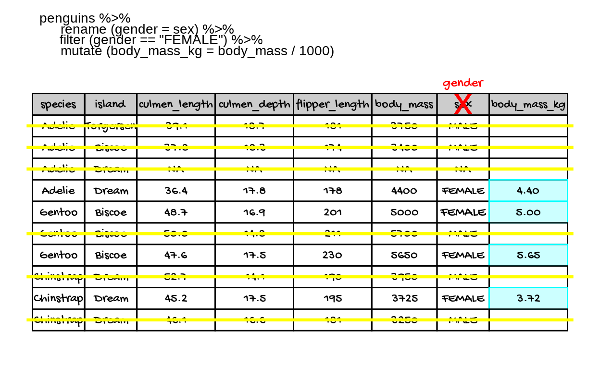  
```

```{r ejemplo_5_2_1_10_1_b, exercise = TRUE}

Peso_fem_kg <- penguins %>%
  rename(gender = sex) %>%
  filter(gender == 'FEMALE') %>%
  mutate(body_mass_kg = body_mass_g / 1000)
Peso_fem_kg
```

:::exercise
#### Ejercicio 5.2.1.10.1
Intente por favor calcular el valor medio de la longitud de la aleta (`flipper_length_mm`) de las tres especies de pinguinos del conjunto de datos `penguins`, pero que sean solo de sexo (`sex`) macho (`MALE`).
:::

```{r ejercicio_5_2_1_10_1, exercise = TRUE}


```

```{r ejercicio_5_2_1_10_1-solution, message = FALSE}

penguins %>%
  filter(sex == 'MALE') %>%
  summarise(
    across(
      .cols = flipper_length_mm,
      .fns = mean,
      na.rm = TRUE
      )
  )
```

#### 5.2.1.11 Unir conjuntos de datos con `_join()`

A menudo los datos se pueden almacenar en múltiples conjuntos de datos. En algún momento se querrá acceder a la información de dichos conjuntos de datos, por lo cual necesitará una forma de poder combinarlos. A este proceso se le denomina unión (__join__) por la sencilla razón de que unira dichos conjuntos de datos.

El paquete `dplyr` cuenta con un conjunto de funciones de combinación para realizar este procedimiento.

```{r, echo = FALSE, eval = TRUE, message = FALSE}

Datos_a <- tribble(
  ~ID , ~x1,
  '1', 'a1',
  '2', 'a2'
  )

Datos_b <- tribble(
  ~ID , ~x2,
  '2', 'b1',
  '3', 'b2'
  )
```

```{r, eval = FALSE}

save(Datos_a, file = 'data_pkg/Datos_a.rda', compress='xz')
save(Datos_b, file = 'data_pkg/Datos_b.rda', compress='xz')
```

<div class="row">
  <div class="col-md-6" markdown="1">
```{r, echo = FALSE, eval = TRUE, message = FALSE}

Datos_a %>%
  kable() %>% 
  kable_styling(full_width = FALSE,
                bootstrap_options = (c('striped', 'bordered')))
```
  </div>
  <div class="col-md-6" markdown="1">
```{r, echo = FALSE, eval = TRUE, message = FALSE}

Datos_b %>%
  kable() %>% 
  kable_styling(full_width = FALSE,
                bootstrap_options = (c('striped', 'bordered')))
```
  </div>
</div>

+ `inner_join()`

Esta unión retorna todas las columnas del primer y segundo conjunto de datos, pero solo retorna las filas del primer conjunto de datos que coinciden con el segundo conjunto de datos.

:::example
#### Ejemplo 5.2.1.11.1
:::

```{r, echo = FALSE, eval = TRUE, out.width = "48%", fig.align = "center"}
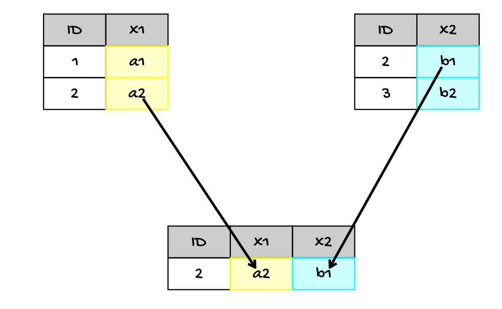  
```

```{r ejemplo_5_2_1_11_1, exercise = TRUE}

inner_join(
  x = Datos_a,
  y = Datos_b,
  by = 'ID'
  )
```

:::caution
Generalmente, las uniones llevadas a cabo usando la función `inner_join()` no son apropiadas para su uso en el análisis de datos dado que es muy fácil perder observaciones.
:::

+ `left_join()`

Esta unión retorna todas las columnas del primer y segundo conjunto de datos, pero solo retorna las filas del conjunto de datos que se especifica en `x` como argumento.

:::example
#### Ejemplo 5.2.1.11.2
:::

```{r, echo = FALSE, eval = TRUE, out.width = "48%", fig.align = "center"}
knitr::include_graphics("images/23va_imagen.png")  
```

```{r ejemplo_5_2_1_11_2, exercise = TRUE}

left_join(
  x = Datos_a,
  y = Datos_b,
  by = 'ID'
  )
```

+ `right_join()`

Esta función es opuesta a la función `left_join()`, en el sentido de que solo retorna las filas del conjunto de datos que se especifica en `y` como argumento.

:::example
#### Ejemplo 5.2.1.11.3
:::

```{r, echo = FALSE, eval = TRUE, out.width = "48%", fig.align = "center"}
knitr::include_graphics("images/24va_imagen.png")  
```

```{r ejemplo_5_2_1_11_3, exercise = TRUE}

right_join(
  x = Datos_a,
  y = Datos_b,
  by = 'ID'
  )
```

+ `full_join()`

Esta unión retorna toda las columnas y filas de ambos conjunto de datos. De esta forma, retorna una fila para cualquier observación independiente si coinciden o no.

:::example
#### Ejemplo 5.2.1.11.4
:::

```{r, echo = FALSE, eval = TRUE, out.width = "48%", fig.align = "center"}
knitr::include_graphics("images/25va_imagen.png")  
```

```{r ejemplo_5_2_1_11_4, exercise = TRUE}

full_join(
  x = Datos_a,
  y = Datos_b,
  by = 'ID'
  )
```

:::caution
Si deseas ver un resumen de las posibilidades que ofrece el paquete `dplyr` y profundizar más en su uso, puedes mirar su hoja de trucos [aquí](https://github.com/Leo4Luffy/Un_curso_amigable_sobre_R/blob/master/Documentos/cheat_sheet_dplyr.pdf).
:::

## 6. Visualización de datos

### 6.1 ¿Que es la visualización de datos? Definición e importancia

La __visualización de datos__ es la práctica de convertir datos en una representación gráfica. Para comprender cuán significativa es la visualización de los datos, un hecho simple es que a los cerebros humanos les resulta más difícil comprender datos complejos cuando están codificados en números y texto en comparación con los gráficos.

Es impensable cualquier sector profesional sin el uso de elementos de visualización, pues estos facilitan la transmisión de información. De las misma forma, es erróneo considerar a la visualización de datos como un recurso secundario o adicional, finalmente prescindible.

:::caution
El concepto de visualización de datos no es nuevo. De hecho, la visualización de datos ha existido durante siglos. [Aquí](https://jorge-leonardo-lopez-martinez.shinyapps.io/historia_visualizacion/?_ga=2.152978873.160297420.1593535028-503089247.1593365860) podrás encontrar una visualización que corresponde a una línea de tiempo sobre el desarrollo de los gráficos estadísticos.
:::

<div class="row">
  <div class="col-md-6" markdown="1">
### 6.2 Visualización de datos con `ggplot2`

`ggplot2` es un paquete de `R` dedicado a la visualización de datos. Mediante su uso es posible construir casi cualquier tipo de gráfico.

Si bien `ggplot2` es un paquete de `R` que permite producir gráficos estadísticos como muchos otros paquetes, es diferente a la mayoría de estos paquetes de gráficos debido a que tiene una gramárica subyacente profunda: la __gramática de los gráficos__.
  </div>
  <div class="col-md-6" markdown="1">
```{r, echo = FALSE, eval = TRUE, out.width = "70%", fig.align = "center"}
knitr::include_graphics("images/ggplot2_3.png")  
```

<section style="text-align: center;"><small>Ilustracíon hecha por <font color = "black"><u>\@allison_horst</u></font>.</small></section>
  </div>
</div>

#### 6.2.1 Una gramática para la visualización de datos

Una gramática de gráficos es un marco que sigue un enfoque en capas para describir y construir visualizaciones o gráficos de manera estructurada.

```{r, echo = FALSE, eval = TRUE, out.width = "48%", fig.align = "center"}
knitr::include_graphics("images/26va_imagen.png")  
```

Para explicar el concepto de la gramática de gráficos en capas implementado en el paquete `ggplot2` se empleara el conjunto de datos [`pokemon`](https://github.com/cienciadedatos/datos-de-miercoles/tree/master/datos/2019/2019-07-10). Estos datos es uno de los muchos conjuntos de datos del proyecto [_Datos de miércoles_](https://github.com/cienciadedatos/datos-de-miercoles) cuyo propósito consiste en buscar que lo usuarios de `R` desarrollen habilidades de visualización y procesado de datos usando las herramientas del `tidyverse`.

```{r, echo = FALSE, eval = TRUE, out.width = "54%", fig.align = "center"}
knitr::include_graphics("images/27va_imagen.png")  
```

Como puedes ver, este conjunto de datos contiene siete variables:

1. En `id` se describe la identificación de cada pokémon.
2. En `nombre` podrá encontrar el nombre del pokémon.
3. En `tipo` se describe el tipo de pokémon (eléctrico, agua, veneno, fantasma, hielo, psíquico, entre otros).
4. En `ataque` podrá encontrar el daño que el pokémon puede causar en ataques.
5. En `defensa` podrá encontrar la resistencia del pokémon al daño ante ataques.
6. En `velocidad` se describe la velocidad del pokémon al atacar en cada ronda.
7. En `puntos_vida` se describe la cantidad de daño que puede resistir cada pokémon.

```{r, eval = FALSE}

pokemon <- readr::read_csv("https://raw.githubusercontent.com/cienciadedatos/datos-de-miercoles/master/datos/2019/2019-07-10/pokemon.csv")

pokemon <- pokemon %>%
  mutate(ataque = ataque + fuerza_especial_ataque, defensa = defensa + fuerza_especial_defensa) %>%
  select(ID_poke, nombre_ingles, tipo_1, ataque, defensa, velocidad, puntos_vida) %>%
  rename('id' = ID_poke, 'nombre' = nombre_ingles, 'tipo' = tipo_1) 
  #filter(nombre %in% c('Charmander', 'Bulbasaur', 'Butterfree', 'Pikachu', 'Squirtle'))

save(pokemon, file = 'data_pkg/pokemon.rda', compress='xz')

pokemon_2 <- pokemon %>%
  select(nombre_ingles, tipo_2) %>%
  rename('nombre' = nombre_ingles, 'tipo_2' = tipo_2)

save(pokemon_2, file = 'data_pkg/pokemon_2.rda', compress='xz')
```

##### 6.2.1.1 Capas 1-2-3: datos-estética-geometrías

Estas son las capas que determinan la representación visual de los datos. Para asociar el gráfico a un conjunto de datos en específico se emplea el argumento `data`. Luego se define un mapeo haciendo uso de la función `aes()` dentro de `ggplot()` para seleccionar las variables a graficar. Por último, con `geoms` se indica cómo se representaran los datos en el gráfico.

:::example
#### Ejemplo 6.2.1.1.1
:::

```{r ejemplo_6_2_1_1_1, exercise = TRUE, fig.align = "center"}

pokemon <- pokemon %>%
  mutate(
    fuerza_total = ataque + defensa + velocidad + puntos_vida
    )

ggplot(
  data = pokemon,
  aes(x = ataque, y = fuerza_total)
  ) +
  geom_point()

#ggplot(
  #data = pokemon,
  #aes(x = ataque, y = fuerza_total)
  #) +
  #geom_point(
    #size = 3.4,
    #colour = 'yellow',
    #fill = 'yellow',
    #alpha = 0.4,
    #shape = 'square filled'
    #)
```

<details><summary>Lista de colores en `R` y formas de puntos</summary>

```{r, echo = FALSE, eval = TRUE, out.width = "54%", fig.align = "center"}

knitr::include_graphics("images/colores_1.png")  
```

```{r, echo = FALSE, eval = TRUE, out.width = "54%", fig.align = "center"}

knitr::include_graphics("images/colores_2.png")  
```

```{r, echo = FALSE, eval = TRUE, out.width = "54%", fig.align = "center"}

knitr::include_graphics("images/colores_3.png")  
```

```{r, echo = FALSE, eval = TRUE, out.width = "54%", fig.align = "center"}

knitr::include_graphics("images/colores_4.png")  
```

```{r, echo = FALSE, eval = TRUE, out.width = "54%", fig.align = "center"}

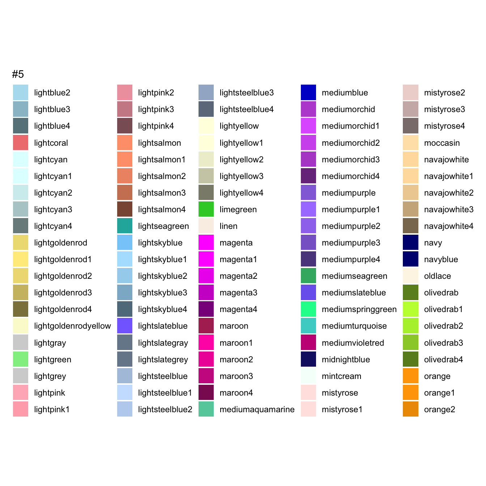  
```

```{r, echo = FALSE, eval = TRUE, out.width = "54%", fig.align = "center"}

knitr::include_graphics("images/colores_6.png")  
```

```{r, echo = FALSE, eval = TRUE, out.width = "54%", fig.align = "center"}

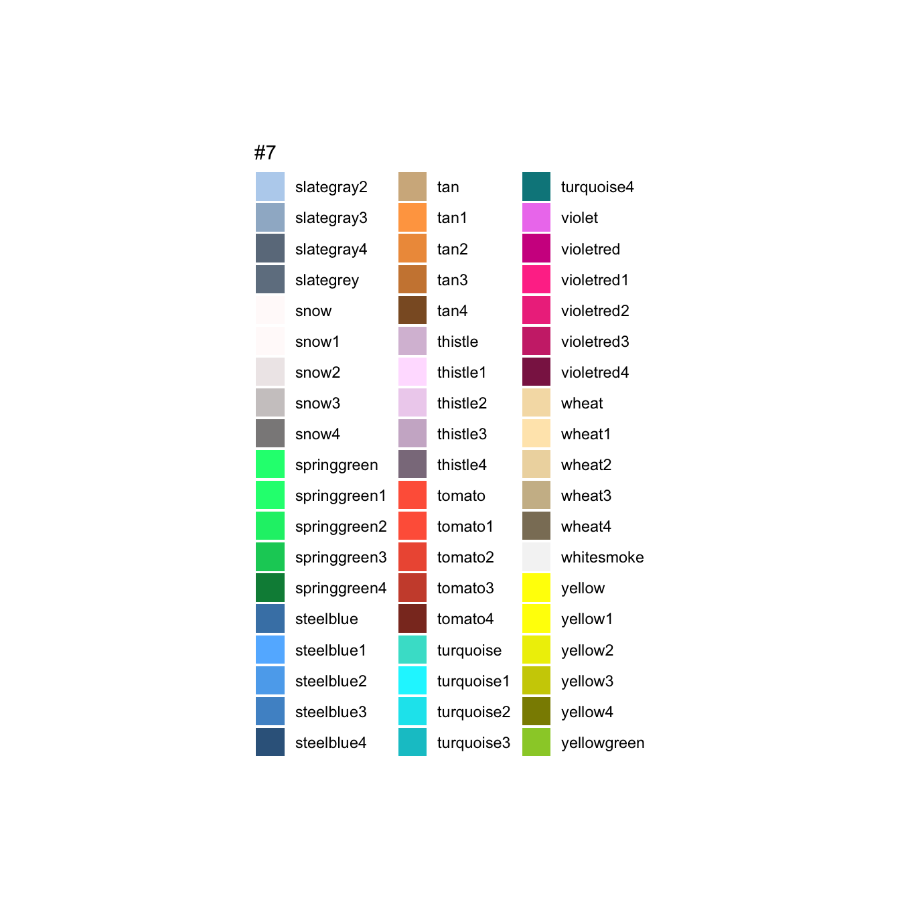  
```

```{r, echo = FALSE, eval = TRUE, out.width = "54%", fig.align = "center"}

knitr::include_graphics("images/puntos.png")  
```

</details>

:::exercise
#### Ejercicio 6.2.1.1.1
En el ejemplo anterior se uso la función `aes()` para indicarle al `geom_point()` cuáles serían las posiciones `x` y `y` para cada punto. Sin embargo otra propiedad estetica que se puede modificar es el color de los puntos por medio del argumento `colour`. Intente por favor modificar el código anterior de modo que se coloreen los puntos de acuerdo al tipo de pokemon.
:::

```{r ejercicio_6_2_1_1_1, exercise = TRUE, fig.align = "center"}

pokemon <- pokemon %>%
  mutate(
    fuerza_total = ataque + defensa + velocidad + puntos_vida
    )
```

```{r ejercicio_6_2_1_1_1-solution, message = FALSE}

ggplot( # Primera forma
  data = pokemon,
  aes(x = ataque, y = fuerza_total, colour = tipo, fill = tipo)
  ) +
  geom_point()
  
ggplot( # Segunda forma
  data = pokemon,
  aes(x = ataque, y = fuerza_total)
  ) +
  geom_point(aes(colour = tipo, fill = tipo))
```

:::caution
Las asignaciones estéticas, definidas con la función `aes()`, describen cómo las variables se asignan a propiedades visuales o estéticas. Además de una posición horizontal (`x`) y vertical (`y`), cada punto puede tener también un tamaño (`size`), un color (`colour` y `fill`) y una forma (`shape`).
:::

##### 6.2.1.2 Capa 4: facetas

Las facetas son una de las capas más importantes para construir una visualización de datos efectiva. Las facetas consisten de múltiples gráficos de lado a lado utilizados para mostrar los niveles de una variable categórica. Hay dos tipos de facetado:

<div class="row">
  <div class="col-md-6" markdown="1">
+ `facet_wrap()`

```{r, echo = FALSE, eval = TRUE, out.width = "94%", fig.align = "center"}
knitr::include_graphics("images/29va_imagen.png")  
```
  </div>
  <div class="col-md-6" markdown="1">

+ `facet_grid()`

```{r, echo = FALSE, eval = TRUE, out.width = "94%", fig.align = "center"}
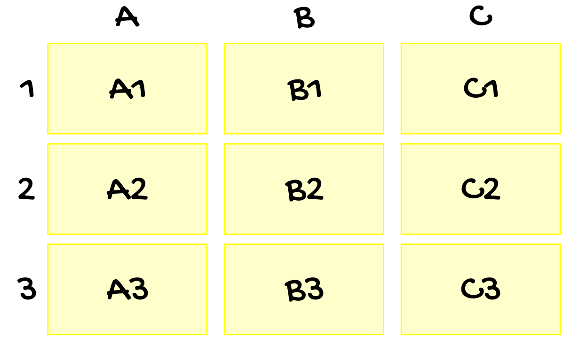  
```
  </div>
</div>

:::example
#### Ejemplo 6.2.1.2.1
:::

```{r ejemplo_6_2_1_2_1, exercise = TRUE, fig.align = "center"}

pokemon <- pokemon %>%
  mutate(
    fuerza_total = ataque + defensa + velocidad + puntos_vida
    )

ggplot(
  data = pokemon,
  aes(x = ataque, y = fuerza_total, colour = tipo, fill = tipo)
  ) +
  geom_point() #+
  #facet_wrap(~ tipo)

#ggplot(
  #data = pokemon,
  #aes(x = ataque, y = fuerza_total, colour = tipo, fill = tipo)
  #) +
  #geom_point() +
  #facet_wrap(~ tipo, ncol = 3, dir = 'h') # "h" de horizontal.

#ggplot(
  #data = pokemon,
  #aes(x = ataque, y = fuerza_total, colour = tipo, fill = tipo)
  #) +
  #geom_point() +
  #facet_wrap(~ tipo, nrow = 6, dir = 'v') # "v" de vertical.
```

:::example
#### Ejemplo 6.2.1.2.2
:::

```{r ejemplo_6_2_1_2_2, exercise = TRUE, fig.align = "center"}

pokemon_2 <- pokemon %>%
  mutate(
    fuerza_total = ataque + defensa + velocidad + puntos_vida
    ) %>%
  inner_join(pokemon_2, 'nombre')
pokemon_2

#ggplot(
  #data = pokemon_2,
  #aes(x = ataque, y = fuerza_total)
  #) +
  #geom_point() +
  #facet_grid(tipo ~ tipo_2)

#ggplot(
  #data = pokemon_2,
  #aes(x = ataque, y = fuerza_total)
  #) +
  #geom_point() +
  #facet_grid(vars(tipo), vars(tipo_2))
```

##### 6.2.1.3 Capa 5: estadísticas

La capa 5 de estadísticas (`stat_`), permite presentar resumenes estadísticos dentro de los gráficos por medio de una transformación estadística de los datos.

:::example
#### Ejemplo 6.2.1.3.1
:::

```{r ejemplo_6_2_1_3_1, exercise = TRUE, fig.align = "center"}

pokemon <- pokemon %>%
  mutate(
    fuerza_total = ataque + defensa + velocidad + puntos_vida
    )

Modelo <- lm(
  formula = fuerza_total ~ ataque, 
  data = pokemon
  )
summary(Modelo)

Int_Pend <- tribble(
  ~Intercepto, ~Pendiente,
       138.24,       1.96
  )

#ggplot(
  #data = pokemon,
  #aes(x = ataque, y = fuerza_total)
  #) +
  #geom_point() +
  #geom_abline(
    #data = Int_Pend, 
    #aes(intercept = Intercepto, slope = Pendiente)
    #)
  
#ggplot(
  #data = pokemon,
  #aes(x = ataque, y = fuerza_total)
  #) +
  #geom_point() +
  #stat_smooth(method = 'lm', colour = 'black')

#ggplot(
  #data = pokemon,
  #aes(x = ataque, y = fuerza_total, colour = tipo, fill = tipo)
  #) +
  #geom_point() +
  #facet_wrap(~ tipo) +
  #stat_smooth(method = 'lm', colour = 'black')
```

:::caution
Además de la función `geom_point()`, existen otras funciones `geom_` que permiten indicar la forma en como se desea representar los datos en la visualización. Cada una de estas funciones pueden estar asociadas con una función `stat_` que se encargan de realizar los cálculos para obtener los parámetros necesarios para realizar una determinada gráfica. [Aquí](https://ggplot2.tidyverse.org/reference/index.html#section-layer-geoms) podrás encontrar una lista de estas funciones. 
:::

:::example
#### Ejemplo 6.2.1.3.2
:::

<div class="row">
  <div class="col-md-6" markdown="1">
```{r ejemplo_6_2_1_3_2_1, exercise = TRUE, fig.align = "center", out.width='380'}

pokemon <- pokemon %>%
  mutate(
    fuerza_total = ataque + defensa + velocidad + puntos_vida
    )

ggplot(
  data = pokemon,
  aes(x = tipo, y = fuerza_total)
  ) +
  geom_point() #+
  #stat_summary(fun = mean, fun.min = min, fun.max = max, colour = 'yellow')
```
  </div>
  <div class="col-md-6" markdown="1">
```{r ejemplo_6_2_1_3_2_2, exercise = TRUE, fig.align = "center", out.width='380'}

pokemon <- pokemon %>%
  mutate(
    fuerza_total = ataque + defensa + velocidad + puntos_vida
    )

ggplot(
  data = pokemon,
  aes(x = fuerza_total)
  ) +
  geom_histogram() #+
  #stat_bin(bins = 12)

#ggplot(
  #data = pokemon,
  #aes(x = fuerza_total, after_stat(density))
  #) +
  #geom_histogram()
```
  </div>
</div>

##### 6.2.1.4 Capa 6: coordenadas

Un sistema de coordenadas asigna la posición de los objetos geométricos en la superficie de una gráfica. Con el paquete `ggplot2`, dicha posición se especifica mediante dos coordenadas (`x` y `y`).

:::example
#### Ejemplo 6.2.1.4.1
:::

```{r ejemplo_6_2_1_4, exercise = TRUE, fig.align = "center"}

pokemon <- pokemon %>%
  mutate(
    fuerza_total = ataque + defensa + velocidad + puntos_vida
    )

ggplot(
  data = pokemon,
  aes(x = ataque, y = fuerza_total)
  ) #+
  #geom_point() +
  #coord_polar()
```

Existen dos tipos de sistema de coordenadas comúnenmente usados en el paquete `ggplot2`:<!--Los sistemas de coordenadas controlan cómo se dibujan los ejes y las líneas de cuadrícula de una gráfica y pueden cambiar la apariencia de los objetos geométricos.-->

<div class="row">
  <div class="col-md-6" markdown="1">
+ Sistema de coordenadas cartesianas

```{r, echo = FALSE, eval = TRUE, out.width = "94%", fig.align = "center"}
knitr::include_graphics("images/30va_imagen.png")  
```
  </div>
  <div class="col-md-6" markdown="1">

+ Sistema de coordenadas polar

```{r, echo = FALSE, eval = TRUE, out.width = "94%", fig.align = "center"}
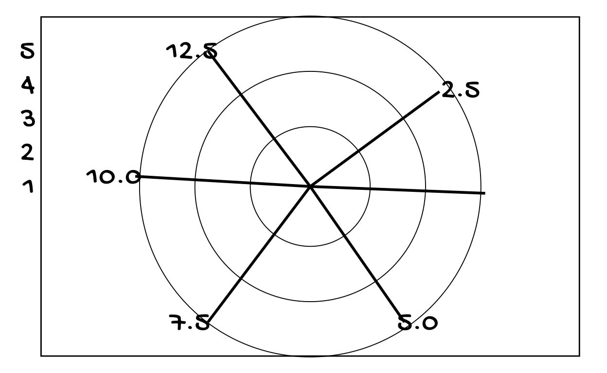  
```
  </div>
</div>

:::example
#### Ejemplo 6.2.1.4.2
:::

```{r, echo = FALSE, eval = TRUE, out.width = "62%", fig.align = "center"}
knitr::include_graphics("images/Astronauts_tidytuesday.png")
```
<section style="text-align: center;"><small>Ilustracíon hecha por <font color = "black"><u>[\@Z3tt](https://github.com/Z3tt/TidyTuesday)</u></font>.</small></section>

##### 6.2.1.5 Capa 7: tema

La capa 7 de tema, ayuda a que las gráficas sean estéticamente agradables o coincidan con una guía de estilo existente, sin afectar lo ya hecho a partir de las capas anteriormente presentadas.

```{r ejemplo_6_2_5, exercise = TRUE, fig.align = "center"}

pokemon <- pokemon %>%
  mutate(
    fuerza_total = ataque + defensa + velocidad + puntos_vida
    )

ggplot(
  data = pokemon,
  aes(x = ataque, y = fuerza_total, colour = tipo, fill = tipo)
  ) +
  geom_point(alpha = 0.4) +
  facet_wrap(~ tipo, ncol = 6) +
  stat_smooth(method = 'lm', colour = 'black') #+
  #labs(
    #x = 'Ataque',
    #y = 'Fuerza total',
    #title = 'Relación entre ataque y fuerza total de acuerdo al tipo de pokemon'
  #) +
  #scale_colour_manual(values = c('cyan', 'gray34', 'deeppink', 'orangered', 'yellow', 'turquoise', 'springgreen', 'red', 'black', 'darkmagenta', 'green', 'blue', 'maroon', 'violetred', 'chocolate', 'coral4', 'thistle', 'pink4')) +
  #scale_fill_manual(values = c('cyan', 'gray34', 'deeppink', 'orangered', 'yellow', 'turquoise', 'springgreen', 'red', 'black', 'darkmagenta', 'green', 'blue', 'maroon', 'violetred', 'chocolate', 'coral4', 'thistle', 'pink4'))
```

El paquete `ggplot2` viene con una serie de temas integrados. Estos son:

```{r, echo = FALSE, eval = TRUE, out.width = "54%", fig.align = "center"}
knitr::include_graphics("images/32va_imagen.png")  
```

:::example
#### Ejemplo 6.2.1.5.1
:::

```{r ejemplo_6_2_1_5_1, exercise = TRUE, fig.align = "center"}

pokemon <- pokemon %>%
  mutate(
    fuerza_total = ataque + defensa + velocidad + puntos_vida
    )

ggplot(
  data = pokemon,
  aes(x = ataque, y = fuerza_total, colour = tipo, fill = tipo)
  ) +
  geom_point(alpha = 0.4) +
  facet_wrap(~ tipo, ncol = 6) +
  stat_smooth(method = 'lm', colour = 'black') +
  labs(
    x = 'Ataque',
    y = 'Fuerza total',
    title = 'Relación entre ataque y fuerza total de acuerdo al tipo de pokemon'
  ) +
  scale_colour_manual(values = c('cyan', 'gray34', 'deeppink', 'orangered', 'yellow', 'turquoise', 'springgreen', 'red', 'black', 'darkmagenta', 'green', 'blue', 'maroon', 'violetred', 'chocolate', 'coral4', 'thistle', 'pink4')) +
  scale_fill_manual(values = c('cyan', 'gray34', 'deeppink', 'orangered', 'yellow', 'turquoise', 'springgreen', 'red', 'black', 'darkmagenta', 'green', 'blue', 'maroon', 'violetred', 'chocolate', 'coral4', 'thistle', 'pink4')) +
  theme_bw()
```

:::caution
`ggplot2` no está limitado a los temas que tiene integrados. Puede hacer uso de otros paquetes, como `ggthemes` de Jeffrey Arnold, para disponer de muchos más temas. [Aquí](https://github.com/jrnold/ggthemes) podrá encontrar información sobre este paquete.
:::

Los temas integrados anteriores cuentan con componentes individuales que a su
vez pueden ser modificados usando la función `theme()`. Una manera general del código que se puede emplear para esto es de la forma: `plot + theme(element.name = element_function())`.

+ Componentes del gráfico

Estos pueden afectar la apariencia del gráfico en su conjunto. Estos son:

```{r, echo = FALSE, eval = TRUE, out.width = "54%", fig.align = "center"}
knitr::include_graphics("images/33va_imagen.png")  
```

:::example
#### Ejemplo 6.2.1.5.2
:::

```{r ejemplo_6_2_1_5_2, exercise = TRUE, fig.align = "center"}

pokemon <- pokemon %>%
  mutate(
    fuerza_total = ataque + defensa + velocidad + puntos_vida
    )

ggplot(
  data = pokemon,
  aes(x = ataque, y = fuerza_total, colour = tipo, fill = tipo)
  ) +
  geom_point(alpha = 0.4) +
  facet_wrap(~ tipo, ncol = 6) +
  stat_smooth(method = 'lm', colour = 'black') +
  labs(
    x = 'Ataque',
    y = 'Fuerza total',
    title = 'Relación entre ataque y fuerza total de acuerdo al tipo de pokemon'
  ) +
  scale_colour_manual(values = c('cyan', 'gray34', 'deeppink', 'orangered', 'yellow', 'turquoise', 'springgreen', 'red', 'black', 'darkmagenta', 'green', 'blue', 'maroon', 'violetred', 'chocolate', 'coral4', 'thistle', 'pink4')) +
  scale_fill_manual(values = c('cyan', 'gray34', 'deeppink', 'orangered', 'yellow', 'turquoise', 'springgreen', 'red', 'black', 'darkmagenta', 'green', 'blue', 'maroon', 'violetred', 'chocolate', 'coral4', 'thistle', 'pink4')) +
  theme_bw() +
  theme(
    plot.background = element_rect(colour = 'gray34', fill = 'white', size = 1.4),
    plot.title = element_text(size = 10, colour = 'black', face = 'bold')
  )
```

+ Componentes de los ejes

Estos pueden controlar la apariencia de los ejes. Estos son:

```{r, echo = FALSE, eval = TRUE, out.width = "54%", fig.align = "center"}
knitr::include_graphics("images/34va_imagen.png")  
```

:::example
#### Ejemplo 6.2.1.5.3
:::

```{r ejemplo_6_2_1_5_3, exercise = TRUE, fig.align = "center"}

pokemon <- pokemon %>%
  mutate(
    fuerza_total = ataque + defensa + velocidad + puntos_vida
    )

ggplot(
  data = pokemon,
  aes(x = ataque, y = fuerza_total, colour = tipo, fill = tipo)
  ) +
  geom_point(alpha = 0.4) +
  facet_wrap(~ tipo, ncol = 6) +
  stat_smooth(method = 'lm', colour = 'black') +
  labs(
    x = 'Ataque',
    y = 'Fuerza total',
    title = 'Relación entre ataque y fuerza total de acuerdo al tipo de pokemon'
  ) +
  scale_colour_manual(values = c('cyan', 'gray34', 'deeppink', 'orangered', 'yellow', 'turquoise', 'springgreen', 'red', 'black', 'darkmagenta', 'green', 'blue', 'maroon', 'violetred', 'chocolate', 'coral4', 'thistle', 'pink4')) +
  scale_fill_manual(values = c('cyan', 'gray34', 'deeppink', 'orangered', 'yellow', 'turquoise', 'springgreen', 'red', 'black', 'darkmagenta', 'green', 'blue', 'maroon', 'violetred', 'chocolate', 'coral4', 'thistle', 'pink4')) +
  theme_bw() +
  theme(
    plot.background = element_rect(colour = 'gray34', fill = 'white', size = 1.4),
    plot.title = element_text(size = 10, colour = 'black', face = 'bold'),
    axis.text.x = element_text(size = 10, face = 'bold', angle = -45, hjust = 0, vjust = 1),
    axis.text.y = element_text(size = 10, face = 'bold'),
    axis.title = element_text(size = 12, face = 'bold')
  )
```

+ Componentes de la leyenda

Estos pueden controlar la apariencia de todas las leyendas. Estos son:

```{r, echo = FALSE, eval = TRUE, out.width = "54%", fig.align = "center"}
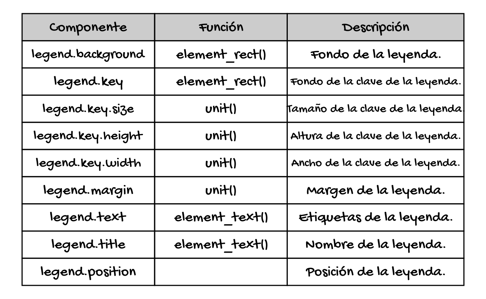  
```

:::example
#### Ejemplo 6.2.1.5.4
:::

```{r ejemplo_6_2_1_5_4, exercise = TRUE, fig.align = "center"}

pokemon <- pokemon %>%
  mutate(
    fuerza_total = ataque + defensa + velocidad + puntos_vida
    )

ggplot(
  data = pokemon,
  aes(x = ataque, y = fuerza_total, colour = tipo, fill = tipo)
  ) +
  geom_point(alpha = 0.4) +
  facet_wrap(~ tipo, ncol = 6) +
  stat_smooth(method = 'lm', colour = 'black') +
  labs(
    x = 'Ataque',
    y = 'Fuerza total',
    title = 'Relación entre ataque y fuerza total de acuerdo al tipo de pokemon'
  ) +
  scale_colour_manual(values = c('cyan', 'gray34', 'deeppink', 'orangered', 'yellow', 'turquoise', 'springgreen', 'red', 'black', 'darkmagenta', 'green', 'blue', 'maroon', 'violetred', 'chocolate', 'coral4', 'thistle', 'pink4')) +
  scale_fill_manual(values = c('cyan', 'gray34', 'deeppink', 'orangered', 'yellow', 'turquoise', 'springgreen', 'red', 'black', 'darkmagenta', 'green', 'blue', 'maroon', 'violetred', 'chocolate', 'coral4', 'thistle', 'pink4')) +
  theme_bw() +
  theme(
    plot.background = element_rect(colour = 'gray34', fill = 'white', size = 1.4),
    plot.title = element_text(size = 10, colour = 'black', face = 'bold'),
    axis.text.x = element_text(size = 10, face = 'bold', angle = -45, hjust = 0, vjust = 1),
    axis.text.y = element_text(size = 10, face = 'bold'),
    axis.title = element_text(size = 12, face = 'bold'),
    legend.position = 'none'
  )
```

+ Componentes de facetado

Estos pueden controlar la apariencia de los gráficos facetados. Estos son:

```{r, echo = FALSE, eval = TRUE, out.width = "54%", fig.align = "center"}
knitr::include_graphics("images/36va_imagen.png")  
```

:::example
#### Ejemplo 6.2.1.5.5
:::

```{r ejemplo_6_2_1_5_5, exercise = TRUE, fig.align = "center"}

pokemon <- pokemon %>%
  mutate(
    fuerza_total = ataque + defensa + velocidad + puntos_vida
    )

ggplot(
  data = pokemon,
  aes(x = ataque, y = fuerza_total, colour = tipo, fill = tipo)
  ) +
  geom_point(alpha = 0.4) +
  facet_wrap(~ tipo, ncol = 6) +
  stat_smooth(method = 'lm', colour = 'black') +
  labs(
    x = 'Ataque',
    y = 'Fuerza total',
    title = 'Relación entre ataque y fuerza total de acuerdo al tipo de pokemon'
  ) +
  scale_colour_manual(values = c('cyan', 'gray34', 'deeppink', 'orangered', 'yellow', 'turquoise', 'springgreen', 'red', 'black', 'darkmagenta', 'green', 'blue', 'maroon', 'violetred', 'chocolate', 'coral4', 'thistle', 'pink4')) +
  scale_fill_manual(values = c('cyan', 'gray34', 'deeppink', 'orangered', 'yellow', 'turquoise', 'springgreen', 'red', 'black', 'darkmagenta', 'green', 'blue', 'maroon', 'violetred', 'chocolate', 'coral4', 'thistle', 'pink4')) +
  theme_bw() +
  theme(
    plot.background = element_rect(colour = 'gray34', fill = 'white', size = 1.4),
    plot.title = element_text(size = 10, colour = 'black', face = 'bold'),
    axis.text.x = element_text(size = 10, face = 'bold', angle = -45, hjust = 0, vjust = 1),
    axis.text.y = element_text(size = 10, face = 'bold'),
    axis.title = element_text(size = 12, face = 'bold'),
    legend.position = 'none',
    strip.background = element_rect(colour = 'black', fill = 'gray64'),
    strip.text = element_text(size = 10, colour = 'black', face = 'bold')
  )
```

:::caution
Si deseas conocer más sobre la gramática de gráficos en capas propuesto por Hadley Wickham, te invitamos a revisar su articulo titulado [A layered grammar of graphics](https://github.com/Leo4Luffy/Un_curso_amigable_sobre_R/blob/master/Documentos/A%20Layered%20Grammar%20of%20Graphics.pdf) que cubre en detalle su propuesta en la construcción de gráficos y también habla sobre el paquete `ggplot2`.
:::

### 6.3 Gráficos estadísticos con `ggplot2`

Ya vimos como funciona la gramática de gráficas y las distintas capas que ponemos agregar y utilizar para crearlos, es hora de que pongamos en practica estos conceptos. Iniciemos viendo las capas individualmente partiendo de un esquema que no posee datos, para ello debemos cargar el paquete `ggplot2` y ejecutar la siguiente linea de código.

:::example
#### Ejemplo 6.3.1
:::

```{r addition_631, exercise = TRUE,fig.align='center'}
# Cargando paquete
library(ggplot2)
# Esquema base
ggplot()
```

Generalmente en la función `ggplot()` asignamos los datos que vamos a graficar usando el argumento data. Supongamos que tenemos un set de datos llamado "mis_datos", en este caso la función del esquema base con la capa de los datos quedaría de la forma `ggplot(data=mis_datos)`.

Continuemos manejando el esquema de un gráfico sin usar datos. El siguiente paso es agregar la capa de estética, la cual puede añadirse directamente en la función `ggplot()` con el argumento `mapping = aes()` o de manera independiente con la función `aes()`. Para el segundo caso debemos agregar una capa usando el operador `+`. Veamos los dos casos estableciendo valores arbitrarios tanto para x como para y.

```{r addition_631_1, exercise = TRUE, fig.align='center'}
# Cargando paquete
library(ggplot2)
# Esquema base con mapping
ggplot(mapping = aes(x=0,y=0))
# Esquema base con aes()
ggplot()+
  aes(x=0,y=0)
```

Después de estas dos capas se agrega la capa de geometrías, que en general depende de el tipo de gráfico que necesitemos o el que mejor se adapte a nuestros datos. Para conocer algunos gráficos  agruparemos algunos de ellos en 7 conjuntos:  1) Gráficos de distribución, 2) Gráficos de correlación, 3) Gráficos de clasificación y 4) Mapas.

#### 6.3.1 Gráficos de distribución

Estos gráficos se utilizan generalmente en variables continuas como edad, altura, masa, etc. Para iniciar esta sección de gráficos haremos el gráfico de densidad para la altura de los personajes de Starwars.

```{r,echo=FALSE}
Starwars
```

:::example
#### Ejemplo 6.3.1.1
:::

```{r addition_6311, exercise = TRUE,fig.align='center'}
ggplot(data = Starwars)+ # Datos
  aes(x=height)+ # Estética
  geom_density() # Geometría 
```

Sabemos que los personajes de Starwars no son todos del mismo genero, entonces modifiquemos el gráfico anterior utilizando facetas para distinguir por genero usando `facet_wrap()` y eliminado los personajes que no tiene genero definido. Ademas usemos el operador tubería ` %>% ` para realizar una operación secuencial que una directamente nuestros datos con el gráfico.

```{r addition_6311_1, exercise = TRUE,fig.align='center'}
Starwars %>% 
  filter(!is.na(gender)) %>% 
  ggplot(data=.)+ # Datos (.)
  aes(x=height)+ # Estética
  geom_density()+ # Geometría
  facet_wrap(~gender) #Faceta
```

Otra forma de diferenciar por género sin usar las facetas, es otorgar color a la variable distintiva, esto podemos hacerlo en la capa estética del gráfico agregando para este caso “color= gender”. Veamos cómo quedaría el gráfico.

```{r addition_6311_2, exercise = TRUE,fig.align='center'}
Starwars %>% 
  filter(!is.na(gender)) %>% 
  ggplot(data=.)+ # Datos (.)
  aes(x=height,color=gender)+ # Estética con color
  geom_density() # Geometría
```

Ahora hagamos modificaciones de imagen para personalizar y embellecer los dos gráficos anteriores, para ello utilizaremos argumentos como “alpha” y "fill" agregando ademas la capa de tema. También nos apoyaremos en la librería`patchwork` para fusionar los dos gráficos en uno solo. 

* Te recomendamos revisar la documentación de `patchwork` para entender su funcionamiento 

```{r addition_6311_3, exercise = TRUE,fig.align='center'}
#libreria
library(patchwork)
base <- Starwars %>% 
  filter(!is.na(gender)) %>% 
  ggplot(data=.)+ # Datos (.)
  aes(x=height,color=gender,fill=gender)+ # Estética con color y relleno
  geom_density(alpha=.3) # Geometría

(base +theme_classic()) / # base con tema clásico
  (base +theme_dark()+facet_wrap(~gender)) #base con faceta y tema oscuro 
```

Sigamos usando la misma variable “height” de Starwars para aprender cómo se hacen los gráficos de histograma, en este caso reuniremos todos los tipos de gráficos que hicimos en el ejemplo anterior en uno solo. Fijate muy bien en la sintaxis del código y todos los comentarios en él. El argumento “alpha” hace referencia a transparencia y el argumento “fill” a relleno.

:::example
#### Ejemplo 6.3.1.2
:::

```{r addition_6312, exercise = TRUE,fig.align='center',fig.height=6.5}
# Gráfico base
base <- Starwars %>% 
  filter(!is.na(gender)) %>% 
  ggplot(data=.)+ # Datos (.)
  aes(x=height)+ # Estética básica 
  geom_histogram(alpha=.5) # Geometría
# opciones sobre la base 
base /
  (base +aes(fill=gender)+theme_classic()) / #base + estética con color +  tema clásico 
  (base +aes(fill=gender)+theme_dark()+facet_wrap(~gender)) #base + estética con color + faceta + tema clasico 
```

Veamos otro tipo de gráfico que es conocido como Boxplot, para estos gráficos seguiremos usando los mismos datos que en los anteriores ejemplo, agregando las capas de estadísticas y coordenadas. Veamos un ejemplo para la variable “height” para cada genero.

:::example
#### Ejemplo 6.3.1.3
:::

```{r addition_6313, exercise = TRUE,fig.align='center'}
# Gráfico base
Starwars %>% 
  filter(!is.na(gender)) %>% 
  ggplot(data=.)+ # Datos (.)
  aes(x=gender,y=height)+ # Estética básica 
  geom_boxplot(fill=NA)+ # geometría sin relleno
  stat_summary(fun=mean,geom="point", color="red") + # Estadísticas con geometría
  coord_flip() # Coordenadas invertidas
```

El siguiente gráfico es conocido como el gráfico de violín y lo implementaremos igual que el boxplot salvo por la geometría.

:::example
#### Ejemplo 6.3.1.4
:::

```{r addition_6314, exercise = TRUE,fig.align='center'}
# Gráfico base
Starwars %>% 
  filter(!is.na(gender)) %>% 
  ggplot(data=.)+ # Datos (.)
  aes(x=gender,y=height,fill=gender)+ # Estética básica con relleno
  geom_violin(alpha=.3)+ # geometría con transparencia
  stat_summary(fun=mean,geom="point", color="red") + # Estadísticas con geometría
  coord_flip() # Coordenadas invertidas
```

Hasta el momento hemos visto gráficas con una sola geometría, ahora veamos gráficas con varias geometrías que incluya las dos gráficas anteriores y una tercera geometría conocida como `geom_jitter()`.

:::example
#### Ejemplo 6.3.1.5
:::

```{r addition_6315, exercise = TRUE,fig.align='center'}
# Gráfico base
Starwars %>% 
  filter(!is.na(gender)) %>% 
  ggplot(data=.)+ # Datos (.)
  aes(x=gender,y=height,fill=gender,color=gender)+ # Estética color y  con relleno
  geom_boxplot(alpha=.2)+ # geometría boxplot con transparencia
  geom_violin(alpha=.3)+ # geometría violín con transparencia
  geom_jitter()+
  stat_summary(fun=mean,geom="point",size=6,shape=23,color="black") + # Estadísticas con geometría puntos
  coord_flip() + # Coordenadas invertidas
  theme_light() #tema
```

#### 6.3.2 Gráficos de relación

Los siguientes gráficos corresponde a ilustraciones que muestran la relación entre dos o más variables continuas. Veamos el primero de ellos el cual se denomina gráfico de dispersión entre dos variables. Usaremos los datos de masa y altura de `Starwars` para relacionarlas en este gráfico.

:::example
#### Ejemplo 6.3.2.1
:::

```{r addition_6321, exercise = TRUE,fig.align='center'}
Starwars %>% 
  filter(!is.na(gender)) %>% 
  filter(mass<quantile(Starwars$mass,probs = .99,na.rm = T)) %>% 
  ggplot(data = .)+ #Datos
  aes(x=height,y=mass,color=gender)+ #estética
  geom_point() # geometría
```

Usando las mismas variables del ejemplo anterior veamos un gráfico de densidad de dos dimensiones. En general este gráfico es útil cuando nuestras variables a relacionar tiene una gran cantidad de observaciones que son difíciles de procesar por un `geom_point()`.

:::example
#### Ejemplo 6.3.2.2
:::

```{r addition_6322, exercise = TRUE,fig.align='center'}
Starwars %>% 
  filter(!is.na(gender)) %>% 
  filter(mass<quantile(Starwars$mass,probs = .99,na.rm = T)) %>% 
  ggplot(data = .)+ #Datos
  aes(x=height,y=mass)+ # Estética
  stat_density_2d(aes(fill = ..density..), geom = "raster", contour = FALSE) #Estadística con geometría
```

Otro tipo de gráfico que podemos realizar es el que relaciona el tiempo con una variable continua, estas son las denominadas series de tiempo. Para el siguiente ejemplo tomaremos la variable de precio del petróleo de el dataset `Seatbelts`, el cual corresponde  a una serie temporal que muestra los totales mensuales de conductores de automóviles en Gran Bretaña que murieron o resultaron gravemente heridos desde enero de 1969 hasta diciembre de 1984.  Para mayor  información del dataset ejecuta `?Seatbelts`

:::example
#### Ejemplo 6.3.2.3
:::

```{r addition_6323, exercise = TRUE,fig.align='center'}
as.matrix(Seatbelts) %>% 
  data.frame()  %>% 
  mutate(date=seq(as.Date("1969-01-01"),as.Date("1984-12-01"), by="month")) %>% 
  ggplot(data=.)+ #Datos
  aes(x=date,y=PetrolPrice)+ #Estética
  geom_line()+ # Geometría de lineas
  geom_point()+ # Geometría de puntos 
  scale_x_date(date_breaks = "12 month",date_labels = "%y-%m")+ #Coordenadas 
  theme_light() # Tema
```

Ya vimos cómo relacionar gráficamente dos variables continuas y una variable continua con el tiempo, veamos ahora cómo relacionar más de dos variables continuas en un gráfico. Para ello nos valdremos de la matriz de correlación de las 4 variables numéricas del dataset `iris`. Consulta la información del dataset con `?iris` para obtener más información.  

:::example
#### Ejemplo 6.3.2.4
:::

```{r addition_6324, exercise = TRUE,fig.align='center'}
iris %>% 
  select_if(is.numeric) %>%
  cor(method = "pearson") %>% 
  as_tibble() %>%
  mutate(name=colnames(iris)[1:4]) %>% 
  relocate(name) %>% 
  pivot_longer(cols = 2:5,names_to="name_2",values_to="Corr") %>% 
  ggplot(data=.)+ #Datos
  aes(x=name,y=name_2,fill=Corr)+ # Estética
  geom_tile()+ # Geometría
  scale_fill_gradientn(colours = topo.colors(5),limits=c(-1,1),breaks=seq(-1,1,.2)) #Coordenadas
```

#### 6.3.3 Gráficos de clasificación

Los gráficos de clasificación corresponden generalmente a conteos o resúmenes numéricos de variables categóricas. Como primer ejemplo veamos un gráfico de barras de el número de autos que tienen 4, 6 u 8 cilindros en el dataset `mtcars`. Para este caso la función `geom_bar()` hace automáticamente el conteo de los autos, `width` corresponde al grosor de las barras.

:::example
#### Ejemplo 6.3.3.1
:::

```{r addition_6331, exercise = TRUE,fig.align='center'}
mtcars %>% 
  ggplot(data = .)+ #Datos
  aes(x=factor(cyl),fill=factor(cyl))+ #Estética
  geom_bar(width = .5) + #Geometría
  theme_linedraw() #tema
```

En el casos de que nuestros datos tengan el conteo o variable de interés de nuestra variable categórica, podemos usar el  argumento `stat=”identity”` en `geom_bar()` para que este no sea calculado por la función, en cuyo caso debemos asignar adicionalmente el conteo o variable `y`.

```{r addition_6331_1, exercise = TRUE,fig.align='center'}
mtcars %>% 
  group_by(cyl) %>% 
  summarise(n=n()) %>% 
  ggplot(data = .)+ #Datos
  aes(x=factor(cyl),fill=factor(cyl),y=n)+ # Estética
  geom_bar(stat ="identity", width = .5)+ # Geometría
  coord_flip() # Coordenadas invertidas
```

Otra forma de generar un gráfico de barras es combinar dos geometrías y crear el gráfico denominado “lollipop”, el cual es una visualización un poco más llamativa que cumple el mismo fin con algunos toques estéticos.

:::example
#### Ejemplo 6.3.3.2
:::

```{r addition_6332, exercise = TRUE,fig.align='center'}
data.frame( x=letters,
            y=sample(1:60,26,replace = T)) %>% 
  ggplot(data=.)+ #Datos
  aes(x=x,y=y)+ #Estética base
  geom_point(color="blue", size=4,alpha=0.5)+ #Geometría de puntos
  geom_segment(aes(x=x, xend=x, y=0, yend=y),color="skyblue")+ #Geometría de segmentos con estética adicional
  theme_classic() # Tema
```

Retomemos los datos del número de cilindros de `mtcars` con su respectivo conteo y veamos un gráfico de barras modificado utilizando `coord_polar()`. Recuerda consultar la documentación de esta función para tener mayor claridad respecto al gráfico.

:::example
#### Ejemplo 6.3.3.3
:::

```{r addition_6333, exercise = TRUE,fig.align='center'}
mtcars %>% 
  group_by(cyl) %>% 
  summarise(n=n()) %>% 
  ggplot(data=.)+ #Datos 
  aes(x=factor(cyl),y=n, fill=factor(cyl))+ # Estética
  geom_bar(stat = "identity")+ #Geometría
  scale_y_continuous(breaks = seq(0,16,2))+ #coordenadas
  coord_polar(theta="y") #Coordenadas
```

Otro gráfico que se puede realizar con `coord_polar()` usando los datos del número de cilindros de `mtcars` es el siguiente.

:::example
#### Ejemplo 6.3.3.4
:::

```{r addition_6334, exercise = TRUE,fig.align='center'}
mtcars %>% 
  ggplot(data=.) + #Datos
  aes(x = factor(1), fill = factor(cyl))+ #Estética
  geom_bar(width = 1, color="white")+ # Geometría
  coord_polar(theta = "y",start = pi / 3)+ #Coordenadas
  scale_fill_brewer(palette = 7)+  #Coordenadas
  theme_void() #Tema
```

Otra forma de representar los datos del número de cilindros de `mtcars` con su respectivo conteo es con el gráfico de rosca, el cual combina dos geometrías y aplicar retoques estéticos para lograr una visualización más llamativa. Para este caso se necesita manipular los datos de una forma específica que veremos a continuación.

:::example
#### Ejemplo 6.3.3.5
:::

```{r addition_6335, exercise = TRUE,fig.align='center'}
mtcars %>% 
  group_by(cyl) %>% 
  summarise(n=n()) %>% 
  mutate(frac=n/sum(n),
         ymax=cumsum(frac),
         ymin=c(0,head(ymax,-1)),
         pos=(ymax+ymin)/2,
         label=paste0(cyl,"\n valor:",n)) %>% 
  ggplot(data=.)+ #Datos
  aes(ymax=ymax, ymin=ymin, xmax=4, xmin=3, fill=factor(cyl))+ #Estética
  geom_rect() + #Geometría 1
  geom_text( x=2.5, aes(y=pos, label=label, color=factor(cyl)), size=4)+ #Geometría 2
  xlim(c(1, 4))+ # Coordenadas limites eje x
  coord_polar(theta="y")+ #Coordenadas
  scale_fill_viridis_d() + # Coordenadas escala de relleno
  scale_color_viridis_d() + # Coordenadas escala de color
  theme_void() #Tema
```

Como último gráfico de esta sección tenemos las barras apiladas, que pueden ser útiles para ver conteos en simultáneo de dos variables categóricas. Para este caso representamos el conteo de cilindros y carburadores de los automóviles de `mtcars`.

:::example
#### Ejemplo 6.3.3.6
:::

```{r addition_6336, exercise = TRUE,fig.align='center'}
mtcars %>% 
  ggplot(data=.)+ #Datos
  aes(x=factor(cyl),fill=factor(carb))+ #Estética
  geom_bar()+ #Geometría
  scale_fill_viridis_d(option = "plasma") #Coordenadas
```

#### 6.3.4 Mapas

La cuestión con los mapas es un poco más compleja y para graficarlos tenemos múltiples geometrías que nos pueden ayudar como `geom_map()`, `geom_sf()`, `geom_polygon()`, etc. Sin embargo el uso de cada una de ellas depende exclusivamente del formato de los datos y para ello debemos relacionarnos más con análisis geoespacial. Para no adentrarnos y extendernos en los formatos de datos espaciales presentaremos dos breves ejemplos nombrando paquetes útiles para graficar mapas.

El primer ejemplo consiste en graficar el número de asesinatos por cada 100.000 personas en los distintos estados de norte america. Para graficar este mapa usamos los datos `USArrests`, te invito a que consultes su estructura y lo explores detalladamente. 

:::example
#### Ejemplo 6.3.4.1
:::

```{r addition_6341, exercise = TRUE,fig.align='center'}
USArrests %>% 
  ggplot(data=.)+#Datos
  aes(x=long,y=lat,group=group,order=order,fill=Murder)+ #Estética
  geom_polygon(color="white")+ # Geometría
  scale_fill_distiller(palette = 4)+ #Coordenadas
  labs(title = "Asesinatos USA - 1973")+ # Etiquetas
  theme_void() #Tema
```

El segundo ejemplo es un gráfico de homicidios en Colombia por departamentos para el año 2013.

:::example
#### Ejemplo 6.3.4.2
:::

```{r addition_6342, exercise = TRUE,fig.align='center',fig.height=5,fig.width=5.3}
departamentos %>% 
  ggplot(data=.)+ #Datos
  geom_polygon(aes(x=long,y=lat,group=group,order=order,fill=homicidios))+ #Geometría de forma
  geom_text(data = . %>% distinct(depto,lab_long,lab_lat), 
            aes(x=lab_long,y=lab_lat, label=depto),size=1.5)+ #Geometría de texto
  scale_fill_viridis_c()+ #Coordenadas escala de color
  labs(title = "Homicidios Colombia - 2013")+ # Etiquetas
  theme_void() #Tema
```

Otros paquetes paquetes que podemos utilizar para graficar mapas y datos geoespaciales son `tmap` , `leaflet` , `ggmap` y algunas de sus dependencias, aunque estas tres son las más relacionadas con el `tidyverse`.

### 6.4 Animando sus visualizaciones de datos

Ya en este punto de seguro se preguntará ¿es posible ir más alla de lo que se ha visto hasta ahora? La respuesta es definitivamente un si. Un ejemplo de ello es la famosa visualización de [Hans Rosling](https://www.ted.com/talks/hans_rosling_the_best_stats_you_ve_ever_seen) donde representaba la población mundial, la expectativa de vida y varios indicadores económicos mediante una visualización animada.

Afortunadamente, hacer este tipo de visualizaciones se ha vuelto hoy en día bastante simple mediante el uso de paquetes de `R`.

<div class="row">
  <div class="col-md-6" markdown="1">
#### 6.4.1 Construcción de visualizaciones animadas mediante el uso del paquete `gganimate`

El paquete `gganimate` extiende la gramática de gráficos implementada en el paquete `ggplot2` proporcionando una rica gramática o funciones de animación.

Esta nueva gama de funciones se pueden agregar al código de graficación de la misma manera que se agrega un `geom_` u otra capa gráfica.
  </div>
  <div class="col-md-6" markdown="1">
```{r, echo = FALSE, eval = TRUE, out.width = "70%", fig.align = "center"}
knitr::include_graphics("images/gganimate.png")
```

<section style="text-align: center;"><small>Ilustracíon hecha por <font color = "black"><u>\@allison_horst</u></font>.</small></section>
  </div>
</div>

Al crear gráficas animadas, el gráfico no se mueve sino que en realidad son muchos gráficos individuales que luego se unen como si tratase de cuadros de película:

```{r, echo = FALSE, eval = TRUE, out.width = "54%", fig.align = "center"}

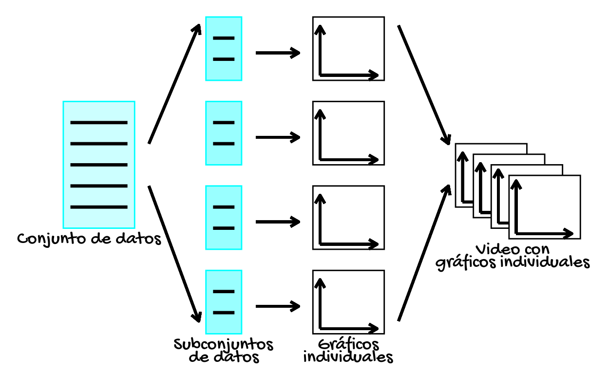  
```

:::example
#### Ejemplo 6.4.1.1
:::

<!--Para explicar como hacer estas visualizaciones se empleará el conjunto de datos gapminder:-->

```{r grafica_gapminder, echo = FALSE, eval = FALSE, message = FALSE}

library(ggrepel)

gapminder_2 <- gapminder %>%
  filter(country == 'China')

gapminder %>%
  rename(
    'Continente' = continent
    ) %>%
  mutate(
    Continente = recode(
      .x = Continente,
      'Africa' = 'África', 
      'Americas' = 'América', 
      'Asia' = 'Asia', 
      'Europe' = 'Europa', 
      'Oceania' = 'Oceanía'
      )
    ) %>%
  ggplot(
    data = .,
    aes(x = gdpPercap, y = lifeExp)
    ) +
  geom_point(aes(size = pop, colour = Continente, fill = Continente), alpha = 0.4) +
  facet_wrap(~ year) +
  scale_colour_manual(values = c('yellow', 'red', 'black', 'cyan', 'green')) +
  scale_fill_manual(values = c('yellow', 'red', 'black', 'cyan', 'green')) +
  scale_size_area(guide = FALSE, max_size = 14) +
  scale_x_log10() +
  labs(x = 'PIB per cápita', y = 'Expectativa de vida al nacer') +
  theme_bw() +
  theme(
    axis.text = element_text(size = 12, face = 'bold'),
    axis.title = element_text(size = 14, face = 'bold'),
    plot.title = element_text(size = 14, face = 'bold'),
    legend.position = 'top',
    legend.title = element_text(size = 14, face = 'bold'),
    legend.text = element_text(size = 12),
    strip.text = element_text(size = 12, face = 'bold'),
    strip.background = element_rect(colour = 'black', fill = 'gray64')
    ) +
  geom_text_repel(
    data = gapminder_2,
    aes(label = country),
    size = 5,
    box.padding = unit(2.8, 'lines'),
    point.padding = unit(0.8, 'lines'),
    segment.color = 'black'
    )
```

```{r datos_gapminder, exercise = TRUE}

gapminder::gapminder
```

+ Gráfico estático

```{r, echo = FALSE, eval = TRUE, out.width = "70%", fig.align = "center"}

knitr::include_graphics("images/ejemplo_gapminder.png")  
```

+ Gráfico animado

```{r, echo = FALSE, eval = TRUE, out.width = "54%", fig.align = "center"}
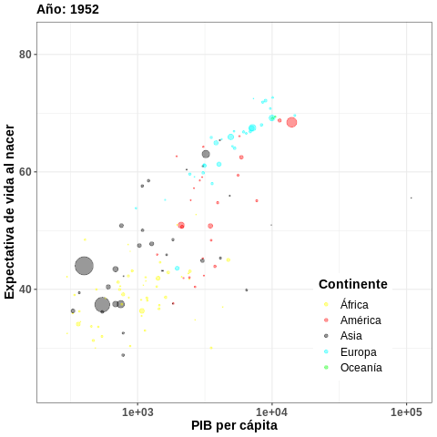
```

Para usar el paquete `gganimate` se debe instalar primero. Para esto, el paquete se pueden instalar de dos formas:

```{r paquete_gganimate_1, exercise = TRUE}

#install.packages('gganimate')
#devtools::install_github('thomasp85/gganimate')
```

y luego se debe cargar una vez se necesite:

```{r paquete_gganimate_2, exercise = TRUE}

#library(gganimate)
```

#### 6.4.1.1 Definición de la animación: `transition_*()`

Las funciones `transition_*()` son un conjunto de funciones encargadas de interpretar los datos y distribuirlos en subconjuntos de datos de acuerdo a una de sus variables, la variable de transición.

:::example
#### Ejemplo 6.4.1.1.1
:::

```{r ejemplo_6_4_1_1_1, exercise = TRUE, fig.align = "center", out.width='380'}

gapminder %>%
  rename(
    'Continente' = continent
    ) %>%
  mutate(
    Continente = recode(
      .x = Continente,
      'Africa' = 'África', 
      'Americas' = 'América', 
      'Asia' = 'Asia', 
      'Europe' = 'Europa', 
      'Oceania' = 'Oceanía'
      )
    ) %>%
  ggplot(
    data = .,
    aes(x = gdpPercap, y = lifeExp)
    ) +
  geom_point(aes(colour = Continente, fill = Continente, size = pop), alpha = 0.4) +
  scale_colour_manual(values = c('yellow', 'red', 'black', 'cyan', 'green')) +
  scale_fill_manual(values = c('yellow', 'red', 'black', 'cyan', 'green')) +
  scale_size_area(max_size = 14, guide = FALSE) +
  scale_x_log10() +
  labs(x = 'PIB per cápita', y = 'Expectativa de vida al nacer') +
  theme_bw() +
  theme(
    axis.text = element_text(size = 12, face = 'bold'),
    axis.title = element_text(size = 14, face = 'bold'),
    legend.position = c(0.8, 0.2),
    legend.title = element_text(size = 14, face = 'bold'),
    legend.text = element_text(size = 12)
    ) #+
  #transition_time(year)
```

```{r, echo = FALSE, eval = TRUE, out.width = "50%", fig.align = "center"}
knitr::include_graphics("images/1ra_animacion.gif")
```

:::caution
Además de la función `transition_time()`, existen otras funciones `transition_` que permiten realizar ditintos gráficos animados. [Aquí](https://gganimate.com/reference/index.html) podrás encontrar una lista de estas funciones y de otras funciones implementadas en el paquete `gganimate`.
:::

#### 6.4.1.2 Crear estelas de sombra: `shadow_*()`

Con el conjunto de funciones `shadow_*()` se pueden aplicar sombras que muestran los puntos de datos anteriores. Estas funciones son `shadow_wake()`, `shadow_trail()` y `shadow_mark()`.

:::example
#### Ejemplo 6.4.1.2.1
:::

```{r ejemplo_6_4_1_2_1, exercise = TRUE, fig.align = "center"}

gapminder %>%
  rename(
    'Continente' = continent
    ) %>%
  mutate(
    Continente = recode(
      .x = Continente,
      'Africa' = 'África', 
      'Americas' = 'América', 
      'Asia' = 'Asia', 
      'Europe' = 'Europa', 
      'Oceania' = 'Oceanía'
      )
    ) %>%
  ggplot(
    data = .,
    aes(x = gdpPercap, y = lifeExp)
    ) +
  geom_point(aes(colour = Continente, fill = Continente, size = pop), alpha = 0.4) +
  scale_colour_manual(values = c('yellow', 'red', 'black', 'cyan', 'green')) +
  scale_fill_manual(values = c('yellow', 'red', 'black', 'cyan', 'green')) +
  scale_size_area(max_size = 14, guide = FALSE) +
  scale_x_log10() +
  labs(x = 'PIB per cápita', y = 'Expectativa de vida al nacer') +
  theme_bw() +
  theme(
    axis.text = element_text(size = 12, face = 'bold'),
    axis.title = element_text(size = 14, face = 'bold'),
    legend.position = c(0.8, 0.2),
    legend.title = element_text(size = 14, face = 'bold'),
    legend.text = element_text(size = 12)
    )  #+
  #transition_time(year) +
  #shadow_trail()
```

```{r, echo = FALSE, eval = TRUE, out.width = "50%", fig.align = "center"}
knitr::include_graphics("images/2da_animacion.gif")
```

#### 6.4.1.3 Etiquetado dinámico: `{frame_time}`

El paquete `gganimate` proporciona un etiquetado dinámico (`{frame_time}`) que facilita comprender a que transición se refiere cada punto de dato presentado en la gráfica.

:::example
#### Ejemplo 6.4.1.3.1
:::

```{r ejemplo_6_4_1_3_1, exercise = TRUE, fig.align = "center"}

gapminder %>%
  rename(
    'Continente' = continent
    ) %>%
  mutate(
    Continente = recode(
      .x = Continente,
      'Africa' = 'África', 
      'Americas' = 'América', 
      'Asia' = 'Asia', 
      'Europe' = 'Europa', 
      'Oceania' = 'Oceanía'
      )
    ) %>%
  ggplot(
    data = .,
    aes(x = gdpPercap, y = lifeExp)
    ) +
  geom_point(aes(colour = Continente, fill = Continente, size = pop), alpha = 0.4) +
  scale_colour_manual(values = c('yellow', 'red', 'black', 'cyan', 'green')) +
  scale_fill_manual(values = c('yellow', 'red', 'black', 'cyan', 'green')) +
  scale_size_area(max_size = 14, guide = FALSE) +
  scale_x_log10() +
  labs(x = 'PIB per cápita', y = 'Expectativa de vida al nacer', title = 'Año: {frame_time}') +
  theme_bw() +
  theme(
    axis.text = element_text(size = 12, face = 'bold'),
    axis.title = element_text(size = 14, face = 'bold'),
    legend.position = c(0.8, 0.2),
    legend.title = element_text(size = 14, face = 'bold'),
    legend.text = element_text(size = 12),
    plot.title = element_text(size = 14, face = 'bold')
    ) #+
  #transition_time(year) +
  #shadow_trail()
```

```{r, echo = FALSE, eval = TRUE, out.width = "50%", fig.align = "center"}
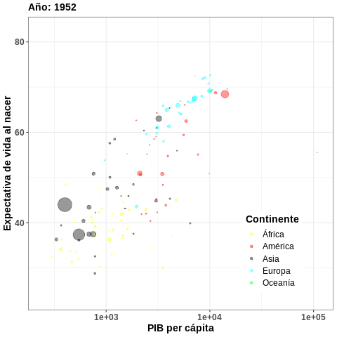
```

#### 6.4.1.4 Guardar como un GIF

El paquete `gganimate` permite también guardar los gráficos animados como un GIF.

:::example
#### Ejemplo 6.4.1.4.1
:::

```{r ejemplo_6_4_1_4_1, exercise = TRUE, fig.align = "center"}

Graf_animado <- gapminder %>%
  rename(
    'Continente' = continent
    ) %>%
  mutate(
    Continente = recode(
      .x = Continente,
      'Africa' = 'África', 
      'Americas' = 'América', 
      'Asia' = 'Asia', 
      'Europe' = 'Europa', 
      'Oceania' = 'Oceanía'
      )
    ) %>%
  ggplot(
    data = .,
    aes(x = gdpPercap, y = lifeExp)
    ) +
  geom_point(aes(colour = Continente, fill = Continente, size = pop), alpha = 0.4) +
  scale_colour_manual(values = c('yellow', 'red', 'black', 'cyan', 'green')) +
  scale_fill_manual(values = c('yellow', 'red', 'black', 'cyan', 'green')) +
  scale_size_area(max_size = 14, guide = FALSE) +
  scale_x_log10() +
  labs(x = 'PIB per cápita', y = 'Expectativa de vida al nacer', title = 'Año: {frame_time}') +
  theme_bw() +
  theme(
    axis.text = element_text(size = 12, face = 'bold'),
    axis.title = element_text(size = 14, face = 'bold'),
    legend.position = c(0.8, 0.2),
    legend.title = element_text(size = 14, face = 'bold'),
    legend.text = element_text(size = 12),
    plot.title = element_text(size = 14, face = 'bold')
    ) #+
  #transition_time(year) +
  #shadow_trail()

#animate(Graf_animado, fps = 10, width = 950, height = 650)
#anim_save('Graf_animado.gif')
```

:::caution
Si deseas ver un resumen de las posibilidades que ofrece el paquete `ggplot2` y profundizar más en su uso, puedes mirar su hoja de trucos [aquí](https://github.com/Leo4Luffy/Un_curso_amigable_sobre_R/blob/master/Documentos/cheat_sheet_ggplot2.pdf). De igual forma, si deseas conocer más sobre el paquete `gganimate` puedes mirar su hoja de trucos [aquí](https://github.com/Leo4Luffy/Un_curso_amigable_sobre_R/blob/master/Documentos/cheat_sheet_gganimate.pdf).
:::

## 7. Modelación estadística básica

```{r, echo = FALSE, eval = TRUE, out.width = "30%", fig.align = "center"}
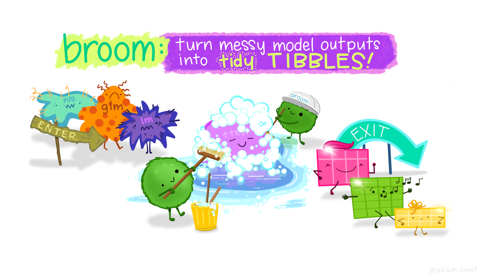
```

<section style="text-align: center;"><small>Ilustracíon hecha por <font color = "black"><u>\@allison_horst</u></font>.</small></section>

## 8. Comunicación de resultados

La comunicación de resultados es un aspecto muy importante en cualquier campo de la ciencia y en el análisis estadístico no es la excepción. A lo largo de los años se usado el enfoque manual (cortar y pegar) para comunicar resultados en forma de informes, artículos científicos, presentaciones académicas, libros, sitios web, etc. Sin embargo este enfoque manual se a visto reemplazado por la automatización permitiendo emitir resultados reproducibles y dinámicos con mayor simplicidad. En `R` y en muchos otros lenguajes de programación el formato de documento Markdown abrió las puertas a la interacción entre código de programación y texto plano, dando como resultado documentos que integran sus características y emiten distintos formatos de acuerdo a las necesidades del usuario. Markdown en conjunto con [Pandoc](https://pandoc.org/) permiten compilar formatos como PDF, HTML, Word, LaTex, PowerPoint, Beamer, etc. con una sintaxis bastante simple, dando como resultado documentos básicos susceptibles de personalización con algunos conocimientos de CSS y LaTex. 

Aunque la sintaxis de Markdown es simple y admite muchos lenguajes incluyendo todos los inherentes a los formatos de salida, en R existe su propia versión en el paquete `rmarkdown` creado a principios de 2014. Esta versión en conjunto con `knitr` se han convertido en una de las herramientas más conocidas, divulgadas y avaluadas en toda la comunidad de programadores de `R`, por lo que conocerla y manejarla resulta apropiado para los usuarios de `R`.

Como primer paso para el uso de `rmarkdown` es necesario instalarlo:

```{r addition_8_01, exercise = TRUE}
#install.packages("rmarkdown",dependencies = T)
```

:::caution
Si deseas ver un resumen de las posibilidades que ofrece el paquete `rmarkdown` puedes mirar su hoja de trucos [aquí](https://github.com/Leo4Luffy/Un_curso_amigable_sobre_R/blob/master/Documentos/rmarkdown-2.0_Spanish.pdf).
:::


<div class="row"><div class="col-md-7" markdown="1">

```{r, echo = FALSE, out.width='500', eval = TRUE, fig.align = "center"}
knitr::include_graphics("images/reproducibility_court.png")
```

<section style="text-align: center;"><small>Ilustracíon hecha por <font color = "black"><u>\@allison_horst</u></font>.</small></section>

</div><div class="col-md-5" markdown="1">

```{r, echo = FALSE, out.width='220', eval = TRUE, fig.align = "center"}

```

</div></div>

No obstante si cuenta con la IDE de Rstudio no es explícitamente necesario que lo instale ya que el lo hace por usted. Tenga en cuenta que `rmarkdown` maneja la sintaxis de Markdown, para familiarizarse con ella puede tomar el [Tutorial de Rmarkdown](https://www.markdowntutorial.com/).

Como primer paso para aprender sobre las opciones de `rmarkdown` debemos conocer las plantillas que posee abriendo `Rstudio` y creando un nuevo Rmarkdown de la siguiente forma: 

<p align="center">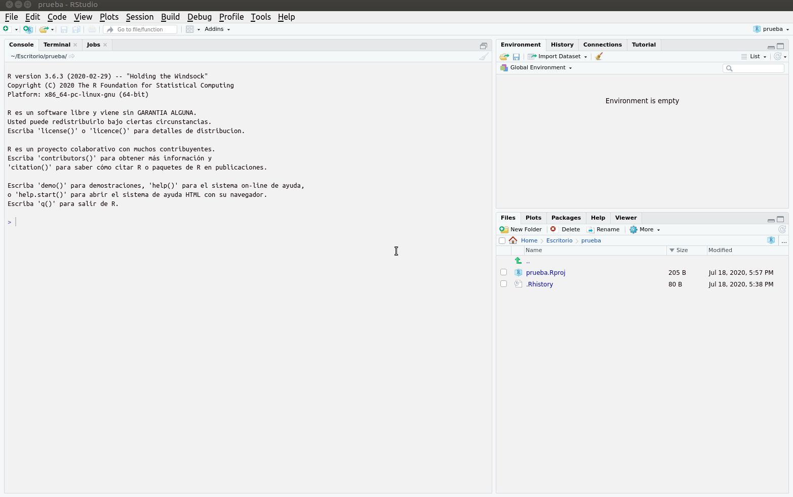</p>

En la siguiente imagen se ilustra el panel de opciones de Rmarkdown mostrando los formatos de salida que podemos usar para generar documentos ya sean HTML,PDF, Word, presentaciones, Shiny y otras plantillas.

<p align="center"></p>

Generar cualquier tipo de documento, presentación, Shiny o plantilla es tan simple como seleccionar la opción que prefiera y dar click en **OK**. Después de pulsar OK se abrirá un archivo Rmd con instrucciones básicas correspondientes al formato seleccionado, para crear el archivo con el formato de interés debe buscar el icono de `knit` o ejecutar el comando `CTRL + SHIFT + K`.

```{r, echo = FALSE, out.width = "100%", eval = TRUE, fig.align = "center"}
knitr::include_graphics("images/rmarkdownflow.png")
```

Cada uno de los archivos posee la extensión .Rmd y cuenta por lo menos con tres tipos de contenidos:

* Un encabezado YAML (opcional) rodeado de `---`
* Trozos de código rodeados por ` ``` `
* Texto mezclado con formato de texto simple

### 8.1 Encabezado YAML

El encabezado YAML se encuentra en la parte inicial del documento y denota características del archivo, como título, autor, fecha, descripción, opciones de tabla de contenido, condiciones estéticas, opciones de referencias, opciones de figuras, etc. Además este encabezado YAML establece las opciones de render para los distintos formatos, viéndose en su estado más básico para cada uno de ellos de la siguiente manera:

```
---
title: "Untitled"
output: ******
---
```

Donde `******` puede ser reemplazado por los distintos formatos que podemos usar. Los formatos por defecto que podemos renderizar son los siguientes:

* `html_document`
* `pdf_document`
* `word_document`
* `ioslides_presentation`
* `slidy_presentation`
* `beamer_presentation`
* `powerpoint_presentation`
* `github_document`
* `odt_document`
* `md_document`
* `latex_document`

Para el formato **html** y para las presentaciones **ioslides**, podemos agregar un argumento extra que nos permita obtener un documento reactivo y dinámico como el curso que estás realizando en este momento. Veamos el YAML que corresponde a cada uno.

<div class="row"><div class="col-md-6" markdown="1">
```
---
title: "Untitled"
output: html_document
runtime: shiny
---
```
</div><div class="col-md-6" markdown="1">
```
---
title: "Untitled"
output: ioslides_presentation
runtime: shiny
---
```
</div></div>

Es importante mencionar que cambiar el `output` es el equivalente a seleccionar alguna de las opciones en el panel de Rmarkdown mostrado anteriormente en la animación. Estos dos últimos formatos interactivos los encuentras en la sección de `shiny` en el mismo panel. Además, podemos renderizar otros formatos provenientes de paquetes, como los siguientes:

```{r addition_81_01, exercise = TRUE}
#install.packages("learnr")
#install.packages("rmdshower")
#install.packages("flexdashboard")
#install.packages("rmdformats")
#install.packages("xaringan")
#install.packages("prettydoc")
#install.packages("tufte")
#install.packages("rticles")
#install.packages("revealjs")
```

Dando para cada caso como resultado un YAML del tipo:

<div class="row"><div class="col-md-4" markdown="1">
```
---
title: "Tutorial"
output: learnr::tutorial
runtime: shiny_prerendered
---
```
</div><div class="col-md-4" markdown="1">
```
---
title: "Untitled"
output: 
  rmdshower::shower_presentation
---
```
</div><div class="col-md-4" markdown="1">
```
---
title: "Untitled"
output: 
  flexdashboard::flex_dashboard
---
```
</div></div>

<div class="row"><div class="col-md-4" markdown="1">
```
---
title: "Untitled"
output: rmdformats::material
---
```
</div><div class="col-md-4" markdown="1">
```
---
title: "Untitled"
output: xaringan::moon_reader
---
```
</div><div class="col-md-4" markdown="1">
```
---
title: "Untitled"
output: prettydoc::html_pretty
---
```
</div></div>

<div class="row"><div class="col-md-4" markdown="1">
```
---
title: "Untitled"
output: 
  tufte::tufte_handout: default
---
```
</div><div class="col-md-4" markdown="1">
```
---
title: "Untitled"
output: 
  rticles::springer_article
---
```
</div><div class="col-md-4" markdown="1">
```
---
title: "Untitled"
output: 
  revealjs::revealjs_presentation
---
```
</div></div>

:::exercise
#### Ejercicio 8.1
:::

Para este ejercicio debes volver a Rstudio y explorar cada uno de los formatos disponibles en el panel de Rmarkdown, abre y ejecuta con `knitr` cada uno de ellos viendo sus diferencias y las salidas obtenidas. No dudes en pedir ayuda si tienes problemas en la ejecución o si tienes dudas con respecto a los diferentes formatos.

```{r, echo = FALSE, out.width = "65%", eval = TRUE, fig.align = "center"}
knitr::include_graphics("images/rmarkdown_wizards.png")
```

R en conjunto con diversos paquetes ofrece múltiples alternativas de render, sin embargo debemos mencionar que Markdown fue diseñado originalmente para la salida html, por lo que este formato posee características más ricas en comparación con los demás formatos de salida. Las siguientes subsecciones están orientadas al manejo de estas características para los distintos formatos. Tenga presente que este curso ofrece solo un preámbulo de las posibilidades que brinda Rmarkdown, si desea profundizar en cada uno de los formatos, consulte [R Markdown: The Definitive Guide](https://bookdown.org/yihui/rmarkdown/)

#### 8.1.1 Opciones de tabla de contenido 

Estas opciones aplican para los formatos `html` y `pdf` y denotan el funcionamiento de la tabla de contenido con el argumento `toc: true`. Adicionalmente, para especificar la profundidad de los encabezados utilizamos el argumento `toc_depth`. Veamos el YAML que corresponde para estos dos formatos: 

<div class="row"><div class="col-md-6" markdown="1">
```
---
title: "Untitled"
output: 
  html_document:
    toc: true
    toc_depth: 2
---
```
</div><div class="col-md-6" markdown="1">
```
---
title: "Untitled"
output:
  pdf_document:
    toc: true
    toc_depth: 3
---
```
</div></div>

Como se observa el máximo encabezado que se mostrará en la tabla de contenido para el formato html será de título de segundo nivel, mientras que para el pdf será de tercer nivel. Un opción adicional que se puede incluir en el formato html corresponde a la tabla de contenido flotante con el argumento `toc_float:true`, el cual la mostrará permanentemente al lado izquierdo del contenido principal. Veamos el uso de este argumento en el YAML:

```
---
title: "Untitled"
output: 
  html_document:
    toc: true
    toc_depth: 2
    toc_float: true
---
```


#### 8.1.2 Opciones de figuras

Al igual que con la tabla de contenido las opciones para figuras solo están disponibles para los formatos `html` y `pdf`, su configuración solo incluye tres aspectos: 1) alto; 2) ancho y 3) subtítulo, los argumentos en los dos formatos son exactamente los mismos dando como resultado YAML del tipo:

<div class="row"><div class="col-md-6" markdown="1">
```
---
title: "Untitled"
output: 
  html_document:
    fig_width: 5
    fig_height: 5
    fig_caption: true
---
```
</div><div class="col-md-6" markdown="1">
```
---
title: "Untitled"
output:
  pdf_document:
    fig_width: 7
    fig_height: 6
    fig_caption: true
---
```
</div></div>

Si combinados las opciones de tabla de contenido con las opciones de figura el resultado de los YAML seria el siguiente:

<div class="row"><div class="col-md-6" markdown="1">
```
---
title: "Untitled"
output: 
  html_document:
    toc: true
    toc_depth: 2
    fig_width: 5
    fig_height: 5
    fig_caption: true
---
```
</div><div class="col-md-6" markdown="1">
```
---
title: "Untitled"
output:
  pdf_document:
    toc: true
    toc_depth: 3
    fig_width: 7
    fig_height: 6
    fig_caption: true
---
```
</div></div>


#### 8.1.3 Opciones de impresión de dataframe

Estas opciones son para los formatos pdf y html y determinan la estética de los marcos de datos en el documento de salida. Veamos la siguiente tabla que muestra las opciones disponibles.

+----------+----------------------------------------+----------------+-----------------+
| Opción   | Descripción                            | pdf_document   | html_document   |
+==========+========================================+================+=================+
| default  | Llama `print.data.frame`               | Disponible     | Disponible      |
+----------+----------------------------------------+----------------+-----------------+
| kable    | Usa la función `knitr::kable`          | Disponible     | Disponible      |
+----------+----------------------------------------+----------------+-----------------+
| tibble   | Usa la función `tibble::print.tbl_df`  | Disponible     | Disponible      |
+----------+----------------------------------------+----------------+-----------------+
| paged    | Usa la función `rmarkdown::paged_table`| No disponible  | Disponible      |
+----------+----------------------------------------+----------------+-----------------+

Supongamos que queremos usar la opción kable para un pdf y la opción paged para un html, sus YAML correspondientes haciendo uso de las opciones de tabla de contenido y de figuras tendrán el siguiente aspecto:

<div class="row"><div class="col-md-6" markdown="1">
```
---
title: "Untitled"
output: 
  html_document:
    toc: true
    toc_depth: 2
    fig_width: 5
    fig_height: 5
    fig_caption: true
    df_print: paged
---
```
</div><div class="col-md-6" markdown="1">
```
---
title: "Untitled"
output:
  pdf_document:
    toc: true
    toc_depth: 3
    fig_width: 7
    fig_height: 6
    fig_caption: true
    df_print: kable
---
```
</div></div>


#### 8.1.4 Opciones de Referencias

Las opciones de referencias bibliográficas son limitadas, sin embargo están disponibles para todos los formatos haciendo uso del lenguaje BibTeX. Lo primero es tener un archivo con la extensión correspondiente (.bib) que contenga las citaciones de interés, veamos un ejemplo del contenido de un archivo con esta extensión:

```
@Manual{rbase,
  title = {R: A Language and Environment for Statistical Computing},
  author = {{R Core Team}},
  organization = {R Foundation for Statistical Computing},
  address = {Vienna, Austria},
  year = {2020},
  url = {https://www.R-project.org/},
}

@Manual{curso_actual,
  title = {CursoR: Un Curso Amigable Para R},
  author = {Duvan Nieves and Leonardo Lopez},
  year = {2020},
  note = {R package version 0.1.0},
  url = {https://github.com/Duvancho321/Curso_R},
}
```

<div class="row"><div class="col-md-6" markdown="1">

Ahora el enlace con el YAML es relativamente simple, solo debemos usar el argumento `bibliography:` y agregar el nombre de nuestro archivo, Veamos un ejemplo suponiendo que nuestro archivo lleva el nombre **“biblio.bib”**:

</div><div class="col-md-6" markdown="1">
```
---
title: "Untitled"
output: ******
bibliography: biblio.bib
---
```
</div></div>


<div class="row"><div class="col-md-6" markdown="1">

Con un YAML como el anterior y citando en nuestro texto plano obtendremos las referencias bibliográficas la final de nuestro documento sin importar el formato seleccionado. En caso de que deseemos una bibliografía sin citar explícitamente en el texto plano podemos usar el argumento `nocite: '@*'` 

</div><div class="col-md-6" markdown="1">
```
---
title: "Untitled"
output: ******
bibliography: biblio.bib
nocite: '@*'
---
```
</div></div>


#### 8.1.5 Opciones de adicionales

En nuestro YAML podemos agregar otras opciones como autores, fecha, subtítulos y otras que conciernen a formatos más específicos. Por el momento veamos las opciones nombradas anteriormente reuniendo todo lo que hemos aprendido del YAML.

<div class="row"><div class="col-md-6" markdown="1">
```
---
title: "Untitled"
subtitle: "Un subtitulo"
author: 
  - "Autor 1"
  - "Autor 2"
date: "`r Sys.Date()`"
bibliography: biblio.bib
output: 
  html_document:
    toc: true
    toc_depth: 2
    fig_width: 5
    fig_height: 5
    fig_caption: true
    df_print: paged
---
```
</div><div class="col-md-6" markdown="1">
```
---
title: "Untitled"
subtitle: "Un subtitulo"
author: 
  - "Autor 1"
  - "Autor 2"
date: "`r Sys.Date()`"
nocite: '@*'
output:
  pdf_document:
    toc: true
    toc_depth: 3
    fig_width: 7
    fig_height: 6
    fig_caption: true
    df_print: kable
---
```
</div></div>


### 8.2 Trozos de código

Los trozos o fragmentos de código funcionan de forma similar a un Script y pueden producir salidas de texto, gráficos o tablas. La forma de insertarlos es usando el comando `CTRL + ALT + I`  o `Cmd + Option + I` en macOS. Un fragmento de código R luce de la siguiente forma: 

<p align="center">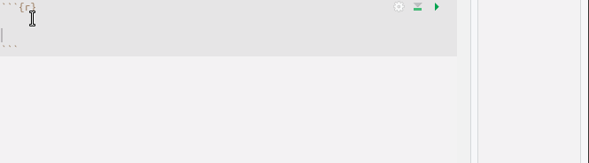</p>

Fijémonos en los tres botones que se ven en la parte derecha del chunk, el primero nos da opciones de configuración que trataremos con detalle más adelante, el segundo ejecuta todos los trozos de código de arriba y el último ejecuta el fragmento actual. 


#### 8.2.1 Opciones globales de fragmentos de código
#### 8.2.2 Opciones individuales de fragmentos de código
#### 8.2.3 Otros lenguajes soportados


### 8.3 Texto

sintaxis Markdown 
titulos 
negrilla
citaciones
codigo html 
ecuaciones
importar imagenes
hiperbinculos
pie de pagina

## 9. Lectura de datos


## 10. Referencias
