## ¡Bienvenido!


<section style="text-align: center;"><small>Ilustracíon hecha por <font color = "black"><u>\@allison_horst</u></font>.</small></section>

### Descripción

Este curso pretende ser una introducción básica del `R`. Su objetivo consiste en enseñar habilidades en la limpieza, manipulación y visualización de datos mediante el uso del `R`. Tenga en cuenta que este curso no pretende ser un sustituto de un curso completo de programación o de estadística.


A lo largo del curso podrá encontrar fragmentos de código para realizar ejemplos y ejercicios de codificación. Abajo encontrara como podrán ser usados:

:::example
#### Fragmentos de código para realizar ejemplos
Los ejemplos contienen código previamente escrito para que pueda explorarlo y ejecutarlo presionando el botón amarillo "Run Code" (ejecutar) en la esquina superior derecha. Puede actualizar el código en cualquiera de los ejemplos presionando "Start Over" (iniciar de nuevo) en la esquina superior izquierda y el código se restablecerá automáticamente al valor predeterminado.
:::

<div class="tutorial-exercise" data-label="addition_ejemplos" data-caption="Code" data-completion="1" data-diagnostics="1" data-startover="1" data-lines="0"><script type="application/json" data-opts-chunk="1">{"fig.width":6.5,"fig.height":4,"fig.retina":2,"fig.align":"default","fig.keep":"high","fig.show":"asis","out.width":624,"warning":false,"error":false,"message":false,"exercise.df_print":"paged","exercise.timelimit":60,"exercise.checker":["function (label = NULL, solution_code = NULL, user_code = NULL, ","    check_code = NULL, envir_result = NULL, evaluate_result = NULL, ","    envir_prep = NULL, last_value = NULL, ...) ","{","    if (is.null(user_code)) {","        return(list(message = \"I didn't receive your code. Did you write any?\", ","            correct = FALSE, type = \"error\", location = \"append\"))","    }","    else {","        user_code <- parse(text = user_code)","        if (length(user_code) == 0) {","            return(list(message = \"I didn't receive your code. Did you write any?\", ","                correct = FALSE, type = \"error\", location = \"append\"))","        }","    }","    if (!is.null(solution_code)) {","        solution_code <- parse(text = solution_code)","        if (length(solution_code) == 0) {","            return(list(message = \"No solution is provided for this exercise.\", ","                correct = TRUE, type = \"info\", location = \"append\"))","        }","    }","    had_error_checking <- FALSE","    checked_result <- tryCatch({","        parsed_check_code <- parse(text = check_code)","        if (length(parsed_check_code) > 1) {","            for (i in 1:(length(parsed_check_code) - 1)) {","                eval(parsed_check_code[[i]], envir_prep)","            }","        }","        grading_code <- rlang::call_standardise(parsed_check_code[[length(parsed_check_code)]], ","            envir_prep)","        grader_args <- list(user_quo = rlang::as_quosure(user_code[[length(user_code)]], ","            envir_result))","        if (!is.null(solution_code)) {","            grader_args$solution_quo <- rlang::as_quosure(solution_code[[length(solution_code)]], ","                envir_prep)","        }","        learnr_args <- list(...)","        learnr_args$label <- label","        learnr_args$solution_code <- solution_code","        learnr_args$user_code <- user_code","        learnr_args$check_code <- check_code","        learnr_args$envir_result <- envir_result","        learnr_args$evaluate_result <- evaluate_result","        learnr_args$envir_prep <- envir_prep","        learnr_args$last_value <- last_value","        grading_code$grader_args <- grader_args","        grading_code$learnr_args <- learnr_args","        envir_prep$ans <- grader_args$user","        eval(grading_code, envir_prep)","    }, error = function(e) {","        message(\"\", e)","        had_error_checking <<- TRUE","        graded(correct = FALSE, message = \"Error occured while checking the submission\")","    })","    if (!checkmate::test_class(checked_result, \"grader_graded\")) {","        stop(\"`grade_learnr` should receive a `graded` value from every `-check` chunk\")","    }","    message_type <- if (had_error_checking) {","        \"warning\"","    }","    else {","        if (checked_result$correct) {","            \"success\"","        }","        else {","            \"error\"","        }","    }","    ret <- list(message = checked_result$message, correct = checked_result$correct, ","        type = message_type, location = \"append\")","    ret","}"]}</script></div>

:::exercise
#### Fragmentos de código para realizar ejercicios de codificación
Aquí se indican ejercicios prácticos de codificación donde se le pedirá que escriba el código manualmente. Si no da con la solución, puede buscar ayuda dando clic en los botones "Solution" (solución) o "Hints" (sugerencias). En la mayoría de los casos el código podrá ser evaluado con el botón "Submit Answer" (Enviar Respuesta), indicándole cuando la respuesta sea acertada.
:::

<div class="tutorial-exercise" data-label="exercise_ejercicios" data-caption="Code" data-completion="1" data-diagnostics="1" data-startover="1" data-lines="0"><script type="application/json" data-opts-chunk="1">{"fig.width":6.5,"fig.height":4,"fig.retina":2,"fig.align":"default","fig.keep":"high","fig.show":"asis","out.width":624,"warning":false,"error":false,"message":false,"exercise.df_print":"paged","exercise.timelimit":60,"exercise.checker":["function (label = NULL, solution_code = NULL, user_code = NULL, ","    check_code = NULL, envir_result = NULL, evaluate_result = NULL, ","    envir_prep = NULL, last_value = NULL, ...) ","{","    if (is.null(user_code)) {","        return(list(message = \"I didn't receive your code. Did you write any?\", ","            correct = FALSE, type = \"error\", location = \"append\"))","    }","    else {","        user_code <- parse(text = user_code)","        if (length(user_code) == 0) {","            return(list(message = \"I didn't receive your code. Did you write any?\", ","                correct = FALSE, type = \"error\", location = \"append\"))","        }","    }","    if (!is.null(solution_code)) {","        solution_code <- parse(text = solution_code)","        if (length(solution_code) == 0) {","            return(list(message = \"No solution is provided for this exercise.\", ","                correct = TRUE, type = \"info\", location = \"append\"))","        }","    }","    had_error_checking <- FALSE","    checked_result <- tryCatch({","        parsed_check_code <- parse(text = check_code)","        if (length(parsed_check_code) > 1) {","            for (i in 1:(length(parsed_check_code) - 1)) {","                eval(parsed_check_code[[i]], envir_prep)","            }","        }","        grading_code <- rlang::call_standardise(parsed_check_code[[length(parsed_check_code)]], ","            envir_prep)","        grader_args <- list(user_quo = rlang::as_quosure(user_code[[length(user_code)]], ","            envir_result))","        if (!is.null(solution_code)) {","            grader_args$solution_quo <- rlang::as_quosure(solution_code[[length(solution_code)]], ","                envir_prep)","        }","        learnr_args <- list(...)","        learnr_args$label <- label","        learnr_args$solution_code <- solution_code","        learnr_args$user_code <- user_code","        learnr_args$check_code <- check_code","        learnr_args$envir_result <- envir_result","        learnr_args$evaluate_result <- evaluate_result","        learnr_args$envir_prep <- envir_prep","        learnr_args$last_value <- last_value","        grading_code$grader_args <- grader_args","        grading_code$learnr_args <- learnr_args","        envir_prep$ans <- grader_args$user","        eval(grading_code, envir_prep)","    }, error = function(e) {","        message(\"\", e)","        had_error_checking <<- TRUE","        graded(correct = FALSE, message = \"Error occured while checking the submission\")","    })","    if (!checkmate::test_class(checked_result, \"grader_graded\")) {","        stop(\"`grade_learnr` should receive a `graded` value from every `-check` chunk\")","    }","    message_type <- if (had_error_checking) {","        \"warning\"","    }","    else {","        if (checked_result$correct) {","            \"success\"","        }","        else {","            \"error\"","        }","    }","    ret <- list(message = checked_result$message, correct = checked_result$correct, ","        type = message_type, location = \"append\")","    ret","}"]}</script></div>

<div class="tutorial-exercise-support" data-label="exercise_ejercicios-solution" data-caption="Code" data-completion="1" data-diagnostics="1" data-startover="1" data-lines="0">

```text
#Ejercicio_código
```

</div>

También se encontrara con el siguiente bloque informativo:

:::caution
#### Bloque informativo de aclaración
En ocasiones se dara alguna recomendación sobre un tema. Este bloque se usará para llevar a cabo esto.
:::

<br>

### Acerca de nosotros

<div class="row">
  <div class="col-md-6" markdown="1">
  __Jorge Leonardo López Martínez__ es zootecnista con interés en el uso de la programación y la bioestadística aplicada al campo de la genética animal.
  <HR>
  <i class="fab fa-black-tie"></i> [leo4luffy.github.io](https://leo4luffy.github.io/)<br>
  <i class="fas fa-envelope"></i> jollopezma@unal.edu.co<br>
  <i class="fa fa-github"></i> [Leo4Luffy](https://github.com/Leo4Luffy)
  </div>
  <div class="col-md-6" markdown="1">
  __Duvan Ariel Nieves Ruiz__ es estudiante de ingeniería ambiental apasionado por el software libre con interés en la ecología y la programación.
  <HR>
  <i class="fab fa-black-tie"></i> [duvancho321.github.io](https://duvancho321.github.io/)<br>
  <i class="fas fa-envelope"></i> dnieves@unal.edu.co<br>
  <i class="fa fa-github"></i> [Duvancho321](https://github.com/Duvancho321)
  </div>
</div>

<br>

No dude en comunicarse con nosotros por correo electrónico si tiene preguntas acerca del curso y su contenido.

Tenga en cuenta que este curso está bajo la licencia <a rel="license" href="http://creativecommons.org/licenses/by-nc-sa/4.0/">Creative Commons Attribution-NonCommercial-ShareAlike 4.0 International License</a>. Por tanto el contenido del curso debe acreditarse a sus autores.

<section style="text-align: center;"><a rel="license" href="http://creativecommons.org/licenses/by-nc-sa/4.0/"></a><br/></section>

## 1. Una breve introducción al R

### 1.1 ¿Qué es el `R`?

`R` es un lenguaje de programación creado por __Robert Gentleman__ y __Ross Ihaka__ en el año de 1992. Ambos creadores le dieron el nombre de `R` al lenguaje implementado por las iniciales de sus nombres (a modo de broma).


Se trata de un lenguaje __interpretado__ o de script, con __tipado dinámico__, __multiplataforma__ y __orientado a objetos__:

+ __Lenguaje interpretado__ o de script: se ejecuta utilizando
un programa intermedio llamado __intérprete__ (IDE).

+ __Orientado a objetos__: `R` realiza acciones objetos (un número, un conjunto de datos, una palabra o un resumen estadístico como una media o varianza).

:::example
#### Ejemplo 1.1.1
:::

<div class="tutorial-exercise" data-label="addition_eje" data-caption="Code" data-completion="1" data-diagnostics="1" data-startover="1" data-lines="0">

```text
a <- 12

b <- c(4, 6, 8, 12)

c <- matrix(data = 1:4,
            nrow = 2,
            ncol = 2)
```

<script type="application/json" data-opts-chunk="1">{"fig.width":6.5,"fig.height":4,"fig.retina":2,"fig.align":"default","fig.keep":"high","fig.show":"asis","out.width":624,"warning":false,"error":false,"message":false,"exercise.df_print":"paged","exercise.timelimit":60,"exercise.checker":["function (label = NULL, solution_code = NULL, user_code = NULL, ","    check_code = NULL, envir_result = NULL, evaluate_result = NULL, ","    envir_prep = NULL, last_value = NULL, ...) ","{","    if (is.null(user_code)) {","        return(list(message = \"I didn't receive your code. Did you write any?\", ","            correct = FALSE, type = \"error\", location = \"append\"))","    }","    else {","        user_code <- parse(text = user_code)","        if (length(user_code) == 0) {","            return(list(message = \"I didn't receive your code. Did you write any?\", ","                correct = FALSE, type = \"error\", location = \"append\"))","        }","    }","    if (!is.null(solution_code)) {","        solution_code <- parse(text = solution_code)","        if (length(solution_code) == 0) {","            return(list(message = \"No solution is provided for this exercise.\", ","                correct = TRUE, type = \"info\", location = \"append\"))","        }","    }","    had_error_checking <- FALSE","    checked_result <- tryCatch({","        parsed_check_code <- parse(text = check_code)","        if (length(parsed_check_code) > 1) {","            for (i in 1:(length(parsed_check_code) - 1)) {","                eval(parsed_check_code[[i]], envir_prep)","            }","        }","        grading_code <- rlang::call_standardise(parsed_check_code[[length(parsed_check_code)]], ","            envir_prep)","        grader_args <- list(user_quo = rlang::as_quosure(user_code[[length(user_code)]], ","            envir_result))","        if (!is.null(solution_code)) {","            grader_args$solution_quo <- rlang::as_quosure(solution_code[[length(solution_code)]], ","                envir_prep)","        }","        learnr_args <- list(...)","        learnr_args$label <- label","        learnr_args$solution_code <- solution_code","        learnr_args$user_code <- user_code","        learnr_args$check_code <- check_code","        learnr_args$envir_result <- envir_result","        learnr_args$evaluate_result <- evaluate_result","        learnr_args$envir_prep <- envir_prep","        learnr_args$last_value <- last_value","        grading_code$grader_args <- grader_args","        grading_code$learnr_args <- learnr_args","        envir_prep$ans <- grader_args$user","        eval(grading_code, envir_prep)","    }, error = function(e) {","        message(\"\", e)","        had_error_checking <<- TRUE","        graded(correct = FALSE, message = \"Error occured while checking the submission\")","    })","    if (!checkmate::test_class(checked_result, \"grader_graded\")) {","        stop(\"`grade_learnr` should receive a `graded` value from every `-check` chunk\")","    }","    message_type <- if (had_error_checking) {","        \"warning\"","    }","    else {","        if (checked_result$correct) {","            \"success\"","        }","        else {","            \"error\"","        }","    }","    ret <- list(message = checked_result$message, correct = checked_result$correct, ","        type = message_type, location = \"append\")","    ret","}"]}</script></div>

:::caution
Para crear nuevos objetos en `R`, se debe hacer la __asignación__ del objeto. La asignación de objetos es la forma de almacenar información. Para hacer una asignación, se suele emplear el simbolo __<-__. Por ejemplo la notación __a <- ...__, asigna __...__ (lo que se quiere almacenar) al objeto __a__.
:::

+ __Multiplataforma__: el intérprete de `R` está disponible en muchas plataformas (Linux, Windows, UNIX, Mac OS, etc), por lo que podrá ejecutarse en muchos computadores.

+ __Tipado dinámico__: se refiere a que no es necesario
declarar el __tipo de dato__. A su vez, `R` es __fuertemente tipado__.

:::example
#### Ejemplo 1.1.2
:::

<div class="tutorial-exercise" data-label="addition" data-caption="Code" data-completion="1" data-diagnostics="1" data-startover="1" data-lines="0">

```text
a <- 'Hola'
typeof(a)

b <- 1L
typeof(b)

c <- 12.3
typeof(c)

d <- 1 + 2i
typeof(d)

e <- c(FALSE, TRUE)
typeof(e)
```

<script type="application/json" data-opts-chunk="1">{"fig.width":6.5,"fig.height":4,"fig.retina":2,"fig.align":"default","fig.keep":"high","fig.show":"asis","out.width":624,"warning":false,"error":false,"message":false,"exercise.df_print":"paged","exercise.timelimit":60,"exercise.checker":["function (label = NULL, solution_code = NULL, user_code = NULL, ","    check_code = NULL, envir_result = NULL, evaluate_result = NULL, ","    envir_prep = NULL, last_value = NULL, ...) ","{","    if (is.null(user_code)) {","        return(list(message = \"I didn't receive your code. Did you write any?\", ","            correct = FALSE, type = \"error\", location = \"append\"))","    }","    else {","        user_code <- parse(text = user_code)","        if (length(user_code) == 0) {","            return(list(message = \"I didn't receive your code. Did you write any?\", ","                correct = FALSE, type = \"error\", location = \"append\"))","        }","    }","    if (!is.null(solution_code)) {","        solution_code <- parse(text = solution_code)","        if (length(solution_code) == 0) {","            return(list(message = \"No solution is provided for this exercise.\", ","                correct = TRUE, type = \"info\", location = \"append\"))","        }","    }","    had_error_checking <- FALSE","    checked_result <- tryCatch({","        parsed_check_code <- parse(text = check_code)","        if (length(parsed_check_code) > 1) {","            for (i in 1:(length(parsed_check_code) - 1)) {","                eval(parsed_check_code[[i]], envir_prep)","            }","        }","        grading_code <- rlang::call_standardise(parsed_check_code[[length(parsed_check_code)]], ","            envir_prep)","        grader_args <- list(user_quo = rlang::as_quosure(user_code[[length(user_code)]], ","            envir_result))","        if (!is.null(solution_code)) {","            grader_args$solution_quo <- rlang::as_quosure(solution_code[[length(solution_code)]], ","                envir_prep)","        }","        learnr_args <- list(...)","        learnr_args$label <- label","        learnr_args$solution_code <- solution_code","        learnr_args$user_code <- user_code","        learnr_args$check_code <- check_code","        learnr_args$envir_result <- envir_result","        learnr_args$evaluate_result <- evaluate_result","        learnr_args$envir_prep <- envir_prep","        learnr_args$last_value <- last_value","        grading_code$grader_args <- grader_args","        grading_code$learnr_args <- learnr_args","        envir_prep$ans <- grader_args$user","        eval(grading_code, envir_prep)","    }, error = function(e) {","        message(\"\", e)","        had_error_checking <<- TRUE","        graded(correct = FALSE, message = \"Error occured while checking the submission\")","    })","    if (!checkmate::test_class(checked_result, \"grader_graded\")) {","        stop(\"`grade_learnr` should receive a `graded` value from every `-check` chunk\")","    }","    message_type <- if (had_error_checking) {","        \"warning\"","    }","    else {","        if (checked_result$correct) {","            \"success\"","        }","        else {","            \"error\"","        }","    }","    ret <- list(message = checked_result$message, correct = checked_result$correct, ","        type = message_type, location = \"append\")","    ret","}"]}</script></div>

### 1.2 ¿Por qué usar `R`?

El lenguaje de programación `R` se puede obtener y distribuir de forma gratuita, debido a que se encuentra bajo __Licencia Pública General__ del proyecto GNU. Por lo tanto es un programa de código abierto y gratis.

<div class="row">
  <div class="col-md-8" markdown="1">
  `R` cuenta con una __comunidad__ de usuarios alrededor del mundo. Al contar con una comunidad es posible dar con la solución de algún problema de programación, así como el desarrollo de paquetes utilizados en temas específicos, desarrolados por especialistas en alguna parte del mundo.
  </div>
  <div class="col-md-4" markdown="1">
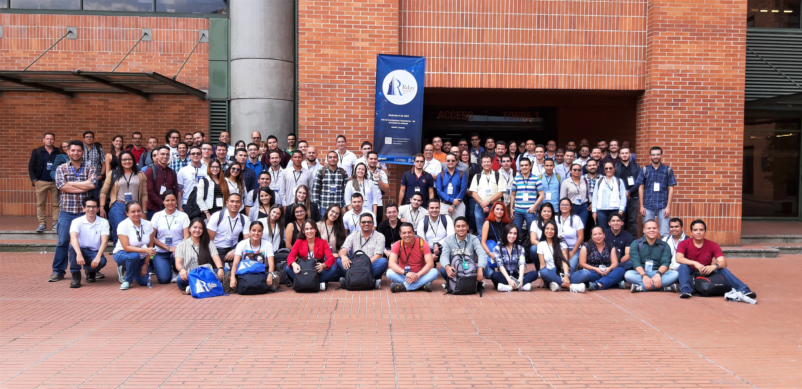
<section style="text-align: center;"><small>Encuentro en el [Rday 2019](https://rdaymedellin.github.io/).</small></section>
  </div>
</div>

Finalmente, el uso del `R` garantiza que otro investigador pueda repetir el experimento, comprobar los resultados obtenidos y estar en la condición de ampliar o refutar las interpretaciones del estudio realizado.


<section style="text-align: center;"><small>Ilustracíon hecha por <font color = "black"><u>\@allison_horst</u></font>.</small></section>

__¡No se desanime!__ Los lenguajes de programación como el `R` no son sencillos de aprender, pero con trabajo y motivación vera como en poco tiempo se lograrán grandes avances. 

### 1.3 Instalación de `R` base y RStudio

`R` base es el software básico que contiene el lenguaje de programación `R`. RStudio es un software que facilita la programación en `R`.

#### 1.3.1 `R` base:

<div class="row">
  <div class="col-md-6" markdown="1">
  + Windows: la instalación de `R` base en windows se realiza a través de la [CRAN](https://cran.r-project.org/mirrors.html) (Comprehensive R Archive Network).
  + Linux: la instalación de `R` base en Linux se realiza escribiendo el siguiente código en la terminal:<br>
  <div style="background-color:#262626">
  <font color = "white"><p> sudo apt-get update</p></font>
  <font color = "white"><p> sudo apt-get install r-base r-base-dev</p></font>
  </div>
  </div>
  <div class="col-md-6" markdown="1">

  </div>
</div>

#### 1.3.2 RStudio:

<div class="row">
  <div class="col-md-6" markdown="1">
  Se puede instalar directamente desde la [página de RStudio](https://rstudio.com/products/rstudio/download/). Hay se encuentran los archivos de instalación tanto en windows como en Linux.
  
  Cuando se abre RStudio se pueden ver cuatro paneles: 
  </div>
  <div class="col-md-6" markdown="1">

  <section style="text-align: center;"><small>Ilustracíon hecha por <font color = "black"><u>\@allison_horst</u></font>.</small></section>
  </div>
</div>

+ La fuente: la libreta de notas para el código


:::caution
Un texto insertado en el código el cual es omitido en la ejecución, se denomina como __comentario__. En `R`, un comentario es un texto que comienza con el símbolo __#__ y se extiende hasta el final de la línea. Este permite que `R` no intente interpretarlo como parte del código.
:::

+ La consola: el corazón de `R`

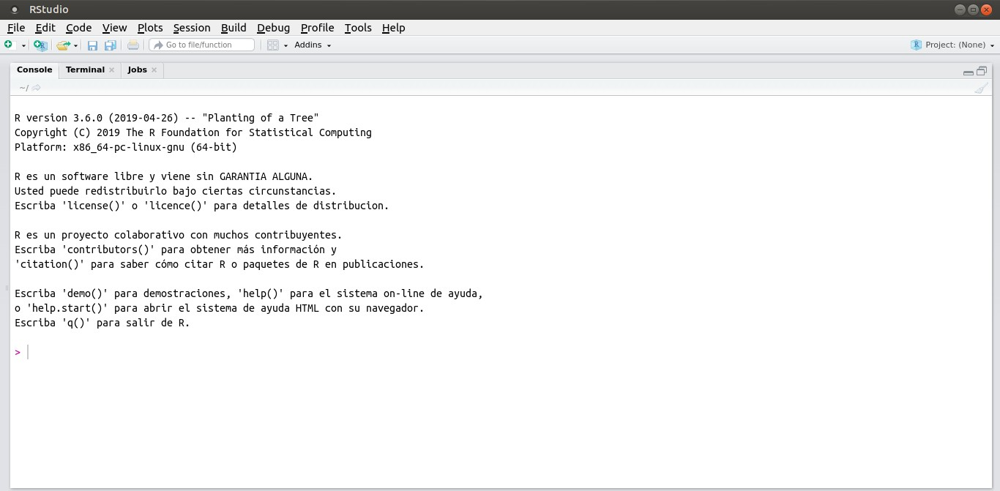

+ El ambiente / el historial

<div class="row">
  <div class="col-md-6" markdown="1">

  </div>
  <div class="col-md-6" markdown="1">

  </div>
</div>

+ Los archivos / las gráficas / la ayuda / los paquetes

<div class="row">
  <div class="col-md-6" markdown="1">

  </div>
  <div class="col-md-6" markdown="1">

  </div>
</div>

<br>

<div class="row">
  <div class="col-md-6" markdown="1">

  </div>
  <div class="col-md-6" markdown="1">

  </div>
</div>

### 1.4 Los paquetes en `R`

<div class="row">
  <div class="col-md-5" markdown="1">
Los paquetes en `R` son colecciones de funciones y conjunto de datos desarrollados por la comunidad. Un paquete de `R` incluye código, documentación para su uso y conjuntos de datos.

Existen dos formas de instalar nuevos paquetes en `R`:

1) Descargarlos de la [CRAN](https://cran.r-project.org/mirrors.html) (Comprehensive R Archive Network) por medio de la función `install.packages()`.

:::example
#### Ejemplo 1.4.1
:::
  </div>
  <div class="col-md-7" markdown="1">

<section style="text-align: center;"><small>Ilustracíon hecha por <font color = "black"><u>\@spren9er</u></font>.</small></section>
  </div>
</div>

<div class="tutorial-exercise" data-label="addition_4" data-caption="Code" data-completion="1" data-diagnostics="1" data-startover="1" data-lines="0">

```text
install.packages('tidyr', 'dplyr', 'ggplot2')
```

<script type="application/json" data-opts-chunk="1">{"fig.width":6.5,"fig.height":4,"fig.retina":2,"fig.align":"default","fig.keep":"high","fig.show":"asis","out.width":624,"warning":false,"error":false,"message":false,"exercise.df_print":"paged","exercise.timelimit":60,"exercise.checker":["function (label = NULL, solution_code = NULL, user_code = NULL, ","    check_code = NULL, envir_result = NULL, evaluate_result = NULL, ","    envir_prep = NULL, last_value = NULL, ...) ","{","    if (is.null(user_code)) {","        return(list(message = \"I didn't receive your code. Did you write any?\", ","            correct = FALSE, type = \"error\", location = \"append\"))","    }","    else {","        user_code <- parse(text = user_code)","        if (length(user_code) == 0) {","            return(list(message = \"I didn't receive your code. Did you write any?\", ","                correct = FALSE, type = \"error\", location = \"append\"))","        }","    }","    if (!is.null(solution_code)) {","        solution_code <- parse(text = solution_code)","        if (length(solution_code) == 0) {","            return(list(message = \"No solution is provided for this exercise.\", ","                correct = TRUE, type = \"info\", location = \"append\"))","        }","    }","    had_error_checking <- FALSE","    checked_result <- tryCatch({","        parsed_check_code <- parse(text = check_code)","        if (length(parsed_check_code) > 1) {","            for (i in 1:(length(parsed_check_code) - 1)) {","                eval(parsed_check_code[[i]], envir_prep)","            }","        }","        grading_code <- rlang::call_standardise(parsed_check_code[[length(parsed_check_code)]], ","            envir_prep)","        grader_args <- list(user_quo = rlang::as_quosure(user_code[[length(user_code)]], ","            envir_result))","        if (!is.null(solution_code)) {","            grader_args$solution_quo <- rlang::as_quosure(solution_code[[length(solution_code)]], ","                envir_prep)","        }","        learnr_args <- list(...)","        learnr_args$label <- label","        learnr_args$solution_code <- solution_code","        learnr_args$user_code <- user_code","        learnr_args$check_code <- check_code","        learnr_args$envir_result <- envir_result","        learnr_args$evaluate_result <- evaluate_result","        learnr_args$envir_prep <- envir_prep","        learnr_args$last_value <- last_value","        grading_code$grader_args <- grader_args","        grading_code$learnr_args <- learnr_args","        envir_prep$ans <- grader_args$user","        eval(grading_code, envir_prep)","    }, error = function(e) {","        message(\"\", e)","        had_error_checking <<- TRUE","        graded(correct = FALSE, message = \"Error occured while checking the submission\")","    })","    if (!checkmate::test_class(checked_result, \"grader_graded\")) {","        stop(\"`grade_learnr` should receive a `graded` value from every `-check` chunk\")","    }","    message_type <- if (had_error_checking) {","        \"warning\"","    }","    else {","        if (checked_result$correct) {","            \"success\"","        }","        else {","            \"error\"","        }","    }","    ret <- list(message = checked_result$message, correct = checked_result$correct, ","        type = message_type, location = \"append\")","    ret","}"]}</script></div>

2) Mediante el uso del paquete `devtools`, el cual permite instalar paquetes alojados en distintos servidores:

  + `install_bioc()` desde [Bioconductor](https://www.bioconductor.org/).
  + `install_cran()` desde [CRAN](https://cran.r-project.org/index.html).
  + `install_git()` desde un repositorio [git](https://git-scm.com/).
  + `install_github()` desde [GitHub](https://github.com/).

:::example
#### Ejemplo 1.4.2
:::

<div class="tutorial-exercise" data-label="addition_5" data-caption="Code" data-completion="1" data-diagnostics="1" data-startover="1" data-lines="0">

```text
install.packages('devtools')
devtools::install_github('tidyverse/dplyr')
```

<script type="application/json" data-opts-chunk="1">{"fig.width":6.5,"fig.height":4,"fig.retina":2,"fig.align":"default","fig.keep":"high","fig.show":"asis","out.width":624,"warning":false,"error":false,"message":false,"exercise.df_print":"paged","exercise.timelimit":60,"exercise.checker":["function (label = NULL, solution_code = NULL, user_code = NULL, ","    check_code = NULL, envir_result = NULL, evaluate_result = NULL, ","    envir_prep = NULL, last_value = NULL, ...) ","{","    if (is.null(user_code)) {","        return(list(message = \"I didn't receive your code. Did you write any?\", ","            correct = FALSE, type = \"error\", location = \"append\"))","    }","    else {","        user_code <- parse(text = user_code)","        if (length(user_code) == 0) {","            return(list(message = \"I didn't receive your code. Did you write any?\", ","                correct = FALSE, type = \"error\", location = \"append\"))","        }","    }","    if (!is.null(solution_code)) {","        solution_code <- parse(text = solution_code)","        if (length(solution_code) == 0) {","            return(list(message = \"No solution is provided for this exercise.\", ","                correct = TRUE, type = \"info\", location = \"append\"))","        }","    }","    had_error_checking <- FALSE","    checked_result <- tryCatch({","        parsed_check_code <- parse(text = check_code)","        if (length(parsed_check_code) > 1) {","            for (i in 1:(length(parsed_check_code) - 1)) {","                eval(parsed_check_code[[i]], envir_prep)","            }","        }","        grading_code <- rlang::call_standardise(parsed_check_code[[length(parsed_check_code)]], ","            envir_prep)","        grader_args <- list(user_quo = rlang::as_quosure(user_code[[length(user_code)]], ","            envir_result))","        if (!is.null(solution_code)) {","            grader_args$solution_quo <- rlang::as_quosure(solution_code[[length(solution_code)]], ","                envir_prep)","        }","        learnr_args <- list(...)","        learnr_args$label <- label","        learnr_args$solution_code <- solution_code","        learnr_args$user_code <- user_code","        learnr_args$check_code <- check_code","        learnr_args$envir_result <- envir_result","        learnr_args$evaluate_result <- evaluate_result","        learnr_args$envir_prep <- envir_prep","        learnr_args$last_value <- last_value","        grading_code$grader_args <- grader_args","        grading_code$learnr_args <- learnr_args","        envir_prep$ans <- grader_args$user","        eval(grading_code, envir_prep)","    }, error = function(e) {","        message(\"\", e)","        had_error_checking <<- TRUE","        graded(correct = FALSE, message = \"Error occured while checking the submission\")","    })","    if (!checkmate::test_class(checked_result, \"grader_graded\")) {","        stop(\"`grade_learnr` should receive a `graded` value from every `-check` chunk\")","    }","    message_type <- if (had_error_checking) {","        \"warning\"","    }","    else {","        if (checked_result$correct) {","            \"success\"","        }","        else {","            \"error\"","        }","    }","    ret <- list(message = checked_result$message, correct = checked_result$correct, ","        type = message_type, location = \"append\")","    ret","}"]}</script></div>

Una vez haya instalado un paquete, estará en la computadora. Si se desea usar una función o un conjunto de datos del paquete instalado, debe cargar el paquete en la sesión de `R`. Para esto, existen dos formas:

1) Con la notación `nombrepaquete::nombrefunción()` para hacer un uso temporal de la función o conjunto de datos.

:::example
#### Ejemplo 1.4.3
:::

<div class="tutorial-exercise" data-label="addition_8" data-caption="Code" data-completion="1" data-diagnostics="1" data-startover="1" data-lines="0">

```text
dplyr::starwars
```

<script type="application/json" data-opts-chunk="1">{"fig.width":6.5,"fig.height":4,"fig.retina":2,"fig.align":"default","fig.keep":"high","fig.show":"asis","out.width":624,"warning":false,"error":false,"message":false,"exercise.df_print":"paged","exercise.timelimit":60,"exercise.checker":["function (label = NULL, solution_code = NULL, user_code = NULL, ","    check_code = NULL, envir_result = NULL, evaluate_result = NULL, ","    envir_prep = NULL, last_value = NULL, ...) ","{","    if (is.null(user_code)) {","        return(list(message = \"I didn't receive your code. Did you write any?\", ","            correct = FALSE, type = \"error\", location = \"append\"))","    }","    else {","        user_code <- parse(text = user_code)","        if (length(user_code) == 0) {","            return(list(message = \"I didn't receive your code. Did you write any?\", ","                correct = FALSE, type = \"error\", location = \"append\"))","        }","    }","    if (!is.null(solution_code)) {","        solution_code <- parse(text = solution_code)","        if (length(solution_code) == 0) {","            return(list(message = \"No solution is provided for this exercise.\", ","                correct = TRUE, type = \"info\", location = \"append\"))","        }","    }","    had_error_checking <- FALSE","    checked_result <- tryCatch({","        parsed_check_code <- parse(text = check_code)","        if (length(parsed_check_code) > 1) {","            for (i in 1:(length(parsed_check_code) - 1)) {","                eval(parsed_check_code[[i]], envir_prep)","            }","        }","        grading_code <- rlang::call_standardise(parsed_check_code[[length(parsed_check_code)]], ","            envir_prep)","        grader_args <- list(user_quo = rlang::as_quosure(user_code[[length(user_code)]], ","            envir_result))","        if (!is.null(solution_code)) {","            grader_args$solution_quo <- rlang::as_quosure(solution_code[[length(solution_code)]], ","                envir_prep)","        }","        learnr_args <- list(...)","        learnr_args$label <- label","        learnr_args$solution_code <- solution_code","        learnr_args$user_code <- user_code","        learnr_args$check_code <- check_code","        learnr_args$envir_result <- envir_result","        learnr_args$evaluate_result <- evaluate_result","        learnr_args$envir_prep <- envir_prep","        learnr_args$last_value <- last_value","        grading_code$grader_args <- grader_args","        grading_code$learnr_args <- learnr_args","        envir_prep$ans <- grader_args$user","        eval(grading_code, envir_prep)","    }, error = function(e) {","        message(\"\", e)","        had_error_checking <<- TRUE","        graded(correct = FALSE, message = \"Error occured while checking the submission\")","    })","    if (!checkmate::test_class(checked_result, \"grader_graded\")) {","        stop(\"`grade_learnr` should receive a `graded` value from every `-check` chunk\")","    }","    message_type <- if (had_error_checking) {","        \"warning\"","    }","    else {","        if (checked_result$correct) {","            \"success\"","        }","        else {","            \"error\"","        }","    }","    ret <- list(message = checked_result$message, correct = checked_result$correct, ","        type = message_type, location = \"append\")","    ret","}"]}</script></div>

:::caution
Una ventaja del método anterior es que es inmediatamente claro para cualquier persona que lea el código qué paquete contiene la función. Sin embargo, un inconveniente es que si usa una función de un paquete con frecuencia, lo obliga a volver a escribir constantemente el nombre del paquete.
:::

2) Cargándolo en la memoria del computador mediante el uso de la función `library()` si su uso es permanente.

:::example
#### Ejemplo 1.4.4
:::

<div class="tutorial-exercise" data-label="addition_9" data-caption="Code" data-completion="1" data-diagnostics="1" data-startover="1" data-lines="0">

```text
library(dplyr)
Datos_starwars <- starwars
```

<script type="application/json" data-opts-chunk="1">{"fig.width":6.5,"fig.height":4,"fig.retina":2,"fig.align":"default","fig.keep":"high","fig.show":"asis","out.width":624,"warning":false,"error":false,"message":false,"exercise.df_print":"paged","exercise.timelimit":60,"exercise.checker":["function (label = NULL, solution_code = NULL, user_code = NULL, ","    check_code = NULL, envir_result = NULL, evaluate_result = NULL, ","    envir_prep = NULL, last_value = NULL, ...) ","{","    if (is.null(user_code)) {","        return(list(message = \"I didn't receive your code. Did you write any?\", ","            correct = FALSE, type = \"error\", location = \"append\"))","    }","    else {","        user_code <- parse(text = user_code)","        if (length(user_code) == 0) {","            return(list(message = \"I didn't receive your code. Did you write any?\", ","                correct = FALSE, type = \"error\", location = \"append\"))","        }","    }","    if (!is.null(solution_code)) {","        solution_code <- parse(text = solution_code)","        if (length(solution_code) == 0) {","            return(list(message = \"No solution is provided for this exercise.\", ","                correct = TRUE, type = \"info\", location = \"append\"))","        }","    }","    had_error_checking <- FALSE","    checked_result <- tryCatch({","        parsed_check_code <- parse(text = check_code)","        if (length(parsed_check_code) > 1) {","            for (i in 1:(length(parsed_check_code) - 1)) {","                eval(parsed_check_code[[i]], envir_prep)","            }","        }","        grading_code <- rlang::call_standardise(parsed_check_code[[length(parsed_check_code)]], ","            envir_prep)","        grader_args <- list(user_quo = rlang::as_quosure(user_code[[length(user_code)]], ","            envir_result))","        if (!is.null(solution_code)) {","            grader_args$solution_quo <- rlang::as_quosure(solution_code[[length(solution_code)]], ","                envir_prep)","        }","        learnr_args <- list(...)","        learnr_args$label <- label","        learnr_args$solution_code <- solution_code","        learnr_args$user_code <- user_code","        learnr_args$check_code <- check_code","        learnr_args$envir_result <- envir_result","        learnr_args$evaluate_result <- evaluate_result","        learnr_args$envir_prep <- envir_prep","        learnr_args$last_value <- last_value","        grading_code$grader_args <- grader_args","        grading_code$learnr_args <- learnr_args","        envir_prep$ans <- grader_args$user","        eval(grading_code, envir_prep)","    }, error = function(e) {","        message(\"\", e)","        had_error_checking <<- TRUE","        graded(correct = FALSE, message = \"Error occured while checking the submission\")","    })","    if (!checkmate::test_class(checked_result, \"grader_graded\")) {","        stop(\"`grade_learnr` should receive a `graded` value from every `-check` chunk\")","    }","    message_type <- if (had_error_checking) {","        \"warning\"","    }","    else {","        if (checked_result$correct) {","            \"success\"","        }","        else {","            \"error\"","        }","    }","    ret <- list(message = checked_result$message, correct = checked_result$correct, ","        type = message_type, location = \"append\")","    ret","}"]}</script></div>

Para acceder a la descripción de un paquete desde `R` se puede emplear las funciones `packageDescription()` y `help()`.

:::example
#### Ejemplo 1.4.5
:::

<div class="tutorial-exercise" data-label="addition_6" data-caption="Code" data-completion="1" data-diagnostics="1" data-startover="1" data-lines="0">

```text
packageDescription('dplyr')
help(package = 'dplyr')
```

<script type="application/json" data-opts-chunk="1">{"fig.width":6.5,"fig.height":4,"fig.retina":2,"fig.align":"default","fig.keep":"high","fig.show":"asis","out.width":624,"warning":false,"error":false,"message":false,"exercise.df_print":"paged","exercise.timelimit":60,"exercise.checker":["function (label = NULL, solution_code = NULL, user_code = NULL, ","    check_code = NULL, envir_result = NULL, evaluate_result = NULL, ","    envir_prep = NULL, last_value = NULL, ...) ","{","    if (is.null(user_code)) {","        return(list(message = \"I didn't receive your code. Did you write any?\", ","            correct = FALSE, type = \"error\", location = \"append\"))","    }","    else {","        user_code <- parse(text = user_code)","        if (length(user_code) == 0) {","            return(list(message = \"I didn't receive your code. Did you write any?\", ","                correct = FALSE, type = \"error\", location = \"append\"))","        }","    }","    if (!is.null(solution_code)) {","        solution_code <- parse(text = solution_code)","        if (length(solution_code) == 0) {","            return(list(message = \"No solution is provided for this exercise.\", ","                correct = TRUE, type = \"info\", location = \"append\"))","        }","    }","    had_error_checking <- FALSE","    checked_result <- tryCatch({","        parsed_check_code <- parse(text = check_code)","        if (length(parsed_check_code) > 1) {","            for (i in 1:(length(parsed_check_code) - 1)) {","                eval(parsed_check_code[[i]], envir_prep)","            }","        }","        grading_code <- rlang::call_standardise(parsed_check_code[[length(parsed_check_code)]], ","            envir_prep)","        grader_args <- list(user_quo = rlang::as_quosure(user_code[[length(user_code)]], ","            envir_result))","        if (!is.null(solution_code)) {","            grader_args$solution_quo <- rlang::as_quosure(solution_code[[length(solution_code)]], ","                envir_prep)","        }","        learnr_args <- list(...)","        learnr_args$label <- label","        learnr_args$solution_code <- solution_code","        learnr_args$user_code <- user_code","        learnr_args$check_code <- check_code","        learnr_args$envir_result <- envir_result","        learnr_args$evaluate_result <- evaluate_result","        learnr_args$envir_prep <- envir_prep","        learnr_args$last_value <- last_value","        grading_code$grader_args <- grader_args","        grading_code$learnr_args <- learnr_args","        envir_prep$ans <- grader_args$user","        eval(grading_code, envir_prep)","    }, error = function(e) {","        message(\"\", e)","        had_error_checking <<- TRUE","        graded(correct = FALSE, message = \"Error occured while checking the submission\")","    })","    if (!checkmate::test_class(checked_result, \"grader_graded\")) {","        stop(\"`grade_learnr` should receive a `graded` value from every `-check` chunk\")","    }","    message_type <- if (had_error_checking) {","        \"warning\"","    }","    else {","        if (checked_result$correct) {","            \"success\"","        }","        else {","            \"error\"","        }","    }","    ret <- list(message = checked_result$message, correct = checked_result$correct, ","        type = message_type, location = \"append\")","    ret","}"]}</script></div>

Otras funciones que permiten la gestión de los paquetes instalados en el computador:

<div class="tutorial-exercise" data-label="addition_7" data-caption="Code" data-completion="1" data-diagnostics="1" data-startover="1" data-lines="0">

```text
installed.packages() # Para ver que paquetes se tienen instalados.
remove.packages('dplyr') # Si se desease eliminar un paquete (en este caso el paquete dplyr).
old.packages() # Para comprobar que paquetes necesitan ser actualizados.
update.packages() # Para actualizar todo los paquetes instalados.
```

<script type="application/json" data-opts-chunk="1">{"fig.width":6.5,"fig.height":4,"fig.retina":2,"fig.align":"default","fig.keep":"high","fig.show":"asis","out.width":624,"warning":false,"error":false,"message":false,"exercise.df_print":"paged","exercise.timelimit":60,"exercise.checker":["function (label = NULL, solution_code = NULL, user_code = NULL, ","    check_code = NULL, envir_result = NULL, evaluate_result = NULL, ","    envir_prep = NULL, last_value = NULL, ...) ","{","    if (is.null(user_code)) {","        return(list(message = \"I didn't receive your code. Did you write any?\", ","            correct = FALSE, type = \"error\", location = \"append\"))","    }","    else {","        user_code <- parse(text = user_code)","        if (length(user_code) == 0) {","            return(list(message = \"I didn't receive your code. Did you write any?\", ","                correct = FALSE, type = \"error\", location = \"append\"))","        }","    }","    if (!is.null(solution_code)) {","        solution_code <- parse(text = solution_code)","        if (length(solution_code) == 0) {","            return(list(message = \"No solution is provided for this exercise.\", ","                correct = TRUE, type = \"info\", location = \"append\"))","        }","    }","    had_error_checking <- FALSE","    checked_result <- tryCatch({","        parsed_check_code <- parse(text = check_code)","        if (length(parsed_check_code) > 1) {","            for (i in 1:(length(parsed_check_code) - 1)) {","                eval(parsed_check_code[[i]], envir_prep)","            }","        }","        grading_code <- rlang::call_standardise(parsed_check_code[[length(parsed_check_code)]], ","            envir_prep)","        grader_args <- list(user_quo = rlang::as_quosure(user_code[[length(user_code)]], ","            envir_result))","        if (!is.null(solution_code)) {","            grader_args$solution_quo <- rlang::as_quosure(solution_code[[length(solution_code)]], ","                envir_prep)","        }","        learnr_args <- list(...)","        learnr_args$label <- label","        learnr_args$solution_code <- solution_code","        learnr_args$user_code <- user_code","        learnr_args$check_code <- check_code","        learnr_args$envir_result <- envir_result","        learnr_args$evaluate_result <- evaluate_result","        learnr_args$envir_prep <- envir_prep","        learnr_args$last_value <- last_value","        grading_code$grader_args <- grader_args","        grading_code$learnr_args <- learnr_args","        envir_prep$ans <- grader_args$user","        eval(grading_code, envir_prep)","    }, error = function(e) {","        message(\"\", e)","        had_error_checking <<- TRUE","        graded(correct = FALSE, message = \"Error occured while checking the submission\")","    })","    if (!checkmate::test_class(checked_result, \"grader_graded\")) {","        stop(\"`grade_learnr` should receive a `graded` value from every `-check` chunk\")","    }","    message_type <- if (had_error_checking) {","        \"warning\"","    }","    else {","        if (checked_result$correct) {","            \"success\"","        }","        else {","            \"error\"","        }","    }","    ret <- list(message = checked_result$message, correct = checked_result$correct, ","        type = message_type, location = \"append\")","    ret","}"]}</script></div>

### 1.5 Trabajando con proyectos

Un __directorio de trabajo__ en `R` es el lugar en la computadora en el que se encuentran los archivos con los que se esta trabajando. Es el lugar donde `R` buscara los archivos para importarlos y al que serán exportados.

Con la función `getwd()` se puede encontrar el directorio en el que se esta trabajando.

:::example
#### Ejemplo 1.5.1
:::

<div class="tutorial-exercise" data-label="addition_10" data-caption="Code" data-completion="1" data-diagnostics="1" data-startover="1" data-lines="0">

```text
getwd() # Da como resultado la ruta "/home/leo/Escritorio/github/Un_curso_amigable_sobre_R".
```

<script type="application/json" data-opts-chunk="1">{"fig.width":6.5,"fig.height":4,"fig.retina":2,"fig.align":"default","fig.keep":"high","fig.show":"asis","out.width":624,"warning":false,"error":false,"message":false,"exercise.df_print":"paged","exercise.timelimit":60,"exercise.checker":["function (label = NULL, solution_code = NULL, user_code = NULL, ","    check_code = NULL, envir_result = NULL, evaluate_result = NULL, ","    envir_prep = NULL, last_value = NULL, ...) ","{","    if (is.null(user_code)) {","        return(list(message = \"I didn't receive your code. Did you write any?\", ","            correct = FALSE, type = \"error\", location = \"append\"))","    }","    else {","        user_code <- parse(text = user_code)","        if (length(user_code) == 0) {","            return(list(message = \"I didn't receive your code. Did you write any?\", ","                correct = FALSE, type = \"error\", location = \"append\"))","        }","    }","    if (!is.null(solution_code)) {","        solution_code <- parse(text = solution_code)","        if (length(solution_code) == 0) {","            return(list(message = \"No solution is provided for this exercise.\", ","                correct = TRUE, type = \"info\", location = \"append\"))","        }","    }","    had_error_checking <- FALSE","    checked_result <- tryCatch({","        parsed_check_code <- parse(text = check_code)","        if (length(parsed_check_code) > 1) {","            for (i in 1:(length(parsed_check_code) - 1)) {","                eval(parsed_check_code[[i]], envir_prep)","            }","        }","        grading_code <- rlang::call_standardise(parsed_check_code[[length(parsed_check_code)]], ","            envir_prep)","        grader_args <- list(user_quo = rlang::as_quosure(user_code[[length(user_code)]], ","            envir_result))","        if (!is.null(solution_code)) {","            grader_args$solution_quo <- rlang::as_quosure(solution_code[[length(solution_code)]], ","                envir_prep)","        }","        learnr_args <- list(...)","        learnr_args$label <- label","        learnr_args$solution_code <- solution_code","        learnr_args$user_code <- user_code","        learnr_args$check_code <- check_code","        learnr_args$envir_result <- envir_result","        learnr_args$evaluate_result <- evaluate_result","        learnr_args$envir_prep <- envir_prep","        learnr_args$last_value <- last_value","        grading_code$grader_args <- grader_args","        grading_code$learnr_args <- learnr_args","        envir_prep$ans <- grader_args$user","        eval(grading_code, envir_prep)","    }, error = function(e) {","        message(\"\", e)","        had_error_checking <<- TRUE","        graded(correct = FALSE, message = \"Error occured while checking the submission\")","    })","    if (!checkmate::test_class(checked_result, \"grader_graded\")) {","        stop(\"`grade_learnr` should receive a `graded` value from every `-check` chunk\")","    }","    message_type <- if (had_error_checking) {","        \"warning\"","    }","    else {","        if (checked_result$correct) {","            \"success\"","        }","        else {","            \"error\"","        }","    }","    ret <- list(message = checked_result$message, correct = checked_result$correct, ","        type = message_type, location = \"append\")","    ret","}"]}</script></div>

Para cambiar el directorio de trabajo se puede emplear la función `setwd()`, dando como argumento la ruta del directorio que se quiere usar. 

:::example
#### Ejemplo 1.5.2
:::

<div class="tutorial-exercise" data-label="addition_11" data-caption="Code" data-completion="1" data-diagnostics="1" data-startover="1" data-lines="0">

```text
setwd(dir = "/home/leo/Escritorio/Curso_estadística") # Se cambia el directorio de trabajo a la carpeta Curso_estadistica.
```

<script type="application/json" data-opts-chunk="1">{"fig.width":6.5,"fig.height":4,"fig.retina":2,"fig.align":"default","fig.keep":"high","fig.show":"asis","out.width":624,"warning":false,"error":false,"message":false,"exercise.df_print":"paged","exercise.timelimit":60,"exercise.checker":["function (label = NULL, solution_code = NULL, user_code = NULL, ","    check_code = NULL, envir_result = NULL, evaluate_result = NULL, ","    envir_prep = NULL, last_value = NULL, ...) ","{","    if (is.null(user_code)) {","        return(list(message = \"I didn't receive your code. Did you write any?\", ","            correct = FALSE, type = \"error\", location = \"append\"))","    }","    else {","        user_code <- parse(text = user_code)","        if (length(user_code) == 0) {","            return(list(message = \"I didn't receive your code. Did you write any?\", ","                correct = FALSE, type = \"error\", location = \"append\"))","        }","    }","    if (!is.null(solution_code)) {","        solution_code <- parse(text = solution_code)","        if (length(solution_code) == 0) {","            return(list(message = \"No solution is provided for this exercise.\", ","                correct = TRUE, type = \"info\", location = \"append\"))","        }","    }","    had_error_checking <- FALSE","    checked_result <- tryCatch({","        parsed_check_code <- parse(text = check_code)","        if (length(parsed_check_code) > 1) {","            for (i in 1:(length(parsed_check_code) - 1)) {","                eval(parsed_check_code[[i]], envir_prep)","            }","        }","        grading_code <- rlang::call_standardise(parsed_check_code[[length(parsed_check_code)]], ","            envir_prep)","        grader_args <- list(user_quo = rlang::as_quosure(user_code[[length(user_code)]], ","            envir_result))","        if (!is.null(solution_code)) {","            grader_args$solution_quo <- rlang::as_quosure(solution_code[[length(solution_code)]], ","                envir_prep)","        }","        learnr_args <- list(...)","        learnr_args$label <- label","        learnr_args$solution_code <- solution_code","        learnr_args$user_code <- user_code","        learnr_args$check_code <- check_code","        learnr_args$envir_result <- envir_result","        learnr_args$evaluate_result <- evaluate_result","        learnr_args$envir_prep <- envir_prep","        learnr_args$last_value <- last_value","        grading_code$grader_args <- grader_args","        grading_code$learnr_args <- learnr_args","        envir_prep$ans <- grader_args$user","        eval(grading_code, envir_prep)","    }, error = function(e) {","        message(\"\", e)","        had_error_checking <<- TRUE","        graded(correct = FALSE, message = \"Error occured while checking the submission\")","    })","    if (!checkmate::test_class(checked_result, \"grader_graded\")) {","        stop(\"`grade_learnr` should receive a `graded` value from every `-check` chunk\")","    }","    message_type <- if (had_error_checking) {","        \"warning\"","    }","    else {","        if (checked_result$correct) {","            \"success\"","        }","        else {","            \"error\"","        }","    }","    ret <- list(message = checked_result$message, correct = checked_result$correct, ","        type = message_type, location = \"append\")","    ret","}"]}</script></div>

Sin embargo como señala [Jenny Bryan](https://www.tidyverse.org/blog/2017/12/workflow-vs-script/), con la función `setwd()` es practicamente imposible para cualquier otra persona que no sea el autor original del código `R`, en su computadora, hacer que las rutas de archivo funcionen.<!--"La posibilidad de que el comando setwd() tenga el efecto deseado (hacer que las rutas de archivo funcionen) para cualquier persona además de su autor es 0%. También es poco probable que funcione para el autor dentro de uno o dos años o para computadoras a partir de ahora. El proyecto no es autónomo y portátil. Para recrear y tal vez extender esta trama, el destinatario afortunado deberá editar manualmente uno o más caminos para reflejar dónde ha aterrizado el proyecto en su máquina. Cuando haces esto por 73a vez en 2 días, mientras marcas una tarea, comienzas a fantasear con encender la computadora del perpetrador."--> La solución consistiría en trabajar con __proyectos__. 

<div class="row">
  <div class="col-md-5" markdown="1">
  Un proyecto es un directorio de trabajo nombrado como un archivo __.Rproj__. Cuando se abre un proyecto, el directorio de trabajo se establecerá automáticamente en el directorio en el que se encuentra el archivo __.Rproj__.
  
  El archivo __.Rproj__ se puede crear yendo a "File" (archivo) &#8594; "New Project..." (nuevo proyecto) en RStudio, que luego se asocia con la carpeta o directorio especificado. 
  
  Configurar un directorio de trabajo correctamente también ayuda a desarrollar buenos hábitos que conducen a un __análisis reproducible__.
  </div>
  <div class="col-md-7" markdown="1">


<section style="text-align: center;"><small>Ilustracíon hecha por <font color = "black"><u>\@allison_horst</u></font>.</small></section>
  </div>
</div>

#### 1.5.1 Estructurando el directorio de trabajo

Además de usar proyectos, también es una buena práctica estructurar el directorio de una manera que ayude a cualquier persona con la que se esta colaborando, o una versión futura de usted intente reproducir algunos análisis.


## 2. Operaciones básicas en R

Antes de realizar operaciones sobre algunos objetos en `R`, veamos cuales de estas podemos realizar.

* Suma y diferencia (+, -)
* Producto y división (*, /)
* Potencia (^, **)
* Residuo (%%)
* Mayor, mayor o igual, menor, menor o igual, igual y diferente que (>, >=, <, <=, ==, !=)
* Conjunción (&, &&), disyunción (|, ||)

### Indexación

Dentro de los múltiples objetos de `R` sean estos simples como un vector o compuestos como un dataframe debemos tener claro el manejo de nuestra información, por lo cual es necesario saber cómo acceder a ella, segmentarla, seleccionarla y/o cambiarla. Para cualquiera de los casos se utiliza la indexación, lo cual significa que los elementos de nuestros objetos están identificados usualmente mediante un índice entero que inicia con el número uno `[1]`.

En las secciones posteriores se explorará cada objeto con detalle, abordando las distintas operaciones que se pueden realizar sobre cada uno de ellos incluyendo la segmentación, selección y modificación.


<div class="row">
  <div class="col-md-6" markdown="1">

```
[1] "[1][2][3][4][5][6][7][8][9]"
```

```
[1] 11 12 13 14 15 16 17 18 19
```
  </div>
  <div class="col-md-6" markdown="1">

```
     [,1] [,2] [,3] [,4] [,5]
[1,]    1    6   11   16   21
[2,]    2    7   12   17   22
[3,]    3    8   13   18   23
[4,]    4    9   14   19   24
[5,]    5   10   15   20   25
```
  </div>
</div>

### Coerción

Existe una forma de convertir el tipo de un vector o matriz a otro tipo y para ello se cuentan con funciones base del tipo `as.*`

+------------------+--------------------------------------+
| Función          | Acción                               |
+==================+======================================+
| `as.character()` | Convertir objetos a tipo caracter    |
+------------------+--------------------------------------+
| `as.complex()`   | Convertir objetos a tipo complejo    |
+------------------+--------------------------------------+
| `as.data.frame()`| Convertir objetos a tipo dataframe   |
+------------------+--------------------------------------+
| `as.Date()`      | Convertir objetos a tipo fecha       |
+------------------+--------------------------------------+
| `as.double()`    | Convertir objetos a tipo doble       |
+------------------+--------------------------------------+
| `as.factor()`    | Convertir objetos a tipo factor      |
+------------------+--------------------------------------+
| `as.integer()`   | Convertir objetos a tipo entero      |
+------------------+--------------------------------------+
| `as.list()`      | Convertir objetos a tipo lista       |
+------------------+--------------------------------------+
| `as.logical()`   | Convertir objetos a tipo lógico      |
+------------------+--------------------------------------+
| `as.matrix()`    | Convertir objetos a tipo matriz      |
+------------------+--------------------------------------+
| `as.numeric()`   | Convertir objetos a tipo numérico    |
+------------------+--------------------------------------+
| `as.POSIXct()`   | Convertir objetos a tipo fecha y hora|
+------------------+--------------------------------------+
| `as.vector()`    | Convertir objetos a tipo vector      |
+------------------+--------------------------------------+

### Funciones de prueba 

En algunos casos diferenciar o reconocer el tipo de un vector o matriz que se tiene no es tan simple, en estos casos se utiliza la función `typeof()`, sin embargo existe también la opción de utilizar funciones que devuelvan valores de `TRUE` o `FALSE`.  En las funciones base de `R` se encuentran funciones del tipo `is.*`. Una alternativa a las funciones base de `R` son las del paquete **purr** los cuales son del tipo `is_*`

+------------------+-----------------+
| R base           | purr            |
+==================+=================+
| `is.logical()`   | `is_logical()`  |
+------------------+-----------------+
| `is.integer()`   | `is_integer()`  |
+------------------+-----------------+
| `is.double()`    | `is_double()`   |
+------------------+-----------------+
| `is.numeric()`   | `is_numeric()`  |
+------------------+-----------------+
| `is.character()` | `is_character()`|
+------------------+-----------------+
| `is.list()`      | `is_list()`     |
+------------------+-----------------+
| `is.vector()`    | `is_vector()`   |
+------------------+-----------------+

### Funciones útiles

En `R` se cuenta con las conocidas funciones base, muchas con utilidades matemáticas o estadísticas. A continuación podra ver algunas de ellas los cuales pueden ser muy útiles en cualquier proyecto de análisis. 

+-------------+-------------------------------------------------------------------+
| Función     | Acción                                                            |
+=============+===================================================================+
| `str()`     | Devuelve la estructura de un objeto                               |
+-------------+-------------------------------------------------------------------+
| `sample()`  | Toma una muestra del tamaño especificado de determiando objeto    |
+-------------+-------------------------------------------------------------------+
| `length()`  | Calcula el número de elementos del objeto                         |
+-------------+-------------------------------------------------------------------+
| `nrow()`    | Calcula el número de filas en un objeto de dos dimensiones        |
+-------------+-------------------------------------------------------------------+
| `ncol()`    | Calcula el número de columnas en un objeto de dos dimensiones     |
+-------------+-------------------------------------------------------------------+
| `table()`   | Devuelve tablas de contingencia de conteos                        |
+-------------+-------------------------------------------------------------------+
| `sort()`    | Ordena los elementos de un vector ascendentemente                 |
+-------------+-------------------------------------------------------------------+
| `order()`   | Devuelve una permutación que reorganiza su primer argumento       |
+-------------+-------------------------------------------------------------------+
| `round()`   | Redondea los valor sin decimales por defecto                      |
+-------------+-------------------------------------------------------------------+
| `floor()`   | Devuelve el entero más grande que no sea mayor que el número dado |
+-------------+-------------------------------------------------------------------+
| `sqrt()`    | Calcula la raíz cuadrada de un vector numérico                    |
+-------------+-------------------------------------------------------------------+
| `sum()`     | Calcula la suma de los elementos del objeto                       |
+-------------+-------------------------------------------------------------------+
| `prod()`    | Calcula la producto de los elementos del objeto                   |
+-------------+-------------------------------------------------------------------+
| `abs()`     | Devuelve el valor absoluto de un vector numérico                  |
+-------------+-------------------------------------------------------------------+
| `mean()`    | Calcula la media de un vector numérico                            |
+-------------+-------------------------------------------------------------------+
| `median()`  | Calcula la media de un vector numérico                            |
+-------------+-------------------------------------------------------------------+
| `sd()`      | Calcula la desviacion estandar de un vector numérico              |
+-------------+-------------------------------------------------------------------+
| `IQR()`     | Calcula el rango intercuartílico de un vector numérico            |
+-------------+-------------------------------------------------------------------+
| `var()`     | Calcula la varianza estandar de un vector numérico                |
+-------------+-------------------------------------------------------------------+
| `cor()`     | Calcula la correlación de dos vectores numéricos                  |
+-------------+-------------------------------------------------------------------+
| `quantile()`| Devuelve los cuantiles seleccionados de un vector numérico        |
+-------------+-------------------------------------------------------------------+

<details><summary>2.1 Operaciones con vectores</summary> 

Antes de iniciar con ejemplos y ejercicios se debe tener presente que un vector es una colección de elementos de la misma clase atómica, es decir que un vector puede contener `n` elementos del mismo tipo, ya sean estos números, caracteres, factores o lógicos, y nunca podrán ser de dos o más tipos. A medida que vea los ejemplos y realice los ejercicios aprenderá distintas formas de crear vectores.

A continuación podra observar vectores con distintas clases atómicas y qué sucede si intenta mezclarlas.

:::example
#### Ejemplo 2.1.1
:::

<div class="tutorial-exercise" data-label="addition_211" data-caption="Code" data-completion="1" data-diagnostics="1" data-startover="1" data-lines="0">

```text
#Vector numérico
num <- c(1, 2, 3, 4, 5)
num
#Vector de caracteres
let <- c("a", "b", "c", "d", "e", "f")
let
#Vector de Factores
fac <- factor(c("f1", "f2", "f3", "f2", "f1"))
fac
#Vector logico
log <- c(TRUE, FALSE, TRUE, TRUE, TRUE, FALSE)
log
#mezcla de clases atomicas
c(num, let)
c(num, log)
```

<script type="application/json" data-opts-chunk="1">{"fig.width":6.5,"fig.height":4,"fig.retina":2,"fig.align":"default","fig.keep":"high","fig.show":"asis","out.width":624,"warning":false,"error":false,"message":false,"exercise.df_print":"paged","exercise.timelimit":60,"exercise.checker":["function (label = NULL, solution_code = NULL, user_code = NULL, ","    check_code = NULL, envir_result = NULL, evaluate_result = NULL, ","    envir_prep = NULL, last_value = NULL, ...) ","{","    if (is.null(user_code)) {","        return(list(message = \"I didn't receive your code. Did you write any?\", ","            correct = FALSE, type = \"error\", location = \"append\"))","    }","    else {","        user_code <- parse(text = user_code)","        if (length(user_code) == 0) {","            return(list(message = \"I didn't receive your code. Did you write any?\", ","                correct = FALSE, type = \"error\", location = \"append\"))","        }","    }","    if (!is.null(solution_code)) {","        solution_code <- parse(text = solution_code)","        if (length(solution_code) == 0) {","            return(list(message = \"No solution is provided for this exercise.\", ","                correct = TRUE, type = \"info\", location = \"append\"))","        }","    }","    had_error_checking <- FALSE","    checked_result <- tryCatch({","        parsed_check_code <- parse(text = check_code)","        if (length(parsed_check_code) > 1) {","            for (i in 1:(length(parsed_check_code) - 1)) {","                eval(parsed_check_code[[i]], envir_prep)","            }","        }","        grading_code <- rlang::call_standardise(parsed_check_code[[length(parsed_check_code)]], ","            envir_prep)","        grader_args <- list(user_quo = rlang::as_quosure(user_code[[length(user_code)]], ","            envir_result))","        if (!is.null(solution_code)) {","            grader_args$solution_quo <- rlang::as_quosure(solution_code[[length(solution_code)]], ","                envir_prep)","        }","        learnr_args <- list(...)","        learnr_args$label <- label","        learnr_args$solution_code <- solution_code","        learnr_args$user_code <- user_code","        learnr_args$check_code <- check_code","        learnr_args$envir_result <- envir_result","        learnr_args$evaluate_result <- evaluate_result","        learnr_args$envir_prep <- envir_prep","        learnr_args$last_value <- last_value","        grading_code$grader_args <- grader_args","        grading_code$learnr_args <- learnr_args","        envir_prep$ans <- grader_args$user","        eval(grading_code, envir_prep)","    }, error = function(e) {","        message(\"\", e)","        had_error_checking <<- TRUE","        graded(correct = FALSE, message = \"Error occured while checking the submission\")","    })","    if (!checkmate::test_class(checked_result, \"grader_graded\")) {","        stop(\"`grade_learnr` should receive a `graded` value from every `-check` chunk\")","    }","    message_type <- if (had_error_checking) {","        \"warning\"","    }","    else {","        if (checked_result$correct) {","            \"success\"","        }","        else {","            \"error\"","        }","    }","    ret <- list(message = checked_result$message, correct = checked_result$correct, ","        type = message_type, location = \"append\")","    ret","}"]}</script></div>

Como vio en la última parte, al mezclar dos clases atómicas no se obtiene un error. Sin embargo los vectores mezclados toman la clase solo de uno de ellos (la más compleja). En el primero, los números de `num` quedan entre comillas, lo cual implica que ahora son caracteres, de igual forma en el vector de valores lógicos `log`, los elementos son convertidos a su equivalente numérico.

A continuación se plantea un ejemplo en el cual se genera un vector de prueba, y con el mismo se realizará algunas operaciones aritméticas básicas como suma, resta, división, multiplicación y exponenciación.

Operaciones de suma.

:::example
#### Ejemplo 2.1.2
:::

<div class="tutorial-exercise" data-label="addition_212" data-caption="Code" data-completion="1" data-diagnostics="1" data-startover="1" data-lines="0">

```text
#Vector de prueba
x <- c(1:8)
x
#Suma sobre cada elemento del vector de prueba
test_1 <- x + 2
test_1
#Suma repetitiva sobre los elementos del vector de prueba
test_2 <- x + c(10, 20)
test_2
#Suma uno a uno sobre nuestro vector de prueba 
test_3 <- x + c(8:1) 
test_3
```

<script type="application/json" data-opts-chunk="1">{"fig.width":6.5,"fig.height":4,"fig.retina":2,"fig.align":"default","fig.keep":"high","fig.show":"asis","out.width":624,"warning":false,"error":false,"message":false,"exercise.df_print":"paged","exercise.timelimit":60,"exercise.checker":["function (label = NULL, solution_code = NULL, user_code = NULL, ","    check_code = NULL, envir_result = NULL, evaluate_result = NULL, ","    envir_prep = NULL, last_value = NULL, ...) ","{","    if (is.null(user_code)) {","        return(list(message = \"I didn't receive your code. Did you write any?\", ","            correct = FALSE, type = \"error\", location = \"append\"))","    }","    else {","        user_code <- parse(text = user_code)","        if (length(user_code) == 0) {","            return(list(message = \"I didn't receive your code. Did you write any?\", ","                correct = FALSE, type = \"error\", location = \"append\"))","        }","    }","    if (!is.null(solution_code)) {","        solution_code <- parse(text = solution_code)","        if (length(solution_code) == 0) {","            return(list(message = \"No solution is provided for this exercise.\", ","                correct = TRUE, type = \"info\", location = \"append\"))","        }","    }","    had_error_checking <- FALSE","    checked_result <- tryCatch({","        parsed_check_code <- parse(text = check_code)","        if (length(parsed_check_code) > 1) {","            for (i in 1:(length(parsed_check_code) - 1)) {","                eval(parsed_check_code[[i]], envir_prep)","            }","        }","        grading_code <- rlang::call_standardise(parsed_check_code[[length(parsed_check_code)]], ","            envir_prep)","        grader_args <- list(user_quo = rlang::as_quosure(user_code[[length(user_code)]], ","            envir_result))","        if (!is.null(solution_code)) {","            grader_args$solution_quo <- rlang::as_quosure(solution_code[[length(solution_code)]], ","                envir_prep)","        }","        learnr_args <- list(...)","        learnr_args$label <- label","        learnr_args$solution_code <- solution_code","        learnr_args$user_code <- user_code","        learnr_args$check_code <- check_code","        learnr_args$envir_result <- envir_result","        learnr_args$evaluate_result <- evaluate_result","        learnr_args$envir_prep <- envir_prep","        learnr_args$last_value <- last_value","        grading_code$grader_args <- grader_args","        grading_code$learnr_args <- learnr_args","        envir_prep$ans <- grader_args$user","        eval(grading_code, envir_prep)","    }, error = function(e) {","        message(\"\", e)","        had_error_checking <<- TRUE","        graded(correct = FALSE, message = \"Error occured while checking the submission\")","    })","    if (!checkmate::test_class(checked_result, \"grader_graded\")) {","        stop(\"`grade_learnr` should receive a `graded` value from every `-check` chunk\")","    }","    message_type <- if (had_error_checking) {","        \"warning\"","    }","    else {","        if (checked_result$correct) {","            \"success\"","        }","        else {","            \"error\"","        }","    }","    ret <- list(message = checked_result$message, correct = checked_result$correct, ","        type = message_type, location = \"append\")","    ret","}"]}</script></div>

De igual forma se puede utilizar la resta. Te invito a que restablezcas el vector de prueba `x` a partir de los vectores test_1, test_2, test_3. Para ello copia los vectores del fragmento de código anterior y crear de nuevo el vector `x`. __¡Vamos confio en que podrás hacerlo!__

:::exercise
#### Ejercicio 2.1.1
:::

<div class="tutorial-exercise" data-label="exe_211" data-caption="Code" data-completion="1" data-diagnostics="1" data-startover="1" data-lines="0">

```text
test_1 <- c(1:8) + 2
test_2 <- c(1:8) + c(10, 20)
test_3 <- c(1:8) + 8:1
# Ahora es tu turno
```

<script type="application/json" data-opts-chunk="1">{"fig.width":6.5,"fig.height":4,"fig.retina":2,"fig.align":"default","fig.keep":"high","fig.show":"asis","out.width":624,"warning":false,"error":false,"message":false,"exercise.df_print":"paged","exercise.timelimit":60,"exercise.checker":["function (label = NULL, solution_code = NULL, user_code = NULL, ","    check_code = NULL, envir_result = NULL, evaluate_result = NULL, ","    envir_prep = NULL, last_value = NULL, ...) ","{","    if (is.null(user_code)) {","        return(list(message = \"I didn't receive your code. Did you write any?\", ","            correct = FALSE, type = \"error\", location = \"append\"))","    }","    else {","        user_code <- parse(text = user_code)","        if (length(user_code) == 0) {","            return(list(message = \"I didn't receive your code. Did you write any?\", ","                correct = FALSE, type = \"error\", location = \"append\"))","        }","    }","    if (!is.null(solution_code)) {","        solution_code <- parse(text = solution_code)","        if (length(solution_code) == 0) {","            return(list(message = \"No solution is provided for this exercise.\", ","                correct = TRUE, type = \"info\", location = \"append\"))","        }","    }","    had_error_checking <- FALSE","    checked_result <- tryCatch({","        parsed_check_code <- parse(text = check_code)","        if (length(parsed_check_code) > 1) {","            for (i in 1:(length(parsed_check_code) - 1)) {","                eval(parsed_check_code[[i]], envir_prep)","            }","        }","        grading_code <- rlang::call_standardise(parsed_check_code[[length(parsed_check_code)]], ","            envir_prep)","        grader_args <- list(user_quo = rlang::as_quosure(user_code[[length(user_code)]], ","            envir_result))","        if (!is.null(solution_code)) {","            grader_args$solution_quo <- rlang::as_quosure(solution_code[[length(solution_code)]], ","                envir_prep)","        }","        learnr_args <- list(...)","        learnr_args$label <- label","        learnr_args$solution_code <- solution_code","        learnr_args$user_code <- user_code","        learnr_args$check_code <- check_code","        learnr_args$envir_result <- envir_result","        learnr_args$evaluate_result <- evaluate_result","        learnr_args$envir_prep <- envir_prep","        learnr_args$last_value <- last_value","        grading_code$grader_args <- grader_args","        grading_code$learnr_args <- learnr_args","        envir_prep$ans <- grader_args$user","        eval(grading_code, envir_prep)","    }, error = function(e) {","        message(\"\", e)","        had_error_checking <<- TRUE","        graded(correct = FALSE, message = \"Error occured while checking the submission\")","    })","    if (!checkmate::test_class(checked_result, \"grader_graded\")) {","        stop(\"`grade_learnr` should receive a `graded` value from every `-check` chunk\")","    }","    message_type <- if (had_error_checking) {","        \"warning\"","    }","    else {","        if (checked_result$correct) {","            \"success\"","        }","        else {","            \"error\"","        }","    }","    ret <- list(message = checked_result$message, correct = checked_result$correct, ","        type = message_type, location = \"append\")","    ret","}"]}</script></div>

<div class="tutorial-exercise-support" data-label="exe_211-solution" data-caption="Code" data-completion="1" data-diagnostics="1" data-startover="1" data-lines="0">

```text
test_1 <- c(1:8) + 2
test_2 <- c(1:8) + c(10, 20)
test_3 <- c(1:8) + 8:1
# Ahora es tu turno
test_1 - 2
test_2 - c(10, 20)
test_3 - 8:1
```

</div>

<div class="tutorial-exercise-support" data-label="exe_211-check" data-caption="Code" data-completion="1" data-diagnostics="1" data-startover="1" data-lines="0">

```text
grade_code("Excelente lo lograste, sigamos adelante")
```

</div>

Vamos ahora con la operación de producto. 

:::example
#### Ejemplo 2.1.3
:::

<div class="tutorial-exercise" data-label="addition_213" data-caption="Code" data-completion="1" data-diagnostics="1" data-startover="1" data-lines="0">

```text
#Vector de prueba
y <- seq(2, 20, 2)
y
#Producto sobre cada elemento del vector de prueba
test_1 <- y*2
test_1
#Producto repetitivo sobre los dos elementos del vector de prueba
test_2 <- y * c(5, 7)
test_2
#Producto uno a uno sobre nuestro vector de prueba 
test_3 <- y * 10:1 
test_3
```

<script type="application/json" data-opts-chunk="1">{"fig.width":6.5,"fig.height":4,"fig.retina":2,"fig.align":"default","fig.keep":"high","fig.show":"asis","out.width":624,"warning":false,"error":false,"message":false,"exercise.df_print":"paged","exercise.timelimit":60,"exercise.checker":["function (label = NULL, solution_code = NULL, user_code = NULL, ","    check_code = NULL, envir_result = NULL, evaluate_result = NULL, ","    envir_prep = NULL, last_value = NULL, ...) ","{","    if (is.null(user_code)) {","        return(list(message = \"I didn't receive your code. Did you write any?\", ","            correct = FALSE, type = \"error\", location = \"append\"))","    }","    else {","        user_code <- parse(text = user_code)","        if (length(user_code) == 0) {","            return(list(message = \"I didn't receive your code. Did you write any?\", ","                correct = FALSE, type = \"error\", location = \"append\"))","        }","    }","    if (!is.null(solution_code)) {","        solution_code <- parse(text = solution_code)","        if (length(solution_code) == 0) {","            return(list(message = \"No solution is provided for this exercise.\", ","                correct = TRUE, type = \"info\", location = \"append\"))","        }","    }","    had_error_checking <- FALSE","    checked_result <- tryCatch({","        parsed_check_code <- parse(text = check_code)","        if (length(parsed_check_code) > 1) {","            for (i in 1:(length(parsed_check_code) - 1)) {","                eval(parsed_check_code[[i]], envir_prep)","            }","        }","        grading_code <- rlang::call_standardise(parsed_check_code[[length(parsed_check_code)]], ","            envir_prep)","        grader_args <- list(user_quo = rlang::as_quosure(user_code[[length(user_code)]], ","            envir_result))","        if (!is.null(solution_code)) {","            grader_args$solution_quo <- rlang::as_quosure(solution_code[[length(solution_code)]], ","                envir_prep)","        }","        learnr_args <- list(...)","        learnr_args$label <- label","        learnr_args$solution_code <- solution_code","        learnr_args$user_code <- user_code","        learnr_args$check_code <- check_code","        learnr_args$envir_result <- envir_result","        learnr_args$evaluate_result <- evaluate_result","        learnr_args$envir_prep <- envir_prep","        learnr_args$last_value <- last_value","        grading_code$grader_args <- grader_args","        grading_code$learnr_args <- learnr_args","        envir_prep$ans <- grader_args$user","        eval(grading_code, envir_prep)","    }, error = function(e) {","        message(\"\", e)","        had_error_checking <<- TRUE","        graded(correct = FALSE, message = \"Error occured while checking the submission\")","    })","    if (!checkmate::test_class(checked_result, \"grader_graded\")) {","        stop(\"`grade_learnr` should receive a `graded` value from every `-check` chunk\")","    }","    message_type <- if (had_error_checking) {","        \"warning\"","    }","    else {","        if (checked_result$correct) {","            \"success\"","        }","        else {","            \"error\"","        }","    }","    ret <- list(message = checked_result$message, correct = checked_result$correct, ","        type = message_type, location = \"append\")","    ret","}"]}</script></div>

Ya que vimos cómo funciona el producto en `R`, te propongo que utilizando la operación inversa restablezcas el vector de prueba `y`. __¡Intentalo, se que podrás hacerlo!__

:::exercise
#### Ejercicio 2.1.2
:::

<div class="tutorial-exercise" data-label="exe_212" data-caption="Code" data-completion="1" data-diagnostics="1" data-startover="1" data-lines="0">

```text
test_1 <- seq(2, 20, 2) * 2
test_2 <- seq(2, 20, 2) * c(5, 7)
test_3 <- seq(2, 20, 2) * 10:1 
# Ahora es tu turno
```

<script type="application/json" data-opts-chunk="1">{"fig.width":6.5,"fig.height":4,"fig.retina":2,"fig.align":"default","fig.keep":"high","fig.show":"asis","out.width":624,"warning":false,"error":false,"message":false,"exercise.df_print":"paged","exercise.timelimit":60,"exercise.checker":["function (label = NULL, solution_code = NULL, user_code = NULL, ","    check_code = NULL, envir_result = NULL, evaluate_result = NULL, ","    envir_prep = NULL, last_value = NULL, ...) ","{","    if (is.null(user_code)) {","        return(list(message = \"I didn't receive your code. Did you write any?\", ","            correct = FALSE, type = \"error\", location = \"append\"))","    }","    else {","        user_code <- parse(text = user_code)","        if (length(user_code) == 0) {","            return(list(message = \"I didn't receive your code. Did you write any?\", ","                correct = FALSE, type = \"error\", location = \"append\"))","        }","    }","    if (!is.null(solution_code)) {","        solution_code <- parse(text = solution_code)","        if (length(solution_code) == 0) {","            return(list(message = \"No solution is provided for this exercise.\", ","                correct = TRUE, type = \"info\", location = \"append\"))","        }","    }","    had_error_checking <- FALSE","    checked_result <- tryCatch({","        parsed_check_code <- parse(text = check_code)","        if (length(parsed_check_code) > 1) {","            for (i in 1:(length(parsed_check_code) - 1)) {","                eval(parsed_check_code[[i]], envir_prep)","            }","        }","        grading_code <- rlang::call_standardise(parsed_check_code[[length(parsed_check_code)]], ","            envir_prep)","        grader_args <- list(user_quo = rlang::as_quosure(user_code[[length(user_code)]], ","            envir_result))","        if (!is.null(solution_code)) {","            grader_args$solution_quo <- rlang::as_quosure(solution_code[[length(solution_code)]], ","                envir_prep)","        }","        learnr_args <- list(...)","        learnr_args$label <- label","        learnr_args$solution_code <- solution_code","        learnr_args$user_code <- user_code","        learnr_args$check_code <- check_code","        learnr_args$envir_result <- envir_result","        learnr_args$evaluate_result <- evaluate_result","        learnr_args$envir_prep <- envir_prep","        learnr_args$last_value <- last_value","        grading_code$grader_args <- grader_args","        grading_code$learnr_args <- learnr_args","        envir_prep$ans <- grader_args$user","        eval(grading_code, envir_prep)","    }, error = function(e) {","        message(\"\", e)","        had_error_checking <<- TRUE","        graded(correct = FALSE, message = \"Error occured while checking the submission\")","    })","    if (!checkmate::test_class(checked_result, \"grader_graded\")) {","        stop(\"`grade_learnr` should receive a `graded` value from every `-check` chunk\")","    }","    message_type <- if (had_error_checking) {","        \"warning\"","    }","    else {","        if (checked_result$correct) {","            \"success\"","        }","        else {","            \"error\"","        }","    }","    ret <- list(message = checked_result$message, correct = checked_result$correct, ","        type = message_type, location = \"append\")","    ret","}"]}</script></div>

<div class="tutorial-exercise-support" data-label="exe_212-solution" data-caption="Code" data-completion="1" data-diagnostics="1" data-startover="1" data-lines="0">

```text
test_1 <- seq(2, 20, 2) * 2
test_2 <- seq(2, 20, 2) * c(5, 7)
test_3 <- seq(2, 20, 2) * 10:1 
# Ahora es tu turno
test_1 / 2
test_2 / c(10, 20)
test_3 / 10:1
```

</div>

<div class="tutorial-exercise-support" data-label="exe_212-check" data-caption="Code" data-completion="1" data-diagnostics="1" data-startover="1" data-lines="0">

```text
grade_code("Excelente lo lograste, sigamos adelante")
```

</div>

Hagamos un ejercicio un poco más corto para la potenciación y su operación inversa. Para esto, calcule la séptima potencia del 4 y la raíz cúbica del 27. Te dejamos un par de ejemplos para que puedas guiarte. 

:::exercise
#### Ejercicio 2.1.3
:::

<div class="tutorial-exercise" data-label="exe_213" data-caption="Code" data-completion="1" data-diagnostics="1" data-startover="1" data-lines="0">

```text
8**5
16**(1/4)
# Ahora es tu turno
```

<script type="application/json" data-opts-chunk="1">{"fig.width":6.5,"fig.height":4,"fig.retina":2,"fig.align":"default","fig.keep":"high","fig.show":"asis","out.width":624,"warning":false,"error":false,"message":false,"exercise.df_print":"paged","exercise.timelimit":60,"exercise.checker":["function (label = NULL, solution_code = NULL, user_code = NULL, ","    check_code = NULL, envir_result = NULL, evaluate_result = NULL, ","    envir_prep = NULL, last_value = NULL, ...) ","{","    if (is.null(user_code)) {","        return(list(message = \"I didn't receive your code. Did you write any?\", ","            correct = FALSE, type = \"error\", location = \"append\"))","    }","    else {","        user_code <- parse(text = user_code)","        if (length(user_code) == 0) {","            return(list(message = \"I didn't receive your code. Did you write any?\", ","                correct = FALSE, type = \"error\", location = \"append\"))","        }","    }","    if (!is.null(solution_code)) {","        solution_code <- parse(text = solution_code)","        if (length(solution_code) == 0) {","            return(list(message = \"No solution is provided for this exercise.\", ","                correct = TRUE, type = \"info\", location = \"append\"))","        }","    }","    had_error_checking <- FALSE","    checked_result <- tryCatch({","        parsed_check_code <- parse(text = check_code)","        if (length(parsed_check_code) > 1) {","            for (i in 1:(length(parsed_check_code) - 1)) {","                eval(parsed_check_code[[i]], envir_prep)","            }","        }","        grading_code <- rlang::call_standardise(parsed_check_code[[length(parsed_check_code)]], ","            envir_prep)","        grader_args <- list(user_quo = rlang::as_quosure(user_code[[length(user_code)]], ","            envir_result))","        if (!is.null(solution_code)) {","            grader_args$solution_quo <- rlang::as_quosure(solution_code[[length(solution_code)]], ","                envir_prep)","        }","        learnr_args <- list(...)","        learnr_args$label <- label","        learnr_args$solution_code <- solution_code","        learnr_args$user_code <- user_code","        learnr_args$check_code <- check_code","        learnr_args$envir_result <- envir_result","        learnr_args$evaluate_result <- evaluate_result","        learnr_args$envir_prep <- envir_prep","        learnr_args$last_value <- last_value","        grading_code$grader_args <- grader_args","        grading_code$learnr_args <- learnr_args","        envir_prep$ans <- grader_args$user","        eval(grading_code, envir_prep)","    }, error = function(e) {","        message(\"\", e)","        had_error_checking <<- TRUE","        graded(correct = FALSE, message = \"Error occured while checking the submission\")","    })","    if (!checkmate::test_class(checked_result, \"grader_graded\")) {","        stop(\"`grade_learnr` should receive a `graded` value from every `-check` chunk\")","    }","    message_type <- if (had_error_checking) {","        \"warning\"","    }","    else {","        if (checked_result$correct) {","            \"success\"","        }","        else {","            \"error\"","        }","    }","    ret <- list(message = checked_result$message, correct = checked_result$correct, ","        type = message_type, location = \"append\")","    ret","}"]}</script></div>

<div class="tutorial-exercise-support" data-label="exe_213-solution" data-caption="Code" data-completion="1" data-diagnostics="1" data-startover="1" data-lines="0">

```text
4**7
27**(1/3)
```

</div>

<div class="tutorial-exercise-support" data-label="exe_213-check" data-caption="Code" data-completion="1" data-diagnostics="1" data-startover="1" data-lines="0">

```text
grade_code("Excelente lo lograste, sigamos adelante")
```

</div>

Ahora hagamos un par de ejercicios de operaciones lógicas, los cuales son muy útiles  en cualquier campo de la programación y del análisis. Crearemos un vector de prueba y de él seleccionaremos los elementos que cumplan la condición específica de ser menores a 20.

:::example
#### Ejemplo 2.1.4
:::

<div class="tutorial-exercise" data-label="addition_214" data-caption="Code" data-completion="1" data-diagnostics="1" data-startover="1" data-lines="0">

```text
#Vector de prueba
vec <- seq(1, 100, length.out = 20)
vec
#Condición
filt_1 <- vec < 20
filt_1
#Selección
vec_filt <- vec[filt_1]
vec_filt
```

<script type="application/json" data-opts-chunk="1">{"fig.width":6.5,"fig.height":4,"fig.retina":2,"fig.align":"default","fig.keep":"high","fig.show":"asis","out.width":624,"warning":false,"error":false,"message":false,"exercise.df_print":"paged","exercise.timelimit":60,"exercise.checker":["function (label = NULL, solution_code = NULL, user_code = NULL, ","    check_code = NULL, envir_result = NULL, evaluate_result = NULL, ","    envir_prep = NULL, last_value = NULL, ...) ","{","    if (is.null(user_code)) {","        return(list(message = \"I didn't receive your code. Did you write any?\", ","            correct = FALSE, type = \"error\", location = \"append\"))","    }","    else {","        user_code <- parse(text = user_code)","        if (length(user_code) == 0) {","            return(list(message = \"I didn't receive your code. Did you write any?\", ","                correct = FALSE, type = \"error\", location = \"append\"))","        }","    }","    if (!is.null(solution_code)) {","        solution_code <- parse(text = solution_code)","        if (length(solution_code) == 0) {","            return(list(message = \"No solution is provided for this exercise.\", ","                correct = TRUE, type = \"info\", location = \"append\"))","        }","    }","    had_error_checking <- FALSE","    checked_result <- tryCatch({","        parsed_check_code <- parse(text = check_code)","        if (length(parsed_check_code) > 1) {","            for (i in 1:(length(parsed_check_code) - 1)) {","                eval(parsed_check_code[[i]], envir_prep)","            }","        }","        grading_code <- rlang::call_standardise(parsed_check_code[[length(parsed_check_code)]], ","            envir_prep)","        grader_args <- list(user_quo = rlang::as_quosure(user_code[[length(user_code)]], ","            envir_result))","        if (!is.null(solution_code)) {","            grader_args$solution_quo <- rlang::as_quosure(solution_code[[length(solution_code)]], ","                envir_prep)","        }","        learnr_args <- list(...)","        learnr_args$label <- label","        learnr_args$solution_code <- solution_code","        learnr_args$user_code <- user_code","        learnr_args$check_code <- check_code","        learnr_args$envir_result <- envir_result","        learnr_args$evaluate_result <- evaluate_result","        learnr_args$envir_prep <- envir_prep","        learnr_args$last_value <- last_value","        grading_code$grader_args <- grader_args","        grading_code$learnr_args <- learnr_args","        envir_prep$ans <- grader_args$user","        eval(grading_code, envir_prep)","    }, error = function(e) {","        message(\"\", e)","        had_error_checking <<- TRUE","        graded(correct = FALSE, message = \"Error occured while checking the submission\")","    })","    if (!checkmate::test_class(checked_result, \"grader_graded\")) {","        stop(\"`grade_learnr` should receive a `graded` value from every `-check` chunk\")","    }","    message_type <- if (had_error_checking) {","        \"warning\"","    }","    else {","        if (checked_result$correct) {","            \"success\"","        }","        else {","            \"error\"","        }","    }","    ret <- list(message = checked_result$message, correct = checked_result$correct, ","        type = message_type, location = \"append\")","    ret","}"]}</script></div>

Encontremos ahora dentro de un vector de prueba los números diferentes de los pares, de igual manera te invito a que encuentres los números pares modificando el ejercicio planteado.

:::exercise
#### Ejercicio 2.1.4
:::

<div class="tutorial-exercise" data-label="exe_214" data-caption="Code" data-completion="1" data-diagnostics="1" data-startover="1" data-lines="0">

```text
#Vector de prueba
vec <- seq(1, 150, 3)
vec
#Condición y selección
vec[vec%%2 != 0]
# Ahora es tu turno
```

<script type="application/json" data-opts-chunk="1">{"fig.width":6.5,"fig.height":4,"fig.retina":2,"fig.align":"default","fig.keep":"high","fig.show":"asis","out.width":624,"warning":false,"error":false,"message":false,"exercise.df_print":"paged","exercise.timelimit":60,"exercise.checker":["function (label = NULL, solution_code = NULL, user_code = NULL, ","    check_code = NULL, envir_result = NULL, evaluate_result = NULL, ","    envir_prep = NULL, last_value = NULL, ...) ","{","    if (is.null(user_code)) {","        return(list(message = \"I didn't receive your code. Did you write any?\", ","            correct = FALSE, type = \"error\", location = \"append\"))","    }","    else {","        user_code <- parse(text = user_code)","        if (length(user_code) == 0) {","            return(list(message = \"I didn't receive your code. Did you write any?\", ","                correct = FALSE, type = \"error\", location = \"append\"))","        }","    }","    if (!is.null(solution_code)) {","        solution_code <- parse(text = solution_code)","        if (length(solution_code) == 0) {","            return(list(message = \"No solution is provided for this exercise.\", ","                correct = TRUE, type = \"info\", location = \"append\"))","        }","    }","    had_error_checking <- FALSE","    checked_result <- tryCatch({","        parsed_check_code <- parse(text = check_code)","        if (length(parsed_check_code) > 1) {","            for (i in 1:(length(parsed_check_code) - 1)) {","                eval(parsed_check_code[[i]], envir_prep)","            }","        }","        grading_code <- rlang::call_standardise(parsed_check_code[[length(parsed_check_code)]], ","            envir_prep)","        grader_args <- list(user_quo = rlang::as_quosure(user_code[[length(user_code)]], ","            envir_result))","        if (!is.null(solution_code)) {","            grader_args$solution_quo <- rlang::as_quosure(solution_code[[length(solution_code)]], ","                envir_prep)","        }","        learnr_args <- list(...)","        learnr_args$label <- label","        learnr_args$solution_code <- solution_code","        learnr_args$user_code <- user_code","        learnr_args$check_code <- check_code","        learnr_args$envir_result <- envir_result","        learnr_args$evaluate_result <- evaluate_result","        learnr_args$envir_prep <- envir_prep","        learnr_args$last_value <- last_value","        grading_code$grader_args <- grader_args","        grading_code$learnr_args <- learnr_args","        envir_prep$ans <- grader_args$user","        eval(grading_code, envir_prep)","    }, error = function(e) {","        message(\"\", e)","        had_error_checking <<- TRUE","        graded(correct = FALSE, message = \"Error occured while checking the submission\")","    })","    if (!checkmate::test_class(checked_result, \"grader_graded\")) {","        stop(\"`grade_learnr` should receive a `graded` value from every `-check` chunk\")","    }","    message_type <- if (had_error_checking) {","        \"warning\"","    }","    else {","        if (checked_result$correct) {","            \"success\"","        }","        else {","            \"error\"","        }","    }","    ret <- list(message = checked_result$message, correct = checked_result$correct, ","        type = message_type, location = \"append\")","    ret","}"]}</script></div>

<div class="tutorial-exercise-support" data-label="exe_214-solution" data-caption="Code" data-completion="1" data-diagnostics="1" data-startover="1" data-lines="0">

```text
#Vector de prueba
vec <- seq(1, 150, 3)
vec
#Condición y selección
vec[vec%%2 != 0]
# Ahora es tu turno
vec[vec%%2 == 0]
```

</div>

<div class="tutorial-exercise-support" data-label="exe_214-check" data-caption="Code" data-completion="1" data-diagnostics="1" data-startover="1" data-lines="0">

```text
grade_code("Excelente lo lograste, sigamos adelante")
```

</div>

Veamos ahora una ejercicio con dos condiciones simultáneas y deberás realizar una operación similar para nuestro vector de prueba, en el cual elegirás los valores mayores a 15 y menores a 80.

* <svg style="height:0.8em;top:.04em;position:relative;" viewBox="0 0 448 512"><path d="M448 348.106V80c0-26.51-21.49-48-48-48H48C21.49 32 0 53.49 0 80v351.988c0 26.51 21.49 48 48 48h268.118a48 48 0 0 0 33.941-14.059l83.882-83.882A48 48 0 0 0 448 348.106zm-128 80v-76.118h76.118L320 428.106zM400 80v223.988H296c-13.255 0-24 10.745-24 24v104H48V80h352z"/></svg>Recuerda los operadores lógicos que nombramos en la parte inicial de esta sección.

:::exercise
#### Ejercicio 2.1.5
:::

<div class="tutorial-exercise" data-label="exe_215" data-caption="Code" data-completion="1" data-diagnostics="1" data-startover="1" data-lines="0">

```text
#Vector de prueba
vec <- seq(1, 100, length.out = 20)
vec
#Condición y selección
vec[vec>90 | vec<45]
# Ahora es tu turno
```

<script type="application/json" data-opts-chunk="1">{"fig.width":6.5,"fig.height":4,"fig.retina":2,"fig.align":"default","fig.keep":"high","fig.show":"asis","out.width":624,"warning":false,"error":false,"message":false,"exercise.df_print":"paged","exercise.timelimit":60,"exercise.checker":["function (label = NULL, solution_code = NULL, user_code = NULL, ","    check_code = NULL, envir_result = NULL, evaluate_result = NULL, ","    envir_prep = NULL, last_value = NULL, ...) ","{","    if (is.null(user_code)) {","        return(list(message = \"I didn't receive your code. Did you write any?\", ","            correct = FALSE, type = \"error\", location = \"append\"))","    }","    else {","        user_code <- parse(text = user_code)","        if (length(user_code) == 0) {","            return(list(message = \"I didn't receive your code. Did you write any?\", ","                correct = FALSE, type = \"error\", location = \"append\"))","        }","    }","    if (!is.null(solution_code)) {","        solution_code <- parse(text = solution_code)","        if (length(solution_code) == 0) {","            return(list(message = \"No solution is provided for this exercise.\", ","                correct = TRUE, type = \"info\", location = \"append\"))","        }","    }","    had_error_checking <- FALSE","    checked_result <- tryCatch({","        parsed_check_code <- parse(text = check_code)","        if (length(parsed_check_code) > 1) {","            for (i in 1:(length(parsed_check_code) - 1)) {","                eval(parsed_check_code[[i]], envir_prep)","            }","        }","        grading_code <- rlang::call_standardise(parsed_check_code[[length(parsed_check_code)]], ","            envir_prep)","        grader_args <- list(user_quo = rlang::as_quosure(user_code[[length(user_code)]], ","            envir_result))","        if (!is.null(solution_code)) {","            grader_args$solution_quo <- rlang::as_quosure(solution_code[[length(solution_code)]], ","                envir_prep)","        }","        learnr_args <- list(...)","        learnr_args$label <- label","        learnr_args$solution_code <- solution_code","        learnr_args$user_code <- user_code","        learnr_args$check_code <- check_code","        learnr_args$envir_result <- envir_result","        learnr_args$evaluate_result <- evaluate_result","        learnr_args$envir_prep <- envir_prep","        learnr_args$last_value <- last_value","        grading_code$grader_args <- grader_args","        grading_code$learnr_args <- learnr_args","        envir_prep$ans <- grader_args$user","        eval(grading_code, envir_prep)","    }, error = function(e) {","        message(\"\", e)","        had_error_checking <<- TRUE","        graded(correct = FALSE, message = \"Error occured while checking the submission\")","    })","    if (!checkmate::test_class(checked_result, \"grader_graded\")) {","        stop(\"`grade_learnr` should receive a `graded` value from every `-check` chunk\")","    }","    message_type <- if (had_error_checking) {","        \"warning\"","    }","    else {","        if (checked_result$correct) {","            \"success\"","        }","        else {","            \"error\"","        }","    }","    ret <- list(message = checked_result$message, correct = checked_result$correct, ","        type = message_type, location = \"append\")","    ret","}"]}</script></div>

<div class="tutorial-exercise-support" data-label="exe_215-solution" data-caption="Code" data-completion="1" data-diagnostics="1" data-startover="1" data-lines="0">

```text
#Vector de prueba
vec <- seq(1, 100, length.out = 20)
vec
#Condición y selección
vec[vec>90 | vec<45]
# Ahora es tu turno
vec[vec>15 &  vec<80]
```

</div>

<div class="tutorial-exercise-support" data-label="exe_215-check" data-caption="Code" data-completion="1" data-diagnostics="1" data-startover="1" data-lines="0">

```text
grade_code("Excelente lo lograste, sigamos adelante")
```

</div>

Trabajemos ahora algunos ejercicios de indexación que nos permitan segmentar y modificar nuestros vectores. Veamos cómo tomar una sección de nuestro vector de prueba y además modificar algunos de sus valores.

* <svg style="height:0.8em;top:.04em;position:relative;" viewBox="0 0 448 512"><path d="M448 348.106V80c0-26.51-21.49-48-48-48H48C21.49 32 0 53.49 0 80v351.988c0 26.51 21.49 48 48 48h268.118a48 48 0 0 0 33.941-14.059l83.882-83.882A48 48 0 0 0 448 348.106zm-128 80v-76.118h76.118L320 428.106zM400 80v223.988H296c-13.255 0-24 10.745-24 24v104H48V80h352z"/></svg>Recuerda que la indexación en `R` inicia con uno `[1]`

:::example
#### Ejemplo 2.1.5
:::

<div class="tutorial-exercise" data-label="addition_215" data-caption="Code" data-completion="1" data-diagnostics="1" data-startover="1" data-lines="0">

```text
#Vector de prueba
vec <- letters
vec
#Seleccion
vec[1:10] #primeras 10 letras
vec[-16:-1] # ultimas 10 letras 
#Modificación
vec[1] = "letra.a" #solo la primera posición
vec
vec[c(1, 26)] = c("la.letra.a","la.letra.z") #multiples posiciones
vec
```

<script type="application/json" data-opts-chunk="1">{"fig.width":6.5,"fig.height":4,"fig.retina":2,"fig.align":"default","fig.keep":"high","fig.show":"asis","out.width":624,"warning":false,"error":false,"message":false,"exercise.df_print":"paged","exercise.timelimit":60,"exercise.checker":["function (label = NULL, solution_code = NULL, user_code = NULL, ","    check_code = NULL, envir_result = NULL, evaluate_result = NULL, ","    envir_prep = NULL, last_value = NULL, ...) ","{","    if (is.null(user_code)) {","        return(list(message = \"I didn't receive your code. Did you write any?\", ","            correct = FALSE, type = \"error\", location = \"append\"))","    }","    else {","        user_code <- parse(text = user_code)","        if (length(user_code) == 0) {","            return(list(message = \"I didn't receive your code. Did you write any?\", ","                correct = FALSE, type = \"error\", location = \"append\"))","        }","    }","    if (!is.null(solution_code)) {","        solution_code <- parse(text = solution_code)","        if (length(solution_code) == 0) {","            return(list(message = \"No solution is provided for this exercise.\", ","                correct = TRUE, type = \"info\", location = \"append\"))","        }","    }","    had_error_checking <- FALSE","    checked_result <- tryCatch({","        parsed_check_code <- parse(text = check_code)","        if (length(parsed_check_code) > 1) {","            for (i in 1:(length(parsed_check_code) - 1)) {","                eval(parsed_check_code[[i]], envir_prep)","            }","        }","        grading_code <- rlang::call_standardise(parsed_check_code[[length(parsed_check_code)]], ","            envir_prep)","        grader_args <- list(user_quo = rlang::as_quosure(user_code[[length(user_code)]], ","            envir_result))","        if (!is.null(solution_code)) {","            grader_args$solution_quo <- rlang::as_quosure(solution_code[[length(solution_code)]], ","                envir_prep)","        }","        learnr_args <- list(...)","        learnr_args$label <- label","        learnr_args$solution_code <- solution_code","        learnr_args$user_code <- user_code","        learnr_args$check_code <- check_code","        learnr_args$envir_result <- envir_result","        learnr_args$evaluate_result <- evaluate_result","        learnr_args$envir_prep <- envir_prep","        learnr_args$last_value <- last_value","        grading_code$grader_args <- grader_args","        grading_code$learnr_args <- learnr_args","        envir_prep$ans <- grader_args$user","        eval(grading_code, envir_prep)","    }, error = function(e) {","        message(\"\", e)","        had_error_checking <<- TRUE","        graded(correct = FALSE, message = \"Error occured while checking the submission\")","    })","    if (!checkmate::test_class(checked_result, \"grader_graded\")) {","        stop(\"`grade_learnr` should receive a `graded` value from every `-check` chunk\")","    }","    message_type <- if (had_error_checking) {","        \"warning\"","    }","    else {","        if (checked_result$correct) {","            \"success\"","        }","        else {","            \"error\"","        }","    }","    ret <- list(message = checked_result$message, correct = checked_result$correct, ","        type = message_type, location = \"append\")","    ret","}"]}</script></div>

Exclusivamente para los ejemplos de selección de los primeros y los últimos elementos de un objeto se pueden utilizar las funciones `head()`  y `tail()`, respectivamente. 

<div class="tutorial-exercise" data-label="addition_2151" data-caption="Code" data-completion="1" data-diagnostics="1" data-startover="1" data-lines="0">

```text
#Vector de prueba
vec <- letters
#Seleccion
head(vec, 10)#primeras 10 letras
tail(vec, 10)#ultimas 10 letras 
```

<script type="application/json" data-opts-chunk="1">{"fig.width":6.5,"fig.height":4,"fig.retina":2,"fig.align":"default","fig.keep":"high","fig.show":"asis","out.width":624,"warning":false,"error":false,"message":false,"exercise.df_print":"paged","exercise.timelimit":60,"exercise.checker":["function (label = NULL, solution_code = NULL, user_code = NULL, ","    check_code = NULL, envir_result = NULL, evaluate_result = NULL, ","    envir_prep = NULL, last_value = NULL, ...) ","{","    if (is.null(user_code)) {","        return(list(message = \"I didn't receive your code. Did you write any?\", ","            correct = FALSE, type = \"error\", location = \"append\"))","    }","    else {","        user_code <- parse(text = user_code)","        if (length(user_code) == 0) {","            return(list(message = \"I didn't receive your code. Did you write any?\", ","                correct = FALSE, type = \"error\", location = \"append\"))","        }","    }","    if (!is.null(solution_code)) {","        solution_code <- parse(text = solution_code)","        if (length(solution_code) == 0) {","            return(list(message = \"No solution is provided for this exercise.\", ","                correct = TRUE, type = \"info\", location = \"append\"))","        }","    }","    had_error_checking <- FALSE","    checked_result <- tryCatch({","        parsed_check_code <- parse(text = check_code)","        if (length(parsed_check_code) > 1) {","            for (i in 1:(length(parsed_check_code) - 1)) {","                eval(parsed_check_code[[i]], envir_prep)","            }","        }","        grading_code <- rlang::call_standardise(parsed_check_code[[length(parsed_check_code)]], ","            envir_prep)","        grader_args <- list(user_quo = rlang::as_quosure(user_code[[length(user_code)]], ","            envir_result))","        if (!is.null(solution_code)) {","            grader_args$solution_quo <- rlang::as_quosure(solution_code[[length(solution_code)]], ","                envir_prep)","        }","        learnr_args <- list(...)","        learnr_args$label <- label","        learnr_args$solution_code <- solution_code","        learnr_args$user_code <- user_code","        learnr_args$check_code <- check_code","        learnr_args$envir_result <- envir_result","        learnr_args$evaluate_result <- evaluate_result","        learnr_args$envir_prep <- envir_prep","        learnr_args$last_value <- last_value","        grading_code$grader_args <- grader_args","        grading_code$learnr_args <- learnr_args","        envir_prep$ans <- grader_args$user","        eval(grading_code, envir_prep)","    }, error = function(e) {","        message(\"\", e)","        had_error_checking <<- TRUE","        graded(correct = FALSE, message = \"Error occured while checking the submission\")","    })","    if (!checkmate::test_class(checked_result, \"grader_graded\")) {","        stop(\"`grade_learnr` should receive a `graded` value from every `-check` chunk\")","    }","    message_type <- if (had_error_checking) {","        \"warning\"","    }","    else {","        if (checked_result$correct) {","            \"success\"","        }","        else {","            \"error\"","        }","    }","    ret <- list(message = checked_result$message, correct = checked_result$correct, ","        type = message_type, location = \"append\")","    ret","}"]}</script></div>

Observemos un ejemplo en el que se acceda a elementos de un vector para hacer operaciones con estos.

:::example
#### Ejemplo 2.1.6
:::

<div class="tutorial-exercise" data-label="addition_216" data-caption="Code" data-completion="1" data-diagnostics="1" data-startover="1" data-lines="0">

```text
#Vectores de prueba
vec1 <- 20:40
vec2 <- letters
#Operaciones
vec1[5] + vec1[21] #operaciones aritmeticas uno a uno
vec1[c(5, 10)] + vec1[c(18, 21)] #operaciones aritmeticas 
paste0(vec2[3], vec2[18], vec2[1], vec2[14]) #concatenar caracteres 
```

<script type="application/json" data-opts-chunk="1">{"fig.width":6.5,"fig.height":4,"fig.retina":2,"fig.align":"default","fig.keep":"high","fig.show":"asis","out.width":624,"warning":false,"error":false,"message":false,"exercise.df_print":"paged","exercise.timelimit":60,"exercise.checker":["function (label = NULL, solution_code = NULL, user_code = NULL, ","    check_code = NULL, envir_result = NULL, evaluate_result = NULL, ","    envir_prep = NULL, last_value = NULL, ...) ","{","    if (is.null(user_code)) {","        return(list(message = \"I didn't receive your code. Did you write any?\", ","            correct = FALSE, type = \"error\", location = \"append\"))","    }","    else {","        user_code <- parse(text = user_code)","        if (length(user_code) == 0) {","            return(list(message = \"I didn't receive your code. Did you write any?\", ","                correct = FALSE, type = \"error\", location = \"append\"))","        }","    }","    if (!is.null(solution_code)) {","        solution_code <- parse(text = solution_code)","        if (length(solution_code) == 0) {","            return(list(message = \"No solution is provided for this exercise.\", ","                correct = TRUE, type = \"info\", location = \"append\"))","        }","    }","    had_error_checking <- FALSE","    checked_result <- tryCatch({","        parsed_check_code <- parse(text = check_code)","        if (length(parsed_check_code) > 1) {","            for (i in 1:(length(parsed_check_code) - 1)) {","                eval(parsed_check_code[[i]], envir_prep)","            }","        }","        grading_code <- rlang::call_standardise(parsed_check_code[[length(parsed_check_code)]], ","            envir_prep)","        grader_args <- list(user_quo = rlang::as_quosure(user_code[[length(user_code)]], ","            envir_result))","        if (!is.null(solution_code)) {","            grader_args$solution_quo <- rlang::as_quosure(solution_code[[length(solution_code)]], ","                envir_prep)","        }","        learnr_args <- list(...)","        learnr_args$label <- label","        learnr_args$solution_code <- solution_code","        learnr_args$user_code <- user_code","        learnr_args$check_code <- check_code","        learnr_args$envir_result <- envir_result","        learnr_args$evaluate_result <- evaluate_result","        learnr_args$envir_prep <- envir_prep","        learnr_args$last_value <- last_value","        grading_code$grader_args <- grader_args","        grading_code$learnr_args <- learnr_args","        envir_prep$ans <- grader_args$user","        eval(grading_code, envir_prep)","    }, error = function(e) {","        message(\"\", e)","        had_error_checking <<- TRUE","        graded(correct = FALSE, message = \"Error occured while checking the submission\")","    })","    if (!checkmate::test_class(checked_result, \"grader_graded\")) {","        stop(\"`grade_learnr` should receive a `graded` value from every `-check` chunk\")","    }","    message_type <- if (had_error_checking) {","        \"warning\"","    }","    else {","        if (checked_result$correct) {","            \"success\"","        }","        else {","            \"error\"","        }","    }","    ret <- list(message = checked_result$message, correct = checked_result$correct, ","        type = message_type, location = \"append\")","    ret","}"]}</script></div>

Como último ejemplo de esta sección visualicemos las conversiones y veamos su efectividad utilizando las funciones de prueba.

:::example
#### Ejemplo 2.1.7
:::

<div class="tutorial-exercise" data-label="addition_217" data-caption="Code" data-completion="1" data-diagnostics="1" data-startover="1" data-lines="0">

```text
#Vectores de prueba
vec1 <- 20:40
vec2 <- letters
vec3 <- c(TRUE, FALSE, TRUE, TRUE, TRUE, FALSE)
#conversiones
test_1 <- as.character(vec1)
test_2 <- as.factor(vec2)
test_3 <- as.numeric(vec3)
#funciones de prueba
is.character(test_1)
is.factor(test_2)
is.numeric(test_3)
```

<script type="application/json" data-opts-chunk="1">{"fig.width":6.5,"fig.height":4,"fig.retina":2,"fig.align":"default","fig.keep":"high","fig.show":"asis","out.width":624,"warning":false,"error":false,"message":false,"exercise.df_print":"paged","exercise.timelimit":60,"exercise.checker":["function (label = NULL, solution_code = NULL, user_code = NULL, ","    check_code = NULL, envir_result = NULL, evaluate_result = NULL, ","    envir_prep = NULL, last_value = NULL, ...) ","{","    if (is.null(user_code)) {","        return(list(message = \"I didn't receive your code. Did you write any?\", ","            correct = FALSE, type = \"error\", location = \"append\"))","    }","    else {","        user_code <- parse(text = user_code)","        if (length(user_code) == 0) {","            return(list(message = \"I didn't receive your code. Did you write any?\", ","                correct = FALSE, type = \"error\", location = \"append\"))","        }","    }","    if (!is.null(solution_code)) {","        solution_code <- parse(text = solution_code)","        if (length(solution_code) == 0) {","            return(list(message = \"No solution is provided for this exercise.\", ","                correct = TRUE, type = \"info\", location = \"append\"))","        }","    }","    had_error_checking <- FALSE","    checked_result <- tryCatch({","        parsed_check_code <- parse(text = check_code)","        if (length(parsed_check_code) > 1) {","            for (i in 1:(length(parsed_check_code) - 1)) {","                eval(parsed_check_code[[i]], envir_prep)","            }","        }","        grading_code <- rlang::call_standardise(parsed_check_code[[length(parsed_check_code)]], ","            envir_prep)","        grader_args <- list(user_quo = rlang::as_quosure(user_code[[length(user_code)]], ","            envir_result))","        if (!is.null(solution_code)) {","            grader_args$solution_quo <- rlang::as_quosure(solution_code[[length(solution_code)]], ","                envir_prep)","        }","        learnr_args <- list(...)","        learnr_args$label <- label","        learnr_args$solution_code <- solution_code","        learnr_args$user_code <- user_code","        learnr_args$check_code <- check_code","        learnr_args$envir_result <- envir_result","        learnr_args$evaluate_result <- evaluate_result","        learnr_args$envir_prep <- envir_prep","        learnr_args$last_value <- last_value","        grading_code$grader_args <- grader_args","        grading_code$learnr_args <- learnr_args","        envir_prep$ans <- grader_args$user","        eval(grading_code, envir_prep)","    }, error = function(e) {","        message(\"\", e)","        had_error_checking <<- TRUE","        graded(correct = FALSE, message = \"Error occured while checking the submission\")","    })","    if (!checkmate::test_class(checked_result, \"grader_graded\")) {","        stop(\"`grade_learnr` should receive a `graded` value from every `-check` chunk\")","    }","    message_type <- if (had_error_checking) {","        \"warning\"","    }","    else {","        if (checked_result$correct) {","            \"success\"","        }","        else {","            \"error\"","        }","    }","    ret <- list(message = checked_result$message, correct = checked_result$correct, ","        type = message_type, location = \"append\")","    ret","}"]}</script></div>

Como último ejercicio de esta sección deberás generar dos vectores uno que corresponda a la secuencia de números de 50 a 75 con una longitud de 20 elementos y otro vector con los números del 35 al -8. Estos vectores tendrán el nombre de `vec1` y `vec2`, respectivamente. `filt1` será un vector que cumpla la condición de números mayores a 64 de `vec1`, mientras que `filt2` será la selección de los números pares de `vec2`. Para `filt1` calcularemos la media y para `filt2` obtendremos la suma de los valores absolutos de las posiciones 2, 3, 7, 19, 20, 21 y 22. 

* <svg style="height:0.8em;top:.04em;position:relative;" viewBox="0 0 448 512"><path d="M448 348.106V80c0-26.51-21.49-48-48-48H48C21.49 32 0 53.49 0 80v351.988c0 26.51 21.49 48 48 48h268.118a48 48 0 0 0 33.941-14.059l83.882-83.882A48 48 0 0 0 448 348.106zm-128 80v-76.118h76.118L320 428.106zM400 80v223.988H296c-13.255 0-24 10.745-24 24v104H48V80h352z"/></svg> Recuerda lo aprendido anteriormente y ten presente las funciones útiles nombradas al inicio de esta sección. 

:::exercise
#### Ejercicio 2.1.6
:::

<div class="tutorial-exercise" data-label="exe_216" data-caption="Code" data-completion="1" data-diagnostics="1" data-startover="1" data-lines="0">

```text
#Vector de prueba
vec1 <- 
vec2 <- 
filt_1 <- 
filt_2 <- 
```

<script type="application/json" data-opts-chunk="1">{"fig.width":6.5,"fig.height":4,"fig.retina":2,"fig.align":"default","fig.keep":"high","fig.show":"asis","out.width":624,"warning":false,"error":false,"message":false,"exercise.df_print":"paged","exercise.timelimit":60,"exercise.checker":["function (label = NULL, solution_code = NULL, user_code = NULL, ","    check_code = NULL, envir_result = NULL, evaluate_result = NULL, ","    envir_prep = NULL, last_value = NULL, ...) ","{","    if (is.null(user_code)) {","        return(list(message = \"I didn't receive your code. Did you write any?\", ","            correct = FALSE, type = \"error\", location = \"append\"))","    }","    else {","        user_code <- parse(text = user_code)","        if (length(user_code) == 0) {","            return(list(message = \"I didn't receive your code. Did you write any?\", ","                correct = FALSE, type = \"error\", location = \"append\"))","        }","    }","    if (!is.null(solution_code)) {","        solution_code <- parse(text = solution_code)","        if (length(solution_code) == 0) {","            return(list(message = \"No solution is provided for this exercise.\", ","                correct = TRUE, type = \"info\", location = \"append\"))","        }","    }","    had_error_checking <- FALSE","    checked_result <- tryCatch({","        parsed_check_code <- parse(text = check_code)","        if (length(parsed_check_code) > 1) {","            for (i in 1:(length(parsed_check_code) - 1)) {","                eval(parsed_check_code[[i]], envir_prep)","            }","        }","        grading_code <- rlang::call_standardise(parsed_check_code[[length(parsed_check_code)]], ","            envir_prep)","        grader_args <- list(user_quo = rlang::as_quosure(user_code[[length(user_code)]], ","            envir_result))","        if (!is.null(solution_code)) {","            grader_args$solution_quo <- rlang::as_quosure(solution_code[[length(solution_code)]], ","                envir_prep)","        }","        learnr_args <- list(...)","        learnr_args$label <- label","        learnr_args$solution_code <- solution_code","        learnr_args$user_code <- user_code","        learnr_args$check_code <- check_code","        learnr_args$envir_result <- envir_result","        learnr_args$evaluate_result <- evaluate_result","        learnr_args$envir_prep <- envir_prep","        learnr_args$last_value <- last_value","        grading_code$grader_args <- grader_args","        grading_code$learnr_args <- learnr_args","        envir_prep$ans <- grader_args$user","        eval(grading_code, envir_prep)","    }, error = function(e) {","        message(\"\", e)","        had_error_checking <<- TRUE","        graded(correct = FALSE, message = \"Error occured while checking the submission\")","    })","    if (!checkmate::test_class(checked_result, \"grader_graded\")) {","        stop(\"`grade_learnr` should receive a `graded` value from every `-check` chunk\")","    }","    message_type <- if (had_error_checking) {","        \"warning\"","    }","    else {","        if (checked_result$correct) {","            \"success\"","        }","        else {","            \"error\"","        }","    }","    ret <- list(message = checked_result$message, correct = checked_result$correct, ","        type = message_type, location = \"append\")","    ret","}"]}</script></div>

<div class="tutorial-exercise-support" data-label="exe_216-solution" data-caption="Code" data-completion="1" data-diagnostics="1" data-startover="1" data-lines="0">

```text
vec1 <- seq(50, 75, length.out = 20)
vec2 <- 35:-8
filt_1 <- vec1 > 64
filt_2 <- vec2[vec2 %% 2 == 0 ]
mean(filt1)
sum(abs(filt_2[c(2, 3, 7, 19:22)]))
```

</div>

<div class="tutorial-exercise-support" data-label="exe_216-check" data-caption="Code" data-completion="1" data-diagnostics="1" data-startover="1" data-lines="0">

```text
grade_code("Excelente lo lograste, sigamos adelante")
```

</div>

</details>

<details><summary>2.2 Operaciones con matrices </summary> 

Ahora trabajaremos con las matrices, que desde la perspectiva de `R` son vectores con el atributo `dim` definido como un vector entero de dos elementos: número de filas y número de columnas. Las matrices son útiles para almacenar muchos datos y son bastante similares a las hojas de cálculo de Excel, puede pensar en ellas como un conjunto de `n` vectores de la misma longitud.

En lo que se refiere a matrices, la indexación funciona nombrando primero las filas y después las columnas, de tal forma que teniendo una matriz `M` de dimensiones `mxn` se tendran `m` filas y `n` columnas. Si utiliza el comando `M[1,]` obtendra la primera fila  y al utilizar `M[,1]` obtendra la primera columna. Más adelante abordaremos ejercicios que nos permitan manejar e identificar las columnas y filas de una matriz.

<div class="row">
  <div class="col-md-6" markdown="1">

```
     [,1] [,2] [,3] [,4] [,5]
[1,]    1    6   11   16   21
[2,]    2    7   12   17   22
[3,]    3    8   13   18   23
[4,]    4    9   14   19   24
[5,]    5   10   15   20   25
```
  </div>
  <div class="col-md-6" markdown="1">

```
[1] "M[1,]"
```

```
[1]  1  6 11 16 21
```

```
[1] "M[,1]"
```

```
[1] 1 2 3 4 5
```
  </div>
</div>

Generalmente las matrices en `R` tienen connotación matemática y pese a ser utilizadas para almacenar información, debe recordar que todos sus elementos sólo pueden pertenecer a un solo tipo ya sea numérico, lógico o caracter. Teniendo presente esto veamos los operadores y funciones que pueden resultarnos útiles en el contexto matemático y operativo de `R`. 

+---------------+---------------------------------+
| Función       | Acción                          |
+===============+=================================+
| `dim(M)`      | Dimesión de la matriz           |
+---------------+---------------------------------+
| `t(M)`        | Transpuesta de la matriz        |
+---------------+---------------------------------+ 
| `det(M)`      | Determinate de la matriz        |
+---------------+---------------------------------+
| `solve(M)`    | Inversa de la matriz            |
+---------------+---------------------------------+
| `diag(M)`     | Diagonal de la matriz           |
+---------------+---------------------------------+
| `M1%*%M2`     | Producto matricial              |
+---------------+---------------------------------+
| `colSums(M)`  | Suma por colunnas de la Matriz  |
+---------------+---------------------------------+
| `rowSums(M)`  | Suma por filas de la Matriz     |
+---------------+---------------------------------+
| `colMeans(M)` | Media por colunnas de la Matriz |
+---------------+---------------------------------+
| `rowMeans(M)` | Media por filas de la Matriz    |
+---------------+---------------------------------+
| `cbind()`     | Unir vectores por columnas      |
+---------------+---------------------------------+
| `rbin()`      | Unir vectores por filas         |
+---------------+---------------------------------+

Generemos una matriz de prueba y realicemos algunas operaciones sobre esta, recordando que podemos operar sobre filas y/o columnas. Iniciemos con operaciones aritméticas básicas con vectores.

:::example
#### Ejemplo 2.2.1
:::

<div class="tutorial-exercise" data-label="addition_221" data-caption="Code" data-completion="1" data-diagnostics="1" data-startover="1" data-lines="0">

```text
#Matriz de prueba
m <- matrix(11:30, nrow = 5)
m
#Producto sobre cada elemento de la matriz de prueba
test_1 <- m*3
test_1
#Potencia repetitiva sobre los elementos de la matriz de prueba (columna)
test_2 <- m **c(2, 3)
test_2
#Suma sobre la matriz de prueba (columna)
test_3 <- m + seq(7, 1, length.out = 20) 
test_3
```

<script type="application/json" data-opts-chunk="1">{"fig.width":6.5,"fig.height":4,"fig.retina":2,"fig.align":"default","fig.keep":"high","fig.show":"asis","out.width":624,"warning":false,"error":false,"message":false,"exercise.df_print":"paged","exercise.timelimit":60,"exercise.checker":["function (label = NULL, solution_code = NULL, user_code = NULL, ","    check_code = NULL, envir_result = NULL, evaluate_result = NULL, ","    envir_prep = NULL, last_value = NULL, ...) ","{","    if (is.null(user_code)) {","        return(list(message = \"I didn't receive your code. Did you write any?\", ","            correct = FALSE, type = \"error\", location = \"append\"))","    }","    else {","        user_code <- parse(text = user_code)","        if (length(user_code) == 0) {","            return(list(message = \"I didn't receive your code. Did you write any?\", ","                correct = FALSE, type = \"error\", location = \"append\"))","        }","    }","    if (!is.null(solution_code)) {","        solution_code <- parse(text = solution_code)","        if (length(solution_code) == 0) {","            return(list(message = \"No solution is provided for this exercise.\", ","                correct = TRUE, type = \"info\", location = \"append\"))","        }","    }","    had_error_checking <- FALSE","    checked_result <- tryCatch({","        parsed_check_code <- parse(text = check_code)","        if (length(parsed_check_code) > 1) {","            for (i in 1:(length(parsed_check_code) - 1)) {","                eval(parsed_check_code[[i]], envir_prep)","            }","        }","        grading_code <- rlang::call_standardise(parsed_check_code[[length(parsed_check_code)]], ","            envir_prep)","        grader_args <- list(user_quo = rlang::as_quosure(user_code[[length(user_code)]], ","            envir_result))","        if (!is.null(solution_code)) {","            grader_args$solution_quo <- rlang::as_quosure(solution_code[[length(solution_code)]], ","                envir_prep)","        }","        learnr_args <- list(...)","        learnr_args$label <- label","        learnr_args$solution_code <- solution_code","        learnr_args$user_code <- user_code","        learnr_args$check_code <- check_code","        learnr_args$envir_result <- envir_result","        learnr_args$evaluate_result <- evaluate_result","        learnr_args$envir_prep <- envir_prep","        learnr_args$last_value <- last_value","        grading_code$grader_args <- grader_args","        grading_code$learnr_args <- learnr_args","        envir_prep$ans <- grader_args$user","        eval(grading_code, envir_prep)","    }, error = function(e) {","        message(\"\", e)","        had_error_checking <<- TRUE","        graded(correct = FALSE, message = \"Error occured while checking the submission\")","    })","    if (!checkmate::test_class(checked_result, \"grader_graded\")) {","        stop(\"`grade_learnr` should receive a `graded` value from every `-check` chunk\")","    }","    message_type <- if (had_error_checking) {","        \"warning\"","    }","    else {","        if (checked_result$correct) {","            \"success\"","        }","        else {","            \"error\"","        }","    }","    ret <- list(message = checked_result$message, correct = checked_result$correct, ","        type = message_type, location = \"append\")","    ret","}"]}</script></div>

Ahora veamos cómo funcionan las operaciones entre matrices.

:::example
#### Ejemplo 2.2.2
:::

<div class="tutorial-exercise" data-label="addition_222" data-caption="Code" data-completion="1" data-diagnostics="1" data-startover="1" data-lines="0">

```text
#Matriz de prueba 1
m1 <- 21:40
dim(m1) <- c(5, 4)
#Matriz de prueba 2
m2 <- cbind(1:5, 6:10, 11:15, 16:20)
#suma de matrices
m1 + m2
#Producto uno a uno
m1*m2
#Producto matricial
m1 %*% t(m2)
```

<script type="application/json" data-opts-chunk="1">{"fig.width":6.5,"fig.height":4,"fig.retina":2,"fig.align":"default","fig.keep":"high","fig.show":"asis","out.width":624,"warning":false,"error":false,"message":false,"exercise.df_print":"paged","exercise.timelimit":60,"exercise.checker":["function (label = NULL, solution_code = NULL, user_code = NULL, ","    check_code = NULL, envir_result = NULL, evaluate_result = NULL, ","    envir_prep = NULL, last_value = NULL, ...) ","{","    if (is.null(user_code)) {","        return(list(message = \"I didn't receive your code. Did you write any?\", ","            correct = FALSE, type = \"error\", location = \"append\"))","    }","    else {","        user_code <- parse(text = user_code)","        if (length(user_code) == 0) {","            return(list(message = \"I didn't receive your code. Did you write any?\", ","                correct = FALSE, type = \"error\", location = \"append\"))","        }","    }","    if (!is.null(solution_code)) {","        solution_code <- parse(text = solution_code)","        if (length(solution_code) == 0) {","            return(list(message = \"No solution is provided for this exercise.\", ","                correct = TRUE, type = \"info\", location = \"append\"))","        }","    }","    had_error_checking <- FALSE","    checked_result <- tryCatch({","        parsed_check_code <- parse(text = check_code)","        if (length(parsed_check_code) > 1) {","            for (i in 1:(length(parsed_check_code) - 1)) {","                eval(parsed_check_code[[i]], envir_prep)","            }","        }","        grading_code <- rlang::call_standardise(parsed_check_code[[length(parsed_check_code)]], ","            envir_prep)","        grader_args <- list(user_quo = rlang::as_quosure(user_code[[length(user_code)]], ","            envir_result))","        if (!is.null(solution_code)) {","            grader_args$solution_quo <- rlang::as_quosure(solution_code[[length(solution_code)]], ","                envir_prep)","        }","        learnr_args <- list(...)","        learnr_args$label <- label","        learnr_args$solution_code <- solution_code","        learnr_args$user_code <- user_code","        learnr_args$check_code <- check_code","        learnr_args$envir_result <- envir_result","        learnr_args$evaluate_result <- evaluate_result","        learnr_args$envir_prep <- envir_prep","        learnr_args$last_value <- last_value","        grading_code$grader_args <- grader_args","        grading_code$learnr_args <- learnr_args","        envir_prep$ans <- grader_args$user","        eval(grading_code, envir_prep)","    }, error = function(e) {","        message(\"\", e)","        had_error_checking <<- TRUE","        graded(correct = FALSE, message = \"Error occured while checking the submission\")","    })","    if (!checkmate::test_class(checked_result, \"grader_graded\")) {","        stop(\"`grade_learnr` should receive a `graded` value from every `-check` chunk\")","    }","    message_type <- if (had_error_checking) {","        \"warning\"","    }","    else {","        if (checked_result$correct) {","            \"success\"","        }","        else {","            \"error\"","        }","    }","    ret <- list(message = checked_result$message, correct = checked_result$correct, ","        type = message_type, location = \"append\")","    ret","}"]}</script></div>

Tratemos de ver otras operaciones directamente con ejercicios. Te invito a que generes la matrices `m1` del ejercicio anterior utilizando la función `rbind()` y `m2` utilizando la función `matrix()`, y posteriormente calcules el producto matricial de `m1` traspuesta con `m2` nombrandolo `m3`. Por último calcula la suma de la diagonal de `m3`.

:::exercise
#### Ejercicio 2.2.1
:::

<div class="tutorial-exercise" data-label="exe_221" data-caption="Code" data-completion="1" data-diagnostics="1" data-startover="1" data-lines="0">

```text
#Matriz de prueba 1
m1 <- 
#Matriz de prueba 2
m2 <-
#Producto Matricial
m3 <- 
#suma de la diagonal
```

<script type="application/json" data-opts-chunk="1">{"fig.width":6.5,"fig.height":4,"fig.retina":2,"fig.align":"default","fig.keep":"high","fig.show":"asis","out.width":624,"warning":false,"error":false,"message":false,"exercise.df_print":"paged","exercise.timelimit":60,"exercise.checker":["function (label = NULL, solution_code = NULL, user_code = NULL, ","    check_code = NULL, envir_result = NULL, evaluate_result = NULL, ","    envir_prep = NULL, last_value = NULL, ...) ","{","    if (is.null(user_code)) {","        return(list(message = \"I didn't receive your code. Did you write any?\", ","            correct = FALSE, type = \"error\", location = \"append\"))","    }","    else {","        user_code <- parse(text = user_code)","        if (length(user_code) == 0) {","            return(list(message = \"I didn't receive your code. Did you write any?\", ","                correct = FALSE, type = \"error\", location = \"append\"))","        }","    }","    if (!is.null(solution_code)) {","        solution_code <- parse(text = solution_code)","        if (length(solution_code) == 0) {","            return(list(message = \"No solution is provided for this exercise.\", ","                correct = TRUE, type = \"info\", location = \"append\"))","        }","    }","    had_error_checking <- FALSE","    checked_result <- tryCatch({","        parsed_check_code <- parse(text = check_code)","        if (length(parsed_check_code) > 1) {","            for (i in 1:(length(parsed_check_code) - 1)) {","                eval(parsed_check_code[[i]], envir_prep)","            }","        }","        grading_code <- rlang::call_standardise(parsed_check_code[[length(parsed_check_code)]], ","            envir_prep)","        grader_args <- list(user_quo = rlang::as_quosure(user_code[[length(user_code)]], ","            envir_result))","        if (!is.null(solution_code)) {","            grader_args$solution_quo <- rlang::as_quosure(solution_code[[length(solution_code)]], ","                envir_prep)","        }","        learnr_args <- list(...)","        learnr_args$label <- label","        learnr_args$solution_code <- solution_code","        learnr_args$user_code <- user_code","        learnr_args$check_code <- check_code","        learnr_args$envir_result <- envir_result","        learnr_args$evaluate_result <- evaluate_result","        learnr_args$envir_prep <- envir_prep","        learnr_args$last_value <- last_value","        grading_code$grader_args <- grader_args","        grading_code$learnr_args <- learnr_args","        envir_prep$ans <- grader_args$user","        eval(grading_code, envir_prep)","    }, error = function(e) {","        message(\"\", e)","        had_error_checking <<- TRUE","        graded(correct = FALSE, message = \"Error occured while checking the submission\")","    })","    if (!checkmate::test_class(checked_result, \"grader_graded\")) {","        stop(\"`grade_learnr` should receive a `graded` value from every `-check` chunk\")","    }","    message_type <- if (had_error_checking) {","        \"warning\"","    }","    else {","        if (checked_result$correct) {","            \"success\"","        }","        else {","            \"error\"","        }","    }","    ret <- list(message = checked_result$message, correct = checked_result$correct, ","        type = message_type, location = \"append\")","    ret","}"]}</script></div>

<div class="tutorial-exercise-support" data-label="exe_221-solution" data-caption="Code" data-completion="1" data-diagnostics="1" data-startover="1" data-lines="0">

```text
#Matriz de prueba 1
m1 <- rbind(seq(21, 36, 5),
            seq(22, 37, 5),
            seq(23, 38, 5),
            seq(24, 39, 5),
            seq(25, 40, 5))
#Matriz de prueba 2
m2 <- matrix(1:20, nrow = 5)
#Producto Matricial
m3 <- t(m1) %*% m2 
#suma de la diagonal
sum(diag(m3))
```

</div>

<div class="tutorial-exercise-support" data-label="exe_221-check" data-caption="Code" data-completion="1" data-diagnostics="1" data-startover="1" data-lines="0">

```text
grade_code("Excelente lo lograste, sigamos adelante")
```

</div>

En el siguiente ejemplo, calcularemos la suma de los valores de cada columna y determinaremos su representación en porcentaje de la suma calculada. El porcentaje lo aproximáremos a dos cifras decimales y haremos un ejercicio de indexación con este resultado, imprimiendo un vector con los resultados de la diagonal.

:::example
#### Ejemplo 2.2.3
:::

<div class="tutorial-exercise" data-label="addition_223" data-caption="Code" data-completion="1" data-diagnostics="1" data-startover="1" data-lines="0">

```text
#Matriz de prueba 1
m <- matrix(seq(18, 2, length.out = 16), ncol = 4, byrow = TRUE)
m
#suma de cada columnas
tcol <- colSums(m)
tcol
#Porcentaje de cada columna
pm <- cbind(m[,1]/tcol[1],
            m[,2]/tcol[2],
            m[,3]/tcol[3],
            m[,4]/tcol[4])
pm <- round(pm*100, 2)
pm
#Diagonal con funcion
diag(pm)
#diagonal con índice
c(pm[1,1],pm[2,2],pm[3,3],pm[4,4])
```

<script type="application/json" data-opts-chunk="1">{"fig.width":6.5,"fig.height":4,"fig.retina":2,"fig.align":"default","fig.keep":"high","fig.show":"asis","out.width":624,"warning":false,"error":false,"message":false,"exercise.df_print":"paged","exercise.timelimit":60,"exercise.checker":["function (label = NULL, solution_code = NULL, user_code = NULL, ","    check_code = NULL, envir_result = NULL, evaluate_result = NULL, ","    envir_prep = NULL, last_value = NULL, ...) ","{","    if (is.null(user_code)) {","        return(list(message = \"I didn't receive your code. Did you write any?\", ","            correct = FALSE, type = \"error\", location = \"append\"))","    }","    else {","        user_code <- parse(text = user_code)","        if (length(user_code) == 0) {","            return(list(message = \"I didn't receive your code. Did you write any?\", ","                correct = FALSE, type = \"error\", location = \"append\"))","        }","    }","    if (!is.null(solution_code)) {","        solution_code <- parse(text = solution_code)","        if (length(solution_code) == 0) {","            return(list(message = \"No solution is provided for this exercise.\", ","                correct = TRUE, type = \"info\", location = \"append\"))","        }","    }","    had_error_checking <- FALSE","    checked_result <- tryCatch({","        parsed_check_code <- parse(text = check_code)","        if (length(parsed_check_code) > 1) {","            for (i in 1:(length(parsed_check_code) - 1)) {","                eval(parsed_check_code[[i]], envir_prep)","            }","        }","        grading_code <- rlang::call_standardise(parsed_check_code[[length(parsed_check_code)]], ","            envir_prep)","        grader_args <- list(user_quo = rlang::as_quosure(user_code[[length(user_code)]], ","            envir_result))","        if (!is.null(solution_code)) {","            grader_args$solution_quo <- rlang::as_quosure(solution_code[[length(solution_code)]], ","                envir_prep)","        }","        learnr_args <- list(...)","        learnr_args$label <- label","        learnr_args$solution_code <- solution_code","        learnr_args$user_code <- user_code","        learnr_args$check_code <- check_code","        learnr_args$envir_result <- envir_result","        learnr_args$evaluate_result <- evaluate_result","        learnr_args$envir_prep <- envir_prep","        learnr_args$last_value <- last_value","        grading_code$grader_args <- grader_args","        grading_code$learnr_args <- learnr_args","        envir_prep$ans <- grader_args$user","        eval(grading_code, envir_prep)","    }, error = function(e) {","        message(\"\", e)","        had_error_checking <<- TRUE","        graded(correct = FALSE, message = \"Error occured while checking the submission\")","    })","    if (!checkmate::test_class(checked_result, \"grader_graded\")) {","        stop(\"`grade_learnr` should receive a `graded` value from every `-check` chunk\")","    }","    message_type <- if (had_error_checking) {","        \"warning\"","    }","    else {","        if (checked_result$correct) {","            \"success\"","        }","        else {","            \"error\"","        }","    }","    ret <- list(message = checked_result$message, correct = checked_result$correct, ","        type = message_type, location = \"append\")","    ret","}"]}</script></div>

Hagamos un ejercicio similar al ejemplo anterior. Para ello usaremos la matriz `m` y calcularemos en `pm` el porcentaje aproximado a tres cifras decimales que cada elemento representa de la suma de cada fila. Con él debemos imprimir un vector con los resultados de la diagonal secundaria.

:::exercise
#### Ejercicio 2.2.2
:::

<div class="tutorial-exercise" data-label="exe_222" data-caption="Code" data-completion="1" data-diagnostics="1" data-startover="1" data-lines="0">

```text
#Matriz de prueba
m <- matrix(seq(42, 2, length.out = 16), ncol = 4, byrow = TRUE)
#Suma de cada fila
tfil <-
#Porcenatje de cada fila 
pm <- 
#diagonal secundaria
c()
```

<script type="application/json" data-opts-chunk="1">{"fig.width":6.5,"fig.height":4,"fig.retina":2,"fig.align":"default","fig.keep":"high","fig.show":"asis","out.width":624,"warning":false,"error":false,"message":false,"exercise.df_print":"paged","exercise.timelimit":60,"exercise.checker":["function (label = NULL, solution_code = NULL, user_code = NULL, ","    check_code = NULL, envir_result = NULL, evaluate_result = NULL, ","    envir_prep = NULL, last_value = NULL, ...) ","{","    if (is.null(user_code)) {","        return(list(message = \"I didn't receive your code. Did you write any?\", ","            correct = FALSE, type = \"error\", location = \"append\"))","    }","    else {","        user_code <- parse(text = user_code)","        if (length(user_code) == 0) {","            return(list(message = \"I didn't receive your code. Did you write any?\", ","                correct = FALSE, type = \"error\", location = \"append\"))","        }","    }","    if (!is.null(solution_code)) {","        solution_code <- parse(text = solution_code)","        if (length(solution_code) == 0) {","            return(list(message = \"No solution is provided for this exercise.\", ","                correct = TRUE, type = \"info\", location = \"append\"))","        }","    }","    had_error_checking <- FALSE","    checked_result <- tryCatch({","        parsed_check_code <- parse(text = check_code)","        if (length(parsed_check_code) > 1) {","            for (i in 1:(length(parsed_check_code) - 1)) {","                eval(parsed_check_code[[i]], envir_prep)","            }","        }","        grading_code <- rlang::call_standardise(parsed_check_code[[length(parsed_check_code)]], ","            envir_prep)","        grader_args <- list(user_quo = rlang::as_quosure(user_code[[length(user_code)]], ","            envir_result))","        if (!is.null(solution_code)) {","            grader_args$solution_quo <- rlang::as_quosure(solution_code[[length(solution_code)]], ","                envir_prep)","        }","        learnr_args <- list(...)","        learnr_args$label <- label","        learnr_args$solution_code <- solution_code","        learnr_args$user_code <- user_code","        learnr_args$check_code <- check_code","        learnr_args$envir_result <- envir_result","        learnr_args$evaluate_result <- evaluate_result","        learnr_args$envir_prep <- envir_prep","        learnr_args$last_value <- last_value","        grading_code$grader_args <- grader_args","        grading_code$learnr_args <- learnr_args","        envir_prep$ans <- grader_args$user","        eval(grading_code, envir_prep)","    }, error = function(e) {","        message(\"\", e)","        had_error_checking <<- TRUE","        graded(correct = FALSE, message = \"Error occured while checking the submission\")","    })","    if (!checkmate::test_class(checked_result, \"grader_graded\")) {","        stop(\"`grade_learnr` should receive a `graded` value from every `-check` chunk\")","    }","    message_type <- if (had_error_checking) {","        \"warning\"","    }","    else {","        if (checked_result$correct) {","            \"success\"","        }","        else {","            \"error\"","        }","    }","    ret <- list(message = checked_result$message, correct = checked_result$correct, ","        type = message_type, location = \"append\")","    ret","}"]}</script></div>

<div class="tutorial-exercise-support" data-label="exe_222-solution" data-caption="Code" data-completion="1" data-diagnostics="1" data-startover="1" data-lines="0">

```text
#Matriz de prueba
m <- matrix(seq(42, 2, length.out = 16),ncol = 4, byrow = TRUE)
#Suma de cada fila
tfil <- rowSums(m)
#Porcenatje de cada fila 
pm <- rbind(m[1,]/tfil[1],
            m[2,]/tfil[2],
            m[3,]/tfil[3],
            m[4,]/tfil[4])
pm <- round(pm*100,3)
#diagonal secundaria
c(pm[1,4],pm[2,3],pm[3,2],pm[4,1])
```

</div>

<div class="tutorial-exercise-support" data-label="exe_222-check" data-caption="Code" data-completion="1" data-diagnostics="1" data-startover="1" data-lines="0">

```text
grade_code("Excelente lo lograste, sigamos adelante")
```

</div>

Veamos otra forma de solucionar el ejercicio anterior.

<div class="tutorial-exercise" data-label="exe_2221" data-caption="Code" data-completion="1" data-diagnostics="1" data-startover="1" data-lines="0">

```text
#Matriz de prueba
m <- matrix(seq(42, 2, length.out = 16), ncol = 4, byrow = TRUE)
#matriz transpuesta
tm <- t(m)
#suma de cada columnas,
tcol <- colSums(tm)
#Porcentaje de cada columna
pm <- cbind(tm[,1]/tcol[1],
            tm[,2]/tcol[2],
            tm[,3]/tcol[3],
            tm[,4]/tcol[4])
pm <- round(pm*100,3)
#Diagonal con funcion
c(pm[4,1],pm[3,2],pm[2,3],pm[1,4])
```

<script type="application/json" data-opts-chunk="1">{"fig.width":6.5,"fig.height":4,"fig.retina":2,"fig.align":"default","fig.keep":"high","fig.show":"asis","out.width":624,"warning":false,"error":false,"message":false,"exercise.df_print":"paged","exercise.timelimit":60,"exercise.checker":["function (label = NULL, solution_code = NULL, user_code = NULL, ","    check_code = NULL, envir_result = NULL, evaluate_result = NULL, ","    envir_prep = NULL, last_value = NULL, ...) ","{","    if (is.null(user_code)) {","        return(list(message = \"I didn't receive your code. Did you write any?\", ","            correct = FALSE, type = \"error\", location = \"append\"))","    }","    else {","        user_code <- parse(text = user_code)","        if (length(user_code) == 0) {","            return(list(message = \"I didn't receive your code. Did you write any?\", ","                correct = FALSE, type = \"error\", location = \"append\"))","        }","    }","    if (!is.null(solution_code)) {","        solution_code <- parse(text = solution_code)","        if (length(solution_code) == 0) {","            return(list(message = \"No solution is provided for this exercise.\", ","                correct = TRUE, type = \"info\", location = \"append\"))","        }","    }","    had_error_checking <- FALSE","    checked_result <- tryCatch({","        parsed_check_code <- parse(text = check_code)","        if (length(parsed_check_code) > 1) {","            for (i in 1:(length(parsed_check_code) - 1)) {","                eval(parsed_check_code[[i]], envir_prep)","            }","        }","        grading_code <- rlang::call_standardise(parsed_check_code[[length(parsed_check_code)]], ","            envir_prep)","        grader_args <- list(user_quo = rlang::as_quosure(user_code[[length(user_code)]], ","            envir_result))","        if (!is.null(solution_code)) {","            grader_args$solution_quo <- rlang::as_quosure(solution_code[[length(solution_code)]], ","                envir_prep)","        }","        learnr_args <- list(...)","        learnr_args$label <- label","        learnr_args$solution_code <- solution_code","        learnr_args$user_code <- user_code","        learnr_args$check_code <- check_code","        learnr_args$envir_result <- envir_result","        learnr_args$evaluate_result <- evaluate_result","        learnr_args$envir_prep <- envir_prep","        learnr_args$last_value <- last_value","        grading_code$grader_args <- grader_args","        grading_code$learnr_args <- learnr_args","        envir_prep$ans <- grader_args$user","        eval(grading_code, envir_prep)","    }, error = function(e) {","        message(\"\", e)","        had_error_checking <<- TRUE","        graded(correct = FALSE, message = \"Error occured while checking the submission\")","    })","    if (!checkmate::test_class(checked_result, \"grader_graded\")) {","        stop(\"`grade_learnr` should receive a `graded` value from every `-check` chunk\")","    }","    message_type <- if (had_error_checking) {","        \"warning\"","    }","    else {","        if (checked_result$correct) {","            \"success\"","        }","        else {","            \"error\"","        }","    }","    ret <- list(message = checked_result$message, correct = checked_result$correct, ","        type = message_type, location = \"append\")","    ret","}"]}</script></div>

Ahora trabajemos lo que se denomina como estandarización sobre una matriz. Para ello, calcule la media y la desviación estándar por columnas y a cada elemento de la columna correspondiente deberas restarle la media y dividir por la desviación estándar. 

:::exercise
#### Ejercicio 2.2.3
:::


<div class="tutorial-exercise" data-label="exe_223" data-caption="Code" data-completion="1" data-diagnostics="1" data-startover="1" data-lines="0">

```text
#Matriz de prueba
m <- matrix(sample(1:8, 16, replace = TRUE), ncol = 4, byrow = TRUE)
#Media
mmean <- 
#Desviación estandar
msd <-
#Estandarización
sm <- 
#Resultado
sm
```

<script type="application/json" data-opts-chunk="1">{"fig.width":6.5,"fig.height":4,"fig.retina":2,"fig.align":"default","fig.keep":"high","fig.show":"asis","out.width":624,"warning":false,"error":false,"message":false,"exercise.df_print":"paged","exercise.timelimit":60,"exercise.checker":["function (label = NULL, solution_code = NULL, user_code = NULL, ","    check_code = NULL, envir_result = NULL, evaluate_result = NULL, ","    envir_prep = NULL, last_value = NULL, ...) ","{","    if (is.null(user_code)) {","        return(list(message = \"I didn't receive your code. Did you write any?\", ","            correct = FALSE, type = \"error\", location = \"append\"))","    }","    else {","        user_code <- parse(text = user_code)","        if (length(user_code) == 0) {","            return(list(message = \"I didn't receive your code. Did you write any?\", ","                correct = FALSE, type = \"error\", location = \"append\"))","        }","    }","    if (!is.null(solution_code)) {","        solution_code <- parse(text = solution_code)","        if (length(solution_code) == 0) {","            return(list(message = \"No solution is provided for this exercise.\", ","                correct = TRUE, type = \"info\", location = \"append\"))","        }","    }","    had_error_checking <- FALSE","    checked_result <- tryCatch({","        parsed_check_code <- parse(text = check_code)","        if (length(parsed_check_code) > 1) {","            for (i in 1:(length(parsed_check_code) - 1)) {","                eval(parsed_check_code[[i]], envir_prep)","            }","        }","        grading_code <- rlang::call_standardise(parsed_check_code[[length(parsed_check_code)]], ","            envir_prep)","        grader_args <- list(user_quo = rlang::as_quosure(user_code[[length(user_code)]], ","            envir_result))","        if (!is.null(solution_code)) {","            grader_args$solution_quo <- rlang::as_quosure(solution_code[[length(solution_code)]], ","                envir_prep)","        }","        learnr_args <- list(...)","        learnr_args$label <- label","        learnr_args$solution_code <- solution_code","        learnr_args$user_code <- user_code","        learnr_args$check_code <- check_code","        learnr_args$envir_result <- envir_result","        learnr_args$evaluate_result <- evaluate_result","        learnr_args$envir_prep <- envir_prep","        learnr_args$last_value <- last_value","        grading_code$grader_args <- grader_args","        grading_code$learnr_args <- learnr_args","        envir_prep$ans <- grader_args$user","        eval(grading_code, envir_prep)","    }, error = function(e) {","        message(\"\", e)","        had_error_checking <<- TRUE","        graded(correct = FALSE, message = \"Error occured while checking the submission\")","    })","    if (!checkmate::test_class(checked_result, \"grader_graded\")) {","        stop(\"`grade_learnr` should receive a `graded` value from every `-check` chunk\")","    }","    message_type <- if (had_error_checking) {","        \"warning\"","    }","    else {","        if (checked_result$correct) {","            \"success\"","        }","        else {","            \"error\"","        }","    }","    ret <- list(message = checked_result$message, correct = checked_result$correct, ","        type = message_type, location = \"append\")","    ret","}"]}</script></div>


<div class="tutorial-exercise-support" data-label="exe_223-solution" data-caption="Code" data-completion="1" data-diagnostics="1" data-startover="1" data-lines="0">

```text
#Matriz de prueba
m <- matrix(sample(1:8, 16, replace = TRUE), ncol = 4, byrow = TRUE)
#Media
mmean <- colMeans(m)
#Desviación estandar
msd <- c(sd(m[,1]),
         sd(m[,2]),
         sd(m[,3]),
         sd(m[,4]))
#Estandarización
sm <- cbind((m[,1]-mmean[1])/msd[1],
            (m[,2]-mmean[2])/msd[2],
            (m[,3]-mmean[3])/msd[3],
            (m[,4]-mmean[4])/msd[4])  
#Resultado
sm
```

</div>

<div class="tutorial-exercise-support" data-label="exe_223-check" data-caption="Code" data-completion="1" data-diagnostics="1" data-startover="1" data-lines="0">

```text
grade_code("Excelente lo lograste, sigamos adelante")
```

</div>

Para tener una mayor comprensión de la indexación en las matrices, nombremos cada una de las filas y de las columnas de un matriz `m`, y llamemos las filas y las columnas individualmente, tambien los elementos individuales y por último modifiquemos algunos valores.

:::example
#### Ejemplo 2.2.4
:::

<div class="tutorial-exercise" data-label="addition_224" data-caption="Code" data-completion="1" data-diagnostics="1" data-startover="1" data-lines="0">

```text
#Matriz de prueba 1
m <- matrix(letters[1:25], ncol = 5, byrow = TRUE)
m
#nombre de filas y columnas
rownames(m) <- c("fila1", "fila2", "fila3", "fila4", "fila5")
colnames(m) <- c("columna1", "columna2", "columna3", "columna4", "columna5")
m
#llamado filas y columnas
m["fila2",]
m[,"columna3"]
#llamado letra "r"
m["fila4", "columna3"]
m[4,3]
#modificaciones
m["fila2", "columna5"] <- "letraj"
m[5,2] <- "letrav"
m
```

<script type="application/json" data-opts-chunk="1">{"fig.width":6.5,"fig.height":4,"fig.retina":2,"fig.align":"default","fig.keep":"high","fig.show":"asis","out.width":624,"warning":false,"error":false,"message":false,"exercise.df_print":"paged","exercise.timelimit":60,"exercise.checker":["function (label = NULL, solution_code = NULL, user_code = NULL, ","    check_code = NULL, envir_result = NULL, evaluate_result = NULL, ","    envir_prep = NULL, last_value = NULL, ...) ","{","    if (is.null(user_code)) {","        return(list(message = \"I didn't receive your code. Did you write any?\", ","            correct = FALSE, type = \"error\", location = \"append\"))","    }","    else {","        user_code <- parse(text = user_code)","        if (length(user_code) == 0) {","            return(list(message = \"I didn't receive your code. Did you write any?\", ","                correct = FALSE, type = \"error\", location = \"append\"))","        }","    }","    if (!is.null(solution_code)) {","        solution_code <- parse(text = solution_code)","        if (length(solution_code) == 0) {","            return(list(message = \"No solution is provided for this exercise.\", ","                correct = TRUE, type = \"info\", location = \"append\"))","        }","    }","    had_error_checking <- FALSE","    checked_result <- tryCatch({","        parsed_check_code <- parse(text = check_code)","        if (length(parsed_check_code) > 1) {","            for (i in 1:(length(parsed_check_code) - 1)) {","                eval(parsed_check_code[[i]], envir_prep)","            }","        }","        grading_code <- rlang::call_standardise(parsed_check_code[[length(parsed_check_code)]], ","            envir_prep)","        grader_args <- list(user_quo = rlang::as_quosure(user_code[[length(user_code)]], ","            envir_result))","        if (!is.null(solution_code)) {","            grader_args$solution_quo <- rlang::as_quosure(solution_code[[length(solution_code)]], ","                envir_prep)","        }","        learnr_args <- list(...)","        learnr_args$label <- label","        learnr_args$solution_code <- solution_code","        learnr_args$user_code <- user_code","        learnr_args$check_code <- check_code","        learnr_args$envir_result <- envir_result","        learnr_args$evaluate_result <- evaluate_result","        learnr_args$envir_prep <- envir_prep","        learnr_args$last_value <- last_value","        grading_code$grader_args <- grader_args","        grading_code$learnr_args <- learnr_args","        envir_prep$ans <- grader_args$user","        eval(grading_code, envir_prep)","    }, error = function(e) {","        message(\"\", e)","        had_error_checking <<- TRUE","        graded(correct = FALSE, message = \"Error occured while checking the submission\")","    })","    if (!checkmate::test_class(checked_result, \"grader_graded\")) {","        stop(\"`grade_learnr` should receive a `graded` value from every `-check` chunk\")","    }","    message_type <- if (had_error_checking) {","        \"warning\"","    }","    else {","        if (checked_result$correct) {","            \"success\"","        }","        else {","            \"error\"","        }","    }","    ret <- list(message = checked_result$message, correct = checked_result$correct, ","        type = message_type, location = \"append\")","    ret","}"]}</script></div>

Para afianzar algunos conceptos trabajaremos sobre la matriz `m`. Para esto, tendrás que calcular la suma y la media tanto por filas como por columnas, añadirlas a la matriz original utilizando `cbind`  y `rbind`, y por último nombrar cada una de las filas y de las columnas añadiendo los nombres contenidos en los vectores `rname` y `cname`

:::exercise
#### Ejercicio 2.2.4
:::


<div class="tutorial-exercise" data-label="exe_224" data-caption="Code" data-completion="1" data-diagnostics="1" data-startover="1" data-lines="0">

```text
#Matriz de prueba
m <- matrix(sample(1:16, 16), ncol = 4, byrow = TRUE)
#vectores
rname <- c("fila1", "fila2", "fila3", "fila4", "csum", "cmean")
cname <- c("columna1", "columna2", "columna3", "columna4", "fsum", "fmean")
#Nueva matriz

#nombres para la matriz 
```

<script type="application/json" data-opts-chunk="1">{"fig.width":6.5,"fig.height":4,"fig.retina":2,"fig.align":"default","fig.keep":"high","fig.show":"asis","out.width":624,"warning":false,"error":false,"message":false,"exercise.df_print":"paged","exercise.timelimit":60,"exercise.checker":["function (label = NULL, solution_code = NULL, user_code = NULL, ","    check_code = NULL, envir_result = NULL, evaluate_result = NULL, ","    envir_prep = NULL, last_value = NULL, ...) ","{","    if (is.null(user_code)) {","        return(list(message = \"I didn't receive your code. Did you write any?\", ","            correct = FALSE, type = \"error\", location = \"append\"))","    }","    else {","        user_code <- parse(text = user_code)","        if (length(user_code) == 0) {","            return(list(message = \"I didn't receive your code. Did you write any?\", ","                correct = FALSE, type = \"error\", location = \"append\"))","        }","    }","    if (!is.null(solution_code)) {","        solution_code <- parse(text = solution_code)","        if (length(solution_code) == 0) {","            return(list(message = \"No solution is provided for this exercise.\", ","                correct = TRUE, type = \"info\", location = \"append\"))","        }","    }","    had_error_checking <- FALSE","    checked_result <- tryCatch({","        parsed_check_code <- parse(text = check_code)","        if (length(parsed_check_code) > 1) {","            for (i in 1:(length(parsed_check_code) - 1)) {","                eval(parsed_check_code[[i]], envir_prep)","            }","        }","        grading_code <- rlang::call_standardise(parsed_check_code[[length(parsed_check_code)]], ","            envir_prep)","        grader_args <- list(user_quo = rlang::as_quosure(user_code[[length(user_code)]], ","            envir_result))","        if (!is.null(solution_code)) {","            grader_args$solution_quo <- rlang::as_quosure(solution_code[[length(solution_code)]], ","                envir_prep)","        }","        learnr_args <- list(...)","        learnr_args$label <- label","        learnr_args$solution_code <- solution_code","        learnr_args$user_code <- user_code","        learnr_args$check_code <- check_code","        learnr_args$envir_result <- envir_result","        learnr_args$evaluate_result <- evaluate_result","        learnr_args$envir_prep <- envir_prep","        learnr_args$last_value <- last_value","        grading_code$grader_args <- grader_args","        grading_code$learnr_args <- learnr_args","        envir_prep$ans <- grader_args$user","        eval(grading_code, envir_prep)","    }, error = function(e) {","        message(\"\", e)","        had_error_checking <<- TRUE","        graded(correct = FALSE, message = \"Error occured while checking the submission\")","    })","    if (!checkmate::test_class(checked_result, \"grader_graded\")) {","        stop(\"`grade_learnr` should receive a `graded` value from every `-check` chunk\")","    }","    message_type <- if (had_error_checking) {","        \"warning\"","    }","    else {","        if (checked_result$correct) {","            \"success\"","        }","        else {","            \"error\"","        }","    }","    ret <- list(message = checked_result$message, correct = checked_result$correct, ","        type = message_type, location = \"append\")","    ret","}"]}</script></div>


<div class="tutorial-exercise-support" data-label="exe_224-solution" data-caption="Code" data-completion="1" data-diagnostics="1" data-startover="1" data-lines="0">

```text
#Matriz de prueba
m <- matrix(sample(1:16, 16), ncol = 4, byrow = TRUE)
#vectores
rname <- c("fila1", "fila2", "fila3", "fila4", "csum", "cmean")
cname <- c("columna1", "columna2", "columna3", "columna4", "fsum", "fmean")
#Nueva matriz
m <- rbind(m, colSums(m), colMeans(m))
m <- cbind(m, rowSums(m), rowMeans(m))
#nombres para la matriz 
rownames(m) <- rname
colnames(m) <- cname
```

</div>

<div class="tutorial-exercise-support" data-label="exe_224-check" data-caption="Code" data-completion="1" data-diagnostics="1" data-startover="1" data-lines="0">

```text
grade_code("Excelente lo lograste, sigamos adelante")
```

</div>

Para finalizar esta sección te invito a que trabajes con la matriz `M`. Primero suma `vec1` a la primera columna de la matriz de prueba, después multiplica el elemento de la primera columna y tercera fila por 1.375, y por último multiplica la tercera columna por `vec2`. Estas operaciones deben hacerse sobre la matriz, de tal forma que al terminar las operaciones y llamar a `M`, está guarde las operaciones realizadas.

:::exercise
#### Ejercicio 2.2.5
:::

<div class="tutorial-exercise" data-label="exe_225" data-caption="Code" data-completion="1" data-diagnostics="1" data-startover="1" data-lines="0">

```text
#Objetos de prueba
M <- matrix(seq(100, 700, length.out = 9), 3)
vec1 <- c(3, 1.5, 3)*100
vec2 <- c(1, .76, 1/1.75)
#Operaciones

M
```

<script type="application/json" data-opts-chunk="1">{"fig.width":6.5,"fig.height":4,"fig.retina":2,"fig.align":"default","fig.keep":"high","fig.show":"asis","out.width":624,"warning":false,"error":false,"message":false,"exercise.df_print":"paged","exercise.timelimit":60,"exercise.checker":["function (label = NULL, solution_code = NULL, user_code = NULL, ","    check_code = NULL, envir_result = NULL, evaluate_result = NULL, ","    envir_prep = NULL, last_value = NULL, ...) ","{","    if (is.null(user_code)) {","        return(list(message = \"I didn't receive your code. Did you write any?\", ","            correct = FALSE, type = \"error\", location = \"append\"))","    }","    else {","        user_code <- parse(text = user_code)","        if (length(user_code) == 0) {","            return(list(message = \"I didn't receive your code. Did you write any?\", ","                correct = FALSE, type = \"error\", location = \"append\"))","        }","    }","    if (!is.null(solution_code)) {","        solution_code <- parse(text = solution_code)","        if (length(solution_code) == 0) {","            return(list(message = \"No solution is provided for this exercise.\", ","                correct = TRUE, type = \"info\", location = \"append\"))","        }","    }","    had_error_checking <- FALSE","    checked_result <- tryCatch({","        parsed_check_code <- parse(text = check_code)","        if (length(parsed_check_code) > 1) {","            for (i in 1:(length(parsed_check_code) - 1)) {","                eval(parsed_check_code[[i]], envir_prep)","            }","        }","        grading_code <- rlang::call_standardise(parsed_check_code[[length(parsed_check_code)]], ","            envir_prep)","        grader_args <- list(user_quo = rlang::as_quosure(user_code[[length(user_code)]], ","            envir_result))","        if (!is.null(solution_code)) {","            grader_args$solution_quo <- rlang::as_quosure(solution_code[[length(solution_code)]], ","                envir_prep)","        }","        learnr_args <- list(...)","        learnr_args$label <- label","        learnr_args$solution_code <- solution_code","        learnr_args$user_code <- user_code","        learnr_args$check_code <- check_code","        learnr_args$envir_result <- envir_result","        learnr_args$evaluate_result <- evaluate_result","        learnr_args$envir_prep <- envir_prep","        learnr_args$last_value <- last_value","        grading_code$grader_args <- grader_args","        grading_code$learnr_args <- learnr_args","        envir_prep$ans <- grader_args$user","        eval(grading_code, envir_prep)","    }, error = function(e) {","        message(\"\", e)","        had_error_checking <<- TRUE","        graded(correct = FALSE, message = \"Error occured while checking the submission\")","    })","    if (!checkmate::test_class(checked_result, \"grader_graded\")) {","        stop(\"`grade_learnr` should receive a `graded` value from every `-check` chunk\")","    }","    message_type <- if (had_error_checking) {","        \"warning\"","    }","    else {","        if (checked_result$correct) {","            \"success\"","        }","        else {","            \"error\"","        }","    }","    ret <- list(message = checked_result$message, correct = checked_result$correct, ","        type = message_type, location = \"append\")","    ret","}"]}</script></div>

<div class="tutorial-exercise-support" data-label="exe_225-solution" data-caption="Code" data-completion="1" data-diagnostics="1" data-startover="1" data-lines="0">

```text
#Objetos de prueba
M <- matrix(seq(100, 700, length.out = 9), 3)
vec1 <- c(3, 1.5, 1.5)*100
vec2 <- c(1, .76, 1/1.75)
#Operaciones
M[,1] <- M[,1] + vec1
M[3,1] <- M[3,1] * 1.375
M[,3] <- M[,3] * vec2
M
```

</div>

<div class="tutorial-exercise-support" data-label="exe_225-check" data-caption="Code" data-completion="1" data-diagnostics="1" data-startover="1" data-lines="0">

```text
grade_code("Excelente lo lograste, sigamos adelante")
```

</div>

</details>

<details><summary>2.3 Operaciones con conjuntos de datos</summary> 

Los conjuntos de datos, dataframe, son muy similares a las matrices en lo que se refiere a la indexación. Sin embargo, su principal diferencia radica en el tipo de datos que albergan. En las matrices, todos sus elementos pertenecen al mismo tipo de dato, mientras que en los dataframe cada columna puede tener un tipo de dato diferente siempre que las columnas tengan la misma longitud. Ahora creemos un dataframe a partir vectores de diferentes tipos utilizando la función `data.frame()`.

:::example
#### Ejemplo 2.3.1
:::

<div class="tutorial-exercise" data-label="addition_231" data-caption="Code" data-completion="1" data-diagnostics="1" data-startover="1" data-lines="0">

```text
#vectores de prueba
letras <- letters[1:15]
numeros <- seq(1, 100, length.out = 15)
logicos <- c(TRUE, TRUE, FALSE, FALSE, TRUE, TRUE, TRUE, FALSE, FALSE, FALSE, FALSE, TRUE, TRUE, FALSE, FALSE)
#Dataframe
df <- data.frame(letras, numeros, logicos)
df
#Estructura
str(df)
```

<script type="application/json" data-opts-chunk="1">{"fig.width":6.5,"fig.height":4,"fig.retina":2,"fig.align":"default","fig.keep":"high","fig.show":"asis","out.width":624,"warning":false,"error":false,"message":false,"exercise.df_print":"paged","exercise.timelimit":60,"exercise.checker":["function (label = NULL, solution_code = NULL, user_code = NULL, ","    check_code = NULL, envir_result = NULL, evaluate_result = NULL, ","    envir_prep = NULL, last_value = NULL, ...) ","{","    if (is.null(user_code)) {","        return(list(message = \"I didn't receive your code. Did you write any?\", ","            correct = FALSE, type = \"error\", location = \"append\"))","    }","    else {","        user_code <- parse(text = user_code)","        if (length(user_code) == 0) {","            return(list(message = \"I didn't receive your code. Did you write any?\", ","                correct = FALSE, type = \"error\", location = \"append\"))","        }","    }","    if (!is.null(solution_code)) {","        solution_code <- parse(text = solution_code)","        if (length(solution_code) == 0) {","            return(list(message = \"No solution is provided for this exercise.\", ","                correct = TRUE, type = \"info\", location = \"append\"))","        }","    }","    had_error_checking <- FALSE","    checked_result <- tryCatch({","        parsed_check_code <- parse(text = check_code)","        if (length(parsed_check_code) > 1) {","            for (i in 1:(length(parsed_check_code) - 1)) {","                eval(parsed_check_code[[i]], envir_prep)","            }","        }","        grading_code <- rlang::call_standardise(parsed_check_code[[length(parsed_check_code)]], ","            envir_prep)","        grader_args <- list(user_quo = rlang::as_quosure(user_code[[length(user_code)]], ","            envir_result))","        if (!is.null(solution_code)) {","            grader_args$solution_quo <- rlang::as_quosure(solution_code[[length(solution_code)]], ","                envir_prep)","        }","        learnr_args <- list(...)","        learnr_args$label <- label","        learnr_args$solution_code <- solution_code","        learnr_args$user_code <- user_code","        learnr_args$check_code <- check_code","        learnr_args$envir_result <- envir_result","        learnr_args$evaluate_result <- evaluate_result","        learnr_args$envir_prep <- envir_prep","        learnr_args$last_value <- last_value","        grading_code$grader_args <- grader_args","        grading_code$learnr_args <- learnr_args","        envir_prep$ans <- grader_args$user","        eval(grading_code, envir_prep)","    }, error = function(e) {","        message(\"\", e)","        had_error_checking <<- TRUE","        graded(correct = FALSE, message = \"Error occured while checking the submission\")","    })","    if (!checkmate::test_class(checked_result, \"grader_graded\")) {","        stop(\"`grade_learnr` should receive a `graded` value from every `-check` chunk\")","    }","    message_type <- if (had_error_checking) {","        \"warning\"","    }","    else {","        if (checked_result$correct) {","            \"success\"","        }","        else {","            \"error\"","        }","    }","    ret <- list(message = checked_result$message, correct = checked_result$correct, ","        type = message_type, location = \"append\")","    ret","}"]}</script></div>

Puede notar que al utilizar la función `data.frame()`, el vector de letras es convertido a factor, lo que en algunos casos puede no ser conveniente. Para evitar este problema se puede utilizar el argumento `stringsAsFactors = FALSE`.


<div class="tutorial-exercise" data-label="addition_231_1" data-caption="Code" data-completion="1" data-diagnostics="1" data-startover="1" data-lines="0">

```text
#Dataframe
df <- data.frame(letras, numeros, logicos, stringsAsFactors = FALSE)
df
#Estructura
str(df)
```

<script type="application/json" data-opts-chunk="1">{"fig.width":6.5,"fig.height":4,"fig.retina":2,"fig.align":"default","fig.keep":"high","fig.show":"asis","out.width":624,"warning":false,"error":false,"message":false,"exercise.df_print":"paged","exercise.timelimit":60,"exercise.checker":["function (label = NULL, solution_code = NULL, user_code = NULL, ","    check_code = NULL, envir_result = NULL, evaluate_result = NULL, ","    envir_prep = NULL, last_value = NULL, ...) ","{","    if (is.null(user_code)) {","        return(list(message = \"I didn't receive your code. Did you write any?\", ","            correct = FALSE, type = \"error\", location = \"append\"))","    }","    else {","        user_code <- parse(text = user_code)","        if (length(user_code) == 0) {","            return(list(message = \"I didn't receive your code. Did you write any?\", ","                correct = FALSE, type = \"error\", location = \"append\"))","        }","    }","    if (!is.null(solution_code)) {","        solution_code <- parse(text = solution_code)","        if (length(solution_code) == 0) {","            return(list(message = \"No solution is provided for this exercise.\", ","                correct = TRUE, type = \"info\", location = \"append\"))","        }","    }","    had_error_checking <- FALSE","    checked_result <- tryCatch({","        parsed_check_code <- parse(text = check_code)","        if (length(parsed_check_code) > 1) {","            for (i in 1:(length(parsed_check_code) - 1)) {","                eval(parsed_check_code[[i]], envir_prep)","            }","        }","        grading_code <- rlang::call_standardise(parsed_check_code[[length(parsed_check_code)]], ","            envir_prep)","        grader_args <- list(user_quo = rlang::as_quosure(user_code[[length(user_code)]], ","            envir_result))","        if (!is.null(solution_code)) {","            grader_args$solution_quo <- rlang::as_quosure(solution_code[[length(solution_code)]], ","                envir_prep)","        }","        learnr_args <- list(...)","        learnr_args$label <- label","        learnr_args$solution_code <- solution_code","        learnr_args$user_code <- user_code","        learnr_args$check_code <- check_code","        learnr_args$envir_result <- envir_result","        learnr_args$evaluate_result <- evaluate_result","        learnr_args$envir_prep <- envir_prep","        learnr_args$last_value <- last_value","        grading_code$grader_args <- grader_args","        grading_code$learnr_args <- learnr_args","        envir_prep$ans <- grader_args$user","        eval(grading_code, envir_prep)","    }, error = function(e) {","        message(\"\", e)","        had_error_checking <<- TRUE","        graded(correct = FALSE, message = \"Error occured while checking the submission\")","    })","    if (!checkmate::test_class(checked_result, \"grader_graded\")) {","        stop(\"`grade_learnr` should receive a `graded` value from every `-check` chunk\")","    }","    message_type <- if (had_error_checking) {","        \"warning\"","    }","    else {","        if (checked_result$correct) {","            \"success\"","        }","        else {","            \"error\"","        }","    }","    ret <- list(message = checked_result$message, correct = checked_result$correct, ","        type = message_type, location = \"append\")","    ret","}"]}</script></div>

También puede crear un dataframe a partir de matrices y vectores utilizando la coerción. En el siguiente ejercicio debes convertir los objetos de prueba a conjuntos de datos conservando sus propiedades originales. No olvides verificar su estructura.

* <svg style="height:0.8em;top:.04em;position:relative;" viewBox="0 0 448 512"><path d="M448 348.106V80c0-26.51-21.49-48-48-48H48C21.49 32 0 53.49 0 80v351.988c0 26.51 21.49 48 48 48h268.118a48 48 0 0 0 33.941-14.059l83.882-83.882A48 48 0 0 0 448 348.106zm-128 80v-76.118h76.118L320 428.106zM400 80v223.988H296c-13.255 0-24 10.745-24 24v104H48V80h352z"/></svg> Recuerda la sección de coerción y las funciones allí nombradas.

:::exercise
#### Ejercicio 2.3.1
:::

<div class="tutorial-exercise" data-label="exe_231" data-caption="Code" data-completion="1" data-diagnostics="1" data-startover="1" data-lines="0">

```text
#Objetos de prueba
m <- matrix(seq(100, 700, length.out = 9), 3)
letras <- letters[1:15]
#conversión
mdf <- 
mdf
letrasdf <- 
letrasdf
#estructura
str()
str()  
```

<script type="application/json" data-opts-chunk="1">{"fig.width":6.5,"fig.height":4,"fig.retina":2,"fig.align":"default","fig.keep":"high","fig.show":"asis","out.width":624,"warning":false,"error":false,"message":false,"exercise.df_print":"paged","exercise.timelimit":60,"exercise.checker":["function (label = NULL, solution_code = NULL, user_code = NULL, ","    check_code = NULL, envir_result = NULL, evaluate_result = NULL, ","    envir_prep = NULL, last_value = NULL, ...) ","{","    if (is.null(user_code)) {","        return(list(message = \"I didn't receive your code. Did you write any?\", ","            correct = FALSE, type = \"error\", location = \"append\"))","    }","    else {","        user_code <- parse(text = user_code)","        if (length(user_code) == 0) {","            return(list(message = \"I didn't receive your code. Did you write any?\", ","                correct = FALSE, type = \"error\", location = \"append\"))","        }","    }","    if (!is.null(solution_code)) {","        solution_code <- parse(text = solution_code)","        if (length(solution_code) == 0) {","            return(list(message = \"No solution is provided for this exercise.\", ","                correct = TRUE, type = \"info\", location = \"append\"))","        }","    }","    had_error_checking <- FALSE","    checked_result <- tryCatch({","        parsed_check_code <- parse(text = check_code)","        if (length(parsed_check_code) > 1) {","            for (i in 1:(length(parsed_check_code) - 1)) {","                eval(parsed_check_code[[i]], envir_prep)","            }","        }","        grading_code <- rlang::call_standardise(parsed_check_code[[length(parsed_check_code)]], ","            envir_prep)","        grader_args <- list(user_quo = rlang::as_quosure(user_code[[length(user_code)]], ","            envir_result))","        if (!is.null(solution_code)) {","            grader_args$solution_quo <- rlang::as_quosure(solution_code[[length(solution_code)]], ","                envir_prep)","        }","        learnr_args <- list(...)","        learnr_args$label <- label","        learnr_args$solution_code <- solution_code","        learnr_args$user_code <- user_code","        learnr_args$check_code <- check_code","        learnr_args$envir_result <- envir_result","        learnr_args$evaluate_result <- evaluate_result","        learnr_args$envir_prep <- envir_prep","        learnr_args$last_value <- last_value","        grading_code$grader_args <- grader_args","        grading_code$learnr_args <- learnr_args","        envir_prep$ans <- grader_args$user","        eval(grading_code, envir_prep)","    }, error = function(e) {","        message(\"\", e)","        had_error_checking <<- TRUE","        graded(correct = FALSE, message = \"Error occured while checking the submission\")","    })","    if (!checkmate::test_class(checked_result, \"grader_graded\")) {","        stop(\"`grade_learnr` should receive a `graded` value from every `-check` chunk\")","    }","    message_type <- if (had_error_checking) {","        \"warning\"","    }","    else {","        if (checked_result$correct) {","            \"success\"","        }","        else {","            \"error\"","        }","    }","    ret <- list(message = checked_result$message, correct = checked_result$correct, ","        type = message_type, location = \"append\")","    ret","}"]}</script></div>

<div class="tutorial-exercise-support" data-label="exe_231-solution" data-caption="Code" data-completion="1" data-diagnostics="1" data-startover="1" data-lines="0">

```text
#Objetos de prueba
m <- matrix(seq(100, 700, length.out = 9), 3)
letras <- letters[1:5]
#conversión
mdf <- as.data.frame(m)
mdf
letrasdf <- as.data.frame(letras, stringsAsFactors = FALSE)
letrasdf
#estructura
str(mdf)
str(letrasdf) 
```

</div>

<div class="tutorial-exercise-support" data-label="exe_231-check" data-caption="Code" data-completion="1" data-diagnostics="1" data-startover="1" data-lines="0">

```text
grade_code("Excelente lo lograste, sigamos adelante")
```

</div>

Recordemos que los dataframe son similares a las matrices en cuanto a indexación. Para probarlo trabajaremos el siguiente ejercicio con la base de datos `Starwars`.


El ejercicio consiste en seleccionar las primeras 5 columnas de nuestra base de datos, seleccionar las primeras 20 filas de la columna name y por último  seleccionar las filas entre 20 y 40 para las columnas height y mass.

:::exercise
#### Ejercicio 2.3.2
:::

<div class="tutorial-exercise" data-label="exe_232" data-caption="Code" data-completion="1" data-diagnostics="1" data-startover="1" data-lines="0">

```text
#Primeras 5 columnas
Starwars[]
#primeras 20 filas de name
Starwars[]
#filas entre 20:40 para height y mass.
Starwars[]
```

<script type="application/json" data-opts-chunk="1">{"fig.width":6.5,"fig.height":4,"fig.retina":2,"fig.align":"default","fig.keep":"high","fig.show":"asis","out.width":624,"warning":false,"error":false,"message":false,"exercise.df_print":"paged","exercise.timelimit":60,"exercise.checker":["function (label = NULL, solution_code = NULL, user_code = NULL, ","    check_code = NULL, envir_result = NULL, evaluate_result = NULL, ","    envir_prep = NULL, last_value = NULL, ...) ","{","    if (is.null(user_code)) {","        return(list(message = \"I didn't receive your code. Did you write any?\", ","            correct = FALSE, type = \"error\", location = \"append\"))","    }","    else {","        user_code <- parse(text = user_code)","        if (length(user_code) == 0) {","            return(list(message = \"I didn't receive your code. Did you write any?\", ","                correct = FALSE, type = \"error\", location = \"append\"))","        }","    }","    if (!is.null(solution_code)) {","        solution_code <- parse(text = solution_code)","        if (length(solution_code) == 0) {","            return(list(message = \"No solution is provided for this exercise.\", ","                correct = TRUE, type = \"info\", location = \"append\"))","        }","    }","    had_error_checking <- FALSE","    checked_result <- tryCatch({","        parsed_check_code <- parse(text = check_code)","        if (length(parsed_check_code) > 1) {","            for (i in 1:(length(parsed_check_code) - 1)) {","                eval(parsed_check_code[[i]], envir_prep)","            }","        }","        grading_code <- rlang::call_standardise(parsed_check_code[[length(parsed_check_code)]], ","            envir_prep)","        grader_args <- list(user_quo = rlang::as_quosure(user_code[[length(user_code)]], ","            envir_result))","        if (!is.null(solution_code)) {","            grader_args$solution_quo <- rlang::as_quosure(solution_code[[length(solution_code)]], ","                envir_prep)","        }","        learnr_args <- list(...)","        learnr_args$label <- label","        learnr_args$solution_code <- solution_code","        learnr_args$user_code <- user_code","        learnr_args$check_code <- check_code","        learnr_args$envir_result <- envir_result","        learnr_args$evaluate_result <- evaluate_result","        learnr_args$envir_prep <- envir_prep","        learnr_args$last_value <- last_value","        grading_code$grader_args <- grader_args","        grading_code$learnr_args <- learnr_args","        envir_prep$ans <- grader_args$user","        eval(grading_code, envir_prep)","    }, error = function(e) {","        message(\"\", e)","        had_error_checking <<- TRUE","        graded(correct = FALSE, message = \"Error occured while checking the submission\")","    })","    if (!checkmate::test_class(checked_result, \"grader_graded\")) {","        stop(\"`grade_learnr` should receive a `graded` value from every `-check` chunk\")","    }","    message_type <- if (had_error_checking) {","        \"warning\"","    }","    else {","        if (checked_result$correct) {","            \"success\"","        }","        else {","            \"error\"","        }","    }","    ret <- list(message = checked_result$message, correct = checked_result$correct, ","        type = message_type, location = \"append\")","    ret","}"]}</script></div>

<div class="tutorial-exercise-support" data-label="exe_232-solution" data-caption="Code" data-completion="1" data-diagnostics="1" data-startover="1" data-lines="0">

```text
#Primeras 5 columnas
Starwars[, 1:5]
#primeras 20 filas de name
Starwars[1:20,"name"]
#filas entre 20:40 para height y mass.
Starwars[20:40, c(2, 3)]
```

</div>

<div class="tutorial-exercise-support" data-label="exe_232-check" data-caption="Code" data-completion="1" data-diagnostics="1" data-startover="1" data-lines="0">

```text
grade_code("Excelente lo lograste, sigamos adelante")
```

</div>

Otra posible solución a este ejercicio seria la siguiente.

<div class="tutorial-exercise" data-label="exe_2321" data-caption="Code" data-completion="1" data-diagnostics="1" data-startover="1" data-lines="0">

```text
#Primeras 5 columnas
Starwars[, c("name", "height", "mass", "hair_color", "skin_color")]
#primeras 20 filas de name
Starwars[1:20, 1]
#filas entre 20:40 para height y mass.
Starwars[20:40, c("height","mass")]
```

<script type="application/json" data-opts-chunk="1">{"fig.width":6.5,"fig.height":4,"fig.retina":2,"fig.align":"default","fig.keep":"high","fig.show":"asis","out.width":624,"warning":false,"error":false,"message":false,"exercise.df_print":"paged","exercise.timelimit":60,"exercise.checker":["function (label = NULL, solution_code = NULL, user_code = NULL, ","    check_code = NULL, envir_result = NULL, evaluate_result = NULL, ","    envir_prep = NULL, last_value = NULL, ...) ","{","    if (is.null(user_code)) {","        return(list(message = \"I didn't receive your code. Did you write any?\", ","            correct = FALSE, type = \"error\", location = \"append\"))","    }","    else {","        user_code <- parse(text = user_code)","        if (length(user_code) == 0) {","            return(list(message = \"I didn't receive your code. Did you write any?\", ","                correct = FALSE, type = \"error\", location = \"append\"))","        }","    }","    if (!is.null(solution_code)) {","        solution_code <- parse(text = solution_code)","        if (length(solution_code) == 0) {","            return(list(message = \"No solution is provided for this exercise.\", ","                correct = TRUE, type = \"info\", location = \"append\"))","        }","    }","    had_error_checking <- FALSE","    checked_result <- tryCatch({","        parsed_check_code <- parse(text = check_code)","        if (length(parsed_check_code) > 1) {","            for (i in 1:(length(parsed_check_code) - 1)) {","                eval(parsed_check_code[[i]], envir_prep)","            }","        }","        grading_code <- rlang::call_standardise(parsed_check_code[[length(parsed_check_code)]], ","            envir_prep)","        grader_args <- list(user_quo = rlang::as_quosure(user_code[[length(user_code)]], ","            envir_result))","        if (!is.null(solution_code)) {","            grader_args$solution_quo <- rlang::as_quosure(solution_code[[length(solution_code)]], ","                envir_prep)","        }","        learnr_args <- list(...)","        learnr_args$label <- label","        learnr_args$solution_code <- solution_code","        learnr_args$user_code <- user_code","        learnr_args$check_code <- check_code","        learnr_args$envir_result <- envir_result","        learnr_args$evaluate_result <- evaluate_result","        learnr_args$envir_prep <- envir_prep","        learnr_args$last_value <- last_value","        grading_code$grader_args <- grader_args","        grading_code$learnr_args <- learnr_args","        envir_prep$ans <- grader_args$user","        eval(grading_code, envir_prep)","    }, error = function(e) {","        message(\"\", e)","        had_error_checking <<- TRUE","        graded(correct = FALSE, message = \"Error occured while checking the submission\")","    })","    if (!checkmate::test_class(checked_result, \"grader_graded\")) {","        stop(\"`grade_learnr` should receive a `graded` value from every `-check` chunk\")","    }","    message_type <- if (had_error_checking) {","        \"warning\"","    }","    else {","        if (checked_result$correct) {","            \"success\"","        }","        else {","            \"error\"","        }","    }","    ret <- list(message = checked_result$message, correct = checked_result$correct, ","        type = message_type, location = \"append\")","    ret","}"]}</script></div>

Como vimos en el ejercicio anterior podemos acceder a una columna de un dataframe utilizando expresiones del tipo `Starwars[, 1]` o `Starwars[, ”name”]`, sin embargo la forma más popular y simple es utilizar la expresión `Starwars$name`. Esta última no solo permite acceder a una columna de nuestro conjunto de datos, sino que también permite crear nuevas variables. Veamos un ejemplo en el que seleccionemos la columna `species` y creemos una nueva columna que enumere nuestros datos.

:::example
#### Ejemplo 2.3.2
:::

<div class="tutorial-exercise" data-label="addition_232" data-caption="Code" data-completion="1" data-diagnostics="1" data-startover="1" data-lines="0">

```text
#seleccion
Starwars$species
#nueva variable
Starwars$numero <- 1:nrow(Starwars)
#Nueva Starwars
Starwars
```

<script type="application/json" data-opts-chunk="1">{"fig.width":6.5,"fig.height":4,"fig.retina":2,"fig.align":"default","fig.keep":"high","fig.show":"asis","out.width":624,"warning":false,"error":false,"message":false,"exercise.df_print":"paged","exercise.timelimit":60,"exercise.checker":["function (label = NULL, solution_code = NULL, user_code = NULL, ","    check_code = NULL, envir_result = NULL, evaluate_result = NULL, ","    envir_prep = NULL, last_value = NULL, ...) ","{","    if (is.null(user_code)) {","        return(list(message = \"I didn't receive your code. Did you write any?\", ","            correct = FALSE, type = \"error\", location = \"append\"))","    }","    else {","        user_code <- parse(text = user_code)","        if (length(user_code) == 0) {","            return(list(message = \"I didn't receive your code. Did you write any?\", ","                correct = FALSE, type = \"error\", location = \"append\"))","        }","    }","    if (!is.null(solution_code)) {","        solution_code <- parse(text = solution_code)","        if (length(solution_code) == 0) {","            return(list(message = \"No solution is provided for this exercise.\", ","                correct = TRUE, type = \"info\", location = \"append\"))","        }","    }","    had_error_checking <- FALSE","    checked_result <- tryCatch({","        parsed_check_code <- parse(text = check_code)","        if (length(parsed_check_code) > 1) {","            for (i in 1:(length(parsed_check_code) - 1)) {","                eval(parsed_check_code[[i]], envir_prep)","            }","        }","        grading_code <- rlang::call_standardise(parsed_check_code[[length(parsed_check_code)]], ","            envir_prep)","        grader_args <- list(user_quo = rlang::as_quosure(user_code[[length(user_code)]], ","            envir_result))","        if (!is.null(solution_code)) {","            grader_args$solution_quo <- rlang::as_quosure(solution_code[[length(solution_code)]], ","                envir_prep)","        }","        learnr_args <- list(...)","        learnr_args$label <- label","        learnr_args$solution_code <- solution_code","        learnr_args$user_code <- user_code","        learnr_args$check_code <- check_code","        learnr_args$envir_result <- envir_result","        learnr_args$evaluate_result <- evaluate_result","        learnr_args$envir_prep <- envir_prep","        learnr_args$last_value <- last_value","        grading_code$grader_args <- grader_args","        grading_code$learnr_args <- learnr_args","        envir_prep$ans <- grader_args$user","        eval(grading_code, envir_prep)","    }, error = function(e) {","        message(\"\", e)","        had_error_checking <<- TRUE","        graded(correct = FALSE, message = \"Error occured while checking the submission\")","    })","    if (!checkmate::test_class(checked_result, \"grader_graded\")) {","        stop(\"`grade_learnr` should receive a `graded` value from every `-check` chunk\")","    }","    message_type <- if (had_error_checking) {","        \"warning\"","    }","    else {","        if (checked_result$correct) {","            \"success\"","        }","        else {","            \"error\"","        }","    }","    ret <- list(message = checked_result$message, correct = checked_result$correct, ","        type = message_type, location = \"append\")","    ret","}"]}</script></div>


Veamos en acción la función `table()` para conocer el numero de individuos por especies de la base de datos Starwars.

<div class="tutorial-exercise" data-label="addition_2321" data-caption="Code" data-completion="1" data-diagnostics="1" data-startover="1" data-lines="0">

```text
table(Starwars$species)
```

<script type="application/json" data-opts-chunk="1">{"fig.width":6.5,"fig.height":4,"fig.retina":2,"fig.align":"default","fig.keep":"high","fig.show":"asis","out.width":624,"warning":false,"error":false,"message":false,"exercise.df_print":"paged","exercise.timelimit":60,"exercise.checker":["function (label = NULL, solution_code = NULL, user_code = NULL, ","    check_code = NULL, envir_result = NULL, evaluate_result = NULL, ","    envir_prep = NULL, last_value = NULL, ...) ","{","    if (is.null(user_code)) {","        return(list(message = \"I didn't receive your code. Did you write any?\", ","            correct = FALSE, type = \"error\", location = \"append\"))","    }","    else {","        user_code <- parse(text = user_code)","        if (length(user_code) == 0) {","            return(list(message = \"I didn't receive your code. Did you write any?\", ","                correct = FALSE, type = \"error\", location = \"append\"))","        }","    }","    if (!is.null(solution_code)) {","        solution_code <- parse(text = solution_code)","        if (length(solution_code) == 0) {","            return(list(message = \"No solution is provided for this exercise.\", ","                correct = TRUE, type = \"info\", location = \"append\"))","        }","    }","    had_error_checking <- FALSE","    checked_result <- tryCatch({","        parsed_check_code <- parse(text = check_code)","        if (length(parsed_check_code) > 1) {","            for (i in 1:(length(parsed_check_code) - 1)) {","                eval(parsed_check_code[[i]], envir_prep)","            }","        }","        grading_code <- rlang::call_standardise(parsed_check_code[[length(parsed_check_code)]], ","            envir_prep)","        grader_args <- list(user_quo = rlang::as_quosure(user_code[[length(user_code)]], ","            envir_result))","        if (!is.null(solution_code)) {","            grader_args$solution_quo <- rlang::as_quosure(solution_code[[length(solution_code)]], ","                envir_prep)","        }","        learnr_args <- list(...)","        learnr_args$label <- label","        learnr_args$solution_code <- solution_code","        learnr_args$user_code <- user_code","        learnr_args$check_code <- check_code","        learnr_args$envir_result <- envir_result","        learnr_args$evaluate_result <- evaluate_result","        learnr_args$envir_prep <- envir_prep","        learnr_args$last_value <- last_value","        grading_code$grader_args <- grader_args","        grading_code$learnr_args <- learnr_args","        envir_prep$ans <- grader_args$user","        eval(grading_code, envir_prep)","    }, error = function(e) {","        message(\"\", e)","        had_error_checking <<- TRUE","        graded(correct = FALSE, message = \"Error occured while checking the submission\")","    })","    if (!checkmate::test_class(checked_result, \"grader_graded\")) {","        stop(\"`grade_learnr` should receive a `graded` value from every `-check` chunk\")","    }","    message_type <- if (had_error_checking) {","        \"warning\"","    }","    else {","        if (checked_result$correct) {","            \"success\"","        }","        else {","            \"error\"","        }","    }","    ret <- list(message = checked_result$message, correct = checked_result$correct, ","        type = message_type, location = \"append\")","    ret","}"]}</script></div>

Del fragmento de código anterior sabemos que la gran mayoría de personajes de Starwars son humanos, ahora veamos cómo seleccionar un subconjunto de los datos en el cual solo estén los personajes humanos, conservando también las otras características presentes en la base de datos. Además de ello con `Starwars_human` podemos probar la función `order()` utilizando la masa de los individuos y visualizar los hombres provenientes de Tatooine.

:::example
#### Ejemplo 2.3.3
:::

<div class="tutorial-exercise" data-label="addition_233" data-caption="Code" data-completion="1" data-diagnostics="1" data-startover="1" data-lines="0">

```text
#Subconjunto
Starwars_human <- Starwars[Starwars$species =="Human",]
Starwars_human
#Ordenar por altura ascendentemente
Starwars_human[order(Starwars_human$mass),]
#Ordenar por altura descendentemente
Starwars_human[order(Starwars_human$mass,decreasing = T),]
#Hombres de Tatooine
Starwars_human[Starwars_human$gender =="masculine" & Starwars_human$homeworld =="Tatooine",]
```

<script type="application/json" data-opts-chunk="1">{"fig.width":6.5,"fig.height":4,"fig.retina":2,"fig.align":"default","fig.keep":"high","fig.show":"asis","out.width":624,"warning":false,"error":false,"message":false,"exercise.df_print":"paged","exercise.timelimit":60,"exercise.checker":["function (label = NULL, solution_code = NULL, user_code = NULL, ","    check_code = NULL, envir_result = NULL, evaluate_result = NULL, ","    envir_prep = NULL, last_value = NULL, ...) ","{","    if (is.null(user_code)) {","        return(list(message = \"I didn't receive your code. Did you write any?\", ","            correct = FALSE, type = \"error\", location = \"append\"))","    }","    else {","        user_code <- parse(text = user_code)","        if (length(user_code) == 0) {","            return(list(message = \"I didn't receive your code. Did you write any?\", ","                correct = FALSE, type = \"error\", location = \"append\"))","        }","    }","    if (!is.null(solution_code)) {","        solution_code <- parse(text = solution_code)","        if (length(solution_code) == 0) {","            return(list(message = \"No solution is provided for this exercise.\", ","                correct = TRUE, type = \"info\", location = \"append\"))","        }","    }","    had_error_checking <- FALSE","    checked_result <- tryCatch({","        parsed_check_code <- parse(text = check_code)","        if (length(parsed_check_code) > 1) {","            for (i in 1:(length(parsed_check_code) - 1)) {","                eval(parsed_check_code[[i]], envir_prep)","            }","        }","        grading_code <- rlang::call_standardise(parsed_check_code[[length(parsed_check_code)]], ","            envir_prep)","        grader_args <- list(user_quo = rlang::as_quosure(user_code[[length(user_code)]], ","            envir_result))","        if (!is.null(solution_code)) {","            grader_args$solution_quo <- rlang::as_quosure(solution_code[[length(solution_code)]], ","                envir_prep)","        }","        learnr_args <- list(...)","        learnr_args$label <- label","        learnr_args$solution_code <- solution_code","        learnr_args$user_code <- user_code","        learnr_args$check_code <- check_code","        learnr_args$envir_result <- envir_result","        learnr_args$evaluate_result <- evaluate_result","        learnr_args$envir_prep <- envir_prep","        learnr_args$last_value <- last_value","        grading_code$grader_args <- grader_args","        grading_code$learnr_args <- learnr_args","        envir_prep$ans <- grader_args$user","        eval(grading_code, envir_prep)","    }, error = function(e) {","        message(\"\", e)","        had_error_checking <<- TRUE","        graded(correct = FALSE, message = \"Error occured while checking the submission\")","    })","    if (!checkmate::test_class(checked_result, \"grader_graded\")) {","        stop(\"`grade_learnr` should receive a `graded` value from every `-check` chunk\")","    }","    message_type <- if (had_error_checking) {","        \"warning\"","    }","    else {","        if (checked_result$correct) {","            \"success\"","        }","        else {","            \"error\"","        }","    }","    ret <- list(message = checked_result$message, correct = checked_result$correct, ","        type = message_type, location = \"append\")","    ret","}"]}</script></div>

En lo referente a la función `order()` todo salio de acuerdo a lo planteado, sin embargo con los subconjuntos de datos no podemos hacer la misma afirmación, si nos fijamos en el dataset de los  hombres proveniente de Tatooine podemos ver que hay filas totalmente vacías, por esta razón la forma más adecuada y corta  de obtener subconjuntos de datos es con la función `subset()` como veremos a continuación.

<div class="tutorial-exercise" data-label="addition_2331" data-caption="Code" data-completion="1" data-diagnostics="1" data-startover="1" data-lines="0">

```text
#Subconjunto
Starwars_human <- subset(Starwars, species =="Human")
Starwars_human
#Hombres de Tatooine
subset(Starwars_human,gender =="masculine" & homeworld =="Tatooine")
```

<script type="application/json" data-opts-chunk="1">{"fig.width":6.5,"fig.height":4,"fig.retina":2,"fig.align":"default","fig.keep":"high","fig.show":"asis","out.width":624,"warning":false,"error":false,"message":false,"exercise.df_print":"paged","exercise.timelimit":60,"exercise.checker":["function (label = NULL, solution_code = NULL, user_code = NULL, ","    check_code = NULL, envir_result = NULL, evaluate_result = NULL, ","    envir_prep = NULL, last_value = NULL, ...) ","{","    if (is.null(user_code)) {","        return(list(message = \"I didn't receive your code. Did you write any?\", ","            correct = FALSE, type = \"error\", location = \"append\"))","    }","    else {","        user_code <- parse(text = user_code)","        if (length(user_code) == 0) {","            return(list(message = \"I didn't receive your code. Did you write any?\", ","                correct = FALSE, type = \"error\", location = \"append\"))","        }","    }","    if (!is.null(solution_code)) {","        solution_code <- parse(text = solution_code)","        if (length(solution_code) == 0) {","            return(list(message = \"No solution is provided for this exercise.\", ","                correct = TRUE, type = \"info\", location = \"append\"))","        }","    }","    had_error_checking <- FALSE","    checked_result <- tryCatch({","        parsed_check_code <- parse(text = check_code)","        if (length(parsed_check_code) > 1) {","            for (i in 1:(length(parsed_check_code) - 1)) {","                eval(parsed_check_code[[i]], envir_prep)","            }","        }","        grading_code <- rlang::call_standardise(parsed_check_code[[length(parsed_check_code)]], ","            envir_prep)","        grader_args <- list(user_quo = rlang::as_quosure(user_code[[length(user_code)]], ","            envir_result))","        if (!is.null(solution_code)) {","            grader_args$solution_quo <- rlang::as_quosure(solution_code[[length(solution_code)]], ","                envir_prep)","        }","        learnr_args <- list(...)","        learnr_args$label <- label","        learnr_args$solution_code <- solution_code","        learnr_args$user_code <- user_code","        learnr_args$check_code <- check_code","        learnr_args$envir_result <- envir_result","        learnr_args$evaluate_result <- evaluate_result","        learnr_args$envir_prep <- envir_prep","        learnr_args$last_value <- last_value","        grading_code$grader_args <- grader_args","        grading_code$learnr_args <- learnr_args","        envir_prep$ans <- grader_args$user","        eval(grading_code, envir_prep)","    }, error = function(e) {","        message(\"\", e)","        had_error_checking <<- TRUE","        graded(correct = FALSE, message = \"Error occured while checking the submission\")","    })","    if (!checkmate::test_class(checked_result, \"grader_graded\")) {","        stop(\"`grade_learnr` should receive a `graded` value from every `-check` chunk\")","    }","    message_type <- if (had_error_checking) {","        \"warning\"","    }","    else {","        if (checked_result$correct) {","            \"success\"","        }","        else {","            \"error\"","        }","    }","    ret <- list(message = checked_result$message, correct = checked_result$correct, ","        type = message_type, location = \"append\")","    ret","}"]}</script></div>

Ahora te invito a que crees un subconjunto de datos con el nombre `Starwars_fem` en el cual debes seleccionar el género femenino y la especie humana, adicionalmente ordena descendentemente el dataset de acuerdo a su altura eliminado la variable sex.

:::exercise
#### Ejercicio 2.3.3
:::

<div class="tutorial-exercise" data-label="exe_233" data-caption="Code" data-completion="1" data-diagnostics="1" data-startover="1" data-lines="0">

```text
#Subconjunto
Starwars_fem <- 
#Reordenado
Starwars_fem[]
```

<script type="application/json" data-opts-chunk="1">{"fig.width":6.5,"fig.height":4,"fig.retina":2,"fig.align":"default","fig.keep":"high","fig.show":"asis","out.width":624,"warning":false,"error":false,"message":false,"exercise.df_print":"paged","exercise.timelimit":60,"exercise.checker":["function (label = NULL, solution_code = NULL, user_code = NULL, ","    check_code = NULL, envir_result = NULL, evaluate_result = NULL, ","    envir_prep = NULL, last_value = NULL, ...) ","{","    if (is.null(user_code)) {","        return(list(message = \"I didn't receive your code. Did you write any?\", ","            correct = FALSE, type = \"error\", location = \"append\"))","    }","    else {","        user_code <- parse(text = user_code)","        if (length(user_code) == 0) {","            return(list(message = \"I didn't receive your code. Did you write any?\", ","                correct = FALSE, type = \"error\", location = \"append\"))","        }","    }","    if (!is.null(solution_code)) {","        solution_code <- parse(text = solution_code)","        if (length(solution_code) == 0) {","            return(list(message = \"No solution is provided for this exercise.\", ","                correct = TRUE, type = \"info\", location = \"append\"))","        }","    }","    had_error_checking <- FALSE","    checked_result <- tryCatch({","        parsed_check_code <- parse(text = check_code)","        if (length(parsed_check_code) > 1) {","            for (i in 1:(length(parsed_check_code) - 1)) {","                eval(parsed_check_code[[i]], envir_prep)","            }","        }","        grading_code <- rlang::call_standardise(parsed_check_code[[length(parsed_check_code)]], ","            envir_prep)","        grader_args <- list(user_quo = rlang::as_quosure(user_code[[length(user_code)]], ","            envir_result))","        if (!is.null(solution_code)) {","            grader_args$solution_quo <- rlang::as_quosure(solution_code[[length(solution_code)]], ","                envir_prep)","        }","        learnr_args <- list(...)","        learnr_args$label <- label","        learnr_args$solution_code <- solution_code","        learnr_args$user_code <- user_code","        learnr_args$check_code <- check_code","        learnr_args$envir_result <- envir_result","        learnr_args$evaluate_result <- evaluate_result","        learnr_args$envir_prep <- envir_prep","        learnr_args$last_value <- last_value","        grading_code$grader_args <- grader_args","        grading_code$learnr_args <- learnr_args","        envir_prep$ans <- grader_args$user","        eval(grading_code, envir_prep)","    }, error = function(e) {","        message(\"\", e)","        had_error_checking <<- TRUE","        graded(correct = FALSE, message = \"Error occured while checking the submission\")","    })","    if (!checkmate::test_class(checked_result, \"grader_graded\")) {","        stop(\"`grade_learnr` should receive a `graded` value from every `-check` chunk\")","    }","    message_type <- if (had_error_checking) {","        \"warning\"","    }","    else {","        if (checked_result$correct) {","            \"success\"","        }","        else {","            \"error\"","        }","    }","    ret <- list(message = checked_result$message, correct = checked_result$correct, ","        type = message_type, location = \"append\")","    ret","}"]}</script></div>

<div class="tutorial-exercise-support" data-label="exe_233-solution" data-caption="Code" data-completion="1" data-diagnostics="1" data-startover="1" data-lines="0">

```text
#Subconjunto
Starwars_fem <- subset(Starwars, gender == "feminine" & species =="Human")
#Reordenado
Starwars_fem[order(Starwars_fem$height,decreasing = T),c(1:7,9:11)]
```

</div>

<div class="tutorial-exercise-support" data-label="exe_233-check" data-caption="Code" data-completion="1" data-diagnostics="1" data-startover="1" data-lines="0">

```text
grade_code("Excelente lo lograste, sigamos adelante")
```

</div>

Aplicando lo aprendido en el ejemplo 2.3.2 crea la variable `IMC` ($IMC = \frac{Masa\ (kg)}{Altura(m)^2}$), para ello debes transformar la altura a metros. Además debes crear otra variable llamada `Obesidad` que corresponde a un puntaje de IMC de por lo menos 30 unidades. 

:::exercise
#### Ejercicio 2.3.4
:::

<div class="tutorial-exercise" data-label="exe_234" data-caption="Code" data-completion="1" data-diagnostics="1" data-startover="1" data-lines="0">

```text
#IMC
Starwars$IMC <- 
#Obesidad
Starwars$Obesidad <- 
```

<script type="application/json" data-opts-chunk="1">{"fig.width":6.5,"fig.height":4,"fig.retina":2,"fig.align":"default","fig.keep":"high","fig.show":"asis","out.width":624,"warning":false,"error":false,"message":false,"exercise.df_print":"paged","exercise.timelimit":60,"exercise.checker":["function (label = NULL, solution_code = NULL, user_code = NULL, ","    check_code = NULL, envir_result = NULL, evaluate_result = NULL, ","    envir_prep = NULL, last_value = NULL, ...) ","{","    if (is.null(user_code)) {","        return(list(message = \"I didn't receive your code. Did you write any?\", ","            correct = FALSE, type = \"error\", location = \"append\"))","    }","    else {","        user_code <- parse(text = user_code)","        if (length(user_code) == 0) {","            return(list(message = \"I didn't receive your code. Did you write any?\", ","                correct = FALSE, type = \"error\", location = \"append\"))","        }","    }","    if (!is.null(solution_code)) {","        solution_code <- parse(text = solution_code)","        if (length(solution_code) == 0) {","            return(list(message = \"No solution is provided for this exercise.\", ","                correct = TRUE, type = \"info\", location = \"append\"))","        }","    }","    had_error_checking <- FALSE","    checked_result <- tryCatch({","        parsed_check_code <- parse(text = check_code)","        if (length(parsed_check_code) > 1) {","            for (i in 1:(length(parsed_check_code) - 1)) {","                eval(parsed_check_code[[i]], envir_prep)","            }","        }","        grading_code <- rlang::call_standardise(parsed_check_code[[length(parsed_check_code)]], ","            envir_prep)","        grader_args <- list(user_quo = rlang::as_quosure(user_code[[length(user_code)]], ","            envir_result))","        if (!is.null(solution_code)) {","            grader_args$solution_quo <- rlang::as_quosure(solution_code[[length(solution_code)]], ","                envir_prep)","        }","        learnr_args <- list(...)","        learnr_args$label <- label","        learnr_args$solution_code <- solution_code","        learnr_args$user_code <- user_code","        learnr_args$check_code <- check_code","        learnr_args$envir_result <- envir_result","        learnr_args$evaluate_result <- evaluate_result","        learnr_args$envir_prep <- envir_prep","        learnr_args$last_value <- last_value","        grading_code$grader_args <- grader_args","        grading_code$learnr_args <- learnr_args","        envir_prep$ans <- grader_args$user","        eval(grading_code, envir_prep)","    }, error = function(e) {","        message(\"\", e)","        had_error_checking <<- TRUE","        graded(correct = FALSE, message = \"Error occured while checking the submission\")","    })","    if (!checkmate::test_class(checked_result, \"grader_graded\")) {","        stop(\"`grade_learnr` should receive a `graded` value from every `-check` chunk\")","    }","    message_type <- if (had_error_checking) {","        \"warning\"","    }","    else {","        if (checked_result$correct) {","            \"success\"","        }","        else {","            \"error\"","        }","    }","    ret <- list(message = checked_result$message, correct = checked_result$correct, ","        type = message_type, location = \"append\")","    ret","}"]}</script></div>

<div class="tutorial-exercise-support" data-label="exe_234-solution" data-caption="Code" data-completion="1" data-diagnostics="1" data-startover="1" data-lines="0">

```text
#IMC
Starwars$IMC <- (Starwars$mass) / (Starwars$height/100)**2
#Obesidad
Starwars$Obesidad <- Starwars$IMC >= 30
Starwars
```

</div>

<div class="tutorial-exercise-support" data-label="exe_234-check" data-caption="Code" data-completion="1" data-diagnostics="1" data-startover="1" data-lines="0">

```text
grade_code("Excelente lo lograste, sigamos adelante")
```

</div>

Una función bastante útil cuando trabajamos en R es `summary( )` la cual se utiliza para producir resúmenes de objetos, sean estos modelos, dataframe o vectores. De momento trabajaremos sobre dataframe y veamos que resulta.

:::example
#### Ejemplo 2.3.4
:::

<div class="tutorial-exercise" data-label="addition_234" data-caption="Code" data-completion="1" data-diagnostics="1" data-startover="1" data-lines="0">

```text
#Subconjunto
summary(Starwars)
```

<script type="application/json" data-opts-chunk="1">{"fig.width":6.5,"fig.height":4,"fig.retina":2,"fig.align":"default","fig.keep":"high","fig.show":"asis","out.width":624,"warning":false,"error":false,"message":false,"exercise.df_print":"paged","exercise.timelimit":60,"exercise.checker":["function (label = NULL, solution_code = NULL, user_code = NULL, ","    check_code = NULL, envir_result = NULL, evaluate_result = NULL, ","    envir_prep = NULL, last_value = NULL, ...) ","{","    if (is.null(user_code)) {","        return(list(message = \"I didn't receive your code. Did you write any?\", ","            correct = FALSE, type = \"error\", location = \"append\"))","    }","    else {","        user_code <- parse(text = user_code)","        if (length(user_code) == 0) {","            return(list(message = \"I didn't receive your code. Did you write any?\", ","                correct = FALSE, type = \"error\", location = \"append\"))","        }","    }","    if (!is.null(solution_code)) {","        solution_code <- parse(text = solution_code)","        if (length(solution_code) == 0) {","            return(list(message = \"No solution is provided for this exercise.\", ","                correct = TRUE, type = \"info\", location = \"append\"))","        }","    }","    had_error_checking <- FALSE","    checked_result <- tryCatch({","        parsed_check_code <- parse(text = check_code)","        if (length(parsed_check_code) > 1) {","            for (i in 1:(length(parsed_check_code) - 1)) {","                eval(parsed_check_code[[i]], envir_prep)","            }","        }","        grading_code <- rlang::call_standardise(parsed_check_code[[length(parsed_check_code)]], ","            envir_prep)","        grader_args <- list(user_quo = rlang::as_quosure(user_code[[length(user_code)]], ","            envir_result))","        if (!is.null(solution_code)) {","            grader_args$solution_quo <- rlang::as_quosure(solution_code[[length(solution_code)]], ","                envir_prep)","        }","        learnr_args <- list(...)","        learnr_args$label <- label","        learnr_args$solution_code <- solution_code","        learnr_args$user_code <- user_code","        learnr_args$check_code <- check_code","        learnr_args$envir_result <- envir_result","        learnr_args$evaluate_result <- evaluate_result","        learnr_args$envir_prep <- envir_prep","        learnr_args$last_value <- last_value","        grading_code$grader_args <- grader_args","        grading_code$learnr_args <- learnr_args","        envir_prep$ans <- grader_args$user","        eval(grading_code, envir_prep)","    }, error = function(e) {","        message(\"\", e)","        had_error_checking <<- TRUE","        graded(correct = FALSE, message = \"Error occured while checking the submission\")","    })","    if (!checkmate::test_class(checked_result, \"grader_graded\")) {","        stop(\"`grade_learnr` should receive a `graded` value from every `-check` chunk\")","    }","    message_type <- if (had_error_checking) {","        \"warning\"","    }","    else {","        if (checked_result$correct) {","            \"success\"","        }","        else {","            \"error\"","        }","    }","    ret <- list(message = checked_result$message, correct = checked_result$correct, ","        type = message_type, location = \"append\")","    ret","}"]}</script></div>

Supongamos que ahora necesitamos medidas resumen de peso y altura por género, `summary()` ya no sería útil, entonces debemos utilizar otra función que nos permita lograr nuestro objetivo. La función `with()` nos ayudará con estas nuevas medidas resumen.

:::example
#### Ejemplo 2.3.5
:::

<div class="tutorial-exercise" data-label="addition_235" data-caption="Code" data-completion="1" data-diagnostics="1" data-startover="1" data-lines="0">

```text
#Medidas resumen
with(Starwars,mean(height[gender =="feminine"],na.rm = T))
with(Starwars,max(mass[gender =="masculine"],na.rm = T))
with(Starwars,median(height[gender =="masculine"],na.rm = T))
with(Starwars,min(mass[gender =="feminine"],na.rm = T))
```

<script type="application/json" data-opts-chunk="1">{"fig.width":6.5,"fig.height":4,"fig.retina":2,"fig.align":"default","fig.keep":"high","fig.show":"asis","out.width":624,"warning":false,"error":false,"message":false,"exercise.df_print":"paged","exercise.timelimit":60,"exercise.checker":["function (label = NULL, solution_code = NULL, user_code = NULL, ","    check_code = NULL, envir_result = NULL, evaluate_result = NULL, ","    envir_prep = NULL, last_value = NULL, ...) ","{","    if (is.null(user_code)) {","        return(list(message = \"I didn't receive your code. Did you write any?\", ","            correct = FALSE, type = \"error\", location = \"append\"))","    }","    else {","        user_code <- parse(text = user_code)","        if (length(user_code) == 0) {","            return(list(message = \"I didn't receive your code. Did you write any?\", ","                correct = FALSE, type = \"error\", location = \"append\"))","        }","    }","    if (!is.null(solution_code)) {","        solution_code <- parse(text = solution_code)","        if (length(solution_code) == 0) {","            return(list(message = \"No solution is provided for this exercise.\", ","                correct = TRUE, type = \"info\", location = \"append\"))","        }","    }","    had_error_checking <- FALSE","    checked_result <- tryCatch({","        parsed_check_code <- parse(text = check_code)","        if (length(parsed_check_code) > 1) {","            for (i in 1:(length(parsed_check_code) - 1)) {","                eval(parsed_check_code[[i]], envir_prep)","            }","        }","        grading_code <- rlang::call_standardise(parsed_check_code[[length(parsed_check_code)]], ","            envir_prep)","        grader_args <- list(user_quo = rlang::as_quosure(user_code[[length(user_code)]], ","            envir_result))","        if (!is.null(solution_code)) {","            grader_args$solution_quo <- rlang::as_quosure(solution_code[[length(solution_code)]], ","                envir_prep)","        }","        learnr_args <- list(...)","        learnr_args$label <- label","        learnr_args$solution_code <- solution_code","        learnr_args$user_code <- user_code","        learnr_args$check_code <- check_code","        learnr_args$envir_result <- envir_result","        learnr_args$evaluate_result <- evaluate_result","        learnr_args$envir_prep <- envir_prep","        learnr_args$last_value <- last_value","        grading_code$grader_args <- grader_args","        grading_code$learnr_args <- learnr_args","        envir_prep$ans <- grader_args$user","        eval(grading_code, envir_prep)","    }, error = function(e) {","        message(\"\", e)","        had_error_checking <<- TRUE","        graded(correct = FALSE, message = \"Error occured while checking the submission\")","    })","    if (!checkmate::test_class(checked_result, \"grader_graded\")) {","        stop(\"`grade_learnr` should receive a `graded` value from every `-check` chunk\")","    }","    message_type <- if (had_error_checking) {","        \"warning\"","    }","    else {","        if (checked_result$correct) {","            \"success\"","        }","        else {","            \"error\"","        }","    }","    ret <- list(message = checked_result$message, correct = checked_result$correct, ","        type = message_type, location = \"append\")","    ret","}"]}</script></div>

Con esta función podemos hacer algunas cosas interesantes como por ejemplo conocer los nombres de los personajes con obesidad solo creando la variable IMC. Podemos hacerlo de cuatro formas que veremos a continuación. 

<div class="tutorial-exercise" data-label="addition_2351" data-caption="Code" data-completion="1" data-diagnostics="1" data-startover="1" data-lines="0">

```text
#IMC
Starwars$IMC <- (Starwars$mass) / (Starwars$height/100)**2
#Obesos forma 1
Starwars[Starwars$IMC>=30,]$name
#Obesos forma 2
subset(Starwars,IMC>=30)$name
#Obesos forma 3
with(Starwars,name[IMC>=30])
#Obesos forma 4
with(subset(Starwars,IMC>=30),name[])
```

<script type="application/json" data-opts-chunk="1">{"fig.width":6.5,"fig.height":4,"fig.retina":2,"fig.align":"default","fig.keep":"high","fig.show":"asis","out.width":624,"warning":false,"error":false,"message":false,"exercise.df_print":"paged","exercise.timelimit":60,"exercise.checker":["function (label = NULL, solution_code = NULL, user_code = NULL, ","    check_code = NULL, envir_result = NULL, evaluate_result = NULL, ","    envir_prep = NULL, last_value = NULL, ...) ","{","    if (is.null(user_code)) {","        return(list(message = \"I didn't receive your code. Did you write any?\", ","            correct = FALSE, type = \"error\", location = \"append\"))","    }","    else {","        user_code <- parse(text = user_code)","        if (length(user_code) == 0) {","            return(list(message = \"I didn't receive your code. Did you write any?\", ","                correct = FALSE, type = \"error\", location = \"append\"))","        }","    }","    if (!is.null(solution_code)) {","        solution_code <- parse(text = solution_code)","        if (length(solution_code) == 0) {","            return(list(message = \"No solution is provided for this exercise.\", ","                correct = TRUE, type = \"info\", location = \"append\"))","        }","    }","    had_error_checking <- FALSE","    checked_result <- tryCatch({","        parsed_check_code <- parse(text = check_code)","        if (length(parsed_check_code) > 1) {","            for (i in 1:(length(parsed_check_code) - 1)) {","                eval(parsed_check_code[[i]], envir_prep)","            }","        }","        grading_code <- rlang::call_standardise(parsed_check_code[[length(parsed_check_code)]], ","            envir_prep)","        grader_args <- list(user_quo = rlang::as_quosure(user_code[[length(user_code)]], ","            envir_result))","        if (!is.null(solution_code)) {","            grader_args$solution_quo <- rlang::as_quosure(solution_code[[length(solution_code)]], ","                envir_prep)","        }","        learnr_args <- list(...)","        learnr_args$label <- label","        learnr_args$solution_code <- solution_code","        learnr_args$user_code <- user_code","        learnr_args$check_code <- check_code","        learnr_args$envir_result <- envir_result","        learnr_args$evaluate_result <- evaluate_result","        learnr_args$envir_prep <- envir_prep","        learnr_args$last_value <- last_value","        grading_code$grader_args <- grader_args","        grading_code$learnr_args <- learnr_args","        envir_prep$ans <- grader_args$user","        eval(grading_code, envir_prep)","    }, error = function(e) {","        message(\"\", e)","        had_error_checking <<- TRUE","        graded(correct = FALSE, message = \"Error occured while checking the submission\")","    })","    if (!checkmate::test_class(checked_result, \"grader_graded\")) {","        stop(\"`grade_learnr` should receive a `graded` value from every `-check` chunk\")","    }","    message_type <- if (had_error_checking) {","        \"warning\"","    }","    else {","        if (checked_result$correct) {","            \"success\"","        }","        else {","            \"error\"","        }","    }","    ret <- list(message = checked_result$message, correct = checked_result$correct, ","        type = message_type, location = \"append\")","    ret","}"]}</script></div>

Teniendo en cuenta lo que hemos trabajado sobre los dataframe, cual o cuales son las formas más adecuadas de obtener los nombres de las personas con obesidad de Starwars.

preserved70b276fdc3d52a9


Realiza el siguiente ejercicio en el debes utilizar las funciones `with()` y `subset()` para calcular la mediana de la masa de las mujeres y guardarlo en `medfem`. Con medfem calculada debes obtener el nombre de los personajes cuyo peso sea a lo sumo el valor obtenido en la mediana de la masa de las mujeres.

:::exercise
#### Ejercicio 2.3.5
:::

<div class="tutorial-exercise" data-label="exe_235" data-caption="Code" data-completion="1" data-diagnostics="1" data-startover="1" data-lines="0">

```text
#Mediana
medfem <- 
#Nombres
```

<script type="application/json" data-opts-chunk="1">{"fig.width":6.5,"fig.height":4,"fig.retina":2,"fig.align":"default","fig.keep":"high","fig.show":"asis","out.width":624,"warning":false,"error":false,"message":false,"exercise.df_print":"paged","exercise.timelimit":60,"exercise.checker":["function (label = NULL, solution_code = NULL, user_code = NULL, ","    check_code = NULL, envir_result = NULL, evaluate_result = NULL, ","    envir_prep = NULL, last_value = NULL, ...) ","{","    if (is.null(user_code)) {","        return(list(message = \"I didn't receive your code. Did you write any?\", ","            correct = FALSE, type = \"error\", location = \"append\"))","    }","    else {","        user_code <- parse(text = user_code)","        if (length(user_code) == 0) {","            return(list(message = \"I didn't receive your code. Did you write any?\", ","                correct = FALSE, type = \"error\", location = \"append\"))","        }","    }","    if (!is.null(solution_code)) {","        solution_code <- parse(text = solution_code)","        if (length(solution_code) == 0) {","            return(list(message = \"No solution is provided for this exercise.\", ","                correct = TRUE, type = \"info\", location = \"append\"))","        }","    }","    had_error_checking <- FALSE","    checked_result <- tryCatch({","        parsed_check_code <- parse(text = check_code)","        if (length(parsed_check_code) > 1) {","            for (i in 1:(length(parsed_check_code) - 1)) {","                eval(parsed_check_code[[i]], envir_prep)","            }","        }","        grading_code <- rlang::call_standardise(parsed_check_code[[length(parsed_check_code)]], ","            envir_prep)","        grader_args <- list(user_quo = rlang::as_quosure(user_code[[length(user_code)]], ","            envir_result))","        if (!is.null(solution_code)) {","            grader_args$solution_quo <- rlang::as_quosure(solution_code[[length(solution_code)]], ","                envir_prep)","        }","        learnr_args <- list(...)","        learnr_args$label <- label","        learnr_args$solution_code <- solution_code","        learnr_args$user_code <- user_code","        learnr_args$check_code <- check_code","        learnr_args$envir_result <- envir_result","        learnr_args$evaluate_result <- evaluate_result","        learnr_args$envir_prep <- envir_prep","        learnr_args$last_value <- last_value","        grading_code$grader_args <- grader_args","        grading_code$learnr_args <- learnr_args","        envir_prep$ans <- grader_args$user","        eval(grading_code, envir_prep)","    }, error = function(e) {","        message(\"\", e)","        had_error_checking <<- TRUE","        graded(correct = FALSE, message = \"Error occured while checking the submission\")","    })","    if (!checkmate::test_class(checked_result, \"grader_graded\")) {","        stop(\"`grade_learnr` should receive a `graded` value from every `-check` chunk\")","    }","    message_type <- if (had_error_checking) {","        \"warning\"","    }","    else {","        if (checked_result$correct) {","            \"success\"","        }","        else {","            \"error\"","        }","    }","    ret <- list(message = checked_result$message, correct = checked_result$correct, ","        type = message_type, location = \"append\")","    ret","}"]}</script></div>

<div class="tutorial-exercise-support" data-label="exe_235-solution" data-caption="Code" data-completion="1" data-diagnostics="1" data-startover="1" data-lines="0">

```text
#Mediana
medfem <- with(Starwars,min(mass[gender =="feminine"],na.rm = T))
#Nombres
with(subset(Starwars,mass<=medfem),name[])
```

</div>

<div class="tutorial-exercise-support" data-label="exe_235-check" data-caption="Code" data-completion="1" data-diagnostics="1" data-startover="1" data-lines="0">

```text
grade_code("Excelente lo lograste, sigamos adelante")
```

</div>

Ya vimos como obtener medidas resumen como la media para las mujeres o los hombres, veamos en este momento como obtener la media de la altura para los dos generos utilizando la función `aggregate()`.

:::example
#### Ejemplo 2.3.6
:::

<div class="tutorial-exercise" data-label="addition_236" data-caption="Code" data-completion="1" data-diagnostics="1" data-startover="1" data-lines="0">

```text
#Media de peso
aggregate(height~gender,Starwars,mean)
```

<script type="application/json" data-opts-chunk="1">{"fig.width":6.5,"fig.height":4,"fig.retina":2,"fig.align":"default","fig.keep":"high","fig.show":"asis","out.width":624,"warning":false,"error":false,"message":false,"exercise.df_print":"paged","exercise.timelimit":60,"exercise.checker":["function (label = NULL, solution_code = NULL, user_code = NULL, ","    check_code = NULL, envir_result = NULL, evaluate_result = NULL, ","    envir_prep = NULL, last_value = NULL, ...) ","{","    if (is.null(user_code)) {","        return(list(message = \"I didn't receive your code. Did you write any?\", ","            correct = FALSE, type = \"error\", location = \"append\"))","    }","    else {","        user_code <- parse(text = user_code)","        if (length(user_code) == 0) {","            return(list(message = \"I didn't receive your code. Did you write any?\", ","                correct = FALSE, type = \"error\", location = \"append\"))","        }","    }","    if (!is.null(solution_code)) {","        solution_code <- parse(text = solution_code)","        if (length(solution_code) == 0) {","            return(list(message = \"No solution is provided for this exercise.\", ","                correct = TRUE, type = \"info\", location = \"append\"))","        }","    }","    had_error_checking <- FALSE","    checked_result <- tryCatch({","        parsed_check_code <- parse(text = check_code)","        if (length(parsed_check_code) > 1) {","            for (i in 1:(length(parsed_check_code) - 1)) {","                eval(parsed_check_code[[i]], envir_prep)","            }","        }","        grading_code <- rlang::call_standardise(parsed_check_code[[length(parsed_check_code)]], ","            envir_prep)","        grader_args <- list(user_quo = rlang::as_quosure(user_code[[length(user_code)]], ","            envir_result))","        if (!is.null(solution_code)) {","            grader_args$solution_quo <- rlang::as_quosure(solution_code[[length(solution_code)]], ","                envir_prep)","        }","        learnr_args <- list(...)","        learnr_args$label <- label","        learnr_args$solution_code <- solution_code","        learnr_args$user_code <- user_code","        learnr_args$check_code <- check_code","        learnr_args$envir_result <- envir_result","        learnr_args$evaluate_result <- evaluate_result","        learnr_args$envir_prep <- envir_prep","        learnr_args$last_value <- last_value","        grading_code$grader_args <- grader_args","        grading_code$learnr_args <- learnr_args","        envir_prep$ans <- grader_args$user","        eval(grading_code, envir_prep)","    }, error = function(e) {","        message(\"\", e)","        had_error_checking <<- TRUE","        graded(correct = FALSE, message = \"Error occured while checking the submission\")","    })","    if (!checkmate::test_class(checked_result, \"grader_graded\")) {","        stop(\"`grade_learnr` should receive a `graded` value from every `-check` chunk\")","    }","    message_type <- if (had_error_checking) {","        \"warning\"","    }","    else {","        if (checked_result$correct) {","            \"success\"","        }","        else {","            \"error\"","        }","    }","    ret <- list(message = checked_result$message, correct = checked_result$correct, ","        type = message_type, location = \"append\")","    ret","}"]}</script></div>

Pero qué sucede si necesitamos la media para la altura y la masa, la primera opción sería utilizar `aggregate()` con cada una variable, sin embargo hay una opción más cómoda valiéndonos de una función que ya hemos utilizado antes `cbind()`. Veamos cómo hacerlo:

<div class="tutorial-exercise" data-label="addition_2361" data-caption="Code" data-completion="1" data-diagnostics="1" data-startover="1" data-lines="0">

```text
#Media de altura y masa
aggregate(cbind(height,mass)~gender,Starwars,mean)
```

<script type="application/json" data-opts-chunk="1">{"fig.width":6.5,"fig.height":4,"fig.retina":2,"fig.align":"default","fig.keep":"high","fig.show":"asis","out.width":624,"warning":false,"error":false,"message":false,"exercise.df_print":"paged","exercise.timelimit":60,"exercise.checker":["function (label = NULL, solution_code = NULL, user_code = NULL, ","    check_code = NULL, envir_result = NULL, evaluate_result = NULL, ","    envir_prep = NULL, last_value = NULL, ...) ","{","    if (is.null(user_code)) {","        return(list(message = \"I didn't receive your code. Did you write any?\", ","            correct = FALSE, type = \"error\", location = \"append\"))","    }","    else {","        user_code <- parse(text = user_code)","        if (length(user_code) == 0) {","            return(list(message = \"I didn't receive your code. Did you write any?\", ","                correct = FALSE, type = \"error\", location = \"append\"))","        }","    }","    if (!is.null(solution_code)) {","        solution_code <- parse(text = solution_code)","        if (length(solution_code) == 0) {","            return(list(message = \"No solution is provided for this exercise.\", ","                correct = TRUE, type = \"info\", location = \"append\"))","        }","    }","    had_error_checking <- FALSE","    checked_result <- tryCatch({","        parsed_check_code <- parse(text = check_code)","        if (length(parsed_check_code) > 1) {","            for (i in 1:(length(parsed_check_code) - 1)) {","                eval(parsed_check_code[[i]], envir_prep)","            }","        }","        grading_code <- rlang::call_standardise(parsed_check_code[[length(parsed_check_code)]], ","            envir_prep)","        grader_args <- list(user_quo = rlang::as_quosure(user_code[[length(user_code)]], ","            envir_result))","        if (!is.null(solution_code)) {","            grader_args$solution_quo <- rlang::as_quosure(solution_code[[length(solution_code)]], ","                envir_prep)","        }","        learnr_args <- list(...)","        learnr_args$label <- label","        learnr_args$solution_code <- solution_code","        learnr_args$user_code <- user_code","        learnr_args$check_code <- check_code","        learnr_args$envir_result <- envir_result","        learnr_args$evaluate_result <- evaluate_result","        learnr_args$envir_prep <- envir_prep","        learnr_args$last_value <- last_value","        grading_code$grader_args <- grader_args","        grading_code$learnr_args <- learnr_args","        envir_prep$ans <- grader_args$user","        eval(grading_code, envir_prep)","    }, error = function(e) {","        message(\"\", e)","        had_error_checking <<- TRUE","        graded(correct = FALSE, message = \"Error occured while checking the submission\")","    })","    if (!checkmate::test_class(checked_result, \"grader_graded\")) {","        stop(\"`grade_learnr` should receive a `graded` value from every `-check` chunk\")","    }","    message_type <- if (had_error_checking) {","        \"warning\"","    }","    else {","        if (checked_result$correct) {","            \"success\"","        }","        else {","            \"error\"","        }","    }","    ret <- list(message = checked_result$message, correct = checked_result$correct, ","        type = message_type, location = \"append\")","    ret","}"]}</script></div>

Genial verdad?, es mucho más rápido que utilizar `with()` y `subset()` varias veces, pero hagamos algo más interesante, veamos la media de la altura y la masa por género teniendo en cuenta su lugar de origen.

<div class="tutorial-exercise" data-label="addition_2362" data-caption="Code" data-completion="1" data-diagnostics="1" data-startover="1" data-lines="0">

```text
#Media de altura y masa por genero y mundo natal
aggregate(cbind(height,mass)~homeworld+gender,Starwars,mean)
```

<script type="application/json" data-opts-chunk="1">{"fig.width":6.5,"fig.height":4,"fig.retina":2,"fig.align":"default","fig.keep":"high","fig.show":"asis","out.width":624,"warning":false,"error":false,"message":false,"exercise.df_print":"paged","exercise.timelimit":60,"exercise.checker":["function (label = NULL, solution_code = NULL, user_code = NULL, ","    check_code = NULL, envir_result = NULL, evaluate_result = NULL, ","    envir_prep = NULL, last_value = NULL, ...) ","{","    if (is.null(user_code)) {","        return(list(message = \"I didn't receive your code. Did you write any?\", ","            correct = FALSE, type = \"error\", location = \"append\"))","    }","    else {","        user_code <- parse(text = user_code)","        if (length(user_code) == 0) {","            return(list(message = \"I didn't receive your code. Did you write any?\", ","                correct = FALSE, type = \"error\", location = \"append\"))","        }","    }","    if (!is.null(solution_code)) {","        solution_code <- parse(text = solution_code)","        if (length(solution_code) == 0) {","            return(list(message = \"No solution is provided for this exercise.\", ","                correct = TRUE, type = \"info\", location = \"append\"))","        }","    }","    had_error_checking <- FALSE","    checked_result <- tryCatch({","        parsed_check_code <- parse(text = check_code)","        if (length(parsed_check_code) > 1) {","            for (i in 1:(length(parsed_check_code) - 1)) {","                eval(parsed_check_code[[i]], envir_prep)","            }","        }","        grading_code <- rlang::call_standardise(parsed_check_code[[length(parsed_check_code)]], ","            envir_prep)","        grader_args <- list(user_quo = rlang::as_quosure(user_code[[length(user_code)]], ","            envir_result))","        if (!is.null(solution_code)) {","            grader_args$solution_quo <- rlang::as_quosure(solution_code[[length(solution_code)]], ","                envir_prep)","        }","        learnr_args <- list(...)","        learnr_args$label <- label","        learnr_args$solution_code <- solution_code","        learnr_args$user_code <- user_code","        learnr_args$check_code <- check_code","        learnr_args$envir_result <- envir_result","        learnr_args$evaluate_result <- evaluate_result","        learnr_args$envir_prep <- envir_prep","        learnr_args$last_value <- last_value","        grading_code$grader_args <- grader_args","        grading_code$learnr_args <- learnr_args","        envir_prep$ans <- grader_args$user","        eval(grading_code, envir_prep)","    }, error = function(e) {","        message(\"\", e)","        had_error_checking <<- TRUE","        graded(correct = FALSE, message = \"Error occured while checking the submission\")","    })","    if (!checkmate::test_class(checked_result, \"grader_graded\")) {","        stop(\"`grade_learnr` should receive a `graded` value from every `-check` chunk\")","    }","    message_type <- if (had_error_checking) {","        \"warning\"","    }","    else {","        if (checked_result$correct) {","            \"success\"","        }","        else {","            \"error\"","        }","    }","    ret <- list(message = checked_result$message, correct = checked_result$correct, ","        type = message_type, location = \"append\")","    ret","}"]}</script></div>

Para hacerlo más interesante e incluir media, mediana, máximos y mínimos de altura y masa debemos apoyarnos en las funciones `do.call()` y `function()`, esta última función la retomaremos más adelante con mayor detalle, do.call() debes consultarla por tu cuenta.

<div class="tutorial-exercise" data-label="addition_2363" data-caption="Code" data-completion="1" data-diagnostics="1" data-startover="1" data-lines="0">

```text
#Media, madiana... de altura y masa por genero y mundo natal
ag_st <- aggregate(cbind(height,mass)~homeworld+gender,Starwars,function(x) c(mn=mean(x), med=median(x),max = max(x),min=min(x)))
do.call(data.frame,ag_st)
```

<script type="application/json" data-opts-chunk="1">{"fig.width":6.5,"fig.height":4,"fig.retina":2,"fig.align":"default","fig.keep":"high","fig.show":"asis","out.width":624,"warning":false,"error":false,"message":false,"exercise.df_print":"paged","exercise.timelimit":60,"exercise.checker":["function (label = NULL, solution_code = NULL, user_code = NULL, ","    check_code = NULL, envir_result = NULL, evaluate_result = NULL, ","    envir_prep = NULL, last_value = NULL, ...) ","{","    if (is.null(user_code)) {","        return(list(message = \"I didn't receive your code. Did you write any?\", ","            correct = FALSE, type = \"error\", location = \"append\"))","    }","    else {","        user_code <- parse(text = user_code)","        if (length(user_code) == 0) {","            return(list(message = \"I didn't receive your code. Did you write any?\", ","                correct = FALSE, type = \"error\", location = \"append\"))","        }","    }","    if (!is.null(solution_code)) {","        solution_code <- parse(text = solution_code)","        if (length(solution_code) == 0) {","            return(list(message = \"No solution is provided for this exercise.\", ","                correct = TRUE, type = \"info\", location = \"append\"))","        }","    }","    had_error_checking <- FALSE","    checked_result <- tryCatch({","        parsed_check_code <- parse(text = check_code)","        if (length(parsed_check_code) > 1) {","            for (i in 1:(length(parsed_check_code) - 1)) {","                eval(parsed_check_code[[i]], envir_prep)","            }","        }","        grading_code <- rlang::call_standardise(parsed_check_code[[length(parsed_check_code)]], ","            envir_prep)","        grader_args <- list(user_quo = rlang::as_quosure(user_code[[length(user_code)]], ","            envir_result))","        if (!is.null(solution_code)) {","            grader_args$solution_quo <- rlang::as_quosure(solution_code[[length(solution_code)]], ","                envir_prep)","        }","        learnr_args <- list(...)","        learnr_args$label <- label","        learnr_args$solution_code <- solution_code","        learnr_args$user_code <- user_code","        learnr_args$check_code <- check_code","        learnr_args$envir_result <- envir_result","        learnr_args$evaluate_result <- evaluate_result","        learnr_args$envir_prep <- envir_prep","        learnr_args$last_value <- last_value","        grading_code$grader_args <- grader_args","        grading_code$learnr_args <- learnr_args","        envir_prep$ans <- grader_args$user","        eval(grading_code, envir_prep)","    }, error = function(e) {","        message(\"\", e)","        had_error_checking <<- TRUE","        graded(correct = FALSE, message = \"Error occured while checking the submission\")","    })","    if (!checkmate::test_class(checked_result, \"grader_graded\")) {","        stop(\"`grade_learnr` should receive a `graded` value from every `-check` chunk\")","    }","    message_type <- if (had_error_checking) {","        \"warning\"","    }","    else {","        if (checked_result$correct) {","            \"success\"","        }","        else {","            \"error\"","        }","    }","    ret <- list(message = checked_result$message, correct = checked_result$correct, ","        type = message_type, location = \"append\")","    ret","}"]}</script></div>

Apliquemos lo que acabamos de aprender, para ello debes calcular la altura y peso máximo por género y especie en la primera parte, en la segunda parte debes calcular la mediana y la mitad del rango intercuartílico para las mismas variables por género y especie.

:::exercise
#### Ejercicio 2.3.6
:::

<div class="tutorial-exercise" data-label="exe_236" data-caption="Code" data-completion="1" data-diagnostics="1" data-startover="1" data-lines="0">

```text
#Primera parte

#Segunda aprte
ag_st <- 
do.call(data.frame,ag_st)
```

<script type="application/json" data-opts-chunk="1">{"fig.width":6.5,"fig.height":4,"fig.retina":2,"fig.align":"default","fig.keep":"high","fig.show":"asis","out.width":624,"warning":false,"error":false,"message":false,"exercise.df_print":"paged","exercise.timelimit":60,"exercise.checker":["function (label = NULL, solution_code = NULL, user_code = NULL, ","    check_code = NULL, envir_result = NULL, evaluate_result = NULL, ","    envir_prep = NULL, last_value = NULL, ...) ","{","    if (is.null(user_code)) {","        return(list(message = \"I didn't receive your code. Did you write any?\", ","            correct = FALSE, type = \"error\", location = \"append\"))","    }","    else {","        user_code <- parse(text = user_code)","        if (length(user_code) == 0) {","            return(list(message = \"I didn't receive your code. Did you write any?\", ","                correct = FALSE, type = \"error\", location = \"append\"))","        }","    }","    if (!is.null(solution_code)) {","        solution_code <- parse(text = solution_code)","        if (length(solution_code) == 0) {","            return(list(message = \"No solution is provided for this exercise.\", ","                correct = TRUE, type = \"info\", location = \"append\"))","        }","    }","    had_error_checking <- FALSE","    checked_result <- tryCatch({","        parsed_check_code <- parse(text = check_code)","        if (length(parsed_check_code) > 1) {","            for (i in 1:(length(parsed_check_code) - 1)) {","                eval(parsed_check_code[[i]], envir_prep)","            }","        }","        grading_code <- rlang::call_standardise(parsed_check_code[[length(parsed_check_code)]], ","            envir_prep)","        grader_args <- list(user_quo = rlang::as_quosure(user_code[[length(user_code)]], ","            envir_result))","        if (!is.null(solution_code)) {","            grader_args$solution_quo <- rlang::as_quosure(solution_code[[length(solution_code)]], ","                envir_prep)","        }","        learnr_args <- list(...)","        learnr_args$label <- label","        learnr_args$solution_code <- solution_code","        learnr_args$user_code <- user_code","        learnr_args$check_code <- check_code","        learnr_args$envir_result <- envir_result","        learnr_args$evaluate_result <- evaluate_result","        learnr_args$envir_prep <- envir_prep","        learnr_args$last_value <- last_value","        grading_code$grader_args <- grader_args","        grading_code$learnr_args <- learnr_args","        envir_prep$ans <- grader_args$user","        eval(grading_code, envir_prep)","    }, error = function(e) {","        message(\"\", e)","        had_error_checking <<- TRUE","        graded(correct = FALSE, message = \"Error occured while checking the submission\")","    })","    if (!checkmate::test_class(checked_result, \"grader_graded\")) {","        stop(\"`grade_learnr` should receive a `graded` value from every `-check` chunk\")","    }","    message_type <- if (had_error_checking) {","        \"warning\"","    }","    else {","        if (checked_result$correct) {","            \"success\"","        }","        else {","            \"error\"","        }","    }","    ret <- list(message = checked_result$message, correct = checked_result$correct, ","        type = message_type, location = \"append\")","    ret","}"]}</script></div>

<div class="tutorial-exercise-support" data-label="exe_236-solution" data-caption="Code" data-completion="1" data-diagnostics="1" data-startover="1" data-lines="0">

```text
#Primera parte
aggregate(cbind(height,mass)~species+gender,Starwars,mean)
#Segunda aprte
ag_st <- aggregate(cbind(height,mass)~species+gender,Starwars,function(x) c(med=median(x),IQR_2 = IQR(x)/2))
do.call(data.frame,ag_st)
```

</div>

<div class="tutorial-exercise-support" data-label="exe_236-check" data-caption="Code" data-completion="1" data-diagnostics="1" data-startover="1" data-lines="0">

```text
grade_code("Excelente lo lograste, sigamos adelante")
```

</div>

Para continuar con el manejo de los marcos de datos trabajaremos con la función `merge()`, la cual sirve para unir diferentes dataframe de acuerdo a variables en común, para utilizarla dividiremos Starwars en varios marcos de datos conservando en cada uno de ellos la variable `name`, luego cambiaremos su orden y al final los uniremos.

:::example
#### Ejemplo 2.3.7
:::

<div class="tutorial-exercise" data-label="addition_237" data-caption="Code" data-completion="1" data-diagnostics="1" data-startover="1" data-lines="0">

```text
#Divisiones 
starw_1 <- Starwars[order(Starwars$height),c(1:5)]
starw_2 <- Starwars[order(Starwars$mass),c(1,6:11)]
starw_1
starw_2
#Union
merge(starw_1,starw_2)
```

<script type="application/json" data-opts-chunk="1">{"fig.width":6.5,"fig.height":4,"fig.retina":2,"fig.align":"default","fig.keep":"high","fig.show":"asis","out.width":624,"warning":false,"error":false,"message":false,"exercise.df_print":"paged","exercise.timelimit":60,"exercise.checker":["function (label = NULL, solution_code = NULL, user_code = NULL, ","    check_code = NULL, envir_result = NULL, evaluate_result = NULL, ","    envir_prep = NULL, last_value = NULL, ...) ","{","    if (is.null(user_code)) {","        return(list(message = \"I didn't receive your code. Did you write any?\", ","            correct = FALSE, type = \"error\", location = \"append\"))","    }","    else {","        user_code <- parse(text = user_code)","        if (length(user_code) == 0) {","            return(list(message = \"I didn't receive your code. Did you write any?\", ","                correct = FALSE, type = \"error\", location = \"append\"))","        }","    }","    if (!is.null(solution_code)) {","        solution_code <- parse(text = solution_code)","        if (length(solution_code) == 0) {","            return(list(message = \"No solution is provided for this exercise.\", ","                correct = TRUE, type = \"info\", location = \"append\"))","        }","    }","    had_error_checking <- FALSE","    checked_result <- tryCatch({","        parsed_check_code <- parse(text = check_code)","        if (length(parsed_check_code) > 1) {","            for (i in 1:(length(parsed_check_code) - 1)) {","                eval(parsed_check_code[[i]], envir_prep)","            }","        }","        grading_code <- rlang::call_standardise(parsed_check_code[[length(parsed_check_code)]], ","            envir_prep)","        grader_args <- list(user_quo = rlang::as_quosure(user_code[[length(user_code)]], ","            envir_result))","        if (!is.null(solution_code)) {","            grader_args$solution_quo <- rlang::as_quosure(solution_code[[length(solution_code)]], ","                envir_prep)","        }","        learnr_args <- list(...)","        learnr_args$label <- label","        learnr_args$solution_code <- solution_code","        learnr_args$user_code <- user_code","        learnr_args$check_code <- check_code","        learnr_args$envir_result <- envir_result","        learnr_args$evaluate_result <- evaluate_result","        learnr_args$envir_prep <- envir_prep","        learnr_args$last_value <- last_value","        grading_code$grader_args <- grader_args","        grading_code$learnr_args <- learnr_args","        envir_prep$ans <- grader_args$user","        eval(grading_code, envir_prep)","    }, error = function(e) {","        message(\"\", e)","        had_error_checking <<- TRUE","        graded(correct = FALSE, message = \"Error occured while checking the submission\")","    })","    if (!checkmate::test_class(checked_result, \"grader_graded\")) {","        stop(\"`grade_learnr` should receive a `graded` value from every `-check` chunk\")","    }","    message_type <- if (had_error_checking) {","        \"warning\"","    }","    else {","        if (checked_result$correct) {","            \"success\"","        }","        else {","            \"error\"","        }","    }","    ret <- list(message = checked_result$message, correct = checked_result$correct, ","        type = message_type, location = \"append\")","    ret","}"]}</script></div>

Esto funcionó muy bien uniendo dos marcos de datos, sin embargo para unir tres o más marcos de datos el proceso es algo diferente, ya que solo se puede unir dos a la vez. veamos cómo funciona con dos o más dataframe.

<div class="tutorial-exercise" data-label="addition_2371" data-caption="Code" data-completion="1" data-diagnostics="1" data-startover="1" data-lines="0">

```text
#Divisiones 
starw_1 <- Starwars[order(Starwars$height),c(1,2,4)]
starw_2 <- Starwars[order(Starwars$mass),c(1,3,5,7)]
starw_3 <- Starwars[order(Starwars$homeworld),c(1,6,8:11)]
starw_1
starw_2
starw_3
#Union
starw_1_2 <- merge(starw_1,starw_2,by = "name")
merge(starw_1_2,starw_3)
```

<script type="application/json" data-opts-chunk="1">{"fig.width":6.5,"fig.height":4,"fig.retina":2,"fig.align":"default","fig.keep":"high","fig.show":"asis","out.width":624,"warning":false,"error":false,"message":false,"exercise.df_print":"paged","exercise.timelimit":60,"exercise.checker":["function (label = NULL, solution_code = NULL, user_code = NULL, ","    check_code = NULL, envir_result = NULL, evaluate_result = NULL, ","    envir_prep = NULL, last_value = NULL, ...) ","{","    if (is.null(user_code)) {","        return(list(message = \"I didn't receive your code. Did you write any?\", ","            correct = FALSE, type = \"error\", location = \"append\"))","    }","    else {","        user_code <- parse(text = user_code)","        if (length(user_code) == 0) {","            return(list(message = \"I didn't receive your code. Did you write any?\", ","                correct = FALSE, type = \"error\", location = \"append\"))","        }","    }","    if (!is.null(solution_code)) {","        solution_code <- parse(text = solution_code)","        if (length(solution_code) == 0) {","            return(list(message = \"No solution is provided for this exercise.\", ","                correct = TRUE, type = \"info\", location = \"append\"))","        }","    }","    had_error_checking <- FALSE","    checked_result <- tryCatch({","        parsed_check_code <- parse(text = check_code)","        if (length(parsed_check_code) > 1) {","            for (i in 1:(length(parsed_check_code) - 1)) {","                eval(parsed_check_code[[i]], envir_prep)","            }","        }","        grading_code <- rlang::call_standardise(parsed_check_code[[length(parsed_check_code)]], ","            envir_prep)","        grader_args <- list(user_quo = rlang::as_quosure(user_code[[length(user_code)]], ","            envir_result))","        if (!is.null(solution_code)) {","            grader_args$solution_quo <- rlang::as_quosure(solution_code[[length(solution_code)]], ","                envir_prep)","        }","        learnr_args <- list(...)","        learnr_args$label <- label","        learnr_args$solution_code <- solution_code","        learnr_args$user_code <- user_code","        learnr_args$check_code <- check_code","        learnr_args$envir_result <- envir_result","        learnr_args$evaluate_result <- evaluate_result","        learnr_args$envir_prep <- envir_prep","        learnr_args$last_value <- last_value","        grading_code$grader_args <- grader_args","        grading_code$learnr_args <- learnr_args","        envir_prep$ans <- grader_args$user","        eval(grading_code, envir_prep)","    }, error = function(e) {","        message(\"\", e)","        had_error_checking <<- TRUE","        graded(correct = FALSE, message = \"Error occured while checking the submission\")","    })","    if (!checkmate::test_class(checked_result, \"grader_graded\")) {","        stop(\"`grade_learnr` should receive a `graded` value from every `-check` chunk\")","    }","    message_type <- if (had_error_checking) {","        \"warning\"","    }","    else {","        if (checked_result$correct) {","            \"success\"","        }","        else {","            \"error\"","        }","    }","    ret <- list(message = checked_result$message, correct = checked_result$correct, ","        type = message_type, location = \"append\")","    ret","}"]}</script></div>

A medida que aumente el número de dataframe a unir aumentará el número de variables que debemos crear y el proceso se hará mucho más largo, para evitar realizar muchos pasos podemos utilizar la función `Reduce()` de la siguiente manera.

<div class="tutorial-exercise" data-label="addition_2372" data-caption="Code" data-completion="1" data-diagnostics="1" data-startover="1" data-lines="0">

```text
#Divisiones 
starw_1 <- Starwars[order(Starwars$height),c(1,2)]
starw_2 <- Starwars[order(Starwars$mass),c(1,4,5)]
starw_3 <- Starwars[order(Starwars$homeworld),c(1,6)]
starw_4 <- Starwars[order(Starwars$eye_color),c(1,7)]
starw_5 <- Starwars[order(Starwars$gender),c(1,3,8)]
starw_6 <- Starwars[order(Starwars$birth_year),c(1,9:11)]
#Union
Reduce(function(...) merge(...,by="name"),list(starw_1,starw_2,starw_3,starw_4,starw_5,starw_6))
```

<script type="application/json" data-opts-chunk="1">{"fig.width":6.5,"fig.height":4,"fig.retina":2,"fig.align":"default","fig.keep":"high","fig.show":"asis","out.width":624,"warning":false,"error":false,"message":false,"exercise.df_print":"paged","exercise.timelimit":60,"exercise.checker":["function (label = NULL, solution_code = NULL, user_code = NULL, ","    check_code = NULL, envir_result = NULL, evaluate_result = NULL, ","    envir_prep = NULL, last_value = NULL, ...) ","{","    if (is.null(user_code)) {","        return(list(message = \"I didn't receive your code. Did you write any?\", ","            correct = FALSE, type = \"error\", location = \"append\"))","    }","    else {","        user_code <- parse(text = user_code)","        if (length(user_code) == 0) {","            return(list(message = \"I didn't receive your code. Did you write any?\", ","                correct = FALSE, type = \"error\", location = \"append\"))","        }","    }","    if (!is.null(solution_code)) {","        solution_code <- parse(text = solution_code)","        if (length(solution_code) == 0) {","            return(list(message = \"No solution is provided for this exercise.\", ","                correct = TRUE, type = \"info\", location = \"append\"))","        }","    }","    had_error_checking <- FALSE","    checked_result <- tryCatch({","        parsed_check_code <- parse(text = check_code)","        if (length(parsed_check_code) > 1) {","            for (i in 1:(length(parsed_check_code) - 1)) {","                eval(parsed_check_code[[i]], envir_prep)","            }","        }","        grading_code <- rlang::call_standardise(parsed_check_code[[length(parsed_check_code)]], ","            envir_prep)","        grader_args <- list(user_quo = rlang::as_quosure(user_code[[length(user_code)]], ","            envir_result))","        if (!is.null(solution_code)) {","            grader_args$solution_quo <- rlang::as_quosure(solution_code[[length(solution_code)]], ","                envir_prep)","        }","        learnr_args <- list(...)","        learnr_args$label <- label","        learnr_args$solution_code <- solution_code","        learnr_args$user_code <- user_code","        learnr_args$check_code <- check_code","        learnr_args$envir_result <- envir_result","        learnr_args$evaluate_result <- evaluate_result","        learnr_args$envir_prep <- envir_prep","        learnr_args$last_value <- last_value","        grading_code$grader_args <- grader_args","        grading_code$learnr_args <- learnr_args","        envir_prep$ans <- grader_args$user","        eval(grading_code, envir_prep)","    }, error = function(e) {","        message(\"\", e)","        had_error_checking <<- TRUE","        graded(correct = FALSE, message = \"Error occured while checking the submission\")","    })","    if (!checkmate::test_class(checked_result, \"grader_graded\")) {","        stop(\"`grade_learnr` should receive a `graded` value from every `-check` chunk\")","    }","    message_type <- if (had_error_checking) {","        \"warning\"","    }","    else {","        if (checked_result$correct) {","            \"success\"","        }","        else {","            \"error\"","        }","    }","    ret <- list(message = checked_result$message, correct = checked_result$correct, ","        type = message_type, location = \"append\")","    ret","}"]}</script></div>

Con lo anterior logramos ahorrarnos por lo menos 4 o 5 pasos para lograr el mismo objetivo. Veamos ahora un ejemplo del cual no tengamos previo conocimiento del resultado

:::example
#### Ejemplo 2.3.8
:::


Trabajaremos ahora con tres bases de datos modificadas para cierta cantidad de autos de la revista Motor Trend US de 1974 que comprenden 5 variables, `mpg` millas por galón, `hp` potencia bruta, `wt` peso, `am` transmisión y `carb` número de carburadores. A diferencia del ejemplo anterior en el que todas bases de datos separadas tenían exactamente los mismos nombre en esta solo coinciden algunos nombres de carros.  En el siguiente ejemplo veremos en la primera parte cómo unir solo las coincidencias, en la segunda parte veremos cómo unir conservando inclusive los carros que no coinciden.

<div class="tutorial-exercise" data-label="addition_238" data-caption="Code" data-completion="1" data-diagnostics="1" data-startover="1" data-lines="0">

```text
#bases de datos
mtcars_1
mtcars_2
#Primera = coincidencias
merge(mtcars_1,mtcars_2, by ="cars")
#Segunda = todo
merge(mtcars_1,mtcars_2, by ="cars",all = TRUE)
```

<script type="application/json" data-opts-chunk="1">{"fig.width":6.5,"fig.height":4,"fig.retina":2,"fig.align":"default","fig.keep":"high","fig.show":"asis","out.width":624,"warning":false,"error":false,"message":false,"exercise.df_print":"paged","exercise.timelimit":60,"exercise.checker":["function (label = NULL, solution_code = NULL, user_code = NULL, ","    check_code = NULL, envir_result = NULL, evaluate_result = NULL, ","    envir_prep = NULL, last_value = NULL, ...) ","{","    if (is.null(user_code)) {","        return(list(message = \"I didn't receive your code. Did you write any?\", ","            correct = FALSE, type = \"error\", location = \"append\"))","    }","    else {","        user_code <- parse(text = user_code)","        if (length(user_code) == 0) {","            return(list(message = \"I didn't receive your code. Did you write any?\", ","                correct = FALSE, type = \"error\", location = \"append\"))","        }","    }","    if (!is.null(solution_code)) {","        solution_code <- parse(text = solution_code)","        if (length(solution_code) == 0) {","            return(list(message = \"No solution is provided for this exercise.\", ","                correct = TRUE, type = \"info\", location = \"append\"))","        }","    }","    had_error_checking <- FALSE","    checked_result <- tryCatch({","        parsed_check_code <- parse(text = check_code)","        if (length(parsed_check_code) > 1) {","            for (i in 1:(length(parsed_check_code) - 1)) {","                eval(parsed_check_code[[i]], envir_prep)","            }","        }","        grading_code <- rlang::call_standardise(parsed_check_code[[length(parsed_check_code)]], ","            envir_prep)","        grader_args <- list(user_quo = rlang::as_quosure(user_code[[length(user_code)]], ","            envir_result))","        if (!is.null(solution_code)) {","            grader_args$solution_quo <- rlang::as_quosure(solution_code[[length(solution_code)]], ","                envir_prep)","        }","        learnr_args <- list(...)","        learnr_args$label <- label","        learnr_args$solution_code <- solution_code","        learnr_args$user_code <- user_code","        learnr_args$check_code <- check_code","        learnr_args$envir_result <- envir_result","        learnr_args$evaluate_result <- evaluate_result","        learnr_args$envir_prep <- envir_prep","        learnr_args$last_value <- last_value","        grading_code$grader_args <- grader_args","        grading_code$learnr_args <- learnr_args","        envir_prep$ans <- grader_args$user","        eval(grading_code, envir_prep)","    }, error = function(e) {","        message(\"\", e)","        had_error_checking <<- TRUE","        graded(correct = FALSE, message = \"Error occured while checking the submission\")","    })","    if (!checkmate::test_class(checked_result, \"grader_graded\")) {","        stop(\"`grade_learnr` should receive a `graded` value from every `-check` chunk\")","    }","    message_type <- if (had_error_checking) {","        \"warning\"","    }","    else {","        if (checked_result$correct) {","            \"success\"","        }","        else {","            \"error\"","        }","    }","    ret <- list(message = checked_result$message, correct = checked_result$correct, ","        type = message_type, location = \"append\")","    ret","}"]}</script></div>

Une `mtcars_1`, `mtcars_2`, `mtcars_3` utilizando la función `Reduce ()` para los carros que están en las 3 base de datos incluyendo los que no coinciden.

:::exercise
#### Ejercicio 2.3.7
:::

<div class="tutorial-exercise" data-label="exe_237" data-caption="Code" data-completion="1" data-diagnostics="1" data-startover="1" data-lines="0">

```text
#bases de datos
mtcars_1
mtcars_2
mtcars_3
#Union completa
```

<script type="application/json" data-opts-chunk="1">{"fig.width":6.5,"fig.height":4,"fig.retina":2,"fig.align":"default","fig.keep":"high","fig.show":"asis","out.width":624,"warning":false,"error":false,"message":false,"exercise.df_print":"paged","exercise.timelimit":60,"exercise.checker":["function (label = NULL, solution_code = NULL, user_code = NULL, ","    check_code = NULL, envir_result = NULL, evaluate_result = NULL, ","    envir_prep = NULL, last_value = NULL, ...) ","{","    if (is.null(user_code)) {","        return(list(message = \"I didn't receive your code. Did you write any?\", ","            correct = FALSE, type = \"error\", location = \"append\"))","    }","    else {","        user_code <- parse(text = user_code)","        if (length(user_code) == 0) {","            return(list(message = \"I didn't receive your code. Did you write any?\", ","                correct = FALSE, type = \"error\", location = \"append\"))","        }","    }","    if (!is.null(solution_code)) {","        solution_code <- parse(text = solution_code)","        if (length(solution_code) == 0) {","            return(list(message = \"No solution is provided for this exercise.\", ","                correct = TRUE, type = \"info\", location = \"append\"))","        }","    }","    had_error_checking <- FALSE","    checked_result <- tryCatch({","        parsed_check_code <- parse(text = check_code)","        if (length(parsed_check_code) > 1) {","            for (i in 1:(length(parsed_check_code) - 1)) {","                eval(parsed_check_code[[i]], envir_prep)","            }","        }","        grading_code <- rlang::call_standardise(parsed_check_code[[length(parsed_check_code)]], ","            envir_prep)","        grader_args <- list(user_quo = rlang::as_quosure(user_code[[length(user_code)]], ","            envir_result))","        if (!is.null(solution_code)) {","            grader_args$solution_quo <- rlang::as_quosure(solution_code[[length(solution_code)]], ","                envir_prep)","        }","        learnr_args <- list(...)","        learnr_args$label <- label","        learnr_args$solution_code <- solution_code","        learnr_args$user_code <- user_code","        learnr_args$check_code <- check_code","        learnr_args$envir_result <- envir_result","        learnr_args$evaluate_result <- evaluate_result","        learnr_args$envir_prep <- envir_prep","        learnr_args$last_value <- last_value","        grading_code$grader_args <- grader_args","        grading_code$learnr_args <- learnr_args","        envir_prep$ans <- grader_args$user","        eval(grading_code, envir_prep)","    }, error = function(e) {","        message(\"\", e)","        had_error_checking <<- TRUE","        graded(correct = FALSE, message = \"Error occured while checking the submission\")","    })","    if (!checkmate::test_class(checked_result, \"grader_graded\")) {","        stop(\"`grade_learnr` should receive a `graded` value from every `-check` chunk\")","    }","    message_type <- if (had_error_checking) {","        \"warning\"","    }","    else {","        if (checked_result$correct) {","            \"success\"","        }","        else {","            \"error\"","        }","    }","    ret <- list(message = checked_result$message, correct = checked_result$correct, ","        type = message_type, location = \"append\")","    ret","}"]}</script></div>

<div class="tutorial-exercise-support" data-label="exe_237-solution" data-caption="Code" data-completion="1" data-diagnostics="1" data-startover="1" data-lines="0">

```text
#bases de datos
mtcars_1
mtcars_2
mtcars_3
#Union completa
Reduce(function(...) merge(...,by="cars",all = T),list(mtcars_1,mtcars_2,mtcars_3))
```

</div>

<div class="tutorial-exercise-support" data-label="exe_237-check" data-caption="Code" data-completion="1" data-diagnostics="1" data-startover="1" data-lines="0">

```text
grade_code("Excelente lo lograste, sigamos adelante")
```

</div>

Ya vimos cómo funciona la indexación, los subconjuntos, las medidas resumen y la selección de columnas y filas en los dataframe. Pero faltan algunas cosas referente a ellos, empezando por la cuestión de que en `R` la función que los define fue creada en 1992 para el lenguaje S, es por ello que hoy en día son considerados levemente obsoletos. En reemplazo del dataframe tradicional se creó el formato de datos `Tibble`, el cual recoge todo lo bueno de su antecesor con mejoras que potencian su rendimiento y usabilidad, lo que quiere decir que podemos utilizar `order()`, `subset()`, `summary()`, `with()`, `aggregate()`, `merge()` y demás funciones que utilizamos en esta subsección. Cabe mencionar que este nuevo formato no hace parte de las funciones básicas de `R`, por lo que necesitaremos instalar y cargar un paquete para trabajar con él.

<div class="tutorial-exercise" data-label="addition_23001" data-caption="Code" data-completion="1" data-diagnostics="1" data-startover="1" data-lines="0">

```text
install.packages("tibble")
library(tibble)
```

<script type="application/json" data-opts-chunk="1">{"fig.width":6.5,"fig.height":4,"fig.retina":2,"fig.align":"default","fig.keep":"high","fig.show":"asis","out.width":624,"warning":false,"error":false,"message":false,"exercise.df_print":"paged","exercise.timelimit":60,"exercise.checker":["function (label = NULL, solution_code = NULL, user_code = NULL, ","    check_code = NULL, envir_result = NULL, evaluate_result = NULL, ","    envir_prep = NULL, last_value = NULL, ...) ","{","    if (is.null(user_code)) {","        return(list(message = \"I didn't receive your code. Did you write any?\", ","            correct = FALSE, type = \"error\", location = \"append\"))","    }","    else {","        user_code <- parse(text = user_code)","        if (length(user_code) == 0) {","            return(list(message = \"I didn't receive your code. Did you write any?\", ","                correct = FALSE, type = \"error\", location = \"append\"))","        }","    }","    if (!is.null(solution_code)) {","        solution_code <- parse(text = solution_code)","        if (length(solution_code) == 0) {","            return(list(message = \"No solution is provided for this exercise.\", ","                correct = TRUE, type = \"info\", location = \"append\"))","        }","    }","    had_error_checking <- FALSE","    checked_result <- tryCatch({","        parsed_check_code <- parse(text = check_code)","        if (length(parsed_check_code) > 1) {","            for (i in 1:(length(parsed_check_code) - 1)) {","                eval(parsed_check_code[[i]], envir_prep)","            }","        }","        grading_code <- rlang::call_standardise(parsed_check_code[[length(parsed_check_code)]], ","            envir_prep)","        grader_args <- list(user_quo = rlang::as_quosure(user_code[[length(user_code)]], ","            envir_result))","        if (!is.null(solution_code)) {","            grader_args$solution_quo <- rlang::as_quosure(solution_code[[length(solution_code)]], ","                envir_prep)","        }","        learnr_args <- list(...)","        learnr_args$label <- label","        learnr_args$solution_code <- solution_code","        learnr_args$user_code <- user_code","        learnr_args$check_code <- check_code","        learnr_args$envir_result <- envir_result","        learnr_args$evaluate_result <- evaluate_result","        learnr_args$envir_prep <- envir_prep","        learnr_args$last_value <- last_value","        grading_code$grader_args <- grader_args","        grading_code$learnr_args <- learnr_args","        envir_prep$ans <- grader_args$user","        eval(grading_code, envir_prep)","    }, error = function(e) {","        message(\"\", e)","        had_error_checking <<- TRUE","        graded(correct = FALSE, message = \"Error occured while checking the submission\")","    })","    if (!checkmate::test_class(checked_result, \"grader_graded\")) {","        stop(\"`grade_learnr` should receive a `graded` value from every `-check` chunk\")","    }","    message_type <- if (had_error_checking) {","        \"warning\"","    }","    else {","        if (checked_result$correct) {","            \"success\"","        }","        else {","            \"error\"","        }","    }","    ret <- list(message = checked_result$message, correct = checked_result$correct, ","        type = message_type, location = \"append\")","    ret","}"]}</script></div>

Las primeras mejoras inician con problemas que ya tratamos en el ejemplo 2.3.1 y es la cuestión que los data.frame convierten los caracteres a factores cosa que no hacen los tibble, otra diferencia es que tibble nunca cambia los nombres de las variables y nunca crean nombres de fila.

Para reconocer estas mejoras debes trabajar el siguiente ejercicio en consola, crea de nuevo el marco de datos df del ejemplo 2.3.1  utilizando la función `data.frame()` y luego crea df2 con la función `tibble()`, sigue los pasos que estan a continuacion:

:::exercise
#### Ejercicio 2.3.8
:::

1. Carga las librerías necesarias


```r
library(CursoR)
library(tibble)
```

2. Crea `df` y `df2`


```r
df <- data.frame(letras, numeros, logicos)
df2 <- tibble(letras,numeros,logicos)
```

3. Imprime en pantalla los dos marcos de datos 


```r
df
df2
```

Al final de estos tres pasos debes obtener los siguientes resultados, en los cuales notarás otra mejora en relación a la impresión, como se ve, los tibble arroja el tipo de dato de cada columna cosa que no sucede con los dataframe tradicionales.

<div class="row">
  <div class="col-md-6" markdown="1">
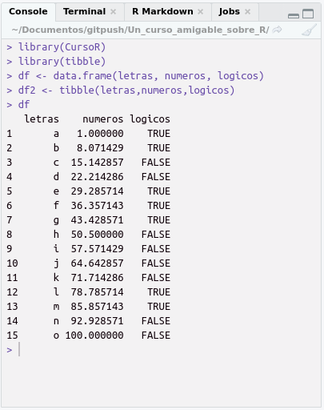
  </div>
  <div class="col-md-6" markdown="1">

  </div>
</div>

Una mejora que poseen los tibble es la forma en que se escriben los datos ya que no es necesario escribir vectores con nuestra información, veamos un ejemplo. 

:::example
#### Ejemplo 2.3.9
:::

<div class="tutorial-exercise" data-label="addition_239" data-caption="Code" data-completion="1" data-diagnostics="1" data-startover="1" data-lines="0">

```text
amigos <- tribble(
  ~nombre ,~edad,~ altura,~soltero,
  "Andres",  23 ,    181 ,  TRUE   ,
  "Julian",  24 ,    179 ,  FALSE  ,
  "Maria" ,  19 ,    167 ,  TRUE   ,
  "sandra",  21 ,    174 ,  TRUE   ,
  "Karol" ,  26 ,    171 ,  FALSE  ,
  "Javier",  18 ,    164 ,  TRUE  
)
amigos
```

<script type="application/json" data-opts-chunk="1">{"fig.width":6.5,"fig.height":4,"fig.retina":2,"fig.align":"default","fig.keep":"high","fig.show":"asis","out.width":624,"warning":false,"error":false,"message":false,"exercise.df_print":"paged","exercise.timelimit":60,"exercise.checker":["function (label = NULL, solution_code = NULL, user_code = NULL, ","    check_code = NULL, envir_result = NULL, evaluate_result = NULL, ","    envir_prep = NULL, last_value = NULL, ...) ","{","    if (is.null(user_code)) {","        return(list(message = \"I didn't receive your code. Did you write any?\", ","            correct = FALSE, type = \"error\", location = \"append\"))","    }","    else {","        user_code <- parse(text = user_code)","        if (length(user_code) == 0) {","            return(list(message = \"I didn't receive your code. Did you write any?\", ","                correct = FALSE, type = \"error\", location = \"append\"))","        }","    }","    if (!is.null(solution_code)) {","        solution_code <- parse(text = solution_code)","        if (length(solution_code) == 0) {","            return(list(message = \"No solution is provided for this exercise.\", ","                correct = TRUE, type = \"info\", location = \"append\"))","        }","    }","    had_error_checking <- FALSE","    checked_result <- tryCatch({","        parsed_check_code <- parse(text = check_code)","        if (length(parsed_check_code) > 1) {","            for (i in 1:(length(parsed_check_code) - 1)) {","                eval(parsed_check_code[[i]], envir_prep)","            }","        }","        grading_code <- rlang::call_standardise(parsed_check_code[[length(parsed_check_code)]], ","            envir_prep)","        grader_args <- list(user_quo = rlang::as_quosure(user_code[[length(user_code)]], ","            envir_result))","        if (!is.null(solution_code)) {","            grader_args$solution_quo <- rlang::as_quosure(solution_code[[length(solution_code)]], ","                envir_prep)","        }","        learnr_args <- list(...)","        learnr_args$label <- label","        learnr_args$solution_code <- solution_code","        learnr_args$user_code <- user_code","        learnr_args$check_code <- check_code","        learnr_args$envir_result <- envir_result","        learnr_args$evaluate_result <- evaluate_result","        learnr_args$envir_prep <- envir_prep","        learnr_args$last_value <- last_value","        grading_code$grader_args <- grader_args","        grading_code$learnr_args <- learnr_args","        envir_prep$ans <- grader_args$user","        eval(grading_code, envir_prep)","    }, error = function(e) {","        message(\"\", e)","        had_error_checking <<- TRUE","        graded(correct = FALSE, message = \"Error occured while checking the submission\")","    })","    if (!checkmate::test_class(checked_result, \"grader_graded\")) {","        stop(\"`grade_learnr` should receive a `graded` value from every `-check` chunk\")","    }","    message_type <- if (had_error_checking) {","        \"warning\"","    }","    else {","        if (checked_result$correct) {","            \"success\"","        }","        else {","            \"error\"","        }","    }","    ret <- list(message = checked_result$message, correct = checked_result$correct, ","        type = message_type, location = \"append\")","    ret","}"]}</script></div>

Otra de las diferencias con los dataframe, es la capacidad que tienen los tibble para hace referencia a variables que se acaban de crear, veamos cómo funciona

:::example
#### Ejemplo 2.3.10
:::

<div class="tutorial-exercise" data-label="addition_2310" data-caption="Code" data-completion="1" data-diagnostics="1" data-startover="1" data-lines="0">

```text
tibble(x = 1:5, 
       y = 1, 
       z = x ^ 2 + y)
```

<script type="application/json" data-opts-chunk="1">{"fig.width":6.5,"fig.height":4,"fig.retina":2,"fig.align":"default","fig.keep":"high","fig.show":"asis","out.width":624,"warning":false,"error":false,"message":false,"exercise.df_print":"paged","exercise.timelimit":60,"exercise.checker":["function (label = NULL, solution_code = NULL, user_code = NULL, ","    check_code = NULL, envir_result = NULL, evaluate_result = NULL, ","    envir_prep = NULL, last_value = NULL, ...) ","{","    if (is.null(user_code)) {","        return(list(message = \"I didn't receive your code. Did you write any?\", ","            correct = FALSE, type = \"error\", location = \"append\"))","    }","    else {","        user_code <- parse(text = user_code)","        if (length(user_code) == 0) {","            return(list(message = \"I didn't receive your code. Did you write any?\", ","                correct = FALSE, type = \"error\", location = \"append\"))","        }","    }","    if (!is.null(solution_code)) {","        solution_code <- parse(text = solution_code)","        if (length(solution_code) == 0) {","            return(list(message = \"No solution is provided for this exercise.\", ","                correct = TRUE, type = \"info\", location = \"append\"))","        }","    }","    had_error_checking <- FALSE","    checked_result <- tryCatch({","        parsed_check_code <- parse(text = check_code)","        if (length(parsed_check_code) > 1) {","            for (i in 1:(length(parsed_check_code) - 1)) {","                eval(parsed_check_code[[i]], envir_prep)","            }","        }","        grading_code <- rlang::call_standardise(parsed_check_code[[length(parsed_check_code)]], ","            envir_prep)","        grader_args <- list(user_quo = rlang::as_quosure(user_code[[length(user_code)]], ","            envir_result))","        if (!is.null(solution_code)) {","            grader_args$solution_quo <- rlang::as_quosure(solution_code[[length(solution_code)]], ","                envir_prep)","        }","        learnr_args <- list(...)","        learnr_args$label <- label","        learnr_args$solution_code <- solution_code","        learnr_args$user_code <- user_code","        learnr_args$check_code <- check_code","        learnr_args$envir_result <- envir_result","        learnr_args$evaluate_result <- evaluate_result","        learnr_args$envir_prep <- envir_prep","        learnr_args$last_value <- last_value","        grading_code$grader_args <- grader_args","        grading_code$learnr_args <- learnr_args","        envir_prep$ans <- grader_args$user","        eval(grading_code, envir_prep)","    }, error = function(e) {","        message(\"\", e)","        had_error_checking <<- TRUE","        graded(correct = FALSE, message = \"Error occured while checking the submission\")","    })","    if (!checkmate::test_class(checked_result, \"grader_graded\")) {","        stop(\"`grade_learnr` should receive a `graded` value from every `-check` chunk\")","    }","    message_type <- if (had_error_checking) {","        \"warning\"","    }","    else {","        if (checked_result$correct) {","            \"success\"","        }","        else {","            \"error\"","        }","    }","    ret <- list(message = checked_result$message, correct = checked_result$correct, ","        type = message_type, location = \"append\")","    ret","}"]}</script></div>

Hagamos un ejercicio para reforzar esta última diferencia. En él debes crear dos objetos `df_vol` y `tb_vol`, en ellos debes guardar la información de 10 cilindros y calcular las variables radio y volumen para cada uno, de tal forma que cada objeto contenga exactamente la misma información. Para el objeto df_vol utiliza `data.frame()` y para tb_vol `tibble()`. Al finalizar debes imprimir los dos objetos en pantalla.

:::exercise
#### Ejercicio 2.3.9
:::

<div class="tutorial-exercise" data-label="exe_239" data-caption="Code" data-completion="1" data-diagnostics="1" data-startover="1" data-lines="0">

```text
#Informacion
referencia <- paste("Cilindro",seq(1,10))
seq(1.5,100,length.out = 10) #altura
seq(3,50,length.out = 10) #diametro
#dataframe
df_vol <- 
#tibble
tb_vol <- 
#verificacion
df_vol
tb_vol
```

<script type="application/json" data-opts-chunk="1">{"fig.width":6.5,"fig.height":4,"fig.retina":2,"fig.align":"default","fig.keep":"high","fig.show":"asis","out.width":624,"warning":false,"error":false,"message":false,"exercise.df_print":"paged","exercise.timelimit":60,"exercise.checker":["function (label = NULL, solution_code = NULL, user_code = NULL, ","    check_code = NULL, envir_result = NULL, evaluate_result = NULL, ","    envir_prep = NULL, last_value = NULL, ...) ","{","    if (is.null(user_code)) {","        return(list(message = \"I didn't receive your code. Did you write any?\", ","            correct = FALSE, type = \"error\", location = \"append\"))","    }","    else {","        user_code <- parse(text = user_code)","        if (length(user_code) == 0) {","            return(list(message = \"I didn't receive your code. Did you write any?\", ","                correct = FALSE, type = \"error\", location = \"append\"))","        }","    }","    if (!is.null(solution_code)) {","        solution_code <- parse(text = solution_code)","        if (length(solution_code) == 0) {","            return(list(message = \"No solution is provided for this exercise.\", ","                correct = TRUE, type = \"info\", location = \"append\"))","        }","    }","    had_error_checking <- FALSE","    checked_result <- tryCatch({","        parsed_check_code <- parse(text = check_code)","        if (length(parsed_check_code) > 1) {","            for (i in 1:(length(parsed_check_code) - 1)) {","                eval(parsed_check_code[[i]], envir_prep)","            }","        }","        grading_code <- rlang::call_standardise(parsed_check_code[[length(parsed_check_code)]], ","            envir_prep)","        grader_args <- list(user_quo = rlang::as_quosure(user_code[[length(user_code)]], ","            envir_result))","        if (!is.null(solution_code)) {","            grader_args$solution_quo <- rlang::as_quosure(solution_code[[length(solution_code)]], ","                envir_prep)","        }","        learnr_args <- list(...)","        learnr_args$label <- label","        learnr_args$solution_code <- solution_code","        learnr_args$user_code <- user_code","        learnr_args$check_code <- check_code","        learnr_args$envir_result <- envir_result","        learnr_args$evaluate_result <- evaluate_result","        learnr_args$envir_prep <- envir_prep","        learnr_args$last_value <- last_value","        grading_code$grader_args <- grader_args","        grading_code$learnr_args <- learnr_args","        envir_prep$ans <- grader_args$user","        eval(grading_code, envir_prep)","    }, error = function(e) {","        message(\"\", e)","        had_error_checking <<- TRUE","        graded(correct = FALSE, message = \"Error occured while checking the submission\")","    })","    if (!checkmate::test_class(checked_result, \"grader_graded\")) {","        stop(\"`grade_learnr` should receive a `graded` value from every `-check` chunk\")","    }","    message_type <- if (had_error_checking) {","        \"warning\"","    }","    else {","        if (checked_result$correct) {","            \"success\"","        }","        else {","            \"error\"","        }","    }","    ret <- list(message = checked_result$message, correct = checked_result$correct, ","        type = message_type, location = \"append\")","    ret","}"]}</script></div>

<div class="tutorial-exercise-support" data-label="exe_239-solution" data-caption="Code" data-completion="1" data-diagnostics="1" data-startover="1" data-lines="0">

```text
#Informacion
referencia <- paste("Cilindro",seq(1,10))
seq(1.5,100,length.out = 10) #altura
seq(3,50,length.out = 10) #diametro
#dataframe
df_vol <- data.frame(referencia,
                     altura = seq(1.5,100,length.out = 10),
                     diametro = seq(3,50,length.out = 10))
df_vol$radio <- df_vol$diametro /2
df_vol$volumen <- pi * df_vol$radio^2 * df_vol$altura
#tibble
tb_vol <- tibble(referencia,
                 altura = seq(1.5,100,length.out = 10),
                 diametro = seq(3,50,length.out = 10),
                 radio = diametro/2,
                 volumen = pi * radio^2 *altura)
#verificacion
df_vol
tb_vol
```

</div>

<div class="tutorial-exercise-support" data-label="exe_239-check" data-caption="Code" data-completion="1" data-diagnostics="1" data-startover="1" data-lines="0">

```text
grade_code("Excelente lo lograste, sigamos adelante")
```

</div>

Otra de las capacidades que tiene tibble es conservar la estructura de objetos anidados, sean estos, vectores, matrices, dataframe, listas e incluso otro tibble, solo necesitamos cumplir la regla de que nuestra variable que anida objetos tenga la misma extensión de nuestras filas.

Para entender esto retomemos la base de datos del ejemplo 2.3.9 con algunas modificaciones, las variables serán nombre,físico y sentimental, donde fisco tendrá edad y altura mientras que sentimental tendrá si es soltero y si tiene hijos, esta forma de guardar información es relativamente complicada en los dataframe. Veamos cómo podemos lograrlo.

:::example
#### Ejemplo 2.3.11
:::

<div class="tutorial-exercise" data-label="addition_2311" data-caption="Code" data-completion="1" data-diagnostics="1" data-startover="1" data-lines="0">

```text
amigos <- tribble(
  ~nombre ,         ~fisico          ,  ~ sentimental    ,
  "Andres", c(edad=23,altura=181) , c(soltero=T,hijos=F) ,
  "Julian", c(edad=24,altura=179) , c(soltero=F,hijos=T) ,
  "Maria" , c(edad=19,altura=167) , c(soltero=T,hijos=F) ,
  "sandra", c(edad=21,altura=174) , c(soltero=T,hijos=F) ,
  "Karol" , c(edad=26,altura=171) , c(soltero=F,hijos=T) ,
  "Javier", c(edad=18,altura=164) , c(soltero=T,hijos=F) ,
)
amigos
```

<script type="application/json" data-opts-chunk="1">{"fig.width":6.5,"fig.height":4,"fig.retina":2,"fig.align":"default","fig.keep":"high","fig.show":"asis","out.width":624,"warning":false,"error":false,"message":false,"exercise.df_print":"paged","exercise.timelimit":60,"exercise.checker":["function (label = NULL, solution_code = NULL, user_code = NULL, ","    check_code = NULL, envir_result = NULL, evaluate_result = NULL, ","    envir_prep = NULL, last_value = NULL, ...) ","{","    if (is.null(user_code)) {","        return(list(message = \"I didn't receive your code. Did you write any?\", ","            correct = FALSE, type = \"error\", location = \"append\"))","    }","    else {","        user_code <- parse(text = user_code)","        if (length(user_code) == 0) {","            return(list(message = \"I didn't receive your code. Did you write any?\", ","                correct = FALSE, type = \"error\", location = \"append\"))","        }","    }","    if (!is.null(solution_code)) {","        solution_code <- parse(text = solution_code)","        if (length(solution_code) == 0) {","            return(list(message = \"No solution is provided for this exercise.\", ","                correct = TRUE, type = \"info\", location = \"append\"))","        }","    }","    had_error_checking <- FALSE","    checked_result <- tryCatch({","        parsed_check_code <- parse(text = check_code)","        if (length(parsed_check_code) > 1) {","            for (i in 1:(length(parsed_check_code) - 1)) {","                eval(parsed_check_code[[i]], envir_prep)","            }","        }","        grading_code <- rlang::call_standardise(parsed_check_code[[length(parsed_check_code)]], ","            envir_prep)","        grader_args <- list(user_quo = rlang::as_quosure(user_code[[length(user_code)]], ","            envir_result))","        if (!is.null(solution_code)) {","            grader_args$solution_quo <- rlang::as_quosure(solution_code[[length(solution_code)]], ","                envir_prep)","        }","        learnr_args <- list(...)","        learnr_args$label <- label","        learnr_args$solution_code <- solution_code","        learnr_args$user_code <- user_code","        learnr_args$check_code <- check_code","        learnr_args$envir_result <- envir_result","        learnr_args$evaluate_result <- evaluate_result","        learnr_args$envir_prep <- envir_prep","        learnr_args$last_value <- last_value","        grading_code$grader_args <- grader_args","        grading_code$learnr_args <- learnr_args","        envir_prep$ans <- grader_args$user","        eval(grading_code, envir_prep)","    }, error = function(e) {","        message(\"\", e)","        had_error_checking <<- TRUE","        graded(correct = FALSE, message = \"Error occured while checking the submission\")","    })","    if (!checkmate::test_class(checked_result, \"grader_graded\")) {","        stop(\"`grade_learnr` should receive a `graded` value from every `-check` chunk\")","    }","    message_type <- if (had_error_checking) {","        \"warning\"","    }","    else {","        if (checked_result$correct) {","            \"success\"","        }","        else {","            \"error\"","        }","    }","    ret <- list(message = checked_result$message, correct = checked_result$correct, ","        type = message_type, location = \"append\")","    ret","}"]}</script></div>

Como se pueda notar el tipo de datos  que reporta las columnas físico y sentimental pertenece a lista, lo cual es un requerimiento para anidar objetos con los tibble. De las listas hablaremos en la siguiente subsección y retomaremos este ejemplo para acceder a elementos individuales del marco de datos `amigos`.

</details>

<details><summary>2.4 Operaciones con listas </summary> 

Se entiende por lista a la colección de elementos de cualquier longitud que pueden ser de una clase diferente cada uno, lo que indica que en una lista podemos almacenar todos los objetos de los que tenemos conocimiento, sean estos vectores, matrices, dataframe, tibble en incuso otras listas. Para crear listas utilizamos la función `list()`, veamos un ejemplo sencillo de cómo se crea una lista objetos de diferente clase.

:::example
#### Ejemplo 2.4.1
:::

<div class="tutorial-exercise" data-label="addition_241" data-caption="Code" data-completion="1" data-diagnostics="1" data-startover="1" data-lines="0">

```text
my_lista <- list(vector = 1:10,
                 matriz = matrix(1:25,ncol = 5),
                 dataframe = Starwars[1:10,],
                 tible = as_tibble(mtcars_3))
my_lista
```

<script type="application/json" data-opts-chunk="1">{"fig.width":6.5,"fig.height":4,"fig.retina":2,"fig.align":"default","fig.keep":"high","fig.show":"asis","out.width":624,"warning":false,"error":false,"message":false,"exercise.df_print":"paged","exercise.timelimit":60,"exercise.checker":["function (label = NULL, solution_code = NULL, user_code = NULL, ","    check_code = NULL, envir_result = NULL, evaluate_result = NULL, ","    envir_prep = NULL, last_value = NULL, ...) ","{","    if (is.null(user_code)) {","        return(list(message = \"I didn't receive your code. Did you write any?\", ","            correct = FALSE, type = \"error\", location = \"append\"))","    }","    else {","        user_code <- parse(text = user_code)","        if (length(user_code) == 0) {","            return(list(message = \"I didn't receive your code. Did you write any?\", ","                correct = FALSE, type = \"error\", location = \"append\"))","        }","    }","    if (!is.null(solution_code)) {","        solution_code <- parse(text = solution_code)","        if (length(solution_code) == 0) {","            return(list(message = \"No solution is provided for this exercise.\", ","                correct = TRUE, type = \"info\", location = \"append\"))","        }","    }","    had_error_checking <- FALSE","    checked_result <- tryCatch({","        parsed_check_code <- parse(text = check_code)","        if (length(parsed_check_code) > 1) {","            for (i in 1:(length(parsed_check_code) - 1)) {","                eval(parsed_check_code[[i]], envir_prep)","            }","        }","        grading_code <- rlang::call_standardise(parsed_check_code[[length(parsed_check_code)]], ","            envir_prep)","        grader_args <- list(user_quo = rlang::as_quosure(user_code[[length(user_code)]], ","            envir_result))","        if (!is.null(solution_code)) {","            grader_args$solution_quo <- rlang::as_quosure(solution_code[[length(solution_code)]], ","                envir_prep)","        }","        learnr_args <- list(...)","        learnr_args$label <- label","        learnr_args$solution_code <- solution_code","        learnr_args$user_code <- user_code","        learnr_args$check_code <- check_code","        learnr_args$envir_result <- envir_result","        learnr_args$evaluate_result <- evaluate_result","        learnr_args$envir_prep <- envir_prep","        learnr_args$last_value <- last_value","        grading_code$grader_args <- grader_args","        grading_code$learnr_args <- learnr_args","        envir_prep$ans <- grader_args$user","        eval(grading_code, envir_prep)","    }, error = function(e) {","        message(\"\", e)","        had_error_checking <<- TRUE","        graded(correct = FALSE, message = \"Error occured while checking the submission\")","    })","    if (!checkmate::test_class(checked_result, \"grader_graded\")) {","        stop(\"`grade_learnr` should receive a `graded` value from every `-check` chunk\")","    }","    message_type <- if (had_error_checking) {","        \"warning\"","    }","    else {","        if (checked_result$correct) {","            \"success\"","        }","        else {","            \"error\"","        }","    }","    ret <- list(message = checked_result$message, correct = checked_result$correct, ","        type = message_type, location = \"append\")","    ret","}"]}</script></div>


Como se puede ver crear listas es relativamente sencillo, se recomienda nombrar los objetos para facilitar el acceso a estos, sin embargo no es estrictamente necesario.

Ya vimos lo sencillo que es crear una lista con las clases de objetos que conocíamos previamente, ahora con el siguiente ejercicio debes crear una lista que contenga otras listas dentro de ella, la lista principal se llamará `mis_listas`,  las listas dentro de ella no tendrán nombre. La primera lista debe contener los bases de datos `Starwars` y `mtcars_3` y la segunda lista debe contar con dos subconjuntos de datos, el primero debe tener los personajes de Starwars de la especie humana y el segundo los autos de mtcars_3 con más de dos carburadores. Adicionalmente se agregarán nombres a la lista principal con la función `names()`.

:::exercise
#### Ejercicio 2.4.1
:::

<div class="tutorial-exercise" data-label="exe_241" data-caption="Code" data-completion="1" data-diagnostics="1" data-startover="1" data-lines="0">

```text
mis_listas <- 
mis_listas
#nombres 
names(mis_listas) <- c("dataset","subconjuntos")
mis_listas
```

<script type="application/json" data-opts-chunk="1">{"fig.width":6.5,"fig.height":4,"fig.retina":2,"fig.align":"default","fig.keep":"high","fig.show":"asis","out.width":624,"warning":false,"error":false,"message":false,"exercise.df_print":"paged","exercise.timelimit":60,"exercise.checker":["function (label = NULL, solution_code = NULL, user_code = NULL, ","    check_code = NULL, envir_result = NULL, evaluate_result = NULL, ","    envir_prep = NULL, last_value = NULL, ...) ","{","    if (is.null(user_code)) {","        return(list(message = \"I didn't receive your code. Did you write any?\", ","            correct = FALSE, type = \"error\", location = \"append\"))","    }","    else {","        user_code <- parse(text = user_code)","        if (length(user_code) == 0) {","            return(list(message = \"I didn't receive your code. Did you write any?\", ","                correct = FALSE, type = \"error\", location = \"append\"))","        }","    }","    if (!is.null(solution_code)) {","        solution_code <- parse(text = solution_code)","        if (length(solution_code) == 0) {","            return(list(message = \"No solution is provided for this exercise.\", ","                correct = TRUE, type = \"info\", location = \"append\"))","        }","    }","    had_error_checking <- FALSE","    checked_result <- tryCatch({","        parsed_check_code <- parse(text = check_code)","        if (length(parsed_check_code) > 1) {","            for (i in 1:(length(parsed_check_code) - 1)) {","                eval(parsed_check_code[[i]], envir_prep)","            }","        }","        grading_code <- rlang::call_standardise(parsed_check_code[[length(parsed_check_code)]], ","            envir_prep)","        grader_args <- list(user_quo = rlang::as_quosure(user_code[[length(user_code)]], ","            envir_result))","        if (!is.null(solution_code)) {","            grader_args$solution_quo <- rlang::as_quosure(solution_code[[length(solution_code)]], ","                envir_prep)","        }","        learnr_args <- list(...)","        learnr_args$label <- label","        learnr_args$solution_code <- solution_code","        learnr_args$user_code <- user_code","        learnr_args$check_code <- check_code","        learnr_args$envir_result <- envir_result","        learnr_args$evaluate_result <- evaluate_result","        learnr_args$envir_prep <- envir_prep","        learnr_args$last_value <- last_value","        grading_code$grader_args <- grader_args","        grading_code$learnr_args <- learnr_args","        envir_prep$ans <- grader_args$user","        eval(grading_code, envir_prep)","    }, error = function(e) {","        message(\"\", e)","        had_error_checking <<- TRUE","        graded(correct = FALSE, message = \"Error occured while checking the submission\")","    })","    if (!checkmate::test_class(checked_result, \"grader_graded\")) {","        stop(\"`grade_learnr` should receive a `graded` value from every `-check` chunk\")","    }","    message_type <- if (had_error_checking) {","        \"warning\"","    }","    else {","        if (checked_result$correct) {","            \"success\"","        }","        else {","            \"error\"","        }","    }","    ret <- list(message = checked_result$message, correct = checked_result$correct, ","        type = message_type, location = \"append\")","    ret","}"]}</script></div>

<div class="tutorial-exercise-support" data-label="exe_241-solution" data-caption="Code" data-completion="1" data-diagnostics="1" data-startover="1" data-lines="0">

```text
mis_listas <- list(list(Starwars,mtcars_3),
                   list(subset(Starwars,species == "Human"),
                        subset(mtcars_3,carb>2)))
mis_listas
#nombres 
names(mis_listas) <- c("dataset","subconjuntos")
mis_listas
```

</div>

<div class="tutorial-exercise-support" data-label="exe_241-check" data-caption="Code" data-completion="1" data-diagnostics="1" data-startover="1" data-lines="0">

```text
grade_code("Excelente lo lograste, sigamos adelante")
```

</div>

Veamos cómo funciona la indexación y el acceso a elementos individuales de una lista utilizando `my_lista`. Primero vamos a llamar a dataframe, después añadiremos nombres a la matriz, seguido seleccionaremos los autos del tibble con más de dos carburadores  y por último vamos a reemplazar cada elemento del vector por su correspondiente raíz cuadrada.

:::example
#### Ejemplo 2.4.2
:::

<div class="tutorial-exercise" data-label="addition_242" data-caption="Code" data-completion="1" data-diagnostics="1" data-startover="1" data-lines="0">

```text
#lista
my_lista
#dataframe
my_lista[["dataframe"]] #Opcion 1
my_lista$dataframe #Opcion 2
#nombres de la matriz
row.names(my_lista$matriz) <-c(paste("fila",1:5))
colnames(my_lista[["matriz"]]) <- c(paste("col",1:5))
my_lista$matriz
#tibble
subset(my_lista$tible,carb>2)
#vector
my_lista$vector <- sqrt(my_lista$vector)
my_lista$vector
```

<script type="application/json" data-opts-chunk="1">{"fig.width":6.5,"fig.height":4,"fig.retina":2,"fig.align":"default","fig.keep":"high","fig.show":"asis","out.width":624,"warning":false,"error":false,"message":false,"exercise.df_print":"paged","exercise.timelimit":60,"exercise.checker":["function (label = NULL, solution_code = NULL, user_code = NULL, ","    check_code = NULL, envir_result = NULL, evaluate_result = NULL, ","    envir_prep = NULL, last_value = NULL, ...) ","{","    if (is.null(user_code)) {","        return(list(message = \"I didn't receive your code. Did you write any?\", ","            correct = FALSE, type = \"error\", location = \"append\"))","    }","    else {","        user_code <- parse(text = user_code)","        if (length(user_code) == 0) {","            return(list(message = \"I didn't receive your code. Did you write any?\", ","                correct = FALSE, type = \"error\", location = \"append\"))","        }","    }","    if (!is.null(solution_code)) {","        solution_code <- parse(text = solution_code)","        if (length(solution_code) == 0) {","            return(list(message = \"No solution is provided for this exercise.\", ","                correct = TRUE, type = \"info\", location = \"append\"))","        }","    }","    had_error_checking <- FALSE","    checked_result <- tryCatch({","        parsed_check_code <- parse(text = check_code)","        if (length(parsed_check_code) > 1) {","            for (i in 1:(length(parsed_check_code) - 1)) {","                eval(parsed_check_code[[i]], envir_prep)","            }","        }","        grading_code <- rlang::call_standardise(parsed_check_code[[length(parsed_check_code)]], ","            envir_prep)","        grader_args <- list(user_quo = rlang::as_quosure(user_code[[length(user_code)]], ","            envir_result))","        if (!is.null(solution_code)) {","            grader_args$solution_quo <- rlang::as_quosure(solution_code[[length(solution_code)]], ","                envir_prep)","        }","        learnr_args <- list(...)","        learnr_args$label <- label","        learnr_args$solution_code <- solution_code","        learnr_args$user_code <- user_code","        learnr_args$check_code <- check_code","        learnr_args$envir_result <- envir_result","        learnr_args$evaluate_result <- evaluate_result","        learnr_args$envir_prep <- envir_prep","        learnr_args$last_value <- last_value","        grading_code$grader_args <- grader_args","        grading_code$learnr_args <- learnr_args","        envir_prep$ans <- grader_args$user","        eval(grading_code, envir_prep)","    }, error = function(e) {","        message(\"\", e)","        had_error_checking <<- TRUE","        graded(correct = FALSE, message = \"Error occured while checking the submission\")","    })","    if (!checkmate::test_class(checked_result, \"grader_graded\")) {","        stop(\"`grade_learnr` should receive a `graded` value from every `-check` chunk\")","    }","    message_type <- if (had_error_checking) {","        \"warning\"","    }","    else {","        if (checked_result$correct) {","            \"success\"","        }","        else {","            \"error\"","        }","    }","    ret <- list(message = checked_result$message, correct = checked_result$correct, ","        type = message_type, location = \"append\")","    ret","}"]}</script></div>

El próximo ejercicio consiste en modificar una lista a partir de la siguiente tabla que contiene datos de los padres, hermanos e hijos de carlos; una lista `carlos_fam` fue creada para almacenar la información, sin embargo se presentaron errores en la transcripción y la lista es imprecisa. 

+-------------+----------------+------+
| Relación    | Nombre         | Edad |
+=============+================+======+
| Padre       | Juan Carlos    |  55  |
+-------------+----------------+------+
| Madre       | Luz Estela     |  53  |
+-------------+----------------+------+
| Hijo        | Juan Camilo    |  3   |
+-------------+----------------+------+
| Hijo        | Juan Fernado   |  5   |
+-------------+----------------+------+
| Hijo        | Juliana        |  1   |
+-------------+----------------+------+
| Hermano     | Andres Felipe  |  25  |
+-------------+----------------+------+
| Hermano     | Maria Camila   |  21  |
+-------------+----------------+------+


Debes modificar la lista `carlos_fam` de modo que coincida con los datos proporcionados en la tabla. Pueden existir múltiples formas de lograr este objetivo, en la solución encontraras solo una de ellas.

:::exercise
#### Ejercicio 2.4.2
:::

<div class="tutorial-exercise" data-label="exe_242" data-caption="Code" data-completion="1" data-diagnostics="1" data-startover="1" data-lines="0">

```text
#lista imprecisa
carlos_fam
str(carlos_fam)
#modificaciones
```

<script type="application/json" data-opts-chunk="1">{"fig.width":6.5,"fig.height":4,"fig.retina":2,"fig.align":"default","fig.keep":"high","fig.show":"asis","out.width":624,"warning":false,"error":false,"message":false,"exercise.df_print":"paged","exercise.timelimit":60,"exercise.checker":["function (label = NULL, solution_code = NULL, user_code = NULL, ","    check_code = NULL, envir_result = NULL, evaluate_result = NULL, ","    envir_prep = NULL, last_value = NULL, ...) ","{","    if (is.null(user_code)) {","        return(list(message = \"I didn't receive your code. Did you write any?\", ","            correct = FALSE, type = \"error\", location = \"append\"))","    }","    else {","        user_code <- parse(text = user_code)","        if (length(user_code) == 0) {","            return(list(message = \"I didn't receive your code. Did you write any?\", ","                correct = FALSE, type = \"error\", location = \"append\"))","        }","    }","    if (!is.null(solution_code)) {","        solution_code <- parse(text = solution_code)","        if (length(solution_code) == 0) {","            return(list(message = \"No solution is provided for this exercise.\", ","                correct = TRUE, type = \"info\", location = \"append\"))","        }","    }","    had_error_checking <- FALSE","    checked_result <- tryCatch({","        parsed_check_code <- parse(text = check_code)","        if (length(parsed_check_code) > 1) {","            for (i in 1:(length(parsed_check_code) - 1)) {","                eval(parsed_check_code[[i]], envir_prep)","            }","        }","        grading_code <- rlang::call_standardise(parsed_check_code[[length(parsed_check_code)]], ","            envir_prep)","        grader_args <- list(user_quo = rlang::as_quosure(user_code[[length(user_code)]], ","            envir_result))","        if (!is.null(solution_code)) {","            grader_args$solution_quo <- rlang::as_quosure(solution_code[[length(solution_code)]], ","                envir_prep)","        }","        learnr_args <- list(...)","        learnr_args$label <- label","        learnr_args$solution_code <- solution_code","        learnr_args$user_code <- user_code","        learnr_args$check_code <- check_code","        learnr_args$envir_result <- envir_result","        learnr_args$evaluate_result <- evaluate_result","        learnr_args$envir_prep <- envir_prep","        learnr_args$last_value <- last_value","        grading_code$grader_args <- grader_args","        grading_code$learnr_args <- learnr_args","        envir_prep$ans <- grader_args$user","        eval(grading_code, envir_prep)","    }, error = function(e) {","        message(\"\", e)","        had_error_checking <<- TRUE","        graded(correct = FALSE, message = \"Error occured while checking the submission\")","    })","    if (!checkmate::test_class(checked_result, \"grader_graded\")) {","        stop(\"`grade_learnr` should receive a `graded` value from every `-check` chunk\")","    }","    message_type <- if (had_error_checking) {","        \"warning\"","    }","    else {","        if (checked_result$correct) {","            \"success\"","        }","        else {","            \"error\"","        }","    }","    ret <- list(message = checked_result$message, correct = checked_result$correct, ","        type = message_type, location = \"append\")","    ret","}"]}</script></div>

<div class="tutorial-exercise-support" data-label="exe_242-solution" data-caption="Code" data-completion="1" data-diagnostics="1" data-startover="1" data-lines="0">

```text
#lista imprecisa
carlos_fam
str(carlos_fam)
#modificaciones
carlos_fam$Padres$Nombre <- c("Juan Carlos","Luz Estela")
carlos_fam$Padres$Edad <- c(55,53)
carlos_fam$Hijos$Nombre[2:3] <- c("Juan Fernado","Juliana")
carlos_fam$Hijos$Edad[2:3] <- c(5,1)
carlos_fam$Hermanos$Nombre[2] <- "Maria Camila" 
carlos_fam$Hermanos$Edad[1] <- 25 
```

</div>

<div class="tutorial-exercise-support" data-label="exe_242-check" data-caption="Code" data-completion="1" data-diagnostics="1" data-startover="1" data-lines="0">

```text
grade_code("Excelente lo lograste, sigamos adelante")
```

</div>

Dándole continuidad al ejercicio anterior se propone que se agregue la estatura de cada uno de los integrantes de la familia conforme a la siguiente tabla.

+-------------+----------------+------+--------+
| Relación    | Nombre         | Edad | Altura |
+=============+================+======+========+
| Padre       | Juan Carlos    |  55  |   180  |
+-------------+----------------+------+--------+
| Madre       | Luz Estela     |  53  |   165  |
+-------------+----------------+------+--------+
| Hijo        | Juan Camilo    |  3   |   95   |
+-------------+----------------+------+--------+
| Hijo        | Juan Fernado   |  5   |   105  |
+-------------+----------------+------+--------+
| Hijo        | Juliana        |  1   |   77   |
+-------------+----------------+------+--------+
| Hermano     | Andres Felipe  |  25  |   183  |
+-------------+----------------+------+--------+
| Hermano     | Maria Camila   |  21  |   176  |
+-------------+----------------+------+--------+

Recuerda que el acceso individual a las variables de una lista es muy similar al acceso a un dataframe, por lo que debe resultar familiar crear nuevas variable en una lista utilizando el mismo método `$`. Crea la variable __Estatura__ para padres, hijos y Hermanos en `carlos_fam_g`.


:::exercise
#### Ejercicio 2.4.3
:::

<div class="tutorial-exercise" data-label="exe_243" data-caption="Code" data-completion="1" data-diagnostics="1" data-startover="1" data-lines="0">

```text
#Datos
carlos_fam_g
str(carlos_fam_g)
#Estatura
```

<script type="application/json" data-opts-chunk="1">{"fig.width":6.5,"fig.height":4,"fig.retina":2,"fig.align":"default","fig.keep":"high","fig.show":"asis","out.width":624,"warning":false,"error":false,"message":false,"exercise.df_print":"paged","exercise.timelimit":60,"exercise.checker":["function (label = NULL, solution_code = NULL, user_code = NULL, ","    check_code = NULL, envir_result = NULL, evaluate_result = NULL, ","    envir_prep = NULL, last_value = NULL, ...) ","{","    if (is.null(user_code)) {","        return(list(message = \"I didn't receive your code. Did you write any?\", ","            correct = FALSE, type = \"error\", location = \"append\"))","    }","    else {","        user_code <- parse(text = user_code)","        if (length(user_code) == 0) {","            return(list(message = \"I didn't receive your code. Did you write any?\", ","                correct = FALSE, type = \"error\", location = \"append\"))","        }","    }","    if (!is.null(solution_code)) {","        solution_code <- parse(text = solution_code)","        if (length(solution_code) == 0) {","            return(list(message = \"No solution is provided for this exercise.\", ","                correct = TRUE, type = \"info\", location = \"append\"))","        }","    }","    had_error_checking <- FALSE","    checked_result <- tryCatch({","        parsed_check_code <- parse(text = check_code)","        if (length(parsed_check_code) > 1) {","            for (i in 1:(length(parsed_check_code) - 1)) {","                eval(parsed_check_code[[i]], envir_prep)","            }","        }","        grading_code <- rlang::call_standardise(parsed_check_code[[length(parsed_check_code)]], ","            envir_prep)","        grader_args <- list(user_quo = rlang::as_quosure(user_code[[length(user_code)]], ","            envir_result))","        if (!is.null(solution_code)) {","            grader_args$solution_quo <- rlang::as_quosure(solution_code[[length(solution_code)]], ","                envir_prep)","        }","        learnr_args <- list(...)","        learnr_args$label <- label","        learnr_args$solution_code <- solution_code","        learnr_args$user_code <- user_code","        learnr_args$check_code <- check_code","        learnr_args$envir_result <- envir_result","        learnr_args$evaluate_result <- evaluate_result","        learnr_args$envir_prep <- envir_prep","        learnr_args$last_value <- last_value","        grading_code$grader_args <- grader_args","        grading_code$learnr_args <- learnr_args","        envir_prep$ans <- grader_args$user","        eval(grading_code, envir_prep)","    }, error = function(e) {","        message(\"\", e)","        had_error_checking <<- TRUE","        graded(correct = FALSE, message = \"Error occured while checking the submission\")","    })","    if (!checkmate::test_class(checked_result, \"grader_graded\")) {","        stop(\"`grade_learnr` should receive a `graded` value from every `-check` chunk\")","    }","    message_type <- if (had_error_checking) {","        \"warning\"","    }","    else {","        if (checked_result$correct) {","            \"success\"","        }","        else {","            \"error\"","        }","    }","    ret <- list(message = checked_result$message, correct = checked_result$correct, ","        type = message_type, location = \"append\")","    ret","}"]}</script></div>

<div class="tutorial-exercise-support" data-label="exe_243-solution" data-caption="Code" data-completion="1" data-diagnostics="1" data-startover="1" data-lines="0">

```text
#Datos
carlos_fam_g
str(carlos_fam_g)
#Estatura
carlos_fam_g$Padres$Estatura <- c(180,165)
carlos_fam_g$Hijos$Estatura <- c(95,105,77)
carlos_fam_g$Hermanos$Estatura <- c(183,176)
```

</div>

<div class="tutorial-exercise-support" data-label="exe_243-check" data-caption="Code" data-completion="1" data-diagnostics="1" data-startover="1" data-lines="0">

```text
grade_code("Excelente lo lograste, sigamos adelante")
```

</div>

Ya que sabemos un poco más de las listas retomemos el ejemplo 2.3.11  y veamos cómo funciona el acceso individual para nuestro set de datos `amigos`. Cabe mencionar que altura esta en cm y la masa en kg. Encontremos las edades de maria y julian y verifiquemos si Andres tiene hijos.


:::example
#### Ejemplo 2.4.3
:::

<div class="tutorial-exercise" data-label="addition_243" data-caption="Code" data-completion="1" data-diagnostics="1" data-startover="1" data-lines="0">

```text
#Datos
amigos
#Edades
amigos$fisico[[3]][1] #Maria
amigos$fisico[[2]][1] #Julian
#Hijos
amigos$sentimental[[1]][2]
```

<script type="application/json" data-opts-chunk="1">{"fig.width":6.5,"fig.height":4,"fig.retina":2,"fig.align":"default","fig.keep":"high","fig.show":"asis","out.width":624,"warning":false,"error":false,"message":false,"exercise.df_print":"paged","exercise.timelimit":60,"exercise.checker":["function (label = NULL, solution_code = NULL, user_code = NULL, ","    check_code = NULL, envir_result = NULL, evaluate_result = NULL, ","    envir_prep = NULL, last_value = NULL, ...) ","{","    if (is.null(user_code)) {","        return(list(message = \"I didn't receive your code. Did you write any?\", ","            correct = FALSE, type = \"error\", location = \"append\"))","    }","    else {","        user_code <- parse(text = user_code)","        if (length(user_code) == 0) {","            return(list(message = \"I didn't receive your code. Did you write any?\", ","                correct = FALSE, type = \"error\", location = \"append\"))","        }","    }","    if (!is.null(solution_code)) {","        solution_code <- parse(text = solution_code)","        if (length(solution_code) == 0) {","            return(list(message = \"No solution is provided for this exercise.\", ","                correct = TRUE, type = \"info\", location = \"append\"))","        }","    }","    had_error_checking <- FALSE","    checked_result <- tryCatch({","        parsed_check_code <- parse(text = check_code)","        if (length(parsed_check_code) > 1) {","            for (i in 1:(length(parsed_check_code) - 1)) {","                eval(parsed_check_code[[i]], envir_prep)","            }","        }","        grading_code <- rlang::call_standardise(parsed_check_code[[length(parsed_check_code)]], ","            envir_prep)","        grader_args <- list(user_quo = rlang::as_quosure(user_code[[length(user_code)]], ","            envir_result))","        if (!is.null(solution_code)) {","            grader_args$solution_quo <- rlang::as_quosure(solution_code[[length(solution_code)]], ","                envir_prep)","        }","        learnr_args <- list(...)","        learnr_args$label <- label","        learnr_args$solution_code <- solution_code","        learnr_args$user_code <- user_code","        learnr_args$check_code <- check_code","        learnr_args$envir_result <- envir_result","        learnr_args$evaluate_result <- evaluate_result","        learnr_args$envir_prep <- envir_prep","        learnr_args$last_value <- last_value","        grading_code$grader_args <- grader_args","        grading_code$learnr_args <- learnr_args","        envir_prep$ans <- grader_args$user","        eval(grading_code, envir_prep)","    }, error = function(e) {","        message(\"\", e)","        had_error_checking <<- TRUE","        graded(correct = FALSE, message = \"Error occured while checking the submission\")","    })","    if (!checkmate::test_class(checked_result, \"grader_graded\")) {","        stop(\"`grade_learnr` should receive a `graded` value from every `-check` chunk\")","    }","    message_type <- if (had_error_checking) {","        \"warning\"","    }","    else {","        if (checked_result$correct) {","            \"success\"","        }","        else {","            \"error\"","        }","    }","    ret <- list(message = checked_result$message, correct = checked_result$correct, ","        type = message_type, location = \"append\")","    ret","}"]}</script></div>

Como ultimo ejercicio trabajaremos con el IMC ($IMC = \frac{Masa\ (kg)}{Altura(m)^2}$), ahora debes calcularlo para Karol y Javier utilizando la indexación que ya conoces.

:::exercise
#### Ejercicio 2.4.4
:::

<div class="tutorial-exercise" data-label="exe_244" data-caption="Code" data-completion="1" data-diagnostics="1" data-startover="1" data-lines="0">

```text
#Caculo IMC
```

<script type="application/json" data-opts-chunk="1">{"fig.width":6.5,"fig.height":4,"fig.retina":2,"fig.align":"default","fig.keep":"high","fig.show":"asis","out.width":624,"warning":false,"error":false,"message":false,"exercise.df_print":"paged","exercise.timelimit":60,"exercise.checker":["function (label = NULL, solution_code = NULL, user_code = NULL, ","    check_code = NULL, envir_result = NULL, evaluate_result = NULL, ","    envir_prep = NULL, last_value = NULL, ...) ","{","    if (is.null(user_code)) {","        return(list(message = \"I didn't receive your code. Did you write any?\", ","            correct = FALSE, type = \"error\", location = \"append\"))","    }","    else {","        user_code <- parse(text = user_code)","        if (length(user_code) == 0) {","            return(list(message = \"I didn't receive your code. Did you write any?\", ","                correct = FALSE, type = \"error\", location = \"append\"))","        }","    }","    if (!is.null(solution_code)) {","        solution_code <- parse(text = solution_code)","        if (length(solution_code) == 0) {","            return(list(message = \"No solution is provided for this exercise.\", ","                correct = TRUE, type = \"info\", location = \"append\"))","        }","    }","    had_error_checking <- FALSE","    checked_result <- tryCatch({","        parsed_check_code <- parse(text = check_code)","        if (length(parsed_check_code) > 1) {","            for (i in 1:(length(parsed_check_code) - 1)) {","                eval(parsed_check_code[[i]], envir_prep)","            }","        }","        grading_code <- rlang::call_standardise(parsed_check_code[[length(parsed_check_code)]], ","            envir_prep)","        grader_args <- list(user_quo = rlang::as_quosure(user_code[[length(user_code)]], ","            envir_result))","        if (!is.null(solution_code)) {","            grader_args$solution_quo <- rlang::as_quosure(solution_code[[length(solution_code)]], ","                envir_prep)","        }","        learnr_args <- list(...)","        learnr_args$label <- label","        learnr_args$solution_code <- solution_code","        learnr_args$user_code <- user_code","        learnr_args$check_code <- check_code","        learnr_args$envir_result <- envir_result","        learnr_args$evaluate_result <- evaluate_result","        learnr_args$envir_prep <- envir_prep","        learnr_args$last_value <- last_value","        grading_code$grader_args <- grader_args","        grading_code$learnr_args <- learnr_args","        envir_prep$ans <- grader_args$user","        eval(grading_code, envir_prep)","    }, error = function(e) {","        message(\"\", e)","        had_error_checking <<- TRUE","        graded(correct = FALSE, message = \"Error occured while checking the submission\")","    })","    if (!checkmate::test_class(checked_result, \"grader_graded\")) {","        stop(\"`grade_learnr` should receive a `graded` value from every `-check` chunk\")","    }","    message_type <- if (had_error_checking) {","        \"warning\"","    }","    else {","        if (checked_result$correct) {","            \"success\"","        }","        else {","            \"error\"","        }","    }","    ret <- list(message = checked_result$message, correct = checked_result$correct, ","        type = message_type, location = \"append\")","    ret","}"]}</script></div>

<div class="tutorial-exercise-support" data-label="exe_244-solution" data-caption="Code" data-completion="1" data-diagnostics="1" data-startover="1" data-lines="0">

```text
#Caculo IMC
amigos$fisico[[5]][3][[1]] / (amigos$fisico[[5]][2][[1]]/100)^2 #Karol
amigos$fisico[[6]][3][[1]] / (amigos$fisico[[6]][2][[1]]/100)^2 #Javier
```

</div>

<div class="tutorial-exercise-support" data-label="exe_244-check" data-caption="Code" data-completion="1" data-diagnostics="1" data-startover="1" data-lines="0">

```text
grade_code("Excelente lo lograste, sigamos adelante")
```

</div>

</details>

## 3. Condiciones, bucles y funciones

En esta sección aprenderemos a crear y utilizar estructuras de control como funciones de usuario, bucles y condicionales que nos permitan automatizar nuestra manipulación y análisis de datos. Además esta sección nos permitirá entender cómo trabajan algunas de las funciones que conocemos, dejándonos entender y manipular mejor el `R` como lenguaje de programación. Cuando utilizamos programación para resolver algún problema académico, laboral u de otra índole es común encontrarnos con particularidades que corresponde únicamente a nuestro problema, por ello en muchos casos funciones generales o procesos generales no aplican para nuestra situación, es allí donde entran las famosas funciones de usuario que conoceremos a lo largo de la sección. La sección cuenta con cuatro subsecciones 1) Condicionales, 2) Bucles, 3) Funciones y 4) Familia `apply`.

* Algunas de las funciones nuevas que utilizaremos en esta sección deberás consultar en la ayuda de `R` , cada vez que no entiendas un función que utilicemos puedes ejecutar un comando de la forma `?mean()` 

* Para los ejercicios de esta sección existen muchas posibles soluciones que realicen la misma tarea planteada, sin embargo en `Solution` encontrarás solo una de todas las posibles.

<details><summary>3.1 Condicionales </summary> 

Son conocidos como construcciones y se articulan con los operadores lógicos, de conjunción y de disyunción. Utilizan expresiones lógicas para denotar diferentes alternativas, es decir, funcionan como una condición a partir de la expresión lógica.La primera función que utilizaremos será `if(){}` acompañada de `print()`. Para ello recordemos con un ejemplo expresiones lógicas que ya conocemos y agreguemos la sintaxis de una condición para utilizar estas nuevas funciones. 

:::example
#### Ejemplo 3.1.1
:::

<div class="tutorial-exercise" data-label="addition_311" data-caption="Code" data-completion="1" data-diagnostics="1" data-startover="1" data-lines="0">

```text
#Expresiones logicas
35 > 20
35 != 35.4
#Condiciones
if(35>20) {print("Es mayor a 20")}
if(35 != 35.4) {print("Son diferentes")}
```

<script type="application/json" data-opts-chunk="1">{"fig.width":6.5,"fig.height":4,"fig.retina":2,"fig.align":"default","fig.keep":"high","fig.show":"asis","out.width":624,"warning":false,"error":false,"message":false,"exercise.df_print":"paged","exercise.timelimit":60,"exercise.checker":["function (label = NULL, solution_code = NULL, user_code = NULL, ","    check_code = NULL, envir_result = NULL, evaluate_result = NULL, ","    envir_prep = NULL, last_value = NULL, ...) ","{","    if (is.null(user_code)) {","        return(list(message = \"I didn't receive your code. Did you write any?\", ","            correct = FALSE, type = \"error\", location = \"append\"))","    }","    else {","        user_code <- parse(text = user_code)","        if (length(user_code) == 0) {","            return(list(message = \"I didn't receive your code. Did you write any?\", ","                correct = FALSE, type = \"error\", location = \"append\"))","        }","    }","    if (!is.null(solution_code)) {","        solution_code <- parse(text = solution_code)","        if (length(solution_code) == 0) {","            return(list(message = \"No solution is provided for this exercise.\", ","                correct = TRUE, type = \"info\", location = \"append\"))","        }","    }","    had_error_checking <- FALSE","    checked_result <- tryCatch({","        parsed_check_code <- parse(text = check_code)","        if (length(parsed_check_code) > 1) {","            for (i in 1:(length(parsed_check_code) - 1)) {","                eval(parsed_check_code[[i]], envir_prep)","            }","        }","        grading_code <- rlang::call_standardise(parsed_check_code[[length(parsed_check_code)]], ","            envir_prep)","        grader_args <- list(user_quo = rlang::as_quosure(user_code[[length(user_code)]], ","            envir_result))","        if (!is.null(solution_code)) {","            grader_args$solution_quo <- rlang::as_quosure(solution_code[[length(solution_code)]], ","                envir_prep)","        }","        learnr_args <- list(...)","        learnr_args$label <- label","        learnr_args$solution_code <- solution_code","        learnr_args$user_code <- user_code","        learnr_args$check_code <- check_code","        learnr_args$envir_result <- envir_result","        learnr_args$evaluate_result <- evaluate_result","        learnr_args$envir_prep <- envir_prep","        learnr_args$last_value <- last_value","        grading_code$grader_args <- grader_args","        grading_code$learnr_args <- learnr_args","        envir_prep$ans <- grader_args$user","        eval(grading_code, envir_prep)","    }, error = function(e) {","        message(\"\", e)","        had_error_checking <<- TRUE","        graded(correct = FALSE, message = \"Error occured while checking the submission\")","    })","    if (!checkmate::test_class(checked_result, \"grader_graded\")) {","        stop(\"`grade_learnr` should receive a `graded` value from every `-check` chunk\")","    }","    message_type <- if (had_error_checking) {","        \"warning\"","    }","    else {","        if (checked_result$correct) {","            \"success\"","        }","        else {","            \"error\"","        }","    }","    ret <- list(message = checked_result$message, correct = checked_result$correct, ","        type = message_type, location = \"append\")","    ret","}"]}</script></div>

Como vimos con el ejemplo la condición evalúa la expresión lógica correspondiente, en el primer caso, si 35 es mayor a 20 imprime “Es mayor”, en el segundo si 35 es diferente a 35.4 imprime “Son diferentes”. Esta sintaxis aplica para cualquier condición `si la expresión lógica se cumple realice determinada acción`, en nuestro caso la acción es imprimir, pero podemos ejecutar cualquier acción que necesitemos.

Veamos qué acciones podemos ejecutar si nuestra expresión lógica no se cumple, para esto nos valdremos del argumento `else{}`. Utilicemos uno de los ejemplos anteriores para visualizarlo.

:::example
#### Ejemplo 3.1.2
:::

<div class="tutorial-exercise" data-label="addition_312" data-caption="Code" data-completion="1" data-diagnostics="1" data-startover="1" data-lines="0">

```text
#Se cumple la expresion logica
if(35>20) {
  print("Es mayor a 20")
} else {
  print("Es menor a 20")
}
#No se cumple la expresion logica
if(10>20) {
  print("Es mayor a 20")
} else {
  print("Es menor a 20")
}
```

<script type="application/json" data-opts-chunk="1">{"fig.width":6.5,"fig.height":4,"fig.retina":2,"fig.align":"default","fig.keep":"high","fig.show":"asis","out.width":624,"warning":false,"error":false,"message":false,"exercise.df_print":"paged","exercise.timelimit":60,"exercise.checker":["function (label = NULL, solution_code = NULL, user_code = NULL, ","    check_code = NULL, envir_result = NULL, evaluate_result = NULL, ","    envir_prep = NULL, last_value = NULL, ...) ","{","    if (is.null(user_code)) {","        return(list(message = \"I didn't receive your code. Did you write any?\", ","            correct = FALSE, type = \"error\", location = \"append\"))","    }","    else {","        user_code <- parse(text = user_code)","        if (length(user_code) == 0) {","            return(list(message = \"I didn't receive your code. Did you write any?\", ","                correct = FALSE, type = \"error\", location = \"append\"))","        }","    }","    if (!is.null(solution_code)) {","        solution_code <- parse(text = solution_code)","        if (length(solution_code) == 0) {","            return(list(message = \"No solution is provided for this exercise.\", ","                correct = TRUE, type = \"info\", location = \"append\"))","        }","    }","    had_error_checking <- FALSE","    checked_result <- tryCatch({","        parsed_check_code <- parse(text = check_code)","        if (length(parsed_check_code) > 1) {","            for (i in 1:(length(parsed_check_code) - 1)) {","                eval(parsed_check_code[[i]], envir_prep)","            }","        }","        grading_code <- rlang::call_standardise(parsed_check_code[[length(parsed_check_code)]], ","            envir_prep)","        grader_args <- list(user_quo = rlang::as_quosure(user_code[[length(user_code)]], ","            envir_result))","        if (!is.null(solution_code)) {","            grader_args$solution_quo <- rlang::as_quosure(solution_code[[length(solution_code)]], ","                envir_prep)","        }","        learnr_args <- list(...)","        learnr_args$label <- label","        learnr_args$solution_code <- solution_code","        learnr_args$user_code <- user_code","        learnr_args$check_code <- check_code","        learnr_args$envir_result <- envir_result","        learnr_args$evaluate_result <- evaluate_result","        learnr_args$envir_prep <- envir_prep","        learnr_args$last_value <- last_value","        grading_code$grader_args <- grader_args","        grading_code$learnr_args <- learnr_args","        envir_prep$ans <- grader_args$user","        eval(grading_code, envir_prep)","    }, error = function(e) {","        message(\"\", e)","        had_error_checking <<- TRUE","        graded(correct = FALSE, message = \"Error occured while checking the submission\")","    })","    if (!checkmate::test_class(checked_result, \"grader_graded\")) {","        stop(\"`grade_learnr` should receive a `graded` value from every `-check` chunk\")","    }","    message_type <- if (had_error_checking) {","        \"warning\"","    }","    else {","        if (checked_result$correct) {","            \"success\"","        }","        else {","            \"error\"","        }","    }","    ret <- list(message = checked_result$message, correct = checked_result$correct, ","        type = message_type, location = \"append\")","    ret","}"]}</script></div>

La sintaxis para este caso tendría una modificación, siendo expresada por `si expresión lógica se cumple realice determinada acción, de lo contrario realice otra acción`, en este caso en especifico seria, si determinado numero es mayor a 20 imprima es mayor de lo contrario imprima es menor. Podríamos además agregar una condición extra en la que verifiquemos si el número es igual a 20, para ello podemos valernos del argumento `else if{}`. Para evidenciar su funcionamiento te invito a que cambies el valor de `x` por distintos números incluyendo el 20.

<div class="tutorial-exercise" data-label="addition_3121" data-caption="Code" data-completion="1" data-diagnostics="1" data-startover="1" data-lines="0">

```text
#para cada modificacion de x ejecute "Run code"
x = 18
if(x>20) {
  print("Es mayor a 20")
} else if (x==20){
  print("Es igual a 20")
}else {
  print("Es menor a 20")
}
```

<script type="application/json" data-opts-chunk="1">{"fig.width":6.5,"fig.height":4,"fig.retina":2,"fig.align":"default","fig.keep":"high","fig.show":"asis","out.width":624,"warning":false,"error":false,"message":false,"exercise.df_print":"paged","exercise.timelimit":60,"exercise.checker":["function (label = NULL, solution_code = NULL, user_code = NULL, ","    check_code = NULL, envir_result = NULL, evaluate_result = NULL, ","    envir_prep = NULL, last_value = NULL, ...) ","{","    if (is.null(user_code)) {","        return(list(message = \"I didn't receive your code. Did you write any?\", ","            correct = FALSE, type = \"error\", location = \"append\"))","    }","    else {","        user_code <- parse(text = user_code)","        if (length(user_code) == 0) {","            return(list(message = \"I didn't receive your code. Did you write any?\", ","                correct = FALSE, type = \"error\", location = \"append\"))","        }","    }","    if (!is.null(solution_code)) {","        solution_code <- parse(text = solution_code)","        if (length(solution_code) == 0) {","            return(list(message = \"No solution is provided for this exercise.\", ","                correct = TRUE, type = \"info\", location = \"append\"))","        }","    }","    had_error_checking <- FALSE","    checked_result <- tryCatch({","        parsed_check_code <- parse(text = check_code)","        if (length(parsed_check_code) > 1) {","            for (i in 1:(length(parsed_check_code) - 1)) {","                eval(parsed_check_code[[i]], envir_prep)","            }","        }","        grading_code <- rlang::call_standardise(parsed_check_code[[length(parsed_check_code)]], ","            envir_prep)","        grader_args <- list(user_quo = rlang::as_quosure(user_code[[length(user_code)]], ","            envir_result))","        if (!is.null(solution_code)) {","            grader_args$solution_quo <- rlang::as_quosure(solution_code[[length(solution_code)]], ","                envir_prep)","        }","        learnr_args <- list(...)","        learnr_args$label <- label","        learnr_args$solution_code <- solution_code","        learnr_args$user_code <- user_code","        learnr_args$check_code <- check_code","        learnr_args$envir_result <- envir_result","        learnr_args$evaluate_result <- evaluate_result","        learnr_args$envir_prep <- envir_prep","        learnr_args$last_value <- last_value","        grading_code$grader_args <- grader_args","        grading_code$learnr_args <- learnr_args","        envir_prep$ans <- grader_args$user","        eval(grading_code, envir_prep)","    }, error = function(e) {","        message(\"\", e)","        had_error_checking <<- TRUE","        graded(correct = FALSE, message = \"Error occured while checking the submission\")","    })","    if (!checkmate::test_class(checked_result, \"grader_graded\")) {","        stop(\"`grade_learnr` should receive a `graded` value from every `-check` chunk\")","    }","    message_type <- if (had_error_checking) {","        \"warning\"","    }","    else {","        if (checked_result$correct) {","            \"success\"","        }","        else {","            \"error\"","        }","    }","    ret <- list(message = checked_result$message, correct = checked_result$correct, ","        type = message_type, location = \"append\")","    ret","}"]}</script></div>

A continuación trabajaremos con acciones diferentes a `print()` y utilizaremos conceptos de operaciones básicas que manejamos anteriormente, usando además una función nueva denominada `paste()`. Para este ejemplo `x` es el número de rosas compradas en una floristería, en la cual se tiene una oferta, si se compran más de 10 rosas se regalan 3 rosas, si se compran exactamente 10 se regala una rosa, de lo contrario el cliente solo se lleva las rosas que compro. Para evidenciar su funcionamiento te invito a que cambies el valor de `x` por distintos números.

:::example
#### Ejemplo 3.1.3
:::

<div class="tutorial-exercise" data-label="addition_313" data-caption="Code" data-completion="1" data-diagnostics="1" data-startover="1" data-lines="0">

```text
#para cada modificacion de x ejecute "Run code"
x = -13
if(x<=0) {
  paste(x,"no es un número de compra valido")
} else if (x==10){
  print("Llevarás una rosa extra")
  paste("Total de Rosas:",x+1)
} else if(x>10){
  print("Llevarás tres rosas extra")
  paste("Total de Rosas:",x+3)
}else {
  print("Llevarás las rosas que compraste")
  paste("Total de Rosas:",x)
}
```

<script type="application/json" data-opts-chunk="1">{"fig.width":6.5,"fig.height":4,"fig.retina":2,"fig.align":"default","fig.keep":"high","fig.show":"asis","out.width":624,"warning":false,"error":false,"message":false,"exercise.df_print":"paged","exercise.timelimit":60,"exercise.checker":["function (label = NULL, solution_code = NULL, user_code = NULL, ","    check_code = NULL, envir_result = NULL, evaluate_result = NULL, ","    envir_prep = NULL, last_value = NULL, ...) ","{","    if (is.null(user_code)) {","        return(list(message = \"I didn't receive your code. Did you write any?\", ","            correct = FALSE, type = \"error\", location = \"append\"))","    }","    else {","        user_code <- parse(text = user_code)","        if (length(user_code) == 0) {","            return(list(message = \"I didn't receive your code. Did you write any?\", ","                correct = FALSE, type = \"error\", location = \"append\"))","        }","    }","    if (!is.null(solution_code)) {","        solution_code <- parse(text = solution_code)","        if (length(solution_code) == 0) {","            return(list(message = \"No solution is provided for this exercise.\", ","                correct = TRUE, type = \"info\", location = \"append\"))","        }","    }","    had_error_checking <- FALSE","    checked_result <- tryCatch({","        parsed_check_code <- parse(text = check_code)","        if (length(parsed_check_code) > 1) {","            for (i in 1:(length(parsed_check_code) - 1)) {","                eval(parsed_check_code[[i]], envir_prep)","            }","        }","        grading_code <- rlang::call_standardise(parsed_check_code[[length(parsed_check_code)]], ","            envir_prep)","        grader_args <- list(user_quo = rlang::as_quosure(user_code[[length(user_code)]], ","            envir_result))","        if (!is.null(solution_code)) {","            grader_args$solution_quo <- rlang::as_quosure(solution_code[[length(solution_code)]], ","                envir_prep)","        }","        learnr_args <- list(...)","        learnr_args$label <- label","        learnr_args$solution_code <- solution_code","        learnr_args$user_code <- user_code","        learnr_args$check_code <- check_code","        learnr_args$envir_result <- envir_result","        learnr_args$evaluate_result <- evaluate_result","        learnr_args$envir_prep <- envir_prep","        learnr_args$last_value <- last_value","        grading_code$grader_args <- grader_args","        grading_code$learnr_args <- learnr_args","        envir_prep$ans <- grader_args$user","        eval(grading_code, envir_prep)","    }, error = function(e) {","        message(\"\", e)","        had_error_checking <<- TRUE","        graded(correct = FALSE, message = \"Error occured while checking the submission\")","    })","    if (!checkmate::test_class(checked_result, \"grader_graded\")) {","        stop(\"`grade_learnr` should receive a `graded` value from every `-check` chunk\")","    }","    message_type <- if (had_error_checking) {","        \"warning\"","    }","    else {","        if (checked_result$correct) {","            \"success\"","        }","        else {","            \"error\"","        }","    }","    ret <- list(message = checked_result$message, correct = checked_result$correct, ","        type = message_type, location = \"append\")","    ret","}"]}</script></div>

Trabajemos ahora un ejercicio similar, en el cual hay una oferta del 50% en bolsas de comida de perro y un descuento del 10% adicional si se compran por lo menos 10 bolsas de comida. El precio normal de una bolsa de comida son 6800 pesos, `x` corresponde al número de bolsas de comida. Si se ejecuta el código con `x=0` se debe imprimir en pantalla "No es un número de compra válido" , con `x=8` "Total a pagar: 27200" y con `x=20` "Total a pagar: 54400".

:::exercise
#### Ejercicio 3.1.1
:::

<div class="tutorial-exercise" data-label="exe_311" data-caption="Code" data-completion="1" data-diagnostics="1" data-startover="1" data-lines="0">

```text
#para cada modificacion de x ejecute "Run code"
x <- 0
precio = 6800
```

<script type="application/json" data-opts-chunk="1">{"fig.width":6.5,"fig.height":4,"fig.retina":2,"fig.align":"default","fig.keep":"high","fig.show":"asis","out.width":624,"warning":false,"error":false,"message":false,"exercise.df_print":"paged","exercise.timelimit":60,"exercise.checker":["function (label = NULL, solution_code = NULL, user_code = NULL, ","    check_code = NULL, envir_result = NULL, evaluate_result = NULL, ","    envir_prep = NULL, last_value = NULL, ...) ","{","    if (is.null(user_code)) {","        return(list(message = \"I didn't receive your code. Did you write any?\", ","            correct = FALSE, type = \"error\", location = \"append\"))","    }","    else {","        user_code <- parse(text = user_code)","        if (length(user_code) == 0) {","            return(list(message = \"I didn't receive your code. Did you write any?\", ","                correct = FALSE, type = \"error\", location = \"append\"))","        }","    }","    if (!is.null(solution_code)) {","        solution_code <- parse(text = solution_code)","        if (length(solution_code) == 0) {","            return(list(message = \"No solution is provided for this exercise.\", ","                correct = TRUE, type = \"info\", location = \"append\"))","        }","    }","    had_error_checking <- FALSE","    checked_result <- tryCatch({","        parsed_check_code <- parse(text = check_code)","        if (length(parsed_check_code) > 1) {","            for (i in 1:(length(parsed_check_code) - 1)) {","                eval(parsed_check_code[[i]], envir_prep)","            }","        }","        grading_code <- rlang::call_standardise(parsed_check_code[[length(parsed_check_code)]], ","            envir_prep)","        grader_args <- list(user_quo = rlang::as_quosure(user_code[[length(user_code)]], ","            envir_result))","        if (!is.null(solution_code)) {","            grader_args$solution_quo <- rlang::as_quosure(solution_code[[length(solution_code)]], ","                envir_prep)","        }","        learnr_args <- list(...)","        learnr_args$label <- label","        learnr_args$solution_code <- solution_code","        learnr_args$user_code <- user_code","        learnr_args$check_code <- check_code","        learnr_args$envir_result <- envir_result","        learnr_args$evaluate_result <- evaluate_result","        learnr_args$envir_prep <- envir_prep","        learnr_args$last_value <- last_value","        grading_code$grader_args <- grader_args","        grading_code$learnr_args <- learnr_args","        envir_prep$ans <- grader_args$user","        eval(grading_code, envir_prep)","    }, error = function(e) {","        message(\"\", e)","        had_error_checking <<- TRUE","        graded(correct = FALSE, message = \"Error occured while checking the submission\")","    })","    if (!checkmate::test_class(checked_result, \"grader_graded\")) {","        stop(\"`grade_learnr` should receive a `graded` value from every `-check` chunk\")","    }","    message_type <- if (had_error_checking) {","        \"warning\"","    }","    else {","        if (checked_result$correct) {","            \"success\"","        }","        else {","            \"error\"","        }","    }","    ret <- list(message = checked_result$message, correct = checked_result$correct, ","        type = message_type, location = \"append\")","    ret","}"]}</script></div>

<div class="tutorial-exercise-support" data-label="exe_311-solution" data-caption="Code" data-completion="1" data-diagnostics="1" data-startover="1" data-lines="0">

```text
#para cada modificacion de x ejecute "Run code"
x <- 0
precio = 6800
if(x<= 0){
  paste("No es un número de compra válido")
} else if (x<10){
  cobro = x*.5*precio
  paste("Total a pagar:",cobro)
} else{
  cobro = x*.4*precio
  paste("Total a pagar:",cobro)
}
```

</div>

<div class="tutorial-exercise-support" data-label="exe_311-check" data-caption="Code" data-completion="1" data-diagnostics="1" data-startover="1" data-lines="0">

```text
grade_code("Excelente lo lograste, sigamos adelante")
```

</div>

Ya vimos como trabajar con condiciones numéricas y algunos operadores lógicos, veamos cómo trabajar con coincidencias exactas con caracteres. Retomemos el ejercicio anterior, añadiendo que los descuentos solo aplican en dias especificos, para diferenciar cuando se aplica o no el descuento se creo la variable `des` que puede ser “Hay descuento” o “No hay descuento”, veamos como funcionaria con esta nueva condición al variar los valores de `x` y cambiar los valores de `des` por las dos opciones válidas.

:::example
#### Ejemplo 3.1.4
:::

<div class="tutorial-exercise" data-label="addition_314" data-caption="Code" data-completion="1" data-diagnostics="1" data-startover="1" data-lines="0">

```text
#para cada modificacion de x y/o des ejecute "Run code"
x <- 10
precio = 6800
des = "Hay descuento"
#Cuando no hay descuento
if(des == "No hay descuento"){
  if(x<= 0){
  paste("No es un número de compra válido")
  } else{
  cobro = x * precio
  paste("Total a pagar:",cobro)  
  }
#Cuando hay descuento
} else if(des == "Hay descuento"){
  if(x<= 0){
  paste("No es un número de compra válido")
} else if (x<10){
  cobro = x*.5*precio
  paste("Total a pagar:",cobro)
} else{
  cobro = x*.4*precio
  paste("Total a pagar:",cobro)
}
#Opcion de clasificación no valida
} else {
  paste(des,"No es un opción válida de clasificación de descuento")
}
```

<script type="application/json" data-opts-chunk="1">{"fig.width":6.5,"fig.height":4,"fig.retina":2,"fig.align":"default","fig.keep":"high","fig.show":"asis","out.width":624,"warning":false,"error":false,"message":false,"exercise.df_print":"paged","exercise.timelimit":60,"exercise.checker":["function (label = NULL, solution_code = NULL, user_code = NULL, ","    check_code = NULL, envir_result = NULL, evaluate_result = NULL, ","    envir_prep = NULL, last_value = NULL, ...) ","{","    if (is.null(user_code)) {","        return(list(message = \"I didn't receive your code. Did you write any?\", ","            correct = FALSE, type = \"error\", location = \"append\"))","    }","    else {","        user_code <- parse(text = user_code)","        if (length(user_code) == 0) {","            return(list(message = \"I didn't receive your code. Did you write any?\", ","                correct = FALSE, type = \"error\", location = \"append\"))","        }","    }","    if (!is.null(solution_code)) {","        solution_code <- parse(text = solution_code)","        if (length(solution_code) == 0) {","            return(list(message = \"No solution is provided for this exercise.\", ","                correct = TRUE, type = \"info\", location = \"append\"))","        }","    }","    had_error_checking <- FALSE","    checked_result <- tryCatch({","        parsed_check_code <- parse(text = check_code)","        if (length(parsed_check_code) > 1) {","            for (i in 1:(length(parsed_check_code) - 1)) {","                eval(parsed_check_code[[i]], envir_prep)","            }","        }","        grading_code <- rlang::call_standardise(parsed_check_code[[length(parsed_check_code)]], ","            envir_prep)","        grader_args <- list(user_quo = rlang::as_quosure(user_code[[length(user_code)]], ","            envir_result))","        if (!is.null(solution_code)) {","            grader_args$solution_quo <- rlang::as_quosure(solution_code[[length(solution_code)]], ","                envir_prep)","        }","        learnr_args <- list(...)","        learnr_args$label <- label","        learnr_args$solution_code <- solution_code","        learnr_args$user_code <- user_code","        learnr_args$check_code <- check_code","        learnr_args$envir_result <- envir_result","        learnr_args$evaluate_result <- evaluate_result","        learnr_args$envir_prep <- envir_prep","        learnr_args$last_value <- last_value","        grading_code$grader_args <- grader_args","        grading_code$learnr_args <- learnr_args","        envir_prep$ans <- grader_args$user","        eval(grading_code, envir_prep)","    }, error = function(e) {","        message(\"\", e)","        had_error_checking <<- TRUE","        graded(correct = FALSE, message = \"Error occured while checking the submission\")","    })","    if (!checkmate::test_class(checked_result, \"grader_graded\")) {","        stop(\"`grade_learnr` should receive a `graded` value from every `-check` chunk\")","    }","    message_type <- if (had_error_checking) {","        \"warning\"","    }","    else {","        if (checked_result$correct) {","            \"success\"","        }","        else {","            \"error\"","        }","    }","    ret <- list(message = checked_result$message, correct = checked_result$correct, ","        type = message_type, location = \"append\")","    ret","}"]}</script></div>

Este ejemplo contiene una condición principal, que es si hay descuento o no;  dependiendo de ella se despliega el cobro con o sin descuento con condiciones para cada caso, esta forma de incluir condiciones dentro de otras condiciones se conoce como __anidar__ y aplica también para funciones, procesos y bucles. Para solucionar problemas con condicionales podemos apoyarnos de los diagramas de flujo como el siguiente, que simplifica el proceso cuando las entradas son correctas.


Vamos con un ejercicio similar, en el que una heladería ofrece descuentos del 25% sobre  el total de la compra los días lunes, martes y miércoles, adicionalmente si la compra supera el valor de 50.000 ofrece un 10% adicional de descuento, los otros días de la semana ofrece un 15% de descuento sobre el total de la compra si esta supera el valor de 60.000.  el programa debe arrojar el total, el descuento y el total con descuento en cualquiera de los casos. Si se hacen las siguientes compras el programa debe dar las salidas enunciadas:

* Domingo total de la compra 69500:
  * "Total: 69500"
  * "Descuento: 10425"
  * "Total con descuento: 59075"

* Lunes total de la compra 71350
  * "Total: 71350"
  * "Descuento: 24972.5"
  * "Total con descuento: 46377.5"
  
* Miercoles total de la compra 33700
  * "Total: 33700"
  * "Descuento: 8425"
  * "Total con descuento: 25275"

:::exercise
#### Ejercicio 3.1.2
:::

<div class="tutorial-exercise" data-label="exe_312" data-caption="Code" data-completion="1" data-diagnostics="1" data-startover="1" data-lines="0">

```text
#para cada modificacion del dia y del valor total de la compra ejecute "Run code"
```

<script type="application/json" data-opts-chunk="1">{"fig.width":6.5,"fig.height":4,"fig.retina":2,"fig.align":"default","fig.keep":"high","fig.show":"asis","out.width":624,"warning":false,"error":false,"message":false,"exercise.df_print":"paged","exercise.timelimit":60,"exercise.checker":["function (label = NULL, solution_code = NULL, user_code = NULL, ","    check_code = NULL, envir_result = NULL, evaluate_result = NULL, ","    envir_prep = NULL, last_value = NULL, ...) ","{","    if (is.null(user_code)) {","        return(list(message = \"I didn't receive your code. Did you write any?\", ","            correct = FALSE, type = \"error\", location = \"append\"))","    }","    else {","        user_code <- parse(text = user_code)","        if (length(user_code) == 0) {","            return(list(message = \"I didn't receive your code. Did you write any?\", ","                correct = FALSE, type = \"error\", location = \"append\"))","        }","    }","    if (!is.null(solution_code)) {","        solution_code <- parse(text = solution_code)","        if (length(solution_code) == 0) {","            return(list(message = \"No solution is provided for this exercise.\", ","                correct = TRUE, type = \"info\", location = \"append\"))","        }","    }","    had_error_checking <- FALSE","    checked_result <- tryCatch({","        parsed_check_code <- parse(text = check_code)","        if (length(parsed_check_code) > 1) {","            for (i in 1:(length(parsed_check_code) - 1)) {","                eval(parsed_check_code[[i]], envir_prep)","            }","        }","        grading_code <- rlang::call_standardise(parsed_check_code[[length(parsed_check_code)]], ","            envir_prep)","        grader_args <- list(user_quo = rlang::as_quosure(user_code[[length(user_code)]], ","            envir_result))","        if (!is.null(solution_code)) {","            grader_args$solution_quo <- rlang::as_quosure(solution_code[[length(solution_code)]], ","                envir_prep)","        }","        learnr_args <- list(...)","        learnr_args$label <- label","        learnr_args$solution_code <- solution_code","        learnr_args$user_code <- user_code","        learnr_args$check_code <- check_code","        learnr_args$envir_result <- envir_result","        learnr_args$evaluate_result <- evaluate_result","        learnr_args$envir_prep <- envir_prep","        learnr_args$last_value <- last_value","        grading_code$grader_args <- grader_args","        grading_code$learnr_args <- learnr_args","        envir_prep$ans <- grader_args$user","        eval(grading_code, envir_prep)","    }, error = function(e) {","        message(\"\", e)","        had_error_checking <<- TRUE","        graded(correct = FALSE, message = \"Error occured while checking the submission\")","    })","    if (!checkmate::test_class(checked_result, \"grader_graded\")) {","        stop(\"`grade_learnr` should receive a `graded` value from every `-check` chunk\")","    }","    message_type <- if (had_error_checking) {","        \"warning\"","    }","    else {","        if (checked_result$correct) {","            \"success\"","        }","        else {","            \"error\"","        }","    }","    ret <- list(message = checked_result$message, correct = checked_result$correct, ","        type = message_type, location = \"append\")","    ret","}"]}</script></div>

<div class="tutorial-exercise-support" data-label="exe_312-solution" data-caption="Code" data-completion="1" data-diagnostics="1" data-startover="1" data-lines="0">

```text
#para cada modificacion del dia y del valor total de la compra ejecute "Run code"
#Recuerda esta es solo una posible solucion 
dia = "Miercoles"
total_compra = 33700
if(dia =="Lunes" | dia =="Martes" | dia =="Miercoles" ){
  if(total_compra<=0){
    print("No es un valor de compra válido")
  } else if(total_compra>50000){
    descuento = total_compra * .35
    nuevo_total = total_compra - descuento
    print(paste("Total:", total_compra))
    print(paste("Descuento:", descuento))
    print(paste("Total con descuento:",nuevo_total))
  } else{
    print(paste("Total:", total_compra))
    print(paste("Descuento:", total_compra * .25))
    print(paste("Total con descuento:",total_compra*.75))
  }
} else if(dia =="Jueves" | dia =="Viernes" | dia =="Sabado" | dia =="Domingo"){
  if(total_compra<=0){
    print("No es un valor de compra válido")
  } else if (total_compra>60000){
    print(paste("Total:", total_compra))
    print(paste("Descuento:", total_compra * .15))
    print(paste("Total con descuento:",total_compra*.85)) 
  } else{
    print(paste("Total:", total_compra))
    print(paste("Descuento:", total_compra * 0))
    print(paste("Total con descuento:",total_compra))     
  }
} else{
  print("No es una dia de la semana valido")
}
```

</div>

<div class="tutorial-exercise-support" data-label="exe_312-check" data-caption="Code" data-completion="1" data-diagnostics="1" data-startover="1" data-lines="0">

```text
grade_code("Excelente lo lograste, sigamos adelante")
```

</div>

En los anteriores ejemplos debíamos cambiar los valores para cada caso, ahora veamos cómo utilizar el código ágilmente sobre un o unos vectores para obtener resultados en simultaneo para cada caso. Retomemos entonces el ejemplo 3.1.2 para utilizar la función `ifelse()` y comparar varios números al mismo tiempo.

:::example
#### Ejemplo 3.1.5
:::

<div class="tutorial-exercise" data-label="addition_315" data-caption="Code" data-completion="1" data-diagnostics="1" data-startover="1" data-lines="0">

```text
#vector de prueba
numeros <- c(35,10,18,70,80,5,18,34,19)
#comparacion
ifelse(test = numeros>20,yes = paste("Es mayor a 20"),no = paste("Es menor a 20"))
```

<script type="application/json" data-opts-chunk="1">{"fig.width":6.5,"fig.height":4,"fig.retina":2,"fig.align":"default","fig.keep":"high","fig.show":"asis","out.width":624,"warning":false,"error":false,"message":false,"exercise.df_print":"paged","exercise.timelimit":60,"exercise.checker":["function (label = NULL, solution_code = NULL, user_code = NULL, ","    check_code = NULL, envir_result = NULL, evaluate_result = NULL, ","    envir_prep = NULL, last_value = NULL, ...) ","{","    if (is.null(user_code)) {","        return(list(message = \"I didn't receive your code. Did you write any?\", ","            correct = FALSE, type = \"error\", location = \"append\"))","    }","    else {","        user_code <- parse(text = user_code)","        if (length(user_code) == 0) {","            return(list(message = \"I didn't receive your code. Did you write any?\", ","                correct = FALSE, type = \"error\", location = \"append\"))","        }","    }","    if (!is.null(solution_code)) {","        solution_code <- parse(text = solution_code)","        if (length(solution_code) == 0) {","            return(list(message = \"No solution is provided for this exercise.\", ","                correct = TRUE, type = \"info\", location = \"append\"))","        }","    }","    had_error_checking <- FALSE","    checked_result <- tryCatch({","        parsed_check_code <- parse(text = check_code)","        if (length(parsed_check_code) > 1) {","            for (i in 1:(length(parsed_check_code) - 1)) {","                eval(parsed_check_code[[i]], envir_prep)","            }","        }","        grading_code <- rlang::call_standardise(parsed_check_code[[length(parsed_check_code)]], ","            envir_prep)","        grader_args <- list(user_quo = rlang::as_quosure(user_code[[length(user_code)]], ","            envir_result))","        if (!is.null(solution_code)) {","            grader_args$solution_quo <- rlang::as_quosure(solution_code[[length(solution_code)]], ","                envir_prep)","        }","        learnr_args <- list(...)","        learnr_args$label <- label","        learnr_args$solution_code <- solution_code","        learnr_args$user_code <- user_code","        learnr_args$check_code <- check_code","        learnr_args$envir_result <- envir_result","        learnr_args$evaluate_result <- evaluate_result","        learnr_args$envir_prep <- envir_prep","        learnr_args$last_value <- last_value","        grading_code$grader_args <- grader_args","        grading_code$learnr_args <- learnr_args","        envir_prep$ans <- grader_args$user","        eval(grading_code, envir_prep)","    }, error = function(e) {","        message(\"\", e)","        had_error_checking <<- TRUE","        graded(correct = FALSE, message = \"Error occured while checking the submission\")","    })","    if (!checkmate::test_class(checked_result, \"grader_graded\")) {","        stop(\"`grade_learnr` should receive a `graded` value from every `-check` chunk\")","    }","    message_type <- if (had_error_checking) {","        \"warning\"","    }","    else {","        if (checked_result$correct) {","            \"success\"","        }","        else {","            \"error\"","        }","    }","    ret <- list(message = checked_result$message, correct = checked_result$correct, ","        type = message_type, location = \"append\")","    ret","}"]}</script></div>

Veamos la adaptación para el ejemplo con la condición de igualdad con el numero 20.

<div class="tutorial-exercise" data-label="addition_3151" data-caption="Code" data-completion="1" data-diagnostics="1" data-startover="1" data-lines="0">

```text
#vector de prueba
numeros <- c(35,10,18,20,70,80,5,18,34,19,20)
#comparacion
ifelse(test = numeros==20,yes = paste("Es igual a 20"),no = 
         ifelse(numeros>20,paste("Es mayor a 20"),paste("Es menor a 20")))
```

<script type="application/json" data-opts-chunk="1">{"fig.width":6.5,"fig.height":4,"fig.retina":2,"fig.align":"default","fig.keep":"high","fig.show":"asis","out.width":624,"warning":false,"error":false,"message":false,"exercise.df_print":"paged","exercise.timelimit":60,"exercise.checker":["function (label = NULL, solution_code = NULL, user_code = NULL, ","    check_code = NULL, envir_result = NULL, evaluate_result = NULL, ","    envir_prep = NULL, last_value = NULL, ...) ","{","    if (is.null(user_code)) {","        return(list(message = \"I didn't receive your code. Did you write any?\", ","            correct = FALSE, type = \"error\", location = \"append\"))","    }","    else {","        user_code <- parse(text = user_code)","        if (length(user_code) == 0) {","            return(list(message = \"I didn't receive your code. Did you write any?\", ","                correct = FALSE, type = \"error\", location = \"append\"))","        }","    }","    if (!is.null(solution_code)) {","        solution_code <- parse(text = solution_code)","        if (length(solution_code) == 0) {","            return(list(message = \"No solution is provided for this exercise.\", ","                correct = TRUE, type = \"info\", location = \"append\"))","        }","    }","    had_error_checking <- FALSE","    checked_result <- tryCatch({","        parsed_check_code <- parse(text = check_code)","        if (length(parsed_check_code) > 1) {","            for (i in 1:(length(parsed_check_code) - 1)) {","                eval(parsed_check_code[[i]], envir_prep)","            }","        }","        grading_code <- rlang::call_standardise(parsed_check_code[[length(parsed_check_code)]], ","            envir_prep)","        grader_args <- list(user_quo = rlang::as_quosure(user_code[[length(user_code)]], ","            envir_result))","        if (!is.null(solution_code)) {","            grader_args$solution_quo <- rlang::as_quosure(solution_code[[length(solution_code)]], ","                envir_prep)","        }","        learnr_args <- list(...)","        learnr_args$label <- label","        learnr_args$solution_code <- solution_code","        learnr_args$user_code <- user_code","        learnr_args$check_code <- check_code","        learnr_args$envir_result <- envir_result","        learnr_args$evaluate_result <- evaluate_result","        learnr_args$envir_prep <- envir_prep","        learnr_args$last_value <- last_value","        grading_code$grader_args <- grader_args","        grading_code$learnr_args <- learnr_args","        envir_prep$ans <- grader_args$user","        eval(grading_code, envir_prep)","    }, error = function(e) {","        message(\"\", e)","        had_error_checking <<- TRUE","        graded(correct = FALSE, message = \"Error occured while checking the submission\")","    })","    if (!checkmate::test_class(checked_result, \"grader_graded\")) {","        stop(\"`grade_learnr` should receive a `graded` value from every `-check` chunk\")","    }","    message_type <- if (had_error_checking) {","        \"warning\"","    }","    else {","        if (checked_result$correct) {","            \"success\"","        }","        else {","            \"error\"","        }","    }","    ret <- list(message = checked_result$message, correct = checked_result$correct, ","        type = message_type, location = \"append\")","    ret","}"]}</script></div>

En ejemplos simples como este es fácil adaptar, la función `ifelse()` para usarla con vectores, sin embargo ya hemos trabajado ejemplos un poco más elaborados en los que modificamos las variables y obtenemos unas nuevas, para estos últimos esta función es difícil de adaptar y tenemos que valernos de los bucles que aprenderemos en la siguiente subsección.

Para seguir con los condicionales realiza el siguiente ejercicio usando `ifelse()`, en él debes encontrar los números pares de un vector de prueba, imprimiendo en pantalla la afirmación “Es par” cuando cumpla la condición, y “No es par” cuando no lo haga.

:::exercise
#### Ejercicio 3.1.3
:::

<div class="tutorial-exercise" data-label="exe_313" data-caption="Code" data-completion="1" data-diagnostics="1" data-startover="1" data-lines="0">

```text
#vector de prueba
vec <- c(20,17,48,03,95,47,97,65,46,24,98,14,86,93,75,200,350,257,301,1,3,5,12,2)
#condicion
```

<script type="application/json" data-opts-chunk="1">{"fig.width":6.5,"fig.height":4,"fig.retina":2,"fig.align":"default","fig.keep":"high","fig.show":"asis","out.width":624,"warning":false,"error":false,"message":false,"exercise.df_print":"paged","exercise.timelimit":60,"exercise.checker":["function (label = NULL, solution_code = NULL, user_code = NULL, ","    check_code = NULL, envir_result = NULL, evaluate_result = NULL, ","    envir_prep = NULL, last_value = NULL, ...) ","{","    if (is.null(user_code)) {","        return(list(message = \"I didn't receive your code. Did you write any?\", ","            correct = FALSE, type = \"error\", location = \"append\"))","    }","    else {","        user_code <- parse(text = user_code)","        if (length(user_code) == 0) {","            return(list(message = \"I didn't receive your code. Did you write any?\", ","                correct = FALSE, type = \"error\", location = \"append\"))","        }","    }","    if (!is.null(solution_code)) {","        solution_code <- parse(text = solution_code)","        if (length(solution_code) == 0) {","            return(list(message = \"No solution is provided for this exercise.\", ","                correct = TRUE, type = \"info\", location = \"append\"))","        }","    }","    had_error_checking <- FALSE","    checked_result <- tryCatch({","        parsed_check_code <- parse(text = check_code)","        if (length(parsed_check_code) > 1) {","            for (i in 1:(length(parsed_check_code) - 1)) {","                eval(parsed_check_code[[i]], envir_prep)","            }","        }","        grading_code <- rlang::call_standardise(parsed_check_code[[length(parsed_check_code)]], ","            envir_prep)","        grader_args <- list(user_quo = rlang::as_quosure(user_code[[length(user_code)]], ","            envir_result))","        if (!is.null(solution_code)) {","            grader_args$solution_quo <- rlang::as_quosure(solution_code[[length(solution_code)]], ","                envir_prep)","        }","        learnr_args <- list(...)","        learnr_args$label <- label","        learnr_args$solution_code <- solution_code","        learnr_args$user_code <- user_code","        learnr_args$check_code <- check_code","        learnr_args$envir_result <- envir_result","        learnr_args$evaluate_result <- evaluate_result","        learnr_args$envir_prep <- envir_prep","        learnr_args$last_value <- last_value","        grading_code$grader_args <- grader_args","        grading_code$learnr_args <- learnr_args","        envir_prep$ans <- grader_args$user","        eval(grading_code, envir_prep)","    }, error = function(e) {","        message(\"\", e)","        had_error_checking <<- TRUE","        graded(correct = FALSE, message = \"Error occured while checking the submission\")","    })","    if (!checkmate::test_class(checked_result, \"grader_graded\")) {","        stop(\"`grade_learnr` should receive a `graded` value from every `-check` chunk\")","    }","    message_type <- if (had_error_checking) {","        \"warning\"","    }","    else {","        if (checked_result$correct) {","            \"success\"","        }","        else {","            \"error\"","        }","    }","    ret <- list(message = checked_result$message, correct = checked_result$correct, ","        type = message_type, location = \"append\")","    ret","}"]}</script></div>

<div class="tutorial-exercise-support" data-label="exe_313-solution" data-caption="Code" data-completion="1" data-diagnostics="1" data-startover="1" data-lines="0">

```text
#vector de prueba
vec <- c(20,17,48,03,95,47,97,65,46,24,98,14,86,93,75,200,350,257,301,1,3,5,12,2)
#condicion
ifelse(vec%%2==0,paste("Es par"),paste("No es par"))
```

</div>

<div class="tutorial-exercise-support" data-label="exe_313-check" data-caption="Code" data-completion="1" data-diagnostics="1" data-startover="1" data-lines="0">

```text
grade_code("Excelente lo lograste, sigamos adelante")
```

</div>

Como último ejercicio de esta subsección debes utilizar `ifelse()` para clasificar los números en determinado rango, de tal manera que para los números en entre 20 y 60 en el vector de prueba se imprima “Están en el intervalo” y para los que no estén entre 20 y 60 se imprima “No están en el intervalo”.

:::exercise
#### Ejercicio 3.1.4
:::

<div class="tutorial-exercise" data-label="exe_314" data-caption="Code" data-completion="1" data-diagnostics="1" data-startover="1" data-lines="0">

```text
#vector de prueba
vec <- seq(1,100,length.out = 20)
#condicion
```

<script type="application/json" data-opts-chunk="1">{"fig.width":6.5,"fig.height":4,"fig.retina":2,"fig.align":"default","fig.keep":"high","fig.show":"asis","out.width":624,"warning":false,"error":false,"message":false,"exercise.df_print":"paged","exercise.timelimit":60,"exercise.checker":["function (label = NULL, solution_code = NULL, user_code = NULL, ","    check_code = NULL, envir_result = NULL, evaluate_result = NULL, ","    envir_prep = NULL, last_value = NULL, ...) ","{","    if (is.null(user_code)) {","        return(list(message = \"I didn't receive your code. Did you write any?\", ","            correct = FALSE, type = \"error\", location = \"append\"))","    }","    else {","        user_code <- parse(text = user_code)","        if (length(user_code) == 0) {","            return(list(message = \"I didn't receive your code. Did you write any?\", ","                correct = FALSE, type = \"error\", location = \"append\"))","        }","    }","    if (!is.null(solution_code)) {","        solution_code <- parse(text = solution_code)","        if (length(solution_code) == 0) {","            return(list(message = \"No solution is provided for this exercise.\", ","                correct = TRUE, type = \"info\", location = \"append\"))","        }","    }","    had_error_checking <- FALSE","    checked_result <- tryCatch({","        parsed_check_code <- parse(text = check_code)","        if (length(parsed_check_code) > 1) {","            for (i in 1:(length(parsed_check_code) - 1)) {","                eval(parsed_check_code[[i]], envir_prep)","            }","        }","        grading_code <- rlang::call_standardise(parsed_check_code[[length(parsed_check_code)]], ","            envir_prep)","        grader_args <- list(user_quo = rlang::as_quosure(user_code[[length(user_code)]], ","            envir_result))","        if (!is.null(solution_code)) {","            grader_args$solution_quo <- rlang::as_quosure(solution_code[[length(solution_code)]], ","                envir_prep)","        }","        learnr_args <- list(...)","        learnr_args$label <- label","        learnr_args$solution_code <- solution_code","        learnr_args$user_code <- user_code","        learnr_args$check_code <- check_code","        learnr_args$envir_result <- envir_result","        learnr_args$evaluate_result <- evaluate_result","        learnr_args$envir_prep <- envir_prep","        learnr_args$last_value <- last_value","        grading_code$grader_args <- grader_args","        grading_code$learnr_args <- learnr_args","        envir_prep$ans <- grader_args$user","        eval(grading_code, envir_prep)","    }, error = function(e) {","        message(\"\", e)","        had_error_checking <<- TRUE","        graded(correct = FALSE, message = \"Error occured while checking the submission\")","    })","    if (!checkmate::test_class(checked_result, \"grader_graded\")) {","        stop(\"`grade_learnr` should receive a `graded` value from every `-check` chunk\")","    }","    message_type <- if (had_error_checking) {","        \"warning\"","    }","    else {","        if (checked_result$correct) {","            \"success\"","        }","        else {","            \"error\"","        }","    }","    ret <- list(message = checked_result$message, correct = checked_result$correct, ","        type = message_type, location = \"append\")","    ret","}"]}</script></div>

<div class="tutorial-exercise-support" data-label="exe_314-solution" data-caption="Code" data-completion="1" data-diagnostics="1" data-startover="1" data-lines="0">

```text
#vector de prueba
vec <- seq(1,100,length.out = 20)
#condicion
ifelse(vec>20 & vec<60,paste("Está en el intervalo"),paste("No está en el intervalo"))
```

</div>

<div class="tutorial-exercise-support" data-label="exe_314-check" data-caption="Code" data-completion="1" data-diagnostics="1" data-startover="1" data-lines="0">

```text
grade_code("Excelente lo lograste, sigamos adelante")
```

</div>

</details>

<details><summary>3.2 Bucles </summary> 

Los bucles o ciclos son estructuras de control que permiten recorrer los elementos de un objeto iterable (vector,lista,dataframe,tibble, array,...) repitiendo determinado número de veces el bloque de código o instrucción para cada iteración. Las estructuras de control asociadas con los ciclos  son:

+------------+-------------------+
| Estructura | Descripción       |
+============+===================+
| `for()`    | Para cada uno en  |
+------------+-------------------+
| `while()`  | Mientras          |
+------------+-------------------+
| `break`    | Interrupción      |
+------------+-------------------+
| `next`     | Siguiente         |
+------------+-------------------+
| `repeat`   | Repetir           |
+------------+-------------------+

Para empezar trabajaremos con el ciclo `for` ilustrando cómo funcionan las iteraciones en cada elemento del vector `letras` el cual posee una longitud de 15. 

:::example
#### Ejemplo 3.2.1
:::

<div class="tutorial-exercise" data-label="addition_321" data-caption="Code" data-completion="1" data-diagnostics="1" data-startover="1" data-lines="0">

```text
#vector
letras
#ciclo for
for (i in 1:length(letras)){
  print(paste("la letra en la posición",i,"es",letras[i]))
}
```

<script type="application/json" data-opts-chunk="1">{"fig.width":6.5,"fig.height":4,"fig.retina":2,"fig.align":"default","fig.keep":"high","fig.show":"asis","out.width":624,"warning":false,"error":false,"message":false,"exercise.df_print":"paged","exercise.timelimit":60,"exercise.checker":["function (label = NULL, solution_code = NULL, user_code = NULL, ","    check_code = NULL, envir_result = NULL, evaluate_result = NULL, ","    envir_prep = NULL, last_value = NULL, ...) ","{","    if (is.null(user_code)) {","        return(list(message = \"I didn't receive your code. Did you write any?\", ","            correct = FALSE, type = \"error\", location = \"append\"))","    }","    else {","        user_code <- parse(text = user_code)","        if (length(user_code) == 0) {","            return(list(message = \"I didn't receive your code. Did you write any?\", ","                correct = FALSE, type = \"error\", location = \"append\"))","        }","    }","    if (!is.null(solution_code)) {","        solution_code <- parse(text = solution_code)","        if (length(solution_code) == 0) {","            return(list(message = \"No solution is provided for this exercise.\", ","                correct = TRUE, type = \"info\", location = \"append\"))","        }","    }","    had_error_checking <- FALSE","    checked_result <- tryCatch({","        parsed_check_code <- parse(text = check_code)","        if (length(parsed_check_code) > 1) {","            for (i in 1:(length(parsed_check_code) - 1)) {","                eval(parsed_check_code[[i]], envir_prep)","            }","        }","        grading_code <- rlang::call_standardise(parsed_check_code[[length(parsed_check_code)]], ","            envir_prep)","        grader_args <- list(user_quo = rlang::as_quosure(user_code[[length(user_code)]], ","            envir_result))","        if (!is.null(solution_code)) {","            grader_args$solution_quo <- rlang::as_quosure(solution_code[[length(solution_code)]], ","                envir_prep)","        }","        learnr_args <- list(...)","        learnr_args$label <- label","        learnr_args$solution_code <- solution_code","        learnr_args$user_code <- user_code","        learnr_args$check_code <- check_code","        learnr_args$envir_result <- envir_result","        learnr_args$evaluate_result <- evaluate_result","        learnr_args$envir_prep <- envir_prep","        learnr_args$last_value <- last_value","        grading_code$grader_args <- grader_args","        grading_code$learnr_args <- learnr_args","        envir_prep$ans <- grader_args$user","        eval(grading_code, envir_prep)","    }, error = function(e) {","        message(\"\", e)","        had_error_checking <<- TRUE","        graded(correct = FALSE, message = \"Error occured while checking the submission\")","    })","    if (!checkmate::test_class(checked_result, \"grader_graded\")) {","        stop(\"`grade_learnr` should receive a `graded` value from every `-check` chunk\")","    }","    message_type <- if (had_error_checking) {","        \"warning\"","    }","    else {","        if (checked_result$correct) {","            \"success\"","        }","        else {","            \"error\"","        }","    }","    ret <- list(message = checked_result$message, correct = checked_result$correct, ","        type = message_type, location = \"append\")","    ret","}"]}</script></div>

Una modificación con la cual podemos obtener el mismo resultado del fragmento de código anterior es utilizando la función `seq_along()` de la siguiente forma.

<div class="tutorial-exercise" data-label="addition_321_1" data-caption="Code" data-completion="1" data-diagnostics="1" data-startover="1" data-lines="0">

```text
#vector
letras
#ciclo for
for (i in seq_along(letras)){
  print(paste("la letra en la posición",i,"es",letras[i]))
}
```

<script type="application/json" data-opts-chunk="1">{"fig.width":6.5,"fig.height":4,"fig.retina":2,"fig.align":"default","fig.keep":"high","fig.show":"asis","out.width":624,"warning":false,"error":false,"message":false,"exercise.df_print":"paged","exercise.timelimit":60,"exercise.checker":["function (label = NULL, solution_code = NULL, user_code = NULL, ","    check_code = NULL, envir_result = NULL, evaluate_result = NULL, ","    envir_prep = NULL, last_value = NULL, ...) ","{","    if (is.null(user_code)) {","        return(list(message = \"I didn't receive your code. Did you write any?\", ","            correct = FALSE, type = \"error\", location = \"append\"))","    }","    else {","        user_code <- parse(text = user_code)","        if (length(user_code) == 0) {","            return(list(message = \"I didn't receive your code. Did you write any?\", ","                correct = FALSE, type = \"error\", location = \"append\"))","        }","    }","    if (!is.null(solution_code)) {","        solution_code <- parse(text = solution_code)","        if (length(solution_code) == 0) {","            return(list(message = \"No solution is provided for this exercise.\", ","                correct = TRUE, type = \"info\", location = \"append\"))","        }","    }","    had_error_checking <- FALSE","    checked_result <- tryCatch({","        parsed_check_code <- parse(text = check_code)","        if (length(parsed_check_code) > 1) {","            for (i in 1:(length(parsed_check_code) - 1)) {","                eval(parsed_check_code[[i]], envir_prep)","            }","        }","        grading_code <- rlang::call_standardise(parsed_check_code[[length(parsed_check_code)]], ","            envir_prep)","        grader_args <- list(user_quo = rlang::as_quosure(user_code[[length(user_code)]], ","            envir_result))","        if (!is.null(solution_code)) {","            grader_args$solution_quo <- rlang::as_quosure(solution_code[[length(solution_code)]], ","                envir_prep)","        }","        learnr_args <- list(...)","        learnr_args$label <- label","        learnr_args$solution_code <- solution_code","        learnr_args$user_code <- user_code","        learnr_args$check_code <- check_code","        learnr_args$envir_result <- envir_result","        learnr_args$evaluate_result <- evaluate_result","        learnr_args$envir_prep <- envir_prep","        learnr_args$last_value <- last_value","        grading_code$grader_args <- grader_args","        grading_code$learnr_args <- learnr_args","        envir_prep$ans <- grader_args$user","        eval(grading_code, envir_prep)","    }, error = function(e) {","        message(\"\", e)","        had_error_checking <<- TRUE","        graded(correct = FALSE, message = \"Error occured while checking the submission\")","    })","    if (!checkmate::test_class(checked_result, \"grader_graded\")) {","        stop(\"`grade_learnr` should receive a `graded` value from every `-check` chunk\")","    }","    message_type <- if (had_error_checking) {","        \"warning\"","    }","    else {","        if (checked_result$correct) {","            \"success\"","        }","        else {","            \"error\"","        }","    }","    ret <- list(message = checked_result$message, correct = checked_result$correct, ","        type = message_type, location = \"append\")","    ret","}"]}</script></div>

Si la posición no es relevante para nuestras operaciones podemos utilizar el ciclo `for` de la siguiente forma, olvidándonos de la longitud y del índice de cada iteración.

<div class="tutorial-exercise" data-label="addition_321_2" data-caption="Code" data-completion="1" data-diagnostics="1" data-startover="1" data-lines="0">

```text
#vector
letras
#ciclo for
for (i in letras){
  print(i)
}
```

<script type="application/json" data-opts-chunk="1">{"fig.width":6.5,"fig.height":4,"fig.retina":2,"fig.align":"default","fig.keep":"high","fig.show":"asis","out.width":624,"warning":false,"error":false,"message":false,"exercise.df_print":"paged","exercise.timelimit":60,"exercise.checker":["function (label = NULL, solution_code = NULL, user_code = NULL, ","    check_code = NULL, envir_result = NULL, evaluate_result = NULL, ","    envir_prep = NULL, last_value = NULL, ...) ","{","    if (is.null(user_code)) {","        return(list(message = \"I didn't receive your code. Did you write any?\", ","            correct = FALSE, type = \"error\", location = \"append\"))","    }","    else {","        user_code <- parse(text = user_code)","        if (length(user_code) == 0) {","            return(list(message = \"I didn't receive your code. Did you write any?\", ","                correct = FALSE, type = \"error\", location = \"append\"))","        }","    }","    if (!is.null(solution_code)) {","        solution_code <- parse(text = solution_code)","        if (length(solution_code) == 0) {","            return(list(message = \"No solution is provided for this exercise.\", ","                correct = TRUE, type = \"info\", location = \"append\"))","        }","    }","    had_error_checking <- FALSE","    checked_result <- tryCatch({","        parsed_check_code <- parse(text = check_code)","        if (length(parsed_check_code) > 1) {","            for (i in 1:(length(parsed_check_code) - 1)) {","                eval(parsed_check_code[[i]], envir_prep)","            }","        }","        grading_code <- rlang::call_standardise(parsed_check_code[[length(parsed_check_code)]], ","            envir_prep)","        grader_args <- list(user_quo = rlang::as_quosure(user_code[[length(user_code)]], ","            envir_result))","        if (!is.null(solution_code)) {","            grader_args$solution_quo <- rlang::as_quosure(solution_code[[length(solution_code)]], ","                envir_prep)","        }","        learnr_args <- list(...)","        learnr_args$label <- label","        learnr_args$solution_code <- solution_code","        learnr_args$user_code <- user_code","        learnr_args$check_code <- check_code","        learnr_args$envir_result <- envir_result","        learnr_args$evaluate_result <- evaluate_result","        learnr_args$envir_prep <- envir_prep","        learnr_args$last_value <- last_value","        grading_code$grader_args <- grader_args","        grading_code$learnr_args <- learnr_args","        envir_prep$ans <- grader_args$user","        eval(grading_code, envir_prep)","    }, error = function(e) {","        message(\"\", e)","        had_error_checking <<- TRUE","        graded(correct = FALSE, message = \"Error occured while checking the submission\")","    })","    if (!checkmate::test_class(checked_result, \"grader_graded\")) {","        stop(\"`grade_learnr` should receive a `graded` value from every `-check` chunk\")","    }","    message_type <- if (had_error_checking) {","        \"warning\"","    }","    else {","        if (checked_result$correct) {","            \"success\"","        }","        else {","            \"error\"","        }","    }","    ret <- list(message = checked_result$message, correct = checked_result$correct, ","        type = message_type, location = \"append\")","    ret","}"]}</script></div>

Veamos una modificación del ejemplo anterior en el cual nos interesa obtener los elementos con índices pares del vector `letras`. 

:::example
#### Ejemplo 3.2.2
:::

<div class="tutorial-exercise" data-label="addition_322" data-caption="Code" data-completion="1" data-diagnostics="1" data-startover="1" data-lines="0">

```text
#vector
letras
#ciclo for
for (i in seq(2,length(letras),2)){
  print(paste("la letra en la posición",i,"es",letras[i]))
}
```

<script type="application/json" data-opts-chunk="1">{"fig.width":6.5,"fig.height":4,"fig.retina":2,"fig.align":"default","fig.keep":"high","fig.show":"asis","out.width":624,"warning":false,"error":false,"message":false,"exercise.df_print":"paged","exercise.timelimit":60,"exercise.checker":["function (label = NULL, solution_code = NULL, user_code = NULL, ","    check_code = NULL, envir_result = NULL, evaluate_result = NULL, ","    envir_prep = NULL, last_value = NULL, ...) ","{","    if (is.null(user_code)) {","        return(list(message = \"I didn't receive your code. Did you write any?\", ","            correct = FALSE, type = \"error\", location = \"append\"))","    }","    else {","        user_code <- parse(text = user_code)","        if (length(user_code) == 0) {","            return(list(message = \"I didn't receive your code. Did you write any?\", ","                correct = FALSE, type = \"error\", location = \"append\"))","        }","    }","    if (!is.null(solution_code)) {","        solution_code <- parse(text = solution_code)","        if (length(solution_code) == 0) {","            return(list(message = \"No solution is provided for this exercise.\", ","                correct = TRUE, type = \"info\", location = \"append\"))","        }","    }","    had_error_checking <- FALSE","    checked_result <- tryCatch({","        parsed_check_code <- parse(text = check_code)","        if (length(parsed_check_code) > 1) {","            for (i in 1:(length(parsed_check_code) - 1)) {","                eval(parsed_check_code[[i]], envir_prep)","            }","        }","        grading_code <- rlang::call_standardise(parsed_check_code[[length(parsed_check_code)]], ","            envir_prep)","        grader_args <- list(user_quo = rlang::as_quosure(user_code[[length(user_code)]], ","            envir_result))","        if (!is.null(solution_code)) {","            grader_args$solution_quo <- rlang::as_quosure(solution_code[[length(solution_code)]], ","                envir_prep)","        }","        learnr_args <- list(...)","        learnr_args$label <- label","        learnr_args$solution_code <- solution_code","        learnr_args$user_code <- user_code","        learnr_args$check_code <- check_code","        learnr_args$envir_result <- envir_result","        learnr_args$evaluate_result <- evaluate_result","        learnr_args$envir_prep <- envir_prep","        learnr_args$last_value <- last_value","        grading_code$grader_args <- grader_args","        grading_code$learnr_args <- learnr_args","        envir_prep$ans <- grader_args$user","        eval(grading_code, envir_prep)","    }, error = function(e) {","        message(\"\", e)","        had_error_checking <<- TRUE","        graded(correct = FALSE, message = \"Error occured while checking the submission\")","    })","    if (!checkmate::test_class(checked_result, \"grader_graded\")) {","        stop(\"`grade_learnr` should receive a `graded` value from every `-check` chunk\")","    }","    message_type <- if (had_error_checking) {","        \"warning\"","    }","    else {","        if (checked_result$correct) {","            \"success\"","        }","        else {","            \"error\"","        }","    }","    ret <- list(message = checked_result$message, correct = checked_result$correct, ","        type = message_type, location = \"append\")","    ret","}"]}</script></div>

También podemos utilizar condicionales y `seq_along()` de una forma estratégica para lograr el mismo objetivo.

<div class="tutorial-exercise" data-label="addition_3221" data-caption="Code" data-completion="1" data-diagnostics="1" data-startover="1" data-lines="0">

```text
#vector
letras
#ciclo for con condicional
for (i in seq_along(letras)){
  if(i%%2 == 0){
    print(paste("la letra en la posición",i,"es",letras[i]))
  }
}
```

<script type="application/json" data-opts-chunk="1">{"fig.width":6.5,"fig.height":4,"fig.retina":2,"fig.align":"default","fig.keep":"high","fig.show":"asis","out.width":624,"warning":false,"error":false,"message":false,"exercise.df_print":"paged","exercise.timelimit":60,"exercise.checker":["function (label = NULL, solution_code = NULL, user_code = NULL, ","    check_code = NULL, envir_result = NULL, evaluate_result = NULL, ","    envir_prep = NULL, last_value = NULL, ...) ","{","    if (is.null(user_code)) {","        return(list(message = \"I didn't receive your code. Did you write any?\", ","            correct = FALSE, type = \"error\", location = \"append\"))","    }","    else {","        user_code <- parse(text = user_code)","        if (length(user_code) == 0) {","            return(list(message = \"I didn't receive your code. Did you write any?\", ","                correct = FALSE, type = \"error\", location = \"append\"))","        }","    }","    if (!is.null(solution_code)) {","        solution_code <- parse(text = solution_code)","        if (length(solution_code) == 0) {","            return(list(message = \"No solution is provided for this exercise.\", ","                correct = TRUE, type = \"info\", location = \"append\"))","        }","    }","    had_error_checking <- FALSE","    checked_result <- tryCatch({","        parsed_check_code <- parse(text = check_code)","        if (length(parsed_check_code) > 1) {","            for (i in 1:(length(parsed_check_code) - 1)) {","                eval(parsed_check_code[[i]], envir_prep)","            }","        }","        grading_code <- rlang::call_standardise(parsed_check_code[[length(parsed_check_code)]], ","            envir_prep)","        grader_args <- list(user_quo = rlang::as_quosure(user_code[[length(user_code)]], ","            envir_result))","        if (!is.null(solution_code)) {","            grader_args$solution_quo <- rlang::as_quosure(solution_code[[length(solution_code)]], ","                envir_prep)","        }","        learnr_args <- list(...)","        learnr_args$label <- label","        learnr_args$solution_code <- solution_code","        learnr_args$user_code <- user_code","        learnr_args$check_code <- check_code","        learnr_args$envir_result <- envir_result","        learnr_args$evaluate_result <- evaluate_result","        learnr_args$envir_prep <- envir_prep","        learnr_args$last_value <- last_value","        grading_code$grader_args <- grader_args","        grading_code$learnr_args <- learnr_args","        envir_prep$ans <- grader_args$user","        eval(grading_code, envir_prep)","    }, error = function(e) {","        message(\"\", e)","        had_error_checking <<- TRUE","        graded(correct = FALSE, message = \"Error occured while checking the submission\")","    })","    if (!checkmate::test_class(checked_result, \"grader_graded\")) {","        stop(\"`grade_learnr` should receive a `graded` value from every `-check` chunk\")","    }","    message_type <- if (had_error_checking) {","        \"warning\"","    }","    else {","        if (checked_result$correct) {","            \"success\"","        }","        else {","            \"error\"","        }","    }","    ret <- list(message = checked_result$message, correct = checked_result$correct, ","        type = message_type, location = \"append\")","    ret","}"]}</script></div>

Hagamos un ejemplo un poco más elaborado usando el ejemplo 3.1.4 del descuento de comida de perro, utilizando en esta ocasión dos vectores, `x` vector con distintos números de bolsas de comida (cada número una compra diferente) y `des` vector que se señala cuando se aplica descuento y cuando no (1= Hay descuento, 0= No hay descuento). Cabe recordar que las ocasiones en la aplica el descuento este es de un 50% con un 10% adicional si el número de bolsas de comida es mayor a 10. El precio por bolsa es de 6800 pesos.

:::example
#### Ejemplo 3.2.3
:::

<div class="tutorial-exercise" data-label="addition_323" data-caption="Code" data-completion="1" data-diagnostics="1" data-startover="1" data-lines="0">

```text
#Información
x = c(10,0,2,15,13,18,4,9,7,2,8,16) #numero de bolsas
des = c(1,0,0,1,0,0,1,1,1,0,0,10) #clasificación
#ciclo for
for (i in seq_along(x)){
  cobro = 6800 * x[i]
  #cuando no hay descuento
  if(des[i]==0){
    if(x[i]<=0){
      print("No es un número de compra válido")
    } else{
      print(paste("Total a pagar:",cobro))
    }
  #cuando hay descuento
  } else if(des[i]==1){
    if(x[i]<=0){
      print("No es un número de compra válido")
    } else if(x[i]<10){
      print(paste("Total a pagar:",cobro*.5))
    } else{
      print(paste("Total a pagar:",cobro*.4))
    }
  } else{
    print(paste(des[i],"No es un opción válida de clasificación de descuento"))
  }
}
```

<script type="application/json" data-opts-chunk="1">{"fig.width":6.5,"fig.height":4,"fig.retina":2,"fig.align":"default","fig.keep":"high","fig.show":"asis","out.width":624,"warning":false,"error":false,"message":false,"exercise.df_print":"paged","exercise.timelimit":60,"exercise.checker":["function (label = NULL, solution_code = NULL, user_code = NULL, ","    check_code = NULL, envir_result = NULL, evaluate_result = NULL, ","    envir_prep = NULL, last_value = NULL, ...) ","{","    if (is.null(user_code)) {","        return(list(message = \"I didn't receive your code. Did you write any?\", ","            correct = FALSE, type = \"error\", location = \"append\"))","    }","    else {","        user_code <- parse(text = user_code)","        if (length(user_code) == 0) {","            return(list(message = \"I didn't receive your code. Did you write any?\", ","                correct = FALSE, type = \"error\", location = \"append\"))","        }","    }","    if (!is.null(solution_code)) {","        solution_code <- parse(text = solution_code)","        if (length(solution_code) == 0) {","            return(list(message = \"No solution is provided for this exercise.\", ","                correct = TRUE, type = \"info\", location = \"append\"))","        }","    }","    had_error_checking <- FALSE","    checked_result <- tryCatch({","        parsed_check_code <- parse(text = check_code)","        if (length(parsed_check_code) > 1) {","            for (i in 1:(length(parsed_check_code) - 1)) {","                eval(parsed_check_code[[i]], envir_prep)","            }","        }","        grading_code <- rlang::call_standardise(parsed_check_code[[length(parsed_check_code)]], ","            envir_prep)","        grader_args <- list(user_quo = rlang::as_quosure(user_code[[length(user_code)]], ","            envir_result))","        if (!is.null(solution_code)) {","            grader_args$solution_quo <- rlang::as_quosure(solution_code[[length(solution_code)]], ","                envir_prep)","        }","        learnr_args <- list(...)","        learnr_args$label <- label","        learnr_args$solution_code <- solution_code","        learnr_args$user_code <- user_code","        learnr_args$check_code <- check_code","        learnr_args$envir_result <- envir_result","        learnr_args$evaluate_result <- evaluate_result","        learnr_args$envir_prep <- envir_prep","        learnr_args$last_value <- last_value","        grading_code$grader_args <- grader_args","        grading_code$learnr_args <- learnr_args","        envir_prep$ans <- grader_args$user","        eval(grading_code, envir_prep)","    }, error = function(e) {","        message(\"\", e)","        had_error_checking <<- TRUE","        graded(correct = FALSE, message = \"Error occured while checking the submission\")","    })","    if (!checkmate::test_class(checked_result, \"grader_graded\")) {","        stop(\"`grade_learnr` should receive a `graded` value from every `-check` chunk\")","    }","    message_type <- if (had_error_checking) {","        \"warning\"","    }","    else {","        if (checked_result$correct) {","            \"success\"","        }","        else {","            \"error\"","        }","    }","    ret <- list(message = checked_result$message, correct = checked_result$correct, ","        type = message_type, location = \"append\")","    ret","}"]}</script></div>

Ya vimos cómo funciona el ciclo for con vectores, veamos un ejemplo con `my_lista`, y obtengamos el resumen con `summary()` para cada objeto de la lista.

:::example
#### Ejemplo 3.2.4
:::

<div class="tutorial-exercise" data-label="addition_324" data-caption="Code" data-completion="1" data-diagnostics="1" data-startover="1" data-lines="0">

```text
for (i in seq_along(my_lista)){
  objeto <- my_lista[[i]]
  print(summary(objeto))
}
```

<script type="application/json" data-opts-chunk="1">{"fig.width":6.5,"fig.height":4,"fig.retina":2,"fig.align":"default","fig.keep":"high","fig.show":"asis","out.width":624,"warning":false,"error":false,"message":false,"exercise.df_print":"paged","exercise.timelimit":60,"exercise.checker":["function (label = NULL, solution_code = NULL, user_code = NULL, ","    check_code = NULL, envir_result = NULL, evaluate_result = NULL, ","    envir_prep = NULL, last_value = NULL, ...) ","{","    if (is.null(user_code)) {","        return(list(message = \"I didn't receive your code. Did you write any?\", ","            correct = FALSE, type = \"error\", location = \"append\"))","    }","    else {","        user_code <- parse(text = user_code)","        if (length(user_code) == 0) {","            return(list(message = \"I didn't receive your code. Did you write any?\", ","                correct = FALSE, type = \"error\", location = \"append\"))","        }","    }","    if (!is.null(solution_code)) {","        solution_code <- parse(text = solution_code)","        if (length(solution_code) == 0) {","            return(list(message = \"No solution is provided for this exercise.\", ","                correct = TRUE, type = \"info\", location = \"append\"))","        }","    }","    had_error_checking <- FALSE","    checked_result <- tryCatch({","        parsed_check_code <- parse(text = check_code)","        if (length(parsed_check_code) > 1) {","            for (i in 1:(length(parsed_check_code) - 1)) {","                eval(parsed_check_code[[i]], envir_prep)","            }","        }","        grading_code <- rlang::call_standardise(parsed_check_code[[length(parsed_check_code)]], ","            envir_prep)","        grader_args <- list(user_quo = rlang::as_quosure(user_code[[length(user_code)]], ","            envir_result))","        if (!is.null(solution_code)) {","            grader_args$solution_quo <- rlang::as_quosure(solution_code[[length(solution_code)]], ","                envir_prep)","        }","        learnr_args <- list(...)","        learnr_args$label <- label","        learnr_args$solution_code <- solution_code","        learnr_args$user_code <- user_code","        learnr_args$check_code <- check_code","        learnr_args$envir_result <- envir_result","        learnr_args$evaluate_result <- evaluate_result","        learnr_args$envir_prep <- envir_prep","        learnr_args$last_value <- last_value","        grading_code$grader_args <- grader_args","        grading_code$learnr_args <- learnr_args","        envir_prep$ans <- grader_args$user","        eval(grading_code, envir_prep)","    }, error = function(e) {","        message(\"\", e)","        had_error_checking <<- TRUE","        graded(correct = FALSE, message = \"Error occured while checking the submission\")","    })","    if (!checkmate::test_class(checked_result, \"grader_graded\")) {","        stop(\"`grade_learnr` should receive a `graded` value from every `-check` chunk\")","    }","    message_type <- if (had_error_checking) {","        \"warning\"","    }","    else {","        if (checked_result$correct) {","            \"success\"","        }","        else {","            \"error\"","        }","    }","    ret <- list(message = checked_result$message, correct = checked_result$correct, ","        type = message_type, location = \"append\")","    ret","}"]}</script></div>

Se puede ver que el proceso con las listas es tan simple como con los vectores, por ello en el siguiente ejercicio debes retomar la lista `carlos_fam_g` del ejercicio 2.4.3 y obtener todos los nombres de los familiares de carlos e imprimirlos en pantalla junto con el tipo de relación que tienen y su edad. Por ejemplo para el padre se debe mostrar en pantalla : “El padre de carlos es Juan carlos y tiene 55 años”.

:::exercise
#### Ejercicio 3.2.1
:::

<div class="tutorial-exercise" data-label="exe_321" data-caption="Code" data-completion="1" data-diagnostics="1" data-startover="1" data-lines="0">

```text
# carlos_fam_g
```

<script type="application/json" data-opts-chunk="1">{"fig.width":6.5,"fig.height":4,"fig.retina":2,"fig.align":"default","fig.keep":"high","fig.show":"asis","out.width":624,"warning":false,"error":false,"message":false,"exercise.df_print":"paged","exercise.timelimit":60,"exercise.checker":["function (label = NULL, solution_code = NULL, user_code = NULL, ","    check_code = NULL, envir_result = NULL, evaluate_result = NULL, ","    envir_prep = NULL, last_value = NULL, ...) ","{","    if (is.null(user_code)) {","        return(list(message = \"I didn't receive your code. Did you write any?\", ","            correct = FALSE, type = \"error\", location = \"append\"))","    }","    else {","        user_code <- parse(text = user_code)","        if (length(user_code) == 0) {","            return(list(message = \"I didn't receive your code. Did you write any?\", ","                correct = FALSE, type = \"error\", location = \"append\"))","        }","    }","    if (!is.null(solution_code)) {","        solution_code <- parse(text = solution_code)","        if (length(solution_code) == 0) {","            return(list(message = \"No solution is provided for this exercise.\", ","                correct = TRUE, type = \"info\", location = \"append\"))","        }","    }","    had_error_checking <- FALSE","    checked_result <- tryCatch({","        parsed_check_code <- parse(text = check_code)","        if (length(parsed_check_code) > 1) {","            for (i in 1:(length(parsed_check_code) - 1)) {","                eval(parsed_check_code[[i]], envir_prep)","            }","        }","        grading_code <- rlang::call_standardise(parsed_check_code[[length(parsed_check_code)]], ","            envir_prep)","        grader_args <- list(user_quo = rlang::as_quosure(user_code[[length(user_code)]], ","            envir_result))","        if (!is.null(solution_code)) {","            grader_args$solution_quo <- rlang::as_quosure(solution_code[[length(solution_code)]], ","                envir_prep)","        }","        learnr_args <- list(...)","        learnr_args$label <- label","        learnr_args$solution_code <- solution_code","        learnr_args$user_code <- user_code","        learnr_args$check_code <- check_code","        learnr_args$envir_result <- envir_result","        learnr_args$evaluate_result <- evaluate_result","        learnr_args$envir_prep <- envir_prep","        learnr_args$last_value <- last_value","        grading_code$grader_args <- grader_args","        grading_code$learnr_args <- learnr_args","        envir_prep$ans <- grader_args$user","        eval(grading_code, envir_prep)","    }, error = function(e) {","        message(\"\", e)","        had_error_checking <<- TRUE","        graded(correct = FALSE, message = \"Error occured while checking the submission\")","    })","    if (!checkmate::test_class(checked_result, \"grader_graded\")) {","        stop(\"`grade_learnr` should receive a `graded` value from every `-check` chunk\")","    }","    message_type <- if (had_error_checking) {","        \"warning\"","    }","    else {","        if (checked_result$correct) {","            \"success\"","        }","        else {","            \"error\"","        }","    }","    ret <- list(message = checked_result$message, correct = checked_result$correct, ","        type = message_type, location = \"append\")","    ret","}"]}</script></div>

<div class="tutorial-exercise-support" data-label="exe_321-solution" data-caption="Code" data-completion="1" data-diagnostics="1" data-startover="1" data-lines="0">

```text
# carlos_fam_g
for (objeto in carlos_fam_g){
  for (i in seq_along(objeto[[1]])){
    print(paste("Relacion con carlos:",objeto[[1]][i],"su nombre es",objeto[[2]][i], "y tiene",objeto[[3]][i],"años"))
  }
}
```

</div>

<div class="tutorial-exercise-support" data-label="exe_321-check" data-caption="Code" data-completion="1" data-diagnostics="1" data-startover="1" data-lines="0">

```text
grade_code("Excelente lo lograste, sigamos adelante")
```

</div>

Como se puede notar el ejercicio se ve más sencillo de lo que es, veamos otro ejercicio para reforzar el aprendizaje del ciclo `for`. Para este ejercicio usaremos los datos `amigos` y retomaremos el ejercicio 2.4.4 calculando el IMC ($IMC = \frac{Masa\ (kg)}{Altura(m)^2}$) para todas las personas del conjunto de datos imprimiendo en pantalla una expresión del tipo: “Andres tiene un altura de 1,81 m, una masa de 98 kg y su IMC es 29.91”

:::exercise
#### Ejercicio 3.2.2
:::

<div class="tutorial-exercise" data-label="exe_322" data-caption="Code" data-completion="1" data-diagnostics="1" data-startover="1" data-lines="0">

```text
# amigos
```

<script type="application/json" data-opts-chunk="1">{"fig.width":6.5,"fig.height":4,"fig.retina":2,"fig.align":"default","fig.keep":"high","fig.show":"asis","out.width":624,"warning":false,"error":false,"message":false,"exercise.df_print":"paged","exercise.timelimit":60,"exercise.checker":["function (label = NULL, solution_code = NULL, user_code = NULL, ","    check_code = NULL, envir_result = NULL, evaluate_result = NULL, ","    envir_prep = NULL, last_value = NULL, ...) ","{","    if (is.null(user_code)) {","        return(list(message = \"I didn't receive your code. Did you write any?\", ","            correct = FALSE, type = \"error\", location = \"append\"))","    }","    else {","        user_code <- parse(text = user_code)","        if (length(user_code) == 0) {","            return(list(message = \"I didn't receive your code. Did you write any?\", ","                correct = FALSE, type = \"error\", location = \"append\"))","        }","    }","    if (!is.null(solution_code)) {","        solution_code <- parse(text = solution_code)","        if (length(solution_code) == 0) {","            return(list(message = \"No solution is provided for this exercise.\", ","                correct = TRUE, type = \"info\", location = \"append\"))","        }","    }","    had_error_checking <- FALSE","    checked_result <- tryCatch({","        parsed_check_code <- parse(text = check_code)","        if (length(parsed_check_code) > 1) {","            for (i in 1:(length(parsed_check_code) - 1)) {","                eval(parsed_check_code[[i]], envir_prep)","            }","        }","        grading_code <- rlang::call_standardise(parsed_check_code[[length(parsed_check_code)]], ","            envir_prep)","        grader_args <- list(user_quo = rlang::as_quosure(user_code[[length(user_code)]], ","            envir_result))","        if (!is.null(solution_code)) {","            grader_args$solution_quo <- rlang::as_quosure(solution_code[[length(solution_code)]], ","                envir_prep)","        }","        learnr_args <- list(...)","        learnr_args$label <- label","        learnr_args$solution_code <- solution_code","        learnr_args$user_code <- user_code","        learnr_args$check_code <- check_code","        learnr_args$envir_result <- envir_result","        learnr_args$evaluate_result <- evaluate_result","        learnr_args$envir_prep <- envir_prep","        learnr_args$last_value <- last_value","        grading_code$grader_args <- grader_args","        grading_code$learnr_args <- learnr_args","        envir_prep$ans <- grader_args$user","        eval(grading_code, envir_prep)","    }, error = function(e) {","        message(\"\", e)","        had_error_checking <<- TRUE","        graded(correct = FALSE, message = \"Error occured while checking the submission\")","    })","    if (!checkmate::test_class(checked_result, \"grader_graded\")) {","        stop(\"`grade_learnr` should receive a `graded` value from every `-check` chunk\")","    }","    message_type <- if (had_error_checking) {","        \"warning\"","    }","    else {","        if (checked_result$correct) {","            \"success\"","        }","        else {","            \"error\"","        }","    }","    ret <- list(message = checked_result$message, correct = checked_result$correct, ","        type = message_type, location = \"append\")","    ret","}"]}</script></div>

<div class="tutorial-exercise-support" data-label="exe_322-solution" data-caption="Code" data-completion="1" data-diagnostics="1" data-startover="1" data-lines="0">

```text
# amigos
for (i in seq_along(amigos$nombre)){
  nombre <- amigos$nombre[i]
  masa <- amigos$fisico[[i]][3][[1]]
  altura <- amigos$fisico[[i]][2][[1]]/100
  IMC <- masa/altura^2
  print(paste(nombre,"tiene una altura de",altura,"m, una masa de",masa,"u su IMC es",round(IMC,2)))
}
```

</div>

<div class="tutorial-exercise-support" data-label="exe_322-check" data-caption="Code" data-completion="1" data-diagnostics="1" data-startover="1" data-lines="0">

```text
grade_code("Excelente lo lograste, sigamos adelante")
```

</div>

Modifica el código del ejercicio anterior y úsalo para incluir la variable IMC en la lista de fisco del dataset `amigos`. Recuerda la indexación y creación de variables tanto en los dataframe como en las listas.

:::exercise
#### Ejercicio 3.2.3
:::

<div class="tutorial-exercise" data-label="exe_323" data-caption="Code" data-completion="1" data-diagnostics="1" data-startover="1" data-lines="0">

```text
# amigos
```

<script type="application/json" data-opts-chunk="1">{"fig.width":6.5,"fig.height":4,"fig.retina":2,"fig.align":"default","fig.keep":"high","fig.show":"asis","out.width":624,"warning":false,"error":false,"message":false,"exercise.df_print":"paged","exercise.timelimit":60,"exercise.checker":["function (label = NULL, solution_code = NULL, user_code = NULL, ","    check_code = NULL, envir_result = NULL, evaluate_result = NULL, ","    envir_prep = NULL, last_value = NULL, ...) ","{","    if (is.null(user_code)) {","        return(list(message = \"I didn't receive your code. Did you write any?\", ","            correct = FALSE, type = \"error\", location = \"append\"))","    }","    else {","        user_code <- parse(text = user_code)","        if (length(user_code) == 0) {","            return(list(message = \"I didn't receive your code. Did you write any?\", ","                correct = FALSE, type = \"error\", location = \"append\"))","        }","    }","    if (!is.null(solution_code)) {","        solution_code <- parse(text = solution_code)","        if (length(solution_code) == 0) {","            return(list(message = \"No solution is provided for this exercise.\", ","                correct = TRUE, type = \"info\", location = \"append\"))","        }","    }","    had_error_checking <- FALSE","    checked_result <- tryCatch({","        parsed_check_code <- parse(text = check_code)","        if (length(parsed_check_code) > 1) {","            for (i in 1:(length(parsed_check_code) - 1)) {","                eval(parsed_check_code[[i]], envir_prep)","            }","        }","        grading_code <- rlang::call_standardise(parsed_check_code[[length(parsed_check_code)]], ","            envir_prep)","        grader_args <- list(user_quo = rlang::as_quosure(user_code[[length(user_code)]], ","            envir_result))","        if (!is.null(solution_code)) {","            grader_args$solution_quo <- rlang::as_quosure(solution_code[[length(solution_code)]], ","                envir_prep)","        }","        learnr_args <- list(...)","        learnr_args$label <- label","        learnr_args$solution_code <- solution_code","        learnr_args$user_code <- user_code","        learnr_args$check_code <- check_code","        learnr_args$envir_result <- envir_result","        learnr_args$evaluate_result <- evaluate_result","        learnr_args$envir_prep <- envir_prep","        learnr_args$last_value <- last_value","        grading_code$grader_args <- grader_args","        grading_code$learnr_args <- learnr_args","        envir_prep$ans <- grader_args$user","        eval(grading_code, envir_prep)","    }, error = function(e) {","        message(\"\", e)","        had_error_checking <<- TRUE","        graded(correct = FALSE, message = \"Error occured while checking the submission\")","    })","    if (!checkmate::test_class(checked_result, \"grader_graded\")) {","        stop(\"`grade_learnr` should receive a `graded` value from every `-check` chunk\")","    }","    message_type <- if (had_error_checking) {","        \"warning\"","    }","    else {","        if (checked_result$correct) {","            \"success\"","        }","        else {","            \"error\"","        }","    }","    ret <- list(message = checked_result$message, correct = checked_result$correct, ","        type = message_type, location = \"append\")","    ret","}"]}</script></div>

<div class="tutorial-exercise-support" data-label="exe_323-solution" data-caption="Code" data-completion="1" data-diagnostics="1" data-startover="1" data-lines="0">

```text
# amigos
for (i in seq_along(amigos$nombre)){
  masa <- amigos$fisico[[i]][3][[1]]
  altura <- amigos$fisico[[i]][2][[1]]/100
  IMC <- masa/altura^2
  amigos$fisico[[i]][4] <- round(IMC,2)
  names(amigos$fisico[[i]]) <- c("edad","altura","masa","IMC")
}
amigos$fisico
```

</div>

<div class="tutorial-exercise-support" data-label="exe_323-check" data-caption="Code" data-completion="1" data-diagnostics="1" data-startover="1" data-lines="0">

```text
grade_code("Excelente lo lograste, sigamos adelante")
```

</div>

Ya sabemos un poco mas de como acceder y crear variables con el ciclo `for`, ahora tendrás que usarlo para crear una variable adicional en el dataset `amigos`. La nueva variable se obtuvo de preguntarle a los personajes cuantos meses llevaban solteros, sin embargo se descubrió que los personajes que no están solteros mintieron al respecto. Las respuestas están alojadas en el vector `tsoltero` y tu tarea es crear la variable adicional `tiempo_soltero` en el dataset amigos, asignando a los mentirosos el valor de `NA`.

:::exercise
#### Ejercicio 3.2.4
:::

<div class="tutorial-exercise" data-label="exe_324" data-caption="Code" data-completion="1" data-diagnostics="1" data-startover="1" data-lines="0">

```text
# amigos
tsoltero <- c(4,1,9,5,2,6) #tiempo soltero en meses
amigos$tiempo_soltero <- 0
#tiempo_soltero
```

<script type="application/json" data-opts-chunk="1">{"fig.width":6.5,"fig.height":4,"fig.retina":2,"fig.align":"default","fig.keep":"high","fig.show":"asis","out.width":624,"warning":false,"error":false,"message":false,"exercise.df_print":"paged","exercise.timelimit":60,"exercise.checker":["function (label = NULL, solution_code = NULL, user_code = NULL, ","    check_code = NULL, envir_result = NULL, evaluate_result = NULL, ","    envir_prep = NULL, last_value = NULL, ...) ","{","    if (is.null(user_code)) {","        return(list(message = \"I didn't receive your code. Did you write any?\", ","            correct = FALSE, type = \"error\", location = \"append\"))","    }","    else {","        user_code <- parse(text = user_code)","        if (length(user_code) == 0) {","            return(list(message = \"I didn't receive your code. Did you write any?\", ","                correct = FALSE, type = \"error\", location = \"append\"))","        }","    }","    if (!is.null(solution_code)) {","        solution_code <- parse(text = solution_code)","        if (length(solution_code) == 0) {","            return(list(message = \"No solution is provided for this exercise.\", ","                correct = TRUE, type = \"info\", location = \"append\"))","        }","    }","    had_error_checking <- FALSE","    checked_result <- tryCatch({","        parsed_check_code <- parse(text = check_code)","        if (length(parsed_check_code) > 1) {","            for (i in 1:(length(parsed_check_code) - 1)) {","                eval(parsed_check_code[[i]], envir_prep)","            }","        }","        grading_code <- rlang::call_standardise(parsed_check_code[[length(parsed_check_code)]], ","            envir_prep)","        grader_args <- list(user_quo = rlang::as_quosure(user_code[[length(user_code)]], ","            envir_result))","        if (!is.null(solution_code)) {","            grader_args$solution_quo <- rlang::as_quosure(solution_code[[length(solution_code)]], ","                envir_prep)","        }","        learnr_args <- list(...)","        learnr_args$label <- label","        learnr_args$solution_code <- solution_code","        learnr_args$user_code <- user_code","        learnr_args$check_code <- check_code","        learnr_args$envir_result <- envir_result","        learnr_args$evaluate_result <- evaluate_result","        learnr_args$envir_prep <- envir_prep","        learnr_args$last_value <- last_value","        grading_code$grader_args <- grader_args","        grading_code$learnr_args <- learnr_args","        envir_prep$ans <- grader_args$user","        eval(grading_code, envir_prep)","    }, error = function(e) {","        message(\"\", e)","        had_error_checking <<- TRUE","        graded(correct = FALSE, message = \"Error occured while checking the submission\")","    })","    if (!checkmate::test_class(checked_result, \"grader_graded\")) {","        stop(\"`grade_learnr` should receive a `graded` value from every `-check` chunk\")","    }","    message_type <- if (had_error_checking) {","        \"warning\"","    }","    else {","        if (checked_result$correct) {","            \"success\"","        }","        else {","            \"error\"","        }","    }","    ret <- list(message = checked_result$message, correct = checked_result$correct, ","        type = message_type, location = \"append\")","    ret","}"]}</script></div>

<div class="tutorial-exercise-support" data-label="exe_324-solution" data-caption="Code" data-completion="1" data-diagnostics="1" data-startover="1" data-lines="0">

```text
# amigos
tsoltero <- c(4,1,9,5,2,6) #tiempo soltero en meses
amigos$tiempo_soltero <- 0
#tiempo_soltero
for (i in seq_along(amigos$nombre)){
  soltero <- amigos$sentimental[[i]][1][[1]]
  if (soltero == T){
    amigos$tiempo_soltero[i]<- tsoltero[i]
  } else{
    amigos$tiempo_soltero[i] <- NA
  }
}
amigos
```

</div>

<div class="tutorial-exercise-support" data-label="exe_324-check" data-caption="Code" data-completion="1" data-diagnostics="1" data-startover="1" data-lines="0">

```text
grade_code("Excelente lo lograste, sigamos adelante")
```

</div>

En R también está presente el ciclo `while()` el cual permite repetir la ejecución de un grupo de instrucciones mientras se cumpla una condición, debemos ser precavidos ya que es muy fácil programar un bucle infinito en el cual la condición siempre se cumpla. Iniciemos adaptando el ejemplo 3.2.1 para las primeras 10 letras del vector `letras`,usando además un contador. Veamos cómo funciona.

:::example
#### Ejemplo 3.2.5
:::

<div class="tutorial-exercise" data-label="addition_325" data-caption="Code" data-completion="1" data-diagnostics="1" data-startover="1" data-lines="0">

```text
i =1 #contador
while(i<=10){
  print(letras[i])
  i =i+1
}
```

<script type="application/json" data-opts-chunk="1">{"fig.width":6.5,"fig.height":4,"fig.retina":2,"fig.align":"default","fig.keep":"high","fig.show":"asis","out.width":624,"warning":false,"error":false,"message":false,"exercise.df_print":"paged","exercise.timelimit":60,"exercise.checker":["function (label = NULL, solution_code = NULL, user_code = NULL, ","    check_code = NULL, envir_result = NULL, evaluate_result = NULL, ","    envir_prep = NULL, last_value = NULL, ...) ","{","    if (is.null(user_code)) {","        return(list(message = \"I didn't receive your code. Did you write any?\", ","            correct = FALSE, type = \"error\", location = \"append\"))","    }","    else {","        user_code <- parse(text = user_code)","        if (length(user_code) == 0) {","            return(list(message = \"I didn't receive your code. Did you write any?\", ","                correct = FALSE, type = \"error\", location = \"append\"))","        }","    }","    if (!is.null(solution_code)) {","        solution_code <- parse(text = solution_code)","        if (length(solution_code) == 0) {","            return(list(message = \"No solution is provided for this exercise.\", ","                correct = TRUE, type = \"info\", location = \"append\"))","        }","    }","    had_error_checking <- FALSE","    checked_result <- tryCatch({","        parsed_check_code <- parse(text = check_code)","        if (length(parsed_check_code) > 1) {","            for (i in 1:(length(parsed_check_code) - 1)) {","                eval(parsed_check_code[[i]], envir_prep)","            }","        }","        grading_code <- rlang::call_standardise(parsed_check_code[[length(parsed_check_code)]], ","            envir_prep)","        grader_args <- list(user_quo = rlang::as_quosure(user_code[[length(user_code)]], ","            envir_result))","        if (!is.null(solution_code)) {","            grader_args$solution_quo <- rlang::as_quosure(solution_code[[length(solution_code)]], ","                envir_prep)","        }","        learnr_args <- list(...)","        learnr_args$label <- label","        learnr_args$solution_code <- solution_code","        learnr_args$user_code <- user_code","        learnr_args$check_code <- check_code","        learnr_args$envir_result <- envir_result","        learnr_args$evaluate_result <- evaluate_result","        learnr_args$envir_prep <- envir_prep","        learnr_args$last_value <- last_value","        grading_code$grader_args <- grader_args","        grading_code$learnr_args <- learnr_args","        envir_prep$ans <- grader_args$user","        eval(grading_code, envir_prep)","    }, error = function(e) {","        message(\"\", e)","        had_error_checking <<- TRUE","        graded(correct = FALSE, message = \"Error occured while checking the submission\")","    })","    if (!checkmate::test_class(checked_result, \"grader_graded\")) {","        stop(\"`grade_learnr` should receive a `graded` value from every `-check` chunk\")","    }","    message_type <- if (had_error_checking) {","        \"warning\"","    }","    else {","        if (checked_result$correct) {","            \"success\"","        }","        else {","            \"error\"","        }","    }","    ret <- list(message = checked_result$message, correct = checked_result$correct, ","        type = message_type, location = \"append\")","    ret","}"]}</script></div>

El siguiente ejemplo consiste en la comparación de números de un vector `x`, que solo funciona mientras los números sean cada vez más grandes, al terminar el ciclo se muestra la razón y el índice por el cual se finalizó.

:::example
#### Ejemplo 3.2.6
:::

<div class="tutorial-exercise" data-label="addition_326" data-caption="Code" data-completion="1" data-diagnostics="1" data-startover="1" data-lines="0">

```text
x = c(5,8,12,19,48,95,106,208,406,512,683,791,790,805,900,931)
i = 1
while(x[i]<x[i+1]){
  print(paste(x[i],"es menor que",x[i+1]))
  i=i+1
}
print(paste(x[i],"no es menor que",x[i+1],",error en el indice",i+1,"del vector x"))
```

<script type="application/json" data-opts-chunk="1">{"fig.width":6.5,"fig.height":4,"fig.retina":2,"fig.align":"default","fig.keep":"high","fig.show":"asis","out.width":624,"warning":false,"error":false,"message":false,"exercise.df_print":"paged","exercise.timelimit":60,"exercise.checker":["function (label = NULL, solution_code = NULL, user_code = NULL, ","    check_code = NULL, envir_result = NULL, evaluate_result = NULL, ","    envir_prep = NULL, last_value = NULL, ...) ","{","    if (is.null(user_code)) {","        return(list(message = \"I didn't receive your code. Did you write any?\", ","            correct = FALSE, type = \"error\", location = \"append\"))","    }","    else {","        user_code <- parse(text = user_code)","        if (length(user_code) == 0) {","            return(list(message = \"I didn't receive your code. Did you write any?\", ","                correct = FALSE, type = \"error\", location = \"append\"))","        }","    }","    if (!is.null(solution_code)) {","        solution_code <- parse(text = solution_code)","        if (length(solution_code) == 0) {","            return(list(message = \"No solution is provided for this exercise.\", ","                correct = TRUE, type = \"info\", location = \"append\"))","        }","    }","    had_error_checking <- FALSE","    checked_result <- tryCatch({","        parsed_check_code <- parse(text = check_code)","        if (length(parsed_check_code) > 1) {","            for (i in 1:(length(parsed_check_code) - 1)) {","                eval(parsed_check_code[[i]], envir_prep)","            }","        }","        grading_code <- rlang::call_standardise(parsed_check_code[[length(parsed_check_code)]], ","            envir_prep)","        grader_args <- list(user_quo = rlang::as_quosure(user_code[[length(user_code)]], ","            envir_result))","        if (!is.null(solution_code)) {","            grader_args$solution_quo <- rlang::as_quosure(solution_code[[length(solution_code)]], ","                envir_prep)","        }","        learnr_args <- list(...)","        learnr_args$label <- label","        learnr_args$solution_code <- solution_code","        learnr_args$user_code <- user_code","        learnr_args$check_code <- check_code","        learnr_args$envir_result <- envir_result","        learnr_args$evaluate_result <- evaluate_result","        learnr_args$envir_prep <- envir_prep","        learnr_args$last_value <- last_value","        grading_code$grader_args <- grader_args","        grading_code$learnr_args <- learnr_args","        envir_prep$ans <- grader_args$user","        eval(grading_code, envir_prep)","    }, error = function(e) {","        message(\"\", e)","        had_error_checking <<- TRUE","        graded(correct = FALSE, message = \"Error occured while checking the submission\")","    })","    if (!checkmate::test_class(checked_result, \"grader_graded\")) {","        stop(\"`grade_learnr` should receive a `graded` value from every `-check` chunk\")","    }","    message_type <- if (had_error_checking) {","        \"warning\"","    }","    else {","        if (checked_result$correct) {","            \"success\"","        }","        else {","            \"error\"","        }","    }","    ret <- list(message = checked_result$message, correct = checked_result$correct, ","        type = message_type, location = \"append\")","    ret","}"]}</script></div>

Veamos con un ejemplo cómo usar el ciclo `while` para generar los primeros 20 números de la sucesión de Fibonacci.

:::example
#### Ejemplo 3.2.7
:::

<div class="tutorial-exercise" data-label="addition_327" data-caption="Code" data-completion="1" data-diagnostics="1" data-startover="1" data-lines="0">

```text
a = 0
b = 1
count = 1
while(count<=20){
  print(a)
  c<-a+b
  a<-b
  b<-c
  count = count +1
}
```

<script type="application/json" data-opts-chunk="1">{"fig.width":6.5,"fig.height":4,"fig.retina":2,"fig.align":"default","fig.keep":"high","fig.show":"asis","out.width":624,"warning":false,"error":false,"message":false,"exercise.df_print":"paged","exercise.timelimit":60,"exercise.checker":["function (label = NULL, solution_code = NULL, user_code = NULL, ","    check_code = NULL, envir_result = NULL, evaluate_result = NULL, ","    envir_prep = NULL, last_value = NULL, ...) ","{","    if (is.null(user_code)) {","        return(list(message = \"I didn't receive your code. Did you write any?\", ","            correct = FALSE, type = \"error\", location = \"append\"))","    }","    else {","        user_code <- parse(text = user_code)","        if (length(user_code) == 0) {","            return(list(message = \"I didn't receive your code. Did you write any?\", ","                correct = FALSE, type = \"error\", location = \"append\"))","        }","    }","    if (!is.null(solution_code)) {","        solution_code <- parse(text = solution_code)","        if (length(solution_code) == 0) {","            return(list(message = \"No solution is provided for this exercise.\", ","                correct = TRUE, type = \"info\", location = \"append\"))","        }","    }","    had_error_checking <- FALSE","    checked_result <- tryCatch({","        parsed_check_code <- parse(text = check_code)","        if (length(parsed_check_code) > 1) {","            for (i in 1:(length(parsed_check_code) - 1)) {","                eval(parsed_check_code[[i]], envir_prep)","            }","        }","        grading_code <- rlang::call_standardise(parsed_check_code[[length(parsed_check_code)]], ","            envir_prep)","        grader_args <- list(user_quo = rlang::as_quosure(user_code[[length(user_code)]], ","            envir_result))","        if (!is.null(solution_code)) {","            grader_args$solution_quo <- rlang::as_quosure(solution_code[[length(solution_code)]], ","                envir_prep)","        }","        learnr_args <- list(...)","        learnr_args$label <- label","        learnr_args$solution_code <- solution_code","        learnr_args$user_code <- user_code","        learnr_args$check_code <- check_code","        learnr_args$envir_result <- envir_result","        learnr_args$evaluate_result <- evaluate_result","        learnr_args$envir_prep <- envir_prep","        learnr_args$last_value <- last_value","        grading_code$grader_args <- grader_args","        grading_code$learnr_args <- learnr_args","        envir_prep$ans <- grader_args$user","        eval(grading_code, envir_prep)","    }, error = function(e) {","        message(\"\", e)","        had_error_checking <<- TRUE","        graded(correct = FALSE, message = \"Error occured while checking the submission\")","    })","    if (!checkmate::test_class(checked_result, \"grader_graded\")) {","        stop(\"`grade_learnr` should receive a `graded` value from every `-check` chunk\")","    }","    message_type <- if (had_error_checking) {","        \"warning\"","    }","    else {","        if (checked_result$correct) {","            \"success\"","        }","        else {","            \"error\"","        }","    }","    ret <- list(message = checked_result$message, correct = checked_result$correct, ","        type = message_type, location = \"append\")","    ret","}"]}</script></div>

Como se puede ver el ciclo `while` puede adaptarse para funcionar igual que el ciclo `for`, sin embargo su uso en el lenguaje `R` es poco frecuente y suele ser más común utilizar el ciclo `for` acompañado de condicionales. Veamos los anteriores ejemplos adaptados al ciclo `for` utilizando un nuevo argumento denominado `break`. El ejemplo 3.2.5 utilizando el ciclo `for` se ve de la siguiente manera:

:::example
#### Ejemplo 3.2.8
:::

<div class="tutorial-exercise" data-label="addition_328" data-caption="Code" data-completion="1" data-diagnostics="1" data-startover="1" data-lines="0">

```text
for (i in seq_along(letras)){
  print(letras[i])
  if(i==10){
    break
  }
}
```

<script type="application/json" data-opts-chunk="1">{"fig.width":6.5,"fig.height":4,"fig.retina":2,"fig.align":"default","fig.keep":"high","fig.show":"asis","out.width":624,"warning":false,"error":false,"message":false,"exercise.df_print":"paged","exercise.timelimit":60,"exercise.checker":["function (label = NULL, solution_code = NULL, user_code = NULL, ","    check_code = NULL, envir_result = NULL, evaluate_result = NULL, ","    envir_prep = NULL, last_value = NULL, ...) ","{","    if (is.null(user_code)) {","        return(list(message = \"I didn't receive your code. Did you write any?\", ","            correct = FALSE, type = \"error\", location = \"append\"))","    }","    else {","        user_code <- parse(text = user_code)","        if (length(user_code) == 0) {","            return(list(message = \"I didn't receive your code. Did you write any?\", ","                correct = FALSE, type = \"error\", location = \"append\"))","        }","    }","    if (!is.null(solution_code)) {","        solution_code <- parse(text = solution_code)","        if (length(solution_code) == 0) {","            return(list(message = \"No solution is provided for this exercise.\", ","                correct = TRUE, type = \"info\", location = \"append\"))","        }","    }","    had_error_checking <- FALSE","    checked_result <- tryCatch({","        parsed_check_code <- parse(text = check_code)","        if (length(parsed_check_code) > 1) {","            for (i in 1:(length(parsed_check_code) - 1)) {","                eval(parsed_check_code[[i]], envir_prep)","            }","        }","        grading_code <- rlang::call_standardise(parsed_check_code[[length(parsed_check_code)]], ","            envir_prep)","        grader_args <- list(user_quo = rlang::as_quosure(user_code[[length(user_code)]], ","            envir_result))","        if (!is.null(solution_code)) {","            grader_args$solution_quo <- rlang::as_quosure(solution_code[[length(solution_code)]], ","                envir_prep)","        }","        learnr_args <- list(...)","        learnr_args$label <- label","        learnr_args$solution_code <- solution_code","        learnr_args$user_code <- user_code","        learnr_args$check_code <- check_code","        learnr_args$envir_result <- envir_result","        learnr_args$evaluate_result <- evaluate_result","        learnr_args$envir_prep <- envir_prep","        learnr_args$last_value <- last_value","        grading_code$grader_args <- grader_args","        grading_code$learnr_args <- learnr_args","        envir_prep$ans <- grader_args$user","        eval(grading_code, envir_prep)","    }, error = function(e) {","        message(\"\", e)","        had_error_checking <<- TRUE","        graded(correct = FALSE, message = \"Error occured while checking the submission\")","    })","    if (!checkmate::test_class(checked_result, \"grader_graded\")) {","        stop(\"`grade_learnr` should receive a `graded` value from every `-check` chunk\")","    }","    message_type <- if (had_error_checking) {","        \"warning\"","    }","    else {","        if (checked_result$correct) {","            \"success\"","        }","        else {","            \"error\"","        }","    }","    ret <- list(message = checked_result$message, correct = checked_result$correct, ","        type = message_type, location = \"append\")","    ret","}"]}</script></div>

La adaptación del ejemplo 3.2.6 sería la siguiente:

<div class="tutorial-exercise" data-label="addition_3281" data-caption="Code" data-completion="1" data-diagnostics="1" data-startover="1" data-lines="0">

```text
x = c(5,8,12,19,48,95,106,208,406,512,683,791,790,805,900,931)
for (i in seq_along(x)){
  if (x[i]<x[i+1]){
    print(paste(x[i],"es menor que",x[i+1]))
  }else{
    print(paste(x[i],"no es menor que",x[i+1],",error en el indice",i+1,"del vector x"))
    break
  }
}
```

<script type="application/json" data-opts-chunk="1">{"fig.width":6.5,"fig.height":4,"fig.retina":2,"fig.align":"default","fig.keep":"high","fig.show":"asis","out.width":624,"warning":false,"error":false,"message":false,"exercise.df_print":"paged","exercise.timelimit":60,"exercise.checker":["function (label = NULL, solution_code = NULL, user_code = NULL, ","    check_code = NULL, envir_result = NULL, evaluate_result = NULL, ","    envir_prep = NULL, last_value = NULL, ...) ","{","    if (is.null(user_code)) {","        return(list(message = \"I didn't receive your code. Did you write any?\", ","            correct = FALSE, type = \"error\", location = \"append\"))","    }","    else {","        user_code <- parse(text = user_code)","        if (length(user_code) == 0) {","            return(list(message = \"I didn't receive your code. Did you write any?\", ","                correct = FALSE, type = \"error\", location = \"append\"))","        }","    }","    if (!is.null(solution_code)) {","        solution_code <- parse(text = solution_code)","        if (length(solution_code) == 0) {","            return(list(message = \"No solution is provided for this exercise.\", ","                correct = TRUE, type = \"info\", location = \"append\"))","        }","    }","    had_error_checking <- FALSE","    checked_result <- tryCatch({","        parsed_check_code <- parse(text = check_code)","        if (length(parsed_check_code) > 1) {","            for (i in 1:(length(parsed_check_code) - 1)) {","                eval(parsed_check_code[[i]], envir_prep)","            }","        }","        grading_code <- rlang::call_standardise(parsed_check_code[[length(parsed_check_code)]], ","            envir_prep)","        grader_args <- list(user_quo = rlang::as_quosure(user_code[[length(user_code)]], ","            envir_result))","        if (!is.null(solution_code)) {","            grader_args$solution_quo <- rlang::as_quosure(solution_code[[length(solution_code)]], ","                envir_prep)","        }","        learnr_args <- list(...)","        learnr_args$label <- label","        learnr_args$solution_code <- solution_code","        learnr_args$user_code <- user_code","        learnr_args$check_code <- check_code","        learnr_args$envir_result <- envir_result","        learnr_args$evaluate_result <- evaluate_result","        learnr_args$envir_prep <- envir_prep","        learnr_args$last_value <- last_value","        grading_code$grader_args <- grader_args","        grading_code$learnr_args <- learnr_args","        envir_prep$ans <- grader_args$user","        eval(grading_code, envir_prep)","    }, error = function(e) {","        message(\"\", e)","        had_error_checking <<- TRUE","        graded(correct = FALSE, message = \"Error occured while checking the submission\")","    })","    if (!checkmate::test_class(checked_result, \"grader_graded\")) {","        stop(\"`grade_learnr` should receive a `graded` value from every `-check` chunk\")","    }","    message_type <- if (had_error_checking) {","        \"warning\"","    }","    else {","        if (checked_result$correct) {","            \"success\"","        }","        else {","            \"error\"","        }","    }","    ret <- list(message = checked_result$message, correct = checked_result$correct, ","        type = message_type, location = \"append\")","    ret","}"]}</script></div>

Ahora debes adaptar el ejemplo 3.2.7 de la sucesión de Fibonacci usando el ciclo `for`.

:::exercise
#### Ejercicio 3.2.5
:::

<div class="tutorial-exercise" data-label="exe_325" data-caption="Code" data-completion="1" data-diagnostics="1" data-startover="1" data-lines="0"><script type="application/json" data-opts-chunk="1">{"fig.width":6.5,"fig.height":4,"fig.retina":2,"fig.align":"default","fig.keep":"high","fig.show":"asis","out.width":624,"warning":false,"error":false,"message":false,"exercise.df_print":"paged","exercise.timelimit":60,"exercise.checker":["function (label = NULL, solution_code = NULL, user_code = NULL, ","    check_code = NULL, envir_result = NULL, evaluate_result = NULL, ","    envir_prep = NULL, last_value = NULL, ...) ","{","    if (is.null(user_code)) {","        return(list(message = \"I didn't receive your code. Did you write any?\", ","            correct = FALSE, type = \"error\", location = \"append\"))","    }","    else {","        user_code <- parse(text = user_code)","        if (length(user_code) == 0) {","            return(list(message = \"I didn't receive your code. Did you write any?\", ","                correct = FALSE, type = \"error\", location = \"append\"))","        }","    }","    if (!is.null(solution_code)) {","        solution_code <- parse(text = solution_code)","        if (length(solution_code) == 0) {","            return(list(message = \"No solution is provided for this exercise.\", ","                correct = TRUE, type = \"info\", location = \"append\"))","        }","    }","    had_error_checking <- FALSE","    checked_result <- tryCatch({","        parsed_check_code <- parse(text = check_code)","        if (length(parsed_check_code) > 1) {","            for (i in 1:(length(parsed_check_code) - 1)) {","                eval(parsed_check_code[[i]], envir_prep)","            }","        }","        grading_code <- rlang::call_standardise(parsed_check_code[[length(parsed_check_code)]], ","            envir_prep)","        grader_args <- list(user_quo = rlang::as_quosure(user_code[[length(user_code)]], ","            envir_result))","        if (!is.null(solution_code)) {","            grader_args$solution_quo <- rlang::as_quosure(solution_code[[length(solution_code)]], ","                envir_prep)","        }","        learnr_args <- list(...)","        learnr_args$label <- label","        learnr_args$solution_code <- solution_code","        learnr_args$user_code <- user_code","        learnr_args$check_code <- check_code","        learnr_args$envir_result <- envir_result","        learnr_args$evaluate_result <- evaluate_result","        learnr_args$envir_prep <- envir_prep","        learnr_args$last_value <- last_value","        grading_code$grader_args <- grader_args","        grading_code$learnr_args <- learnr_args","        envir_prep$ans <- grader_args$user","        eval(grading_code, envir_prep)","    }, error = function(e) {","        message(\"\", e)","        had_error_checking <<- TRUE","        graded(correct = FALSE, message = \"Error occured while checking the submission\")","    })","    if (!checkmate::test_class(checked_result, \"grader_graded\")) {","        stop(\"`grade_learnr` should receive a `graded` value from every `-check` chunk\")","    }","    message_type <- if (had_error_checking) {","        \"warning\"","    }","    else {","        if (checked_result$correct) {","            \"success\"","        }","        else {","            \"error\"","        }","    }","    ret <- list(message = checked_result$message, correct = checked_result$correct, ","        type = message_type, location = \"append\")","    ret","}"]}</script></div>

<div class="tutorial-exercise-support" data-label="exe_325-solution" data-caption="Code" data-completion="1" data-diagnostics="1" data-startover="1" data-lines="0">

```text
a=0
b=1
for (i in 1:20){
  print(a)
  c<-a+b
  a<-b
  b<-c
}
```

</div>

<div class="tutorial-exercise-support" data-label="exe_325-check" data-caption="Code" data-completion="1" data-diagnostics="1" data-startover="1" data-lines="0">

```text
grade_code("Excelente lo lograste, sigamos adelante")
```

</div>

Otro de los ciclos que posee R es `repeat{}`, que es incluso de menor uso que el ciclo `while`. En general `repeat{}` repite un grupo de instrucciones indefinidamente, por ello el uso del argumento `break` resulta obligatorio en este ciclo. veamos algunos de los ejemplos anteriores adaptados al ciclo `repeat{}`

:::example
#### Ejemplo 3.2.9
:::

Iniciemos adaptando el ejemplo 3.2.2

<div class="tutorial-exercise" data-label="addition_329" data-caption="Code" data-completion="1" data-diagnostics="1" data-startover="1" data-lines="0">

```text
# letras
i=0
repeat{
  i=i+2
  if(i<=length(letras)){
    print(paste("la letra en la posición",i,"es",letras[i]))
  } else{ break }
}
```

<script type="application/json" data-opts-chunk="1">{"fig.width":6.5,"fig.height":4,"fig.retina":2,"fig.align":"default","fig.keep":"high","fig.show":"asis","out.width":624,"warning":false,"error":false,"message":false,"exercise.df_print":"paged","exercise.timelimit":60,"exercise.checker":["function (label = NULL, solution_code = NULL, user_code = NULL, ","    check_code = NULL, envir_result = NULL, evaluate_result = NULL, ","    envir_prep = NULL, last_value = NULL, ...) ","{","    if (is.null(user_code)) {","        return(list(message = \"I didn't receive your code. Did you write any?\", ","            correct = FALSE, type = \"error\", location = \"append\"))","    }","    else {","        user_code <- parse(text = user_code)","        if (length(user_code) == 0) {","            return(list(message = \"I didn't receive your code. Did you write any?\", ","                correct = FALSE, type = \"error\", location = \"append\"))","        }","    }","    if (!is.null(solution_code)) {","        solution_code <- parse(text = solution_code)","        if (length(solution_code) == 0) {","            return(list(message = \"No solution is provided for this exercise.\", ","                correct = TRUE, type = \"info\", location = \"append\"))","        }","    }","    had_error_checking <- FALSE","    checked_result <- tryCatch({","        parsed_check_code <- parse(text = check_code)","        if (length(parsed_check_code) > 1) {","            for (i in 1:(length(parsed_check_code) - 1)) {","                eval(parsed_check_code[[i]], envir_prep)","            }","        }","        grading_code <- rlang::call_standardise(parsed_check_code[[length(parsed_check_code)]], ","            envir_prep)","        grader_args <- list(user_quo = rlang::as_quosure(user_code[[length(user_code)]], ","            envir_result))","        if (!is.null(solution_code)) {","            grader_args$solution_quo <- rlang::as_quosure(solution_code[[length(solution_code)]], ","                envir_prep)","        }","        learnr_args <- list(...)","        learnr_args$label <- label","        learnr_args$solution_code <- solution_code","        learnr_args$user_code <- user_code","        learnr_args$check_code <- check_code","        learnr_args$envir_result <- envir_result","        learnr_args$evaluate_result <- evaluate_result","        learnr_args$envir_prep <- envir_prep","        learnr_args$last_value <- last_value","        grading_code$grader_args <- grader_args","        grading_code$learnr_args <- learnr_args","        envir_prep$ans <- grader_args$user","        eval(grading_code, envir_prep)","    }, error = function(e) {","        message(\"\", e)","        had_error_checking <<- TRUE","        graded(correct = FALSE, message = \"Error occured while checking the submission\")","    })","    if (!checkmate::test_class(checked_result, \"grader_graded\")) {","        stop(\"`grade_learnr` should receive a `graded` value from every `-check` chunk\")","    }","    message_type <- if (had_error_checking) {","        \"warning\"","    }","    else {","        if (checked_result$correct) {","            \"success\"","        }","        else {","            \"error\"","        }","    }","    ret <- list(message = checked_result$message, correct = checked_result$correct, ","        type = message_type, location = \"append\")","    ret","}"]}</script></div>

Veamos la adaptación del ejercicio 3.2.2 con el ciclo `repeat{}`

<div class="tutorial-exercise" data-label="addition_3291" data-caption="Code" data-completion="1" data-diagnostics="1" data-startover="1" data-lines="0">

```text
# amigos
j=0
repeat{
  j=j+1
  if(is.na(amigos$nombre[j])){break}
  nombre <- amigos$nombre[j]
  masa <- amigos$fisico[[j]][3][[1]]
  altura <- amigos$fisico[[j]][2][[1]]/100
  IMC <- masa/altura^2
  print(paste(nombre,"tiene una altura de",altura,"m, una masa de",masa,"u su IMC es",round(IMC,2)))
}
```

<script type="application/json" data-opts-chunk="1">{"fig.width":6.5,"fig.height":4,"fig.retina":2,"fig.align":"default","fig.keep":"high","fig.show":"asis","out.width":624,"warning":false,"error":false,"message":false,"exercise.df_print":"paged","exercise.timelimit":60,"exercise.checker":["function (label = NULL, solution_code = NULL, user_code = NULL, ","    check_code = NULL, envir_result = NULL, evaluate_result = NULL, ","    envir_prep = NULL, last_value = NULL, ...) ","{","    if (is.null(user_code)) {","        return(list(message = \"I didn't receive your code. Did you write any?\", ","            correct = FALSE, type = \"error\", location = \"append\"))","    }","    else {","        user_code <- parse(text = user_code)","        if (length(user_code) == 0) {","            return(list(message = \"I didn't receive your code. Did you write any?\", ","                correct = FALSE, type = \"error\", location = \"append\"))","        }","    }","    if (!is.null(solution_code)) {","        solution_code <- parse(text = solution_code)","        if (length(solution_code) == 0) {","            return(list(message = \"No solution is provided for this exercise.\", ","                correct = TRUE, type = \"info\", location = \"append\"))","        }","    }","    had_error_checking <- FALSE","    checked_result <- tryCatch({","        parsed_check_code <- parse(text = check_code)","        if (length(parsed_check_code) > 1) {","            for (i in 1:(length(parsed_check_code) - 1)) {","                eval(parsed_check_code[[i]], envir_prep)","            }","        }","        grading_code <- rlang::call_standardise(parsed_check_code[[length(parsed_check_code)]], ","            envir_prep)","        grader_args <- list(user_quo = rlang::as_quosure(user_code[[length(user_code)]], ","            envir_result))","        if (!is.null(solution_code)) {","            grader_args$solution_quo <- rlang::as_quosure(solution_code[[length(solution_code)]], ","                envir_prep)","        }","        learnr_args <- list(...)","        learnr_args$label <- label","        learnr_args$solution_code <- solution_code","        learnr_args$user_code <- user_code","        learnr_args$check_code <- check_code","        learnr_args$envir_result <- envir_result","        learnr_args$evaluate_result <- evaluate_result","        learnr_args$envir_prep <- envir_prep","        learnr_args$last_value <- last_value","        grading_code$grader_args <- grader_args","        grading_code$learnr_args <- learnr_args","        envir_prep$ans <- grader_args$user","        eval(grading_code, envir_prep)","    }, error = function(e) {","        message(\"\", e)","        had_error_checking <<- TRUE","        graded(correct = FALSE, message = \"Error occured while checking the submission\")","    })","    if (!checkmate::test_class(checked_result, \"grader_graded\")) {","        stop(\"`grade_learnr` should receive a `graded` value from every `-check` chunk\")","    }","    message_type <- if (had_error_checking) {","        \"warning\"","    }","    else {","        if (checked_result$correct) {","            \"success\"","        }","        else {","            \"error\"","        }","    }","    ret <- list(message = checked_result$message, correct = checked_result$correct, ","        type = message_type, location = \"append\")","    ret","}"]}</script></div>

Para finalizar esta subsección entendamos cómo trabaja el argumento `next` con un ejemplo simple, en el cual evitaremos imprimir los números de 8 y 12 en la serie de números de 1 a 15.

:::example
#### Ejemplo 3.2.10
:::

<div class="tutorial-exercise" data-label="addition_3210" data-caption="Code" data-completion="1" data-diagnostics="1" data-startover="1" data-lines="0">

```text
for (i in 1:15){
  if(i == 8 | i == 12){
    next
  }
  print(i)
}
```

<script type="application/json" data-opts-chunk="1">{"fig.width":6.5,"fig.height":4,"fig.retina":2,"fig.align":"default","fig.keep":"high","fig.show":"asis","out.width":624,"warning":false,"error":false,"message":false,"exercise.df_print":"paged","exercise.timelimit":60,"exercise.checker":["function (label = NULL, solution_code = NULL, user_code = NULL, ","    check_code = NULL, envir_result = NULL, evaluate_result = NULL, ","    envir_prep = NULL, last_value = NULL, ...) ","{","    if (is.null(user_code)) {","        return(list(message = \"I didn't receive your code. Did you write any?\", ","            correct = FALSE, type = \"error\", location = \"append\"))","    }","    else {","        user_code <- parse(text = user_code)","        if (length(user_code) == 0) {","            return(list(message = \"I didn't receive your code. Did you write any?\", ","                correct = FALSE, type = \"error\", location = \"append\"))","        }","    }","    if (!is.null(solution_code)) {","        solution_code <- parse(text = solution_code)","        if (length(solution_code) == 0) {","            return(list(message = \"No solution is provided for this exercise.\", ","                correct = TRUE, type = \"info\", location = \"append\"))","        }","    }","    had_error_checking <- FALSE","    checked_result <- tryCatch({","        parsed_check_code <- parse(text = check_code)","        if (length(parsed_check_code) > 1) {","            for (i in 1:(length(parsed_check_code) - 1)) {","                eval(parsed_check_code[[i]], envir_prep)","            }","        }","        grading_code <- rlang::call_standardise(parsed_check_code[[length(parsed_check_code)]], ","            envir_prep)","        grader_args <- list(user_quo = rlang::as_quosure(user_code[[length(user_code)]], ","            envir_result))","        if (!is.null(solution_code)) {","            grader_args$solution_quo <- rlang::as_quosure(solution_code[[length(solution_code)]], ","                envir_prep)","        }","        learnr_args <- list(...)","        learnr_args$label <- label","        learnr_args$solution_code <- solution_code","        learnr_args$user_code <- user_code","        learnr_args$check_code <- check_code","        learnr_args$envir_result <- envir_result","        learnr_args$evaluate_result <- evaluate_result","        learnr_args$envir_prep <- envir_prep","        learnr_args$last_value <- last_value","        grading_code$grader_args <- grader_args","        grading_code$learnr_args <- learnr_args","        envir_prep$ans <- grader_args$user","        eval(grading_code, envir_prep)","    }, error = function(e) {","        message(\"\", e)","        had_error_checking <<- TRUE","        graded(correct = FALSE, message = \"Error occured while checking the submission\")","    })","    if (!checkmate::test_class(checked_result, \"grader_graded\")) {","        stop(\"`grade_learnr` should receive a `graded` value from every `-check` chunk\")","    }","    message_type <- if (had_error_checking) {","        \"warning\"","    }","    else {","        if (checked_result$correct) {","            \"success\"","        }","        else {","            \"error\"","        }","    }","    ret <- list(message = checked_result$message, correct = checked_result$correct, ","        type = message_type, location = \"append\")","    ret","}"]}</script></div>

Apliquemos también el argumento `next` al ejemplo 3.2.3 del descuento de comida para perro, en este caso el argumento nos ayuda a hacer un poco más corto el código desarrollado anteriormente, evitando seguir el proceso cuando encontramos opciones de descuento o de compra inválidos. 

:::example
#### Ejemplo 3.2.11
:::

<div class="tutorial-exercise" data-label="addition_3211" data-caption="Code" data-completion="1" data-diagnostics="1" data-startover="1" data-lines="0">

```text
x = c(10,0,2,15,13,18,4,9,7,2,8,16) #numero de bolsas
des = c(1,0,0,1,0,0,1,1,1,0,0,10) #clasificación
for (i in seq_along(x)){
  cobro = 6800*x[i]
  if(x[i]<=0){
    print("No es un número de compra válido")
    next
  }
  if(des[i]!=0 & des[i]!=1){
    print(paste(des[i],"No es un opción válida de clasificación de descuento"))
    next
  }
  if(des[i]==1 & x[i]<10){
    cobro = cobro *.5
  } else if(des[i]==1 & x[i]>=10){
    cobro = cobro * .4
  }
  print(paste("Total a pagar:",cobro))
}
```

<script type="application/json" data-opts-chunk="1">{"fig.width":6.5,"fig.height":4,"fig.retina":2,"fig.align":"default","fig.keep":"high","fig.show":"asis","out.width":624,"warning":false,"error":false,"message":false,"exercise.df_print":"paged","exercise.timelimit":60,"exercise.checker":["function (label = NULL, solution_code = NULL, user_code = NULL, ","    check_code = NULL, envir_result = NULL, evaluate_result = NULL, ","    envir_prep = NULL, last_value = NULL, ...) ","{","    if (is.null(user_code)) {","        return(list(message = \"I didn't receive your code. Did you write any?\", ","            correct = FALSE, type = \"error\", location = \"append\"))","    }","    else {","        user_code <- parse(text = user_code)","        if (length(user_code) == 0) {","            return(list(message = \"I didn't receive your code. Did you write any?\", ","                correct = FALSE, type = \"error\", location = \"append\"))","        }","    }","    if (!is.null(solution_code)) {","        solution_code <- parse(text = solution_code)","        if (length(solution_code) == 0) {","            return(list(message = \"No solution is provided for this exercise.\", ","                correct = TRUE, type = \"info\", location = \"append\"))","        }","    }","    had_error_checking <- FALSE","    checked_result <- tryCatch({","        parsed_check_code <- parse(text = check_code)","        if (length(parsed_check_code) > 1) {","            for (i in 1:(length(parsed_check_code) - 1)) {","                eval(parsed_check_code[[i]], envir_prep)","            }","        }","        grading_code <- rlang::call_standardise(parsed_check_code[[length(parsed_check_code)]], ","            envir_prep)","        grader_args <- list(user_quo = rlang::as_quosure(user_code[[length(user_code)]], ","            envir_result))","        if (!is.null(solution_code)) {","            grader_args$solution_quo <- rlang::as_quosure(solution_code[[length(solution_code)]], ","                envir_prep)","        }","        learnr_args <- list(...)","        learnr_args$label <- label","        learnr_args$solution_code <- solution_code","        learnr_args$user_code <- user_code","        learnr_args$check_code <- check_code","        learnr_args$envir_result <- envir_result","        learnr_args$evaluate_result <- evaluate_result","        learnr_args$envir_prep <- envir_prep","        learnr_args$last_value <- last_value","        grading_code$grader_args <- grader_args","        grading_code$learnr_args <- learnr_args","        envir_prep$ans <- grader_args$user","        eval(grading_code, envir_prep)","    }, error = function(e) {","        message(\"\", e)","        had_error_checking <<- TRUE","        graded(correct = FALSE, message = \"Error occured while checking the submission\")","    })","    if (!checkmate::test_class(checked_result, \"grader_graded\")) {","        stop(\"`grade_learnr` should receive a `graded` value from every `-check` chunk\")","    }","    message_type <- if (had_error_checking) {","        \"warning\"","    }","    else {","        if (checked_result$correct) {","            \"success\"","        }","        else {","            \"error\"","        }","    }","    ret <- list(message = checked_result$message, correct = checked_result$correct, ","        type = message_type, location = \"append\")","    ret","}"]}</script></div>

Modifiquemos la respuesta del ejercicio 3.2.1 utilizando el ciclo `for` en compañía del argumento `next` para múltiples compras en la heladería, de modo que obtengamos el número de compra, el total correspondiente, el descuento y el total con descuento para cada caso. 

:::example
#### Ejemplo 3.2.12
:::

<div class="tutorial-exercise" data-label="addition_3212" data-caption="Code" data-completion="1" data-diagnostics="1" data-startover="1" data-lines="0">

```text
dia = c("Domingo", "Lunes","Miercoles","jueves","Domingo","Martes","Viernes")
total_compra = c(69500,71350,33700,54000,0,38000,52300)
for (i in seq_along(dia)){
  print(paste("Número de compra", i))  
  descuento = 0
  if(total_compra[i]<=0){
    print("No es un valor de compra válido")
    next
  }
  if(dia[i] =="Lunes" | dia[i] =="Martes" | dia[i] =="Miercoles"){
    if(total_compra[i]>50000){
      descuento = total_compra[i] * .35
    }else{
      descuento = total_compra[i] * .25
    }
  }else if(dia[i] =="Jueves" | dia[i] =="Viernes" | dia[i] =="Sabado" | dia[i] =="Domingo"){
    if(total_compra[i]>60000){
      descuento = total_compra[i] * .15
    }
  } else{
    print("No es una dia de la semana valido")
    next
  }
  print(paste("Total:", total_compra[i]))
  print(paste("Descuento:", descuento))
  print(paste("Total con descuento:",total_compra[i]-descuento)) 
}
```

<script type="application/json" data-opts-chunk="1">{"fig.width":6.5,"fig.height":4,"fig.retina":2,"fig.align":"default","fig.keep":"high","fig.show":"asis","out.width":624,"warning":false,"error":false,"message":false,"exercise.df_print":"paged","exercise.timelimit":60,"exercise.checker":["function (label = NULL, solution_code = NULL, user_code = NULL, ","    check_code = NULL, envir_result = NULL, evaluate_result = NULL, ","    envir_prep = NULL, last_value = NULL, ...) ","{","    if (is.null(user_code)) {","        return(list(message = \"I didn't receive your code. Did you write any?\", ","            correct = FALSE, type = \"error\", location = \"append\"))","    }","    else {","        user_code <- parse(text = user_code)","        if (length(user_code) == 0) {","            return(list(message = \"I didn't receive your code. Did you write any?\", ","                correct = FALSE, type = \"error\", location = \"append\"))","        }","    }","    if (!is.null(solution_code)) {","        solution_code <- parse(text = solution_code)","        if (length(solution_code) == 0) {","            return(list(message = \"No solution is provided for this exercise.\", ","                correct = TRUE, type = \"info\", location = \"append\"))","        }","    }","    had_error_checking <- FALSE","    checked_result <- tryCatch({","        parsed_check_code <- parse(text = check_code)","        if (length(parsed_check_code) > 1) {","            for (i in 1:(length(parsed_check_code) - 1)) {","                eval(parsed_check_code[[i]], envir_prep)","            }","        }","        grading_code <- rlang::call_standardise(parsed_check_code[[length(parsed_check_code)]], ","            envir_prep)","        grader_args <- list(user_quo = rlang::as_quosure(user_code[[length(user_code)]], ","            envir_result))","        if (!is.null(solution_code)) {","            grader_args$solution_quo <- rlang::as_quosure(solution_code[[length(solution_code)]], ","                envir_prep)","        }","        learnr_args <- list(...)","        learnr_args$label <- label","        learnr_args$solution_code <- solution_code","        learnr_args$user_code <- user_code","        learnr_args$check_code <- check_code","        learnr_args$envir_result <- envir_result","        learnr_args$evaluate_result <- evaluate_result","        learnr_args$envir_prep <- envir_prep","        learnr_args$last_value <- last_value","        grading_code$grader_args <- grader_args","        grading_code$learnr_args <- learnr_args","        envir_prep$ans <- grader_args$user","        eval(grading_code, envir_prep)","    }, error = function(e) {","        message(\"\", e)","        had_error_checking <<- TRUE","        graded(correct = FALSE, message = \"Error occured while checking the submission\")","    })","    if (!checkmate::test_class(checked_result, \"grader_graded\")) {","        stop(\"`grade_learnr` should receive a `graded` value from every `-check` chunk\")","    }","    message_type <- if (had_error_checking) {","        \"warning\"","    }","    else {","        if (checked_result$correct) {","            \"success\"","        }","        else {","            \"error\"","        }","    }","    ret <- list(message = checked_result$message, correct = checked_result$correct, ","        type = message_type, location = \"append\")","    ret","}"]}</script></div>

Como se ha dicho anteriormente algunos de los ciclos son de poco uso en el lenguaje `R` 
, por lo que es más común utilizar funciones vectoriales como `ifelse()` y funciones derivadas de la familia `apply`. Primero apliquemos `ifelse()` a algunos de los ejemplos y ejercicios de esta subsección modificandolos como dataframe o tibble. La familia apply se verá en una subsección posterior. 

Retomando el ejemplo 3.1.3 de la promoción en la floristería, observemos su adaptación en un tibble usando `ifelse()` para multiples compras 

:::example
#### Ejemplo 3.2.13
:::

<div class="tutorial-exercise" data-label="addition_3213" data-caption="Code" data-completion="1" data-diagnostics="1" data-startover="1" data-lines="0">

```text
#promocion de rosas
tibble(rosas= c(2,5,10,21,17,10,2,0,8,3),
       rosas_extra = ifelse(rosas<=0,NA, #numero de rosas validas
                            ifelse(rosas<10,0, # rosas menores a 10
                                   ifelse(rosas==10,1,3))), # Adicion de rosas en 10 unidades y mayores 
       rosas_total = rosas +rosas_extra
       )
```

<script type="application/json" data-opts-chunk="1">{"fig.width":6.5,"fig.height":4,"fig.retina":2,"fig.align":"default","fig.keep":"high","fig.show":"asis","out.width":624,"warning":false,"error":false,"message":false,"exercise.df_print":"paged","exercise.timelimit":60,"exercise.checker":["function (label = NULL, solution_code = NULL, user_code = NULL, ","    check_code = NULL, envir_result = NULL, evaluate_result = NULL, ","    envir_prep = NULL, last_value = NULL, ...) ","{","    if (is.null(user_code)) {","        return(list(message = \"I didn't receive your code. Did you write any?\", ","            correct = FALSE, type = \"error\", location = \"append\"))","    }","    else {","        user_code <- parse(text = user_code)","        if (length(user_code) == 0) {","            return(list(message = \"I didn't receive your code. Did you write any?\", ","                correct = FALSE, type = \"error\", location = \"append\"))","        }","    }","    if (!is.null(solution_code)) {","        solution_code <- parse(text = solution_code)","        if (length(solution_code) == 0) {","            return(list(message = \"No solution is provided for this exercise.\", ","                correct = TRUE, type = \"info\", location = \"append\"))","        }","    }","    had_error_checking <- FALSE","    checked_result <- tryCatch({","        parsed_check_code <- parse(text = check_code)","        if (length(parsed_check_code) > 1) {","            for (i in 1:(length(parsed_check_code) - 1)) {","                eval(parsed_check_code[[i]], envir_prep)","            }","        }","        grading_code <- rlang::call_standardise(parsed_check_code[[length(parsed_check_code)]], ","            envir_prep)","        grader_args <- list(user_quo = rlang::as_quosure(user_code[[length(user_code)]], ","            envir_result))","        if (!is.null(solution_code)) {","            grader_args$solution_quo <- rlang::as_quosure(solution_code[[length(solution_code)]], ","                envir_prep)","        }","        learnr_args <- list(...)","        learnr_args$label <- label","        learnr_args$solution_code <- solution_code","        learnr_args$user_code <- user_code","        learnr_args$check_code <- check_code","        learnr_args$envir_result <- envir_result","        learnr_args$evaluate_result <- evaluate_result","        learnr_args$envir_prep <- envir_prep","        learnr_args$last_value <- last_value","        grading_code$grader_args <- grader_args","        grading_code$learnr_args <- learnr_args","        envir_prep$ans <- grader_args$user","        eval(grading_code, envir_prep)","    }, error = function(e) {","        message(\"\", e)","        had_error_checking <<- TRUE","        graded(correct = FALSE, message = \"Error occured while checking the submission\")","    })","    if (!checkmate::test_class(checked_result, \"grader_graded\")) {","        stop(\"`grade_learnr` should receive a `graded` value from every `-check` chunk\")","    }","    message_type <- if (had_error_checking) {","        \"warning\"","    }","    else {","        if (checked_result$correct) {","            \"success\"","        }","        else {","            \"error\"","        }","    }","    ret <- list(message = checked_result$message, correct = checked_result$correct, ","        type = message_type, location = \"append\")","    ret","}"]}</script></div>

La siguiente adaptación corresponde a la promoción de comida de perro.

<div class="tutorial-exercise" data-label="addition_3213_1" data-caption="Code" data-completion="1" data-diagnostics="1" data-startover="1" data-lines="0">

```text
#descuento comida de perro
tibble(bolsas= c(10,0,2,15,13,18,4,9,7,2,8,16),
       des = c(1,0,0,1,0,0,1,1,1,0,0,10),
       descuento = ifelse(bolsas<=0,NA, #numero de bolsas validas
                          ifelse(des==0,0, #ocasiones sin descuento
                                 ifelse(des!=1,NA, #descuento valido
                                        ifelse(bolsas<10,.5,.6)))), # descuento del 50% general y 60% por al menos diaz bolsas
       cobro = ifelse(bolsas<=0,NA,
                      ifelse(des==0,bolsas*6800,
                             ifelse(des!=1,NA,(1-descuento)*bolsas*6800)))
       )
```

<script type="application/json" data-opts-chunk="1">{"fig.width":6.5,"fig.height":4,"fig.retina":2,"fig.align":"default","fig.keep":"high","fig.show":"asis","out.width":624,"warning":false,"error":false,"message":false,"exercise.df_print":"paged","exercise.timelimit":60,"exercise.checker":["function (label = NULL, solution_code = NULL, user_code = NULL, ","    check_code = NULL, envir_result = NULL, evaluate_result = NULL, ","    envir_prep = NULL, last_value = NULL, ...) ","{","    if (is.null(user_code)) {","        return(list(message = \"I didn't receive your code. Did you write any?\", ","            correct = FALSE, type = \"error\", location = \"append\"))","    }","    else {","        user_code <- parse(text = user_code)","        if (length(user_code) == 0) {","            return(list(message = \"I didn't receive your code. Did you write any?\", ","                correct = FALSE, type = \"error\", location = \"append\"))","        }","    }","    if (!is.null(solution_code)) {","        solution_code <- parse(text = solution_code)","        if (length(solution_code) == 0) {","            return(list(message = \"No solution is provided for this exercise.\", ","                correct = TRUE, type = \"info\", location = \"append\"))","        }","    }","    had_error_checking <- FALSE","    checked_result <- tryCatch({","        parsed_check_code <- parse(text = check_code)","        if (length(parsed_check_code) > 1) {","            for (i in 1:(length(parsed_check_code) - 1)) {","                eval(parsed_check_code[[i]], envir_prep)","            }","        }","        grading_code <- rlang::call_standardise(parsed_check_code[[length(parsed_check_code)]], ","            envir_prep)","        grader_args <- list(user_quo = rlang::as_quosure(user_code[[length(user_code)]], ","            envir_result))","        if (!is.null(solution_code)) {","            grader_args$solution_quo <- rlang::as_quosure(solution_code[[length(solution_code)]], ","                envir_prep)","        }","        learnr_args <- list(...)","        learnr_args$label <- label","        learnr_args$solution_code <- solution_code","        learnr_args$user_code <- user_code","        learnr_args$check_code <- check_code","        learnr_args$envir_result <- envir_result","        learnr_args$evaluate_result <- evaluate_result","        learnr_args$envir_prep <- envir_prep","        learnr_args$last_value <- last_value","        grading_code$grader_args <- grader_args","        grading_code$learnr_args <- learnr_args","        envir_prep$ans <- grader_args$user","        eval(grading_code, envir_prep)","    }, error = function(e) {","        message(\"\", e)","        had_error_checking <<- TRUE","        graded(correct = FALSE, message = \"Error occured while checking the submission\")","    })","    if (!checkmate::test_class(checked_result, \"grader_graded\")) {","        stop(\"`grade_learnr` should receive a `graded` value from every `-check` chunk\")","    }","    message_type <- if (had_error_checking) {","        \"warning\"","    }","    else {","        if (checked_result$correct) {","            \"success\"","        }","        else {","            \"error\"","        }","    }","    ret <- list(message = checked_result$message, correct = checked_result$correct, ","        type = message_type, location = \"append\")","    ret","}"]}</script></div>

Y como último ejemplo de esta subsección veremos la adaptación del ejercicio 3.1.2 como un tible con `ifelse()`.

<div class="tutorial-exercise" data-label="addition_3213_2" data-caption="Code" data-completion="1" data-diagnostics="1" data-startover="1" data-lines="0">

```text
#descuentos heladeria
dias_semana = c("Lunes","Martes","Miercoles","Jueves","Viernes","Sabado","Domingo")
tibble(dia = c("Domingo", "Lunes","Miercoles","jueves","Domingo","Martes","Viernes"),
       total_compra = c(69500,71350,33700,54000,0,38000,53200),
       descuento_porcentaje = ifelse(total_compra<= 0,NA, #Valor de compra valido
                                     ifelse(dia %in% dias_semana, #dias validos
                                            ifelse(dia %in% dias_semana[1:3], # Descuento de lunes a miercoles
                                                   ifelse(total_compra>50000,.35,.25), # Descuento de lunes a miercoles por compras superiores a 50mil
                                                   ifelse(total_compra>60000,.15,0)),NA)), # Descuento por compras mayores a 60mil en el resto de dias
       descuento_valor = total_compra * descuento_porcentaje,
       total_a_pagar = total_compra - descuento_valor
       )
```

<script type="application/json" data-opts-chunk="1">{"fig.width":6.5,"fig.height":4,"fig.retina":2,"fig.align":"default","fig.keep":"high","fig.show":"asis","out.width":624,"warning":false,"error":false,"message":false,"exercise.df_print":"paged","exercise.timelimit":60,"exercise.checker":["function (label = NULL, solution_code = NULL, user_code = NULL, ","    check_code = NULL, envir_result = NULL, evaluate_result = NULL, ","    envir_prep = NULL, last_value = NULL, ...) ","{","    if (is.null(user_code)) {","        return(list(message = \"I didn't receive your code. Did you write any?\", ","            correct = FALSE, type = \"error\", location = \"append\"))","    }","    else {","        user_code <- parse(text = user_code)","        if (length(user_code) == 0) {","            return(list(message = \"I didn't receive your code. Did you write any?\", ","                correct = FALSE, type = \"error\", location = \"append\"))","        }","    }","    if (!is.null(solution_code)) {","        solution_code <- parse(text = solution_code)","        if (length(solution_code) == 0) {","            return(list(message = \"No solution is provided for this exercise.\", ","                correct = TRUE, type = \"info\", location = \"append\"))","        }","    }","    had_error_checking <- FALSE","    checked_result <- tryCatch({","        parsed_check_code <- parse(text = check_code)","        if (length(parsed_check_code) > 1) {","            for (i in 1:(length(parsed_check_code) - 1)) {","                eval(parsed_check_code[[i]], envir_prep)","            }","        }","        grading_code <- rlang::call_standardise(parsed_check_code[[length(parsed_check_code)]], ","            envir_prep)","        grader_args <- list(user_quo = rlang::as_quosure(user_code[[length(user_code)]], ","            envir_result))","        if (!is.null(solution_code)) {","            grader_args$solution_quo <- rlang::as_quosure(solution_code[[length(solution_code)]], ","                envir_prep)","        }","        learnr_args <- list(...)","        learnr_args$label <- label","        learnr_args$solution_code <- solution_code","        learnr_args$user_code <- user_code","        learnr_args$check_code <- check_code","        learnr_args$envir_result <- envir_result","        learnr_args$evaluate_result <- evaluate_result","        learnr_args$envir_prep <- envir_prep","        learnr_args$last_value <- last_value","        grading_code$grader_args <- grader_args","        grading_code$learnr_args <- learnr_args","        envir_prep$ans <- grader_args$user","        eval(grading_code, envir_prep)","    }, error = function(e) {","        message(\"\", e)","        had_error_checking <<- TRUE","        graded(correct = FALSE, message = \"Error occured while checking the submission\")","    })","    if (!checkmate::test_class(checked_result, \"grader_graded\")) {","        stop(\"`grade_learnr` should receive a `graded` value from every `-check` chunk\")","    }","    message_type <- if (had_error_checking) {","        \"warning\"","    }","    else {","        if (checked_result$correct) {","            \"success\"","        }","        else {","            \"error\"","        }","    }","    ret <- list(message = checked_result$message, correct = checked_result$correct, ","        type = message_type, location = \"append\")","    ret","}"]}</script></div>

</details>

<details><summary>3.3 Funciones </summary> 

`R` en su instalación base cuenta por lo menos con 1302 funciones para realizar diversas tareas, sin embargo es común crear nuevas funciones que se ajusten a nuestras necesidades. Pero antes de crear una función debemos entenderla y reconocer sus 3 componentes:  1) argumentos, 2) cuerpo y 3) entorno. Iniciemos creando con `function()` una función simple para ilustrar los tres componentes y sus atributos.


:::example
#### Ejemplo 3.3.1
:::

<div class="tutorial-exercise" data-label="addition_331" data-caption="Code" data-completion="1" data-diagnostics="1" data-startover="1" data-lines="0">

```text
# Funcion
fun_1 <- function(x,y){
  # comentario
  x+y
}
# Argumentos
formals(fun_1)
# Cuerpo
body(fun_1)
# Entorno
environment(fun_1)
# Atributos
attr(fun_1,"srcref")
```

<script type="application/json" data-opts-chunk="1">{"fig.width":6.5,"fig.height":4,"fig.retina":2,"fig.align":"default","fig.keep":"high","fig.show":"asis","out.width":624,"warning":false,"error":false,"message":false,"exercise.df_print":"paged","exercise.timelimit":60,"exercise.checker":["function (label = NULL, solution_code = NULL, user_code = NULL, ","    check_code = NULL, envir_result = NULL, evaluate_result = NULL, ","    envir_prep = NULL, last_value = NULL, ...) ","{","    if (is.null(user_code)) {","        return(list(message = \"I didn't receive your code. Did you write any?\", ","            correct = FALSE, type = \"error\", location = \"append\"))","    }","    else {","        user_code <- parse(text = user_code)","        if (length(user_code) == 0) {","            return(list(message = \"I didn't receive your code. Did you write any?\", ","                correct = FALSE, type = \"error\", location = \"append\"))","        }","    }","    if (!is.null(solution_code)) {","        solution_code <- parse(text = solution_code)","        if (length(solution_code) == 0) {","            return(list(message = \"No solution is provided for this exercise.\", ","                correct = TRUE, type = \"info\", location = \"append\"))","        }","    }","    had_error_checking <- FALSE","    checked_result <- tryCatch({","        parsed_check_code <- parse(text = check_code)","        if (length(parsed_check_code) > 1) {","            for (i in 1:(length(parsed_check_code) - 1)) {","                eval(parsed_check_code[[i]], envir_prep)","            }","        }","        grading_code <- rlang::call_standardise(parsed_check_code[[length(parsed_check_code)]], ","            envir_prep)","        grader_args <- list(user_quo = rlang::as_quosure(user_code[[length(user_code)]], ","            envir_result))","        if (!is.null(solution_code)) {","            grader_args$solution_quo <- rlang::as_quosure(solution_code[[length(solution_code)]], ","                envir_prep)","        }","        learnr_args <- list(...)","        learnr_args$label <- label","        learnr_args$solution_code <- solution_code","        learnr_args$user_code <- user_code","        learnr_args$check_code <- check_code","        learnr_args$envir_result <- envir_result","        learnr_args$evaluate_result <- evaluate_result","        learnr_args$envir_prep <- envir_prep","        learnr_args$last_value <- last_value","        grading_code$grader_args <- grader_args","        grading_code$learnr_args <- learnr_args","        envir_prep$ans <- grader_args$user","        eval(grading_code, envir_prep)","    }, error = function(e) {","        message(\"\", e)","        had_error_checking <<- TRUE","        graded(correct = FALSE, message = \"Error occured while checking the submission\")","    })","    if (!checkmate::test_class(checked_result, \"grader_graded\")) {","        stop(\"`grade_learnr` should receive a `graded` value from every `-check` chunk\")","    }","    message_type <- if (had_error_checking) {","        \"warning\"","    }","    else {","        if (checked_result$correct) {","            \"success\"","        }","        else {","            \"error\"","        }","    }","    ret <- list(message = checked_result$message, correct = checked_result$correct, ","        type = message_type, location = \"append\")","    ret","}"]}</script></div>

En general cualquier función creada en lenguaje `R` posee componentes y atributos, sin embargo algunas funciones base como `sum()` `mean()` y otras no posee poseen estos componentes, debido a que llaman código C directamente. Intenta hallar los componentes y atributos para la funciones `prod()` y `abs()`.

:::exercise
#### Ejercicio 3.3.1
:::

<div class="tutorial-exercise" data-label="exe_331" data-caption="Code" data-completion="1" data-diagnostics="1" data-startover="1" data-lines="0"><script type="application/json" data-opts-chunk="1">{"fig.width":6.5,"fig.height":4,"fig.retina":2,"fig.align":"default","fig.keep":"high","fig.show":"asis","out.width":624,"warning":false,"error":false,"message":false,"exercise.df_print":"paged","exercise.timelimit":60,"exercise.checker":["function (label = NULL, solution_code = NULL, user_code = NULL, ","    check_code = NULL, envir_result = NULL, evaluate_result = NULL, ","    envir_prep = NULL, last_value = NULL, ...) ","{","    if (is.null(user_code)) {","        return(list(message = \"I didn't receive your code. Did you write any?\", ","            correct = FALSE, type = \"error\", location = \"append\"))","    }","    else {","        user_code <- parse(text = user_code)","        if (length(user_code) == 0) {","            return(list(message = \"I didn't receive your code. Did you write any?\", ","                correct = FALSE, type = \"error\", location = \"append\"))","        }","    }","    if (!is.null(solution_code)) {","        solution_code <- parse(text = solution_code)","        if (length(solution_code) == 0) {","            return(list(message = \"No solution is provided for this exercise.\", ","                correct = TRUE, type = \"info\", location = \"append\"))","        }","    }","    had_error_checking <- FALSE","    checked_result <- tryCatch({","        parsed_check_code <- parse(text = check_code)","        if (length(parsed_check_code) > 1) {","            for (i in 1:(length(parsed_check_code) - 1)) {","                eval(parsed_check_code[[i]], envir_prep)","            }","        }","        grading_code <- rlang::call_standardise(parsed_check_code[[length(parsed_check_code)]], ","            envir_prep)","        grader_args <- list(user_quo = rlang::as_quosure(user_code[[length(user_code)]], ","            envir_result))","        if (!is.null(solution_code)) {","            grader_args$solution_quo <- rlang::as_quosure(solution_code[[length(solution_code)]], ","                envir_prep)","        }","        learnr_args <- list(...)","        learnr_args$label <- label","        learnr_args$solution_code <- solution_code","        learnr_args$user_code <- user_code","        learnr_args$check_code <- check_code","        learnr_args$envir_result <- envir_result","        learnr_args$evaluate_result <- evaluate_result","        learnr_args$envir_prep <- envir_prep","        learnr_args$last_value <- last_value","        grading_code$grader_args <- grader_args","        grading_code$learnr_args <- learnr_args","        envir_prep$ans <- grader_args$user","        eval(grading_code, envir_prep)","    }, error = function(e) {","        message(\"\", e)","        had_error_checking <<- TRUE","        graded(correct = FALSE, message = \"Error occured while checking the submission\")","    })","    if (!checkmate::test_class(checked_result, \"grader_graded\")) {","        stop(\"`grade_learnr` should receive a `graded` value from every `-check` chunk\")","    }","    message_type <- if (had_error_checking) {","        \"warning\"","    }","    else {","        if (checked_result$correct) {","            \"success\"","        }","        else {","            \"error\"","        }","    }","    ret <- list(message = checked_result$message, correct = checked_result$correct, ","        type = message_type, location = \"append\")","    ret","}"]}</script></div>

<div class="tutorial-exercise-support" data-label="exe_331-solution" data-caption="Code" data-completion="1" data-diagnostics="1" data-startover="1" data-lines="0">

```text
# Argumentos
formals(prod)
formals(abs)
# Cuerpo
body(prod)
body(abs)
# Entorno
environment(prod)
environment(abs)
# Atributos
attr(prod,"srcref")
attr(abs,"srcref")
```

</div>

<div class="tutorial-exercise-support" data-label="exe_331-check" data-caption="Code" data-completion="1" data-diagnostics="1" data-startover="1" data-lines="0">

```text
grade_code("Excelente lo lograste, sigamos adelante")
```

</div>

Como se puede ver estas funciones no poseen componentes y atributos propios de una función creada en `R` sin embargo no todas las funciones base llaman código C. Veamos los componentes y atributos de la función `rowMeans()`

<div class="tutorial-exercise" data-label="exe_331_1" data-caption="Code" data-completion="1" data-diagnostics="1" data-startover="1" data-lines="0">

```text
# Argumentos
formals(rowMeans)
# Cuerpo
body(rowMeans)
# Entorno
environment(rowMeans)
# Atributos
attr(rowMeans,"srcref")
```

<script type="application/json" data-opts-chunk="1">{"fig.width":6.5,"fig.height":4,"fig.retina":2,"fig.align":"default","fig.keep":"high","fig.show":"asis","out.width":624,"warning":false,"error":false,"message":false,"exercise.df_print":"paged","exercise.timelimit":60,"exercise.checker":["function (label = NULL, solution_code = NULL, user_code = NULL, ","    check_code = NULL, envir_result = NULL, evaluate_result = NULL, ","    envir_prep = NULL, last_value = NULL, ...) ","{","    if (is.null(user_code)) {","        return(list(message = \"I didn't receive your code. Did you write any?\", ","            correct = FALSE, type = \"error\", location = \"append\"))","    }","    else {","        user_code <- parse(text = user_code)","        if (length(user_code) == 0) {","            return(list(message = \"I didn't receive your code. Did you write any?\", ","                correct = FALSE, type = \"error\", location = \"append\"))","        }","    }","    if (!is.null(solution_code)) {","        solution_code <- parse(text = solution_code)","        if (length(solution_code) == 0) {","            return(list(message = \"No solution is provided for this exercise.\", ","                correct = TRUE, type = \"info\", location = \"append\"))","        }","    }","    had_error_checking <- FALSE","    checked_result <- tryCatch({","        parsed_check_code <- parse(text = check_code)","        if (length(parsed_check_code) > 1) {","            for (i in 1:(length(parsed_check_code) - 1)) {","                eval(parsed_check_code[[i]], envir_prep)","            }","        }","        grading_code <- rlang::call_standardise(parsed_check_code[[length(parsed_check_code)]], ","            envir_prep)","        grader_args <- list(user_quo = rlang::as_quosure(user_code[[length(user_code)]], ","            envir_result))","        if (!is.null(solution_code)) {","            grader_args$solution_quo <- rlang::as_quosure(solution_code[[length(solution_code)]], ","                envir_prep)","        }","        learnr_args <- list(...)","        learnr_args$label <- label","        learnr_args$solution_code <- solution_code","        learnr_args$user_code <- user_code","        learnr_args$check_code <- check_code","        learnr_args$envir_result <- envir_result","        learnr_args$evaluate_result <- evaluate_result","        learnr_args$envir_prep <- envir_prep","        learnr_args$last_value <- last_value","        grading_code$grader_args <- grader_args","        grading_code$learnr_args <- learnr_args","        envir_prep$ans <- grader_args$user","        eval(grading_code, envir_prep)","    }, error = function(e) {","        message(\"\", e)","        had_error_checking <<- TRUE","        graded(correct = FALSE, message = \"Error occured while checking the submission\")","    })","    if (!checkmate::test_class(checked_result, \"grader_graded\")) {","        stop(\"`grade_learnr` should receive a `graded` value from every `-check` chunk\")","    }","    message_type <- if (had_error_checking) {","        \"warning\"","    }","    else {","        if (checked_result$correct) {","            \"success\"","        }","        else {","            \"error\"","        }","    }","    ret <- list(message = checked_result$message, correct = checked_result$correct, ","        type = message_type, location = \"append\")","    ret","}"]}</script></div>

En la sección anterior en los ejemplos y ejercicios 2.3.6 y 2.3.7  usamos `function()` en conjunto con otras funciones, en esos casos utilizamos lo que se denomina funciones anónimas, las cuales se caracterizan por ser breves (se pueden escribir en una sola línea de código) y por no poseer frecuentemente los  `{}`.  Veamos un ejemplo de una función anónima para la integral $\pi \int_{0}^{6}  \frac{x}{12} \sqrt{36-x^2}$, donde la función anónima corresponde al integrando.

:::example
#### Ejemplo 3.3.2
:::

<div class="tutorial-exercise" data-label="addition_332" data-caption="Code" data-completion="1" data-diagnostics="1" data-startover="1" data-lines="0">

```text
integrate(function(x) pi * (x/12) * sqrt(36- x^2),0,6 )
```

<script type="application/json" data-opts-chunk="1">{"fig.width":6.5,"fig.height":4,"fig.retina":2,"fig.align":"default","fig.keep":"high","fig.show":"asis","out.width":624,"warning":false,"error":false,"message":false,"exercise.df_print":"paged","exercise.timelimit":60,"exercise.checker":["function (label = NULL, solution_code = NULL, user_code = NULL, ","    check_code = NULL, envir_result = NULL, evaluate_result = NULL, ","    envir_prep = NULL, last_value = NULL, ...) ","{","    if (is.null(user_code)) {","        return(list(message = \"I didn't receive your code. Did you write any?\", ","            correct = FALSE, type = \"error\", location = \"append\"))","    }","    else {","        user_code <- parse(text = user_code)","        if (length(user_code) == 0) {","            return(list(message = \"I didn't receive your code. Did you write any?\", ","                correct = FALSE, type = \"error\", location = \"append\"))","        }","    }","    if (!is.null(solution_code)) {","        solution_code <- parse(text = solution_code)","        if (length(solution_code) == 0) {","            return(list(message = \"No solution is provided for this exercise.\", ","                correct = TRUE, type = \"info\", location = \"append\"))","        }","    }","    had_error_checking <- FALSE","    checked_result <- tryCatch({","        parsed_check_code <- parse(text = check_code)","        if (length(parsed_check_code) > 1) {","            for (i in 1:(length(parsed_check_code) - 1)) {","                eval(parsed_check_code[[i]], envir_prep)","            }","        }","        grading_code <- rlang::call_standardise(parsed_check_code[[length(parsed_check_code)]], ","            envir_prep)","        grader_args <- list(user_quo = rlang::as_quosure(user_code[[length(user_code)]], ","            envir_result))","        if (!is.null(solution_code)) {","            grader_args$solution_quo <- rlang::as_quosure(solution_code[[length(solution_code)]], ","                envir_prep)","        }","        learnr_args <- list(...)","        learnr_args$label <- label","        learnr_args$solution_code <- solution_code","        learnr_args$user_code <- user_code","        learnr_args$check_code <- check_code","        learnr_args$envir_result <- envir_result","        learnr_args$evaluate_result <- evaluate_result","        learnr_args$envir_prep <- envir_prep","        learnr_args$last_value <- last_value","        grading_code$grader_args <- grader_args","        grading_code$learnr_args <- learnr_args","        envir_prep$ans <- grader_args$user","        eval(grading_code, envir_prep)","    }, error = function(e) {","        message(\"\", e)","        had_error_checking <<- TRUE","        graded(correct = FALSE, message = \"Error occured while checking the submission\")","    })","    if (!checkmate::test_class(checked_result, \"grader_graded\")) {","        stop(\"`grade_learnr` should receive a `graded` value from every `-check` chunk\")","    }","    message_type <- if (had_error_checking) {","        \"warning\"","    }","    else {","        if (checked_result$correct) {","            \"success\"","        }","        else {","            \"error\"","        }","    }","    ret <- list(message = checked_result$message, correct = checked_result$correct, ","        type = message_type, location = \"append\")","    ret","}"]}</script></div>

El ejemplo muestra que el integrando es lo suficientemente corto como para escribirlo en una línea de código, sin embargo observemos una escritura un poco más extensa para el mismo ejemplo. 

<div class="tutorial-exercise" data-label="addition_332_1" data-caption="Code" data-completion="1" data-diagnostics="1" data-startover="1" data-lines="0">

```text
integrando <- function(x){
  pi * (x/12) * sqrt(36- x^2)
}
integrate(integrando,0,6 )
```

<script type="application/json" data-opts-chunk="1">{"fig.width":6.5,"fig.height":4,"fig.retina":2,"fig.align":"default","fig.keep":"high","fig.show":"asis","out.width":624,"warning":false,"error":false,"message":false,"exercise.df_print":"paged","exercise.timelimit":60,"exercise.checker":["function (label = NULL, solution_code = NULL, user_code = NULL, ","    check_code = NULL, envir_result = NULL, evaluate_result = NULL, ","    envir_prep = NULL, last_value = NULL, ...) ","{","    if (is.null(user_code)) {","        return(list(message = \"I didn't receive your code. Did you write any?\", ","            correct = FALSE, type = \"error\", location = \"append\"))","    }","    else {","        user_code <- parse(text = user_code)","        if (length(user_code) == 0) {","            return(list(message = \"I didn't receive your code. Did you write any?\", ","                correct = FALSE, type = \"error\", location = \"append\"))","        }","    }","    if (!is.null(solution_code)) {","        solution_code <- parse(text = solution_code)","        if (length(solution_code) == 0) {","            return(list(message = \"No solution is provided for this exercise.\", ","                correct = TRUE, type = \"info\", location = \"append\"))","        }","    }","    had_error_checking <- FALSE","    checked_result <- tryCatch({","        parsed_check_code <- parse(text = check_code)","        if (length(parsed_check_code) > 1) {","            for (i in 1:(length(parsed_check_code) - 1)) {","                eval(parsed_check_code[[i]], envir_prep)","            }","        }","        grading_code <- rlang::call_standardise(parsed_check_code[[length(parsed_check_code)]], ","            envir_prep)","        grader_args <- list(user_quo = rlang::as_quosure(user_code[[length(user_code)]], ","            envir_result))","        if (!is.null(solution_code)) {","            grader_args$solution_quo <- rlang::as_quosure(solution_code[[length(solution_code)]], ","                envir_prep)","        }","        learnr_args <- list(...)","        learnr_args$label <- label","        learnr_args$solution_code <- solution_code","        learnr_args$user_code <- user_code","        learnr_args$check_code <- check_code","        learnr_args$envir_result <- envir_result","        learnr_args$evaluate_result <- evaluate_result","        learnr_args$envir_prep <- envir_prep","        learnr_args$last_value <- last_value","        grading_code$grader_args <- grader_args","        grading_code$learnr_args <- learnr_args","        envir_prep$ans <- grader_args$user","        eval(grading_code, envir_prep)","    }, error = function(e) {","        message(\"\", e)","        had_error_checking <<- TRUE","        graded(correct = FALSE, message = \"Error occured while checking the submission\")","    })","    if (!checkmate::test_class(checked_result, \"grader_graded\")) {","        stop(\"`grade_learnr` should receive a `graded` value from every `-check` chunk\")","    }","    message_type <- if (had_error_checking) {","        \"warning\"","    }","    else {","        if (checked_result$correct) {","            \"success\"","        }","        else {","            \"error\"","        }","    }","    ret <- list(message = checked_result$message, correct = checked_result$correct, ","        type = message_type, location = \"append\")","    ret","}"]}</script></div>

Una cuestión importante en las funciones, es el léxico que se maneja, en él debemos entender que los argumentos son válidos dentro de la función y que crearlos o nombrarlos en el exterior no siempre los afecta. Veamos las salidas del siguiente ejemplo para entender mejor este concepto. 

:::example
#### Ejemplo 3.3.3
:::

<div class="tutorial-exercise" data-label="addition_333" data-caption="Code" data-completion="1" data-diagnostics="1" data-startover="1" data-lines="0">

```text
# Función
fun_2 <- function() {
  x = 5
  y=10
  x+y
}
#variables independientes
x = 7
y = 3
# Usando fun_2
fun_2()
```

<script type="application/json" data-opts-chunk="1">{"fig.width":6.5,"fig.height":4,"fig.retina":2,"fig.align":"default","fig.keep":"high","fig.show":"asis","out.width":624,"warning":false,"error":false,"message":false,"exercise.df_print":"paged","exercise.timelimit":60,"exercise.checker":["function (label = NULL, solution_code = NULL, user_code = NULL, ","    check_code = NULL, envir_result = NULL, evaluate_result = NULL, ","    envir_prep = NULL, last_value = NULL, ...) ","{","    if (is.null(user_code)) {","        return(list(message = \"I didn't receive your code. Did you write any?\", ","            correct = FALSE, type = \"error\", location = \"append\"))","    }","    else {","        user_code <- parse(text = user_code)","        if (length(user_code) == 0) {","            return(list(message = \"I didn't receive your code. Did you write any?\", ","                correct = FALSE, type = \"error\", location = \"append\"))","        }","    }","    if (!is.null(solution_code)) {","        solution_code <- parse(text = solution_code)","        if (length(solution_code) == 0) {","            return(list(message = \"No solution is provided for this exercise.\", ","                correct = TRUE, type = \"info\", location = \"append\"))","        }","    }","    had_error_checking <- FALSE","    checked_result <- tryCatch({","        parsed_check_code <- parse(text = check_code)","        if (length(parsed_check_code) > 1) {","            for (i in 1:(length(parsed_check_code) - 1)) {","                eval(parsed_check_code[[i]], envir_prep)","            }","        }","        grading_code <- rlang::call_standardise(parsed_check_code[[length(parsed_check_code)]], ","            envir_prep)","        grader_args <- list(user_quo = rlang::as_quosure(user_code[[length(user_code)]], ","            envir_result))","        if (!is.null(solution_code)) {","            grader_args$solution_quo <- rlang::as_quosure(solution_code[[length(solution_code)]], ","                envir_prep)","        }","        learnr_args <- list(...)","        learnr_args$label <- label","        learnr_args$solution_code <- solution_code","        learnr_args$user_code <- user_code","        learnr_args$check_code <- check_code","        learnr_args$envir_result <- envir_result","        learnr_args$evaluate_result <- evaluate_result","        learnr_args$envir_prep <- envir_prep","        learnr_args$last_value <- last_value","        grading_code$grader_args <- grader_args","        grading_code$learnr_args <- learnr_args","        envir_prep$ans <- grader_args$user","        eval(grading_code, envir_prep)","    }, error = function(e) {","        message(\"\", e)","        had_error_checking <<- TRUE","        graded(correct = FALSE, message = \"Error occured while checking the submission\")","    })","    if (!checkmate::test_class(checked_result, \"grader_graded\")) {","        stop(\"`grade_learnr` should receive a `graded` value from every `-check` chunk\")","    }","    message_type <- if (had_error_checking) {","        \"warning\"","    }","    else {","        if (checked_result$correct) {","            \"success\"","        }","        else {","            \"error\"","        }","    }","    ret <- list(message = checked_result$message, correct = checked_result$correct, ","        type = message_type, location = \"append\")","    ret","}"]}</script></div>

Retomemos `fun_1` y selecciona la salida correcta para el siguiente fragmento de código.

:::exercise
#### Ejercicio 3.3.2
:::


```r
#funcion
fun_1 <- function(x,y){
  # suma de x y y
  x+y
}
#variables independientes
x= 30
y = x
x = 5
#usando fun_1
fun_1(6,7)
```

preserve74f4cba7a28f4240

Pero qué sucedería con el léxico, si nuestra función no posee argumentos pero requiere de una variable? o si los argumentos de nuestra función no son declarados y se requiere una variable ?. Veamos primero una función sin argumentos y cómo funciona la denominada búsqueda dinámica.

:::example
#### Ejemplo 3.3.4
:::

<div class="tutorial-exercise" data-label="addition_334" data-caption="Code" data-completion="1" data-diagnostics="1" data-startover="1" data-lines="0">

```text
# Función
fun_3 <- function() x+y
# Usando fun_2
fun_3()
```

<script type="application/json" data-opts-chunk="1">{"fig.width":6.5,"fig.height":4,"fig.retina":2,"fig.align":"default","fig.keep":"high","fig.show":"asis","out.width":624,"warning":false,"error":false,"message":false,"exercise.df_print":"paged","exercise.timelimit":60,"exercise.checker":["function (label = NULL, solution_code = NULL, user_code = NULL, ","    check_code = NULL, envir_result = NULL, evaluate_result = NULL, ","    envir_prep = NULL, last_value = NULL, ...) ","{","    if (is.null(user_code)) {","        return(list(message = \"I didn't receive your code. Did you write any?\", ","            correct = FALSE, type = \"error\", location = \"append\"))","    }","    else {","        user_code <- parse(text = user_code)","        if (length(user_code) == 0) {","            return(list(message = \"I didn't receive your code. Did you write any?\", ","                correct = FALSE, type = \"error\", location = \"append\"))","        }","    }","    if (!is.null(solution_code)) {","        solution_code <- parse(text = solution_code)","        if (length(solution_code) == 0) {","            return(list(message = \"No solution is provided for this exercise.\", ","                correct = TRUE, type = \"info\", location = \"append\"))","        }","    }","    had_error_checking <- FALSE","    checked_result <- tryCatch({","        parsed_check_code <- parse(text = check_code)","        if (length(parsed_check_code) > 1) {","            for (i in 1:(length(parsed_check_code) - 1)) {","                eval(parsed_check_code[[i]], envir_prep)","            }","        }","        grading_code <- rlang::call_standardise(parsed_check_code[[length(parsed_check_code)]], ","            envir_prep)","        grader_args <- list(user_quo = rlang::as_quosure(user_code[[length(user_code)]], ","            envir_result))","        if (!is.null(solution_code)) {","            grader_args$solution_quo <- rlang::as_quosure(solution_code[[length(solution_code)]], ","                envir_prep)","        }","        learnr_args <- list(...)","        learnr_args$label <- label","        learnr_args$solution_code <- solution_code","        learnr_args$user_code <- user_code","        learnr_args$check_code <- check_code","        learnr_args$envir_result <- envir_result","        learnr_args$evaluate_result <- evaluate_result","        learnr_args$envir_prep <- envir_prep","        learnr_args$last_value <- last_value","        grading_code$grader_args <- grader_args","        grading_code$learnr_args <- learnr_args","        envir_prep$ans <- grader_args$user","        eval(grading_code, envir_prep)","    }, error = function(e) {","        message(\"\", e)","        had_error_checking <<- TRUE","        graded(correct = FALSE, message = \"Error occured while checking the submission\")","    })","    if (!checkmate::test_class(checked_result, \"grader_graded\")) {","        stop(\"`grade_learnr` should receive a `graded` value from every `-check` chunk\")","    }","    message_type <- if (had_error_checking) {","        \"warning\"","    }","    else {","        if (checked_result$correct) {","            \"success\"","        }","        else {","            \"error\"","        }","    }","    ret <- list(message = checked_result$message, correct = checked_result$correct, ","        type = message_type, location = \"append\")","    ret","}"]}</script></div>

Como nuestra función requiere internamente de un `x` y un `y` obtenemos un error que nos notifica que el objeto `x` no se encuentra, es aquí donde podemos aplicar el concepto de búsqueda dinámica, agregando `x` y `y` como variables independientes.

<div class="tutorial-exercise" data-label="addition_334_1" data-caption="Code" data-completion="1" data-diagnostics="1" data-startover="1" data-lines="0">

```text
# Variables independientes
x = 5
y = 10
# Función
fun_3 <- function() x+y
# Usando fun_2
fun_3()
```

<script type="application/json" data-opts-chunk="1">{"fig.width":6.5,"fig.height":4,"fig.retina":2,"fig.align":"default","fig.keep":"high","fig.show":"asis","out.width":624,"warning":false,"error":false,"message":false,"exercise.df_print":"paged","exercise.timelimit":60,"exercise.checker":["function (label = NULL, solution_code = NULL, user_code = NULL, ","    check_code = NULL, envir_result = NULL, evaluate_result = NULL, ","    envir_prep = NULL, last_value = NULL, ...) ","{","    if (is.null(user_code)) {","        return(list(message = \"I didn't receive your code. Did you write any?\", ","            correct = FALSE, type = \"error\", location = \"append\"))","    }","    else {","        user_code <- parse(text = user_code)","        if (length(user_code) == 0) {","            return(list(message = \"I didn't receive your code. Did you write any?\", ","                correct = FALSE, type = \"error\", location = \"append\"))","        }","    }","    if (!is.null(solution_code)) {","        solution_code <- parse(text = solution_code)","        if (length(solution_code) == 0) {","            return(list(message = \"No solution is provided for this exercise.\", ","                correct = TRUE, type = \"info\", location = \"append\"))","        }","    }","    had_error_checking <- FALSE","    checked_result <- tryCatch({","        parsed_check_code <- parse(text = check_code)","        if (length(parsed_check_code) > 1) {","            for (i in 1:(length(parsed_check_code) - 1)) {","                eval(parsed_check_code[[i]], envir_prep)","            }","        }","        grading_code <- rlang::call_standardise(parsed_check_code[[length(parsed_check_code)]], ","            envir_prep)","        grader_args <- list(user_quo = rlang::as_quosure(user_code[[length(user_code)]], ","            envir_result))","        if (!is.null(solution_code)) {","            grader_args$solution_quo <- rlang::as_quosure(solution_code[[length(solution_code)]], ","                envir_prep)","        }","        learnr_args <- list(...)","        learnr_args$label <- label","        learnr_args$solution_code <- solution_code","        learnr_args$user_code <- user_code","        learnr_args$check_code <- check_code","        learnr_args$envir_result <- envir_result","        learnr_args$evaluate_result <- evaluate_result","        learnr_args$envir_prep <- envir_prep","        learnr_args$last_value <- last_value","        grading_code$grader_args <- grader_args","        grading_code$learnr_args <- learnr_args","        envir_prep$ans <- grader_args$user","        eval(grading_code, envir_prep)","    }, error = function(e) {","        message(\"\", e)","        had_error_checking <<- TRUE","        graded(correct = FALSE, message = \"Error occured while checking the submission\")","    })","    if (!checkmate::test_class(checked_result, \"grader_graded\")) {","        stop(\"`grade_learnr` should receive a `graded` value from every `-check` chunk\")","    }","    message_type <- if (had_error_checking) {","        \"warning\"","    }","    else {","        if (checked_result$correct) {","            \"success\"","        }","        else {","            \"error\"","        }","    }","    ret <- list(message = checked_result$message, correct = checked_result$correct, ","        type = message_type, location = \"append\")","    ret","}"]}</script></div>

Ensayemos con el caso en el que nuestra función tiene un argumento pero falta una variable interna.

:::example
#### Ejemplo 3.3.5
:::

<div class="tutorial-exercise" data-label="addition_335" data-caption="Code" data-completion="1" data-diagnostics="1" data-startover="1" data-lines="0">

```text
# Función
fun_4 <- function(x) x+y
# Usando fun_2
fun_4(10)
```

<script type="application/json" data-opts-chunk="1">{"fig.width":6.5,"fig.height":4,"fig.retina":2,"fig.align":"default","fig.keep":"high","fig.show":"asis","out.width":624,"warning":false,"error":false,"message":false,"exercise.df_print":"paged","exercise.timelimit":60,"exercise.checker":["function (label = NULL, solution_code = NULL, user_code = NULL, ","    check_code = NULL, envir_result = NULL, evaluate_result = NULL, ","    envir_prep = NULL, last_value = NULL, ...) ","{","    if (is.null(user_code)) {","        return(list(message = \"I didn't receive your code. Did you write any?\", ","            correct = FALSE, type = \"error\", location = \"append\"))","    }","    else {","        user_code <- parse(text = user_code)","        if (length(user_code) == 0) {","            return(list(message = \"I didn't receive your code. Did you write any?\", ","                correct = FALSE, type = \"error\", location = \"append\"))","        }","    }","    if (!is.null(solution_code)) {","        solution_code <- parse(text = solution_code)","        if (length(solution_code) == 0) {","            return(list(message = \"No solution is provided for this exercise.\", ","                correct = TRUE, type = \"info\", location = \"append\"))","        }","    }","    had_error_checking <- FALSE","    checked_result <- tryCatch({","        parsed_check_code <- parse(text = check_code)","        if (length(parsed_check_code) > 1) {","            for (i in 1:(length(parsed_check_code) - 1)) {","                eval(parsed_check_code[[i]], envir_prep)","            }","        }","        grading_code <- rlang::call_standardise(parsed_check_code[[length(parsed_check_code)]], ","            envir_prep)","        grader_args <- list(user_quo = rlang::as_quosure(user_code[[length(user_code)]], ","            envir_result))","        if (!is.null(solution_code)) {","            grader_args$solution_quo <- rlang::as_quosure(solution_code[[length(solution_code)]], ","                envir_prep)","        }","        learnr_args <- list(...)","        learnr_args$label <- label","        learnr_args$solution_code <- solution_code","        learnr_args$user_code <- user_code","        learnr_args$check_code <- check_code","        learnr_args$envir_result <- envir_result","        learnr_args$evaluate_result <- evaluate_result","        learnr_args$envir_prep <- envir_prep","        learnr_args$last_value <- last_value","        grading_code$grader_args <- grader_args","        grading_code$learnr_args <- learnr_args","        envir_prep$ans <- grader_args$user","        eval(grading_code, envir_prep)","    }, error = function(e) {","        message(\"\", e)","        had_error_checking <<- TRUE","        graded(correct = FALSE, message = \"Error occured while checking the submission\")","    })","    if (!checkmate::test_class(checked_result, \"grader_graded\")) {","        stop(\"`grade_learnr` should receive a `graded` value from every `-check` chunk\")","    }","    message_type <- if (had_error_checking) {","        \"warning\"","    }","    else {","        if (checked_result$correct) {","            \"success\"","        }","        else {","            \"error\"","        }","    }","    ret <- list(message = checked_result$message, correct = checked_result$correct, ","        type = message_type, location = \"append\")","    ret","}"]}</script></div>

Apliquemos el concepto de búsqueda dinámica añadiendo como variable independiente `y` e incluyendo el argumento `x` requerido al usar la función.

<div class="tutorial-exercise" data-label="addition_335_1" data-caption="Code" data-completion="1" data-diagnostics="1" data-startover="1" data-lines="0">

```text
#variable independiente 
y = 15
# Función
fun_4 <- function(x) x+y
# Usando fun_2
fun_4(10)
```

<script type="application/json" data-opts-chunk="1">{"fig.width":6.5,"fig.height":4,"fig.retina":2,"fig.align":"default","fig.keep":"high","fig.show":"asis","out.width":624,"warning":false,"error":false,"message":false,"exercise.df_print":"paged","exercise.timelimit":60,"exercise.checker":["function (label = NULL, solution_code = NULL, user_code = NULL, ","    check_code = NULL, envir_result = NULL, evaluate_result = NULL, ","    envir_prep = NULL, last_value = NULL, ...) ","{","    if (is.null(user_code)) {","        return(list(message = \"I didn't receive your code. Did you write any?\", ","            correct = FALSE, type = \"error\", location = \"append\"))","    }","    else {","        user_code <- parse(text = user_code)","        if (length(user_code) == 0) {","            return(list(message = \"I didn't receive your code. Did you write any?\", ","                correct = FALSE, type = \"error\", location = \"append\"))","        }","    }","    if (!is.null(solution_code)) {","        solution_code <- parse(text = solution_code)","        if (length(solution_code) == 0) {","            return(list(message = \"No solution is provided for this exercise.\", ","                correct = TRUE, type = \"info\", location = \"append\"))","        }","    }","    had_error_checking <- FALSE","    checked_result <- tryCatch({","        parsed_check_code <- parse(text = check_code)","        if (length(parsed_check_code) > 1) {","            for (i in 1:(length(parsed_check_code) - 1)) {","                eval(parsed_check_code[[i]], envir_prep)","            }","        }","        grading_code <- rlang::call_standardise(parsed_check_code[[length(parsed_check_code)]], ","            envir_prep)","        grader_args <- list(user_quo = rlang::as_quosure(user_code[[length(user_code)]], ","            envir_result))","        if (!is.null(solution_code)) {","            grader_args$solution_quo <- rlang::as_quosure(solution_code[[length(solution_code)]], ","                envir_prep)","        }","        learnr_args <- list(...)","        learnr_args$label <- label","        learnr_args$solution_code <- solution_code","        learnr_args$user_code <- user_code","        learnr_args$check_code <- check_code","        learnr_args$envir_result <- envir_result","        learnr_args$evaluate_result <- evaluate_result","        learnr_args$envir_prep <- envir_prep","        learnr_args$last_value <- last_value","        grading_code$grader_args <- grader_args","        grading_code$learnr_args <- learnr_args","        envir_prep$ans <- grader_args$user","        eval(grading_code, envir_prep)","    }, error = function(e) {","        message(\"\", e)","        had_error_checking <<- TRUE","        graded(correct = FALSE, message = \"Error occured while checking the submission\")","    })","    if (!checkmate::test_class(checked_result, \"grader_graded\")) {","        stop(\"`grade_learnr` should receive a `graded` value from every `-check` chunk\")","    }","    message_type <- if (had_error_checking) {","        \"warning\"","    }","    else {","        if (checked_result$correct) {","            \"success\"","        }","        else {","            \"error\"","        }","    }","    ret <- list(message = checked_result$message, correct = checked_result$correct, ","        type = message_type, location = \"append\")","    ret","}"]}</script></div>

Ya que entendimos ciertos conceptos básicos de las funciones creemos algunas que cumplan las mismas tareas que las funciones base, como por ejemplo `mean()`.

:::example
#### Ejemplo 3.3.6
:::

<div class="tutorial-exercise" data-label="addition_336" data-caption="Code" data-completion="1" data-diagnostics="1" data-startover="1" data-lines="0">

```text
my.mean <- function(x){
  #calculo
  sum(x) / length(x)
}
#prueba
my.mean(1:956)
#comparación
mean(1:956)
```

<script type="application/json" data-opts-chunk="1">{"fig.width":6.5,"fig.height":4,"fig.retina":2,"fig.align":"default","fig.keep":"high","fig.show":"asis","out.width":624,"warning":false,"error":false,"message":false,"exercise.df_print":"paged","exercise.timelimit":60,"exercise.checker":["function (label = NULL, solution_code = NULL, user_code = NULL, ","    check_code = NULL, envir_result = NULL, evaluate_result = NULL, ","    envir_prep = NULL, last_value = NULL, ...) ","{","    if (is.null(user_code)) {","        return(list(message = \"I didn't receive your code. Did you write any?\", ","            correct = FALSE, type = \"error\", location = \"append\"))","    }","    else {","        user_code <- parse(text = user_code)","        if (length(user_code) == 0) {","            return(list(message = \"I didn't receive your code. Did you write any?\", ","                correct = FALSE, type = \"error\", location = \"append\"))","        }","    }","    if (!is.null(solution_code)) {","        solution_code <- parse(text = solution_code)","        if (length(solution_code) == 0) {","            return(list(message = \"No solution is provided for this exercise.\", ","                correct = TRUE, type = \"info\", location = \"append\"))","        }","    }","    had_error_checking <- FALSE","    checked_result <- tryCatch({","        parsed_check_code <- parse(text = check_code)","        if (length(parsed_check_code) > 1) {","            for (i in 1:(length(parsed_check_code) - 1)) {","                eval(parsed_check_code[[i]], envir_prep)","            }","        }","        grading_code <- rlang::call_standardise(parsed_check_code[[length(parsed_check_code)]], ","            envir_prep)","        grader_args <- list(user_quo = rlang::as_quosure(user_code[[length(user_code)]], ","            envir_result))","        if (!is.null(solution_code)) {","            grader_args$solution_quo <- rlang::as_quosure(solution_code[[length(solution_code)]], ","                envir_prep)","        }","        learnr_args <- list(...)","        learnr_args$label <- label","        learnr_args$solution_code <- solution_code","        learnr_args$user_code <- user_code","        learnr_args$check_code <- check_code","        learnr_args$envir_result <- envir_result","        learnr_args$evaluate_result <- evaluate_result","        learnr_args$envir_prep <- envir_prep","        learnr_args$last_value <- last_value","        grading_code$grader_args <- grader_args","        grading_code$learnr_args <- learnr_args","        envir_prep$ans <- grader_args$user","        eval(grading_code, envir_prep)","    }, error = function(e) {","        message(\"\", e)","        had_error_checking <<- TRUE","        graded(correct = FALSE, message = \"Error occured while checking the submission\")","    })","    if (!checkmate::test_class(checked_result, \"grader_graded\")) {","        stop(\"`grade_learnr` should receive a `graded` value from every `-check` chunk\")","    }","    message_type <- if (had_error_checking) {","        \"warning\"","    }","    else {","        if (checked_result$correct) {","            \"success\"","        }","        else {","            \"error\"","        }","    }","    ret <- list(message = checked_result$message, correct = checked_result$correct, ","        type = message_type, location = \"append\")","    ret","}"]}</script></div>

Personalicemos un poco `my.mean` con la función `message()` para que envíe un mensaje mientras hace las operaciones necesarias y además incluyamos `return()` para devolver los resultados de las operaciones. Para ver la salida de los mensajes debes copiar la función en `R` y ejecutarla allí, la versión dinámica del curso no permite mostrar en pantalla los mensajes.

<div class="tutorial-exercise" data-label="addition_336_1" data-caption="Code" data-completion="1" data-diagnostics="1" data-startover="1" data-lines="0">

```text
my.mean <- function(x){
  message("Calulando...")
  calc <- sum(x) / length(x)
  message("Cálculo terminado")
  return(calc)
}
#prueba
my.mean(1:956)
#comparación
mean(1:956)
```

<script type="application/json" data-opts-chunk="1">{"fig.width":6.5,"fig.height":4,"fig.retina":2,"fig.align":"default","fig.keep":"high","fig.show":"asis","out.width":624,"warning":false,"error":false,"message":false,"exercise.df_print":"paged","exercise.timelimit":60,"exercise.checker":["function (label = NULL, solution_code = NULL, user_code = NULL, ","    check_code = NULL, envir_result = NULL, evaluate_result = NULL, ","    envir_prep = NULL, last_value = NULL, ...) ","{","    if (is.null(user_code)) {","        return(list(message = \"I didn't receive your code. Did you write any?\", ","            correct = FALSE, type = \"error\", location = \"append\"))","    }","    else {","        user_code <- parse(text = user_code)","        if (length(user_code) == 0) {","            return(list(message = \"I didn't receive your code. Did you write any?\", ","                correct = FALSE, type = \"error\", location = \"append\"))","        }","    }","    if (!is.null(solution_code)) {","        solution_code <- parse(text = solution_code)","        if (length(solution_code) == 0) {","            return(list(message = \"No solution is provided for this exercise.\", ","                correct = TRUE, type = \"info\", location = \"append\"))","        }","    }","    had_error_checking <- FALSE","    checked_result <- tryCatch({","        parsed_check_code <- parse(text = check_code)","        if (length(parsed_check_code) > 1) {","            for (i in 1:(length(parsed_check_code) - 1)) {","                eval(parsed_check_code[[i]], envir_prep)","            }","        }","        grading_code <- rlang::call_standardise(parsed_check_code[[length(parsed_check_code)]], ","            envir_prep)","        grader_args <- list(user_quo = rlang::as_quosure(user_code[[length(user_code)]], ","            envir_result))","        if (!is.null(solution_code)) {","            grader_args$solution_quo <- rlang::as_quosure(solution_code[[length(solution_code)]], ","                envir_prep)","        }","        learnr_args <- list(...)","        learnr_args$label <- label","        learnr_args$solution_code <- solution_code","        learnr_args$user_code <- user_code","        learnr_args$check_code <- check_code","        learnr_args$envir_result <- envir_result","        learnr_args$evaluate_result <- evaluate_result","        learnr_args$envir_prep <- envir_prep","        learnr_args$last_value <- last_value","        grading_code$grader_args <- grader_args","        grading_code$learnr_args <- learnr_args","        envir_prep$ans <- grader_args$user","        eval(grading_code, envir_prep)","    }, error = function(e) {","        message(\"\", e)","        had_error_checking <<- TRUE","        graded(correct = FALSE, message = \"Error occured while checking the submission\")","    })","    if (!checkmate::test_class(checked_result, \"grader_graded\")) {","        stop(\"`grade_learnr` should receive a `graded` value from every `-check` chunk\")","    }","    message_type <- if (had_error_checking) {","        \"warning\"","    }","    else {","        if (checked_result$correct) {","            \"success\"","        }","        else {","            \"error\"","        }","    }","    ret <- list(message = checked_result$message, correct = checked_result$correct, ","        type = message_type, location = \"append\")","    ret","}"]}</script></div>

Es tu turno de crear funciones y comparar el resultado con una función predeterminada de `R`. En esta ocasión debes crear la funciones `my.var` y `my.sd` para comparar tus resultados con las funciones `var()` y `sd()`. Recuerda que la varianza obedece a la siguiente ecuación $\mathrm{Var}(x) = \frac{1}{n - 1} \sum_{i=1}^n (x_i - \bar{x}) ^2$. Compara tus resultados con los vectores de prueba.

:::exercise
#### Ejercicio 3.3.3
:::

<div class="tutorial-exercise" data-label="exe_333" data-caption="Code" data-completion="1" data-diagnostics="1" data-startover="1" data-lines="0">

```text
#vectores de prueba 
x = seq(1,50,5)
y = seq(1,15,length.out = 30)
#Funciones
my.var <-function(){}
my.sd <-function(){}
#pruebas
my.var(x)
my.sd(x)
my.var(y)
my.sd(y)
#comparacion
var(x)
sd(x)
var(y)
sd(y)
```

<script type="application/json" data-opts-chunk="1">{"fig.width":6.5,"fig.height":4,"fig.retina":2,"fig.align":"default","fig.keep":"high","fig.show":"asis","out.width":624,"warning":false,"error":false,"message":false,"exercise.df_print":"paged","exercise.timelimit":60,"exercise.checker":["function (label = NULL, solution_code = NULL, user_code = NULL, ","    check_code = NULL, envir_result = NULL, evaluate_result = NULL, ","    envir_prep = NULL, last_value = NULL, ...) ","{","    if (is.null(user_code)) {","        return(list(message = \"I didn't receive your code. Did you write any?\", ","            correct = FALSE, type = \"error\", location = \"append\"))","    }","    else {","        user_code <- parse(text = user_code)","        if (length(user_code) == 0) {","            return(list(message = \"I didn't receive your code. Did you write any?\", ","                correct = FALSE, type = \"error\", location = \"append\"))","        }","    }","    if (!is.null(solution_code)) {","        solution_code <- parse(text = solution_code)","        if (length(solution_code) == 0) {","            return(list(message = \"No solution is provided for this exercise.\", ","                correct = TRUE, type = \"info\", location = \"append\"))","        }","    }","    had_error_checking <- FALSE","    checked_result <- tryCatch({","        parsed_check_code <- parse(text = check_code)","        if (length(parsed_check_code) > 1) {","            for (i in 1:(length(parsed_check_code) - 1)) {","                eval(parsed_check_code[[i]], envir_prep)","            }","        }","        grading_code <- rlang::call_standardise(parsed_check_code[[length(parsed_check_code)]], ","            envir_prep)","        grader_args <- list(user_quo = rlang::as_quosure(user_code[[length(user_code)]], ","            envir_result))","        if (!is.null(solution_code)) {","            grader_args$solution_quo <- rlang::as_quosure(solution_code[[length(solution_code)]], ","                envir_prep)","        }","        learnr_args <- list(...)","        learnr_args$label <- label","        learnr_args$solution_code <- solution_code","        learnr_args$user_code <- user_code","        learnr_args$check_code <- check_code","        learnr_args$envir_result <- envir_result","        learnr_args$evaluate_result <- evaluate_result","        learnr_args$envir_prep <- envir_prep","        learnr_args$last_value <- last_value","        grading_code$grader_args <- grader_args","        grading_code$learnr_args <- learnr_args","        envir_prep$ans <- grader_args$user","        eval(grading_code, envir_prep)","    }, error = function(e) {","        message(\"\", e)","        had_error_checking <<- TRUE","        graded(correct = FALSE, message = \"Error occured while checking the submission\")","    })","    if (!checkmate::test_class(checked_result, \"grader_graded\")) {","        stop(\"`grade_learnr` should receive a `graded` value from every `-check` chunk\")","    }","    message_type <- if (had_error_checking) {","        \"warning\"","    }","    else {","        if (checked_result$correct) {","            \"success\"","        }","        else {","            \"error\"","        }","    }","    ret <- list(message = checked_result$message, correct = checked_result$correct, ","        type = message_type, location = \"append\")","    ret","}"]}</script></div>

<div class="tutorial-exercise-support" data-label="exe_333-hint" data-caption="Code" data-completion="1" data-diagnostics="1" data-startover="1" data-lines="0">

```text
#vectores de prueba 
x = seq(1,50,5)
y = seq(1,15,length.out = 30)
#Funciones
my.var <-function(x){
  var = sum((x -mean(x))^2) / (length(x)-1)
  return(var)
}
my.sd <-function(){}
#pruebas
my.var(x)
my.sd(x)
my.var(y)
my.sd(y)
#comparacion
var(x)
sd(x)
var(y)
sd(y)
```

</div>

<div class="tutorial-exercise-support" data-label="exe_333-solution" data-caption="Code" data-completion="1" data-diagnostics="1" data-startover="1" data-lines="0">

```text
#vectores de prueba 
x = seq(1,50,5)
y = seq(1,15,length.out = 30)
#Funciones
my.var <-function(x){
  var = sum((x -mean(x))^2) / (length(x)-1)
  return(var)
}
my.sd <-function(x){
  sd = sqrt(my.var(x))
  return(sd)
}
#pruebas
my.var(x)
my.sd(x)
my.var(y)
my.sd(y)
#comparacion
var(x)
sd(x)
var(y)
sd(y)
```

</div>

<div class="tutorial-exercise-support" data-label="exe_333-check" data-caption="Code" data-completion="1" data-diagnostics="1" data-startover="1" data-lines="0">

```text
grade_code("Excelente lo lograste, sigamos adelante")
```

</div>

Retomemos el ejemplo 3.1.4 de descuento de comida para perro y creemos una función que haga todo el trabajo cada vez que lo necesitemos, al ser una función cambiaremos algunos argumentos y detendremos el proceso con `stop()` cada vez que se encuentre un error, sea en los valores de compra o en los de descuento. Además se incluirá un argumento predeterminado que define si la salida es impresiones en pantalla o un vector.

:::example
#### Ejemplo 3.3.7
:::

<div class="tutorial-exercise" data-label="addition_337" data-caption="Code" data-completion="1" data-diagnostics="1" data-startover="1" data-lines="0">

```text
descuento_perros <- function(bolsas,descuentos,to_vector = FALSE){
  total <- c()
  if(length(bolsas) != length(descuentos)){
    stop("La longitud de bolsas y descuentos no es la misma")
  }
  for( i in seq_along(bolsas)){
    cobro = 6800*bolsas[i]
    if(bolsas[i]<=0){
      stop(paste("El número de bolsas en la posición",i,"no es válido"))
    }
    if(descuentos[i]!=0 &descuentos[i]!=1){
      stop(paste("El código de descuento en la posición",i,"no es válido"))
    }
    if(descuentos[i]==1 & bolsas[i]<10){
      cobro = cobro *.5
    } else if(descuentos[i]==1 & bolsas[i]>=10){
      cobro = cobro * .4
    }
    if(to_vector == F){
      print(paste("Total a pagar:",cobro))
    } else{
      total <- c(total,cobro)
    }
  }
  if(to_vector==T){
    return(total)
  }
}
```

<script type="application/json" data-opts-chunk="1">{"fig.width":6.5,"fig.height":4,"fig.retina":2,"fig.align":"default","fig.keep":"high","fig.show":"asis","out.width":624,"warning":false,"error":false,"message":false,"exercise.df_print":"paged","exercise.timelimit":60,"exercise.checker":["function (label = NULL, solution_code = NULL, user_code = NULL, ","    check_code = NULL, envir_result = NULL, evaluate_result = NULL, ","    envir_prep = NULL, last_value = NULL, ...) ","{","    if (is.null(user_code)) {","        return(list(message = \"I didn't receive your code. Did you write any?\", ","            correct = FALSE, type = \"error\", location = \"append\"))","    }","    else {","        user_code <- parse(text = user_code)","        if (length(user_code) == 0) {","            return(list(message = \"I didn't receive your code. Did you write any?\", ","                correct = FALSE, type = \"error\", location = \"append\"))","        }","    }","    if (!is.null(solution_code)) {","        solution_code <- parse(text = solution_code)","        if (length(solution_code) == 0) {","            return(list(message = \"No solution is provided for this exercise.\", ","                correct = TRUE, type = \"info\", location = \"append\"))","        }","    }","    had_error_checking <- FALSE","    checked_result <- tryCatch({","        parsed_check_code <- parse(text = check_code)","        if (length(parsed_check_code) > 1) {","            for (i in 1:(length(parsed_check_code) - 1)) {","                eval(parsed_check_code[[i]], envir_prep)","            }","        }","        grading_code <- rlang::call_standardise(parsed_check_code[[length(parsed_check_code)]], ","            envir_prep)","        grader_args <- list(user_quo = rlang::as_quosure(user_code[[length(user_code)]], ","            envir_result))","        if (!is.null(solution_code)) {","            grader_args$solution_quo <- rlang::as_quosure(solution_code[[length(solution_code)]], ","                envir_prep)","        }","        learnr_args <- list(...)","        learnr_args$label <- label","        learnr_args$solution_code <- solution_code","        learnr_args$user_code <- user_code","        learnr_args$check_code <- check_code","        learnr_args$envir_result <- envir_result","        learnr_args$evaluate_result <- evaluate_result","        learnr_args$envir_prep <- envir_prep","        learnr_args$last_value <- last_value","        grading_code$grader_args <- grader_args","        grading_code$learnr_args <- learnr_args","        envir_prep$ans <- grader_args$user","        eval(grading_code, envir_prep)","    }, error = function(e) {","        message(\"\", e)","        had_error_checking <<- TRUE","        graded(correct = FALSE, message = \"Error occured while checking the submission\")","    })","    if (!checkmate::test_class(checked_result, \"grader_graded\")) {","        stop(\"`grade_learnr` should receive a `graded` value from every `-check` chunk\")","    }","    message_type <- if (had_error_checking) {","        \"warning\"","    }","    else {","        if (checked_result$correct) {","            \"success\"","        }","        else {","            \"error\"","        }","    }","    ret <- list(message = checked_result$message, correct = checked_result$correct, ","        type = message_type, location = \"append\")","    ret","}"]}</script></div>

Creada la función podemos realizar múltiples pruebas sin necesidad de escribir repetidamente el código. Veamos algunas pruebas e intenta otras por tu cuenta. Para ejecutar las pruebas debes comentar las que presenten errores, ya que para ilustrar su funcionamiento hay pruebas que arrojan error, estas están marcadas con el comentario `#error` al final.

<div class="tutorial-exercise" data-label="addition_337_1" data-caption="Code" data-completion="1" data-diagnostics="1" data-startover="1" data-lines="0">

```text
#Prueba 1
descuento_perros(c(10,0,2,15,13,18,4,9,7,2,8,16),c(1,0,0,1,0,0,1,1,1,0,0,10)) #error
#Prueba 2
descuento_perros(c(10,2,15,18,16),c(1,0,0,1,10)) # error
#prueba 3
descuento_perros(c(10,2,15,18,16),c(1,0,0,1)) #error
#prueba 4
descuento_perros(c(10,2,15,18,16),c(1,0,0,1,0))
#prueba 5
descuento_perros(c(10,2,15,18,16),c(1,0,0,1,0),to_vector = TRUE)
```

<script type="application/json" data-opts-chunk="1">{"fig.width":6.5,"fig.height":4,"fig.retina":2,"fig.align":"default","fig.keep":"high","fig.show":"asis","out.width":624,"warning":false,"error":false,"message":false,"exercise.df_print":"paged","exercise.timelimit":60,"exercise.checker":["function (label = NULL, solution_code = NULL, user_code = NULL, ","    check_code = NULL, envir_result = NULL, evaluate_result = NULL, ","    envir_prep = NULL, last_value = NULL, ...) ","{","    if (is.null(user_code)) {","        return(list(message = \"I didn't receive your code. Did you write any?\", ","            correct = FALSE, type = \"error\", location = \"append\"))","    }","    else {","        user_code <- parse(text = user_code)","        if (length(user_code) == 0) {","            return(list(message = \"I didn't receive your code. Did you write any?\", ","                correct = FALSE, type = \"error\", location = \"append\"))","        }","    }","    if (!is.null(solution_code)) {","        solution_code <- parse(text = solution_code)","        if (length(solution_code) == 0) {","            return(list(message = \"No solution is provided for this exercise.\", ","                correct = TRUE, type = \"info\", location = \"append\"))","        }","    }","    had_error_checking <- FALSE","    checked_result <- tryCatch({","        parsed_check_code <- parse(text = check_code)","        if (length(parsed_check_code) > 1) {","            for (i in 1:(length(parsed_check_code) - 1)) {","                eval(parsed_check_code[[i]], envir_prep)","            }","        }","        grading_code <- rlang::call_standardise(parsed_check_code[[length(parsed_check_code)]], ","            envir_prep)","        grader_args <- list(user_quo = rlang::as_quosure(user_code[[length(user_code)]], ","            envir_result))","        if (!is.null(solution_code)) {","            grader_args$solution_quo <- rlang::as_quosure(solution_code[[length(solution_code)]], ","                envir_prep)","        }","        learnr_args <- list(...)","        learnr_args$label <- label","        learnr_args$solution_code <- solution_code","        learnr_args$user_code <- user_code","        learnr_args$check_code <- check_code","        learnr_args$envir_result <- envir_result","        learnr_args$evaluate_result <- evaluate_result","        learnr_args$envir_prep <- envir_prep","        learnr_args$last_value <- last_value","        grading_code$grader_args <- grader_args","        grading_code$learnr_args <- learnr_args","        envir_prep$ans <- grader_args$user","        eval(grading_code, envir_prep)","    }, error = function(e) {","        message(\"\", e)","        had_error_checking <<- TRUE","        graded(correct = FALSE, message = \"Error occured while checking the submission\")","    })","    if (!checkmate::test_class(checked_result, \"grader_graded\")) {","        stop(\"`grade_learnr` should receive a `graded` value from every `-check` chunk\")","    }","    message_type <- if (had_error_checking) {","        \"warning\"","    }","    else {","        if (checked_result$correct) {","            \"success\"","        }","        else {","            \"error\"","        }","    }","    ret <- list(message = checked_result$message, correct = checked_result$correct, ","        type = message_type, location = \"append\")","    ret","}"]}</script></div>

Es tu turno de adaptar una función al ejercicio de las rosas tratado en el ejemplo 3.1.3. Como ya sabes en esta sección hay muchas posibles soluciones a los problemas planteados, en `solution` encontraras una sola de todas las posibles. Verifica los resultados de la función con los dos objetos de prueba. Para ejecutar las pruebas debes comentar las que presenten errores, ya que para ilustrar su funcionamiento hay pruebas que arrojan error, estas están marcadas con el comentario `#error` al final.

:::exercise
#### Ejercicio 3.3.4
:::

<div class="tutorial-exercise" data-label="exe_334" data-caption="Code" data-completion="1" data-diagnostics="1" data-startover="1" data-lines="0">

```text
# Objetos de prueba
val_1 <- -13
val_2 <- 16
vec_1 <- c(2,5,10,21,17,10,2,0,8,3)
vec_2 <- c(5,10,8,19,21,16,9,3)
#función
promocion_rosas <- function(){}
#Pruebas
promocion_rosas(val_1) #error
promocion_rosas(val_2)
promocion_rosas(vec_1) #error
promocion_rosas(vec_2)
```

<script type="application/json" data-opts-chunk="1">{"fig.width":6.5,"fig.height":4,"fig.retina":2,"fig.align":"default","fig.keep":"high","fig.show":"asis","out.width":624,"warning":false,"error":false,"message":false,"exercise.df_print":"paged","exercise.timelimit":60,"exercise.checker":["function (label = NULL, solution_code = NULL, user_code = NULL, ","    check_code = NULL, envir_result = NULL, evaluate_result = NULL, ","    envir_prep = NULL, last_value = NULL, ...) ","{","    if (is.null(user_code)) {","        return(list(message = \"I didn't receive your code. Did you write any?\", ","            correct = FALSE, type = \"error\", location = \"append\"))","    }","    else {","        user_code <- parse(text = user_code)","        if (length(user_code) == 0) {","            return(list(message = \"I didn't receive your code. Did you write any?\", ","                correct = FALSE, type = \"error\", location = \"append\"))","        }","    }","    if (!is.null(solution_code)) {","        solution_code <- parse(text = solution_code)","        if (length(solution_code) == 0) {","            return(list(message = \"No solution is provided for this exercise.\", ","                correct = TRUE, type = \"info\", location = \"append\"))","        }","    }","    had_error_checking <- FALSE","    checked_result <- tryCatch({","        parsed_check_code <- parse(text = check_code)","        if (length(parsed_check_code) > 1) {","            for (i in 1:(length(parsed_check_code) - 1)) {","                eval(parsed_check_code[[i]], envir_prep)","            }","        }","        grading_code <- rlang::call_standardise(parsed_check_code[[length(parsed_check_code)]], ","            envir_prep)","        grader_args <- list(user_quo = rlang::as_quosure(user_code[[length(user_code)]], ","            envir_result))","        if (!is.null(solution_code)) {","            grader_args$solution_quo <- rlang::as_quosure(solution_code[[length(solution_code)]], ","                envir_prep)","        }","        learnr_args <- list(...)","        learnr_args$label <- label","        learnr_args$solution_code <- solution_code","        learnr_args$user_code <- user_code","        learnr_args$check_code <- check_code","        learnr_args$envir_result <- envir_result","        learnr_args$evaluate_result <- evaluate_result","        learnr_args$envir_prep <- envir_prep","        learnr_args$last_value <- last_value","        grading_code$grader_args <- grader_args","        grading_code$learnr_args <- learnr_args","        envir_prep$ans <- grader_args$user","        eval(grading_code, envir_prep)","    }, error = function(e) {","        message(\"\", e)","        had_error_checking <<- TRUE","        graded(correct = FALSE, message = \"Error occured while checking the submission\")","    })","    if (!checkmate::test_class(checked_result, \"grader_graded\")) {","        stop(\"`grade_learnr` should receive a `graded` value from every `-check` chunk\")","    }","    message_type <- if (had_error_checking) {","        \"warning\"","    }","    else {","        if (checked_result$correct) {","            \"success\"","        }","        else {","            \"error\"","        }","    }","    ret <- list(message = checked_result$message, correct = checked_result$correct, ","        type = message_type, location = \"append\")","    ret","}"]}</script></div>

<div class="tutorial-exercise-support" data-label="exe_334-solution" data-caption="Code" data-completion="1" data-diagnostics="1" data-startover="1" data-lines="0">

```text
# Objetos de prueba
val_1 <- -13
val_2 <- 16
vec_1 <- c(2,5,10,21,17,10,2,0,8,3)
vec_2 <- c(5,10,8,19,21,16,9,3)
#función
promocion_rosas <- function(rosas){
  for (i in seq_along(rosas)){
    rosas_total = rosas[i]
    if (rosas[i]<=0){
      stop(paste("El número de rosas en la posición",i,"no es válido"))
    }else if(rosas[i]==10){
      rosas_total = rosas[i] + 1
    }else if(rosas[i]>10){
      rosas_total = rosas[i] +3
    }
    print(paste("levarás",rosas_total - rosas[i], "rosas extra, total de rosas",rosas_total))
  }
}
#Pruebas
promocion_rosas(val_1) #error
promocion_rosas(val_2)
promocion_rosas(vec_1) #error
promocion_rosas(vec_2)
```

</div>

<div class="tutorial-exercise-support" data-label="exe_334-check" data-caption="Code" data-completion="1" data-diagnostics="1" data-startover="1" data-lines="0">

```text
grade_code("Excelente lo lograste, sigamos adelante")
```

</div>

Implementa ahora una función para el ejercicio 3.1.2 de descuentos en la heladeria. Recuerda el operador %in% utilizado en el ejemplo 3.2.13. Verifica los resultados de la función con los dos objetos de prueba. Para ejecutar las pruebas debes comentar las que presenten errores, ya que para ilustrar su funcionamiento hay pruebas que arrojan error, estas están marcadas con el comentario `#error` al final.

:::exercise
#### Ejercicio 3.3.5
:::

<div class="tutorial-exercise" data-label="exe_335" data-caption="Code" data-completion="1" data-diagnostics="1" data-startover="1" data-lines="0">

```text
#objetos de prueba
dia_x = "Miercoles"
total_x = 33700
vec_dias_1 = c("Domingo", "Lunes","Miercoles","jueves","Domingo","Martes","Viernes")
vec_total_1 = c(69500,71350,33700,54000,0,38000,53200)
vec_dias_2 = c("Domingo", "Lunes","Miercoles","Jueves","Domingo","Martes","Viernes")
vec_total_2 = c(69500,71350,33700,54000,12000,38000,53200)
# funcion
descuento_helados <- function(){}
#pruebas
descuento_helados(dia_x,total_x)
descuento_helados(vec_dias_1,vec_total_1) #error
descuento_helados(vec_dias_2,vec_total_2)
```

<script type="application/json" data-opts-chunk="1">{"fig.width":6.5,"fig.height":4,"fig.retina":2,"fig.align":"default","fig.keep":"high","fig.show":"asis","out.width":624,"warning":false,"error":false,"message":false,"exercise.df_print":"paged","exercise.timelimit":60,"exercise.checker":["function (label = NULL, solution_code = NULL, user_code = NULL, ","    check_code = NULL, envir_result = NULL, evaluate_result = NULL, ","    envir_prep = NULL, last_value = NULL, ...) ","{","    if (is.null(user_code)) {","        return(list(message = \"I didn't receive your code. Did you write any?\", ","            correct = FALSE, type = \"error\", location = \"append\"))","    }","    else {","        user_code <- parse(text = user_code)","        if (length(user_code) == 0) {","            return(list(message = \"I didn't receive your code. Did you write any?\", ","                correct = FALSE, type = \"error\", location = \"append\"))","        }","    }","    if (!is.null(solution_code)) {","        solution_code <- parse(text = solution_code)","        if (length(solution_code) == 0) {","            return(list(message = \"No solution is provided for this exercise.\", ","                correct = TRUE, type = \"info\", location = \"append\"))","        }","    }","    had_error_checking <- FALSE","    checked_result <- tryCatch({","        parsed_check_code <- parse(text = check_code)","        if (length(parsed_check_code) > 1) {","            for (i in 1:(length(parsed_check_code) - 1)) {","                eval(parsed_check_code[[i]], envir_prep)","            }","        }","        grading_code <- rlang::call_standardise(parsed_check_code[[length(parsed_check_code)]], ","            envir_prep)","        grader_args <- list(user_quo = rlang::as_quosure(user_code[[length(user_code)]], ","            envir_result))","        if (!is.null(solution_code)) {","            grader_args$solution_quo <- rlang::as_quosure(solution_code[[length(solution_code)]], ","                envir_prep)","        }","        learnr_args <- list(...)","        learnr_args$label <- label","        learnr_args$solution_code <- solution_code","        learnr_args$user_code <- user_code","        learnr_args$check_code <- check_code","        learnr_args$envir_result <- envir_result","        learnr_args$evaluate_result <- evaluate_result","        learnr_args$envir_prep <- envir_prep","        learnr_args$last_value <- last_value","        grading_code$grader_args <- grader_args","        grading_code$learnr_args <- learnr_args","        envir_prep$ans <- grader_args$user","        eval(grading_code, envir_prep)","    }, error = function(e) {","        message(\"\", e)","        had_error_checking <<- TRUE","        graded(correct = FALSE, message = \"Error occured while checking the submission\")","    })","    if (!checkmate::test_class(checked_result, \"grader_graded\")) {","        stop(\"`grade_learnr` should receive a `graded` value from every `-check` chunk\")","    }","    message_type <- if (had_error_checking) {","        \"warning\"","    }","    else {","        if (checked_result$correct) {","            \"success\"","        }","        else {","            \"error\"","        }","    }","    ret <- list(message = checked_result$message, correct = checked_result$correct, ","        type = message_type, location = \"append\")","    ret","}"]}</script></div>

<div class="tutorial-exercise-support" data-label="exe_335-solution" data-caption="Code" data-completion="1" data-diagnostics="1" data-startover="1" data-lines="0">

```text
#objetos de prueba
dia_x = "Miercoles"
total_x = 33700
vec_dias_1 = c("Domingo", "Lunes","Miercoles","jueves","Domingo","Martes","Viernes")
vec_total_1 = c(69500,71350,33700,54000,0,38000,53200)
vec_dias_2 = c("Domingo", "Lunes","Miercoles","Jueves","Domingo","Martes","Viernes")
vec_total_2 = c(69500,71350,33700,54000,12000,38000,53200)
# funcion
descuento_helados <- function(dias,totales){
  dias_semana = c("Lunes","Martes","Miercoles","Jueves","Viernes","Sabado","Domingo")
  if(length(dias)!=length(totales)){
    stop("La longitud de dias y totales no es la misma")
  }
  for (i in seq_along(dias)){
    descuento = 0
    if(totales[i]<=0){
      stop(paste("El valor proporcionado en la posición",i,"no es válido"))
    }
    if(!dias[i] %in% dias_semana ){
      stop(paste("El día proporcionado en la posición",i,"no es válido"))
    }else if(dias[i] %in% dias_semana[1:3]){
      descuento = descuento + .25
      if (totales[i]>50000){
        descuento = descuento + .1
      }
    }else if(totales[i]>60000){
      descuento = descuento + .15
    }
    print(paste("Total:",totales[i],"Descuento:",totales[i]*descuento,"Total a pagar:" ,totales[i]*(1-descuento)))
  }
  
}
#pruebas
descuento_helados(dia_x,total_x)
descuento_helados(vec_dias_1,vec_total_1) #error
descuento_helados(vec_dias_2,vec_total_2)
```

</div>

<div class="tutorial-exercise-support" data-label="exe_335-check" data-caption="Code" data-completion="1" data-diagnostics="1" data-startover="1" data-lines="0">

```text
grade_code("Excelente lo lograste, sigamos adelante")
```

</div>

Continuando con teoría acerca de las funciones trabajaremos el argumento especial `...`, el cual tiene dos usos comunes: 1) Para extender una función y 2) Para permitir que la función posea cualquier número de argumentos adicionales. El primer caso es usado comúnmente cuando se anidan funciones, como se vio en los ejemplos y ejercicios 2.3.7. Veamos un ejemplo de este primer caso utilizando dos funciones `my_fun_1` y `my_fun_2`.

:::example
#### Ejemplo 3.3.8
:::

<div class="tutorial-exercise" data-label="addition_338" data-caption="Code" data-completion="1" data-diagnostics="1" data-startover="1" data-lines="0">

```text
#Funcion 1 : suma
my_fun_1<- function(v,w,x,y,z){v+w+x+y+z}
my_fun_1(1,2,3,4,5)
#Funcion 2 : suma * 2
my_fun_2 <- function(...){
  my_fun_1(...)*2
}
my_fun_2(1,2,3,4,5)
```

<script type="application/json" data-opts-chunk="1">{"fig.width":6.5,"fig.height":4,"fig.retina":2,"fig.align":"default","fig.keep":"high","fig.show":"asis","out.width":624,"warning":false,"error":false,"message":false,"exercise.df_print":"paged","exercise.timelimit":60,"exercise.checker":["function (label = NULL, solution_code = NULL, user_code = NULL, ","    check_code = NULL, envir_result = NULL, evaluate_result = NULL, ","    envir_prep = NULL, last_value = NULL, ...) ","{","    if (is.null(user_code)) {","        return(list(message = \"I didn't receive your code. Did you write any?\", ","            correct = FALSE, type = \"error\", location = \"append\"))","    }","    else {","        user_code <- parse(text = user_code)","        if (length(user_code) == 0) {","            return(list(message = \"I didn't receive your code. Did you write any?\", ","                correct = FALSE, type = \"error\", location = \"append\"))","        }","    }","    if (!is.null(solution_code)) {","        solution_code <- parse(text = solution_code)","        if (length(solution_code) == 0) {","            return(list(message = \"No solution is provided for this exercise.\", ","                correct = TRUE, type = \"info\", location = \"append\"))","        }","    }","    had_error_checking <- FALSE","    checked_result <- tryCatch({","        parsed_check_code <- parse(text = check_code)","        if (length(parsed_check_code) > 1) {","            for (i in 1:(length(parsed_check_code) - 1)) {","                eval(parsed_check_code[[i]], envir_prep)","            }","        }","        grading_code <- rlang::call_standardise(parsed_check_code[[length(parsed_check_code)]], ","            envir_prep)","        grader_args <- list(user_quo = rlang::as_quosure(user_code[[length(user_code)]], ","            envir_result))","        if (!is.null(solution_code)) {","            grader_args$solution_quo <- rlang::as_quosure(solution_code[[length(solution_code)]], ","                envir_prep)","        }","        learnr_args <- list(...)","        learnr_args$label <- label","        learnr_args$solution_code <- solution_code","        learnr_args$user_code <- user_code","        learnr_args$check_code <- check_code","        learnr_args$envir_result <- envir_result","        learnr_args$evaluate_result <- evaluate_result","        learnr_args$envir_prep <- envir_prep","        learnr_args$last_value <- last_value","        grading_code$grader_args <- grader_args","        grading_code$learnr_args <- learnr_args","        envir_prep$ans <- grader_args$user","        eval(grading_code, envir_prep)","    }, error = function(e) {","        message(\"\", e)","        had_error_checking <<- TRUE","        graded(correct = FALSE, message = \"Error occured while checking the submission\")","    })","    if (!checkmate::test_class(checked_result, \"grader_graded\")) {","        stop(\"`grade_learnr` should receive a `graded` value from every `-check` chunk\")","    }","    message_type <- if (had_error_checking) {","        \"warning\"","    }","    else {","        if (checked_result$correct) {","            \"success\"","        }","        else {","            \"error\"","        }","    }","    ret <- list(message = checked_result$message, correct = checked_result$correct, ","        type = message_type, location = \"append\")","    ret","}"]}</script></div>

Para este ejemplo el argumento especial `...` permite que `my_fun_2` herede los mismos argumentos que `my_fun_1`, permitiendo hacer operaciones sobre el calculo de `my_fun_1`. Otro ejemplo simple del uso de `...` que puede resultar un poco más familiar es una adaptación de las funciones `my.var` y `my.sd` en la solución del ejercicio 3.3.3. Veamos esta adaptación:

:::example
#### Ejemplo 3.3.9
:::

<div class="tutorial-exercise" data-label="addition_339" data-caption="Code" data-completion="1" data-diagnostics="1" data-startover="1" data-lines="0">

```text
#Funcion de calculo de varianza
my.var <-function(x){
  var = sum((x -mean(x))^2) / (length(x)-1)
  return(var)
}
#Funcion de calculo de sd
my.sd <-function(...){
  sd = sqrt(my.var(...))
  return(sd)
}
# Prueba
my.sd(1:15)
sd(1:15)
```

<script type="application/json" data-opts-chunk="1">{"fig.width":6.5,"fig.height":4,"fig.retina":2,"fig.align":"default","fig.keep":"high","fig.show":"asis","out.width":624,"warning":false,"error":false,"message":false,"exercise.df_print":"paged","exercise.timelimit":60,"exercise.checker":["function (label = NULL, solution_code = NULL, user_code = NULL, ","    check_code = NULL, envir_result = NULL, evaluate_result = NULL, ","    envir_prep = NULL, last_value = NULL, ...) ","{","    if (is.null(user_code)) {","        return(list(message = \"I didn't receive your code. Did you write any?\", ","            correct = FALSE, type = \"error\", location = \"append\"))","    }","    else {","        user_code <- parse(text = user_code)","        if (length(user_code) == 0) {","            return(list(message = \"I didn't receive your code. Did you write any?\", ","                correct = FALSE, type = \"error\", location = \"append\"))","        }","    }","    if (!is.null(solution_code)) {","        solution_code <- parse(text = solution_code)","        if (length(solution_code) == 0) {","            return(list(message = \"No solution is provided for this exercise.\", ","                correct = TRUE, type = \"info\", location = \"append\"))","        }","    }","    had_error_checking <- FALSE","    checked_result <- tryCatch({","        parsed_check_code <- parse(text = check_code)","        if (length(parsed_check_code) > 1) {","            for (i in 1:(length(parsed_check_code) - 1)) {","                eval(parsed_check_code[[i]], envir_prep)","            }","        }","        grading_code <- rlang::call_standardise(parsed_check_code[[length(parsed_check_code)]], ","            envir_prep)","        grader_args <- list(user_quo = rlang::as_quosure(user_code[[length(user_code)]], ","            envir_result))","        if (!is.null(solution_code)) {","            grader_args$solution_quo <- rlang::as_quosure(solution_code[[length(solution_code)]], ","                envir_prep)","        }","        learnr_args <- list(...)","        learnr_args$label <- label","        learnr_args$solution_code <- solution_code","        learnr_args$user_code <- user_code","        learnr_args$check_code <- check_code","        learnr_args$envir_result <- envir_result","        learnr_args$evaluate_result <- evaluate_result","        learnr_args$envir_prep <- envir_prep","        learnr_args$last_value <- last_value","        grading_code$grader_args <- grader_args","        grading_code$learnr_args <- learnr_args","        envir_prep$ans <- grader_args$user","        eval(grading_code, envir_prep)","    }, error = function(e) {","        message(\"\", e)","        had_error_checking <<- TRUE","        graded(correct = FALSE, message = \"Error occured while checking the submission\")","    })","    if (!checkmate::test_class(checked_result, \"grader_graded\")) {","        stop(\"`grade_learnr` should receive a `graded` value from every `-check` chunk\")","    }","    message_type <- if (had_error_checking) {","        \"warning\"","    }","    else {","        if (checked_result$correct) {","            \"success\"","        }","        else {","            \"error\"","        }","    }","    ret <- list(message = checked_result$message, correct = checked_result$correct, ","        type = message_type, location = \"append\")","    ret","}"]}</script></div>

Tratemos una adaptación un poco más elaborada, en la cual se extiendan al mismo tiempo las funciones de  `descuento_perros` y `descuento_helados` cada una con sus respectivos argumentos.

:::example
#### Ejemplo 3.3.10
:::

<div class="tutorial-exercise" data-label="addition_3310" data-caption="Code" data-completion="1" data-diagnostics="1" data-startover="1" data-lines="0">

```text
#objetos de prueba
vec_dias_2 = c("Domingo", "Lunes","Miercoles","Jueves","Domingo","Martes","Viernes")
vec_total_2 = c(69500,71350,33700,54000,12000,38000,53200)
#Funcion descuentos 
descuentos <- function(...,perros=F,helados=F){
  if(helados==T & perros == F){
    message("Descuento en heladería")
    descuento_helados(...)
  }else if(perros == T & helados==F){
    message("Descuento en comida para perro")
    descuento_perros(...)
  }else{
    stop("Seleccione adecuadamente la opción de descuento")
  }
}

#pruebas
descuentos(c(10,2,15,18,16),c(1,0,0,1,0),perros = T)
descuentos(vec_dias_2,vec_total_2,helados = T)
descuentos(c(10,2,15,18,16),c(1,0,0,1,0),perros = T,to_vector=T)
```

<script type="application/json" data-opts-chunk="1">{"fig.width":6.5,"fig.height":4,"fig.retina":2,"fig.align":"default","fig.keep":"high","fig.show":"asis","out.width":624,"warning":false,"error":false,"message":false,"exercise.df_print":"paged","exercise.timelimit":60,"exercise.checker":["function (label = NULL, solution_code = NULL, user_code = NULL, ","    check_code = NULL, envir_result = NULL, evaluate_result = NULL, ","    envir_prep = NULL, last_value = NULL, ...) ","{","    if (is.null(user_code)) {","        return(list(message = \"I didn't receive your code. Did you write any?\", ","            correct = FALSE, type = \"error\", location = \"append\"))","    }","    else {","        user_code <- parse(text = user_code)","        if (length(user_code) == 0) {","            return(list(message = \"I didn't receive your code. Did you write any?\", ","                correct = FALSE, type = \"error\", location = \"append\"))","        }","    }","    if (!is.null(solution_code)) {","        solution_code <- parse(text = solution_code)","        if (length(solution_code) == 0) {","            return(list(message = \"No solution is provided for this exercise.\", ","                correct = TRUE, type = \"info\", location = \"append\"))","        }","    }","    had_error_checking <- FALSE","    checked_result <- tryCatch({","        parsed_check_code <- parse(text = check_code)","        if (length(parsed_check_code) > 1) {","            for (i in 1:(length(parsed_check_code) - 1)) {","                eval(parsed_check_code[[i]], envir_prep)","            }","        }","        grading_code <- rlang::call_standardise(parsed_check_code[[length(parsed_check_code)]], ","            envir_prep)","        grader_args <- list(user_quo = rlang::as_quosure(user_code[[length(user_code)]], ","            envir_result))","        if (!is.null(solution_code)) {","            grader_args$solution_quo <- rlang::as_quosure(solution_code[[length(solution_code)]], ","                envir_prep)","        }","        learnr_args <- list(...)","        learnr_args$label <- label","        learnr_args$solution_code <- solution_code","        learnr_args$user_code <- user_code","        learnr_args$check_code <- check_code","        learnr_args$envir_result <- envir_result","        learnr_args$evaluate_result <- evaluate_result","        learnr_args$envir_prep <- envir_prep","        learnr_args$last_value <- last_value","        grading_code$grader_args <- grader_args","        grading_code$learnr_args <- learnr_args","        envir_prep$ans <- grader_args$user","        eval(grading_code, envir_prep)","    }, error = function(e) {","        message(\"\", e)","        had_error_checking <<- TRUE","        graded(correct = FALSE, message = \"Error occured while checking the submission\")","    })","    if (!checkmate::test_class(checked_result, \"grader_graded\")) {","        stop(\"`grade_learnr` should receive a `graded` value from every `-check` chunk\")","    }","    message_type <- if (had_error_checking) {","        \"warning\"","    }","    else {","        if (checked_result$correct) {","            \"success\"","        }","        else {","            \"error\"","        }","    }","    ret <- list(message = checked_result$message, correct = checked_result$correct, ","        type = message_type, location = \"append\")","    ret","}"]}</script></div>

Aunque el ejercicio de la floristería no corresponde exactamente a un descuento, en el siguiente problema debes volver a crear la función `descuentos` añadiendo la función `promocion_rosas()` usando el argumento especial `...`.

:::exercise
#### Ejercicio 3.3.6
:::

<div class="tutorial-exercise" data-label="exe_336" data-caption="Code" data-completion="1" data-diagnostics="1" data-startover="1" data-lines="0">

```text
#objetos de prueba
vec_dias_2 = c("Domingo", "Lunes","Miercoles","Jueves","Domingo","Martes","Viernes")
vec_total_2 = c(69500,71350,33700,54000,12000,38000,53200)
#Funcion descuentos 
descuentos <- function(...,perros=F,helados=F,rosas=F){}
#pruebas
descuentos(c(10,2,15,18,16),c(1,0,0,1,0),perros = T)
descuentos(vec_dias_2,vec_total_2,helados = T)
descuentos(c(10,2,15,18,16),c(1,0,0,1,0),perros = T,to_vector=T)
descuentos(c(5,6,8,10,12,47),rosas = T)
```

<script type="application/json" data-opts-chunk="1">{"fig.width":6.5,"fig.height":4,"fig.retina":2,"fig.align":"default","fig.keep":"high","fig.show":"asis","out.width":624,"warning":false,"error":false,"message":false,"exercise.df_print":"paged","exercise.timelimit":60,"exercise.checker":["function (label = NULL, solution_code = NULL, user_code = NULL, ","    check_code = NULL, envir_result = NULL, evaluate_result = NULL, ","    envir_prep = NULL, last_value = NULL, ...) ","{","    if (is.null(user_code)) {","        return(list(message = \"I didn't receive your code. Did you write any?\", ","            correct = FALSE, type = \"error\", location = \"append\"))","    }","    else {","        user_code <- parse(text = user_code)","        if (length(user_code) == 0) {","            return(list(message = \"I didn't receive your code. Did you write any?\", ","                correct = FALSE, type = \"error\", location = \"append\"))","        }","    }","    if (!is.null(solution_code)) {","        solution_code <- parse(text = solution_code)","        if (length(solution_code) == 0) {","            return(list(message = \"No solution is provided for this exercise.\", ","                correct = TRUE, type = \"info\", location = \"append\"))","        }","    }","    had_error_checking <- FALSE","    checked_result <- tryCatch({","        parsed_check_code <- parse(text = check_code)","        if (length(parsed_check_code) > 1) {","            for (i in 1:(length(parsed_check_code) - 1)) {","                eval(parsed_check_code[[i]], envir_prep)","            }","        }","        grading_code <- rlang::call_standardise(parsed_check_code[[length(parsed_check_code)]], ","            envir_prep)","        grader_args <- list(user_quo = rlang::as_quosure(user_code[[length(user_code)]], ","            envir_result))","        if (!is.null(solution_code)) {","            grader_args$solution_quo <- rlang::as_quosure(solution_code[[length(solution_code)]], ","                envir_prep)","        }","        learnr_args <- list(...)","        learnr_args$label <- label","        learnr_args$solution_code <- solution_code","        learnr_args$user_code <- user_code","        learnr_args$check_code <- check_code","        learnr_args$envir_result <- envir_result","        learnr_args$evaluate_result <- evaluate_result","        learnr_args$envir_prep <- envir_prep","        learnr_args$last_value <- last_value","        grading_code$grader_args <- grader_args","        grading_code$learnr_args <- learnr_args","        envir_prep$ans <- grader_args$user","        eval(grading_code, envir_prep)","    }, error = function(e) {","        message(\"\", e)","        had_error_checking <<- TRUE","        graded(correct = FALSE, message = \"Error occured while checking the submission\")","    })","    if (!checkmate::test_class(checked_result, \"grader_graded\")) {","        stop(\"`grade_learnr` should receive a `graded` value from every `-check` chunk\")","    }","    message_type <- if (had_error_checking) {","        \"warning\"","    }","    else {","        if (checked_result$correct) {","            \"success\"","        }","        else {","            \"error\"","        }","    }","    ret <- list(message = checked_result$message, correct = checked_result$correct, ","        type = message_type, location = \"append\")","    ret","}"]}</script></div>

<div class="tutorial-exercise-support" data-label="exe_336-hint" data-caption="Code" data-completion="1" data-diagnostics="1" data-startover="1" data-lines="0">

```text
#objetos de prueba
vec_dias_2 = c("Domingo", "Lunes","Miercoles","Jueves","Domingo","Martes","Viernes")
vec_total_2 = c(69500,71350,33700,54000,12000,38000,53200)
#Funcion descuentos 
descuentos <- function(...,perros=F,helados=F,rosas=F){
  if(helados==T & perros == F & rosas ==F){
    message("Descuento en heladería")
    descuento_helados(...)
  }else if(perros == T & helados==F & rosas==F){
    message("Descuento en comida para perro")
    descuento_perros(...)
  }else if(rosas==T & perros==F & helados==F){
    
  }else{
    stop("Seleccione adecuadamente la opción de descuento")
  }
}

#pruebas
descuentos(c(10,2,15,18,16),c(1,0,0,1,0),perros = T)
descuentos(vec_dias_2,vec_total_2,helados = T)
descuentos(c(10,2,15,18,16),c(1,0,0,1,0),perros = T,to_vector=T)
descuentos(c(5,6,8,10,12,47),rosas = T)
```

</div>

<div class="tutorial-exercise-support" data-label="exe_336-solution" data-caption="Code" data-completion="1" data-diagnostics="1" data-startover="1" data-lines="0">

```text
#objetos de prueba
vec_dias_2 = c("Domingo", "Lunes","Miercoles","Jueves","Domingo","Martes","Viernes")
vec_total_2 = c(69500,71350,33700,54000,12000,38000,53200)
#Funcion descuentos 
descuentos <- function(...,perros=F,helados=F,rosas=F){
  if(helados==T & perros == F & rosas ==F){
    message("Descuento en heladería")
    descuento_helados(...)
  }else if(perros == T & helados==F & rosas==F){
    message("Descuento en comida para perro")
    descuento_perros(...)
  }else if(rosas==T & perros==F & helados==F){
    message("Promoción de rosas")
    promocion_rosas(...)
  }else{
    stop("Seleccione adecuadamente la opción de descuento")
  }
}

#pruebas
descuentos(c(10,2,15,18,16),c(1,0,0,1,0),perros = T)
descuentos(vec_dias_2,vec_total_2,helados = T)
descuentos(c(10,2,15,18,16),c(1,0,0,1,0),perros = T,to_vector=T)
descuentos(c(5,6,8,10,12,47),rosas = T)
```

</div>

<div class="tutorial-exercise-support" data-label="exe_336-check" data-caption="Code" data-completion="1" data-diagnostics="1" data-startover="1" data-lines="0">

```text
grade_code("Excelente lo lograste, sigamos adelante")
```

</div>

El otro uso del argumento especial `...` es en funciones que reciben cualquier número de argumentos, como ejemplo de ellas tenemos `sum()` , `prod()`, `paste()`, `paste0()` y otras más. veamos cómo funcionan estas y creemos una que reciba cualquier cantidad de argumentos.

:::example
#### Ejemplo 3.3.11
:::

<div class="tutorial-exercise" data-label="addition_3311" data-caption="Code" data-completion="1" data-diagnostics="1" data-startover="1" data-lines="0">

```text
#Funciones base
sum(1,3,5,7,89,c=5,b=8)
prod(3,5,d=8,9)
paste("Hola","Soy una función","con",ar=4,"argumentos")
paste0("c","i","n","c","o")
#Funcion
fun_5 <- function(...){
  list(...)
}
#pruebas
fun_5(1,3,5,7,89,c=5,b=8)
fun_5("Hola","Soy una función","con",ar=4,"argumentos")
```

<script type="application/json" data-opts-chunk="1">{"fig.width":6.5,"fig.height":4,"fig.retina":2,"fig.align":"default","fig.keep":"high","fig.show":"asis","out.width":624,"warning":false,"error":false,"message":false,"exercise.df_print":"paged","exercise.timelimit":60,"exercise.checker":["function (label = NULL, solution_code = NULL, user_code = NULL, ","    check_code = NULL, envir_result = NULL, evaluate_result = NULL, ","    envir_prep = NULL, last_value = NULL, ...) ","{","    if (is.null(user_code)) {","        return(list(message = \"I didn't receive your code. Did you write any?\", ","            correct = FALSE, type = \"error\", location = \"append\"))","    }","    else {","        user_code <- parse(text = user_code)","        if (length(user_code) == 0) {","            return(list(message = \"I didn't receive your code. Did you write any?\", ","                correct = FALSE, type = \"error\", location = \"append\"))","        }","    }","    if (!is.null(solution_code)) {","        solution_code <- parse(text = solution_code)","        if (length(solution_code) == 0) {","            return(list(message = \"No solution is provided for this exercise.\", ","                correct = TRUE, type = \"info\", location = \"append\"))","        }","    }","    had_error_checking <- FALSE","    checked_result <- tryCatch({","        parsed_check_code <- parse(text = check_code)","        if (length(parsed_check_code) > 1) {","            for (i in 1:(length(parsed_check_code) - 1)) {","                eval(parsed_check_code[[i]], envir_prep)","            }","        }","        grading_code <- rlang::call_standardise(parsed_check_code[[length(parsed_check_code)]], ","            envir_prep)","        grader_args <- list(user_quo = rlang::as_quosure(user_code[[length(user_code)]], ","            envir_result))","        if (!is.null(solution_code)) {","            grader_args$solution_quo <- rlang::as_quosure(solution_code[[length(solution_code)]], ","                envir_prep)","        }","        learnr_args <- list(...)","        learnr_args$label <- label","        learnr_args$solution_code <- solution_code","        learnr_args$user_code <- user_code","        learnr_args$check_code <- check_code","        learnr_args$envir_result <- envir_result","        learnr_args$evaluate_result <- evaluate_result","        learnr_args$envir_prep <- envir_prep","        learnr_args$last_value <- last_value","        grading_code$grader_args <- grader_args","        grading_code$learnr_args <- learnr_args","        envir_prep$ans <- grader_args$user","        eval(grading_code, envir_prep)","    }, error = function(e) {","        message(\"\", e)","        had_error_checking <<- TRUE","        graded(correct = FALSE, message = \"Error occured while checking the submission\")","    })","    if (!checkmate::test_class(checked_result, \"grader_graded\")) {","        stop(\"`grade_learnr` should receive a `graded` value from every `-check` chunk\")","    }","    message_type <- if (had_error_checking) {","        \"warning\"","    }","    else {","        if (checked_result$correct) {","            \"success\"","        }","        else {","            \"error\"","        }","    }","    ret <- list(message = checked_result$message, correct = checked_result$correct, ","        type = message_type, location = \"append\")","    ret","}"]}</script></div>

`fun_5` recibe cualquier cantidad de elementos y los guarda en una lista , el uso que le demos a ella depende de nuestras necesidades y habilidades con las listas. 

</details>

<details><summary>3.4 Familia apply </summary> 

Se conoce como familia `apply` al conjunto de funciones usadas para aplicar funciones en matrices, dataframe, arreglos y listas, corresponden a una de las características distintivas de R como lenguaje de programación y se utilizan frecuentemente para automatizar tareas complejas. Las funciones de la familia `apply` se caracterizan por recibir como argumentos a un objeto y al menos una función. Las funciones pertenecientes a esta familia son las siguientes:

* `apply()`
* `lapply()`
* `sapply()`
* `eapply()`
* `mapply()`
* `rapply()`
* `tapply()`
* `vapply()`

Algunas de estas funciones tienen aplicaciones sumamente específicas y profundizar en ellas no resulta apropiado para un curso corto; por esta razón se profundizará solo en algunas de ellas iniciando con la función `apply()`.


```r
apply(X,MARGIN,FUN,...)
```

Esta función recibe 3 argumentos esenciales y argumentos adicionales inherentes a una función específica, donde:

* `X` : Una matriz o un objeto que pueda coercionarse a una matriz.
* `MARGIN` : 1 para operar sobre filas, 2 para operar sobre columnas.
* `FUN` : Operador o función aplicada.
* `...` : Argumentos adicionales de la función aplicada.

`apply()` devuelve generalmente un vector y en los casos donde la función devuelve un vector de longitud n devuelve una matriz. Veamos algunos ejemplos.

:::example
#### Ejemplo 3.4.1
:::

<div class="tutorial-exercise" data-label="addition_341" data-caption="Code" data-completion="1" data-diagnostics="1" data-startover="1" data-lines="0">

```text
#objetos de prueba
df = data.frame(x=1:10,y=11:20,z=21:30)
m = matrix(1:25,ncol = 5)
#producto de elementos por filas
apply(X = df,MARGIN = 1,FUN = prod)
apply(X = m,MARGIN = 1,FUN = prod)
#producto de elementos por columna
apply(X = df,MARGIN = 2,FUN = prod)
apply(X = m,MARGIN = 2,FUN = prod)
#raiz cuadrada orientacíon filas
apply(df,1,sqrt)
```

<script type="application/json" data-opts-chunk="1">{"fig.width":6.5,"fig.height":4,"fig.retina":2,"fig.align":"default","fig.keep":"high","fig.show":"asis","out.width":624,"warning":false,"error":false,"message":false,"exercise.df_print":"paged","exercise.timelimit":60,"exercise.checker":["function (label = NULL, solution_code = NULL, user_code = NULL, ","    check_code = NULL, envir_result = NULL, evaluate_result = NULL, ","    envir_prep = NULL, last_value = NULL, ...) ","{","    if (is.null(user_code)) {","        return(list(message = \"I didn't receive your code. Did you write any?\", ","            correct = FALSE, type = \"error\", location = \"append\"))","    }","    else {","        user_code <- parse(text = user_code)","        if (length(user_code) == 0) {","            return(list(message = \"I didn't receive your code. Did you write any?\", ","                correct = FALSE, type = \"error\", location = \"append\"))","        }","    }","    if (!is.null(solution_code)) {","        solution_code <- parse(text = solution_code)","        if (length(solution_code) == 0) {","            return(list(message = \"No solution is provided for this exercise.\", ","                correct = TRUE, type = \"info\", location = \"append\"))","        }","    }","    had_error_checking <- FALSE","    checked_result <- tryCatch({","        parsed_check_code <- parse(text = check_code)","        if (length(parsed_check_code) > 1) {","            for (i in 1:(length(parsed_check_code) - 1)) {","                eval(parsed_check_code[[i]], envir_prep)","            }","        }","        grading_code <- rlang::call_standardise(parsed_check_code[[length(parsed_check_code)]], ","            envir_prep)","        grader_args <- list(user_quo = rlang::as_quosure(user_code[[length(user_code)]], ","            envir_result))","        if (!is.null(solution_code)) {","            grader_args$solution_quo <- rlang::as_quosure(solution_code[[length(solution_code)]], ","                envir_prep)","        }","        learnr_args <- list(...)","        learnr_args$label <- label","        learnr_args$solution_code <- solution_code","        learnr_args$user_code <- user_code","        learnr_args$check_code <- check_code","        learnr_args$envir_result <- envir_result","        learnr_args$evaluate_result <- evaluate_result","        learnr_args$envir_prep <- envir_prep","        learnr_args$last_value <- last_value","        grading_code$grader_args <- grader_args","        grading_code$learnr_args <- learnr_args","        envir_prep$ans <- grader_args$user","        eval(grading_code, envir_prep)","    }, error = function(e) {","        message(\"\", e)","        had_error_checking <<- TRUE","        graded(correct = FALSE, message = \"Error occured while checking the submission\")","    })","    if (!checkmate::test_class(checked_result, \"grader_graded\")) {","        stop(\"`grade_learnr` should receive a `graded` value from every `-check` chunk\")","    }","    message_type <- if (had_error_checking) {","        \"warning\"","    }","    else {","        if (checked_result$correct) {","            \"success\"","        }","        else {","            \"error\"","        }","    }","    ret <- list(message = checked_result$message, correct = checked_result$correct, ","        type = message_type, location = \"append\")","    ret","}"]}</script></div>

También podemos usar `apply()` con funciones de usuario e incluso con funciones anónimas. Para ilustrar un ejemplo con estas funciones recordemos el ejemplo de la floristería, tomando como objeto de prueba un dataset que contiene la venta de tres días en la semana. 

:::example
#### Ejemplo 3.4.2
:::

<div class="tutorial-exercise" data-label="addition_342" data-caption="Code" data-completion="1" data-diagnostics="1" data-startover="1" data-lines="0">

```text
#objetos de prueba
rosas <-  data.frame(lunes=c(2,5,10,21,17,10,2,8,3),
                     martes=c(5,10,8,19,21,16,9,3,19),
                     miercoles=c(10,4,8,19,29,1,2,10,2))
#apply por columna
apply(rosas,2,promocion_rosas)
#funcion anonima filas
apply(rosas,1, function(x) ifelse(x<10,x,ifelse(x==10,x+1,x+3)))
#funcion anonima columnas
apply(rosas,2, function(x) ifelse(x<10,x,ifelse(x==10,x+1,x+3)))
```

<script type="application/json" data-opts-chunk="1">{"fig.width":6.5,"fig.height":4,"fig.retina":2,"fig.align":"default","fig.keep":"high","fig.show":"asis","out.width":624,"warning":false,"error":false,"message":false,"exercise.df_print":"paged","exercise.timelimit":60,"exercise.checker":["function (label = NULL, solution_code = NULL, user_code = NULL, ","    check_code = NULL, envir_result = NULL, evaluate_result = NULL, ","    envir_prep = NULL, last_value = NULL, ...) ","{","    if (is.null(user_code)) {","        return(list(message = \"I didn't receive your code. Did you write any?\", ","            correct = FALSE, type = \"error\", location = \"append\"))","    }","    else {","        user_code <- parse(text = user_code)","        if (length(user_code) == 0) {","            return(list(message = \"I didn't receive your code. Did you write any?\", ","                correct = FALSE, type = \"error\", location = \"append\"))","        }","    }","    if (!is.null(solution_code)) {","        solution_code <- parse(text = solution_code)","        if (length(solution_code) == 0) {","            return(list(message = \"No solution is provided for this exercise.\", ","                correct = TRUE, type = \"info\", location = \"append\"))","        }","    }","    had_error_checking <- FALSE","    checked_result <- tryCatch({","        parsed_check_code <- parse(text = check_code)","        if (length(parsed_check_code) > 1) {","            for (i in 1:(length(parsed_check_code) - 1)) {","                eval(parsed_check_code[[i]], envir_prep)","            }","        }","        grading_code <- rlang::call_standardise(parsed_check_code[[length(parsed_check_code)]], ","            envir_prep)","        grader_args <- list(user_quo = rlang::as_quosure(user_code[[length(user_code)]], ","            envir_result))","        if (!is.null(solution_code)) {","            grader_args$solution_quo <- rlang::as_quosure(solution_code[[length(solution_code)]], ","                envir_prep)","        }","        learnr_args <- list(...)","        learnr_args$label <- label","        learnr_args$solution_code <- solution_code","        learnr_args$user_code <- user_code","        learnr_args$check_code <- check_code","        learnr_args$envir_result <- envir_result","        learnr_args$evaluate_result <- evaluate_result","        learnr_args$envir_prep <- envir_prep","        learnr_args$last_value <- last_value","        grading_code$grader_args <- grader_args","        grading_code$learnr_args <- learnr_args","        envir_prep$ans <- grader_args$user","        eval(grading_code, envir_prep)","    }, error = function(e) {","        message(\"\", e)","        had_error_checking <<- TRUE","        graded(correct = FALSE, message = \"Error occured while checking the submission\")","    })","    if (!checkmate::test_class(checked_result, \"grader_graded\")) {","        stop(\"`grade_learnr` should receive a `graded` value from every `-check` chunk\")","    }","    message_type <- if (had_error_checking) {","        \"warning\"","    }","    else {","        if (checked_result$correct) {","            \"success\"","        }","        else {","            \"error\"","        }","    }","    ret <- list(message = checked_result$message, correct = checked_result$correct, ","        type = message_type, location = \"append\")","    ret","}"]}</script></div>

Para entender cómo funcionan los argumentos adicionales al usar `apply()` utilizaremos la función `quantile()`, sobre los tres días de ventas de rosas. Primero utilizaremos la función sin argumentos adicionales, de la siguiente forma:

:::example
#### Ejemplo 3.4.3
:::

<div class="tutorial-exercise" data-label="addition_343" data-caption="Code" data-completion="1" data-diagnostics="1" data-startover="1" data-lines="0">

```text
#objetos de prueba
rosas <-  data.frame(lunes=c(2,5,10,21,17,10,2,8,3),
                     martes=c(5,10,8,19,21,16,9,3,19),
                     miercoles=c(10,4,8,19,29,1,2,10,2))
#apply por dias
apply(rosas,2,quantile)
```

<script type="application/json" data-opts-chunk="1">{"fig.width":6.5,"fig.height":4,"fig.retina":2,"fig.align":"default","fig.keep":"high","fig.show":"asis","out.width":624,"warning":false,"error":false,"message":false,"exercise.df_print":"paged","exercise.timelimit":60,"exercise.checker":["function (label = NULL, solution_code = NULL, user_code = NULL, ","    check_code = NULL, envir_result = NULL, evaluate_result = NULL, ","    envir_prep = NULL, last_value = NULL, ...) ","{","    if (is.null(user_code)) {","        return(list(message = \"I didn't receive your code. Did you write any?\", ","            correct = FALSE, type = \"error\", location = \"append\"))","    }","    else {","        user_code <- parse(text = user_code)","        if (length(user_code) == 0) {","            return(list(message = \"I didn't receive your code. Did you write any?\", ","                correct = FALSE, type = \"error\", location = \"append\"))","        }","    }","    if (!is.null(solution_code)) {","        solution_code <- parse(text = solution_code)","        if (length(solution_code) == 0) {","            return(list(message = \"No solution is provided for this exercise.\", ","                correct = TRUE, type = \"info\", location = \"append\"))","        }","    }","    had_error_checking <- FALSE","    checked_result <- tryCatch({","        parsed_check_code <- parse(text = check_code)","        if (length(parsed_check_code) > 1) {","            for (i in 1:(length(parsed_check_code) - 1)) {","                eval(parsed_check_code[[i]], envir_prep)","            }","        }","        grading_code <- rlang::call_standardise(parsed_check_code[[length(parsed_check_code)]], ","            envir_prep)","        grader_args <- list(user_quo = rlang::as_quosure(user_code[[length(user_code)]], ","            envir_result))","        if (!is.null(solution_code)) {","            grader_args$solution_quo <- rlang::as_quosure(solution_code[[length(solution_code)]], ","                envir_prep)","        }","        learnr_args <- list(...)","        learnr_args$label <- label","        learnr_args$solution_code <- solution_code","        learnr_args$user_code <- user_code","        learnr_args$check_code <- check_code","        learnr_args$envir_result <- envir_result","        learnr_args$evaluate_result <- evaluate_result","        learnr_args$envir_prep <- envir_prep","        learnr_args$last_value <- last_value","        grading_code$grader_args <- grader_args","        grading_code$learnr_args <- learnr_args","        envir_prep$ans <- grader_args$user","        eval(grading_code, envir_prep)","    }, error = function(e) {","        message(\"\", e)","        had_error_checking <<- TRUE","        graded(correct = FALSE, message = \"Error occured while checking the submission\")","    })","    if (!checkmate::test_class(checked_result, \"grader_graded\")) {","        stop(\"`grade_learnr` should receive a `graded` value from every `-check` chunk\")","    }","    message_type <- if (had_error_checking) {","        \"warning\"","    }","    else {","        if (checked_result$correct) {","            \"success\"","        }","        else {","            \"error\"","        }","    }","    ret <- list(message = checked_result$message, correct = checked_result$correct, ","        type = message_type, location = \"append\")","    ret","}"]}</script></div>

Recuerda para conocer los argumentos de una función y la ayuda de la misma puedes ejecutar `?quantile`. Ahora usemos los argumentos adicionales para seleccionar cuantiles de interés diferentes a los que están por defecto.

<div class="tutorial-exercise" data-label="addition_343_1" data-caption="Code" data-completion="1" data-diagnostics="1" data-startover="1" data-lines="0">

```text
#objetos de prueba
rosas <-  data.frame(lunes=c(2,5,10,21,17,10,2,8,3),
                     martes=c(5,10,8,19,21,16,9,3,19),
                     miercoles=c(10,4,8,19,29,1,2,10,2))
#apply por dias
apply(rosas,2,quantile,probs=c(.33,.66,.99))
```

<script type="application/json" data-opts-chunk="1">{"fig.width":6.5,"fig.height":4,"fig.retina":2,"fig.align":"default","fig.keep":"high","fig.show":"asis","out.width":624,"warning":false,"error":false,"message":false,"exercise.df_print":"paged","exercise.timelimit":60,"exercise.checker":["function (label = NULL, solution_code = NULL, user_code = NULL, ","    check_code = NULL, envir_result = NULL, evaluate_result = NULL, ","    envir_prep = NULL, last_value = NULL, ...) ","{","    if (is.null(user_code)) {","        return(list(message = \"I didn't receive your code. Did you write any?\", ","            correct = FALSE, type = \"error\", location = \"append\"))","    }","    else {","        user_code <- parse(text = user_code)","        if (length(user_code) == 0) {","            return(list(message = \"I didn't receive your code. Did you write any?\", ","                correct = FALSE, type = \"error\", location = \"append\"))","        }","    }","    if (!is.null(solution_code)) {","        solution_code <- parse(text = solution_code)","        if (length(solution_code) == 0) {","            return(list(message = \"No solution is provided for this exercise.\", ","                correct = TRUE, type = \"info\", location = \"append\"))","        }","    }","    had_error_checking <- FALSE","    checked_result <- tryCatch({","        parsed_check_code <- parse(text = check_code)","        if (length(parsed_check_code) > 1) {","            for (i in 1:(length(parsed_check_code) - 1)) {","                eval(parsed_check_code[[i]], envir_prep)","            }","        }","        grading_code <- rlang::call_standardise(parsed_check_code[[length(parsed_check_code)]], ","            envir_prep)","        grader_args <- list(user_quo = rlang::as_quosure(user_code[[length(user_code)]], ","            envir_result))","        if (!is.null(solution_code)) {","            grader_args$solution_quo <- rlang::as_quosure(solution_code[[length(solution_code)]], ","                envir_prep)","        }","        learnr_args <- list(...)","        learnr_args$label <- label","        learnr_args$solution_code <- solution_code","        learnr_args$user_code <- user_code","        learnr_args$check_code <- check_code","        learnr_args$envir_result <- envir_result","        learnr_args$evaluate_result <- evaluate_result","        learnr_args$envir_prep <- envir_prep","        learnr_args$last_value <- last_value","        grading_code$grader_args <- grader_args","        grading_code$learnr_args <- learnr_args","        envir_prep$ans <- grader_args$user","        eval(grading_code, envir_prep)","    }, error = function(e) {","        message(\"\", e)","        had_error_checking <<- TRUE","        graded(correct = FALSE, message = \"Error occured while checking the submission\")","    })","    if (!checkmate::test_class(checked_result, \"grader_graded\")) {","        stop(\"`grade_learnr` should receive a `graded` value from every `-check` chunk\")","    }","    message_type <- if (had_error_checking) {","        \"warning\"","    }","    else {","        if (checked_result$correct) {","            \"success\"","        }","        else {","            \"error\"","        }","    }","    ret <- list(message = checked_result$message, correct = checked_result$correct, ","        type = message_type, location = \"append\")","    ret","}"]}</script></div>

Recordemos el ejemplo 2.2.3 en el cual determinamos la representación en porcentual de cada elemento de la columna sobre la suma total de la misma, en aquella ocasión determinar esa representación porcentual nos tomó aproximadamente 8 líneas de código, ahora con `apply()` debes lograrlo en una sola línea.

:::exercise
#### Ejercicio 3.4.1
:::

<div class="tutorial-exercise" data-label="exe_341" data-caption="Code" data-completion="1" data-diagnostics="1" data-startover="1" data-lines="0">

```text
#Matriz de prueba 1
m <- matrix(seq(18, 2, length.out = 16), ncol = 4, byrow = TRUE)
m
#porcentaje columna
```

<script type="application/json" data-opts-chunk="1">{"fig.width":6.5,"fig.height":4,"fig.retina":2,"fig.align":"default","fig.keep":"high","fig.show":"asis","out.width":624,"warning":false,"error":false,"message":false,"exercise.df_print":"paged","exercise.timelimit":60,"exercise.checker":["function (label = NULL, solution_code = NULL, user_code = NULL, ","    check_code = NULL, envir_result = NULL, evaluate_result = NULL, ","    envir_prep = NULL, last_value = NULL, ...) ","{","    if (is.null(user_code)) {","        return(list(message = \"I didn't receive your code. Did you write any?\", ","            correct = FALSE, type = \"error\", location = \"append\"))","    }","    else {","        user_code <- parse(text = user_code)","        if (length(user_code) == 0) {","            return(list(message = \"I didn't receive your code. Did you write any?\", ","                correct = FALSE, type = \"error\", location = \"append\"))","        }","    }","    if (!is.null(solution_code)) {","        solution_code <- parse(text = solution_code)","        if (length(solution_code) == 0) {","            return(list(message = \"No solution is provided for this exercise.\", ","                correct = TRUE, type = \"info\", location = \"append\"))","        }","    }","    had_error_checking <- FALSE","    checked_result <- tryCatch({","        parsed_check_code <- parse(text = check_code)","        if (length(parsed_check_code) > 1) {","            for (i in 1:(length(parsed_check_code) - 1)) {","                eval(parsed_check_code[[i]], envir_prep)","            }","        }","        grading_code <- rlang::call_standardise(parsed_check_code[[length(parsed_check_code)]], ","            envir_prep)","        grader_args <- list(user_quo = rlang::as_quosure(user_code[[length(user_code)]], ","            envir_result))","        if (!is.null(solution_code)) {","            grader_args$solution_quo <- rlang::as_quosure(solution_code[[length(solution_code)]], ","                envir_prep)","        }","        learnr_args <- list(...)","        learnr_args$label <- label","        learnr_args$solution_code <- solution_code","        learnr_args$user_code <- user_code","        learnr_args$check_code <- check_code","        learnr_args$envir_result <- envir_result","        learnr_args$evaluate_result <- evaluate_result","        learnr_args$envir_prep <- envir_prep","        learnr_args$last_value <- last_value","        grading_code$grader_args <- grader_args","        grading_code$learnr_args <- learnr_args","        envir_prep$ans <- grader_args$user","        eval(grading_code, envir_prep)","    }, error = function(e) {","        message(\"\", e)","        had_error_checking <<- TRUE","        graded(correct = FALSE, message = \"Error occured while checking the submission\")","    })","    if (!checkmate::test_class(checked_result, \"grader_graded\")) {","        stop(\"`grade_learnr` should receive a `graded` value from every `-check` chunk\")","    }","    message_type <- if (had_error_checking) {","        \"warning\"","    }","    else {","        if (checked_result$correct) {","            \"success\"","        }","        else {","            \"error\"","        }","    }","    ret <- list(message = checked_result$message, correct = checked_result$correct, ","        type = message_type, location = \"append\")","    ret","}"]}</script></div>

<div class="tutorial-exercise-support" data-label="exe_341-solution" data-caption="Code" data-completion="1" data-diagnostics="1" data-startover="1" data-lines="0">

```text
#Matriz de prueba 1
m <- matrix(seq(18, 2, length.out = 16), ncol = 4, byrow = TRUE)
m
#porcentaje columna
apply(m,2,function(x) round(100*x/sum(x),2))
```

</div>

<div class="tutorial-exercise-support" data-label="exe_341-check" data-caption="Code" data-completion="1" data-diagnostics="1" data-startover="1" data-lines="0">

```text
grade_code("Excelente lo lograste, sigamos adelante")
```

</div>

Intenta ahora la estandarización por columnas de la siguiente matriz. Recuerda que la estandarización para este caso corresponde a restar la media de la columna y dividir por la desviación estándar a cada elemento de la misma columna.

:::exercise
#### Ejercicio 3.4.2
:::


<div class="tutorial-exercise" data-label="exe_342" data-caption="Code" data-completion="1" data-diagnostics="1" data-startover="1" data-lines="0">

```text
#Matriz de prueba 1
m <- matrix(seq(8, 2, length.out = 16), ncol = 4, byrow = TRUE)
m
#estandarización
```

<script type="application/json" data-opts-chunk="1">{"fig.width":6.5,"fig.height":4,"fig.retina":2,"fig.align":"default","fig.keep":"high","fig.show":"asis","out.width":624,"warning":false,"error":false,"message":false,"exercise.df_print":"paged","exercise.timelimit":60,"exercise.checker":["function (label = NULL, solution_code = NULL, user_code = NULL, ","    check_code = NULL, envir_result = NULL, evaluate_result = NULL, ","    envir_prep = NULL, last_value = NULL, ...) ","{","    if (is.null(user_code)) {","        return(list(message = \"I didn't receive your code. Did you write any?\", ","            correct = FALSE, type = \"error\", location = \"append\"))","    }","    else {","        user_code <- parse(text = user_code)","        if (length(user_code) == 0) {","            return(list(message = \"I didn't receive your code. Did you write any?\", ","                correct = FALSE, type = \"error\", location = \"append\"))","        }","    }","    if (!is.null(solution_code)) {","        solution_code <- parse(text = solution_code)","        if (length(solution_code) == 0) {","            return(list(message = \"No solution is provided for this exercise.\", ","                correct = TRUE, type = \"info\", location = \"append\"))","        }","    }","    had_error_checking <- FALSE","    checked_result <- tryCatch({","        parsed_check_code <- parse(text = check_code)","        if (length(parsed_check_code) > 1) {","            for (i in 1:(length(parsed_check_code) - 1)) {","                eval(parsed_check_code[[i]], envir_prep)","            }","        }","        grading_code <- rlang::call_standardise(parsed_check_code[[length(parsed_check_code)]], ","            envir_prep)","        grader_args <- list(user_quo = rlang::as_quosure(user_code[[length(user_code)]], ","            envir_result))","        if (!is.null(solution_code)) {","            grader_args$solution_quo <- rlang::as_quosure(solution_code[[length(solution_code)]], ","                envir_prep)","        }","        learnr_args <- list(...)","        learnr_args$label <- label","        learnr_args$solution_code <- solution_code","        learnr_args$user_code <- user_code","        learnr_args$check_code <- check_code","        learnr_args$envir_result <- envir_result","        learnr_args$evaluate_result <- evaluate_result","        learnr_args$envir_prep <- envir_prep","        learnr_args$last_value <- last_value","        grading_code$grader_args <- grader_args","        grading_code$learnr_args <- learnr_args","        envir_prep$ans <- grader_args$user","        eval(grading_code, envir_prep)","    }, error = function(e) {","        message(\"\", e)","        had_error_checking <<- TRUE","        graded(correct = FALSE, message = \"Error occured while checking the submission\")","    })","    if (!checkmate::test_class(checked_result, \"grader_graded\")) {","        stop(\"`grade_learnr` should receive a `graded` value from every `-check` chunk\")","    }","    message_type <- if (had_error_checking) {","        \"warning\"","    }","    else {","        if (checked_result$correct) {","            \"success\"","        }","        else {","            \"error\"","        }","    }","    ret <- list(message = checked_result$message, correct = checked_result$correct, ","        type = message_type, location = \"append\")","    ret","}"]}</script></div>


<div class="tutorial-exercise-support" data-label="exe_342-solution" data-caption="Code" data-completion="1" data-diagnostics="1" data-startover="1" data-lines="0">

```text
#Matriz de prueba 1
m <- matrix(sample(1:8, 16, replace = TRUE), ncol = 4, byrow = TRUE)
m
#estandarización
apply(m,2,function(x) (x-mean(x))/sd(x))
```

</div>

<div class="tutorial-exercise-support" data-label="exe_342-check" data-caption="Code" data-completion="1" data-diagnostics="1" data-startover="1" data-lines="0">

```text
grade_code("Excelente lo lograste, sigamos adelante")
```

</div>

La siguiente función de la familia `apply` en la que profundizaremos es `lapply()`


```r
lapply(X,FUN,...)
```

Esta función recibe 2 argumentos esenciales y argumentos adicionales inherentes a una función específica, donde:

* `X` : Es una lista o un objeto que pueda coercionarse a una lista.
* `FUN` : Operador o función aplicada.
* `...` : Argumentos adicionales de la función aplicada.

`lapply()` devuelve una lista. Veamos algunos ejemplos, iniciando con la adaptación del ejemplo 3.4.1

:::example
#### Ejemplo 3.4.4
:::

<div class="tutorial-exercise" data-label="addition_344" data-caption="Code" data-completion="1" data-diagnostics="1" data-startover="1" data-lines="0">

```text
#objetos de prueba
df = data.frame(x=1:10,y=11:20,z=21:30)
m = matrix(1:25,ncol = 5)
#producto de elementos por columnas
lapply(X = df,FUN = prod)
lapply(X = as.data.frame(m),FUN = prod)
#raiz cuadrada de cada elemento
lapply(df,sqrt)
```

<script type="application/json" data-opts-chunk="1">{"fig.width":6.5,"fig.height":4,"fig.retina":2,"fig.align":"default","fig.keep":"high","fig.show":"asis","out.width":624,"warning":false,"error":false,"message":false,"exercise.df_print":"paged","exercise.timelimit":60,"exercise.checker":["function (label = NULL, solution_code = NULL, user_code = NULL, ","    check_code = NULL, envir_result = NULL, evaluate_result = NULL, ","    envir_prep = NULL, last_value = NULL, ...) ","{","    if (is.null(user_code)) {","        return(list(message = \"I didn't receive your code. Did you write any?\", ","            correct = FALSE, type = \"error\", location = \"append\"))","    }","    else {","        user_code <- parse(text = user_code)","        if (length(user_code) == 0) {","            return(list(message = \"I didn't receive your code. Did you write any?\", ","                correct = FALSE, type = \"error\", location = \"append\"))","        }","    }","    if (!is.null(solution_code)) {","        solution_code <- parse(text = solution_code)","        if (length(solution_code) == 0) {","            return(list(message = \"No solution is provided for this exercise.\", ","                correct = TRUE, type = \"info\", location = \"append\"))","        }","    }","    had_error_checking <- FALSE","    checked_result <- tryCatch({","        parsed_check_code <- parse(text = check_code)","        if (length(parsed_check_code) > 1) {","            for (i in 1:(length(parsed_check_code) - 1)) {","                eval(parsed_check_code[[i]], envir_prep)","            }","        }","        grading_code <- rlang::call_standardise(parsed_check_code[[length(parsed_check_code)]], ","            envir_prep)","        grader_args <- list(user_quo = rlang::as_quosure(user_code[[length(user_code)]], ","            envir_result))","        if (!is.null(solution_code)) {","            grader_args$solution_quo <- rlang::as_quosure(solution_code[[length(solution_code)]], ","                envir_prep)","        }","        learnr_args <- list(...)","        learnr_args$label <- label","        learnr_args$solution_code <- solution_code","        learnr_args$user_code <- user_code","        learnr_args$check_code <- check_code","        learnr_args$envir_result <- envir_result","        learnr_args$evaluate_result <- evaluate_result","        learnr_args$envir_prep <- envir_prep","        learnr_args$last_value <- last_value","        grading_code$grader_args <- grader_args","        grading_code$learnr_args <- learnr_args","        envir_prep$ans <- grader_args$user","        eval(grading_code, envir_prep)","    }, error = function(e) {","        message(\"\", e)","        had_error_checking <<- TRUE","        graded(correct = FALSE, message = \"Error occured while checking the submission\")","    })","    if (!checkmate::test_class(checked_result, \"grader_graded\")) {","        stop(\"`grade_learnr` should receive a `graded` value from every `-check` chunk\")","    }","    message_type <- if (had_error_checking) {","        \"warning\"","    }","    else {","        if (checked_result$correct) {","            \"success\"","        }","        else {","            \"error\"","        }","    }","    ret <- list(message = checked_result$message, correct = checked_result$correct, ","        type = message_type, location = \"append\")","    ret","}"]}</script></div>

Al igual que `apply()`, `lapply()` admite funciones anónimas, usemos el ejemplo 3.4.2 para verlo.  

:::example
#### Ejemplo 3.4.5
:::

<div class="tutorial-exercise" data-label="addition_345" data-caption="Code" data-completion="1" data-diagnostics="1" data-startover="1" data-lines="0">

```text
#venta de rosas
rosas <-  data.frame(lunes=c(2,5,10,21,17,10,2,8,3),
                     martes=c(5,10,8,19,21,16,9,3,19),
                     miercoles=c(10,4,8,19,29,1,2,10,2))
#promoción 
lapply(rosas, function(x) ifelse(x<10,x,ifelse(x==10,x+1,x+3)))
```

<script type="application/json" data-opts-chunk="1">{"fig.width":6.5,"fig.height":4,"fig.retina":2,"fig.align":"default","fig.keep":"high","fig.show":"asis","out.width":624,"warning":false,"error":false,"message":false,"exercise.df_print":"paged","exercise.timelimit":60,"exercise.checker":["function (label = NULL, solution_code = NULL, user_code = NULL, ","    check_code = NULL, envir_result = NULL, evaluate_result = NULL, ","    envir_prep = NULL, last_value = NULL, ...) ","{","    if (is.null(user_code)) {","        return(list(message = \"I didn't receive your code. Did you write any?\", ","            correct = FALSE, type = \"error\", location = \"append\"))","    }","    else {","        user_code <- parse(text = user_code)","        if (length(user_code) == 0) {","            return(list(message = \"I didn't receive your code. Did you write any?\", ","                correct = FALSE, type = \"error\", location = \"append\"))","        }","    }","    if (!is.null(solution_code)) {","        solution_code <- parse(text = solution_code)","        if (length(solution_code) == 0) {","            return(list(message = \"No solution is provided for this exercise.\", ","                correct = TRUE, type = \"info\", location = \"append\"))","        }","    }","    had_error_checking <- FALSE","    checked_result <- tryCatch({","        parsed_check_code <- parse(text = check_code)","        if (length(parsed_check_code) > 1) {","            for (i in 1:(length(parsed_check_code) - 1)) {","                eval(parsed_check_code[[i]], envir_prep)","            }","        }","        grading_code <- rlang::call_standardise(parsed_check_code[[length(parsed_check_code)]], ","            envir_prep)","        grader_args <- list(user_quo = rlang::as_quosure(user_code[[length(user_code)]], ","            envir_result))","        if (!is.null(solution_code)) {","            grader_args$solution_quo <- rlang::as_quosure(solution_code[[length(solution_code)]], ","                envir_prep)","        }","        learnr_args <- list(...)","        learnr_args$label <- label","        learnr_args$solution_code <- solution_code","        learnr_args$user_code <- user_code","        learnr_args$check_code <- check_code","        learnr_args$envir_result <- envir_result","        learnr_args$evaluate_result <- evaluate_result","        learnr_args$envir_prep <- envir_prep","        learnr_args$last_value <- last_value","        grading_code$grader_args <- grader_args","        grading_code$learnr_args <- learnr_args","        envir_prep$ans <- grader_args$user","        eval(grading_code, envir_prep)","    }, error = function(e) {","        message(\"\", e)","        had_error_checking <<- TRUE","        graded(correct = FALSE, message = \"Error occured while checking the submission\")","    })","    if (!checkmate::test_class(checked_result, \"grader_graded\")) {","        stop(\"`grade_learnr` should receive a `graded` value from every `-check` chunk\")","    }","    message_type <- if (had_error_checking) {","        \"warning\"","    }","    else {","        if (checked_result$correct) {","            \"success\"","        }","        else {","            \"error\"","        }","    }","    ret <- list(message = checked_result$message, correct = checked_result$correct, ","        type = message_type, location = \"append\")","    ret","}"]}</script></div>

Veamos un ejemplo involucrando el descuento en comida de perro, en el cual se registraron ventas en tres días de la semana en una lista `ventas`, cada una con una lista contiene el número de bolsas compradas y el código de descuento. En este ejemplo usaremos además una función anónima que llama una función de usuario.

:::example
#### Ejemplo 3.4.6
:::

<div class="tutorial-exercise" data-label="addition_346" data-caption="Code" data-completion="1" data-diagnostics="1" data-startover="1" data-lines="0">

```text
#ventas
ventas = list(lunes=list(bolsas=c(10,2,15,18,16),des=c(1,0,0,1,0)),
              martes=list(bolsas=c(11,13,1,4,6,9),des=c(0,0,1,1,0,1)),
              miercoles=list(bolsas=c(3,10,4,1),des=c(1,1,0,1)))
#descuento comida de perros
lapply(ventas,function(x) descuento_perros(x[[1]],x[[2]],to_vector = T))
```

<script type="application/json" data-opts-chunk="1">{"fig.width":6.5,"fig.height":4,"fig.retina":2,"fig.align":"default","fig.keep":"high","fig.show":"asis","out.width":624,"warning":false,"error":false,"message":false,"exercise.df_print":"paged","exercise.timelimit":60,"exercise.checker":["function (label = NULL, solution_code = NULL, user_code = NULL, ","    check_code = NULL, envir_result = NULL, evaluate_result = NULL, ","    envir_prep = NULL, last_value = NULL, ...) ","{","    if (is.null(user_code)) {","        return(list(message = \"I didn't receive your code. Did you write any?\", ","            correct = FALSE, type = \"error\", location = \"append\"))","    }","    else {","        user_code <- parse(text = user_code)","        if (length(user_code) == 0) {","            return(list(message = \"I didn't receive your code. Did you write any?\", ","                correct = FALSE, type = \"error\", location = \"append\"))","        }","    }","    if (!is.null(solution_code)) {","        solution_code <- parse(text = solution_code)","        if (length(solution_code) == 0) {","            return(list(message = \"No solution is provided for this exercise.\", ","                correct = TRUE, type = \"info\", location = \"append\"))","        }","    }","    had_error_checking <- FALSE","    checked_result <- tryCatch({","        parsed_check_code <- parse(text = check_code)","        if (length(parsed_check_code) > 1) {","            for (i in 1:(length(parsed_check_code) - 1)) {","                eval(parsed_check_code[[i]], envir_prep)","            }","        }","        grading_code <- rlang::call_standardise(parsed_check_code[[length(parsed_check_code)]], ","            envir_prep)","        grader_args <- list(user_quo = rlang::as_quosure(user_code[[length(user_code)]], ","            envir_result))","        if (!is.null(solution_code)) {","            grader_args$solution_quo <- rlang::as_quosure(solution_code[[length(solution_code)]], ","                envir_prep)","        }","        learnr_args <- list(...)","        learnr_args$label <- label","        learnr_args$solution_code <- solution_code","        learnr_args$user_code <- user_code","        learnr_args$check_code <- check_code","        learnr_args$envir_result <- envir_result","        learnr_args$evaluate_result <- evaluate_result","        learnr_args$envir_prep <- envir_prep","        learnr_args$last_value <- last_value","        grading_code$grader_args <- grader_args","        grading_code$learnr_args <- learnr_args","        envir_prep$ans <- grader_args$user","        eval(grading_code, envir_prep)","    }, error = function(e) {","        message(\"\", e)","        had_error_checking <<- TRUE","        graded(correct = FALSE, message = \"Error occured while checking the submission\")","    })","    if (!checkmate::test_class(checked_result, \"grader_graded\")) {","        stop(\"`grade_learnr` should receive a `graded` value from every `-check` chunk\")","    }","    message_type <- if (had_error_checking) {","        \"warning\"","    }","    else {","        if (checked_result$correct) {","            \"success\"","        }","        else {","            \"error\"","        }","    }","    ret <- list(message = checked_result$message, correct = checked_result$correct, ","        type = message_type, location = \"append\")","    ret","}"]}</script></div>

Tratemos un ejemplo más familiar recordando el dataset `amigos` y calculemos el IMC de cada individuo utilizando `lapply()`.

:::example
#### Ejemplo 3.4.7
:::

<div class="tutorial-exercise" data-label="addition_347" data-caption="Code" data-completion="1" data-diagnostics="1" data-startover="1" data-lines="0">

```text
#datos 
amigos$fisico
#Calculo IMC
lapply(amigos$fisico,function(list) unname(list[3]/(list[2]/100)**2))
```

<script type="application/json" data-opts-chunk="1">{"fig.width":6.5,"fig.height":4,"fig.retina":2,"fig.align":"default","fig.keep":"high","fig.show":"asis","out.width":624,"warning":false,"error":false,"message":false,"exercise.df_print":"paged","exercise.timelimit":60,"exercise.checker":["function (label = NULL, solution_code = NULL, user_code = NULL, ","    check_code = NULL, envir_result = NULL, evaluate_result = NULL, ","    envir_prep = NULL, last_value = NULL, ...) ","{","    if (is.null(user_code)) {","        return(list(message = \"I didn't receive your code. Did you write any?\", ","            correct = FALSE, type = \"error\", location = \"append\"))","    }","    else {","        user_code <- parse(text = user_code)","        if (length(user_code) == 0) {","            return(list(message = \"I didn't receive your code. Did you write any?\", ","                correct = FALSE, type = \"error\", location = \"append\"))","        }","    }","    if (!is.null(solution_code)) {","        solution_code <- parse(text = solution_code)","        if (length(solution_code) == 0) {","            return(list(message = \"No solution is provided for this exercise.\", ","                correct = TRUE, type = \"info\", location = \"append\"))","        }","    }","    had_error_checking <- FALSE","    checked_result <- tryCatch({","        parsed_check_code <- parse(text = check_code)","        if (length(parsed_check_code) > 1) {","            for (i in 1:(length(parsed_check_code) - 1)) {","                eval(parsed_check_code[[i]], envir_prep)","            }","        }","        grading_code <- rlang::call_standardise(parsed_check_code[[length(parsed_check_code)]], ","            envir_prep)","        grader_args <- list(user_quo = rlang::as_quosure(user_code[[length(user_code)]], ","            envir_result))","        if (!is.null(solution_code)) {","            grader_args$solution_quo <- rlang::as_quosure(solution_code[[length(solution_code)]], ","                envir_prep)","        }","        learnr_args <- list(...)","        learnr_args$label <- label","        learnr_args$solution_code <- solution_code","        learnr_args$user_code <- user_code","        learnr_args$check_code <- check_code","        learnr_args$envir_result <- envir_result","        learnr_args$evaluate_result <- evaluate_result","        learnr_args$envir_prep <- envir_prep","        learnr_args$last_value <- last_value","        grading_code$grader_args <- grader_args","        grading_code$learnr_args <- learnr_args","        envir_prep$ans <- grader_args$user","        eval(grading_code, envir_prep)","    }, error = function(e) {","        message(\"\", e)","        had_error_checking <<- TRUE","        graded(correct = FALSE, message = \"Error occured while checking the submission\")","    })","    if (!checkmate::test_class(checked_result, \"grader_graded\")) {","        stop(\"`grade_learnr` should receive a `graded` value from every `-check` chunk\")","    }","    message_type <- if (had_error_checking) {","        \"warning\"","    }","    else {","        if (checked_result$correct) {","            \"success\"","        }","        else {","            \"error\"","        }","    }","    ret <- list(message = checked_result$message, correct = checked_result$correct, ","        type = message_type, location = \"append\")","    ret","}"]}</script></div>

Para terminar con la función `lapply()` veamos un ejemplo en el que utilicemos una función anónima para llamar la función `apply()` y aplicarla sobre tres matrices tal cual como se hizo en el ejercicio 3.4.2.

:::example
#### Ejemplo 3.4.8
:::

<div class="tutorial-exercise" data-label="addition_348" data-caption="Code" data-completion="1" data-diagnostics="1" data-startover="1" data-lines="0">

```text
#Matrices de prueba 
m1 <- matrix(seq(18, 2, length.out = 16), ncol = 4, byrow = TRUE)
m2 <- matrix(1:16, ncol = 4)
m3 <- matrix(seq(10, 74, length.out = 16), ncol = 4, byrow = TRUE)
#lista de matrices
mm <- list(m1,m2,m3)
#porcentaje
lapply(mm,function(m) apply(m,2,function(x) round(100*x/sum(x),2)))
```

<script type="application/json" data-opts-chunk="1">{"fig.width":6.5,"fig.height":4,"fig.retina":2,"fig.align":"default","fig.keep":"high","fig.show":"asis","out.width":624,"warning":false,"error":false,"message":false,"exercise.df_print":"paged","exercise.timelimit":60,"exercise.checker":["function (label = NULL, solution_code = NULL, user_code = NULL, ","    check_code = NULL, envir_result = NULL, evaluate_result = NULL, ","    envir_prep = NULL, last_value = NULL, ...) ","{","    if (is.null(user_code)) {","        return(list(message = \"I didn't receive your code. Did you write any?\", ","            correct = FALSE, type = \"error\", location = \"append\"))","    }","    else {","        user_code <- parse(text = user_code)","        if (length(user_code) == 0) {","            return(list(message = \"I didn't receive your code. Did you write any?\", ","                correct = FALSE, type = \"error\", location = \"append\"))","        }","    }","    if (!is.null(solution_code)) {","        solution_code <- parse(text = solution_code)","        if (length(solution_code) == 0) {","            return(list(message = \"No solution is provided for this exercise.\", ","                correct = TRUE, type = \"info\", location = \"append\"))","        }","    }","    had_error_checking <- FALSE","    checked_result <- tryCatch({","        parsed_check_code <- parse(text = check_code)","        if (length(parsed_check_code) > 1) {","            for (i in 1:(length(parsed_check_code) - 1)) {","                eval(parsed_check_code[[i]], envir_prep)","            }","        }","        grading_code <- rlang::call_standardise(parsed_check_code[[length(parsed_check_code)]], ","            envir_prep)","        grader_args <- list(user_quo = rlang::as_quosure(user_code[[length(user_code)]], ","            envir_result))","        if (!is.null(solution_code)) {","            grader_args$solution_quo <- rlang::as_quosure(solution_code[[length(solution_code)]], ","                envir_prep)","        }","        learnr_args <- list(...)","        learnr_args$label <- label","        learnr_args$solution_code <- solution_code","        learnr_args$user_code <- user_code","        learnr_args$check_code <- check_code","        learnr_args$envir_result <- envir_result","        learnr_args$evaluate_result <- evaluate_result","        learnr_args$envir_prep <- envir_prep","        learnr_args$last_value <- last_value","        grading_code$grader_args <- grader_args","        grading_code$learnr_args <- learnr_args","        envir_prep$ans <- grader_args$user","        eval(grading_code, envir_prep)","    }, error = function(e) {","        message(\"\", e)","        had_error_checking <<- TRUE","        graded(correct = FALSE, message = \"Error occured while checking the submission\")","    })","    if (!checkmate::test_class(checked_result, \"grader_graded\")) {","        stop(\"`grade_learnr` should receive a `graded` value from every `-check` chunk\")","    }","    message_type <- if (had_error_checking) {","        \"warning\"","    }","    else {","        if (checked_result$correct) {","            \"success\"","        }","        else {","            \"error\"","        }","    }","    ret <- list(message = checked_result$message, correct = checked_result$correct, ","        type = message_type, location = \"append\")","    ret","}"]}</script></div>

La última función de la familia `apply` que trataremos será `sappply()`, la cual es muy similar a `lapply()` salvo por la devolución, ya que `sapply()` devuelve, cuando es posible un objeto mas simple (vector o matriz) en lugar de una lista.


```r
sapply(X,FUN,...,simplify = TRUE)
```

Esta función recibe 2 argumentos esenciales, y argumentos adicionales inherentes a una función específica, además permite modificar dos argumentos por defecto,donde:

* `X` : Es una lista o un objeto que pueda coercionarse a una lista.
* `FUN` : Operador o función aplicada.
* `...` : Argumentos adicionales de la función aplicada.
* `simplify` : TRUE, devuelve un vector cuando sea posible; FALSE, cumple la misma función que `lapply()`

Para entender los casos en los que `sapply()` funciona debes adaptar los ejemplo de `lapply()`, iniciando con el ejemplo 3.4.4.

:::exercise
#### Ejercicio 3.4.3
:::

<div class="tutorial-exercise" data-label="exe_343" data-caption="Code" data-completion="1" data-diagnostics="1" data-startover="1" data-lines="0">

```text
#objetos de prueba
df = data.frame(x=1:10,y=11:20,z=21:30)
m = matrix(1:25,ncol = 5)
#producto de elementos por columnas
sapply()
sapply()
#raiz cuadrada de cada elemento
sapply()
```

<script type="application/json" data-opts-chunk="1">{"fig.width":6.5,"fig.height":4,"fig.retina":2,"fig.align":"default","fig.keep":"high","fig.show":"asis","out.width":624,"warning":false,"error":false,"message":false,"exercise.df_print":"paged","exercise.timelimit":60,"exercise.checker":["function (label = NULL, solution_code = NULL, user_code = NULL, ","    check_code = NULL, envir_result = NULL, evaluate_result = NULL, ","    envir_prep = NULL, last_value = NULL, ...) ","{","    if (is.null(user_code)) {","        return(list(message = \"I didn't receive your code. Did you write any?\", ","            correct = FALSE, type = \"error\", location = \"append\"))","    }","    else {","        user_code <- parse(text = user_code)","        if (length(user_code) == 0) {","            return(list(message = \"I didn't receive your code. Did you write any?\", ","                correct = FALSE, type = \"error\", location = \"append\"))","        }","    }","    if (!is.null(solution_code)) {","        solution_code <- parse(text = solution_code)","        if (length(solution_code) == 0) {","            return(list(message = \"No solution is provided for this exercise.\", ","                correct = TRUE, type = \"info\", location = \"append\"))","        }","    }","    had_error_checking <- FALSE","    checked_result <- tryCatch({","        parsed_check_code <- parse(text = check_code)","        if (length(parsed_check_code) > 1) {","            for (i in 1:(length(parsed_check_code) - 1)) {","                eval(parsed_check_code[[i]], envir_prep)","            }","        }","        grading_code <- rlang::call_standardise(parsed_check_code[[length(parsed_check_code)]], ","            envir_prep)","        grader_args <- list(user_quo = rlang::as_quosure(user_code[[length(user_code)]], ","            envir_result))","        if (!is.null(solution_code)) {","            grader_args$solution_quo <- rlang::as_quosure(solution_code[[length(solution_code)]], ","                envir_prep)","        }","        learnr_args <- list(...)","        learnr_args$label <- label","        learnr_args$solution_code <- solution_code","        learnr_args$user_code <- user_code","        learnr_args$check_code <- check_code","        learnr_args$envir_result <- envir_result","        learnr_args$evaluate_result <- evaluate_result","        learnr_args$envir_prep <- envir_prep","        learnr_args$last_value <- last_value","        grading_code$grader_args <- grader_args","        grading_code$learnr_args <- learnr_args","        envir_prep$ans <- grader_args$user","        eval(grading_code, envir_prep)","    }, error = function(e) {","        message(\"\", e)","        had_error_checking <<- TRUE","        graded(correct = FALSE, message = \"Error occured while checking the submission\")","    })","    if (!checkmate::test_class(checked_result, \"grader_graded\")) {","        stop(\"`grade_learnr` should receive a `graded` value from every `-check` chunk\")","    }","    message_type <- if (had_error_checking) {","        \"warning\"","    }","    else {","        if (checked_result$correct) {","            \"success\"","        }","        else {","            \"error\"","        }","    }","    ret <- list(message = checked_result$message, correct = checked_result$correct, ","        type = message_type, location = \"append\")","    ret","}"]}</script></div>

<div class="tutorial-exercise-support" data-label="exe_343-solution" data-caption="Code" data-completion="1" data-diagnostics="1" data-startover="1" data-lines="0">

```text
#objetos de prueba
df = data.frame(x=1:10,y=11:20,z=21:30)
m = matrix(1:25,ncol = 5)
#producto de elementos por columnas
sapply(X = df,FUN = prod)
sapply(X = as.data.frame(m),FUN = prod)
#raiz cuadrada de cada elemento
sapply(df,sqrt)
```

</div>

<div class="tutorial-exercise-support" data-label="exe_343-check" data-caption="Code" data-completion="1" data-diagnostics="1" data-startover="1" data-lines="0">

```text
grade_code("Excelente lo lograste, sigamos adelante")
```

</div>

Intenta ahora con el ejemplo 3.4.5 de la promoción de rosas.

:::exercise
#### Ejercicio 3.4.4
:::

<div class="tutorial-exercise" data-label="exe_344" data-caption="Code" data-completion="1" data-diagnostics="1" data-startover="1" data-lines="0">

```text
#venta de rosas
rosas <-  data.frame(lunes=c(2,5,10,21,17,10,2,8,3),
                     martes=c(5,10,8,19,21,16,9,3,19),
                     miercoles=c(10,4,8,19,29,1,2,10,2))
#promoción 
```

<script type="application/json" data-opts-chunk="1">{"fig.width":6.5,"fig.height":4,"fig.retina":2,"fig.align":"default","fig.keep":"high","fig.show":"asis","out.width":624,"warning":false,"error":false,"message":false,"exercise.df_print":"paged","exercise.timelimit":60,"exercise.checker":["function (label = NULL, solution_code = NULL, user_code = NULL, ","    check_code = NULL, envir_result = NULL, evaluate_result = NULL, ","    envir_prep = NULL, last_value = NULL, ...) ","{","    if (is.null(user_code)) {","        return(list(message = \"I didn't receive your code. Did you write any?\", ","            correct = FALSE, type = \"error\", location = \"append\"))","    }","    else {","        user_code <- parse(text = user_code)","        if (length(user_code) == 0) {","            return(list(message = \"I didn't receive your code. Did you write any?\", ","                correct = FALSE, type = \"error\", location = \"append\"))","        }","    }","    if (!is.null(solution_code)) {","        solution_code <- parse(text = solution_code)","        if (length(solution_code) == 0) {","            return(list(message = \"No solution is provided for this exercise.\", ","                correct = TRUE, type = \"info\", location = \"append\"))","        }","    }","    had_error_checking <- FALSE","    checked_result <- tryCatch({","        parsed_check_code <- parse(text = check_code)","        if (length(parsed_check_code) > 1) {","            for (i in 1:(length(parsed_check_code) - 1)) {","                eval(parsed_check_code[[i]], envir_prep)","            }","        }","        grading_code <- rlang::call_standardise(parsed_check_code[[length(parsed_check_code)]], ","            envir_prep)","        grader_args <- list(user_quo = rlang::as_quosure(user_code[[length(user_code)]], ","            envir_result))","        if (!is.null(solution_code)) {","            grader_args$solution_quo <- rlang::as_quosure(solution_code[[length(solution_code)]], ","                envir_prep)","        }","        learnr_args <- list(...)","        learnr_args$label <- label","        learnr_args$solution_code <- solution_code","        learnr_args$user_code <- user_code","        learnr_args$check_code <- check_code","        learnr_args$envir_result <- envir_result","        learnr_args$evaluate_result <- evaluate_result","        learnr_args$envir_prep <- envir_prep","        learnr_args$last_value <- last_value","        grading_code$grader_args <- grader_args","        grading_code$learnr_args <- learnr_args","        envir_prep$ans <- grader_args$user","        eval(grading_code, envir_prep)","    }, error = function(e) {","        message(\"\", e)","        had_error_checking <<- TRUE","        graded(correct = FALSE, message = \"Error occured while checking the submission\")","    })","    if (!checkmate::test_class(checked_result, \"grader_graded\")) {","        stop(\"`grade_learnr` should receive a `graded` value from every `-check` chunk\")","    }","    message_type <- if (had_error_checking) {","        \"warning\"","    }","    else {","        if (checked_result$correct) {","            \"success\"","        }","        else {","            \"error\"","        }","    }","    ret <- list(message = checked_result$message, correct = checked_result$correct, ","        type = message_type, location = \"append\")","    ret","}"]}</script></div>

<div class="tutorial-exercise-support" data-label="exe_344-solution" data-caption="Code" data-completion="1" data-diagnostics="1" data-startover="1" data-lines="0">

```text
#venta de rosas
rosas <-  data.frame(lunes=c(2,5,10,21,17,10,2,8,3),
                     martes=c(5,10,8,19,21,16,9,3,19),
                     miercoles=c(10,4,8,19,29,1,2,10,2))
#promoción 
sapply(rosas, function(x) ifelse(x<10,x,ifelse(x==10,x+1,x+3)))
```

</div>

<div class="tutorial-exercise-support" data-label="exe_344-check" data-caption="Code" data-completion="1" data-diagnostics="1" data-startover="1" data-lines="0">

```text
grade_code("Excelente lo lograste, sigamos adelante")
```

</div>

Por último para evidenciar un caso en el que la simplificación no es posible intenta la adaptación del ejemplo 3.4.6.

:::exercise
#### Ejercicio 3.4.5
:::

<div class="tutorial-exercise" data-label="exe_345" data-caption="Code" data-completion="1" data-diagnostics="1" data-startover="1" data-lines="0">

```text
#ventas
ventas = list(lunes=list(bolsas=c(10,2,15,18,16),des=c(1,0,0,1,0)),
              martes=list(bolsas=c(11,13,1,4,6,9),des=c(0,0,1,1,0,1)),
              miercoles=list(bolsas=c(3,10,4,1),des=c(1,1,0,1)))
#descuento comida de perros
```

<script type="application/json" data-opts-chunk="1">{"fig.width":6.5,"fig.height":4,"fig.retina":2,"fig.align":"default","fig.keep":"high","fig.show":"asis","out.width":624,"warning":false,"error":false,"message":false,"exercise.df_print":"paged","exercise.timelimit":60,"exercise.checker":["function (label = NULL, solution_code = NULL, user_code = NULL, ","    check_code = NULL, envir_result = NULL, evaluate_result = NULL, ","    envir_prep = NULL, last_value = NULL, ...) ","{","    if (is.null(user_code)) {","        return(list(message = \"I didn't receive your code. Did you write any?\", ","            correct = FALSE, type = \"error\", location = \"append\"))","    }","    else {","        user_code <- parse(text = user_code)","        if (length(user_code) == 0) {","            return(list(message = \"I didn't receive your code. Did you write any?\", ","                correct = FALSE, type = \"error\", location = \"append\"))","        }","    }","    if (!is.null(solution_code)) {","        solution_code <- parse(text = solution_code)","        if (length(solution_code) == 0) {","            return(list(message = \"No solution is provided for this exercise.\", ","                correct = TRUE, type = \"info\", location = \"append\"))","        }","    }","    had_error_checking <- FALSE","    checked_result <- tryCatch({","        parsed_check_code <- parse(text = check_code)","        if (length(parsed_check_code) > 1) {","            for (i in 1:(length(parsed_check_code) - 1)) {","                eval(parsed_check_code[[i]], envir_prep)","            }","        }","        grading_code <- rlang::call_standardise(parsed_check_code[[length(parsed_check_code)]], ","            envir_prep)","        grader_args <- list(user_quo = rlang::as_quosure(user_code[[length(user_code)]], ","            envir_result))","        if (!is.null(solution_code)) {","            grader_args$solution_quo <- rlang::as_quosure(solution_code[[length(solution_code)]], ","                envir_prep)","        }","        learnr_args <- list(...)","        learnr_args$label <- label","        learnr_args$solution_code <- solution_code","        learnr_args$user_code <- user_code","        learnr_args$check_code <- check_code","        learnr_args$envir_result <- envir_result","        learnr_args$evaluate_result <- evaluate_result","        learnr_args$envir_prep <- envir_prep","        learnr_args$last_value <- last_value","        grading_code$grader_args <- grader_args","        grading_code$learnr_args <- learnr_args","        envir_prep$ans <- grader_args$user","        eval(grading_code, envir_prep)","    }, error = function(e) {","        message(\"\", e)","        had_error_checking <<- TRUE","        graded(correct = FALSE, message = \"Error occured while checking the submission\")","    })","    if (!checkmate::test_class(checked_result, \"grader_graded\")) {","        stop(\"`grade_learnr` should receive a `graded` value from every `-check` chunk\")","    }","    message_type <- if (had_error_checking) {","        \"warning\"","    }","    else {","        if (checked_result$correct) {","            \"success\"","        }","        else {","            \"error\"","        }","    }","    ret <- list(message = checked_result$message, correct = checked_result$correct, ","        type = message_type, location = \"append\")","    ret","}"]}</script></div>

<div class="tutorial-exercise-support" data-label="exe_345-solution" data-caption="Code" data-completion="1" data-diagnostics="1" data-startover="1" data-lines="0">

```text
#ventas
ventas = list(lunes=list(bolsas=c(10,2,15,18,16),des=c(1,0,0,1,0)),
              martes=list(bolsas=c(11,13,1,4,6,9),des=c(0,0,1,1,0,1)),
              miercoles=list(bolsas=c(3,10,4,1),des=c(1,1,0,1)))
#descuento comida de perros
sapply(ventas,function(x) descuento_perros(x[[1]],x[[2]],to_vector = T))
```

</div>

<div class="tutorial-exercise-support" data-label="exe_345-check" data-caption="Code" data-completion="1" data-diagnostics="1" data-startover="1" data-lines="0">

```text
grade_code("Excelente lo lograste, sigamos adelante")
```

</div>

A partir de las funciones de la familia `apply` nombradas anteriormente se obtiene una noción básica del funcionamiento de la familia completa, para abordar y conocer mejor las otras funciones de la familia te recomendamos revisar la documentación de `R`.

</details>

## 4. Datos ordenados y el tidyverse


### 4.1 El `tidyverse`

El `tidyverse` es una colección de paquetes `R` que trabajan en armonía con el objetivo de cubrir todo el espectro de análisis de datos dentro de `R`<!--, cada uno de los cuales apoya al otro en conceptos y resultados-->. Los paquetes dentro del `tidyverse` (al menos los abordados en este curso) son:

<div class="row">
  <div class="col-md-4" markdown="1">
  `readr` cuyo objetivo consiste en proporcionar una forma rápida y amigable de leer (__importar__) los datos.
  </div>
  <div class="col-md-2" markdown="1">

  </div>
  <div class="col-md-4" markdown="1">
  `tidyr` cuyo objetivo consiste en ayudar a crear __datos ordenados__.
  </div>
  <div class="col-md-2" markdown="1">

  </div>
</div>

<div class="row">
  <div class="col-md-4" markdown="1">
  `dplyr` que proporciona un conjunto consistente de funciones que ayudan a resolver los desafíos más comunes de la __manipulación__ de datos.
  </div>
  <div class="col-md-2" markdown="1">

  </div>
  <div class="col-md-4" markdown="1">
  `ggplot2` para crear __gráficos__ declarativamente, basado en la denominada gramática de gráficos.
  </div>
  <div class="col-md-2" markdown="1">

  </div>
</div>

Para usar los paquetes del `tidyverse` se deben instalar primero. Para esto, los paquetes se pueden instalar de forma individual:

<div class="tutorial-exercise" data-label="addition_4_1_1" data-caption="Code" data-completion="1" data-diagnostics="1" data-startover="1" data-lines="0">

```text
install.packages('readr')
install.packages('tidyr')
install.packages('dplyr')
install.packages('ggplot2')
```

<script type="application/json" data-opts-chunk="1">{"fig.width":6.5,"fig.height":4,"fig.retina":2,"fig.align":"default","fig.keep":"high","fig.show":"asis","out.width":624,"warning":false,"error":false,"message":false,"exercise.df_print":"paged","exercise.timelimit":60,"exercise.checker":["function (label = NULL, solution_code = NULL, user_code = NULL, ","    check_code = NULL, envir_result = NULL, evaluate_result = NULL, ","    envir_prep = NULL, last_value = NULL, ...) ","{","    if (is.null(user_code)) {","        return(list(message = \"I didn't receive your code. Did you write any?\", ","            correct = FALSE, type = \"error\", location = \"append\"))","    }","    else {","        user_code <- parse(text = user_code)","        if (length(user_code) == 0) {","            return(list(message = \"I didn't receive your code. Did you write any?\", ","                correct = FALSE, type = \"error\", location = \"append\"))","        }","    }","    if (!is.null(solution_code)) {","        solution_code <- parse(text = solution_code)","        if (length(solution_code) == 0) {","            return(list(message = \"No solution is provided for this exercise.\", ","                correct = TRUE, type = \"info\", location = \"append\"))","        }","    }","    had_error_checking <- FALSE","    checked_result <- tryCatch({","        parsed_check_code <- parse(text = check_code)","        if (length(parsed_check_code) > 1) {","            for (i in 1:(length(parsed_check_code) - 1)) {","                eval(parsed_check_code[[i]], envir_prep)","            }","        }","        grading_code <- rlang::call_standardise(parsed_check_code[[length(parsed_check_code)]], ","            envir_prep)","        grader_args <- list(user_quo = rlang::as_quosure(user_code[[length(user_code)]], ","            envir_result))","        if (!is.null(solution_code)) {","            grader_args$solution_quo <- rlang::as_quosure(solution_code[[length(solution_code)]], ","                envir_prep)","        }","        learnr_args <- list(...)","        learnr_args$label <- label","        learnr_args$solution_code <- solution_code","        learnr_args$user_code <- user_code","        learnr_args$check_code <- check_code","        learnr_args$envir_result <- envir_result","        learnr_args$evaluate_result <- evaluate_result","        learnr_args$envir_prep <- envir_prep","        learnr_args$last_value <- last_value","        grading_code$grader_args <- grader_args","        grading_code$learnr_args <- learnr_args","        envir_prep$ans <- grader_args$user","        eval(grading_code, envir_prep)","    }, error = function(e) {","        message(\"\", e)","        had_error_checking <<- TRUE","        graded(correct = FALSE, message = \"Error occured while checking the submission\")","    })","    if (!checkmate::test_class(checked_result, \"grader_graded\")) {","        stop(\"`grade_learnr` should receive a `graded` value from every `-check` chunk\")","    }","    message_type <- if (had_error_checking) {","        \"warning\"","    }","    else {","        if (checked_result$correct) {","            \"success\"","        }","        else {","            \"error\"","        }","    }","    ret <- list(message = checked_result$message, correct = checked_result$correct, ","        type = message_type, location = \"append\")","    ret","}"]}</script></div>

y luego cargarlos una vez se necesiten:

<div class="tutorial-exercise" data-label="addition_4_1_2" data-caption="Code" data-completion="1" data-diagnostics="1" data-startover="1" data-lines="0">

```text
library(readr)
library(tidyr)
library(dplyr)
library(ggplot2)
```

<script type="application/json" data-opts-chunk="1">{"fig.width":6.5,"fig.height":4,"fig.retina":2,"fig.align":"default","fig.keep":"high","fig.show":"asis","out.width":624,"warning":false,"error":false,"message":false,"exercise.df_print":"paged","exercise.timelimit":60,"exercise.checker":["function (label = NULL, solution_code = NULL, user_code = NULL, ","    check_code = NULL, envir_result = NULL, evaluate_result = NULL, ","    envir_prep = NULL, last_value = NULL, ...) ","{","    if (is.null(user_code)) {","        return(list(message = \"I didn't receive your code. Did you write any?\", ","            correct = FALSE, type = \"error\", location = \"append\"))","    }","    else {","        user_code <- parse(text = user_code)","        if (length(user_code) == 0) {","            return(list(message = \"I didn't receive your code. Did you write any?\", ","                correct = FALSE, type = \"error\", location = \"append\"))","        }","    }","    if (!is.null(solution_code)) {","        solution_code <- parse(text = solution_code)","        if (length(solution_code) == 0) {","            return(list(message = \"No solution is provided for this exercise.\", ","                correct = TRUE, type = \"info\", location = \"append\"))","        }","    }","    had_error_checking <- FALSE","    checked_result <- tryCatch({","        parsed_check_code <- parse(text = check_code)","        if (length(parsed_check_code) > 1) {","            for (i in 1:(length(parsed_check_code) - 1)) {","                eval(parsed_check_code[[i]], envir_prep)","            }","        }","        grading_code <- rlang::call_standardise(parsed_check_code[[length(parsed_check_code)]], ","            envir_prep)","        grader_args <- list(user_quo = rlang::as_quosure(user_code[[length(user_code)]], ","            envir_result))","        if (!is.null(solution_code)) {","            grader_args$solution_quo <- rlang::as_quosure(solution_code[[length(solution_code)]], ","                envir_prep)","        }","        learnr_args <- list(...)","        learnr_args$label <- label","        learnr_args$solution_code <- solution_code","        learnr_args$user_code <- user_code","        learnr_args$check_code <- check_code","        learnr_args$envir_result <- envir_result","        learnr_args$evaluate_result <- evaluate_result","        learnr_args$envir_prep <- envir_prep","        learnr_args$last_value <- last_value","        grading_code$grader_args <- grader_args","        grading_code$learnr_args <- learnr_args","        envir_prep$ans <- grader_args$user","        eval(grading_code, envir_prep)","    }, error = function(e) {","        message(\"\", e)","        had_error_checking <<- TRUE","        graded(correct = FALSE, message = \"Error occured while checking the submission\")","    })","    if (!checkmate::test_class(checked_result, \"grader_graded\")) {","        stop(\"`grade_learnr` should receive a `graded` value from every `-check` chunk\")","    }","    message_type <- if (had_error_checking) {","        \"warning\"","    }","    else {","        if (checked_result$correct) {","            \"success\"","        }","        else {","            \"error\"","        }","    }","    ret <- list(message = checked_result$message, correct = checked_result$correct, ","        type = message_type, location = \"append\")","    ret","}"]}</script></div>

O simplemente se puede instalar y cargar el paquete `tidyverse`:

<div class="tutorial-exercise" data-label="addition_4_1_3" data-caption="Code" data-completion="1" data-diagnostics="1" data-startover="1" data-lines="0">

```text
install.packages('tidyverse')

library(tidyverse)

tidyverse_update() # Si desea actualizar el tidyverse.
```

<script type="application/json" data-opts-chunk="1">{"fig.width":6.5,"fig.height":4,"fig.retina":2,"fig.align":"default","fig.keep":"high","fig.show":"asis","out.width":624,"warning":false,"error":false,"message":false,"exercise.df_print":"paged","exercise.timelimit":60,"exercise.checker":["function (label = NULL, solution_code = NULL, user_code = NULL, ","    check_code = NULL, envir_result = NULL, evaluate_result = NULL, ","    envir_prep = NULL, last_value = NULL, ...) ","{","    if (is.null(user_code)) {","        return(list(message = \"I didn't receive your code. Did you write any?\", ","            correct = FALSE, type = \"error\", location = \"append\"))","    }","    else {","        user_code <- parse(text = user_code)","        if (length(user_code) == 0) {","            return(list(message = \"I didn't receive your code. Did you write any?\", ","                correct = FALSE, type = \"error\", location = \"append\"))","        }","    }","    if (!is.null(solution_code)) {","        solution_code <- parse(text = solution_code)","        if (length(solution_code) == 0) {","            return(list(message = \"No solution is provided for this exercise.\", ","                correct = TRUE, type = \"info\", location = \"append\"))","        }","    }","    had_error_checking <- FALSE","    checked_result <- tryCatch({","        parsed_check_code <- parse(text = check_code)","        if (length(parsed_check_code) > 1) {","            for (i in 1:(length(parsed_check_code) - 1)) {","                eval(parsed_check_code[[i]], envir_prep)","            }","        }","        grading_code <- rlang::call_standardise(parsed_check_code[[length(parsed_check_code)]], ","            envir_prep)","        grader_args <- list(user_quo = rlang::as_quosure(user_code[[length(user_code)]], ","            envir_result))","        if (!is.null(solution_code)) {","            grader_args$solution_quo <- rlang::as_quosure(solution_code[[length(solution_code)]], ","                envir_prep)","        }","        learnr_args <- list(...)","        learnr_args$label <- label","        learnr_args$solution_code <- solution_code","        learnr_args$user_code <- user_code","        learnr_args$check_code <- check_code","        learnr_args$envir_result <- envir_result","        learnr_args$evaluate_result <- evaluate_result","        learnr_args$envir_prep <- envir_prep","        learnr_args$last_value <- last_value","        grading_code$grader_args <- grader_args","        grading_code$learnr_args <- learnr_args","        envir_prep$ans <- grader_args$user","        eval(grading_code, envir_prep)","    }, error = function(e) {","        message(\"\", e)","        had_error_checking <<- TRUE","        graded(correct = FALSE, message = \"Error occured while checking the submission\")","    })","    if (!checkmate::test_class(checked_result, \"grader_graded\")) {","        stop(\"`grade_learnr` should receive a `graded` value from every `-check` chunk\")","    }","    message_type <- if (had_error_checking) {","        \"warning\"","    }","    else {","        if (checked_result$correct) {","            \"success\"","        }","        else {","            \"error\"","        }","    }","    ret <- list(message = checked_result$message, correct = checked_result$correct, ","        type = message_type, location = \"append\")","    ret","}"]}</script></div>

<!--
El `tidyverse` está en constante evolución. Las mejores formas de mantenerse al día con él son:

1) Seguir el blog de [`RStudio`]( https://blog.rstudio.com/ ),

2) Seguir en twitter a personas como Mara Averick (@dataandme), Hadley Wickham (@hadleywickham), Max Kuhn (@topepos), David Robinson (@drob) y Julia Silge (@juliasilge).

Si bien el tidyverse se compone principalmente de un conjunto de paquetes de `R` muy útiles, también es una forma de pensar en implementar el análisis de __datos ordenados__.
-->

### 4.2 Datos ordenados

<!--
Los conjuntos de datos ordenados son todos iguales, pero cada conjunto de datos desordenado es desordenado a su manera".
- Hadley Wickham
-->

En la naturaleza, los conjuntos de datos vienen en muchos formatos diferentes.

:::example
#### Ejemplo 4.2.1
:::

+ Conjunto de datos __1__

<table class="table table-striped table-bordered" style="width: auto !important; margin-left: auto; margin-right: auto;">
 <thead>
  <tr>
   <th style="text-align:left;"> País </th>
   <th style="text-align:right;"> Año </th>
   <th style="text-align:right;"> Casos </th>
   <th style="text-align:right;"> Población </th>
  </tr>
 </thead>
<tbody>
  <tr>
   <td style="text-align:left;"> Afganistán </td>
   <td style="text-align:right;"> 1999 </td>
   <td style="text-align:right;"> 745 </td>
   <td style="text-align:right;"> 19987071 </td>
  </tr>
  <tr>
   <td style="text-align:left;"> Afganistán </td>
   <td style="text-align:right;"> 2000 </td>
   <td style="text-align:right;"> 2666 </td>
   <td style="text-align:right;"> 20595360 </td>
  </tr>
  <tr>
   <td style="text-align:left;"> Brasil </td>
   <td style="text-align:right;"> 1999 </td>
   <td style="text-align:right;"> 37737 </td>
   <td style="text-align:right;"> 172006362 </td>
  </tr>
  <tr>
   <td style="text-align:left;"> Brasil </td>
   <td style="text-align:right;"> 2000 </td>
   <td style="text-align:right;"> 80488 </td>
   <td style="text-align:right;"> 174504898 </td>
  </tr>
  <tr>
   <td style="text-align:left;"> China </td>
   <td style="text-align:right;"> 1999 </td>
   <td style="text-align:right;"> 212258 </td>
   <td style="text-align:right;"> 1272915272 </td>
  </tr>
  <tr>
   <td style="text-align:left;"> China </td>
   <td style="text-align:right;"> 2000 </td>
   <td style="text-align:right;"> 213766 </td>
   <td style="text-align:right;"> 1280428583 </td>
  </tr>
</tbody>
</table>

+ Conjunto de datos __2__

<table class="table table-striped table-bordered" style="width: auto !important; margin-left: auto; margin-right: auto;">
 <thead>
  <tr>
   <th style="text-align:left;"> País </th>
   <th style="text-align:right;"> Año </th>
   <th style="text-align:left;"> Variables </th>
   <th style="text-align:right;"> Valor </th>
  </tr>
 </thead>
<tbody>
  <tr>
   <td style="text-align:left;"> Afganistán </td>
   <td style="text-align:right;"> 1999 </td>
   <td style="text-align:left;"> Casos </td>
   <td style="text-align:right;"> 745 </td>
  </tr>
  <tr>
   <td style="text-align:left;"> Afganistán </td>
   <td style="text-align:right;"> 1999 </td>
   <td style="text-align:left;"> Población </td>
   <td style="text-align:right;"> 19987071 </td>
  </tr>
  <tr>
   <td style="text-align:left;"> Afganistán </td>
   <td style="text-align:right;"> 2000 </td>
   <td style="text-align:left;"> Casos </td>
   <td style="text-align:right;"> 2666 </td>
  </tr>
  <tr>
   <td style="text-align:left;"> Afganistán </td>
   <td style="text-align:right;"> 2000 </td>
   <td style="text-align:left;"> Población </td>
   <td style="text-align:right;"> 20595360 </td>
  </tr>
  <tr>
   <td style="text-align:left;"> Brasil </td>
   <td style="text-align:right;"> 1999 </td>
   <td style="text-align:left;"> Casos </td>
   <td style="text-align:right;"> 37737 </td>
  </tr>
  <tr>
   <td style="text-align:left;"> Brasil </td>
   <td style="text-align:right;"> 1999 </td>
   <td style="text-align:left;"> Población </td>
   <td style="text-align:right;"> 172006362 </td>
  </tr>
  <tr>
   <td style="text-align:left;"> Brasil </td>
   <td style="text-align:right;"> 2000 </td>
   <td style="text-align:left;"> Casos </td>
   <td style="text-align:right;"> 80488 </td>
  </tr>
  <tr>
   <td style="text-align:left;"> Brasil </td>
   <td style="text-align:right;"> 2000 </td>
   <td style="text-align:left;"> Población </td>
   <td style="text-align:right;"> 174504898 </td>
  </tr>
  <tr>
   <td style="text-align:left;"> China </td>
   <td style="text-align:right;"> 1999 </td>
   <td style="text-align:left;"> Casos </td>
   <td style="text-align:right;"> 212258 </td>
  </tr>
  <tr>
   <td style="text-align:left;"> China </td>
   <td style="text-align:right;"> 1999 </td>
   <td style="text-align:left;"> Población </td>
   <td style="text-align:right;"> 1272915272 </td>
  </tr>
  <tr>
   <td style="text-align:left;"> China </td>
   <td style="text-align:right;"> 2000 </td>
   <td style="text-align:left;"> Casos </td>
   <td style="text-align:right;"> 213766 </td>
  </tr>
  <tr>
   <td style="text-align:left;"> China </td>
   <td style="text-align:right;"> 2000 </td>
   <td style="text-align:left;"> Población </td>
   <td style="text-align:right;"> 1280428583 </td>
  </tr>
</tbody>
</table>

+ Conjunto de datos __3__

<table class="table table-striped table-bordered" style="width: auto !important; margin-left: auto; margin-right: auto;">
 <thead>
  <tr>
   <th style="text-align:left;"> País </th>
   <th style="text-align:right;"> Año </th>
   <th style="text-align:left;"> Tasa </th>
  </tr>
 </thead>
<tbody>
  <tr>
   <td style="text-align:left;"> Afganistán </td>
   <td style="text-align:right;"> 1999 </td>
   <td style="text-align:left;"> 745/19987071 </td>
  </tr>
  <tr>
   <td style="text-align:left;"> Afganistán </td>
   <td style="text-align:right;"> 2000 </td>
   <td style="text-align:left;"> 2666/20595360 </td>
  </tr>
  <tr>
   <td style="text-align:left;"> Brasil </td>
   <td style="text-align:right;"> 1999 </td>
   <td style="text-align:left;"> 37737/172006362 </td>
  </tr>
  <tr>
   <td style="text-align:left;"> Brasil </td>
   <td style="text-align:right;"> 2000 </td>
   <td style="text-align:left;"> 80488/174504898 </td>
  </tr>
  <tr>
   <td style="text-align:left;"> China </td>
   <td style="text-align:right;"> 1999 </td>
   <td style="text-align:left;"> 212258/1272915272 </td>
  </tr>
  <tr>
   <td style="text-align:left;"> China </td>
   <td style="text-align:right;"> 2000 </td>
   <td style="text-align:left;"> 213766/1280428583 </td>
  </tr>
</tbody>
</table>

+ Conjunto de datos __4__

<div class="row">
  <div class="col-md-6" markdown="1">
<table class="table table-striped table-bordered" style="width: auto !important; margin-left: auto; margin-right: auto;">
 <thead>
<tr>
<th style="border-bottom:hidden" colspan="1"></th>
<th style="border-bottom:hidden; padding-bottom:0; padding-left:3px;padding-right:3px;text-align: center; " colspan="2"><div style="border-bottom: 1px solid #ddd; padding-bottom: 5px; ">Casos</div></th>
</tr>
  <tr>
   <th style="text-align:left;"> País </th>
   <th style="text-align:right;"> 1999 </th>
   <th style="text-align:right;"> 2000 </th>
  </tr>
 </thead>
<tbody>
  <tr>
   <td style="text-align:left;"> Afganistán </td>
   <td style="text-align:right;"> 745 </td>
   <td style="text-align:right;"> 2666 </td>
  </tr>
  <tr>
   <td style="text-align:left;"> Brasil </td>
   <td style="text-align:right;"> 37737 </td>
   <td style="text-align:right;"> 80488 </td>
  </tr>
  <tr>
   <td style="text-align:left;"> China </td>
   <td style="text-align:right;"> 212258 </td>
   <td style="text-align:right;"> 213766 </td>
  </tr>
</tbody>
</table>
  </div>
  <div class="col-md-6" markdown="1">
<table class="table table-striped table-bordered" style="width: auto !important; margin-left: auto; margin-right: auto;">
 <thead>
<tr>
<th style="border-bottom:hidden" colspan="1"></th>
<th style="border-bottom:hidden; padding-bottom:0; padding-left:3px;padding-right:3px;text-align: center; " colspan="2"><div style="border-bottom: 1px solid #ddd; padding-bottom: 5px; ">Población</div></th>
</tr>
  <tr>
   <th style="text-align:left;"> País </th>
   <th style="text-align:right;"> 1999 </th>
   <th style="text-align:right;"> 2000 </th>
  </tr>
 </thead>
<tbody>
  <tr>
   <td style="text-align:left;"> Afganistán </td>
   <td style="text-align:right;"> 19987071 </td>
   <td style="text-align:right;"> 20595360 </td>
  </tr>
  <tr>
   <td style="text-align:left;"> Brasil </td>
   <td style="text-align:right;"> 172006362 </td>
   <td style="text-align:right;"> 174504898 </td>
  </tr>
  <tr>
   <td style="text-align:left;"> China </td>
   <td style="text-align:right;"> 1272915272 </td>
   <td style="text-align:right;"> 1280428583 </td>
  </tr>
</tbody>
</table>
  </div>
</div>

Los conjuntos de datos anteriores muestran los mismos datos organizados en cuatro formas diferentes. Sin embargo el conjunto de datos que cumple las siguientes tres reglas es mucho más fácil para trabajar en `R`:

<!--
1) Cada variable en el conjunto de datos se coloca en su propia columna,
2) Cada observación se coloca en su propia fila,
3) Cada valor se coloca en su propia celda.
-->


Los datos que satisfacen estas reglas se conocen como __datos ordenados__.

:::exercise
#### Ejercicio 4.2.1
Teniendo en cuenta las reglas sobre datos ordenados, ¿cual de los cuatro conjuntos de datos anteriormente mencionados considera cumple con este principio?
:::

preservec9c1231587d41d19

Los datos ordenados funcionan bien en `R` porque `R` es un lenguaje de programación vectorizado. Los conjuntos de datos en `R` están construidos a partir de vectores y las operaciones de `R` están optimizadas para trabajar con vectores. Los datos ordenados aprovechan estas dos características.


Los datos ordenados fueron popularizados por __Hadley Wickham__, y sirven como base para muchos paquetes y funciones de `R`. Puede obtener más información sobre datos ordenados leyendo [Tidy Data](www.jstatsoft.org/v59/i10/paper), un documento escrito por __Hadley Wickham__ y publicado en el Journal of Statistical Software.

### 4.3 Ordenando los datos con `tidyr`

El paquete `tidyr` tiene como objetivo ayudarle a ordenar sus datos. Contiene varias funciones que alteran el diseño de los conjuntos de datos, al tiempo que conserva los valores:

+ `pivot_wider()`

La función `pivot_wider()` es usada cuando se tiene una observación dispersa en múltiples filas.

:::example
#### Ejemplo 4.3.1
:::


<div class="tutorial-exercise" data-label="addition_4_3_1_a" data-caption="Code" data-completion="1" data-diagnostics="1" data-startover="1" data-lines="0">

```text
datos_2
```

<script type="application/json" data-opts-chunk="1">{"fig.width":6.5,"fig.height":4,"fig.retina":2,"fig.align":"default","fig.keep":"high","fig.show":"asis","out.width":624,"warning":false,"error":false,"message":false,"exercise.df_print":"paged","exercise.timelimit":60,"exercise.checker":["function (label = NULL, solution_code = NULL, user_code = NULL, ","    check_code = NULL, envir_result = NULL, evaluate_result = NULL, ","    envir_prep = NULL, last_value = NULL, ...) ","{","    if (is.null(user_code)) {","        return(list(message = \"I didn't receive your code. Did you write any?\", ","            correct = FALSE, type = \"error\", location = \"append\"))","    }","    else {","        user_code <- parse(text = user_code)","        if (length(user_code) == 0) {","            return(list(message = \"I didn't receive your code. Did you write any?\", ","                correct = FALSE, type = \"error\", location = \"append\"))","        }","    }","    if (!is.null(solution_code)) {","        solution_code <- parse(text = solution_code)","        if (length(solution_code) == 0) {","            return(list(message = \"No solution is provided for this exercise.\", ","                correct = TRUE, type = \"info\", location = \"append\"))","        }","    }","    had_error_checking <- FALSE","    checked_result <- tryCatch({","        parsed_check_code <- parse(text = check_code)","        if (length(parsed_check_code) > 1) {","            for (i in 1:(length(parsed_check_code) - 1)) {","                eval(parsed_check_code[[i]], envir_prep)","            }","        }","        grading_code <- rlang::call_standardise(parsed_check_code[[length(parsed_check_code)]], ","            envir_prep)","        grader_args <- list(user_quo = rlang::as_quosure(user_code[[length(user_code)]], ","            envir_result))","        if (!is.null(solution_code)) {","            grader_args$solution_quo <- rlang::as_quosure(solution_code[[length(solution_code)]], ","                envir_prep)","        }","        learnr_args <- list(...)","        learnr_args$label <- label","        learnr_args$solution_code <- solution_code","        learnr_args$user_code <- user_code","        learnr_args$check_code <- check_code","        learnr_args$envir_result <- envir_result","        learnr_args$evaluate_result <- evaluate_result","        learnr_args$envir_prep <- envir_prep","        learnr_args$last_value <- last_value","        grading_code$grader_args <- grader_args","        grading_code$learnr_args <- learnr_args","        envir_prep$ans <- grader_args$user","        eval(grading_code, envir_prep)","    }, error = function(e) {","        message(\"\", e)","        had_error_checking <<- TRUE","        graded(correct = FALSE, message = \"Error occured while checking the submission\")","    })","    if (!checkmate::test_class(checked_result, \"grader_graded\")) {","        stop(\"`grade_learnr` should receive a `graded` value from every `-check` chunk\")","    }","    message_type <- if (had_error_checking) {","        \"warning\"","    }","    else {","        if (checked_result$correct) {","            \"success\"","        }","        else {","            \"error\"","        }","    }","    ret <- list(message = checked_result$message, correct = checked_result$correct, ","        type = message_type, location = \"append\")","    ret","}"]}</script></div>


<div class="tutorial-exercise" data-label="addition_4_3_1_b" data-caption="Code" data-completion="1" data-diagnostics="1" data-startover="1" data-lines="0">

```text
datos_2_ancho <- pivot_wider(
  data = datos_2, # El nombre del conjunto de datos a ordenar.
  names_from = Variables, # Argumento que indica el nombre de la columna donde se encuentran las variables.
  values_from = Valor # Argumento que indica el nombre de la columna que contiene los valores de las variables.
  )

datos_2_ancho
```

<script type="application/json" data-opts-chunk="1">{"fig.width":6.5,"fig.height":4,"fig.retina":2,"fig.align":"default","fig.keep":"high","fig.show":"asis","out.width":624,"warning":false,"error":false,"message":false,"exercise.df_print":"paged","exercise.timelimit":60,"exercise.checker":["function (label = NULL, solution_code = NULL, user_code = NULL, ","    check_code = NULL, envir_result = NULL, evaluate_result = NULL, ","    envir_prep = NULL, last_value = NULL, ...) ","{","    if (is.null(user_code)) {","        return(list(message = \"I didn't receive your code. Did you write any?\", ","            correct = FALSE, type = \"error\", location = \"append\"))","    }","    else {","        user_code <- parse(text = user_code)","        if (length(user_code) == 0) {","            return(list(message = \"I didn't receive your code. Did you write any?\", ","                correct = FALSE, type = \"error\", location = \"append\"))","        }","    }","    if (!is.null(solution_code)) {","        solution_code <- parse(text = solution_code)","        if (length(solution_code) == 0) {","            return(list(message = \"No solution is provided for this exercise.\", ","                correct = TRUE, type = \"info\", location = \"append\"))","        }","    }","    had_error_checking <- FALSE","    checked_result <- tryCatch({","        parsed_check_code <- parse(text = check_code)","        if (length(parsed_check_code) > 1) {","            for (i in 1:(length(parsed_check_code) - 1)) {","                eval(parsed_check_code[[i]], envir_prep)","            }","        }","        grading_code <- rlang::call_standardise(parsed_check_code[[length(parsed_check_code)]], ","            envir_prep)","        grader_args <- list(user_quo = rlang::as_quosure(user_code[[length(user_code)]], ","            envir_result))","        if (!is.null(solution_code)) {","            grader_args$solution_quo <- rlang::as_quosure(solution_code[[length(solution_code)]], ","                envir_prep)","        }","        learnr_args <- list(...)","        learnr_args$label <- label","        learnr_args$solution_code <- solution_code","        learnr_args$user_code <- user_code","        learnr_args$check_code <- check_code","        learnr_args$envir_result <- envir_result","        learnr_args$evaluate_result <- evaluate_result","        learnr_args$envir_prep <- envir_prep","        learnr_args$last_value <- last_value","        grading_code$grader_args <- grader_args","        grading_code$learnr_args <- learnr_args","        envir_prep$ans <- grader_args$user","        eval(grading_code, envir_prep)","    }, error = function(e) {","        message(\"\", e)","        had_error_checking <<- TRUE","        graded(correct = FALSE, message = \"Error occured while checking the submission\")","    })","    if (!checkmate::test_class(checked_result, \"grader_graded\")) {","        stop(\"`grade_learnr` should receive a `graded` value from every `-check` chunk\")","    }","    message_type <- if (had_error_checking) {","        \"warning\"","    }","    else {","        if (checked_result$correct) {","            \"success\"","        }","        else {","            \"error\"","        }","    }","    ret <- list(message = checked_result$message, correct = checked_result$correct, ","        type = message_type, location = \"append\")","    ret","}"]}</script></div>

+ `pivot_longer()`

La función `pivot_longer()` permite resolver las situaciones en donde se tienen columnas que realmente no representan variables, sino valores de una misma variable.

:::example
#### Ejemplo 4.3.2
:::


<div class="tutorial-exercise" data-label="addition_4_3_2_a" data-caption="Code" data-completion="1" data-diagnostics="1" data-startover="1" data-lines="0">

```text
datos_4_a
```

<script type="application/json" data-opts-chunk="1">{"fig.width":6.5,"fig.height":4,"fig.retina":2,"fig.align":"default","fig.keep":"high","fig.show":"asis","out.width":624,"warning":false,"error":false,"message":false,"exercise.df_print":"paged","exercise.timelimit":60,"exercise.checker":["function (label = NULL, solution_code = NULL, user_code = NULL, ","    check_code = NULL, envir_result = NULL, evaluate_result = NULL, ","    envir_prep = NULL, last_value = NULL, ...) ","{","    if (is.null(user_code)) {","        return(list(message = \"I didn't receive your code. Did you write any?\", ","            correct = FALSE, type = \"error\", location = \"append\"))","    }","    else {","        user_code <- parse(text = user_code)","        if (length(user_code) == 0) {","            return(list(message = \"I didn't receive your code. Did you write any?\", ","                correct = FALSE, type = \"error\", location = \"append\"))","        }","    }","    if (!is.null(solution_code)) {","        solution_code <- parse(text = solution_code)","        if (length(solution_code) == 0) {","            return(list(message = \"No solution is provided for this exercise.\", ","                correct = TRUE, type = \"info\", location = \"append\"))","        }","    }","    had_error_checking <- FALSE","    checked_result <- tryCatch({","        parsed_check_code <- parse(text = check_code)","        if (length(parsed_check_code) > 1) {","            for (i in 1:(length(parsed_check_code) - 1)) {","                eval(parsed_check_code[[i]], envir_prep)","            }","        }","        grading_code <- rlang::call_standardise(parsed_check_code[[length(parsed_check_code)]], ","            envir_prep)","        grader_args <- list(user_quo = rlang::as_quosure(user_code[[length(user_code)]], ","            envir_result))","        if (!is.null(solution_code)) {","            grader_args$solution_quo <- rlang::as_quosure(solution_code[[length(solution_code)]], ","                envir_prep)","        }","        learnr_args <- list(...)","        learnr_args$label <- label","        learnr_args$solution_code <- solution_code","        learnr_args$user_code <- user_code","        learnr_args$check_code <- check_code","        learnr_args$envir_result <- envir_result","        learnr_args$evaluate_result <- evaluate_result","        learnr_args$envir_prep <- envir_prep","        learnr_args$last_value <- last_value","        grading_code$grader_args <- grader_args","        grading_code$learnr_args <- learnr_args","        envir_prep$ans <- grader_args$user","        eval(grading_code, envir_prep)","    }, error = function(e) {","        message(\"\", e)","        had_error_checking <<- TRUE","        graded(correct = FALSE, message = \"Error occured while checking the submission\")","    })","    if (!checkmate::test_class(checked_result, \"grader_graded\")) {","        stop(\"`grade_learnr` should receive a `graded` value from every `-check` chunk\")","    }","    message_type <- if (had_error_checking) {","        \"warning\"","    }","    else {","        if (checked_result$correct) {","            \"success\"","        }","        else {","            \"error\"","        }","    }","    ret <- list(message = checked_result$message, correct = checked_result$correct, ","        type = message_type, location = \"append\")","    ret","}"]}</script></div>


<div class="tutorial-exercise" data-label="addition_4_3_2_b" data-caption="Code" data-completion="1" data-diagnostics="1" data-startover="1" data-lines="0">

```text
datos_4_a_largo <- pivot_longer(
  data = datos_4_a, # El nombre del conjunto de datos a ordenar.
  cols = c('1999', '2000'), # Argumento donde se indican las columnas que pueden ser una variable.
  names_to = 'Año', # Argumento donde se indica el nombre de la columna a crear a partir de los datos almacenados anteriormente como columna de datos.
  values_to = 'Casos' # Argumento donde se indica el nombre de la columna a crear a partir de los datos almacenados anteriormente como valores de celda.
  )

datos_4_a_largo
```

<script type="application/json" data-opts-chunk="1">{"fig.width":6.5,"fig.height":4,"fig.retina":2,"fig.align":"default","fig.keep":"high","fig.show":"asis","out.width":624,"warning":false,"error":false,"message":false,"exercise.df_print":"paged","exercise.timelimit":60,"exercise.checker":["function (label = NULL, solution_code = NULL, user_code = NULL, ","    check_code = NULL, envir_result = NULL, evaluate_result = NULL, ","    envir_prep = NULL, last_value = NULL, ...) ","{","    if (is.null(user_code)) {","        return(list(message = \"I didn't receive your code. Did you write any?\", ","            correct = FALSE, type = \"error\", location = \"append\"))","    }","    else {","        user_code <- parse(text = user_code)","        if (length(user_code) == 0) {","            return(list(message = \"I didn't receive your code. Did you write any?\", ","                correct = FALSE, type = \"error\", location = \"append\"))","        }","    }","    if (!is.null(solution_code)) {","        solution_code <- parse(text = solution_code)","        if (length(solution_code) == 0) {","            return(list(message = \"No solution is provided for this exercise.\", ","                correct = TRUE, type = \"info\", location = \"append\"))","        }","    }","    had_error_checking <- FALSE","    checked_result <- tryCatch({","        parsed_check_code <- parse(text = check_code)","        if (length(parsed_check_code) > 1) {","            for (i in 1:(length(parsed_check_code) - 1)) {","                eval(parsed_check_code[[i]], envir_prep)","            }","        }","        grading_code <- rlang::call_standardise(parsed_check_code[[length(parsed_check_code)]], ","            envir_prep)","        grader_args <- list(user_quo = rlang::as_quosure(user_code[[length(user_code)]], ","            envir_result))","        if (!is.null(solution_code)) {","            grader_args$solution_quo <- rlang::as_quosure(solution_code[[length(solution_code)]], ","                envir_prep)","        }","        learnr_args <- list(...)","        learnr_args$label <- label","        learnr_args$solution_code <- solution_code","        learnr_args$user_code <- user_code","        learnr_args$check_code <- check_code","        learnr_args$envir_result <- envir_result","        learnr_args$evaluate_result <- evaluate_result","        learnr_args$envir_prep <- envir_prep","        learnr_args$last_value <- last_value","        grading_code$grader_args <- grader_args","        grading_code$learnr_args <- learnr_args","        envir_prep$ans <- grader_args$user","        eval(grading_code, envir_prep)","    }, error = function(e) {","        message(\"\", e)","        had_error_checking <<- TRUE","        graded(correct = FALSE, message = \"Error occured while checking the submission\")","    })","    if (!checkmate::test_class(checked_result, \"grader_graded\")) {","        stop(\"`grade_learnr` should receive a `graded` value from every `-check` chunk\")","    }","    message_type <- if (had_error_checking) {","        \"warning\"","    }","    else {","        if (checked_result$correct) {","            \"success\"","        }","        else {","            \"error\"","        }","    }","    ret <- list(message = checked_result$message, correct = checked_result$correct, ","        type = message_type, location = \"append\")","    ret","}"]}</script></div>

:::exercise
#### Ejercicio 4.3.1
Teniendo en cuenta el ejemplo planteado anteriormente con la función `pivot_longer()`, por favor intente hacer lo mismo con el siguiente conjunto de datos llamado __datos_4_b__ con el fin obtener la estructura de datos ordenados presentada en la imagen a continuación.
:::


<div class="tutorial-exercise" data-label="addition_4_3_2_c" data-caption="Code" data-completion="1" data-diagnostics="1" data-startover="1" data-lines="0">

```text
datos_4_b
```

<script type="application/json" data-opts-chunk="1">{"fig.width":6.5,"fig.height":4,"fig.retina":2,"fig.align":"default","fig.keep":"high","fig.show":"asis","out.width":624,"warning":false,"error":false,"message":false,"exercise.df_print":"paged","exercise.timelimit":60,"exercise.checker":["function (label = NULL, solution_code = NULL, user_code = NULL, ","    check_code = NULL, envir_result = NULL, evaluate_result = NULL, ","    envir_prep = NULL, last_value = NULL, ...) ","{","    if (is.null(user_code)) {","        return(list(message = \"I didn't receive your code. Did you write any?\", ","            correct = FALSE, type = \"error\", location = \"append\"))","    }","    else {","        user_code <- parse(text = user_code)","        if (length(user_code) == 0) {","            return(list(message = \"I didn't receive your code. Did you write any?\", ","                correct = FALSE, type = \"error\", location = \"append\"))","        }","    }","    if (!is.null(solution_code)) {","        solution_code <- parse(text = solution_code)","        if (length(solution_code) == 0) {","            return(list(message = \"No solution is provided for this exercise.\", ","                correct = TRUE, type = \"info\", location = \"append\"))","        }","    }","    had_error_checking <- FALSE","    checked_result <- tryCatch({","        parsed_check_code <- parse(text = check_code)","        if (length(parsed_check_code) > 1) {","            for (i in 1:(length(parsed_check_code) - 1)) {","                eval(parsed_check_code[[i]], envir_prep)","            }","        }","        grading_code <- rlang::call_standardise(parsed_check_code[[length(parsed_check_code)]], ","            envir_prep)","        grader_args <- list(user_quo = rlang::as_quosure(user_code[[length(user_code)]], ","            envir_result))","        if (!is.null(solution_code)) {","            grader_args$solution_quo <- rlang::as_quosure(solution_code[[length(solution_code)]], ","                envir_prep)","        }","        learnr_args <- list(...)","        learnr_args$label <- label","        learnr_args$solution_code <- solution_code","        learnr_args$user_code <- user_code","        learnr_args$check_code <- check_code","        learnr_args$envir_result <- envir_result","        learnr_args$evaluate_result <- evaluate_result","        learnr_args$envir_prep <- envir_prep","        learnr_args$last_value <- last_value","        grading_code$grader_args <- grader_args","        grading_code$learnr_args <- learnr_args","        envir_prep$ans <- grader_args$user","        eval(grading_code, envir_prep)","    }, error = function(e) {","        message(\"\", e)","        had_error_checking <<- TRUE","        graded(correct = FALSE, message = \"Error occured while checking the submission\")","    })","    if (!checkmate::test_class(checked_result, \"grader_graded\")) {","        stop(\"`grade_learnr` should receive a `graded` value from every `-check` chunk\")","    }","    message_type <- if (had_error_checking) {","        \"warning\"","    }","    else {","        if (checked_result$correct) {","            \"success\"","        }","        else {","            \"error\"","        }","    }","    ret <- list(message = checked_result$message, correct = checked_result$correct, ","        type = message_type, location = \"append\")","    ret","}"]}</script></div>

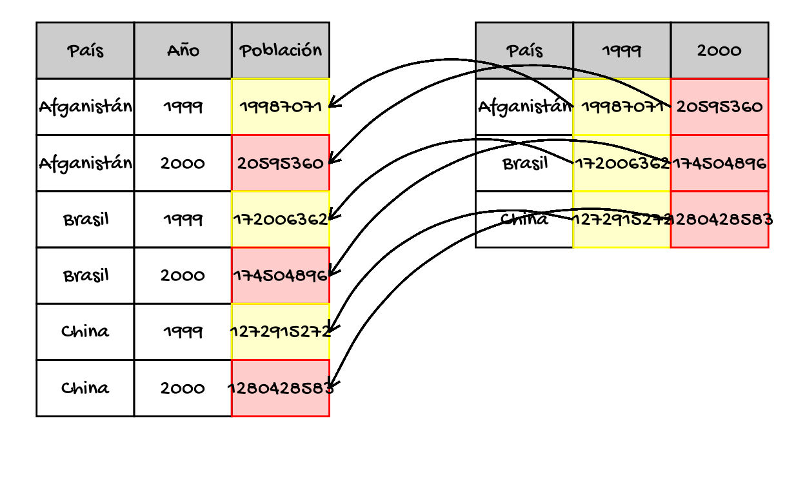

<div class="tutorial-exercise" data-label="exe_4_3_2_c" data-caption="Code" data-completion="1" data-diagnostics="1" data-startover="1" data-lines="0"><script type="application/json" data-opts-chunk="1">{"fig.width":6.5,"fig.height":4,"fig.retina":2,"fig.align":"default","fig.keep":"high","fig.show":"asis","out.width":624,"warning":false,"error":false,"message":false,"exercise.df_print":"paged","exercise.timelimit":60,"exercise.checker":["function (label = NULL, solution_code = NULL, user_code = NULL, ","    check_code = NULL, envir_result = NULL, evaluate_result = NULL, ","    envir_prep = NULL, last_value = NULL, ...) ","{","    if (is.null(user_code)) {","        return(list(message = \"I didn't receive your code. Did you write any?\", ","            correct = FALSE, type = \"error\", location = \"append\"))","    }","    else {","        user_code <- parse(text = user_code)","        if (length(user_code) == 0) {","            return(list(message = \"I didn't receive your code. Did you write any?\", ","                correct = FALSE, type = \"error\", location = \"append\"))","        }","    }","    if (!is.null(solution_code)) {","        solution_code <- parse(text = solution_code)","        if (length(solution_code) == 0) {","            return(list(message = \"No solution is provided for this exercise.\", ","                correct = TRUE, type = \"info\", location = \"append\"))","        }","    }","    had_error_checking <- FALSE","    checked_result <- tryCatch({","        parsed_check_code <- parse(text = check_code)","        if (length(parsed_check_code) > 1) {","            for (i in 1:(length(parsed_check_code) - 1)) {","                eval(parsed_check_code[[i]], envir_prep)","            }","        }","        grading_code <- rlang::call_standardise(parsed_check_code[[length(parsed_check_code)]], ","            envir_prep)","        grader_args <- list(user_quo = rlang::as_quosure(user_code[[length(user_code)]], ","            envir_result))","        if (!is.null(solution_code)) {","            grader_args$solution_quo <- rlang::as_quosure(solution_code[[length(solution_code)]], ","                envir_prep)","        }","        learnr_args <- list(...)","        learnr_args$label <- label","        learnr_args$solution_code <- solution_code","        learnr_args$user_code <- user_code","        learnr_args$check_code <- check_code","        learnr_args$envir_result <- envir_result","        learnr_args$evaluate_result <- evaluate_result","        learnr_args$envir_prep <- envir_prep","        learnr_args$last_value <- last_value","        grading_code$grader_args <- grader_args","        grading_code$learnr_args <- learnr_args","        envir_prep$ans <- grader_args$user","        eval(grading_code, envir_prep)","    }, error = function(e) {","        message(\"\", e)","        had_error_checking <<- TRUE","        graded(correct = FALSE, message = \"Error occured while checking the submission\")","    })","    if (!checkmate::test_class(checked_result, \"grader_graded\")) {","        stop(\"`grade_learnr` should receive a `graded` value from every `-check` chunk\")","    }","    message_type <- if (had_error_checking) {","        \"warning\"","    }","    else {","        if (checked_result$correct) {","            \"success\"","        }","        else {","            \"error\"","        }","    }","    ret <- list(message = checked_result$message, correct = checked_result$correct, ","        type = message_type, location = \"append\")","    ret","}"]}</script></div>

<div class="tutorial-exercise-support" data-label="exe_4_3_2_c-solution" data-caption="Code" data-completion="1" data-diagnostics="1" data-startover="1" data-lines="0">

```text
datos_4_b_largo <- pivot_longer(
  data = datos_4_b,
  cols = c('1999', '2000'),
  names_to = 'Años',
  values_to = 'Población'
  )

datos_4_b_largo
```

</div>

<div class="tutorial-exercise-support" data-label="exe_4_3_2_c-check" data-caption="Code" data-completion="1" data-diagnostics="1" data-startover="1" data-lines="0">

```text
grade_code("¡Muy bien!, a partir de este cambio cada variable se coloco en su propia columna, cada observación en su propia fila y cada valor en su propia celda.")
```

</div>

:::caution
Como se observó, la función `pivot_longer()` hace lo opuesto a `pivot_wider()`. Por lo tanto, ambas funciones son complementarias, es decir, si al resultado de aplicar la función `pivot_wider()` se le aplica la función `pivot_longer()` se llega al conjunto de datos original. Otra observación interesante es que `pivot_longer()` __alarga__ los conjuntos de datos, mientras que `pivot_wider()` los hace más __anchos__.
:::

+ `separate()` y `unite()`

La función `separate()` lo que hace es dividir una columna en múltiples columnas, tomando como separador algún símbolo, mientras que la función `unite()` toma múltiples columnas y las une en una única columna, separando los elementos mediante un separador.

:::example
#### Ejemplo 4.3.3
:::


<div class="tutorial-exercise" data-label="addition_4_3_3_a" data-caption="Code" data-completion="1" data-diagnostics="1" data-startover="1" data-lines="0">

```text
datos_3
```

<script type="application/json" data-opts-chunk="1">{"fig.width":6.5,"fig.height":4,"fig.retina":2,"fig.align":"default","fig.keep":"high","fig.show":"asis","out.width":624,"warning":false,"error":false,"message":false,"exercise.df_print":"paged","exercise.timelimit":60,"exercise.checker":["function (label = NULL, solution_code = NULL, user_code = NULL, ","    check_code = NULL, envir_result = NULL, evaluate_result = NULL, ","    envir_prep = NULL, last_value = NULL, ...) ","{","    if (is.null(user_code)) {","        return(list(message = \"I didn't receive your code. Did you write any?\", ","            correct = FALSE, type = \"error\", location = \"append\"))","    }","    else {","        user_code <- parse(text = user_code)","        if (length(user_code) == 0) {","            return(list(message = \"I didn't receive your code. Did you write any?\", ","                correct = FALSE, type = \"error\", location = \"append\"))","        }","    }","    if (!is.null(solution_code)) {","        solution_code <- parse(text = solution_code)","        if (length(solution_code) == 0) {","            return(list(message = \"No solution is provided for this exercise.\", ","                correct = TRUE, type = \"info\", location = \"append\"))","        }","    }","    had_error_checking <- FALSE","    checked_result <- tryCatch({","        parsed_check_code <- parse(text = check_code)","        if (length(parsed_check_code) > 1) {","            for (i in 1:(length(parsed_check_code) - 1)) {","                eval(parsed_check_code[[i]], envir_prep)","            }","        }","        grading_code <- rlang::call_standardise(parsed_check_code[[length(parsed_check_code)]], ","            envir_prep)","        grader_args <- list(user_quo = rlang::as_quosure(user_code[[length(user_code)]], ","            envir_result))","        if (!is.null(solution_code)) {","            grader_args$solution_quo <- rlang::as_quosure(solution_code[[length(solution_code)]], ","                envir_prep)","        }","        learnr_args <- list(...)","        learnr_args$label <- label","        learnr_args$solution_code <- solution_code","        learnr_args$user_code <- user_code","        learnr_args$check_code <- check_code","        learnr_args$envir_result <- envir_result","        learnr_args$evaluate_result <- evaluate_result","        learnr_args$envir_prep <- envir_prep","        learnr_args$last_value <- last_value","        grading_code$grader_args <- grader_args","        grading_code$learnr_args <- learnr_args","        envir_prep$ans <- grader_args$user","        eval(grading_code, envir_prep)","    }, error = function(e) {","        message(\"\", e)","        had_error_checking <<- TRUE","        graded(correct = FALSE, message = \"Error occured while checking the submission\")","    })","    if (!checkmate::test_class(checked_result, \"grader_graded\")) {","        stop(\"`grade_learnr` should receive a `graded` value from every `-check` chunk\")","    }","    message_type <- if (had_error_checking) {","        \"warning\"","    }","    else {","        if (checked_result$correct) {","            \"success\"","        }","        else {","            \"error\"","        }","    }","    ret <- list(message = checked_result$message, correct = checked_result$correct, ","        type = message_type, location = \"append\")","    ret","}"]}</script></div>


<div class="tutorial-exercise" data-label="addition_4_3_3_b" data-caption="Code" data-completion="1" data-diagnostics="1" data-startover="1" data-lines="0">

```text
datos_3_separado <- separate(
  data = datos_3, # El nombre del conjunto de datos a ordenar.
  col = Tasa, # Argumento donde se indica el nombre de la columna que se quiere dividir.
  into =  c('Casos', 'Población'), # Argumento donde se indica los nombres de las nuevas variables.
  sep  =  '/'#, # Argumento donde se indica el símbolo que separa las dos variables en una misma columna.
  #convert = TRUE # Opción que permite hacer la conversión de tipo caracter a numérico.
  )

datos_3_separado
```

<script type="application/json" data-opts-chunk="1">{"fig.width":6.5,"fig.height":4,"fig.retina":2,"fig.align":"default","fig.keep":"high","fig.show":"asis","out.width":624,"warning":false,"error":false,"message":false,"exercise.df_print":"paged","exercise.timelimit":60,"exercise.checker":["function (label = NULL, solution_code = NULL, user_code = NULL, ","    check_code = NULL, envir_result = NULL, evaluate_result = NULL, ","    envir_prep = NULL, last_value = NULL, ...) ","{","    if (is.null(user_code)) {","        return(list(message = \"I didn't receive your code. Did you write any?\", ","            correct = FALSE, type = \"error\", location = \"append\"))","    }","    else {","        user_code <- parse(text = user_code)","        if (length(user_code) == 0) {","            return(list(message = \"I didn't receive your code. Did you write any?\", ","                correct = FALSE, type = \"error\", location = \"append\"))","        }","    }","    if (!is.null(solution_code)) {","        solution_code <- parse(text = solution_code)","        if (length(solution_code) == 0) {","            return(list(message = \"No solution is provided for this exercise.\", ","                correct = TRUE, type = \"info\", location = \"append\"))","        }","    }","    had_error_checking <- FALSE","    checked_result <- tryCatch({","        parsed_check_code <- parse(text = check_code)","        if (length(parsed_check_code) > 1) {","            for (i in 1:(length(parsed_check_code) - 1)) {","                eval(parsed_check_code[[i]], envir_prep)","            }","        }","        grading_code <- rlang::call_standardise(parsed_check_code[[length(parsed_check_code)]], ","            envir_prep)","        grader_args <- list(user_quo = rlang::as_quosure(user_code[[length(user_code)]], ","            envir_result))","        if (!is.null(solution_code)) {","            grader_args$solution_quo <- rlang::as_quosure(solution_code[[length(solution_code)]], ","                envir_prep)","        }","        learnr_args <- list(...)","        learnr_args$label <- label","        learnr_args$solution_code <- solution_code","        learnr_args$user_code <- user_code","        learnr_args$check_code <- check_code","        learnr_args$envir_result <- envir_result","        learnr_args$evaluate_result <- evaluate_result","        learnr_args$envir_prep <- envir_prep","        learnr_args$last_value <- last_value","        grading_code$grader_args <- grader_args","        grading_code$learnr_args <- learnr_args","        envir_prep$ans <- grader_args$user","        eval(grading_code, envir_prep)","    }, error = function(e) {","        message(\"\", e)","        had_error_checking <<- TRUE","        graded(correct = FALSE, message = \"Error occured while checking the submission\")","    })","    if (!checkmate::test_class(checked_result, \"grader_graded\")) {","        stop(\"`grade_learnr` should receive a `graded` value from every `-check` chunk\")","    }","    message_type <- if (had_error_checking) {","        \"warning\"","    }","    else {","        if (checked_result$correct) {","            \"success\"","        }","        else {","            \"error\"","        }","    }","    ret <- list(message = checked_result$message, correct = checked_result$correct, ","        type = message_type, location = \"append\")","    ret","}"]}</script></div>

<!--
Esto puede parecer un lugar extraño para comenzar, pero ordenar datos es la habilidad más fructífera que puedes aprender como científico de datos. Le ahorrará horas de tiempo y hará que sus datos sean mucho más fáciles de visualizar, manipular y modelar con R.
-->

:::exercise
#### Ejercicio de repaso
:::

El siguiente conjunto de datos contiene casos de tuberculosis registrados en distintos años. Dichos datos se encuentran en el _Informe Gobal de Tuberculosis_ de la Organización Mundial de la Salud, disponible para descargar [aquí](https://www.who.int/tb/country/data/download/en/). Este conjunto de datos proporciona un ejemplo realista de datos desordenados.

<div data-pagedtable="false">
  <script data-pagedtable-source type="application/json">
{"columns":[{"label":["country"],"name":[1],"type":["chr"],"align":["left"]},{"label":["iso2"],"name":[2],"type":["chr"],"align":["left"]},{"label":["iso3"],"name":[3],"type":["chr"],"align":["left"]},{"label":["year"],"name":[4],"type":["int"],"align":["right"]},{"label":["new_sp_m014"],"name":[5],"type":["int"],"align":["right"]},{"label":["new_sp_m1524"],"name":[6],"type":["int"],"align":["right"]},{"label":["new_sp_m2534"],"name":[7],"type":["int"],"align":["right"]},{"label":["new_sp_m3544"],"name":[8],"type":["int"],"align":["right"]},{"label":["new_sp_m4554"],"name":[9],"type":["int"],"align":["right"]},{"label":["new_sp_m5564"],"name":[10],"type":["int"],"align":["right"]},{"label":["new_sp_m65"],"name":[11],"type":["int"],"align":["right"]},{"label":["new_sp_f014"],"name":[12],"type":["int"],"align":["right"]},{"label":["new_sp_f1524"],"name":[13],"type":["int"],"align":["right"]},{"label":["new_sp_f2534"],"name":[14],"type":["int"],"align":["right"]},{"label":["new_sp_f3544"],"name":[15],"type":["int"],"align":["right"]},{"label":["new_sp_f4554"],"name":[16],"type":["int"],"align":["right"]},{"label":["new_sp_f5564"],"name":[17],"type":["int"],"align":["right"]},{"label":["new_sp_f65"],"name":[18],"type":["int"],"align":["right"]},{"label":["new_sn_m014"],"name":[19],"type":["int"],"align":["right"]},{"label":["new_sn_m1524"],"name":[20],"type":["int"],"align":["right"]},{"label":["new_sn_m2534"],"name":[21],"type":["int"],"align":["right"]},{"label":["new_sn_m3544"],"name":[22],"type":["int"],"align":["right"]},{"label":["new_sn_m4554"],"name":[23],"type":["int"],"align":["right"]},{"label":["new_sn_m5564"],"name":[24],"type":["int"],"align":["right"]},{"label":["new_sn_m65"],"name":[25],"type":["int"],"align":["right"]},{"label":["new_sn_f014"],"name":[26],"type":["int"],"align":["right"]},{"label":["new_sn_f1524"],"name":[27],"type":["int"],"align":["right"]},{"label":["new_sn_f2534"],"name":[28],"type":["int"],"align":["right"]},{"label":["new_sn_f3544"],"name":[29],"type":["int"],"align":["right"]},{"label":["new_sn_f4554"],"name":[30],"type":["int"],"align":["right"]},{"label":["new_sn_f5564"],"name":[31],"type":["int"],"align":["right"]},{"label":["new_sn_f65"],"name":[32],"type":["int"],"align":["right"]},{"label":["new_ep_m014"],"name":[33],"type":["int"],"align":["right"]},{"label":["new_ep_m1524"],"name":[34],"type":["int"],"align":["right"]},{"label":["new_ep_m2534"],"name":[35],"type":["int"],"align":["right"]},{"label":["new_ep_m3544"],"name":[36],"type":["int"],"align":["right"]},{"label":["new_ep_m4554"],"name":[37],"type":["int"],"align":["right"]},{"label":["new_ep_m5564"],"name":[38],"type":["int"],"align":["right"]},{"label":["new_ep_m65"],"name":[39],"type":["int"],"align":["right"]},{"label":["new_ep_f014"],"name":[40],"type":["int"],"align":["right"]},{"label":["new_ep_f1524"],"name":[41],"type":["int"],"align":["right"]},{"label":["new_ep_f2534"],"name":[42],"type":["int"],"align":["right"]},{"label":["new_ep_f3544"],"name":[43],"type":["int"],"align":["right"]},{"label":["new_ep_f4554"],"name":[44],"type":["int"],"align":["right"]},{"label":["new_ep_f5564"],"name":[45],"type":["int"],"align":["right"]},{"label":["new_ep_f65"],"name":[46],"type":["int"],"align":["right"]},{"label":["new_rel_m014"],"name":[47],"type":["int"],"align":["right"]},{"label":["new_rel_m1524"],"name":[48],"type":["int"],"align":["right"]},{"label":["new_rel_m2534"],"name":[49],"type":["int"],"align":["right"]},{"label":["new_rel_m3544"],"name":[50],"type":["int"],"align":["right"]},{"label":["new_rel_m4554"],"name":[51],"type":["int"],"align":["right"]},{"label":["new_rel_m5564"],"name":[52],"type":["int"],"align":["right"]},{"label":["new_rel_m65"],"name":[53],"type":["int"],"align":["right"]},{"label":["new_rel_f014"],"name":[54],"type":["int"],"align":["right"]},{"label":["new_rel_f1524"],"name":[55],"type":["int"],"align":["right"]},{"label":["new_rel_f2534"],"name":[56],"type":["int"],"align":["right"]},{"label":["new_rel_f3544"],"name":[57],"type":["int"],"align":["right"]},{"label":["new_rel_f4554"],"name":[58],"type":["int"],"align":["right"]},{"label":["new_rel_f5564"],"name":[59],"type":["int"],"align":["right"]},{"label":["new_rel_f65"],"name":[60],"type":["int"],"align":["right"]}],"data":[{"1":"Afghanistan","2":"AF","3":"AFG","4":"1980","5":"NA","6":"NA","7":"NA","8":"NA","9":"NA","10":"NA","11":"NA","12":"NA","13":"NA","14":"NA","15":"NA","16":"NA","17":"NA","18":"NA","19":"NA","20":"NA","21":"NA","22":"NA","23":"NA","24":"NA","25":"NA","26":"NA","27":"NA","28":"NA","29":"NA","30":"NA","31":"NA","32":"NA","33":"NA","34":"NA","35":"NA","36":"NA","37":"NA","38":"NA","39":"NA","40":"NA","41":"NA","42":"NA","43":"NA","44":"NA","45":"NA","46":"NA","47":"NA","48":"NA","49":"NA","50":"NA","51":"NA","52":"NA","53":"NA","54":"NA","55":"NA","56":"NA","57":"NA","58":"NA","59":"NA","60":"NA"},{"1":"Afghanistan","2":"AF","3":"AFG","4":"1981","5":"NA","6":"NA","7":"NA","8":"NA","9":"NA","10":"NA","11":"NA","12":"NA","13":"NA","14":"NA","15":"NA","16":"NA","17":"NA","18":"NA","19":"NA","20":"NA","21":"NA","22":"NA","23":"NA","24":"NA","25":"NA","26":"NA","27":"NA","28":"NA","29":"NA","30":"NA","31":"NA","32":"NA","33":"NA","34":"NA","35":"NA","36":"NA","37":"NA","38":"NA","39":"NA","40":"NA","41":"NA","42":"NA","43":"NA","44":"NA","45":"NA","46":"NA","47":"NA","48":"NA","49":"NA","50":"NA","51":"NA","52":"NA","53":"NA","54":"NA","55":"NA","56":"NA","57":"NA","58":"NA","59":"NA","60":"NA"},{"1":"Afghanistan","2":"AF","3":"AFG","4":"1982","5":"NA","6":"NA","7":"NA","8":"NA","9":"NA","10":"NA","11":"NA","12":"NA","13":"NA","14":"NA","15":"NA","16":"NA","17":"NA","18":"NA","19":"NA","20":"NA","21":"NA","22":"NA","23":"NA","24":"NA","25":"NA","26":"NA","27":"NA","28":"NA","29":"NA","30":"NA","31":"NA","32":"NA","33":"NA","34":"NA","35":"NA","36":"NA","37":"NA","38":"NA","39":"NA","40":"NA","41":"NA","42":"NA","43":"NA","44":"NA","45":"NA","46":"NA","47":"NA","48":"NA","49":"NA","50":"NA","51":"NA","52":"NA","53":"NA","54":"NA","55":"NA","56":"NA","57":"NA","58":"NA","59":"NA","60":"NA"},{"1":"Afghanistan","2":"AF","3":"AFG","4":"1983","5":"NA","6":"NA","7":"NA","8":"NA","9":"NA","10":"NA","11":"NA","12":"NA","13":"NA","14":"NA","15":"NA","16":"NA","17":"NA","18":"NA","19":"NA","20":"NA","21":"NA","22":"NA","23":"NA","24":"NA","25":"NA","26":"NA","27":"NA","28":"NA","29":"NA","30":"NA","31":"NA","32":"NA","33":"NA","34":"NA","35":"NA","36":"NA","37":"NA","38":"NA","39":"NA","40":"NA","41":"NA","42":"NA","43":"NA","44":"NA","45":"NA","46":"NA","47":"NA","48":"NA","49":"NA","50":"NA","51":"NA","52":"NA","53":"NA","54":"NA","55":"NA","56":"NA","57":"NA","58":"NA","59":"NA","60":"NA"},{"1":"Afghanistan","2":"AF","3":"AFG","4":"1984","5":"NA","6":"NA","7":"NA","8":"NA","9":"NA","10":"NA","11":"NA","12":"NA","13":"NA","14":"NA","15":"NA","16":"NA","17":"NA","18":"NA","19":"NA","20":"NA","21":"NA","22":"NA","23":"NA","24":"NA","25":"NA","26":"NA","27":"NA","28":"NA","29":"NA","30":"NA","31":"NA","32":"NA","33":"NA","34":"NA","35":"NA","36":"NA","37":"NA","38":"NA","39":"NA","40":"NA","41":"NA","42":"NA","43":"NA","44":"NA","45":"NA","46":"NA","47":"NA","48":"NA","49":"NA","50":"NA","51":"NA","52":"NA","53":"NA","54":"NA","55":"NA","56":"NA","57":"NA","58":"NA","59":"NA","60":"NA"},{"1":"Afghanistan","2":"AF","3":"AFG","4":"1985","5":"NA","6":"NA","7":"NA","8":"NA","9":"NA","10":"NA","11":"NA","12":"NA","13":"NA","14":"NA","15":"NA","16":"NA","17":"NA","18":"NA","19":"NA","20":"NA","21":"NA","22":"NA","23":"NA","24":"NA","25":"NA","26":"NA","27":"NA","28":"NA","29":"NA","30":"NA","31":"NA","32":"NA","33":"NA","34":"NA","35":"NA","36":"NA","37":"NA","38":"NA","39":"NA","40":"NA","41":"NA","42":"NA","43":"NA","44":"NA","45":"NA","46":"NA","47":"NA","48":"NA","49":"NA","50":"NA","51":"NA","52":"NA","53":"NA","54":"NA","55":"NA","56":"NA","57":"NA","58":"NA","59":"NA","60":"NA"},{"1":"Afghanistan","2":"AF","3":"AFG","4":"1986","5":"NA","6":"NA","7":"NA","8":"NA","9":"NA","10":"NA","11":"NA","12":"NA","13":"NA","14":"NA","15":"NA","16":"NA","17":"NA","18":"NA","19":"NA","20":"NA","21":"NA","22":"NA","23":"NA","24":"NA","25":"NA","26":"NA","27":"NA","28":"NA","29":"NA","30":"NA","31":"NA","32":"NA","33":"NA","34":"NA","35":"NA","36":"NA","37":"NA","38":"NA","39":"NA","40":"NA","41":"NA","42":"NA","43":"NA","44":"NA","45":"NA","46":"NA","47":"NA","48":"NA","49":"NA","50":"NA","51":"NA","52":"NA","53":"NA","54":"NA","55":"NA","56":"NA","57":"NA","58":"NA","59":"NA","60":"NA"},{"1":"Afghanistan","2":"AF","3":"AFG","4":"1987","5":"NA","6":"NA","7":"NA","8":"NA","9":"NA","10":"NA","11":"NA","12":"NA","13":"NA","14":"NA","15":"NA","16":"NA","17":"NA","18":"NA","19":"NA","20":"NA","21":"NA","22":"NA","23":"NA","24":"NA","25":"NA","26":"NA","27":"NA","28":"NA","29":"NA","30":"NA","31":"NA","32":"NA","33":"NA","34":"NA","35":"NA","36":"NA","37":"NA","38":"NA","39":"NA","40":"NA","41":"NA","42":"NA","43":"NA","44":"NA","45":"NA","46":"NA","47":"NA","48":"NA","49":"NA","50":"NA","51":"NA","52":"NA","53":"NA","54":"NA","55":"NA","56":"NA","57":"NA","58":"NA","59":"NA","60":"NA"},{"1":"Afghanistan","2":"AF","3":"AFG","4":"1988","5":"NA","6":"NA","7":"NA","8":"NA","9":"NA","10":"NA","11":"NA","12":"NA","13":"NA","14":"NA","15":"NA","16":"NA","17":"NA","18":"NA","19":"NA","20":"NA","21":"NA","22":"NA","23":"NA","24":"NA","25":"NA","26":"NA","27":"NA","28":"NA","29":"NA","30":"NA","31":"NA","32":"NA","33":"NA","34":"NA","35":"NA","36":"NA","37":"NA","38":"NA","39":"NA","40":"NA","41":"NA","42":"NA","43":"NA","44":"NA","45":"NA","46":"NA","47":"NA","48":"NA","49":"NA","50":"NA","51":"NA","52":"NA","53":"NA","54":"NA","55":"NA","56":"NA","57":"NA","58":"NA","59":"NA","60":"NA"},{"1":"Afghanistan","2":"AF","3":"AFG","4":"1989","5":"NA","6":"NA","7":"NA","8":"NA","9":"NA","10":"NA","11":"NA","12":"NA","13":"NA","14":"NA","15":"NA","16":"NA","17":"NA","18":"NA","19":"NA","20":"NA","21":"NA","22":"NA","23":"NA","24":"NA","25":"NA","26":"NA","27":"NA","28":"NA","29":"NA","30":"NA","31":"NA","32":"NA","33":"NA","34":"NA","35":"NA","36":"NA","37":"NA","38":"NA","39":"NA","40":"NA","41":"NA","42":"NA","43":"NA","44":"NA","45":"NA","46":"NA","47":"NA","48":"NA","49":"NA","50":"NA","51":"NA","52":"NA","53":"NA","54":"NA","55":"NA","56":"NA","57":"NA","58":"NA","59":"NA","60":"NA"},{"1":"Afghanistan","2":"AF","3":"AFG","4":"1990","5":"NA","6":"NA","7":"NA","8":"NA","9":"NA","10":"NA","11":"NA","12":"NA","13":"NA","14":"NA","15":"NA","16":"NA","17":"NA","18":"NA","19":"NA","20":"NA","21":"NA","22":"NA","23":"NA","24":"NA","25":"NA","26":"NA","27":"NA","28":"NA","29":"NA","30":"NA","31":"NA","32":"NA","33":"NA","34":"NA","35":"NA","36":"NA","37":"NA","38":"NA","39":"NA","40":"NA","41":"NA","42":"NA","43":"NA","44":"NA","45":"NA","46":"NA","47":"NA","48":"NA","49":"NA","50":"NA","51":"NA","52":"NA","53":"NA","54":"NA","55":"NA","56":"NA","57":"NA","58":"NA","59":"NA","60":"NA"},{"1":"Afghanistan","2":"AF","3":"AFG","4":"1991","5":"NA","6":"NA","7":"NA","8":"NA","9":"NA","10":"NA","11":"NA","12":"NA","13":"NA","14":"NA","15":"NA","16":"NA","17":"NA","18":"NA","19":"NA","20":"NA","21":"NA","22":"NA","23":"NA","24":"NA","25":"NA","26":"NA","27":"NA","28":"NA","29":"NA","30":"NA","31":"NA","32":"NA","33":"NA","34":"NA","35":"NA","36":"NA","37":"NA","38":"NA","39":"NA","40":"NA","41":"NA","42":"NA","43":"NA","44":"NA","45":"NA","46":"NA","47":"NA","48":"NA","49":"NA","50":"NA","51":"NA","52":"NA","53":"NA","54":"NA","55":"NA","56":"NA","57":"NA","58":"NA","59":"NA","60":"NA"},{"1":"Afghanistan","2":"AF","3":"AFG","4":"1992","5":"NA","6":"NA","7":"NA","8":"NA","9":"NA","10":"NA","11":"NA","12":"NA","13":"NA","14":"NA","15":"NA","16":"NA","17":"NA","18":"NA","19":"NA","20":"NA","21":"NA","22":"NA","23":"NA","24":"NA","25":"NA","26":"NA","27":"NA","28":"NA","29":"NA","30":"NA","31":"NA","32":"NA","33":"NA","34":"NA","35":"NA","36":"NA","37":"NA","38":"NA","39":"NA","40":"NA","41":"NA","42":"NA","43":"NA","44":"NA","45":"NA","46":"NA","47":"NA","48":"NA","49":"NA","50":"NA","51":"NA","52":"NA","53":"NA","54":"NA","55":"NA","56":"NA","57":"NA","58":"NA","59":"NA","60":"NA"},{"1":"Afghanistan","2":"AF","3":"AFG","4":"1993","5":"NA","6":"NA","7":"NA","8":"NA","9":"NA","10":"NA","11":"NA","12":"NA","13":"NA","14":"NA","15":"NA","16":"NA","17":"NA","18":"NA","19":"NA","20":"NA","21":"NA","22":"NA","23":"NA","24":"NA","25":"NA","26":"NA","27":"NA","28":"NA","29":"NA","30":"NA","31":"NA","32":"NA","33":"NA","34":"NA","35":"NA","36":"NA","37":"NA","38":"NA","39":"NA","40":"NA","41":"NA","42":"NA","43":"NA","44":"NA","45":"NA","46":"NA","47":"NA","48":"NA","49":"NA","50":"NA","51":"NA","52":"NA","53":"NA","54":"NA","55":"NA","56":"NA","57":"NA","58":"NA","59":"NA","60":"NA"},{"1":"Afghanistan","2":"AF","3":"AFG","4":"1994","5":"NA","6":"NA","7":"NA","8":"NA","9":"NA","10":"NA","11":"NA","12":"NA","13":"NA","14":"NA","15":"NA","16":"NA","17":"NA","18":"NA","19":"NA","20":"NA","21":"NA","22":"NA","23":"NA","24":"NA","25":"NA","26":"NA","27":"NA","28":"NA","29":"NA","30":"NA","31":"NA","32":"NA","33":"NA","34":"NA","35":"NA","36":"NA","37":"NA","38":"NA","39":"NA","40":"NA","41":"NA","42":"NA","43":"NA","44":"NA","45":"NA","46":"NA","47":"NA","48":"NA","49":"NA","50":"NA","51":"NA","52":"NA","53":"NA","54":"NA","55":"NA","56":"NA","57":"NA","58":"NA","59":"NA","60":"NA"},{"1":"Afghanistan","2":"AF","3":"AFG","4":"1995","5":"NA","6":"NA","7":"NA","8":"NA","9":"NA","10":"NA","11":"NA","12":"NA","13":"NA","14":"NA","15":"NA","16":"NA","17":"NA","18":"NA","19":"NA","20":"NA","21":"NA","22":"NA","23":"NA","24":"NA","25":"NA","26":"NA","27":"NA","28":"NA","29":"NA","30":"NA","31":"NA","32":"NA","33":"NA","34":"NA","35":"NA","36":"NA","37":"NA","38":"NA","39":"NA","40":"NA","41":"NA","42":"NA","43":"NA","44":"NA","45":"NA","46":"NA","47":"NA","48":"NA","49":"NA","50":"NA","51":"NA","52":"NA","53":"NA","54":"NA","55":"NA","56":"NA","57":"NA","58":"NA","59":"NA","60":"NA"},{"1":"Afghanistan","2":"AF","3":"AFG","4":"1996","5":"NA","6":"NA","7":"NA","8":"NA","9":"NA","10":"NA","11":"NA","12":"NA","13":"NA","14":"NA","15":"NA","16":"NA","17":"NA","18":"NA","19":"NA","20":"NA","21":"NA","22":"NA","23":"NA","24":"NA","25":"NA","26":"NA","27":"NA","28":"NA","29":"NA","30":"NA","31":"NA","32":"NA","33":"NA","34":"NA","35":"NA","36":"NA","37":"NA","38":"NA","39":"NA","40":"NA","41":"NA","42":"NA","43":"NA","44":"NA","45":"NA","46":"NA","47":"NA","48":"NA","49":"NA","50":"NA","51":"NA","52":"NA","53":"NA","54":"NA","55":"NA","56":"NA","57":"NA","58":"NA","59":"NA","60":"NA"},{"1":"Afghanistan","2":"AF","3":"AFG","4":"1997","5":"0","6":"10","7":"6","8":"3","9":"5","10":"2","11":"0","12":"5","13":"38","14":"36","15":"14","16":"8","17":"0","18":"1","19":"NA","20":"NA","21":"NA","22":"NA","23":"NA","24":"NA","25":"NA","26":"NA","27":"NA","28":"NA","29":"NA","30":"NA","31":"NA","32":"NA","33":"NA","34":"NA","35":"NA","36":"NA","37":"NA","38":"NA","39":"NA","40":"NA","41":"NA","42":"NA","43":"NA","44":"NA","45":"NA","46":"NA","47":"NA","48":"NA","49":"NA","50":"NA","51":"NA","52":"NA","53":"NA","54":"NA","55":"NA","56":"NA","57":"NA","58":"NA","59":"NA","60":"NA"},{"1":"Afghanistan","2":"AF","3":"AFG","4":"1998","5":"30","6":"129","7":"128","8":"90","9":"89","10":"64","11":"41","12":"45","13":"350","14":"419","15":"194","16":"118","17":"61","18":"20","19":"NA","20":"NA","21":"NA","22":"NA","23":"NA","24":"NA","25":"NA","26":"NA","27":"NA","28":"NA","29":"NA","30":"NA","31":"NA","32":"NA","33":"NA","34":"NA","35":"NA","36":"NA","37":"NA","38":"NA","39":"NA","40":"NA","41":"NA","42":"NA","43":"NA","44":"NA","45":"NA","46":"NA","47":"NA","48":"NA","49":"NA","50":"NA","51":"NA","52":"NA","53":"NA","54":"NA","55":"NA","56":"NA","57":"NA","58":"NA","59":"NA","60":"NA"},{"1":"Afghanistan","2":"AF","3":"AFG","4":"1999","5":"8","6":"55","7":"55","8":"47","9":"34","10":"21","11":"8","12":"25","13":"139","14":"160","15":"110","16":"50","17":"25","18":"8","19":"NA","20":"NA","21":"NA","22":"NA","23":"NA","24":"NA","25":"NA","26":"NA","27":"NA","28":"NA","29":"NA","30":"NA","31":"NA","32":"NA","33":"NA","34":"NA","35":"NA","36":"NA","37":"NA","38":"NA","39":"NA","40":"NA","41":"NA","42":"NA","43":"NA","44":"NA","45":"NA","46":"NA","47":"NA","48":"NA","49":"NA","50":"NA","51":"NA","52":"NA","53":"NA","54":"NA","55":"NA","56":"NA","57":"NA","58":"NA","59":"NA","60":"NA"},{"1":"Afghanistan","2":"AF","3":"AFG","4":"2000","5":"52","6":"228","7":"183","8":"149","9":"129","10":"94","11":"80","12":"93","13":"414","14":"565","15":"339","16":"205","17":"99","18":"36","19":"NA","20":"NA","21":"NA","22":"NA","23":"NA","24":"NA","25":"NA","26":"NA","27":"NA","28":"NA","29":"NA","30":"NA","31":"NA","32":"NA","33":"NA","34":"NA","35":"NA","36":"NA","37":"NA","38":"NA","39":"NA","40":"NA","41":"NA","42":"NA","43":"NA","44":"NA","45":"NA","46":"NA","47":"NA","48":"NA","49":"NA","50":"NA","51":"NA","52":"NA","53":"NA","54":"NA","55":"NA","56":"NA","57":"NA","58":"NA","59":"NA","60":"NA"},{"1":"Afghanistan","2":"AF","3":"AFG","4":"2001","5":"129","6":"379","7":"349","8":"274","9":"204","10":"139","11":"103","12":"146","13":"799","14":"888","15":"586","16":"375","17":"179","18":"89","19":"NA","20":"NA","21":"NA","22":"NA","23":"NA","24":"NA","25":"NA","26":"NA","27":"NA","28":"NA","29":"NA","30":"NA","31":"NA","32":"NA","33":"NA","34":"NA","35":"NA","36":"NA","37":"NA","38":"NA","39":"NA","40":"NA","41":"NA","42":"NA","43":"NA","44":"NA","45":"NA","46":"NA","47":"NA","48":"NA","49":"NA","50":"NA","51":"NA","52":"NA","53":"NA","54":"NA","55":"NA","56":"NA","57":"NA","58":"NA","59":"NA","60":"NA"},{"1":"Afghanistan","2":"AF","3":"AFG","4":"2002","5":"90","6":"476","7":"481","8":"368","9":"246","10":"241","11":"189","12":"192","13":"1119","14":"1251","15":"792","16":"526","17":"320","18":"218","19":"NA","20":"NA","21":"NA","22":"NA","23":"NA","24":"NA","25":"NA","26":"NA","27":"NA","28":"NA","29":"NA","30":"NA","31":"NA","32":"NA","33":"NA","34":"NA","35":"NA","36":"NA","37":"NA","38":"NA","39":"NA","40":"NA","41":"NA","42":"NA","43":"NA","44":"NA","45":"NA","46":"NA","47":"NA","48":"NA","49":"NA","50":"NA","51":"NA","52":"NA","53":"NA","54":"NA","55":"NA","56":"NA","57":"NA","58":"NA","59":"NA","60":"NA"},{"1":"Afghanistan","2":"AF","3":"AFG","4":"2003","5":"127","6":"511","7":"436","8":"284","9":"256","10":"288","11":"203","12":"245","13":"1152","14":"1287","15":"814","16":"462","17":"305","18":"158","19":"NA","20":"NA","21":"NA","22":"NA","23":"NA","24":"NA","25":"NA","26":"NA","27":"NA","28":"NA","29":"NA","30":"NA","31":"NA","32":"NA","33":"NA","34":"NA","35":"NA","36":"NA","37":"NA","38":"NA","39":"NA","40":"NA","41":"NA","42":"NA","43":"NA","44":"NA","45":"NA","46":"NA","47":"NA","48":"NA","49":"NA","50":"NA","51":"NA","52":"NA","53":"NA","54":"NA","55":"NA","56":"NA","57":"NA","58":"NA","59":"NA","60":"NA"},{"1":"Afghanistan","2":"AF","3":"AFG","4":"2004","5":"139","6":"537","7":"568","8":"360","9":"358","10":"386","11":"310","12":"256","13":"1360","14":"1561","15":"1096","16":"645","17":"413","18":"256","19":"NA","20":"NA","21":"NA","22":"NA","23":"NA","24":"NA","25":"NA","26":"NA","27":"NA","28":"NA","29":"NA","30":"NA","31":"NA","32":"NA","33":"NA","34":"NA","35":"NA","36":"NA","37":"NA","38":"NA","39":"NA","40":"NA","41":"NA","42":"NA","43":"NA","44":"NA","45":"NA","46":"NA","47":"NA","48":"NA","49":"NA","50":"NA","51":"NA","52":"NA","53":"NA","54":"NA","55":"NA","56":"NA","57":"NA","58":"NA","59":"NA","60":"NA"},{"1":"Afghanistan","2":"AF","3":"AFG","4":"2005","5":"151","6":"606","7":"560","8":"472","9":"453","10":"470","11":"419","12":"320","13":"1651","14":"1959","15":"1302","16":"869","17":"471","18":"246","19":"NA","20":"NA","21":"NA","22":"NA","23":"NA","24":"NA","25":"NA","26":"NA","27":"NA","28":"NA","29":"NA","30":"NA","31":"NA","32":"NA","33":"NA","34":"NA","35":"NA","36":"NA","37":"NA","38":"NA","39":"NA","40":"NA","41":"NA","42":"NA","43":"NA","44":"NA","45":"NA","46":"NA","47":"NA","48":"NA","49":"NA","50":"NA","51":"NA","52":"NA","53":"NA","54":"NA","55":"NA","56":"NA","57":"NA","58":"NA","59":"NA","60":"NA"},{"1":"Afghanistan","2":"AF","3":"AFG","4":"2006","5":"193","6":"837","7":"791","8":"574","9":"572","10":"572","11":"410","12":"442","13":"2139","14":"2340","15":"1654","16":"1006","17":"630","18":"309","19":"NA","20":"NA","21":"NA","22":"NA","23":"NA","24":"NA","25":"NA","26":"NA","27":"NA","28":"NA","29":"NA","30":"NA","31":"NA","32":"NA","33":"NA","34":"NA","35":"NA","36":"NA","37":"NA","38":"NA","39":"NA","40":"NA","41":"NA","42":"NA","43":"NA","44":"NA","45":"NA","46":"NA","47":"NA","48":"NA","49":"NA","50":"NA","51":"NA","52":"NA","53":"NA","54":"NA","55":"NA","56":"NA","57":"NA","58":"NA","59":"NA","60":"NA"},{"1":"Afghanistan","2":"AF","3":"AFG","4":"2007","5":"186","6":"856","7":"840","8":"597","9":"566","10":"630","11":"507","12":"475","13":"2224","14":"2357","15":"1708","16":"1143","17":"771","18":"353","19":"0","20":"0","21":"0","22":"0","23":"0","24":"0","25":"0","26":"NA","27":"NA","28":"NA","29":"NA","30":"NA","31":"NA","32":"NA","33":"0","34":"0","35":"0","36":"0","37":"0","38":"0","39":"0","40":"NA","41":"NA","42":"NA","43":"NA","44":"NA","45":"NA","46":"NA","47":"NA","48":"NA","49":"NA","50":"NA","51":"NA","52":"NA","53":"NA","54":"NA","55":"NA","56":"NA","57":"NA","58":"NA","59":"NA","60":"NA"},{"1":"Afghanistan","2":"AF","3":"AFG","4":"2008","5":"187","6":"941","7":"773","8":"545","9":"570","10":"630","11":"575","12":"428","13":"2094","14":"2449","15":"1614","16":"1149","17":"817","18":"364","19":"NA","20":"NA","21":"NA","22":"NA","23":"NA","24":"NA","25":"NA","26":"NA","27":"NA","28":"NA","29":"NA","30":"NA","31":"NA","32":"NA","33":"NA","34":"NA","35":"NA","36":"NA","37":"NA","38":"NA","39":"NA","40":"NA","41":"NA","42":"NA","43":"NA","44":"NA","45":"NA","46":"NA","47":"NA","48":"NA","49":"NA","50":"NA","51":"NA","52":"NA","53":"NA","54":"NA","55":"NA","56":"NA","57":"NA","58":"NA","59":"NA","60":"NA"},{"1":"Afghanistan","2":"AF","3":"AFG","4":"2009","5":"200","6":"906","7":"705","8":"499","9":"491","10":"596","11":"570","12":"439","13":"2173","14":"2186","15":"1541","16":"1014","17":"764","18":"419","19":"NA","20":"NA","21":"NA","22":"NA","23":"NA","24":"NA","25":"NA","26":"NA","27":"NA","28":"NA","29":"NA","30":"NA","31":"NA","32":"NA","33":"NA","34":"NA","35":"NA","36":"NA","37":"NA","38":"NA","39":"NA","40":"NA","41":"NA","42":"NA","43":"NA","44":"NA","45":"NA","46":"NA","47":"NA","48":"NA","49":"NA","50":"NA","51":"NA","52":"NA","53":"NA","54":"NA","55":"NA","56":"NA","57":"NA","58":"NA","59":"NA","60":"NA"},{"1":"Afghanistan","2":"AF","3":"AFG","4":"2010","5":"197","6":"986","7":"819","8":"491","9":"490","10":"641","11":"622","12":"445","13":"2107","14":"2263","15":"1455","16":"1112","17":"831","18":"488","19":"NA","20":"NA","21":"NA","22":"NA","23":"NA","24":"NA","25":"NA","26":"NA","27":"NA","28":"NA","29":"NA","30":"NA","31":"NA","32":"NA","33":"NA","34":"NA","35":"NA","36":"NA","37":"NA","38":"NA","39":"NA","40":"NA","41":"NA","42":"NA","43":"NA","44":"NA","45":"NA","46":"NA","47":"NA","48":"NA","49":"NA","50":"NA","51":"NA","52":"NA","53":"NA","54":"NA","55":"NA","56":"NA","57":"NA","58":"NA","59":"NA","60":"NA"},{"1":"Afghanistan","2":"AF","3":"AFG","4":"2011","5":"204","6":"1010","7":"895","8":"613","9":"570","10":"700","11":"692","12":"465","13":"2167","14":"2325","15":"1564","16":"1146","17":"903","18":"535","19":"902","20":"NA","21":"NA","22":"NA","23":"NA","24":"NA","25":"NA","26":"851","27":"NA","28":"NA","29":"NA","30":"NA","31":"NA","32":"NA","33":"NA","34":"NA","35":"NA","36":"NA","37":"NA","38":"NA","39":"NA","40":"NA","41":"NA","42":"NA","43":"NA","44":"NA","45":"NA","46":"NA","47":"NA","48":"NA","49":"NA","50":"NA","51":"NA","52":"NA","53":"NA","54":"NA","55":"NA","56":"NA","57":"NA","58":"NA","59":"NA","60":"NA"},{"1":"Afghanistan","2":"AF","3":"AFG","4":"2012","5":"188","6":"1116","7":"801","8":"586","9":"521","10":"585","11":"651","12":"400","13":"2280","14":"2204","15":"1482","16":"1150","17":"850","18":"505","19":"1265","20":"NA","21":"NA","22":"NA","23":"NA","24":"NA","25":"NA","26":"1190","27":"NA","28":"NA","29":"NA","30":"NA","31":"NA","32":"NA","33":"NA","34":"NA","35":"NA","36":"NA","37":"NA","38":"NA","39":"NA","40":"NA","41":"NA","42":"NA","43":"NA","44":"NA","45":"NA","46":"NA","47":"NA","48":"NA","49":"NA","50":"NA","51":"NA","52":"NA","53":"NA","54":"NA","55":"NA","56":"NA","57":"NA","58":"NA","59":"NA","60":"NA"},{"1":"Afghanistan","2":"AF","3":"AFG","4":"2013","5":"NA","6":"NA","7":"NA","8":"NA","9":"NA","10":"NA","11":"NA","12":"NA","13":"NA","14":"NA","15":"NA","16":"NA","17":"NA","18":"NA","19":"NA","20":"NA","21":"NA","22":"NA","23":"NA","24":"NA","25":"NA","26":"NA","27":"NA","28":"NA","29":"NA","30":"NA","31":"NA","32":"NA","33":"NA","34":"NA","35":"NA","36":"NA","37":"NA","38":"NA","39":"NA","40":"NA","41":"NA","42":"NA","43":"NA","44":"NA","45":"NA","46":"NA","47":"1705","48":"NA","49":"NA","50":"NA","51":"NA","52":"NA","53":"NA","54":"1749","55":"NA","56":"NA","57":"NA","58":"NA","59":"NA","60":"NA"},{"1":"Albania","2":"AL","3":"ALB","4":"1980","5":"NA","6":"NA","7":"NA","8":"NA","9":"NA","10":"NA","11":"NA","12":"NA","13":"NA","14":"NA","15":"NA","16":"NA","17":"NA","18":"NA","19":"NA","20":"NA","21":"NA","22":"NA","23":"NA","24":"NA","25":"NA","26":"NA","27":"NA","28":"NA","29":"NA","30":"NA","31":"NA","32":"NA","33":"NA","34":"NA","35":"NA","36":"NA","37":"NA","38":"NA","39":"NA","40":"NA","41":"NA","42":"NA","43":"NA","44":"NA","45":"NA","46":"NA","47":"NA","48":"NA","49":"NA","50":"NA","51":"NA","52":"NA","53":"NA","54":"NA","55":"NA","56":"NA","57":"NA","58":"NA","59":"NA","60":"NA"},{"1":"Albania","2":"AL","3":"ALB","4":"1981","5":"NA","6":"NA","7":"NA","8":"NA","9":"NA","10":"NA","11":"NA","12":"NA","13":"NA","14":"NA","15":"NA","16":"NA","17":"NA","18":"NA","19":"NA","20":"NA","21":"NA","22":"NA","23":"NA","24":"NA","25":"NA","26":"NA","27":"NA","28":"NA","29":"NA","30":"NA","31":"NA","32":"NA","33":"NA","34":"NA","35":"NA","36":"NA","37":"NA","38":"NA","39":"NA","40":"NA","41":"NA","42":"NA","43":"NA","44":"NA","45":"NA","46":"NA","47":"NA","48":"NA","49":"NA","50":"NA","51":"NA","52":"NA","53":"NA","54":"NA","55":"NA","56":"NA","57":"NA","58":"NA","59":"NA","60":"NA"},{"1":"Albania","2":"AL","3":"ALB","4":"1982","5":"NA","6":"NA","7":"NA","8":"NA","9":"NA","10":"NA","11":"NA","12":"NA","13":"NA","14":"NA","15":"NA","16":"NA","17":"NA","18":"NA","19":"NA","20":"NA","21":"NA","22":"NA","23":"NA","24":"NA","25":"NA","26":"NA","27":"NA","28":"NA","29":"NA","30":"NA","31":"NA","32":"NA","33":"NA","34":"NA","35":"NA","36":"NA","37":"NA","38":"NA","39":"NA","40":"NA","41":"NA","42":"NA","43":"NA","44":"NA","45":"NA","46":"NA","47":"NA","48":"NA","49":"NA","50":"NA","51":"NA","52":"NA","53":"NA","54":"NA","55":"NA","56":"NA","57":"NA","58":"NA","59":"NA","60":"NA"},{"1":"Albania","2":"AL","3":"ALB","4":"1983","5":"NA","6":"NA","7":"NA","8":"NA","9":"NA","10":"NA","11":"NA","12":"NA","13":"NA","14":"NA","15":"NA","16":"NA","17":"NA","18":"NA","19":"NA","20":"NA","21":"NA","22":"NA","23":"NA","24":"NA","25":"NA","26":"NA","27":"NA","28":"NA","29":"NA","30":"NA","31":"NA","32":"NA","33":"NA","34":"NA","35":"NA","36":"NA","37":"NA","38":"NA","39":"NA","40":"NA","41":"NA","42":"NA","43":"NA","44":"NA","45":"NA","46":"NA","47":"NA","48":"NA","49":"NA","50":"NA","51":"NA","52":"NA","53":"NA","54":"NA","55":"NA","56":"NA","57":"NA","58":"NA","59":"NA","60":"NA"},{"1":"Albania","2":"AL","3":"ALB","4":"1984","5":"NA","6":"NA","7":"NA","8":"NA","9":"NA","10":"NA","11":"NA","12":"NA","13":"NA","14":"NA","15":"NA","16":"NA","17":"NA","18":"NA","19":"NA","20":"NA","21":"NA","22":"NA","23":"NA","24":"NA","25":"NA","26":"NA","27":"NA","28":"NA","29":"NA","30":"NA","31":"NA","32":"NA","33":"NA","34":"NA","35":"NA","36":"NA","37":"NA","38":"NA","39":"NA","40":"NA","41":"NA","42":"NA","43":"NA","44":"NA","45":"NA","46":"NA","47":"NA","48":"NA","49":"NA","50":"NA","51":"NA","52":"NA","53":"NA","54":"NA","55":"NA","56":"NA","57":"NA","58":"NA","59":"NA","60":"NA"},{"1":"Albania","2":"AL","3":"ALB","4":"1985","5":"NA","6":"NA","7":"NA","8":"NA","9":"NA","10":"NA","11":"NA","12":"NA","13":"NA","14":"NA","15":"NA","16":"NA","17":"NA","18":"NA","19":"NA","20":"NA","21":"NA","22":"NA","23":"NA","24":"NA","25":"NA","26":"NA","27":"NA","28":"NA","29":"NA","30":"NA","31":"NA","32":"NA","33":"NA","34":"NA","35":"NA","36":"NA","37":"NA","38":"NA","39":"NA","40":"NA","41":"NA","42":"NA","43":"NA","44":"NA","45":"NA","46":"NA","47":"NA","48":"NA","49":"NA","50":"NA","51":"NA","52":"NA","53":"NA","54":"NA","55":"NA","56":"NA","57":"NA","58":"NA","59":"NA","60":"NA"},{"1":"Albania","2":"AL","3":"ALB","4":"1986","5":"NA","6":"NA","7":"NA","8":"NA","9":"NA","10":"NA","11":"NA","12":"NA","13":"NA","14":"NA","15":"NA","16":"NA","17":"NA","18":"NA","19":"NA","20":"NA","21":"NA","22":"NA","23":"NA","24":"NA","25":"NA","26":"NA","27":"NA","28":"NA","29":"NA","30":"NA","31":"NA","32":"NA","33":"NA","34":"NA","35":"NA","36":"NA","37":"NA","38":"NA","39":"NA","40":"NA","41":"NA","42":"NA","43":"NA","44":"NA","45":"NA","46":"NA","47":"NA","48":"NA","49":"NA","50":"NA","51":"NA","52":"NA","53":"NA","54":"NA","55":"NA","56":"NA","57":"NA","58":"NA","59":"NA","60":"NA"},{"1":"Albania","2":"AL","3":"ALB","4":"1987","5":"NA","6":"NA","7":"NA","8":"NA","9":"NA","10":"NA","11":"NA","12":"NA","13":"NA","14":"NA","15":"NA","16":"NA","17":"NA","18":"NA","19":"NA","20":"NA","21":"NA","22":"NA","23":"NA","24":"NA","25":"NA","26":"NA","27":"NA","28":"NA","29":"NA","30":"NA","31":"NA","32":"NA","33":"NA","34":"NA","35":"NA","36":"NA","37":"NA","38":"NA","39":"NA","40":"NA","41":"NA","42":"NA","43":"NA","44":"NA","45":"NA","46":"NA","47":"NA","48":"NA","49":"NA","50":"NA","51":"NA","52":"NA","53":"NA","54":"NA","55":"NA","56":"NA","57":"NA","58":"NA","59":"NA","60":"NA"},{"1":"Albania","2":"AL","3":"ALB","4":"1988","5":"NA","6":"NA","7":"NA","8":"NA","9":"NA","10":"NA","11":"NA","12":"NA","13":"NA","14":"NA","15":"NA","16":"NA","17":"NA","18":"NA","19":"NA","20":"NA","21":"NA","22":"NA","23":"NA","24":"NA","25":"NA","26":"NA","27":"NA","28":"NA","29":"NA","30":"NA","31":"NA","32":"NA","33":"NA","34":"NA","35":"NA","36":"NA","37":"NA","38":"NA","39":"NA","40":"NA","41":"NA","42":"NA","43":"NA","44":"NA","45":"NA","46":"NA","47":"NA","48":"NA","49":"NA","50":"NA","51":"NA","52":"NA","53":"NA","54":"NA","55":"NA","56":"NA","57":"NA","58":"NA","59":"NA","60":"NA"},{"1":"Albania","2":"AL","3":"ALB","4":"1989","5":"NA","6":"NA","7":"NA","8":"NA","9":"NA","10":"NA","11":"NA","12":"NA","13":"NA","14":"NA","15":"NA","16":"NA","17":"NA","18":"NA","19":"NA","20":"NA","21":"NA","22":"NA","23":"NA","24":"NA","25":"NA","26":"NA","27":"NA","28":"NA","29":"NA","30":"NA","31":"NA","32":"NA","33":"NA","34":"NA","35":"NA","36":"NA","37":"NA","38":"NA","39":"NA","40":"NA","41":"NA","42":"NA","43":"NA","44":"NA","45":"NA","46":"NA","47":"NA","48":"NA","49":"NA","50":"NA","51":"NA","52":"NA","53":"NA","54":"NA","55":"NA","56":"NA","57":"NA","58":"NA","59":"NA","60":"NA"},{"1":"Albania","2":"AL","3":"ALB","4":"1990","5":"NA","6":"NA","7":"NA","8":"NA","9":"NA","10":"NA","11":"NA","12":"NA","13":"NA","14":"NA","15":"NA","16":"NA","17":"NA","18":"NA","19":"NA","20":"NA","21":"NA","22":"NA","23":"NA","24":"NA","25":"NA","26":"NA","27":"NA","28":"NA","29":"NA","30":"NA","31":"NA","32":"NA","33":"NA","34":"NA","35":"NA","36":"NA","37":"NA","38":"NA","39":"NA","40":"NA","41":"NA","42":"NA","43":"NA","44":"NA","45":"NA","46":"NA","47":"NA","48":"NA","49":"NA","50":"NA","51":"NA","52":"NA","53":"NA","54":"NA","55":"NA","56":"NA","57":"NA","58":"NA","59":"NA","60":"NA"},{"1":"Albania","2":"AL","3":"ALB","4":"1991","5":"NA","6":"NA","7":"NA","8":"NA","9":"NA","10":"NA","11":"NA","12":"NA","13":"NA","14":"NA","15":"NA","16":"NA","17":"NA","18":"NA","19":"NA","20":"NA","21":"NA","22":"NA","23":"NA","24":"NA","25":"NA","26":"NA","27":"NA","28":"NA","29":"NA","30":"NA","31":"NA","32":"NA","33":"NA","34":"NA","35":"NA","36":"NA","37":"NA","38":"NA","39":"NA","40":"NA","41":"NA","42":"NA","43":"NA","44":"NA","45":"NA","46":"NA","47":"NA","48":"NA","49":"NA","50":"NA","51":"NA","52":"NA","53":"NA","54":"NA","55":"NA","56":"NA","57":"NA","58":"NA","59":"NA","60":"NA"},{"1":"Albania","2":"AL","3":"ALB","4":"1992","5":"NA","6":"NA","7":"NA","8":"NA","9":"NA","10":"NA","11":"NA","12":"NA","13":"NA","14":"NA","15":"NA","16":"NA","17":"NA","18":"NA","19":"NA","20":"NA","21":"NA","22":"NA","23":"NA","24":"NA","25":"NA","26":"NA","27":"NA","28":"NA","29":"NA","30":"NA","31":"NA","32":"NA","33":"NA","34":"NA","35":"NA","36":"NA","37":"NA","38":"NA","39":"NA","40":"NA","41":"NA","42":"NA","43":"NA","44":"NA","45":"NA","46":"NA","47":"NA","48":"NA","49":"NA","50":"NA","51":"NA","52":"NA","53":"NA","54":"NA","55":"NA","56":"NA","57":"NA","58":"NA","59":"NA","60":"NA"},{"1":"Albania","2":"AL","3":"ALB","4":"1993","5":"NA","6":"NA","7":"NA","8":"NA","9":"NA","10":"NA","11":"NA","12":"NA","13":"NA","14":"NA","15":"NA","16":"NA","17":"NA","18":"NA","19":"NA","20":"NA","21":"NA","22":"NA","23":"NA","24":"NA","25":"NA","26":"NA","27":"NA","28":"NA","29":"NA","30":"NA","31":"NA","32":"NA","33":"NA","34":"NA","35":"NA","36":"NA","37":"NA","38":"NA","39":"NA","40":"NA","41":"NA","42":"NA","43":"NA","44":"NA","45":"NA","46":"NA","47":"NA","48":"NA","49":"NA","50":"NA","51":"NA","52":"NA","53":"NA","54":"NA","55":"NA","56":"NA","57":"NA","58":"NA","59":"NA","60":"NA"},{"1":"Albania","2":"AL","3":"ALB","4":"1994","5":"NA","6":"NA","7":"NA","8":"NA","9":"NA","10":"NA","11":"NA","12":"NA","13":"NA","14":"NA","15":"NA","16":"NA","17":"NA","18":"NA","19":"NA","20":"NA","21":"NA","22":"NA","23":"NA","24":"NA","25":"NA","26":"NA","27":"NA","28":"NA","29":"NA","30":"NA","31":"NA","32":"NA","33":"NA","34":"NA","35":"NA","36":"NA","37":"NA","38":"NA","39":"NA","40":"NA","41":"NA","42":"NA","43":"NA","44":"NA","45":"NA","46":"NA","47":"NA","48":"NA","49":"NA","50":"NA","51":"NA","52":"NA","53":"NA","54":"NA","55":"NA","56":"NA","57":"NA","58":"NA","59":"NA","60":"NA"},{"1":"Albania","2":"AL","3":"ALB","4":"1995","5":"0","6":"0","7":"0","8":"0","9":"19","10":"40","11":"30","12":"0","13":"1","14":"0","15":"0","16":"13","17":"20","18":"16","19":"NA","20":"NA","21":"NA","22":"NA","23":"NA","24":"NA","25":"NA","26":"NA","27":"NA","28":"NA","29":"NA","30":"NA","31":"NA","32":"NA","33":"NA","34":"NA","35":"NA","36":"NA","37":"NA","38":"NA","39":"NA","40":"NA","41":"NA","42":"NA","43":"NA","44":"NA","45":"NA","46":"NA","47":"NA","48":"NA","49":"NA","50":"NA","51":"NA","52":"NA","53":"NA","54":"NA","55":"NA","56":"NA","57":"NA","58":"NA","59":"NA","60":"NA"},{"1":"Albania","2":"AL","3":"ALB","4":"1996","5":"NA","6":"NA","7":"NA","8":"NA","9":"NA","10":"NA","11":"NA","12":"NA","13":"NA","14":"NA","15":"NA","16":"NA","17":"NA","18":"NA","19":"NA","20":"NA","21":"NA","22":"NA","23":"NA","24":"NA","25":"NA","26":"NA","27":"NA","28":"NA","29":"NA","30":"NA","31":"NA","32":"NA","33":"NA","34":"NA","35":"NA","36":"NA","37":"NA","38":"NA","39":"NA","40":"NA","41":"NA","42":"NA","43":"NA","44":"NA","45":"NA","46":"NA","47":"NA","48":"NA","49":"NA","50":"NA","51":"NA","52":"NA","53":"NA","54":"NA","55":"NA","56":"NA","57":"NA","58":"NA","59":"NA","60":"NA"},{"1":"Albania","2":"AL","3":"ALB","4":"1997","5":"0","6":"23","7":"43","8":"33","9":"25","10":"21","11":"19","12":"1","13":"16","14":"19","15":"14","16":"9","17":"10","18":"8","19":"NA","20":"NA","21":"NA","22":"NA","23":"NA","24":"NA","25":"NA","26":"NA","27":"NA","28":"NA","29":"NA","30":"NA","31":"NA","32":"NA","33":"NA","34":"NA","35":"NA","36":"NA","37":"NA","38":"NA","39":"NA","40":"NA","41":"NA","42":"NA","43":"NA","44":"NA","45":"NA","46":"NA","47":"NA","48":"NA","49":"NA","50":"NA","51":"NA","52":"NA","53":"NA","54":"NA","55":"NA","56":"NA","57":"NA","58":"NA","59":"NA","60":"NA"},{"1":"Albania","2":"AL","3":"ALB","4":"1998","5":"1","6":"17","7":"21","8":"24","9":"18","10":"26","11":"24","12":"2","13":"19","14":"11","15":"12","16":"13","17":"11","18":"13","19":"NA","20":"NA","21":"NA","22":"NA","23":"NA","24":"NA","25":"NA","26":"NA","27":"NA","28":"NA","29":"NA","30":"NA","31":"NA","32":"NA","33":"NA","34":"NA","35":"NA","36":"NA","37":"NA","38":"NA","39":"NA","40":"NA","41":"NA","42":"NA","43":"NA","44":"NA","45":"NA","46":"NA","47":"NA","48":"NA","49":"NA","50":"NA","51":"NA","52":"NA","53":"NA","54":"NA","55":"NA","56":"NA","57":"NA","58":"NA","59":"NA","60":"NA"},{"1":"Albania","2":"AL","3":"ALB","4":"1999","5":"0","6":"13","7":"23","8":"25","9":"19","10":"15","11":"15","12":"0","13":"5","14":"13","15":"11","16":"5","17":"8","18":"16","19":"NA","20":"NA","21":"NA","22":"NA","23":"NA","24":"NA","25":"NA","26":"NA","27":"NA","28":"NA","29":"NA","30":"NA","31":"NA","32":"NA","33":"NA","34":"NA","35":"NA","36":"NA","37":"NA","38":"NA","39":"NA","40":"NA","41":"NA","42":"NA","43":"NA","44":"NA","45":"NA","46":"NA","47":"NA","48":"NA","49":"NA","50":"NA","51":"NA","52":"NA","53":"NA","54":"NA","55":"NA","56":"NA","57":"NA","58":"NA","59":"NA","60":"NA"},{"1":"Albania","2":"AL","3":"ALB","4":"2000","5":"2","6":"19","7":"21","8":"14","9":"24","10":"19","11":"16","12":"3","13":"11","14":"10","15":"8","16":"8","17":"5","18":"11","19":"NA","20":"NA","21":"NA","22":"NA","23":"NA","24":"NA","25":"NA","26":"NA","27":"NA","28":"NA","29":"NA","30":"NA","31":"NA","32":"NA","33":"NA","34":"NA","35":"NA","36":"NA","37":"NA","38":"NA","39":"NA","40":"NA","41":"NA","42":"NA","43":"NA","44":"NA","45":"NA","46":"NA","47":"NA","48":"NA","49":"NA","50":"NA","51":"NA","52":"NA","53":"NA","54":"NA","55":"NA","56":"NA","57":"NA","58":"NA","59":"NA","60":"NA"},{"1":"Albania","2":"AL","3":"ALB","4":"2001","5":"3","6":"13","7":"18","8":"17","9":"19","10":"20","11":"30","12":"1","13":"12","14":"10","15":"5","16":"7","17":"7","18":"9","19":"NA","20":"NA","21":"NA","22":"NA","23":"NA","24":"NA","25":"NA","26":"NA","27":"NA","28":"NA","29":"NA","30":"NA","31":"NA","32":"NA","33":"NA","34":"NA","35":"NA","36":"NA","37":"NA","38":"NA","39":"NA","40":"NA","41":"NA","42":"NA","43":"NA","44":"NA","45":"NA","46":"NA","47":"NA","48":"NA","49":"NA","50":"NA","51":"NA","52":"NA","53":"NA","54":"NA","55":"NA","56":"NA","57":"NA","58":"NA","59":"NA","60":"NA"},{"1":"Albania","2":"AL","3":"ALB","4":"2002","5":"0","6":"21","7":"27","8":"29","9":"19","10":"23","11":"25","12":"2","13":"20","14":"19","15":"9","16":"6","17":"8","18":"17","19":"NA","20":"NA","21":"NA","22":"NA","23":"NA","24":"NA","25":"NA","26":"NA","27":"NA","28":"NA","29":"NA","30":"NA","31":"NA","32":"NA","33":"NA","34":"NA","35":"NA","36":"NA","37":"NA","38":"NA","39":"NA","40":"NA","41":"NA","42":"NA","43":"NA","44":"NA","45":"NA","46":"NA","47":"NA","48":"NA","49":"NA","50":"NA","51":"NA","52":"NA","53":"NA","54":"NA","55":"NA","56":"NA","57":"NA","58":"NA","59":"NA","60":"NA"},{"1":"Albania","2":"AL","3":"ALB","4":"2003","5":"0","6":"28","7":"19","8":"32","9":"16","10":"22","11":"19","12":"2","13":"13","14":"8","15":"6","16":"14","17":"12","18":"20","19":"NA","20":"NA","21":"NA","22":"NA","23":"NA","24":"NA","25":"NA","26":"NA","27":"NA","28":"NA","29":"NA","30":"NA","31":"NA","32":"NA","33":"NA","34":"NA","35":"NA","36":"NA","37":"NA","38":"NA","39":"NA","40":"NA","41":"NA","42":"NA","43":"NA","44":"NA","45":"NA","46":"NA","47":"NA","48":"NA","49":"NA","50":"NA","51":"NA","52":"NA","53":"NA","54":"NA","55":"NA","56":"NA","57":"NA","58":"NA","59":"NA","60":"NA"},{"1":"Albania","2":"AL","3":"ALB","4":"2004","5":"5","6":"12","7":"19","8":"21","9":"24","10":"23","11":"20","12":"2","13":"12","14":"12","15":"8","16":"11","17":"10","18":"22","19":"NA","20":"NA","21":"NA","22":"NA","23":"NA","24":"NA","25":"NA","26":"NA","27":"NA","28":"NA","29":"NA","30":"NA","31":"NA","32":"NA","33":"NA","34":"NA","35":"NA","36":"NA","37":"NA","38":"NA","39":"NA","40":"NA","41":"NA","42":"NA","43":"NA","44":"NA","45":"NA","46":"NA","47":"NA","48":"NA","49":"NA","50":"NA","51":"NA","52":"NA","53":"NA","54":"NA","55":"NA","56":"NA","57":"NA","58":"NA","59":"NA","60":"NA"},{"1":"Albania","2":"AL","3":"ALB","4":"2005","5":"0","6":"26","7":"21","8":"16","9":"31","10":"20","11":"37","12":"0","13":"3","14":"9","15":"5","16":"5","17":"5","18":"18","19":"NA","20":"NA","21":"NA","22":"NA","23":"NA","24":"NA","25":"NA","26":"NA","27":"NA","28":"NA","29":"NA","30":"NA","31":"NA","32":"NA","33":"NA","34":"NA","35":"NA","36":"NA","37":"NA","38":"NA","39":"NA","40":"NA","41":"NA","42":"NA","43":"NA","44":"NA","45":"NA","46":"NA","47":"NA","48":"NA","49":"NA","50":"NA","51":"NA","52":"NA","53":"NA","54":"NA","55":"NA","56":"NA","57":"NA","58":"NA","59":"NA","60":"NA"},{"1":"Albania","2":"AL","3":"ALB","4":"2006","5":"5","6":"24","7":"19","8":"22","9":"21","10":"19","11":"20","12":"2","13":"12","14":"8","15":"7","16":"7","17":"7","18":"13","19":"15","20":"4","21":"5","22":"2","23":"8","24":"9","25":"25","26":"4","27":"6","28":"3","29":"5","30":"3","31":"5","32":"12","33":"9","34":"19","35":"11","36":"18","37":"12","38":"9","39":"21","40":"7","41":"8","42":"10","43":"9","44":"12","45":"15","46":"15","47":"NA","48":"NA","49":"NA","50":"NA","51":"NA","52":"NA","53":"NA","54":"NA","55":"NA","56":"NA","57":"NA","58":"NA","59":"NA","60":"NA"},{"1":"Albania","2":"AL","3":"ALB","4":"2007","5":"0","6":"19","7":"13","8":"16","9":"24","10":"16","11":"19","12":"2","13":"13","14":"9","15":"7","16":"7","17":"11","18":"9","19":"10","20":"9","21":"4","22":"7","23":"11","24":"13","25":"17","26":"5","27":"5","28":"2","29":"1","30":"6","31":"6","32":"9","33":"9","34":"18","35":"9","36":"10","37":"14","38":"8","39":"19","40":"1","41":"8","42":"9","43":"8","44":"13","45":"12","46":"14","47":"NA","48":"NA","49":"NA","50":"NA","51":"NA","52":"NA","53":"NA","54":"NA","55":"NA","56":"NA","57":"NA","58":"NA","59":"NA","60":"NA"},{"1":"Albania","2":"AL","3":"ALB","4":"2008","5":"1","6":"23","7":"26","8":"13","9":"19","10":"13","11":"16","12":"1","13":"20","14":"10","15":"8","16":"5","17":"5","18":"10","19":"8","20":"8","21":"2","22":"7","23":"5","24":"7","25":"10","26":"6","27":"7","28":"2","29":"7","30":"5","31":"3","32":"10","33":"0","34":"11","35":"12","36":"6","37":"15","38":"13","39":"18","40":"3","41":"12","42":"7","43":"10","44":"12","45":"10","46":"16","47":"NA","48":"NA","49":"NA","50":"NA","51":"NA","52":"NA","53":"NA","54":"NA","55":"NA","56":"NA","57":"NA","58":"NA","59":"NA","60":"NA"},{"1":"Albania","2":"AL","3":"ALB","4":"2009","5":"0","6":"22","7":"21","8":"12","9":"24","10":"15","11":"22","12":"2","13":"15","14":"7","15":"6","16":"9","17":"4","18":"12","19":"7","20":"9","21":"5","22":"9","23":"8","24":"10","25":"20","26":"4","27":"7","28":"3","29":"5","30":"10","31":"2","32":"10","33":"2","34":"16","35":"6","36":"7","37":"14","38":"19","39":"15","40":"2","41":"5","42":"5","43":"11","44":"8","45":"8","46":"18","47":"NA","48":"NA","49":"NA","50":"NA","51":"NA","52":"NA","53":"NA","54":"NA","55":"NA","56":"NA","57":"NA","58":"NA","59":"NA","60":"NA"},{"1":"Albania","2":"AL","3":"ALB","4":"2010","5":"0","6":"28","7":"17","8":"14","9":"16","10":"16","11":"15","12":"2","13":"11","14":"7","15":"6","16":"3","17":"2","18":"8","19":"6","20":"9","21":"7","22":"10","23":"13","24":"13","25":"18","26":"4","27":"4","28":"3","29":"3","30":"6","31":"3","32":"6","33":"4","34":"26","35":"15","36":"16","37":"13","38":"14","39":"21","40":"2","41":"10","42":"6","43":"8","44":"4","45":"9","46":"17","47":"NA","48":"NA","49":"NA","50":"NA","51":"NA","52":"NA","53":"NA","54":"NA","55":"NA","56":"NA","57":"NA","58":"NA","59":"NA","60":"NA"},{"1":"Albania","2":"AL","3":"ALB","4":"2011","5":"0","6":"29","7":"26","8":"18","9":"30","10":"9","11":"22","12":"1","13":"14","14":"10","15":"6","16":"2","17":"1","18":"12","19":"2","20":"11","21":"5","22":"6","23":"13","24":"17","25":"19","26":"0","27":"3","28":"4","29":"4","30":"2","31":"10","32":"9","33":"1","34":"17","35":"10","36":"4","37":"12","38":"15","39":"13","40":"3","41":"9","42":"4","43":"6","44":"12","45":"11","46":"11","47":"NA","48":"NA","49":"NA","50":"NA","51":"NA","52":"NA","53":"NA","54":"NA","55":"NA","56":"NA","57":"NA","58":"NA","59":"NA","60":"NA"},{"1":"Albania","2":"AL","3":"ALB","4":"2012","5":"0","6":"33","7":"34","8":"16","9":"15","10":"11","11":"23","12":"0","13":"17","14":"9","15":"6","16":"3","17":"6","18":"12","19":"1","20":"6","21":"9","22":"7","23":"10","24":"12","25":"19","26":"1","27":"4","28":"8","29":"2","30":"3","31":"7","32":"11","33":"0","34":"15","35":"12","36":"5","37":"13","38":"11","39":"13","40":"1","41":"5","42":"8","43":"2","44":"7","45":"5","46":"9","47":"NA","48":"NA","49":"NA","50":"NA","51":"NA","52":"NA","53":"NA","54":"NA","55":"NA","56":"NA","57":"NA","58":"NA","59":"NA","60":"NA"},{"1":"Albania","2":"AL","3":"ALB","4":"2013","5":"NA","6":"NA","7":"NA","8":"NA","9":"NA","10":"NA","11":"NA","12":"NA","13":"NA","14":"NA","15":"NA","16":"NA","17":"NA","18":"NA","19":"NA","20":"NA","21":"NA","22":"NA","23":"NA","24":"NA","25":"NA","26":"NA","27":"NA","28":"NA","29":"NA","30":"NA","31":"NA","32":"NA","33":"NA","34":"NA","35":"NA","36":"NA","37":"NA","38":"NA","39":"NA","40":"NA","41":"NA","42":"NA","43":"NA","44":"NA","45":"NA","46":"NA","47":"14","48":"60","49":"61","50":"32","51":"44","52":"50","53":"67","54":"5","55":"28","56":"34","57":"13","58":"18","59":"14","60":"34"},{"1":"Algeria","2":"DZ","3":"DZA","4":"1980","5":"NA","6":"NA","7":"NA","8":"NA","9":"NA","10":"NA","11":"NA","12":"NA","13":"NA","14":"NA","15":"NA","16":"NA","17":"NA","18":"NA","19":"NA","20":"NA","21":"NA","22":"NA","23":"NA","24":"NA","25":"NA","26":"NA","27":"NA","28":"NA","29":"NA","30":"NA","31":"NA","32":"NA","33":"NA","34":"NA","35":"NA","36":"NA","37":"NA","38":"NA","39":"NA","40":"NA","41":"NA","42":"NA","43":"NA","44":"NA","45":"NA","46":"NA","47":"NA","48":"NA","49":"NA","50":"NA","51":"NA","52":"NA","53":"NA","54":"NA","55":"NA","56":"NA","57":"NA","58":"NA","59":"NA","60":"NA"},{"1":"Algeria","2":"DZ","3":"DZA","4":"1981","5":"NA","6":"NA","7":"NA","8":"NA","9":"NA","10":"NA","11":"NA","12":"NA","13":"NA","14":"NA","15":"NA","16":"NA","17":"NA","18":"NA","19":"NA","20":"NA","21":"NA","22":"NA","23":"NA","24":"NA","25":"NA","26":"NA","27":"NA","28":"NA","29":"NA","30":"NA","31":"NA","32":"NA","33":"NA","34":"NA","35":"NA","36":"NA","37":"NA","38":"NA","39":"NA","40":"NA","41":"NA","42":"NA","43":"NA","44":"NA","45":"NA","46":"NA","47":"NA","48":"NA","49":"NA","50":"NA","51":"NA","52":"NA","53":"NA","54":"NA","55":"NA","56":"NA","57":"NA","58":"NA","59":"NA","60":"NA"},{"1":"Algeria","2":"DZ","3":"DZA","4":"1982","5":"NA","6":"NA","7":"NA","8":"NA","9":"NA","10":"NA","11":"NA","12":"NA","13":"NA","14":"NA","15":"NA","16":"NA","17":"NA","18":"NA","19":"NA","20":"NA","21":"NA","22":"NA","23":"NA","24":"NA","25":"NA","26":"NA","27":"NA","28":"NA","29":"NA","30":"NA","31":"NA","32":"NA","33":"NA","34":"NA","35":"NA","36":"NA","37":"NA","38":"NA","39":"NA","40":"NA","41":"NA","42":"NA","43":"NA","44":"NA","45":"NA","46":"NA","47":"NA","48":"NA","49":"NA","50":"NA","51":"NA","52":"NA","53":"NA","54":"NA","55":"NA","56":"NA","57":"NA","58":"NA","59":"NA","60":"NA"},{"1":"Algeria","2":"DZ","3":"DZA","4":"1983","5":"NA","6":"NA","7":"NA","8":"NA","9":"NA","10":"NA","11":"NA","12":"NA","13":"NA","14":"NA","15":"NA","16":"NA","17":"NA","18":"NA","19":"NA","20":"NA","21":"NA","22":"NA","23":"NA","24":"NA","25":"NA","26":"NA","27":"NA","28":"NA","29":"NA","30":"NA","31":"NA","32":"NA","33":"NA","34":"NA","35":"NA","36":"NA","37":"NA","38":"NA","39":"NA","40":"NA","41":"NA","42":"NA","43":"NA","44":"NA","45":"NA","46":"NA","47":"NA","48":"NA","49":"NA","50":"NA","51":"NA","52":"NA","53":"NA","54":"NA","55":"NA","56":"NA","57":"NA","58":"NA","59":"NA","60":"NA"},{"1":"Algeria","2":"DZ","3":"DZA","4":"1984","5":"NA","6":"NA","7":"NA","8":"NA","9":"NA","10":"NA","11":"NA","12":"NA","13":"NA","14":"NA","15":"NA","16":"NA","17":"NA","18":"NA","19":"NA","20":"NA","21":"NA","22":"NA","23":"NA","24":"NA","25":"NA","26":"NA","27":"NA","28":"NA","29":"NA","30":"NA","31":"NA","32":"NA","33":"NA","34":"NA","35":"NA","36":"NA","37":"NA","38":"NA","39":"NA","40":"NA","41":"NA","42":"NA","43":"NA","44":"NA","45":"NA","46":"NA","47":"NA","48":"NA","49":"NA","50":"NA","51":"NA","52":"NA","53":"NA","54":"NA","55":"NA","56":"NA","57":"NA","58":"NA","59":"NA","60":"NA"},{"1":"Algeria","2":"DZ","3":"DZA","4":"1985","5":"NA","6":"NA","7":"NA","8":"NA","9":"NA","10":"NA","11":"NA","12":"NA","13":"NA","14":"NA","15":"NA","16":"NA","17":"NA","18":"NA","19":"NA","20":"NA","21":"NA","22":"NA","23":"NA","24":"NA","25":"NA","26":"NA","27":"NA","28":"NA","29":"NA","30":"NA","31":"NA","32":"NA","33":"NA","34":"NA","35":"NA","36":"NA","37":"NA","38":"NA","39":"NA","40":"NA","41":"NA","42":"NA","43":"NA","44":"NA","45":"NA","46":"NA","47":"NA","48":"NA","49":"NA","50":"NA","51":"NA","52":"NA","53":"NA","54":"NA","55":"NA","56":"NA","57":"NA","58":"NA","59":"NA","60":"NA"},{"1":"Algeria","2":"DZ","3":"DZA","4":"1986","5":"NA","6":"NA","7":"NA","8":"NA","9":"NA","10":"NA","11":"NA","12":"NA","13":"NA","14":"NA","15":"NA","16":"NA","17":"NA","18":"NA","19":"NA","20":"NA","21":"NA","22":"NA","23":"NA","24":"NA","25":"NA","26":"NA","27":"NA","28":"NA","29":"NA","30":"NA","31":"NA","32":"NA","33":"NA","34":"NA","35":"NA","36":"NA","37":"NA","38":"NA","39":"NA","40":"NA","41":"NA","42":"NA","43":"NA","44":"NA","45":"NA","46":"NA","47":"NA","48":"NA","49":"NA","50":"NA","51":"NA","52":"NA","53":"NA","54":"NA","55":"NA","56":"NA","57":"NA","58":"NA","59":"NA","60":"NA"},{"1":"Algeria","2":"DZ","3":"DZA","4":"1987","5":"NA","6":"NA","7":"NA","8":"NA","9":"NA","10":"NA","11":"NA","12":"NA","13":"NA","14":"NA","15":"NA","16":"NA","17":"NA","18":"NA","19":"NA","20":"NA","21":"NA","22":"NA","23":"NA","24":"NA","25":"NA","26":"NA","27":"NA","28":"NA","29":"NA","30":"NA","31":"NA","32":"NA","33":"NA","34":"NA","35":"NA","36":"NA","37":"NA","38":"NA","39":"NA","40":"NA","41":"NA","42":"NA","43":"NA","44":"NA","45":"NA","46":"NA","47":"NA","48":"NA","49":"NA","50":"NA","51":"NA","52":"NA","53":"NA","54":"NA","55":"NA","56":"NA","57":"NA","58":"NA","59":"NA","60":"NA"},{"1":"Algeria","2":"DZ","3":"DZA","4":"1988","5":"NA","6":"NA","7":"NA","8":"NA","9":"NA","10":"NA","11":"NA","12":"NA","13":"NA","14":"NA","15":"NA","16":"NA","17":"NA","18":"NA","19":"NA","20":"NA","21":"NA","22":"NA","23":"NA","24":"NA","25":"NA","26":"NA","27":"NA","28":"NA","29":"NA","30":"NA","31":"NA","32":"NA","33":"NA","34":"NA","35":"NA","36":"NA","37":"NA","38":"NA","39":"NA","40":"NA","41":"NA","42":"NA","43":"NA","44":"NA","45":"NA","46":"NA","47":"NA","48":"NA","49":"NA","50":"NA","51":"NA","52":"NA","53":"NA","54":"NA","55":"NA","56":"NA","57":"NA","58":"NA","59":"NA","60":"NA"},{"1":"Algeria","2":"DZ","3":"DZA","4":"1989","5":"NA","6":"NA","7":"NA","8":"NA","9":"NA","10":"NA","11":"NA","12":"NA","13":"NA","14":"NA","15":"NA","16":"NA","17":"NA","18":"NA","19":"NA","20":"NA","21":"NA","22":"NA","23":"NA","24":"NA","25":"NA","26":"NA","27":"NA","28":"NA","29":"NA","30":"NA","31":"NA","32":"NA","33":"NA","34":"NA","35":"NA","36":"NA","37":"NA","38":"NA","39":"NA","40":"NA","41":"NA","42":"NA","43":"NA","44":"NA","45":"NA","46":"NA","47":"NA","48":"NA","49":"NA","50":"NA","51":"NA","52":"NA","53":"NA","54":"NA","55":"NA","56":"NA","57":"NA","58":"NA","59":"NA","60":"NA"},{"1":"Algeria","2":"DZ","3":"DZA","4":"1990","5":"NA","6":"NA","7":"NA","8":"NA","9":"NA","10":"NA","11":"NA","12":"NA","13":"NA","14":"NA","15":"NA","16":"NA","17":"NA","18":"NA","19":"NA","20":"NA","21":"NA","22":"NA","23":"NA","24":"NA","25":"NA","26":"NA","27":"NA","28":"NA","29":"NA","30":"NA","31":"NA","32":"NA","33":"NA","34":"NA","35":"NA","36":"NA","37":"NA","38":"NA","39":"NA","40":"NA","41":"NA","42":"NA","43":"NA","44":"NA","45":"NA","46":"NA","47":"NA","48":"NA","49":"NA","50":"NA","51":"NA","52":"NA","53":"NA","54":"NA","55":"NA","56":"NA","57":"NA","58":"NA","59":"NA","60":"NA"},{"1":"Algeria","2":"DZ","3":"DZA","4":"1991","5":"NA","6":"NA","7":"NA","8":"NA","9":"NA","10":"NA","11":"NA","12":"NA","13":"NA","14":"NA","15":"NA","16":"NA","17":"NA","18":"NA","19":"NA","20":"NA","21":"NA","22":"NA","23":"NA","24":"NA","25":"NA","26":"NA","27":"NA","28":"NA","29":"NA","30":"NA","31":"NA","32":"NA","33":"NA","34":"NA","35":"NA","36":"NA","37":"NA","38":"NA","39":"NA","40":"NA","41":"NA","42":"NA","43":"NA","44":"NA","45":"NA","46":"NA","47":"NA","48":"NA","49":"NA","50":"NA","51":"NA","52":"NA","53":"NA","54":"NA","55":"NA","56":"NA","57":"NA","58":"NA","59":"NA","60":"NA"},{"1":"Algeria","2":"DZ","3":"DZA","4":"1992","5":"NA","6":"NA","7":"NA","8":"NA","9":"NA","10":"NA","11":"NA","12":"NA","13":"NA","14":"NA","15":"NA","16":"NA","17":"NA","18":"NA","19":"NA","20":"NA","21":"NA","22":"NA","23":"NA","24":"NA","25":"NA","26":"NA","27":"NA","28":"NA","29":"NA","30":"NA","31":"NA","32":"NA","33":"NA","34":"NA","35":"NA","36":"NA","37":"NA","38":"NA","39":"NA","40":"NA","41":"NA","42":"NA","43":"NA","44":"NA","45":"NA","46":"NA","47":"NA","48":"NA","49":"NA","50":"NA","51":"NA","52":"NA","53":"NA","54":"NA","55":"NA","56":"NA","57":"NA","58":"NA","59":"NA","60":"NA"},{"1":"Algeria","2":"DZ","3":"DZA","4":"1993","5":"NA","6":"NA","7":"NA","8":"NA","9":"NA","10":"NA","11":"NA","12":"NA","13":"NA","14":"NA","15":"NA","16":"NA","17":"NA","18":"NA","19":"NA","20":"NA","21":"NA","22":"NA","23":"NA","24":"NA","25":"NA","26":"NA","27":"NA","28":"NA","29":"NA","30":"NA","31":"NA","32":"NA","33":"NA","34":"NA","35":"NA","36":"NA","37":"NA","38":"NA","39":"NA","40":"NA","41":"NA","42":"NA","43":"NA","44":"NA","45":"NA","46":"NA","47":"NA","48":"NA","49":"NA","50":"NA","51":"NA","52":"NA","53":"NA","54":"NA","55":"NA","56":"NA","57":"NA","58":"NA","59":"NA","60":"NA"},{"1":"Algeria","2":"DZ","3":"DZA","4":"1994","5":"NA","6":"NA","7":"NA","8":"NA","9":"NA","10":"NA","11":"NA","12":"NA","13":"NA","14":"NA","15":"NA","16":"NA","17":"NA","18":"NA","19":"NA","20":"NA","21":"NA","22":"NA","23":"NA","24":"NA","25":"NA","26":"NA","27":"NA","28":"NA","29":"NA","30":"NA","31":"NA","32":"NA","33":"NA","34":"NA","35":"NA","36":"NA","37":"NA","38":"NA","39":"NA","40":"NA","41":"NA","42":"NA","43":"NA","44":"NA","45":"NA","46":"NA","47":"NA","48":"NA","49":"NA","50":"NA","51":"NA","52":"NA","53":"NA","54":"NA","55":"NA","56":"NA","57":"NA","58":"NA","59":"NA","60":"NA"},{"1":"Algeria","2":"DZ","3":"DZA","4":"1995","5":"NA","6":"NA","7":"NA","8":"NA","9":"NA","10":"NA","11":"NA","12":"NA","13":"NA","14":"NA","15":"NA","16":"NA","17":"NA","18":"NA","19":"NA","20":"NA","21":"NA","22":"NA","23":"NA","24":"NA","25":"NA","26":"NA","27":"NA","28":"NA","29":"NA","30":"NA","31":"NA","32":"NA","33":"NA","34":"NA","35":"NA","36":"NA","37":"NA","38":"NA","39":"NA","40":"NA","41":"NA","42":"NA","43":"NA","44":"NA","45":"NA","46":"NA","47":"NA","48":"NA","49":"NA","50":"NA","51":"NA","52":"NA","53":"NA","54":"NA","55":"NA","56":"NA","57":"NA","58":"NA","59":"NA","60":"NA"},{"1":"Algeria","2":"DZ","3":"DZA","4":"1996","5":"NA","6":"NA","7":"NA","8":"NA","9":"NA","10":"NA","11":"NA","12":"NA","13":"NA","14":"NA","15":"NA","16":"NA","17":"NA","18":"NA","19":"NA","20":"NA","21":"NA","22":"NA","23":"NA","24":"NA","25":"NA","26":"NA","27":"NA","28":"NA","29":"NA","30":"NA","31":"NA","32":"NA","33":"NA","34":"NA","35":"NA","36":"NA","37":"NA","38":"NA","39":"NA","40":"NA","41":"NA","42":"NA","43":"NA","44":"NA","45":"NA","46":"NA","47":"NA","48":"NA","49":"NA","50":"NA","51":"NA","52":"NA","53":"NA","54":"NA","55":"NA","56":"NA","57":"NA","58":"NA","59":"NA","60":"NA"},{"1":"Algeria","2":"DZ","3":"DZA","4":"1997","5":"659","6":"1422","7":"1982","8":"639","9":"357","10":"312","11":"396","12":"92","13":"1102","14":"702","15":"405","16":"242","17":"236","18":"356","19":"NA","20":"NA","21":"NA","22":"NA","23":"NA","24":"NA","25":"NA","26":"NA","27":"NA","28":"NA","29":"NA","30":"NA","31":"NA","32":"NA","33":"NA","34":"NA","35":"NA","36":"NA","37":"NA","38":"NA","39":"NA","40":"NA","41":"NA","42":"NA","43":"NA","44":"NA","45":"NA","46":"NA","47":"NA","48":"NA","49":"NA","50":"NA","51":"NA","52":"NA","53":"NA","54":"NA","55":"NA","56":"NA","57":"NA","58":"NA","59":"NA","60":"NA"},{"1":"Algeria","2":"DZ","3":"DZA","4":"1998","5":"NA","6":"NA","7":"NA","8":"NA","9":"NA","10":"NA","11":"NA","12":"NA","13":"NA","14":"NA","15":"NA","16":"NA","17":"NA","18":"NA","19":"NA","20":"NA","21":"NA","22":"NA","23":"NA","24":"NA","25":"NA","26":"NA","27":"NA","28":"NA","29":"NA","30":"NA","31":"NA","32":"NA","33":"NA","34":"NA","35":"NA","36":"NA","37":"NA","38":"NA","39":"NA","40":"NA","41":"NA","42":"NA","43":"NA","44":"NA","45":"NA","46":"NA","47":"NA","48":"NA","49":"NA","50":"NA","51":"NA","52":"NA","53":"NA","54":"NA","55":"NA","56":"NA","57":"NA","58":"NA","59":"NA","60":"NA"},{"1":"Algeria","2":"DZ","3":"DZA","4":"1999","5":"40","6":"1193","7":"1344","8":"556","9":"706","10":"263","11":"315","12":"92","13":"884","14":"621","15":"281","16":"221","17":"243","18":"329","19":"NA","20":"NA","21":"NA","22":"NA","23":"NA","24":"NA","25":"NA","26":"NA","27":"NA","28":"NA","29":"NA","30":"NA","31":"NA","32":"NA","33":"NA","34":"NA","35":"NA","36":"NA","37":"NA","38":"NA","39":"NA","40":"NA","41":"NA","42":"NA","43":"NA","44":"NA","45":"NA","46":"NA","47":"NA","48":"NA","49":"NA","50":"NA","51":"NA","52":"NA","53":"NA","54":"NA","55":"NA","56":"NA","57":"NA","58":"NA","59":"NA","60":"NA"},{"1":"Algeria","2":"DZ","3":"DZA","4":"2000","5":"59","6":"927","7":"1516","8":"610","9":"491","10":"234","11":"299","12":"36","13":"1005","14":"1293","15":"746","16":"314","17":"208","18":"312","19":"NA","20":"NA","21":"NA","22":"NA","23":"NA","24":"NA","25":"NA","26":"NA","27":"NA","28":"NA","29":"NA","30":"NA","31":"NA","32":"NA","33":"NA","34":"NA","35":"NA","36":"NA","37":"NA","38":"NA","39":"NA","40":"NA","41":"NA","42":"NA","43":"NA","44":"NA","45":"NA","46":"NA","47":"NA","48":"NA","49":"NA","50":"NA","51":"NA","52":"NA","53":"NA","54":"NA","55":"NA","56":"NA","57":"NA","58":"NA","59":"NA","60":"NA"},{"1":"Algeria","2":"DZ","3":"DZA","4":"2001","5":"41","6":"1345","7":"1614","8":"708","9":"401","10":"283","11":"390","12":"79","13":"1057","14":"782","15":"352","16":"287","17":"280","18":"334","19":"NA","20":"NA","21":"NA","22":"NA","23":"NA","24":"NA","25":"NA","26":"NA","27":"NA","28":"NA","29":"NA","30":"NA","31":"NA","32":"NA","33":"NA","34":"NA","35":"NA","36":"NA","37":"NA","38":"NA","39":"NA","40":"NA","41":"NA","42":"NA","43":"NA","44":"NA","45":"NA","46":"NA","47":"NA","48":"NA","49":"NA","50":"NA","51":"NA","52":"NA","53":"NA","54":"NA","55":"NA","56":"NA","57":"NA","58":"NA","59":"NA","60":"NA"},{"1":"Algeria","2":"DZ","3":"DZA","4":"2002","5":"39","6":"1364","7":"1580","8":"630","9":"406","10":"273","11":"280","12":"71","13":"1840","14":"730","15":"334","16":"224","17":"217","18":"258","19":"NA","20":"NA","21":"NA","22":"NA","23":"NA","24":"NA","25":"NA","26":"NA","27":"NA","28":"NA","29":"NA","30":"NA","31":"NA","32":"NA","33":"NA","34":"NA","35":"NA","36":"NA","37":"NA","38":"NA","39":"NA","40":"NA","41":"NA","42":"NA","43":"NA","44":"NA","45":"NA","46":"NA","47":"NA","48":"NA","49":"NA","50":"NA","51":"NA","52":"NA","53":"NA","54":"NA","55":"NA","56":"NA","57":"NA","58":"NA","59":"NA","60":"NA"},{"1":"Algeria","2":"DZ","3":"DZA","4":"2003","5":"40","6":"1316","7":"1633","8":"706","9":"429","10":"231","11":"328","12":"74","13":"1017","14":"702","15":"326","16":"242","17":"241","18":"356","19":"NA","20":"NA","21":"NA","22":"NA","23":"NA","24":"NA","25":"NA","26":"NA","27":"NA","28":"NA","29":"NA","30":"NA","31":"NA","32":"NA","33":"NA","34":"NA","35":"NA","36":"NA","37":"NA","38":"NA","39":"NA","40":"NA","41":"NA","42":"NA","43":"NA","44":"NA","45":"NA","46":"NA","47":"NA","48":"NA","49":"NA","50":"NA","51":"NA","52":"NA","53":"NA","54":"NA","55":"NA","56":"NA","57":"NA","58":"NA","59":"NA","60":"NA"},{"1":"Algeria","2":"DZ","3":"DZA","4":"2004","5":"63","6":"1326","7":"1694","8":"758","9":"434","10":"271","11":"373","12":"92","13":"1011","14":"798","15":"320","16":"253","17":"227","18":"359","19":"NA","20":"NA","21":"NA","22":"NA","23":"NA","24":"NA","25":"NA","26":"NA","27":"NA","28":"NA","29":"NA","30":"NA","31":"NA","32":"NA","33":"NA","34":"NA","35":"NA","36":"NA","37":"NA","38":"NA","39":"NA","40":"NA","41":"NA","42":"NA","43":"NA","44":"NA","45":"NA","46":"NA","47":"NA","48":"NA","49":"NA","50":"NA","51":"NA","52":"NA","53":"NA","54":"NA","55":"NA","56":"NA","57":"NA","58":"NA","59":"NA","60":"NA"},{"1":"Algeria","2":"DZ","3":"DZA","4":"2005","5":"53","6":"1309","7":"1841","8":"919","9":"473","10":"314","11":"426","12":"102","13":"1044","14":"820","15":"389","16":"270","17":"229","18":"465","19":"NA","20":"NA","21":"NA","22":"NA","23":"NA","24":"NA","25":"NA","26":"NA","27":"NA","28":"NA","29":"NA","30":"NA","31":"NA","32":"NA","33":"NA","34":"NA","35":"NA","36":"NA","37":"NA","38":"NA","39":"NA","40":"NA","41":"NA","42":"NA","43":"NA","44":"NA","45":"NA","46":"NA","47":"NA","48":"NA","49":"NA","50":"NA","51":"NA","52":"NA","53":"NA","54":"NA","55":"NA","56":"NA","57":"NA","58":"NA","59":"NA","60":"NA"},{"1":"Algeria","2":"DZ","3":"DZA","4":"2006","5":"41","6":"1173","7":"1573","8":"692","9":"409","10":"251","11":"360","12":"80","13":"971","14":"679","15":"339","16":"223","17":"197","18":"408","19":"NA","20":"NA","21":"NA","22":"NA","23":"NA","24":"NA","25":"NA","26":"NA","27":"NA","28":"NA","29":"NA","30":"NA","31":"NA","32":"NA","33":"NA","34":"NA","35":"NA","36":"NA","37":"NA","38":"NA","39":"NA","40":"NA","41":"NA","42":"NA","43":"NA","44":"NA","45":"NA","46":"NA","47":"NA","48":"NA","49":"NA","50":"NA","51":"NA","52":"NA","53":"NA","54":"NA","55":"NA","56":"NA","57":"NA","58":"NA","59":"NA","60":"NA"},{"1":"Algeria","2":"DZ","3":"DZA","4":"2007","5":"95","6":"1388","7":"1749","8":"813","9":"494","10":"296","11":"407","12":"109","13":"1031","14":"811","15":"335","16":"273","17":"247","18":"391","19":"NA","20":"NA","21":"NA","22":"NA","23":"NA","24":"NA","25":"NA","26":"NA","27":"NA","28":"NA","29":"NA","30":"NA","31":"NA","32":"NA","33":"NA","34":"NA","35":"NA","36":"NA","37":"NA","38":"NA","39":"NA","40":"NA","41":"NA","42":"NA","43":"NA","44":"NA","45":"NA","46":"NA","47":"NA","48":"NA","49":"NA","50":"NA","51":"NA","52":"NA","53":"NA","54":"NA","55":"NA","56":"NA","57":"NA","58":"NA","59":"NA","60":"NA"},{"1":"Algeria","2":"DZ","3":"DZA","4":"2008","5":"99","6":"1505","7":"1786","8":"794","9":"447","10":"198","11":"463","12":"150","13":"1263","14":"827","15":"346","16":"256","17":"226","18":"286","19":"NA","20":"NA","21":"NA","22":"NA","23":"NA","24":"NA","25":"NA","26":"NA","27":"NA","28":"NA","29":"NA","30":"NA","31":"NA","32":"NA","33":"NA","34":"NA","35":"NA","36":"NA","37":"NA","38":"NA","39":"NA","40":"NA","41":"NA","42":"NA","43":"NA","44":"NA","45":"NA","46":"NA","47":"NA","48":"NA","49":"NA","50":"NA","51":"NA","52":"NA","53":"NA","54":"NA","55":"NA","56":"NA","57":"NA","58":"NA","59":"NA","60":"NA"},{"1":"Algeria","2":"DZ","3":"DZA","4":"2009","5":"43","6":"1225","7":"1827","8":"898","9":"541","10":"319","11":"364","12":"90","13":"1021","14":"860","15":"363","16":"270","17":"241","18":"340","19":"NA","20":"NA","21":"NA","22":"NA","23":"NA","24":"NA","25":"NA","26":"NA","27":"NA","28":"NA","29":"NA","30":"NA","31":"NA","32":"NA","33":"NA","34":"NA","35":"NA","36":"NA","37":"NA","38":"NA","39":"NA","40":"NA","41":"NA","42":"NA","43":"NA","44":"NA","45":"NA","46":"NA","47":"NA","48":"NA","49":"NA","50":"NA","51":"NA","52":"NA","53":"NA","54":"NA","55":"NA","56":"NA","57":"NA","58":"NA","59":"NA","60":"NA"},{"1":"Algeria","2":"DZ","3":"DZA","4":"2010","5":"52","6":"1203","7":"1669","8":"825","9":"513","10":"392","11":"397","12":"79","13":"1086","14":"826","15":"417","16":"251","17":"222","18":"367","19":"NA","20":"NA","21":"NA","22":"NA","23":"NA","24":"NA","25":"NA","26":"NA","27":"NA","28":"NA","29":"NA","30":"NA","31":"NA","32":"NA","33":"NA","34":"NA","35":"NA","36":"NA","37":"NA","38":"NA","39":"NA","40":"NA","41":"NA","42":"NA","43":"NA","44":"NA","45":"NA","46":"NA","47":"NA","48":"NA","49":"NA","50":"NA","51":"NA","52":"NA","53":"NA","54":"NA","55":"NA","56":"NA","57":"NA","58":"NA","59":"NA","60":"NA"},{"1":"Algeria","2":"DZ","3":"DZA","4":"2011","5":"42","6":"1147","7":"1513","8":"881","9":"483","10":"345","11":"347","12":"58","13":"1050","14":"787","15":"383","16":"211","17":"202","18":"341","19":"NA","20":"NA","21":"NA","22":"NA","23":"NA","24":"NA","25":"NA","26":"NA","27":"NA","28":"NA","29":"NA","30":"NA","31":"NA","32":"NA","33":"NA","34":"NA","35":"NA","36":"NA","37":"NA","38":"NA","39":"NA","40":"NA","41":"NA","42":"NA","43":"NA","44":"NA","45":"NA","46":"NA","47":"NA","48":"NA","49":"NA","50":"NA","51":"NA","52":"NA","53":"NA","54":"NA","55":"NA","56":"NA","57":"NA","58":"NA","59":"NA","60":"NA"},{"1":"Algeria","2":"DZ","3":"DZA","4":"2012","5":"29","6":"1102","7":"1467","8":"857","9":"464","10":"354","11":"349","12":"60","13":"917","14":"773","15":"382","16":"198","17":"229","18":"329","19":"NA","20":"NA","21":"NA","22":"NA","23":"NA","24":"NA","25":"NA","26":"NA","27":"NA","28":"NA","29":"NA","30":"NA","31":"NA","32":"NA","33":"NA","34":"NA","35":"NA","36":"NA","37":"NA","38":"NA","39":"NA","40":"NA","41":"NA","42":"NA","43":"NA","44":"NA","45":"NA","46":"NA","47":"NA","48":"NA","49":"NA","50":"NA","51":"NA","52":"NA","53":"NA","54":"NA","55":"NA","56":"NA","57":"NA","58":"NA","59":"NA","60":"NA"},{"1":"Algeria","2":"DZ","3":"DZA","4":"2013","5":"NA","6":"NA","7":"NA","8":"NA","9":"NA","10":"NA","11":"NA","12":"NA","13":"NA","14":"NA","15":"NA","16":"NA","17":"NA","18":"NA","19":"NA","20":"NA","21":"NA","22":"NA","23":"NA","24":"NA","25":"NA","26":"NA","27":"NA","28":"NA","29":"NA","30":"NA","31":"NA","32":"NA","33":"NA","34":"NA","35":"NA","36":"NA","37":"NA","38":"NA","39":"NA","40":"NA","41":"NA","42":"NA","43":"NA","44":"NA","45":"NA","46":"NA","47":"25","48":"1021","49":"1288","50":"763","51":"475","52":"324","53":"409","54":"50","55":"861","56":"707","57":"377","58":"267","59":"205","60":"352"},{"1":"American Samoa","2":"AS","3":"ASM","4":"1980","5":"NA","6":"NA","7":"NA","8":"NA","9":"NA","10":"NA","11":"NA","12":"NA","13":"NA","14":"NA","15":"NA","16":"NA","17":"NA","18":"NA","19":"NA","20":"NA","21":"NA","22":"NA","23":"NA","24":"NA","25":"NA","26":"NA","27":"NA","28":"NA","29":"NA","30":"NA","31":"NA","32":"NA","33":"NA","34":"NA","35":"NA","36":"NA","37":"NA","38":"NA","39":"NA","40":"NA","41":"NA","42":"NA","43":"NA","44":"NA","45":"NA","46":"NA","47":"NA","48":"NA","49":"NA","50":"NA","51":"NA","52":"NA","53":"NA","54":"NA","55":"NA","56":"NA","57":"NA","58":"NA","59":"NA","60":"NA"},{"1":"American Samoa","2":"AS","3":"ASM","4":"1981","5":"NA","6":"NA","7":"NA","8":"NA","9":"NA","10":"NA","11":"NA","12":"NA","13":"NA","14":"NA","15":"NA","16":"NA","17":"NA","18":"NA","19":"NA","20":"NA","21":"NA","22":"NA","23":"NA","24":"NA","25":"NA","26":"NA","27":"NA","28":"NA","29":"NA","30":"NA","31":"NA","32":"NA","33":"NA","34":"NA","35":"NA","36":"NA","37":"NA","38":"NA","39":"NA","40":"NA","41":"NA","42":"NA","43":"NA","44":"NA","45":"NA","46":"NA","47":"NA","48":"NA","49":"NA","50":"NA","51":"NA","52":"NA","53":"NA","54":"NA","55":"NA","56":"NA","57":"NA","58":"NA","59":"NA","60":"NA"},{"1":"American Samoa","2":"AS","3":"ASM","4":"1982","5":"NA","6":"NA","7":"NA","8":"NA","9":"NA","10":"NA","11":"NA","12":"NA","13":"NA","14":"NA","15":"NA","16":"NA","17":"NA","18":"NA","19":"NA","20":"NA","21":"NA","22":"NA","23":"NA","24":"NA","25":"NA","26":"NA","27":"NA","28":"NA","29":"NA","30":"NA","31":"NA","32":"NA","33":"NA","34":"NA","35":"NA","36":"NA","37":"NA","38":"NA","39":"NA","40":"NA","41":"NA","42":"NA","43":"NA","44":"NA","45":"NA","46":"NA","47":"NA","48":"NA","49":"NA","50":"NA","51":"NA","52":"NA","53":"NA","54":"NA","55":"NA","56":"NA","57":"NA","58":"NA","59":"NA","60":"NA"},{"1":"American Samoa","2":"AS","3":"ASM","4":"1983","5":"NA","6":"NA","7":"NA","8":"NA","9":"NA","10":"NA","11":"NA","12":"NA","13":"NA","14":"NA","15":"NA","16":"NA","17":"NA","18":"NA","19":"NA","20":"NA","21":"NA","22":"NA","23":"NA","24":"NA","25":"NA","26":"NA","27":"NA","28":"NA","29":"NA","30":"NA","31":"NA","32":"NA","33":"NA","34":"NA","35":"NA","36":"NA","37":"NA","38":"NA","39":"NA","40":"NA","41":"NA","42":"NA","43":"NA","44":"NA","45":"NA","46":"NA","47":"NA","48":"NA","49":"NA","50":"NA","51":"NA","52":"NA","53":"NA","54":"NA","55":"NA","56":"NA","57":"NA","58":"NA","59":"NA","60":"NA"},{"1":"American Samoa","2":"AS","3":"ASM","4":"1984","5":"NA","6":"NA","7":"NA","8":"NA","9":"NA","10":"NA","11":"NA","12":"NA","13":"NA","14":"NA","15":"NA","16":"NA","17":"NA","18":"NA","19":"NA","20":"NA","21":"NA","22":"NA","23":"NA","24":"NA","25":"NA","26":"NA","27":"NA","28":"NA","29":"NA","30":"NA","31":"NA","32":"NA","33":"NA","34":"NA","35":"NA","36":"NA","37":"NA","38":"NA","39":"NA","40":"NA","41":"NA","42":"NA","43":"NA","44":"NA","45":"NA","46":"NA","47":"NA","48":"NA","49":"NA","50":"NA","51":"NA","52":"NA","53":"NA","54":"NA","55":"NA","56":"NA","57":"NA","58":"NA","59":"NA","60":"NA"},{"1":"American Samoa","2":"AS","3":"ASM","4":"1985","5":"NA","6":"NA","7":"NA","8":"NA","9":"NA","10":"NA","11":"NA","12":"NA","13":"NA","14":"NA","15":"NA","16":"NA","17":"NA","18":"NA","19":"NA","20":"NA","21":"NA","22":"NA","23":"NA","24":"NA","25":"NA","26":"NA","27":"NA","28":"NA","29":"NA","30":"NA","31":"NA","32":"NA","33":"NA","34":"NA","35":"NA","36":"NA","37":"NA","38":"NA","39":"NA","40":"NA","41":"NA","42":"NA","43":"NA","44":"NA","45":"NA","46":"NA","47":"NA","48":"NA","49":"NA","50":"NA","51":"NA","52":"NA","53":"NA","54":"NA","55":"NA","56":"NA","57":"NA","58":"NA","59":"NA","60":"NA"},{"1":"American Samoa","2":"AS","3":"ASM","4":"1986","5":"NA","6":"NA","7":"NA","8":"NA","9":"NA","10":"NA","11":"NA","12":"NA","13":"NA","14":"NA","15":"NA","16":"NA","17":"NA","18":"NA","19":"NA","20":"NA","21":"NA","22":"NA","23":"NA","24":"NA","25":"NA","26":"NA","27":"NA","28":"NA","29":"NA","30":"NA","31":"NA","32":"NA","33":"NA","34":"NA","35":"NA","36":"NA","37":"NA","38":"NA","39":"NA","40":"NA","41":"NA","42":"NA","43":"NA","44":"NA","45":"NA","46":"NA","47":"NA","48":"NA","49":"NA","50":"NA","51":"NA","52":"NA","53":"NA","54":"NA","55":"NA","56":"NA","57":"NA","58":"NA","59":"NA","60":"NA"},{"1":"American Samoa","2":"AS","3":"ASM","4":"1987","5":"NA","6":"NA","7":"NA","8":"NA","9":"NA","10":"NA","11":"NA","12":"NA","13":"NA","14":"NA","15":"NA","16":"NA","17":"NA","18":"NA","19":"NA","20":"NA","21":"NA","22":"NA","23":"NA","24":"NA","25":"NA","26":"NA","27":"NA","28":"NA","29":"NA","30":"NA","31":"NA","32":"NA","33":"NA","34":"NA","35":"NA","36":"NA","37":"NA","38":"NA","39":"NA","40":"NA","41":"NA","42":"NA","43":"NA","44":"NA","45":"NA","46":"NA","47":"NA","48":"NA","49":"NA","50":"NA","51":"NA","52":"NA","53":"NA","54":"NA","55":"NA","56":"NA","57":"NA","58":"NA","59":"NA","60":"NA"},{"1":"American Samoa","2":"AS","3":"ASM","4":"1988","5":"NA","6":"NA","7":"NA","8":"NA","9":"NA","10":"NA","11":"NA","12":"NA","13":"NA","14":"NA","15":"NA","16":"NA","17":"NA","18":"NA","19":"NA","20":"NA","21":"NA","22":"NA","23":"NA","24":"NA","25":"NA","26":"NA","27":"NA","28":"NA","29":"NA","30":"NA","31":"NA","32":"NA","33":"NA","34":"NA","35":"NA","36":"NA","37":"NA","38":"NA","39":"NA","40":"NA","41":"NA","42":"NA","43":"NA","44":"NA","45":"NA","46":"NA","47":"NA","48":"NA","49":"NA","50":"NA","51":"NA","52":"NA","53":"NA","54":"NA","55":"NA","56":"NA","57":"NA","58":"NA","59":"NA","60":"NA"},{"1":"American Samoa","2":"AS","3":"ASM","4":"1989","5":"NA","6":"NA","7":"NA","8":"NA","9":"NA","10":"NA","11":"NA","12":"NA","13":"NA","14":"NA","15":"NA","16":"NA","17":"NA","18":"NA","19":"NA","20":"NA","21":"NA","22":"NA","23":"NA","24":"NA","25":"NA","26":"NA","27":"NA","28":"NA","29":"NA","30":"NA","31":"NA","32":"NA","33":"NA","34":"NA","35":"NA","36":"NA","37":"NA","38":"NA","39":"NA","40":"NA","41":"NA","42":"NA","43":"NA","44":"NA","45":"NA","46":"NA","47":"NA","48":"NA","49":"NA","50":"NA","51":"NA","52":"NA","53":"NA","54":"NA","55":"NA","56":"NA","57":"NA","58":"NA","59":"NA","60":"NA"},{"1":"American Samoa","2":"AS","3":"ASM","4":"1990","5":"NA","6":"NA","7":"NA","8":"NA","9":"NA","10":"NA","11":"NA","12":"NA","13":"NA","14":"NA","15":"NA","16":"NA","17":"NA","18":"NA","19":"NA","20":"NA","21":"NA","22":"NA","23":"NA","24":"NA","25":"NA","26":"NA","27":"NA","28":"NA","29":"NA","30":"NA","31":"NA","32":"NA","33":"NA","34":"NA","35":"NA","36":"NA","37":"NA","38":"NA","39":"NA","40":"NA","41":"NA","42":"NA","43":"NA","44":"NA","45":"NA","46":"NA","47":"NA","48":"NA","49":"NA","50":"NA","51":"NA","52":"NA","53":"NA","54":"NA","55":"NA","56":"NA","57":"NA","58":"NA","59":"NA","60":"NA"},{"1":"American Samoa","2":"AS","3":"ASM","4":"1991","5":"NA","6":"NA","7":"NA","8":"NA","9":"NA","10":"NA","11":"NA","12":"NA","13":"NA","14":"NA","15":"NA","16":"NA","17":"NA","18":"NA","19":"NA","20":"NA","21":"NA","22":"NA","23":"NA","24":"NA","25":"NA","26":"NA","27":"NA","28":"NA","29":"NA","30":"NA","31":"NA","32":"NA","33":"NA","34":"NA","35":"NA","36":"NA","37":"NA","38":"NA","39":"NA","40":"NA","41":"NA","42":"NA","43":"NA","44":"NA","45":"NA","46":"NA","47":"NA","48":"NA","49":"NA","50":"NA","51":"NA","52":"NA","53":"NA","54":"NA","55":"NA","56":"NA","57":"NA","58":"NA","59":"NA","60":"NA"},{"1":"American Samoa","2":"AS","3":"ASM","4":"1992","5":"NA","6":"NA","7":"NA","8":"NA","9":"NA","10":"NA","11":"NA","12":"NA","13":"NA","14":"NA","15":"NA","16":"NA","17":"NA","18":"NA","19":"NA","20":"NA","21":"NA","22":"NA","23":"NA","24":"NA","25":"NA","26":"NA","27":"NA","28":"NA","29":"NA","30":"NA","31":"NA","32":"NA","33":"NA","34":"NA","35":"NA","36":"NA","37":"NA","38":"NA","39":"NA","40":"NA","41":"NA","42":"NA","43":"NA","44":"NA","45":"NA","46":"NA","47":"NA","48":"NA","49":"NA","50":"NA","51":"NA","52":"NA","53":"NA","54":"NA","55":"NA","56":"NA","57":"NA","58":"NA","59":"NA","60":"NA"},{"1":"American Samoa","2":"AS","3":"ASM","4":"1993","5":"NA","6":"NA","7":"NA","8":"NA","9":"NA","10":"NA","11":"NA","12":"NA","13":"NA","14":"NA","15":"NA","16":"NA","17":"NA","18":"NA","19":"NA","20":"NA","21":"NA","22":"NA","23":"NA","24":"NA","25":"NA","26":"NA","27":"NA","28":"NA","29":"NA","30":"NA","31":"NA","32":"NA","33":"NA","34":"NA","35":"NA","36":"NA","37":"NA","38":"NA","39":"NA","40":"NA","41":"NA","42":"NA","43":"NA","44":"NA","45":"NA","46":"NA","47":"NA","48":"NA","49":"NA","50":"NA","51":"NA","52":"NA","53":"NA","54":"NA","55":"NA","56":"NA","57":"NA","58":"NA","59":"NA","60":"NA"},{"1":"American Samoa","2":"AS","3":"ASM","4":"1994","5":"NA","6":"NA","7":"NA","8":"NA","9":"NA","10":"NA","11":"NA","12":"NA","13":"NA","14":"NA","15":"NA","16":"NA","17":"NA","18":"NA","19":"NA","20":"NA","21":"NA","22":"NA","23":"NA","24":"NA","25":"NA","26":"NA","27":"NA","28":"NA","29":"NA","30":"NA","31":"NA","32":"NA","33":"NA","34":"NA","35":"NA","36":"NA","37":"NA","38":"NA","39":"NA","40":"NA","41":"NA","42":"NA","43":"NA","44":"NA","45":"NA","46":"NA","47":"NA","48":"NA","49":"NA","50":"NA","51":"NA","52":"NA","53":"NA","54":"NA","55":"NA","56":"NA","57":"NA","58":"NA","59":"NA","60":"NA"},{"1":"American Samoa","2":"AS","3":"ASM","4":"1995","5":"NA","6":"NA","7":"NA","8":"NA","9":"NA","10":"NA","11":"NA","12":"NA","13":"NA","14":"NA","15":"NA","16":"NA","17":"NA","18":"NA","19":"NA","20":"NA","21":"NA","22":"NA","23":"NA","24":"NA","25":"NA","26":"NA","27":"NA","28":"NA","29":"NA","30":"NA","31":"NA","32":"NA","33":"NA","34":"NA","35":"NA","36":"NA","37":"NA","38":"NA","39":"NA","40":"NA","41":"NA","42":"NA","43":"NA","44":"NA","45":"NA","46":"NA","47":"NA","48":"NA","49":"NA","50":"NA","51":"NA","52":"NA","53":"NA","54":"NA","55":"NA","56":"NA","57":"NA","58":"NA","59":"NA","60":"NA"},{"1":"American Samoa","2":"AS","3":"ASM","4":"1996","5":"NA","6":"NA","7":"NA","8":"NA","9":"NA","10":"NA","11":"NA","12":"NA","13":"NA","14":"NA","15":"NA","16":"NA","17":"NA","18":"NA","19":"NA","20":"NA","21":"NA","22":"NA","23":"NA","24":"NA","25":"NA","26":"NA","27":"NA","28":"NA","29":"NA","30":"NA","31":"NA","32":"NA","33":"NA","34":"NA","35":"NA","36":"NA","37":"NA","38":"NA","39":"NA","40":"NA","41":"NA","42":"NA","43":"NA","44":"NA","45":"NA","46":"NA","47":"NA","48":"NA","49":"NA","50":"NA","51":"NA","52":"NA","53":"NA","54":"NA","55":"NA","56":"NA","57":"NA","58":"NA","59":"NA","60":"NA"},{"1":"American Samoa","2":"AS","3":"ASM","4":"1997","5":"1","6":"0","7":"0","8":"1","9":"1","10":"1","11":"1","12":"0","13":"0","14":"0","15":"0","16":"1","17":"0","18":"0","19":"NA","20":"NA","21":"NA","22":"NA","23":"NA","24":"NA","25":"NA","26":"NA","27":"NA","28":"NA","29":"NA","30":"NA","31":"NA","32":"NA","33":"NA","34":"NA","35":"NA","36":"NA","37":"NA","38":"NA","39":"NA","40":"NA","41":"NA","42":"NA","43":"NA","44":"NA","45":"NA","46":"NA","47":"NA","48":"NA","49":"NA","50":"NA","51":"NA","52":"NA","53":"NA","54":"NA","55":"NA","56":"NA","57":"NA","58":"NA","59":"NA","60":"NA"},{"1":"American Samoa","2":"AS","3":"ASM","4":"1998","5":"NA","6":"NA","7":"NA","8":"NA","9":"NA","10":"NA","11":"NA","12":"NA","13":"NA","14":"NA","15":"NA","16":"NA","17":"NA","18":"NA","19":"NA","20":"NA","21":"NA","22":"NA","23":"NA","24":"NA","25":"NA","26":"NA","27":"NA","28":"NA","29":"NA","30":"NA","31":"NA","32":"NA","33":"NA","34":"NA","35":"NA","36":"NA","37":"NA","38":"NA","39":"NA","40":"NA","41":"NA","42":"NA","43":"NA","44":"NA","45":"NA","46":"NA","47":"NA","48":"NA","49":"NA","50":"NA","51":"NA","52":"NA","53":"NA","54":"NA","55":"NA","56":"NA","57":"NA","58":"NA","59":"NA","60":"NA"},{"1":"American Samoa","2":"AS","3":"ASM","4":"1999","5":"NA","6":"NA","7":"NA","8":"NA","9":"NA","10":"NA","11":"NA","12":"NA","13":"NA","14":"NA","15":"NA","16":"NA","17":"NA","18":"NA","19":"NA","20":"NA","21":"NA","22":"NA","23":"NA","24":"NA","25":"NA","26":"NA","27":"NA","28":"NA","29":"NA","30":"NA","31":"NA","32":"NA","33":"NA","34":"NA","35":"NA","36":"NA","37":"NA","38":"NA","39":"NA","40":"NA","41":"NA","42":"NA","43":"NA","44":"NA","45":"NA","46":"NA","47":"NA","48":"NA","49":"NA","50":"NA","51":"NA","52":"NA","53":"NA","54":"NA","55":"NA","56":"NA","57":"NA","58":"NA","59":"NA","60":"NA"},{"1":"American Samoa","2":"AS","3":"ASM","4":"2000","5":"NA","6":"NA","7":"NA","8":"NA","9":"1","10":"1","11":"NA","12":"NA","13":"NA","14":"NA","15":"NA","16":"1","17":"NA","18":"NA","19":"NA","20":"NA","21":"NA","22":"NA","23":"NA","24":"NA","25":"NA","26":"NA","27":"NA","28":"NA","29":"NA","30":"NA","31":"NA","32":"NA","33":"NA","34":"NA","35":"NA","36":"NA","37":"NA","38":"NA","39":"NA","40":"NA","41":"NA","42":"NA","43":"NA","44":"NA","45":"NA","46":"NA","47":"NA","48":"NA","49":"NA","50":"NA","51":"NA","52":"NA","53":"NA","54":"NA","55":"NA","56":"NA","57":"NA","58":"NA","59":"NA","60":"NA"},{"1":"American Samoa","2":"AS","3":"ASM","4":"2001","5":"NA","6":"NA","7":"NA","8":"NA","9":"NA","10":"NA","11":"NA","12":"NA","13":"NA","14":"NA","15":"1","16":"NA","17":"1","18":"NA","19":"NA","20":"NA","21":"NA","22":"NA","23":"NA","24":"NA","25":"NA","26":"NA","27":"NA","28":"NA","29":"NA","30":"NA","31":"NA","32":"NA","33":"NA","34":"NA","35":"NA","36":"NA","37":"NA","38":"NA","39":"NA","40":"NA","41":"NA","42":"NA","43":"NA","44":"NA","45":"NA","46":"NA","47":"NA","48":"NA","49":"NA","50":"NA","51":"NA","52":"NA","53":"NA","54":"NA","55":"NA","56":"NA","57":"NA","58":"NA","59":"NA","60":"NA"},{"1":"American Samoa","2":"AS","3":"ASM","4":"2002","5":"NA","6":"NA","7":"NA","8":"NA","9":"NA","10":"1","11":"NA","12":"NA","13":"NA","14":"NA","15":"NA","16":"NA","17":"NA","18":"NA","19":"NA","20":"NA","21":"NA","22":"NA","23":"NA","24":"NA","25":"NA","26":"NA","27":"NA","28":"NA","29":"NA","30":"NA","31":"NA","32":"NA","33":"NA","34":"NA","35":"NA","36":"NA","37":"NA","38":"NA","39":"NA","40":"NA","41":"NA","42":"NA","43":"NA","44":"NA","45":"NA","46":"NA","47":"NA","48":"NA","49":"NA","50":"NA","51":"NA","52":"NA","53":"NA","54":"NA","55":"NA","56":"NA","57":"NA","58":"NA","59":"NA","60":"NA"},{"1":"American Samoa","2":"AS","3":"ASM","4":"2003","5":"NA","6":"NA","7":"NA","8":"NA","9":"NA","10":"1","11":"NA","12":"NA","13":"NA","14":"NA","15":"NA","16":"1","17":"NA","18":"NA","19":"NA","20":"NA","21":"NA","22":"NA","23":"NA","24":"NA","25":"NA","26":"NA","27":"NA","28":"NA","29":"NA","30":"NA","31":"NA","32":"NA","33":"NA","34":"NA","35":"NA","36":"NA","37":"NA","38":"NA","39":"NA","40":"NA","41":"NA","42":"NA","43":"NA","44":"NA","45":"NA","46":"NA","47":"NA","48":"NA","49":"NA","50":"NA","51":"NA","52":"NA","53":"NA","54":"NA","55":"NA","56":"NA","57":"NA","58":"NA","59":"NA","60":"NA"},{"1":"American Samoa","2":"AS","3":"ASM","4":"2004","5":"NA","6":"NA","7":"NA","8":"NA","9":"NA","10":"2","11":"NA","12":"NA","13":"NA","14":"NA","15":"NA","16":"1","17":"NA","18":"NA","19":"NA","20":"NA","21":"NA","22":"NA","23":"NA","24":"NA","25":"NA","26":"NA","27":"NA","28":"NA","29":"NA","30":"NA","31":"NA","32":"NA","33":"NA","34":"NA","35":"NA","36":"NA","37":"NA","38":"NA","39":"NA","40":"NA","41":"NA","42":"NA","43":"NA","44":"NA","45":"NA","46":"NA","47":"NA","48":"NA","49":"NA","50":"NA","51":"NA","52":"NA","53":"NA","54":"NA","55":"NA","56":"NA","57":"NA","58":"NA","59":"NA","60":"NA"},{"1":"American Samoa","2":"AS","3":"ASM","4":"2005","5":"NA","6":"NA","7":"NA","8":"NA","9":"NA","10":"NA","11":"NA","12":"NA","13":"NA","14":"1","15":"NA","16":"2","17":"NA","18":"NA","19":"NA","20":"NA","21":"NA","22":"NA","23":"NA","24":"NA","25":"NA","26":"NA","27":"NA","28":"NA","29":"NA","30":"NA","31":"NA","32":"NA","33":"NA","34":"NA","35":"NA","36":"NA","37":"NA","38":"NA","39":"NA","40":"NA","41":"NA","42":"NA","43":"NA","44":"NA","45":"NA","46":"NA","47":"NA","48":"NA","49":"NA","50":"NA","51":"NA","52":"NA","53":"NA","54":"NA","55":"NA","56":"NA","57":"NA","58":"NA","59":"NA","60":"NA"},{"1":"American Samoa","2":"AS","3":"ASM","4":"2006","5":"NA","6":"NA","7":"NA","8":"NA","9":"NA","10":"NA","11":"NA","12":"NA","13":"NA","14":"1","15":"NA","16":"2","17":"NA","18":"NA","19":"NA","20":"NA","21":"NA","22":"NA","23":"NA","24":"NA","25":"NA","26":"NA","27":"NA","28":"NA","29":"NA","30":"NA","31":"NA","32":"NA","33":"NA","34":"NA","35":"NA","36":"NA","37":"NA","38":"NA","39":"NA","40":"NA","41":"NA","42":"1","43":"NA","44":"NA","45":"NA","46":"NA","47":"NA","48":"NA","49":"NA","50":"NA","51":"NA","52":"NA","53":"NA","54":"NA","55":"NA","56":"NA","57":"NA","58":"NA","59":"NA","60":"NA"},{"1":"American Samoa","2":"AS","3":"ASM","4":"2007","5":"NA","6":"NA","7":"NA","8":"NA","9":"NA","10":"NA","11":"NA","12":"NA","13":"NA","14":"NA","15":"NA","16":"NA","17":"NA","18":"NA","19":"0","20":"1","21":"0","22":"0","23":"1","24":"0","25":"0","26":"0","27":"0","28":"0","29":"0","30":"1","31":"0","32":"0","33":"NA","34":"NA","35":"NA","36":"NA","37":"NA","38":"NA","39":"NA","40":"NA","41":"NA","42":"NA","43":"NA","44":"NA","45":"NA","46":"NA","47":"NA","48":"NA","49":"NA","50":"NA","51":"NA","52":"NA","53":"NA","54":"NA","55":"NA","56":"NA","57":"NA","58":"NA","59":"NA","60":"NA"},{"1":"American Samoa","2":"AS","3":"ASM","4":"2008","5":"0","6":"0","7":"0","8":"0","9":"0","10":"0","11":"0","12":"0","13":"0","14":"0","15":"0","16":"0","17":"0","18":"0","19":"0","20":"0","21":"0","22":"0","23":"1","24":"0","25":"0","26":"0","27":"1","28":"0","29":"0","30":"1","31":"0","32":"0","33":"0","34":"0","35":"0","36":"0","37":"0","38":"0","39":"0","40":"0","41":"0","42":"0","43":"0","44":"0","45":"0","46":"0","47":"NA","48":"NA","49":"NA","50":"NA","51":"NA","52":"NA","53":"NA","54":"NA","55":"NA","56":"NA","57":"NA","58":"NA","59":"NA","60":"NA"},{"1":"American Samoa","2":"AS","3":"ASM","4":"2009","5":"0","6":"0","7":"0","8":"0","9":"0","10":"0","11":"0","12":"0","13":"0","14":"0","15":"0","16":"0","17":"0","18":"0","19":"0","20":"0","21":"0","22":"0","23":"0","24":"0","25":"0","26":"0","27":"0","28":"0","29":"0","30":"2","31":"0","32":"0","33":"0","34":"0","35":"0","36":"0","37":"1","38":"0","39":"0","40":"0","41":"0","42":"1","43":"0","44":"0","45":"0","46":"0","47":"NA","48":"NA","49":"NA","50":"NA","51":"NA","52":"NA","53":"NA","54":"NA","55":"NA","56":"NA","57":"NA","58":"NA","59":"NA","60":"NA"},{"1":"American Samoa","2":"AS","3":"ASM","4":"2010","5":"0","6":"0","7":"0","8":"0","9":"0","10":"0","11":"0","12":"0","13":"0","14":"0","15":"0","16":"0","17":"0","18":"0","19":"0","20":"0","21":"1","22":"0","23":"0","24":"0","25":"1","26":"0","27":"0","28":"1","29":"0","30":"0","31":"0","32":"0","33":"0","34":"0","35":"0","36":"0","37":"1","38":"0","39":"0","40":"0","41":"0","42":"0","43":"0","44":"0","45":"0","46":"0","47":"NA","48":"NA","49":"NA","50":"NA","51":"NA","52":"NA","53":"NA","54":"NA","55":"NA","56":"NA","57":"NA","58":"NA","59":"NA","60":"NA"},{"1":"American Samoa","2":"AS","3":"ASM","4":"2011","5":"NA","6":"NA","7":"NA","8":"NA","9":"NA","10":"NA","11":"NA","12":"NA","13":"NA","14":"NA","15":"NA","16":"NA","17":"NA","18":"NA","19":"NA","20":"NA","21":"NA","22":"NA","23":"1","24":"1","25":"NA","26":"NA","27":"NA","28":"NA","29":"1","30":"NA","31":"NA","32":"NA","33":"NA","34":"NA","35":"NA","36":"NA","37":"NA","38":"NA","39":"NA","40":"NA","41":"NA","42":"NA","43":"NA","44":"NA","45":"NA","46":"NA","47":"NA","48":"NA","49":"NA","50":"NA","51":"NA","52":"NA","53":"NA","54":"NA","55":"NA","56":"NA","57":"NA","58":"NA","59":"NA","60":"NA"},{"1":"American Samoa","2":"AS","3":"ASM","4":"2012","5":"NA","6":"NA","7":"NA","8":"NA","9":"NA","10":"NA","11":"NA","12":"NA","13":"NA","14":"NA","15":"NA","16":"NA","17":"NA","18":"NA","19":"NA","20":"NA","21":"NA","22":"NA","23":"NA","24":"NA","25":"NA","26":"NA","27":"NA","28":"NA","29":"NA","30":"NA","31":"NA","32":"NA","33":"NA","34":"NA","35":"NA","36":"NA","37":"NA","38":"NA","39":"NA","40":"NA","41":"NA","42":"NA","43":"NA","44":"NA","45":"NA","46":"NA","47":"NA","48":"NA","49":"NA","50":"NA","51":"NA","52":"NA","53":"NA","54":"NA","55":"NA","56":"NA","57":"NA","58":"NA","59":"NA","60":"NA"},{"1":"American Samoa","2":"AS","3":"ASM","4":"2013","5":"NA","6":"NA","7":"NA","8":"NA","9":"NA","10":"NA","11":"NA","12":"NA","13":"NA","14":"NA","15":"NA","16":"NA","17":"NA","18":"NA","19":"NA","20":"NA","21":"NA","22":"NA","23":"NA","24":"NA","25":"NA","26":"NA","27":"NA","28":"NA","29":"NA","30":"NA","31":"NA","32":"NA","33":"NA","34":"NA","35":"NA","36":"NA","37":"NA","38":"NA","39":"NA","40":"NA","41":"NA","42":"NA","43":"NA","44":"NA","45":"NA","46":"NA","47":"NA","48":"NA","49":"NA","50":"NA","51":"NA","52":"NA","53":"NA","54":"NA","55":"NA","56":"NA","57":"NA","58":"NA","59":"NA","60":"NA"},{"1":"Andorra","2":"AD","3":"AND","4":"1980","5":"NA","6":"NA","7":"NA","8":"NA","9":"NA","10":"NA","11":"NA","12":"NA","13":"NA","14":"NA","15":"NA","16":"NA","17":"NA","18":"NA","19":"NA","20":"NA","21":"NA","22":"NA","23":"NA","24":"NA","25":"NA","26":"NA","27":"NA","28":"NA","29":"NA","30":"NA","31":"NA","32":"NA","33":"NA","34":"NA","35":"NA","36":"NA","37":"NA","38":"NA","39":"NA","40":"NA","41":"NA","42":"NA","43":"NA","44":"NA","45":"NA","46":"NA","47":"NA","48":"NA","49":"NA","50":"NA","51":"NA","52":"NA","53":"NA","54":"NA","55":"NA","56":"NA","57":"NA","58":"NA","59":"NA","60":"NA"},{"1":"Andorra","2":"AD","3":"AND","4":"1981","5":"NA","6":"NA","7":"NA","8":"NA","9":"NA","10":"NA","11":"NA","12":"NA","13":"NA","14":"NA","15":"NA","16":"NA","17":"NA","18":"NA","19":"NA","20":"NA","21":"NA","22":"NA","23":"NA","24":"NA","25":"NA","26":"NA","27":"NA","28":"NA","29":"NA","30":"NA","31":"NA","32":"NA","33":"NA","34":"NA","35":"NA","36":"NA","37":"NA","38":"NA","39":"NA","40":"NA","41":"NA","42":"NA","43":"NA","44":"NA","45":"NA","46":"NA","47":"NA","48":"NA","49":"NA","50":"NA","51":"NA","52":"NA","53":"NA","54":"NA","55":"NA","56":"NA","57":"NA","58":"NA","59":"NA","60":"NA"},{"1":"Andorra","2":"AD","3":"AND","4":"1982","5":"NA","6":"NA","7":"NA","8":"NA","9":"NA","10":"NA","11":"NA","12":"NA","13":"NA","14":"NA","15":"NA","16":"NA","17":"NA","18":"NA","19":"NA","20":"NA","21":"NA","22":"NA","23":"NA","24":"NA","25":"NA","26":"NA","27":"NA","28":"NA","29":"NA","30":"NA","31":"NA","32":"NA","33":"NA","34":"NA","35":"NA","36":"NA","37":"NA","38":"NA","39":"NA","40":"NA","41":"NA","42":"NA","43":"NA","44":"NA","45":"NA","46":"NA","47":"NA","48":"NA","49":"NA","50":"NA","51":"NA","52":"NA","53":"NA","54":"NA","55":"NA","56":"NA","57":"NA","58":"NA","59":"NA","60":"NA"},{"1":"Andorra","2":"AD","3":"AND","4":"1983","5":"NA","6":"NA","7":"NA","8":"NA","9":"NA","10":"NA","11":"NA","12":"NA","13":"NA","14":"NA","15":"NA","16":"NA","17":"NA","18":"NA","19":"NA","20":"NA","21":"NA","22":"NA","23":"NA","24":"NA","25":"NA","26":"NA","27":"NA","28":"NA","29":"NA","30":"NA","31":"NA","32":"NA","33":"NA","34":"NA","35":"NA","36":"NA","37":"NA","38":"NA","39":"NA","40":"NA","41":"NA","42":"NA","43":"NA","44":"NA","45":"NA","46":"NA","47":"NA","48":"NA","49":"NA","50":"NA","51":"NA","52":"NA","53":"NA","54":"NA","55":"NA","56":"NA","57":"NA","58":"NA","59":"NA","60":"NA"},{"1":"Andorra","2":"AD","3":"AND","4":"1984","5":"NA","6":"NA","7":"NA","8":"NA","9":"NA","10":"NA","11":"NA","12":"NA","13":"NA","14":"NA","15":"NA","16":"NA","17":"NA","18":"NA","19":"NA","20":"NA","21":"NA","22":"NA","23":"NA","24":"NA","25":"NA","26":"NA","27":"NA","28":"NA","29":"NA","30":"NA","31":"NA","32":"NA","33":"NA","34":"NA","35":"NA","36":"NA","37":"NA","38":"NA","39":"NA","40":"NA","41":"NA","42":"NA","43":"NA","44":"NA","45":"NA","46":"NA","47":"NA","48":"NA","49":"NA","50":"NA","51":"NA","52":"NA","53":"NA","54":"NA","55":"NA","56":"NA","57":"NA","58":"NA","59":"NA","60":"NA"},{"1":"Andorra","2":"AD","3":"AND","4":"1985","5":"NA","6":"NA","7":"NA","8":"NA","9":"NA","10":"NA","11":"NA","12":"NA","13":"NA","14":"NA","15":"NA","16":"NA","17":"NA","18":"NA","19":"NA","20":"NA","21":"NA","22":"NA","23":"NA","24":"NA","25":"NA","26":"NA","27":"NA","28":"NA","29":"NA","30":"NA","31":"NA","32":"NA","33":"NA","34":"NA","35":"NA","36":"NA","37":"NA","38":"NA","39":"NA","40":"NA","41":"NA","42":"NA","43":"NA","44":"NA","45":"NA","46":"NA","47":"NA","48":"NA","49":"NA","50":"NA","51":"NA","52":"NA","53":"NA","54":"NA","55":"NA","56":"NA","57":"NA","58":"NA","59":"NA","60":"NA"},{"1":"Andorra","2":"AD","3":"AND","4":"1986","5":"NA","6":"NA","7":"NA","8":"NA","9":"NA","10":"NA","11":"NA","12":"NA","13":"NA","14":"NA","15":"NA","16":"NA","17":"NA","18":"NA","19":"NA","20":"NA","21":"NA","22":"NA","23":"NA","24":"NA","25":"NA","26":"NA","27":"NA","28":"NA","29":"NA","30":"NA","31":"NA","32":"NA","33":"NA","34":"NA","35":"NA","36":"NA","37":"NA","38":"NA","39":"NA","40":"NA","41":"NA","42":"NA","43":"NA","44":"NA","45":"NA","46":"NA","47":"NA","48":"NA","49":"NA","50":"NA","51":"NA","52":"NA","53":"NA","54":"NA","55":"NA","56":"NA","57":"NA","58":"NA","59":"NA","60":"NA"},{"1":"Andorra","2":"AD","3":"AND","4":"1987","5":"NA","6":"NA","7":"NA","8":"NA","9":"NA","10":"NA","11":"NA","12":"NA","13":"NA","14":"NA","15":"NA","16":"NA","17":"NA","18":"NA","19":"NA","20":"NA","21":"NA","22":"NA","23":"NA","24":"NA","25":"NA","26":"NA","27":"NA","28":"NA","29":"NA","30":"NA","31":"NA","32":"NA","33":"NA","34":"NA","35":"NA","36":"NA","37":"NA","38":"NA","39":"NA","40":"NA","41":"NA","42":"NA","43":"NA","44":"NA","45":"NA","46":"NA","47":"NA","48":"NA","49":"NA","50":"NA","51":"NA","52":"NA","53":"NA","54":"NA","55":"NA","56":"NA","57":"NA","58":"NA","59":"NA","60":"NA"},{"1":"Andorra","2":"AD","3":"AND","4":"1988","5":"NA","6":"NA","7":"NA","8":"NA","9":"NA","10":"NA","11":"NA","12":"NA","13":"NA","14":"NA","15":"NA","16":"NA","17":"NA","18":"NA","19":"NA","20":"NA","21":"NA","22":"NA","23":"NA","24":"NA","25":"NA","26":"NA","27":"NA","28":"NA","29":"NA","30":"NA","31":"NA","32":"NA","33":"NA","34":"NA","35":"NA","36":"NA","37":"NA","38":"NA","39":"NA","40":"NA","41":"NA","42":"NA","43":"NA","44":"NA","45":"NA","46":"NA","47":"NA","48":"NA","49":"NA","50":"NA","51":"NA","52":"NA","53":"NA","54":"NA","55":"NA","56":"NA","57":"NA","58":"NA","59":"NA","60":"NA"},{"1":"Andorra","2":"AD","3":"AND","4":"1989","5":"NA","6":"NA","7":"NA","8":"NA","9":"NA","10":"NA","11":"NA","12":"NA","13":"NA","14":"NA","15":"NA","16":"NA","17":"NA","18":"NA","19":"NA","20":"NA","21":"NA","22":"NA","23":"NA","24":"NA","25":"NA","26":"NA","27":"NA","28":"NA","29":"NA","30":"NA","31":"NA","32":"NA","33":"NA","34":"NA","35":"NA","36":"NA","37":"NA","38":"NA","39":"NA","40":"NA","41":"NA","42":"NA","43":"NA","44":"NA","45":"NA","46":"NA","47":"NA","48":"NA","49":"NA","50":"NA","51":"NA","52":"NA","53":"NA","54":"NA","55":"NA","56":"NA","57":"NA","58":"NA","59":"NA","60":"NA"},{"1":"Andorra","2":"AD","3":"AND","4":"1990","5":"NA","6":"NA","7":"NA","8":"NA","9":"NA","10":"NA","11":"NA","12":"NA","13":"NA","14":"NA","15":"NA","16":"NA","17":"NA","18":"NA","19":"NA","20":"NA","21":"NA","22":"NA","23":"NA","24":"NA","25":"NA","26":"NA","27":"NA","28":"NA","29":"NA","30":"NA","31":"NA","32":"NA","33":"NA","34":"NA","35":"NA","36":"NA","37":"NA","38":"NA","39":"NA","40":"NA","41":"NA","42":"NA","43":"NA","44":"NA","45":"NA","46":"NA","47":"NA","48":"NA","49":"NA","50":"NA","51":"NA","52":"NA","53":"NA","54":"NA","55":"NA","56":"NA","57":"NA","58":"NA","59":"NA","60":"NA"},{"1":"Andorra","2":"AD","3":"AND","4":"1991","5":"NA","6":"NA","7":"NA","8":"NA","9":"NA","10":"NA","11":"NA","12":"NA","13":"NA","14":"NA","15":"NA","16":"NA","17":"NA","18":"NA","19":"NA","20":"NA","21":"NA","22":"NA","23":"NA","24":"NA","25":"NA","26":"NA","27":"NA","28":"NA","29":"NA","30":"NA","31":"NA","32":"NA","33":"NA","34":"NA","35":"NA","36":"NA","37":"NA","38":"NA","39":"NA","40":"NA","41":"NA","42":"NA","43":"NA","44":"NA","45":"NA","46":"NA","47":"NA","48":"NA","49":"NA","50":"NA","51":"NA","52":"NA","53":"NA","54":"NA","55":"NA","56":"NA","57":"NA","58":"NA","59":"NA","60":"NA"},{"1":"Andorra","2":"AD","3":"AND","4":"1992","5":"NA","6":"NA","7":"NA","8":"NA","9":"NA","10":"NA","11":"NA","12":"NA","13":"NA","14":"NA","15":"NA","16":"NA","17":"NA","18":"NA","19":"NA","20":"NA","21":"NA","22":"NA","23":"NA","24":"NA","25":"NA","26":"NA","27":"NA","28":"NA","29":"NA","30":"NA","31":"NA","32":"NA","33":"NA","34":"NA","35":"NA","36":"NA","37":"NA","38":"NA","39":"NA","40":"NA","41":"NA","42":"NA","43":"NA","44":"NA","45":"NA","46":"NA","47":"NA","48":"NA","49":"NA","50":"NA","51":"NA","52":"NA","53":"NA","54":"NA","55":"NA","56":"NA","57":"NA","58":"NA","59":"NA","60":"NA"},{"1":"Andorra","2":"AD","3":"AND","4":"1993","5":"NA","6":"NA","7":"NA","8":"NA","9":"NA","10":"NA","11":"NA","12":"NA","13":"NA","14":"NA","15":"NA","16":"NA","17":"NA","18":"NA","19":"NA","20":"NA","21":"NA","22":"NA","23":"NA","24":"NA","25":"NA","26":"NA","27":"NA","28":"NA","29":"NA","30":"NA","31":"NA","32":"NA","33":"NA","34":"NA","35":"NA","36":"NA","37":"NA","38":"NA","39":"NA","40":"NA","41":"NA","42":"NA","43":"NA","44":"NA","45":"NA","46":"NA","47":"NA","48":"NA","49":"NA","50":"NA","51":"NA","52":"NA","53":"NA","54":"NA","55":"NA","56":"NA","57":"NA","58":"NA","59":"NA","60":"NA"},{"1":"Andorra","2":"AD","3":"AND","4":"1994","5":"NA","6":"NA","7":"NA","8":"NA","9":"NA","10":"NA","11":"NA","12":"NA","13":"NA","14":"NA","15":"NA","16":"NA","17":"NA","18":"NA","19":"NA","20":"NA","21":"NA","22":"NA","23":"NA","24":"NA","25":"NA","26":"NA","27":"NA","28":"NA","29":"NA","30":"NA","31":"NA","32":"NA","33":"NA","34":"NA","35":"NA","36":"NA","37":"NA","38":"NA","39":"NA","40":"NA","41":"NA","42":"NA","43":"NA","44":"NA","45":"NA","46":"NA","47":"NA","48":"NA","49":"NA","50":"NA","51":"NA","52":"NA","53":"NA","54":"NA","55":"NA","56":"NA","57":"NA","58":"NA","59":"NA","60":"NA"},{"1":"Andorra","2":"AD","3":"AND","4":"1995","5":"NA","6":"NA","7":"NA","8":"NA","9":"NA","10":"NA","11":"NA","12":"NA","13":"NA","14":"NA","15":"NA","16":"NA","17":"NA","18":"NA","19":"NA","20":"NA","21":"NA","22":"NA","23":"NA","24":"NA","25":"NA","26":"NA","27":"NA","28":"NA","29":"NA","30":"NA","31":"NA","32":"NA","33":"NA","34":"NA","35":"NA","36":"NA","37":"NA","38":"NA","39":"NA","40":"NA","41":"NA","42":"NA","43":"NA","44":"NA","45":"NA","46":"NA","47":"NA","48":"NA","49":"NA","50":"NA","51":"NA","52":"NA","53":"NA","54":"NA","55":"NA","56":"NA","57":"NA","58":"NA","59":"NA","60":"NA"},{"1":"Andorra","2":"AD","3":"AND","4":"1996","5":"0","6":"0","7":"0","8":"4","9":"1","10":"0","11":"0","12":"0","13":"1","14":"1","15":"0","16":"0","17":"1","18":"0","19":"NA","20":"NA","21":"NA","22":"NA","23":"NA","24":"NA","25":"NA","26":"NA","27":"NA","28":"NA","29":"NA","30":"NA","31":"NA","32":"NA","33":"NA","34":"NA","35":"NA","36":"NA","37":"NA","38":"NA","39":"NA","40":"NA","41":"NA","42":"NA","43":"NA","44":"NA","45":"NA","46":"NA","47":"NA","48":"NA","49":"NA","50":"NA","51":"NA","52":"NA","53":"NA","54":"NA","55":"NA","56":"NA","57":"NA","58":"NA","59":"NA","60":"NA"},{"1":"Andorra","2":"AD","3":"AND","4":"1997","5":"0","6":"0","7":"1","8":"2","9":"2","10":"1","11":"6","12":"0","13":"1","14":"2","15":"3","16":"0","17":"0","18":"1","19":"NA","20":"NA","21":"NA","22":"NA","23":"NA","24":"NA","25":"NA","26":"NA","27":"NA","28":"NA","29":"NA","30":"NA","31":"NA","32":"NA","33":"NA","34":"NA","35":"NA","36":"NA","37":"NA","38":"NA","39":"NA","40":"NA","41":"NA","42":"NA","43":"NA","44":"NA","45":"NA","46":"NA","47":"NA","48":"NA","49":"NA","50":"NA","51":"NA","52":"NA","53":"NA","54":"NA","55":"NA","56":"NA","57":"NA","58":"NA","59":"NA","60":"NA"},{"1":"Andorra","2":"AD","3":"AND","4":"1998","5":"0","6":"0","7":"0","8":"1","9":"0","10":"0","11":"0","12":"NA","13":"NA","14":"NA","15":"NA","16":"NA","17":"NA","18":"NA","19":"NA","20":"NA","21":"NA","22":"NA","23":"NA","24":"NA","25":"NA","26":"NA","27":"NA","28":"NA","29":"NA","30":"NA","31":"NA","32":"NA","33":"NA","34":"NA","35":"NA","36":"NA","37":"NA","38":"NA","39":"NA","40":"NA","41":"NA","42":"NA","43":"NA","44":"NA","45":"NA","46":"NA","47":"NA","48":"NA","49":"NA","50":"NA","51":"NA","52":"NA","53":"NA","54":"NA","55":"NA","56":"NA","57":"NA","58":"NA","59":"NA","60":"NA"},{"1":"Andorra","2":"AD","3":"AND","4":"1999","5":"0","6":"0","7":"0","8":"1","9":"1","10":"0","11":"0","12":"0","13":"0","14":"0","15":"1","16":"0","17":"0","18":"0","19":"NA","20":"NA","21":"NA","22":"NA","23":"NA","24":"NA","25":"NA","26":"NA","27":"NA","28":"NA","29":"NA","30":"NA","31":"NA","32":"NA","33":"NA","34":"NA","35":"NA","36":"NA","37":"NA","38":"NA","39":"NA","40":"NA","41":"NA","42":"NA","43":"NA","44":"NA","45":"NA","46":"NA","47":"NA","48":"NA","49":"NA","50":"NA","51":"NA","52":"NA","53":"NA","54":"NA","55":"NA","56":"NA","57":"NA","58":"NA","59":"NA","60":"NA"},{"1":"Andorra","2":"AD","3":"AND","4":"2000","5":"0","6":"0","7":"1","8":"0","9":"0","10":"0","11":"0","12":"NA","13":"NA","14":"NA","15":"NA","16":"NA","17":"NA","18":"NA","19":"NA","20":"NA","21":"NA","22":"NA","23":"NA","24":"NA","25":"NA","26":"NA","27":"NA","28":"NA","29":"NA","30":"NA","31":"NA","32":"NA","33":"NA","34":"NA","35":"NA","36":"NA","37":"NA","38":"NA","39":"NA","40":"NA","41":"NA","42":"NA","43":"NA","44":"NA","45":"NA","46":"NA","47":"NA","48":"NA","49":"NA","50":"NA","51":"NA","52":"NA","53":"NA","54":"NA","55":"NA","56":"NA","57":"NA","58":"NA","59":"NA","60":"NA"},{"1":"Andorra","2":"AD","3":"AND","4":"2001","5":"0","6":"NA","7":"NA","8":"2","9":"1","10":"NA","11":"NA","12":"NA","13":"NA","14":"NA","15":"NA","16":"NA","17":"NA","18":"NA","19":"NA","20":"NA","21":"NA","22":"NA","23":"NA","24":"NA","25":"NA","26":"NA","27":"NA","28":"NA","29":"NA","30":"NA","31":"NA","32":"NA","33":"NA","34":"NA","35":"NA","36":"NA","37":"NA","38":"NA","39":"NA","40":"NA","41":"NA","42":"NA","43":"NA","44":"NA","45":"NA","46":"NA","47":"NA","48":"NA","49":"NA","50":"NA","51":"NA","52":"NA","53":"NA","54":"NA","55":"NA","56":"NA","57":"NA","58":"NA","59":"NA","60":"NA"},{"1":"Andorra","2":"AD","3":"AND","4":"2002","5":"0","6":"0","7":"0","8":"1","9":"0","10":"0","11":"0","12":"0","13":"1","14":"0","15":"0","16":"0","17":"0","18":"0","19":"NA","20":"NA","21":"NA","22":"NA","23":"NA","24":"NA","25":"NA","26":"NA","27":"NA","28":"NA","29":"NA","30":"NA","31":"NA","32":"NA","33":"NA","34":"NA","35":"NA","36":"NA","37":"NA","38":"NA","39":"NA","40":"NA","41":"NA","42":"NA","43":"NA","44":"NA","45":"NA","46":"NA","47":"NA","48":"NA","49":"NA","50":"NA","51":"NA","52":"NA","53":"NA","54":"NA","55":"NA","56":"NA","57":"NA","58":"NA","59":"NA","60":"NA"},{"1":"Andorra","2":"AD","3":"AND","4":"2003","5":"0","6":"0","7":"0","8":"1","9":"2","10":"0","11":"0","12":"0","13":"1","14":"1","15":"1","16":"0","17":"0","18":"0","19":"NA","20":"NA","21":"NA","22":"NA","23":"NA","24":"NA","25":"NA","26":"NA","27":"NA","28":"NA","29":"NA","30":"NA","31":"NA","32":"NA","33":"NA","34":"NA","35":"NA","36":"NA","37":"NA","38":"NA","39":"NA","40":"NA","41":"NA","42":"NA","43":"NA","44":"NA","45":"NA","46":"NA","47":"NA","48":"NA","49":"NA","50":"NA","51":"NA","52":"NA","53":"NA","54":"NA","55":"NA","56":"NA","57":"NA","58":"NA","59":"NA","60":"NA"},{"1":"Andorra","2":"AD","3":"AND","4":"2004","5":"0","6":"0","7":"0","8":"1","9":"1","10":"0","11":"0","12":"0","13":"0","14":"1","15":"0","16":"0","17":"0","18":"0","19":"NA","20":"NA","21":"NA","22":"NA","23":"NA","24":"NA","25":"NA","26":"NA","27":"NA","28":"NA","29":"NA","30":"NA","31":"NA","32":"NA","33":"NA","34":"NA","35":"NA","36":"NA","37":"NA","38":"NA","39":"NA","40":"NA","41":"NA","42":"NA","43":"NA","44":"NA","45":"NA","46":"NA","47":"NA","48":"NA","49":"NA","50":"NA","51":"NA","52":"NA","53":"NA","54":"NA","55":"NA","56":"NA","57":"NA","58":"NA","59":"NA","60":"NA"},{"1":"Andorra","2":"AD","3":"AND","4":"2005","5":"0","6":"0","7":"1","8":"1","9":"0","10":"0","11":"0","12":"0","13":"1","14":"1","15":"1","16":"0","17":"0","18":"0","19":"NA","20":"NA","21":"NA","22":"NA","23":"NA","24":"NA","25":"NA","26":"NA","27":"NA","28":"NA","29":"NA","30":"NA","31":"NA","32":"NA","33":"NA","34":"NA","35":"NA","36":"NA","37":"NA","38":"NA","39":"NA","40":"NA","41":"NA","42":"NA","43":"NA","44":"NA","45":"NA","46":"NA","47":"NA","48":"NA","49":"NA","50":"NA","51":"NA","52":"NA","53":"NA","54":"NA","55":"NA","56":"NA","57":"NA","58":"NA","59":"NA","60":"NA"},{"1":"Andorra","2":"AD","3":"AND","4":"2006","5":"0","6":"1","7":"1","8":"2","9":"0","10":"1","11":"1","12":"0","13":"0","14":"1","15":"0","16":"1","17":"0","18":"0","19":"0","20":"0","21":"0","22":"0","23":"0","24":"1","25":"0","26":"0","27":"0","28":"0","29":"0","30":"0","31":"0","32":"1","33":"0","34":"0","35":"0","36":"0","37":"0","38":"0","39":"1","40":"0","41":"0","42":"0","43":"0","44":"0","45":"1","46":"0","47":"NA","48":"NA","49":"NA","50":"NA","51":"NA","52":"NA","53":"NA","54":"NA","55":"NA","56":"NA","57":"NA","58":"NA","59":"NA","60":"NA"},{"1":"Andorra","2":"AD","3":"AND","4":"2007","5":"NA","6":"NA","7":"NA","8":"NA","9":"NA","10":"NA","11":"NA","12":"NA","13":"NA","14":"1","15":"NA","16":"1","17":"NA","18":"NA","19":"NA","20":"NA","21":"NA","22":"NA","23":"NA","24":"NA","25":"1","26":"NA","27":"NA","28":"NA","29":"NA","30":"NA","31":"NA","32":"NA","33":"NA","34":"NA","35":"NA","36":"1","37":"NA","38":"NA","39":"NA","40":"NA","41":"NA","42":"NA","43":"NA","44":"1","45":"1","46":"NA","47":"NA","48":"NA","49":"NA","50":"NA","51":"NA","52":"NA","53":"NA","54":"NA","55":"NA","56":"NA","57":"NA","58":"NA","59":"NA","60":"NA"},{"1":"Andorra","2":"AD","3":"AND","4":"2008","5":"0","6":"0","7":"0","8":"0","9":"1","10":"0","11":"0","12":"0","13":"0","14":"0","15":"1","16":"1","17":"0","18":"0","19":"0","20":"0","21":"0","22":"0","23":"0","24":"0","25":"1","26":"0","27":"0","28":"0","29":"0","30":"0","31":"0","32":"0","33":"0","34":"0","35":"0","36":"0","37":"0","38":"0","39":"0","40":"0","41":"0","42":"0","43":"0","44":"0","45":"0","46":"0","47":"NA","48":"NA","49":"NA","50":"NA","51":"NA","52":"NA","53":"NA","54":"NA","55":"NA","56":"NA","57":"NA","58":"NA","59":"NA","60":"NA"},{"1":"Andorra","2":"AD","3":"AND","4":"2009","5":"0","6":"0","7":"0","8":"0","9":"1","10":"0","11":"0","12":"0","13":"0","14":"0","15":"1","16":"0","17":"0","18":"0","19":"0","20":"0","21":"0","22":"1","23":"0","24":"0","25":"0","26":"0","27":"0","28":"0","29":"0","30":"0","31":"2","32":"1","33":"0","34":"0","35":"1","36":"0","37":"0","38":"0","39":"0","40":"0","41":"0","42":"0","43":"0","44":"0","45":"0","46":"0","47":"NA","48":"NA","49":"NA","50":"NA","51":"NA","52":"NA","53":"NA","54":"NA","55":"NA","56":"NA","57":"NA","58":"NA","59":"NA","60":"NA"},{"1":"Andorra","2":"AD","3":"AND","4":"2010","5":"0","6":"0","7":"0","8":"0","9":"0","10":"0","11":"0","12":"0","13":"0","14":"0","15":"0","16":"0","17":"0","18":"0","19":"0","20":"0","21":"0","22":"0","23":"1","24":"0","25":"1","26":"0","27":"1","28":"0","29":"1","30":"0","31":"0","32":"0","33":"0","34":"0","35":"0","36":"0","37":"2","38":"0","39":"0","40":"0","41":"0","42":"0","43":"1","44":"0","45":"0","46":"0","47":"NA","48":"NA","49":"NA","50":"NA","51":"NA","52":"NA","53":"NA","54":"NA","55":"NA","56":"NA","57":"NA","58":"NA","59":"NA","60":"NA"},{"1":"Andorra","2":"AD","3":"AND","4":"2011","5":"0","6":"0","7":"0","8":"0","9":"1","10":"0","11":"0","12":"0","13":"0","14":"0","15":"0","16":"0","17":"0","18":"0","19":"0","20":"0","21":"0","22":"0","23":"0","24":"0","25":"0","26":"0","27":"0","28":"1","29":"1","30":"0","31":"0","32":"0","33":"0","34":"0","35":"0","36":"0","37":"0","38":"0","39":"0","40":"0","41":"0","42":"0","43":"0","44":"0","45":"0","46":"0","47":"NA","48":"NA","49":"NA","50":"NA","51":"NA","52":"NA","53":"NA","54":"NA","55":"NA","56":"NA","57":"NA","58":"NA","59":"NA","60":"NA"},{"1":"Andorra","2":"AD","3":"AND","4":"2012","5":"0","6":"0","7":"0","8":"0","9":"0","10":"1","11":"1","12":"0","13":"0","14":"0","15":"0","16":"0","17":"0","18":"0","19":"0","20":"0","21":"0","22":"1","23":"0","24":"0","25":"1","26":"0","27":"0","28":"0","29":"0","30":"1","31":"0","32":"0","33":"0","34":"0","35":"1","36":"0","37":"0","38":"0","39":"1","40":"0","41":"0","42":"0","43":"1","44":"0","45":"0","46":"0","47":"NA","48":"NA","49":"NA","50":"NA","51":"NA","52":"NA","53":"NA","54":"NA","55":"NA","56":"NA","57":"NA","58":"NA","59":"NA","60":"NA"},{"1":"Andorra","2":"AD","3":"AND","4":"2013","5":"NA","6":"NA","7":"NA","8":"NA","9":"NA","10":"NA","11":"NA","12":"NA","13":"NA","14":"NA","15":"NA","16":"NA","17":"NA","18":"NA","19":"NA","20":"NA","21":"NA","22":"NA","23":"NA","24":"NA","25":"NA","26":"NA","27":"NA","28":"NA","29":"NA","30":"NA","31":"NA","32":"NA","33":"NA","34":"NA","35":"NA","36":"NA","37":"NA","38":"NA","39":"NA","40":"NA","41":"NA","42":"NA","43":"NA","44":"NA","45":"NA","46":"NA","47":"0","48":"0","49":"0","50":"1","51":"2","52":"1","53":"0","54":"0","55":"0","56":"0","57":"1","58":"0","59":"0","60":"0"},{"1":"Angola","2":"AO","3":"AGO","4":"1980","5":"NA","6":"NA","7":"NA","8":"NA","9":"NA","10":"NA","11":"NA","12":"NA","13":"NA","14":"NA","15":"NA","16":"NA","17":"NA","18":"NA","19":"NA","20":"NA","21":"NA","22":"NA","23":"NA","24":"NA","25":"NA","26":"NA","27":"NA","28":"NA","29":"NA","30":"NA","31":"NA","32":"NA","33":"NA","34":"NA","35":"NA","36":"NA","37":"NA","38":"NA","39":"NA","40":"NA","41":"NA","42":"NA","43":"NA","44":"NA","45":"NA","46":"NA","47":"NA","48":"NA","49":"NA","50":"NA","51":"NA","52":"NA","53":"NA","54":"NA","55":"NA","56":"NA","57":"NA","58":"NA","59":"NA","60":"NA"},{"1":"Angola","2":"AO","3":"AGO","4":"1981","5":"NA","6":"NA","7":"NA","8":"NA","9":"NA","10":"NA","11":"NA","12":"NA","13":"NA","14":"NA","15":"NA","16":"NA","17":"NA","18":"NA","19":"NA","20":"NA","21":"NA","22":"NA","23":"NA","24":"NA","25":"NA","26":"NA","27":"NA","28":"NA","29":"NA","30":"NA","31":"NA","32":"NA","33":"NA","34":"NA","35":"NA","36":"NA","37":"NA","38":"NA","39":"NA","40":"NA","41":"NA","42":"NA","43":"NA","44":"NA","45":"NA","46":"NA","47":"NA","48":"NA","49":"NA","50":"NA","51":"NA","52":"NA","53":"NA","54":"NA","55":"NA","56":"NA","57":"NA","58":"NA","59":"NA","60":"NA"},{"1":"Angola","2":"AO","3":"AGO","4":"1982","5":"NA","6":"NA","7":"NA","8":"NA","9":"NA","10":"NA","11":"NA","12":"NA","13":"NA","14":"NA","15":"NA","16":"NA","17":"NA","18":"NA","19":"NA","20":"NA","21":"NA","22":"NA","23":"NA","24":"NA","25":"NA","26":"NA","27":"NA","28":"NA","29":"NA","30":"NA","31":"NA","32":"NA","33":"NA","34":"NA","35":"NA","36":"NA","37":"NA","38":"NA","39":"NA","40":"NA","41":"NA","42":"NA","43":"NA","44":"NA","45":"NA","46":"NA","47":"NA","48":"NA","49":"NA","50":"NA","51":"NA","52":"NA","53":"NA","54":"NA","55":"NA","56":"NA","57":"NA","58":"NA","59":"NA","60":"NA"},{"1":"Angola","2":"AO","3":"AGO","4":"1983","5":"NA","6":"NA","7":"NA","8":"NA","9":"NA","10":"NA","11":"NA","12":"NA","13":"NA","14":"NA","15":"NA","16":"NA","17":"NA","18":"NA","19":"NA","20":"NA","21":"NA","22":"NA","23":"NA","24":"NA","25":"NA","26":"NA","27":"NA","28":"NA","29":"NA","30":"NA","31":"NA","32":"NA","33":"NA","34":"NA","35":"NA","36":"NA","37":"NA","38":"NA","39":"NA","40":"NA","41":"NA","42":"NA","43":"NA","44":"NA","45":"NA","46":"NA","47":"NA","48":"NA","49":"NA","50":"NA","51":"NA","52":"NA","53":"NA","54":"NA","55":"NA","56":"NA","57":"NA","58":"NA","59":"NA","60":"NA"},{"1":"Angola","2":"AO","3":"AGO","4":"1984","5":"NA","6":"NA","7":"NA","8":"NA","9":"NA","10":"NA","11":"NA","12":"NA","13":"NA","14":"NA","15":"NA","16":"NA","17":"NA","18":"NA","19":"NA","20":"NA","21":"NA","22":"NA","23":"NA","24":"NA","25":"NA","26":"NA","27":"NA","28":"NA","29":"NA","30":"NA","31":"NA","32":"NA","33":"NA","34":"NA","35":"NA","36":"NA","37":"NA","38":"NA","39":"NA","40":"NA","41":"NA","42":"NA","43":"NA","44":"NA","45":"NA","46":"NA","47":"NA","48":"NA","49":"NA","50":"NA","51":"NA","52":"NA","53":"NA","54":"NA","55":"NA","56":"NA","57":"NA","58":"NA","59":"NA","60":"NA"},{"1":"Angola","2":"AO","3":"AGO","4":"1985","5":"NA","6":"NA","7":"NA","8":"NA","9":"NA","10":"NA","11":"NA","12":"NA","13":"NA","14":"NA","15":"NA","16":"NA","17":"NA","18":"NA","19":"NA","20":"NA","21":"NA","22":"NA","23":"NA","24":"NA","25":"NA","26":"NA","27":"NA","28":"NA","29":"NA","30":"NA","31":"NA","32":"NA","33":"NA","34":"NA","35":"NA","36":"NA","37":"NA","38":"NA","39":"NA","40":"NA","41":"NA","42":"NA","43":"NA","44":"NA","45":"NA","46":"NA","47":"NA","48":"NA","49":"NA","50":"NA","51":"NA","52":"NA","53":"NA","54":"NA","55":"NA","56":"NA","57":"NA","58":"NA","59":"NA","60":"NA"},{"1":"Angola","2":"AO","3":"AGO","4":"1986","5":"NA","6":"NA","7":"NA","8":"NA","9":"NA","10":"NA","11":"NA","12":"NA","13":"NA","14":"NA","15":"NA","16":"NA","17":"NA","18":"NA","19":"NA","20":"NA","21":"NA","22":"NA","23":"NA","24":"NA","25":"NA","26":"NA","27":"NA","28":"NA","29":"NA","30":"NA","31":"NA","32":"NA","33":"NA","34":"NA","35":"NA","36":"NA","37":"NA","38":"NA","39":"NA","40":"NA","41":"NA","42":"NA","43":"NA","44":"NA","45":"NA","46":"NA","47":"NA","48":"NA","49":"NA","50":"NA","51":"NA","52":"NA","53":"NA","54":"NA","55":"NA","56":"NA","57":"NA","58":"NA","59":"NA","60":"NA"},{"1":"Angola","2":"AO","3":"AGO","4":"1987","5":"NA","6":"NA","7":"NA","8":"NA","9":"NA","10":"NA","11":"NA","12":"NA","13":"NA","14":"NA","15":"NA","16":"NA","17":"NA","18":"NA","19":"NA","20":"NA","21":"NA","22":"NA","23":"NA","24":"NA","25":"NA","26":"NA","27":"NA","28":"NA","29":"NA","30":"NA","31":"NA","32":"NA","33":"NA","34":"NA","35":"NA","36":"NA","37":"NA","38":"NA","39":"NA","40":"NA","41":"NA","42":"NA","43":"NA","44":"NA","45":"NA","46":"NA","47":"NA","48":"NA","49":"NA","50":"NA","51":"NA","52":"NA","53":"NA","54":"NA","55":"NA","56":"NA","57":"NA","58":"NA","59":"NA","60":"NA"},{"1":"Angola","2":"AO","3":"AGO","4":"1988","5":"NA","6":"NA","7":"NA","8":"NA","9":"NA","10":"NA","11":"NA","12":"NA","13":"NA","14":"NA","15":"NA","16":"NA","17":"NA","18":"NA","19":"NA","20":"NA","21":"NA","22":"NA","23":"NA","24":"NA","25":"NA","26":"NA","27":"NA","28":"NA","29":"NA","30":"NA","31":"NA","32":"NA","33":"NA","34":"NA","35":"NA","36":"NA","37":"NA","38":"NA","39":"NA","40":"NA","41":"NA","42":"NA","43":"NA","44":"NA","45":"NA","46":"NA","47":"NA","48":"NA","49":"NA","50":"NA","51":"NA","52":"NA","53":"NA","54":"NA","55":"NA","56":"NA","57":"NA","58":"NA","59":"NA","60":"NA"},{"1":"Angola","2":"AO","3":"AGO","4":"1989","5":"NA","6":"NA","7":"NA","8":"NA","9":"NA","10":"NA","11":"NA","12":"NA","13":"NA","14":"NA","15":"NA","16":"NA","17":"NA","18":"NA","19":"NA","20":"NA","21":"NA","22":"NA","23":"NA","24":"NA","25":"NA","26":"NA","27":"NA","28":"NA","29":"NA","30":"NA","31":"NA","32":"NA","33":"NA","34":"NA","35":"NA","36":"NA","37":"NA","38":"NA","39":"NA","40":"NA","41":"NA","42":"NA","43":"NA","44":"NA","45":"NA","46":"NA","47":"NA","48":"NA","49":"NA","50":"NA","51":"NA","52":"NA","53":"NA","54":"NA","55":"NA","56":"NA","57":"NA","58":"NA","59":"NA","60":"NA"},{"1":"Angola","2":"AO","3":"AGO","4":"1990","5":"NA","6":"NA","7":"NA","8":"NA","9":"NA","10":"NA","11":"NA","12":"NA","13":"NA","14":"NA","15":"NA","16":"NA","17":"NA","18":"NA","19":"NA","20":"NA","21":"NA","22":"NA","23":"NA","24":"NA","25":"NA","26":"NA","27":"NA","28":"NA","29":"NA","30":"NA","31":"NA","32":"NA","33":"NA","34":"NA","35":"NA","36":"NA","37":"NA","38":"NA","39":"NA","40":"NA","41":"NA","42":"NA","43":"NA","44":"NA","45":"NA","46":"NA","47":"NA","48":"NA","49":"NA","50":"NA","51":"NA","52":"NA","53":"NA","54":"NA","55":"NA","56":"NA","57":"NA","58":"NA","59":"NA","60":"NA"},{"1":"Angola","2":"AO","3":"AGO","4":"1991","5":"NA","6":"NA","7":"NA","8":"NA","9":"NA","10":"NA","11":"NA","12":"NA","13":"NA","14":"NA","15":"NA","16":"NA","17":"NA","18":"NA","19":"NA","20":"NA","21":"NA","22":"NA","23":"NA","24":"NA","25":"NA","26":"NA","27":"NA","28":"NA","29":"NA","30":"NA","31":"NA","32":"NA","33":"NA","34":"NA","35":"NA","36":"NA","37":"NA","38":"NA","39":"NA","40":"NA","41":"NA","42":"NA","43":"NA","44":"NA","45":"NA","46":"NA","47":"NA","48":"NA","49":"NA","50":"NA","51":"NA","52":"NA","53":"NA","54":"NA","55":"NA","56":"NA","57":"NA","58":"NA","59":"NA","60":"NA"},{"1":"Angola","2":"AO","3":"AGO","4":"1992","5":"NA","6":"NA","7":"NA","8":"NA","9":"NA","10":"NA","11":"NA","12":"NA","13":"NA","14":"NA","15":"NA","16":"NA","17":"NA","18":"NA","19":"NA","20":"NA","21":"NA","22":"NA","23":"NA","24":"NA","25":"NA","26":"NA","27":"NA","28":"NA","29":"NA","30":"NA","31":"NA","32":"NA","33":"NA","34":"NA","35":"NA","36":"NA","37":"NA","38":"NA","39":"NA","40":"NA","41":"NA","42":"NA","43":"NA","44":"NA","45":"NA","46":"NA","47":"NA","48":"NA","49":"NA","50":"NA","51":"NA","52":"NA","53":"NA","54":"NA","55":"NA","56":"NA","57":"NA","58":"NA","59":"NA","60":"NA"},{"1":"Angola","2":"AO","3":"AGO","4":"1993","5":"NA","6":"NA","7":"NA","8":"NA","9":"NA","10":"NA","11":"NA","12":"NA","13":"NA","14":"NA","15":"NA","16":"NA","17":"NA","18":"NA","19":"NA","20":"NA","21":"NA","22":"NA","23":"NA","24":"NA","25":"NA","26":"NA","27":"NA","28":"NA","29":"NA","30":"NA","31":"NA","32":"NA","33":"NA","34":"NA","35":"NA","36":"NA","37":"NA","38":"NA","39":"NA","40":"NA","41":"NA","42":"NA","43":"NA","44":"NA","45":"NA","46":"NA","47":"NA","48":"NA","49":"NA","50":"NA","51":"NA","52":"NA","53":"NA","54":"NA","55":"NA","56":"NA","57":"NA","58":"NA","59":"NA","60":"NA"},{"1":"Angola","2":"AO","3":"AGO","4":"1994","5":"NA","6":"NA","7":"NA","8":"NA","9":"NA","10":"NA","11":"NA","12":"NA","13":"NA","14":"NA","15":"NA","16":"NA","17":"NA","18":"NA","19":"NA","20":"NA","21":"NA","22":"NA","23":"NA","24":"NA","25":"NA","26":"NA","27":"NA","28":"NA","29":"NA","30":"NA","31":"NA","32":"NA","33":"NA","34":"NA","35":"NA","36":"NA","37":"NA","38":"NA","39":"NA","40":"NA","41":"NA","42":"NA","43":"NA","44":"NA","45":"NA","46":"NA","47":"NA","48":"NA","49":"NA","50":"NA","51":"NA","52":"NA","53":"NA","54":"NA","55":"NA","56":"NA","57":"NA","58":"NA","59":"NA","60":"NA"},{"1":"Angola","2":"AO","3":"AGO","4":"1995","5":"386","6":"724","7":"562","8":"346","9":"224","10":"155","11":"14","12":"371","13":"707","14":"443","15":"264","16":"248","17":"130","18":"18","19":"NA","20":"NA","21":"NA","22":"NA","23":"NA","24":"NA","25":"NA","26":"NA","27":"NA","28":"NA","29":"NA","30":"NA","31":"NA","32":"NA","33":"NA","34":"NA","35":"NA","36":"NA","37":"NA","38":"NA","39":"NA","40":"NA","41":"NA","42":"NA","43":"NA","44":"NA","45":"NA","46":"NA","47":"NA","48":"NA","49":"NA","50":"NA","51":"NA","52":"NA","53":"NA","54":"NA","55":"NA","56":"NA","57":"NA","58":"NA","59":"NA","60":"NA"},{"1":"Angola","2":"AO","3":"AGO","4":"1996","5":"360","6":"1036","7":"926","8":"1027","9":"469","10":"272","11":"169","12":"388","13":"1066","14":"963","15":"615","16":"370","17":"242","18":"113","19":"NA","20":"NA","21":"NA","22":"NA","23":"NA","24":"NA","25":"NA","26":"NA","27":"NA","28":"NA","29":"NA","30":"NA","31":"NA","32":"NA","33":"NA","34":"NA","35":"NA","36":"NA","37":"NA","38":"NA","39":"NA","40":"NA","41":"NA","42":"NA","43":"NA","44":"NA","45":"NA","46":"NA","47":"NA","48":"NA","49":"NA","50":"NA","51":"NA","52":"NA","53":"NA","54":"NA","55":"NA","56":"NA","57":"NA","58":"NA","59":"NA","60":"NA"},{"1":"Angola","2":"AO","3":"AGO","4":"1997","5":"419","6":"913","7":"1026","8":"819","9":"507","10":"304","11":"193","12":"431","13":"1165","14":"1007","15":"627","16":"411","17":"234","18":"145","19":"NA","20":"NA","21":"NA","22":"NA","23":"NA","24":"NA","25":"NA","26":"NA","27":"NA","28":"NA","29":"NA","30":"NA","31":"NA","32":"NA","33":"NA","34":"NA","35":"NA","36":"NA","37":"NA","38":"NA","39":"NA","40":"NA","41":"NA","42":"NA","43":"NA","44":"NA","45":"NA","46":"NA","47":"NA","48":"NA","49":"NA","50":"NA","51":"NA","52":"NA","53":"NA","54":"NA","55":"NA","56":"NA","57":"NA","58":"NA","59":"NA","60":"NA"},{"1":"Angola","2":"AO","3":"AGO","4":"1998","5":"240","6":"915","7":"950","8":"839","9":"470","10":"219","11":"135","12":"297","13":"1084","14":"970","15":"623","16":"319","17":"169","18":"92","19":"NA","20":"NA","21":"NA","22":"NA","23":"NA","24":"NA","25":"NA","26":"NA","27":"NA","28":"NA","29":"NA","30":"NA","31":"NA","32":"NA","33":"NA","34":"NA","35":"NA","36":"NA","37":"NA","38":"NA","39":"NA","40":"NA","41":"NA","42":"NA","43":"NA","44":"NA","45":"NA","46":"NA","47":"NA","48":"NA","49":"NA","50":"NA","51":"NA","52":"NA","53":"NA","54":"NA","55":"NA","56":"NA","57":"NA","58":"NA","59":"NA","60":"NA"},{"1":"Angola","2":"AO","3":"AGO","4":"1999","5":"391","6":"1134","7":"1237","8":"973","9":"518","10":"314","11":"234","12":"459","13":"1197","14":"1157","15":"743","16":"474","17":"217","18":"194","19":"NA","20":"NA","21":"NA","22":"NA","23":"NA","24":"NA","25":"NA","26":"NA","27":"NA","28":"NA","29":"NA","30":"NA","31":"NA","32":"NA","33":"NA","34":"NA","35":"NA","36":"NA","37":"NA","38":"NA","39":"NA","40":"NA","41":"NA","42":"NA","43":"NA","44":"NA","45":"NA","46":"NA","47":"NA","48":"NA","49":"NA","50":"NA","51":"NA","52":"NA","53":"NA","54":"NA","55":"NA","56":"NA","57":"NA","58":"NA","59":"NA","60":"NA"},{"1":"Angola","2":"AO","3":"AGO","4":"2000","5":"186","6":"999","7":"1003","8":"912","9":"482","10":"312","11":"194","12":"247","13":"1142","14":"1091","15":"844","16":"417","17":"200","18":"120","19":"NA","20":"NA","21":"NA","22":"NA","23":"NA","24":"NA","25":"NA","26":"NA","27":"NA","28":"NA","29":"NA","30":"NA","31":"NA","32":"NA","33":"NA","34":"NA","35":"NA","36":"NA","37":"NA","38":"NA","39":"NA","40":"NA","41":"NA","42":"NA","43":"NA","44":"NA","45":"NA","46":"NA","47":"NA","48":"NA","49":"NA","50":"NA","51":"NA","52":"NA","53":"NA","54":"NA","55":"NA","56":"NA","57":"NA","58":"NA","59":"NA","60":"NA"},{"1":"Angola","2":"AO","3":"AGO","4":"2001","5":"230","6":"892","7":"752","8":"648","9":"420","10":"197","11":"173","12":"279","13":"993","14":"869","15":"647","16":"323","17":"200","18":"182","19":"NA","20":"NA","21":"NA","22":"NA","23":"NA","24":"NA","25":"NA","26":"NA","27":"NA","28":"NA","29":"NA","30":"NA","31":"NA","32":"NA","33":"NA","34":"NA","35":"NA","36":"NA","37":"NA","38":"NA","39":"NA","40":"NA","41":"NA","42":"NA","43":"NA","44":"NA","45":"NA","46":"NA","47":"NA","48":"NA","49":"NA","50":"NA","51":"NA","52":"NA","53":"NA","54":"NA","55":"NA","56":"NA","57":"NA","58":"NA","59":"NA","60":"NA"},{"1":"Angola","2":"AO","3":"AGO","4":"2002","5":"435","6":"2223","7":"2292","8":"1915","9":"1187","10":"624","11":"444","12":"640","13":"2610","14":"2208","15":"1600","16":"972","17":"533","18":"305","19":"NA","20":"NA","21":"NA","22":"NA","23":"NA","24":"NA","25":"NA","26":"NA","27":"NA","28":"NA","29":"NA","30":"NA","31":"NA","32":"NA","33":"NA","34":"NA","35":"NA","36":"NA","37":"NA","38":"NA","39":"NA","40":"NA","41":"NA","42":"NA","43":"NA","44":"NA","45":"NA","46":"NA","47":"NA","48":"NA","49":"NA","50":"NA","51":"NA","52":"NA","53":"NA","54":"NA","55":"NA","56":"NA","57":"NA","58":"NA","59":"NA","60":"NA"},{"1":"Angola","2":"AO","3":"AGO","4":"2003","5":"409","6":"2355","7":"2598","8":"1908","9":"1090","10":"512","11":"361","12":"591","13":"3078","14":"2641","15":"1747","16":"1157","17":"395","18":"129","19":"NA","20":"NA","21":"NA","22":"NA","23":"NA","24":"NA","25":"NA","26":"NA","27":"NA","28":"NA","29":"NA","30":"NA","31":"NA","32":"NA","33":"NA","34":"NA","35":"NA","36":"NA","37":"NA","38":"NA","39":"NA","40":"NA","41":"NA","42":"NA","43":"NA","44":"NA","45":"NA","46":"NA","47":"NA","48":"NA","49":"NA","50":"NA","51":"NA","52":"NA","53":"NA","54":"NA","55":"NA","56":"NA","57":"NA","58":"NA","59":"NA","60":"NA"},{"1":"Angola","2":"AO","3":"AGO","4":"2004","5":"554","6":"2684","7":"2659","8":"1998","9":"1196","10":"561","11":"321","12":"733","13":"3198","14":"2772","15":"1854","16":"1029","17":"505","18":"269","19":"NA","20":"NA","21":"NA","22":"NA","23":"NA","24":"NA","25":"NA","26":"NA","27":"NA","28":"NA","29":"NA","30":"NA","31":"NA","32":"NA","33":"NA","34":"NA","35":"NA","36":"NA","37":"NA","38":"NA","39":"NA","40":"NA","41":"NA","42":"NA","43":"NA","44":"NA","45":"NA","46":"NA","47":"NA","48":"NA","49":"NA","50":"NA","51":"NA","52":"NA","53":"NA","54":"NA","55":"NA","56":"NA","57":"NA","58":"NA","59":"NA","60":"NA"},{"1":"Angola","2":"AO","3":"AGO","4":"2005","5":"520","6":"2549","7":"2797","8":"1918","9":"1255","10":"665","11":"461","12":"704","13":"2926","14":"2682","15":"1797","16":"1138","17":"581","18":"417","19":"NA","20":"NA","21":"NA","22":"NA","23":"NA","24":"NA","25":"NA","26":"NA","27":"NA","28":"NA","29":"NA","30":"NA","31":"NA","32":"NA","33":"NA","34":"NA","35":"NA","36":"NA","37":"NA","38":"NA","39":"NA","40":"NA","41":"NA","42":"NA","43":"NA","44":"NA","45":"NA","46":"NA","47":"NA","48":"NA","49":"NA","50":"NA","51":"NA","52":"NA","53":"NA","54":"NA","55":"NA","56":"NA","57":"NA","58":"NA","59":"NA","60":"NA"},{"1":"Angola","2":"AO","3":"AGO","4":"2006","5":"540","6":"2632","7":"3049","8":"2182","9":"1397","10":"729","11":"428","12":"689","13":"2851","14":"2892","15":"1990","16":"1223","17":"583","18":"314","19":"NA","20":"NA","21":"NA","22":"NA","23":"NA","24":"NA","25":"NA","26":"NA","27":"NA","28":"NA","29":"NA","30":"NA","31":"NA","32":"NA","33":"NA","34":"NA","35":"NA","36":"NA","37":"NA","38":"NA","39":"NA","40":"NA","41":"NA","42":"NA","43":"NA","44":"NA","45":"NA","46":"NA","47":"NA","48":"NA","49":"NA","50":"NA","51":"NA","52":"NA","53":"NA","54":"NA","55":"NA","56":"NA","57":"NA","58":"NA","59":"NA","60":"NA"},{"1":"Angola","2":"AO","3":"AGO","4":"2007","5":"484","6":"2824","7":"3197","8":"2255","9":"1357","10":"699","11":"465","12":"703","13":"2943","14":"2721","15":"1812","16":"1041","17":"554","18":"367","19":"NA","20":"NA","21":"NA","22":"NA","23":"NA","24":"NA","25":"NA","26":"NA","27":"NA","28":"NA","29":"NA","30":"NA","31":"NA","32":"NA","33":"NA","34":"NA","35":"NA","36":"NA","37":"NA","38":"NA","39":"NA","40":"NA","41":"NA","42":"NA","43":"NA","44":"NA","45":"NA","46":"NA","47":"NA","48":"NA","49":"NA","50":"NA","51":"NA","52":"NA","53":"NA","54":"NA","55":"NA","56":"NA","57":"NA","58":"NA","59":"NA","60":"NA"},{"1":"Angola","2":"AO","3":"AGO","4":"2008","5":"367","6":"2970","7":"3493","8":"2418","9":"1480","10":"733","11":"420","12":"512","13":"3199","14":"2786","15":"2082","16":"1209","17":"556","18":"337","19":"NA","20":"NA","21":"NA","22":"NA","23":"NA","24":"NA","25":"NA","26":"NA","27":"NA","28":"NA","29":"NA","30":"NA","31":"NA","32":"NA","33":"NA","34":"NA","35":"NA","36":"NA","37":"NA","38":"NA","39":"NA","40":"NA","41":"NA","42":"NA","43":"NA","44":"NA","45":"NA","46":"NA","47":"NA","48":"NA","49":"NA","50":"NA","51":"NA","52":"NA","53":"NA","54":"NA","55":"NA","56":"NA","57":"NA","58":"NA","59":"NA","60":"NA"},{"1":"Angola","2":"AO","3":"AGO","4":"2009","5":"392","6":"3054","7":"3600","8":"2420","9":"1590","10":"748","11":"463","12":"568","13":"3152","14":"2798","15":"1790","16":"1069","17":"572","18":"272","19":"NA","20":"NA","21":"NA","22":"NA","23":"NA","24":"NA","25":"NA","26":"NA","27":"NA","28":"NA","29":"NA","30":"NA","31":"NA","32":"NA","33":"NA","34":"NA","35":"NA","36":"NA","37":"NA","38":"NA","39":"NA","40":"NA","41":"NA","42":"NA","43":"NA","44":"NA","45":"NA","46":"NA","47":"NA","48":"NA","49":"NA","50":"NA","51":"NA","52":"NA","53":"NA","54":"NA","55":"NA","56":"NA","57":"NA","58":"NA","59":"NA","60":"NA"},{"1":"Angola","2":"AO","3":"AGO","4":"2010","5":"448","6":"2900","7":"3584","8":"2415","9":"1424","10":"691","11":"355","12":"558","13":"2763","14":"2594","15":"1688","16":"958","17":"482","18":"286","19":"NA","20":"NA","21":"NA","22":"NA","23":"NA","24":"NA","25":"NA","26":"NA","27":"NA","28":"NA","29":"NA","30":"NA","31":"NA","32":"NA","33":"NA","34":"NA","35":"NA","36":"NA","37":"NA","38":"NA","39":"NA","40":"NA","41":"NA","42":"NA","43":"NA","44":"NA","45":"NA","46":"NA","47":"NA","48":"NA","49":"NA","50":"NA","51":"NA","52":"NA","53":"NA","54":"NA","55":"NA","56":"NA","57":"NA","58":"NA","59":"NA","60":"NA"},{"1":"Angola","2":"AO","3":"AGO","4":"2011","5":"501","6":"3000","7":"3792","8":"2386","9":"1395","10":"680","11":"455","12":"708","13":"2731","14":"2563","15":"1683","16":"1006","17":"457","18":"346","19":"2466","20":"NA","21":"NA","22":"NA","23":"NA","24":"NA","25":"NA","26":"2165","27":"NA","28":"NA","29":"NA","30":"NA","31":"NA","32":"NA","33":"36","34":"NA","35":"NA","36":"NA","37":"NA","38":"NA","39":"NA","40":"64","41":"NA","42":"NA","43":"NA","44":"NA","45":"NA","46":"NA","47":"NA","48":"NA","49":"NA","50":"NA","51":"NA","52":"NA","53":"NA","54":"NA","55":"NA","56":"NA","57":"NA","58":"NA","59":"NA","60":"NA"},{"1":"Angola","2":"AO","3":"AGO","4":"2012","5":"390","6":"2804","7":"3627","8":"2529","9":"1427","10":"732","11":"424","12":"592","13":"2501","14":"2540","15":"1617","16":"1028","17":"529","18":"384","19":"NA","20":"NA","21":"NA","22":"NA","23":"NA","24":"NA","25":"NA","26":"NA","27":"NA","28":"NA","29":"NA","30":"NA","31":"NA","32":"NA","33":"NA","34":"NA","35":"NA","36":"NA","37":"NA","38":"NA","39":"NA","40":"NA","41":"NA","42":"NA","43":"NA","44":"NA","45":"NA","46":"NA","47":"NA","48":"NA","49":"NA","50":"NA","51":"NA","52":"NA","53":"NA","54":"NA","55":"NA","56":"NA","57":"NA","58":"NA","59":"NA","60":"NA"},{"1":"Angola","2":"AO","3":"AGO","4":"2013","5":"NA","6":"NA","7":"NA","8":"NA","9":"NA","10":"NA","11":"NA","12":"NA","13":"NA","14":"NA","15":"NA","16":"NA","17":"NA","18":"NA","19":"NA","20":"NA","21":"NA","22":"NA","23":"NA","24":"NA","25":"NA","26":"NA","27":"NA","28":"NA","29":"NA","30":"NA","31":"NA","32":"NA","33":"NA","34":"NA","35":"NA","36":"NA","37":"NA","38":"NA","39":"NA","40":"NA","41":"NA","42":"NA","43":"NA","44":"NA","45":"NA","46":"NA","47":"486","48":"2992","49":"3790","50":"2632","51":"1433","52":"735","53":"386","54":"626","55":"2644","56":"2480","57":"1671","58":"991","59":"481","60":"314"},{"1":"Anguilla","2":"AI","3":"AIA","4":"1980","5":"NA","6":"NA","7":"NA","8":"NA","9":"NA","10":"NA","11":"NA","12":"NA","13":"NA","14":"NA","15":"NA","16":"NA","17":"NA","18":"NA","19":"NA","20":"NA","21":"NA","22":"NA","23":"NA","24":"NA","25":"NA","26":"NA","27":"NA","28":"NA","29":"NA","30":"NA","31":"NA","32":"NA","33":"NA","34":"NA","35":"NA","36":"NA","37":"NA","38":"NA","39":"NA","40":"NA","41":"NA","42":"NA","43":"NA","44":"NA","45":"NA","46":"NA","47":"NA","48":"NA","49":"NA","50":"NA","51":"NA","52":"NA","53":"NA","54":"NA","55":"NA","56":"NA","57":"NA","58":"NA","59":"NA","60":"NA"},{"1":"Anguilla","2":"AI","3":"AIA","4":"1981","5":"NA","6":"NA","7":"NA","8":"NA","9":"NA","10":"NA","11":"NA","12":"NA","13":"NA","14":"NA","15":"NA","16":"NA","17":"NA","18":"NA","19":"NA","20":"NA","21":"NA","22":"NA","23":"NA","24":"NA","25":"NA","26":"NA","27":"NA","28":"NA","29":"NA","30":"NA","31":"NA","32":"NA","33":"NA","34":"NA","35":"NA","36":"NA","37":"NA","38":"NA","39":"NA","40":"NA","41":"NA","42":"NA","43":"NA","44":"NA","45":"NA","46":"NA","47":"NA","48":"NA","49":"NA","50":"NA","51":"NA","52":"NA","53":"NA","54":"NA","55":"NA","56":"NA","57":"NA","58":"NA","59":"NA","60":"NA"},{"1":"Anguilla","2":"AI","3":"AIA","4":"1982","5":"NA","6":"NA","7":"NA","8":"NA","9":"NA","10":"NA","11":"NA","12":"NA","13":"NA","14":"NA","15":"NA","16":"NA","17":"NA","18":"NA","19":"NA","20":"NA","21":"NA","22":"NA","23":"NA","24":"NA","25":"NA","26":"NA","27":"NA","28":"NA","29":"NA","30":"NA","31":"NA","32":"NA","33":"NA","34":"NA","35":"NA","36":"NA","37":"NA","38":"NA","39":"NA","40":"NA","41":"NA","42":"NA","43":"NA","44":"NA","45":"NA","46":"NA","47":"NA","48":"NA","49":"NA","50":"NA","51":"NA","52":"NA","53":"NA","54":"NA","55":"NA","56":"NA","57":"NA","58":"NA","59":"NA","60":"NA"},{"1":"Anguilla","2":"AI","3":"AIA","4":"1983","5":"NA","6":"NA","7":"NA","8":"NA","9":"NA","10":"NA","11":"NA","12":"NA","13":"NA","14":"NA","15":"NA","16":"NA","17":"NA","18":"NA","19":"NA","20":"NA","21":"NA","22":"NA","23":"NA","24":"NA","25":"NA","26":"NA","27":"NA","28":"NA","29":"NA","30":"NA","31":"NA","32":"NA","33":"NA","34":"NA","35":"NA","36":"NA","37":"NA","38":"NA","39":"NA","40":"NA","41":"NA","42":"NA","43":"NA","44":"NA","45":"NA","46":"NA","47":"NA","48":"NA","49":"NA","50":"NA","51":"NA","52":"NA","53":"NA","54":"NA","55":"NA","56":"NA","57":"NA","58":"NA","59":"NA","60":"NA"},{"1":"Anguilla","2":"AI","3":"AIA","4":"1984","5":"NA","6":"NA","7":"NA","8":"NA","9":"NA","10":"NA","11":"NA","12":"NA","13":"NA","14":"NA","15":"NA","16":"NA","17":"NA","18":"NA","19":"NA","20":"NA","21":"NA","22":"NA","23":"NA","24":"NA","25":"NA","26":"NA","27":"NA","28":"NA","29":"NA","30":"NA","31":"NA","32":"NA","33":"NA","34":"NA","35":"NA","36":"NA","37":"NA","38":"NA","39":"NA","40":"NA","41":"NA","42":"NA","43":"NA","44":"NA","45":"NA","46":"NA","47":"NA","48":"NA","49":"NA","50":"NA","51":"NA","52":"NA","53":"NA","54":"NA","55":"NA","56":"NA","57":"NA","58":"NA","59":"NA","60":"NA"},{"1":"Anguilla","2":"AI","3":"AIA","4":"1985","5":"NA","6":"NA","7":"NA","8":"NA","9":"NA","10":"NA","11":"NA","12":"NA","13":"NA","14":"NA","15":"NA","16":"NA","17":"NA","18":"NA","19":"NA","20":"NA","21":"NA","22":"NA","23":"NA","24":"NA","25":"NA","26":"NA","27":"NA","28":"NA","29":"NA","30":"NA","31":"NA","32":"NA","33":"NA","34":"NA","35":"NA","36":"NA","37":"NA","38":"NA","39":"NA","40":"NA","41":"NA","42":"NA","43":"NA","44":"NA","45":"NA","46":"NA","47":"NA","48":"NA","49":"NA","50":"NA","51":"NA","52":"NA","53":"NA","54":"NA","55":"NA","56":"NA","57":"NA","58":"NA","59":"NA","60":"NA"},{"1":"Anguilla","2":"AI","3":"AIA","4":"1986","5":"NA","6":"NA","7":"NA","8":"NA","9":"NA","10":"NA","11":"NA","12":"NA","13":"NA","14":"NA","15":"NA","16":"NA","17":"NA","18":"NA","19":"NA","20":"NA","21":"NA","22":"NA","23":"NA","24":"NA","25":"NA","26":"NA","27":"NA","28":"NA","29":"NA","30":"NA","31":"NA","32":"NA","33":"NA","34":"NA","35":"NA","36":"NA","37":"NA","38":"NA","39":"NA","40":"NA","41":"NA","42":"NA","43":"NA","44":"NA","45":"NA","46":"NA","47":"NA","48":"NA","49":"NA","50":"NA","51":"NA","52":"NA","53":"NA","54":"NA","55":"NA","56":"NA","57":"NA","58":"NA","59":"NA","60":"NA"},{"1":"Anguilla","2":"AI","3":"AIA","4":"1987","5":"NA","6":"NA","7":"NA","8":"NA","9":"NA","10":"NA","11":"NA","12":"NA","13":"NA","14":"NA","15":"NA","16":"NA","17":"NA","18":"NA","19":"NA","20":"NA","21":"NA","22":"NA","23":"NA","24":"NA","25":"NA","26":"NA","27":"NA","28":"NA","29":"NA","30":"NA","31":"NA","32":"NA","33":"NA","34":"NA","35":"NA","36":"NA","37":"NA","38":"NA","39":"NA","40":"NA","41":"NA","42":"NA","43":"NA","44":"NA","45":"NA","46":"NA","47":"NA","48":"NA","49":"NA","50":"NA","51":"NA","52":"NA","53":"NA","54":"NA","55":"NA","56":"NA","57":"NA","58":"NA","59":"NA","60":"NA"},{"1":"Anguilla","2":"AI","3":"AIA","4":"1988","5":"NA","6":"NA","7":"NA","8":"NA","9":"NA","10":"NA","11":"NA","12":"NA","13":"NA","14":"NA","15":"NA","16":"NA","17":"NA","18":"NA","19":"NA","20":"NA","21":"NA","22":"NA","23":"NA","24":"NA","25":"NA","26":"NA","27":"NA","28":"NA","29":"NA","30":"NA","31":"NA","32":"NA","33":"NA","34":"NA","35":"NA","36":"NA","37":"NA","38":"NA","39":"NA","40":"NA","41":"NA","42":"NA","43":"NA","44":"NA","45":"NA","46":"NA","47":"NA","48":"NA","49":"NA","50":"NA","51":"NA","52":"NA","53":"NA","54":"NA","55":"NA","56":"NA","57":"NA","58":"NA","59":"NA","60":"NA"},{"1":"Anguilla","2":"AI","3":"AIA","4":"1989","5":"NA","6":"NA","7":"NA","8":"NA","9":"NA","10":"NA","11":"NA","12":"NA","13":"NA","14":"NA","15":"NA","16":"NA","17":"NA","18":"NA","19":"NA","20":"NA","21":"NA","22":"NA","23":"NA","24":"NA","25":"NA","26":"NA","27":"NA","28":"NA","29":"NA","30":"NA","31":"NA","32":"NA","33":"NA","34":"NA","35":"NA","36":"NA","37":"NA","38":"NA","39":"NA","40":"NA","41":"NA","42":"NA","43":"NA","44":"NA","45":"NA","46":"NA","47":"NA","48":"NA","49":"NA","50":"NA","51":"NA","52":"NA","53":"NA","54":"NA","55":"NA","56":"NA","57":"NA","58":"NA","59":"NA","60":"NA"},{"1":"Anguilla","2":"AI","3":"AIA","4":"1990","5":"NA","6":"NA","7":"NA","8":"NA","9":"NA","10":"NA","11":"NA","12":"NA","13":"NA","14":"NA","15":"NA","16":"NA","17":"NA","18":"NA","19":"NA","20":"NA","21":"NA","22":"NA","23":"NA","24":"NA","25":"NA","26":"NA","27":"NA","28":"NA","29":"NA","30":"NA","31":"NA","32":"NA","33":"NA","34":"NA","35":"NA","36":"NA","37":"NA","38":"NA","39":"NA","40":"NA","41":"NA","42":"NA","43":"NA","44":"NA","45":"NA","46":"NA","47":"NA","48":"NA","49":"NA","50":"NA","51":"NA","52":"NA","53":"NA","54":"NA","55":"NA","56":"NA","57":"NA","58":"NA","59":"NA","60":"NA"},{"1":"Anguilla","2":"AI","3":"AIA","4":"1991","5":"NA","6":"NA","7":"NA","8":"NA","9":"NA","10":"NA","11":"NA","12":"NA","13":"NA","14":"NA","15":"NA","16":"NA","17":"NA","18":"NA","19":"NA","20":"NA","21":"NA","22":"NA","23":"NA","24":"NA","25":"NA","26":"NA","27":"NA","28":"NA","29":"NA","30":"NA","31":"NA","32":"NA","33":"NA","34":"NA","35":"NA","36":"NA","37":"NA","38":"NA","39":"NA","40":"NA","41":"NA","42":"NA","43":"NA","44":"NA","45":"NA","46":"NA","47":"NA","48":"NA","49":"NA","50":"NA","51":"NA","52":"NA","53":"NA","54":"NA","55":"NA","56":"NA","57":"NA","58":"NA","59":"NA","60":"NA"},{"1":"Anguilla","2":"AI","3":"AIA","4":"1992","5":"NA","6":"NA","7":"NA","8":"NA","9":"NA","10":"NA","11":"NA","12":"NA","13":"NA","14":"NA","15":"NA","16":"NA","17":"NA","18":"NA","19":"NA","20":"NA","21":"NA","22":"NA","23":"NA","24":"NA","25":"NA","26":"NA","27":"NA","28":"NA","29":"NA","30":"NA","31":"NA","32":"NA","33":"NA","34":"NA","35":"NA","36":"NA","37":"NA","38":"NA","39":"NA","40":"NA","41":"NA","42":"NA","43":"NA","44":"NA","45":"NA","46":"NA","47":"NA","48":"NA","49":"NA","50":"NA","51":"NA","52":"NA","53":"NA","54":"NA","55":"NA","56":"NA","57":"NA","58":"NA","59":"NA","60":"NA"},{"1":"Anguilla","2":"AI","3":"AIA","4":"1993","5":"NA","6":"NA","7":"NA","8":"NA","9":"NA","10":"NA","11":"NA","12":"NA","13":"NA","14":"NA","15":"NA","16":"NA","17":"NA","18":"NA","19":"NA","20":"NA","21":"NA","22":"NA","23":"NA","24":"NA","25":"NA","26":"NA","27":"NA","28":"NA","29":"NA","30":"NA","31":"NA","32":"NA","33":"NA","34":"NA","35":"NA","36":"NA","37":"NA","38":"NA","39":"NA","40":"NA","41":"NA","42":"NA","43":"NA","44":"NA","45":"NA","46":"NA","47":"NA","48":"NA","49":"NA","50":"NA","51":"NA","52":"NA","53":"NA","54":"NA","55":"NA","56":"NA","57":"NA","58":"NA","59":"NA","60":"NA"},{"1":"Anguilla","2":"AI","3":"AIA","4":"1994","5":"NA","6":"NA","7":"NA","8":"NA","9":"NA","10":"NA","11":"NA","12":"NA","13":"NA","14":"NA","15":"NA","16":"NA","17":"NA","18":"NA","19":"NA","20":"NA","21":"NA","22":"NA","23":"NA","24":"NA","25":"NA","26":"NA","27":"NA","28":"NA","29":"NA","30":"NA","31":"NA","32":"NA","33":"NA","34":"NA","35":"NA","36":"NA","37":"NA","38":"NA","39":"NA","40":"NA","41":"NA","42":"NA","43":"NA","44":"NA","45":"NA","46":"NA","47":"NA","48":"NA","49":"NA","50":"NA","51":"NA","52":"NA","53":"NA","54":"NA","55":"NA","56":"NA","57":"NA","58":"NA","59":"NA","60":"NA"},{"1":"Anguilla","2":"AI","3":"AIA","4":"1995","5":"NA","6":"NA","7":"NA","8":"NA","9":"NA","10":"NA","11":"NA","12":"NA","13":"NA","14":"NA","15":"NA","16":"NA","17":"NA","18":"NA","19":"NA","20":"NA","21":"NA","22":"NA","23":"NA","24":"NA","25":"NA","26":"NA","27":"NA","28":"NA","29":"NA","30":"NA","31":"NA","32":"NA","33":"NA","34":"NA","35":"NA","36":"NA","37":"NA","38":"NA","39":"NA","40":"NA","41":"NA","42":"NA","43":"NA","44":"NA","45":"NA","46":"NA","47":"NA","48":"NA","49":"NA","50":"NA","51":"NA","52":"NA","53":"NA","54":"NA","55":"NA","56":"NA","57":"NA","58":"NA","59":"NA","60":"NA"},{"1":"Anguilla","2":"AI","3":"AIA","4":"1996","5":"NA","6":"NA","7":"NA","8":"NA","9":"NA","10":"NA","11":"NA","12":"NA","13":"NA","14":"NA","15":"NA","16":"NA","17":"NA","18":"NA","19":"NA","20":"NA","21":"NA","22":"NA","23":"NA","24":"NA","25":"NA","26":"NA","27":"NA","28":"NA","29":"NA","30":"NA","31":"NA","32":"NA","33":"NA","34":"NA","35":"NA","36":"NA","37":"NA","38":"NA","39":"NA","40":"NA","41":"NA","42":"NA","43":"NA","44":"NA","45":"NA","46":"NA","47":"NA","48":"NA","49":"NA","50":"NA","51":"NA","52":"NA","53":"NA","54":"NA","55":"NA","56":"NA","57":"NA","58":"NA","59":"NA","60":"NA"},{"1":"Anguilla","2":"AI","3":"AIA","4":"1997","5":"NA","6":"NA","7":"NA","8":"NA","9":"NA","10":"NA","11":"NA","12":"NA","13":"NA","14":"NA","15":"NA","16":"NA","17":"NA","18":"NA","19":"NA","20":"NA","21":"NA","22":"NA","23":"NA","24":"NA","25":"NA","26":"NA","27":"NA","28":"NA","29":"NA","30":"NA","31":"NA","32":"NA","33":"NA","34":"NA","35":"NA","36":"NA","37":"NA","38":"NA","39":"NA","40":"NA","41":"NA","42":"NA","43":"NA","44":"NA","45":"NA","46":"NA","47":"NA","48":"NA","49":"NA","50":"NA","51":"NA","52":"NA","53":"NA","54":"NA","55":"NA","56":"NA","57":"NA","58":"NA","59":"NA","60":"NA"},{"1":"Anguilla","2":"AI","3":"AIA","4":"1998","5":"NA","6":"NA","7":"NA","8":"NA","9":"NA","10":"NA","11":"NA","12":"NA","13":"NA","14":"NA","15":"NA","16":"NA","17":"NA","18":"NA","19":"NA","20":"NA","21":"NA","22":"NA","23":"NA","24":"NA","25":"NA","26":"NA","27":"NA","28":"NA","29":"NA","30":"NA","31":"NA","32":"NA","33":"NA","34":"NA","35":"NA","36":"NA","37":"NA","38":"NA","39":"NA","40":"NA","41":"NA","42":"NA","43":"NA","44":"NA","45":"NA","46":"NA","47":"NA","48":"NA","49":"NA","50":"NA","51":"NA","52":"NA","53":"NA","54":"NA","55":"NA","56":"NA","57":"NA","58":"NA","59":"NA","60":"NA"},{"1":"Anguilla","2":"AI","3":"AIA","4":"1999","5":"NA","6":"NA","7":"NA","8":"NA","9":"NA","10":"NA","11":"NA","12":"NA","13":"NA","14":"NA","15":"NA","16":"NA","17":"NA","18":"NA","19":"NA","20":"NA","21":"NA","22":"NA","23":"NA","24":"NA","25":"NA","26":"NA","27":"NA","28":"NA","29":"NA","30":"NA","31":"NA","32":"NA","33":"NA","34":"NA","35":"NA","36":"NA","37":"NA","38":"NA","39":"NA","40":"NA","41":"NA","42":"NA","43":"NA","44":"NA","45":"NA","46":"NA","47":"NA","48":"NA","49":"NA","50":"NA","51":"NA","52":"NA","53":"NA","54":"NA","55":"NA","56":"NA","57":"NA","58":"NA","59":"NA","60":"NA"},{"1":"Anguilla","2":"AI","3":"AIA","4":"2000","5":"NA","6":"NA","7":"NA","8":"NA","9":"NA","10":"NA","11":"NA","12":"NA","13":"NA","14":"NA","15":"NA","16":"NA","17":"NA","18":"NA","19":"NA","20":"NA","21":"NA","22":"NA","23":"NA","24":"NA","25":"NA","26":"NA","27":"NA","28":"NA","29":"NA","30":"NA","31":"NA","32":"NA","33":"NA","34":"NA","35":"NA","36":"NA","37":"NA","38":"NA","39":"NA","40":"NA","41":"NA","42":"NA","43":"NA","44":"NA","45":"NA","46":"NA","47":"NA","48":"NA","49":"NA","50":"NA","51":"NA","52":"NA","53":"NA","54":"NA","55":"NA","56":"NA","57":"NA","58":"NA","59":"NA","60":"NA"},{"1":"Anguilla","2":"AI","3":"AIA","4":"2001","5":"NA","6":"NA","7":"NA","8":"NA","9":"NA","10":"NA","11":"NA","12":"NA","13":"NA","14":"NA","15":"NA","16":"NA","17":"NA","18":"NA","19":"NA","20":"NA","21":"NA","22":"NA","23":"NA","24":"NA","25":"NA","26":"NA","27":"NA","28":"NA","29":"NA","30":"NA","31":"NA","32":"NA","33":"NA","34":"NA","35":"NA","36":"NA","37":"NA","38":"NA","39":"NA","40":"NA","41":"NA","42":"NA","43":"NA","44":"NA","45":"NA","46":"NA","47":"NA","48":"NA","49":"NA","50":"NA","51":"NA","52":"NA","53":"NA","54":"NA","55":"NA","56":"NA","57":"NA","58":"NA","59":"NA","60":"NA"},{"1":"Anguilla","2":"AI","3":"AIA","4":"2002","5":"NA","6":"NA","7":"NA","8":"NA","9":"NA","10":"NA","11":"NA","12":"NA","13":"NA","14":"NA","15":"NA","16":"NA","17":"NA","18":"NA","19":"NA","20":"NA","21":"NA","22":"NA","23":"NA","24":"NA","25":"NA","26":"NA","27":"NA","28":"NA","29":"NA","30":"NA","31":"NA","32":"NA","33":"NA","34":"NA","35":"NA","36":"NA","37":"NA","38":"NA","39":"NA","40":"NA","41":"NA","42":"NA","43":"NA","44":"NA","45":"NA","46":"NA","47":"NA","48":"NA","49":"NA","50":"NA","51":"NA","52":"NA","53":"NA","54":"NA","55":"NA","56":"NA","57":"NA","58":"NA","59":"NA","60":"NA"},{"1":"Anguilla","2":"AI","3":"AIA","4":"2003","5":"NA","6":"NA","7":"NA","8":"NA","9":"NA","10":"NA","11":"NA","12":"NA","13":"NA","14":"NA","15":"1","16":"NA","17":"NA","18":"NA","19":"NA","20":"NA","21":"NA","22":"NA","23":"NA","24":"NA","25":"NA","26":"NA","27":"NA","28":"NA","29":"NA","30":"NA","31":"NA","32":"NA","33":"NA","34":"NA","35":"NA","36":"NA","37":"NA","38":"NA","39":"NA","40":"NA","41":"NA","42":"NA","43":"NA","44":"NA","45":"NA","46":"NA","47":"NA","48":"NA","49":"NA","50":"NA","51":"NA","52":"NA","53":"NA","54":"NA","55":"NA","56":"NA","57":"NA","58":"NA","59":"NA","60":"NA"},{"1":"Anguilla","2":"AI","3":"AIA","4":"2004","5":"0","6":"0","7":"0","8":"0","9":"0","10":"0","11":"0","12":"0","13":"0","14":"0","15":"0","16":"0","17":"0","18":"0","19":"NA","20":"NA","21":"NA","22":"NA","23":"NA","24":"NA","25":"NA","26":"NA","27":"NA","28":"NA","29":"NA","30":"NA","31":"NA","32":"NA","33":"NA","34":"NA","35":"NA","36":"NA","37":"NA","38":"NA","39":"NA","40":"NA","41":"NA","42":"NA","43":"NA","44":"NA","45":"NA","46":"NA","47":"NA","48":"NA","49":"NA","50":"NA","51":"NA","52":"NA","53":"NA","54":"NA","55":"NA","56":"NA","57":"NA","58":"NA","59":"NA","60":"NA"},{"1":"Anguilla","2":"AI","3":"AIA","4":"2005","5":"NA","6":"NA","7":"NA","8":"NA","9":"NA","10":"NA","11":"NA","12":"NA","13":"NA","14":"NA","15":"NA","16":"NA","17":"NA","18":"NA","19":"NA","20":"NA","21":"NA","22":"NA","23":"NA","24":"NA","25":"NA","26":"NA","27":"NA","28":"NA","29":"NA","30":"NA","31":"NA","32":"NA","33":"NA","34":"NA","35":"NA","36":"NA","37":"NA","38":"NA","39":"NA","40":"NA","41":"NA","42":"NA","43":"NA","44":"NA","45":"NA","46":"NA","47":"NA","48":"NA","49":"NA","50":"NA","51":"NA","52":"NA","53":"NA","54":"NA","55":"NA","56":"NA","57":"NA","58":"NA","59":"NA","60":"NA"},{"1":"Anguilla","2":"AI","3":"AIA","4":"2006","5":"NA","6":"NA","7":"NA","8":"NA","9":"NA","10":"NA","11":"NA","12":"NA","13":"NA","14":"NA","15":"NA","16":"NA","17":"NA","18":"NA","19":"NA","20":"NA","21":"NA","22":"NA","23":"NA","24":"NA","25":"NA","26":"NA","27":"NA","28":"NA","29":"NA","30":"NA","31":"NA","32":"NA","33":"NA","34":"NA","35":"NA","36":"NA","37":"NA","38":"NA","39":"NA","40":"NA","41":"NA","42":"NA","43":"NA","44":"NA","45":"NA","46":"NA","47":"NA","48":"NA","49":"NA","50":"NA","51":"NA","52":"NA","53":"NA","54":"NA","55":"NA","56":"NA","57":"NA","58":"NA","59":"NA","60":"NA"},{"1":"Anguilla","2":"AI","3":"AIA","4":"2007","5":"NA","6":"NA","7":"NA","8":"NA","9":"NA","10":"NA","11":"NA","12":"NA","13":"NA","14":"NA","15":"NA","16":"NA","17":"NA","18":"NA","19":"NA","20":"NA","21":"NA","22":"NA","23":"NA","24":"NA","25":"NA","26":"NA","27":"NA","28":"NA","29":"NA","30":"NA","31":"NA","32":"NA","33":"NA","34":"NA","35":"NA","36":"NA","37":"NA","38":"NA","39":"NA","40":"NA","41":"NA","42":"NA","43":"NA","44":"NA","45":"NA","46":"NA","47":"NA","48":"NA","49":"NA","50":"NA","51":"NA","52":"NA","53":"NA","54":"NA","55":"NA","56":"NA","57":"NA","58":"NA","59":"NA","60":"NA"},{"1":"Anguilla","2":"AI","3":"AIA","4":"2008","5":"NA","6":"NA","7":"NA","8":"NA","9":"NA","10":"NA","11":"NA","12":"NA","13":"NA","14":"NA","15":"NA","16":"NA","17":"NA","18":"NA","19":"NA","20":"NA","21":"NA","22":"NA","23":"NA","24":"NA","25":"NA","26":"NA","27":"NA","28":"NA","29":"NA","30":"NA","31":"NA","32":"NA","33":"NA","34":"NA","35":"NA","36":"NA","37":"NA","38":"NA","39":"NA","40":"NA","41":"NA","42":"NA","43":"NA","44":"NA","45":"NA","46":"NA","47":"NA","48":"NA","49":"NA","50":"NA","51":"NA","52":"NA","53":"NA","54":"NA","55":"NA","56":"NA","57":"NA","58":"NA","59":"NA","60":"NA"},{"1":"Anguilla","2":"AI","3":"AIA","4":"2009","5":"NA","6":"NA","7":"NA","8":"NA","9":"NA","10":"NA","11":"NA","12":"NA","13":"NA","14":"NA","15":"NA","16":"NA","17":"NA","18":"NA","19":"NA","20":"NA","21":"NA","22":"NA","23":"NA","24":"NA","25":"NA","26":"NA","27":"NA","28":"NA","29":"NA","30":"NA","31":"NA","32":"NA","33":"NA","34":"NA","35":"NA","36":"NA","37":"NA","38":"NA","39":"NA","40":"NA","41":"NA","42":"NA","43":"NA","44":"NA","45":"NA","46":"NA","47":"NA","48":"NA","49":"NA","50":"NA","51":"NA","52":"NA","53":"NA","54":"NA","55":"NA","56":"NA","57":"NA","58":"NA","59":"NA","60":"NA"},{"1":"Anguilla","2":"AI","3":"AIA","4":"2010","5":"0","6":"0","7":"0","8":"0","9":"0","10":"0","11":"1","12":"0","13":"0","14":"0","15":"0","16":"0","17":"0","18":"0","19":"0","20":"0","21":"0","22":"0","23":"0","24":"0","25":"0","26":"0","27":"0","28":"0","29":"0","30":"0","31":"0","32":"0","33":"0","34":"0","35":"0","36":"0","37":"0","38":"0","39":"0","40":"0","41":"0","42":"0","43":"0","44":"0","45":"0","46":"0","47":"NA","48":"NA","49":"NA","50":"NA","51":"NA","52":"NA","53":"NA","54":"NA","55":"NA","56":"NA","57":"NA","58":"NA","59":"NA","60":"NA"},{"1":"Anguilla","2":"AI","3":"AIA","4":"2011","5":"0","6":"0","7":"0","8":"0","9":"0","10":"0","11":"0","12":"0","13":"0","14":"0","15":"0","16":"0","17":"0","18":"0","19":"0","20":"0","21":"0","22":"0","23":"0","24":"0","25":"0","26":"0","27":"0","28":"0","29":"0","30":"0","31":"0","32":"0","33":"0","34":"0","35":"0","36":"0","37":"0","38":"0","39":"0","40":"0","41":"0","42":"0","43":"0","44":"0","45":"0","46":"0","47":"NA","48":"NA","49":"NA","50":"NA","51":"NA","52":"NA","53":"NA","54":"NA","55":"NA","56":"NA","57":"NA","58":"NA","59":"NA","60":"NA"},{"1":"Anguilla","2":"AI","3":"AIA","4":"2012","5":"0","6":"0","7":"0","8":"0","9":"0","10":"0","11":"0","12":"0","13":"0","14":"0","15":"0","16":"0","17":"0","18":"0","19":"0","20":"0","21":"0","22":"0","23":"0","24":"0","25":"0","26":"0","27":"0","28":"0","29":"0","30":"0","31":"0","32":"0","33":"0","34":"0","35":"0","36":"0","37":"0","38":"0","39":"0","40":"0","41":"0","42":"0","43":"0","44":"0","45":"0","46":"0","47":"NA","48":"NA","49":"NA","50":"NA","51":"NA","52":"NA","53":"NA","54":"NA","55":"NA","56":"NA","57":"NA","58":"NA","59":"NA","60":"NA"},{"1":"Anguilla","2":"AI","3":"AIA","4":"2013","5":"NA","6":"NA","7":"NA","8":"NA","9":"NA","10":"NA","11":"NA","12":"NA","13":"NA","14":"NA","15":"NA","16":"NA","17":"NA","18":"NA","19":"NA","20":"NA","21":"NA","22":"NA","23":"NA","24":"NA","25":"NA","26":"NA","27":"NA","28":"NA","29":"NA","30":"NA","31":"NA","32":"NA","33":"NA","34":"NA","35":"NA","36":"NA","37":"NA","38":"NA","39":"NA","40":"NA","41":"NA","42":"NA","43":"NA","44":"NA","45":"NA","46":"NA","47":"0","48":"0","49":"0","50":"0","51":"0","52":"0","53":"0","54":"0","55":"0","56":"0","57":"0","58":"0","59":"0","60":"0"},{"1":"Antigua and Barbuda","2":"AG","3":"ATG","4":"1980","5":"NA","6":"NA","7":"NA","8":"NA","9":"NA","10":"NA","11":"NA","12":"NA","13":"NA","14":"NA","15":"NA","16":"NA","17":"NA","18":"NA","19":"NA","20":"NA","21":"NA","22":"NA","23":"NA","24":"NA","25":"NA","26":"NA","27":"NA","28":"NA","29":"NA","30":"NA","31":"NA","32":"NA","33":"NA","34":"NA","35":"NA","36":"NA","37":"NA","38":"NA","39":"NA","40":"NA","41":"NA","42":"NA","43":"NA","44":"NA","45":"NA","46":"NA","47":"NA","48":"NA","49":"NA","50":"NA","51":"NA","52":"NA","53":"NA","54":"NA","55":"NA","56":"NA","57":"NA","58":"NA","59":"NA","60":"NA"},{"1":"Antigua and Barbuda","2":"AG","3":"ATG","4":"1981","5":"NA","6":"NA","7":"NA","8":"NA","9":"NA","10":"NA","11":"NA","12":"NA","13":"NA","14":"NA","15":"NA","16":"NA","17":"NA","18":"NA","19":"NA","20":"NA","21":"NA","22":"NA","23":"NA","24":"NA","25":"NA","26":"NA","27":"NA","28":"NA","29":"NA","30":"NA","31":"NA","32":"NA","33":"NA","34":"NA","35":"NA","36":"NA","37":"NA","38":"NA","39":"NA","40":"NA","41":"NA","42":"NA","43":"NA","44":"NA","45":"NA","46":"NA","47":"NA","48":"NA","49":"NA","50":"NA","51":"NA","52":"NA","53":"NA","54":"NA","55":"NA","56":"NA","57":"NA","58":"NA","59":"NA","60":"NA"},{"1":"Antigua and Barbuda","2":"AG","3":"ATG","4":"1982","5":"NA","6":"NA","7":"NA","8":"NA","9":"NA","10":"NA","11":"NA","12":"NA","13":"NA","14":"NA","15":"NA","16":"NA","17":"NA","18":"NA","19":"NA","20":"NA","21":"NA","22":"NA","23":"NA","24":"NA","25":"NA","26":"NA","27":"NA","28":"NA","29":"NA","30":"NA","31":"NA","32":"NA","33":"NA","34":"NA","35":"NA","36":"NA","37":"NA","38":"NA","39":"NA","40":"NA","41":"NA","42":"NA","43":"NA","44":"NA","45":"NA","46":"NA","47":"NA","48":"NA","49":"NA","50":"NA","51":"NA","52":"NA","53":"NA","54":"NA","55":"NA","56":"NA","57":"NA","58":"NA","59":"NA","60":"NA"},{"1":"Antigua and Barbuda","2":"AG","3":"ATG","4":"1983","5":"NA","6":"NA","7":"NA","8":"NA","9":"NA","10":"NA","11":"NA","12":"NA","13":"NA","14":"NA","15":"NA","16":"NA","17":"NA","18":"NA","19":"NA","20":"NA","21":"NA","22":"NA","23":"NA","24":"NA","25":"NA","26":"NA","27":"NA","28":"NA","29":"NA","30":"NA","31":"NA","32":"NA","33":"NA","34":"NA","35":"NA","36":"NA","37":"NA","38":"NA","39":"NA","40":"NA","41":"NA","42":"NA","43":"NA","44":"NA","45":"NA","46":"NA","47":"NA","48":"NA","49":"NA","50":"NA","51":"NA","52":"NA","53":"NA","54":"NA","55":"NA","56":"NA","57":"NA","58":"NA","59":"NA","60":"NA"},{"1":"Antigua and Barbuda","2":"AG","3":"ATG","4":"1984","5":"NA","6":"NA","7":"NA","8":"NA","9":"NA","10":"NA","11":"NA","12":"NA","13":"NA","14":"NA","15":"NA","16":"NA","17":"NA","18":"NA","19":"NA","20":"NA","21":"NA","22":"NA","23":"NA","24":"NA","25":"NA","26":"NA","27":"NA","28":"NA","29":"NA","30":"NA","31":"NA","32":"NA","33":"NA","34":"NA","35":"NA","36":"NA","37":"NA","38":"NA","39":"NA","40":"NA","41":"NA","42":"NA","43":"NA","44":"NA","45":"NA","46":"NA","47":"NA","48":"NA","49":"NA","50":"NA","51":"NA","52":"NA","53":"NA","54":"NA","55":"NA","56":"NA","57":"NA","58":"NA","59":"NA","60":"NA"},{"1":"Antigua and Barbuda","2":"AG","3":"ATG","4":"1985","5":"NA","6":"NA","7":"NA","8":"NA","9":"NA","10":"NA","11":"NA","12":"NA","13":"NA","14":"NA","15":"NA","16":"NA","17":"NA","18":"NA","19":"NA","20":"NA","21":"NA","22":"NA","23":"NA","24":"NA","25":"NA","26":"NA","27":"NA","28":"NA","29":"NA","30":"NA","31":"NA","32":"NA","33":"NA","34":"NA","35":"NA","36":"NA","37":"NA","38":"NA","39":"NA","40":"NA","41":"NA","42":"NA","43":"NA","44":"NA","45":"NA","46":"NA","47":"NA","48":"NA","49":"NA","50":"NA","51":"NA","52":"NA","53":"NA","54":"NA","55":"NA","56":"NA","57":"NA","58":"NA","59":"NA","60":"NA"},{"1":"Antigua and Barbuda","2":"AG","3":"ATG","4":"1986","5":"NA","6":"NA","7":"NA","8":"NA","9":"NA","10":"NA","11":"NA","12":"NA","13":"NA","14":"NA","15":"NA","16":"NA","17":"NA","18":"NA","19":"NA","20":"NA","21":"NA","22":"NA","23":"NA","24":"NA","25":"NA","26":"NA","27":"NA","28":"NA","29":"NA","30":"NA","31":"NA","32":"NA","33":"NA","34":"NA","35":"NA","36":"NA","37":"NA","38":"NA","39":"NA","40":"NA","41":"NA","42":"NA","43":"NA","44":"NA","45":"NA","46":"NA","47":"NA","48":"NA","49":"NA","50":"NA","51":"NA","52":"NA","53":"NA","54":"NA","55":"NA","56":"NA","57":"NA","58":"NA","59":"NA","60":"NA"},{"1":"Antigua and Barbuda","2":"AG","3":"ATG","4":"1987","5":"NA","6":"NA","7":"NA","8":"NA","9":"NA","10":"NA","11":"NA","12":"NA","13":"NA","14":"NA","15":"NA","16":"NA","17":"NA","18":"NA","19":"NA","20":"NA","21":"NA","22":"NA","23":"NA","24":"NA","25":"NA","26":"NA","27":"NA","28":"NA","29":"NA","30":"NA","31":"NA","32":"NA","33":"NA","34":"NA","35":"NA","36":"NA","37":"NA","38":"NA","39":"NA","40":"NA","41":"NA","42":"NA","43":"NA","44":"NA","45":"NA","46":"NA","47":"NA","48":"NA","49":"NA","50":"NA","51":"NA","52":"NA","53":"NA","54":"NA","55":"NA","56":"NA","57":"NA","58":"NA","59":"NA","60":"NA"},{"1":"Antigua and Barbuda","2":"AG","3":"ATG","4":"1988","5":"NA","6":"NA","7":"NA","8":"NA","9":"NA","10":"NA","11":"NA","12":"NA","13":"NA","14":"NA","15":"NA","16":"NA","17":"NA","18":"NA","19":"NA","20":"NA","21":"NA","22":"NA","23":"NA","24":"NA","25":"NA","26":"NA","27":"NA","28":"NA","29":"NA","30":"NA","31":"NA","32":"NA","33":"NA","34":"NA","35":"NA","36":"NA","37":"NA","38":"NA","39":"NA","40":"NA","41":"NA","42":"NA","43":"NA","44":"NA","45":"NA","46":"NA","47":"NA","48":"NA","49":"NA","50":"NA","51":"NA","52":"NA","53":"NA","54":"NA","55":"NA","56":"NA","57":"NA","58":"NA","59":"NA","60":"NA"},{"1":"Antigua and Barbuda","2":"AG","3":"ATG","4":"1989","5":"NA","6":"NA","7":"NA","8":"NA","9":"NA","10":"NA","11":"NA","12":"NA","13":"NA","14":"NA","15":"NA","16":"NA","17":"NA","18":"NA","19":"NA","20":"NA","21":"NA","22":"NA","23":"NA","24":"NA","25":"NA","26":"NA","27":"NA","28":"NA","29":"NA","30":"NA","31":"NA","32":"NA","33":"NA","34":"NA","35":"NA","36":"NA","37":"NA","38":"NA","39":"NA","40":"NA","41":"NA","42":"NA","43":"NA","44":"NA","45":"NA","46":"NA","47":"NA","48":"NA","49":"NA","50":"NA","51":"NA","52":"NA","53":"NA","54":"NA","55":"NA","56":"NA","57":"NA","58":"NA","59":"NA","60":"NA"},{"1":"Antigua and Barbuda","2":"AG","3":"ATG","4":"1990","5":"NA","6":"NA","7":"NA","8":"NA","9":"NA","10":"NA","11":"NA","12":"NA","13":"NA","14":"NA","15":"NA","16":"NA","17":"NA","18":"NA","19":"NA","20":"NA","21":"NA","22":"NA","23":"NA","24":"NA","25":"NA","26":"NA","27":"NA","28":"NA","29":"NA","30":"NA","31":"NA","32":"NA","33":"NA","34":"NA","35":"NA","36":"NA","37":"NA","38":"NA","39":"NA","40":"NA","41":"NA","42":"NA","43":"NA","44":"NA","45":"NA","46":"NA","47":"NA","48":"NA","49":"NA","50":"NA","51":"NA","52":"NA","53":"NA","54":"NA","55":"NA","56":"NA","57":"NA","58":"NA","59":"NA","60":"NA"},{"1":"Antigua and Barbuda","2":"AG","3":"ATG","4":"1991","5":"NA","6":"NA","7":"NA","8":"NA","9":"NA","10":"NA","11":"NA","12":"NA","13":"NA","14":"NA","15":"NA","16":"NA","17":"NA","18":"NA","19":"NA","20":"NA","21":"NA","22":"NA","23":"NA","24":"NA","25":"NA","26":"NA","27":"NA","28":"NA","29":"NA","30":"NA","31":"NA","32":"NA","33":"NA","34":"NA","35":"NA","36":"NA","37":"NA","38":"NA","39":"NA","40":"NA","41":"NA","42":"NA","43":"NA","44":"NA","45":"NA","46":"NA","47":"NA","48":"NA","49":"NA","50":"NA","51":"NA","52":"NA","53":"NA","54":"NA","55":"NA","56":"NA","57":"NA","58":"NA","59":"NA","60":"NA"},{"1":"Antigua and Barbuda","2":"AG","3":"ATG","4":"1992","5":"NA","6":"NA","7":"NA","8":"NA","9":"NA","10":"NA","11":"NA","12":"NA","13":"NA","14":"NA","15":"NA","16":"NA","17":"NA","18":"NA","19":"NA","20":"NA","21":"NA","22":"NA","23":"NA","24":"NA","25":"NA","26":"NA","27":"NA","28":"NA","29":"NA","30":"NA","31":"NA","32":"NA","33":"NA","34":"NA","35":"NA","36":"NA","37":"NA","38":"NA","39":"NA","40":"NA","41":"NA","42":"NA","43":"NA","44":"NA","45":"NA","46":"NA","47":"NA","48":"NA","49":"NA","50":"NA","51":"NA","52":"NA","53":"NA","54":"NA","55":"NA","56":"NA","57":"NA","58":"NA","59":"NA","60":"NA"},{"1":"Antigua and Barbuda","2":"AG","3":"ATG","4":"1993","5":"NA","6":"NA","7":"NA","8":"NA","9":"NA","10":"NA","11":"NA","12":"NA","13":"NA","14":"NA","15":"NA","16":"NA","17":"NA","18":"NA","19":"NA","20":"NA","21":"NA","22":"NA","23":"NA","24":"NA","25":"NA","26":"NA","27":"NA","28":"NA","29":"NA","30":"NA","31":"NA","32":"NA","33":"NA","34":"NA","35":"NA","36":"NA","37":"NA","38":"NA","39":"NA","40":"NA","41":"NA","42":"NA","43":"NA","44":"NA","45":"NA","46":"NA","47":"NA","48":"NA","49":"NA","50":"NA","51":"NA","52":"NA","53":"NA","54":"NA","55":"NA","56":"NA","57":"NA","58":"NA","59":"NA","60":"NA"},{"1":"Antigua and Barbuda","2":"AG","3":"ATG","4":"1994","5":"NA","6":"NA","7":"NA","8":"NA","9":"NA","10":"NA","11":"NA","12":"NA","13":"NA","14":"NA","15":"NA","16":"NA","17":"NA","18":"NA","19":"NA","20":"NA","21":"NA","22":"NA","23":"NA","24":"NA","25":"NA","26":"NA","27":"NA","28":"NA","29":"NA","30":"NA","31":"NA","32":"NA","33":"NA","34":"NA","35":"NA","36":"NA","37":"NA","38":"NA","39":"NA","40":"NA","41":"NA","42":"NA","43":"NA","44":"NA","45":"NA","46":"NA","47":"NA","48":"NA","49":"NA","50":"NA","51":"NA","52":"NA","53":"NA","54":"NA","55":"NA","56":"NA","57":"NA","58":"NA","59":"NA","60":"NA"},{"1":"Antigua and Barbuda","2":"AG","3":"ATG","4":"1995","5":"NA","6":"NA","7":"NA","8":"NA","9":"NA","10":"NA","11":"NA","12":"NA","13":"NA","14":"NA","15":"NA","16":"NA","17":"NA","18":"NA","19":"NA","20":"NA","21":"NA","22":"NA","23":"NA","24":"NA","25":"NA","26":"NA","27":"NA","28":"NA","29":"NA","30":"NA","31":"NA","32":"NA","33":"NA","34":"NA","35":"NA","36":"NA","37":"NA","38":"NA","39":"NA","40":"NA","41":"NA","42":"NA","43":"NA","44":"NA","45":"NA","46":"NA","47":"NA","48":"NA","49":"NA","50":"NA","51":"NA","52":"NA","53":"NA","54":"NA","55":"NA","56":"NA","57":"NA","58":"NA","59":"NA","60":"NA"},{"1":"Antigua and Barbuda","2":"AG","3":"ATG","4":"1996","5":"0","6":"0","7":"0","8":"0","9":"1","10":"0","11":"0","12":"0","13":"0","14":"0","15":"1","16":"0","17":"0","18":"0","19":"NA","20":"NA","21":"NA","22":"NA","23":"NA","24":"NA","25":"NA","26":"NA","27":"NA","28":"NA","29":"NA","30":"NA","31":"NA","32":"NA","33":"NA","34":"NA","35":"NA","36":"NA","37":"NA","38":"NA","39":"NA","40":"NA","41":"NA","42":"NA","43":"NA","44":"NA","45":"NA","46":"NA","47":"NA","48":"NA","49":"NA","50":"NA","51":"NA","52":"NA","53":"NA","54":"NA","55":"NA","56":"NA","57":"NA","58":"NA","59":"NA","60":"NA"},{"1":"Antigua and Barbuda","2":"AG","3":"ATG","4":"1997","5":"NA","6":"NA","7":"NA","8":"NA","9":"NA","10":"NA","11":"NA","12":"NA","13":"NA","14":"NA","15":"NA","16":"NA","17":"NA","18":"NA","19":"NA","20":"NA","21":"NA","22":"NA","23":"NA","24":"NA","25":"NA","26":"NA","27":"NA","28":"NA","29":"NA","30":"NA","31":"NA","32":"NA","33":"NA","34":"NA","35":"NA","36":"NA","37":"NA","38":"NA","39":"NA","40":"NA","41":"NA","42":"NA","43":"NA","44":"NA","45":"NA","46":"NA","47":"NA","48":"NA","49":"NA","50":"NA","51":"NA","52":"NA","53":"NA","54":"NA","55":"NA","56":"NA","57":"NA","58":"NA","59":"NA","60":"NA"},{"1":"Antigua and Barbuda","2":"AG","3":"ATG","4":"1998","5":"NA","6":"NA","7":"NA","8":"NA","9":"NA","10":"NA","11":"NA","12":"NA","13":"NA","14":"NA","15":"NA","16":"NA","17":"NA","18":"NA","19":"NA","20":"NA","21":"NA","22":"NA","23":"NA","24":"NA","25":"NA","26":"NA","27":"NA","28":"NA","29":"NA","30":"NA","31":"NA","32":"NA","33":"NA","34":"NA","35":"NA","36":"NA","37":"NA","38":"NA","39":"NA","40":"NA","41":"NA","42":"NA","43":"NA","44":"NA","45":"NA","46":"NA","47":"NA","48":"NA","49":"NA","50":"NA","51":"NA","52":"NA","53":"NA","54":"NA","55":"NA","56":"NA","57":"NA","58":"NA","59":"NA","60":"NA"},{"1":"Antigua and Barbuda","2":"AG","3":"ATG","4":"1999","5":"NA","6":"NA","7":"NA","8":"NA","9":"NA","10":"NA","11":"NA","12":"NA","13":"NA","14":"NA","15":"NA","16":"NA","17":"NA","18":"NA","19":"NA","20":"NA","21":"NA","22":"NA","23":"NA","24":"NA","25":"NA","26":"NA","27":"NA","28":"NA","29":"NA","30":"NA","31":"NA","32":"NA","33":"NA","34":"NA","35":"NA","36":"NA","37":"NA","38":"NA","39":"NA","40":"NA","41":"NA","42":"NA","43":"NA","44":"NA","45":"NA","46":"NA","47":"NA","48":"NA","49":"NA","50":"NA","51":"NA","52":"NA","53":"NA","54":"NA","55":"NA","56":"NA","57":"NA","58":"NA","59":"NA","60":"NA"},{"1":"Antigua and Barbuda","2":"AG","3":"ATG","4":"2000","5":"0","6":"0","7":"0","8":"0","9":"0","10":"0","11":"1","12":"1","13":"1","14":"1","15":"0","16":"0","17":"0","18":"0","19":"NA","20":"NA","21":"NA","22":"NA","23":"NA","24":"NA","25":"NA","26":"NA","27":"NA","28":"NA","29":"NA","30":"NA","31":"NA","32":"NA","33":"NA","34":"NA","35":"NA","36":"NA","37":"NA","38":"NA","39":"NA","40":"NA","41":"NA","42":"NA","43":"NA","44":"NA","45":"NA","46":"NA","47":"NA","48":"NA","49":"NA","50":"NA","51":"NA","52":"NA","53":"NA","54":"NA","55":"NA","56":"NA","57":"NA","58":"NA","59":"NA","60":"NA"},{"1":"Antigua and Barbuda","2":"AG","3":"ATG","4":"2001","5":"NA","6":"NA","7":"NA","8":"NA","9":"NA","10":"NA","11":"NA","12":"0","13":"1","14":"0","15":"0","16":"0","17":"0","18":"0","19":"NA","20":"NA","21":"NA","22":"NA","23":"NA","24":"NA","25":"NA","26":"NA","27":"NA","28":"NA","29":"NA","30":"NA","31":"NA","32":"NA","33":"NA","34":"NA","35":"NA","36":"NA","37":"NA","38":"NA","39":"NA","40":"NA","41":"NA","42":"NA","43":"NA","44":"NA","45":"NA","46":"NA","47":"NA","48":"NA","49":"NA","50":"NA","51":"NA","52":"NA","53":"NA","54":"NA","55":"NA","56":"NA","57":"NA","58":"NA","59":"NA","60":"NA"},{"1":"Antigua and Barbuda","2":"AG","3":"ATG","4":"2002","5":"0","6":"0","7":"1","8":"0","9":"0","10":"0","11":"0","12":"2","13":"0","14":"1","15":"0","16":"0","17":"0","18":"0","19":"NA","20":"NA","21":"NA","22":"NA","23":"NA","24":"NA","25":"NA","26":"NA","27":"NA","28":"NA","29":"NA","30":"NA","31":"NA","32":"NA","33":"NA","34":"NA","35":"NA","36":"NA","37":"NA","38":"NA","39":"NA","40":"NA","41":"NA","42":"NA","43":"NA","44":"NA","45":"NA","46":"NA","47":"NA","48":"NA","49":"NA","50":"NA","51":"NA","52":"NA","53":"NA","54":"NA","55":"NA","56":"NA","57":"NA","58":"NA","59":"NA","60":"NA"},{"1":"Antigua and Barbuda","2":"AG","3":"ATG","4":"2003","5":"0","6":"0","7":"1","8":"0","9":"0","10":"0","11":"0","12":"0","13":"0","14":"0","15":"0","16":"0","17":"0","18":"0","19":"NA","20":"NA","21":"NA","22":"NA","23":"NA","24":"NA","25":"NA","26":"NA","27":"NA","28":"NA","29":"NA","30":"NA","31":"NA","32":"NA","33":"NA","34":"NA","35":"NA","36":"NA","37":"NA","38":"NA","39":"NA","40":"NA","41":"NA","42":"NA","43":"NA","44":"NA","45":"NA","46":"NA","47":"NA","48":"NA","49":"NA","50":"NA","51":"NA","52":"NA","53":"NA","54":"NA","55":"NA","56":"NA","57":"NA","58":"NA","59":"NA","60":"NA"},{"1":"Antigua and Barbuda","2":"AG","3":"ATG","4":"2004","5":"NA","6":"NA","7":"NA","8":"NA","9":"NA","10":"NA","11":"NA","12":"NA","13":"NA","14":"NA","15":"NA","16":"NA","17":"NA","18":"NA","19":"NA","20":"NA","21":"NA","22":"NA","23":"NA","24":"NA","25":"NA","26":"NA","27":"NA","28":"NA","29":"NA","30":"NA","31":"NA","32":"NA","33":"NA","34":"NA","35":"NA","36":"NA","37":"NA","38":"NA","39":"NA","40":"NA","41":"NA","42":"NA","43":"NA","44":"NA","45":"NA","46":"NA","47":"NA","48":"NA","49":"NA","50":"NA","51":"NA","52":"NA","53":"NA","54":"NA","55":"NA","56":"NA","57":"NA","58":"NA","59":"NA","60":"NA"},{"1":"Antigua and Barbuda","2":"AG","3":"ATG","4":"2005","5":"NA","6":"NA","7":"NA","8":"1","9":"1","10":"NA","11":"NA","12":"NA","13":"2","14":"2","15":"NA","16":"NA","17":"NA","18":"NA","19":"NA","20":"NA","21":"NA","22":"NA","23":"NA","24":"NA","25":"NA","26":"NA","27":"NA","28":"NA","29":"NA","30":"NA","31":"NA","32":"NA","33":"NA","34":"NA","35":"NA","36":"NA","37":"NA","38":"NA","39":"NA","40":"NA","41":"NA","42":"NA","43":"NA","44":"NA","45":"NA","46":"NA","47":"NA","48":"NA","49":"NA","50":"NA","51":"NA","52":"NA","53":"NA","54":"NA","55":"NA","56":"NA","57":"NA","58":"NA","59":"NA","60":"NA"},{"1":"Antigua and Barbuda","2":"AG","3":"ATG","4":"2006","5":"NA","6":"NA","7":"NA","8":"NA","9":"NA","10":"NA","11":"NA","12":"NA","13":"NA","14":"NA","15":"NA","16":"NA","17":"NA","18":"NA","19":"0","20":"0","21":"1","22":"1","23":"0","24":"2","25":"0","26":"0","27":"0","28":"0","29":"0","30":"0","31":"0","32":"0","33":"NA","34":"NA","35":"NA","36":"NA","37":"NA","38":"NA","39":"NA","40":"NA","41":"NA","42":"NA","43":"NA","44":"NA","45":"NA","46":"NA","47":"NA","48":"NA","49":"NA","50":"NA","51":"NA","52":"NA","53":"NA","54":"NA","55":"NA","56":"NA","57":"NA","58":"NA","59":"NA","60":"NA"},{"1":"Antigua and Barbuda","2":"AG","3":"ATG","4":"2007","5":"0","6":"0","7":"0","8":"0","9":"1","10":"1","11":"0","12":"0","13":"0","14":"0","15":"0","16":"0","17":"0","18":"0","19":"0","20":"NA","21":"0","22":"0","23":"0","24":"0","25":"0","26":"0","27":"0","28":"0","29":"0","30":"0","31":"0","32":"0","33":"0","34":"0","35":"0","36":"0","37":"0","38":"0","39":"0","40":"0","41":"0","42":"0","43":"0","44":"0","45":"0","46":"0","47":"NA","48":"NA","49":"NA","50":"NA","51":"NA","52":"NA","53":"NA","54":"NA","55":"NA","56":"NA","57":"NA","58":"NA","59":"NA","60":"NA"},{"1":"Antigua and Barbuda","2":"AG","3":"ATG","4":"2008","5":"0","6":"0","7":"0","8":"0","9":"1","10":"0","11":"0","12":"0","13":"0","14":"0","15":"0","16":"0","17":"0","18":"0","19":"0","20":"0","21":"0","22":"0","23":"0","24":"0","25":"0","26":"0","27":"0","28":"0","29":"0","30":"0","31":"0","32":"0","33":"0","34":"0","35":"0","36":"0","37":"0","38":"0","39":"0","40":"0","41":"0","42":"0","43":"0","44":"0","45":"0","46":"0","47":"NA","48":"NA","49":"NA","50":"NA","51":"NA","52":"NA","53":"NA","54":"NA","55":"NA","56":"NA","57":"NA","58":"NA","59":"NA","60":"NA"},{"1":"Antigua and Barbuda","2":"AG","3":"ATG","4":"2009","5":"0","6":"0","7":"1","8":"1","9":"0","10":"0","11":"0","12":"0","13":"0","14":"0","15":"0","16":"0","17":"0","18":"0","19":"0","20":"0","21":"0","22":"0","23":"0","24":"0","25":"1","26":"0","27":"0","28":"0","29":"0","30":"0","31":"0","32":"0","33":"0","34":"0","35":"0","36":"0","37":"0","38":"0","39":"0","40":"0","41":"0","42":"0","43":"0","44":"0","45":"0","46":"0","47":"NA","48":"NA","49":"NA","50":"NA","51":"NA","52":"NA","53":"NA","54":"NA","55":"NA","56":"NA","57":"NA","58":"NA","59":"NA","60":"NA"},{"1":"Antigua and Barbuda","2":"AG","3":"ATG","4":"2010","5":"0","6":"0","7":"2","8":"0","9":"2","10":"1","11":"0","12":"0","13":"0","14":"1","15":"0","16":"0","17":"0","18":"0","19":"0","20":"0","21":"0","22":"0","23":"0","24":"0","25":"0","26":"0","27":"0","28":"0","29":"0","30":"0","31":"0","32":"0","33":"0","34":"0","35":"0","36":"0","37":"0","38":"0","39":"0","40":"0","41":"0","42":"0","43":"0","44":"0","45":"0","46":"0","47":"NA","48":"NA","49":"NA","50":"NA","51":"NA","52":"NA","53":"NA","54":"NA","55":"NA","56":"NA","57":"NA","58":"NA","59":"NA","60":"NA"},{"1":"Antigua and Barbuda","2":"AG","3":"ATG","4":"2011","5":"0","6":"0","7":"1","8":"1","9":"3","10":"1","11":"1","12":"0","13":"1","14":"0","15":"0","16":"0","17":"0","18":"0","19":"0","20":"0","21":"0","22":"0","23":"0","24":"0","25":"0","26":"0","27":"0","28":"0","29":"0","30":"0","31":"0","32":"0","33":"0","34":"0","35":"0","36":"0","37":"0","38":"0","39":"0","40":"0","41":"0","42":"0","43":"0","44":"0","45":"0","46":"0","47":"NA","48":"NA","49":"NA","50":"NA","51":"NA","52":"NA","53":"NA","54":"NA","55":"NA","56":"NA","57":"NA","58":"NA","59":"NA","60":"NA"},{"1":"Antigua and Barbuda","2":"AG","3":"ATG","4":"2012","5":"0","6":"0","7":"0","8":"0","9":"1","10":"0","11":"0","12":"0","13":"0","14":"0","15":"0","16":"0","17":"0","18":"0","19":"0","20":"0","21":"0","22":"1","23":"0","24":"0","25":"0","26":"0","27":"0","28":"0","29":"0","30":"0","31":"0","32":"0","33":"0","34":"0","35":"0","36":"0","37":"1","38":"0","39":"0","40":"0","41":"0","42":"0","43":"0","44":"0","45":"0","46":"0","47":"NA","48":"NA","49":"NA","50":"NA","51":"NA","52":"NA","53":"NA","54":"NA","55":"NA","56":"NA","57":"NA","58":"NA","59":"NA","60":"NA"},{"1":"Antigua and Barbuda","2":"AG","3":"ATG","4":"2013","5":"NA","6":"NA","7":"NA","8":"NA","9":"NA","10":"NA","11":"NA","12":"NA","13":"NA","14":"NA","15":"NA","16":"NA","17":"NA","18":"NA","19":"NA","20":"NA","21":"NA","22":"NA","23":"NA","24":"NA","25":"NA","26":"NA","27":"NA","28":"NA","29":"NA","30":"NA","31":"NA","32":"NA","33":"NA","34":"NA","35":"NA","36":"NA","37":"NA","38":"NA","39":"NA","40":"NA","41":"NA","42":"NA","43":"NA","44":"NA","45":"NA","46":"NA","47":"1","48":"1","49":"1","50":"2","51":"2","52":"1","53":"1","54":"0","55":"0","56":"0","57":"0","58":"0","59":"0","60":"1"},{"1":"Argentina","2":"AR","3":"ARG","4":"1980","5":"NA","6":"NA","7":"NA","8":"NA","9":"NA","10":"NA","11":"NA","12":"NA","13":"NA","14":"NA","15":"NA","16":"NA","17":"NA","18":"NA","19":"NA","20":"NA","21":"NA","22":"NA","23":"NA","24":"NA","25":"NA","26":"NA","27":"NA","28":"NA","29":"NA","30":"NA","31":"NA","32":"NA","33":"NA","34":"NA","35":"NA","36":"NA","37":"NA","38":"NA","39":"NA","40":"NA","41":"NA","42":"NA","43":"NA","44":"NA","45":"NA","46":"NA","47":"NA","48":"NA","49":"NA","50":"NA","51":"NA","52":"NA","53":"NA","54":"NA","55":"NA","56":"NA","57":"NA","58":"NA","59":"NA","60":"NA"},{"1":"Argentina","2":"AR","3":"ARG","4":"1981","5":"NA","6":"NA","7":"NA","8":"NA","9":"NA","10":"NA","11":"NA","12":"NA","13":"NA","14":"NA","15":"NA","16":"NA","17":"NA","18":"NA","19":"NA","20":"NA","21":"NA","22":"NA","23":"NA","24":"NA","25":"NA","26":"NA","27":"NA","28":"NA","29":"NA","30":"NA","31":"NA","32":"NA","33":"NA","34":"NA","35":"NA","36":"NA","37":"NA","38":"NA","39":"NA","40":"NA","41":"NA","42":"NA","43":"NA","44":"NA","45":"NA","46":"NA","47":"NA","48":"NA","49":"NA","50":"NA","51":"NA","52":"NA","53":"NA","54":"NA","55":"NA","56":"NA","57":"NA","58":"NA","59":"NA","60":"NA"},{"1":"Argentina","2":"AR","3":"ARG","4":"1982","5":"NA","6":"NA","7":"NA","8":"NA","9":"NA","10":"NA","11":"NA","12":"NA","13":"NA","14":"NA","15":"NA","16":"NA","17":"NA","18":"NA","19":"NA","20":"NA","21":"NA","22":"NA","23":"NA","24":"NA","25":"NA","26":"NA","27":"NA","28":"NA","29":"NA","30":"NA","31":"NA","32":"NA","33":"NA","34":"NA","35":"NA","36":"NA","37":"NA","38":"NA","39":"NA","40":"NA","41":"NA","42":"NA","43":"NA","44":"NA","45":"NA","46":"NA","47":"NA","48":"NA","49":"NA","50":"NA","51":"NA","52":"NA","53":"NA","54":"NA","55":"NA","56":"NA","57":"NA","58":"NA","59":"NA","60":"NA"},{"1":"Argentina","2":"AR","3":"ARG","4":"1983","5":"NA","6":"NA","7":"NA","8":"NA","9":"NA","10":"NA","11":"NA","12":"NA","13":"NA","14":"NA","15":"NA","16":"NA","17":"NA","18":"NA","19":"NA","20":"NA","21":"NA","22":"NA","23":"NA","24":"NA","25":"NA","26":"NA","27":"NA","28":"NA","29":"NA","30":"NA","31":"NA","32":"NA","33":"NA","34":"NA","35":"NA","36":"NA","37":"NA","38":"NA","39":"NA","40":"NA","41":"NA","42":"NA","43":"NA","44":"NA","45":"NA","46":"NA","47":"NA","48":"NA","49":"NA","50":"NA","51":"NA","52":"NA","53":"NA","54":"NA","55":"NA","56":"NA","57":"NA","58":"NA","59":"NA","60":"NA"},{"1":"Argentina","2":"AR","3":"ARG","4":"1984","5":"NA","6":"NA","7":"NA","8":"NA","9":"NA","10":"NA","11":"NA","12":"NA","13":"NA","14":"NA","15":"NA","16":"NA","17":"NA","18":"NA","19":"NA","20":"NA","21":"NA","22":"NA","23":"NA","24":"NA","25":"NA","26":"NA","27":"NA","28":"NA","29":"NA","30":"NA","31":"NA","32":"NA","33":"NA","34":"NA","35":"NA","36":"NA","37":"NA","38":"NA","39":"NA","40":"NA","41":"NA","42":"NA","43":"NA","44":"NA","45":"NA","46":"NA","47":"NA","48":"NA","49":"NA","50":"NA","51":"NA","52":"NA","53":"NA","54":"NA","55":"NA","56":"NA","57":"NA","58":"NA","59":"NA","60":"NA"},{"1":"Argentina","2":"AR","3":"ARG","4":"1985","5":"NA","6":"NA","7":"NA","8":"NA","9":"NA","10":"NA","11":"NA","12":"NA","13":"NA","14":"NA","15":"NA","16":"NA","17":"NA","18":"NA","19":"NA","20":"NA","21":"NA","22":"NA","23":"NA","24":"NA","25":"NA","26":"NA","27":"NA","28":"NA","29":"NA","30":"NA","31":"NA","32":"NA","33":"NA","34":"NA","35":"NA","36":"NA","37":"NA","38":"NA","39":"NA","40":"NA","41":"NA","42":"NA","43":"NA","44":"NA","45":"NA","46":"NA","47":"NA","48":"NA","49":"NA","50":"NA","51":"NA","52":"NA","53":"NA","54":"NA","55":"NA","56":"NA","57":"NA","58":"NA","59":"NA","60":"NA"},{"1":"Argentina","2":"AR","3":"ARG","4":"1986","5":"NA","6":"NA","7":"NA","8":"NA","9":"NA","10":"NA","11":"NA","12":"NA","13":"NA","14":"NA","15":"NA","16":"NA","17":"NA","18":"NA","19":"NA","20":"NA","21":"NA","22":"NA","23":"NA","24":"NA","25":"NA","26":"NA","27":"NA","28":"NA","29":"NA","30":"NA","31":"NA","32":"NA","33":"NA","34":"NA","35":"NA","36":"NA","37":"NA","38":"NA","39":"NA","40":"NA","41":"NA","42":"NA","43":"NA","44":"NA","45":"NA","46":"NA","47":"NA","48":"NA","49":"NA","50":"NA","51":"NA","52":"NA","53":"NA","54":"NA","55":"NA","56":"NA","57":"NA","58":"NA","59":"NA","60":"NA"},{"1":"Argentina","2":"AR","3":"ARG","4":"1987","5":"NA","6":"NA","7":"NA","8":"NA","9":"NA","10":"NA","11":"NA","12":"NA","13":"NA","14":"NA","15":"NA","16":"NA","17":"NA","18":"NA","19":"NA","20":"NA","21":"NA","22":"NA","23":"NA","24":"NA","25":"NA","26":"NA","27":"NA","28":"NA","29":"NA","30":"NA","31":"NA","32":"NA","33":"NA","34":"NA","35":"NA","36":"NA","37":"NA","38":"NA","39":"NA","40":"NA","41":"NA","42":"NA","43":"NA","44":"NA","45":"NA","46":"NA","47":"NA","48":"NA","49":"NA","50":"NA","51":"NA","52":"NA","53":"NA","54":"NA","55":"NA","56":"NA","57":"NA","58":"NA","59":"NA","60":"NA"},{"1":"Argentina","2":"AR","3":"ARG","4":"1988","5":"NA","6":"NA","7":"NA","8":"NA","9":"NA","10":"NA","11":"NA","12":"NA","13":"NA","14":"NA","15":"NA","16":"NA","17":"NA","18":"NA","19":"NA","20":"NA","21":"NA","22":"NA","23":"NA","24":"NA","25":"NA","26":"NA","27":"NA","28":"NA","29":"NA","30":"NA","31":"NA","32":"NA","33":"NA","34":"NA","35":"NA","36":"NA","37":"NA","38":"NA","39":"NA","40":"NA","41":"NA","42":"NA","43":"NA","44":"NA","45":"NA","46":"NA","47":"NA","48":"NA","49":"NA","50":"NA","51":"NA","52":"NA","53":"NA","54":"NA","55":"NA","56":"NA","57":"NA","58":"NA","59":"NA","60":"NA"},{"1":"Argentina","2":"AR","3":"ARG","4":"1989","5":"NA","6":"NA","7":"NA","8":"NA","9":"NA","10":"NA","11":"NA","12":"NA","13":"NA","14":"NA","15":"NA","16":"NA","17":"NA","18":"NA","19":"NA","20":"NA","21":"NA","22":"NA","23":"NA","24":"NA","25":"NA","26":"NA","27":"NA","28":"NA","29":"NA","30":"NA","31":"NA","32":"NA","33":"NA","34":"NA","35":"NA","36":"NA","37":"NA","38":"NA","39":"NA","40":"NA","41":"NA","42":"NA","43":"NA","44":"NA","45":"NA","46":"NA","47":"NA","48":"NA","49":"NA","50":"NA","51":"NA","52":"NA","53":"NA","54":"NA","55":"NA","56":"NA","57":"NA","58":"NA","59":"NA","60":"NA"},{"1":"Argentina","2":"AR","3":"ARG","4":"1990","5":"NA","6":"NA","7":"NA","8":"NA","9":"NA","10":"NA","11":"NA","12":"NA","13":"NA","14":"NA","15":"NA","16":"NA","17":"NA","18":"NA","19":"NA","20":"NA","21":"NA","22":"NA","23":"NA","24":"NA","25":"NA","26":"NA","27":"NA","28":"NA","29":"NA","30":"NA","31":"NA","32":"NA","33":"NA","34":"NA","35":"NA","36":"NA","37":"NA","38":"NA","39":"NA","40":"NA","41":"NA","42":"NA","43":"NA","44":"NA","45":"NA","46":"NA","47":"NA","48":"NA","49":"NA","50":"NA","51":"NA","52":"NA","53":"NA","54":"NA","55":"NA","56":"NA","57":"NA","58":"NA","59":"NA","60":"NA"},{"1":"Argentina","2":"AR","3":"ARG","4":"1991","5":"NA","6":"NA","7":"NA","8":"NA","9":"NA","10":"NA","11":"NA","12":"NA","13":"NA","14":"NA","15":"NA","16":"NA","17":"NA","18":"NA","19":"NA","20":"NA","21":"NA","22":"NA","23":"NA","24":"NA","25":"NA","26":"NA","27":"NA","28":"NA","29":"NA","30":"NA","31":"NA","32":"NA","33":"NA","34":"NA","35":"NA","36":"NA","37":"NA","38":"NA","39":"NA","40":"NA","41":"NA","42":"NA","43":"NA","44":"NA","45":"NA","46":"NA","47":"NA","48":"NA","49":"NA","50":"NA","51":"NA","52":"NA","53":"NA","54":"NA","55":"NA","56":"NA","57":"NA","58":"NA","59":"NA","60":"NA"},{"1":"Argentina","2":"AR","3":"ARG","4":"1992","5":"NA","6":"NA","7":"NA","8":"NA","9":"NA","10":"NA","11":"NA","12":"NA","13":"NA","14":"NA","15":"NA","16":"NA","17":"NA","18":"NA","19":"NA","20":"NA","21":"NA","22":"NA","23":"NA","24":"NA","25":"NA","26":"NA","27":"NA","28":"NA","29":"NA","30":"NA","31":"NA","32":"NA","33":"NA","34":"NA","35":"NA","36":"NA","37":"NA","38":"NA","39":"NA","40":"NA","41":"NA","42":"NA","43":"NA","44":"NA","45":"NA","46":"NA","47":"NA","48":"NA","49":"NA","50":"NA","51":"NA","52":"NA","53":"NA","54":"NA","55":"NA","56":"NA","57":"NA","58":"NA","59":"NA","60":"NA"},{"1":"Argentina","2":"AR","3":"ARG","4":"1993","5":"NA","6":"NA","7":"NA","8":"NA","9":"NA","10":"NA","11":"NA","12":"NA","13":"NA","14":"NA","15":"NA","16":"NA","17":"NA","18":"NA","19":"NA","20":"NA","21":"NA","22":"NA","23":"NA","24":"NA","25":"NA","26":"NA","27":"NA","28":"NA","29":"NA","30":"NA","31":"NA","32":"NA","33":"NA","34":"NA","35":"NA","36":"NA","37":"NA","38":"NA","39":"NA","40":"NA","41":"NA","42":"NA","43":"NA","44":"NA","45":"NA","46":"NA","47":"NA","48":"NA","49":"NA","50":"NA","51":"NA","52":"NA","53":"NA","54":"NA","55":"NA","56":"NA","57":"NA","58":"NA","59":"NA","60":"NA"},{"1":"Argentina","2":"AR","3":"ARG","4":"1994","5":"NA","6":"NA","7":"NA","8":"NA","9":"NA","10":"NA","11":"NA","12":"NA","13":"NA","14":"NA","15":"NA","16":"NA","17":"NA","18":"NA","19":"NA","20":"NA","21":"NA","22":"NA","23":"NA","24":"NA","25":"NA","26":"NA","27":"NA","28":"NA","29":"NA","30":"NA","31":"NA","32":"NA","33":"NA","34":"NA","35":"NA","36":"NA","37":"NA","38":"NA","39":"NA","40":"NA","41":"NA","42":"NA","43":"NA","44":"NA","45":"NA","46":"NA","47":"NA","48":"NA","49":"NA","50":"NA","51":"NA","52":"NA","53":"NA","54":"NA","55":"NA","56":"NA","57":"NA","58":"NA","59":"NA","60":"NA"},{"1":"Argentina","2":"AR","3":"ARG","4":"1995","5":"NA","6":"NA","7":"NA","8":"NA","9":"NA","10":"NA","11":"NA","12":"NA","13":"NA","14":"NA","15":"NA","16":"NA","17":"NA","18":"NA","19":"NA","20":"NA","21":"NA","22":"NA","23":"NA","24":"NA","25":"NA","26":"NA","27":"NA","28":"NA","29":"NA","30":"NA","31":"NA","32":"NA","33":"NA","34":"NA","35":"NA","36":"NA","37":"NA","38":"NA","39":"NA","40":"NA","41":"NA","42":"NA","43":"NA","44":"NA","45":"NA","46":"NA","47":"NA","48":"NA","49":"NA","50":"NA","51":"NA","52":"NA","53":"NA","54":"NA","55":"NA","56":"NA","57":"NA","58":"NA","59":"NA","60":"NA"},{"1":"Argentina","2":"AR","3":"ARG","4":"1996","5":"113","6":"611","7":"535","8":"338","9":"276","10":"230","11":"286","12":"107","13":"643","14":"591","15":"528","16":"546","17":"520","18":"463","19":"NA","20":"NA","21":"NA","22":"NA","23":"NA","24":"NA","25":"NA","26":"NA","27":"NA","28":"NA","29":"NA","30":"NA","31":"NA","32":"NA","33":"NA","34":"NA","35":"NA","36":"NA","37":"NA","38":"NA","39":"NA","40":"NA","41":"NA","42":"NA","43":"NA","44":"NA","45":"NA","46":"NA","47":"NA","48":"NA","49":"NA","50":"NA","51":"NA","52":"NA","53":"NA","54":"NA","55":"NA","56":"NA","57":"NA","58":"NA","59":"NA","60":"NA"},{"1":"Argentina","2":"AR","3":"ARG","4":"1997","5":"96","6":"580","7":"600","8":"523","9":"489","10":"417","11":"393","12":"133","13":"566","14":"511","15":"336","16":"240","17":"199","18":"234","19":"NA","20":"NA","21":"NA","22":"NA","23":"NA","24":"NA","25":"NA","26":"NA","27":"NA","28":"NA","29":"NA","30":"NA","31":"NA","32":"NA","33":"NA","34":"NA","35":"NA","36":"NA","37":"NA","38":"NA","39":"NA","40":"NA","41":"NA","42":"NA","43":"NA","44":"NA","45":"NA","46":"NA","47":"NA","48":"NA","49":"NA","50":"NA","51":"NA","52":"NA","53":"NA","54":"NA","55":"NA","56":"NA","57":"NA","58":"NA","59":"NA","60":"NA"},{"1":"Argentina","2":"AR","3":"ARG","4":"1998","5":"84","6":"578","7":"571","8":"463","9":"476","10":"387","11":"370","12":"94","13":"558","14":"498","15":"271","16":"229","17":"207","18":"276","19":"NA","20":"NA","21":"NA","22":"NA","23":"NA","24":"NA","25":"NA","26":"NA","27":"NA","28":"NA","29":"NA","30":"NA","31":"NA","32":"NA","33":"NA","34":"NA","35":"NA","36":"NA","37":"NA","38":"NA","39":"NA","40":"NA","41":"NA","42":"NA","43":"NA","44":"NA","45":"NA","46":"NA","47":"NA","48":"NA","49":"NA","50":"NA","51":"NA","52":"NA","53":"NA","54":"NA","55":"NA","56":"NA","57":"NA","58":"NA","59":"NA","60":"NA"},{"1":"Argentina","2":"AR","3":"ARG","4":"1999","5":"90","6":"490","7":"546","8":"435","9":"464","10":"384","11":"380","12":"108","13":"502","14":"442","15":"292","16":"210","17":"177","18":"249","19":"NA","20":"NA","21":"NA","22":"NA","23":"NA","24":"NA","25":"NA","26":"NA","27":"NA","28":"NA","29":"NA","30":"NA","31":"NA","32":"NA","33":"NA","34":"NA","35":"NA","36":"NA","37":"NA","38":"NA","39":"NA","40":"NA","41":"NA","42":"NA","43":"NA","44":"NA","45":"NA","46":"NA","47":"NA","48":"NA","49":"NA","50":"NA","51":"NA","52":"NA","53":"NA","54":"NA","55":"NA","56":"NA","57":"NA","58":"NA","59":"NA","60":"NA"},{"1":"Argentina","2":"AR","3":"ARG","4":"2000","5":"97","6":"278","7":"594","8":"402","9":"419","10":"368","11":"330","12":"121","13":"544","14":"479","15":"262","16":"230","17":"179","18":"216","19":"NA","20":"NA","21":"NA","22":"NA","23":"NA","24":"NA","25":"NA","26":"NA","27":"NA","28":"NA","29":"NA","30":"NA","31":"NA","32":"NA","33":"NA","34":"NA","35":"NA","36":"NA","37":"NA","38":"NA","39":"NA","40":"NA","41":"NA","42":"NA","43":"NA","44":"NA","45":"NA","46":"NA","47":"NA","48":"NA","49":"NA","50":"NA","51":"NA","52":"NA","53":"NA","54":"NA","55":"NA","56":"NA","57":"NA","58":"NA","59":"NA","60":"NA"},{"1":"Argentina","2":"AR","3":"ARG","4":"2001","5":"78","6":"682","7":"611","8":"495","9":"471","10":"404","11":"436","12":"85","13":"674","14":"561","15":"303","16":"242","17":"215","18":"249","19":"NA","20":"NA","21":"NA","22":"NA","23":"NA","24":"NA","25":"NA","26":"NA","27":"NA","28":"NA","29":"NA","30":"NA","31":"NA","32":"NA","33":"NA","34":"NA","35":"NA","36":"NA","37":"NA","38":"NA","39":"NA","40":"NA","41":"NA","42":"NA","43":"NA","44":"NA","45":"NA","46":"NA","47":"NA","48":"NA","49":"NA","50":"NA","51":"NA","52":"NA","53":"NA","54":"NA","55":"NA","56":"NA","57":"NA","58":"NA","59":"NA","60":"NA"},{"1":"Argentina","2":"AR","3":"ARG","4":"2002","5":"70","6":"612","7":"658","8":"463","9":"477","10":"389","11":"399","12":"117","13":"622","14":"580","15":"301","16":"237","17":"203","18":"255","19":"NA","20":"NA","21":"NA","22":"NA","23":"NA","24":"NA","25":"NA","26":"NA","27":"NA","28":"NA","29":"NA","30":"NA","31":"NA","32":"NA","33":"NA","34":"NA","35":"NA","36":"NA","37":"NA","38":"NA","39":"NA","40":"NA","41":"NA","42":"NA","43":"NA","44":"NA","45":"NA","46":"NA","47":"NA","48":"NA","49":"NA","50":"NA","51":"NA","52":"NA","53":"NA","54":"NA","55":"NA","56":"NA","57":"NA","58":"NA","59":"NA","60":"NA"},{"1":"Argentina","2":"AR","3":"ARG","4":"2003","5":"89","6":"574","7":"565","8":"413","9":"461","10":"366","11":"405","12":"99","13":"516","14":"513","15":"294","16":"241","17":"192","18":"231","19":"NA","20":"NA","21":"NA","22":"NA","23":"NA","24":"NA","25":"NA","26":"NA","27":"NA","28":"NA","29":"NA","30":"NA","31":"NA","32":"NA","33":"NA","34":"NA","35":"NA","36":"NA","37":"NA","38":"NA","39":"NA","40":"NA","41":"NA","42":"NA","43":"NA","44":"NA","45":"NA","46":"NA","47":"NA","48":"NA","49":"NA","50":"NA","51":"NA","52":"NA","53":"NA","54":"NA","55":"NA","56":"NA","57":"NA","58":"NA","59":"NA","60":"NA"},{"1":"Argentina","2":"AR","3":"ARG","4":"2004","5":"64","6":"588","7":"543","8":"399","9":"387","10":"332","11":"345","12":"98","13":"519","14":"477","15":"271","16":"237","17":"169","18":"237","19":"NA","20":"NA","21":"NA","22":"NA","23":"NA","24":"NA","25":"NA","26":"NA","27":"NA","28":"NA","29":"NA","30":"NA","31":"NA","32":"NA","33":"NA","34":"NA","35":"NA","36":"NA","37":"NA","38":"NA","39":"NA","40":"NA","41":"NA","42":"NA","43":"NA","44":"NA","45":"NA","46":"NA","47":"NA","48":"NA","49":"NA","50":"NA","51":"NA","52":"NA","53":"NA","54":"NA","55":"NA","56":"NA","57":"NA","58":"NA","59":"NA","60":"NA"},{"1":"Argentina","2":"AR","3":"ARG","4":"2005","5":"64","6":"621","7":"530","8":"358","9":"384","10":"340","11":"348","12":"90","13":"530","14":"474","15":"290","16":"198","17":"169","18":"240","19":"NA","20":"NA","21":"NA","22":"NA","23":"NA","24":"NA","25":"NA","26":"NA","27":"NA","28":"NA","29":"NA","30":"NA","31":"NA","32":"NA","33":"NA","34":"NA","35":"NA","36":"NA","37":"NA","38":"NA","39":"NA","40":"NA","41":"NA","42":"NA","43":"NA","44":"NA","45":"NA","46":"NA","47":"NA","48":"NA","49":"NA","50":"NA","51":"NA","52":"NA","53":"NA","54":"NA","55":"NA","56":"NA","57":"NA","58":"NA","59":"NA","60":"NA"},{"1":"Argentina","2":"AR","3":"ARG","4":"2006","5":"67","6":"519","7":"484","8":"360","9":"351","10":"346","11":"321","12":"74","13":"438","14":"437","15":"235","16":"197","17":"173","18":"213","19":"394","20":"196","21":"235","22":"143","23":"153","24":"176","25":"187","26":"345","27":"187","28":"185","29":"119","30":"75","31":"90","32":"127","33":"32","34":"111","35":"122","36":"94","37":"92","38":"76","39":"91","40":"36","41":"87","42":"91","43":"69","44":"59","45":"46","46":"75","47":"NA","48":"NA","49":"NA","50":"NA","51":"NA","52":"NA","53":"NA","54":"NA","55":"NA","56":"NA","57":"NA","58":"NA","59":"NA","60":"NA"},{"1":"Argentina","2":"AR","3":"ARG","4":"2007","5":"77","6":"656","7":"623","8":"401","9":"415","10":"389","11":"324","12":"70","13":"558","14":"500","15":"246","16":"217","17":"172","18":"246","19":"539","20":"278","21":"214","22":"189","23":"147","24":"159","25":"152","26":"476","27":"234","28":"199","29":"135","30":"111","31":"67","32":"149","33":"64","34":"157","35":"192","36":"122","37":"96","38":"86","39":"95","40":"39","41":"144","42":"140","43":"89","44":"73","45":"46","46":"90","47":"NA","48":"NA","49":"NA","50":"NA","51":"NA","52":"NA","53":"NA","54":"NA","55":"NA","56":"NA","57":"NA","58":"NA","59":"NA","60":"NA"},{"1":"Argentina","2":"AR","3":"ARG","4":"2008","5":"69","6":"633","7":"611","8":"390","9":"416","10":"364","11":"295","12":"66","13":"536","14":"506","15":"252","16":"221","17":"157","18":"204","19":"417","20":"287","21":"238","22":"175","23":"162","24":"125","25":"142","26":"409","27":"207","28":"199","29":"128","30":"81","31":"79","32":"111","33":"51","34":"163","35":"191","36":"155","37":"104","38":"96","39":"109","40":"37","41":"125","42":"158","43":"88","44":"66","45":"58","46":"78","47":"NA","48":"NA","49":"NA","50":"NA","51":"NA","52":"NA","53":"NA","54":"NA","55":"NA","56":"NA","57":"NA","58":"NA","59":"NA","60":"NA"},{"1":"Argentina","2":"AR","3":"ARG","4":"2009","5":"44","6":"546","7":"483","8":"348","9":"327","10":"303","11":"297","12":"63","13":"434","14":"406","15":"257","16":"185","17":"137","18":"199","19":"269","20":"193","21":"226","22":"154","23":"129","24":"136","25":"144","26":"217","27":"189","28":"156","29":"99","30":"99","31":"62","32":"87","33":"25","34":"86","35":"113","36":"93","37":"79","38":"77","39":"70","40":"24","41":"74","42":"90","43":"61","44":"53","45":"32","46":"55","47":"NA","48":"NA","49":"NA","50":"NA","51":"NA","52":"NA","53":"NA","54":"NA","55":"NA","56":"NA","57":"NA","58":"NA","59":"NA","60":"NA"},{"1":"Argentina","2":"AR","3":"ARG","4":"2010","5":"56","6":"536","7":"491","8":"309","9":"302","10":"340","11":"282","12":"59","13":"421","14":"426","15":"233","16":"184","17":"153","18":"176","19":"190","20":"214","21":"196","22":"155","23":"148","24":"126","25":"134","26":"186","27":"171","28":"132","29":"98","30":"82","31":"67","32":"108","33":"23","34":"91","35":"104","36":"86","37":"60","38":"61","39":"66","40":"17","41":"72","42":"68","43":"56","44":"59","45":"44","46":"45","47":"NA","48":"NA","49":"NA","50":"NA","51":"NA","52":"NA","53":"NA","54":"NA","55":"NA","56":"NA","57":"NA","58":"NA","59":"NA","60":"NA"},{"1":"Argentina","2":"AR","3":"ARG","4":"2011","5":"143","6":"664","7":"657","8":"434","9":"397","10":"358","11":"289","12":"142","13":"587","14":"470","15":"279","16":"192","17":"169","18":"213","19":"325","20":"304","21":"270","22":"179","23":"158","24":"119","25":"118","26":"257","27":"250","28":"221","29":"153","30":"98","31":"73","32":"92","33":"72","34":"217","35":"240","36":"134","37":"95","38":"89","39":"72","40":"75","41":"162","42":"158","43":"107","44":"65","45":"62","46":"60","47":"NA","48":"NA","49":"NA","50":"NA","51":"NA","52":"NA","53":"NA","54":"NA","55":"NA","56":"NA","57":"NA","58":"NA","59":"NA","60":"NA"},{"1":"Argentina","2":"AR","3":"ARG","4":"2012","5":"59","6":"533","7":"484","8":"299","9":"180","10":"182","11":"181","12":"67","13":"652","14":"614","15":"375","16":"364","17":"321","18":"322","19":"322","20":"222","21":"173","22":"126","23":"83","24":"69","25":"83","26":"297","27":"258","28":"195","29":"152","30":"115","31":"125","32":"114","33":"40","34":"128","35":"102","36":"107","37":"75","38":"49","39":"63","40":"46","41":"154","42":"153","43":"147","44":"72","45":"63","46":"84","47":"NA","48":"NA","49":"NA","50":"NA","51":"NA","52":"NA","53":"NA","54":"NA","55":"NA","56":"NA","57":"NA","58":"NA","59":"NA","60":"NA"},{"1":"Argentina","2":"AR","3":"ARG","4":"2013","5":"NA","6":"NA","7":"NA","8":"NA","9":"NA","10":"NA","11":"NA","12":"NA","13":"NA","14":"NA","15":"NA","16":"NA","17":"NA","18":"NA","19":"NA","20":"NA","21":"NA","22":"NA","23":"NA","24":"NA","25":"NA","26":"NA","27":"NA","28":"NA","29":"NA","30":"NA","31":"NA","32":"NA","33":"NA","34":"NA","35":"NA","36":"NA","37":"NA","38":"NA","39":"NA","40":"NA","41":"NA","42":"NA","43":"NA","44":"NA","45":"NA","46":"NA","47":"462","48":"1124","49":"1094","50":"768","51":"593","52":"581","53":"491","54":"431","55":"927","56":"808","57":"537","58":"395","59":"307","60":"374"},{"1":"Armenia","2":"AM","3":"ARM","4":"1980","5":"NA","6":"NA","7":"NA","8":"NA","9":"NA","10":"NA","11":"NA","12":"NA","13":"NA","14":"NA","15":"NA","16":"NA","17":"NA","18":"NA","19":"NA","20":"NA","21":"NA","22":"NA","23":"NA","24":"NA","25":"NA","26":"NA","27":"NA","28":"NA","29":"NA","30":"NA","31":"NA","32":"NA","33":"NA","34":"NA","35":"NA","36":"NA","37":"NA","38":"NA","39":"NA","40":"NA","41":"NA","42":"NA","43":"NA","44":"NA","45":"NA","46":"NA","47":"NA","48":"NA","49":"NA","50":"NA","51":"NA","52":"NA","53":"NA","54":"NA","55":"NA","56":"NA","57":"NA","58":"NA","59":"NA","60":"NA"},{"1":"Armenia","2":"AM","3":"ARM","4":"1981","5":"NA","6":"NA","7":"NA","8":"NA","9":"NA","10":"NA","11":"NA","12":"NA","13":"NA","14":"NA","15":"NA","16":"NA","17":"NA","18":"NA","19":"NA","20":"NA","21":"NA","22":"NA","23":"NA","24":"NA","25":"NA","26":"NA","27":"NA","28":"NA","29":"NA","30":"NA","31":"NA","32":"NA","33":"NA","34":"NA","35":"NA","36":"NA","37":"NA","38":"NA","39":"NA","40":"NA","41":"NA","42":"NA","43":"NA","44":"NA","45":"NA","46":"NA","47":"NA","48":"NA","49":"NA","50":"NA","51":"NA","52":"NA","53":"NA","54":"NA","55":"NA","56":"NA","57":"NA","58":"NA","59":"NA","60":"NA"},{"1":"Armenia","2":"AM","3":"ARM","4":"1982","5":"NA","6":"NA","7":"NA","8":"NA","9":"NA","10":"NA","11":"NA","12":"NA","13":"NA","14":"NA","15":"NA","16":"NA","17":"NA","18":"NA","19":"NA","20":"NA","21":"NA","22":"NA","23":"NA","24":"NA","25":"NA","26":"NA","27":"NA","28":"NA","29":"NA","30":"NA","31":"NA","32":"NA","33":"NA","34":"NA","35":"NA","36":"NA","37":"NA","38":"NA","39":"NA","40":"NA","41":"NA","42":"NA","43":"NA","44":"NA","45":"NA","46":"NA","47":"NA","48":"NA","49":"NA","50":"NA","51":"NA","52":"NA","53":"NA","54":"NA","55":"NA","56":"NA","57":"NA","58":"NA","59":"NA","60":"NA"},{"1":"Armenia","2":"AM","3":"ARM","4":"1983","5":"NA","6":"NA","7":"NA","8":"NA","9":"NA","10":"NA","11":"NA","12":"NA","13":"NA","14":"NA","15":"NA","16":"NA","17":"NA","18":"NA","19":"NA","20":"NA","21":"NA","22":"NA","23":"NA","24":"NA","25":"NA","26":"NA","27":"NA","28":"NA","29":"NA","30":"NA","31":"NA","32":"NA","33":"NA","34":"NA","35":"NA","36":"NA","37":"NA","38":"NA","39":"NA","40":"NA","41":"NA","42":"NA","43":"NA","44":"NA","45":"NA","46":"NA","47":"NA","48":"NA","49":"NA","50":"NA","51":"NA","52":"NA","53":"NA","54":"NA","55":"NA","56":"NA","57":"NA","58":"NA","59":"NA","60":"NA"},{"1":"Armenia","2":"AM","3":"ARM","4":"1984","5":"NA","6":"NA","7":"NA","8":"NA","9":"NA","10":"NA","11":"NA","12":"NA","13":"NA","14":"NA","15":"NA","16":"NA","17":"NA","18":"NA","19":"NA","20":"NA","21":"NA","22":"NA","23":"NA","24":"NA","25":"NA","26":"NA","27":"NA","28":"NA","29":"NA","30":"NA","31":"NA","32":"NA","33":"NA","34":"NA","35":"NA","36":"NA","37":"NA","38":"NA","39":"NA","40":"NA","41":"NA","42":"NA","43":"NA","44":"NA","45":"NA","46":"NA","47":"NA","48":"NA","49":"NA","50":"NA","51":"NA","52":"NA","53":"NA","54":"NA","55":"NA","56":"NA","57":"NA","58":"NA","59":"NA","60":"NA"},{"1":"Armenia","2":"AM","3":"ARM","4":"1985","5":"NA","6":"NA","7":"NA","8":"NA","9":"NA","10":"NA","11":"NA","12":"NA","13":"NA","14":"NA","15":"NA","16":"NA","17":"NA","18":"NA","19":"NA","20":"NA","21":"NA","22":"NA","23":"NA","24":"NA","25":"NA","26":"NA","27":"NA","28":"NA","29":"NA","30":"NA","31":"NA","32":"NA","33":"NA","34":"NA","35":"NA","36":"NA","37":"NA","38":"NA","39":"NA","40":"NA","41":"NA","42":"NA","43":"NA","44":"NA","45":"NA","46":"NA","47":"NA","48":"NA","49":"NA","50":"NA","51":"NA","52":"NA","53":"NA","54":"NA","55":"NA","56":"NA","57":"NA","58":"NA","59":"NA","60":"NA"},{"1":"Armenia","2":"AM","3":"ARM","4":"1986","5":"NA","6":"NA","7":"NA","8":"NA","9":"NA","10":"NA","11":"NA","12":"NA","13":"NA","14":"NA","15":"NA","16":"NA","17":"NA","18":"NA","19":"NA","20":"NA","21":"NA","22":"NA","23":"NA","24":"NA","25":"NA","26":"NA","27":"NA","28":"NA","29":"NA","30":"NA","31":"NA","32":"NA","33":"NA","34":"NA","35":"NA","36":"NA","37":"NA","38":"NA","39":"NA","40":"NA","41":"NA","42":"NA","43":"NA","44":"NA","45":"NA","46":"NA","47":"NA","48":"NA","49":"NA","50":"NA","51":"NA","52":"NA","53":"NA","54":"NA","55":"NA","56":"NA","57":"NA","58":"NA","59":"NA","60":"NA"},{"1":"Armenia","2":"AM","3":"ARM","4":"1987","5":"NA","6":"NA","7":"NA","8":"NA","9":"NA","10":"NA","11":"NA","12":"NA","13":"NA","14":"NA","15":"NA","16":"NA","17":"NA","18":"NA","19":"NA","20":"NA","21":"NA","22":"NA","23":"NA","24":"NA","25":"NA","26":"NA","27":"NA","28":"NA","29":"NA","30":"NA","31":"NA","32":"NA","33":"NA","34":"NA","35":"NA","36":"NA","37":"NA","38":"NA","39":"NA","40":"NA","41":"NA","42":"NA","43":"NA","44":"NA","45":"NA","46":"NA","47":"NA","48":"NA","49":"NA","50":"NA","51":"NA","52":"NA","53":"NA","54":"NA","55":"NA","56":"NA","57":"NA","58":"NA","59":"NA","60":"NA"},{"1":"Armenia","2":"AM","3":"ARM","4":"1988","5":"NA","6":"NA","7":"NA","8":"NA","9":"NA","10":"NA","11":"NA","12":"NA","13":"NA","14":"NA","15":"NA","16":"NA","17":"NA","18":"NA","19":"NA","20":"NA","21":"NA","22":"NA","23":"NA","24":"NA","25":"NA","26":"NA","27":"NA","28":"NA","29":"NA","30":"NA","31":"NA","32":"NA","33":"NA","34":"NA","35":"NA","36":"NA","37":"NA","38":"NA","39":"NA","40":"NA","41":"NA","42":"NA","43":"NA","44":"NA","45":"NA","46":"NA","47":"NA","48":"NA","49":"NA","50":"NA","51":"NA","52":"NA","53":"NA","54":"NA","55":"NA","56":"NA","57":"NA","58":"NA","59":"NA","60":"NA"},{"1":"Armenia","2":"AM","3":"ARM","4":"1989","5":"NA","6":"NA","7":"NA","8":"NA","9":"NA","10":"NA","11":"NA","12":"NA","13":"NA","14":"NA","15":"NA","16":"NA","17":"NA","18":"NA","19":"NA","20":"NA","21":"NA","22":"NA","23":"NA","24":"NA","25":"NA","26":"NA","27":"NA","28":"NA","29":"NA","30":"NA","31":"NA","32":"NA","33":"NA","34":"NA","35":"NA","36":"NA","37":"NA","38":"NA","39":"NA","40":"NA","41":"NA","42":"NA","43":"NA","44":"NA","45":"NA","46":"NA","47":"NA","48":"NA","49":"NA","50":"NA","51":"NA","52":"NA","53":"NA","54":"NA","55":"NA","56":"NA","57":"NA","58":"NA","59":"NA","60":"NA"},{"1":"Armenia","2":"AM","3":"ARM","4":"1990","5":"NA","6":"NA","7":"NA","8":"NA","9":"NA","10":"NA","11":"NA","12":"NA","13":"NA","14":"NA","15":"NA","16":"NA","17":"NA","18":"NA","19":"NA","20":"NA","21":"NA","22":"NA","23":"NA","24":"NA","25":"NA","26":"NA","27":"NA","28":"NA","29":"NA","30":"NA","31":"NA","32":"NA","33":"NA","34":"NA","35":"NA","36":"NA","37":"NA","38":"NA","39":"NA","40":"NA","41":"NA","42":"NA","43":"NA","44":"NA","45":"NA","46":"NA","47":"NA","48":"NA","49":"NA","50":"NA","51":"NA","52":"NA","53":"NA","54":"NA","55":"NA","56":"NA","57":"NA","58":"NA","59":"NA","60":"NA"},{"1":"Armenia","2":"AM","3":"ARM","4":"1991","5":"NA","6":"NA","7":"NA","8":"NA","9":"NA","10":"NA","11":"NA","12":"NA","13":"NA","14":"NA","15":"NA","16":"NA","17":"NA","18":"NA","19":"NA","20":"NA","21":"NA","22":"NA","23":"NA","24":"NA","25":"NA","26":"NA","27":"NA","28":"NA","29":"NA","30":"NA","31":"NA","32":"NA","33":"NA","34":"NA","35":"NA","36":"NA","37":"NA","38":"NA","39":"NA","40":"NA","41":"NA","42":"NA","43":"NA","44":"NA","45":"NA","46":"NA","47":"NA","48":"NA","49":"NA","50":"NA","51":"NA","52":"NA","53":"NA","54":"NA","55":"NA","56":"NA","57":"NA","58":"NA","59":"NA","60":"NA"},{"1":"Armenia","2":"AM","3":"ARM","4":"1992","5":"NA","6":"NA","7":"NA","8":"NA","9":"NA","10":"NA","11":"NA","12":"NA","13":"NA","14":"NA","15":"NA","16":"NA","17":"NA","18":"NA","19":"NA","20":"NA","21":"NA","22":"NA","23":"NA","24":"NA","25":"NA","26":"NA","27":"NA","28":"NA","29":"NA","30":"NA","31":"NA","32":"NA","33":"NA","34":"NA","35":"NA","36":"NA","37":"NA","38":"NA","39":"NA","40":"NA","41":"NA","42":"NA","43":"NA","44":"NA","45":"NA","46":"NA","47":"NA","48":"NA","49":"NA","50":"NA","51":"NA","52":"NA","53":"NA","54":"NA","55":"NA","56":"NA","57":"NA","58":"NA","59":"NA","60":"NA"},{"1":"Armenia","2":"AM","3":"ARM","4":"1993","5":"NA","6":"NA","7":"NA","8":"NA","9":"NA","10":"NA","11":"NA","12":"NA","13":"NA","14":"NA","15":"NA","16":"NA","17":"NA","18":"NA","19":"NA","20":"NA","21":"NA","22":"NA","23":"NA","24":"NA","25":"NA","26":"NA","27":"NA","28":"NA","29":"NA","30":"NA","31":"NA","32":"NA","33":"NA","34":"NA","35":"NA","36":"NA","37":"NA","38":"NA","39":"NA","40":"NA","41":"NA","42":"NA","43":"NA","44":"NA","45":"NA","46":"NA","47":"NA","48":"NA","49":"NA","50":"NA","51":"NA","52":"NA","53":"NA","54":"NA","55":"NA","56":"NA","57":"NA","58":"NA","59":"NA","60":"NA"},{"1":"Armenia","2":"AM","3":"ARM","4":"1994","5":"NA","6":"NA","7":"NA","8":"NA","9":"NA","10":"NA","11":"NA","12":"NA","13":"NA","14":"NA","15":"NA","16":"NA","17":"NA","18":"NA","19":"NA","20":"NA","21":"NA","22":"NA","23":"NA","24":"NA","25":"NA","26":"NA","27":"NA","28":"NA","29":"NA","30":"NA","31":"NA","32":"NA","33":"NA","34":"NA","35":"NA","36":"NA","37":"NA","38":"NA","39":"NA","40":"NA","41":"NA","42":"NA","43":"NA","44":"NA","45":"NA","46":"NA","47":"NA","48":"NA","49":"NA","50":"NA","51":"NA","52":"NA","53":"NA","54":"NA","55":"NA","56":"NA","57":"NA","58":"NA","59":"NA","60":"NA"},{"1":"Armenia","2":"AM","3":"ARM","4":"1995","5":"1","6":"18","7":"16","8":"11","9":"10","10":"8","11":"1","12":"1","13":"1","14":"7","15":"2","16":"1","17":"1","18":"NA","19":"NA","20":"NA","21":"NA","22":"NA","23":"NA","24":"NA","25":"NA","26":"NA","27":"NA","28":"NA","29":"NA","30":"NA","31":"NA","32":"NA","33":"NA","34":"NA","35":"NA","36":"NA","37":"NA","38":"NA","39":"NA","40":"NA","41":"NA","42":"NA","43":"NA","44":"NA","45":"NA","46":"NA","47":"NA","48":"NA","49":"NA","50":"NA","51":"NA","52":"NA","53":"NA","54":"NA","55":"NA","56":"NA","57":"NA","58":"NA","59":"NA","60":"NA"},{"1":"Armenia","2":"AM","3":"ARM","4":"1996","5":"2","6":"53","7":"100","8":"51","9":"43","10":"30","11":"7","12":"0","13":"9","14":"11","15":"9","16":"8","17":"4","18":"0","19":"NA","20":"NA","21":"NA","22":"NA","23":"NA","24":"NA","25":"NA","26":"NA","27":"NA","28":"NA","29":"NA","30":"NA","31":"NA","32":"NA","33":"NA","34":"NA","35":"NA","36":"NA","37":"NA","38":"NA","39":"NA","40":"NA","41":"NA","42":"NA","43":"NA","44":"NA","45":"NA","46":"NA","47":"NA","48":"NA","49":"NA","50":"NA","51":"NA","52":"NA","53":"NA","54":"NA","55":"NA","56":"NA","57":"NA","58":"NA","59":"NA","60":"NA"},{"1":"Armenia","2":"AM","3":"ARM","4":"1997","5":"2","6":"85","7":"59","8":"77","9":"51","10":"34","11":"12","12":"3","13":"16","14":"22","15":"17","16":"7","17":"14","18":"1","19":"NA","20":"NA","21":"NA","22":"NA","23":"NA","24":"NA","25":"NA","26":"NA","27":"NA","28":"NA","29":"NA","30":"NA","31":"NA","32":"NA","33":"NA","34":"NA","35":"NA","36":"NA","37":"NA","38":"NA","39":"NA","40":"NA","41":"NA","42":"NA","43":"NA","44":"NA","45":"NA","46":"NA","47":"NA","48":"NA","49":"NA","50":"NA","51":"NA","52":"NA","53":"NA","54":"NA","55":"NA","56":"NA","57":"NA","58":"NA","59":"NA","60":"NA"},{"1":"Armenia","2":"AM","3":"ARM","4":"1998","5":"2","6":"159","7":"90","8":"79","9":"39","10":"17","11":"15","12":"1","13":"21","14":"20","15":"11","16":"10","17":"5","18":"6","19":"NA","20":"NA","21":"NA","22":"NA","23":"NA","24":"NA","25":"NA","26":"NA","27":"NA","28":"NA","29":"NA","30":"NA","31":"NA","32":"NA","33":"NA","34":"NA","35":"NA","36":"NA","37":"NA","38":"NA","39":"NA","40":"NA","41":"NA","42":"NA","43":"NA","44":"NA","45":"NA","46":"NA","47":"NA","48":"NA","49":"NA","50":"NA","51":"NA","52":"NA","53":"NA","54":"NA","55":"NA","56":"NA","57":"NA","58":"NA","59":"NA","60":"NA"},{"1":"Armenia","2":"AM","3":"ARM","4":"1999","5":"4","6":"151","7":"88","8":"115","9":"76","10":"37","11":"20","12":"6","13":"22","14":"15","15":"20","16":"6","17":"9","18":"7","19":"NA","20":"NA","21":"NA","22":"NA","23":"NA","24":"NA","25":"NA","26":"NA","27":"NA","28":"NA","29":"NA","30":"NA","31":"NA","32":"NA","33":"NA","34":"NA","35":"NA","36":"NA","37":"NA","38":"NA","39":"NA","40":"NA","41":"NA","42":"NA","43":"NA","44":"NA","45":"NA","46":"NA","47":"NA","48":"NA","49":"NA","50":"NA","51":"NA","52":"NA","53":"NA","54":"NA","55":"NA","56":"NA","57":"NA","58":"NA","59":"NA","60":"NA"},{"1":"Armenia","2":"AM","3":"ARM","4":"2000","5":"2","6":"152","7":"130","8":"131","9":"63","10":"26","11":"21","12":"1","13":"24","14":"27","15":"24","16":"8","17":"8","18":"4","19":"NA","20":"NA","21":"NA","22":"NA","23":"NA","24":"NA","25":"NA","26":"NA","27":"NA","28":"NA","29":"NA","30":"NA","31":"NA","32":"NA","33":"NA","34":"NA","35":"NA","36":"NA","37":"NA","38":"NA","39":"NA","40":"NA","41":"NA","42":"NA","43":"NA","44":"NA","45":"NA","46":"NA","47":"NA","48":"NA","49":"NA","50":"NA","51":"NA","52":"NA","53":"NA","54":"NA","55":"NA","56":"NA","57":"NA","58":"NA","59":"NA","60":"NA"},{"1":"Armenia","2":"AM","3":"ARM","4":"2001","5":"2","6":"154","7":"120","8":"93","9":"54","10":"24","11":"9","12":"1","13":"40","14":"31","15":"22","16":"10","17":"7","18":"5","19":"NA","20":"NA","21":"NA","22":"NA","23":"NA","24":"NA","25":"NA","26":"NA","27":"NA","28":"NA","29":"NA","30":"NA","31":"NA","32":"NA","33":"NA","34":"NA","35":"NA","36":"NA","37":"NA","38":"NA","39":"NA","40":"NA","41":"NA","42":"NA","43":"NA","44":"NA","45":"NA","46":"NA","47":"NA","48":"NA","49":"NA","50":"NA","51":"NA","52":"NA","53":"NA","54":"NA","55":"NA","56":"NA","57":"NA","58":"NA","59":"NA","60":"NA"},{"1":"Armenia","2":"AM","3":"ARM","4":"2002","5":"1","6":"95","7":"63","8":"109","9":"93","10":"21","11":"14","12":"2","13":"16","14":"24","15":"32","16":"36","17":"4","18":"1","19":"NA","20":"NA","21":"NA","22":"NA","23":"NA","24":"NA","25":"NA","26":"NA","27":"NA","28":"NA","29":"NA","30":"NA","31":"NA","32":"NA","33":"NA","34":"NA","35":"NA","36":"NA","37":"NA","38":"NA","39":"NA","40":"NA","41":"NA","42":"NA","43":"NA","44":"NA","45":"NA","46":"NA","47":"NA","48":"NA","49":"NA","50":"NA","51":"NA","52":"NA","53":"NA","54":"NA","55":"NA","56":"NA","57":"NA","58":"NA","59":"NA","60":"NA"},{"1":"Armenia","2":"AM","3":"ARM","4":"2003","5":"12","6":"120","7":"98","8":"75","9":"104","10":"49","11":"18","12":"2","13":"29","14":"31","15":"13","16":"12","17":"9","18":"3","19":"NA","20":"NA","21":"NA","22":"NA","23":"NA","24":"NA","25":"NA","26":"NA","27":"NA","28":"NA","29":"NA","30":"NA","31":"NA","32":"NA","33":"NA","34":"NA","35":"NA","36":"NA","37":"NA","38":"NA","39":"NA","40":"NA","41":"NA","42":"NA","43":"NA","44":"NA","45":"NA","46":"NA","47":"NA","48":"NA","49":"NA","50":"NA","51":"NA","52":"NA","53":"NA","54":"NA","55":"NA","56":"NA","57":"NA","58":"NA","59":"NA","60":"NA"},{"1":"Armenia","2":"AM","3":"ARM","4":"2004","5":"2","6":"130","7":"72","8":"76","9":"62","10":"25","11":"24","12":"1","13":"24","14":"17","15":"12","16":"10","17":"3","18":"3","19":"NA","20":"NA","21":"NA","22":"NA","23":"NA","24":"NA","25":"NA","26":"NA","27":"NA","28":"NA","29":"NA","30":"NA","31":"NA","32":"NA","33":"NA","34":"NA","35":"NA","36":"NA","37":"NA","38":"NA","39":"NA","40":"NA","41":"NA","42":"NA","43":"NA","44":"NA","45":"NA","46":"NA","47":"NA","48":"NA","49":"NA","50":"NA","51":"NA","52":"NA","53":"NA","54":"NA","55":"NA","56":"NA","57":"NA","58":"NA","59":"NA","60":"NA"},{"1":"Armenia","2":"AM","3":"ARM","4":"2005","5":"3","6":"170","7":"104","8":"83","9":"84","10":"30","11":"24","12":"3","13":"27","14":"21","15":"10","16":"11","17":"4","18":"7","19":"NA","20":"NA","21":"NA","22":"NA","23":"NA","24":"NA","25":"NA","26":"NA","27":"NA","28":"NA","29":"NA","30":"NA","31":"NA","32":"NA","33":"NA","34":"NA","35":"NA","36":"NA","37":"NA","38":"NA","39":"NA","40":"NA","41":"NA","42":"NA","43":"NA","44":"NA","45":"NA","46":"NA","47":"NA","48":"NA","49":"NA","50":"NA","51":"NA","52":"NA","53":"NA","54":"NA","55":"NA","56":"NA","57":"NA","58":"NA","59":"NA","60":"NA"},{"1":"Armenia","2":"AM","3":"ARM","4":"2006","5":"0","6":"113","7":"116","8":"96","9":"98","10":"38","11":"17","12":"3","13":"28","14":"29","15":"16","16":"15","17":"7","18":"4","19":"27","20":"172","21":"64","22":"68","23":"97","24":"44","25":"79","26":"25","27":"36","28":"31","29":"15","30":"16","31":"9","32":"11","33":"25","34":"103","35":"29","36":"24","37":"14","38":"8","39":"17","40":"12","41":"19","42":"25","43":"12","44":"18","45":"8","46":"10","47":"NA","48":"NA","49":"NA","50":"NA","51":"NA","52":"NA","53":"NA","54":"NA","55":"NA","56":"NA","57":"NA","58":"NA","59":"NA","60":"NA"},{"1":"Armenia","2":"AM","3":"ARM","4":"2007","5":"1","6":"81","7":"87","8":"100","9":"92","10":"29","11":"20","12":"2","13":"31","14":"22","15":"11","16":"7","17":"7","18":"7","19":"26","20":"122","21":"78","22":"62","23":"106","24":"59","25":"84","26":"12","27":"36","28":"33","29":"23","30":"22","31":"15","32":"21","33":"0","34":"0","35":"0","36":"0","37":"0","38":"0","39":"0","40":"0","41":"0","42":"0","43":"0","44":"0","45":"0","46":"0","47":"NA","48":"NA","49":"NA","50":"NA","51":"NA","52":"NA","53":"NA","54":"NA","55":"NA","56":"NA","57":"NA","58":"NA","59":"NA","60":"NA"},{"1":"Armenia","2":"AM","3":"ARM","4":"2008","5":"0","6":"53","7":"103","8":"74","9":"87","10":"37","11":"15","12":"4","13":"44","14":"25","15":"10","16":"14","17":"10","18":"11","19":"18","20":"107","21":"88","22":"76","23":"112","24":"64","25":"79","26":"15","27":"38","28":"45","29":"27","30":"30","31":"12","32":"13","33":"29","34":"51","35":"30","36":"21","37":"33","38":"13","39":"11","40":"19","41":"23","42":"18","43":"14","44":"14","45":"15","46":"5","47":"NA","48":"NA","49":"NA","50":"NA","51":"NA","52":"NA","53":"NA","54":"NA","55":"NA","56":"NA","57":"NA","58":"NA","59":"NA","60":"NA"},{"1":"Armenia","2":"AM","3":"ARM","4":"2009","5":"1","6":"52","7":"76","8":"59","9":"102","10":"36","11":"16","12":"2","13":"33","14":"29","15":"7","16":"9","17":"9","18":"9","19":"6","20":"102","21":"100","22":"85","23":"106","24":"84","25":"69","26":"6","27":"38","28":"42","29":"23","30":"26","31":"16","32":"22","33":"32","34":"61","35":"28","36":"22","37":"21","38":"15","39":"15","40":"18","41":"31","42":"10","43":"12","44":"18","45":"9","46":"7","47":"NA","48":"NA","49":"NA","50":"NA","51":"NA","52":"NA","53":"NA","54":"NA","55":"NA","56":"NA","57":"NA","58":"NA","59":"NA","60":"NA"},{"1":"Armenia","2":"AM","3":"ARM","4":"2010","5":"0","6":"36","7":"75","8":"49","9":"68","10":"27","11":"15","12":"1","13":"24","14":"17","15":"4","16":"7","17":"8","18":"8","19":"6","20":"77","21":"93","22":"72","23":"101","24":"75","25":"49","26":"7","27":"28","28":"52","29":"17","30":"24","31":"23","32":"15","33":"31","34":"53","35":"44","36":"18","37":"23","38":"17","39":"17","40":"14","41":"35","42":"33","43":"14","44":"28","45":"16","46":"8","47":"NA","48":"NA","49":"NA","50":"NA","51":"NA","52":"NA","53":"NA","54":"NA","55":"NA","56":"NA","57":"NA","58":"NA","59":"NA","60":"NA"},{"1":"Armenia","2":"AM","3":"ARM","4":"2011","5":"0","6":"28","7":"65","8":"52","9":"71","10":"42","11":"8","12":"0","13":"19","14":"16","15":"9","16":"7","17":"7","18":"5","19":"5","20":"66","21":"76","22":"64","23":"93","24":"72","25":"69","26":"11","27":"20","28":"27","29":"18","30":"29","31":"18","32":"14","33":"19","34":"43","35":"33","36":"18","37":"19","38":"22","39":"13","40":"12","41":"30","42":"23","43":"15","44":"21","45":"12","46":"9","47":"NA","48":"NA","49":"NA","50":"NA","51":"NA","52":"NA","53":"NA","54":"NA","55":"NA","56":"NA","57":"NA","58":"NA","59":"NA","60":"NA"},{"1":"Armenia","2":"AM","3":"ARM","4":"2012","5":"1","6":"23","7":"67","8":"60","9":"56","10":"34","11":"18","12":"0","13":"13","14":"19","15":"12","16":"2","17":"5","18":"5","19":"8","20":"53","21":"73","22":"64","23":"84","24":"89","25":"58","26":"2","27":"18","28":"32","29":"13","30":"21","31":"22","32":"16","33":"20","34":"34","35":"14","36":"27","37":"29","38":"18","39":"13","40":"6","41":"12","42":"34","43":"15","44":"11","45":"13","46":"9","47":"NA","48":"NA","49":"NA","50":"NA","51":"NA","52":"NA","53":"NA","54":"NA","55":"NA","56":"NA","57":"NA","58":"NA","59":"NA","60":"NA"},{"1":"Armenia","2":"AM","3":"ARM","4":"2013","5":"NA","6":"NA","7":"NA","8":"NA","9":"NA","10":"NA","11":"NA","12":"NA","13":"NA","14":"NA","15":"NA","16":"NA","17":"NA","18":"NA","19":"NA","20":"NA","21":"NA","22":"NA","23":"NA","24":"NA","25":"NA","26":"NA","27":"NA","28":"NA","29":"NA","30":"NA","31":"NA","32":"NA","33":"NA","34":"NA","35":"NA","36":"NA","37":"NA","38":"NA","39":"NA","40":"NA","41":"NA","42":"NA","43":"NA","44":"NA","45":"NA","46":"NA","47":"25","48":"116","49":"169","50":"165","51":"254","52":"217","53":"122","54":"17","55":"50","56":"81","57":"48","58":"52","59":"48","60":"33"},{"1":"Aruba","2":"AW","3":"ABW","4":"1980","5":"NA","6":"NA","7":"NA","8":"NA","9":"NA","10":"NA","11":"NA","12":"NA","13":"NA","14":"NA","15":"NA","16":"NA","17":"NA","18":"NA","19":"NA","20":"NA","21":"NA","22":"NA","23":"NA","24":"NA","25":"NA","26":"NA","27":"NA","28":"NA","29":"NA","30":"NA","31":"NA","32":"NA","33":"NA","34":"NA","35":"NA","36":"NA","37":"NA","38":"NA","39":"NA","40":"NA","41":"NA","42":"NA","43":"NA","44":"NA","45":"NA","46":"NA","47":"NA","48":"NA","49":"NA","50":"NA","51":"NA","52":"NA","53":"NA","54":"NA","55":"NA","56":"NA","57":"NA","58":"NA","59":"NA","60":"NA"},{"1":"Aruba","2":"AW","3":"ABW","4":"1981","5":"NA","6":"NA","7":"NA","8":"NA","9":"NA","10":"NA","11":"NA","12":"NA","13":"NA","14":"NA","15":"NA","16":"NA","17":"NA","18":"NA","19":"NA","20":"NA","21":"NA","22":"NA","23":"NA","24":"NA","25":"NA","26":"NA","27":"NA","28":"NA","29":"NA","30":"NA","31":"NA","32":"NA","33":"NA","34":"NA","35":"NA","36":"NA","37":"NA","38":"NA","39":"NA","40":"NA","41":"NA","42":"NA","43":"NA","44":"NA","45":"NA","46":"NA","47":"NA","48":"NA","49":"NA","50":"NA","51":"NA","52":"NA","53":"NA","54":"NA","55":"NA","56":"NA","57":"NA","58":"NA","59":"NA","60":"NA"},{"1":"Aruba","2":"AW","3":"ABW","4":"1982","5":"NA","6":"NA","7":"NA","8":"NA","9":"NA","10":"NA","11":"NA","12":"NA","13":"NA","14":"NA","15":"NA","16":"NA","17":"NA","18":"NA","19":"NA","20":"NA","21":"NA","22":"NA","23":"NA","24":"NA","25":"NA","26":"NA","27":"NA","28":"NA","29":"NA","30":"NA","31":"NA","32":"NA","33":"NA","34":"NA","35":"NA","36":"NA","37":"NA","38":"NA","39":"NA","40":"NA","41":"NA","42":"NA","43":"NA","44":"NA","45":"NA","46":"NA","47":"NA","48":"NA","49":"NA","50":"NA","51":"NA","52":"NA","53":"NA","54":"NA","55":"NA","56":"NA","57":"NA","58":"NA","59":"NA","60":"NA"},{"1":"Aruba","2":"AW","3":"ABW","4":"1983","5":"NA","6":"NA","7":"NA","8":"NA","9":"NA","10":"NA","11":"NA","12":"NA","13":"NA","14":"NA","15":"NA","16":"NA","17":"NA","18":"NA","19":"NA","20":"NA","21":"NA","22":"NA","23":"NA","24":"NA","25":"NA","26":"NA","27":"NA","28":"NA","29":"NA","30":"NA","31":"NA","32":"NA","33":"NA","34":"NA","35":"NA","36":"NA","37":"NA","38":"NA","39":"NA","40":"NA","41":"NA","42":"NA","43":"NA","44":"NA","45":"NA","46":"NA","47":"NA","48":"NA","49":"NA","50":"NA","51":"NA","52":"NA","53":"NA","54":"NA","55":"NA","56":"NA","57":"NA","58":"NA","59":"NA","60":"NA"},{"1":"Aruba","2":"AW","3":"ABW","4":"1984","5":"NA","6":"NA","7":"NA","8":"NA","9":"NA","10":"NA","11":"NA","12":"NA","13":"NA","14":"NA","15":"NA","16":"NA","17":"NA","18":"NA","19":"NA","20":"NA","21":"NA","22":"NA","23":"NA","24":"NA","25":"NA","26":"NA","27":"NA","28":"NA","29":"NA","30":"NA","31":"NA","32":"NA","33":"NA","34":"NA","35":"NA","36":"NA","37":"NA","38":"NA","39":"NA","40":"NA","41":"NA","42":"NA","43":"NA","44":"NA","45":"NA","46":"NA","47":"NA","48":"NA","49":"NA","50":"NA","51":"NA","52":"NA","53":"NA","54":"NA","55":"NA","56":"NA","57":"NA","58":"NA","59":"NA","60":"NA"},{"1":"Aruba","2":"AW","3":"ABW","4":"1985","5":"NA","6":"NA","7":"NA","8":"NA","9":"NA","10":"NA","11":"NA","12":"NA","13":"NA","14":"NA","15":"NA","16":"NA","17":"NA","18":"NA","19":"NA","20":"NA","21":"NA","22":"NA","23":"NA","24":"NA","25":"NA","26":"NA","27":"NA","28":"NA","29":"NA","30":"NA","31":"NA","32":"NA","33":"NA","34":"NA","35":"NA","36":"NA","37":"NA","38":"NA","39":"NA","40":"NA","41":"NA","42":"NA","43":"NA","44":"NA","45":"NA","46":"NA","47":"NA","48":"NA","49":"NA","50":"NA","51":"NA","52":"NA","53":"NA","54":"NA","55":"NA","56":"NA","57":"NA","58":"NA","59":"NA","60":"NA"},{"1":"Aruba","2":"AW","3":"ABW","4":"1986","5":"NA","6":"NA","7":"NA","8":"NA","9":"NA","10":"NA","11":"NA","12":"NA","13":"NA","14":"NA","15":"NA","16":"NA","17":"NA","18":"NA","19":"NA","20":"NA","21":"NA","22":"NA","23":"NA","24":"NA","25":"NA","26":"NA","27":"NA","28":"NA","29":"NA","30":"NA","31":"NA","32":"NA","33":"NA","34":"NA","35":"NA","36":"NA","37":"NA","38":"NA","39":"NA","40":"NA","41":"NA","42":"NA","43":"NA","44":"NA","45":"NA","46":"NA","47":"NA","48":"NA","49":"NA","50":"NA","51":"NA","52":"NA","53":"NA","54":"NA","55":"NA","56":"NA","57":"NA","58":"NA","59":"NA","60":"NA"},{"1":"Aruba","2":"AW","3":"ABW","4":"1987","5":"NA","6":"NA","7":"NA","8":"NA","9":"NA","10":"NA","11":"NA","12":"NA","13":"NA","14":"NA","15":"NA","16":"NA","17":"NA","18":"NA","19":"NA","20":"NA","21":"NA","22":"NA","23":"NA","24":"NA","25":"NA","26":"NA","27":"NA","28":"NA","29":"NA","30":"NA","31":"NA","32":"NA","33":"NA","34":"NA","35":"NA","36":"NA","37":"NA","38":"NA","39":"NA","40":"NA","41":"NA","42":"NA","43":"NA","44":"NA","45":"NA","46":"NA","47":"NA","48":"NA","49":"NA","50":"NA","51":"NA","52":"NA","53":"NA","54":"NA","55":"NA","56":"NA","57":"NA","58":"NA","59":"NA","60":"NA"},{"1":"Aruba","2":"AW","3":"ABW","4":"1988","5":"NA","6":"NA","7":"NA","8":"NA","9":"NA","10":"NA","11":"NA","12":"NA","13":"NA","14":"NA","15":"NA","16":"NA","17":"NA","18":"NA","19":"NA","20":"NA","21":"NA","22":"NA","23":"NA","24":"NA","25":"NA","26":"NA","27":"NA","28":"NA","29":"NA","30":"NA","31":"NA","32":"NA","33":"NA","34":"NA","35":"NA","36":"NA","37":"NA","38":"NA","39":"NA","40":"NA","41":"NA","42":"NA","43":"NA","44":"NA","45":"NA","46":"NA","47":"NA","48":"NA","49":"NA","50":"NA","51":"NA","52":"NA","53":"NA","54":"NA","55":"NA","56":"NA","57":"NA","58":"NA","59":"NA","60":"NA"},{"1":"Aruba","2":"AW","3":"ABW","4":"1989","5":"NA","6":"NA","7":"NA","8":"NA","9":"NA","10":"NA","11":"NA","12":"NA","13":"NA","14":"NA","15":"NA","16":"NA","17":"NA","18":"NA","19":"NA","20":"NA","21":"NA","22":"NA","23":"NA","24":"NA","25":"NA","26":"NA","27":"NA","28":"NA","29":"NA","30":"NA","31":"NA","32":"NA","33":"NA","34":"NA","35":"NA","36":"NA","37":"NA","38":"NA","39":"NA","40":"NA","41":"NA","42":"NA","43":"NA","44":"NA","45":"NA","46":"NA","47":"NA","48":"NA","49":"NA","50":"NA","51":"NA","52":"NA","53":"NA","54":"NA","55":"NA","56":"NA","57":"NA","58":"NA","59":"NA","60":"NA"},{"1":"Aruba","2":"AW","3":"ABW","4":"1990","5":"NA","6":"NA","7":"NA","8":"NA","9":"NA","10":"NA","11":"NA","12":"NA","13":"NA","14":"NA","15":"NA","16":"NA","17":"NA","18":"NA","19":"NA","20":"NA","21":"NA","22":"NA","23":"NA","24":"NA","25":"NA","26":"NA","27":"NA","28":"NA","29":"NA","30":"NA","31":"NA","32":"NA","33":"NA","34":"NA","35":"NA","36":"NA","37":"NA","38":"NA","39":"NA","40":"NA","41":"NA","42":"NA","43":"NA","44":"NA","45":"NA","46":"NA","47":"NA","48":"NA","49":"NA","50":"NA","51":"NA","52":"NA","53":"NA","54":"NA","55":"NA","56":"NA","57":"NA","58":"NA","59":"NA","60":"NA"},{"1":"Aruba","2":"AW","3":"ABW","4":"1991","5":"NA","6":"NA","7":"NA","8":"NA","9":"NA","10":"NA","11":"NA","12":"NA","13":"NA","14":"NA","15":"NA","16":"NA","17":"NA","18":"NA","19":"NA","20":"NA","21":"NA","22":"NA","23":"NA","24":"NA","25":"NA","26":"NA","27":"NA","28":"NA","29":"NA","30":"NA","31":"NA","32":"NA","33":"NA","34":"NA","35":"NA","36":"NA","37":"NA","38":"NA","39":"NA","40":"NA","41":"NA","42":"NA","43":"NA","44":"NA","45":"NA","46":"NA","47":"NA","48":"NA","49":"NA","50":"NA","51":"NA","52":"NA","53":"NA","54":"NA","55":"NA","56":"NA","57":"NA","58":"NA","59":"NA","60":"NA"},{"1":"Aruba","2":"AW","3":"ABW","4":"1992","5":"NA","6":"NA","7":"NA","8":"NA","9":"NA","10":"NA","11":"NA","12":"NA","13":"NA","14":"NA","15":"NA","16":"NA","17":"NA","18":"NA","19":"NA","20":"NA","21":"NA","22":"NA","23":"NA","24":"NA","25":"NA","26":"NA","27":"NA","28":"NA","29":"NA","30":"NA","31":"NA","32":"NA","33":"NA","34":"NA","35":"NA","36":"NA","37":"NA","38":"NA","39":"NA","40":"NA","41":"NA","42":"NA","43":"NA","44":"NA","45":"NA","46":"NA","47":"NA","48":"NA","49":"NA","50":"NA","51":"NA","52":"NA","53":"NA","54":"NA","55":"NA","56":"NA","57":"NA","58":"NA","59":"NA","60":"NA"},{"1":"Aruba","2":"AW","3":"ABW","4":"1993","5":"NA","6":"NA","7":"NA","8":"NA","9":"NA","10":"NA","11":"NA","12":"NA","13":"NA","14":"NA","15":"NA","16":"NA","17":"NA","18":"NA","19":"NA","20":"NA","21":"NA","22":"NA","23":"NA","24":"NA","25":"NA","26":"NA","27":"NA","28":"NA","29":"NA","30":"NA","31":"NA","32":"NA","33":"NA","34":"NA","35":"NA","36":"NA","37":"NA","38":"NA","39":"NA","40":"NA","41":"NA","42":"NA","43":"NA","44":"NA","45":"NA","46":"NA","47":"NA","48":"NA","49":"NA","50":"NA","51":"NA","52":"NA","53":"NA","54":"NA","55":"NA","56":"NA","57":"NA","58":"NA","59":"NA","60":"NA"},{"1":"Aruba","2":"AW","3":"ABW","4":"1994","5":"NA","6":"NA","7":"NA","8":"NA","9":"NA","10":"NA","11":"NA","12":"NA","13":"NA","14":"NA","15":"NA","16":"NA","17":"NA","18":"NA","19":"NA","20":"NA","21":"NA","22":"NA","23":"NA","24":"NA","25":"NA","26":"NA","27":"NA","28":"NA","29":"NA","30":"NA","31":"NA","32":"NA","33":"NA","34":"NA","35":"NA","36":"NA","37":"NA","38":"NA","39":"NA","40":"NA","41":"NA","42":"NA","43":"NA","44":"NA","45":"NA","46":"NA","47":"NA","48":"NA","49":"NA","50":"NA","51":"NA","52":"NA","53":"NA","54":"NA","55":"NA","56":"NA","57":"NA","58":"NA","59":"NA","60":"NA"},{"1":"Aruba","2":"AW","3":"ABW","4":"1995","5":"NA","6":"NA","7":"NA","8":"NA","9":"NA","10":"NA","11":"NA","12":"NA","13":"NA","14":"NA","15":"NA","16":"NA","17":"NA","18":"NA","19":"NA","20":"NA","21":"NA","22":"NA","23":"NA","24":"NA","25":"NA","26":"NA","27":"NA","28":"NA","29":"NA","30":"NA","31":"NA","32":"NA","33":"NA","34":"NA","35":"NA","36":"NA","37":"NA","38":"NA","39":"NA","40":"NA","41":"NA","42":"NA","43":"NA","44":"NA","45":"NA","46":"NA","47":"NA","48":"NA","49":"NA","50":"NA","51":"NA","52":"NA","53":"NA","54":"NA","55":"NA","56":"NA","57":"NA","58":"NA","59":"NA","60":"NA"},{"1":"Aruba","2":"AW","3":"ABW","4":"1996","5":"NA","6":"NA","7":"NA","8":"NA","9":"NA","10":"NA","11":"NA","12":"NA","13":"NA","14":"NA","15":"NA","16":"NA","17":"NA","18":"NA","19":"NA","20":"NA","21":"NA","22":"NA","23":"NA","24":"NA","25":"NA","26":"NA","27":"NA","28":"NA","29":"NA","30":"NA","31":"NA","32":"NA","33":"NA","34":"NA","35":"NA","36":"NA","37":"NA","38":"NA","39":"NA","40":"NA","41":"NA","42":"NA","43":"NA","44":"NA","45":"NA","46":"NA","47":"NA","48":"NA","49":"NA","50":"NA","51":"NA","52":"NA","53":"NA","54":"NA","55":"NA","56":"NA","57":"NA","58":"NA","59":"NA","60":"NA"},{"1":"Aruba","2":"AW","3":"ABW","4":"1997","5":"NA","6":"NA","7":"NA","8":"NA","9":"NA","10":"NA","11":"NA","12":"NA","13":"NA","14":"NA","15":"NA","16":"NA","17":"NA","18":"NA","19":"NA","20":"NA","21":"NA","22":"NA","23":"NA","24":"NA","25":"NA","26":"NA","27":"NA","28":"NA","29":"NA","30":"NA","31":"NA","32":"NA","33":"NA","34":"NA","35":"NA","36":"NA","37":"NA","38":"NA","39":"NA","40":"NA","41":"NA","42":"NA","43":"NA","44":"NA","45":"NA","46":"NA","47":"NA","48":"NA","49":"NA","50":"NA","51":"NA","52":"NA","53":"NA","54":"NA","55":"NA","56":"NA","57":"NA","58":"NA","59":"NA","60":"NA"},{"1":"Aruba","2":"AW","3":"ABW","4":"1998","5":"NA","6":"NA","7":"NA","8":"NA","9":"NA","10":"NA","11":"NA","12":"NA","13":"NA","14":"NA","15":"NA","16":"NA","17":"NA","18":"NA","19":"NA","20":"NA","21":"NA","22":"NA","23":"NA","24":"NA","25":"NA","26":"NA","27":"NA","28":"NA","29":"NA","30":"NA","31":"NA","32":"NA","33":"NA","34":"NA","35":"NA","36":"NA","37":"NA","38":"NA","39":"NA","40":"NA","41":"NA","42":"NA","43":"NA","44":"NA","45":"NA","46":"NA","47":"NA","48":"NA","49":"NA","50":"NA","51":"NA","52":"NA","53":"NA","54":"NA","55":"NA","56":"NA","57":"NA","58":"NA","59":"NA","60":"NA"},{"1":"Aruba","2":"AW","3":"ABW","4":"1999","5":"NA","6":"NA","7":"NA","8":"NA","9":"NA","10":"NA","11":"NA","12":"NA","13":"NA","14":"NA","15":"NA","16":"NA","17":"NA","18":"NA","19":"NA","20":"NA","21":"NA","22":"NA","23":"NA","24":"NA","25":"NA","26":"NA","27":"NA","28":"NA","29":"NA","30":"NA","31":"NA","32":"NA","33":"NA","34":"NA","35":"NA","36":"NA","37":"NA","38":"NA","39":"NA","40":"NA","41":"NA","42":"NA","43":"NA","44":"NA","45":"NA","46":"NA","47":"NA","48":"NA","49":"NA","50":"NA","51":"NA","52":"NA","53":"NA","54":"NA","55":"NA","56":"NA","57":"NA","58":"NA","59":"NA","60":"NA"},{"1":"Aruba","2":"AW","3":"ABW","4":"2000","5":"NA","6":"NA","7":"NA","8":"NA","9":"NA","10":"NA","11":"NA","12":"NA","13":"NA","14":"NA","15":"NA","16":"NA","17":"NA","18":"NA","19":"NA","20":"NA","21":"NA","22":"NA","23":"NA","24":"NA","25":"NA","26":"NA","27":"NA","28":"NA","29":"NA","30":"NA","31":"NA","32":"NA","33":"NA","34":"NA","35":"NA","36":"NA","37":"NA","38":"NA","39":"NA","40":"NA","41":"NA","42":"NA","43":"NA","44":"NA","45":"NA","46":"NA","47":"NA","48":"NA","49":"NA","50":"NA","51":"NA","52":"NA","53":"NA","54":"NA","55":"NA","56":"NA","57":"NA","58":"NA","59":"NA","60":"NA"},{"1":"Aruba","2":"AW","3":"ABW","4":"2001","5":"NA","6":"NA","7":"NA","8":"NA","9":"NA","10":"NA","11":"NA","12":"NA","13":"NA","14":"NA","15":"NA","16":"NA","17":"NA","18":"NA","19":"NA","20":"NA","21":"NA","22":"NA","23":"NA","24":"NA","25":"NA","26":"NA","27":"NA","28":"NA","29":"NA","30":"NA","31":"NA","32":"NA","33":"NA","34":"NA","35":"NA","36":"NA","37":"NA","38":"NA","39":"NA","40":"NA","41":"NA","42":"NA","43":"NA","44":"NA","45":"NA","46":"NA","47":"NA","48":"NA","49":"NA","50":"NA","51":"NA","52":"NA","53":"NA","54":"NA","55":"NA","56":"NA","57":"NA","58":"NA","59":"NA","60":"NA"},{"1":"Aruba","2":"AW","3":"ABW","4":"2002","5":"NA","6":"NA","7":"NA","8":"NA","9":"NA","10":"NA","11":"NA","12":"NA","13":"NA","14":"NA","15":"NA","16":"NA","17":"NA","18":"NA","19":"NA","20":"NA","21":"NA","22":"NA","23":"NA","24":"NA","25":"NA","26":"NA","27":"NA","28":"NA","29":"NA","30":"NA","31":"NA","32":"NA","33":"NA","34":"NA","35":"NA","36":"NA","37":"NA","38":"NA","39":"NA","40":"NA","41":"NA","42":"NA","43":"NA","44":"NA","45":"NA","46":"NA","47":"NA","48":"NA","49":"NA","50":"NA","51":"NA","52":"NA","53":"NA","54":"NA","55":"NA","56":"NA","57":"NA","58":"NA","59":"NA","60":"NA"},{"1":"Aruba","2":"AW","3":"ABW","4":"2003","5":"NA","6":"NA","7":"NA","8":"NA","9":"NA","10":"NA","11":"NA","12":"NA","13":"NA","14":"NA","15":"NA","16":"NA","17":"NA","18":"NA","19":"NA","20":"NA","21":"NA","22":"NA","23":"NA","24":"NA","25":"NA","26":"NA","27":"NA","28":"NA","29":"NA","30":"NA","31":"NA","32":"NA","33":"NA","34":"NA","35":"NA","36":"NA","37":"NA","38":"NA","39":"NA","40":"NA","41":"NA","42":"NA","43":"NA","44":"NA","45":"NA","46":"NA","47":"NA","48":"NA","49":"NA","50":"NA","51":"NA","52":"NA","53":"NA","54":"NA","55":"NA","56":"NA","57":"NA","58":"NA","59":"NA","60":"NA"},{"1":"Aruba","2":"AW","3":"ABW","4":"2004","5":"NA","6":"NA","7":"NA","8":"NA","9":"NA","10":"NA","11":"NA","12":"NA","13":"NA","14":"NA","15":"NA","16":"NA","17":"NA","18":"NA","19":"NA","20":"NA","21":"NA","22":"NA","23":"NA","24":"NA","25":"NA","26":"NA","27":"NA","28":"NA","29":"NA","30":"NA","31":"NA","32":"NA","33":"NA","34":"NA","35":"NA","36":"NA","37":"NA","38":"NA","39":"NA","40":"NA","41":"NA","42":"NA","43":"NA","44":"NA","45":"NA","46":"NA","47":"NA","48":"NA","49":"NA","50":"NA","51":"NA","52":"NA","53":"NA","54":"NA","55":"NA","56":"NA","57":"NA","58":"NA","59":"NA","60":"NA"},{"1":"Aruba","2":"AW","3":"ABW","4":"2005","5":"NA","6":"NA","7":"NA","8":"NA","9":"NA","10":"NA","11":"NA","12":"NA","13":"NA","14":"NA","15":"NA","16":"NA","17":"NA","18":"NA","19":"NA","20":"NA","21":"NA","22":"NA","23":"NA","24":"NA","25":"NA","26":"NA","27":"NA","28":"NA","29":"NA","30":"NA","31":"NA","32":"NA","33":"NA","34":"NA","35":"NA","36":"NA","37":"NA","38":"NA","39":"NA","40":"NA","41":"NA","42":"NA","43":"NA","44":"NA","45":"NA","46":"NA","47":"NA","48":"NA","49":"NA","50":"NA","51":"NA","52":"NA","53":"NA","54":"NA","55":"NA","56":"NA","57":"NA","58":"NA","59":"NA","60":"NA"},{"1":"Aruba","2":"AW","3":"ABW","4":"2006","5":"NA","6":"NA","7":"NA","8":"NA","9":"NA","10":"NA","11":"NA","12":"NA","13":"NA","14":"NA","15":"NA","16":"NA","17":"NA","18":"NA","19":"NA","20":"NA","21":"NA","22":"NA","23":"NA","24":"NA","25":"NA","26":"NA","27":"NA","28":"NA","29":"NA","30":"NA","31":"NA","32":"NA","33":"NA","34":"NA","35":"NA","36":"NA","37":"NA","38":"NA","39":"NA","40":"NA","41":"NA","42":"NA","43":"NA","44":"NA","45":"NA","46":"NA","47":"NA","48":"NA","49":"NA","50":"NA","51":"NA","52":"NA","53":"NA","54":"NA","55":"NA","56":"NA","57":"NA","58":"NA","59":"NA","60":"NA"},{"1":"Aruba","2":"AW","3":"ABW","4":"2007","5":"NA","6":"NA","7":"NA","8":"NA","9":"NA","10":"NA","11":"NA","12":"NA","13":"NA","14":"NA","15":"NA","16":"NA","17":"NA","18":"NA","19":"NA","20":"NA","21":"NA","22":"NA","23":"NA","24":"NA","25":"NA","26":"NA","27":"NA","28":"NA","29":"NA","30":"NA","31":"NA","32":"NA","33":"NA","34":"NA","35":"NA","36":"NA","37":"NA","38":"NA","39":"NA","40":"NA","41":"NA","42":"NA","43":"NA","44":"NA","45":"NA","46":"NA","47":"NA","48":"NA","49":"NA","50":"NA","51":"NA","52":"NA","53":"NA","54":"NA","55":"NA","56":"NA","57":"NA","58":"NA","59":"NA","60":"NA"},{"1":"Aruba","2":"AW","3":"ABW","4":"2008","5":"NA","6":"NA","7":"NA","8":"NA","9":"NA","10":"NA","11":"NA","12":"NA","13":"NA","14":"NA","15":"NA","16":"NA","17":"NA","18":"NA","19":"NA","20":"NA","21":"NA","22":"NA","23":"NA","24":"NA","25":"NA","26":"NA","27":"NA","28":"NA","29":"NA","30":"NA","31":"NA","32":"NA","33":"NA","34":"NA","35":"NA","36":"NA","37":"NA","38":"NA","39":"NA","40":"NA","41":"NA","42":"NA","43":"NA","44":"NA","45":"NA","46":"NA","47":"NA","48":"NA","49":"NA","50":"NA","51":"NA","52":"NA","53":"NA","54":"NA","55":"NA","56":"NA","57":"NA","58":"NA","59":"NA","60":"NA"},{"1":"Aruba","2":"AW","3":"ABW","4":"2009","5":"NA","6":"NA","7":"NA","8":"NA","9":"NA","10":"NA","11":"NA","12":"NA","13":"NA","14":"NA","15":"NA","16":"NA","17":"NA","18":"NA","19":"NA","20":"NA","21":"NA","22":"NA","23":"NA","24":"NA","25":"NA","26":"NA","27":"NA","28":"NA","29":"NA","30":"NA","31":"NA","32":"NA","33":"NA","34":"NA","35":"NA","36":"NA","37":"NA","38":"NA","39":"NA","40":"NA","41":"NA","42":"NA","43":"NA","44":"NA","45":"NA","46":"NA","47":"NA","48":"NA","49":"NA","50":"NA","51":"NA","52":"NA","53":"NA","54":"NA","55":"NA","56":"NA","57":"NA","58":"NA","59":"NA","60":"NA"},{"1":"Aruba","2":"AW","3":"ABW","4":"2010","5":"NA","6":"NA","7":"NA","8":"NA","9":"NA","10":"NA","11":"NA","12":"NA","13":"NA","14":"NA","15":"NA","16":"NA","17":"NA","18":"NA","19":"NA","20":"NA","21":"NA","22":"NA","23":"NA","24":"NA","25":"NA","26":"NA","27":"NA","28":"NA","29":"NA","30":"NA","31":"NA","32":"NA","33":"NA","34":"NA","35":"NA","36":"NA","37":"NA","38":"NA","39":"NA","40":"NA","41":"NA","42":"NA","43":"NA","44":"NA","45":"NA","46":"NA","47":"NA","48":"NA","49":"NA","50":"NA","51":"NA","52":"NA","53":"NA","54":"NA","55":"NA","56":"NA","57":"NA","58":"NA","59":"NA","60":"NA"},{"1":"Aruba","2":"AW","3":"ABW","4":"2011","5":"NA","6":"NA","7":"NA","8":"NA","9":"4","10":"NA","11":"1","12":"NA","13":"NA","14":"1","15":"NA","16":"NA","17":"NA","18":"1","19":"NA","20":"NA","21":"NA","22":"NA","23":"NA","24":"NA","25":"NA","26":"NA","27":"NA","28":"NA","29":"NA","30":"NA","31":"NA","32":"NA","33":"NA","34":"NA","35":"NA","36":"NA","37":"1","38":"NA","39":"NA","40":"NA","41":"NA","42":"NA","43":"NA","44":"NA","45":"NA","46":"NA","47":"NA","48":"NA","49":"NA","50":"NA","51":"NA","52":"NA","53":"NA","54":"NA","55":"NA","56":"NA","57":"NA","58":"NA","59":"NA","60":"NA"},{"1":"Aruba","2":"AW","3":"ABW","4":"2012","5":"NA","6":"NA","7":"NA","8":"2","9":"3","10":"NA","11":"NA","12":"1","13":"4","14":"NA","15":"2","16":"1","17":"NA","18":"1","19":"1","20":"1","21":"NA","22":"2","23":"4","24":"2","25":"NA","26":"1","27":"5","28":"NA","29":"3","30":"2","31":"1","32":"1","33":"NA","34":"NA","35":"NA","36":"2","37":"3","38":"NA","39":"NA","40":"1","41":"4","42":"NA","43":"1","44":"NA","45":"1","46":"1","47":"NA","48":"NA","49":"NA","50":"NA","51":"NA","52":"NA","53":"NA","54":"NA","55":"NA","56":"NA","57":"NA","58":"NA","59":"NA","60":"NA"},{"1":"Aruba","2":"AW","3":"ABW","4":"2013","5":"NA","6":"NA","7":"NA","8":"NA","9":"NA","10":"NA","11":"NA","12":"NA","13":"NA","14":"NA","15":"NA","16":"NA","17":"NA","18":"NA","19":"NA","20":"NA","21":"NA","22":"NA","23":"NA","24":"NA","25":"NA","26":"NA","27":"NA","28":"NA","29":"NA","30":"NA","31":"NA","32":"NA","33":"NA","34":"NA","35":"NA","36":"NA","37":"NA","38":"NA","39":"NA","40":"NA","41":"NA","42":"NA","43":"NA","44":"NA","45":"NA","46":"NA","47":"NA","48":"NA","49":"NA","50":"2","51":"1","52":"2","53":"NA","54":"NA","55":"1","56":"NA","57":"NA","58":"1","59":"2","60":"2"},{"1":"Australia","2":"AU","3":"AUS","4":"1980","5":"NA","6":"NA","7":"NA","8":"NA","9":"NA","10":"NA","11":"NA","12":"NA","13":"NA","14":"NA","15":"NA","16":"NA","17":"NA","18":"NA","19":"NA","20":"NA","21":"NA","22":"NA","23":"NA","24":"NA","25":"NA","26":"NA","27":"NA","28":"NA","29":"NA","30":"NA","31":"NA","32":"NA","33":"NA","34":"NA","35":"NA","36":"NA","37":"NA","38":"NA","39":"NA","40":"NA","41":"NA","42":"NA","43":"NA","44":"NA","45":"NA","46":"NA","47":"NA","48":"NA","49":"NA","50":"NA","51":"NA","52":"NA","53":"NA","54":"NA","55":"NA","56":"NA","57":"NA","58":"NA","59":"NA","60":"NA"},{"1":"Australia","2":"AU","3":"AUS","4":"1981","5":"NA","6":"NA","7":"NA","8":"NA","9":"NA","10":"NA","11":"NA","12":"NA","13":"NA","14":"NA","15":"NA","16":"NA","17":"NA","18":"NA","19":"NA","20":"NA","21":"NA","22":"NA","23":"NA","24":"NA","25":"NA","26":"NA","27":"NA","28":"NA","29":"NA","30":"NA","31":"NA","32":"NA","33":"NA","34":"NA","35":"NA","36":"NA","37":"NA","38":"NA","39":"NA","40":"NA","41":"NA","42":"NA","43":"NA","44":"NA","45":"NA","46":"NA","47":"NA","48":"NA","49":"NA","50":"NA","51":"NA","52":"NA","53":"NA","54":"NA","55":"NA","56":"NA","57":"NA","58":"NA","59":"NA","60":"NA"},{"1":"Australia","2":"AU","3":"AUS","4":"1982","5":"NA","6":"NA","7":"NA","8":"NA","9":"NA","10":"NA","11":"NA","12":"NA","13":"NA","14":"NA","15":"NA","16":"NA","17":"NA","18":"NA","19":"NA","20":"NA","21":"NA","22":"NA","23":"NA","24":"NA","25":"NA","26":"NA","27":"NA","28":"NA","29":"NA","30":"NA","31":"NA","32":"NA","33":"NA","34":"NA","35":"NA","36":"NA","37":"NA","38":"NA","39":"NA","40":"NA","41":"NA","42":"NA","43":"NA","44":"NA","45":"NA","46":"NA","47":"NA","48":"NA","49":"NA","50":"NA","51":"NA","52":"NA","53":"NA","54":"NA","55":"NA","56":"NA","57":"NA","58":"NA","59":"NA","60":"NA"},{"1":"Australia","2":"AU","3":"AUS","4":"1983","5":"NA","6":"NA","7":"NA","8":"NA","9":"NA","10":"NA","11":"NA","12":"NA","13":"NA","14":"NA","15":"NA","16":"NA","17":"NA","18":"NA","19":"NA","20":"NA","21":"NA","22":"NA","23":"NA","24":"NA","25":"NA","26":"NA","27":"NA","28":"NA","29":"NA","30":"NA","31":"NA","32":"NA","33":"NA","34":"NA","35":"NA","36":"NA","37":"NA","38":"NA","39":"NA","40":"NA","41":"NA","42":"NA","43":"NA","44":"NA","45":"NA","46":"NA","47":"NA","48":"NA","49":"NA","50":"NA","51":"NA","52":"NA","53":"NA","54":"NA","55":"NA","56":"NA","57":"NA","58":"NA","59":"NA","60":"NA"},{"1":"Australia","2":"AU","3":"AUS","4":"1984","5":"NA","6":"NA","7":"NA","8":"NA","9":"NA","10":"NA","11":"NA","12":"NA","13":"NA","14":"NA","15":"NA","16":"NA","17":"NA","18":"NA","19":"NA","20":"NA","21":"NA","22":"NA","23":"NA","24":"NA","25":"NA","26":"NA","27":"NA","28":"NA","29":"NA","30":"NA","31":"NA","32":"NA","33":"NA","34":"NA","35":"NA","36":"NA","37":"NA","38":"NA","39":"NA","40":"NA","41":"NA","42":"NA","43":"NA","44":"NA","45":"NA","46":"NA","47":"NA","48":"NA","49":"NA","50":"NA","51":"NA","52":"NA","53":"NA","54":"NA","55":"NA","56":"NA","57":"NA","58":"NA","59":"NA","60":"NA"},{"1":"Australia","2":"AU","3":"AUS","4":"1985","5":"NA","6":"NA","7":"NA","8":"NA","9":"NA","10":"NA","11":"NA","12":"NA","13":"NA","14":"NA","15":"NA","16":"NA","17":"NA","18":"NA","19":"NA","20":"NA","21":"NA","22":"NA","23":"NA","24":"NA","25":"NA","26":"NA","27":"NA","28":"NA","29":"NA","30":"NA","31":"NA","32":"NA","33":"NA","34":"NA","35":"NA","36":"NA","37":"NA","38":"NA","39":"NA","40":"NA","41":"NA","42":"NA","43":"NA","44":"NA","45":"NA","46":"NA","47":"NA","48":"NA","49":"NA","50":"NA","51":"NA","52":"NA","53":"NA","54":"NA","55":"NA","56":"NA","57":"NA","58":"NA","59":"NA","60":"NA"},{"1":"Australia","2":"AU","3":"AUS","4":"1986","5":"NA","6":"NA","7":"NA","8":"NA","9":"NA","10":"NA","11":"NA","12":"NA","13":"NA","14":"NA","15":"NA","16":"NA","17":"NA","18":"NA","19":"NA","20":"NA","21":"NA","22":"NA","23":"NA","24":"NA","25":"NA","26":"NA","27":"NA","28":"NA","29":"NA","30":"NA","31":"NA","32":"NA","33":"NA","34":"NA","35":"NA","36":"NA","37":"NA","38":"NA","39":"NA","40":"NA","41":"NA","42":"NA","43":"NA","44":"NA","45":"NA","46":"NA","47":"NA","48":"NA","49":"NA","50":"NA","51":"NA","52":"NA","53":"NA","54":"NA","55":"NA","56":"NA","57":"NA","58":"NA","59":"NA","60":"NA"},{"1":"Australia","2":"AU","3":"AUS","4":"1987","5":"NA","6":"NA","7":"NA","8":"NA","9":"NA","10":"NA","11":"NA","12":"NA","13":"NA","14":"NA","15":"NA","16":"NA","17":"NA","18":"NA","19":"NA","20":"NA","21":"NA","22":"NA","23":"NA","24":"NA","25":"NA","26":"NA","27":"NA","28":"NA","29":"NA","30":"NA","31":"NA","32":"NA","33":"NA","34":"NA","35":"NA","36":"NA","37":"NA","38":"NA","39":"NA","40":"NA","41":"NA","42":"NA","43":"NA","44":"NA","45":"NA","46":"NA","47":"NA","48":"NA","49":"NA","50":"NA","51":"NA","52":"NA","53":"NA","54":"NA","55":"NA","56":"NA","57":"NA","58":"NA","59":"NA","60":"NA"},{"1":"Australia","2":"AU","3":"AUS","4":"1988","5":"NA","6":"NA","7":"NA","8":"NA","9":"NA","10":"NA","11":"NA","12":"NA","13":"NA","14":"NA","15":"NA","16":"NA","17":"NA","18":"NA","19":"NA","20":"NA","21":"NA","22":"NA","23":"NA","24":"NA","25":"NA","26":"NA","27":"NA","28":"NA","29":"NA","30":"NA","31":"NA","32":"NA","33":"NA","34":"NA","35":"NA","36":"NA","37":"NA","38":"NA","39":"NA","40":"NA","41":"NA","42":"NA","43":"NA","44":"NA","45":"NA","46":"NA","47":"NA","48":"NA","49":"NA","50":"NA","51":"NA","52":"NA","53":"NA","54":"NA","55":"NA","56":"NA","57":"NA","58":"NA","59":"NA","60":"NA"},{"1":"Australia","2":"AU","3":"AUS","4":"1989","5":"NA","6":"NA","7":"NA","8":"NA","9":"NA","10":"NA","11":"NA","12":"NA","13":"NA","14":"NA","15":"NA","16":"NA","17":"NA","18":"NA","19":"NA","20":"NA","21":"NA","22":"NA","23":"NA","24":"NA","25":"NA","26":"NA","27":"NA","28":"NA","29":"NA","30":"NA","31":"NA","32":"NA","33":"NA","34":"NA","35":"NA","36":"NA","37":"NA","38":"NA","39":"NA","40":"NA","41":"NA","42":"NA","43":"NA","44":"NA","45":"NA","46":"NA","47":"NA","48":"NA","49":"NA","50":"NA","51":"NA","52":"NA","53":"NA","54":"NA","55":"NA","56":"NA","57":"NA","58":"NA","59":"NA","60":"NA"},{"1":"Australia","2":"AU","3":"AUS","4":"1990","5":"NA","6":"NA","7":"NA","8":"NA","9":"NA","10":"NA","11":"NA","12":"NA","13":"NA","14":"NA","15":"NA","16":"NA","17":"NA","18":"NA","19":"NA","20":"NA","21":"NA","22":"NA","23":"NA","24":"NA","25":"NA","26":"NA","27":"NA","28":"NA","29":"NA","30":"NA","31":"NA","32":"NA","33":"NA","34":"NA","35":"NA","36":"NA","37":"NA","38":"NA","39":"NA","40":"NA","41":"NA","42":"NA","43":"NA","44":"NA","45":"NA","46":"NA","47":"NA","48":"NA","49":"NA","50":"NA","51":"NA","52":"NA","53":"NA","54":"NA","55":"NA","56":"NA","57":"NA","58":"NA","59":"NA","60":"NA"},{"1":"Australia","2":"AU","3":"AUS","4":"1991","5":"NA","6":"NA","7":"NA","8":"NA","9":"NA","10":"NA","11":"NA","12":"NA","13":"NA","14":"NA","15":"NA","16":"NA","17":"NA","18":"NA","19":"NA","20":"NA","21":"NA","22":"NA","23":"NA","24":"NA","25":"NA","26":"NA","27":"NA","28":"NA","29":"NA","30":"NA","31":"NA","32":"NA","33":"NA","34":"NA","35":"NA","36":"NA","37":"NA","38":"NA","39":"NA","40":"NA","41":"NA","42":"NA","43":"NA","44":"NA","45":"NA","46":"NA","47":"NA","48":"NA","49":"NA","50":"NA","51":"NA","52":"NA","53":"NA","54":"NA","55":"NA","56":"NA","57":"NA","58":"NA","59":"NA","60":"NA"},{"1":"Australia","2":"AU","3":"AUS","4":"1992","5":"NA","6":"NA","7":"NA","8":"NA","9":"NA","10":"NA","11":"NA","12":"NA","13":"NA","14":"NA","15":"NA","16":"NA","17":"NA","18":"NA","19":"NA","20":"NA","21":"NA","22":"NA","23":"NA","24":"NA","25":"NA","26":"NA","27":"NA","28":"NA","29":"NA","30":"NA","31":"NA","32":"NA","33":"NA","34":"NA","35":"NA","36":"NA","37":"NA","38":"NA","39":"NA","40":"NA","41":"NA","42":"NA","43":"NA","44":"NA","45":"NA","46":"NA","47":"NA","48":"NA","49":"NA","50":"NA","51":"NA","52":"NA","53":"NA","54":"NA","55":"NA","56":"NA","57":"NA","58":"NA","59":"NA","60":"NA"},{"1":"Australia","2":"AU","3":"AUS","4":"1993","5":"NA","6":"NA","7":"NA","8":"NA","9":"NA","10":"NA","11":"NA","12":"NA","13":"NA","14":"NA","15":"NA","16":"NA","17":"NA","18":"NA","19":"NA","20":"NA","21":"NA","22":"NA","23":"NA","24":"NA","25":"NA","26":"NA","27":"NA","28":"NA","29":"NA","30":"NA","31":"NA","32":"NA","33":"NA","34":"NA","35":"NA","36":"NA","37":"NA","38":"NA","39":"NA","40":"NA","41":"NA","42":"NA","43":"NA","44":"NA","45":"NA","46":"NA","47":"NA","48":"NA","49":"NA","50":"NA","51":"NA","52":"NA","53":"NA","54":"NA","55":"NA","56":"NA","57":"NA","58":"NA","59":"NA","60":"NA"},{"1":"Australia","2":"AU","3":"AUS","4":"1994","5":"NA","6":"NA","7":"NA","8":"NA","9":"NA","10":"NA","11":"NA","12":"NA","13":"NA","14":"NA","15":"NA","16":"NA","17":"NA","18":"NA","19":"NA","20":"NA","21":"NA","22":"NA","23":"NA","24":"NA","25":"NA","26":"NA","27":"NA","28":"NA","29":"NA","30":"NA","31":"NA","32":"NA","33":"NA","34":"NA","35":"NA","36":"NA","37":"NA","38":"NA","39":"NA","40":"NA","41":"NA","42":"NA","43":"NA","44":"NA","45":"NA","46":"NA","47":"NA","48":"NA","49":"NA","50":"NA","51":"NA","52":"NA","53":"NA","54":"NA","55":"NA","56":"NA","57":"NA","58":"NA","59":"NA","60":"NA"},{"1":"Australia","2":"AU","3":"AUS","4":"1995","5":"NA","6":"NA","7":"NA","8":"NA","9":"NA","10":"NA","11":"NA","12":"NA","13":"NA","14":"NA","15":"NA","16":"NA","17":"NA","18":"NA","19":"NA","20":"NA","21":"NA","22":"NA","23":"NA","24":"NA","25":"NA","26":"NA","27":"NA","28":"NA","29":"NA","30":"NA","31":"NA","32":"NA","33":"NA","34":"NA","35":"NA","36":"NA","37":"NA","38":"NA","39":"NA","40":"NA","41":"NA","42":"NA","43":"NA","44":"NA","45":"NA","46":"NA","47":"NA","48":"NA","49":"NA","50":"NA","51":"NA","52":"NA","53":"NA","54":"NA","55":"NA","56":"NA","57":"NA","58":"NA","59":"NA","60":"NA"},{"1":"Australia","2":"AU","3":"AUS","4":"1996","5":"NA","6":"NA","7":"NA","8":"NA","9":"NA","10":"NA","11":"NA","12":"NA","13":"NA","14":"NA","15":"NA","16":"NA","17":"NA","18":"NA","19":"NA","20":"NA","21":"NA","22":"NA","23":"NA","24":"NA","25":"NA","26":"NA","27":"NA","28":"NA","29":"NA","30":"NA","31":"NA","32":"NA","33":"NA","34":"NA","35":"NA","36":"NA","37":"NA","38":"NA","39":"NA","40":"NA","41":"NA","42":"NA","43":"NA","44":"NA","45":"NA","46":"NA","47":"NA","48":"NA","49":"NA","50":"NA","51":"NA","52":"NA","53":"NA","54":"NA","55":"NA","56":"NA","57":"NA","58":"NA","59":"NA","60":"NA"},{"1":"Australia","2":"AU","3":"AUS","4":"1997","5":"1","6":"8","7":"24","8":"18","9":"13","10":"17","11":"28","12":"0","13":"10","14":"15","15":"9","16":"5","17":"10","18":"12","19":"NA","20":"NA","21":"NA","22":"NA","23":"NA","24":"NA","25":"NA","26":"NA","27":"NA","28":"NA","29":"NA","30":"NA","31":"NA","32":"NA","33":"NA","34":"NA","35":"NA","36":"NA","37":"NA","38":"NA","39":"NA","40":"NA","41":"NA","42":"NA","43":"NA","44":"NA","45":"NA","46":"NA","47":"NA","48":"NA","49":"NA","50":"NA","51":"NA","52":"NA","53":"NA","54":"NA","55":"NA","56":"NA","57":"NA","58":"NA","59":"NA","60":"NA"},{"1":"Australia","2":"AU","3":"AUS","4":"1998","5":"0","6":"11","7":"22","8":"18","9":"13","10":"15","11":"31","12":"2","13":"19","14":"24","15":"15","16":"8","17":"2","18":"24","19":"NA","20":"NA","21":"NA","22":"NA","23":"NA","24":"NA","25":"NA","26":"NA","27":"NA","28":"NA","29":"NA","30":"NA","31":"NA","32":"NA","33":"NA","34":"NA","35":"NA","36":"NA","37":"NA","38":"NA","39":"NA","40":"NA","41":"NA","42":"NA","43":"NA","44":"NA","45":"NA","46":"NA","47":"NA","48":"NA","49":"NA","50":"NA","51":"NA","52":"NA","53":"NA","54":"NA","55":"NA","56":"NA","57":"NA","58":"NA","59":"NA","60":"NA"},{"1":"Australia","2":"AU","3":"AUS","4":"1999","5":"0","6":"13","7":"40","8":"54","9":"52","10":"37","11":"49","12":"0","13":"10","14":"16","15":"18","16":"6","17":"2","18":"26","19":"NA","20":"NA","21":"NA","22":"NA","23":"NA","24":"NA","25":"NA","26":"NA","27":"NA","28":"NA","29":"NA","30":"NA","31":"NA","32":"NA","33":"NA","34":"NA","35":"NA","36":"NA","37":"NA","38":"NA","39":"NA","40":"NA","41":"NA","42":"NA","43":"NA","44":"NA","45":"NA","46":"NA","47":"NA","48":"NA","49":"NA","50":"NA","51":"NA","52":"NA","53":"NA","54":"NA","55":"NA","56":"NA","57":"NA","58":"NA","59":"NA","60":"NA"},{"1":"Australia","2":"AU","3":"AUS","4":"2000","5":"3","6":"16","7":"35","8":"25","9":"24","10":"19","11":"49","12":"0","13":"15","14":"19","15":"12","16":"15","17":"5","18":"14","19":"NA","20":"NA","21":"NA","22":"NA","23":"NA","24":"NA","25":"NA","26":"NA","27":"NA","28":"NA","29":"NA","30":"NA","31":"NA","32":"NA","33":"NA","34":"NA","35":"NA","36":"NA","37":"NA","38":"NA","39":"NA","40":"NA","41":"NA","42":"NA","43":"NA","44":"NA","45":"NA","46":"NA","47":"NA","48":"NA","49":"NA","50":"NA","51":"NA","52":"NA","53":"NA","54":"NA","55":"NA","56":"NA","57":"NA","58":"NA","59":"NA","60":"NA"},{"1":"Australia","2":"AU","3":"AUS","4":"2001","5":"1","6":"23","7":"20","8":"18","9":"18","10":"13","11":"35","12":"1","13":"21","14":"27","15":"16","16":"7","17":"8","18":"20","19":"NA","20":"NA","21":"NA","22":"NA","23":"NA","24":"NA","25":"NA","26":"NA","27":"NA","28":"NA","29":"NA","30":"NA","31":"NA","32":"NA","33":"NA","34":"NA","35":"NA","36":"NA","37":"NA","38":"NA","39":"NA","40":"NA","41":"NA","42":"NA","43":"NA","44":"NA","45":"NA","46":"NA","47":"NA","48":"NA","49":"NA","50":"NA","51":"NA","52":"NA","53":"NA","54":"NA","55":"NA","56":"NA","57":"NA","58":"NA","59":"NA","60":"NA"},{"1":"Australia","2":"AU","3":"AUS","4":"2002","5":"1","6":"15","7":"20","8":"26","9":"19","10":"13","11":"34","12":"0","13":"15","14":"21","15":"15","16":"6","17":"4","18":"23","19":"NA","20":"NA","21":"NA","22":"NA","23":"NA","24":"NA","25":"NA","26":"NA","27":"NA","28":"NA","29":"NA","30":"NA","31":"NA","32":"NA","33":"NA","34":"NA","35":"NA","36":"NA","37":"NA","38":"NA","39":"NA","40":"NA","41":"NA","42":"NA","43":"NA","44":"NA","45":"NA","46":"NA","47":"NA","48":"NA","49":"NA","50":"NA","51":"NA","52":"NA","53":"NA","54":"NA","55":"NA","56":"NA","57":"NA","58":"NA","59":"NA","60":"NA"},{"1":"Australia","2":"AU","3":"AUS","4":"2003","5":"0","6":"14","7":"10","8":"2","9":"11","10":"5","11":"30","12":"0","13":"9","14":"13","15":"3","16":"5","17":"4","18":"7","19":"NA","20":"NA","21":"NA","22":"NA","23":"NA","24":"NA","25":"NA","26":"NA","27":"NA","28":"NA","29":"NA","30":"NA","31":"NA","32":"NA","33":"NA","34":"NA","35":"NA","36":"NA","37":"NA","38":"NA","39":"NA","40":"NA","41":"NA","42":"NA","43":"NA","44":"NA","45":"NA","46":"NA","47":"NA","48":"NA","49":"NA","50":"NA","51":"NA","52":"NA","53":"NA","54":"NA","55":"NA","56":"NA","57":"NA","58":"NA","59":"NA","60":"NA"},{"1":"Australia","2":"AU","3":"AUS","4":"2004","5":"0","6":"18","7":"16","8":"17","9":"15","10":"11","11":"32","12":"0","13":"6","14":"17","15":"5","16":"7","17":"3","18":"19","19":"NA","20":"NA","21":"NA","22":"NA","23":"NA","24":"NA","25":"NA","26":"NA","27":"NA","28":"NA","29":"NA","30":"NA","31":"NA","32":"NA","33":"NA","34":"NA","35":"NA","36":"NA","37":"NA","38":"NA","39":"NA","40":"NA","41":"NA","42":"NA","43":"NA","44":"NA","45":"NA","46":"NA","47":"NA","48":"NA","49":"NA","50":"NA","51":"NA","52":"NA","53":"NA","54":"NA","55":"NA","56":"NA","57":"NA","58":"NA","59":"NA","60":"NA"},{"1":"Australia","2":"AU","3":"AUS","4":"2005","5":"0","6":"32","7":"27","8":"23","9":"11","10":"12","11":"30","12":"2","13":"18","14":"26","15":"11","16":"10","17":"6","18":"14","19":"NA","20":"NA","21":"NA","22":"NA","23":"NA","24":"NA","25":"NA","26":"NA","27":"NA","28":"NA","29":"NA","30":"NA","31":"NA","32":"NA","33":"NA","34":"NA","35":"NA","36":"NA","37":"NA","38":"NA","39":"NA","40":"NA","41":"NA","42":"NA","43":"NA","44":"NA","45":"NA","46":"NA","47":"NA","48":"NA","49":"NA","50":"NA","51":"NA","52":"NA","53":"NA","54":"NA","55":"NA","56":"NA","57":"NA","58":"NA","59":"NA","60":"NA"},{"1":"Australia","2":"AU","3":"AUS","4":"2006","5":"1","6":"33","7":"35","8":"23","9":"21","10":"16","11":"43","12":"2","13":"18","14":"27","15":"14","16":"7","17":"9","18":"21","19":"15","20":"37","21":"50","22":"31","23":"36","24":"20","25":"53","26":"22","27":"20","28":"48","29":"30","30":"18","31":"15","32":"42","33":"11","34":"30","35":"48","36":"33","37":"22","38":"21","39":"45","40":"9","41":"30","42":"61","43":"47","44":"40","45":"17","46":"43","47":"NA","48":"NA","49":"NA","50":"NA","51":"NA","52":"NA","53":"NA","54":"NA","55":"NA","56":"NA","57":"NA","58":"NA","59":"NA","60":"NA"},{"1":"Australia","2":"AU","3":"AUS","4":"2007","5":"3","6":"30","7":"33","8":"20","9":"15","10":"14","11":"37","12":"4","13":"26","14":"37","15":"20","16":"12","17":"7","18":"23","19":"17","20":"30","21":"53","22":"23","23":"33","24":"17","25":"45","26":"16","27":"23","28":"41","29":"21","30":"11","31":"12","32":"30","33":"9","34":"32","35":"68","36":"35","37":"25","38":"22","39":"24","40":"8","41":"17","42":"74","43":"29","44":"36","45":"23","46":"26","47":"NA","48":"NA","49":"NA","50":"NA","51":"NA","52":"NA","53":"NA","54":"NA","55":"NA","56":"NA","57":"NA","58":"NA","59":"NA","60":"NA"},{"1":"Australia","2":"AU","3":"AUS","4":"2008","5":"2","6":"46","7":"33","8":"20","9":"27","10":"23","11":"42","12":"3","13":"27","14":"32","15":"14","16":"6","17":"11","18":"10","19":"12","20":"65","21":"58","22":"34","23":"19","24":"26","25":"37","26":"17","27":"29","28":"42","29":"17","30":"13","31":"12","32":"18","33":"11","34":"30","35":"70","36":"38","37":"25","38":"13","39":"28","40":"7","41":"39","42":"67","43":"47","44":"33","45":"26","46":"29","47":"NA","48":"NA","49":"NA","50":"NA","51":"NA","52":"NA","53":"NA","54":"NA","55":"NA","56":"NA","57":"NA","58":"NA","59":"NA","60":"NA"},{"1":"Australia","2":"AU","3":"AUS","4":"2009","5":"3","6":"30","7":"37","8":"16","9":"24","10":"12","11":"34","12":"4","13":"31","14":"27","15":"14","16":"12","17":"11","18":"12","19":"14","20":"46","21":"51","22":"24","23":"23","24":"18","25":"44","26":"10","27":"41","28":"51","29":"24","30":"19","31":"13","32":"13","33":"15","34":"50","35":"95","36":"49","37":"19","38":"14","39":"26","40":"8","41":"32","42":"86","43":"42","44":"28","45":"21","46":"25","47":"NA","48":"NA","49":"NA","50":"NA","51":"NA","52":"NA","53":"NA","54":"NA","55":"NA","56":"NA","57":"NA","58":"NA","59":"NA","60":"NA"},{"1":"Australia","2":"AU","3":"AUS","4":"2010","5":"2","6":"42","7":"33","8":"22","9":"25","10":"9","11":"27","12":"4","13":"36","14":"43","15":"12","16":"2","17":"5","18":"12","19":"13","20":"54","21":"68","22":"28","23":"25","24":"19","25":"36","26":"9","27":"38","28":"52","29":"23","30":"18","31":"9","32":"16","33":"8","34":"33","35":"97","36":"40","37":"23","38":"10","39":"21","40":"5","41":"40","42":"84","43":"28","44":"30","45":"13","46":"25","47":"NA","48":"NA","49":"NA","50":"NA","51":"NA","52":"NA","53":"NA","54":"NA","55":"NA","56":"NA","57":"NA","58":"NA","59":"NA","60":"NA"},{"1":"Australia","2":"AU","3":"AUS","4":"2011","5":"2","6":"38","7":"44","8":"26","9":"19","10":"12","11":"37","12":"3","13":"26","14":"40","15":"23","16":"7","17":"7","18":"17","19":"11","20":"40","21":"82","22":"29","23":"15","24":"26","25":"42","26":"16","27":"37","28":"60","29":"30","30":"13","31":"9","32":"26","33":"8","34":"42","35":"84","36":"43","37":"31","38":"13","39":"22","40":"7","41":"34","42":"88","43":"36","44":"23","45":"18","46":"14","47":"NA","48":"NA","49":"NA","50":"NA","51":"NA","52":"NA","53":"NA","54":"NA","55":"NA","56":"NA","57":"NA","58":"NA","59":"NA","60":"NA"},{"1":"Australia","2":"AU","3":"AUS","4":"2012","5":"3","6":"26","7":"40","8":"17","9":"25","10":"16","11":"37","12":"1","13":"27","14":"48","15":"15","16":"11","17":"9","18":"15","19":"14","20":"43","21":"46","22":"28","23":"29","24":"22","25":"53","26":"14","27":"28","28":"65","29":"27","30":"12","31":"14","32":"12","33":"8","34":"31","35":"119","36":"38","37":"19","38":"17","39":"30","40":"8","41":"32","42":"76","43":"42","44":"32","45":"20","46":"26","47":"NA","48":"NA","49":"NA","50":"NA","51":"NA","52":"NA","53":"NA","54":"NA","55":"NA","56":"NA","57":"NA","58":"NA","59":"NA","60":"NA"},{"1":"Australia","2":"AU","3":"AUS","4":"2013","5":"NA","6":"NA","7":"NA","8":"NA","9":"NA","10":"NA","11":"NA","12":"NA","13":"NA","14":"NA","15":"NA","16":"NA","17":"NA","18":"NA","19":"NA","20":"NA","21":"NA","22":"NA","23":"NA","24":"NA","25":"NA","26":"NA","27":"NA","28":"NA","29":"NA","30":"NA","31":"NA","32":"NA","33":"NA","34":"NA","35":"NA","36":"NA","37":"NA","38":"NA","39":"NA","40":"NA","41":"NA","42":"NA","43":"NA","44":"NA","45":"NA","46":"NA","47":"28","48":"105","49":"206","50":"108","51":"67","52":"68","53":"120","54":"20","55":"95","56":"165","57":"97","58":"62","59":"46","60":"63"},{"1":"Austria","2":"AT","3":"AUT","4":"1980","5":"NA","6":"NA","7":"NA","8":"NA","9":"NA","10":"NA","11":"NA","12":"NA","13":"NA","14":"NA","15":"NA","16":"NA","17":"NA","18":"NA","19":"NA","20":"NA","21":"NA","22":"NA","23":"NA","24":"NA","25":"NA","26":"NA","27":"NA","28":"NA","29":"NA","30":"NA","31":"NA","32":"NA","33":"NA","34":"NA","35":"NA","36":"NA","37":"NA","38":"NA","39":"NA","40":"NA","41":"NA","42":"NA","43":"NA","44":"NA","45":"NA","46":"NA","47":"NA","48":"NA","49":"NA","50":"NA","51":"NA","52":"NA","53":"NA","54":"NA","55":"NA","56":"NA","57":"NA","58":"NA","59":"NA","60":"NA"},{"1":"Austria","2":"AT","3":"AUT","4":"1981","5":"NA","6":"NA","7":"NA","8":"NA","9":"NA","10":"NA","11":"NA","12":"NA","13":"NA","14":"NA","15":"NA","16":"NA","17":"NA","18":"NA","19":"NA","20":"NA","21":"NA","22":"NA","23":"NA","24":"NA","25":"NA","26":"NA","27":"NA","28":"NA","29":"NA","30":"NA","31":"NA","32":"NA","33":"NA","34":"NA","35":"NA","36":"NA","37":"NA","38":"NA","39":"NA","40":"NA","41":"NA","42":"NA","43":"NA","44":"NA","45":"NA","46":"NA","47":"NA","48":"NA","49":"NA","50":"NA","51":"NA","52":"NA","53":"NA","54":"NA","55":"NA","56":"NA","57":"NA","58":"NA","59":"NA","60":"NA"},{"1":"Austria","2":"AT","3":"AUT","4":"1982","5":"NA","6":"NA","7":"NA","8":"NA","9":"NA","10":"NA","11":"NA","12":"NA","13":"NA","14":"NA","15":"NA","16":"NA","17":"NA","18":"NA","19":"NA","20":"NA","21":"NA","22":"NA","23":"NA","24":"NA","25":"NA","26":"NA","27":"NA","28":"NA","29":"NA","30":"NA","31":"NA","32":"NA","33":"NA","34":"NA","35":"NA","36":"NA","37":"NA","38":"NA","39":"NA","40":"NA","41":"NA","42":"NA","43":"NA","44":"NA","45":"NA","46":"NA","47":"NA","48":"NA","49":"NA","50":"NA","51":"NA","52":"NA","53":"NA","54":"NA","55":"NA","56":"NA","57":"NA","58":"NA","59":"NA","60":"NA"},{"1":"Austria","2":"AT","3":"AUT","4":"1983","5":"NA","6":"NA","7":"NA","8":"NA","9":"NA","10":"NA","11":"NA","12":"NA","13":"NA","14":"NA","15":"NA","16":"NA","17":"NA","18":"NA","19":"NA","20":"NA","21":"NA","22":"NA","23":"NA","24":"NA","25":"NA","26":"NA","27":"NA","28":"NA","29":"NA","30":"NA","31":"NA","32":"NA","33":"NA","34":"NA","35":"NA","36":"NA","37":"NA","38":"NA","39":"NA","40":"NA","41":"NA","42":"NA","43":"NA","44":"NA","45":"NA","46":"NA","47":"NA","48":"NA","49":"NA","50":"NA","51":"NA","52":"NA","53":"NA","54":"NA","55":"NA","56":"NA","57":"NA","58":"NA","59":"NA","60":"NA"},{"1":"Austria","2":"AT","3":"AUT","4":"1984","5":"NA","6":"NA","7":"NA","8":"NA","9":"NA","10":"NA","11":"NA","12":"NA","13":"NA","14":"NA","15":"NA","16":"NA","17":"NA","18":"NA","19":"NA","20":"NA","21":"NA","22":"NA","23":"NA","24":"NA","25":"NA","26":"NA","27":"NA","28":"NA","29":"NA","30":"NA","31":"NA","32":"NA","33":"NA","34":"NA","35":"NA","36":"NA","37":"NA","38":"NA","39":"NA","40":"NA","41":"NA","42":"NA","43":"NA","44":"NA","45":"NA","46":"NA","47":"NA","48":"NA","49":"NA","50":"NA","51":"NA","52":"NA","53":"NA","54":"NA","55":"NA","56":"NA","57":"NA","58":"NA","59":"NA","60":"NA"},{"1":"Austria","2":"AT","3":"AUT","4":"1985","5":"NA","6":"NA","7":"NA","8":"NA","9":"NA","10":"NA","11":"NA","12":"NA","13":"NA","14":"NA","15":"NA","16":"NA","17":"NA","18":"NA","19":"NA","20":"NA","21":"NA","22":"NA","23":"NA","24":"NA","25":"NA","26":"NA","27":"NA","28":"NA","29":"NA","30":"NA","31":"NA","32":"NA","33":"NA","34":"NA","35":"NA","36":"NA","37":"NA","38":"NA","39":"NA","40":"NA","41":"NA","42":"NA","43":"NA","44":"NA","45":"NA","46":"NA","47":"NA","48":"NA","49":"NA","50":"NA","51":"NA","52":"NA","53":"NA","54":"NA","55":"NA","56":"NA","57":"NA","58":"NA","59":"NA","60":"NA"},{"1":"Austria","2":"AT","3":"AUT","4":"1986","5":"NA","6":"NA","7":"NA","8":"NA","9":"NA","10":"NA","11":"NA","12":"NA","13":"NA","14":"NA","15":"NA","16":"NA","17":"NA","18":"NA","19":"NA","20":"NA","21":"NA","22":"NA","23":"NA","24":"NA","25":"NA","26":"NA","27":"NA","28":"NA","29":"NA","30":"NA","31":"NA","32":"NA","33":"NA","34":"NA","35":"NA","36":"NA","37":"NA","38":"NA","39":"NA","40":"NA","41":"NA","42":"NA","43":"NA","44":"NA","45":"NA","46":"NA","47":"NA","48":"NA","49":"NA","50":"NA","51":"NA","52":"NA","53":"NA","54":"NA","55":"NA","56":"NA","57":"NA","58":"NA","59":"NA","60":"NA"},{"1":"Austria","2":"AT","3":"AUT","4":"1987","5":"NA","6":"NA","7":"NA","8":"NA","9":"NA","10":"NA","11":"NA","12":"NA","13":"NA","14":"NA","15":"NA","16":"NA","17":"NA","18":"NA","19":"NA","20":"NA","21":"NA","22":"NA","23":"NA","24":"NA","25":"NA","26":"NA","27":"NA","28":"NA","29":"NA","30":"NA","31":"NA","32":"NA","33":"NA","34":"NA","35":"NA","36":"NA","37":"NA","38":"NA","39":"NA","40":"NA","41":"NA","42":"NA","43":"NA","44":"NA","45":"NA","46":"NA","47":"NA","48":"NA","49":"NA","50":"NA","51":"NA","52":"NA","53":"NA","54":"NA","55":"NA","56":"NA","57":"NA","58":"NA","59":"NA","60":"NA"},{"1":"Austria","2":"AT","3":"AUT","4":"1988","5":"NA","6":"NA","7":"NA","8":"NA","9":"NA","10":"NA","11":"NA","12":"NA","13":"NA","14":"NA","15":"NA","16":"NA","17":"NA","18":"NA","19":"NA","20":"NA","21":"NA","22":"NA","23":"NA","24":"NA","25":"NA","26":"NA","27":"NA","28":"NA","29":"NA","30":"NA","31":"NA","32":"NA","33":"NA","34":"NA","35":"NA","36":"NA","37":"NA","38":"NA","39":"NA","40":"NA","41":"NA","42":"NA","43":"NA","44":"NA","45":"NA","46":"NA","47":"NA","48":"NA","49":"NA","50":"NA","51":"NA","52":"NA","53":"NA","54":"NA","55":"NA","56":"NA","57":"NA","58":"NA","59":"NA","60":"NA"},{"1":"Austria","2":"AT","3":"AUT","4":"1989","5":"NA","6":"NA","7":"NA","8":"NA","9":"NA","10":"NA","11":"NA","12":"NA","13":"NA","14":"NA","15":"NA","16":"NA","17":"NA","18":"NA","19":"NA","20":"NA","21":"NA","22":"NA","23":"NA","24":"NA","25":"NA","26":"NA","27":"NA","28":"NA","29":"NA","30":"NA","31":"NA","32":"NA","33":"NA","34":"NA","35":"NA","36":"NA","37":"NA","38":"NA","39":"NA","40":"NA","41":"NA","42":"NA","43":"NA","44":"NA","45":"NA","46":"NA","47":"NA","48":"NA","49":"NA","50":"NA","51":"NA","52":"NA","53":"NA","54":"NA","55":"NA","56":"NA","57":"NA","58":"NA","59":"NA","60":"NA"},{"1":"Austria","2":"AT","3":"AUT","4":"1990","5":"NA","6":"NA","7":"NA","8":"NA","9":"NA","10":"NA","11":"NA","12":"NA","13":"NA","14":"NA","15":"NA","16":"NA","17":"NA","18":"NA","19":"NA","20":"NA","21":"NA","22":"NA","23":"NA","24":"NA","25":"NA","26":"NA","27":"NA","28":"NA","29":"NA","30":"NA","31":"NA","32":"NA","33":"NA","34":"NA","35":"NA","36":"NA","37":"NA","38":"NA","39":"NA","40":"NA","41":"NA","42":"NA","43":"NA","44":"NA","45":"NA","46":"NA","47":"NA","48":"NA","49":"NA","50":"NA","51":"NA","52":"NA","53":"NA","54":"NA","55":"NA","56":"NA","57":"NA","58":"NA","59":"NA","60":"NA"},{"1":"Austria","2":"AT","3":"AUT","4":"1991","5":"NA","6":"NA","7":"NA","8":"NA","9":"NA","10":"NA","11":"NA","12":"NA","13":"NA","14":"NA","15":"NA","16":"NA","17":"NA","18":"NA","19":"NA","20":"NA","21":"NA","22":"NA","23":"NA","24":"NA","25":"NA","26":"NA","27":"NA","28":"NA","29":"NA","30":"NA","31":"NA","32":"NA","33":"NA","34":"NA","35":"NA","36":"NA","37":"NA","38":"NA","39":"NA","40":"NA","41":"NA","42":"NA","43":"NA","44":"NA","45":"NA","46":"NA","47":"NA","48":"NA","49":"NA","50":"NA","51":"NA","52":"NA","53":"NA","54":"NA","55":"NA","56":"NA","57":"NA","58":"NA","59":"NA","60":"NA"},{"1":"Austria","2":"AT","3":"AUT","4":"1992","5":"NA","6":"NA","7":"NA","8":"NA","9":"NA","10":"NA","11":"NA","12":"NA","13":"NA","14":"NA","15":"NA","16":"NA","17":"NA","18":"NA","19":"NA","20":"NA","21":"NA","22":"NA","23":"NA","24":"NA","25":"NA","26":"NA","27":"NA","28":"NA","29":"NA","30":"NA","31":"NA","32":"NA","33":"NA","34":"NA","35":"NA","36":"NA","37":"NA","38":"NA","39":"NA","40":"NA","41":"NA","42":"NA","43":"NA","44":"NA","45":"NA","46":"NA","47":"NA","48":"NA","49":"NA","50":"NA","51":"NA","52":"NA","53":"NA","54":"NA","55":"NA","56":"NA","57":"NA","58":"NA","59":"NA","60":"NA"},{"1":"Austria","2":"AT","3":"AUT","4":"1993","5":"NA","6":"NA","7":"NA","8":"NA","9":"NA","10":"NA","11":"NA","12":"NA","13":"NA","14":"NA","15":"NA","16":"NA","17":"NA","18":"NA","19":"NA","20":"NA","21":"NA","22":"NA","23":"NA","24":"NA","25":"NA","26":"NA","27":"NA","28":"NA","29":"NA","30":"NA","31":"NA","32":"NA","33":"NA","34":"NA","35":"NA","36":"NA","37":"NA","38":"NA","39":"NA","40":"NA","41":"NA","42":"NA","43":"NA","44":"NA","45":"NA","46":"NA","47":"NA","48":"NA","49":"NA","50":"NA","51":"NA","52":"NA","53":"NA","54":"NA","55":"NA","56":"NA","57":"NA","58":"NA","59":"NA","60":"NA"},{"1":"Austria","2":"AT","3":"AUT","4":"1994","5":"NA","6":"NA","7":"NA","8":"NA","9":"NA","10":"NA","11":"NA","12":"NA","13":"NA","14":"NA","15":"NA","16":"NA","17":"NA","18":"NA","19":"NA","20":"NA","21":"NA","22":"NA","23":"NA","24":"NA","25":"NA","26":"NA","27":"NA","28":"NA","29":"NA","30":"NA","31":"NA","32":"NA","33":"NA","34":"NA","35":"NA","36":"NA","37":"NA","38":"NA","39":"NA","40":"NA","41":"NA","42":"NA","43":"NA","44":"NA","45":"NA","46":"NA","47":"NA","48":"NA","49":"NA","50":"NA","51":"NA","52":"NA","53":"NA","54":"NA","55":"NA","56":"NA","57":"NA","58":"NA","59":"NA","60":"NA"},{"1":"Austria","2":"AT","3":"AUT","4":"1995","5":"4","6":"37","7":"95","8":"82","9":"89","10":"71","11":"73","12":"6","13":"22","14":"52","15":"32","16":"21","17":"18","18":"59","19":"NA","20":"NA","21":"NA","22":"NA","23":"NA","24":"NA","25":"NA","26":"NA","27":"NA","28":"NA","29":"NA","30":"NA","31":"NA","32":"NA","33":"NA","34":"NA","35":"NA","36":"NA","37":"NA","38":"NA","39":"NA","40":"NA","41":"NA","42":"NA","43":"NA","44":"NA","45":"NA","46":"NA","47":"NA","48":"NA","49":"NA","50":"NA","51":"NA","52":"NA","53":"NA","54":"NA","55":"NA","56":"NA","57":"NA","58":"NA","59":"NA","60":"NA"},{"1":"Austria","2":"AT","3":"AUT","4":"1996","5":"NA","6":"NA","7":"NA","8":"NA","9":"NA","10":"NA","11":"NA","12":"NA","13":"NA","14":"NA","15":"NA","16":"NA","17":"NA","18":"NA","19":"NA","20":"NA","21":"NA","22":"NA","23":"NA","24":"NA","25":"NA","26":"NA","27":"NA","28":"NA","29":"NA","30":"NA","31":"NA","32":"NA","33":"NA","34":"NA","35":"NA","36":"NA","37":"NA","38":"NA","39":"NA","40":"NA","41":"NA","42":"NA","43":"NA","44":"NA","45":"NA","46":"NA","47":"NA","48":"NA","49":"NA","50":"NA","51":"NA","52":"NA","53":"NA","54":"NA","55":"NA","56":"NA","57":"NA","58":"NA","59":"NA","60":"NA"},{"1":"Austria","2":"AT","3":"AUT","4":"1997","5":"24","6":"59","7":"117","8":"170","9":"168","10":"122","11":"185","12":"33","13":"41","14":"93","15":"62","16":"52","17":"52","18":"172","19":"NA","20":"NA","21":"NA","22":"NA","23":"NA","24":"NA","25":"NA","26":"NA","27":"NA","28":"NA","29":"NA","30":"NA","31":"NA","32":"NA","33":"NA","34":"NA","35":"NA","36":"NA","37":"NA","38":"NA","39":"NA","40":"NA","41":"NA","42":"NA","43":"NA","44":"NA","45":"NA","46":"NA","47":"NA","48":"NA","49":"NA","50":"NA","51":"NA","52":"NA","53":"NA","54":"NA","55":"NA","56":"NA","57":"NA","58":"NA","59":"NA","60":"NA"},{"1":"Austria","2":"AT","3":"AUT","4":"1998","5":"NA","6":"NA","7":"NA","8":"NA","9":"NA","10":"NA","11":"NA","12":"NA","13":"NA","14":"NA","15":"NA","16":"NA","17":"NA","18":"NA","19":"NA","20":"NA","21":"NA","22":"NA","23":"NA","24":"NA","25":"NA","26":"NA","27":"NA","28":"NA","29":"NA","30":"NA","31":"NA","32":"NA","33":"NA","34":"NA","35":"NA","36":"NA","37":"NA","38":"NA","39":"NA","40":"NA","41":"NA","42":"NA","43":"NA","44":"NA","45":"NA","46":"NA","47":"NA","48":"NA","49":"NA","50":"NA","51":"NA","52":"NA","53":"NA","54":"NA","55":"NA","56":"NA","57":"NA","58":"NA","59":"NA","60":"NA"},{"1":"Austria","2":"AT","3":"AUT","4":"1999","5":"0","6":"13","7":"40","8":"54","9":"52","10":"37","11":"49","12":"0","13":"10","14":"16","15":"18","16":"6","17":"2","18":"26","19":"NA","20":"NA","21":"NA","22":"NA","23":"NA","24":"NA","25":"NA","26":"NA","27":"NA","28":"NA","29":"NA","30":"NA","31":"NA","32":"NA","33":"NA","34":"NA","35":"NA","36":"NA","37":"NA","38":"NA","39":"NA","40":"NA","41":"NA","42":"NA","43":"NA","44":"NA","45":"NA","46":"NA","47":"NA","48":"NA","49":"NA","50":"NA","51":"NA","52":"NA","53":"NA","54":"NA","55":"NA","56":"NA","57":"NA","58":"NA","59":"NA","60":"NA"},{"1":"Austria","2":"AT","3":"AUT","4":"2000","5":"1","6":"17","7":"30","8":"59","9":"42","10":"23","11":"41","12":"1","13":"11","14":"22","15":"12","16":"11","17":"6","18":"22","19":"NA","20":"NA","21":"NA","22":"NA","23":"NA","24":"NA","25":"NA","26":"NA","27":"NA","28":"NA","29":"NA","30":"NA","31":"NA","32":"NA","33":"NA","34":"NA","35":"NA","36":"NA","37":"NA","38":"NA","39":"NA","40":"NA","41":"NA","42":"NA","43":"NA","44":"NA","45":"NA","46":"NA","47":"NA","48":"NA","49":"NA","50":"NA","51":"NA","52":"NA","53":"NA","54":"NA","55":"NA","56":"NA","57":"NA","58":"NA","59":"NA","60":"NA"},{"1":"Austria","2":"AT","3":"AUT","4":"2001","5":"1","6":"15","7":"27","8":"39","9":"37","10":"37","11":"27","12":"1","13":"8","14":"13","15":"15","16":"4","17":"6","18":"18","19":"NA","20":"NA","21":"NA","22":"NA","23":"NA","24":"NA","25":"NA","26":"NA","27":"NA","28":"NA","29":"NA","30":"NA","31":"NA","32":"NA","33":"NA","34":"NA","35":"NA","36":"NA","37":"NA","38":"NA","39":"NA","40":"NA","41":"NA","42":"NA","43":"NA","44":"NA","45":"NA","46":"NA","47":"NA","48":"NA","49":"NA","50":"NA","51":"NA","52":"NA","53":"NA","54":"NA","55":"NA","56":"NA","57":"NA","58":"NA","59":"NA","60":"NA"},{"1":"Austria","2":"AT","3":"AUT","4":"2002","5":"1","6":"8","7":"14","8":"32","9":"43","10":"20","11":"25","12":"0","13":"8","14":"13","15":"7","16":"5","17":"7","18":"21","19":"NA","20":"NA","21":"NA","22":"NA","23":"NA","24":"NA","25":"NA","26":"NA","27":"NA","28":"NA","29":"NA","30":"NA","31":"NA","32":"NA","33":"NA","34":"NA","35":"NA","36":"NA","37":"NA","38":"NA","39":"NA","40":"NA","41":"NA","42":"NA","43":"NA","44":"NA","45":"NA","46":"NA","47":"NA","48":"NA","49":"NA","50":"NA","51":"NA","52":"NA","53":"NA","54":"NA","55":"NA","56":"NA","57":"NA","58":"NA","59":"NA","60":"NA"},{"1":"Austria","2":"AT","3":"AUT","4":"2003","5":"0","6":"19","7":"31","8":"37","9":"43","10":"19","11":"28","12":"2","13":"10","14":"25","15":"12","16":"7","17":"4","18":"12","19":"NA","20":"NA","21":"NA","22":"NA","23":"NA","24":"NA","25":"NA","26":"NA","27":"NA","28":"NA","29":"NA","30":"NA","31":"NA","32":"NA","33":"NA","34":"NA","35":"NA","36":"NA","37":"NA","38":"NA","39":"NA","40":"NA","41":"NA","42":"NA","43":"NA","44":"NA","45":"NA","46":"NA","47":"NA","48":"NA","49":"NA","50":"NA","51":"NA","52":"NA","53":"NA","54":"NA","55":"NA","56":"NA","57":"NA","58":"NA","59":"NA","60":"NA"},{"1":"Austria","2":"AT","3":"AUT","4":"2004","5":"1","6":"19","7":"19","8":"38","9":"27","10":"24","11":"21","12":"0","13":"12","14":"15","15":"9","16":"3","17":"3","18":"16","19":"NA","20":"NA","21":"NA","22":"NA","23":"NA","24":"NA","25":"NA","26":"NA","27":"NA","28":"NA","29":"NA","30":"NA","31":"NA","32":"NA","33":"NA","34":"NA","35":"NA","36":"NA","37":"NA","38":"NA","39":"NA","40":"NA","41":"NA","42":"NA","43":"NA","44":"NA","45":"NA","46":"NA","47":"NA","48":"NA","49":"NA","50":"NA","51":"NA","52":"NA","53":"NA","54":"NA","55":"NA","56":"NA","57":"NA","58":"NA","59":"NA","60":"NA"},{"1":"Austria","2":"AT","3":"AUT","4":"2005","5":"1","6":"32","7":"23","8":"22","9":"41","10":"24","11":"30","12":"0","13":"13","14":"11","15":"8","16":"3","17":"5","18":"10","19":"NA","20":"NA","21":"NA","22":"NA","23":"NA","24":"NA","25":"NA","26":"NA","27":"NA","28":"NA","29":"NA","30":"NA","31":"NA","32":"NA","33":"NA","34":"NA","35":"NA","36":"NA","37":"NA","38":"NA","39":"NA","40":"NA","41":"NA","42":"NA","43":"NA","44":"NA","45":"NA","46":"NA","47":"NA","48":"NA","49":"NA","50":"NA","51":"NA","52":"NA","53":"NA","54":"NA","55":"NA","56":"NA","57":"NA","58":"NA","59":"NA","60":"NA"},{"1":"Austria","2":"AT","3":"AUT","4":"2006","5":"1","6":"9","7":"25","8":"36","9":"39","10":"19","11":"19","12":"2","13":"12","14":"12","15":"16","16":"5","17":"3","18":"15","19":"22","20":"27","21":"46","22":"53","23":"60","24":"51","25":"74","26":"26","27":"16","28":"19","29":"25","30":"21","31":"18","32":"49","33":"3","34":"11","35":"9","36":"12","37":"15","38":"5","39":"13","40":"2","41":"7","42":"10","43":"7","44":"10","45":"6","46":"25","47":"NA","48":"NA","49":"NA","50":"NA","51":"NA","52":"NA","53":"NA","54":"NA","55":"NA","56":"NA","57":"NA","58":"NA","59":"NA","60":"NA"},{"1":"Austria","2":"AT","3":"AUT","4":"2007","5":"1","6":"12","7":"15","8":"27","9":"26","10":"18","11":"25","12":"2","13":"10","14":"14","15":"7","16":"11","17":"2","18":"19","19":"13","20":"28","21":"54","22":"51","23":"57","24":"59","25":"70","26":"5","27":"24","28":"31","29":"13","30":"23","31":"19","32":"39","33":"0","34":"8","35":"6","36":"15","37":"15","38":"12","39":"29","40":"4","41":"4","42":"6","43":"5","44":"4","45":"9","46":"18","47":"NA","48":"NA","49":"NA","50":"NA","51":"NA","52":"NA","53":"NA","54":"NA","55":"NA","56":"NA","57":"NA","58":"NA","59":"NA","60":"NA"},{"1":"Austria","2":"AT","3":"AUT","4":"2008","5":"NA","6":"NA","7":"NA","8":"NA","9":"NA","10":"NA","11":"NA","12":"NA","13":"NA","14":"NA","15":"NA","16":"NA","17":"NA","18":"NA","19":"NA","20":"NA","21":"NA","22":"NA","23":"NA","24":"NA","25":"NA","26":"NA","27":"NA","28":"NA","29":"NA","30":"NA","31":"NA","32":"NA","33":"NA","34":"NA","35":"NA","36":"NA","37":"NA","38":"NA","39":"NA","40":"NA","41":"NA","42":"NA","43":"NA","44":"NA","45":"NA","46":"NA","47":"NA","48":"NA","49":"NA","50":"NA","51":"NA","52":"NA","53":"NA","54":"NA","55":"NA","56":"NA","57":"NA","58":"NA","59":"NA","60":"NA"},{"1":"Austria","2":"AT","3":"AUT","4":"2009","5":"0","6":"4","7":"10","8":"13","9":"12","10":"7","11":"13","12":"0","13":"7","14":"8","15":"4","16":"5","17":"1","18":"5","19":"6","20":"14","21":"23","22":"14","23":"28","24":"32","25":"47","26":"8","27":"13","28":"14","29":"16","30":"17","31":"7","32":"27","33":"0","34":"2","35":"8","36":"5","37":"11","38":"2","39":"13","40":"2","41":"4","42":"1","43":"12","44":"3","45":"2","46":"13","47":"NA","48":"NA","49":"NA","50":"NA","51":"NA","52":"NA","53":"NA","54":"NA","55":"NA","56":"NA","57":"NA","58":"NA","59":"NA","60":"NA"},{"1":"Austria","2":"AT","3":"AUT","4":"2010","5":"0","6":"4","7":"4","8":"12","9":"13","10":"8","11":"10","12":"1","13":"5","14":"4","15":"2","16":"2","17":"5","18":"6","19":"6","20":"15","21":"11","22":"19","23":"29","24":"17","25":"33","26":"6","27":"7","28":"13","29":"14","30":"12","31":"7","32":"26","33":"1","34":"3","35":"2","36":"10","37":"2","38":"5","39":"7","40":"2","41":"4","42":"6","43":"6","44":"9","45":"5","46":"7","47":"NA","48":"NA","49":"NA","50":"NA","51":"NA","52":"NA","53":"NA","54":"NA","55":"NA","56":"NA","57":"NA","58":"NA","59":"NA","60":"NA"},{"1":"Austria","2":"AT","3":"AUT","4":"2011","5":"0","6":"8","7":"11","8":"9","9":"13","10":"11","11":"13","12":"0","13":"11","14":"6","15":"4","16":"1","17":"3","18":"4","19":"9","20":"14","21":"21","22":"21","23":"20","24":"25","25":"24","26":"8","27":"12","28":"10","29":"16","30":"12","31":"5","32":"18","33":"0","34":"4","35":"10","36":"9","37":"6","38":"4","39":"10","40":"2","41":"5","42":"8","43":"7","44":"3","45":"4","46":"15","47":"NA","48":"NA","49":"NA","50":"NA","51":"NA","52":"NA","53":"NA","54":"NA","55":"NA","56":"NA","57":"NA","58":"NA","59":"NA","60":"NA"},{"1":"Austria","2":"AT","3":"AUT","4":"2012","5":"1","6":"5","7":"8","8":"7","9":"19","10":"9","11":"13","12":"1","13":"10","14":"8","15":"4","16":"4","17":"1","18":"5","19":"9","20":"18","21":"26","22":"13","23":"26","24":"7","25":"28","26":"9","27":"14","28":"19","29":"11","30":"20","31":"5","32":"13","33":"3","34":"10","35":"14","36":"8","37":"5","38":"6","39":"10","40":"0","41":"1","42":"7","43":"7","44":"3","45":"9","46":"14","47":"NA","48":"NA","49":"NA","50":"NA","51":"NA","52":"NA","53":"NA","54":"NA","55":"NA","56":"NA","57":"NA","58":"NA","59":"NA","60":"NA"},{"1":"Austria","2":"AT","3":"AUT","4":"2013","5":"NA","6":"NA","7":"NA","8":"NA","9":"NA","10":"NA","11":"NA","12":"NA","13":"NA","14":"NA","15":"NA","16":"NA","17":"NA","18":"NA","19":"NA","20":"NA","21":"NA","22":"NA","23":"NA","24":"NA","25":"NA","26":"NA","27":"NA","28":"NA","29":"NA","30":"NA","31":"NA","32":"NA","33":"NA","34":"NA","35":"NA","36":"NA","37":"NA","38":"NA","39":"NA","40":"NA","41":"NA","42":"NA","43":"NA","44":"NA","45":"NA","46":"NA","47":"15","48":"44","49":"66","50":"46","51":"68","52":"53","53":"86","54":"8","55":"45","56":"37","57":"36","58":"34","59":"28","60":"58"},{"1":"Azerbaijan","2":"AZ","3":"AZE","4":"1980","5":"NA","6":"NA","7":"NA","8":"NA","9":"NA","10":"NA","11":"NA","12":"NA","13":"NA","14":"NA","15":"NA","16":"NA","17":"NA","18":"NA","19":"NA","20":"NA","21":"NA","22":"NA","23":"NA","24":"NA","25":"NA","26":"NA","27":"NA","28":"NA","29":"NA","30":"NA","31":"NA","32":"NA","33":"NA","34":"NA","35":"NA","36":"NA","37":"NA","38":"NA","39":"NA","40":"NA","41":"NA","42":"NA","43":"NA","44":"NA","45":"NA","46":"NA","47":"NA","48":"NA","49":"NA","50":"NA","51":"NA","52":"NA","53":"NA","54":"NA","55":"NA","56":"NA","57":"NA","58":"NA","59":"NA","60":"NA"},{"1":"Azerbaijan","2":"AZ","3":"AZE","4":"1981","5":"NA","6":"NA","7":"NA","8":"NA","9":"NA","10":"NA","11":"NA","12":"NA","13":"NA","14":"NA","15":"NA","16":"NA","17":"NA","18":"NA","19":"NA","20":"NA","21":"NA","22":"NA","23":"NA","24":"NA","25":"NA","26":"NA","27":"NA","28":"NA","29":"NA","30":"NA","31":"NA","32":"NA","33":"NA","34":"NA","35":"NA","36":"NA","37":"NA","38":"NA","39":"NA","40":"NA","41":"NA","42":"NA","43":"NA","44":"NA","45":"NA","46":"NA","47":"NA","48":"NA","49":"NA","50":"NA","51":"NA","52":"NA","53":"NA","54":"NA","55":"NA","56":"NA","57":"NA","58":"NA","59":"NA","60":"NA"},{"1":"Azerbaijan","2":"AZ","3":"AZE","4":"1982","5":"NA","6":"NA","7":"NA","8":"NA","9":"NA","10":"NA","11":"NA","12":"NA","13":"NA","14":"NA","15":"NA","16":"NA","17":"NA","18":"NA","19":"NA","20":"NA","21":"NA","22":"NA","23":"NA","24":"NA","25":"NA","26":"NA","27":"NA","28":"NA","29":"NA","30":"NA","31":"NA","32":"NA","33":"NA","34":"NA","35":"NA","36":"NA","37":"NA","38":"NA","39":"NA","40":"NA","41":"NA","42":"NA","43":"NA","44":"NA","45":"NA","46":"NA","47":"NA","48":"NA","49":"NA","50":"NA","51":"NA","52":"NA","53":"NA","54":"NA","55":"NA","56":"NA","57":"NA","58":"NA","59":"NA","60":"NA"},{"1":"Azerbaijan","2":"AZ","3":"AZE","4":"1983","5":"NA","6":"NA","7":"NA","8":"NA","9":"NA","10":"NA","11":"NA","12":"NA","13":"NA","14":"NA","15":"NA","16":"NA","17":"NA","18":"NA","19":"NA","20":"NA","21":"NA","22":"NA","23":"NA","24":"NA","25":"NA","26":"NA","27":"NA","28":"NA","29":"NA","30":"NA","31":"NA","32":"NA","33":"NA","34":"NA","35":"NA","36":"NA","37":"NA","38":"NA","39":"NA","40":"NA","41":"NA","42":"NA","43":"NA","44":"NA","45":"NA","46":"NA","47":"NA","48":"NA","49":"NA","50":"NA","51":"NA","52":"NA","53":"NA","54":"NA","55":"NA","56":"NA","57":"NA","58":"NA","59":"NA","60":"NA"},{"1":"Azerbaijan","2":"AZ","3":"AZE","4":"1984","5":"NA","6":"NA","7":"NA","8":"NA","9":"NA","10":"NA","11":"NA","12":"NA","13":"NA","14":"NA","15":"NA","16":"NA","17":"NA","18":"NA","19":"NA","20":"NA","21":"NA","22":"NA","23":"NA","24":"NA","25":"NA","26":"NA","27":"NA","28":"NA","29":"NA","30":"NA","31":"NA","32":"NA","33":"NA","34":"NA","35":"NA","36":"NA","37":"NA","38":"NA","39":"NA","40":"NA","41":"NA","42":"NA","43":"NA","44":"NA","45":"NA","46":"NA","47":"NA","48":"NA","49":"NA","50":"NA","51":"NA","52":"NA","53":"NA","54":"NA","55":"NA","56":"NA","57":"NA","58":"NA","59":"NA","60":"NA"},{"1":"Azerbaijan","2":"AZ","3":"AZE","4":"1985","5":"NA","6":"NA","7":"NA","8":"NA","9":"NA","10":"NA","11":"NA","12":"NA","13":"NA","14":"NA","15":"NA","16":"NA","17":"NA","18":"NA","19":"NA","20":"NA","21":"NA","22":"NA","23":"NA","24":"NA","25":"NA","26":"NA","27":"NA","28":"NA","29":"NA","30":"NA","31":"NA","32":"NA","33":"NA","34":"NA","35":"NA","36":"NA","37":"NA","38":"NA","39":"NA","40":"NA","41":"NA","42":"NA","43":"NA","44":"NA","45":"NA","46":"NA","47":"NA","48":"NA","49":"NA","50":"NA","51":"NA","52":"NA","53":"NA","54":"NA","55":"NA","56":"NA","57":"NA","58":"NA","59":"NA","60":"NA"},{"1":"Azerbaijan","2":"AZ","3":"AZE","4":"1986","5":"NA","6":"NA","7":"NA","8":"NA","9":"NA","10":"NA","11":"NA","12":"NA","13":"NA","14":"NA","15":"NA","16":"NA","17":"NA","18":"NA","19":"NA","20":"NA","21":"NA","22":"NA","23":"NA","24":"NA","25":"NA","26":"NA","27":"NA","28":"NA","29":"NA","30":"NA","31":"NA","32":"NA","33":"NA","34":"NA","35":"NA","36":"NA","37":"NA","38":"NA","39":"NA","40":"NA","41":"NA","42":"NA","43":"NA","44":"NA","45":"NA","46":"NA","47":"NA","48":"NA","49":"NA","50":"NA","51":"NA","52":"NA","53":"NA","54":"NA","55":"NA","56":"NA","57":"NA","58":"NA","59":"NA","60":"NA"},{"1":"Azerbaijan","2":"AZ","3":"AZE","4":"1987","5":"NA","6":"NA","7":"NA","8":"NA","9":"NA","10":"NA","11":"NA","12":"NA","13":"NA","14":"NA","15":"NA","16":"NA","17":"NA","18":"NA","19":"NA","20":"NA","21":"NA","22":"NA","23":"NA","24":"NA","25":"NA","26":"NA","27":"NA","28":"NA","29":"NA","30":"NA","31":"NA","32":"NA","33":"NA","34":"NA","35":"NA","36":"NA","37":"NA","38":"NA","39":"NA","40":"NA","41":"NA","42":"NA","43":"NA","44":"NA","45":"NA","46":"NA","47":"NA","48":"NA","49":"NA","50":"NA","51":"NA","52":"NA","53":"NA","54":"NA","55":"NA","56":"NA","57":"NA","58":"NA","59":"NA","60":"NA"},{"1":"Azerbaijan","2":"AZ","3":"AZE","4":"1988","5":"NA","6":"NA","7":"NA","8":"NA","9":"NA","10":"NA","11":"NA","12":"NA","13":"NA","14":"NA","15":"NA","16":"NA","17":"NA","18":"NA","19":"NA","20":"NA","21":"NA","22":"NA","23":"NA","24":"NA","25":"NA","26":"NA","27":"NA","28":"NA","29":"NA","30":"NA","31":"NA","32":"NA","33":"NA","34":"NA","35":"NA","36":"NA","37":"NA","38":"NA","39":"NA","40":"NA","41":"NA","42":"NA","43":"NA","44":"NA","45":"NA","46":"NA","47":"NA","48":"NA","49":"NA","50":"NA","51":"NA","52":"NA","53":"NA","54":"NA","55":"NA","56":"NA","57":"NA","58":"NA","59":"NA","60":"NA"},{"1":"Azerbaijan","2":"AZ","3":"AZE","4":"1989","5":"NA","6":"NA","7":"NA","8":"NA","9":"NA","10":"NA","11":"NA","12":"NA","13":"NA","14":"NA","15":"NA","16":"NA","17":"NA","18":"NA","19":"NA","20":"NA","21":"NA","22":"NA","23":"NA","24":"NA","25":"NA","26":"NA","27":"NA","28":"NA","29":"NA","30":"NA","31":"NA","32":"NA","33":"NA","34":"NA","35":"NA","36":"NA","37":"NA","38":"NA","39":"NA","40":"NA","41":"NA","42":"NA","43":"NA","44":"NA","45":"NA","46":"NA","47":"NA","48":"NA","49":"NA","50":"NA","51":"NA","52":"NA","53":"NA","54":"NA","55":"NA","56":"NA","57":"NA","58":"NA","59":"NA","60":"NA"},{"1":"Azerbaijan","2":"AZ","3":"AZE","4":"1990","5":"NA","6":"NA","7":"NA","8":"NA","9":"NA","10":"NA","11":"NA","12":"NA","13":"NA","14":"NA","15":"NA","16":"NA","17":"NA","18":"NA","19":"NA","20":"NA","21":"NA","22":"NA","23":"NA","24":"NA","25":"NA","26":"NA","27":"NA","28":"NA","29":"NA","30":"NA","31":"NA","32":"NA","33":"NA","34":"NA","35":"NA","36":"NA","37":"NA","38":"NA","39":"NA","40":"NA","41":"NA","42":"NA","43":"NA","44":"NA","45":"NA","46":"NA","47":"NA","48":"NA","49":"NA","50":"NA","51":"NA","52":"NA","53":"NA","54":"NA","55":"NA","56":"NA","57":"NA","58":"NA","59":"NA","60":"NA"},{"1":"Azerbaijan","2":"AZ","3":"AZE","4":"1991","5":"NA","6":"NA","7":"NA","8":"NA","9":"NA","10":"NA","11":"NA","12":"NA","13":"NA","14":"NA","15":"NA","16":"NA","17":"NA","18":"NA","19":"NA","20":"NA","21":"NA","22":"NA","23":"NA","24":"NA","25":"NA","26":"NA","27":"NA","28":"NA","29":"NA","30":"NA","31":"NA","32":"NA","33":"NA","34":"NA","35":"NA","36":"NA","37":"NA","38":"NA","39":"NA","40":"NA","41":"NA","42":"NA","43":"NA","44":"NA","45":"NA","46":"NA","47":"NA","48":"NA","49":"NA","50":"NA","51":"NA","52":"NA","53":"NA","54":"NA","55":"NA","56":"NA","57":"NA","58":"NA","59":"NA","60":"NA"},{"1":"Azerbaijan","2":"AZ","3":"AZE","4":"1992","5":"NA","6":"NA","7":"NA","8":"NA","9":"NA","10":"NA","11":"NA","12":"NA","13":"NA","14":"NA","15":"NA","16":"NA","17":"NA","18":"NA","19":"NA","20":"NA","21":"NA","22":"NA","23":"NA","24":"NA","25":"NA","26":"NA","27":"NA","28":"NA","29":"NA","30":"NA","31":"NA","32":"NA","33":"NA","34":"NA","35":"NA","36":"NA","37":"NA","38":"NA","39":"NA","40":"NA","41":"NA","42":"NA","43":"NA","44":"NA","45":"NA","46":"NA","47":"NA","48":"NA","49":"NA","50":"NA","51":"NA","52":"NA","53":"NA","54":"NA","55":"NA","56":"NA","57":"NA","58":"NA","59":"NA","60":"NA"},{"1":"Azerbaijan","2":"AZ","3":"AZE","4":"1993","5":"NA","6":"NA","7":"NA","8":"NA","9":"NA","10":"NA","11":"NA","12":"NA","13":"NA","14":"NA","15":"NA","16":"NA","17":"NA","18":"NA","19":"NA","20":"NA","21":"NA","22":"NA","23":"NA","24":"NA","25":"NA","26":"NA","27":"NA","28":"NA","29":"NA","30":"NA","31":"NA","32":"NA","33":"NA","34":"NA","35":"NA","36":"NA","37":"NA","38":"NA","39":"NA","40":"NA","41":"NA","42":"NA","43":"NA","44":"NA","45":"NA","46":"NA","47":"NA","48":"NA","49":"NA","50":"NA","51":"NA","52":"NA","53":"NA","54":"NA","55":"NA","56":"NA","57":"NA","58":"NA","59":"NA","60":"NA"},{"1":"Azerbaijan","2":"AZ","3":"AZE","4":"1994","5":"NA","6":"NA","7":"NA","8":"NA","9":"NA","10":"NA","11":"NA","12":"NA","13":"NA","14":"NA","15":"NA","16":"NA","17":"NA","18":"NA","19":"NA","20":"NA","21":"NA","22":"NA","23":"NA","24":"NA","25":"NA","26":"NA","27":"NA","28":"NA","29":"NA","30":"NA","31":"NA","32":"NA","33":"NA","34":"NA","35":"NA","36":"NA","37":"NA","38":"NA","39":"NA","40":"NA","41":"NA","42":"NA","43":"NA","44":"NA","45":"NA","46":"NA","47":"NA","48":"NA","49":"NA","50":"NA","51":"NA","52":"NA","53":"NA","54":"NA","55":"NA","56":"NA","57":"NA","58":"NA","59":"NA","60":"NA"},{"1":"Azerbaijan","2":"AZ","3":"AZE","4":"1995","5":"0","6":"13","7":"29","8":"14","9":"6","10":"4","11":"1","12":"0","13":"5","14":"18","15":"0","16":"0","17":"0","18":"0","19":"NA","20":"NA","21":"NA","22":"NA","23":"NA","24":"NA","25":"NA","26":"NA","27":"NA","28":"NA","29":"NA","30":"NA","31":"NA","32":"NA","33":"NA","34":"NA","35":"NA","36":"NA","37":"NA","38":"NA","39":"NA","40":"NA","41":"NA","42":"NA","43":"NA","44":"NA","45":"NA","46":"NA","47":"NA","48":"NA","49":"NA","50":"NA","51":"NA","52":"NA","53":"NA","54":"NA","55":"NA","56":"NA","57":"NA","58":"NA","59":"NA","60":"NA"},{"1":"Azerbaijan","2":"AZ","3":"AZE","4":"1996","5":"0","6":"57","7":"302","8":"231","9":"47","10":"101","11":"16","12":"5","13":"20","14":"154","15":"86","16":"16","17":"13","18":"10","19":"NA","20":"NA","21":"NA","22":"NA","23":"NA","24":"NA","25":"NA","26":"NA","27":"NA","28":"NA","29":"NA","30":"NA","31":"NA","32":"NA","33":"NA","34":"NA","35":"NA","36":"NA","37":"NA","38":"NA","39":"NA","40":"NA","41":"NA","42":"NA","43":"NA","44":"NA","45":"NA","46":"NA","47":"NA","48":"NA","49":"NA","50":"NA","51":"NA","52":"NA","53":"NA","54":"NA","55":"NA","56":"NA","57":"NA","58":"NA","59":"NA","60":"NA"},{"1":"Azerbaijan","2":"AZ","3":"AZE","4":"1997","5":"0","6":"120","7":"244","8":"194","9":"89","10":"12","11":"3","12":"0","13":"42","14":"70","15":"178","16":"23","17":"0","18":"0","19":"NA","20":"NA","21":"NA","22":"NA","23":"NA","24":"NA","25":"NA","26":"NA","27":"NA","28":"NA","29":"NA","30":"NA","31":"NA","32":"NA","33":"NA","34":"NA","35":"NA","36":"NA","37":"NA","38":"NA","39":"NA","40":"NA","41":"NA","42":"NA","43":"NA","44":"NA","45":"NA","46":"NA","47":"NA","48":"NA","49":"NA","50":"NA","51":"NA","52":"NA","53":"NA","54":"NA","55":"NA","56":"NA","57":"NA","58":"NA","59":"NA","60":"NA"},{"1":"Azerbaijan","2":"AZ","3":"AZE","4":"1998","5":"0","6":"44","7":"47","8":"24","9":"9","10":"4","11":"2","12":"0","13":"7","14":"10","15":"7","16":"6","17":"1","18":"0","19":"NA","20":"NA","21":"NA","22":"NA","23":"NA","24":"NA","25":"NA","26":"NA","27":"NA","28":"NA","29":"NA","30":"NA","31":"NA","32":"NA","33":"NA","34":"NA","35":"NA","36":"NA","37":"NA","38":"NA","39":"NA","40":"NA","41":"NA","42":"NA","43":"NA","44":"NA","45":"NA","46":"NA","47":"NA","48":"NA","49":"NA","50":"NA","51":"NA","52":"NA","53":"NA","54":"NA","55":"NA","56":"NA","57":"NA","58":"NA","59":"NA","60":"NA"},{"1":"Azerbaijan","2":"AZ","3":"AZE","4":"1999","5":"0","6":"96","7":"46","8":"217","9":"184","10":"49","11":"0","12":"0","13":"4","14":"17","15":"73","16":"58","17":"19","18":"0","19":"NA","20":"NA","21":"NA","22":"NA","23":"NA","24":"NA","25":"NA","26":"NA","27":"NA","28":"NA","29":"NA","30":"NA","31":"NA","32":"NA","33":"NA","34":"NA","35":"NA","36":"NA","37":"NA","38":"NA","39":"NA","40":"NA","41":"NA","42":"NA","43":"NA","44":"NA","45":"NA","46":"NA","47":"NA","48":"NA","49":"NA","50":"NA","51":"NA","52":"NA","53":"NA","54":"NA","55":"NA","56":"NA","57":"NA","58":"NA","59":"NA","60":"NA"},{"1":"Azerbaijan","2":"AZ","3":"AZE","4":"2000","5":"0","6":"9","7":"24","8":"33","9":"42","10":"30","11":"0","12":"0","13":"3","14":"3","15":"6","16":"3","17":"0","18":"0","19":"NA","20":"NA","21":"NA","22":"NA","23":"NA","24":"NA","25":"NA","26":"NA","27":"NA","28":"NA","29":"NA","30":"NA","31":"NA","32":"NA","33":"NA","34":"NA","35":"NA","36":"NA","37":"NA","38":"NA","39":"NA","40":"NA","41":"NA","42":"NA","43":"NA","44":"NA","45":"NA","46":"NA","47":"NA","48":"NA","49":"NA","50":"NA","51":"NA","52":"NA","53":"NA","54":"NA","55":"NA","56":"NA","57":"NA","58":"NA","59":"NA","60":"NA"},{"1":"Azerbaijan","2":"AZ","3":"AZE","4":"2001","5":"3","6":"1","7":"3","8":"NA","9":"NA","10":"NA","11":"NA","12":"2","13":"NA","14":"1","15":"NA","16":"NA","17":"NA","18":"NA","19":"NA","20":"NA","21":"NA","22":"NA","23":"NA","24":"NA","25":"NA","26":"NA","27":"NA","28":"NA","29":"NA","30":"NA","31":"NA","32":"NA","33":"NA","34":"NA","35":"NA","36":"NA","37":"NA","38":"NA","39":"NA","40":"NA","41":"NA","42":"NA","43":"NA","44":"NA","45":"NA","46":"NA","47":"NA","48":"NA","49":"NA","50":"NA","51":"NA","52":"NA","53":"NA","54":"NA","55":"NA","56":"NA","57":"NA","58":"NA","59":"NA","60":"NA"},{"1":"Azerbaijan","2":"AZ","3":"AZE","4":"2002","5":"6","6":"290","7":"433","8":"359","9":"190","10":"72","11":"16","12":"5","13":"48","14":"88","15":"80","16":"34","17":"19","18":"21","19":"NA","20":"NA","21":"NA","22":"NA","23":"NA","24":"NA","25":"NA","26":"NA","27":"NA","28":"NA","29":"NA","30":"NA","31":"NA","32":"NA","33":"NA","34":"NA","35":"NA","36":"NA","37":"NA","38":"NA","39":"NA","40":"NA","41":"NA","42":"NA","43":"NA","44":"NA","45":"NA","46":"NA","47":"NA","48":"NA","49":"NA","50":"NA","51":"NA","52":"NA","53":"NA","54":"NA","55":"NA","56":"NA","57":"NA","58":"NA","59":"NA","60":"NA"},{"1":"Azerbaijan","2":"AZ","3":"AZE","4":"2003","5":"3","6":"212","7":"258","8":"215","9":"113","10":"66","11":"20","12":"1","13":"72","14":"60","15":"62","16":"48","17":"26","18":"5","19":"NA","20":"NA","21":"NA","22":"NA","23":"NA","24":"NA","25":"NA","26":"NA","27":"NA","28":"NA","29":"NA","30":"NA","31":"NA","32":"NA","33":"NA","34":"NA","35":"NA","36":"NA","37":"NA","38":"NA","39":"NA","40":"NA","41":"NA","42":"NA","43":"NA","44":"NA","45":"NA","46":"NA","47":"NA","48":"NA","49":"NA","50":"NA","51":"NA","52":"NA","53":"NA","54":"NA","55":"NA","56":"NA","57":"NA","58":"NA","59":"NA","60":"NA"},{"1":"Azerbaijan","2":"AZ","3":"AZE","4":"2004","5":"8","6":"248","7":"311","8":"222","9":"167","10":"92","11":"83","12":"8","13":"120","14":"65","15":"57","16":"34","17":"33","18":"24","19":"NA","20":"NA","21":"NA","22":"NA","23":"NA","24":"NA","25":"NA","26":"NA","27":"NA","28":"NA","29":"NA","30":"NA","31":"NA","32":"NA","33":"NA","34":"NA","35":"NA","36":"NA","37":"NA","38":"NA","39":"NA","40":"NA","41":"NA","42":"NA","43":"NA","44":"NA","45":"NA","46":"NA","47":"NA","48":"NA","49":"NA","50":"NA","51":"NA","52":"NA","53":"NA","54":"NA","55":"NA","56":"NA","57":"NA","58":"NA","59":"NA","60":"NA"},{"1":"Azerbaijan","2":"AZ","3":"AZE","4":"2005","5":"77","6":"109","7":"297","8":"215","9":"209","10":"187","11":"88","12":"90","13":"64","14":"98","15":"47","16":"32","17":"24","18":"24","19":"NA","20":"NA","21":"NA","22":"NA","23":"NA","24":"NA","25":"NA","26":"NA","27":"NA","28":"NA","29":"NA","30":"NA","31":"NA","32":"NA","33":"NA","34":"NA","35":"NA","36":"NA","37":"NA","38":"NA","39":"NA","40":"NA","41":"NA","42":"NA","43":"NA","44":"NA","45":"NA","46":"NA","47":"NA","48":"NA","49":"NA","50":"NA","51":"NA","52":"NA","53":"NA","54":"NA","55":"NA","56":"NA","57":"NA","58":"NA","59":"NA","60":"NA"},{"1":"Azerbaijan","2":"AZ","3":"AZE","4":"2006","5":"6","6":"241","7":"362","8":"365","9":"120","10":"78","11":"30","12":"2","13":"51","14":"66","15":"66","16":"44","17":"15","18":"8","19":"40","20":"351","21":"448","22":"469","23":"387","24":"96","25":"61","26":"23","27":"114","28":"117","29":"85","30":"52","31":"18","32":"17","33":"107","34":"186","35":"129","36":"60","37":"39","38":"9","39":"4","40":"39","41":"35","42":"41","43":"29","44":"10","45":"3","46":"6","47":"NA","48":"NA","49":"NA","50":"NA","51":"NA","52":"NA","53":"NA","54":"NA","55":"NA","56":"NA","57":"NA","58":"NA","59":"NA","60":"NA"},{"1":"Azerbaijan","2":"AZ","3":"AZE","4":"2007","5":"NA","6":"NA","7":"NA","8":"NA","9":"NA","10":"NA","11":"NA","12":"NA","13":"NA","14":"NA","15":"NA","16":"NA","17":"NA","18":"NA","19":"NA","20":"NA","21":"NA","22":"NA","23":"NA","24":"NA","25":"NA","26":"NA","27":"NA","28":"NA","29":"NA","30":"NA","31":"NA","32":"NA","33":"NA","34":"NA","35":"NA","36":"NA","37":"NA","38":"NA","39":"NA","40":"NA","41":"NA","42":"NA","43":"NA","44":"NA","45":"NA","46":"NA","47":"NA","48":"NA","49":"NA","50":"NA","51":"NA","52":"NA","53":"NA","54":"NA","55":"NA","56":"NA","57":"NA","58":"NA","59":"NA","60":"NA"},{"1":"Azerbaijan","2":"AZ","3":"AZE","4":"2008","5":"NA","6":"NA","7":"NA","8":"NA","9":"NA","10":"NA","11":"NA","12":"NA","13":"NA","14":"NA","15":"NA","16":"NA","17":"NA","18":"NA","19":"NA","20":"NA","21":"NA","22":"NA","23":"NA","24":"NA","25":"NA","26":"NA","27":"NA","28":"NA","29":"NA","30":"NA","31":"NA","32":"NA","33":"NA","34":"NA","35":"NA","36":"NA","37":"NA","38":"NA","39":"NA","40":"NA","41":"NA","42":"NA","43":"NA","44":"NA","45":"NA","46":"NA","47":"NA","48":"NA","49":"NA","50":"NA","51":"NA","52":"NA","53":"NA","54":"NA","55":"NA","56":"NA","57":"NA","58":"NA","59":"NA","60":"NA"},{"1":"Azerbaijan","2":"AZ","3":"AZE","4":"2009","5":"5","6":"229","7":"190","8":"165","9":"151","10":"63","11":"30","12":"11","13":"108","14":"92","15":"37","16":"41","17":"14","18":"19","19":"48","20":"NA","21":"NA","22":"NA","23":"NA","24":"NA","25":"NA","26":"42","27":"NA","28":"NA","29":"NA","30":"NA","31":"NA","32":"NA","33":"105","34":"NA","35":"NA","36":"NA","37":"NA","38":"NA","39":"NA","40":"60","41":"NA","42":"NA","43":"NA","44":"NA","45":"NA","46":"NA","47":"NA","48":"NA","49":"NA","50":"NA","51":"NA","52":"NA","53":"NA","54":"NA","55":"NA","56":"NA","57":"NA","58":"NA","59":"NA","60":"NA"},{"1":"Azerbaijan","2":"AZ","3":"AZE","4":"2010","5":"0","6":"328","7":"371","8":"267","9":"280","10":"30","11":"27","12":"3","13":"141","14":"100","15":"57","16":"73","17":"9","18":"18","19":"55","20":"598","21":"316","22":"198","23":"306","24":"57","25":"79","26":"34","27":"175","28":"120","29":"66","30":"80","31":"10","32":"29","33":"97","34":"265","35":"97","36":"67","37":"67","38":"15","39":"12","40":"55","41":"100","42":"64","43":"58","44":"49","45":"8","46":"11","47":"NA","48":"NA","49":"NA","50":"NA","51":"NA","52":"NA","53":"NA","54":"NA","55":"NA","56":"NA","57":"NA","58":"NA","59":"NA","60":"NA"},{"1":"Azerbaijan","2":"AZ","3":"AZE","4":"2011","5":"NA","6":"NA","7":"NA","8":"NA","9":"NA","10":"NA","11":"NA","12":"NA","13":"NA","14":"NA","15":"NA","16":"NA","17":"NA","18":"NA","19":"NA","20":"NA","21":"NA","22":"NA","23":"NA","24":"NA","25":"NA","26":"NA","27":"NA","28":"NA","29":"NA","30":"NA","31":"NA","32":"NA","33":"106","34":"277","35":"107","36":"69","37":"74","38":"32","39":"17","40":"80","41":"111","42":"107","43":"53","44":"64","45":"30","46":"3","47":"NA","48":"NA","49":"NA","50":"NA","51":"NA","52":"NA","53":"NA","54":"NA","55":"NA","56":"NA","57":"NA","58":"NA","59":"NA","60":"NA"},{"1":"Azerbaijan","2":"AZ","3":"AZE","4":"2012","5":"4","6":"230","7":"223","8":"170","9":"176","10":"95","11":"48","12":"8","13":"115","14":"89","15":"35","16":"50","17":"35","18":"23","19":"24","20":"459","21":"400","22":"291","23":"294","24":"158","25":"89","26":"26","27":"182","28":"135","29":"74","30":"82","31":"63","32":"36","33":"91","34":"264","35":"96","36":"80","37":"56","38":"30","39":"15","40":"59","41":"104","42":"74","43":"63","44":"37","45":"29","46":"4","47":"NA","48":"NA","49":"NA","50":"NA","51":"NA","52":"NA","53":"NA","54":"NA","55":"NA","56":"NA","57":"NA","58":"NA","59":"NA","60":"NA"},{"1":"Azerbaijan","2":"AZ","3":"AZE","4":"2013","5":"NA","6":"NA","7":"NA","8":"NA","9":"NA","10":"NA","11":"NA","12":"NA","13":"NA","14":"NA","15":"NA","16":"NA","17":"NA","18":"NA","19":"NA","20":"NA","21":"NA","22":"NA","23":"NA","24":"NA","25":"NA","26":"NA","27":"NA","28":"NA","29":"NA","30":"NA","31":"NA","32":"NA","33":"NA","34":"NA","35":"NA","36":"NA","37":"NA","38":"NA","39":"NA","40":"NA","41":"NA","42":"NA","43":"NA","44":"NA","45":"NA","46":"NA","47":"125","48":"958","49":"663","50":"538","51":"556","52":"306","53":"124","54":"90","55":"376","56":"302","57":"145","58":"166","59":"104","60":"75"},{"1":"Bahamas","2":"BS","3":"BHS","4":"1980","5":"NA","6":"NA","7":"NA","8":"NA","9":"NA","10":"NA","11":"NA","12":"NA","13":"NA","14":"NA","15":"NA","16":"NA","17":"NA","18":"NA","19":"NA","20":"NA","21":"NA","22":"NA","23":"NA","24":"NA","25":"NA","26":"NA","27":"NA","28":"NA","29":"NA","30":"NA","31":"NA","32":"NA","33":"NA","34":"NA","35":"NA","36":"NA","37":"NA","38":"NA","39":"NA","40":"NA","41":"NA","42":"NA","43":"NA","44":"NA","45":"NA","46":"NA","47":"NA","48":"NA","49":"NA","50":"NA","51":"NA","52":"NA","53":"NA","54":"NA","55":"NA","56":"NA","57":"NA","58":"NA","59":"NA","60":"NA"},{"1":"Bahamas","2":"BS","3":"BHS","4":"1981","5":"NA","6":"NA","7":"NA","8":"NA","9":"NA","10":"NA","11":"NA","12":"NA","13":"NA","14":"NA","15":"NA","16":"NA","17":"NA","18":"NA","19":"NA","20":"NA","21":"NA","22":"NA","23":"NA","24":"NA","25":"NA","26":"NA","27":"NA","28":"NA","29":"NA","30":"NA","31":"NA","32":"NA","33":"NA","34":"NA","35":"NA","36":"NA","37":"NA","38":"NA","39":"NA","40":"NA","41":"NA","42":"NA","43":"NA","44":"NA","45":"NA","46":"NA","47":"NA","48":"NA","49":"NA","50":"NA","51":"NA","52":"NA","53":"NA","54":"NA","55":"NA","56":"NA","57":"NA","58":"NA","59":"NA","60":"NA"},{"1":"Bahamas","2":"BS","3":"BHS","4":"1982","5":"NA","6":"NA","7":"NA","8":"NA","9":"NA","10":"NA","11":"NA","12":"NA","13":"NA","14":"NA","15":"NA","16":"NA","17":"NA","18":"NA","19":"NA","20":"NA","21":"NA","22":"NA","23":"NA","24":"NA","25":"NA","26":"NA","27":"NA","28":"NA","29":"NA","30":"NA","31":"NA","32":"NA","33":"NA","34":"NA","35":"NA","36":"NA","37":"NA","38":"NA","39":"NA","40":"NA","41":"NA","42":"NA","43":"NA","44":"NA","45":"NA","46":"NA","47":"NA","48":"NA","49":"NA","50":"NA","51":"NA","52":"NA","53":"NA","54":"NA","55":"NA","56":"NA","57":"NA","58":"NA","59":"NA","60":"NA"},{"1":"Bahamas","2":"BS","3":"BHS","4":"1983","5":"NA","6":"NA","7":"NA","8":"NA","9":"NA","10":"NA","11":"NA","12":"NA","13":"NA","14":"NA","15":"NA","16":"NA","17":"NA","18":"NA","19":"NA","20":"NA","21":"NA","22":"NA","23":"NA","24":"NA","25":"NA","26":"NA","27":"NA","28":"NA","29":"NA","30":"NA","31":"NA","32":"NA","33":"NA","34":"NA","35":"NA","36":"NA","37":"NA","38":"NA","39":"NA","40":"NA","41":"NA","42":"NA","43":"NA","44":"NA","45":"NA","46":"NA","47":"NA","48":"NA","49":"NA","50":"NA","51":"NA","52":"NA","53":"NA","54":"NA","55":"NA","56":"NA","57":"NA","58":"NA","59":"NA","60":"NA"},{"1":"Bahamas","2":"BS","3":"BHS","4":"1984","5":"NA","6":"NA","7":"NA","8":"NA","9":"NA","10":"NA","11":"NA","12":"NA","13":"NA","14":"NA","15":"NA","16":"NA","17":"NA","18":"NA","19":"NA","20":"NA","21":"NA","22":"NA","23":"NA","24":"NA","25":"NA","26":"NA","27":"NA","28":"NA","29":"NA","30":"NA","31":"NA","32":"NA","33":"NA","34":"NA","35":"NA","36":"NA","37":"NA","38":"NA","39":"NA","40":"NA","41":"NA","42":"NA","43":"NA","44":"NA","45":"NA","46":"NA","47":"NA","48":"NA","49":"NA","50":"NA","51":"NA","52":"NA","53":"NA","54":"NA","55":"NA","56":"NA","57":"NA","58":"NA","59":"NA","60":"NA"},{"1":"Bahamas","2":"BS","3":"BHS","4":"1985","5":"NA","6":"NA","7":"NA","8":"NA","9":"NA","10":"NA","11":"NA","12":"NA","13":"NA","14":"NA","15":"NA","16":"NA","17":"NA","18":"NA","19":"NA","20":"NA","21":"NA","22":"NA","23":"NA","24":"NA","25":"NA","26":"NA","27":"NA","28":"NA","29":"NA","30":"NA","31":"NA","32":"NA","33":"NA","34":"NA","35":"NA","36":"NA","37":"NA","38":"NA","39":"NA","40":"NA","41":"NA","42":"NA","43":"NA","44":"NA","45":"NA","46":"NA","47":"NA","48":"NA","49":"NA","50":"NA","51":"NA","52":"NA","53":"NA","54":"NA","55":"NA","56":"NA","57":"NA","58":"NA","59":"NA","60":"NA"},{"1":"Bahamas","2":"BS","3":"BHS","4":"1986","5":"NA","6":"NA","7":"NA","8":"NA","9":"NA","10":"NA","11":"NA","12":"NA","13":"NA","14":"NA","15":"NA","16":"NA","17":"NA","18":"NA","19":"NA","20":"NA","21":"NA","22":"NA","23":"NA","24":"NA","25":"NA","26":"NA","27":"NA","28":"NA","29":"NA","30":"NA","31":"NA","32":"NA","33":"NA","34":"NA","35":"NA","36":"NA","37":"NA","38":"NA","39":"NA","40":"NA","41":"NA","42":"NA","43":"NA","44":"NA","45":"NA","46":"NA","47":"NA","48":"NA","49":"NA","50":"NA","51":"NA","52":"NA","53":"NA","54":"NA","55":"NA","56":"NA","57":"NA","58":"NA","59":"NA","60":"NA"},{"1":"Bahamas","2":"BS","3":"BHS","4":"1987","5":"NA","6":"NA","7":"NA","8":"NA","9":"NA","10":"NA","11":"NA","12":"NA","13":"NA","14":"NA","15":"NA","16":"NA","17":"NA","18":"NA","19":"NA","20":"NA","21":"NA","22":"NA","23":"NA","24":"NA","25":"NA","26":"NA","27":"NA","28":"NA","29":"NA","30":"NA","31":"NA","32":"NA","33":"NA","34":"NA","35":"NA","36":"NA","37":"NA","38":"NA","39":"NA","40":"NA","41":"NA","42":"NA","43":"NA","44":"NA","45":"NA","46":"NA","47":"NA","48":"NA","49":"NA","50":"NA","51":"NA","52":"NA","53":"NA","54":"NA","55":"NA","56":"NA","57":"NA","58":"NA","59":"NA","60":"NA"},{"1":"Bahamas","2":"BS","3":"BHS","4":"1988","5":"NA","6":"NA","7":"NA","8":"NA","9":"NA","10":"NA","11":"NA","12":"NA","13":"NA","14":"NA","15":"NA","16":"NA","17":"NA","18":"NA","19":"NA","20":"NA","21":"NA","22":"NA","23":"NA","24":"NA","25":"NA","26":"NA","27":"NA","28":"NA","29":"NA","30":"NA","31":"NA","32":"NA","33":"NA","34":"NA","35":"NA","36":"NA","37":"NA","38":"NA","39":"NA","40":"NA","41":"NA","42":"NA","43":"NA","44":"NA","45":"NA","46":"NA","47":"NA","48":"NA","49":"NA","50":"NA","51":"NA","52":"NA","53":"NA","54":"NA","55":"NA","56":"NA","57":"NA","58":"NA","59":"NA","60":"NA"},{"1":"Bahamas","2":"BS","3":"BHS","4":"1989","5":"NA","6":"NA","7":"NA","8":"NA","9":"NA","10":"NA","11":"NA","12":"NA","13":"NA","14":"NA","15":"NA","16":"NA","17":"NA","18":"NA","19":"NA","20":"NA","21":"NA","22":"NA","23":"NA","24":"NA","25":"NA","26":"NA","27":"NA","28":"NA","29":"NA","30":"NA","31":"NA","32":"NA","33":"NA","34":"NA","35":"NA","36":"NA","37":"NA","38":"NA","39":"NA","40":"NA","41":"NA","42":"NA","43":"NA","44":"NA","45":"NA","46":"NA","47":"NA","48":"NA","49":"NA","50":"NA","51":"NA","52":"NA","53":"NA","54":"NA","55":"NA","56":"NA","57":"NA","58":"NA","59":"NA","60":"NA"},{"1":"Bahamas","2":"BS","3":"BHS","4":"1990","5":"NA","6":"NA","7":"NA","8":"NA","9":"NA","10":"NA","11":"NA","12":"NA","13":"NA","14":"NA","15":"NA","16":"NA","17":"NA","18":"NA","19":"NA","20":"NA","21":"NA","22":"NA","23":"NA","24":"NA","25":"NA","26":"NA","27":"NA","28":"NA","29":"NA","30":"NA","31":"NA","32":"NA","33":"NA","34":"NA","35":"NA","36":"NA","37":"NA","38":"NA","39":"NA","40":"NA","41":"NA","42":"NA","43":"NA","44":"NA","45":"NA","46":"NA","47":"NA","48":"NA","49":"NA","50":"NA","51":"NA","52":"NA","53":"NA","54":"NA","55":"NA","56":"NA","57":"NA","58":"NA","59":"NA","60":"NA"},{"1":"Bahamas","2":"BS","3":"BHS","4":"1991","5":"NA","6":"NA","7":"NA","8":"NA","9":"NA","10":"NA","11":"NA","12":"NA","13":"NA","14":"NA","15":"NA","16":"NA","17":"NA","18":"NA","19":"NA","20":"NA","21":"NA","22":"NA","23":"NA","24":"NA","25":"NA","26":"NA","27":"NA","28":"NA","29":"NA","30":"NA","31":"NA","32":"NA","33":"NA","34":"NA","35":"NA","36":"NA","37":"NA","38":"NA","39":"NA","40":"NA","41":"NA","42":"NA","43":"NA","44":"NA","45":"NA","46":"NA","47":"NA","48":"NA","49":"NA","50":"NA","51":"NA","52":"NA","53":"NA","54":"NA","55":"NA","56":"NA","57":"NA","58":"NA","59":"NA","60":"NA"},{"1":"Bahamas","2":"BS","3":"BHS","4":"1992","5":"NA","6":"NA","7":"NA","8":"NA","9":"NA","10":"NA","11":"NA","12":"NA","13":"NA","14":"NA","15":"NA","16":"NA","17":"NA","18":"NA","19":"NA","20":"NA","21":"NA","22":"NA","23":"NA","24":"NA","25":"NA","26":"NA","27":"NA","28":"NA","29":"NA","30":"NA","31":"NA","32":"NA","33":"NA","34":"NA","35":"NA","36":"NA","37":"NA","38":"NA","39":"NA","40":"NA","41":"NA","42":"NA","43":"NA","44":"NA","45":"NA","46":"NA","47":"NA","48":"NA","49":"NA","50":"NA","51":"NA","52":"NA","53":"NA","54":"NA","55":"NA","56":"NA","57":"NA","58":"NA","59":"NA","60":"NA"},{"1":"Bahamas","2":"BS","3":"BHS","4":"1993","5":"NA","6":"NA","7":"NA","8":"NA","9":"NA","10":"NA","11":"NA","12":"NA","13":"NA","14":"NA","15":"NA","16":"NA","17":"NA","18":"NA","19":"NA","20":"NA","21":"NA","22":"NA","23":"NA","24":"NA","25":"NA","26":"NA","27":"NA","28":"NA","29":"NA","30":"NA","31":"NA","32":"NA","33":"NA","34":"NA","35":"NA","36":"NA","37":"NA","38":"NA","39":"NA","40":"NA","41":"NA","42":"NA","43":"NA","44":"NA","45":"NA","46":"NA","47":"NA","48":"NA","49":"NA","50":"NA","51":"NA","52":"NA","53":"NA","54":"NA","55":"NA","56":"NA","57":"NA","58":"NA","59":"NA","60":"NA"},{"1":"Bahamas","2":"BS","3":"BHS","4":"1994","5":"NA","6":"NA","7":"NA","8":"NA","9":"NA","10":"NA","11":"NA","12":"NA","13":"NA","14":"NA","15":"NA","16":"NA","17":"NA","18":"NA","19":"NA","20":"NA","21":"NA","22":"NA","23":"NA","24":"NA","25":"NA","26":"NA","27":"NA","28":"NA","29":"NA","30":"NA","31":"NA","32":"NA","33":"NA","34":"NA","35":"NA","36":"NA","37":"NA","38":"NA","39":"NA","40":"NA","41":"NA","42":"NA","43":"NA","44":"NA","45":"NA","46":"NA","47":"NA","48":"NA","49":"NA","50":"NA","51":"NA","52":"NA","53":"NA","54":"NA","55":"NA","56":"NA","57":"NA","58":"NA","59":"NA","60":"NA"},{"1":"Bahamas","2":"BS","3":"BHS","4":"1995","5":"3","6":"3","7":"5","8":"7","9":"4","10":"2","11":"2","12":"0","13":"1","14":"7","15":"2","16":"0","17":"0","18":"1","19":"NA","20":"NA","21":"NA","22":"NA","23":"NA","24":"NA","25":"NA","26":"NA","27":"NA","28":"NA","29":"NA","30":"NA","31":"NA","32":"NA","33":"NA","34":"NA","35":"NA","36":"NA","37":"NA","38":"NA","39":"NA","40":"NA","41":"NA","42":"NA","43":"NA","44":"NA","45":"NA","46":"NA","47":"NA","48":"NA","49":"NA","50":"NA","51":"NA","52":"NA","53":"NA","54":"NA","55":"NA","56":"NA","57":"NA","58":"NA","59":"NA","60":"NA"},{"1":"Bahamas","2":"BS","3":"BHS","4":"1996","5":"0","6":"1","7":"4","8":"4","9":"5","10":"0","11":"0","12":"0","13":"2","14":"4","15":"4","16":"0","17":"1","18":"1","19":"NA","20":"NA","21":"NA","22":"NA","23":"NA","24":"NA","25":"NA","26":"NA","27":"NA","28":"NA","29":"NA","30":"NA","31":"NA","32":"NA","33":"NA","34":"NA","35":"NA","36":"NA","37":"NA","38":"NA","39":"NA","40":"NA","41":"NA","42":"NA","43":"NA","44":"NA","45":"NA","46":"NA","47":"NA","48":"NA","49":"NA","50":"NA","51":"NA","52":"NA","53":"NA","54":"NA","55":"NA","56":"NA","57":"NA","58":"NA","59":"NA","60":"NA"},{"1":"Bahamas","2":"BS","3":"BHS","4":"1997","5":"0","6":"2","7":"14","8":"11","9":"5","10":"3","11":"2","12":"0","13":"2","14":"5","15":"7","16":"4","17":"0","18":"2","19":"NA","20":"NA","21":"NA","22":"NA","23":"NA","24":"NA","25":"NA","26":"NA","27":"NA","28":"NA","29":"NA","30":"NA","31":"NA","32":"NA","33":"NA","34":"NA","35":"NA","36":"NA","37":"NA","38":"NA","39":"NA","40":"NA","41":"NA","42":"NA","43":"NA","44":"NA","45":"NA","46":"NA","47":"NA","48":"NA","49":"NA","50":"NA","51":"NA","52":"NA","53":"NA","54":"NA","55":"NA","56":"NA","57":"NA","58":"NA","59":"NA","60":"NA"},{"1":"Bahamas","2":"BS","3":"BHS","4":"1998","5":"0","6":"3","7":"2","8":"7","9":"5","10":"3","11":"0","12":"1","13":"1","14":"3","15":"5","16":"1","17":"0","18":"0","19":"NA","20":"NA","21":"NA","22":"NA","23":"NA","24":"NA","25":"NA","26":"NA","27":"NA","28":"NA","29":"NA","30":"NA","31":"NA","32":"NA","33":"NA","34":"NA","35":"NA","36":"NA","37":"NA","38":"NA","39":"NA","40":"NA","41":"NA","42":"NA","43":"NA","44":"NA","45":"NA","46":"NA","47":"NA","48":"NA","49":"NA","50":"NA","51":"NA","52":"NA","53":"NA","54":"NA","55":"NA","56":"NA","57":"NA","58":"NA","59":"NA","60":"NA"},{"1":"Bahamas","2":"BS","3":"BHS","4":"1999","5":"1","6":"0","7":"10","8":"8","9":"6","10":"0","11":"0","12":"0","13":"1","14":"3","15":"4","16":"2","17":"0","18":"0","19":"NA","20":"NA","21":"NA","22":"NA","23":"NA","24":"NA","25":"NA","26":"NA","27":"NA","28":"NA","29":"NA","30":"NA","31":"NA","32":"NA","33":"NA","34":"NA","35":"NA","36":"NA","37":"NA","38":"NA","39":"NA","40":"NA","41":"NA","42":"NA","43":"NA","44":"NA","45":"NA","46":"NA","47":"NA","48":"NA","49":"NA","50":"NA","51":"NA","52":"NA","53":"NA","54":"NA","55":"NA","56":"NA","57":"NA","58":"NA","59":"NA","60":"NA"},{"1":"Bahamas","2":"BS","3":"BHS","4":"2000","5":"1","6":"2","7":"7","8":"9","9":"4","10":"3","11":"2","12":"2","13":"5","14":"7","15":"8","16":"2","17":"3","18":"1","19":"NA","20":"NA","21":"NA","22":"NA","23":"NA","24":"NA","25":"NA","26":"NA","27":"NA","28":"NA","29":"NA","30":"NA","31":"NA","32":"NA","33":"NA","34":"NA","35":"NA","36":"NA","37":"NA","38":"NA","39":"NA","40":"NA","41":"NA","42":"NA","43":"NA","44":"NA","45":"NA","46":"NA","47":"NA","48":"NA","49":"NA","50":"NA","51":"NA","52":"NA","53":"NA","54":"NA","55":"NA","56":"NA","57":"NA","58":"NA","59":"NA","60":"NA"},{"1":"Bahamas","2":"BS","3":"BHS","4":"2001","5":"NA","6":"NA","7":"NA","8":"NA","9":"NA","10":"NA","11":"NA","12":"NA","13":"NA","14":"NA","15":"NA","16":"NA","17":"NA","18":"NA","19":"NA","20":"NA","21":"NA","22":"NA","23":"NA","24":"NA","25":"NA","26":"NA","27":"NA","28":"NA","29":"NA","30":"NA","31":"NA","32":"NA","33":"NA","34":"NA","35":"NA","36":"NA","37":"NA","38":"NA","39":"NA","40":"NA","41":"NA","42":"NA","43":"NA","44":"NA","45":"NA","46":"NA","47":"NA","48":"NA","49":"NA","50":"NA","51":"NA","52":"NA","53":"NA","54":"NA","55":"NA","56":"NA","57":"NA","58":"NA","59":"NA","60":"NA"},{"1":"Bahamas","2":"BS","3":"BHS","4":"2002","5":"2","6":"2","7":"2","8":"7","9":"7","10":"3","11":"2","12":"4","13":"1","14":"6","15":"3","16":"3","17":"1","18":"1","19":"NA","20":"NA","21":"NA","22":"NA","23":"NA","24":"NA","25":"NA","26":"NA","27":"NA","28":"NA","29":"NA","30":"NA","31":"NA","32":"NA","33":"NA","34":"NA","35":"NA","36":"NA","37":"NA","38":"NA","39":"NA","40":"NA","41":"NA","42":"NA","43":"NA","44":"NA","45":"NA","46":"NA","47":"NA","48":"NA","49":"NA","50":"NA","51":"NA","52":"NA","53":"NA","54":"NA","55":"NA","56":"NA","57":"NA","58":"NA","59":"NA","60":"NA"},{"1":"Bahamas","2":"BS","3":"BHS","4":"2003","5":"0","6":"2","7":"5","8":"6","9":"3","10":"1","11":"3","12":"2","13":"2","14":"2","15":"4","16":"3","17":"2","18":"3","19":"NA","20":"NA","21":"NA","22":"NA","23":"NA","24":"NA","25":"NA","26":"NA","27":"NA","28":"NA","29":"NA","30":"NA","31":"NA","32":"NA","33":"NA","34":"NA","35":"NA","36":"NA","37":"NA","38":"NA","39":"NA","40":"NA","41":"NA","42":"NA","43":"NA","44":"NA","45":"NA","46":"NA","47":"NA","48":"NA","49":"NA","50":"NA","51":"NA","52":"NA","53":"NA","54":"NA","55":"NA","56":"NA","57":"NA","58":"NA","59":"NA","60":"NA"},{"1":"Bahamas","2":"BS","3":"BHS","4":"2004","5":"3","6":"3","7":"6","8":"14","9":"9","10":"0","11":"1","12":"0","13":"3","14":"4","15":"1","16":"0","17":"3","18":"0","19":"NA","20":"NA","21":"NA","22":"NA","23":"NA","24":"NA","25":"NA","26":"NA","27":"NA","28":"NA","29":"NA","30":"NA","31":"NA","32":"NA","33":"NA","34":"NA","35":"NA","36":"NA","37":"NA","38":"NA","39":"NA","40":"NA","41":"NA","42":"NA","43":"NA","44":"NA","45":"NA","46":"NA","47":"NA","48":"NA","49":"NA","50":"NA","51":"NA","52":"NA","53":"NA","54":"NA","55":"NA","56":"NA","57":"NA","58":"NA","59":"NA","60":"NA"},{"1":"Bahamas","2":"BS","3":"BHS","4":"2005","5":"NA","6":"NA","7":"NA","8":"NA","9":"NA","10":"NA","11":"NA","12":"NA","13":"NA","14":"NA","15":"NA","16":"NA","17":"NA","18":"NA","19":"NA","20":"NA","21":"NA","22":"NA","23":"NA","24":"NA","25":"NA","26":"NA","27":"NA","28":"NA","29":"NA","30":"NA","31":"NA","32":"NA","33":"NA","34":"NA","35":"NA","36":"NA","37":"NA","38":"NA","39":"NA","40":"NA","41":"NA","42":"NA","43":"NA","44":"NA","45":"NA","46":"NA","47":"NA","48":"NA","49":"NA","50":"NA","51":"NA","52":"NA","53":"NA","54":"NA","55":"NA","56":"NA","57":"NA","58":"NA","59":"NA","60":"NA"},{"1":"Bahamas","2":"BS","3":"BHS","4":"2006","5":"NA","6":"NA","7":"NA","8":"NA","9":"NA","10":"NA","11":"NA","12":"NA","13":"NA","14":"NA","15":"NA","16":"NA","17":"NA","18":"NA","19":"NA","20":"NA","21":"NA","22":"NA","23":"NA","24":"NA","25":"NA","26":"NA","27":"NA","28":"NA","29":"NA","30":"NA","31":"NA","32":"NA","33":"NA","34":"NA","35":"NA","36":"NA","37":"NA","38":"NA","39":"NA","40":"NA","41":"NA","42":"NA","43":"NA","44":"NA","45":"NA","46":"NA","47":"NA","48":"NA","49":"NA","50":"NA","51":"NA","52":"NA","53":"NA","54":"NA","55":"NA","56":"NA","57":"NA","58":"NA","59":"NA","60":"NA"},{"1":"Bahamas","2":"BS","3":"BHS","4":"2007","5":"0","6":"3","7":"3","8":"9","9":"4","10":"1","11":"0","12":"0","13":"3","14":"4","15":"3","16":"1","17":"1","18":"0","19":"0","20":"1","21":"1","22":"1","23":"0","24":"0","25":"1","26":"0","27":"0","28":"0","29":"1","30":"1","31":"0","32":"0","33":"1","34":"0","35":"1","36":"0","37":"0","38":"0","39":"0","40":"2","41":"2","42":"1","43":"0","44":"0","45":"0","46":"0","47":"NA","48":"NA","49":"NA","50":"NA","51":"NA","52":"NA","53":"NA","54":"NA","55":"NA","56":"NA","57":"NA","58":"NA","59":"NA","60":"NA"},{"1":"Bahamas","2":"BS","3":"BHS","4":"2008","5":"0","6":"2","7":"6","8":"5","9":"7","10":"2","11":"0","12":"0","13":"1","14":"4","15":"4","16":"0","17":"0","18":"0","19":"1","20":"0","21":"2","22":"4","23":"1","24":"0","25":"1","26":"1","27":"0","28":"0","29":"0","30":"0","31":"0","32":"0","33":"0","34":"1","35":"0","36":"0","37":"1","38":"0","39":"0","40":"0","41":"0","42":"1","43":"0","44":"0","45":"0","46":"2","47":"NA","48":"NA","49":"NA","50":"NA","51":"NA","52":"NA","53":"NA","54":"NA","55":"NA","56":"NA","57":"NA","58":"NA","59":"NA","60":"NA"},{"1":"Bahamas","2":"BS","3":"BHS","4":"2009","5":"1","6":"2","7":"7","8":"4","9":"3","10":"1","11":"2","12":"1","13":"2","14":"1","15":"1","16":"0","17":"1","18":"0","19":"2","20":"0","21":"2","22":"1","23":"0","24":"0","25":"1","26":"1","27":"0","28":"1","29":"0","30":"1","31":"0","32":"1","33":"0","34":"1","35":"0","36":"0","37":"0","38":"1","39":"0","40":"0","41":"0","42":"1","43":"0","44":"1","45":"1","46":"0","47":"NA","48":"NA","49":"NA","50":"NA","51":"NA","52":"NA","53":"NA","54":"NA","55":"NA","56":"NA","57":"NA","58":"NA","59":"NA","60":"NA"},{"1":"Bahamas","2":"BS","3":"BHS","4":"2010","5":"0","6":"2","7":"3","8":"5","9":"0","10":"2","11":"0","12":"0","13":"5","14":"1","15":"1","16":"0","17":"0","18":"0","19":"0","20":"0","21":"0","22":"0","23":"1","24":"1","25":"0","26":"0","27":"1","28":"0","29":"0","30":"0","31":"0","32":"0","33":"0","34":"1","35":"1","36":"1","37":"1","38":"0","39":"0","40":"0","41":"1","42":"1","43":"1","44":"0","45":"0","46":"0","47":"NA","48":"NA","49":"NA","50":"NA","51":"NA","52":"NA","53":"NA","54":"NA","55":"NA","56":"NA","57":"NA","58":"NA","59":"NA","60":"NA"},{"1":"Bahamas","2":"BS","3":"BHS","4":"2011","5":"0","6":"2","7":"3","8":"6","9":"2","10":"2","11":"1","12":"0","13":"1","14":"3","15":"3","16":"0","17":"0","18":"0","19":"1","20":"0","21":"0","22":"4","23":"3","24":"0","25":"1","26":"0","27":"1","28":"2","29":"0","30":"0","31":"0","32":"0","33":"0","34":"0","35":"2","36":"1","37":"0","38":"0","39":"0","40":"1","41":"0","42":"0","43":"1","44":"0","45":"0","46":"0","47":"NA","48":"NA","49":"NA","50":"NA","51":"NA","52":"NA","53":"NA","54":"NA","55":"NA","56":"NA","57":"NA","58":"NA","59":"NA","60":"NA"},{"1":"Bahamas","2":"BS","3":"BHS","4":"2012","5":"0","6":"1","7":"1","8":"6","9":"2","10":"0","11":"2","12":"0","13":"2","14":"5","15":"1","16":"1","17":"0","18":"0","19":"0","20":"0","21":"1","22":"0","23":"4","24":"1","25":"0","26":"0","27":"1","28":"0","29":"3","30":"0","31":"1","32":"0","33":"0","34":"0","35":"0","36":"0","37":"0","38":"0","39":"0","40":"0","41":"0","42":"0","43":"0","44":"0","45":"0","46":"0","47":"NA","48":"NA","49":"NA","50":"NA","51":"NA","52":"NA","53":"NA","54":"NA","55":"NA","56":"NA","57":"NA","58":"NA","59":"NA","60":"NA"},{"1":"Bahamas","2":"BS","3":"BHS","4":"2013","5":"NA","6":"NA","7":"NA","8":"NA","9":"NA","10":"NA","11":"NA","12":"NA","13":"NA","14":"NA","15":"NA","16":"NA","17":"NA","18":"NA","19":"NA","20":"NA","21":"NA","22":"NA","23":"NA","24":"NA","25":"NA","26":"NA","27":"NA","28":"NA","29":"NA","30":"NA","31":"NA","32":"NA","33":"NA","34":"NA","35":"NA","36":"NA","37":"NA","38":"NA","39":"NA","40":"NA","41":"NA","42":"NA","43":"NA","44":"NA","45":"NA","46":"NA","47":"3","48":"2","49":"2","50":"6","51":"5","52":"2","53":"2","54":"0","55":"2","56":"1","57":"5","58":"2","59":"0","60":"1"},{"1":"Bahrain","2":"BH","3":"BHR","4":"1980","5":"NA","6":"NA","7":"NA","8":"NA","9":"NA","10":"NA","11":"NA","12":"NA","13":"NA","14":"NA","15":"NA","16":"NA","17":"NA","18":"NA","19":"NA","20":"NA","21":"NA","22":"NA","23":"NA","24":"NA","25":"NA","26":"NA","27":"NA","28":"NA","29":"NA","30":"NA","31":"NA","32":"NA","33":"NA","34":"NA","35":"NA","36":"NA","37":"NA","38":"NA","39":"NA","40":"NA","41":"NA","42":"NA","43":"NA","44":"NA","45":"NA","46":"NA","47":"NA","48":"NA","49":"NA","50":"NA","51":"NA","52":"NA","53":"NA","54":"NA","55":"NA","56":"NA","57":"NA","58":"NA","59":"NA","60":"NA"},{"1":"Bahrain","2":"BH","3":"BHR","4":"1981","5":"NA","6":"NA","7":"NA","8":"NA","9":"NA","10":"NA","11":"NA","12":"NA","13":"NA","14":"NA","15":"NA","16":"NA","17":"NA","18":"NA","19":"NA","20":"NA","21":"NA","22":"NA","23":"NA","24":"NA","25":"NA","26":"NA","27":"NA","28":"NA","29":"NA","30":"NA","31":"NA","32":"NA","33":"NA","34":"NA","35":"NA","36":"NA","37":"NA","38":"NA","39":"NA","40":"NA","41":"NA","42":"NA","43":"NA","44":"NA","45":"NA","46":"NA","47":"NA","48":"NA","49":"NA","50":"NA","51":"NA","52":"NA","53":"NA","54":"NA","55":"NA","56":"NA","57":"NA","58":"NA","59":"NA","60":"NA"},{"1":"Bahrain","2":"BH","3":"BHR","4":"1982","5":"NA","6":"NA","7":"NA","8":"NA","9":"NA","10":"NA","11":"NA","12":"NA","13":"NA","14":"NA","15":"NA","16":"NA","17":"NA","18":"NA","19":"NA","20":"NA","21":"NA","22":"NA","23":"NA","24":"NA","25":"NA","26":"NA","27":"NA","28":"NA","29":"NA","30":"NA","31":"NA","32":"NA","33":"NA","34":"NA","35":"NA","36":"NA","37":"NA","38":"NA","39":"NA","40":"NA","41":"NA","42":"NA","43":"NA","44":"NA","45":"NA","46":"NA","47":"NA","48":"NA","49":"NA","50":"NA","51":"NA","52":"NA","53":"NA","54":"NA","55":"NA","56":"NA","57":"NA","58":"NA","59":"NA","60":"NA"},{"1":"Bahrain","2":"BH","3":"BHR","4":"1983","5":"NA","6":"NA","7":"NA","8":"NA","9":"NA","10":"NA","11":"NA","12":"NA","13":"NA","14":"NA","15":"NA","16":"NA","17":"NA","18":"NA","19":"NA","20":"NA","21":"NA","22":"NA","23":"NA","24":"NA","25":"NA","26":"NA","27":"NA","28":"NA","29":"NA","30":"NA","31":"NA","32":"NA","33":"NA","34":"NA","35":"NA","36":"NA","37":"NA","38":"NA","39":"NA","40":"NA","41":"NA","42":"NA","43":"NA","44":"NA","45":"NA","46":"NA","47":"NA","48":"NA","49":"NA","50":"NA","51":"NA","52":"NA","53":"NA","54":"NA","55":"NA","56":"NA","57":"NA","58":"NA","59":"NA","60":"NA"},{"1":"Bahrain","2":"BH","3":"BHR","4":"1984","5":"NA","6":"NA","7":"NA","8":"NA","9":"NA","10":"NA","11":"NA","12":"NA","13":"NA","14":"NA","15":"NA","16":"NA","17":"NA","18":"NA","19":"NA","20":"NA","21":"NA","22":"NA","23":"NA","24":"NA","25":"NA","26":"NA","27":"NA","28":"NA","29":"NA","30":"NA","31":"NA","32":"NA","33":"NA","34":"NA","35":"NA","36":"NA","37":"NA","38":"NA","39":"NA","40":"NA","41":"NA","42":"NA","43":"NA","44":"NA","45":"NA","46":"NA","47":"NA","48":"NA","49":"NA","50":"NA","51":"NA","52":"NA","53":"NA","54":"NA","55":"NA","56":"NA","57":"NA","58":"NA","59":"NA","60":"NA"},{"1":"Bahrain","2":"BH","3":"BHR","4":"1985","5":"NA","6":"NA","7":"NA","8":"NA","9":"NA","10":"NA","11":"NA","12":"NA","13":"NA","14":"NA","15":"NA","16":"NA","17":"NA","18":"NA","19":"NA","20":"NA","21":"NA","22":"NA","23":"NA","24":"NA","25":"NA","26":"NA","27":"NA","28":"NA","29":"NA","30":"NA","31":"NA","32":"NA","33":"NA","34":"NA","35":"NA","36":"NA","37":"NA","38":"NA","39":"NA","40":"NA","41":"NA","42":"NA","43":"NA","44":"NA","45":"NA","46":"NA","47":"NA","48":"NA","49":"NA","50":"NA","51":"NA","52":"NA","53":"NA","54":"NA","55":"NA","56":"NA","57":"NA","58":"NA","59":"NA","60":"NA"},{"1":"Bahrain","2":"BH","3":"BHR","4":"1986","5":"NA","6":"NA","7":"NA","8":"NA","9":"NA","10":"NA","11":"NA","12":"NA","13":"NA","14":"NA","15":"NA","16":"NA","17":"NA","18":"NA","19":"NA","20":"NA","21":"NA","22":"NA","23":"NA","24":"NA","25":"NA","26":"NA","27":"NA","28":"NA","29":"NA","30":"NA","31":"NA","32":"NA","33":"NA","34":"NA","35":"NA","36":"NA","37":"NA","38":"NA","39":"NA","40":"NA","41":"NA","42":"NA","43":"NA","44":"NA","45":"NA","46":"NA","47":"NA","48":"NA","49":"NA","50":"NA","51":"NA","52":"NA","53":"NA","54":"NA","55":"NA","56":"NA","57":"NA","58":"NA","59":"NA","60":"NA"},{"1":"Bahrain","2":"BH","3":"BHR","4":"1987","5":"NA","6":"NA","7":"NA","8":"NA","9":"NA","10":"NA","11":"NA","12":"NA","13":"NA","14":"NA","15":"NA","16":"NA","17":"NA","18":"NA","19":"NA","20":"NA","21":"NA","22":"NA","23":"NA","24":"NA","25":"NA","26":"NA","27":"NA","28":"NA","29":"NA","30":"NA","31":"NA","32":"NA","33":"NA","34":"NA","35":"NA","36":"NA","37":"NA","38":"NA","39":"NA","40":"NA","41":"NA","42":"NA","43":"NA","44":"NA","45":"NA","46":"NA","47":"NA","48":"NA","49":"NA","50":"NA","51":"NA","52":"NA","53":"NA","54":"NA","55":"NA","56":"NA","57":"NA","58":"NA","59":"NA","60":"NA"},{"1":"Bahrain","2":"BH","3":"BHR","4":"1988","5":"NA","6":"NA","7":"NA","8":"NA","9":"NA","10":"NA","11":"NA","12":"NA","13":"NA","14":"NA","15":"NA","16":"NA","17":"NA","18":"NA","19":"NA","20":"NA","21":"NA","22":"NA","23":"NA","24":"NA","25":"NA","26":"NA","27":"NA","28":"NA","29":"NA","30":"NA","31":"NA","32":"NA","33":"NA","34":"NA","35":"NA","36":"NA","37":"NA","38":"NA","39":"NA","40":"NA","41":"NA","42":"NA","43":"NA","44":"NA","45":"NA","46":"NA","47":"NA","48":"NA","49":"NA","50":"NA","51":"NA","52":"NA","53":"NA","54":"NA","55":"NA","56":"NA","57":"NA","58":"NA","59":"NA","60":"NA"},{"1":"Bahrain","2":"BH","3":"BHR","4":"1989","5":"NA","6":"NA","7":"NA","8":"NA","9":"NA","10":"NA","11":"NA","12":"NA","13":"NA","14":"NA","15":"NA","16":"NA","17":"NA","18":"NA","19":"NA","20":"NA","21":"NA","22":"NA","23":"NA","24":"NA","25":"NA","26":"NA","27":"NA","28":"NA","29":"NA","30":"NA","31":"NA","32":"NA","33":"NA","34":"NA","35":"NA","36":"NA","37":"NA","38":"NA","39":"NA","40":"NA","41":"NA","42":"NA","43":"NA","44":"NA","45":"NA","46":"NA","47":"NA","48":"NA","49":"NA","50":"NA","51":"NA","52":"NA","53":"NA","54":"NA","55":"NA","56":"NA","57":"NA","58":"NA","59":"NA","60":"NA"},{"1":"Bahrain","2":"BH","3":"BHR","4":"1990","5":"NA","6":"NA","7":"NA","8":"NA","9":"NA","10":"NA","11":"NA","12":"NA","13":"NA","14":"NA","15":"NA","16":"NA","17":"NA","18":"NA","19":"NA","20":"NA","21":"NA","22":"NA","23":"NA","24":"NA","25":"NA","26":"NA","27":"NA","28":"NA","29":"NA","30":"NA","31":"NA","32":"NA","33":"NA","34":"NA","35":"NA","36":"NA","37":"NA","38":"NA","39":"NA","40":"NA","41":"NA","42":"NA","43":"NA","44":"NA","45":"NA","46":"NA","47":"NA","48":"NA","49":"NA","50":"NA","51":"NA","52":"NA","53":"NA","54":"NA","55":"NA","56":"NA","57":"NA","58":"NA","59":"NA","60":"NA"},{"1":"Bahrain","2":"BH","3":"BHR","4":"1991","5":"NA","6":"NA","7":"NA","8":"NA","9":"NA","10":"NA","11":"NA","12":"NA","13":"NA","14":"NA","15":"NA","16":"NA","17":"NA","18":"NA","19":"NA","20":"NA","21":"NA","22":"NA","23":"NA","24":"NA","25":"NA","26":"NA","27":"NA","28":"NA","29":"NA","30":"NA","31":"NA","32":"NA","33":"NA","34":"NA","35":"NA","36":"NA","37":"NA","38":"NA","39":"NA","40":"NA","41":"NA","42":"NA","43":"NA","44":"NA","45":"NA","46":"NA","47":"NA","48":"NA","49":"NA","50":"NA","51":"NA","52":"NA","53":"NA","54":"NA","55":"NA","56":"NA","57":"NA","58":"NA","59":"NA","60":"NA"},{"1":"Bahrain","2":"BH","3":"BHR","4":"1992","5":"NA","6":"NA","7":"NA","8":"NA","9":"NA","10":"NA","11":"NA","12":"NA","13":"NA","14":"NA","15":"NA","16":"NA","17":"NA","18":"NA","19":"NA","20":"NA","21":"NA","22":"NA","23":"NA","24":"NA","25":"NA","26":"NA","27":"NA","28":"NA","29":"NA","30":"NA","31":"NA","32":"NA","33":"NA","34":"NA","35":"NA","36":"NA","37":"NA","38":"NA","39":"NA","40":"NA","41":"NA","42":"NA","43":"NA","44":"NA","45":"NA","46":"NA","47":"NA","48":"NA","49":"NA","50":"NA","51":"NA","52":"NA","53":"NA","54":"NA","55":"NA","56":"NA","57":"NA","58":"NA","59":"NA","60":"NA"},{"1":"Bahrain","2":"BH","3":"BHR","4":"1993","5":"NA","6":"NA","7":"NA","8":"NA","9":"NA","10":"NA","11":"NA","12":"NA","13":"NA","14":"NA","15":"NA","16":"NA","17":"NA","18":"NA","19":"NA","20":"NA","21":"NA","22":"NA","23":"NA","24":"NA","25":"NA","26":"NA","27":"NA","28":"NA","29":"NA","30":"NA","31":"NA","32":"NA","33":"NA","34":"NA","35":"NA","36":"NA","37":"NA","38":"NA","39":"NA","40":"NA","41":"NA","42":"NA","43":"NA","44":"NA","45":"NA","46":"NA","47":"NA","48":"NA","49":"NA","50":"NA","51":"NA","52":"NA","53":"NA","54":"NA","55":"NA","56":"NA","57":"NA","58":"NA","59":"NA","60":"NA"},{"1":"Bahrain","2":"BH","3":"BHR","4":"1994","5":"NA","6":"NA","7":"NA","8":"NA","9":"NA","10":"NA","11":"NA","12":"NA","13":"NA","14":"NA","15":"NA","16":"NA","17":"NA","18":"NA","19":"NA","20":"NA","21":"NA","22":"NA","23":"NA","24":"NA","25":"NA","26":"NA","27":"NA","28":"NA","29":"NA","30":"NA","31":"NA","32":"NA","33":"NA","34":"NA","35":"NA","36":"NA","37":"NA","38":"NA","39":"NA","40":"NA","41":"NA","42":"NA","43":"NA","44":"NA","45":"NA","46":"NA","47":"NA","48":"NA","49":"NA","50":"NA","51":"NA","52":"NA","53":"NA","54":"NA","55":"NA","56":"NA","57":"NA","58":"NA","59":"NA","60":"NA"},{"1":"Bahrain","2":"BH","3":"BHR","4":"1995","5":"0","6":"0","7":"1","8":"2","9":"3","10":"1","11":"3","12":"0","13":"1","14":"1","15":"2","16":"0","17":"1","18":"1","19":"NA","20":"NA","21":"NA","22":"NA","23":"NA","24":"NA","25":"NA","26":"NA","27":"NA","28":"NA","29":"NA","30":"NA","31":"NA","32":"NA","33":"NA","34":"NA","35":"NA","36":"NA","37":"NA","38":"NA","39":"NA","40":"NA","41":"NA","42":"NA","43":"NA","44":"NA","45":"NA","46":"NA","47":"NA","48":"NA","49":"NA","50":"NA","51":"NA","52":"NA","53":"NA","54":"NA","55":"NA","56":"NA","57":"NA","58":"NA","59":"NA","60":"NA"},{"1":"Bahrain","2":"BH","3":"BHR","4":"1996","5":"0","6":"8","7":"25","8":"24","9":"16","10":"7","11":"6","12":"1","13":"10","14":"11","15":"7","16":"0","17":"3","18":"3","19":"NA","20":"NA","21":"NA","22":"NA","23":"NA","24":"NA","25":"NA","26":"NA","27":"NA","28":"NA","29":"NA","30":"NA","31":"NA","32":"NA","33":"NA","34":"NA","35":"NA","36":"NA","37":"NA","38":"NA","39":"NA","40":"NA","41":"NA","42":"NA","43":"NA","44":"NA","45":"NA","46":"NA","47":"NA","48":"NA","49":"NA","50":"NA","51":"NA","52":"NA","53":"NA","54":"NA","55":"NA","56":"NA","57":"NA","58":"NA","59":"NA","60":"NA"},{"1":"Bahrain","2":"BH","3":"BHR","4":"1997","5":"1","6":"11","7":"32","8":"19","9":"10","10":"4","11":"10","12":"0","13":"4","14":"11","15":"4","16":"2","17":"1","18":"1","19":"NA","20":"NA","21":"NA","22":"NA","23":"NA","24":"NA","25":"NA","26":"NA","27":"NA","28":"NA","29":"NA","30":"NA","31":"NA","32":"NA","33":"NA","34":"NA","35":"NA","36":"NA","37":"NA","38":"NA","39":"NA","40":"NA","41":"NA","42":"NA","43":"NA","44":"NA","45":"NA","46":"NA","47":"NA","48":"NA","49":"NA","50":"NA","51":"NA","52":"NA","53":"NA","54":"NA","55":"NA","56":"NA","57":"NA","58":"NA","59":"NA","60":"NA"},{"1":"Bahrain","2":"BH","3":"BHR","4":"1998","5":"0","6":"3","7":"40","8":"36","9":"20","10":"13","11":"22","12":"3","13":"4","14":"9","15":"7","16":"5","17":"2","18":"6","19":"NA","20":"NA","21":"NA","22":"NA","23":"NA","24":"NA","25":"NA","26":"NA","27":"NA","28":"NA","29":"NA","30":"NA","31":"NA","32":"NA","33":"NA","34":"NA","35":"NA","36":"NA","37":"NA","38":"NA","39":"NA","40":"NA","41":"NA","42":"NA","43":"NA","44":"NA","45":"NA","46":"NA","47":"NA","48":"NA","49":"NA","50":"NA","51":"NA","52":"NA","53":"NA","54":"NA","55":"NA","56":"NA","57":"NA","58":"NA","59":"NA","60":"NA"},{"1":"Bahrain","2":"BH","3":"BHR","4":"1999","5":"0","6":"12","7":"19","8":"14","9":"13","10":"5","11":"3","12":"0","13":"6","14":"11","15":"6","16":"0","17":"1","18":"3","19":"NA","20":"NA","21":"NA","22":"NA","23":"NA","24":"NA","25":"NA","26":"NA","27":"NA","28":"NA","29":"NA","30":"NA","31":"NA","32":"NA","33":"NA","34":"NA","35":"NA","36":"NA","37":"NA","38":"NA","39":"NA","40":"NA","41":"NA","42":"NA","43":"NA","44":"NA","45":"NA","46":"NA","47":"NA","48":"NA","49":"NA","50":"NA","51":"NA","52":"NA","53":"NA","54":"NA","55":"NA","56":"NA","57":"NA","58":"NA","59":"NA","60":"NA"},{"1":"Bahrain","2":"BH","3":"BHR","4":"2000","5":"0","6":"0","7":"3","8":"2","9":"5","10":"3","11":"4","12":"0","13":"1","14":"2","15":"0","16":"1","17":"1","18":"1","19":"NA","20":"NA","21":"NA","22":"NA","23":"NA","24":"NA","25":"NA","26":"NA","27":"NA","28":"NA","29":"NA","30":"NA","31":"NA","32":"NA","33":"NA","34":"NA","35":"NA","36":"NA","37":"NA","38":"NA","39":"NA","40":"NA","41":"NA","42":"NA","43":"NA","44":"NA","45":"NA","46":"NA","47":"NA","48":"NA","49":"NA","50":"NA","51":"NA","52":"NA","53":"NA","54":"NA","55":"NA","56":"NA","57":"NA","58":"NA","59":"NA","60":"NA"},{"1":"Bahrain","2":"BH","3":"BHR","4":"2001","5":"0","6":"1","7":"2","8":"2","9":"6","10":"1","11":"6","12":"0","13":"1","14":"2","15":"0","16":"2","17":"0","18":"0","19":"NA","20":"NA","21":"NA","22":"NA","23":"NA","24":"NA","25":"NA","26":"NA","27":"NA","28":"NA","29":"NA","30":"NA","31":"NA","32":"NA","33":"NA","34":"NA","35":"NA","36":"NA","37":"NA","38":"NA","39":"NA","40":"NA","41":"NA","42":"NA","43":"NA","44":"NA","45":"NA","46":"NA","47":"NA","48":"NA","49":"NA","50":"NA","51":"NA","52":"NA","53":"NA","54":"NA","55":"NA","56":"NA","57":"NA","58":"NA","59":"NA","60":"NA"},{"1":"Bahrain","2":"BH","3":"BHR","4":"2002","5":"0","6":"1","7":"1","8":"2","9":"2","10":"1","11":"5","12":"0","13":"1","14":"1","15":"1","16":"1","17":"0","18":"1","19":"NA","20":"NA","21":"NA","22":"NA","23":"NA","24":"NA","25":"NA","26":"NA","27":"NA","28":"NA","29":"NA","30":"NA","31":"NA","32":"NA","33":"NA","34":"NA","35":"NA","36":"NA","37":"NA","38":"NA","39":"NA","40":"NA","41":"NA","42":"NA","43":"NA","44":"NA","45":"NA","46":"NA","47":"NA","48":"NA","49":"NA","50":"NA","51":"NA","52":"NA","53":"NA","54":"NA","55":"NA","56":"NA","57":"NA","58":"NA","59":"NA","60":"NA"},{"1":"Bahrain","2":"BH","3":"BHR","4":"2003","5":"0","6":"2","7":"2","8":"1","9":"1","10":"3","11":"4","12":"0","13":"1","14":"0","15":"0","16":"1","17":"1","18":"0","19":"NA","20":"NA","21":"NA","22":"NA","23":"NA","24":"NA","25":"NA","26":"NA","27":"NA","28":"NA","29":"NA","30":"NA","31":"NA","32":"NA","33":"NA","34":"NA","35":"NA","36":"NA","37":"NA","38":"NA","39":"NA","40":"NA","41":"NA","42":"NA","43":"NA","44":"NA","45":"NA","46":"NA","47":"NA","48":"NA","49":"NA","50":"NA","51":"NA","52":"NA","53":"NA","54":"NA","55":"NA","56":"NA","57":"NA","58":"NA","59":"NA","60":"NA"},{"1":"Bahrain","2":"BH","3":"BHR","4":"2004","5":"0","6":"0","7":"0","8":"2","9":"2","10":"0","11":"1","12":"0","13":"1","14":"1","15":"1","16":"0","17":"1","18":"2","19":"NA","20":"NA","21":"NA","22":"NA","23":"NA","24":"NA","25":"NA","26":"NA","27":"NA","28":"NA","29":"NA","30":"NA","31":"NA","32":"NA","33":"NA","34":"NA","35":"NA","36":"NA","37":"NA","38":"NA","39":"NA","40":"NA","41":"NA","42":"NA","43":"NA","44":"NA","45":"NA","46":"NA","47":"NA","48":"NA","49":"NA","50":"NA","51":"NA","52":"NA","53":"NA","54":"NA","55":"NA","56":"NA","57":"NA","58":"NA","59":"NA","60":"NA"},{"1":"Bahrain","2":"BH","3":"BHR","4":"2005","5":"0","6":"0","7":"0","8":"2","9":"3","10":"0","11":"4","12":"1","13":"1","14":"0","15":"3","16":"1","17":"0","18":"0","19":"NA","20":"NA","21":"NA","22":"NA","23":"NA","24":"NA","25":"NA","26":"NA","27":"NA","28":"NA","29":"NA","30":"NA","31":"NA","32":"NA","33":"NA","34":"NA","35":"NA","36":"NA","37":"NA","38":"NA","39":"NA","40":"NA","41":"NA","42":"NA","43":"NA","44":"NA","45":"NA","46":"NA","47":"NA","48":"NA","49":"NA","50":"NA","51":"NA","52":"NA","53":"NA","54":"NA","55":"NA","56":"NA","57":"NA","58":"NA","59":"NA","60":"NA"},{"1":"Bahrain","2":"BH","3":"BHR","4":"2006","5":"0","6":"10","7":"25","8":"11","9":"18","10":"1","11":"1","12":"0","13":"7","14":"14","15":"4","16":"5","17":"2","18":"0","19":"0","20":"5","21":"16","22":"10","23":"7","24":"1","25":"4","26":"0","27":"4","28":"15","29":"4","30":"2","31":"1","32":"3","33":"0","34":"4","35":"26","36":"8","37":"9","38":"3","39":"7","40":"0","41":"11","42":"14","43":"9","44":"7","45":"2","46":"2","47":"NA","48":"NA","49":"NA","50":"NA","51":"NA","52":"NA","53":"NA","54":"NA","55":"NA","56":"NA","57":"NA","58":"NA","59":"NA","60":"NA"},{"1":"Bahrain","2":"BH","3":"BHR","4":"2007","5":"0","6":"8","7":"26","8":"15","9":"8","10":"4","11":"3","12":"1","13":"10","14":"15","15":"5","16":"3","17":"0","18":"1","19":"0","20":"7","21":"25","22":"7","23":"4","24":"3","25":"4","26":"0","27":"2","28":"8","29":"8","30":"0","31":"1","32":"2","33":"2","34":"10","35":"18","36":"11","37":"8","38":"5","39":"3","40":"5","41":"8","42":"19","43":"7","44":"3","45":"6","46":"3","47":"NA","48":"NA","49":"NA","50":"NA","51":"NA","52":"NA","53":"NA","54":"NA","55":"NA","56":"NA","57":"NA","58":"NA","59":"NA","60":"NA"},{"1":"Bahrain","2":"BH","3":"BHR","4":"2008","5":"0","6":"17","7":"48","8":"27","9":"8","10":"2","11":"3","12":"0","13":"12","14":"16","15":"8","16":"1","17":"0","18":"0","19":"0","20":"3","21":"15","22":"12","23":"5","24":"4","25":"5","26":"0","27":"7","28":"4","29":"3","30":"1","31":"0","32":"0","33":"3","34":"11","35":"25","36":"15","37":"8","38":"1","39":"1","40":"2","41":"7","42":"20","43":"6","44":"5","45":"1","46":"0","47":"NA","48":"NA","49":"NA","50":"NA","51":"NA","52":"NA","53":"NA","54":"NA","55":"NA","56":"NA","57":"NA","58":"NA","59":"NA","60":"NA"},{"1":"Bahrain","2":"BH","3":"BHR","4":"2009","5":"0","6":"13","7":"37","8":"21","9":"13","10":"7","11":"1","12":"0","13":"14","14":"18","15":"3","16":"2","17":"0","18":"2","19":"0","20":"7","21":"22","22":"9","23":"6","24":"0","25":"3","26":"1","27":"14","28":"6","29":"4","30":"0","31":"1","32":"1","33":"2","34":"11","35":"27","36":"18","37":"7","38":"4","39":"1","40":"6","41":"14","42":"18","43":"6","44":"3","45":"3","46":"1","47":"NA","48":"NA","49":"NA","50":"NA","51":"NA","52":"NA","53":"NA","54":"NA","55":"NA","56":"NA","57":"NA","58":"NA","59":"NA","60":"NA"},{"1":"Bahrain","2":"BH","3":"BHR","4":"2010","5":"0","6":"10","7":"16","8":"11","9":"12","10":"4","11":"4","12":"0","13":"8","14":"15","15":"7","16":"1","17":"1","18":"1","19":"2","20":"2","21":"12","22":"12","23":"11","24":"3","25":"4","26":"0","27":"6","28":"4","29":"1","30":"0","31":"0","32":"1","33":"2","34":"4","35":"27","36":"15","37":"6","38":"4","39":"2","40":"1","41":"3","42":"21","43":"8","44":"3","45":"1","46":"1","47":"NA","48":"NA","49":"NA","50":"NA","51":"NA","52":"NA","53":"NA","54":"NA","55":"NA","56":"NA","57":"NA","58":"NA","59":"NA","60":"NA"},{"1":"Bahrain","2":"BH","3":"BHR","4":"2011","5":"1","6":"5","7":"19","8":"13","9":"14","10":"8","11":"2","12":"0","13":"9","14":"5","15":"6","16":"6","17":"0","18":"1","19":"3","20":"3","21":"5","22":"5","23":"3","24":"5","25":"6","26":"0","27":"4","28":"4","29":"3","30":"4","31":"0","32":"2","33":"5","34":"6","35":"24","36":"10","37":"3","38":"2","39":"3","40":"6","41":"5","42":"11","43":"6","44":"4","45":"2","46":"2","47":"NA","48":"NA","49":"NA","50":"NA","51":"NA","52":"NA","53":"NA","54":"NA","55":"NA","56":"NA","57":"NA","58":"NA","59":"NA","60":"NA"},{"1":"Bahrain","2":"BH","3":"BHR","4":"2012","5":"0","6":"9","7":"28","8":"16","9":"11","10":"8","11":"2","12":"1","13":"2","14":"11","15":"8","16":"4","17":"1","18":"0","19":"0","20":"4","21":"5","22":"5","23":"4","24":"1","25":"6","26":"0","27":"2","28":"11","29":"6","30":"1","31":"0","32":"2","33":"0","34":"7","35":"21","36":"9","37":"4","38":"4","39":"1","40":"2","41":"3","42":"14","43":"6","44":"2","45":"4","46":"0","47":"NA","48":"NA","49":"NA","50":"NA","51":"NA","52":"NA","53":"NA","54":"NA","55":"NA","56":"NA","57":"NA","58":"NA","59":"NA","60":"NA"},{"1":"Bahrain","2":"BH","3":"BHR","4":"2013","5":"NA","6":"NA","7":"NA","8":"NA","9":"NA","10":"NA","11":"NA","12":"NA","13":"NA","14":"NA","15":"NA","16":"NA","17":"NA","18":"NA","19":"NA","20":"NA","21":"NA","22":"NA","23":"NA","24":"NA","25":"NA","26":"NA","27":"NA","28":"NA","29":"NA","30":"NA","31":"NA","32":"NA","33":"NA","34":"NA","35":"NA","36":"NA","37":"NA","38":"NA","39":"NA","40":"NA","41":"NA","42":"NA","43":"NA","44":"NA","45":"NA","46":"NA","47":"4","48":"13","49":"25","50":"60","51":"20","52":"10","53":"4","54":"1","55":"8","56":"33","57":"19","58":"5","59":"4","60":"3"},{"1":"Bangladesh","2":"BD","3":"BGD","4":"1980","5":"NA","6":"NA","7":"NA","8":"NA","9":"NA","10":"NA","11":"NA","12":"NA","13":"NA","14":"NA","15":"NA","16":"NA","17":"NA","18":"NA","19":"NA","20":"NA","21":"NA","22":"NA","23":"NA","24":"NA","25":"NA","26":"NA","27":"NA","28":"NA","29":"NA","30":"NA","31":"NA","32":"NA","33":"NA","34":"NA","35":"NA","36":"NA","37":"NA","38":"NA","39":"NA","40":"NA","41":"NA","42":"NA","43":"NA","44":"NA","45":"NA","46":"NA","47":"NA","48":"NA","49":"NA","50":"NA","51":"NA","52":"NA","53":"NA","54":"NA","55":"NA","56":"NA","57":"NA","58":"NA","59":"NA","60":"NA"},{"1":"Bangladesh","2":"BD","3":"BGD","4":"1981","5":"NA","6":"NA","7":"NA","8":"NA","9":"NA","10":"NA","11":"NA","12":"NA","13":"NA","14":"NA","15":"NA","16":"NA","17":"NA","18":"NA","19":"NA","20":"NA","21":"NA","22":"NA","23":"NA","24":"NA","25":"NA","26":"NA","27":"NA","28":"NA","29":"NA","30":"NA","31":"NA","32":"NA","33":"NA","34":"NA","35":"NA","36":"NA","37":"NA","38":"NA","39":"NA","40":"NA","41":"NA","42":"NA","43":"NA","44":"NA","45":"NA","46":"NA","47":"NA","48":"NA","49":"NA","50":"NA","51":"NA","52":"NA","53":"NA","54":"NA","55":"NA","56":"NA","57":"NA","58":"NA","59":"NA","60":"NA"},{"1":"Bangladesh","2":"BD","3":"BGD","4":"1982","5":"NA","6":"NA","7":"NA","8":"NA","9":"NA","10":"NA","11":"NA","12":"NA","13":"NA","14":"NA","15":"NA","16":"NA","17":"NA","18":"NA","19":"NA","20":"NA","21":"NA","22":"NA","23":"NA","24":"NA","25":"NA","26":"NA","27":"NA","28":"NA","29":"NA","30":"NA","31":"NA","32":"NA","33":"NA","34":"NA","35":"NA","36":"NA","37":"NA","38":"NA","39":"NA","40":"NA","41":"NA","42":"NA","43":"NA","44":"NA","45":"NA","46":"NA","47":"NA","48":"NA","49":"NA","50":"NA","51":"NA","52":"NA","53":"NA","54":"NA","55":"NA","56":"NA","57":"NA","58":"NA","59":"NA","60":"NA"},{"1":"Bangladesh","2":"BD","3":"BGD","4":"1983","5":"NA","6":"NA","7":"NA","8":"NA","9":"NA","10":"NA","11":"NA","12":"NA","13":"NA","14":"NA","15":"NA","16":"NA","17":"NA","18":"NA","19":"NA","20":"NA","21":"NA","22":"NA","23":"NA","24":"NA","25":"NA","26":"NA","27":"NA","28":"NA","29":"NA","30":"NA","31":"NA","32":"NA","33":"NA","34":"NA","35":"NA","36":"NA","37":"NA","38":"NA","39":"NA","40":"NA","41":"NA","42":"NA","43":"NA","44":"NA","45":"NA","46":"NA","47":"NA","48":"NA","49":"NA","50":"NA","51":"NA","52":"NA","53":"NA","54":"NA","55":"NA","56":"NA","57":"NA","58":"NA","59":"NA","60":"NA"},{"1":"Bangladesh","2":"BD","3":"BGD","4":"1984","5":"NA","6":"NA","7":"NA","8":"NA","9":"NA","10":"NA","11":"NA","12":"NA","13":"NA","14":"NA","15":"NA","16":"NA","17":"NA","18":"NA","19":"NA","20":"NA","21":"NA","22":"NA","23":"NA","24":"NA","25":"NA","26":"NA","27":"NA","28":"NA","29":"NA","30":"NA","31":"NA","32":"NA","33":"NA","34":"NA","35":"NA","36":"NA","37":"NA","38":"NA","39":"NA","40":"NA","41":"NA","42":"NA","43":"NA","44":"NA","45":"NA","46":"NA","47":"NA","48":"NA","49":"NA","50":"NA","51":"NA","52":"NA","53":"NA","54":"NA","55":"NA","56":"NA","57":"NA","58":"NA","59":"NA","60":"NA"},{"1":"Bangladesh","2":"BD","3":"BGD","4":"1985","5":"NA","6":"NA","7":"NA","8":"NA","9":"NA","10":"NA","11":"NA","12":"NA","13":"NA","14":"NA","15":"NA","16":"NA","17":"NA","18":"NA","19":"NA","20":"NA","21":"NA","22":"NA","23":"NA","24":"NA","25":"NA","26":"NA","27":"NA","28":"NA","29":"NA","30":"NA","31":"NA","32":"NA","33":"NA","34":"NA","35":"NA","36":"NA","37":"NA","38":"NA","39":"NA","40":"NA","41":"NA","42":"NA","43":"NA","44":"NA","45":"NA","46":"NA","47":"NA","48":"NA","49":"NA","50":"NA","51":"NA","52":"NA","53":"NA","54":"NA","55":"NA","56":"NA","57":"NA","58":"NA","59":"NA","60":"NA"},{"1":"Bangladesh","2":"BD","3":"BGD","4":"1986","5":"NA","6":"NA","7":"NA","8":"NA","9":"NA","10":"NA","11":"NA","12":"NA","13":"NA","14":"NA","15":"NA","16":"NA","17":"NA","18":"NA","19":"NA","20":"NA","21":"NA","22":"NA","23":"NA","24":"NA","25":"NA","26":"NA","27":"NA","28":"NA","29":"NA","30":"NA","31":"NA","32":"NA","33":"NA","34":"NA","35":"NA","36":"NA","37":"NA","38":"NA","39":"NA","40":"NA","41":"NA","42":"NA","43":"NA","44":"NA","45":"NA","46":"NA","47":"NA","48":"NA","49":"NA","50":"NA","51":"NA","52":"NA","53":"NA","54":"NA","55":"NA","56":"NA","57":"NA","58":"NA","59":"NA","60":"NA"},{"1":"Bangladesh","2":"BD","3":"BGD","4":"1987","5":"NA","6":"NA","7":"NA","8":"NA","9":"NA","10":"NA","11":"NA","12":"NA","13":"NA","14":"NA","15":"NA","16":"NA","17":"NA","18":"NA","19":"NA","20":"NA","21":"NA","22":"NA","23":"NA","24":"NA","25":"NA","26":"NA","27":"NA","28":"NA","29":"NA","30":"NA","31":"NA","32":"NA","33":"NA","34":"NA","35":"NA","36":"NA","37":"NA","38":"NA","39":"NA","40":"NA","41":"NA","42":"NA","43":"NA","44":"NA","45":"NA","46":"NA","47":"NA","48":"NA","49":"NA","50":"NA","51":"NA","52":"NA","53":"NA","54":"NA","55":"NA","56":"NA","57":"NA","58":"NA","59":"NA","60":"NA"},{"1":"Bangladesh","2":"BD","3":"BGD","4":"1988","5":"NA","6":"NA","7":"NA","8":"NA","9":"NA","10":"NA","11":"NA","12":"NA","13":"NA","14":"NA","15":"NA","16":"NA","17":"NA","18":"NA","19":"NA","20":"NA","21":"NA","22":"NA","23":"NA","24":"NA","25":"NA","26":"NA","27":"NA","28":"NA","29":"NA","30":"NA","31":"NA","32":"NA","33":"NA","34":"NA","35":"NA","36":"NA","37":"NA","38":"NA","39":"NA","40":"NA","41":"NA","42":"NA","43":"NA","44":"NA","45":"NA","46":"NA","47":"NA","48":"NA","49":"NA","50":"NA","51":"NA","52":"NA","53":"NA","54":"NA","55":"NA","56":"NA","57":"NA","58":"NA","59":"NA","60":"NA"},{"1":"Bangladesh","2":"BD","3":"BGD","4":"1989","5":"NA","6":"NA","7":"NA","8":"NA","9":"NA","10":"NA","11":"NA","12":"NA","13":"NA","14":"NA","15":"NA","16":"NA","17":"NA","18":"NA","19":"NA","20":"NA","21":"NA","22":"NA","23":"NA","24":"NA","25":"NA","26":"NA","27":"NA","28":"NA","29":"NA","30":"NA","31":"NA","32":"NA","33":"NA","34":"NA","35":"NA","36":"NA","37":"NA","38":"NA","39":"NA","40":"NA","41":"NA","42":"NA","43":"NA","44":"NA","45":"NA","46":"NA","47":"NA","48":"NA","49":"NA","50":"NA","51":"NA","52":"NA","53":"NA","54":"NA","55":"NA","56":"NA","57":"NA","58":"NA","59":"NA","60":"NA"},{"1":"Bangladesh","2":"BD","3":"BGD","4":"1990","5":"NA","6":"NA","7":"NA","8":"NA","9":"NA","10":"NA","11":"NA","12":"NA","13":"NA","14":"NA","15":"NA","16":"NA","17":"NA","18":"NA","19":"NA","20":"NA","21":"NA","22":"NA","23":"NA","24":"NA","25":"NA","26":"NA","27":"NA","28":"NA","29":"NA","30":"NA","31":"NA","32":"NA","33":"NA","34":"NA","35":"NA","36":"NA","37":"NA","38":"NA","39":"NA","40":"NA","41":"NA","42":"NA","43":"NA","44":"NA","45":"NA","46":"NA","47":"NA","48":"NA","49":"NA","50":"NA","51":"NA","52":"NA","53":"NA","54":"NA","55":"NA","56":"NA","57":"NA","58":"NA","59":"NA","60":"NA"},{"1":"Bangladesh","2":"BD","3":"BGD","4":"1991","5":"NA","6":"NA","7":"NA","8":"NA","9":"NA","10":"NA","11":"NA","12":"NA","13":"NA","14":"NA","15":"NA","16":"NA","17":"NA","18":"NA","19":"NA","20":"NA","21":"NA","22":"NA","23":"NA","24":"NA","25":"NA","26":"NA","27":"NA","28":"NA","29":"NA","30":"NA","31":"NA","32":"NA","33":"NA","34":"NA","35":"NA","36":"NA","37":"NA","38":"NA","39":"NA","40":"NA","41":"NA","42":"NA","43":"NA","44":"NA","45":"NA","46":"NA","47":"NA","48":"NA","49":"NA","50":"NA","51":"NA","52":"NA","53":"NA","54":"NA","55":"NA","56":"NA","57":"NA","58":"NA","59":"NA","60":"NA"},{"1":"Bangladesh","2":"BD","3":"BGD","4":"1992","5":"NA","6":"NA","7":"NA","8":"NA","9":"NA","10":"NA","11":"NA","12":"NA","13":"NA","14":"NA","15":"NA","16":"NA","17":"NA","18":"NA","19":"NA","20":"NA","21":"NA","22":"NA","23":"NA","24":"NA","25":"NA","26":"NA","27":"NA","28":"NA","29":"NA","30":"NA","31":"NA","32":"NA","33":"NA","34":"NA","35":"NA","36":"NA","37":"NA","38":"NA","39":"NA","40":"NA","41":"NA","42":"NA","43":"NA","44":"NA","45":"NA","46":"NA","47":"NA","48":"NA","49":"NA","50":"NA","51":"NA","52":"NA","53":"NA","54":"NA","55":"NA","56":"NA","57":"NA","58":"NA","59":"NA","60":"NA"},{"1":"Bangladesh","2":"BD","3":"BGD","4":"1993","5":"NA","6":"NA","7":"NA","8":"NA","9":"NA","10":"NA","11":"NA","12":"NA","13":"NA","14":"NA","15":"NA","16":"NA","17":"NA","18":"NA","19":"NA","20":"NA","21":"NA","22":"NA","23":"NA","24":"NA","25":"NA","26":"NA","27":"NA","28":"NA","29":"NA","30":"NA","31":"NA","32":"NA","33":"NA","34":"NA","35":"NA","36":"NA","37":"NA","38":"NA","39":"NA","40":"NA","41":"NA","42":"NA","43":"NA","44":"NA","45":"NA","46":"NA","47":"NA","48":"NA","49":"NA","50":"NA","51":"NA","52":"NA","53":"NA","54":"NA","55":"NA","56":"NA","57":"NA","58":"NA","59":"NA","60":"NA"},{"1":"Bangladesh","2":"BD","3":"BGD","4":"1994","5":"NA","6":"NA","7":"NA","8":"NA","9":"NA","10":"NA","11":"NA","12":"NA","13":"NA","14":"NA","15":"NA","16":"NA","17":"NA","18":"NA","19":"NA","20":"NA","21":"NA","22":"NA","23":"NA","24":"NA","25":"NA","26":"NA","27":"NA","28":"NA","29":"NA","30":"NA","31":"NA","32":"NA","33":"NA","34":"NA","35":"NA","36":"NA","37":"NA","38":"NA","39":"NA","40":"NA","41":"NA","42":"NA","43":"NA","44":"NA","45":"NA","46":"NA","47":"NA","48":"NA","49":"NA","50":"NA","51":"NA","52":"NA","53":"NA","54":"NA","55":"NA","56":"NA","57":"NA","58":"NA","59":"NA","60":"NA"},{"1":"Bangladesh","2":"BD","3":"BGD","4":"1995","5":"29","6":"505","7":"983","8":"1001","9":"748","10":"648","11":"424","12":"64","13":"309","14":"546","15":"360","16":"236","17":"132","18":"38","19":"NA","20":"NA","21":"NA","22":"NA","23":"NA","24":"NA","25":"NA","26":"NA","27":"NA","28":"NA","29":"NA","30":"NA","31":"NA","32":"NA","33":"NA","34":"NA","35":"NA","36":"NA","37":"NA","38":"NA","39":"NA","40":"NA","41":"NA","42":"NA","43":"NA","44":"NA","45":"NA","46":"NA","47":"NA","48":"NA","49":"NA","50":"NA","51":"NA","52":"NA","53":"NA","54":"NA","55":"NA","56":"NA","57":"NA","58":"NA","59":"NA","60":"NA"},{"1":"Bangladesh","2":"BD","3":"BGD","4":"1996","5":"45","6":"723","7":"1322","8":"1264","9":"908","10":"737","11":"472","12":"89","13":"434","14":"663","15":"434","16":"268","17":"151","18":"41","19":"NA","20":"NA","21":"NA","22":"NA","23":"NA","24":"NA","25":"NA","26":"NA","27":"NA","28":"NA","29":"NA","30":"NA","31":"NA","32":"NA","33":"NA","34":"NA","35":"NA","36":"NA","37":"NA","38":"NA","39":"NA","40":"NA","41":"NA","42":"NA","43":"NA","44":"NA","45":"NA","46":"NA","47":"NA","48":"NA","49":"NA","50":"NA","51":"NA","52":"NA","53":"NA","54":"NA","55":"NA","56":"NA","57":"NA","58":"NA","59":"NA","60":"NA"},{"1":"Bangladesh","2":"BD","3":"BGD","4":"1997","5":"201","6":"2639","7":"5013","8":"5226","9":"3926","10":"2901","11":"2003","12":"328","13":"1883","14":"2634","15":"1748","16":"1029","17":"527","18":"236","19":"NA","20":"NA","21":"NA","22":"NA","23":"NA","24":"NA","25":"NA","26":"NA","27":"NA","28":"NA","29":"NA","30":"NA","31":"NA","32":"NA","33":"NA","34":"NA","35":"NA","36":"NA","37":"NA","38":"NA","39":"NA","40":"NA","41":"NA","42":"NA","43":"NA","44":"NA","45":"NA","46":"NA","47":"NA","48":"NA","49":"NA","50":"NA","51":"NA","52":"NA","53":"NA","54":"NA","55":"NA","56":"NA","57":"NA","58":"NA","59":"NA","60":"NA"},{"1":"Bangladesh","2":"BD","3":"BGD","4":"1998","5":"254","6":"3516","7":"5988","8":"6242","9":"4771","10":"3522","11":"2569","12":"438","13":"2663","14":"3319","15":"2156","16":"1212","17":"649","18":"324","19":"NA","20":"NA","21":"NA","22":"NA","23":"NA","24":"NA","25":"NA","26":"NA","27":"NA","28":"NA","29":"NA","30":"NA","31":"NA","32":"NA","33":"NA","34":"NA","35":"NA","36":"NA","37":"NA","38":"NA","39":"NA","40":"NA","41":"NA","42":"NA","43":"NA","44":"NA","45":"NA","46":"NA","47":"NA","48":"NA","49":"NA","50":"NA","51":"NA","52":"NA","53":"NA","54":"NA","55":"NA","56":"NA","57":"NA","58":"NA","59":"NA","60":"NA"},{"1":"Bangladesh","2":"BD","3":"BGD","4":"1999","5":"259","6":"3504","7":"5777","8":"6143","9":"4748","10":"3568","11":"2701","12":"405","13":"2753","14":"3276","15":"2180","16":"1315","17":"712","18":"333","19":"NA","20":"NA","21":"NA","22":"NA","23":"NA","24":"NA","25":"NA","26":"NA","27":"NA","28":"NA","29":"NA","30":"NA","31":"NA","32":"NA","33":"NA","34":"NA","35":"NA","36":"NA","37":"NA","38":"NA","39":"NA","40":"NA","41":"NA","42":"NA","43":"NA","44":"NA","45":"NA","46":"NA","47":"NA","48":"NA","49":"NA","50":"NA","51":"NA","52":"NA","53":"NA","54":"NA","55":"NA","56":"NA","57":"NA","58":"NA","59":"NA","60":"NA"},{"1":"Bangladesh","2":"BD","3":"BGD","4":"2000","5":"256","6":"3640","7":"5643","8":"5750","9":"4718","10":"3667","11":"2837","12":"495","13":"3029","14":"3238","15":"2247","16":"1315","17":"778","18":"370","19":"NA","20":"NA","21":"NA","22":"NA","23":"NA","24":"NA","25":"NA","26":"NA","27":"NA","28":"NA","29":"NA","30":"NA","31":"NA","32":"NA","33":"NA","34":"NA","35":"NA","36":"NA","37":"NA","38":"NA","39":"NA","40":"NA","41":"NA","42":"NA","43":"NA","44":"NA","45":"NA","46":"NA","47":"NA","48":"NA","49":"NA","50":"NA","51":"NA","52":"NA","53":"NA","54":"NA","55":"NA","56":"NA","57":"NA","58":"NA","59":"NA","60":"NA"},{"1":"Bangladesh","2":"BD","3":"BGD","4":"2001","5":"283","6":"3976","7":"5834","8":"6257","9":"5172","10":"3682","11":"3039","12":"428","13":"3392","14":"3538","15":"2260","16":"1492","17":"763","18":"371","19":"NA","20":"NA","21":"NA","22":"NA","23":"NA","24":"NA","25":"NA","26":"NA","27":"NA","28":"NA","29":"NA","30":"NA","31":"NA","32":"NA","33":"NA","34":"NA","35":"NA","36":"NA","37":"NA","38":"NA","39":"NA","40":"NA","41":"NA","42":"NA","43":"NA","44":"NA","45":"NA","46":"NA","47":"NA","48":"NA","49":"NA","50":"NA","51":"NA","52":"NA","53":"NA","54":"NA","55":"NA","56":"NA","57":"NA","58":"NA","59":"NA","60":"NA"},{"1":"Bangladesh","2":"BD","3":"BGD","4":"2002","5":"449","6":"4490","7":"6288","8":"7038","9":"5981","10":"4493","11":"3682","12":"575","13":"3104","14":"3926","15":"2791","16":"2101","17":"988","18":"865","19":"NA","20":"NA","21":"NA","22":"NA","23":"NA","24":"NA","25":"NA","26":"NA","27":"NA","28":"NA","29":"NA","30":"NA","31":"NA","32":"NA","33":"NA","34":"NA","35":"NA","36":"NA","37":"NA","38":"NA","39":"NA","40":"NA","41":"NA","42":"NA","43":"NA","44":"NA","45":"NA","46":"NA","47":"NA","48":"NA","49":"NA","50":"NA","51":"NA","52":"NA","53":"NA","54":"NA","55":"NA","56":"NA","57":"NA","58":"NA","59":"NA","60":"NA"},{"1":"Bangladesh","2":"BD","3":"BGD","4":"2003","5":"320","6":"5166","7":"7275","8":"8058","9":"6947","10":"5501","11":"4142","12":"544","13":"4298","14":"4282","15":"3258","16":"2086","17":"1150","18":"591","19":"NA","20":"NA","21":"NA","22":"NA","23":"NA","24":"NA","25":"NA","26":"NA","27":"NA","28":"NA","29":"NA","30":"NA","31":"NA","32":"NA","33":"NA","34":"NA","35":"NA","36":"NA","37":"NA","38":"NA","39":"NA","40":"NA","41":"NA","42":"NA","43":"NA","44":"NA","45":"NA","46":"NA","47":"NA","48":"NA","49":"NA","50":"NA","51":"NA","52":"NA","53":"NA","54":"NA","55":"NA","56":"NA","57":"NA","58":"NA","59":"NA","60":"NA"},{"1":"Bangladesh","2":"BD","3":"BGD","4":"2004","5":"420","6":"6171","7":"8281","8":"8914","9":"8327","10":"6276","11":"5144","12":"589","13":"5081","14":"4869","15":"3758","16":"2518","17":"1434","18":"718","19":"NA","20":"NA","21":"NA","22":"NA","23":"NA","24":"NA","25":"NA","26":"NA","27":"NA","28":"NA","29":"NA","30":"NA","31":"NA","32":"NA","33":"NA","34":"NA","35":"NA","36":"NA","37":"NA","38":"NA","39":"NA","40":"NA","41":"NA","42":"NA","43":"NA","44":"NA","45":"NA","46":"NA","47":"NA","48":"NA","49":"NA","50":"NA","51":"NA","52":"NA","53":"NA","54":"NA","55":"NA","56":"NA","57":"NA","58":"NA","59":"NA","60":"NA"},{"1":"Bangladesh","2":"BD","3":"BGD","4":"2005","5":"524","6":"8170","7":"10443","8":"11423","9":"11038","10":"8476","11":"7453","12":"751","13":"6776","14":"6785","15":"5538","16":"3960","17":"2281","18":"1230","19":"NA","20":"NA","21":"NA","22":"NA","23":"NA","24":"NA","25":"NA","26":"NA","27":"NA","28":"NA","29":"NA","30":"NA","31":"NA","32":"NA","33":"NA","34":"NA","35":"NA","36":"NA","37":"NA","38":"NA","39":"NA","40":"NA","41":"NA","42":"NA","43":"NA","44":"NA","45":"NA","46":"NA","47":"NA","48":"NA","49":"NA","50":"NA","51":"NA","52":"NA","53":"NA","54":"NA","55":"NA","56":"NA","57":"NA","58":"NA","59":"NA","60":"NA"},{"1":"Bangladesh","2":"BD","3":"BGD","4":"2006","5":"607","6":"9937","7":"12166","8":"12889","9":"13378","10":"10283","11":"9513","12":"850","13":"8164","14":"8048","15":"6395","16":"5020","17":"2982","18":"1735","19":"1356","20":"3933","21":"4224","22":"3842","23":"3614","24":"2962","25":"3062","26":"1366","27":"4433","28":"3774","29":"2650","30":"1918","31":"1138","32":"709","33":"NA","34":"NA","35":"NA","36":"NA","37":"NA","38":"NA","39":"NA","40":"NA","41":"NA","42":"NA","43":"NA","44":"NA","45":"NA","46":"NA","47":"NA","48":"NA","49":"NA","50":"NA","51":"NA","52":"NA","53":"NA","54":"NA","55":"NA","56":"NA","57":"NA","58":"NA","59":"NA","60":"NA"},{"1":"Bangladesh","2":"BD","3":"BGD","4":"2007","5":"523","6":"10210","7":"12442","8":"13003","9":"13307","10":"10653","11":"9830","12":"829","13":"8562","14":"8164","15":"6678","16":"5220","17":"3057","18":"1818","19":"NA","20":"NA","21":"NA","22":"NA","23":"NA","24":"NA","25":"NA","26":"NA","27":"NA","28":"NA","29":"NA","30":"NA","31":"NA","32":"NA","33":"NA","34":"NA","35":"NA","36":"NA","37":"NA","38":"NA","39":"NA","40":"NA","41":"NA","42":"NA","43":"NA","44":"NA","45":"NA","46":"NA","47":"NA","48":"NA","49":"NA","50":"NA","51":"NA","52":"NA","53":"NA","54":"NA","55":"NA","56":"NA","57":"NA","58":"NA","59":"NA","60":"NA"},{"1":"Bangladesh","2":"BD","3":"BGD","4":"2008","5":"422","6":"10618","7":"12926","8":"12761","9":"13355","10":"10772","11":"10386","12":"764","13":"9189","14":"8389","15":"6465","16":"5206","17":"3173","18":"1947","19":"1420","20":"4274","21":"4554","22":"3693","23":"3594","24":"2995","25":"3063","26":"1458","27":"4966","28":"3930","29":"2669","30":"1989","31":"1187","32":"759","33":"1421","34":"4272","35":"4554","36":"3695","37":"3595","38":"2995","39":"3061","40":"1457","41":"4967","42":"3931","43":"2666","44":"1987","45":"1186","46":"760","47":"NA","48":"NA","49":"NA","50":"NA","51":"NA","52":"NA","53":"NA","54":"NA","55":"NA","56":"NA","57":"NA","58":"NA","59":"NA","60":"NA"},{"1":"Bangladesh","2":"BD","3":"BGD","4":"2009","5":"NA","6":"NA","7":"NA","8":"NA","9":"NA","10":"NA","11":"NA","12":"NA","13":"NA","14":"NA","15":"NA","16":"NA","17":"NA","18":"NA","19":"1747","20":"NA","21":"NA","22":"NA","23":"NA","24":"NA","25":"NA","26":"1719","27":"NA","28":"NA","29":"NA","30":"NA","31":"NA","32":"NA","33":"NA","34":"NA","35":"NA","36":"NA","37":"NA","38":"NA","39":"NA","40":"NA","41":"NA","42":"NA","43":"NA","44":"NA","45":"NA","46":"NA","47":"NA","48":"NA","49":"NA","50":"NA","51":"NA","52":"NA","53":"NA","54":"NA","55":"NA","56":"NA","57":"NA","58":"NA","59":"NA","60":"NA"},{"1":"Bangladesh","2":"BD","3":"BGD","4":"2010","5":"365","6":"10460","7":"12535","8":"11409","9":"12758","10":"11176","11":"11536","12":"653","13":"9221","14":"8279","15":"6185","16":"5458","17":"3484","18":"2250","19":"548","20":"1942","21":"2301","22":"1917","23":"2364","24":"2329","25":"2714","26":"494","27":"1982","28":"1524","29":"1110","30":"1021","31":"775","32":"559","33":"1078","34":"2427","35":"2854","36":"1696","37":"1386","38":"1026","39":"983","40":"1097","41":"3546","42":"3183","43":"1795","44":"1313","45":"702","46":"421","47":"NA","48":"NA","49":"NA","50":"NA","51":"NA","52":"NA","53":"NA","54":"NA","55":"NA","56":"NA","57":"NA","58":"NA","59":"NA","60":"NA"},{"1":"Bangladesh","2":"BD","3":"BGD","4":"2011","5":"309","6":"9606","7":"11616","8":"10152","9":"11728","10":"10746","11":"11301","12":"623","13":"8849","14":"7679","15":"5683","16":"4946","17":"3457","18":"2253","19":"604","20":"1997","21":"2395","22":"1935","23":"2312","24":"2335","25":"2706","26":"548","27":"2036","28":"1549","29":"1159","30":"995","31":"776","32":"574","33":"1300","34":"2882","35":"3198","36":"2027","37":"1632","38":"1249","39":"1125","40":"1283","41":"3963","42":"3674","43":"2139","44":"1513","45":"849","46":"495","47":"NA","48":"NA","49":"NA","50":"NA","51":"NA","52":"NA","53":"NA","54":"NA","55":"NA","56":"NA","57":"NA","58":"NA","59":"NA","60":"NA"},{"1":"Bangladesh","2":"BD","3":"BGD","4":"2012","5":"316","6":"9479","7":"12021","8":"10837","9":"12744","10":"11843","11":"12236","12":"650","13":"9355","14":"8175","15":"6342","16":"6044","17":"4043","18":"2705","19":"534","20":"2109","21":"2527","22":"2154","23":"2637","24":"2755","25":"3158","26":"575","27":"2160","28":"1695","29":"1266","30":"1212","31":"948","32":"721","33":"1400","34":"3108","35":"3494","36":"2169","37":"1831","38":"1378","39":"1194","40":"1367","41":"4545","42":"4251","43":"2469","44":"1786","45":"969","46":"588","47":"NA","48":"NA","49":"NA","50":"NA","51":"NA","52":"NA","53":"NA","54":"NA","55":"NA","56":"NA","57":"NA","58":"NA","59":"NA","60":"NA"},{"1":"Bangladesh","2":"BD","3":"BGD","4":"2013","5":"NA","6":"NA","7":"NA","8":"NA","9":"NA","10":"NA","11":"NA","12":"NA","13":"NA","14":"NA","15":"NA","16":"NA","17":"NA","18":"NA","19":"NA","20":"NA","21":"NA","22":"NA","23":"NA","24":"NA","25":"NA","26":"NA","27":"NA","28":"NA","29":"NA","30":"NA","31":"NA","32":"NA","33":"NA","34":"NA","35":"NA","36":"NA","37":"NA","38":"NA","39":"NA","40":"NA","41":"NA","42":"NA","43":"NA","44":"NA","45":"NA","46":"NA","47":"2323","48":"14705","49":"18311","50":"16143","51":"19529","52":"19058","53":"20194","54":"2728","55":"16356","56":"15912","57":"12386","58":"11145","59":"7675","60":"5172"},{"1":"Barbados","2":"BB","3":"BRB","4":"1980","5":"NA","6":"NA","7":"NA","8":"NA","9":"NA","10":"NA","11":"NA","12":"NA","13":"NA","14":"NA","15":"NA","16":"NA","17":"NA","18":"NA","19":"NA","20":"NA","21":"NA","22":"NA","23":"NA","24":"NA","25":"NA","26":"NA","27":"NA","28":"NA","29":"NA","30":"NA","31":"NA","32":"NA","33":"NA","34":"NA","35":"NA","36":"NA","37":"NA","38":"NA","39":"NA","40":"NA","41":"NA","42":"NA","43":"NA","44":"NA","45":"NA","46":"NA","47":"NA","48":"NA","49":"NA","50":"NA","51":"NA","52":"NA","53":"NA","54":"NA","55":"NA","56":"NA","57":"NA","58":"NA","59":"NA","60":"NA"},{"1":"Barbados","2":"BB","3":"BRB","4":"1981","5":"NA","6":"NA","7":"NA","8":"NA","9":"NA","10":"NA","11":"NA","12":"NA","13":"NA","14":"NA","15":"NA","16":"NA","17":"NA","18":"NA","19":"NA","20":"NA","21":"NA","22":"NA","23":"NA","24":"NA","25":"NA","26":"NA","27":"NA","28":"NA","29":"NA","30":"NA","31":"NA","32":"NA","33":"NA","34":"NA","35":"NA","36":"NA","37":"NA","38":"NA","39":"NA","40":"NA","41":"NA","42":"NA","43":"NA","44":"NA","45":"NA","46":"NA","47":"NA","48":"NA","49":"NA","50":"NA","51":"NA","52":"NA","53":"NA","54":"NA","55":"NA","56":"NA","57":"NA","58":"NA","59":"NA","60":"NA"},{"1":"Barbados","2":"BB","3":"BRB","4":"1982","5":"NA","6":"NA","7":"NA","8":"NA","9":"NA","10":"NA","11":"NA","12":"NA","13":"NA","14":"NA","15":"NA","16":"NA","17":"NA","18":"NA","19":"NA","20":"NA","21":"NA","22":"NA","23":"NA","24":"NA","25":"NA","26":"NA","27":"NA","28":"NA","29":"NA","30":"NA","31":"NA","32":"NA","33":"NA","34":"NA","35":"NA","36":"NA","37":"NA","38":"NA","39":"NA","40":"NA","41":"NA","42":"NA","43":"NA","44":"NA","45":"NA","46":"NA","47":"NA","48":"NA","49":"NA","50":"NA","51":"NA","52":"NA","53":"NA","54":"NA","55":"NA","56":"NA","57":"NA","58":"NA","59":"NA","60":"NA"},{"1":"Barbados","2":"BB","3":"BRB","4":"1983","5":"NA","6":"NA","7":"NA","8":"NA","9":"NA","10":"NA","11":"NA","12":"NA","13":"NA","14":"NA","15":"NA","16":"NA","17":"NA","18":"NA","19":"NA","20":"NA","21":"NA","22":"NA","23":"NA","24":"NA","25":"NA","26":"NA","27":"NA","28":"NA","29":"NA","30":"NA","31":"NA","32":"NA","33":"NA","34":"NA","35":"NA","36":"NA","37":"NA","38":"NA","39":"NA","40":"NA","41":"NA","42":"NA","43":"NA","44":"NA","45":"NA","46":"NA","47":"NA","48":"NA","49":"NA","50":"NA","51":"NA","52":"NA","53":"NA","54":"NA","55":"NA","56":"NA","57":"NA","58":"NA","59":"NA","60":"NA"},{"1":"Barbados","2":"BB","3":"BRB","4":"1984","5":"NA","6":"NA","7":"NA","8":"NA","9":"NA","10":"NA","11":"NA","12":"NA","13":"NA","14":"NA","15":"NA","16":"NA","17":"NA","18":"NA","19":"NA","20":"NA","21":"NA","22":"NA","23":"NA","24":"NA","25":"NA","26":"NA","27":"NA","28":"NA","29":"NA","30":"NA","31":"NA","32":"NA","33":"NA","34":"NA","35":"NA","36":"NA","37":"NA","38":"NA","39":"NA","40":"NA","41":"NA","42":"NA","43":"NA","44":"NA","45":"NA","46":"NA","47":"NA","48":"NA","49":"NA","50":"NA","51":"NA","52":"NA","53":"NA","54":"NA","55":"NA","56":"NA","57":"NA","58":"NA","59":"NA","60":"NA"},{"1":"Barbados","2":"BB","3":"BRB","4":"1985","5":"NA","6":"NA","7":"NA","8":"NA","9":"NA","10":"NA","11":"NA","12":"NA","13":"NA","14":"NA","15":"NA","16":"NA","17":"NA","18":"NA","19":"NA","20":"NA","21":"NA","22":"NA","23":"NA","24":"NA","25":"NA","26":"NA","27":"NA","28":"NA","29":"NA","30":"NA","31":"NA","32":"NA","33":"NA","34":"NA","35":"NA","36":"NA","37":"NA","38":"NA","39":"NA","40":"NA","41":"NA","42":"NA","43":"NA","44":"NA","45":"NA","46":"NA","47":"NA","48":"NA","49":"NA","50":"NA","51":"NA","52":"NA","53":"NA","54":"NA","55":"NA","56":"NA","57":"NA","58":"NA","59":"NA","60":"NA"},{"1":"Barbados","2":"BB","3":"BRB","4":"1986","5":"NA","6":"NA","7":"NA","8":"NA","9":"NA","10":"NA","11":"NA","12":"NA","13":"NA","14":"NA","15":"NA","16":"NA","17":"NA","18":"NA","19":"NA","20":"NA","21":"NA","22":"NA","23":"NA","24":"NA","25":"NA","26":"NA","27":"NA","28":"NA","29":"NA","30":"NA","31":"NA","32":"NA","33":"NA","34":"NA","35":"NA","36":"NA","37":"NA","38":"NA","39":"NA","40":"NA","41":"NA","42":"NA","43":"NA","44":"NA","45":"NA","46":"NA","47":"NA","48":"NA","49":"NA","50":"NA","51":"NA","52":"NA","53":"NA","54":"NA","55":"NA","56":"NA","57":"NA","58":"NA","59":"NA","60":"NA"},{"1":"Barbados","2":"BB","3":"BRB","4":"1987","5":"NA","6":"NA","7":"NA","8":"NA","9":"NA","10":"NA","11":"NA","12":"NA","13":"NA","14":"NA","15":"NA","16":"NA","17":"NA","18":"NA","19":"NA","20":"NA","21":"NA","22":"NA","23":"NA","24":"NA","25":"NA","26":"NA","27":"NA","28":"NA","29":"NA","30":"NA","31":"NA","32":"NA","33":"NA","34":"NA","35":"NA","36":"NA","37":"NA","38":"NA","39":"NA","40":"NA","41":"NA","42":"NA","43":"NA","44":"NA","45":"NA","46":"NA","47":"NA","48":"NA","49":"NA","50":"NA","51":"NA","52":"NA","53":"NA","54":"NA","55":"NA","56":"NA","57":"NA","58":"NA","59":"NA","60":"NA"},{"1":"Barbados","2":"BB","3":"BRB","4":"1988","5":"NA","6":"NA","7":"NA","8":"NA","9":"NA","10":"NA","11":"NA","12":"NA","13":"NA","14":"NA","15":"NA","16":"NA","17":"NA","18":"NA","19":"NA","20":"NA","21":"NA","22":"NA","23":"NA","24":"NA","25":"NA","26":"NA","27":"NA","28":"NA","29":"NA","30":"NA","31":"NA","32":"NA","33":"NA","34":"NA","35":"NA","36":"NA","37":"NA","38":"NA","39":"NA","40":"NA","41":"NA","42":"NA","43":"NA","44":"NA","45":"NA","46":"NA","47":"NA","48":"NA","49":"NA","50":"NA","51":"NA","52":"NA","53":"NA","54":"NA","55":"NA","56":"NA","57":"NA","58":"NA","59":"NA","60":"NA"},{"1":"Barbados","2":"BB","3":"BRB","4":"1989","5":"NA","6":"NA","7":"NA","8":"NA","9":"NA","10":"NA","11":"NA","12":"NA","13":"NA","14":"NA","15":"NA","16":"NA","17":"NA","18":"NA","19":"NA","20":"NA","21":"NA","22":"NA","23":"NA","24":"NA","25":"NA","26":"NA","27":"NA","28":"NA","29":"NA","30":"NA","31":"NA","32":"NA","33":"NA","34":"NA","35":"NA","36":"NA","37":"NA","38":"NA","39":"NA","40":"NA","41":"NA","42":"NA","43":"NA","44":"NA","45":"NA","46":"NA","47":"NA","48":"NA","49":"NA","50":"NA","51":"NA","52":"NA","53":"NA","54":"NA","55":"NA","56":"NA","57":"NA","58":"NA","59":"NA","60":"NA"},{"1":"Barbados","2":"BB","3":"BRB","4":"1990","5":"NA","6":"NA","7":"NA","8":"NA","9":"NA","10":"NA","11":"NA","12":"NA","13":"NA","14":"NA","15":"NA","16":"NA","17":"NA","18":"NA","19":"NA","20":"NA","21":"NA","22":"NA","23":"NA","24":"NA","25":"NA","26":"NA","27":"NA","28":"NA","29":"NA","30":"NA","31":"NA","32":"NA","33":"NA","34":"NA","35":"NA","36":"NA","37":"NA","38":"NA","39":"NA","40":"NA","41":"NA","42":"NA","43":"NA","44":"NA","45":"NA","46":"NA","47":"NA","48":"NA","49":"NA","50":"NA","51":"NA","52":"NA","53":"NA","54":"NA","55":"NA","56":"NA","57":"NA","58":"NA","59":"NA","60":"NA"},{"1":"Barbados","2":"BB","3":"BRB","4":"1991","5":"NA","6":"NA","7":"NA","8":"NA","9":"NA","10":"NA","11":"NA","12":"NA","13":"NA","14":"NA","15":"NA","16":"NA","17":"NA","18":"NA","19":"NA","20":"NA","21":"NA","22":"NA","23":"NA","24":"NA","25":"NA","26":"NA","27":"NA","28":"NA","29":"NA","30":"NA","31":"NA","32":"NA","33":"NA","34":"NA","35":"NA","36":"NA","37":"NA","38":"NA","39":"NA","40":"NA","41":"NA","42":"NA","43":"NA","44":"NA","45":"NA","46":"NA","47":"NA","48":"NA","49":"NA","50":"NA","51":"NA","52":"NA","53":"NA","54":"NA","55":"NA","56":"NA","57":"NA","58":"NA","59":"NA","60":"NA"},{"1":"Barbados","2":"BB","3":"BRB","4":"1992","5":"NA","6":"NA","7":"NA","8":"NA","9":"NA","10":"NA","11":"NA","12":"NA","13":"NA","14":"NA","15":"NA","16":"NA","17":"NA","18":"NA","19":"NA","20":"NA","21":"NA","22":"NA","23":"NA","24":"NA","25":"NA","26":"NA","27":"NA","28":"NA","29":"NA","30":"NA","31":"NA","32":"NA","33":"NA","34":"NA","35":"NA","36":"NA","37":"NA","38":"NA","39":"NA","40":"NA","41":"NA","42":"NA","43":"NA","44":"NA","45":"NA","46":"NA","47":"NA","48":"NA","49":"NA","50":"NA","51":"NA","52":"NA","53":"NA","54":"NA","55":"NA","56":"NA","57":"NA","58":"NA","59":"NA","60":"NA"},{"1":"Barbados","2":"BB","3":"BRB","4":"1993","5":"NA","6":"NA","7":"NA","8":"NA","9":"NA","10":"NA","11":"NA","12":"NA","13":"NA","14":"NA","15":"NA","16":"NA","17":"NA","18":"NA","19":"NA","20":"NA","21":"NA","22":"NA","23":"NA","24":"NA","25":"NA","26":"NA","27":"NA","28":"NA","29":"NA","30":"NA","31":"NA","32":"NA","33":"NA","34":"NA","35":"NA","36":"NA","37":"NA","38":"NA","39":"NA","40":"NA","41":"NA","42":"NA","43":"NA","44":"NA","45":"NA","46":"NA","47":"NA","48":"NA","49":"NA","50":"NA","51":"NA","52":"NA","53":"NA","54":"NA","55":"NA","56":"NA","57":"NA","58":"NA","59":"NA","60":"NA"},{"1":"Barbados","2":"BB","3":"BRB","4":"1994","5":"NA","6":"NA","7":"NA","8":"NA","9":"NA","10":"NA","11":"NA","12":"NA","13":"NA","14":"NA","15":"NA","16":"NA","17":"NA","18":"NA","19":"NA","20":"NA","21":"NA","22":"NA","23":"NA","24":"NA","25":"NA","26":"NA","27":"NA","28":"NA","29":"NA","30":"NA","31":"NA","32":"NA","33":"NA","34":"NA","35":"NA","36":"NA","37":"NA","38":"NA","39":"NA","40":"NA","41":"NA","42":"NA","43":"NA","44":"NA","45":"NA","46":"NA","47":"NA","48":"NA","49":"NA","50":"NA","51":"NA","52":"NA","53":"NA","54":"NA","55":"NA","56":"NA","57":"NA","58":"NA","59":"NA","60":"NA"},{"1":"Barbados","2":"BB","3":"BRB","4":"1995","5":"NA","6":"NA","7":"NA","8":"NA","9":"NA","10":"NA","11":"NA","12":"NA","13":"NA","14":"NA","15":"NA","16":"NA","17":"NA","18":"NA","19":"NA","20":"NA","21":"NA","22":"NA","23":"NA","24":"NA","25":"NA","26":"NA","27":"NA","28":"NA","29":"NA","30":"NA","31":"NA","32":"NA","33":"NA","34":"NA","35":"NA","36":"NA","37":"NA","38":"NA","39":"NA","40":"NA","41":"NA","42":"NA","43":"NA","44":"NA","45":"NA","46":"NA","47":"NA","48":"NA","49":"NA","50":"NA","51":"NA","52":"NA","53":"NA","54":"NA","55":"NA","56":"NA","57":"NA","58":"NA","59":"NA","60":"NA"},{"1":"Barbados","2":"BB","3":"BRB","4":"1996","5":"0","6":"0","7":"1","8":"0","9":"1","10":"1","11":"0","12":"NA","13":"NA","14":"NA","15":"NA","16":"NA","17":"NA","18":"NA","19":"NA","20":"NA","21":"NA","22":"NA","23":"NA","24":"NA","25":"NA","26":"NA","27":"NA","28":"NA","29":"NA","30":"NA","31":"NA","32":"NA","33":"NA","34":"NA","35":"NA","36":"NA","37":"NA","38":"NA","39":"NA","40":"NA","41":"NA","42":"NA","43":"NA","44":"NA","45":"NA","46":"NA","47":"NA","48":"NA","49":"NA","50":"NA","51":"NA","52":"NA","53":"NA","54":"NA","55":"NA","56":"NA","57":"NA","58":"NA","59":"NA","60":"NA"},{"1":"Barbados","2":"BB","3":"BRB","4":"1997","5":"NA","6":"NA","7":"NA","8":"NA","9":"NA","10":"NA","11":"NA","12":"NA","13":"NA","14":"NA","15":"NA","16":"NA","17":"NA","18":"NA","19":"NA","20":"NA","21":"NA","22":"NA","23":"NA","24":"NA","25":"NA","26":"NA","27":"NA","28":"NA","29":"NA","30":"NA","31":"NA","32":"NA","33":"NA","34":"NA","35":"NA","36":"NA","37":"NA","38":"NA","39":"NA","40":"NA","41":"NA","42":"NA","43":"NA","44":"NA","45":"NA","46":"NA","47":"NA","48":"NA","49":"NA","50":"NA","51":"NA","52":"NA","53":"NA","54":"NA","55":"NA","56":"NA","57":"NA","58":"NA","59":"NA","60":"NA"},{"1":"Barbados","2":"BB","3":"BRB","4":"1998","5":"NA","6":"NA","7":"NA","8":"NA","9":"NA","10":"NA","11":"NA","12":"NA","13":"NA","14":"NA","15":"NA","16":"NA","17":"NA","18":"NA","19":"NA","20":"NA","21":"NA","22":"NA","23":"NA","24":"NA","25":"NA","26":"NA","27":"NA","28":"NA","29":"NA","30":"NA","31":"NA","32":"NA","33":"NA","34":"NA","35":"NA","36":"NA","37":"NA","38":"NA","39":"NA","40":"NA","41":"NA","42":"NA","43":"NA","44":"NA","45":"NA","46":"NA","47":"NA","48":"NA","49":"NA","50":"NA","51":"NA","52":"NA","53":"NA","54":"NA","55":"NA","56":"NA","57":"NA","58":"NA","59":"NA","60":"NA"},{"1":"Barbados","2":"BB","3":"BRB","4":"1999","5":"NA","6":"NA","7":"NA","8":"NA","9":"NA","10":"NA","11":"NA","12":"NA","13":"NA","14":"NA","15":"NA","16":"NA","17":"NA","18":"NA","19":"NA","20":"NA","21":"NA","22":"NA","23":"NA","24":"NA","25":"NA","26":"NA","27":"NA","28":"NA","29":"NA","30":"NA","31":"NA","32":"NA","33":"NA","34":"NA","35":"NA","36":"NA","37":"NA","38":"NA","39":"NA","40":"NA","41":"NA","42":"NA","43":"NA","44":"NA","45":"NA","46":"NA","47":"NA","48":"NA","49":"NA","50":"NA","51":"NA","52":"NA","53":"NA","54":"NA","55":"NA","56":"NA","57":"NA","58":"NA","59":"NA","60":"NA"},{"1":"Barbados","2":"BB","3":"BRB","4":"2000","5":"0","6":"0","7":"0","8":"2","9":"0","10":"0","11":"0","12":"0","13":"0","14":"1","15":"0","16":"0","17":"0","18":"0","19":"NA","20":"NA","21":"NA","22":"NA","23":"NA","24":"NA","25":"NA","26":"NA","27":"NA","28":"NA","29":"NA","30":"NA","31":"NA","32":"NA","33":"NA","34":"NA","35":"NA","36":"NA","37":"NA","38":"NA","39":"NA","40":"NA","41":"NA","42":"NA","43":"NA","44":"NA","45":"NA","46":"NA","47":"NA","48":"NA","49":"NA","50":"NA","51":"NA","52":"NA","53":"NA","54":"NA","55":"NA","56":"NA","57":"NA","58":"NA","59":"NA","60":"NA"},{"1":"Barbados","2":"BB","3":"BRB","4":"2001","5":"0","6":"1","7":"1","8":"1","9":"0","10":"0","11":"1","12":"0","13":"0","14":"0","15":"1","16":"1","17":"0","18":"0","19":"NA","20":"NA","21":"NA","22":"NA","23":"NA","24":"NA","25":"NA","26":"NA","27":"NA","28":"NA","29":"NA","30":"NA","31":"NA","32":"NA","33":"NA","34":"NA","35":"NA","36":"NA","37":"NA","38":"NA","39":"NA","40":"NA","41":"NA","42":"NA","43":"NA","44":"NA","45":"NA","46":"NA","47":"NA","48":"NA","49":"NA","50":"NA","51":"NA","52":"NA","53":"NA","54":"NA","55":"NA","56":"NA","57":"NA","58":"NA","59":"NA","60":"NA"},{"1":"Barbados","2":"BB","3":"BRB","4":"2002","5":"NA","6":"2","7":"NA","8":"NA","9":"1","10":"NA","11":"1","12":"NA","13":"NA","14":"NA","15":"NA","16":"1","17":"NA","18":"NA","19":"NA","20":"NA","21":"NA","22":"NA","23":"NA","24":"NA","25":"NA","26":"NA","27":"NA","28":"NA","29":"NA","30":"NA","31":"NA","32":"NA","33":"NA","34":"NA","35":"NA","36":"NA","37":"NA","38":"NA","39":"NA","40":"NA","41":"NA","42":"NA","43":"NA","44":"NA","45":"NA","46":"NA","47":"NA","48":"NA","49":"NA","50":"NA","51":"NA","52":"NA","53":"NA","54":"NA","55":"NA","56":"NA","57":"NA","58":"NA","59":"NA","60":"NA"},{"1":"Barbados","2":"BB","3":"BRB","4":"2003","5":"NA","6":"NA","7":"NA","8":"NA","9":"NA","10":"NA","11":"NA","12":"NA","13":"NA","14":"NA","15":"NA","16":"NA","17":"NA","18":"NA","19":"NA","20":"NA","21":"NA","22":"NA","23":"NA","24":"NA","25":"NA","26":"NA","27":"NA","28":"NA","29":"NA","30":"NA","31":"NA","32":"NA","33":"NA","34":"NA","35":"NA","36":"NA","37":"NA","38":"NA","39":"NA","40":"NA","41":"NA","42":"NA","43":"NA","44":"NA","45":"NA","46":"NA","47":"NA","48":"NA","49":"NA","50":"NA","51":"NA","52":"NA","53":"NA","54":"NA","55":"NA","56":"NA","57":"NA","58":"NA","59":"NA","60":"NA"},{"1":"Barbados","2":"BB","3":"BRB","4":"2004","5":"NA","6":"NA","7":"2","8":"2","9":"6","10":"NA","11":"4","12":"1","13":"NA","14":"2","15":"1","16":"1","17":"NA","18":"1","19":"NA","20":"NA","21":"NA","22":"NA","23":"NA","24":"NA","25":"NA","26":"NA","27":"NA","28":"NA","29":"NA","30":"NA","31":"NA","32":"NA","33":"NA","34":"NA","35":"NA","36":"NA","37":"NA","38":"NA","39":"NA","40":"NA","41":"NA","42":"NA","43":"NA","44":"NA","45":"NA","46":"NA","47":"NA","48":"NA","49":"NA","50":"NA","51":"NA","52":"NA","53":"NA","54":"NA","55":"NA","56":"NA","57":"NA","58":"NA","59":"NA","60":"NA"},{"1":"Barbados","2":"BB","3":"BRB","4":"2005","5":"NA","6":"NA","7":"NA","8":"NA","9":"NA","10":"NA","11":"NA","12":"NA","13":"NA","14":"NA","15":"NA","16":"NA","17":"NA","18":"NA","19":"NA","20":"NA","21":"NA","22":"NA","23":"NA","24":"NA","25":"NA","26":"NA","27":"NA","28":"NA","29":"NA","30":"NA","31":"NA","32":"NA","33":"NA","34":"NA","35":"NA","36":"NA","37":"NA","38":"NA","39":"NA","40":"NA","41":"NA","42":"NA","43":"NA","44":"NA","45":"NA","46":"NA","47":"NA","48":"NA","49":"NA","50":"NA","51":"NA","52":"NA","53":"NA","54":"NA","55":"NA","56":"NA","57":"NA","58":"NA","59":"NA","60":"NA"},{"1":"Barbados","2":"BB","3":"BRB","4":"2006","5":"NA","6":"NA","7":"2","8":"NA","9":"NA","10":"NA","11":"NA","12":"NA","13":"1","14":"NA","15":"NA","16":"NA","17":"NA","18":"1","19":"NA","20":"NA","21":"NA","22":"NA","23":"NA","24":"NA","25":"NA","26":"NA","27":"NA","28":"NA","29":"NA","30":"NA","31":"NA","32":"NA","33":"NA","34":"NA","35":"NA","36":"NA","37":"NA","38":"NA","39":"NA","40":"NA","41":"1","42":"NA","43":"NA","44":"NA","45":"NA","46":"NA","47":"NA","48":"NA","49":"NA","50":"NA","51":"NA","52":"NA","53":"NA","54":"NA","55":"NA","56":"NA","57":"NA","58":"NA","59":"NA","60":"NA"},{"1":"Barbados","2":"BB","3":"BRB","4":"2007","5":"0","6":"0","7":"0","8":"0","9":"5","10":"0","11":"0","12":"0","13":"0","14":"0","15":"0","16":"3","17":"0","18":"0","19":"0","20":"0","21":"0","22":"0","23":"0","24":"0","25":"0","26":"0","27":"0","28":"0","29":"0","30":"0","31":"0","32":"0","33":"0","34":"0","35":"0","36":"0","37":"5","38":"0","39":"0","40":"0","41":"0","42":"0","43":"3","44":"0","45":"0","46":"0","47":"NA","48":"NA","49":"NA","50":"NA","51":"NA","52":"NA","53":"NA","54":"NA","55":"NA","56":"NA","57":"NA","58":"NA","59":"NA","60":"NA"},{"1":"Barbados","2":"BB","3":"BRB","4":"2008","5":"0","6":"0","7":"1","8":"0","9":"0","10":"0","11":"0","12":"0","13":"0","14":"0","15":"0","16":"0","17":"0","18":"0","19":"0","20":"0","21":"0","22":"0","23":"0","24":"0","25":"0","26":"0","27":"0","28":"0","29":"2","30":"0","31":"0","32":"0","33":"0","34":"0","35":"0","36":"0","37":"0","38":"0","39":"0","40":"0","41":"0","42":"0","43":"0","44":"0","45":"0","46":"0","47":"NA","48":"NA","49":"NA","50":"NA","51":"NA","52":"NA","53":"NA","54":"NA","55":"NA","56":"NA","57":"NA","58":"NA","59":"NA","60":"NA"},{"1":"Barbados","2":"BB","3":"BRB","4":"2009","5":"0","6":"0","7":"0","8":"1","9":"1","10":"0","11":"0","12":"0","13":"0","14":"0","15":"0","16":"0","17":"0","18":"0","19":"0","20":"0","21":"0","22":"0","23":"0","24":"0","25":"0","26":"0","27":"0","28":"0","29":"0","30":"0","31":"0","32":"0","33":"0","34":"0","35":"0","36":"0","37":"0","38":"0","39":"0","40":"0","41":"0","42":"0","43":"0","44":"0","45":"0","46":"0","47":"NA","48":"NA","49":"NA","50":"NA","51":"NA","52":"NA","53":"NA","54":"NA","55":"NA","56":"NA","57":"NA","58":"NA","59":"NA","60":"NA"},{"1":"Barbados","2":"BB","3":"BRB","4":"2010","5":"0","6":"0","7":"0","8":"1","9":"2","10":"0","11":"0","12":"0","13":"1","14":"0","15":"0","16":"2","17":"0","18":"0","19":"0","20":"0","21":"0","22":"0","23":"0","24":"0","25":"0","26":"0","27":"0","28":"0","29":"0","30":"0","31":"0","32":"0","33":"0","34":"0","35":"0","36":"0","37":"0","38":"0","39":"0","40":"0","41":"0","42":"0","43":"0","44":"0","45":"0","46":"0","47":"NA","48":"NA","49":"NA","50":"NA","51":"NA","52":"NA","53":"NA","54":"NA","55":"NA","56":"NA","57":"NA","58":"NA","59":"NA","60":"NA"},{"1":"Barbados","2":"BB","3":"BRB","4":"2011","5":"0","6":"0","7":"0","8":"0","9":"0","10":"0","11":"0","12":"0","13":"0","14":"0","15":"0","16":"0","17":"0","18":"0","19":"0","20":"0","21":"0","22":"0","23":"0","24":"0","25":"0","26":"0","27":"0","28":"0","29":"0","30":"0","31":"0","32":"0","33":"0","34":"0","35":"0","36":"0","37":"0","38":"0","39":"0","40":"0","41":"0","42":"0","43":"0","44":"0","45":"0","46":"0","47":"NA","48":"NA","49":"NA","50":"NA","51":"NA","52":"NA","53":"NA","54":"NA","55":"NA","56":"NA","57":"NA","58":"NA","59":"NA","60":"NA"},{"1":"Barbados","2":"BB","3":"BRB","4":"2012","5":"0","6":"0","7":"0","8":"0","9":"0","10":"0","11":"0","12":"0","13":"0","14":"0","15":"0","16":"0","17":"0","18":"0","19":"0","20":"0","21":"0","22":"0","23":"0","24":"0","25":"0","26":"0","27":"0","28":"0","29":"0","30":"0","31":"0","32":"0","33":"0","34":"0","35":"0","36":"0","37":"0","38":"0","39":"0","40":"0","41":"0","42":"0","43":"0","44":"0","45":"0","46":"0","47":"NA","48":"NA","49":"NA","50":"NA","51":"NA","52":"NA","53":"NA","54":"NA","55":"NA","56":"NA","57":"NA","58":"NA","59":"NA","60":"NA"},{"1":"Barbados","2":"BB","3":"BRB","4":"2013","5":"NA","6":"NA","7":"NA","8":"NA","9":"NA","10":"NA","11":"NA","12":"NA","13":"NA","14":"NA","15":"NA","16":"NA","17":"NA","18":"NA","19":"NA","20":"NA","21":"NA","22":"NA","23":"NA","24":"NA","25":"NA","26":"NA","27":"NA","28":"NA","29":"NA","30":"NA","31":"NA","32":"NA","33":"NA","34":"NA","35":"NA","36":"NA","37":"NA","38":"NA","39":"NA","40":"NA","41":"NA","42":"NA","43":"NA","44":"NA","45":"NA","46":"NA","47":"0","48":"0","49":"1","50":"1","51":"1","52":"0","53":"0","54":"0","55":"0","56":"0","57":"0","58":"1","59":"0","60":"0"},{"1":"Belarus","2":"BY","3":"BLR","4":"1980","5":"NA","6":"NA","7":"NA","8":"NA","9":"NA","10":"NA","11":"NA","12":"NA","13":"NA","14":"NA","15":"NA","16":"NA","17":"NA","18":"NA","19":"NA","20":"NA","21":"NA","22":"NA","23":"NA","24":"NA","25":"NA","26":"NA","27":"NA","28":"NA","29":"NA","30":"NA","31":"NA","32":"NA","33":"NA","34":"NA","35":"NA","36":"NA","37":"NA","38":"NA","39":"NA","40":"NA","41":"NA","42":"NA","43":"NA","44":"NA","45":"NA","46":"NA","47":"NA","48":"NA","49":"NA","50":"NA","51":"NA","52":"NA","53":"NA","54":"NA","55":"NA","56":"NA","57":"NA","58":"NA","59":"NA","60":"NA"},{"1":"Belarus","2":"BY","3":"BLR","4":"1981","5":"NA","6":"NA","7":"NA","8":"NA","9":"NA","10":"NA","11":"NA","12":"NA","13":"NA","14":"NA","15":"NA","16":"NA","17":"NA","18":"NA","19":"NA","20":"NA","21":"NA","22":"NA","23":"NA","24":"NA","25":"NA","26":"NA","27":"NA","28":"NA","29":"NA","30":"NA","31":"NA","32":"NA","33":"NA","34":"NA","35":"NA","36":"NA","37":"NA","38":"NA","39":"NA","40":"NA","41":"NA","42":"NA","43":"NA","44":"NA","45":"NA","46":"NA","47":"NA","48":"NA","49":"NA","50":"NA","51":"NA","52":"NA","53":"NA","54":"NA","55":"NA","56":"NA","57":"NA","58":"NA","59":"NA","60":"NA"},{"1":"Belarus","2":"BY","3":"BLR","4":"1982","5":"NA","6":"NA","7":"NA","8":"NA","9":"NA","10":"NA","11":"NA","12":"NA","13":"NA","14":"NA","15":"NA","16":"NA","17":"NA","18":"NA","19":"NA","20":"NA","21":"NA","22":"NA","23":"NA","24":"NA","25":"NA","26":"NA","27":"NA","28":"NA","29":"NA","30":"NA","31":"NA","32":"NA","33":"NA","34":"NA","35":"NA","36":"NA","37":"NA","38":"NA","39":"NA","40":"NA","41":"NA","42":"NA","43":"NA","44":"NA","45":"NA","46":"NA","47":"NA","48":"NA","49":"NA","50":"NA","51":"NA","52":"NA","53":"NA","54":"NA","55":"NA","56":"NA","57":"NA","58":"NA","59":"NA","60":"NA"},{"1":"Belarus","2":"BY","3":"BLR","4":"1983","5":"NA","6":"NA","7":"NA","8":"NA","9":"NA","10":"NA","11":"NA","12":"NA","13":"NA","14":"NA","15":"NA","16":"NA","17":"NA","18":"NA","19":"NA","20":"NA","21":"NA","22":"NA","23":"NA","24":"NA","25":"NA","26":"NA","27":"NA","28":"NA","29":"NA","30":"NA","31":"NA","32":"NA","33":"NA","34":"NA","35":"NA","36":"NA","37":"NA","38":"NA","39":"NA","40":"NA","41":"NA","42":"NA","43":"NA","44":"NA","45":"NA","46":"NA","47":"NA","48":"NA","49":"NA","50":"NA","51":"NA","52":"NA","53":"NA","54":"NA","55":"NA","56":"NA","57":"NA","58":"NA","59":"NA","60":"NA"},{"1":"Belarus","2":"BY","3":"BLR","4":"1984","5":"NA","6":"NA","7":"NA","8":"NA","9":"NA","10":"NA","11":"NA","12":"NA","13":"NA","14":"NA","15":"NA","16":"NA","17":"NA","18":"NA","19":"NA","20":"NA","21":"NA","22":"NA","23":"NA","24":"NA","25":"NA","26":"NA","27":"NA","28":"NA","29":"NA","30":"NA","31":"NA","32":"NA","33":"NA","34":"NA","35":"NA","36":"NA","37":"NA","38":"NA","39":"NA","40":"NA","41":"NA","42":"NA","43":"NA","44":"NA","45":"NA","46":"NA","47":"NA","48":"NA","49":"NA","50":"NA","51":"NA","52":"NA","53":"NA","54":"NA","55":"NA","56":"NA","57":"NA","58":"NA","59":"NA","60":"NA"},{"1":"Belarus","2":"BY","3":"BLR","4":"1985","5":"NA","6":"NA","7":"NA","8":"NA","9":"NA","10":"NA","11":"NA","12":"NA","13":"NA","14":"NA","15":"NA","16":"NA","17":"NA","18":"NA","19":"NA","20":"NA","21":"NA","22":"NA","23":"NA","24":"NA","25":"NA","26":"NA","27":"NA","28":"NA","29":"NA","30":"NA","31":"NA","32":"NA","33":"NA","34":"NA","35":"NA","36":"NA","37":"NA","38":"NA","39":"NA","40":"NA","41":"NA","42":"NA","43":"NA","44":"NA","45":"NA","46":"NA","47":"NA","48":"NA","49":"NA","50":"NA","51":"NA","52":"NA","53":"NA","54":"NA","55":"NA","56":"NA","57":"NA","58":"NA","59":"NA","60":"NA"},{"1":"Belarus","2":"BY","3":"BLR","4":"1986","5":"NA","6":"NA","7":"NA","8":"NA","9":"NA","10":"NA","11":"NA","12":"NA","13":"NA","14":"NA","15":"NA","16":"NA","17":"NA","18":"NA","19":"NA","20":"NA","21":"NA","22":"NA","23":"NA","24":"NA","25":"NA","26":"NA","27":"NA","28":"NA","29":"NA","30":"NA","31":"NA","32":"NA","33":"NA","34":"NA","35":"NA","36":"NA","37":"NA","38":"NA","39":"NA","40":"NA","41":"NA","42":"NA","43":"NA","44":"NA","45":"NA","46":"NA","47":"NA","48":"NA","49":"NA","50":"NA","51":"NA","52":"NA","53":"NA","54":"NA","55":"NA","56":"NA","57":"NA","58":"NA","59":"NA","60":"NA"},{"1":"Belarus","2":"BY","3":"BLR","4":"1987","5":"NA","6":"NA","7":"NA","8":"NA","9":"NA","10":"NA","11":"NA","12":"NA","13":"NA","14":"NA","15":"NA","16":"NA","17":"NA","18":"NA","19":"NA","20":"NA","21":"NA","22":"NA","23":"NA","24":"NA","25":"NA","26":"NA","27":"NA","28":"NA","29":"NA","30":"NA","31":"NA","32":"NA","33":"NA","34":"NA","35":"NA","36":"NA","37":"NA","38":"NA","39":"NA","40":"NA","41":"NA","42":"NA","43":"NA","44":"NA","45":"NA","46":"NA","47":"NA","48":"NA","49":"NA","50":"NA","51":"NA","52":"NA","53":"NA","54":"NA","55":"NA","56":"NA","57":"NA","58":"NA","59":"NA","60":"NA"},{"1":"Belarus","2":"BY","3":"BLR","4":"1988","5":"NA","6":"NA","7":"NA","8":"NA","9":"NA","10":"NA","11":"NA","12":"NA","13":"NA","14":"NA","15":"NA","16":"NA","17":"NA","18":"NA","19":"NA","20":"NA","21":"NA","22":"NA","23":"NA","24":"NA","25":"NA","26":"NA","27":"NA","28":"NA","29":"NA","30":"NA","31":"NA","32":"NA","33":"NA","34":"NA","35":"NA","36":"NA","37":"NA","38":"NA","39":"NA","40":"NA","41":"NA","42":"NA","43":"NA","44":"NA","45":"NA","46":"NA","47":"NA","48":"NA","49":"NA","50":"NA","51":"NA","52":"NA","53":"NA","54":"NA","55":"NA","56":"NA","57":"NA","58":"NA","59":"NA","60":"NA"},{"1":"Belarus","2":"BY","3":"BLR","4":"1989","5":"NA","6":"NA","7":"NA","8":"NA","9":"NA","10":"NA","11":"NA","12":"NA","13":"NA","14":"NA","15":"NA","16":"NA","17":"NA","18":"NA","19":"NA","20":"NA","21":"NA","22":"NA","23":"NA","24":"NA","25":"NA","26":"NA","27":"NA","28":"NA","29":"NA","30":"NA","31":"NA","32":"NA","33":"NA","34":"NA","35":"NA","36":"NA","37":"NA","38":"NA","39":"NA","40":"NA","41":"NA","42":"NA","43":"NA","44":"NA","45":"NA","46":"NA","47":"NA","48":"NA","49":"NA","50":"NA","51":"NA","52":"NA","53":"NA","54":"NA","55":"NA","56":"NA","57":"NA","58":"NA","59":"NA","60":"NA"},{"1":"Belarus","2":"BY","3":"BLR","4":"1990","5":"NA","6":"NA","7":"NA","8":"NA","9":"NA","10":"NA","11":"NA","12":"NA","13":"NA","14":"NA","15":"NA","16":"NA","17":"NA","18":"NA","19":"NA","20":"NA","21":"NA","22":"NA","23":"NA","24":"NA","25":"NA","26":"NA","27":"NA","28":"NA","29":"NA","30":"NA","31":"NA","32":"NA","33":"NA","34":"NA","35":"NA","36":"NA","37":"NA","38":"NA","39":"NA","40":"NA","41":"NA","42":"NA","43":"NA","44":"NA","45":"NA","46":"NA","47":"NA","48":"NA","49":"NA","50":"NA","51":"NA","52":"NA","53":"NA","54":"NA","55":"NA","56":"NA","57":"NA","58":"NA","59":"NA","60":"NA"},{"1":"Belarus","2":"BY","3":"BLR","4":"1991","5":"NA","6":"NA","7":"NA","8":"NA","9":"NA","10":"NA","11":"NA","12":"NA","13":"NA","14":"NA","15":"NA","16":"NA","17":"NA","18":"NA","19":"NA","20":"NA","21":"NA","22":"NA","23":"NA","24":"NA","25":"NA","26":"NA","27":"NA","28":"NA","29":"NA","30":"NA","31":"NA","32":"NA","33":"NA","34":"NA","35":"NA","36":"NA","37":"NA","38":"NA","39":"NA","40":"NA","41":"NA","42":"NA","43":"NA","44":"NA","45":"NA","46":"NA","47":"NA","48":"NA","49":"NA","50":"NA","51":"NA","52":"NA","53":"NA","54":"NA","55":"NA","56":"NA","57":"NA","58":"NA","59":"NA","60":"NA"},{"1":"Belarus","2":"BY","3":"BLR","4":"1992","5":"NA","6":"NA","7":"NA","8":"NA","9":"NA","10":"NA","11":"NA","12":"NA","13":"NA","14":"NA","15":"NA","16":"NA","17":"NA","18":"NA","19":"NA","20":"NA","21":"NA","22":"NA","23":"NA","24":"NA","25":"NA","26":"NA","27":"NA","28":"NA","29":"NA","30":"NA","31":"NA","32":"NA","33":"NA","34":"NA","35":"NA","36":"NA","37":"NA","38":"NA","39":"NA","40":"NA","41":"NA","42":"NA","43":"NA","44":"NA","45":"NA","46":"NA","47":"NA","48":"NA","49":"NA","50":"NA","51":"NA","52":"NA","53":"NA","54":"NA","55":"NA","56":"NA","57":"NA","58":"NA","59":"NA","60":"NA"},{"1":"Belarus","2":"BY","3":"BLR","4":"1993","5":"NA","6":"NA","7":"NA","8":"NA","9":"NA","10":"NA","11":"NA","12":"NA","13":"NA","14":"NA","15":"NA","16":"NA","17":"NA","18":"NA","19":"NA","20":"NA","21":"NA","22":"NA","23":"NA","24":"NA","25":"NA","26":"NA","27":"NA","28":"NA","29":"NA","30":"NA","31":"NA","32":"NA","33":"NA","34":"NA","35":"NA","36":"NA","37":"NA","38":"NA","39":"NA","40":"NA","41":"NA","42":"NA","43":"NA","44":"NA","45":"NA","46":"NA","47":"NA","48":"NA","49":"NA","50":"NA","51":"NA","52":"NA","53":"NA","54":"NA","55":"NA","56":"NA","57":"NA","58":"NA","59":"NA","60":"NA"},{"1":"Belarus","2":"BY","3":"BLR","4":"1994","5":"NA","6":"NA","7":"NA","8":"NA","9":"NA","10":"NA","11":"NA","12":"NA","13":"NA","14":"NA","15":"NA","16":"NA","17":"NA","18":"NA","19":"NA","20":"NA","21":"NA","22":"NA","23":"NA","24":"NA","25":"NA","26":"NA","27":"NA","28":"NA","29":"NA","30":"NA","31":"NA","32":"NA","33":"NA","34":"NA","35":"NA","36":"NA","37":"NA","38":"NA","39":"NA","40":"NA","41":"NA","42":"NA","43":"NA","44":"NA","45":"NA","46":"NA","47":"NA","48":"NA","49":"NA","50":"NA","51":"NA","52":"NA","53":"NA","54":"NA","55":"NA","56":"NA","57":"NA","58":"NA","59":"NA","60":"NA"},{"1":"Belarus","2":"BY","3":"BLR","4":"1995","5":"NA","6":"NA","7":"NA","8":"NA","9":"NA","10":"NA","11":"NA","12":"NA","13":"NA","14":"NA","15":"NA","16":"NA","17":"NA","18":"NA","19":"NA","20":"NA","21":"NA","22":"NA","23":"NA","24":"NA","25":"NA","26":"NA","27":"NA","28":"NA","29":"NA","30":"NA","31":"NA","32":"NA","33":"NA","34":"NA","35":"NA","36":"NA","37":"NA","38":"NA","39":"NA","40":"NA","41":"NA","42":"NA","43":"NA","44":"NA","45":"NA","46":"NA","47":"NA","48":"NA","49":"NA","50":"NA","51":"NA","52":"NA","53":"NA","54":"NA","55":"NA","56":"NA","57":"NA","58":"NA","59":"NA","60":"NA"},{"1":"Belarus","2":"BY","3":"BLR","4":"1996","5":"NA","6":"NA","7":"NA","8":"NA","9":"NA","10":"NA","11":"NA","12":"NA","13":"NA","14":"NA","15":"NA","16":"NA","17":"NA","18":"NA","19":"NA","20":"NA","21":"NA","22":"NA","23":"NA","24":"NA","25":"NA","26":"NA","27":"NA","28":"NA","29":"NA","30":"NA","31":"NA","32":"NA","33":"NA","34":"NA","35":"NA","36":"NA","37":"NA","38":"NA","39":"NA","40":"NA","41":"NA","42":"NA","43":"NA","44":"NA","45":"NA","46":"NA","47":"NA","48":"NA","49":"NA","50":"NA","51":"NA","52":"NA","53":"NA","54":"NA","55":"NA","56":"NA","57":"NA","58":"NA","59":"NA","60":"NA"},{"1":"Belarus","2":"BY","3":"BLR","4":"1997","5":"NA","6":"NA","7":"NA","8":"NA","9":"NA","10":"NA","11":"NA","12":"NA","13":"NA","14":"NA","15":"NA","16":"NA","17":"NA","18":"NA","19":"NA","20":"NA","21":"NA","22":"NA","23":"NA","24":"NA","25":"NA","26":"NA","27":"NA","28":"NA","29":"NA","30":"NA","31":"NA","32":"NA","33":"NA","34":"NA","35":"NA","36":"NA","37":"NA","38":"NA","39":"NA","40":"NA","41":"NA","42":"NA","43":"NA","44":"NA","45":"NA","46":"NA","47":"NA","48":"NA","49":"NA","50":"NA","51":"NA","52":"NA","53":"NA","54":"NA","55":"NA","56":"NA","57":"NA","58":"NA","59":"NA","60":"NA"},{"1":"Belarus","2":"BY","3":"BLR","4":"1998","5":"NA","6":"NA","7":"NA","8":"NA","9":"NA","10":"NA","11":"NA","12":"NA","13":"NA","14":"NA","15":"NA","16":"NA","17":"NA","18":"NA","19":"NA","20":"NA","21":"NA","22":"NA","23":"NA","24":"NA","25":"NA","26":"NA","27":"NA","28":"NA","29":"NA","30":"NA","31":"NA","32":"NA","33":"NA","34":"NA","35":"NA","36":"NA","37":"NA","38":"NA","39":"NA","40":"NA","41":"NA","42":"NA","43":"NA","44":"NA","45":"NA","46":"NA","47":"NA","48":"NA","49":"NA","50":"NA","51":"NA","52":"NA","53":"NA","54":"NA","55":"NA","56":"NA","57":"NA","58":"NA","59":"NA","60":"NA"},{"1":"Belarus","2":"BY","3":"BLR","4":"1999","5":"NA","6":"NA","7":"NA","8":"NA","9":"NA","10":"NA","11":"NA","12":"NA","13":"NA","14":"NA","15":"NA","16":"NA","17":"NA","18":"NA","19":"NA","20":"NA","21":"NA","22":"NA","23":"NA","24":"NA","25":"NA","26":"NA","27":"NA","28":"NA","29":"NA","30":"NA","31":"NA","32":"NA","33":"NA","34":"NA","35":"NA","36":"NA","37":"NA","38":"NA","39":"NA","40":"NA","41":"NA","42":"NA","43":"NA","44":"NA","45":"NA","46":"NA","47":"NA","48":"NA","49":"NA","50":"NA","51":"NA","52":"NA","53":"NA","54":"NA","55":"NA","56":"NA","57":"NA","58":"NA","59":"NA","60":"NA"},{"1":"Belarus","2":"BY","3":"BLR","4":"2000","5":"NA","6":"NA","7":"NA","8":"NA","9":"NA","10":"NA","11":"NA","12":"NA","13":"NA","14":"NA","15":"NA","16":"NA","17":"NA","18":"NA","19":"NA","20":"NA","21":"NA","22":"NA","23":"NA","24":"NA","25":"NA","26":"NA","27":"NA","28":"NA","29":"NA","30":"NA","31":"NA","32":"NA","33":"NA","34":"NA","35":"NA","36":"NA","37":"NA","38":"NA","39":"NA","40":"NA","41":"NA","42":"NA","43":"NA","44":"NA","45":"NA","46":"NA","47":"NA","48":"NA","49":"NA","50":"NA","51":"NA","52":"NA","53":"NA","54":"NA","55":"NA","56":"NA","57":"NA","58":"NA","59":"NA","60":"NA"},{"1":"Belarus","2":"BY","3":"BLR","4":"2001","5":"2","6":"NA","7":"NA","8":"NA","9":"NA","10":"NA","11":"NA","12":"4","13":"NA","14":"NA","15":"NA","16":"NA","17":"NA","18":"NA","19":"NA","20":"NA","21":"NA","22":"NA","23":"NA","24":"NA","25":"NA","26":"NA","27":"NA","28":"NA","29":"NA","30":"NA","31":"NA","32":"NA","33":"NA","34":"NA","35":"NA","36":"NA","37":"NA","38":"NA","39":"NA","40":"NA","41":"NA","42":"NA","43":"NA","44":"NA","45":"NA","46":"NA","47":"NA","48":"NA","49":"NA","50":"NA","51":"NA","52":"NA","53":"NA","54":"NA","55":"NA","56":"NA","57":"NA","58":"NA","59":"NA","60":"NA"},{"1":"Belarus","2":"BY","3":"BLR","4":"2002","5":"0","6":"66","7":"133","8":"217","9":"159","10":"75","11":"51","12":"0","13":"12","14":"22","15":"28","16":"17","17":"17","18":"41","19":"NA","20":"NA","21":"NA","22":"NA","23":"NA","24":"NA","25":"NA","26":"NA","27":"NA","28":"NA","29":"NA","30":"NA","31":"NA","32":"NA","33":"NA","34":"NA","35":"NA","36":"NA","37":"NA","38":"NA","39":"NA","40":"NA","41":"NA","42":"NA","43":"NA","44":"NA","45":"NA","46":"NA","47":"NA","48":"NA","49":"NA","50":"NA","51":"NA","52":"NA","53":"NA","54":"NA","55":"NA","56":"NA","57":"NA","58":"NA","59":"NA","60":"NA"},{"1":"Belarus","2":"BY","3":"BLR","4":"2003","5":"0","6":"67","7":"134","8":"243","9":"226","10":"96","11":"60","12":"0","13":"18","14":"39","15":"43","16":"26","17":"21","18":"45","19":"NA","20":"NA","21":"NA","22":"NA","23":"NA","24":"NA","25":"NA","26":"NA","27":"NA","28":"NA","29":"NA","30":"NA","31":"NA","32":"NA","33":"NA","34":"NA","35":"NA","36":"NA","37":"NA","38":"NA","39":"NA","40":"NA","41":"NA","42":"NA","43":"NA","44":"NA","45":"NA","46":"NA","47":"NA","48":"NA","49":"NA","50":"NA","51":"NA","52":"NA","53":"NA","54":"NA","55":"NA","56":"NA","57":"NA","58":"NA","59":"NA","60":"NA"},{"1":"Belarus","2":"BY","3":"BLR","4":"2004","5":"NA","6":"84","7":"170","8":"260","9":"235","10":"83","11":"56","12":"1","13":"31","14":"38","15":"38","16":"35","17":"11","18":"67","19":"NA","20":"NA","21":"NA","22":"NA","23":"NA","24":"NA","25":"NA","26":"NA","27":"NA","28":"NA","29":"NA","30":"NA","31":"NA","32":"NA","33":"NA","34":"NA","35":"NA","36":"NA","37":"NA","38":"NA","39":"NA","40":"NA","41":"NA","42":"NA","43":"NA","44":"NA","45":"NA","46":"NA","47":"NA","48":"NA","49":"NA","50":"NA","51":"NA","52":"NA","53":"NA","54":"NA","55":"NA","56":"NA","57":"NA","58":"NA","59":"NA","60":"NA"},{"1":"Belarus","2":"BY","3":"BLR","4":"2005","5":"NA","6":"71","7":"180","8":"273","9":"287","10":"118","11":"62","12":"NA","13":"25","14":"53","15":"50","16":"43","17":"11","18":"62","19":"NA","20":"NA","21":"NA","22":"NA","23":"NA","24":"NA","25":"NA","26":"NA","27":"NA","28":"NA","29":"NA","30":"NA","31":"NA","32":"NA","33":"NA","34":"NA","35":"NA","36":"NA","37":"NA","38":"NA","39":"NA","40":"NA","41":"NA","42":"NA","43":"NA","44":"NA","45":"NA","46":"NA","47":"NA","48":"NA","49":"NA","50":"NA","51":"NA","52":"NA","53":"NA","54":"NA","55":"NA","56":"NA","57":"NA","58":"NA","59":"NA","60":"NA"},{"1":"Belarus","2":"BY","3":"BLR","4":"2006","5":"NA","6":"61","7":"134","8":"217","9":"260","10":"96","11":"71","12":"1","13":"32","14":"38","15":"43","16":"43","17":"18","18":"58","19":"15","20":"237","21":"560","22":"642","23":"695","24":"328","25":"190","26":"15","27":"213","28":"238","29":"190","30":"176","31":"75","32":"135","33":"18","34":"15","35":"14","36":"26","37":"33","38":"28","39":"19","40":"12","41":"18","42":"32","43":"30","44":"34","45":"28","46":"54","47":"NA","48":"NA","49":"NA","50":"NA","51":"NA","52":"NA","53":"NA","54":"NA","55":"NA","56":"NA","57":"NA","58":"NA","59":"NA","60":"NA"},{"1":"Belarus","2":"BY","3":"BLR","4":"2007","5":"NA","6":"57","7":"142","8":"205","9":"244","10":"110","11":"56","12":"NA","13":"28","14":"58","15":"41","16":"35","17":"17","18":"58","19":"11","20":"241","21":"518","22":"544","23":"640","24":"307","25":"193","26":"9","27":"180","28":"256","29":"210","30":"140","31":"75","32":"162","33":"5","34":"17","35":"14","36":"19","37":"31","38":"30","39":"22","40":"6","41":"11","42":"35","43":"20","44":"35","45":"36","46":"54","47":"NA","48":"NA","49":"NA","50":"NA","51":"NA","52":"NA","53":"NA","54":"NA","55":"NA","56":"NA","57":"NA","58":"NA","59":"NA","60":"NA"},{"1":"Belarus","2":"BY","3":"BLR","4":"2008","5":"NA","6":"44","7":"149","8":"207","9":"261","10":"106","11":"69","12":"NA","13":"26","14":"43","15":"36","16":"34","17":"20","18":"65","19":"3","20":"194","21":"460","22":"474","23":"637","24":"274","25":"154","26":"6","27":"148","28":"214","29":"172","30":"148","31":"58","32":"132","33":"14","34":"26","35":"35","36":"41","37":"39","38":"49","39":"47","40":"15","41":"27","42":"66","43":"29","44":"40","45":"29","46":"43","47":"NA","48":"NA","49":"NA","50":"NA","51":"NA","52":"NA","53":"NA","54":"NA","55":"NA","56":"NA","57":"NA","58":"NA","59":"NA","60":"NA"},{"1":"Belarus","2":"BY","3":"BLR","4":"2009","5":"0","6":"66","7":"173","8":"208","9":"287","10":"134","11":"54","12":"0","13":"41","14":"52","15":"52","16":"41","17":"25","18":"68","19":"NA","20":"NA","21":"NA","22":"NA","23":"NA","24":"NA","25":"NA","26":"NA","27":"NA","28":"NA","29":"NA","30":"NA","31":"NA","32":"NA","33":"6","34":"20","35":"33","36":"36","37":"47","38":"39","39":"29","40":"5","41":"15","42":"46","43":"29","44":"39","45":"31","46":"55","47":"NA","48":"NA","49":"NA","50":"NA","51":"NA","52":"NA","53":"NA","54":"NA","55":"NA","56":"NA","57":"NA","58":"NA","59":"NA","60":"NA"},{"1":"Belarus","2":"BY","3":"BLR","4":"2010","5":"0","6":"65","7":"173","8":"224","9":"293","10":"163","11":"58","12":"1","13":"28","14":"52","15":"56","16":"37","17":"28","18":"91","19":"5","20":"153","21":"432","22":"410","23":"501","24":"261","25":"99","26":"10","27":"128","28":"217","29":"159","30":"112","31":"54","32":"106","33":"7","34":"15","35":"28","36":"43","37":"49","38":"38","39":"23","40":"8","41":"11","42":"35","43":"36","44":"34","45":"44","46":"58","47":"NA","48":"NA","49":"NA","50":"NA","51":"NA","52":"NA","53":"NA","54":"NA","55":"NA","56":"NA","57":"NA","58":"NA","59":"NA","60":"NA"},{"1":"Belarus","2":"BY","3":"BLR","4":"2011","5":"1","6":"53","7":"156","8":"228","9":"290","10":"138","11":"48","12":"3","13":"37","14":"67","15":"47","16":"39","17":"27","18":"83","19":"2","20":"164","21":"374","22":"411","23":"458","24":"255","25":"95","26":"6","27":"107","28":"182","29":"152","30":"97","31":"51","32":"85","33":"8","34":"7","35":"28","36":"45","37":"52","38":"39","39":"25","40":"6","41":"5","42":"34","43":"31","44":"20","45":"40","46":"47","47":"NA","48":"NA","49":"NA","50":"NA","51":"NA","52":"NA","53":"NA","54":"NA","55":"NA","56":"NA","57":"NA","58":"NA","59":"NA","60":"NA"},{"1":"Belarus","2":"BY","3":"BLR","4":"2012","5":"0","6":"44","7":"174","8":"250","9":"266","10":"158","11":"73","12":"1","13":"34","14":"64","15":"47","16":"45","17":"28","18":"93","19":"1","20":"98","21":"350","22":"372","23":"413","24":"216","25":"74","26":"7","27":"90","28":"168","29":"131","30":"102","31":"75","32":"87","33":"4","34":"14","35":"23","36":"42","37":"60","38":"32","39":"26","40":"8","41":"11","42":"33","43":"19","44":"29","45":"34","46":"46","47":"NA","48":"NA","49":"NA","50":"NA","51":"NA","52":"NA","53":"NA","54":"NA","55":"NA","56":"NA","57":"NA","58":"NA","59":"NA","60":"NA"},{"1":"Belarus","2":"BY","3":"BLR","4":"2013","5":"NA","6":"NA","7":"NA","8":"NA","9":"NA","10":"NA","11":"NA","12":"NA","13":"NA","14":"NA","15":"NA","16":"NA","17":"NA","18":"NA","19":"NA","20":"NA","21":"NA","22":"NA","23":"NA","24":"NA","25":"NA","26":"NA","27":"NA","28":"NA","29":"NA","30":"NA","31":"NA","32":"NA","33":"NA","34":"NA","35":"NA","36":"NA","37":"NA","38":"NA","39":"NA","40":"NA","41":"NA","42":"NA","43":"NA","44":"NA","45":"NA","46":"NA","47":"4","48":"162","49":"565","50":"803","51":"876","52":"600","53":"226","54":"10","55":"131","56":"280","57":"248","58":"168","59":"141","60":"256"},{"1":"Belgium","2":"BE","3":"BEL","4":"1980","5":"NA","6":"NA","7":"NA","8":"NA","9":"NA","10":"NA","11":"NA","12":"NA","13":"NA","14":"NA","15":"NA","16":"NA","17":"NA","18":"NA","19":"NA","20":"NA","21":"NA","22":"NA","23":"NA","24":"NA","25":"NA","26":"NA","27":"NA","28":"NA","29":"NA","30":"NA","31":"NA","32":"NA","33":"NA","34":"NA","35":"NA","36":"NA","37":"NA","38":"NA","39":"NA","40":"NA","41":"NA","42":"NA","43":"NA","44":"NA","45":"NA","46":"NA","47":"NA","48":"NA","49":"NA","50":"NA","51":"NA","52":"NA","53":"NA","54":"NA","55":"NA","56":"NA","57":"NA","58":"NA","59":"NA","60":"NA"},{"1":"Belgium","2":"BE","3":"BEL","4":"1981","5":"NA","6":"NA","7":"NA","8":"NA","9":"NA","10":"NA","11":"NA","12":"NA","13":"NA","14":"NA","15":"NA","16":"NA","17":"NA","18":"NA","19":"NA","20":"NA","21":"NA","22":"NA","23":"NA","24":"NA","25":"NA","26":"NA","27":"NA","28":"NA","29":"NA","30":"NA","31":"NA","32":"NA","33":"NA","34":"NA","35":"NA","36":"NA","37":"NA","38":"NA","39":"NA","40":"NA","41":"NA","42":"NA","43":"NA","44":"NA","45":"NA","46":"NA","47":"NA","48":"NA","49":"NA","50":"NA","51":"NA","52":"NA","53":"NA","54":"NA","55":"NA","56":"NA","57":"NA","58":"NA","59":"NA","60":"NA"},{"1":"Belgium","2":"BE","3":"BEL","4":"1982","5":"NA","6":"NA","7":"NA","8":"NA","9":"NA","10":"NA","11":"NA","12":"NA","13":"NA","14":"NA","15":"NA","16":"NA","17":"NA","18":"NA","19":"NA","20":"NA","21":"NA","22":"NA","23":"NA","24":"NA","25":"NA","26":"NA","27":"NA","28":"NA","29":"NA","30":"NA","31":"NA","32":"NA","33":"NA","34":"NA","35":"NA","36":"NA","37":"NA","38":"NA","39":"NA","40":"NA","41":"NA","42":"NA","43":"NA","44":"NA","45":"NA","46":"NA","47":"NA","48":"NA","49":"NA","50":"NA","51":"NA","52":"NA","53":"NA","54":"NA","55":"NA","56":"NA","57":"NA","58":"NA","59":"NA","60":"NA"},{"1":"Belgium","2":"BE","3":"BEL","4":"1983","5":"NA","6":"NA","7":"NA","8":"NA","9":"NA","10":"NA","11":"NA","12":"NA","13":"NA","14":"NA","15":"NA","16":"NA","17":"NA","18":"NA","19":"NA","20":"NA","21":"NA","22":"NA","23":"NA","24":"NA","25":"NA","26":"NA","27":"NA","28":"NA","29":"NA","30":"NA","31":"NA","32":"NA","33":"NA","34":"NA","35":"NA","36":"NA","37":"NA","38":"NA","39":"NA","40":"NA","41":"NA","42":"NA","43":"NA","44":"NA","45":"NA","46":"NA","47":"NA","48":"NA","49":"NA","50":"NA","51":"NA","52":"NA","53":"NA","54":"NA","55":"NA","56":"NA","57":"NA","58":"NA","59":"NA","60":"NA"},{"1":"Belgium","2":"BE","3":"BEL","4":"1984","5":"NA","6":"NA","7":"NA","8":"NA","9":"NA","10":"NA","11":"NA","12":"NA","13":"NA","14":"NA","15":"NA","16":"NA","17":"NA","18":"NA","19":"NA","20":"NA","21":"NA","22":"NA","23":"NA","24":"NA","25":"NA","26":"NA","27":"NA","28":"NA","29":"NA","30":"NA","31":"NA","32":"NA","33":"NA","34":"NA","35":"NA","36":"NA","37":"NA","38":"NA","39":"NA","40":"NA","41":"NA","42":"NA","43":"NA","44":"NA","45":"NA","46":"NA","47":"NA","48":"NA","49":"NA","50":"NA","51":"NA","52":"NA","53":"NA","54":"NA","55":"NA","56":"NA","57":"NA","58":"NA","59":"NA","60":"NA"},{"1":"Belgium","2":"BE","3":"BEL","4":"1985","5":"NA","6":"NA","7":"NA","8":"NA","9":"NA","10":"NA","11":"NA","12":"NA","13":"NA","14":"NA","15":"NA","16":"NA","17":"NA","18":"NA","19":"NA","20":"NA","21":"NA","22":"NA","23":"NA","24":"NA","25":"NA","26":"NA","27":"NA","28":"NA","29":"NA","30":"NA","31":"NA","32":"NA","33":"NA","34":"NA","35":"NA","36":"NA","37":"NA","38":"NA","39":"NA","40":"NA","41":"NA","42":"NA","43":"NA","44":"NA","45":"NA","46":"NA","47":"NA","48":"NA","49":"NA","50":"NA","51":"NA","52":"NA","53":"NA","54":"NA","55":"NA","56":"NA","57":"NA","58":"NA","59":"NA","60":"NA"},{"1":"Belgium","2":"BE","3":"BEL","4":"1986","5":"NA","6":"NA","7":"NA","8":"NA","9":"NA","10":"NA","11":"NA","12":"NA","13":"NA","14":"NA","15":"NA","16":"NA","17":"NA","18":"NA","19":"NA","20":"NA","21":"NA","22":"NA","23":"NA","24":"NA","25":"NA","26":"NA","27":"NA","28":"NA","29":"NA","30":"NA","31":"NA","32":"NA","33":"NA","34":"NA","35":"NA","36":"NA","37":"NA","38":"NA","39":"NA","40":"NA","41":"NA","42":"NA","43":"NA","44":"NA","45":"NA","46":"NA","47":"NA","48":"NA","49":"NA","50":"NA","51":"NA","52":"NA","53":"NA","54":"NA","55":"NA","56":"NA","57":"NA","58":"NA","59":"NA","60":"NA"},{"1":"Belgium","2":"BE","3":"BEL","4":"1987","5":"NA","6":"NA","7":"NA","8":"NA","9":"NA","10":"NA","11":"NA","12":"NA","13":"NA","14":"NA","15":"NA","16":"NA","17":"NA","18":"NA","19":"NA","20":"NA","21":"NA","22":"NA","23":"NA","24":"NA","25":"NA","26":"NA","27":"NA","28":"NA","29":"NA","30":"NA","31":"NA","32":"NA","33":"NA","34":"NA","35":"NA","36":"NA","37":"NA","38":"NA","39":"NA","40":"NA","41":"NA","42":"NA","43":"NA","44":"NA","45":"NA","46":"NA","47":"NA","48":"NA","49":"NA","50":"NA","51":"NA","52":"NA","53":"NA","54":"NA","55":"NA","56":"NA","57":"NA","58":"NA","59":"NA","60":"NA"},{"1":"Belgium","2":"BE","3":"BEL","4":"1988","5":"NA","6":"NA","7":"NA","8":"NA","9":"NA","10":"NA","11":"NA","12":"NA","13":"NA","14":"NA","15":"NA","16":"NA","17":"NA","18":"NA","19":"NA","20":"NA","21":"NA","22":"NA","23":"NA","24":"NA","25":"NA","26":"NA","27":"NA","28":"NA","29":"NA","30":"NA","31":"NA","32":"NA","33":"NA","34":"NA","35":"NA","36":"NA","37":"NA","38":"NA","39":"NA","40":"NA","41":"NA","42":"NA","43":"NA","44":"NA","45":"NA","46":"NA","47":"NA","48":"NA","49":"NA","50":"NA","51":"NA","52":"NA","53":"NA","54":"NA","55":"NA","56":"NA","57":"NA","58":"NA","59":"NA","60":"NA"},{"1":"Belgium","2":"BE","3":"BEL","4":"1989","5":"NA","6":"NA","7":"NA","8":"NA","9":"NA","10":"NA","11":"NA","12":"NA","13":"NA","14":"NA","15":"NA","16":"NA","17":"NA","18":"NA","19":"NA","20":"NA","21":"NA","22":"NA","23":"NA","24":"NA","25":"NA","26":"NA","27":"NA","28":"NA","29":"NA","30":"NA","31":"NA","32":"NA","33":"NA","34":"NA","35":"NA","36":"NA","37":"NA","38":"NA","39":"NA","40":"NA","41":"NA","42":"NA","43":"NA","44":"NA","45":"NA","46":"NA","47":"NA","48":"NA","49":"NA","50":"NA","51":"NA","52":"NA","53":"NA","54":"NA","55":"NA","56":"NA","57":"NA","58":"NA","59":"NA","60":"NA"},{"1":"Belgium","2":"BE","3":"BEL","4":"1990","5":"NA","6":"NA","7":"NA","8":"NA","9":"NA","10":"NA","11":"NA","12":"NA","13":"NA","14":"NA","15":"NA","16":"NA","17":"NA","18":"NA","19":"NA","20":"NA","21":"NA","22":"NA","23":"NA","24":"NA","25":"NA","26":"NA","27":"NA","28":"NA","29":"NA","30":"NA","31":"NA","32":"NA","33":"NA","34":"NA","35":"NA","36":"NA","37":"NA","38":"NA","39":"NA","40":"NA","41":"NA","42":"NA","43":"NA","44":"NA","45":"NA","46":"NA","47":"NA","48":"NA","49":"NA","50":"NA","51":"NA","52":"NA","53":"NA","54":"NA","55":"NA","56":"NA","57":"NA","58":"NA","59":"NA","60":"NA"},{"1":"Belgium","2":"BE","3":"BEL","4":"1991","5":"NA","6":"NA","7":"NA","8":"NA","9":"NA","10":"NA","11":"NA","12":"NA","13":"NA","14":"NA","15":"NA","16":"NA","17":"NA","18":"NA","19":"NA","20":"NA","21":"NA","22":"NA","23":"NA","24":"NA","25":"NA","26":"NA","27":"NA","28":"NA","29":"NA","30":"NA","31":"NA","32":"NA","33":"NA","34":"NA","35":"NA","36":"NA","37":"NA","38":"NA","39":"NA","40":"NA","41":"NA","42":"NA","43":"NA","44":"NA","45":"NA","46":"NA","47":"NA","48":"NA","49":"NA","50":"NA","51":"NA","52":"NA","53":"NA","54":"NA","55":"NA","56":"NA","57":"NA","58":"NA","59":"NA","60":"NA"},{"1":"Belgium","2":"BE","3":"BEL","4":"1992","5":"NA","6":"NA","7":"NA","8":"NA","9":"NA","10":"NA","11":"NA","12":"NA","13":"NA","14":"NA","15":"NA","16":"NA","17":"NA","18":"NA","19":"NA","20":"NA","21":"NA","22":"NA","23":"NA","24":"NA","25":"NA","26":"NA","27":"NA","28":"NA","29":"NA","30":"NA","31":"NA","32":"NA","33":"NA","34":"NA","35":"NA","36":"NA","37":"NA","38":"NA","39":"NA","40":"NA","41":"NA","42":"NA","43":"NA","44":"NA","45":"NA","46":"NA","47":"NA","48":"NA","49":"NA","50":"NA","51":"NA","52":"NA","53":"NA","54":"NA","55":"NA","56":"NA","57":"NA","58":"NA","59":"NA","60":"NA"},{"1":"Belgium","2":"BE","3":"BEL","4":"1993","5":"NA","6":"NA","7":"NA","8":"NA","9":"NA","10":"NA","11":"NA","12":"NA","13":"NA","14":"NA","15":"NA","16":"NA","17":"NA","18":"NA","19":"NA","20":"NA","21":"NA","22":"NA","23":"NA","24":"NA","25":"NA","26":"NA","27":"NA","28":"NA","29":"NA","30":"NA","31":"NA","32":"NA","33":"NA","34":"NA","35":"NA","36":"NA","37":"NA","38":"NA","39":"NA","40":"NA","41":"NA","42":"NA","43":"NA","44":"NA","45":"NA","46":"NA","47":"NA","48":"NA","49":"NA","50":"NA","51":"NA","52":"NA","53":"NA","54":"NA","55":"NA","56":"NA","57":"NA","58":"NA","59":"NA","60":"NA"},{"1":"Belgium","2":"BE","3":"BEL","4":"1994","5":"NA","6":"NA","7":"NA","8":"NA","9":"NA","10":"NA","11":"NA","12":"NA","13":"NA","14":"NA","15":"NA","16":"NA","17":"NA","18":"NA","19":"NA","20":"NA","21":"NA","22":"NA","23":"NA","24":"NA","25":"NA","26":"NA","27":"NA","28":"NA","29":"NA","30":"NA","31":"NA","32":"NA","33":"NA","34":"NA","35":"NA","36":"NA","37":"NA","38":"NA","39":"NA","40":"NA","41":"NA","42":"NA","43":"NA","44":"NA","45":"NA","46":"NA","47":"NA","48":"NA","49":"NA","50":"NA","51":"NA","52":"NA","53":"NA","54":"NA","55":"NA","56":"NA","57":"NA","58":"NA","59":"NA","60":"NA"},{"1":"Belgium","2":"BE","3":"BEL","4":"1995","5":"3","6":"23","7":"49","8":"63","9":"52","10":"54","11":"102","12":"3","13":"12","14":"24","15":"32","16":"17","17":"10","18":"34","19":"NA","20":"NA","21":"NA","22":"NA","23":"NA","24":"NA","25":"NA","26":"NA","27":"NA","28":"NA","29":"NA","30":"NA","31":"NA","32":"NA","33":"NA","34":"NA","35":"NA","36":"NA","37":"NA","38":"NA","39":"NA","40":"NA","41":"NA","42":"NA","43":"NA","44":"NA","45":"NA","46":"NA","47":"NA","48":"NA","49":"NA","50":"NA","51":"NA","52":"NA","53":"NA","54":"NA","55":"NA","56":"NA","57":"NA","58":"NA","59":"NA","60":"NA"},{"1":"Belgium","2":"BE","3":"BEL","4":"1996","5":"1","6":"20","7":"43","8":"49","9":"45","10":"32","11":"59","12":"4","13":"9","14":"30","15":"25","16":"11","17":"10","18":"26","19":"NA","20":"NA","21":"NA","22":"NA","23":"NA","24":"NA","25":"NA","26":"NA","27":"NA","28":"NA","29":"NA","30":"NA","31":"NA","32":"NA","33":"NA","34":"NA","35":"NA","36":"NA","37":"NA","38":"NA","39":"NA","40":"NA","41":"NA","42":"NA","43":"NA","44":"NA","45":"NA","46":"NA","47":"NA","48":"NA","49":"NA","50":"NA","51":"NA","52":"NA","53":"NA","54":"NA","55":"NA","56":"NA","57":"NA","58":"NA","59":"NA","60":"NA"},{"1":"Belgium","2":"BE","3":"BEL","4":"1997","5":"3","6":"18","7":"45","8":"56","9":"43","10":"41","11":"115","12":"2","13":"11","14":"26","15":"22","16":"13","17":"11","18":"28","19":"NA","20":"NA","21":"NA","22":"NA","23":"NA","24":"NA","25":"NA","26":"NA","27":"NA","28":"NA","29":"NA","30":"NA","31":"NA","32":"NA","33":"NA","34":"NA","35":"NA","36":"NA","37":"NA","38":"NA","39":"NA","40":"NA","41":"NA","42":"NA","43":"NA","44":"NA","45":"NA","46":"NA","47":"NA","48":"NA","49":"NA","50":"NA","51":"NA","52":"NA","53":"NA","54":"NA","55":"NA","56":"NA","57":"NA","58":"NA","59":"NA","60":"NA"},{"1":"Belgium","2":"BE","3":"BEL","4":"1998","5":"3","6":"22","7":"50","8":"58","9":"48","10":"36","11":"78","12":"2","13":"6","14":"30","15":"20","16":"17","17":"13","18":"35","19":"NA","20":"NA","21":"NA","22":"NA","23":"NA","24":"NA","25":"NA","26":"NA","27":"NA","28":"NA","29":"NA","30":"NA","31":"NA","32":"NA","33":"NA","34":"NA","35":"NA","36":"NA","37":"NA","38":"NA","39":"NA","40":"NA","41":"NA","42":"NA","43":"NA","44":"NA","45":"NA","46":"NA","47":"NA","48":"NA","49":"NA","50":"NA","51":"NA","52":"NA","53":"NA","54":"NA","55":"NA","56":"NA","57":"NA","58":"NA","59":"NA","60":"NA"},{"1":"Belgium","2":"BE","3":"BEL","4":"1999","5":"2","6":"18","7":"40","8":"49","9":"46","10":"38","11":"83","12":"4","13":"20","14":"38","15":"19","16":"22","17":"8","18":"16","19":"NA","20":"NA","21":"NA","22":"NA","23":"NA","24":"NA","25":"NA","26":"NA","27":"NA","28":"NA","29":"NA","30":"NA","31":"NA","32":"NA","33":"NA","34":"NA","35":"NA","36":"NA","37":"NA","38":"NA","39":"NA","40":"NA","41":"NA","42":"NA","43":"NA","44":"NA","45":"NA","46":"NA","47":"NA","48":"NA","49":"NA","50":"NA","51":"NA","52":"NA","53":"NA","54":"NA","55":"NA","56":"NA","57":"NA","58":"NA","59":"NA","60":"NA"},{"1":"Belgium","2":"BE","3":"BEL","4":"2000","5":"3","6":"20","7":"57","8":"39","9":"55","10":"32","11":"56","12":"6","13":"15","14":"15","15":"19","16":"4","17":"13","18":"27","19":"NA","20":"NA","21":"NA","22":"NA","23":"NA","24":"NA","25":"NA","26":"NA","27":"NA","28":"NA","29":"NA","30":"NA","31":"NA","32":"NA","33":"NA","34":"NA","35":"NA","36":"NA","37":"NA","38":"NA","39":"NA","40":"NA","41":"NA","42":"NA","43":"NA","44":"NA","45":"NA","46":"NA","47":"NA","48":"NA","49":"NA","50":"NA","51":"NA","52":"NA","53":"NA","54":"NA","55":"NA","56":"NA","57":"NA","58":"NA","59":"NA","60":"NA"},{"1":"Belgium","2":"BE","3":"BEL","4":"2001","5":"8","6":"31","7":"40","8":"47","9":"44","10":"23","11":"54","12":"6","13":"14","14":"21","15":"24","16":"15","17":"7","18":"18","19":"NA","20":"NA","21":"NA","22":"NA","23":"NA","24":"NA","25":"NA","26":"NA","27":"NA","28":"NA","29":"NA","30":"NA","31":"NA","32":"NA","33":"NA","34":"NA","35":"NA","36":"NA","37":"NA","38":"NA","39":"NA","40":"NA","41":"NA","42":"NA","43":"NA","44":"NA","45":"NA","46":"NA","47":"NA","48":"NA","49":"NA","50":"NA","51":"NA","52":"NA","53":"NA","54":"NA","55":"NA","56":"NA","57":"NA","58":"NA","59":"NA","60":"NA"},{"1":"Belgium","2":"BE","3":"BEL","4":"2002","5":"1","6":"19","7":"56","8":"52","9":"33","10":"19","11":"58","12":"6","13":"21","14":"19","15":"16","16":"9","17":"16","18":"16","19":"NA","20":"NA","21":"NA","22":"NA","23":"NA","24":"NA","25":"NA","26":"NA","27":"NA","28":"NA","29":"NA","30":"NA","31":"NA","32":"NA","33":"NA","34":"NA","35":"NA","36":"NA","37":"NA","38":"NA","39":"NA","40":"NA","41":"NA","42":"NA","43":"NA","44":"NA","45":"NA","46":"NA","47":"NA","48":"NA","49":"NA","50":"NA","51":"NA","52":"NA","53":"NA","54":"NA","55":"NA","56":"NA","57":"NA","58":"NA","59":"NA","60":"NA"},{"1":"Belgium","2":"BE","3":"BEL","4":"2003","5":"6","6":"27","7":"33","8":"30","9":"40","10":"17","11":"35","12":"5","13":"20","14":"17","15":"15","16":"11","17":"2","18":"7","19":"NA","20":"NA","21":"NA","22":"NA","23":"NA","24":"NA","25":"NA","26":"NA","27":"NA","28":"NA","29":"NA","30":"NA","31":"NA","32":"NA","33":"NA","34":"NA","35":"NA","36":"NA","37":"NA","38":"NA","39":"NA","40":"NA","41":"NA","42":"NA","43":"NA","44":"NA","45":"NA","46":"NA","47":"NA","48":"NA","49":"NA","50":"NA","51":"NA","52":"NA","53":"NA","54":"NA","55":"NA","56":"NA","57":"NA","58":"NA","59":"NA","60":"NA"},{"1":"Belgium","2":"BE","3":"BEL","4":"2004","5":"1","6":"26","7":"55","8":"30","9":"37","10":"24","11":"48","12":"6","13":"18","14":"16","15":"20","16":"3","17":"8","18":"14","19":"NA","20":"NA","21":"NA","22":"NA","23":"NA","24":"NA","25":"NA","26":"NA","27":"NA","28":"NA","29":"NA","30":"NA","31":"NA","32":"NA","33":"NA","34":"NA","35":"NA","36":"NA","37":"NA","38":"NA","39":"NA","40":"NA","41":"NA","42":"NA","43":"NA","44":"NA","45":"NA","46":"NA","47":"NA","48":"NA","49":"NA","50":"NA","51":"NA","52":"NA","53":"NA","54":"NA","55":"NA","56":"NA","57":"NA","58":"NA","59":"NA","60":"NA"},{"1":"Belgium","2":"BE","3":"BEL","4":"2005","5":"1","6":"26","7":"50","8":"32","9":"27","10":"15","11":"47","12":"2","13":"27","14":"31","15":"15","16":"12","17":"4","18":"23","19":"NA","20":"NA","21":"NA","22":"NA","23":"NA","24":"NA","25":"NA","26":"NA","27":"NA","28":"NA","29":"NA","30":"NA","31":"NA","32":"NA","33":"NA","34":"NA","35":"NA","36":"NA","37":"NA","38":"NA","39":"NA","40":"NA","41":"NA","42":"NA","43":"NA","44":"NA","45":"NA","46":"NA","47":"NA","48":"NA","49":"NA","50":"NA","51":"NA","52":"NA","53":"NA","54":"NA","55":"NA","56":"NA","57":"NA","58":"NA","59":"NA","60":"NA"},{"1":"Belgium","2":"BE","3":"BEL","4":"2006","5":"4","6":"26","7":"52","8":"38","9":"45","10":"27","11":"42","12":"6","13":"25","14":"25","15":"18","16":"6","17":"7","18":"22","19":"20","20":"25","21":"43","22":"33","23":"29","24":"31","25":"48","26":"16","27":"33","28":"29","29":"18","30":"20","31":"12","32":"13","33":"8","34":"22","35":"43","36":"38","37":"25","38":"23","39":"31","40":"9","41":"24","42":"37","43":"19","44":"23","45":"7","46":"21","47":"NA","48":"NA","49":"NA","50":"NA","51":"NA","52":"NA","53":"NA","54":"NA","55":"NA","56":"NA","57":"NA","58":"NA","59":"NA","60":"NA"},{"1":"Belgium","2":"BE","3":"BEL","4":"2007","5":"2","6":"23","7":"55","8":"35","9":"38","10":"18","11":"43","12":"4","13":"13","14":"31","15":"23","16":"7","17":"8","18":"22","19":"25","20":"26","21":"47","22":"45","23":"30","24":"18","25":"53","26":"17","27":"17","28":"27","29":"24","30":"11","31":"10","32":"17","33":"7","34":"17","35":"44","36":"20","37":"11","38":"17","39":"22","40":"11","41":"19","42":"25","43":"28","44":"19","45":"9","46":"17","47":"NA","48":"NA","49":"NA","50":"NA","51":"NA","52":"NA","53":"NA","54":"NA","55":"NA","56":"NA","57":"NA","58":"NA","59":"NA","60":"NA"},{"1":"Belgium","2":"BE","3":"BEL","4":"2008","5":"3","6":"23","7":"40","8":"43","9":"32","10":"24","11":"41","12":"3","13":"17","14":"40","15":"22","16":"8","17":"3","18":"12","19":"18","20":"15","21":"31","22":"29","23":"20","24":"25","25":"43","26":"14","27":"11","28":"24","29":"18","30":"12","31":"10","32":"17","33":"6","34":"20","35":"27","36":"37","37":"18","38":"6","39":"17","40":"7","41":"11","42":"20","43":"15","44":"10","45":"7","46":"12","47":"NA","48":"NA","49":"NA","50":"NA","51":"NA","52":"NA","53":"NA","54":"NA","55":"NA","56":"NA","57":"NA","58":"NA","59":"NA","60":"NA"},{"1":"Belgium","2":"BE","3":"BEL","4":"2009","5":"1","6":"29","7":"33","8":"27","9":"32","10":"24","11":"36","12":"0","13":"21","14":"34","15":"10","16":"7","17":"7","18":"19","19":"22","20":"16","21":"32","22":"17","23":"31","24":"15","25":"34","26":"20","27":"17","28":"22","29":"15","30":"11","31":"8","32":"19","33":"5","34":"12","35":"29","36":"17","37":"15","38":"12","39":"21","40":"11","41":"20","42":"29","43":"18","44":"11","45":"9","46":"19","47":"NA","48":"NA","49":"NA","50":"NA","51":"NA","52":"NA","53":"NA","54":"NA","55":"NA","56":"NA","57":"NA","58":"NA","59":"NA","60":"NA"},{"1":"Belgium","2":"BE","3":"BEL","4":"2010","5":"4","6":"20","7":"39","8":"30","9":"28","10":"20","11":"19","12":"6","13":"13","14":"17","15":"18","16":"11","17":"5","18":"9","19":"23","20":"16","21":"49","22":"37","23":"28","24":"19","25":"43","26":"15","27":"14","28":"25","29":"14","30":"16","31":"6","32":"20","33":"8","34":"16","35":"37","36":"22","37":"19","38":"8","39":"20","40":"5","41":"14","42":"32","43":"14","44":"11","45":"8","46":"12","47":"NA","48":"NA","49":"NA","50":"NA","51":"NA","52":"NA","53":"NA","54":"NA","55":"NA","56":"NA","57":"NA","58":"NA","59":"NA","60":"NA"},{"1":"Belgium","2":"BE","3":"BEL","4":"2011","5":"8","6":"25","7":"50","8":"33","9":"25","10":"16","11":"27","12":"3","13":"13","14":"14","15":"9","16":"3","17":"5","18":"7","19":"17","20":"21","21":"31","22":"20","23":"19","24":"7","25":"40","26":"19","27":"18","28":"25","29":"9","30":"11","31":"12","32":"16","33":"11","34":"20","35":"30","36":"16","37":"5","38":"3","39":"18","40":"6","41":"21","42":"22","43":"6","44":"6","45":"5","46":"17","47":"NA","48":"NA","49":"NA","50":"NA","51":"NA","52":"NA","53":"NA","54":"NA","55":"NA","56":"NA","57":"NA","58":"NA","59":"NA","60":"NA"},{"1":"Belgium","2":"BE","3":"BEL","4":"2012","5":"3","6":"25","7":"33","8":"18","9":"27","10":"22","11":"18","12":"5","13":"23","14":"23","15":"17","16":"9","17":"7","18":"5","19":"18","20":"23","21":"23","22":"24","23":"19","24":"18","25":"26","26":"15","27":"14","28":"10","29":"13","30":"10","31":"8","32":"16","33":"7","34":"22","35":"26","36":"14","37":"14","38":"9","39":"14","40":"9","41":"7","42":"18","43":"17","44":"8","45":"4","46":"10","47":"NA","48":"NA","49":"NA","50":"NA","51":"NA","52":"NA","53":"NA","54":"NA","55":"NA","56":"NA","57":"NA","58":"NA","59":"NA","60":"NA"},{"1":"Belgium","2":"BE","3":"BEL","4":"2013","5":"NA","6":"NA","7":"NA","8":"NA","9":"NA","10":"NA","11":"NA","12":"NA","13":"NA","14":"NA","15":"NA","16":"NA","17":"NA","18":"NA","19":"NA","20":"NA","21":"NA","22":"NA","23":"NA","24":"NA","25":"NA","26":"NA","27":"NA","28":"NA","29":"NA","30":"NA","31":"NA","32":"NA","33":"NA","34":"NA","35":"NA","36":"NA","37":"NA","38":"NA","39":"NA","40":"NA","41":"NA","42":"NA","43":"NA","44":"NA","45":"NA","46":"NA","47":"40","48":"63","49":"135","50":"105","51":"86","52":"57","53":"93","54":"19","55":"58","56":"96","57":"50","58":"31","59":"23","60":"50"},{"1":"Belize","2":"BZ","3":"BLZ","4":"1980","5":"NA","6":"NA","7":"NA","8":"NA","9":"NA","10":"NA","11":"NA","12":"NA","13":"NA","14":"NA","15":"NA","16":"NA","17":"NA","18":"NA","19":"NA","20":"NA","21":"NA","22":"NA","23":"NA","24":"NA","25":"NA","26":"NA","27":"NA","28":"NA","29":"NA","30":"NA","31":"NA","32":"NA","33":"NA","34":"NA","35":"NA","36":"NA","37":"NA","38":"NA","39":"NA","40":"NA","41":"NA","42":"NA","43":"NA","44":"NA","45":"NA","46":"NA","47":"NA","48":"NA","49":"NA","50":"NA","51":"NA","52":"NA","53":"NA","54":"NA","55":"NA","56":"NA","57":"NA","58":"NA","59":"NA","60":"NA"},{"1":"Belize","2":"BZ","3":"BLZ","4":"1981","5":"NA","6":"NA","7":"NA","8":"NA","9":"NA","10":"NA","11":"NA","12":"NA","13":"NA","14":"NA","15":"NA","16":"NA","17":"NA","18":"NA","19":"NA","20":"NA","21":"NA","22":"NA","23":"NA","24":"NA","25":"NA","26":"NA","27":"NA","28":"NA","29":"NA","30":"NA","31":"NA","32":"NA","33":"NA","34":"NA","35":"NA","36":"NA","37":"NA","38":"NA","39":"NA","40":"NA","41":"NA","42":"NA","43":"NA","44":"NA","45":"NA","46":"NA","47":"NA","48":"NA","49":"NA","50":"NA","51":"NA","52":"NA","53":"NA","54":"NA","55":"NA","56":"NA","57":"NA","58":"NA","59":"NA","60":"NA"},{"1":"Belize","2":"BZ","3":"BLZ","4":"1982","5":"NA","6":"NA","7":"NA","8":"NA","9":"NA","10":"NA","11":"NA","12":"NA","13":"NA","14":"NA","15":"NA","16":"NA","17":"NA","18":"NA","19":"NA","20":"NA","21":"NA","22":"NA","23":"NA","24":"NA","25":"NA","26":"NA","27":"NA","28":"NA","29":"NA","30":"NA","31":"NA","32":"NA","33":"NA","34":"NA","35":"NA","36":"NA","37":"NA","38":"NA","39":"NA","40":"NA","41":"NA","42":"NA","43":"NA","44":"NA","45":"NA","46":"NA","47":"NA","48":"NA","49":"NA","50":"NA","51":"NA","52":"NA","53":"NA","54":"NA","55":"NA","56":"NA","57":"NA","58":"NA","59":"NA","60":"NA"},{"1":"Belize","2":"BZ","3":"BLZ","4":"1983","5":"NA","6":"NA","7":"NA","8":"NA","9":"NA","10":"NA","11":"NA","12":"NA","13":"NA","14":"NA","15":"NA","16":"NA","17":"NA","18":"NA","19":"NA","20":"NA","21":"NA","22":"NA","23":"NA","24":"NA","25":"NA","26":"NA","27":"NA","28":"NA","29":"NA","30":"NA","31":"NA","32":"NA","33":"NA","34":"NA","35":"NA","36":"NA","37":"NA","38":"NA","39":"NA","40":"NA","41":"NA","42":"NA","43":"NA","44":"NA","45":"NA","46":"NA","47":"NA","48":"NA","49":"NA","50":"NA","51":"NA","52":"NA","53":"NA","54":"NA","55":"NA","56":"NA","57":"NA","58":"NA","59":"NA","60":"NA"},{"1":"Belize","2":"BZ","3":"BLZ","4":"1984","5":"NA","6":"NA","7":"NA","8":"NA","9":"NA","10":"NA","11":"NA","12":"NA","13":"NA","14":"NA","15":"NA","16":"NA","17":"NA","18":"NA","19":"NA","20":"NA","21":"NA","22":"NA","23":"NA","24":"NA","25":"NA","26":"NA","27":"NA","28":"NA","29":"NA","30":"NA","31":"NA","32":"NA","33":"NA","34":"NA","35":"NA","36":"NA","37":"NA","38":"NA","39":"NA","40":"NA","41":"NA","42":"NA","43":"NA","44":"NA","45":"NA","46":"NA","47":"NA","48":"NA","49":"NA","50":"NA","51":"NA","52":"NA","53":"NA","54":"NA","55":"NA","56":"NA","57":"NA","58":"NA","59":"NA","60":"NA"},{"1":"Belize","2":"BZ","3":"BLZ","4":"1985","5":"NA","6":"NA","7":"NA","8":"NA","9":"NA","10":"NA","11":"NA","12":"NA","13":"NA","14":"NA","15":"NA","16":"NA","17":"NA","18":"NA","19":"NA","20":"NA","21":"NA","22":"NA","23":"NA","24":"NA","25":"NA","26":"NA","27":"NA","28":"NA","29":"NA","30":"NA","31":"NA","32":"NA","33":"NA","34":"NA","35":"NA","36":"NA","37":"NA","38":"NA","39":"NA","40":"NA","41":"NA","42":"NA","43":"NA","44":"NA","45":"NA","46":"NA","47":"NA","48":"NA","49":"NA","50":"NA","51":"NA","52":"NA","53":"NA","54":"NA","55":"NA","56":"NA","57":"NA","58":"NA","59":"NA","60":"NA"},{"1":"Belize","2":"BZ","3":"BLZ","4":"1986","5":"NA","6":"NA","7":"NA","8":"NA","9":"NA","10":"NA","11":"NA","12":"NA","13":"NA","14":"NA","15":"NA","16":"NA","17":"NA","18":"NA","19":"NA","20":"NA","21":"NA","22":"NA","23":"NA","24":"NA","25":"NA","26":"NA","27":"NA","28":"NA","29":"NA","30":"NA","31":"NA","32":"NA","33":"NA","34":"NA","35":"NA","36":"NA","37":"NA","38":"NA","39":"NA","40":"NA","41":"NA","42":"NA","43":"NA","44":"NA","45":"NA","46":"NA","47":"NA","48":"NA","49":"NA","50":"NA","51":"NA","52":"NA","53":"NA","54":"NA","55":"NA","56":"NA","57":"NA","58":"NA","59":"NA","60":"NA"},{"1":"Belize","2":"BZ","3":"BLZ","4":"1987","5":"NA","6":"NA","7":"NA","8":"NA","9":"NA","10":"NA","11":"NA","12":"NA","13":"NA","14":"NA","15":"NA","16":"NA","17":"NA","18":"NA","19":"NA","20":"NA","21":"NA","22":"NA","23":"NA","24":"NA","25":"NA","26":"NA","27":"NA","28":"NA","29":"NA","30":"NA","31":"NA","32":"NA","33":"NA","34":"NA","35":"NA","36":"NA","37":"NA","38":"NA","39":"NA","40":"NA","41":"NA","42":"NA","43":"NA","44":"NA","45":"NA","46":"NA","47":"NA","48":"NA","49":"NA","50":"NA","51":"NA","52":"NA","53":"NA","54":"NA","55":"NA","56":"NA","57":"NA","58":"NA","59":"NA","60":"NA"},{"1":"Belize","2":"BZ","3":"BLZ","4":"1988","5":"NA","6":"NA","7":"NA","8":"NA","9":"NA","10":"NA","11":"NA","12":"NA","13":"NA","14":"NA","15":"NA","16":"NA","17":"NA","18":"NA","19":"NA","20":"NA","21":"NA","22":"NA","23":"NA","24":"NA","25":"NA","26":"NA","27":"NA","28":"NA","29":"NA","30":"NA","31":"NA","32":"NA","33":"NA","34":"NA","35":"NA","36":"NA","37":"NA","38":"NA","39":"NA","40":"NA","41":"NA","42":"NA","43":"NA","44":"NA","45":"NA","46":"NA","47":"NA","48":"NA","49":"NA","50":"NA","51":"NA","52":"NA","53":"NA","54":"NA","55":"NA","56":"NA","57":"NA","58":"NA","59":"NA","60":"NA"},{"1":"Belize","2":"BZ","3":"BLZ","4":"1989","5":"NA","6":"NA","7":"NA","8":"NA","9":"NA","10":"NA","11":"NA","12":"NA","13":"NA","14":"NA","15":"NA","16":"NA","17":"NA","18":"NA","19":"NA","20":"NA","21":"NA","22":"NA","23":"NA","24":"NA","25":"NA","26":"NA","27":"NA","28":"NA","29":"NA","30":"NA","31":"NA","32":"NA","33":"NA","34":"NA","35":"NA","36":"NA","37":"NA","38":"NA","39":"NA","40":"NA","41":"NA","42":"NA","43":"NA","44":"NA","45":"NA","46":"NA","47":"NA","48":"NA","49":"NA","50":"NA","51":"NA","52":"NA","53":"NA","54":"NA","55":"NA","56":"NA","57":"NA","58":"NA","59":"NA","60":"NA"},{"1":"Belize","2":"BZ","3":"BLZ","4":"1990","5":"NA","6":"NA","7":"NA","8":"NA","9":"NA","10":"NA","11":"NA","12":"NA","13":"NA","14":"NA","15":"NA","16":"NA","17":"NA","18":"NA","19":"NA","20":"NA","21":"NA","22":"NA","23":"NA","24":"NA","25":"NA","26":"NA","27":"NA","28":"NA","29":"NA","30":"NA","31":"NA","32":"NA","33":"NA","34":"NA","35":"NA","36":"NA","37":"NA","38":"NA","39":"NA","40":"NA","41":"NA","42":"NA","43":"NA","44":"NA","45":"NA","46":"NA","47":"NA","48":"NA","49":"NA","50":"NA","51":"NA","52":"NA","53":"NA","54":"NA","55":"NA","56":"NA","57":"NA","58":"NA","59":"NA","60":"NA"},{"1":"Belize","2":"BZ","3":"BLZ","4":"1991","5":"NA","6":"NA","7":"NA","8":"NA","9":"NA","10":"NA","11":"NA","12":"NA","13":"NA","14":"NA","15":"NA","16":"NA","17":"NA","18":"NA","19":"NA","20":"NA","21":"NA","22":"NA","23":"NA","24":"NA","25":"NA","26":"NA","27":"NA","28":"NA","29":"NA","30":"NA","31":"NA","32":"NA","33":"NA","34":"NA","35":"NA","36":"NA","37":"NA","38":"NA","39":"NA","40":"NA","41":"NA","42":"NA","43":"NA","44":"NA","45":"NA","46":"NA","47":"NA","48":"NA","49":"NA","50":"NA","51":"NA","52":"NA","53":"NA","54":"NA","55":"NA","56":"NA","57":"NA","58":"NA","59":"NA","60":"NA"},{"1":"Belize","2":"BZ","3":"BLZ","4":"1992","5":"NA","6":"NA","7":"NA","8":"NA","9":"NA","10":"NA","11":"NA","12":"NA","13":"NA","14":"NA","15":"NA","16":"NA","17":"NA","18":"NA","19":"NA","20":"NA","21":"NA","22":"NA","23":"NA","24":"NA","25":"NA","26":"NA","27":"NA","28":"NA","29":"NA","30":"NA","31":"NA","32":"NA","33":"NA","34":"NA","35":"NA","36":"NA","37":"NA","38":"NA","39":"NA","40":"NA","41":"NA","42":"NA","43":"NA","44":"NA","45":"NA","46":"NA","47":"NA","48":"NA","49":"NA","50":"NA","51":"NA","52":"NA","53":"NA","54":"NA","55":"NA","56":"NA","57":"NA","58":"NA","59":"NA","60":"NA"},{"1":"Belize","2":"BZ","3":"BLZ","4":"1993","5":"NA","6":"NA","7":"NA","8":"NA","9":"NA","10":"NA","11":"NA","12":"NA","13":"NA","14":"NA","15":"NA","16":"NA","17":"NA","18":"NA","19":"NA","20":"NA","21":"NA","22":"NA","23":"NA","24":"NA","25":"NA","26":"NA","27":"NA","28":"NA","29":"NA","30":"NA","31":"NA","32":"NA","33":"NA","34":"NA","35":"NA","36":"NA","37":"NA","38":"NA","39":"NA","40":"NA","41":"NA","42":"NA","43":"NA","44":"NA","45":"NA","46":"NA","47":"NA","48":"NA","49":"NA","50":"NA","51":"NA","52":"NA","53":"NA","54":"NA","55":"NA","56":"NA","57":"NA","58":"NA","59":"NA","60":"NA"},{"1":"Belize","2":"BZ","3":"BLZ","4":"1994","5":"NA","6":"NA","7":"NA","8":"NA","9":"NA","10":"NA","11":"NA","12":"NA","13":"NA","14":"NA","15":"NA","16":"NA","17":"NA","18":"NA","19":"NA","20":"NA","21":"NA","22":"NA","23":"NA","24":"NA","25":"NA","26":"NA","27":"NA","28":"NA","29":"NA","30":"NA","31":"NA","32":"NA","33":"NA","34":"NA","35":"NA","36":"NA","37":"NA","38":"NA","39":"NA","40":"NA","41":"NA","42":"NA","43":"NA","44":"NA","45":"NA","46":"NA","47":"NA","48":"NA","49":"NA","50":"NA","51":"NA","52":"NA","53":"NA","54":"NA","55":"NA","56":"NA","57":"NA","58":"NA","59":"NA","60":"NA"},{"1":"Belize","2":"BZ","3":"BLZ","4":"1995","5":"1","6":"1","7":"2","8":"4","9":"0","10":"1","11":"1","12":"0","13":"6","14":"2","15":"0","16":"1","17":"1","18":"2","19":"NA","20":"NA","21":"NA","22":"NA","23":"NA","24":"NA","25":"NA","26":"NA","27":"NA","28":"NA","29":"NA","30":"NA","31":"NA","32":"NA","33":"NA","34":"NA","35":"NA","36":"NA","37":"NA","38":"NA","39":"NA","40":"NA","41":"NA","42":"NA","43":"NA","44":"NA","45":"NA","46":"NA","47":"NA","48":"NA","49":"NA","50":"NA","51":"NA","52":"NA","53":"NA","54":"NA","55":"NA","56":"NA","57":"NA","58":"NA","59":"NA","60":"NA"},{"1":"Belize","2":"BZ","3":"BLZ","4":"1996","5":"1","6":"3","7":"2","8":"2","9":"2","10":"3","11":"2","12":"0","13":"1","14":"4","15":"0","16":"0","17":"0","18":"0","19":"NA","20":"NA","21":"NA","22":"NA","23":"NA","24":"NA","25":"NA","26":"NA","27":"NA","28":"NA","29":"NA","30":"NA","31":"NA","32":"NA","33":"NA","34":"NA","35":"NA","36":"NA","37":"NA","38":"NA","39":"NA","40":"NA","41":"NA","42":"NA","43":"NA","44":"NA","45":"NA","46":"NA","47":"NA","48":"NA","49":"NA","50":"NA","51":"NA","52":"NA","53":"NA","54":"NA","55":"NA","56":"NA","57":"NA","58":"NA","59":"NA","60":"NA"},{"1":"Belize","2":"BZ","3":"BLZ","4":"1997","5":"2","6":"2","7":"6","8":"3","9":"10","10":"3","11":"6","12":"2","13":"3","14":"2","15":"2","16":"0","17":"4","18":"3","19":"NA","20":"NA","21":"NA","22":"NA","23":"NA","24":"NA","25":"NA","26":"NA","27":"NA","28":"NA","29":"NA","30":"NA","31":"NA","32":"NA","33":"NA","34":"NA","35":"NA","36":"NA","37":"NA","38":"NA","39":"NA","40":"NA","41":"NA","42":"NA","43":"NA","44":"NA","45":"NA","46":"NA","47":"NA","48":"NA","49":"NA","50":"NA","51":"NA","52":"NA","53":"NA","54":"NA","55":"NA","56":"NA","57":"NA","58":"NA","59":"NA","60":"NA"},{"1":"Belize","2":"BZ","3":"BLZ","4":"1998","5":"NA","6":"NA","7":"NA","8":"NA","9":"NA","10":"NA","11":"NA","12":"NA","13":"NA","14":"NA","15":"NA","16":"NA","17":"NA","18":"NA","19":"NA","20":"NA","21":"NA","22":"NA","23":"NA","24":"NA","25":"NA","26":"NA","27":"NA","28":"NA","29":"NA","30":"NA","31":"NA","32":"NA","33":"NA","34":"NA","35":"NA","36":"NA","37":"NA","38":"NA","39":"NA","40":"NA","41":"NA","42":"NA","43":"NA","44":"NA","45":"NA","46":"NA","47":"NA","48":"NA","49":"NA","50":"NA","51":"NA","52":"NA","53":"NA","54":"NA","55":"NA","56":"NA","57":"NA","58":"NA","59":"NA","60":"NA"},{"1":"Belize","2":"BZ","3":"BLZ","4":"1999","5":"NA","6":"NA","7":"NA","8":"NA","9":"NA","10":"NA","11":"NA","12":"NA","13":"NA","14":"NA","15":"NA","16":"NA","17":"NA","18":"NA","19":"NA","20":"NA","21":"NA","22":"NA","23":"NA","24":"NA","25":"NA","26":"NA","27":"NA","28":"NA","29":"NA","30":"NA","31":"NA","32":"NA","33":"NA","34":"NA","35":"NA","36":"NA","37":"NA","38":"NA","39":"NA","40":"NA","41":"NA","42":"NA","43":"NA","44":"NA","45":"NA","46":"NA","47":"NA","48":"NA","49":"NA","50":"NA","51":"NA","52":"NA","53":"NA","54":"NA","55":"NA","56":"NA","57":"NA","58":"NA","59":"NA","60":"NA"},{"1":"Belize","2":"BZ","3":"BLZ","4":"2000","5":"2","6":"5","7":"7","8":"2","9":"6","10":"3","11":"5","12":"0","13":"2","14":"1","15":"2","16":"4","17":"1","18":"4","19":"NA","20":"NA","21":"NA","22":"NA","23":"NA","24":"NA","25":"NA","26":"NA","27":"NA","28":"NA","29":"NA","30":"NA","31":"NA","32":"NA","33":"NA","34":"NA","35":"NA","36":"NA","37":"NA","38":"NA","39":"NA","40":"NA","41":"NA","42":"NA","43":"NA","44":"NA","45":"NA","46":"NA","47":"NA","48":"NA","49":"NA","50":"NA","51":"NA","52":"NA","53":"NA","54":"NA","55":"NA","56":"NA","57":"NA","58":"NA","59":"NA","60":"NA"},{"1":"Belize","2":"BZ","3":"BLZ","4":"2001","5":"0","6":"0","7":"5","8":"9","9":"7","10":"9","11":"11","12":"0","13":"0","14":"3","15":"4","16":"1","17":"2","18":"2","19":"NA","20":"NA","21":"NA","22":"NA","23":"NA","24":"NA","25":"NA","26":"NA","27":"NA","28":"NA","29":"NA","30":"NA","31":"NA","32":"NA","33":"NA","34":"NA","35":"NA","36":"NA","37":"NA","38":"NA","39":"NA","40":"NA","41":"NA","42":"NA","43":"NA","44":"NA","45":"NA","46":"NA","47":"NA","48":"NA","49":"NA","50":"NA","51":"NA","52":"NA","53":"NA","54":"NA","55":"NA","56":"NA","57":"NA","58":"NA","59":"NA","60":"NA"},{"1":"Belize","2":"BZ","3":"BLZ","4":"2002","5":"4","6":"7","7":"5","8":"7","9":"11","10":"4","11":"4","12":"3","13":"5","14":"6","15":"3","16":"4","17":"4","18":"4","19":"NA","20":"NA","21":"NA","22":"NA","23":"NA","24":"NA","25":"NA","26":"NA","27":"NA","28":"NA","29":"NA","30":"NA","31":"NA","32":"NA","33":"NA","34":"NA","35":"NA","36":"NA","37":"NA","38":"NA","39":"NA","40":"NA","41":"NA","42":"NA","43":"NA","44":"NA","45":"NA","46":"NA","47":"NA","48":"NA","49":"NA","50":"NA","51":"NA","52":"NA","53":"NA","54":"NA","55":"NA","56":"NA","57":"NA","58":"NA","59":"NA","60":"NA"},{"1":"Belize","2":"BZ","3":"BLZ","4":"2003","5":"1","6":"4","7":"8","8":"10","9":"3","10":"2","11":"8","12":"2","13":"6","14":"3","15":"3","16":"2","17":"5","18":"5","19":"NA","20":"NA","21":"NA","22":"NA","23":"NA","24":"NA","25":"NA","26":"NA","27":"NA","28":"NA","29":"NA","30":"NA","31":"NA","32":"NA","33":"NA","34":"NA","35":"NA","36":"NA","37":"NA","38":"NA","39":"NA","40":"NA","41":"NA","42":"NA","43":"NA","44":"NA","45":"NA","46":"NA","47":"NA","48":"NA","49":"NA","50":"NA","51":"NA","52":"NA","53":"NA","54":"NA","55":"NA","56":"NA","57":"NA","58":"NA","59":"NA","60":"NA"},{"1":"Belize","2":"BZ","3":"BLZ","4":"2004","5":"0","6":"4","7":"6","8":"8","9":"6","10":"3","11":"2","12":"1","13":"0","14":"1","15":"1","16":"2","17":"0","18":"0","19":"NA","20":"NA","21":"NA","22":"NA","23":"NA","24":"NA","25":"NA","26":"NA","27":"NA","28":"NA","29":"NA","30":"NA","31":"NA","32":"NA","33":"NA","34":"NA","35":"NA","36":"NA","37":"NA","38":"NA","39":"NA","40":"NA","41":"NA","42":"NA","43":"NA","44":"NA","45":"NA","46":"NA","47":"NA","48":"NA","49":"NA","50":"NA","51":"NA","52":"NA","53":"NA","54":"NA","55":"NA","56":"NA","57":"NA","58":"NA","59":"NA","60":"NA"},{"1":"Belize","2":"BZ","3":"BLZ","4":"2005","5":"0","6":"8","7":"8","8":"6","9":"8","10":"5","11":"3","12":"0","13":"4","14":"4","15":"4","16":"3","17":"2","18":"4","19":"NA","20":"NA","21":"NA","22":"NA","23":"NA","24":"NA","25":"NA","26":"NA","27":"NA","28":"NA","29":"NA","30":"NA","31":"NA","32":"NA","33":"NA","34":"NA","35":"NA","36":"NA","37":"NA","38":"NA","39":"NA","40":"NA","41":"NA","42":"NA","43":"NA","44":"NA","45":"NA","46":"NA","47":"NA","48":"NA","49":"NA","50":"NA","51":"NA","52":"NA","53":"NA","54":"NA","55":"NA","56":"NA","57":"NA","58":"NA","59":"NA","60":"NA"},{"1":"Belize","2":"BZ","3":"BLZ","4":"2006","5":"3","6":"4","7":"4","8":"7","9":"5","10":"1","11":"3","12":"2","13":"6","14":"5","15":"3","16":"5","17":"6","18":"6","19":"0","20":"0","21":"0","22":"4","23":"1","24":"0","25":"2","26":"0","27":"0","28":"2","29":"1","30":"5","31":"2","32":"1","33":"0","34":"0","35":"0","36":"0","37":"0","38":"0","39":"0","40":"0","41":"0","42":"0","43":"0","44":"0","45":"0","46":"0","47":"NA","48":"NA","49":"NA","50":"NA","51":"NA","52":"NA","53":"NA","54":"NA","55":"NA","56":"NA","57":"NA","58":"NA","59":"NA","60":"NA"},{"1":"Belize","2":"BZ","3":"BLZ","4":"2007","5":"1","6":"6","7":"8","8":"8","9":"7","10":"6","11":"3","12":"0","13":"8","14":"2","15":"5","16":"2","17":"2","18":"3","19":"NA","20":"NA","21":"NA","22":"NA","23":"NA","24":"NA","25":"NA","26":"NA","27":"NA","28":"NA","29":"NA","30":"NA","31":"NA","32":"NA","33":"NA","34":"1","35":"NA","36":"NA","37":"NA","38":"NA","39":"NA","40":"NA","41":"NA","42":"1","43":"NA","44":"NA","45":"NA","46":"NA","47":"NA","48":"NA","49":"NA","50":"NA","51":"NA","52":"NA","53":"NA","54":"NA","55":"NA","56":"NA","57":"NA","58":"NA","59":"NA","60":"NA"},{"1":"Belize","2":"BZ","3":"BLZ","4":"2008","5":"1","6":"8","7":"12","8":"15","9":"9","10":"5","11":"8","12":"0","13":"5","14":"0","15":"6","16":"4","17":"3","18":"8","19":"NA","20":"NA","21":"NA","22":"NA","23":"NA","24":"NA","25":"NA","26":"NA","27":"NA","28":"NA","29":"NA","30":"NA","31":"NA","32":"NA","33":"0","34":"0","35":"1","36":"0","37":"2","38":"0","39":"0","40":"0","41":"0","42":"0","43":"0","44":"1","45":"0","46":"0","47":"NA","48":"NA","49":"NA","50":"NA","51":"NA","52":"NA","53":"NA","54":"NA","55":"NA","56":"NA","57":"NA","58":"NA","59":"NA","60":"NA"},{"1":"Belize","2":"BZ","3":"BLZ","4":"2009","5":"2","6":"7","7":"9","8":"12","9":"10","10":"6","11":"8","12":"3","13":"2","14":"7","15":"6","16":"3","17":"2","18":"5","19":"0","20":"0","21":"0","22":"0","23":"0","24":"0","25":"0","26":"0","27":"0","28":"0","29":"0","30":"0","31":"0","32":"0","33":"0","34":"0","35":"0","36":"0","37":"0","38":"0","39":"0","40":"0","41":"0","42":"0","43":"0","44":"0","45":"0","46":"0","47":"NA","48":"NA","49":"NA","50":"NA","51":"NA","52":"NA","53":"NA","54":"NA","55":"NA","56":"NA","57":"NA","58":"NA","59":"NA","60":"NA"},{"1":"Belize","2":"BZ","3":"BLZ","4":"2010","5":"2","6":"9","7":"16","8":"22","9":"24","10":"11","11":"18","12":"4","13":"5","14":"7","15":"7","16":"9","17":"4","18":"5","19":"2","20":"2","21":"3","22":"6","23":"5","24":"3","25":"6","26":"2","27":"2","28":"3","29":"5","30":"2","31":"4","32":"2","33":"NA","34":"NA","35":"NA","36":"NA","37":"NA","38":"NA","39":"NA","40":"NA","41":"NA","42":"NA","43":"NA","44":"NA","45":"NA","46":"NA","47":"NA","48":"NA","49":"NA","50":"NA","51":"NA","52":"NA","53":"NA","54":"NA","55":"NA","56":"NA","57":"NA","58":"NA","59":"NA","60":"NA"},{"1":"Belize","2":"BZ","3":"BLZ","4":"2011","5":"0","6":"8","7":"14","8":"9","9":"16","10":"2","11":"0","12":"0","13":"2","14":"0","15":"8","16":"4","17":"1","18":"0","19":"0","20":"0","21":"0","22":"0","23":"0","24":"0","25":"0","26":"0","27":"0","28":"0","29":"NA","30":"0","31":"0","32":"0","33":"0","34":"0","35":"0","36":"0","37":"0","38":"0","39":"0","40":"0","41":"0","42":"0","43":"0","44":"0","45":"0","46":"0","47":"NA","48":"NA","49":"NA","50":"NA","51":"NA","52":"NA","53":"NA","54":"NA","55":"NA","56":"NA","57":"NA","58":"NA","59":"NA","60":"NA"},{"1":"Belize","2":"BZ","3":"BLZ","4":"2012","5":"1","6":"2","7":"7","8":"5","9":"4","10":"3","11":"2","12":"0","13":"4","14":"3","15":"4","16":"4","17":"1","18":"0","19":"1","20":"1","21":"4","22":"5","23":"8","24":"3","25":"9","26":"0","27":"0","28":"4","29":"4","30":"2","31":"1","32":"2","33":"0","34":"0","35":"0","36":"3","37":"0","38":"0","39":"0","40":"0","41":"0","42":"1","43":"0","44":"1","45":"0","46":"0","47":"NA","48":"NA","49":"NA","50":"NA","51":"NA","52":"NA","53":"NA","54":"NA","55":"NA","56":"NA","57":"NA","58":"NA","59":"NA","60":"NA"},{"1":"Belize","2":"BZ","3":"BLZ","4":"2013","5":"NA","6":"NA","7":"NA","8":"NA","9":"NA","10":"NA","11":"NA","12":"NA","13":"NA","14":"NA","15":"NA","16":"NA","17":"NA","18":"NA","19":"NA","20":"NA","21":"NA","22":"NA","23":"NA","24":"NA","25":"NA","26":"NA","27":"NA","28":"NA","29":"NA","30":"NA","31":"NA","32":"NA","33":"NA","34":"NA","35":"NA","36":"NA","37":"NA","38":"NA","39":"NA","40":"NA","41":"NA","42":"NA","43":"NA","44":"NA","45":"NA","46":"NA","47":"1","48":"8","49":"14","50":"13","51":"18","52":"9","53":"12","54":"3","55":"9","56":"7","57":"6","58":"7","59":"6","60":"8"},{"1":"Benin","2":"BJ","3":"BEN","4":"1980","5":"NA","6":"NA","7":"NA","8":"NA","9":"NA","10":"NA","11":"NA","12":"NA","13":"NA","14":"NA","15":"NA","16":"NA","17":"NA","18":"NA","19":"NA","20":"NA","21":"NA","22":"NA","23":"NA","24":"NA","25":"NA","26":"NA","27":"NA","28":"NA","29":"NA","30":"NA","31":"NA","32":"NA","33":"NA","34":"NA","35":"NA","36":"NA","37":"NA","38":"NA","39":"NA","40":"NA","41":"NA","42":"NA","43":"NA","44":"NA","45":"NA","46":"NA","47":"NA","48":"NA","49":"NA","50":"NA","51":"NA","52":"NA","53":"NA","54":"NA","55":"NA","56":"NA","57":"NA","58":"NA","59":"NA","60":"NA"},{"1":"Benin","2":"BJ","3":"BEN","4":"1981","5":"NA","6":"NA","7":"NA","8":"NA","9":"NA","10":"NA","11":"NA","12":"NA","13":"NA","14":"NA","15":"NA","16":"NA","17":"NA","18":"NA","19":"NA","20":"NA","21":"NA","22":"NA","23":"NA","24":"NA","25":"NA","26":"NA","27":"NA","28":"NA","29":"NA","30":"NA","31":"NA","32":"NA","33":"NA","34":"NA","35":"NA","36":"NA","37":"NA","38":"NA","39":"NA","40":"NA","41":"NA","42":"NA","43":"NA","44":"NA","45":"NA","46":"NA","47":"NA","48":"NA","49":"NA","50":"NA","51":"NA","52":"NA","53":"NA","54":"NA","55":"NA","56":"NA","57":"NA","58":"NA","59":"NA","60":"NA"},{"1":"Benin","2":"BJ","3":"BEN","4":"1982","5":"NA","6":"NA","7":"NA","8":"NA","9":"NA","10":"NA","11":"NA","12":"NA","13":"NA","14":"NA","15":"NA","16":"NA","17":"NA","18":"NA","19":"NA","20":"NA","21":"NA","22":"NA","23":"NA","24":"NA","25":"NA","26":"NA","27":"NA","28":"NA","29":"NA","30":"NA","31":"NA","32":"NA","33":"NA","34":"NA","35":"NA","36":"NA","37":"NA","38":"NA","39":"NA","40":"NA","41":"NA","42":"NA","43":"NA","44":"NA","45":"NA","46":"NA","47":"NA","48":"NA","49":"NA","50":"NA","51":"NA","52":"NA","53":"NA","54":"NA","55":"NA","56":"NA","57":"NA","58":"NA","59":"NA","60":"NA"},{"1":"Benin","2":"BJ","3":"BEN","4":"1983","5":"NA","6":"NA","7":"NA","8":"NA","9":"NA","10":"NA","11":"NA","12":"NA","13":"NA","14":"NA","15":"NA","16":"NA","17":"NA","18":"NA","19":"NA","20":"NA","21":"NA","22":"NA","23":"NA","24":"NA","25":"NA","26":"NA","27":"NA","28":"NA","29":"NA","30":"NA","31":"NA","32":"NA","33":"NA","34":"NA","35":"NA","36":"NA","37":"NA","38":"NA","39":"NA","40":"NA","41":"NA","42":"NA","43":"NA","44":"NA","45":"NA","46":"NA","47":"NA","48":"NA","49":"NA","50":"NA","51":"NA","52":"NA","53":"NA","54":"NA","55":"NA","56":"NA","57":"NA","58":"NA","59":"NA","60":"NA"},{"1":"Benin","2":"BJ","3":"BEN","4":"1984","5":"NA","6":"NA","7":"NA","8":"NA","9":"NA","10":"NA","11":"NA","12":"NA","13":"NA","14":"NA","15":"NA","16":"NA","17":"NA","18":"NA","19":"NA","20":"NA","21":"NA","22":"NA","23":"NA","24":"NA","25":"NA","26":"NA","27":"NA","28":"NA","29":"NA","30":"NA","31":"NA","32":"NA","33":"NA","34":"NA","35":"NA","36":"NA","37":"NA","38":"NA","39":"NA","40":"NA","41":"NA","42":"NA","43":"NA","44":"NA","45":"NA","46":"NA","47":"NA","48":"NA","49":"NA","50":"NA","51":"NA","52":"NA","53":"NA","54":"NA","55":"NA","56":"NA","57":"NA","58":"NA","59":"NA","60":"NA"},{"1":"Benin","2":"BJ","3":"BEN","4":"1985","5":"NA","6":"NA","7":"NA","8":"NA","9":"NA","10":"NA","11":"NA","12":"NA","13":"NA","14":"NA","15":"NA","16":"NA","17":"NA","18":"NA","19":"NA","20":"NA","21":"NA","22":"NA","23":"NA","24":"NA","25":"NA","26":"NA","27":"NA","28":"NA","29":"NA","30":"NA","31":"NA","32":"NA","33":"NA","34":"NA","35":"NA","36":"NA","37":"NA","38":"NA","39":"NA","40":"NA","41":"NA","42":"NA","43":"NA","44":"NA","45":"NA","46":"NA","47":"NA","48":"NA","49":"NA","50":"NA","51":"NA","52":"NA","53":"NA","54":"NA","55":"NA","56":"NA","57":"NA","58":"NA","59":"NA","60":"NA"},{"1":"Benin","2":"BJ","3":"BEN","4":"1986","5":"NA","6":"NA","7":"NA","8":"NA","9":"NA","10":"NA","11":"NA","12":"NA","13":"NA","14":"NA","15":"NA","16":"NA","17":"NA","18":"NA","19":"NA","20":"NA","21":"NA","22":"NA","23":"NA","24":"NA","25":"NA","26":"NA","27":"NA","28":"NA","29":"NA","30":"NA","31":"NA","32":"NA","33":"NA","34":"NA","35":"NA","36":"NA","37":"NA","38":"NA","39":"NA","40":"NA","41":"NA","42":"NA","43":"NA","44":"NA","45":"NA","46":"NA","47":"NA","48":"NA","49":"NA","50":"NA","51":"NA","52":"NA","53":"NA","54":"NA","55":"NA","56":"NA","57":"NA","58":"NA","59":"NA","60":"NA"},{"1":"Benin","2":"BJ","3":"BEN","4":"1987","5":"NA","6":"NA","7":"NA","8":"NA","9":"NA","10":"NA","11":"NA","12":"NA","13":"NA","14":"NA","15":"NA","16":"NA","17":"NA","18":"NA","19":"NA","20":"NA","21":"NA","22":"NA","23":"NA","24":"NA","25":"NA","26":"NA","27":"NA","28":"NA","29":"NA","30":"NA","31":"NA","32":"NA","33":"NA","34":"NA","35":"NA","36":"NA","37":"NA","38":"NA","39":"NA","40":"NA","41":"NA","42":"NA","43":"NA","44":"NA","45":"NA","46":"NA","47":"NA","48":"NA","49":"NA","50":"NA","51":"NA","52":"NA","53":"NA","54":"NA","55":"NA","56":"NA","57":"NA","58":"NA","59":"NA","60":"NA"},{"1":"Benin","2":"BJ","3":"BEN","4":"1988","5":"NA","6":"NA","7":"NA","8":"NA","9":"NA","10":"NA","11":"NA","12":"NA","13":"NA","14":"NA","15":"NA","16":"NA","17":"NA","18":"NA","19":"NA","20":"NA","21":"NA","22":"NA","23":"NA","24":"NA","25":"NA","26":"NA","27":"NA","28":"NA","29":"NA","30":"NA","31":"NA","32":"NA","33":"NA","34":"NA","35":"NA","36":"NA","37":"NA","38":"NA","39":"NA","40":"NA","41":"NA","42":"NA","43":"NA","44":"NA","45":"NA","46":"NA","47":"NA","48":"NA","49":"NA","50":"NA","51":"NA","52":"NA","53":"NA","54":"NA","55":"NA","56":"NA","57":"NA","58":"NA","59":"NA","60":"NA"},{"1":"Benin","2":"BJ","3":"BEN","4":"1989","5":"NA","6":"NA","7":"NA","8":"NA","9":"NA","10":"NA","11":"NA","12":"NA","13":"NA","14":"NA","15":"NA","16":"NA","17":"NA","18":"NA","19":"NA","20":"NA","21":"NA","22":"NA","23":"NA","24":"NA","25":"NA","26":"NA","27":"NA","28":"NA","29":"NA","30":"NA","31":"NA","32":"NA","33":"NA","34":"NA","35":"NA","36":"NA","37":"NA","38":"NA","39":"NA","40":"NA","41":"NA","42":"NA","43":"NA","44":"NA","45":"NA","46":"NA","47":"NA","48":"NA","49":"NA","50":"NA","51":"NA","52":"NA","53":"NA","54":"NA","55":"NA","56":"NA","57":"NA","58":"NA","59":"NA","60":"NA"},{"1":"Benin","2":"BJ","3":"BEN","4":"1990","5":"NA","6":"NA","7":"NA","8":"NA","9":"NA","10":"NA","11":"NA","12":"NA","13":"NA","14":"NA","15":"NA","16":"NA","17":"NA","18":"NA","19":"NA","20":"NA","21":"NA","22":"NA","23":"NA","24":"NA","25":"NA","26":"NA","27":"NA","28":"NA","29":"NA","30":"NA","31":"NA","32":"NA","33":"NA","34":"NA","35":"NA","36":"NA","37":"NA","38":"NA","39":"NA","40":"NA","41":"NA","42":"NA","43":"NA","44":"NA","45":"NA","46":"NA","47":"NA","48":"NA","49":"NA","50":"NA","51":"NA","52":"NA","53":"NA","54":"NA","55":"NA","56":"NA","57":"NA","58":"NA","59":"NA","60":"NA"},{"1":"Benin","2":"BJ","3":"BEN","4":"1991","5":"NA","6":"NA","7":"NA","8":"NA","9":"NA","10":"NA","11":"NA","12":"NA","13":"NA","14":"NA","15":"NA","16":"NA","17":"NA","18":"NA","19":"NA","20":"NA","21":"NA","22":"NA","23":"NA","24":"NA","25":"NA","26":"NA","27":"NA","28":"NA","29":"NA","30":"NA","31":"NA","32":"NA","33":"NA","34":"NA","35":"NA","36":"NA","37":"NA","38":"NA","39":"NA","40":"NA","41":"NA","42":"NA","43":"NA","44":"NA","45":"NA","46":"NA","47":"NA","48":"NA","49":"NA","50":"NA","51":"NA","52":"NA","53":"NA","54":"NA","55":"NA","56":"NA","57":"NA","58":"NA","59":"NA","60":"NA"},{"1":"Benin","2":"BJ","3":"BEN","4":"1992","5":"NA","6":"NA","7":"NA","8":"NA","9":"NA","10":"NA","11":"NA","12":"NA","13":"NA","14":"NA","15":"NA","16":"NA","17":"NA","18":"NA","19":"NA","20":"NA","21":"NA","22":"NA","23":"NA","24":"NA","25":"NA","26":"NA","27":"NA","28":"NA","29":"NA","30":"NA","31":"NA","32":"NA","33":"NA","34":"NA","35":"NA","36":"NA","37":"NA","38":"NA","39":"NA","40":"NA","41":"NA","42":"NA","43":"NA","44":"NA","45":"NA","46":"NA","47":"NA","48":"NA","49":"NA","50":"NA","51":"NA","52":"NA","53":"NA","54":"NA","55":"NA","56":"NA","57":"NA","58":"NA","59":"NA","60":"NA"},{"1":"Benin","2":"BJ","3":"BEN","4":"1993","5":"NA","6":"NA","7":"NA","8":"NA","9":"NA","10":"NA","11":"NA","12":"NA","13":"NA","14":"NA","15":"NA","16":"NA","17":"NA","18":"NA","19":"NA","20":"NA","21":"NA","22":"NA","23":"NA","24":"NA","25":"NA","26":"NA","27":"NA","28":"NA","29":"NA","30":"NA","31":"NA","32":"NA","33":"NA","34":"NA","35":"NA","36":"NA","37":"NA","38":"NA","39":"NA","40":"NA","41":"NA","42":"NA","43":"NA","44":"NA","45":"NA","46":"NA","47":"NA","48":"NA","49":"NA","50":"NA","51":"NA","52":"NA","53":"NA","54":"NA","55":"NA","56":"NA","57":"NA","58":"NA","59":"NA","60":"NA"},{"1":"Benin","2":"BJ","3":"BEN","4":"1994","5":"NA","6":"NA","7":"NA","8":"NA","9":"NA","10":"NA","11":"NA","12":"NA","13":"NA","14":"NA","15":"NA","16":"NA","17":"NA","18":"NA","19":"NA","20":"NA","21":"NA","22":"NA","23":"NA","24":"NA","25":"NA","26":"NA","27":"NA","28":"NA","29":"NA","30":"NA","31":"NA","32":"NA","33":"NA","34":"NA","35":"NA","36":"NA","37":"NA","38":"NA","39":"NA","40":"NA","41":"NA","42":"NA","43":"NA","44":"NA","45":"NA","46":"NA","47":"NA","48":"NA","49":"NA","50":"NA","51":"NA","52":"NA","53":"NA","54":"NA","55":"NA","56":"NA","57":"NA","58":"NA","59":"NA","60":"NA"},{"1":"Benin","2":"BJ","3":"BEN","4":"1995","5":"14","6":"186","7":"352","8":"306","9":"176","10":"101","11":"92","12":"26","13":"148","14":"197","15":"118","16":"69","17":"32","18":"22","19":"NA","20":"NA","21":"NA","22":"NA","23":"NA","24":"NA","25":"NA","26":"NA","27":"NA","28":"NA","29":"NA","30":"NA","31":"NA","32":"NA","33":"NA","34":"NA","35":"NA","36":"NA","37":"NA","38":"NA","39":"NA","40":"NA","41":"NA","42":"NA","43":"NA","44":"NA","45":"NA","46":"NA","47":"NA","48":"NA","49":"NA","50":"NA","51":"NA","52":"NA","53":"NA","54":"NA","55":"NA","56":"NA","57":"NA","58":"NA","59":"NA","60":"NA"},{"1":"Benin","2":"BJ","3":"BEN","4":"1996","5":"17","6":"215","7":"348","8":"277","9":"166","10":"102","11":"77","12":"34","13":"169","14":"218","15":"136","16":"46","17":"42","18":"21","19":"NA","20":"NA","21":"NA","22":"NA","23":"NA","24":"NA","25":"NA","26":"NA","27":"NA","28":"NA","29":"NA","30":"NA","31":"NA","32":"NA","33":"NA","34":"NA","35":"NA","36":"NA","37":"NA","38":"NA","39":"NA","40":"NA","41":"NA","42":"NA","43":"NA","44":"NA","45":"NA","46":"NA","47":"NA","48":"NA","49":"NA","50":"NA","51":"NA","52":"NA","53":"NA","54":"NA","55":"NA","56":"NA","57":"NA","58":"NA","59":"NA","60":"NA"},{"1":"Benin","2":"BJ","3":"BEN","4":"1997","5":"20","6":"215","7":"376","8":"306","9":"180","10":"76","11":"107","12":"26","13":"169","14":"226","15":"124","16":"64","17":"21","18":"26","19":"NA","20":"NA","21":"NA","22":"NA","23":"NA","24":"NA","25":"NA","26":"NA","27":"NA","28":"NA","29":"NA","30":"NA","31":"NA","32":"NA","33":"NA","34":"NA","35":"NA","36":"NA","37":"NA","38":"NA","39":"NA","40":"NA","41":"NA","42":"NA","43":"NA","44":"NA","45":"NA","46":"NA","47":"NA","48":"NA","49":"NA","50":"NA","51":"NA","52":"NA","53":"NA","54":"NA","55":"NA","56":"NA","57":"NA","58":"NA","59":"NA","60":"NA"},{"1":"Benin","2":"BJ","3":"BEN","4":"1998","5":"20","6":"233","7":"367","8":"251","9":"205","10":"113","11":"71","12":"15","13":"189","14":"242","15":"159","16":"65","17":"39","18":"19","19":"NA","20":"NA","21":"NA","22":"NA","23":"NA","24":"NA","25":"NA","26":"NA","27":"NA","28":"NA","29":"NA","30":"NA","31":"NA","32":"NA","33":"NA","34":"NA","35":"NA","36":"NA","37":"NA","38":"NA","39":"NA","40":"NA","41":"NA","42":"NA","43":"NA","44":"NA","45":"NA","46":"NA","47":"NA","48":"NA","49":"NA","50":"NA","51":"NA","52":"NA","53":"NA","54":"NA","55":"NA","56":"NA","57":"NA","58":"NA","59":"NA","60":"NA"},{"1":"Benin","2":"BJ","3":"BEN","4":"1999","5":"14","6":"250","7":"444","8":"293","9":"207","10":"124","11":"85","12":"28","13":"207","14":"254","15":"153","16":"74","17":"39","18":"30","19":"NA","20":"NA","21":"NA","22":"NA","23":"NA","24":"NA","25":"NA","26":"NA","27":"NA","28":"NA","29":"NA","30":"NA","31":"NA","32":"NA","33":"NA","34":"NA","35":"NA","36":"NA","37":"NA","38":"NA","39":"NA","40":"NA","41":"NA","42":"NA","43":"NA","44":"NA","45":"NA","46":"NA","47":"NA","48":"NA","49":"NA","50":"NA","51":"NA","52":"NA","53":"NA","54":"NA","55":"NA","56":"NA","57":"NA","58":"NA","59":"NA","60":"NA"},{"1":"Benin","2":"BJ","3":"BEN","4":"2000","5":"19","6":"277","7":"428","8":"327","9":"213","10":"103","11":"74","12":"36","13":"239","14":"275","15":"149","16":"76","17":"45","18":"25","19":"NA","20":"NA","21":"NA","22":"NA","23":"NA","24":"NA","25":"NA","26":"NA","27":"NA","28":"NA","29":"NA","30":"NA","31":"NA","32":"NA","33":"NA","34":"NA","35":"NA","36":"NA","37":"NA","38":"NA","39":"NA","40":"NA","41":"NA","42":"NA","43":"NA","44":"NA","45":"NA","46":"NA","47":"NA","48":"NA","49":"NA","50":"NA","51":"NA","52":"NA","53":"NA","54":"NA","55":"NA","56":"NA","57":"NA","58":"NA","59":"NA","60":"NA"},{"1":"Benin","2":"BJ","3":"BEN","4":"2001","5":"18","6":"262","7":"429","8":"323","9":"229","10":"107","11":"85","12":"22","13":"230","14":"279","15":"158","16":"94","17":"42","18":"15","19":"NA","20":"NA","21":"NA","22":"NA","23":"NA","24":"NA","25":"NA","26":"NA","27":"NA","28":"NA","29":"NA","30":"NA","31":"NA","32":"NA","33":"NA","34":"NA","35":"NA","36":"NA","37":"NA","38":"NA","39":"NA","40":"NA","41":"NA","42":"NA","43":"NA","44":"NA","45":"NA","46":"NA","47":"NA","48":"NA","49":"NA","50":"NA","51":"NA","52":"NA","53":"NA","54":"NA","55":"NA","56":"NA","57":"NA","58":"NA","59":"NA","60":"NA"},{"1":"Benin","2":"BJ","3":"BEN","4":"2002","5":"16","6":"248","7":"489","8":"304","9":"231","10":"125","11":"94","12":"35","13":"255","14":"298","15":"159","16":"86","17":"47","18":"24","19":"NA","20":"NA","21":"NA","22":"NA","23":"NA","24":"NA","25":"NA","26":"NA","27":"NA","28":"NA","29":"NA","30":"NA","31":"NA","32":"NA","33":"NA","34":"NA","35":"NA","36":"NA","37":"NA","38":"NA","39":"NA","40":"NA","41":"NA","42":"NA","43":"NA","44":"NA","45":"NA","46":"NA","47":"NA","48":"NA","49":"NA","50":"NA","51":"NA","52":"NA","53":"NA","54":"NA","55":"NA","56":"NA","57":"NA","58":"NA","59":"NA","60":"NA"},{"1":"Benin","2":"BJ","3":"BEN","4":"2003","5":"20","6":"266","7":"504","8":"370","9":"188","10":"117","11":"92","12":"32","13":"226","14":"304","15":"150","16":"93","17":"47","18":"25","19":"NA","20":"NA","21":"NA","22":"NA","23":"NA","24":"NA","25":"NA","26":"NA","27":"NA","28":"NA","29":"NA","30":"NA","31":"NA","32":"NA","33":"NA","34":"NA","35":"NA","36":"NA","37":"NA","38":"NA","39":"NA","40":"NA","41":"NA","42":"NA","43":"NA","44":"NA","45":"NA","46":"NA","47":"NA","48":"NA","49":"NA","50":"NA","51":"NA","52":"NA","53":"NA","54":"NA","55":"NA","56":"NA","57":"NA","58":"NA","59":"NA","60":"NA"},{"1":"Benin","2":"BJ","3":"BEN","4":"2004","5":"16","6":"308","7":"529","8":"344","9":"229","10":"125","11":"82","12":"43","13":"263","14":"354","15":"147","16":"73","17":"45","18":"24","19":"NA","20":"NA","21":"NA","22":"NA","23":"NA","24":"NA","25":"NA","26":"NA","27":"NA","28":"NA","29":"NA","30":"NA","31":"NA","32":"NA","33":"NA","34":"NA","35":"NA","36":"NA","37":"NA","38":"NA","39":"NA","40":"NA","41":"NA","42":"NA","43":"NA","44":"NA","45":"NA","46":"NA","47":"NA","48":"NA","49":"NA","50":"NA","51":"NA","52":"NA","53":"NA","54":"NA","55":"NA","56":"NA","57":"NA","58":"NA","59":"NA","60":"NA"},{"1":"Benin","2":"BJ","3":"BEN","4":"2005","5":"21","6":"306","7":"595","8":"396","9":"270","10":"135","11":"87","12":"25","13":"249","14":"331","15":"145","16":"89","17":"51","18":"39","19":"NA","20":"NA","21":"NA","22":"NA","23":"NA","24":"NA","25":"NA","26":"NA","27":"NA","28":"NA","29":"NA","30":"NA","31":"NA","32":"NA","33":"NA","34":"NA","35":"NA","36":"NA","37":"NA","38":"NA","39":"NA","40":"NA","41":"NA","42":"NA","43":"NA","44":"NA","45":"NA","46":"NA","47":"NA","48":"NA","49":"NA","50":"NA","51":"NA","52":"NA","53":"NA","54":"NA","55":"NA","56":"NA","57":"NA","58":"NA","59":"NA","60":"NA"},{"1":"Benin","2":"BJ","3":"BEN","4":"2006","5":"18","6":"298","7":"624","8":"465","9":"247","10":"124","11":"106","12":"32","13":"310","14":"371","15":"158","16":"111","17":"38","18":"41","19":"NA","20":"NA","21":"NA","22":"NA","23":"NA","24":"NA","25":"NA","26":"NA","27":"NA","28":"NA","29":"NA","30":"NA","31":"NA","32":"NA","33":"NA","34":"NA","35":"NA","36":"NA","37":"NA","38":"NA","39":"NA","40":"NA","41":"NA","42":"NA","43":"NA","44":"NA","45":"NA","46":"NA","47":"NA","48":"NA","49":"NA","50":"NA","51":"NA","52":"NA","53":"NA","54":"NA","55":"NA","56":"NA","57":"NA","58":"NA","59":"NA","60":"NA"},{"1":"Benin","2":"BJ","3":"BEN","4":"2007","5":"22","6":"302","7":"580","8":"422","9":"254","10":"156","11":"89","12":"25","13":"253","14":"331","15":"172","16":"81","17":"43","18":"40","19":"NA","20":"NA","21":"NA","22":"NA","23":"NA","24":"NA","25":"NA","26":"NA","27":"NA","28":"NA","29":"NA","30":"NA","31":"NA","32":"NA","33":"NA","34":"NA","35":"NA","36":"NA","37":"NA","38":"NA","39":"NA","40":"NA","41":"NA","42":"NA","43":"NA","44":"NA","45":"NA","46":"NA","47":"NA","48":"NA","49":"NA","50":"NA","51":"NA","52":"NA","53":"NA","54":"NA","55":"NA","56":"NA","57":"NA","58":"NA","59":"NA","60":"NA"},{"1":"Benin","2":"BJ","3":"BEN","4":"2008","5":"20","6":"333","7":"604","8":"439","9":"284","10":"163","11":"100","12":"38","13":"245","14":"386","15":"173","16":"99","17":"52","18":"30","19":"NA","20":"NA","21":"NA","22":"NA","23":"NA","24":"NA","25":"NA","26":"NA","27":"NA","28":"NA","29":"NA","30":"NA","31":"NA","32":"NA","33":"NA","34":"NA","35":"NA","36":"NA","37":"NA","38":"NA","39":"NA","40":"NA","41":"NA","42":"NA","43":"NA","44":"NA","45":"NA","46":"NA","47":"NA","48":"NA","49":"NA","50":"NA","51":"NA","52":"NA","53":"NA","54":"NA","55":"NA","56":"NA","57":"NA","58":"NA","59":"NA","60":"NA"},{"1":"Benin","2":"BJ","3":"BEN","4":"2009","5":"32","6":"284","7":"575","8":"452","9":"323","10":"157","11":"99","12":"39","13":"265","14":"392","15":"178","16":"85","17":"42","18":"37","19":"NA","20":"NA","21":"NA","22":"NA","23":"NA","24":"NA","25":"NA","26":"NA","27":"NA","28":"NA","29":"NA","30":"NA","31":"NA","32":"NA","33":"NA","34":"NA","35":"NA","36":"NA","37":"NA","38":"NA","39":"NA","40":"NA","41":"NA","42":"NA","43":"NA","44":"NA","45":"NA","46":"NA","47":"NA","48":"NA","49":"NA","50":"NA","51":"NA","52":"NA","53":"NA","54":"NA","55":"NA","56":"NA","57":"NA","58":"NA","59":"NA","60":"NA"},{"1":"Benin","2":"BJ","3":"BEN","4":"2010","5":"18","6":"314","7":"631","8":"443","9":"267","10":"164","11":"85","12":"29","13":"265","14":"382","15":"200","16":"98","17":"42","18":"35","19":"NA","20":"NA","21":"NA","22":"NA","23":"NA","24":"NA","25":"NA","26":"NA","27":"NA","28":"NA","29":"NA","30":"NA","31":"NA","32":"NA","33":"NA","34":"NA","35":"NA","36":"NA","37":"NA","38":"NA","39":"NA","40":"NA","41":"NA","42":"NA","43":"NA","44":"NA","45":"NA","46":"NA","47":"NA","48":"NA","49":"NA","50":"NA","51":"NA","52":"NA","53":"NA","54":"NA","55":"NA","56":"NA","57":"NA","58":"NA","59":"NA","60":"NA"},{"1":"Benin","2":"BJ","3":"BEN","4":"2011","5":"21","6":"320","7":"650","8":"497","9":"353","10":"210","11":"107","12":"41","13":"288","14":"385","15":"246","16":"119","17":"42","18":"52","19":"NA","20":"NA","21":"NA","22":"NA","23":"NA","24":"NA","25":"NA","26":"NA","27":"NA","28":"NA","29":"NA","30":"NA","31":"NA","32":"NA","33":"NA","34":"NA","35":"NA","36":"NA","37":"NA","38":"NA","39":"NA","40":"NA","41":"NA","42":"NA","43":"NA","44":"NA","45":"NA","46":"NA","47":"NA","48":"NA","49":"NA","50":"NA","51":"NA","52":"NA","53":"NA","54":"NA","55":"NA","56":"NA","57":"NA","58":"NA","59":"NA","60":"NA"},{"1":"Benin","2":"BJ","3":"BEN","4":"2012","5":"23","6":"314","7":"595","8":"524","9":"329","10":"179","11":"121","12":"39","13":"264","14":"346","15":"221","16":"105","17":"65","18":"46","19":"NA","20":"NA","21":"NA","22":"NA","23":"NA","24":"NA","25":"NA","26":"NA","27":"NA","28":"NA","29":"NA","30":"NA","31":"NA","32":"NA","33":"NA","34":"NA","35":"NA","36":"NA","37":"NA","38":"NA","39":"NA","40":"NA","41":"NA","42":"NA","43":"NA","44":"NA","45":"NA","46":"NA","47":"NA","48":"NA","49":"NA","50":"NA","51":"NA","52":"NA","53":"NA","54":"NA","55":"NA","56":"NA","57":"NA","58":"NA","59":"NA","60":"NA"},{"1":"Benin","2":"BJ","3":"BEN","4":"2013","5":"NA","6":"NA","7":"NA","8":"NA","9":"NA","10":"NA","11":"NA","12":"NA","13":"NA","14":"NA","15":"NA","16":"NA","17":"NA","18":"NA","19":"NA","20":"NA","21":"NA","22":"NA","23":"NA","24":"NA","25":"NA","26":"NA","27":"NA","28":"NA","29":"NA","30":"NA","31":"NA","32":"NA","33":"NA","34":"NA","35":"NA","36":"NA","37":"NA","38":"NA","39":"NA","40":"NA","41":"NA","42":"NA","43":"NA","44":"NA","45":"NA","46":"NA","47":"25","48":"301","49":"591","50":"539","51":"331","52":"156","53":"120","54":"23","55":"251","56":"360","57":"215","58":"120","59":"69","60":"28"},{"1":"Bermuda","2":"BM","3":"BMU","4":"1980","5":"NA","6":"NA","7":"NA","8":"NA","9":"NA","10":"NA","11":"NA","12":"NA","13":"NA","14":"NA","15":"NA","16":"NA","17":"NA","18":"NA","19":"NA","20":"NA","21":"NA","22":"NA","23":"NA","24":"NA","25":"NA","26":"NA","27":"NA","28":"NA","29":"NA","30":"NA","31":"NA","32":"NA","33":"NA","34":"NA","35":"NA","36":"NA","37":"NA","38":"NA","39":"NA","40":"NA","41":"NA","42":"NA","43":"NA","44":"NA","45":"NA","46":"NA","47":"NA","48":"NA","49":"NA","50":"NA","51":"NA","52":"NA","53":"NA","54":"NA","55":"NA","56":"NA","57":"NA","58":"NA","59":"NA","60":"NA"},{"1":"Bermuda","2":"BM","3":"BMU","4":"1981","5":"NA","6":"NA","7":"NA","8":"NA","9":"NA","10":"NA","11":"NA","12":"NA","13":"NA","14":"NA","15":"NA","16":"NA","17":"NA","18":"NA","19":"NA","20":"NA","21":"NA","22":"NA","23":"NA","24":"NA","25":"NA","26":"NA","27":"NA","28":"NA","29":"NA","30":"NA","31":"NA","32":"NA","33":"NA","34":"NA","35":"NA","36":"NA","37":"NA","38":"NA","39":"NA","40":"NA","41":"NA","42":"NA","43":"NA","44":"NA","45":"NA","46":"NA","47":"NA","48":"NA","49":"NA","50":"NA","51":"NA","52":"NA","53":"NA","54":"NA","55":"NA","56":"NA","57":"NA","58":"NA","59":"NA","60":"NA"},{"1":"Bermuda","2":"BM","3":"BMU","4":"1982","5":"NA","6":"NA","7":"NA","8":"NA","9":"NA","10":"NA","11":"NA","12":"NA","13":"NA","14":"NA","15":"NA","16":"NA","17":"NA","18":"NA","19":"NA","20":"NA","21":"NA","22":"NA","23":"NA","24":"NA","25":"NA","26":"NA","27":"NA","28":"NA","29":"NA","30":"NA","31":"NA","32":"NA","33":"NA","34":"NA","35":"NA","36":"NA","37":"NA","38":"NA","39":"NA","40":"NA","41":"NA","42":"NA","43":"NA","44":"NA","45":"NA","46":"NA","47":"NA","48":"NA","49":"NA","50":"NA","51":"NA","52":"NA","53":"NA","54":"NA","55":"NA","56":"NA","57":"NA","58":"NA","59":"NA","60":"NA"},{"1":"Bermuda","2":"BM","3":"BMU","4":"1983","5":"NA","6":"NA","7":"NA","8":"NA","9":"NA","10":"NA","11":"NA","12":"NA","13":"NA","14":"NA","15":"NA","16":"NA","17":"NA","18":"NA","19":"NA","20":"NA","21":"NA","22":"NA","23":"NA","24":"NA","25":"NA","26":"NA","27":"NA","28":"NA","29":"NA","30":"NA","31":"NA","32":"NA","33":"NA","34":"NA","35":"NA","36":"NA","37":"NA","38":"NA","39":"NA","40":"NA","41":"NA","42":"NA","43":"NA","44":"NA","45":"NA","46":"NA","47":"NA","48":"NA","49":"NA","50":"NA","51":"NA","52":"NA","53":"NA","54":"NA","55":"NA","56":"NA","57":"NA","58":"NA","59":"NA","60":"NA"},{"1":"Bermuda","2":"BM","3":"BMU","4":"1984","5":"NA","6":"NA","7":"NA","8":"NA","9":"NA","10":"NA","11":"NA","12":"NA","13":"NA","14":"NA","15":"NA","16":"NA","17":"NA","18":"NA","19":"NA","20":"NA","21":"NA","22":"NA","23":"NA","24":"NA","25":"NA","26":"NA","27":"NA","28":"NA","29":"NA","30":"NA","31":"NA","32":"NA","33":"NA","34":"NA","35":"NA","36":"NA","37":"NA","38":"NA","39":"NA","40":"NA","41":"NA","42":"NA","43":"NA","44":"NA","45":"NA","46":"NA","47":"NA","48":"NA","49":"NA","50":"NA","51":"NA","52":"NA","53":"NA","54":"NA","55":"NA","56":"NA","57":"NA","58":"NA","59":"NA","60":"NA"},{"1":"Bermuda","2":"BM","3":"BMU","4":"1985","5":"NA","6":"NA","7":"NA","8":"NA","9":"NA","10":"NA","11":"NA","12":"NA","13":"NA","14":"NA","15":"NA","16":"NA","17":"NA","18":"NA","19":"NA","20":"NA","21":"NA","22":"NA","23":"NA","24":"NA","25":"NA","26":"NA","27":"NA","28":"NA","29":"NA","30":"NA","31":"NA","32":"NA","33":"NA","34":"NA","35":"NA","36":"NA","37":"NA","38":"NA","39":"NA","40":"NA","41":"NA","42":"NA","43":"NA","44":"NA","45":"NA","46":"NA","47":"NA","48":"NA","49":"NA","50":"NA","51":"NA","52":"NA","53":"NA","54":"NA","55":"NA","56":"NA","57":"NA","58":"NA","59":"NA","60":"NA"},{"1":"Bermuda","2":"BM","3":"BMU","4":"1986","5":"NA","6":"NA","7":"NA","8":"NA","9":"NA","10":"NA","11":"NA","12":"NA","13":"NA","14":"NA","15":"NA","16":"NA","17":"NA","18":"NA","19":"NA","20":"NA","21":"NA","22":"NA","23":"NA","24":"NA","25":"NA","26":"NA","27":"NA","28":"NA","29":"NA","30":"NA","31":"NA","32":"NA","33":"NA","34":"NA","35":"NA","36":"NA","37":"NA","38":"NA","39":"NA","40":"NA","41":"NA","42":"NA","43":"NA","44":"NA","45":"NA","46":"NA","47":"NA","48":"NA","49":"NA","50":"NA","51":"NA","52":"NA","53":"NA","54":"NA","55":"NA","56":"NA","57":"NA","58":"NA","59":"NA","60":"NA"},{"1":"Bermuda","2":"BM","3":"BMU","4":"1987","5":"NA","6":"NA","7":"NA","8":"NA","9":"NA","10":"NA","11":"NA","12":"NA","13":"NA","14":"NA","15":"NA","16":"NA","17":"NA","18":"NA","19":"NA","20":"NA","21":"NA","22":"NA","23":"NA","24":"NA","25":"NA","26":"NA","27":"NA","28":"NA","29":"NA","30":"NA","31":"NA","32":"NA","33":"NA","34":"NA","35":"NA","36":"NA","37":"NA","38":"NA","39":"NA","40":"NA","41":"NA","42":"NA","43":"NA","44":"NA","45":"NA","46":"NA","47":"NA","48":"NA","49":"NA","50":"NA","51":"NA","52":"NA","53":"NA","54":"NA","55":"NA","56":"NA","57":"NA","58":"NA","59":"NA","60":"NA"},{"1":"Bermuda","2":"BM","3":"BMU","4":"1988","5":"NA","6":"NA","7":"NA","8":"NA","9":"NA","10":"NA","11":"NA","12":"NA","13":"NA","14":"NA","15":"NA","16":"NA","17":"NA","18":"NA","19":"NA","20":"NA","21":"NA","22":"NA","23":"NA","24":"NA","25":"NA","26":"NA","27":"NA","28":"NA","29":"NA","30":"NA","31":"NA","32":"NA","33":"NA","34":"NA","35":"NA","36":"NA","37":"NA","38":"NA","39":"NA","40":"NA","41":"NA","42":"NA","43":"NA","44":"NA","45":"NA","46":"NA","47":"NA","48":"NA","49":"NA","50":"NA","51":"NA","52":"NA","53":"NA","54":"NA","55":"NA","56":"NA","57":"NA","58":"NA","59":"NA","60":"NA"},{"1":"Bermuda","2":"BM","3":"BMU","4":"1989","5":"NA","6":"NA","7":"NA","8":"NA","9":"NA","10":"NA","11":"NA","12":"NA","13":"NA","14":"NA","15":"NA","16":"NA","17":"NA","18":"NA","19":"NA","20":"NA","21":"NA","22":"NA","23":"NA","24":"NA","25":"NA","26":"NA","27":"NA","28":"NA","29":"NA","30":"NA","31":"NA","32":"NA","33":"NA","34":"NA","35":"NA","36":"NA","37":"NA","38":"NA","39":"NA","40":"NA","41":"NA","42":"NA","43":"NA","44":"NA","45":"NA","46":"NA","47":"NA","48":"NA","49":"NA","50":"NA","51":"NA","52":"NA","53":"NA","54":"NA","55":"NA","56":"NA","57":"NA","58":"NA","59":"NA","60":"NA"},{"1":"Bermuda","2":"BM","3":"BMU","4":"1990","5":"NA","6":"NA","7":"NA","8":"NA","9":"NA","10":"NA","11":"NA","12":"NA","13":"NA","14":"NA","15":"NA","16":"NA","17":"NA","18":"NA","19":"NA","20":"NA","21":"NA","22":"NA","23":"NA","24":"NA","25":"NA","26":"NA","27":"NA","28":"NA","29":"NA","30":"NA","31":"NA","32":"NA","33":"NA","34":"NA","35":"NA","36":"NA","37":"NA","38":"NA","39":"NA","40":"NA","41":"NA","42":"NA","43":"NA","44":"NA","45":"NA","46":"NA","47":"NA","48":"NA","49":"NA","50":"NA","51":"NA","52":"NA","53":"NA","54":"NA","55":"NA","56":"NA","57":"NA","58":"NA","59":"NA","60":"NA"},{"1":"Bermuda","2":"BM","3":"BMU","4":"1991","5":"NA","6":"NA","7":"NA","8":"NA","9":"NA","10":"NA","11":"NA","12":"NA","13":"NA","14":"NA","15":"NA","16":"NA","17":"NA","18":"NA","19":"NA","20":"NA","21":"NA","22":"NA","23":"NA","24":"NA","25":"NA","26":"NA","27":"NA","28":"NA","29":"NA","30":"NA","31":"NA","32":"NA","33":"NA","34":"NA","35":"NA","36":"NA","37":"NA","38":"NA","39":"NA","40":"NA","41":"NA","42":"NA","43":"NA","44":"NA","45":"NA","46":"NA","47":"NA","48":"NA","49":"NA","50":"NA","51":"NA","52":"NA","53":"NA","54":"NA","55":"NA","56":"NA","57":"NA","58":"NA","59":"NA","60":"NA"},{"1":"Bermuda","2":"BM","3":"BMU","4":"1992","5":"NA","6":"NA","7":"NA","8":"NA","9":"NA","10":"NA","11":"NA","12":"NA","13":"NA","14":"NA","15":"NA","16":"NA","17":"NA","18":"NA","19":"NA","20":"NA","21":"NA","22":"NA","23":"NA","24":"NA","25":"NA","26":"NA","27":"NA","28":"NA","29":"NA","30":"NA","31":"NA","32":"NA","33":"NA","34":"NA","35":"NA","36":"NA","37":"NA","38":"NA","39":"NA","40":"NA","41":"NA","42":"NA","43":"NA","44":"NA","45":"NA","46":"NA","47":"NA","48":"NA","49":"NA","50":"NA","51":"NA","52":"NA","53":"NA","54":"NA","55":"NA","56":"NA","57":"NA","58":"NA","59":"NA","60":"NA"},{"1":"Bermuda","2":"BM","3":"BMU","4":"1993","5":"NA","6":"NA","7":"NA","8":"NA","9":"NA","10":"NA","11":"NA","12":"NA","13":"NA","14":"NA","15":"NA","16":"NA","17":"NA","18":"NA","19":"NA","20":"NA","21":"NA","22":"NA","23":"NA","24":"NA","25":"NA","26":"NA","27":"NA","28":"NA","29":"NA","30":"NA","31":"NA","32":"NA","33":"NA","34":"NA","35":"NA","36":"NA","37":"NA","38":"NA","39":"NA","40":"NA","41":"NA","42":"NA","43":"NA","44":"NA","45":"NA","46":"NA","47":"NA","48":"NA","49":"NA","50":"NA","51":"NA","52":"NA","53":"NA","54":"NA","55":"NA","56":"NA","57":"NA","58":"NA","59":"NA","60":"NA"},{"1":"Bermuda","2":"BM","3":"BMU","4":"1994","5":"NA","6":"NA","7":"NA","8":"NA","9":"NA","10":"NA","11":"NA","12":"NA","13":"NA","14":"NA","15":"NA","16":"NA","17":"NA","18":"NA","19":"NA","20":"NA","21":"NA","22":"NA","23":"NA","24":"NA","25":"NA","26":"NA","27":"NA","28":"NA","29":"NA","30":"NA","31":"NA","32":"NA","33":"NA","34":"NA","35":"NA","36":"NA","37":"NA","38":"NA","39":"NA","40":"NA","41":"NA","42":"NA","43":"NA","44":"NA","45":"NA","46":"NA","47":"NA","48":"NA","49":"NA","50":"NA","51":"NA","52":"NA","53":"NA","54":"NA","55":"NA","56":"NA","57":"NA","58":"NA","59":"NA","60":"NA"},{"1":"Bermuda","2":"BM","3":"BMU","4":"1995","5":"NA","6":"NA","7":"NA","8":"NA","9":"NA","10":"NA","11":"NA","12":"NA","13":"NA","14":"NA","15":"NA","16":"NA","17":"NA","18":"NA","19":"NA","20":"NA","21":"NA","22":"NA","23":"NA","24":"NA","25":"NA","26":"NA","27":"NA","28":"NA","29":"NA","30":"NA","31":"NA","32":"NA","33":"NA","34":"NA","35":"NA","36":"NA","37":"NA","38":"NA","39":"NA","40":"NA","41":"NA","42":"NA","43":"NA","44":"NA","45":"NA","46":"NA","47":"NA","48":"NA","49":"NA","50":"NA","51":"NA","52":"NA","53":"NA","54":"NA","55":"NA","56":"NA","57":"NA","58":"NA","59":"NA","60":"NA"},{"1":"Bermuda","2":"BM","3":"BMU","4":"1996","5":"NA","6":"NA","7":"NA","8":"NA","9":"NA","10":"NA","11":"NA","12":"NA","13":"NA","14":"NA","15":"NA","16":"NA","17":"NA","18":"NA","19":"NA","20":"NA","21":"NA","22":"NA","23":"NA","24":"NA","25":"NA","26":"NA","27":"NA","28":"NA","29":"NA","30":"NA","31":"NA","32":"NA","33":"NA","34":"NA","35":"NA","36":"NA","37":"NA","38":"NA","39":"NA","40":"NA","41":"NA","42":"NA","43":"NA","44":"NA","45":"NA","46":"NA","47":"NA","48":"NA","49":"NA","50":"NA","51":"NA","52":"NA","53":"NA","54":"NA","55":"NA","56":"NA","57":"NA","58":"NA","59":"NA","60":"NA"},{"1":"Bermuda","2":"BM","3":"BMU","4":"1997","5":"NA","6":"NA","7":"NA","8":"NA","9":"NA","10":"NA","11":"NA","12":"NA","13":"NA","14":"NA","15":"NA","16":"NA","17":"NA","18":"NA","19":"NA","20":"NA","21":"NA","22":"NA","23":"NA","24":"NA","25":"NA","26":"NA","27":"NA","28":"NA","29":"NA","30":"NA","31":"NA","32":"NA","33":"NA","34":"NA","35":"NA","36":"NA","37":"NA","38":"NA","39":"NA","40":"NA","41":"NA","42":"NA","43":"NA","44":"NA","45":"NA","46":"NA","47":"NA","48":"NA","49":"NA","50":"NA","51":"NA","52":"NA","53":"NA","54":"NA","55":"NA","56":"NA","57":"NA","58":"NA","59":"NA","60":"NA"},{"1":"Bermuda","2":"BM","3":"BMU","4":"1998","5":"NA","6":"NA","7":"NA","8":"NA","9":"NA","10":"NA","11":"NA","12":"NA","13":"NA","14":"NA","15":"NA","16":"NA","17":"NA","18":"NA","19":"NA","20":"NA","21":"NA","22":"NA","23":"NA","24":"NA","25":"NA","26":"NA","27":"NA","28":"NA","29":"NA","30":"NA","31":"NA","32":"NA","33":"NA","34":"NA","35":"NA","36":"NA","37":"NA","38":"NA","39":"NA","40":"NA","41":"NA","42":"NA","43":"NA","44":"NA","45":"NA","46":"NA","47":"NA","48":"NA","49":"NA","50":"NA","51":"NA","52":"NA","53":"NA","54":"NA","55":"NA","56":"NA","57":"NA","58":"NA","59":"NA","60":"NA"},{"1":"Bermuda","2":"BM","3":"BMU","4":"1999","5":"NA","6":"NA","7":"NA","8":"NA","9":"NA","10":"NA","11":"NA","12":"NA","13":"NA","14":"NA","15":"NA","16":"NA","17":"NA","18":"NA","19":"NA","20":"NA","21":"NA","22":"NA","23":"NA","24":"NA","25":"NA","26":"NA","27":"NA","28":"NA","29":"NA","30":"NA","31":"NA","32":"NA","33":"NA","34":"NA","35":"NA","36":"NA","37":"NA","38":"NA","39":"NA","40":"NA","41":"NA","42":"NA","43":"NA","44":"NA","45":"NA","46":"NA","47":"NA","48":"NA","49":"NA","50":"NA","51":"NA","52":"NA","53":"NA","54":"NA","55":"NA","56":"NA","57":"NA","58":"NA","59":"NA","60":"NA"},{"1":"Bermuda","2":"BM","3":"BMU","4":"2000","5":"NA","6":"NA","7":"NA","8":"NA","9":"NA","10":"NA","11":"NA","12":"NA","13":"NA","14":"NA","15":"NA","16":"NA","17":"NA","18":"NA","19":"NA","20":"NA","21":"NA","22":"NA","23":"NA","24":"NA","25":"NA","26":"NA","27":"NA","28":"NA","29":"NA","30":"NA","31":"NA","32":"NA","33":"NA","34":"NA","35":"NA","36":"NA","37":"NA","38":"NA","39":"NA","40":"NA","41":"NA","42":"NA","43":"NA","44":"NA","45":"NA","46":"NA","47":"NA","48":"NA","49":"NA","50":"NA","51":"NA","52":"NA","53":"NA","54":"NA","55":"NA","56":"NA","57":"NA","58":"NA","59":"NA","60":"NA"},{"1":"Bermuda","2":"BM","3":"BMU","4":"2001","5":"NA","6":"NA","7":"NA","8":"NA","9":"NA","10":"NA","11":"NA","12":"NA","13":"NA","14":"NA","15":"NA","16":"NA","17":"NA","18":"NA","19":"NA","20":"NA","21":"NA","22":"NA","23":"NA","24":"NA","25":"NA","26":"NA","27":"NA","28":"NA","29":"NA","30":"NA","31":"NA","32":"NA","33":"NA","34":"NA","35":"NA","36":"NA","37":"NA","38":"NA","39":"NA","40":"NA","41":"NA","42":"NA","43":"NA","44":"NA","45":"NA","46":"NA","47":"NA","48":"NA","49":"NA","50":"NA","51":"NA","52":"NA","53":"NA","54":"NA","55":"NA","56":"NA","57":"NA","58":"NA","59":"NA","60":"NA"},{"1":"Bermuda","2":"BM","3":"BMU","4":"2002","5":"NA","6":"NA","7":"NA","8":"NA","9":"NA","10":"NA","11":"NA","12":"NA","13":"NA","14":"NA","15":"NA","16":"NA","17":"NA","18":"NA","19":"NA","20":"NA","21":"NA","22":"NA","23":"NA","24":"NA","25":"NA","26":"NA","27":"NA","28":"NA","29":"NA","30":"NA","31":"NA","32":"NA","33":"NA","34":"NA","35":"NA","36":"NA","37":"NA","38":"NA","39":"NA","40":"NA","41":"NA","42":"NA","43":"NA","44":"NA","45":"NA","46":"NA","47":"NA","48":"NA","49":"NA","50":"NA","51":"NA","52":"NA","53":"NA","54":"NA","55":"NA","56":"NA","57":"NA","58":"NA","59":"NA","60":"NA"},{"1":"Bermuda","2":"BM","3":"BMU","4":"2003","5":"NA","6":"NA","7":"NA","8":"NA","9":"NA","10":"NA","11":"NA","12":"NA","13":"NA","14":"NA","15":"NA","16":"NA","17":"NA","18":"NA","19":"NA","20":"NA","21":"NA","22":"NA","23":"NA","24":"NA","25":"NA","26":"NA","27":"NA","28":"NA","29":"NA","30":"NA","31":"NA","32":"NA","33":"NA","34":"NA","35":"NA","36":"NA","37":"NA","38":"NA","39":"NA","40":"NA","41":"NA","42":"NA","43":"NA","44":"NA","45":"NA","46":"NA","47":"NA","48":"NA","49":"NA","50":"NA","51":"NA","52":"NA","53":"NA","54":"NA","55":"NA","56":"NA","57":"NA","58":"NA","59":"NA","60":"NA"},{"1":"Bermuda","2":"BM","3":"BMU","4":"2004","5":"0","6":"0","7":"0","8":"0","9":"0","10":"0","11":"0","12":"0","13":"0","14":"0","15":"0","16":"0","17":"0","18":"0","19":"NA","20":"NA","21":"NA","22":"NA","23":"NA","24":"NA","25":"NA","26":"NA","27":"NA","28":"NA","29":"NA","30":"NA","31":"NA","32":"NA","33":"NA","34":"NA","35":"NA","36":"NA","37":"NA","38":"NA","39":"NA","40":"NA","41":"NA","42":"NA","43":"NA","44":"NA","45":"NA","46":"NA","47":"NA","48":"NA","49":"NA","50":"NA","51":"NA","52":"NA","53":"NA","54":"NA","55":"NA","56":"NA","57":"NA","58":"NA","59":"NA","60":"NA"},{"1":"Bermuda","2":"BM","3":"BMU","4":"2005","5":"NA","6":"NA","7":"NA","8":"NA","9":"NA","10":"NA","11":"NA","12":"NA","13":"NA","14":"NA","15":"NA","16":"NA","17":"NA","18":"NA","19":"NA","20":"NA","21":"NA","22":"NA","23":"NA","24":"NA","25":"NA","26":"NA","27":"NA","28":"NA","29":"NA","30":"NA","31":"NA","32":"NA","33":"NA","34":"NA","35":"NA","36":"NA","37":"NA","38":"NA","39":"NA","40":"NA","41":"NA","42":"NA","43":"NA","44":"NA","45":"NA","46":"NA","47":"NA","48":"NA","49":"NA","50":"NA","51":"NA","52":"NA","53":"NA","54":"NA","55":"NA","56":"NA","57":"NA","58":"NA","59":"NA","60":"NA"},{"1":"Bermuda","2":"BM","3":"BMU","4":"2006","5":"NA","6":"NA","7":"NA","8":"1","9":"NA","10":"NA","11":"NA","12":"NA","13":"NA","14":"NA","15":"NA","16":"1","17":"NA","18":"NA","19":"NA","20":"NA","21":"NA","22":"NA","23":"NA","24":"NA","25":"NA","26":"NA","27":"NA","28":"NA","29":"NA","30":"NA","31":"NA","32":"NA","33":"NA","34":"NA","35":"NA","36":"NA","37":"NA","38":"NA","39":"NA","40":"NA","41":"NA","42":"NA","43":"1","44":"NA","45":"NA","46":"NA","47":"NA","48":"NA","49":"NA","50":"NA","51":"NA","52":"NA","53":"NA","54":"NA","55":"NA","56":"NA","57":"NA","58":"NA","59":"NA","60":"NA"},{"1":"Bermuda","2":"BM","3":"BMU","4":"2007","5":"NA","6":"NA","7":"NA","8":"NA","9":"NA","10":"NA","11":"NA","12":"NA","13":"NA","14":"NA","15":"NA","16":"NA","17":"NA","18":"NA","19":"NA","20":"NA","21":"NA","22":"NA","23":"NA","24":"NA","25":"NA","26":"NA","27":"NA","28":"NA","29":"NA","30":"NA","31":"NA","32":"NA","33":"NA","34":"NA","35":"NA","36":"NA","37":"NA","38":"NA","39":"NA","40":"NA","41":"NA","42":"NA","43":"NA","44":"NA","45":"NA","46":"NA","47":"NA","48":"NA","49":"NA","50":"NA","51":"NA","52":"NA","53":"NA","54":"NA","55":"NA","56":"NA","57":"NA","58":"NA","59":"NA","60":"NA"},{"1":"Bermuda","2":"BM","3":"BMU","4":"2008","5":"NA","6":"NA","7":"NA","8":"NA","9":"NA","10":"NA","11":"NA","12":"NA","13":"NA","14":"NA","15":"NA","16":"NA","17":"NA","18":"NA","19":"NA","20":"NA","21":"NA","22":"NA","23":"NA","24":"NA","25":"NA","26":"NA","27":"NA","28":"NA","29":"NA","30":"NA","31":"NA","32":"NA","33":"NA","34":"NA","35":"NA","36":"NA","37":"NA","38":"NA","39":"NA","40":"NA","41":"NA","42":"NA","43":"NA","44":"NA","45":"NA","46":"NA","47":"NA","48":"NA","49":"NA","50":"NA","51":"NA","52":"NA","53":"NA","54":"NA","55":"NA","56":"NA","57":"NA","58":"NA","59":"NA","60":"NA"},{"1":"Bermuda","2":"BM","3":"BMU","4":"2009","5":"NA","6":"NA","7":"NA","8":"NA","9":"NA","10":"NA","11":"NA","12":"NA","13":"NA","14":"NA","15":"NA","16":"NA","17":"NA","18":"NA","19":"NA","20":"NA","21":"NA","22":"NA","23":"NA","24":"NA","25":"NA","26":"NA","27":"NA","28":"NA","29":"NA","30":"NA","31":"NA","32":"NA","33":"NA","34":"NA","35":"NA","36":"NA","37":"NA","38":"NA","39":"NA","40":"NA","41":"NA","42":"NA","43":"NA","44":"NA","45":"NA","46":"NA","47":"NA","48":"NA","49":"NA","50":"NA","51":"NA","52":"NA","53":"NA","54":"NA","55":"NA","56":"NA","57":"NA","58":"NA","59":"NA","60":"NA"},{"1":"Bermuda","2":"BM","3":"BMU","4":"2010","5":"0","6":"0","7":"0","8":"1","9":"0","10":"0","11":"0","12":"0","13":"0","14":"0","15":"0","16":"0","17":"0","18":"0","19":"0","20":"0","21":"0","22":"0","23":"0","24":"0","25":"0","26":"0","27":"0","28":"0","29":"0","30":"0","31":"0","32":"0","33":"0","34":"0","35":"0","36":"0","37":"0","38":"0","39":"0","40":"0","41":"0","42":"0","43":"0","44":"0","45":"0","46":"0","47":"NA","48":"NA","49":"NA","50":"NA","51":"NA","52":"NA","53":"NA","54":"NA","55":"NA","56":"NA","57":"NA","58":"NA","59":"NA","60":"NA"},{"1":"Bermuda","2":"BM","3":"BMU","4":"2011","5":"0","6":"0","7":"0","8":"0","9":"0","10":"0","11":"0","12":"0","13":"0","14":"0","15":"0","16":"0","17":"0","18":"0","19":"0","20":"0","21":"0","22":"0","23":"0","24":"0","25":"1","26":"0","27":"0","28":"0","29":"0","30":"0","31":"0","32":"0","33":"0","34":"0","35":"0","36":"0","37":"0","38":"0","39":"0","40":"0","41":"0","42":"0","43":"0","44":"0","45":"0","46":"0","47":"NA","48":"NA","49":"NA","50":"NA","51":"NA","52":"NA","53":"NA","54":"NA","55":"NA","56":"NA","57":"NA","58":"NA","59":"NA","60":"NA"},{"1":"Bermuda","2":"BM","3":"BMU","4":"2012","5":"0","6":"0","7":"0","8":"0","9":"0","10":"0","11":"0","12":"0","13":"0","14":"1","15":"0","16":"0","17":"0","18":"0","19":"1","20":"0","21":"0","22":"0","23":"0","24":"0","25":"0","26":"0","27":"0","28":"0","29":"0","30":"0","31":"0","32":"0","33":"0","34":"0","35":"1","36":"0","37":"0","38":"0","39":"0","40":"0","41":"0","42":"0","43":"0","44":"0","45":"0","46":"0","47":"NA","48":"NA","49":"NA","50":"NA","51":"NA","52":"NA","53":"NA","54":"NA","55":"NA","56":"NA","57":"NA","58":"NA","59":"NA","60":"NA"},{"1":"Bermuda","2":"BM","3":"BMU","4":"2013","5":"NA","6":"NA","7":"NA","8":"NA","9":"NA","10":"NA","11":"NA","12":"NA","13":"NA","14":"NA","15":"NA","16":"NA","17":"NA","18":"NA","19":"NA","20":"NA","21":"NA","22":"NA","23":"NA","24":"NA","25":"NA","26":"NA","27":"NA","28":"NA","29":"NA","30":"NA","31":"NA","32":"NA","33":"NA","34":"NA","35":"NA","36":"NA","37":"NA","38":"NA","39":"NA","40":"NA","41":"NA","42":"NA","43":"NA","44":"NA","45":"NA","46":"NA","47":"0","48":"0","49":"0","50":"0","51":"0","52":"0","53":"0","54":"0","55":"0","56":"0","57":"0","58":"0","59":"0","60":"0"},{"1":"Bhutan","2":"BT","3":"BTN","4":"1980","5":"NA","6":"NA","7":"NA","8":"NA","9":"NA","10":"NA","11":"NA","12":"NA","13":"NA","14":"NA","15":"NA","16":"NA","17":"NA","18":"NA","19":"NA","20":"NA","21":"NA","22":"NA","23":"NA","24":"NA","25":"NA","26":"NA","27":"NA","28":"NA","29":"NA","30":"NA","31":"NA","32":"NA","33":"NA","34":"NA","35":"NA","36":"NA","37":"NA","38":"NA","39":"NA","40":"NA","41":"NA","42":"NA","43":"NA","44":"NA","45":"NA","46":"NA","47":"NA","48":"NA","49":"NA","50":"NA","51":"NA","52":"NA","53":"NA","54":"NA","55":"NA","56":"NA","57":"NA","58":"NA","59":"NA","60":"NA"},{"1":"Bhutan","2":"BT","3":"BTN","4":"1981","5":"NA","6":"NA","7":"NA","8":"NA","9":"NA","10":"NA","11":"NA","12":"NA","13":"NA","14":"NA","15":"NA","16":"NA","17":"NA","18":"NA","19":"NA","20":"NA","21":"NA","22":"NA","23":"NA","24":"NA","25":"NA","26":"NA","27":"NA","28":"NA","29":"NA","30":"NA","31":"NA","32":"NA","33":"NA","34":"NA","35":"NA","36":"NA","37":"NA","38":"NA","39":"NA","40":"NA","41":"NA","42":"NA","43":"NA","44":"NA","45":"NA","46":"NA","47":"NA","48":"NA","49":"NA","50":"NA","51":"NA","52":"NA","53":"NA","54":"NA","55":"NA","56":"NA","57":"NA","58":"NA","59":"NA","60":"NA"},{"1":"Bhutan","2":"BT","3":"BTN","4":"1982","5":"NA","6":"NA","7":"NA","8":"NA","9":"NA","10":"NA","11":"NA","12":"NA","13":"NA","14":"NA","15":"NA","16":"NA","17":"NA","18":"NA","19":"NA","20":"NA","21":"NA","22":"NA","23":"NA","24":"NA","25":"NA","26":"NA","27":"NA","28":"NA","29":"NA","30":"NA","31":"NA","32":"NA","33":"NA","34":"NA","35":"NA","36":"NA","37":"NA","38":"NA","39":"NA","40":"NA","41":"NA","42":"NA","43":"NA","44":"NA","45":"NA","46":"NA","47":"NA","48":"NA","49":"NA","50":"NA","51":"NA","52":"NA","53":"NA","54":"NA","55":"NA","56":"NA","57":"NA","58":"NA","59":"NA","60":"NA"},{"1":"Bhutan","2":"BT","3":"BTN","4":"1983","5":"NA","6":"NA","7":"NA","8":"NA","9":"NA","10":"NA","11":"NA","12":"NA","13":"NA","14":"NA","15":"NA","16":"NA","17":"NA","18":"NA","19":"NA","20":"NA","21":"NA","22":"NA","23":"NA","24":"NA","25":"NA","26":"NA","27":"NA","28":"NA","29":"NA","30":"NA","31":"NA","32":"NA","33":"NA","34":"NA","35":"NA","36":"NA","37":"NA","38":"NA","39":"NA","40":"NA","41":"NA","42":"NA","43":"NA","44":"NA","45":"NA","46":"NA","47":"NA","48":"NA","49":"NA","50":"NA","51":"NA","52":"NA","53":"NA","54":"NA","55":"NA","56":"NA","57":"NA","58":"NA","59":"NA","60":"NA"},{"1":"Bhutan","2":"BT","3":"BTN","4":"1984","5":"NA","6":"NA","7":"NA","8":"NA","9":"NA","10":"NA","11":"NA","12":"NA","13":"NA","14":"NA","15":"NA","16":"NA","17":"NA","18":"NA","19":"NA","20":"NA","21":"NA","22":"NA","23":"NA","24":"NA","25":"NA","26":"NA","27":"NA","28":"NA","29":"NA","30":"NA","31":"NA","32":"NA","33":"NA","34":"NA","35":"NA","36":"NA","37":"NA","38":"NA","39":"NA","40":"NA","41":"NA","42":"NA","43":"NA","44":"NA","45":"NA","46":"NA","47":"NA","48":"NA","49":"NA","50":"NA","51":"NA","52":"NA","53":"NA","54":"NA","55":"NA","56":"NA","57":"NA","58":"NA","59":"NA","60":"NA"},{"1":"Bhutan","2":"BT","3":"BTN","4":"1985","5":"NA","6":"NA","7":"NA","8":"NA","9":"NA","10":"NA","11":"NA","12":"NA","13":"NA","14":"NA","15":"NA","16":"NA","17":"NA","18":"NA","19":"NA","20":"NA","21":"NA","22":"NA","23":"NA","24":"NA","25":"NA","26":"NA","27":"NA","28":"NA","29":"NA","30":"NA","31":"NA","32":"NA","33":"NA","34":"NA","35":"NA","36":"NA","37":"NA","38":"NA","39":"NA","40":"NA","41":"NA","42":"NA","43":"NA","44":"NA","45":"NA","46":"NA","47":"NA","48":"NA","49":"NA","50":"NA","51":"NA","52":"NA","53":"NA","54":"NA","55":"NA","56":"NA","57":"NA","58":"NA","59":"NA","60":"NA"},{"1":"Bhutan","2":"BT","3":"BTN","4":"1986","5":"NA","6":"NA","7":"NA","8":"NA","9":"NA","10":"NA","11":"NA","12":"NA","13":"NA","14":"NA","15":"NA","16":"NA","17":"NA","18":"NA","19":"NA","20":"NA","21":"NA","22":"NA","23":"NA","24":"NA","25":"NA","26":"NA","27":"NA","28":"NA","29":"NA","30":"NA","31":"NA","32":"NA","33":"NA","34":"NA","35":"NA","36":"NA","37":"NA","38":"NA","39":"NA","40":"NA","41":"NA","42":"NA","43":"NA","44":"NA","45":"NA","46":"NA","47":"NA","48":"NA","49":"NA","50":"NA","51":"NA","52":"NA","53":"NA","54":"NA","55":"NA","56":"NA","57":"NA","58":"NA","59":"NA","60":"NA"},{"1":"Bhutan","2":"BT","3":"BTN","4":"1987","5":"NA","6":"NA","7":"NA","8":"NA","9":"NA","10":"NA","11":"NA","12":"NA","13":"NA","14":"NA","15":"NA","16":"NA","17":"NA","18":"NA","19":"NA","20":"NA","21":"NA","22":"NA","23":"NA","24":"NA","25":"NA","26":"NA","27":"NA","28":"NA","29":"NA","30":"NA","31":"NA","32":"NA","33":"NA","34":"NA","35":"NA","36":"NA","37":"NA","38":"NA","39":"NA","40":"NA","41":"NA","42":"NA","43":"NA","44":"NA","45":"NA","46":"NA","47":"NA","48":"NA","49":"NA","50":"NA","51":"NA","52":"NA","53":"NA","54":"NA","55":"NA","56":"NA","57":"NA","58":"NA","59":"NA","60":"NA"},{"1":"Bhutan","2":"BT","3":"BTN","4":"1988","5":"NA","6":"NA","7":"NA","8":"NA","9":"NA","10":"NA","11":"NA","12":"NA","13":"NA","14":"NA","15":"NA","16":"NA","17":"NA","18":"NA","19":"NA","20":"NA","21":"NA","22":"NA","23":"NA","24":"NA","25":"NA","26":"NA","27":"NA","28":"NA","29":"NA","30":"NA","31":"NA","32":"NA","33":"NA","34":"NA","35":"NA","36":"NA","37":"NA","38":"NA","39":"NA","40":"NA","41":"NA","42":"NA","43":"NA","44":"NA","45":"NA","46":"NA","47":"NA","48":"NA","49":"NA","50":"NA","51":"NA","52":"NA","53":"NA","54":"NA","55":"NA","56":"NA","57":"NA","58":"NA","59":"NA","60":"NA"},{"1":"Bhutan","2":"BT","3":"BTN","4":"1989","5":"NA","6":"NA","7":"NA","8":"NA","9":"NA","10":"NA","11":"NA","12":"NA","13":"NA","14":"NA","15":"NA","16":"NA","17":"NA","18":"NA","19":"NA","20":"NA","21":"NA","22":"NA","23":"NA","24":"NA","25":"NA","26":"NA","27":"NA","28":"NA","29":"NA","30":"NA","31":"NA","32":"NA","33":"NA","34":"NA","35":"NA","36":"NA","37":"NA","38":"NA","39":"NA","40":"NA","41":"NA","42":"NA","43":"NA","44":"NA","45":"NA","46":"NA","47":"NA","48":"NA","49":"NA","50":"NA","51":"NA","52":"NA","53":"NA","54":"NA","55":"NA","56":"NA","57":"NA","58":"NA","59":"NA","60":"NA"},{"1":"Bhutan","2":"BT","3":"BTN","4":"1990","5":"NA","6":"NA","7":"NA","8":"NA","9":"NA","10":"NA","11":"NA","12":"NA","13":"NA","14":"NA","15":"NA","16":"NA","17":"NA","18":"NA","19":"NA","20":"NA","21":"NA","22":"NA","23":"NA","24":"NA","25":"NA","26":"NA","27":"NA","28":"NA","29":"NA","30":"NA","31":"NA","32":"NA","33":"NA","34":"NA","35":"NA","36":"NA","37":"NA","38":"NA","39":"NA","40":"NA","41":"NA","42":"NA","43":"NA","44":"NA","45":"NA","46":"NA","47":"NA","48":"NA","49":"NA","50":"NA","51":"NA","52":"NA","53":"NA","54":"NA","55":"NA","56":"NA","57":"NA","58":"NA","59":"NA","60":"NA"},{"1":"Bhutan","2":"BT","3":"BTN","4":"1991","5":"NA","6":"NA","7":"NA","8":"NA","9":"NA","10":"NA","11":"NA","12":"NA","13":"NA","14":"NA","15":"NA","16":"NA","17":"NA","18":"NA","19":"NA","20":"NA","21":"NA","22":"NA","23":"NA","24":"NA","25":"NA","26":"NA","27":"NA","28":"NA","29":"NA","30":"NA","31":"NA","32":"NA","33":"NA","34":"NA","35":"NA","36":"NA","37":"NA","38":"NA","39":"NA","40":"NA","41":"NA","42":"NA","43":"NA","44":"NA","45":"NA","46":"NA","47":"NA","48":"NA","49":"NA","50":"NA","51":"NA","52":"NA","53":"NA","54":"NA","55":"NA","56":"NA","57":"NA","58":"NA","59":"NA","60":"NA"},{"1":"Bhutan","2":"BT","3":"BTN","4":"1992","5":"NA","6":"NA","7":"NA","8":"NA","9":"NA","10":"NA","11":"NA","12":"NA","13":"NA","14":"NA","15":"NA","16":"NA","17":"NA","18":"NA","19":"NA","20":"NA","21":"NA","22":"NA","23":"NA","24":"NA","25":"NA","26":"NA","27":"NA","28":"NA","29":"NA","30":"NA","31":"NA","32":"NA","33":"NA","34":"NA","35":"NA","36":"NA","37":"NA","38":"NA","39":"NA","40":"NA","41":"NA","42":"NA","43":"NA","44":"NA","45":"NA","46":"NA","47":"NA","48":"NA","49":"NA","50":"NA","51":"NA","52":"NA","53":"NA","54":"NA","55":"NA","56":"NA","57":"NA","58":"NA","59":"NA","60":"NA"},{"1":"Bhutan","2":"BT","3":"BTN","4":"1993","5":"NA","6":"NA","7":"NA","8":"NA","9":"NA","10":"NA","11":"NA","12":"NA","13":"NA","14":"NA","15":"NA","16":"NA","17":"NA","18":"NA","19":"NA","20":"NA","21":"NA","22":"NA","23":"NA","24":"NA","25":"NA","26":"NA","27":"NA","28":"NA","29":"NA","30":"NA","31":"NA","32":"NA","33":"NA","34":"NA","35":"NA","36":"NA","37":"NA","38":"NA","39":"NA","40":"NA","41":"NA","42":"NA","43":"NA","44":"NA","45":"NA","46":"NA","47":"NA","48":"NA","49":"NA","50":"NA","51":"NA","52":"NA","53":"NA","54":"NA","55":"NA","56":"NA","57":"NA","58":"NA","59":"NA","60":"NA"},{"1":"Bhutan","2":"BT","3":"BTN","4":"1994","5":"NA","6":"NA","7":"NA","8":"NA","9":"NA","10":"NA","11":"NA","12":"NA","13":"NA","14":"NA","15":"NA","16":"NA","17":"NA","18":"NA","19":"NA","20":"NA","21":"NA","22":"NA","23":"NA","24":"NA","25":"NA","26":"NA","27":"NA","28":"NA","29":"NA","30":"NA","31":"NA","32":"NA","33":"NA","34":"NA","35":"NA","36":"NA","37":"NA","38":"NA","39":"NA","40":"NA","41":"NA","42":"NA","43":"NA","44":"NA","45":"NA","46":"NA","47":"NA","48":"NA","49":"NA","50":"NA","51":"NA","52":"NA","53":"NA","54":"NA","55":"NA","56":"NA","57":"NA","58":"NA","59":"NA","60":"NA"},{"1":"Bhutan","2":"BT","3":"BTN","4":"1995","5":"2","6":"42","7":"65","8":"36","9":"35","10":"24","11":"11","12":"12","13":"43","14":"44","15":"25","16":"12","17":"9","18":"8","19":"NA","20":"NA","21":"NA","22":"NA","23":"NA","24":"NA","25":"NA","26":"NA","27":"NA","28":"NA","29":"NA","30":"NA","31":"NA","32":"NA","33":"NA","34":"NA","35":"NA","36":"NA","37":"NA","38":"NA","39":"NA","40":"NA","41":"NA","42":"NA","43":"NA","44":"NA","45":"NA","46":"NA","47":"NA","48":"NA","49":"NA","50":"NA","51":"NA","52":"NA","53":"NA","54":"NA","55":"NA","56":"NA","57":"NA","58":"NA","59":"NA","60":"NA"},{"1":"Bhutan","2":"BT","3":"BTN","4":"1996","5":"4","6":"51","7":"45","8":"43","9":"22","10":"12","11":"8","12":"8","13":"42","14":"41","15":"22","16":"14","17":"6","18":"6","19":"NA","20":"NA","21":"NA","22":"NA","23":"NA","24":"NA","25":"NA","26":"NA","27":"NA","28":"NA","29":"NA","30":"NA","31":"NA","32":"NA","33":"NA","34":"NA","35":"NA","36":"NA","37":"NA","38":"NA","39":"NA","40":"NA","41":"NA","42":"NA","43":"NA","44":"NA","45":"NA","46":"NA","47":"NA","48":"NA","49":"NA","50":"NA","51":"NA","52":"NA","53":"NA","54":"NA","55":"NA","56":"NA","57":"NA","58":"NA","59":"NA","60":"NA"},{"1":"Bhutan","2":"BT","3":"BTN","4":"1997","5":"4","6":"39","7":"42","8":"36","9":"21","10":"24","11":"8","12":"4","13":"43","14":"34","15":"16","16":"7","17":"6","18":"3","19":"NA","20":"NA","21":"NA","22":"NA","23":"NA","24":"NA","25":"NA","26":"NA","27":"NA","28":"NA","29":"NA","30":"NA","31":"NA","32":"NA","33":"NA","34":"NA","35":"NA","36":"NA","37":"NA","38":"NA","39":"NA","40":"NA","41":"NA","42":"NA","43":"NA","44":"NA","45":"NA","46":"NA","47":"NA","48":"NA","49":"NA","50":"NA","51":"NA","52":"NA","53":"NA","54":"NA","55":"NA","56":"NA","57":"NA","58":"NA","59":"NA","60":"NA"},{"1":"Bhutan","2":"BT","3":"BTN","4":"1998","5":"3","6":"45","7":"39","8":"24","9":"24","10":"22","11":"9","12":"7","13":"45","14":"26","15":"25","16":"8","17":"11","18":"6","19":"NA","20":"NA","21":"NA","22":"NA","23":"NA","24":"NA","25":"NA","26":"NA","27":"NA","28":"NA","29":"NA","30":"NA","31":"NA","32":"NA","33":"NA","34":"NA","35":"NA","36":"NA","37":"NA","38":"NA","39":"NA","40":"NA","41":"NA","42":"NA","43":"NA","44":"NA","45":"NA","46":"NA","47":"NA","48":"NA","49":"NA","50":"NA","51":"NA","52":"NA","53":"NA","54":"NA","55":"NA","56":"NA","57":"NA","58":"NA","59":"NA","60":"NA"},{"1":"Bhutan","2":"BT","3":"BTN","4":"1999","5":"10","6":"27","7":"42","8":"31","9":"29","10":"22","11":"14","12":"9","13":"33","14":"34","15":"23","16":"18","17":"14","18":"9","19":"NA","20":"NA","21":"NA","22":"NA","23":"NA","24":"NA","25":"NA","26":"NA","27":"NA","28":"NA","29":"NA","30":"NA","31":"NA","32":"NA","33":"NA","34":"NA","35":"NA","36":"NA","37":"NA","38":"NA","39":"NA","40":"NA","41":"NA","42":"NA","43":"NA","44":"NA","45":"NA","46":"NA","47":"NA","48":"NA","49":"NA","50":"NA","51":"NA","52":"NA","53":"NA","54":"NA","55":"NA","56":"NA","57":"NA","58":"NA","59":"NA","60":"NA"},{"1":"Bhutan","2":"BT","3":"BTN","4":"2000","5":"6","6":"65","7":"41","8":"30","9":"24","10":"12","11":"2","12":"7","13":"57","14":"34","15":"31","16":"23","17":"3","18":"2","19":"NA","20":"NA","21":"NA","22":"NA","23":"NA","24":"NA","25":"NA","26":"NA","27":"NA","28":"NA","29":"NA","30":"NA","31":"NA","32":"NA","33":"NA","34":"NA","35":"NA","36":"NA","37":"NA","38":"NA","39":"NA","40":"NA","41":"NA","42":"NA","43":"NA","44":"NA","45":"NA","46":"NA","47":"NA","48":"NA","49":"NA","50":"NA","51":"NA","52":"NA","53":"NA","54":"NA","55":"NA","56":"NA","57":"NA","58":"NA","59":"NA","60":"NA"},{"1":"Bhutan","2":"BT","3":"BTN","4":"2001","5":"3","6":"51","7":"50","8":"37","9":"32","10":"10","11":"16","12":"6","13":"58","14":"45","15":"20","16":"12","17":"11","18":"8","19":"NA","20":"NA","21":"NA","22":"NA","23":"NA","24":"NA","25":"NA","26":"NA","27":"NA","28":"NA","29":"NA","30":"NA","31":"NA","32":"NA","33":"NA","34":"NA","35":"NA","36":"NA","37":"NA","38":"NA","39":"NA","40":"NA","41":"NA","42":"NA","43":"NA","44":"NA","45":"NA","46":"NA","47":"NA","48":"NA","49":"NA","50":"NA","51":"NA","52":"NA","53":"NA","54":"NA","55":"NA","56":"NA","57":"NA","58":"NA","59":"NA","60":"NA"},{"1":"Bhutan","2":"BT","3":"BTN","4":"2002","5":"5","6":"54","7":"51","8":"32","9":"26","10":"22","11":"19","12":"6","13":"54","14":"38","15":"22","16":"20","17":"5","18":"10","19":"NA","20":"NA","21":"NA","22":"NA","23":"NA","24":"NA","25":"NA","26":"NA","27":"NA","28":"NA","29":"NA","30":"NA","31":"NA","32":"NA","33":"NA","34":"NA","35":"NA","36":"NA","37":"NA","38":"NA","39":"NA","40":"NA","41":"NA","42":"NA","43":"NA","44":"NA","45":"NA","46":"NA","47":"NA","48":"NA","49":"NA","50":"NA","51":"NA","52":"NA","53":"NA","54":"NA","55":"NA","56":"NA","57":"NA","58":"NA","59":"NA","60":"NA"},{"1":"Bhutan","2":"BT","3":"BTN","4":"2003","5":"9","6":"62","7":"50","8":"20","9":"25","10":"20","11":"13","12":"14","13":"57","14":"39","15":"17","16":"13","17":"15","18":"6","19":"NA","20":"NA","21":"NA","22":"NA","23":"NA","24":"NA","25":"NA","26":"NA","27":"NA","28":"NA","29":"NA","30":"NA","31":"NA","32":"NA","33":"NA","34":"NA","35":"NA","36":"NA","37":"NA","38":"NA","39":"NA","40":"NA","41":"NA","42":"NA","43":"NA","44":"NA","45":"NA","46":"NA","47":"NA","48":"NA","49":"NA","50":"NA","51":"NA","52":"NA","53":"NA","54":"NA","55":"NA","56":"NA","57":"NA","58":"NA","59":"NA","60":"NA"},{"1":"Bhutan","2":"BT","3":"BTN","4":"2004","5":"1","6":"54","7":"52","8":"28","9":"27","10":"18","11":"23","12":"8","13":"54","14":"35","15":"33","16":"10","17":"8","18":"5","19":"NA","20":"NA","21":"NA","22":"NA","23":"NA","24":"NA","25":"NA","26":"NA","27":"NA","28":"NA","29":"NA","30":"NA","31":"NA","32":"NA","33":"NA","34":"NA","35":"NA","36":"NA","37":"NA","38":"NA","39":"NA","40":"NA","41":"NA","42":"NA","43":"NA","44":"NA","45":"NA","46":"NA","47":"NA","48":"NA","49":"NA","50":"NA","51":"NA","52":"NA","53":"NA","54":"NA","55":"NA","56":"NA","57":"NA","58":"NA","59":"NA","60":"NA"},{"1":"Bhutan","2":"BT","3":"BTN","4":"2005","5":"1","6":"47","7":"58","8":"26","9":"23","10":"14","11":"12","12":"9","13":"45","14":"38","15":"13","16":"11","17":"9","18":"2","19":"NA","20":"NA","21":"NA","22":"NA","23":"NA","24":"NA","25":"NA","26":"NA","27":"NA","28":"NA","29":"NA","30":"NA","31":"NA","32":"NA","33":"NA","34":"NA","35":"NA","36":"NA","37":"NA","38":"NA","39":"NA","40":"NA","41":"NA","42":"NA","43":"NA","44":"NA","45":"NA","46":"NA","47":"NA","48":"NA","49":"NA","50":"NA","51":"NA","52":"NA","53":"NA","54":"NA","55":"NA","56":"NA","57":"NA","58":"NA","59":"NA","60":"NA"},{"1":"Bhutan","2":"BT","3":"BTN","4":"2006","5":"0","6":"65","7":"55","8":"22","9":"20","10":"12","11":"11","12":"5","13":"61","14":"27","15":"10","16":"9","17":"6","18":"9","19":"NA","20":"NA","21":"NA","22":"NA","23":"NA","24":"NA","25":"NA","26":"NA","27":"NA","28":"NA","29":"NA","30":"NA","31":"NA","32":"NA","33":"NA","34":"NA","35":"NA","36":"NA","37":"NA","38":"NA","39":"NA","40":"NA","41":"NA","42":"NA","43":"NA","44":"NA","45":"NA","46":"NA","47":"NA","48":"NA","49":"NA","50":"NA","51":"NA","52":"NA","53":"NA","54":"NA","55":"NA","56":"NA","57":"NA","58":"NA","59":"NA","60":"NA"},{"1":"Bhutan","2":"BT","3":"BTN","4":"2007","5":"2","6":"60","7":"44","8":"29","9":"26","10":"17","11":"13","12":"3","13":"59","14":"28","15":"21","16":"10","17":"10","18":"6","19":"NA","20":"NA","21":"NA","22":"NA","23":"NA","24":"NA","25":"NA","26":"NA","27":"NA","28":"NA","29":"NA","30":"NA","31":"NA","32":"NA","33":"NA","34":"NA","35":"NA","36":"NA","37":"NA","38":"NA","39":"NA","40":"NA","41":"NA","42":"NA","43":"NA","44":"NA","45":"NA","46":"NA","47":"NA","48":"NA","49":"NA","50":"NA","51":"NA","52":"NA","53":"NA","54":"NA","55":"NA","56":"NA","57":"NA","58":"NA","59":"NA","60":"NA"},{"1":"Bhutan","2":"BT","3":"BTN","4":"2008","5":"3","6":"85","7":"46","8":"12","9":"18","10":"13","11":"14","12":"9","13":"151","14":"77","15":"32","16":"33","17":"23","18":"23","19":"NA","20":"NA","21":"NA","22":"NA","23":"NA","24":"NA","25":"NA","26":"NA","27":"NA","28":"NA","29":"NA","30":"NA","31":"NA","32":"NA","33":"NA","34":"NA","35":"NA","36":"NA","37":"NA","38":"NA","39":"NA","40":"NA","41":"NA","42":"NA","43":"NA","44":"NA","45":"NA","46":"NA","47":"NA","48":"NA","49":"NA","50":"NA","51":"NA","52":"NA","53":"NA","54":"NA","55":"NA","56":"NA","57":"NA","58":"NA","59":"NA","60":"NA"},{"1":"Bhutan","2":"BT","3":"BTN","4":"2009","5":"10","6":"74","7":"53","8":"19","9":"19","10":"21","11":"24","12":"22","13":"92","14":"44","15":"27","16":"12","17":"9","18":"8","19":"NA","20":"NA","21":"NA","22":"NA","23":"NA","24":"NA","25":"NA","26":"NA","27":"NA","28":"NA","29":"NA","30":"NA","31":"NA","32":"NA","33":"NA","34":"NA","35":"NA","36":"NA","37":"NA","38":"NA","39":"NA","40":"NA","41":"NA","42":"NA","43":"NA","44":"NA","45":"NA","46":"NA","47":"NA","48":"NA","49":"NA","50":"NA","51":"NA","52":"NA","53":"NA","54":"NA","55":"NA","56":"NA","57":"NA","58":"NA","59":"NA","60":"NA"},{"1":"Bhutan","2":"BT","3":"BTN","4":"2010","5":"NA","6":"108","7":"50","8":"25","9":"12","10":"26","11":"13","12":"17","13":"104","14":"45","15":"18","16":"18","17":"10","18":"9","19":"NA","20":"NA","21":"NA","22":"NA","23":"NA","24":"NA","25":"NA","26":"NA","27":"NA","28":"NA","29":"NA","30":"NA","31":"NA","32":"NA","33":"NA","34":"NA","35":"NA","36":"NA","37":"NA","38":"NA","39":"NA","40":"NA","41":"NA","42":"NA","43":"NA","44":"NA","45":"NA","46":"NA","47":"NA","48":"NA","49":"NA","50":"NA","51":"NA","52":"NA","53":"NA","54":"NA","55":"NA","56":"NA","57":"NA","58":"NA","59":"NA","60":"NA"},{"1":"Bhutan","2":"BT","3":"BTN","4":"2011","5":"2","6":"88","7":"39","8":"26","9":"14","10":"20","11":"19","12":"2","13":"92","14":"40","15":"19","16":"12","17":"4","18":"5","19":"15","20":"16","21":"42","22":"39","23":"12","24":"2","25":"1","26":"10","27":"12","28":"36","29":"37","30":"NA","31":"1","32":"2","33":"24","34":"32","35":"67","36":"95","37":"43","38":"28","39":"12","40":"18","41":"27","42":"59","43":"87","44":"39","45":"26","46":"16","47":"NA","48":"NA","49":"NA","50":"NA","51":"NA","52":"NA","53":"NA","54":"NA","55":"NA","56":"NA","57":"NA","58":"NA","59":"NA","60":"NA"},{"1":"Bhutan","2":"BT","3":"BTN","4":"2012","5":"6","6":"82","7":"56","8":"30","9":"11","10":"17","11":"11","12":"6","13":"92","14":"58","15":"14","16":"18","17":"9","18":"10","19":"6","20":"12","21":"18","22":"12","23":"8","24":"6","25":"3","26":"4","27":"10","28":"16","29":"12","30":"10","31":"8","32":"2","33":"8","34":"12","35":"56","36":"53","37":"54","38":"40","39":"12","40":"12","41":"18","42":"62","43":"59","44":"58","45":"46","46":"29","47":"NA","48":"NA","49":"NA","50":"NA","51":"NA","52":"NA","53":"NA","54":"NA","55":"NA","56":"NA","57":"NA","58":"NA","59":"NA","60":"NA"},{"1":"Bhutan","2":"BT","3":"BTN","4":"2013","5":"NA","6":"NA","7":"NA","8":"NA","9":"NA","10":"NA","11":"NA","12":"NA","13":"NA","14":"NA","15":"NA","16":"NA","17":"NA","18":"NA","19":"NA","20":"NA","21":"NA","22":"NA","23":"NA","24":"NA","25":"NA","26":"NA","27":"NA","28":"NA","29":"NA","30":"NA","31":"NA","32":"NA","33":"NA","34":"NA","35":"NA","36":"NA","37":"NA","38":"NA","39":"NA","40":"NA","41":"NA","42":"NA","43":"NA","44":"NA","45":"NA","46":"NA","47":"19","48":"180","49":"129","50":"70","51":"48","52":"44","53":"48","54":"38","55":"199","56":"134","57":"53","58":"45","59":"41","60":"23"},{"1":"Bolivia (Plurinational State of)","2":"BO","3":"BOL","4":"1980","5":"NA","6":"NA","7":"NA","8":"NA","9":"NA","10":"NA","11":"NA","12":"NA","13":"NA","14":"NA","15":"NA","16":"NA","17":"NA","18":"NA","19":"NA","20":"NA","21":"NA","22":"NA","23":"NA","24":"NA","25":"NA","26":"NA","27":"NA","28":"NA","29":"NA","30":"NA","31":"NA","32":"NA","33":"NA","34":"NA","35":"NA","36":"NA","37":"NA","38":"NA","39":"NA","40":"NA","41":"NA","42":"NA","43":"NA","44":"NA","45":"NA","46":"NA","47":"NA","48":"NA","49":"NA","50":"NA","51":"NA","52":"NA","53":"NA","54":"NA","55":"NA","56":"NA","57":"NA","58":"NA","59":"NA","60":"NA"},{"1":"Bolivia (Plurinational State of)","2":"BO","3":"BOL","4":"1981","5":"NA","6":"NA","7":"NA","8":"NA","9":"NA","10":"NA","11":"NA","12":"NA","13":"NA","14":"NA","15":"NA","16":"NA","17":"NA","18":"NA","19":"NA","20":"NA","21":"NA","22":"NA","23":"NA","24":"NA","25":"NA","26":"NA","27":"NA","28":"NA","29":"NA","30":"NA","31":"NA","32":"NA","33":"NA","34":"NA","35":"NA","36":"NA","37":"NA","38":"NA","39":"NA","40":"NA","41":"NA","42":"NA","43":"NA","44":"NA","45":"NA","46":"NA","47":"NA","48":"NA","49":"NA","50":"NA","51":"NA","52":"NA","53":"NA","54":"NA","55":"NA","56":"NA","57":"NA","58":"NA","59":"NA","60":"NA"},{"1":"Bolivia (Plurinational State of)","2":"BO","3":"BOL","4":"1982","5":"NA","6":"NA","7":"NA","8":"NA","9":"NA","10":"NA","11":"NA","12":"NA","13":"NA","14":"NA","15":"NA","16":"NA","17":"NA","18":"NA","19":"NA","20":"NA","21":"NA","22":"NA","23":"NA","24":"NA","25":"NA","26":"NA","27":"NA","28":"NA","29":"NA","30":"NA","31":"NA","32":"NA","33":"NA","34":"NA","35":"NA","36":"NA","37":"NA","38":"NA","39":"NA","40":"NA","41":"NA","42":"NA","43":"NA","44":"NA","45":"NA","46":"NA","47":"NA","48":"NA","49":"NA","50":"NA","51":"NA","52":"NA","53":"NA","54":"NA","55":"NA","56":"NA","57":"NA","58":"NA","59":"NA","60":"NA"},{"1":"Bolivia (Plurinational State of)","2":"BO","3":"BOL","4":"1983","5":"NA","6":"NA","7":"NA","8":"NA","9":"NA","10":"NA","11":"NA","12":"NA","13":"NA","14":"NA","15":"NA","16":"NA","17":"NA","18":"NA","19":"NA","20":"NA","21":"NA","22":"NA","23":"NA","24":"NA","25":"NA","26":"NA","27":"NA","28":"NA","29":"NA","30":"NA","31":"NA","32":"NA","33":"NA","34":"NA","35":"NA","36":"NA","37":"NA","38":"NA","39":"NA","40":"NA","41":"NA","42":"NA","43":"NA","44":"NA","45":"NA","46":"NA","47":"NA","48":"NA","49":"NA","50":"NA","51":"NA","52":"NA","53":"NA","54":"NA","55":"NA","56":"NA","57":"NA","58":"NA","59":"NA","60":"NA"},{"1":"Bolivia (Plurinational State of)","2":"BO","3":"BOL","4":"1984","5":"NA","6":"NA","7":"NA","8":"NA","9":"NA","10":"NA","11":"NA","12":"NA","13":"NA","14":"NA","15":"NA","16":"NA","17":"NA","18":"NA","19":"NA","20":"NA","21":"NA","22":"NA","23":"NA","24":"NA","25":"NA","26":"NA","27":"NA","28":"NA","29":"NA","30":"NA","31":"NA","32":"NA","33":"NA","34":"NA","35":"NA","36":"NA","37":"NA","38":"NA","39":"NA","40":"NA","41":"NA","42":"NA","43":"NA","44":"NA","45":"NA","46":"NA","47":"NA","48":"NA","49":"NA","50":"NA","51":"NA","52":"NA","53":"NA","54":"NA","55":"NA","56":"NA","57":"NA","58":"NA","59":"NA","60":"NA"},{"1":"Bolivia (Plurinational State of)","2":"BO","3":"BOL","4":"1985","5":"NA","6":"NA","7":"NA","8":"NA","9":"NA","10":"NA","11":"NA","12":"NA","13":"NA","14":"NA","15":"NA","16":"NA","17":"NA","18":"NA","19":"NA","20":"NA","21":"NA","22":"NA","23":"NA","24":"NA","25":"NA","26":"NA","27":"NA","28":"NA","29":"NA","30":"NA","31":"NA","32":"NA","33":"NA","34":"NA","35":"NA","36":"NA","37":"NA","38":"NA","39":"NA","40":"NA","41":"NA","42":"NA","43":"NA","44":"NA","45":"NA","46":"NA","47":"NA","48":"NA","49":"NA","50":"NA","51":"NA","52":"NA","53":"NA","54":"NA","55":"NA","56":"NA","57":"NA","58":"NA","59":"NA","60":"NA"},{"1":"Bolivia (Plurinational State of)","2":"BO","3":"BOL","4":"1986","5":"NA","6":"NA","7":"NA","8":"NA","9":"NA","10":"NA","11":"NA","12":"NA","13":"NA","14":"NA","15":"NA","16":"NA","17":"NA","18":"NA","19":"NA","20":"NA","21":"NA","22":"NA","23":"NA","24":"NA","25":"NA","26":"NA","27":"NA","28":"NA","29":"NA","30":"NA","31":"NA","32":"NA","33":"NA","34":"NA","35":"NA","36":"NA","37":"NA","38":"NA","39":"NA","40":"NA","41":"NA","42":"NA","43":"NA","44":"NA","45":"NA","46":"NA","47":"NA","48":"NA","49":"NA","50":"NA","51":"NA","52":"NA","53":"NA","54":"NA","55":"NA","56":"NA","57":"NA","58":"NA","59":"NA","60":"NA"},{"1":"Bolivia (Plurinational State of)","2":"BO","3":"BOL","4":"1987","5":"NA","6":"NA","7":"NA","8":"NA","9":"NA","10":"NA","11":"NA","12":"NA","13":"NA","14":"NA","15":"NA","16":"NA","17":"NA","18":"NA","19":"NA","20":"NA","21":"NA","22":"NA","23":"NA","24":"NA","25":"NA","26":"NA","27":"NA","28":"NA","29":"NA","30":"NA","31":"NA","32":"NA","33":"NA","34":"NA","35":"NA","36":"NA","37":"NA","38":"NA","39":"NA","40":"NA","41":"NA","42":"NA","43":"NA","44":"NA","45":"NA","46":"NA","47":"NA","48":"NA","49":"NA","50":"NA","51":"NA","52":"NA","53":"NA","54":"NA","55":"NA","56":"NA","57":"NA","58":"NA","59":"NA","60":"NA"},{"1":"Bolivia (Plurinational State of)","2":"BO","3":"BOL","4":"1988","5":"NA","6":"NA","7":"NA","8":"NA","9":"NA","10":"NA","11":"NA","12":"NA","13":"NA","14":"NA","15":"NA","16":"NA","17":"NA","18":"NA","19":"NA","20":"NA","21":"NA","22":"NA","23":"NA","24":"NA","25":"NA","26":"NA","27":"NA","28":"NA","29":"NA","30":"NA","31":"NA","32":"NA","33":"NA","34":"NA","35":"NA","36":"NA","37":"NA","38":"NA","39":"NA","40":"NA","41":"NA","42":"NA","43":"NA","44":"NA","45":"NA","46":"NA","47":"NA","48":"NA","49":"NA","50":"NA","51":"NA","52":"NA","53":"NA","54":"NA","55":"NA","56":"NA","57":"NA","58":"NA","59":"NA","60":"NA"},{"1":"Bolivia (Plurinational State of)","2":"BO","3":"BOL","4":"1989","5":"NA","6":"NA","7":"NA","8":"NA","9":"NA","10":"NA","11":"NA","12":"NA","13":"NA","14":"NA","15":"NA","16":"NA","17":"NA","18":"NA","19":"NA","20":"NA","21":"NA","22":"NA","23":"NA","24":"NA","25":"NA","26":"NA","27":"NA","28":"NA","29":"NA","30":"NA","31":"NA","32":"NA","33":"NA","34":"NA","35":"NA","36":"NA","37":"NA","38":"NA","39":"NA","40":"NA","41":"NA","42":"NA","43":"NA","44":"NA","45":"NA","46":"NA","47":"NA","48":"NA","49":"NA","50":"NA","51":"NA","52":"NA","53":"NA","54":"NA","55":"NA","56":"NA","57":"NA","58":"NA","59":"NA","60":"NA"},{"1":"Bolivia (Plurinational State of)","2":"BO","3":"BOL","4":"1990","5":"NA","6":"NA","7":"NA","8":"NA","9":"NA","10":"NA","11":"NA","12":"NA","13":"NA","14":"NA","15":"NA","16":"NA","17":"NA","18":"NA","19":"NA","20":"NA","21":"NA","22":"NA","23":"NA","24":"NA","25":"NA","26":"NA","27":"NA","28":"NA","29":"NA","30":"NA","31":"NA","32":"NA","33":"NA","34":"NA","35":"NA","36":"NA","37":"NA","38":"NA","39":"NA","40":"NA","41":"NA","42":"NA","43":"NA","44":"NA","45":"NA","46":"NA","47":"NA","48":"NA","49":"NA","50":"NA","51":"NA","52":"NA","53":"NA","54":"NA","55":"NA","56":"NA","57":"NA","58":"NA","59":"NA","60":"NA"},{"1":"Bolivia (Plurinational State of)","2":"BO","3":"BOL","4":"1991","5":"NA","6":"NA","7":"NA","8":"NA","9":"NA","10":"NA","11":"NA","12":"NA","13":"NA","14":"NA","15":"NA","16":"NA","17":"NA","18":"NA","19":"NA","20":"NA","21":"NA","22":"NA","23":"NA","24":"NA","25":"NA","26":"NA","27":"NA","28":"NA","29":"NA","30":"NA","31":"NA","32":"NA","33":"NA","34":"NA","35":"NA","36":"NA","37":"NA","38":"NA","39":"NA","40":"NA","41":"NA","42":"NA","43":"NA","44":"NA","45":"NA","46":"NA","47":"NA","48":"NA","49":"NA","50":"NA","51":"NA","52":"NA","53":"NA","54":"NA","55":"NA","56":"NA","57":"NA","58":"NA","59":"NA","60":"NA"},{"1":"Bolivia (Plurinational State of)","2":"BO","3":"BOL","4":"1992","5":"NA","6":"NA","7":"NA","8":"NA","9":"NA","10":"NA","11":"NA","12":"NA","13":"NA","14":"NA","15":"NA","16":"NA","17":"NA","18":"NA","19":"NA","20":"NA","21":"NA","22":"NA","23":"NA","24":"NA","25":"NA","26":"NA","27":"NA","28":"NA","29":"NA","30":"NA","31":"NA","32":"NA","33":"NA","34":"NA","35":"NA","36":"NA","37":"NA","38":"NA","39":"NA","40":"NA","41":"NA","42":"NA","43":"NA","44":"NA","45":"NA","46":"NA","47":"NA","48":"NA","49":"NA","50":"NA","51":"NA","52":"NA","53":"NA","54":"NA","55":"NA","56":"NA","57":"NA","58":"NA","59":"NA","60":"NA"},{"1":"Bolivia (Plurinational State of)","2":"BO","3":"BOL","4":"1993","5":"NA","6":"NA","7":"NA","8":"NA","9":"NA","10":"NA","11":"NA","12":"NA","13":"NA","14":"NA","15":"NA","16":"NA","17":"NA","18":"NA","19":"NA","20":"NA","21":"NA","22":"NA","23":"NA","24":"NA","25":"NA","26":"NA","27":"NA","28":"NA","29":"NA","30":"NA","31":"NA","32":"NA","33":"NA","34":"NA","35":"NA","36":"NA","37":"NA","38":"NA","39":"NA","40":"NA","41":"NA","42":"NA","43":"NA","44":"NA","45":"NA","46":"NA","47":"NA","48":"NA","49":"NA","50":"NA","51":"NA","52":"NA","53":"NA","54":"NA","55":"NA","56":"NA","57":"NA","58":"NA","59":"NA","60":"NA"},{"1":"Bolivia (Plurinational State of)","2":"BO","3":"BOL","4":"1994","5":"NA","6":"NA","7":"NA","8":"NA","9":"NA","10":"NA","11":"NA","12":"NA","13":"NA","14":"NA","15":"NA","16":"NA","17":"NA","18":"NA","19":"NA","20":"NA","21":"NA","22":"NA","23":"NA","24":"NA","25":"NA","26":"NA","27":"NA","28":"NA","29":"NA","30":"NA","31":"NA","32":"NA","33":"NA","34":"NA","35":"NA","36":"NA","37":"NA","38":"NA","39":"NA","40":"NA","41":"NA","42":"NA","43":"NA","44":"NA","45":"NA","46":"NA","47":"NA","48":"NA","49":"NA","50":"NA","51":"NA","52":"NA","53":"NA","54":"NA","55":"NA","56":"NA","57":"NA","58":"NA","59":"NA","60":"NA"},{"1":"Bolivia (Plurinational State of)","2":"BO","3":"BOL","4":"1995","5":"NA","6":"NA","7":"NA","8":"NA","9":"NA","10":"NA","11":"NA","12":"NA","13":"NA","14":"NA","15":"NA","16":"NA","17":"NA","18":"NA","19":"NA","20":"NA","21":"NA","22":"NA","23":"NA","24":"NA","25":"NA","26":"NA","27":"NA","28":"NA","29":"NA","30":"NA","31":"NA","32":"NA","33":"NA","34":"NA","35":"NA","36":"NA","37":"NA","38":"NA","39":"NA","40":"NA","41":"NA","42":"NA","43":"NA","44":"NA","45":"NA","46":"NA","47":"NA","48":"NA","49":"NA","50":"NA","51":"NA","52":"NA","53":"NA","54":"NA","55":"NA","56":"NA","57":"NA","58":"NA","59":"NA","60":"NA"},{"1":"Bolivia (Plurinational State of)","2":"BO","3":"BOL","4":"1996","5":"178","6":"1359","7":"887","8":"636","9":"525","10":"321","11":"324","12":"172","13":"841","14":"676","15":"422","16":"244","17":"189","18":"175","19":"NA","20":"NA","21":"NA","22":"NA","23":"NA","24":"NA","25":"NA","26":"NA","27":"NA","28":"NA","29":"NA","30":"NA","31":"NA","32":"NA","33":"NA","34":"NA","35":"NA","36":"NA","37":"NA","38":"NA","39":"NA","40":"NA","41":"NA","42":"NA","43":"NA","44":"NA","45":"NA","46":"NA","47":"NA","48":"NA","49":"NA","50":"NA","51":"NA","52":"NA","53":"NA","54":"NA","55":"NA","56":"NA","57":"NA","58":"NA","59":"NA","60":"NA"},{"1":"Bolivia (Plurinational State of)","2":"BO","3":"BOL","4":"1997","5":"150","6":"1214","7":"792","8":"579","9":"485","10":"334","11":"318","12":"202","13":"792","14":"548","15":"380","16":"285","17":"192","18":"187","19":"NA","20":"NA","21":"NA","22":"NA","23":"NA","24":"NA","25":"NA","26":"NA","27":"NA","28":"NA","29":"NA","30":"NA","31":"NA","32":"NA","33":"NA","34":"NA","35":"NA","36":"NA","37":"NA","38":"NA","39":"NA","40":"NA","41":"NA","42":"NA","43":"NA","44":"NA","45":"NA","46":"NA","47":"NA","48":"NA","49":"NA","50":"NA","51":"NA","52":"NA","53":"NA","54":"NA","55":"NA","56":"NA","57":"NA","58":"NA","59":"NA","60":"NA"},{"1":"Bolivia (Plurinational State of)","2":"BO","3":"BOL","4":"1998","5":"167","6":"1254","7":"885","8":"579","9":"488","10":"364","11":"353","12":"202","13":"777","14":"587","15":"274","16":"264","17":"157","18":"230","19":"NA","20":"NA","21":"NA","22":"NA","23":"NA","24":"NA","25":"NA","26":"NA","27":"NA","28":"NA","29":"NA","30":"NA","31":"NA","32":"NA","33":"NA","34":"NA","35":"NA","36":"NA","37":"NA","38":"NA","39":"NA","40":"NA","41":"NA","42":"NA","43":"NA","44":"NA","45":"NA","46":"NA","47":"NA","48":"NA","49":"NA","50":"NA","51":"NA","52":"NA","53":"NA","54":"NA","55":"NA","56":"NA","57":"NA","58":"NA","59":"NA","60":"NA"},{"1":"Bolivia (Plurinational State of)","2":"BO","3":"BOL","4":"1999","5":"222","6":"1182","7":"862","8":"527","9":"482","10":"379","11":"400","12":"225","13":"798","14":"554","15":"352","16":"263","17":"205","18":"222","19":"NA","20":"NA","21":"NA","22":"NA","23":"NA","24":"NA","25":"NA","26":"NA","27":"NA","28":"NA","29":"NA","30":"NA","31":"NA","32":"NA","33":"NA","34":"NA","35":"NA","36":"NA","37":"NA","38":"NA","39":"NA","40":"NA","41":"NA","42":"NA","43":"NA","44":"NA","45":"NA","46":"NA","47":"NA","48":"NA","49":"NA","50":"NA","51":"NA","52":"NA","53":"NA","54":"NA","55":"NA","56":"NA","57":"NA","58":"NA","59":"NA","60":"NA"},{"1":"Bolivia (Plurinational State of)","2":"BO","3":"BOL","4":"2000","5":"166","6":"1182","7":"797","8":"518","9":"466","10":"340","11":"366","12":"191","13":"831","14":"588","15":"334","16":"254","17":"192","18":"233","19":"NA","20":"NA","21":"NA","22":"NA","23":"NA","24":"NA","25":"NA","26":"NA","27":"NA","28":"NA","29":"NA","30":"NA","31":"NA","32":"NA","33":"NA","34":"NA","35":"NA","36":"NA","37":"NA","38":"NA","39":"NA","40":"NA","41":"NA","42":"NA","43":"NA","44":"NA","45":"NA","46":"NA","47":"NA","48":"NA","49":"NA","50":"NA","51":"NA","52":"NA","53":"NA","54":"NA","55":"NA","56":"NA","57":"NA","58":"NA","59":"NA","60":"NA"},{"1":"Bolivia (Plurinational State of)","2":"BO","3":"BOL","4":"2001","5":"165","6":"1235","7":"761","8":"483","9":"489","10":"359","11":"355","12":"241","13":"915","14":"664","15":"302","16":"226","17":"194","18":"283","19":"NA","20":"NA","21":"NA","22":"NA","23":"NA","24":"NA","25":"NA","26":"NA","27":"NA","28":"NA","29":"NA","30":"NA","31":"NA","32":"NA","33":"NA","34":"NA","35":"NA","36":"NA","37":"NA","38":"NA","39":"NA","40":"NA","41":"NA","42":"NA","43":"NA","44":"NA","45":"NA","46":"NA","47":"NA","48":"NA","49":"NA","50":"NA","51":"NA","52":"NA","53":"NA","54":"NA","55":"NA","56":"NA","57":"NA","58":"NA","59":"NA","60":"NA"},{"1":"Bolivia (Plurinational State of)","2":"BO","3":"BOL","4":"2002","5":"231","6":"1235","7":"787","8":"492","9":"417","10":"356","11":"386","12":"281","13":"938","14":"630","15":"358","16":"238","17":"185","18":"295","19":"NA","20":"NA","21":"NA","22":"NA","23":"NA","24":"NA","25":"NA","26":"NA","27":"NA","28":"NA","29":"NA","30":"NA","31":"NA","32":"NA","33":"NA","34":"NA","35":"NA","36":"NA","37":"NA","38":"NA","39":"NA","40":"NA","41":"NA","42":"NA","43":"NA","44":"NA","45":"NA","46":"NA","47":"NA","48":"NA","49":"NA","50":"NA","51":"NA","52":"NA","53":"NA","54":"NA","55":"NA","56":"NA","57":"NA","58":"NA","59":"NA","60":"NA"},{"1":"Bolivia (Plurinational State of)","2":"BO","3":"BOL","4":"2003","5":"156","6":"1164","7":"742","8":"501","9":"438","10":"336","11":"442","12":"167","13":"811","14":"549","15":"313","16":"224","17":"196","18":"305","19":"NA","20":"NA","21":"NA","22":"NA","23":"NA","24":"NA","25":"NA","26":"NA","27":"NA","28":"NA","29":"NA","30":"NA","31":"NA","32":"NA","33":"NA","34":"NA","35":"NA","36":"NA","37":"NA","38":"NA","39":"NA","40":"NA","41":"NA","42":"NA","43":"NA","44":"NA","45":"NA","46":"NA","47":"NA","48":"NA","49":"NA","50":"NA","51":"NA","52":"NA","53":"NA","54":"NA","55":"NA","56":"NA","57":"NA","58":"NA","59":"NA","60":"NA"},{"1":"Bolivia (Plurinational State of)","2":"BO","3":"BOL","4":"2004","5":"161","6":"1205","7":"750","8":"505","9":"431","10":"319","11":"399","12":"151","13":"793","14":"555","15":"272","16":"205","17":"186","18":"281","19":"NA","20":"NA","21":"NA","22":"NA","23":"NA","24":"NA","25":"NA","26":"NA","27":"NA","28":"NA","29":"NA","30":"NA","31":"NA","32":"NA","33":"NA","34":"NA","35":"NA","36":"NA","37":"NA","38":"NA","39":"NA","40":"NA","41":"NA","42":"NA","43":"NA","44":"NA","45":"NA","46":"NA","47":"NA","48":"NA","49":"NA","50":"NA","51":"NA","52":"NA","53":"NA","54":"NA","55":"NA","56":"NA","57":"NA","58":"NA","59":"NA","60":"NA"},{"1":"Bolivia (Plurinational State of)","2":"BO","3":"BOL","4":"2005","5":"157","6":"1320","7":"725","8":"439","9":"391","10":"346","11":"415","12":"160","13":"846","14":"533","15":"276","16":"226","17":"182","18":"262","19":"NA","20":"NA","21":"NA","22":"NA","23":"NA","24":"NA","25":"NA","26":"NA","27":"NA","28":"NA","29":"NA","30":"NA","31":"NA","32":"NA","33":"NA","34":"NA","35":"NA","36":"NA","37":"NA","38":"NA","39":"NA","40":"NA","41":"NA","42":"NA","43":"NA","44":"NA","45":"NA","46":"NA","47":"NA","48":"NA","49":"NA","50":"NA","51":"NA","52":"NA","53":"NA","54":"NA","55":"NA","56":"NA","57":"NA","58":"NA","59":"NA","60":"NA"},{"1":"Bolivia (Plurinational State of)","2":"BO","3":"BOL","4":"2006","5":"127","6":"1147","7":"699","8":"471","9":"390","10":"333","11":"398","12":"179","13":"764","14":"461","15":"253","16":"177","17":"148","18":"241","19":"NA","20":"NA","21":"NA","22":"NA","23":"NA","24":"NA","25":"NA","26":"NA","27":"NA","28":"NA","29":"NA","30":"NA","31":"NA","32":"NA","33":"NA","34":"NA","35":"NA","36":"NA","37":"NA","38":"NA","39":"NA","40":"NA","41":"NA","42":"NA","43":"NA","44":"NA","45":"NA","46":"NA","47":"NA","48":"NA","49":"NA","50":"NA","51":"NA","52":"NA","53":"NA","54":"NA","55":"NA","56":"NA","57":"NA","58":"NA","59":"NA","60":"NA"},{"1":"Bolivia (Plurinational State of)","2":"BO","3":"BOL","4":"2007","5":"116","6":"1100","7":"604","8":"379","9":"348","10":"328","11":"354","12":"125","13":"736","14":"453","15":"243","16":"193","17":"162","18":"259","19":"NA","20":"NA","21":"NA","22":"NA","23":"NA","24":"NA","25":"NA","26":"NA","27":"NA","28":"NA","29":"NA","30":"NA","31":"NA","32":"NA","33":"NA","34":"NA","35":"NA","36":"NA","37":"NA","38":"NA","39":"NA","40":"NA","41":"NA","42":"NA","43":"NA","44":"NA","45":"NA","46":"NA","47":"NA","48":"NA","49":"NA","50":"NA","51":"NA","52":"NA","53":"NA","54":"NA","55":"NA","56":"NA","57":"NA","58":"NA","59":"NA","60":"NA"},{"1":"Bolivia (Plurinational State of)","2":"BO","3":"BOL","4":"2008","5":"128","6":"1253","7":"734","8":"412","9":"391","10":"363","11":"429","12":"147","13":"850","14":"482","15":"237","16":"193","17":"178","18":"251","19":"NA","20":"NA","21":"NA","22":"NA","23":"NA","24":"NA","25":"NA","26":"NA","27":"NA","28":"NA","29":"NA","30":"NA","31":"NA","32":"NA","33":"NA","34":"NA","35":"NA","36":"NA","37":"NA","38":"NA","39":"NA","40":"NA","41":"NA","42":"NA","43":"NA","44":"NA","45":"NA","46":"NA","47":"NA","48":"NA","49":"NA","50":"NA","51":"NA","52":"NA","53":"NA","54":"NA","55":"NA","56":"NA","57":"NA","58":"NA","59":"NA","60":"NA"},{"1":"Bolivia (Plurinational State of)","2":"BO","3":"BOL","4":"2009","5":"106","6":"1225","7":"703","8":"393","9":"385","10":"343","11":"429","12":"158","13":"795","14":"502","15":"217","16":"225","17":"161","18":"295","19":"NA","20":"NA","21":"NA","22":"NA","23":"NA","24":"NA","25":"NA","26":"NA","27":"NA","28":"NA","29":"NA","30":"NA","31":"NA","32":"NA","33":"72","34":"276","35":"212","36":"109","37":"118","38":"131","39":"165","40":"52","41":"178","42":"126","43":"82","44":"62","45":"56","46":"103","47":"NA","48":"NA","49":"NA","50":"NA","51":"NA","52":"NA","53":"NA","54":"NA","55":"NA","56":"NA","57":"NA","58":"NA","59":"NA","60":"NA"},{"1":"Bolivia (Plurinational State of)","2":"BO","3":"BOL","4":"2010","5":"95","6":"1150","7":"622","8":"415","9":"395","10":"338","11":"409","12":"119","13":"744","14":"471","15":"238","16":"191","17":"162","18":"264","19":"92","20":"102","21":"66","22":"43","23":"26","24":"29","25":"42","26":"65","27":"38","28":"42","29":"18","30":"9","31":"29","32":"29","33":"63","34":"234","35":"192","36":"121","37":"122","38":"125","39":"171","40":"47","41":"175","42":"161","43":"62","44":"68","45":"60","46":"93","47":"NA","48":"NA","49":"NA","50":"NA","51":"NA","52":"NA","53":"NA","54":"NA","55":"NA","56":"NA","57":"NA","58":"NA","59":"NA","60":"NA"},{"1":"Bolivia (Plurinational State of)","2":"BO","3":"BOL","4":"2011","5":"100","6":"1231","7":"685","8":"372","9":"371","10":"302","11":"457","12":"146","13":"778","14":"459","15":"235","16":"183","17":"155","18":"272","19":"75","20":"115","21":"50","22":"46","23":"35","24":"32","25":"56","26":"76","27":"47","28":"34","29":"18","30":"15","31":"20","32":"24","33":"60","34":"289","35":"204","36":"132","37":"125","38":"94","39":"160","40":"55","41":"164","42":"147","43":"66","44":"66","45":"61","46":"98","47":"NA","48":"NA","49":"NA","50":"NA","51":"NA","52":"NA","53":"NA","54":"NA","55":"NA","56":"NA","57":"NA","58":"NA","59":"NA","60":"NA"},{"1":"Bolivia (Plurinational State of)","2":"BO","3":"BOL","4":"2012","5":"99","6":"1096","7":"672","8":"368","9":"358","10":"353","11":"380","12":"101","13":"792","14":"480","15":"223","16":"204","17":"193","18":"249","19":"68","20":"100","21":"62","22":"43","23":"29","24":"32","25":"47","26":"57","27":"37","28":"31","29":"16","30":"23","31":"9","32":"17","33":"41","34":"266","35":"198","36":"105","37":"101","38":"141","39":"181","40":"43","41":"173","42":"149","43":"65","44":"60","45":"65","46":"84","47":"NA","48":"NA","49":"NA","50":"NA","51":"NA","52":"NA","53":"NA","54":"NA","55":"NA","56":"NA","57":"NA","58":"NA","59":"NA","60":"NA"},{"1":"Bolivia (Plurinational State of)","2":"BO","3":"BOL","4":"2013","5":"NA","6":"NA","7":"NA","8":"NA","9":"NA","10":"NA","11":"NA","12":"NA","13":"NA","14":"NA","15":"NA","16":"NA","17":"NA","18":"NA","19":"NA","20":"NA","21":"NA","22":"NA","23":"NA","24":"NA","25":"NA","26":"NA","27":"NA","28":"NA","29":"NA","30":"NA","31":"NA","32":"NA","33":"NA","34":"NA","35":"NA","36":"NA","37":"NA","38":"NA","39":"NA","40":"NA","41":"NA","42":"NA","43":"NA","44":"NA","45":"NA","46":"NA","47":"223","48":"1470","49":"978","50":"625","51":"610","52":"556","53":"728","54":"212","55":"945","56":"664","57":"355","58":"277","59":"281","60":"403"},{"1":"Bonaire, Saint Eustatius and Saba","2":"BQ","3":"BES","4":"2010","5":"0","6":"0","7":"0","8":"0","9":"0","10":"0","11":"0","12":"0","13":"0","14":"0","15":"0","16":"0","17":"0","18":"0","19":"0","20":"0","21":"0","22":"0","23":"0","24":"0","25":"0","26":"0","27":"0","28":"0","29":"0","30":"0","31":"0","32":"0","33":"0","34":"0","35":"0","36":"0","37":"0","38":"0","39":"0","40":"0","41":"0","42":"0","43":"0","44":"0","45":"0","46":"0","47":"NA","48":"NA","49":"NA","50":"NA","51":"NA","52":"NA","53":"NA","54":"NA","55":"NA","56":"NA","57":"NA","58":"NA","59":"NA","60":"NA"},{"1":"Bonaire, Saint Eustatius and Saba","2":"BQ","3":"BES","4":"2011","5":"0","6":"0","7":"0","8":"0","9":"0","10":"0","11":"0","12":"0","13":"0","14":"0","15":"0","16":"0","17":"0","18":"0","19":"0","20":"0","21":"0","22":"0","23":"0","24":"0","25":"0","26":"0","27":"0","28":"0","29":"0","30":"0","31":"0","32":"0","33":"0","34":"0","35":"0","36":"0","37":"0","38":"0","39":"0","40":"0","41":"0","42":"0","43":"0","44":"0","45":"0","46":"0","47":"NA","48":"NA","49":"NA","50":"NA","51":"NA","52":"NA","53":"NA","54":"NA","55":"NA","56":"NA","57":"NA","58":"NA","59":"NA","60":"NA"},{"1":"Bonaire, Saint Eustatius and Saba","2":"BQ","3":"BES","4":"2012","5":"0","6":"0","7":"0","8":"0","9":"0","10":"0","11":"0","12":"0","13":"0","14":"0","15":"0","16":"0","17":"0","18":"0","19":"0","20":"0","21":"0","22":"0","23":"0","24":"0","25":"0","26":"0","27":"0","28":"0","29":"0","30":"0","31":"0","32":"0","33":"0","34":"0","35":"0","36":"0","37":"0","38":"0","39":"0","40":"0","41":"0","42":"0","43":"0","44":"0","45":"0","46":"0","47":"NA","48":"NA","49":"NA","50":"NA","51":"NA","52":"NA","53":"NA","54":"NA","55":"NA","56":"NA","57":"NA","58":"NA","59":"NA","60":"NA"},{"1":"Bonaire, Saint Eustatius and Saba","2":"BQ","3":"BES","4":"2013","5":"NA","6":"NA","7":"NA","8":"NA","9":"NA","10":"NA","11":"NA","12":"NA","13":"NA","14":"NA","15":"NA","16":"NA","17":"NA","18":"NA","19":"NA","20":"NA","21":"NA","22":"NA","23":"NA","24":"NA","25":"NA","26":"NA","27":"NA","28":"NA","29":"NA","30":"NA","31":"NA","32":"NA","33":"NA","34":"NA","35":"NA","36":"NA","37":"NA","38":"NA","39":"NA","40":"NA","41":"NA","42":"NA","43":"NA","44":"NA","45":"NA","46":"NA","47":"0","48":"0","49":"0","50":"0","51":"0","52":"0","53":"0","54":"0","55":"0","56":"0","57":"0","58":"0","59":"0","60":"0"},{"1":"Bosnia and Herzegovina","2":"BA","3":"BIH","4":"1980","5":"NA","6":"NA","7":"NA","8":"NA","9":"NA","10":"NA","11":"NA","12":"NA","13":"NA","14":"NA","15":"NA","16":"NA","17":"NA","18":"NA","19":"NA","20":"NA","21":"NA","22":"NA","23":"NA","24":"NA","25":"NA","26":"NA","27":"NA","28":"NA","29":"NA","30":"NA","31":"NA","32":"NA","33":"NA","34":"NA","35":"NA","36":"NA","37":"NA","38":"NA","39":"NA","40":"NA","41":"NA","42":"NA","43":"NA","44":"NA","45":"NA","46":"NA","47":"NA","48":"NA","49":"NA","50":"NA","51":"NA","52":"NA","53":"NA","54":"NA","55":"NA","56":"NA","57":"NA","58":"NA","59":"NA","60":"NA"},{"1":"Bosnia and Herzegovina","2":"BA","3":"BIH","4":"1981","5":"NA","6":"NA","7":"NA","8":"NA","9":"NA","10":"NA","11":"NA","12":"NA","13":"NA","14":"NA","15":"NA","16":"NA","17":"NA","18":"NA","19":"NA","20":"NA","21":"NA","22":"NA","23":"NA","24":"NA","25":"NA","26":"NA","27":"NA","28":"NA","29":"NA","30":"NA","31":"NA","32":"NA","33":"NA","34":"NA","35":"NA","36":"NA","37":"NA","38":"NA","39":"NA","40":"NA","41":"NA","42":"NA","43":"NA","44":"NA","45":"NA","46":"NA","47":"NA","48":"NA","49":"NA","50":"NA","51":"NA","52":"NA","53":"NA","54":"NA","55":"NA","56":"NA","57":"NA","58":"NA","59":"NA","60":"NA"},{"1":"Bosnia and Herzegovina","2":"BA","3":"BIH","4":"1982","5":"NA","6":"NA","7":"NA","8":"NA","9":"NA","10":"NA","11":"NA","12":"NA","13":"NA","14":"NA","15":"NA","16":"NA","17":"NA","18":"NA","19":"NA","20":"NA","21":"NA","22":"NA","23":"NA","24":"NA","25":"NA","26":"NA","27":"NA","28":"NA","29":"NA","30":"NA","31":"NA","32":"NA","33":"NA","34":"NA","35":"NA","36":"NA","37":"NA","38":"NA","39":"NA","40":"NA","41":"NA","42":"NA","43":"NA","44":"NA","45":"NA","46":"NA","47":"NA","48":"NA","49":"NA","50":"NA","51":"NA","52":"NA","53":"NA","54":"NA","55":"NA","56":"NA","57":"NA","58":"NA","59":"NA","60":"NA"},{"1":"Bosnia and Herzegovina","2":"BA","3":"BIH","4":"1983","5":"NA","6":"NA","7":"NA","8":"NA","9":"NA","10":"NA","11":"NA","12":"NA","13":"NA","14":"NA","15":"NA","16":"NA","17":"NA","18":"NA","19":"NA","20":"NA","21":"NA","22":"NA","23":"NA","24":"NA","25":"NA","26":"NA","27":"NA","28":"NA","29":"NA","30":"NA","31":"NA","32":"NA","33":"NA","34":"NA","35":"NA","36":"NA","37":"NA","38":"NA","39":"NA","40":"NA","41":"NA","42":"NA","43":"NA","44":"NA","45":"NA","46":"NA","47":"NA","48":"NA","49":"NA","50":"NA","51":"NA","52":"NA","53":"NA","54":"NA","55":"NA","56":"NA","57":"NA","58":"NA","59":"NA","60":"NA"},{"1":"Bosnia and Herzegovina","2":"BA","3":"BIH","4":"1984","5":"NA","6":"NA","7":"NA","8":"NA","9":"NA","10":"NA","11":"NA","12":"NA","13":"NA","14":"NA","15":"NA","16":"NA","17":"NA","18":"NA","19":"NA","20":"NA","21":"NA","22":"NA","23":"NA","24":"NA","25":"NA","26":"NA","27":"NA","28":"NA","29":"NA","30":"NA","31":"NA","32":"NA","33":"NA","34":"NA","35":"NA","36":"NA","37":"NA","38":"NA","39":"NA","40":"NA","41":"NA","42":"NA","43":"NA","44":"NA","45":"NA","46":"NA","47":"NA","48":"NA","49":"NA","50":"NA","51":"NA","52":"NA","53":"NA","54":"NA","55":"NA","56":"NA","57":"NA","58":"NA","59":"NA","60":"NA"},{"1":"Bosnia and Herzegovina","2":"BA","3":"BIH","4":"1985","5":"NA","6":"NA","7":"NA","8":"NA","9":"NA","10":"NA","11":"NA","12":"NA","13":"NA","14":"NA","15":"NA","16":"NA","17":"NA","18":"NA","19":"NA","20":"NA","21":"NA","22":"NA","23":"NA","24":"NA","25":"NA","26":"NA","27":"NA","28":"NA","29":"NA","30":"NA","31":"NA","32":"NA","33":"NA","34":"NA","35":"NA","36":"NA","37":"NA","38":"NA","39":"NA","40":"NA","41":"NA","42":"NA","43":"NA","44":"NA","45":"NA","46":"NA","47":"NA","48":"NA","49":"NA","50":"NA","51":"NA","52":"NA","53":"NA","54":"NA","55":"NA","56":"NA","57":"NA","58":"NA","59":"NA","60":"NA"},{"1":"Bosnia and Herzegovina","2":"BA","3":"BIH","4":"1986","5":"NA","6":"NA","7":"NA","8":"NA","9":"NA","10":"NA","11":"NA","12":"NA","13":"NA","14":"NA","15":"NA","16":"NA","17":"NA","18":"NA","19":"NA","20":"NA","21":"NA","22":"NA","23":"NA","24":"NA","25":"NA","26":"NA","27":"NA","28":"NA","29":"NA","30":"NA","31":"NA","32":"NA","33":"NA","34":"NA","35":"NA","36":"NA","37":"NA","38":"NA","39":"NA","40":"NA","41":"NA","42":"NA","43":"NA","44":"NA","45":"NA","46":"NA","47":"NA","48":"NA","49":"NA","50":"NA","51":"NA","52":"NA","53":"NA","54":"NA","55":"NA","56":"NA","57":"NA","58":"NA","59":"NA","60":"NA"},{"1":"Bosnia and Herzegovina","2":"BA","3":"BIH","4":"1987","5":"NA","6":"NA","7":"NA","8":"NA","9":"NA","10":"NA","11":"NA","12":"NA","13":"NA","14":"NA","15":"NA","16":"NA","17":"NA","18":"NA","19":"NA","20":"NA","21":"NA","22":"NA","23":"NA","24":"NA","25":"NA","26":"NA","27":"NA","28":"NA","29":"NA","30":"NA","31":"NA","32":"NA","33":"NA","34":"NA","35":"NA","36":"NA","37":"NA","38":"NA","39":"NA","40":"NA","41":"NA","42":"NA","43":"NA","44":"NA","45":"NA","46":"NA","47":"NA","48":"NA","49":"NA","50":"NA","51":"NA","52":"NA","53":"NA","54":"NA","55":"NA","56":"NA","57":"NA","58":"NA","59":"NA","60":"NA"},{"1":"Bosnia and Herzegovina","2":"BA","3":"BIH","4":"1988","5":"NA","6":"NA","7":"NA","8":"NA","9":"NA","10":"NA","11":"NA","12":"NA","13":"NA","14":"NA","15":"NA","16":"NA","17":"NA","18":"NA","19":"NA","20":"NA","21":"NA","22":"NA","23":"NA","24":"NA","25":"NA","26":"NA","27":"NA","28":"NA","29":"NA","30":"NA","31":"NA","32":"NA","33":"NA","34":"NA","35":"NA","36":"NA","37":"NA","38":"NA","39":"NA","40":"NA","41":"NA","42":"NA","43":"NA","44":"NA","45":"NA","46":"NA","47":"NA","48":"NA","49":"NA","50":"NA","51":"NA","52":"NA","53":"NA","54":"NA","55":"NA","56":"NA","57":"NA","58":"NA","59":"NA","60":"NA"},{"1":"Bosnia and Herzegovina","2":"BA","3":"BIH","4":"1989","5":"NA","6":"NA","7":"NA","8":"NA","9":"NA","10":"NA","11":"NA","12":"NA","13":"NA","14":"NA","15":"NA","16":"NA","17":"NA","18":"NA","19":"NA","20":"NA","21":"NA","22":"NA","23":"NA","24":"NA","25":"NA","26":"NA","27":"NA","28":"NA","29":"NA","30":"NA","31":"NA","32":"NA","33":"NA","34":"NA","35":"NA","36":"NA","37":"NA","38":"NA","39":"NA","40":"NA","41":"NA","42":"NA","43":"NA","44":"NA","45":"NA","46":"NA","47":"NA","48":"NA","49":"NA","50":"NA","51":"NA","52":"NA","53":"NA","54":"NA","55":"NA","56":"NA","57":"NA","58":"NA","59":"NA","60":"NA"},{"1":"Bosnia and Herzegovina","2":"BA","3":"BIH","4":"1990","5":"NA","6":"NA","7":"NA","8":"NA","9":"NA","10":"NA","11":"NA","12":"NA","13":"NA","14":"NA","15":"NA","16":"NA","17":"NA","18":"NA","19":"NA","20":"NA","21":"NA","22":"NA","23":"NA","24":"NA","25":"NA","26":"NA","27":"NA","28":"NA","29":"NA","30":"NA","31":"NA","32":"NA","33":"NA","34":"NA","35":"NA","36":"NA","37":"NA","38":"NA","39":"NA","40":"NA","41":"NA","42":"NA","43":"NA","44":"NA","45":"NA","46":"NA","47":"NA","48":"NA","49":"NA","50":"NA","51":"NA","52":"NA","53":"NA","54":"NA","55":"NA","56":"NA","57":"NA","58":"NA","59":"NA","60":"NA"},{"1":"Bosnia and Herzegovina","2":"BA","3":"BIH","4":"1991","5":"NA","6":"NA","7":"NA","8":"NA","9":"NA","10":"NA","11":"NA","12":"NA","13":"NA","14":"NA","15":"NA","16":"NA","17":"NA","18":"NA","19":"NA","20":"NA","21":"NA","22":"NA","23":"NA","24":"NA","25":"NA","26":"NA","27":"NA","28":"NA","29":"NA","30":"NA","31":"NA","32":"NA","33":"NA","34":"NA","35":"NA","36":"NA","37":"NA","38":"NA","39":"NA","40":"NA","41":"NA","42":"NA","43":"NA","44":"NA","45":"NA","46":"NA","47":"NA","48":"NA","49":"NA","50":"NA","51":"NA","52":"NA","53":"NA","54":"NA","55":"NA","56":"NA","57":"NA","58":"NA","59":"NA","60":"NA"},{"1":"Bosnia and Herzegovina","2":"BA","3":"BIH","4":"1992","5":"NA","6":"NA","7":"NA","8":"NA","9":"NA","10":"NA","11":"NA","12":"NA","13":"NA","14":"NA","15":"NA","16":"NA","17":"NA","18":"NA","19":"NA","20":"NA","21":"NA","22":"NA","23":"NA","24":"NA","25":"NA","26":"NA","27":"NA","28":"NA","29":"NA","30":"NA","31":"NA","32":"NA","33":"NA","34":"NA","35":"NA","36":"NA","37":"NA","38":"NA","39":"NA","40":"NA","41":"NA","42":"NA","43":"NA","44":"NA","45":"NA","46":"NA","47":"NA","48":"NA","49":"NA","50":"NA","51":"NA","52":"NA","53":"NA","54":"NA","55":"NA","56":"NA","57":"NA","58":"NA","59":"NA","60":"NA"},{"1":"Bosnia and Herzegovina","2":"BA","3":"BIH","4":"1993","5":"NA","6":"NA","7":"NA","8":"NA","9":"NA","10":"NA","11":"NA","12":"NA","13":"NA","14":"NA","15":"NA","16":"NA","17":"NA","18":"NA","19":"NA","20":"NA","21":"NA","22":"NA","23":"NA","24":"NA","25":"NA","26":"NA","27":"NA","28":"NA","29":"NA","30":"NA","31":"NA","32":"NA","33":"NA","34":"NA","35":"NA","36":"NA","37":"NA","38":"NA","39":"NA","40":"NA","41":"NA","42":"NA","43":"NA","44":"NA","45":"NA","46":"NA","47":"NA","48":"NA","49":"NA","50":"NA","51":"NA","52":"NA","53":"NA","54":"NA","55":"NA","56":"NA","57":"NA","58":"NA","59":"NA","60":"NA"},{"1":"Bosnia and Herzegovina","2":"BA","3":"BIH","4":"1994","5":"NA","6":"NA","7":"NA","8":"NA","9":"NA","10":"NA","11":"NA","12":"NA","13":"NA","14":"NA","15":"NA","16":"NA","17":"NA","18":"NA","19":"NA","20":"NA","21":"NA","22":"NA","23":"NA","24":"NA","25":"NA","26":"NA","27":"NA","28":"NA","29":"NA","30":"NA","31":"NA","32":"NA","33":"NA","34":"NA","35":"NA","36":"NA","37":"NA","38":"NA","39":"NA","40":"NA","41":"NA","42":"NA","43":"NA","44":"NA","45":"NA","46":"NA","47":"NA","48":"NA","49":"NA","50":"NA","51":"NA","52":"NA","53":"NA","54":"NA","55":"NA","56":"NA","57":"NA","58":"NA","59":"NA","60":"NA"},{"1":"Bosnia and Herzegovina","2":"BA","3":"BIH","4":"1995","5":"0","6":"15","7":"61","8":"90","9":"140","10":"139","11":"100","12":"0","13":"40","14":"67","15":"64","16":"49","17":"77","18":"23","19":"NA","20":"NA","21":"NA","22":"NA","23":"NA","24":"NA","25":"NA","26":"NA","27":"NA","28":"NA","29":"NA","30":"NA","31":"NA","32":"NA","33":"NA","34":"NA","35":"NA","36":"NA","37":"NA","38":"NA","39":"NA","40":"NA","41":"NA","42":"NA","43":"NA","44":"NA","45":"NA","46":"NA","47":"NA","48":"NA","49":"NA","50":"NA","51":"NA","52":"NA","53":"NA","54":"NA","55":"NA","56":"NA","57":"NA","58":"NA","59":"NA","60":"NA"},{"1":"Bosnia and Herzegovina","2":"BA","3":"BIH","4":"1996","5":"5","6":"30","7":"48","8":"62","9":"51","10":"60","11":"39","12":"0","13":"23","14":"28","15":"39","16":"16","17":"27","18":"39","19":"NA","20":"NA","21":"NA","22":"NA","23":"NA","24":"NA","25":"NA","26":"NA","27":"NA","28":"NA","29":"NA","30":"NA","31":"NA","32":"NA","33":"NA","34":"NA","35":"NA","36":"NA","37":"NA","38":"NA","39":"NA","40":"NA","41":"NA","42":"NA","43":"NA","44":"NA","45":"NA","46":"NA","47":"NA","48":"NA","49":"NA","50":"NA","51":"NA","52":"NA","53":"NA","54":"NA","55":"NA","56":"NA","57":"NA","58":"NA","59":"NA","60":"NA"},{"1":"Bosnia and Herzegovina","2":"BA","3":"BIH","4":"1997","5":"5","6":"48","7":"84","8":"99","9":"66","10":"36","11":"74","12":"11","13":"53","14":"42","15":"50","16":"35","17":"65","18":"83","19":"NA","20":"NA","21":"NA","22":"NA","23":"NA","24":"NA","25":"NA","26":"NA","27":"NA","28":"NA","29":"NA","30":"NA","31":"NA","32":"NA","33":"NA","34":"NA","35":"NA","36":"NA","37":"NA","38":"NA","39":"NA","40":"NA","41":"NA","42":"NA","43":"NA","44":"NA","45":"NA","46":"NA","47":"NA","48":"NA","49":"NA","50":"NA","51":"NA","52":"NA","53":"NA","54":"NA","55":"NA","56":"NA","57":"NA","58":"NA","59":"NA","60":"NA"},{"1":"Bosnia and Herzegovina","2":"BA","3":"BIH","4":"1998","5":"1","6":"28","7":"75","8":"85","9":"75","10":"55","11":"75","12":"3","13":"37","14":"42","15":"27","16":"22","17":"30","18":"85","19":"NA","20":"NA","21":"NA","22":"NA","23":"NA","24":"NA","25":"NA","26":"NA","27":"NA","28":"NA","29":"NA","30":"NA","31":"NA","32":"NA","33":"NA","34":"NA","35":"NA","36":"NA","37":"NA","38":"NA","39":"NA","40":"NA","41":"NA","42":"NA","43":"NA","44":"NA","45":"NA","46":"NA","47":"NA","48":"NA","49":"NA","50":"NA","51":"NA","52":"NA","53":"NA","54":"NA","55":"NA","56":"NA","57":"NA","58":"NA","59":"NA","60":"NA"},{"1":"Bosnia and Herzegovina","2":"BA","3":"BIH","4":"1999","5":"2","6":"44","7":"76","8":"113","9":"89","10":"60","11":"68","12":"6","13":"49","14":"59","15":"34","16":"24","17":"38","18":"87","19":"NA","20":"NA","21":"NA","22":"NA","23":"NA","24":"NA","25":"NA","26":"NA","27":"NA","28":"NA","29":"NA","30":"NA","31":"NA","32":"NA","33":"NA","34":"NA","35":"NA","36":"NA","37":"NA","38":"NA","39":"NA","40":"NA","41":"NA","42":"NA","43":"NA","44":"NA","45":"NA","46":"NA","47":"NA","48":"NA","49":"NA","50":"NA","51":"NA","52":"NA","53":"NA","54":"NA","55":"NA","56":"NA","57":"NA","58":"NA","59":"NA","60":"NA"},{"1":"Bosnia and Herzegovina","2":"BA","3":"BIH","4":"2000","5":"4","6":"56","7":"82","8":"99","9":"66","10":"58","11":"77","12":"4","13":"30","14":"46","15":"29","16":"29","17":"48","18":"124","19":"NA","20":"NA","21":"NA","22":"NA","23":"NA","24":"NA","25":"NA","26":"NA","27":"NA","28":"NA","29":"NA","30":"NA","31":"NA","32":"NA","33":"NA","34":"NA","35":"NA","36":"NA","37":"NA","38":"NA","39":"NA","40":"NA","41":"NA","42":"NA","43":"NA","44":"NA","45":"NA","46":"NA","47":"NA","48":"NA","49":"NA","50":"NA","51":"NA","52":"NA","53":"NA","54":"NA","55":"NA","56":"NA","57":"NA","58":"NA","59":"NA","60":"NA"},{"1":"Bosnia and Herzegovina","2":"BA","3":"BIH","4":"2001","5":"6","6":"39","7":"70","8":"110","9":"89","10":"53","11":"99","12":"7","13":"45","14":"50","15":"34","16":"17","17":"50","18":"127","19":"NA","20":"NA","21":"NA","22":"NA","23":"NA","24":"NA","25":"NA","26":"NA","27":"NA","28":"NA","29":"NA","30":"NA","31":"NA","32":"NA","33":"NA","34":"NA","35":"NA","36":"NA","37":"NA","38":"NA","39":"NA","40":"NA","41":"NA","42":"NA","43":"NA","44":"NA","45":"NA","46":"NA","47":"NA","48":"NA","49":"NA","50":"NA","51":"NA","52":"NA","53":"NA","54":"NA","55":"NA","56":"NA","57":"NA","58":"NA","59":"NA","60":"NA"},{"1":"Bosnia and Herzegovina","2":"BA","3":"BIH","4":"2002","5":"1","6":"36","7":"48","8":"70","9":"69","10":"33","11":"63","12":"2","13":"22","14":"33","15":"18","16":"19","17":"31","18":"81","19":"NA","20":"NA","21":"NA","22":"NA","23":"NA","24":"NA","25":"NA","26":"NA","27":"NA","28":"NA","29":"NA","30":"NA","31":"NA","32":"NA","33":"NA","34":"NA","35":"NA","36":"NA","37":"NA","38":"NA","39":"NA","40":"NA","41":"NA","42":"NA","43":"NA","44":"NA","45":"NA","46":"NA","47":"NA","48":"NA","49":"NA","50":"NA","51":"NA","52":"NA","53":"NA","54":"NA","55":"NA","56":"NA","57":"NA","58":"NA","59":"NA","60":"NA"},{"1":"Bosnia and Herzegovina","2":"BA","3":"BIH","4":"2003","5":"4","6":"32","7":"42","8":"49","9":"52","10":"45","11":"50","12":"4","13":"27","14":"37","15":"34","16":"14","17":"30","18":"73","19":"NA","20":"NA","21":"NA","22":"NA","23":"NA","24":"NA","25":"NA","26":"NA","27":"NA","28":"NA","29":"NA","30":"NA","31":"NA","32":"NA","33":"NA","34":"NA","35":"NA","36":"NA","37":"NA","38":"NA","39":"NA","40":"NA","41":"NA","42":"NA","43":"NA","44":"NA","45":"NA","46":"NA","47":"NA","48":"NA","49":"NA","50":"NA","51":"NA","52":"NA","53":"NA","54":"NA","55":"NA","56":"NA","57":"NA","58":"NA","59":"NA","60":"NA"},{"1":"Bosnia and Herzegovina","2":"BA","3":"BIH","4":"2004","5":"3","6":"66","7":"79","8":"95","9":"82","10":"77","11":"115","12":"3","13":"45","14":"67","15":"43","16":"51","17":"59","18":"102","19":"NA","20":"NA","21":"NA","22":"NA","23":"NA","24":"NA","25":"NA","26":"NA","27":"NA","28":"NA","29":"NA","30":"NA","31":"NA","32":"NA","33":"NA","34":"NA","35":"NA","36":"NA","37":"NA","38":"NA","39":"NA","40":"NA","41":"NA","42":"NA","43":"NA","44":"NA","45":"NA","46":"NA","47":"NA","48":"NA","49":"NA","50":"NA","51":"NA","52":"NA","53":"NA","54":"NA","55":"NA","56":"NA","57":"NA","58":"NA","59":"NA","60":"NA"},{"1":"Bosnia and Herzegovina","2":"BA","3":"BIH","4":"2005","5":"1","6":"22","7":"58","8":"61","9":"78","10":"44","11":"80","12":"2","13":"35","14":"39","15":"33","16":"28","17":"28","18":"130","19":"NA","20":"NA","21":"NA","22":"NA","23":"NA","24":"NA","25":"NA","26":"NA","27":"NA","28":"NA","29":"NA","30":"NA","31":"NA","32":"NA","33":"NA","34":"NA","35":"NA","36":"NA","37":"NA","38":"NA","39":"NA","40":"NA","41":"NA","42":"NA","43":"NA","44":"NA","45":"NA","46":"NA","47":"NA","48":"NA","49":"NA","50":"NA","51":"NA","52":"NA","53":"NA","54":"NA","55":"NA","56":"NA","57":"NA","58":"NA","59":"NA","60":"NA"},{"1":"Bosnia and Herzegovina","2":"BA","3":"BIH","4":"2006","5":"0","6":"40","7":"58","8":"47","9":"53","10":"42","11":"66","12":"0","13":"41","14":"50","15":"24","16":"29","17":"20","18":"88","19":"7","20":"22","21":"30","22":"55","23":"73","24":"82","25":"196","26":"10","27":"22","28":"18","29":"34","30":"48","31":"68","32":"243","33":"5","34":"23","35":"11","36":"13","37":"13","38":"10","39":"29","40":"2","41":"14","42":"20","43":"12","44":"15","45":"12","46":"36","47":"NA","48":"NA","49":"NA","50":"NA","51":"NA","52":"NA","53":"NA","54":"NA","55":"NA","56":"NA","57":"NA","58":"NA","59":"NA","60":"NA"},{"1":"Bosnia and Herzegovina","2":"BA","3":"BIH","4":"2007","5":"0","6":"0","7":"0","8":"0","9":"0","10":"0","11":"0","12":"0","13":"0","14":"0","15":"0","16":"0","17":"0","18":"0","19":"0","20":"0","21":"0","22":"0","23":"0","24":"0","25":"0","26":"0","27":"0","28":"0","29":"0","30":"0","31":"0","32":"0","33":"0","34":"0","35":"0","36":"0","37":"0","38":"0","39":"0","40":"0","41":"0","42":"0","43":"0","44":"0","45":"0","46":"0","47":"NA","48":"NA","49":"NA","50":"NA","51":"NA","52":"NA","53":"NA","54":"NA","55":"NA","56":"NA","57":"NA","58":"NA","59":"NA","60":"NA"},{"1":"Bosnia and Herzegovina","2":"BA","3":"BIH","4":"2008","5":"0","6":"20","7":"35","8":"38","9":"84","10":"49","11":"79","12":"3","13":"26","14":"26","15":"20","16":"11","17":"6","18":"112","19":"5","20":"39","21":"47","22":"45","23":"99","24":"80","25":"196","26":"1","27":"19","28":"31","29":"39","30":"40","31":"66","32":"212","33":"4","34":"13","35":"18","36":"23","37":"24","38":"13","39":"33","40":"4","41":"12","42":"12","43":"18","44":"12","45":"18","46":"37","47":"NA","48":"NA","49":"NA","50":"NA","51":"NA","52":"NA","53":"NA","54":"NA","55":"NA","56":"NA","57":"NA","58":"NA","59":"NA","60":"NA"},{"1":"Bosnia and Herzegovina","2":"BA","3":"BIH","4":"2009","5":"2","6":"27","7":"35","8":"75","9":"77","10":"67","11":"99","12":"4","13":"31","14":"30","15":"17","16":"19","17":"13","18":"113","19":"3","20":"28","21":"44","22":"48","23":"103","24":"76","25":"198","26":"2","27":"19","28":"27","29":"27","30":"31","31":"59","32":"197","33":"3","34":"12","35":"12","36":"15","37":"17","38":"17","39":"28","40":"0","41":"12","42":"14","43":"8","44":"14","45":"10","46":"20","47":"NA","48":"NA","49":"NA","50":"NA","51":"NA","52":"NA","53":"NA","54":"NA","55":"NA","56":"NA","57":"NA","58":"NA","59":"NA","60":"NA"},{"1":"Bosnia and Herzegovina","2":"BA","3":"BIH","4":"2010","5":"1","6":"27","7":"37","8":"34","9":"61","10":"46","11":"51","12":"0","13":"27","14":"19","15":"16","16":"10","17":"18","18":"94","19":"6","20":"27","21":"26","22":"41","23":"64","24":"71","25":"154","26":"4","27":"27","28":"19","29":"26","30":"31","31":"41","32":"150","33":"1","34":"12","35":"12","36":"7","37":"15","38":"14","39":"29","40":"1","41":"15","42":"8","43":"8","44":"10","45":"8","46":"21","47":"NA","48":"NA","49":"NA","50":"NA","51":"NA","52":"NA","53":"NA","54":"NA","55":"NA","56":"NA","57":"NA","58":"NA","59":"NA","60":"NA"},{"1":"Bosnia and Herzegovina","2":"BA","3":"BIH","4":"2011","5":"2","6":"33","7":"32","8":"52","9":"75","10":"61","11":"62","12":"3","13":"17","14":"27","15":"17","16":"13","17":"25","18":"128","19":"6","20":"24","21":"34","22":"39","23":"61","24":"91","25":"80","26":"6","27":"19","28":"31","29":"25","30":"31","31":"35","32":"127","33":"1","34":"15","35":"7","36":"9","37":"14","38":"16","39":"25","40":"2","41":"5","42":"9","43":"8","44":"11","45":"20","46":"20","47":"NA","48":"NA","49":"NA","50":"NA","51":"NA","52":"NA","53":"NA","54":"NA","55":"NA","56":"NA","57":"NA","58":"NA","59":"NA","60":"NA"},{"1":"Bosnia and Herzegovina","2":"BA","3":"BIH","4":"2012","5":"1","6":"23","7":"32","8":"58","9":"74","10":"62","11":"92","12":"0","13":"33","14":"26","15":"21","16":"10","17":"25","18":"116","19":"7","20":"19","21":"32","22":"29","23":"59","24":"80","25":"102","26":"2","27":"19","28":"20","29":"9","30":"19","31":"27","32":"105","33":"4","34":"17","35":"14","36":"10","37":"13","38":"14","39":"27","40":"4","41":"9","42":"6","43":"12","44":"13","45":"10","46":"23","47":"NA","48":"NA","49":"NA","50":"NA","51":"NA","52":"NA","53":"NA","54":"NA","55":"NA","56":"NA","57":"NA","58":"NA","59":"NA","60":"NA"},{"1":"Bosnia and Herzegovina","2":"BA","3":"BIH","4":"2013","5":"NA","6":"NA","7":"NA","8":"NA","9":"NA","10":"NA","11":"NA","12":"NA","13":"NA","14":"NA","15":"NA","16":"NA","17":"NA","18":"NA","19":"NA","20":"NA","21":"NA","22":"NA","23":"NA","24":"NA","25":"NA","26":"NA","27":"NA","28":"NA","29":"NA","30":"NA","31":"NA","32":"NA","33":"NA","34":"NA","35":"NA","36":"NA","37":"NA","38":"NA","39":"NA","40":"NA","41":"NA","42":"NA","43":"NA","44":"NA","45":"NA","46":"NA","47":"7","48":"57","49":"73","50":"89","51":"125","52":"136","53":"208","54":"5","55":"53","56":"46","57":"47","58":"50","59":"71","60":"294"},{"1":"Botswana","2":"BW","3":"BWA","4":"1980","5":"NA","6":"NA","7":"NA","8":"NA","9":"NA","10":"NA","11":"NA","12":"NA","13":"NA","14":"NA","15":"NA","16":"NA","17":"NA","18":"NA","19":"NA","20":"NA","21":"NA","22":"NA","23":"NA","24":"NA","25":"NA","26":"NA","27":"NA","28":"NA","29":"NA","30":"NA","31":"NA","32":"NA","33":"NA","34":"NA","35":"NA","36":"NA","37":"NA","38":"NA","39":"NA","40":"NA","41":"NA","42":"NA","43":"NA","44":"NA","45":"NA","46":"NA","47":"NA","48":"NA","49":"NA","50":"NA","51":"NA","52":"NA","53":"NA","54":"NA","55":"NA","56":"NA","57":"NA","58":"NA","59":"NA","60":"NA"},{"1":"Botswana","2":"BW","3":"BWA","4":"1981","5":"NA","6":"NA","7":"NA","8":"NA","9":"NA","10":"NA","11":"NA","12":"NA","13":"NA","14":"NA","15":"NA","16":"NA","17":"NA","18":"NA","19":"NA","20":"NA","21":"NA","22":"NA","23":"NA","24":"NA","25":"NA","26":"NA","27":"NA","28":"NA","29":"NA","30":"NA","31":"NA","32":"NA","33":"NA","34":"NA","35":"NA","36":"NA","37":"NA","38":"NA","39":"NA","40":"NA","41":"NA","42":"NA","43":"NA","44":"NA","45":"NA","46":"NA","47":"NA","48":"NA","49":"NA","50":"NA","51":"NA","52":"NA","53":"NA","54":"NA","55":"NA","56":"NA","57":"NA","58":"NA","59":"NA","60":"NA"},{"1":"Botswana","2":"BW","3":"BWA","4":"1982","5":"NA","6":"NA","7":"NA","8":"NA","9":"NA","10":"NA","11":"NA","12":"NA","13":"NA","14":"NA","15":"NA","16":"NA","17":"NA","18":"NA","19":"NA","20":"NA","21":"NA","22":"NA","23":"NA","24":"NA","25":"NA","26":"NA","27":"NA","28":"NA","29":"NA","30":"NA","31":"NA","32":"NA","33":"NA","34":"NA","35":"NA","36":"NA","37":"NA","38":"NA","39":"NA","40":"NA","41":"NA","42":"NA","43":"NA","44":"NA","45":"NA","46":"NA","47":"NA","48":"NA","49":"NA","50":"NA","51":"NA","52":"NA","53":"NA","54":"NA","55":"NA","56":"NA","57":"NA","58":"NA","59":"NA","60":"NA"},{"1":"Botswana","2":"BW","3":"BWA","4":"1983","5":"NA","6":"NA","7":"NA","8":"NA","9":"NA","10":"NA","11":"NA","12":"NA","13":"NA","14":"NA","15":"NA","16":"NA","17":"NA","18":"NA","19":"NA","20":"NA","21":"NA","22":"NA","23":"NA","24":"NA","25":"NA","26":"NA","27":"NA","28":"NA","29":"NA","30":"NA","31":"NA","32":"NA","33":"NA","34":"NA","35":"NA","36":"NA","37":"NA","38":"NA","39":"NA","40":"NA","41":"NA","42":"NA","43":"NA","44":"NA","45":"NA","46":"NA","47":"NA","48":"NA","49":"NA","50":"NA","51":"NA","52":"NA","53":"NA","54":"NA","55":"NA","56":"NA","57":"NA","58":"NA","59":"NA","60":"NA"},{"1":"Botswana","2":"BW","3":"BWA","4":"1984","5":"NA","6":"NA","7":"NA","8":"NA","9":"NA","10":"NA","11":"NA","12":"NA","13":"NA","14":"NA","15":"NA","16":"NA","17":"NA","18":"NA","19":"NA","20":"NA","21":"NA","22":"NA","23":"NA","24":"NA","25":"NA","26":"NA","27":"NA","28":"NA","29":"NA","30":"NA","31":"NA","32":"NA","33":"NA","34":"NA","35":"NA","36":"NA","37":"NA","38":"NA","39":"NA","40":"NA","41":"NA","42":"NA","43":"NA","44":"NA","45":"NA","46":"NA","47":"NA","48":"NA","49":"NA","50":"NA","51":"NA","52":"NA","53":"NA","54":"NA","55":"NA","56":"NA","57":"NA","58":"NA","59":"NA","60":"NA"},{"1":"Botswana","2":"BW","3":"BWA","4":"1985","5":"NA","6":"NA","7":"NA","8":"NA","9":"NA","10":"NA","11":"NA","12":"NA","13":"NA","14":"NA","15":"NA","16":"NA","17":"NA","18":"NA","19":"NA","20":"NA","21":"NA","22":"NA","23":"NA","24":"NA","25":"NA","26":"NA","27":"NA","28":"NA","29":"NA","30":"NA","31":"NA","32":"NA","33":"NA","34":"NA","35":"NA","36":"NA","37":"NA","38":"NA","39":"NA","40":"NA","41":"NA","42":"NA","43":"NA","44":"NA","45":"NA","46":"NA","47":"NA","48":"NA","49":"NA","50":"NA","51":"NA","52":"NA","53":"NA","54":"NA","55":"NA","56":"NA","57":"NA","58":"NA","59":"NA","60":"NA"},{"1":"Botswana","2":"BW","3":"BWA","4":"1986","5":"NA","6":"NA","7":"NA","8":"NA","9":"NA","10":"NA","11":"NA","12":"NA","13":"NA","14":"NA","15":"NA","16":"NA","17":"NA","18":"NA","19":"NA","20":"NA","21":"NA","22":"NA","23":"NA","24":"NA","25":"NA","26":"NA","27":"NA","28":"NA","29":"NA","30":"NA","31":"NA","32":"NA","33":"NA","34":"NA","35":"NA","36":"NA","37":"NA","38":"NA","39":"NA","40":"NA","41":"NA","42":"NA","43":"NA","44":"NA","45":"NA","46":"NA","47":"NA","48":"NA","49":"NA","50":"NA","51":"NA","52":"NA","53":"NA","54":"NA","55":"NA","56":"NA","57":"NA","58":"NA","59":"NA","60":"NA"},{"1":"Botswana","2":"BW","3":"BWA","4":"1987","5":"NA","6":"NA","7":"NA","8":"NA","9":"NA","10":"NA","11":"NA","12":"NA","13":"NA","14":"NA","15":"NA","16":"NA","17":"NA","18":"NA","19":"NA","20":"NA","21":"NA","22":"NA","23":"NA","24":"NA","25":"NA","26":"NA","27":"NA","28":"NA","29":"NA","30":"NA","31":"NA","32":"NA","33":"NA","34":"NA","35":"NA","36":"NA","37":"NA","38":"NA","39":"NA","40":"NA","41":"NA","42":"NA","43":"NA","44":"NA","45":"NA","46":"NA","47":"NA","48":"NA","49":"NA","50":"NA","51":"NA","52":"NA","53":"NA","54":"NA","55":"NA","56":"NA","57":"NA","58":"NA","59":"NA","60":"NA"},{"1":"Botswana","2":"BW","3":"BWA","4":"1988","5":"NA","6":"NA","7":"NA","8":"NA","9":"NA","10":"NA","11":"NA","12":"NA","13":"NA","14":"NA","15":"NA","16":"NA","17":"NA","18":"NA","19":"NA","20":"NA","21":"NA","22":"NA","23":"NA","24":"NA","25":"NA","26":"NA","27":"NA","28":"NA","29":"NA","30":"NA","31":"NA","32":"NA","33":"NA","34":"NA","35":"NA","36":"NA","37":"NA","38":"NA","39":"NA","40":"NA","41":"NA","42":"NA","43":"NA","44":"NA","45":"NA","46":"NA","47":"NA","48":"NA","49":"NA","50":"NA","51":"NA","52":"NA","53":"NA","54":"NA","55":"NA","56":"NA","57":"NA","58":"NA","59":"NA","60":"NA"},{"1":"Botswana","2":"BW","3":"BWA","4":"1989","5":"NA","6":"NA","7":"NA","8":"NA","9":"NA","10":"NA","11":"NA","12":"NA","13":"NA","14":"NA","15":"NA","16":"NA","17":"NA","18":"NA","19":"NA","20":"NA","21":"NA","22":"NA","23":"NA","24":"NA","25":"NA","26":"NA","27":"NA","28":"NA","29":"NA","30":"NA","31":"NA","32":"NA","33":"NA","34":"NA","35":"NA","36":"NA","37":"NA","38":"NA","39":"NA","40":"NA","41":"NA","42":"NA","43":"NA","44":"NA","45":"NA","46":"NA","47":"NA","48":"NA","49":"NA","50":"NA","51":"NA","52":"NA","53":"NA","54":"NA","55":"NA","56":"NA","57":"NA","58":"NA","59":"NA","60":"NA"},{"1":"Botswana","2":"BW","3":"BWA","4":"1990","5":"NA","6":"NA","7":"NA","8":"NA","9":"NA","10":"NA","11":"NA","12":"NA","13":"NA","14":"NA","15":"NA","16":"NA","17":"NA","18":"NA","19":"NA","20":"NA","21":"NA","22":"NA","23":"NA","24":"NA","25":"NA","26":"NA","27":"NA","28":"NA","29":"NA","30":"NA","31":"NA","32":"NA","33":"NA","34":"NA","35":"NA","36":"NA","37":"NA","38":"NA","39":"NA","40":"NA","41":"NA","42":"NA","43":"NA","44":"NA","45":"NA","46":"NA","47":"NA","48":"NA","49":"NA","50":"NA","51":"NA","52":"NA","53":"NA","54":"NA","55":"NA","56":"NA","57":"NA","58":"NA","59":"NA","60":"NA"},{"1":"Botswana","2":"BW","3":"BWA","4":"1991","5":"NA","6":"NA","7":"NA","8":"NA","9":"NA","10":"NA","11":"NA","12":"NA","13":"NA","14":"NA","15":"NA","16":"NA","17":"NA","18":"NA","19":"NA","20":"NA","21":"NA","22":"NA","23":"NA","24":"NA","25":"NA","26":"NA","27":"NA","28":"NA","29":"NA","30":"NA","31":"NA","32":"NA","33":"NA","34":"NA","35":"NA","36":"NA","37":"NA","38":"NA","39":"NA","40":"NA","41":"NA","42":"NA","43":"NA","44":"NA","45":"NA","46":"NA","47":"NA","48":"NA","49":"NA","50":"NA","51":"NA","52":"NA","53":"NA","54":"NA","55":"NA","56":"NA","57":"NA","58":"NA","59":"NA","60":"NA"},{"1":"Botswana","2":"BW","3":"BWA","4":"1992","5":"NA","6":"NA","7":"NA","8":"NA","9":"NA","10":"NA","11":"NA","12":"NA","13":"NA","14":"NA","15":"NA","16":"NA","17":"NA","18":"NA","19":"NA","20":"NA","21":"NA","22":"NA","23":"NA","24":"NA","25":"NA","26":"NA","27":"NA","28":"NA","29":"NA","30":"NA","31":"NA","32":"NA","33":"NA","34":"NA","35":"NA","36":"NA","37":"NA","38":"NA","39":"NA","40":"NA","41":"NA","42":"NA","43":"NA","44":"NA","45":"NA","46":"NA","47":"NA","48":"NA","49":"NA","50":"NA","51":"NA","52":"NA","53":"NA","54":"NA","55":"NA","56":"NA","57":"NA","58":"NA","59":"NA","60":"NA"},{"1":"Botswana","2":"BW","3":"BWA","4":"1993","5":"NA","6":"NA","7":"NA","8":"NA","9":"NA","10":"NA","11":"NA","12":"NA","13":"NA","14":"NA","15":"NA","16":"NA","17":"NA","18":"NA","19":"NA","20":"NA","21":"NA","22":"NA","23":"NA","24":"NA","25":"NA","26":"NA","27":"NA","28":"NA","29":"NA","30":"NA","31":"NA","32":"NA","33":"NA","34":"NA","35":"NA","36":"NA","37":"NA","38":"NA","39":"NA","40":"NA","41":"NA","42":"NA","43":"NA","44":"NA","45":"NA","46":"NA","47":"NA","48":"NA","49":"NA","50":"NA","51":"NA","52":"NA","53":"NA","54":"NA","55":"NA","56":"NA","57":"NA","58":"NA","59":"NA","60":"NA"},{"1":"Botswana","2":"BW","3":"BWA","4":"1994","5":"NA","6":"NA","7":"NA","8":"NA","9":"NA","10":"NA","11":"NA","12":"NA","13":"NA","14":"NA","15":"NA","16":"NA","17":"NA","18":"NA","19":"NA","20":"NA","21":"NA","22":"NA","23":"NA","24":"NA","25":"NA","26":"NA","27":"NA","28":"NA","29":"NA","30":"NA","31":"NA","32":"NA","33":"NA","34":"NA","35":"NA","36":"NA","37":"NA","38":"NA","39":"NA","40":"NA","41":"NA","42":"NA","43":"NA","44":"NA","45":"NA","46":"NA","47":"NA","48":"NA","49":"NA","50":"NA","51":"NA","52":"NA","53":"NA","54":"NA","55":"NA","56":"NA","57":"NA","58":"NA","59":"NA","60":"NA"},{"1":"Botswana","2":"BW","3":"BWA","4":"1995","5":"NA","6":"NA","7":"NA","8":"NA","9":"NA","10":"NA","11":"NA","12":"NA","13":"NA","14":"NA","15":"NA","16":"NA","17":"NA","18":"NA","19":"NA","20":"NA","21":"NA","22":"NA","23":"NA","24":"NA","25":"NA","26":"NA","27":"NA","28":"NA","29":"NA","30":"NA","31":"NA","32":"NA","33":"NA","34":"NA","35":"NA","36":"NA","37":"NA","38":"NA","39":"NA","40":"NA","41":"NA","42":"NA","43":"NA","44":"NA","45":"NA","46":"NA","47":"NA","48":"NA","49":"NA","50":"NA","51":"NA","52":"NA","53":"NA","54":"NA","55":"NA","56":"NA","57":"NA","58":"NA","59":"NA","60":"NA"},{"1":"Botswana","2":"BW","3":"BWA","4":"1996","5":"NA","6":"NA","7":"NA","8":"NA","9":"NA","10":"NA","11":"NA","12":"NA","13":"NA","14":"NA","15":"NA","16":"NA","17":"NA","18":"NA","19":"NA","20":"NA","21":"NA","22":"NA","23":"NA","24":"NA","25":"NA","26":"NA","27":"NA","28":"NA","29":"NA","30":"NA","31":"NA","32":"NA","33":"NA","34":"NA","35":"NA","36":"NA","37":"NA","38":"NA","39":"NA","40":"NA","41":"NA","42":"NA","43":"NA","44":"NA","45":"NA","46":"NA","47":"NA","48":"NA","49":"NA","50":"NA","51":"NA","52":"NA","53":"NA","54":"NA","55":"NA","56":"NA","57":"NA","58":"NA","59":"NA","60":"NA"},{"1":"Botswana","2":"BW","3":"BWA","4":"1997","5":"29","6":"193","7":"509","8":"422","9":"244","10":"143","11":"95","12":"28","13":"291","14":"359","15":"181","16":"97","17":"60","18":"35","19":"NA","20":"NA","21":"NA","22":"NA","23":"NA","24":"NA","25":"NA","26":"NA","27":"NA","28":"NA","29":"NA","30":"NA","31":"NA","32":"NA","33":"NA","34":"NA","35":"NA","36":"NA","37":"NA","38":"NA","39":"NA","40":"NA","41":"NA","42":"NA","43":"NA","44":"NA","45":"NA","46":"NA","47":"NA","48":"NA","49":"NA","50":"NA","51":"NA","52":"NA","53":"NA","54":"NA","55":"NA","56":"NA","57":"NA","58":"NA","59":"NA","60":"NA"},{"1":"Botswana","2":"BW","3":"BWA","4":"1998","5":"NA","6":"NA","7":"NA","8":"NA","9":"NA","10":"NA","11":"NA","12":"NA","13":"NA","14":"NA","15":"NA","16":"NA","17":"NA","18":"NA","19":"NA","20":"NA","21":"NA","22":"NA","23":"NA","24":"NA","25":"NA","26":"NA","27":"NA","28":"NA","29":"NA","30":"NA","31":"NA","32":"NA","33":"NA","34":"NA","35":"NA","36":"NA","37":"NA","38":"NA","39":"NA","40":"NA","41":"NA","42":"NA","43":"NA","44":"NA","45":"NA","46":"NA","47":"NA","48":"NA","49":"NA","50":"NA","51":"NA","52":"NA","53":"NA","54":"NA","55":"NA","56":"NA","57":"NA","58":"NA","59":"NA","60":"NA"},{"1":"Botswana","2":"BW","3":"BWA","4":"1999","5":"18","6":"177","7":"526","8":"492","9":"274","10":"139","11":"93","12":"46","13":"274","14":"434","15":"225","16":"90","17":"30","18":"37","19":"NA","20":"NA","21":"NA","22":"NA","23":"NA","24":"NA","25":"NA","26":"NA","27":"NA","28":"NA","29":"NA","30":"NA","31":"NA","32":"NA","33":"NA","34":"NA","35":"NA","36":"NA","37":"NA","38":"NA","39":"NA","40":"NA","41":"NA","42":"NA","43":"NA","44":"NA","45":"NA","46":"NA","47":"NA","48":"NA","49":"NA","50":"NA","51":"NA","52":"NA","53":"NA","54":"NA","55":"NA","56":"NA","57":"NA","58":"NA","59":"NA","60":"NA"},{"1":"Botswana","2":"BW","3":"BWA","4":"2000","5":"25","6":"185","7":"605","8":"488","9":"267","10":"135","11":"96","12":"37","13":"335","14":"469","15":"262","16":"98","17":"57","18":"36","19":"NA","20":"NA","21":"NA","22":"NA","23":"NA","24":"NA","25":"NA","26":"NA","27":"NA","28":"NA","29":"NA","30":"NA","31":"NA","32":"NA","33":"NA","34":"NA","35":"NA","36":"NA","37":"NA","38":"NA","39":"NA","40":"NA","41":"NA","42":"NA","43":"NA","44":"NA","45":"NA","46":"NA","47":"NA","48":"NA","49":"NA","50":"NA","51":"NA","52":"NA","53":"NA","54":"NA","55":"NA","56":"NA","57":"NA","58":"NA","59":"NA","60":"NA"},{"1":"Botswana","2":"BW","3":"BWA","4":"2001","5":"15","6":"190","7":"539","8":"490","9":"288","10":"116","11":"73","12":"33","13":"328","14":"493","15":"309","16":"116","17":"46","18":"23","19":"NA","20":"NA","21":"NA","22":"NA","23":"NA","24":"NA","25":"NA","26":"NA","27":"NA","28":"NA","29":"NA","30":"NA","31":"NA","32":"NA","33":"NA","34":"NA","35":"NA","36":"NA","37":"NA","38":"NA","39":"NA","40":"NA","41":"NA","42":"NA","43":"NA","44":"NA","45":"NA","46":"NA","47":"NA","48":"NA","49":"NA","50":"NA","51":"NA","52":"NA","53":"NA","54":"NA","55":"NA","56":"NA","57":"NA","58":"NA","59":"NA","60":"NA"},{"1":"Botswana","2":"BW","3":"BWA","4":"2002","5":"17","6":"226","7":"595","8":"517","9":"244","10":"136","11":"84","12":"45","13":"393","14":"566","15":"290","16":"144","17":"54","18":"26","19":"NA","20":"NA","21":"NA","22":"NA","23":"NA","24":"NA","25":"NA","26":"NA","27":"NA","28":"NA","29":"NA","30":"NA","31":"NA","32":"NA","33":"NA","34":"NA","35":"NA","36":"NA","37":"NA","38":"NA","39":"NA","40":"NA","41":"NA","42":"NA","43":"NA","44":"NA","45":"NA","46":"NA","47":"NA","48":"NA","49":"NA","50":"NA","51":"NA","52":"NA","53":"NA","54":"NA","55":"NA","56":"NA","57":"NA","58":"NA","59":"NA","60":"NA"},{"1":"Botswana","2":"BW","3":"BWA","4":"2003","5":"22","6":"203","7":"552","8":"446","9":"244","10":"136","11":"78","12":"32","13":"338","14":"524","15":"276","16":"104","17":"52","18":"43","19":"NA","20":"NA","21":"NA","22":"NA","23":"NA","24":"NA","25":"NA","26":"NA","27":"NA","28":"NA","29":"NA","30":"NA","31":"NA","32":"NA","33":"NA","34":"NA","35":"NA","36":"NA","37":"NA","38":"NA","39":"NA","40":"NA","41":"NA","42":"NA","43":"NA","44":"NA","45":"NA","46":"NA","47":"NA","48":"NA","49":"NA","50":"NA","51":"NA","52":"NA","53":"NA","54":"NA","55":"NA","56":"NA","57":"NA","58":"NA","59":"NA","60":"NA"},{"1":"Botswana","2":"BW","3":"BWA","4":"2004","5":"29","6":"245","7":"490","8":"436","9":"271","10":"122","11":"96","12":"49","13":"358","14":"544","15":"290","16":"110","17":"52","18":"36","19":"NA","20":"NA","21":"NA","22":"NA","23":"NA","24":"NA","25":"NA","26":"NA","27":"NA","28":"NA","29":"NA","30":"NA","31":"NA","32":"NA","33":"NA","34":"NA","35":"NA","36":"NA","37":"NA","38":"NA","39":"NA","40":"NA","41":"NA","42":"NA","43":"NA","44":"NA","45":"NA","46":"NA","47":"NA","48":"NA","49":"NA","50":"NA","51":"NA","52":"NA","53":"NA","54":"NA","55":"NA","56":"NA","57":"NA","58":"NA","59":"NA","60":"NA"},{"1":"Botswana","2":"BW","3":"BWA","4":"2005","5":"27","6":"260","7":"563","8":"506","9":"272","10":"135","11":"97","12":"45","13":"321","14":"491","15":"253","16":"97","17":"55","18":"48","19":"NA","20":"NA","21":"NA","22":"NA","23":"NA","24":"NA","25":"NA","26":"NA","27":"NA","28":"NA","29":"NA","30":"NA","31":"NA","32":"NA","33":"NA","34":"NA","35":"NA","36":"NA","37":"NA","38":"NA","39":"NA","40":"NA","41":"NA","42":"NA","43":"NA","44":"NA","45":"NA","46":"NA","47":"NA","48":"NA","49":"NA","50":"NA","51":"NA","52":"NA","53":"NA","54":"NA","55":"NA","56":"NA","57":"NA","58":"NA","59":"NA","60":"NA"},{"1":"Botswana","2":"BW","3":"BWA","4":"2006","5":"36","6":"262","7":"577","8":"490","9":"289","10":"122","11":"104","12":"54","13":"326","14":"507","15":"259","16":"133","17":"55","18":"38","19":"NA","20":"NA","21":"NA","22":"NA","23":"NA","24":"NA","25":"NA","26":"NA","27":"NA","28":"NA","29":"NA","30":"NA","31":"NA","32":"NA","33":"NA","34":"NA","35":"NA","36":"NA","37":"NA","38":"NA","39":"NA","40":"NA","41":"NA","42":"NA","43":"NA","44":"NA","45":"NA","46":"NA","47":"NA","48":"NA","49":"NA","50":"NA","51":"NA","52":"NA","53":"NA","54":"NA","55":"NA","56":"NA","57":"NA","58":"NA","59":"NA","60":"NA"},{"1":"Botswana","2":"BW","3":"BWA","4":"2007","5":"25","6":"251","7":"535","8":"442","9":"263","10":"120","11":"82","12":"46","13":"347","14":"430","15":"254","16":"123","17":"47","18":"37","19":"NA","20":"NA","21":"NA","22":"NA","23":"NA","24":"NA","25":"NA","26":"NA","27":"NA","28":"NA","29":"NA","30":"NA","31":"NA","32":"NA","33":"NA","34":"NA","35":"NA","36":"NA","37":"NA","38":"NA","39":"NA","40":"NA","41":"NA","42":"NA","43":"NA","44":"NA","45":"NA","46":"NA","47":"NA","48":"NA","49":"NA","50":"NA","51":"NA","52":"NA","53":"NA","54":"NA","55":"NA","56":"NA","57":"NA","58":"NA","59":"NA","60":"NA"},{"1":"Botswana","2":"BW","3":"BWA","4":"2008","5":"27","6":"254","7":"528","8":"384","9":"220","10":"113","11":"85","12":"42","13":"347","14":"474","15":"226","16":"135","17":"51","18":"30","19":"225","20":"144","21":"492","22":"473","23":"282","24":"152","25":"132","26":"215","27":"227","28":"461","29":"298","30":"131","31":"67","32":"67","33":"90","34":"63","35":"226","36":"204","37":"103","38":"53","39":"52","40":"87","41":"110","42":"274","43":"154","44":"79","45":"21","46":"28","47":"NA","48":"NA","49":"NA","50":"NA","51":"NA","52":"NA","53":"NA","54":"NA","55":"NA","56":"NA","57":"NA","58":"NA","59":"NA","60":"NA"},{"1":"Botswana","2":"BW","3":"BWA","4":"2009","5":"40","6":"262","7":"539","8":"461","9":"271","10":"136","11":"101","12":"63","13":"331","14":"455","15":"256","16":"128","17":"56","18":"45","19":"311","20":"138","21":"442","22":"439","23":"259","24":"149","25":"123","26":"274","27":"217","28":"488","29":"284","30":"142","31":"67","32":"60","33":"81","34":"69","35":"217","36":"188","37":"96","38":"55","39":"43","40":"84","41":"99","42":"226","43":"149","44":"73","45":"24","46":"25","47":"NA","48":"NA","49":"NA","50":"NA","51":"NA","52":"NA","53":"NA","54":"NA","55":"NA","56":"NA","57":"NA","58":"NA","59":"NA","60":"NA"},{"1":"Botswana","2":"BW","3":"BWA","4":"2010","5":"45","6":"256","7":"590","8":"477","9":"239","10":"137","11":"107","12":"68","13":"338","14":"509","15":"301","16":"119","17":"56","18":"53","19":"142","20":"108","21":"266","22":"327","23":"147","24":"90","25":"86","26":"153","27":"120","28":"271","29":"169","30":"80","31":"41","32":"55","33":"57","34":"53","35":"177","36":"144","37":"87","38":"50","39":"34","40":"58","41":"83","42":"196","43":"166","44":"58","45":"19","46":"28","47":"NA","48":"NA","49":"NA","50":"NA","51":"NA","52":"NA","53":"NA","54":"NA","55":"NA","56":"NA","57":"NA","58":"NA","59":"NA","60":"NA"},{"1":"Botswana","2":"BW","3":"BWA","4":"2011","5":"36","6":"220","7":"464","8":"354","9":"206","10":"110","11":"94","12":"65","13":"286","14":"421","15":"211","16":"105","17":"48","18":"49","19":"141","20":"70","21":"259","22":"259","23":"150","24":"105","25":"100","26":"129","27":"163","28":"254","29":"192","30":"83","31":"38","32":"40","33":"63","34":"46","35":"169","36":"149","37":"99","38":"48","39":"52","40":"40","41":"84","42":"227","43":"138","44":"53","45":"21","46":"24","47":"NA","48":"NA","49":"NA","50":"NA","51":"NA","52":"NA","53":"NA","54":"NA","55":"NA","56":"NA","57":"NA","58":"NA","59":"NA","60":"NA"},{"1":"Botswana","2":"BW","3":"BWA","4":"2012","5":"40","6":"207","7":"394","8":"333","9":"190","10":"79","11":"75","12":"63","13":"267","14":"402","15":"193","16":"109","17":"43","18":"31","19":"170","20":"99","21":"283","22":"325","23":"151","24":"91","25":"99","26":"162","27":"125","28":"314","29":"196","30":"102","31":"44","32":"47","33":"54","34":"47","35":"169","36":"174","37":"79","38":"46","39":"47","40":"46","41":"76","42":"189","43":"127","44":"45","45":"30","46":"22","47":"NA","48":"NA","49":"NA","50":"NA","51":"NA","52":"NA","53":"NA","54":"NA","55":"NA","56":"NA","57":"NA","58":"NA","59":"NA","60":"NA"},{"1":"Botswana","2":"BW","3":"BWA","4":"2013","5":"NA","6":"NA","7":"NA","8":"NA","9":"NA","10":"NA","11":"NA","12":"NA","13":"NA","14":"NA","15":"NA","16":"NA","17":"NA","18":"NA","19":"NA","20":"NA","21":"NA","22":"NA","23":"NA","24":"NA","25":"NA","26":"NA","27":"NA","28":"NA","29":"NA","30":"NA","31":"NA","32":"NA","33":"NA","34":"NA","35":"NA","36":"NA","37":"NA","38":"NA","39":"NA","40":"NA","41":"NA","42":"NA","43":"NA","44":"NA","45":"NA","46":"NA","47":"298","48":"423","49":"908","50":"1024","51":"584","52":"346","53":"328","54":"258","55":"501","56":"898","57":"636","58":"317","59":"146","60":"167"},{"1":"Brazil","2":"BR","3":"BRA","4":"1980","5":"NA","6":"NA","7":"NA","8":"NA","9":"NA","10":"NA","11":"NA","12":"NA","13":"NA","14":"NA","15":"NA","16":"NA","17":"NA","18":"NA","19":"NA","20":"NA","21":"NA","22":"NA","23":"NA","24":"NA","25":"NA","26":"NA","27":"NA","28":"NA","29":"NA","30":"NA","31":"NA","32":"NA","33":"NA","34":"NA","35":"NA","36":"NA","37":"NA","38":"NA","39":"NA","40":"NA","41":"NA","42":"NA","43":"NA","44":"NA","45":"NA","46":"NA","47":"NA","48":"NA","49":"NA","50":"NA","51":"NA","52":"NA","53":"NA","54":"NA","55":"NA","56":"NA","57":"NA","58":"NA","59":"NA","60":"NA"},{"1":"Brazil","2":"BR","3":"BRA","4":"1981","5":"NA","6":"NA","7":"NA","8":"NA","9":"NA","10":"NA","11":"NA","12":"NA","13":"NA","14":"NA","15":"NA","16":"NA","17":"NA","18":"NA","19":"NA","20":"NA","21":"NA","22":"NA","23":"NA","24":"NA","25":"NA","26":"NA","27":"NA","28":"NA","29":"NA","30":"NA","31":"NA","32":"NA","33":"NA","34":"NA","35":"NA","36":"NA","37":"NA","38":"NA","39":"NA","40":"NA","41":"NA","42":"NA","43":"NA","44":"NA","45":"NA","46":"NA","47":"NA","48":"NA","49":"NA","50":"NA","51":"NA","52":"NA","53":"NA","54":"NA","55":"NA","56":"NA","57":"NA","58":"NA","59":"NA","60":"NA"},{"1":"Brazil","2":"BR","3":"BRA","4":"1982","5":"NA","6":"NA","7":"NA","8":"NA","9":"NA","10":"NA","11":"NA","12":"NA","13":"NA","14":"NA","15":"NA","16":"NA","17":"NA","18":"NA","19":"NA","20":"NA","21":"NA","22":"NA","23":"NA","24":"NA","25":"NA","26":"NA","27":"NA","28":"NA","29":"NA","30":"NA","31":"NA","32":"NA","33":"NA","34":"NA","35":"NA","36":"NA","37":"NA","38":"NA","39":"NA","40":"NA","41":"NA","42":"NA","43":"NA","44":"NA","45":"NA","46":"NA","47":"NA","48":"NA","49":"NA","50":"NA","51":"NA","52":"NA","53":"NA","54":"NA","55":"NA","56":"NA","57":"NA","58":"NA","59":"NA","60":"NA"},{"1":"Brazil","2":"BR","3":"BRA","4":"1983","5":"NA","6":"NA","7":"NA","8":"NA","9":"NA","10":"NA","11":"NA","12":"NA","13":"NA","14":"NA","15":"NA","16":"NA","17":"NA","18":"NA","19":"NA","20":"NA","21":"NA","22":"NA","23":"NA","24":"NA","25":"NA","26":"NA","27":"NA","28":"NA","29":"NA","30":"NA","31":"NA","32":"NA","33":"NA","34":"NA","35":"NA","36":"NA","37":"NA","38":"NA","39":"NA","40":"NA","41":"NA","42":"NA","43":"NA","44":"NA","45":"NA","46":"NA","47":"NA","48":"NA","49":"NA","50":"NA","51":"NA","52":"NA","53":"NA","54":"NA","55":"NA","56":"NA","57":"NA","58":"NA","59":"NA","60":"NA"},{"1":"Brazil","2":"BR","3":"BRA","4":"1984","5":"NA","6":"NA","7":"NA","8":"NA","9":"NA","10":"NA","11":"NA","12":"NA","13":"NA","14":"NA","15":"NA","16":"NA","17":"NA","18":"NA","19":"NA","20":"NA","21":"NA","22":"NA","23":"NA","24":"NA","25":"NA","26":"NA","27":"NA","28":"NA","29":"NA","30":"NA","31":"NA","32":"NA","33":"NA","34":"NA","35":"NA","36":"NA","37":"NA","38":"NA","39":"NA","40":"NA","41":"NA","42":"NA","43":"NA","44":"NA","45":"NA","46":"NA","47":"NA","48":"NA","49":"NA","50":"NA","51":"NA","52":"NA","53":"NA","54":"NA","55":"NA","56":"NA","57":"NA","58":"NA","59":"NA","60":"NA"},{"1":"Brazil","2":"BR","3":"BRA","4":"1985","5":"NA","6":"NA","7":"NA","8":"NA","9":"NA","10":"NA","11":"NA","12":"NA","13":"NA","14":"NA","15":"NA","16":"NA","17":"NA","18":"NA","19":"NA","20":"NA","21":"NA","22":"NA","23":"NA","24":"NA","25":"NA","26":"NA","27":"NA","28":"NA","29":"NA","30":"NA","31":"NA","32":"NA","33":"NA","34":"NA","35":"NA","36":"NA","37":"NA","38":"NA","39":"NA","40":"NA","41":"NA","42":"NA","43":"NA","44":"NA","45":"NA","46":"NA","47":"NA","48":"NA","49":"NA","50":"NA","51":"NA","52":"NA","53":"NA","54":"NA","55":"NA","56":"NA","57":"NA","58":"NA","59":"NA","60":"NA"},{"1":"Brazil","2":"BR","3":"BRA","4":"1986","5":"NA","6":"NA","7":"NA","8":"NA","9":"NA","10":"NA","11":"NA","12":"NA","13":"NA","14":"NA","15":"NA","16":"NA","17":"NA","18":"NA","19":"NA","20":"NA","21":"NA","22":"NA","23":"NA","24":"NA","25":"NA","26":"NA","27":"NA","28":"NA","29":"NA","30":"NA","31":"NA","32":"NA","33":"NA","34":"NA","35":"NA","36":"NA","37":"NA","38":"NA","39":"NA","40":"NA","41":"NA","42":"NA","43":"NA","44":"NA","45":"NA","46":"NA","47":"NA","48":"NA","49":"NA","50":"NA","51":"NA","52":"NA","53":"NA","54":"NA","55":"NA","56":"NA","57":"NA","58":"NA","59":"NA","60":"NA"},{"1":"Brazil","2":"BR","3":"BRA","4":"1987","5":"NA","6":"NA","7":"NA","8":"NA","9":"NA","10":"NA","11":"NA","12":"NA","13":"NA","14":"NA","15":"NA","16":"NA","17":"NA","18":"NA","19":"NA","20":"NA","21":"NA","22":"NA","23":"NA","24":"NA","25":"NA","26":"NA","27":"NA","28":"NA","29":"NA","30":"NA","31":"NA","32":"NA","33":"NA","34":"NA","35":"NA","36":"NA","37":"NA","38":"NA","39":"NA","40":"NA","41":"NA","42":"NA","43":"NA","44":"NA","45":"NA","46":"NA","47":"NA","48":"NA","49":"NA","50":"NA","51":"NA","52":"NA","53":"NA","54":"NA","55":"NA","56":"NA","57":"NA","58":"NA","59":"NA","60":"NA"},{"1":"Brazil","2":"BR","3":"BRA","4":"1988","5":"NA","6":"NA","7":"NA","8":"NA","9":"NA","10":"NA","11":"NA","12":"NA","13":"NA","14":"NA","15":"NA","16":"NA","17":"NA","18":"NA","19":"NA","20":"NA","21":"NA","22":"NA","23":"NA","24":"NA","25":"NA","26":"NA","27":"NA","28":"NA","29":"NA","30":"NA","31":"NA","32":"NA","33":"NA","34":"NA","35":"NA","36":"NA","37":"NA","38":"NA","39":"NA","40":"NA","41":"NA","42":"NA","43":"NA","44":"NA","45":"NA","46":"NA","47":"NA","48":"NA","49":"NA","50":"NA","51":"NA","52":"NA","53":"NA","54":"NA","55":"NA","56":"NA","57":"NA","58":"NA","59":"NA","60":"NA"},{"1":"Brazil","2":"BR","3":"BRA","4":"1989","5":"NA","6":"NA","7":"NA","8":"NA","9":"NA","10":"NA","11":"NA","12":"NA","13":"NA","14":"NA","15":"NA","16":"NA","17":"NA","18":"NA","19":"NA","20":"NA","21":"NA","22":"NA","23":"NA","24":"NA","25":"NA","26":"NA","27":"NA","28":"NA","29":"NA","30":"NA","31":"NA","32":"NA","33":"NA","34":"NA","35":"NA","36":"NA","37":"NA","38":"NA","39":"NA","40":"NA","41":"NA","42":"NA","43":"NA","44":"NA","45":"NA","46":"NA","47":"NA","48":"NA","49":"NA","50":"NA","51":"NA","52":"NA","53":"NA","54":"NA","55":"NA","56":"NA","57":"NA","58":"NA","59":"NA","60":"NA"},{"1":"Brazil","2":"BR","3":"BRA","4":"1990","5":"NA","6":"NA","7":"NA","8":"NA","9":"NA","10":"NA","11":"NA","12":"NA","13":"NA","14":"NA","15":"NA","16":"NA","17":"NA","18":"NA","19":"NA","20":"NA","21":"NA","22":"NA","23":"NA","24":"NA","25":"NA","26":"NA","27":"NA","28":"NA","29":"NA","30":"NA","31":"NA","32":"NA","33":"NA","34":"NA","35":"NA","36":"NA","37":"NA","38":"NA","39":"NA","40":"NA","41":"NA","42":"NA","43":"NA","44":"NA","45":"NA","46":"NA","47":"NA","48":"NA","49":"NA","50":"NA","51":"NA","52":"NA","53":"NA","54":"NA","55":"NA","56":"NA","57":"NA","58":"NA","59":"NA","60":"NA"},{"1":"Brazil","2":"BR","3":"BRA","4":"1991","5":"NA","6":"NA","7":"NA","8":"NA","9":"NA","10":"NA","11":"NA","12":"NA","13":"NA","14":"NA","15":"NA","16":"NA","17":"NA","18":"NA","19":"NA","20":"NA","21":"NA","22":"NA","23":"NA","24":"NA","25":"NA","26":"NA","27":"NA","28":"NA","29":"NA","30":"NA","31":"NA","32":"NA","33":"NA","34":"NA","35":"NA","36":"NA","37":"NA","38":"NA","39":"NA","40":"NA","41":"NA","42":"NA","43":"NA","44":"NA","45":"NA","46":"NA","47":"NA","48":"NA","49":"NA","50":"NA","51":"NA","52":"NA","53":"NA","54":"NA","55":"NA","56":"NA","57":"NA","58":"NA","59":"NA","60":"NA"},{"1":"Brazil","2":"BR","3":"BRA","4":"1992","5":"NA","6":"NA","7":"NA","8":"NA","9":"NA","10":"NA","11":"NA","12":"NA","13":"NA","14":"NA","15":"NA","16":"NA","17":"NA","18":"NA","19":"NA","20":"NA","21":"NA","22":"NA","23":"NA","24":"NA","25":"NA","26":"NA","27":"NA","28":"NA","29":"NA","30":"NA","31":"NA","32":"NA","33":"NA","34":"NA","35":"NA","36":"NA","37":"NA","38":"NA","39":"NA","40":"NA","41":"NA","42":"NA","43":"NA","44":"NA","45":"NA","46":"NA","47":"NA","48":"NA","49":"NA","50":"NA","51":"NA","52":"NA","53":"NA","54":"NA","55":"NA","56":"NA","57":"NA","58":"NA","59":"NA","60":"NA"},{"1":"Brazil","2":"BR","3":"BRA","4":"1993","5":"NA","6":"NA","7":"NA","8":"NA","9":"NA","10":"NA","11":"NA","12":"NA","13":"NA","14":"NA","15":"NA","16":"NA","17":"NA","18":"NA","19":"NA","20":"NA","21":"NA","22":"NA","23":"NA","24":"NA","25":"NA","26":"NA","27":"NA","28":"NA","29":"NA","30":"NA","31":"NA","32":"NA","33":"NA","34":"NA","35":"NA","36":"NA","37":"NA","38":"NA","39":"NA","40":"NA","41":"NA","42":"NA","43":"NA","44":"NA","45":"NA","46":"NA","47":"NA","48":"NA","49":"NA","50":"NA","51":"NA","52":"NA","53":"NA","54":"NA","55":"NA","56":"NA","57":"NA","58":"NA","59":"NA","60":"NA"},{"1":"Brazil","2":"BR","3":"BRA","4":"1994","5":"NA","6":"NA","7":"NA","8":"NA","9":"NA","10":"NA","11":"NA","12":"NA","13":"NA","14":"NA","15":"NA","16":"NA","17":"NA","18":"NA","19":"NA","20":"NA","21":"NA","22":"NA","23":"NA","24":"NA","25":"NA","26":"NA","27":"NA","28":"NA","29":"NA","30":"NA","31":"NA","32":"NA","33":"NA","34":"NA","35":"NA","36":"NA","37":"NA","38":"NA","39":"NA","40":"NA","41":"NA","42":"NA","43":"NA","44":"NA","45":"NA","46":"NA","47":"NA","48":"NA","49":"NA","50":"NA","51":"NA","52":"NA","53":"NA","54":"NA","55":"NA","56":"NA","57":"NA","58":"NA","59":"NA","60":"NA"},{"1":"Brazil","2":"BR","3":"BRA","4":"1995","5":"NA","6":"NA","7":"NA","8":"NA","9":"NA","10":"NA","11":"NA","12":"NA","13":"NA","14":"NA","15":"NA","16":"NA","17":"NA","18":"NA","19":"NA","20":"NA","21":"NA","22":"NA","23":"NA","24":"NA","25":"NA","26":"NA","27":"NA","28":"NA","29":"NA","30":"NA","31":"NA","32":"NA","33":"NA","34":"NA","35":"NA","36":"NA","37":"NA","38":"NA","39":"NA","40":"NA","41":"NA","42":"NA","43":"NA","44":"NA","45":"NA","46":"NA","47":"NA","48":"NA","49":"NA","50":"NA","51":"NA","52":"NA","53":"NA","54":"NA","55":"NA","56":"NA","57":"NA","58":"NA","59":"NA","60":"NA"},{"1":"Brazil","2":"BR","3":"BRA","4":"1996","5":"NA","6":"NA","7":"NA","8":"NA","9":"NA","10":"NA","11":"NA","12":"NA","13":"NA","14":"NA","15":"NA","16":"NA","17":"NA","18":"NA","19":"NA","20":"NA","21":"NA","22":"NA","23":"NA","24":"NA","25":"NA","26":"NA","27":"NA","28":"NA","29":"NA","30":"NA","31":"NA","32":"NA","33":"NA","34":"NA","35":"NA","36":"NA","37":"NA","38":"NA","39":"NA","40":"NA","41":"NA","42":"NA","43":"NA","44":"NA","45":"NA","46":"NA","47":"NA","48":"NA","49":"NA","50":"NA","51":"NA","52":"NA","53":"NA","54":"NA","55":"NA","56":"NA","57":"NA","58":"NA","59":"NA","60":"NA"},{"1":"Brazil","2":"BR","3":"BRA","4":"1997","5":"NA","6":"NA","7":"NA","8":"NA","9":"NA","10":"NA","11":"NA","12":"NA","13":"NA","14":"NA","15":"NA","16":"NA","17":"NA","18":"NA","19":"NA","20":"NA","21":"NA","22":"NA","23":"NA","24":"NA","25":"NA","26":"NA","27":"NA","28":"NA","29":"NA","30":"NA","31":"NA","32":"NA","33":"NA","34":"NA","35":"NA","36":"NA","37":"NA","38":"NA","39":"NA","40":"NA","41":"NA","42":"NA","43":"NA","44":"NA","45":"NA","46":"NA","47":"NA","48":"NA","49":"NA","50":"NA","51":"NA","52":"NA","53":"NA","54":"NA","55":"NA","56":"NA","57":"NA","58":"NA","59":"NA","60":"NA"},{"1":"Brazil","2":"BR","3":"BRA","4":"1998","5":"NA","6":"NA","7":"NA","8":"NA","9":"NA","10":"NA","11":"NA","12":"NA","13":"NA","14":"NA","15":"NA","16":"NA","17":"NA","18":"NA","19":"NA","20":"NA","21":"NA","22":"NA","23":"NA","24":"NA","25":"NA","26":"NA","27":"NA","28":"NA","29":"NA","30":"NA","31":"NA","32":"NA","33":"NA","34":"NA","35":"NA","36":"NA","37":"NA","38":"NA","39":"NA","40":"NA","41":"NA","42":"NA","43":"NA","44":"NA","45":"NA","46":"NA","47":"NA","48":"NA","49":"NA","50":"NA","51":"NA","52":"NA","53":"NA","54":"NA","55":"NA","56":"NA","57":"NA","58":"NA","59":"NA","60":"NA"},{"1":"Brazil","2":"BR","3":"BRA","4":"1999","5":"301","6":"3662","7":"5401","8":"5827","9":"4630","10":"2634","11":"2121","12":"372","13":"2909","14":"3450","15":"2621","16":"1661","17":"1042","18":"1106","19":"NA","20":"NA","21":"NA","22":"NA","23":"NA","24":"NA","25":"NA","26":"NA","27":"NA","28":"NA","29":"NA","30":"NA","31":"NA","32":"NA","33":"NA","34":"NA","35":"NA","36":"NA","37":"NA","38":"NA","39":"NA","40":"NA","41":"NA","42":"NA","43":"NA","44":"NA","45":"NA","46":"NA","47":"NA","48":"NA","49":"NA","50":"NA","51":"NA","52":"NA","53":"NA","54":"NA","55":"NA","56":"NA","57":"NA","58":"NA","59":"NA","60":"NA"},{"1":"Brazil","2":"BR","3":"BRA","4":"2000","5":"1894","6":"7268","7":"11568","8":"11906","9":"8623","10":"5085","11":"4494","12":"1859","13":"6719","14":"7215","15":"5395","16":"3582","17":"2384","18":"2496","19":"NA","20":"NA","21":"NA","22":"NA","23":"NA","24":"NA","25":"NA","26":"NA","27":"NA","28":"NA","29":"NA","30":"NA","31":"NA","32":"NA","33":"NA","34":"NA","35":"NA","36":"NA","37":"NA","38":"NA","39":"NA","40":"NA","41":"NA","42":"NA","43":"NA","44":"NA","45":"NA","46":"NA","47":"NA","48":"NA","49":"NA","50":"NA","51":"NA","52":"NA","53":"NA","54":"NA","55":"NA","56":"NA","57":"NA","58":"NA","59":"NA","60":"NA"},{"1":"Brazil","2":"BR","3":"BRA","4":"2001","5":"468","6":"4455","7":"5536","8":"5184","9":"4285","10":"2353","11":"1694","12":"516","13":"3632","14":"3303","15":"2296","16":"1701","17":"1050","18":"1018","19":"NA","20":"NA","21":"NA","22":"NA","23":"NA","24":"NA","25":"NA","26":"NA","27":"NA","28":"NA","29":"NA","30":"NA","31":"NA","32":"NA","33":"NA","34":"NA","35":"NA","36":"NA","37":"NA","38":"NA","39":"NA","40":"NA","41":"NA","42":"NA","43":"NA","44":"NA","45":"NA","46":"NA","47":"NA","48":"NA","49":"NA","50":"NA","51":"NA","52":"NA","53":"NA","54":"NA","55":"NA","56":"NA","57":"NA","58":"NA","59":"NA","60":"NA"},{"1":"Brazil","2":"BR","3":"BRA","4":"2002","5":"344","6":"4695","7":"5890","8":"6325","9":"4834","10":"2738","11":"2080","12":"380","13":"3715","14":"3584","15":"2817","16":"1755","17":"1031","18":"535","19":"NA","20":"NA","21":"NA","22":"NA","23":"NA","24":"NA","25":"NA","26":"NA","27":"NA","28":"NA","29":"NA","30":"NA","31":"NA","32":"NA","33":"NA","34":"NA","35":"NA","36":"NA","37":"NA","38":"NA","39":"NA","40":"NA","41":"NA","42":"NA","43":"NA","44":"NA","45":"NA","46":"NA","47":"NA","48":"NA","49":"NA","50":"NA","51":"NA","52":"NA","53":"NA","54":"NA","55":"NA","56":"NA","57":"NA","58":"NA","59":"NA","60":"NA"},{"1":"Brazil","2":"BR","3":"BRA","4":"2003","5":"382","6":"4485","7":"5709","8":"6034","9":"4863","10":"2589","11":"2057","12":"401","13":"3582","14":"3542","15":"2540","16":"1676","17":"1001","18":"1022","19":"NA","20":"NA","21":"NA","22":"NA","23":"NA","24":"NA","25":"NA","26":"NA","27":"NA","28":"NA","29":"NA","30":"NA","31":"NA","32":"NA","33":"NA","34":"NA","35":"NA","36":"NA","37":"NA","38":"NA","39":"NA","40":"NA","41":"NA","42":"NA","43":"NA","44":"NA","45":"NA","46":"NA","47":"NA","48":"NA","49":"NA","50":"NA","51":"NA","52":"NA","53":"NA","54":"NA","55":"NA","56":"NA","57":"NA","58":"NA","59":"NA","60":"NA"},{"1":"Brazil","2":"BR","3":"BRA","4":"2004","5":"337","6":"5041","7":"6321","8":"6481","9":"5157","10":"2716","11":"2169","12":"375","13":"3684","14":"3763","15":"2742","16":"1865","17":"1041","18":"1189","19":"NA","20":"NA","21":"NA","22":"NA","23":"NA","24":"NA","25":"NA","26":"NA","27":"NA","28":"NA","29":"NA","30":"NA","31":"NA","32":"NA","33":"NA","34":"NA","35":"NA","36":"NA","37":"NA","38":"NA","39":"NA","40":"NA","41":"NA","42":"NA","43":"NA","44":"NA","45":"NA","46":"NA","47":"NA","48":"NA","49":"NA","50":"NA","51":"NA","52":"NA","53":"NA","54":"NA","55":"NA","56":"NA","57":"NA","58":"NA","59":"NA","60":"NA"},{"1":"Brazil","2":"BR","3":"BRA","4":"2005","5":"317","6":"5074","7":"6119","8":"6128","9":"5259","10":"2803","11":"2140","12":"355","13":"3496","14":"3663","15":"2626","16":"1897","17":"1112","18":"1104","19":"NA","20":"NA","21":"NA","22":"NA","23":"NA","24":"NA","25":"NA","26":"NA","27":"NA","28":"NA","29":"NA","30":"NA","31":"NA","32":"NA","33":"NA","34":"NA","35":"NA","36":"NA","37":"NA","38":"NA","39":"NA","40":"NA","41":"NA","42":"NA","43":"NA","44":"NA","45":"NA","46":"NA","47":"NA","48":"NA","49":"NA","50":"NA","51":"NA","52":"NA","53":"NA","54":"NA","55":"NA","56":"NA","57":"NA","58":"NA","59":"NA","60":"NA"},{"1":"Brazil","2":"BR","3":"BRA","4":"2006","5":"343","6":"4783","7":"6098","8":"6050","9":"5042","10":"2885","11":"2221","12":"343","13":"3132","14":"3506","15":"2569","16":"1885","17":"1121","18":"1139","19":"781","20":"2046","21":"2804","22":"2990","23":"2643","24":"1606","25":"1645","26":"787","27":"1412","28":"1733","29":"1420","30":"1096","31":"726","32":"896","33":"365","34":"825","35":"1504","36":"1458","37":"1066","38":"567","39":"531","40":"311","41":"672","42":"1026","43":"941","44":"612","45":"399","46":"379","47":"NA","48":"NA","49":"NA","50":"NA","51":"NA","52":"NA","53":"NA","54":"NA","55":"NA","56":"NA","57":"NA","58":"NA","59":"NA","60":"NA"},{"1":"Brazil","2":"BR","3":"BRA","4":"2007","5":"371","6":"4399","7":"5990","8":"5456","9":"4878","10":"2726","11":"2075","12":"344","13":"2952","14":"3250","15":"2327","16":"1727","17":"977","18":"972","19":"789","20":"2092","21":"2879","22":"3097","23":"2687","24":"1725","25":"1630","26":"733","27":"1334","28":"1817","29":"1428","30":"1189","31":"842","32":"823","33":"385","34":"821","35":"1489","36":"1414","37":"1022","38":"570","39":"479","40":"314","41":"587","42":"976","43":"873","44":"618","45":"397","46":"373","47":"NA","48":"NA","49":"NA","50":"NA","51":"NA","52":"NA","53":"NA","54":"NA","55":"NA","56":"NA","57":"NA","58":"NA","59":"NA","60":"NA"},{"1":"Brazil","2":"BR","3":"BRA","4":"2008","5":"298","6":"4436","7":"6173","8":"5305","9":"4854","10":"2650","11":"1905","12":"356","13":"2709","14":"3233","15":"2266","16":"1669","17":"964","18":"879","19":"715","20":"2108","21":"2977","22":"2894","23":"2612","24":"1638","25":"1537","26":"711","27":"1315","28":"1857","29":"1434","30":"1171","31":"767","32":"929","33":"356","34":"790","35":"1477","36":"1388","37":"1043","38":"586","39":"494","40":"296","41":"592","42":"951","43":"814","44":"584","45":"384","46":"367","47":"NA","48":"NA","49":"NA","50":"NA","51":"NA","52":"NA","53":"NA","54":"NA","55":"NA","56":"NA","57":"NA","58":"NA","59":"NA","60":"NA"},{"1":"Brazil","2":"BR","3":"BRA","4":"2009","5":"328","6":"4621","7":"6399","8":"5291","9":"5058","10":"2846","11":"1994","12":"352","13":"2880","14":"3326","15":"2271","16":"1758","17":"1077","18":"1011","19":"750","20":"2037","21":"2908","22":"2728","23":"2547","24":"1696","25":"1512","26":"663","27":"1336","28":"1734","29":"1362","30":"1171","31":"750","32":"915","33":"363","34":"901","35":"1441","36":"1315","37":"1044","38":"576","39":"542","40":"293","41":"577","42":"980","43":"798","44":"657","45":"385","46":"379","47":"NA","48":"NA","49":"NA","50":"NA","51":"NA","52":"NA","53":"NA","54":"NA","55":"NA","56":"NA","57":"NA","58":"NA","59":"NA","60":"NA"},{"1":"Brazil","2":"BR","3":"BRA","4":"2010","5":"298","6":"4405","7":"6381","8":"5293","9":"4762","10":"2875","11":"1947","12":"280","13":"2677","14":"3008","15":"2211","16":"1720","17":"1038","18":"979","19":"675","20":"2081","21":"3206","22":"2795","23":"2609","24":"1783","25":"1663","26":"596","27":"1350","28":"1812","29":"1381","30":"1198","31":"835","32":"993","33":"362","34":"819","35":"1464","36":"1277","37":"1006","38":"597","39":"495","40":"239","41":"579","42":"1004","43":"830","44":"602","45":"374","46":"349","47":"NA","48":"NA","49":"NA","50":"NA","51":"NA","52":"NA","53":"NA","54":"NA","55":"NA","56":"NA","57":"NA","58":"NA","59":"NA","60":"NA"},{"1":"Brazil","2":"BR","3":"BRA","4":"2011","5":"336","6":"4877","7":"6755","8":"5462","9":"5054","10":"3083","11":"2142","12":"356","13":"2815","14":"3131","15":"2230","16":"1779","17":"1164","18":"1069","19":"641","20":"1786","21":"2793","22":"2621","23":"2522","24":"1707","25":"1556","26":"602","27":"1125","28":"1517","29":"1247","30":"1068","31":"821","32":"896","33":"296","34":"801","35":"1485","36":"1288","37":"1011","38":"644","39":"502","40":"284","41":"564","42":"975","43":"757","44":"668","45":"393","46":"379","47":"NA","48":"NA","49":"NA","50":"NA","51":"NA","52":"NA","53":"NA","54":"NA","55":"NA","56":"NA","57":"NA","58":"NA","59":"NA","60":"NA"},{"1":"Brazil","2":"BR","3":"BRA","4":"2012","5":"277","6":"5027","7":"6811","8":"5387","9":"5128","10":"3103","11":"2160","12":"303","13":"2798","14":"3013","15":"2173","16":"1785","17":"1113","18":"1030","19":"643","20":"1937","21":"2916","22":"2449","23":"2350","24":"1730","25":"1380","26":"623","27":"1097","28":"1446","29":"1235","30":"1176","31":"853","32":"853","33":"298","34":"879","35":"1521","36":"1250","37":"1075","38":"659","39":"532","40":"244","41":"590","42":"975","43":"802","44":"664","45":"420","46":"367","47":"NA","48":"NA","49":"NA","50":"NA","51":"NA","52":"NA","53":"NA","54":"NA","55":"NA","56":"NA","57":"NA","58":"NA","59":"NA","60":"NA"},{"1":"Brazil","2":"BR","3":"BRA","4":"2013","5":"NA","6":"NA","7":"NA","8":"NA","9":"NA","10":"NA","11":"NA","12":"NA","13":"NA","14":"NA","15":"NA","16":"NA","17":"NA","18":"NA","19":"NA","20":"NA","21":"NA","22":"NA","23":"NA","24":"NA","25":"NA","26":"NA","27":"NA","28":"NA","29":"NA","30":"NA","31":"NA","32":"NA","33":"NA","34":"NA","35":"NA","36":"NA","37":"NA","38":"NA","39":"NA","40":"NA","41":"NA","42":"NA","43":"NA","44":"NA","45":"NA","46":"NA","47":"1398","48":"7903","49":"11759","50":"10043","51":"8991","52":"6041","53":"4602","54":"1249","55":"4670","56":"5673","57":"4547","58":"3868","59":"2672","60":"2580"},{"1":"British Virgin Islands","2":"VG","3":"VGB","4":"1980","5":"NA","6":"NA","7":"NA","8":"NA","9":"NA","10":"NA","11":"NA","12":"NA","13":"NA","14":"NA","15":"NA","16":"NA","17":"NA","18":"NA","19":"NA","20":"NA","21":"NA","22":"NA","23":"NA","24":"NA","25":"NA","26":"NA","27":"NA","28":"NA","29":"NA","30":"NA","31":"NA","32":"NA","33":"NA","34":"NA","35":"NA","36":"NA","37":"NA","38":"NA","39":"NA","40":"NA","41":"NA","42":"NA","43":"NA","44":"NA","45":"NA","46":"NA","47":"NA","48":"NA","49":"NA","50":"NA","51":"NA","52":"NA","53":"NA","54":"NA","55":"NA","56":"NA","57":"NA","58":"NA","59":"NA","60":"NA"},{"1":"British Virgin Islands","2":"VG","3":"VGB","4":"1981","5":"NA","6":"NA","7":"NA","8":"NA","9":"NA","10":"NA","11":"NA","12":"NA","13":"NA","14":"NA","15":"NA","16":"NA","17":"NA","18":"NA","19":"NA","20":"NA","21":"NA","22":"NA","23":"NA","24":"NA","25":"NA","26":"NA","27":"NA","28":"NA","29":"NA","30":"NA","31":"NA","32":"NA","33":"NA","34":"NA","35":"NA","36":"NA","37":"NA","38":"NA","39":"NA","40":"NA","41":"NA","42":"NA","43":"NA","44":"NA","45":"NA","46":"NA","47":"NA","48":"NA","49":"NA","50":"NA","51":"NA","52":"NA","53":"NA","54":"NA","55":"NA","56":"NA","57":"NA","58":"NA","59":"NA","60":"NA"},{"1":"British Virgin Islands","2":"VG","3":"VGB","4":"1982","5":"NA","6":"NA","7":"NA","8":"NA","9":"NA","10":"NA","11":"NA","12":"NA","13":"NA","14":"NA","15":"NA","16":"NA","17":"NA","18":"NA","19":"NA","20":"NA","21":"NA","22":"NA","23":"NA","24":"NA","25":"NA","26":"NA","27":"NA","28":"NA","29":"NA","30":"NA","31":"NA","32":"NA","33":"NA","34":"NA","35":"NA","36":"NA","37":"NA","38":"NA","39":"NA","40":"NA","41":"NA","42":"NA","43":"NA","44":"NA","45":"NA","46":"NA","47":"NA","48":"NA","49":"NA","50":"NA","51":"NA","52":"NA","53":"NA","54":"NA","55":"NA","56":"NA","57":"NA","58":"NA","59":"NA","60":"NA"},{"1":"British Virgin Islands","2":"VG","3":"VGB","4":"1983","5":"NA","6":"NA","7":"NA","8":"NA","9":"NA","10":"NA","11":"NA","12":"NA","13":"NA","14":"NA","15":"NA","16":"NA","17":"NA","18":"NA","19":"NA","20":"NA","21":"NA","22":"NA","23":"NA","24":"NA","25":"NA","26":"NA","27":"NA","28":"NA","29":"NA","30":"NA","31":"NA","32":"NA","33":"NA","34":"NA","35":"NA","36":"NA","37":"NA","38":"NA","39":"NA","40":"NA","41":"NA","42":"NA","43":"NA","44":"NA","45":"NA","46":"NA","47":"NA","48":"NA","49":"NA","50":"NA","51":"NA","52":"NA","53":"NA","54":"NA","55":"NA","56":"NA","57":"NA","58":"NA","59":"NA","60":"NA"},{"1":"British Virgin Islands","2":"VG","3":"VGB","4":"1984","5":"NA","6":"NA","7":"NA","8":"NA","9":"NA","10":"NA","11":"NA","12":"NA","13":"NA","14":"NA","15":"NA","16":"NA","17":"NA","18":"NA","19":"NA","20":"NA","21":"NA","22":"NA","23":"NA","24":"NA","25":"NA","26":"NA","27":"NA","28":"NA","29":"NA","30":"NA","31":"NA","32":"NA","33":"NA","34":"NA","35":"NA","36":"NA","37":"NA","38":"NA","39":"NA","40":"NA","41":"NA","42":"NA","43":"NA","44":"NA","45":"NA","46":"NA","47":"NA","48":"NA","49":"NA","50":"NA","51":"NA","52":"NA","53":"NA","54":"NA","55":"NA","56":"NA","57":"NA","58":"NA","59":"NA","60":"NA"},{"1":"British Virgin Islands","2":"VG","3":"VGB","4":"1985","5":"NA","6":"NA","7":"NA","8":"NA","9":"NA","10":"NA","11":"NA","12":"NA","13":"NA","14":"NA","15":"NA","16":"NA","17":"NA","18":"NA","19":"NA","20":"NA","21":"NA","22":"NA","23":"NA","24":"NA","25":"NA","26":"NA","27":"NA","28":"NA","29":"NA","30":"NA","31":"NA","32":"NA","33":"NA","34":"NA","35":"NA","36":"NA","37":"NA","38":"NA","39":"NA","40":"NA","41":"NA","42":"NA","43":"NA","44":"NA","45":"NA","46":"NA","47":"NA","48":"NA","49":"NA","50":"NA","51":"NA","52":"NA","53":"NA","54":"NA","55":"NA","56":"NA","57":"NA","58":"NA","59":"NA","60":"NA"},{"1":"British Virgin Islands","2":"VG","3":"VGB","4":"1986","5":"NA","6":"NA","7":"NA","8":"NA","9":"NA","10":"NA","11":"NA","12":"NA","13":"NA","14":"NA","15":"NA","16":"NA","17":"NA","18":"NA","19":"NA","20":"NA","21":"NA","22":"NA","23":"NA","24":"NA","25":"NA","26":"NA","27":"NA","28":"NA","29":"NA","30":"NA","31":"NA","32":"NA","33":"NA","34":"NA","35":"NA","36":"NA","37":"NA","38":"NA","39":"NA","40":"NA","41":"NA","42":"NA","43":"NA","44":"NA","45":"NA","46":"NA","47":"NA","48":"NA","49":"NA","50":"NA","51":"NA","52":"NA","53":"NA","54":"NA","55":"NA","56":"NA","57":"NA","58":"NA","59":"NA","60":"NA"},{"1":"British Virgin Islands","2":"VG","3":"VGB","4":"1987","5":"NA","6":"NA","7":"NA","8":"NA","9":"NA","10":"NA","11":"NA","12":"NA","13":"NA","14":"NA","15":"NA","16":"NA","17":"NA","18":"NA","19":"NA","20":"NA","21":"NA","22":"NA","23":"NA","24":"NA","25":"NA","26":"NA","27":"NA","28":"NA","29":"NA","30":"NA","31":"NA","32":"NA","33":"NA","34":"NA","35":"NA","36":"NA","37":"NA","38":"NA","39":"NA","40":"NA","41":"NA","42":"NA","43":"NA","44":"NA","45":"NA","46":"NA","47":"NA","48":"NA","49":"NA","50":"NA","51":"NA","52":"NA","53":"NA","54":"NA","55":"NA","56":"NA","57":"NA","58":"NA","59":"NA","60":"NA"},{"1":"British Virgin Islands","2":"VG","3":"VGB","4":"1988","5":"NA","6":"NA","7":"NA","8":"NA","9":"NA","10":"NA","11":"NA","12":"NA","13":"NA","14":"NA","15":"NA","16":"NA","17":"NA","18":"NA","19":"NA","20":"NA","21":"NA","22":"NA","23":"NA","24":"NA","25":"NA","26":"NA","27":"NA","28":"NA","29":"NA","30":"NA","31":"NA","32":"NA","33":"NA","34":"NA","35":"NA","36":"NA","37":"NA","38":"NA","39":"NA","40":"NA","41":"NA","42":"NA","43":"NA","44":"NA","45":"NA","46":"NA","47":"NA","48":"NA","49":"NA","50":"NA","51":"NA","52":"NA","53":"NA","54":"NA","55":"NA","56":"NA","57":"NA","58":"NA","59":"NA","60":"NA"},{"1":"British Virgin Islands","2":"VG","3":"VGB","4":"1989","5":"NA","6":"NA","7":"NA","8":"NA","9":"NA","10":"NA","11":"NA","12":"NA","13":"NA","14":"NA","15":"NA","16":"NA","17":"NA","18":"NA","19":"NA","20":"NA","21":"NA","22":"NA","23":"NA","24":"NA","25":"NA","26":"NA","27":"NA","28":"NA","29":"NA","30":"NA","31":"NA","32":"NA","33":"NA","34":"NA","35":"NA","36":"NA","37":"NA","38":"NA","39":"NA","40":"NA","41":"NA","42":"NA","43":"NA","44":"NA","45":"NA","46":"NA","47":"NA","48":"NA","49":"NA","50":"NA","51":"NA","52":"NA","53":"NA","54":"NA","55":"NA","56":"NA","57":"NA","58":"NA","59":"NA","60":"NA"},{"1":"British Virgin Islands","2":"VG","3":"VGB","4":"1990","5":"NA","6":"NA","7":"NA","8":"NA","9":"NA","10":"NA","11":"NA","12":"NA","13":"NA","14":"NA","15":"NA","16":"NA","17":"NA","18":"NA","19":"NA","20":"NA","21":"NA","22":"NA","23":"NA","24":"NA","25":"NA","26":"NA","27":"NA","28":"NA","29":"NA","30":"NA","31":"NA","32":"NA","33":"NA","34":"NA","35":"NA","36":"NA","37":"NA","38":"NA","39":"NA","40":"NA","41":"NA","42":"NA","43":"NA","44":"NA","45":"NA","46":"NA","47":"NA","48":"NA","49":"NA","50":"NA","51":"NA","52":"NA","53":"NA","54":"NA","55":"NA","56":"NA","57":"NA","58":"NA","59":"NA","60":"NA"},{"1":"British Virgin Islands","2":"VG","3":"VGB","4":"1991","5":"NA","6":"NA","7":"NA","8":"NA","9":"NA","10":"NA","11":"NA","12":"NA","13":"NA","14":"NA","15":"NA","16":"NA","17":"NA","18":"NA","19":"NA","20":"NA","21":"NA","22":"NA","23":"NA","24":"NA","25":"NA","26":"NA","27":"NA","28":"NA","29":"NA","30":"NA","31":"NA","32":"NA","33":"NA","34":"NA","35":"NA","36":"NA","37":"NA","38":"NA","39":"NA","40":"NA","41":"NA","42":"NA","43":"NA","44":"NA","45":"NA","46":"NA","47":"NA","48":"NA","49":"NA","50":"NA","51":"NA","52":"NA","53":"NA","54":"NA","55":"NA","56":"NA","57":"NA","58":"NA","59":"NA","60":"NA"},{"1":"British Virgin Islands","2":"VG","3":"VGB","4":"1992","5":"NA","6":"NA","7":"NA","8":"NA","9":"NA","10":"NA","11":"NA","12":"NA","13":"NA","14":"NA","15":"NA","16":"NA","17":"NA","18":"NA","19":"NA","20":"NA","21":"NA","22":"NA","23":"NA","24":"NA","25":"NA","26":"NA","27":"NA","28":"NA","29":"NA","30":"NA","31":"NA","32":"NA","33":"NA","34":"NA","35":"NA","36":"NA","37":"NA","38":"NA","39":"NA","40":"NA","41":"NA","42":"NA","43":"NA","44":"NA","45":"NA","46":"NA","47":"NA","48":"NA","49":"NA","50":"NA","51":"NA","52":"NA","53":"NA","54":"NA","55":"NA","56":"NA","57":"NA","58":"NA","59":"NA","60":"NA"},{"1":"British Virgin Islands","2":"VG","3":"VGB","4":"1993","5":"NA","6":"NA","7":"NA","8":"NA","9":"NA","10":"NA","11":"NA","12":"NA","13":"NA","14":"NA","15":"NA","16":"NA","17":"NA","18":"NA","19":"NA","20":"NA","21":"NA","22":"NA","23":"NA","24":"NA","25":"NA","26":"NA","27":"NA","28":"NA","29":"NA","30":"NA","31":"NA","32":"NA","33":"NA","34":"NA","35":"NA","36":"NA","37":"NA","38":"NA","39":"NA","40":"NA","41":"NA","42":"NA","43":"NA","44":"NA","45":"NA","46":"NA","47":"NA","48":"NA","49":"NA","50":"NA","51":"NA","52":"NA","53":"NA","54":"NA","55":"NA","56":"NA","57":"NA","58":"NA","59":"NA","60":"NA"},{"1":"British Virgin Islands","2":"VG","3":"VGB","4":"1994","5":"NA","6":"NA","7":"NA","8":"NA","9":"NA","10":"NA","11":"NA","12":"NA","13":"NA","14":"NA","15":"NA","16":"NA","17":"NA","18":"NA","19":"NA","20":"NA","21":"NA","22":"NA","23":"NA","24":"NA","25":"NA","26":"NA","27":"NA","28":"NA","29":"NA","30":"NA","31":"NA","32":"NA","33":"NA","34":"NA","35":"NA","36":"NA","37":"NA","38":"NA","39":"NA","40":"NA","41":"NA","42":"NA","43":"NA","44":"NA","45":"NA","46":"NA","47":"NA","48":"NA","49":"NA","50":"NA","51":"NA","52":"NA","53":"NA","54":"NA","55":"NA","56":"NA","57":"NA","58":"NA","59":"NA","60":"NA"},{"1":"British Virgin Islands","2":"VG","3":"VGB","4":"1995","5":"NA","6":"NA","7":"NA","8":"NA","9":"NA","10":"NA","11":"NA","12":"NA","13":"NA","14":"NA","15":"NA","16":"NA","17":"NA","18":"NA","19":"NA","20":"NA","21":"NA","22":"NA","23":"NA","24":"NA","25":"NA","26":"NA","27":"NA","28":"NA","29":"NA","30":"NA","31":"NA","32":"NA","33":"NA","34":"NA","35":"NA","36":"NA","37":"NA","38":"NA","39":"NA","40":"NA","41":"NA","42":"NA","43":"NA","44":"NA","45":"NA","46":"NA","47":"NA","48":"NA","49":"NA","50":"NA","51":"NA","52":"NA","53":"NA","54":"NA","55":"NA","56":"NA","57":"NA","58":"NA","59":"NA","60":"NA"},{"1":"British Virgin Islands","2":"VG","3":"VGB","4":"1996","5":"NA","6":"NA","7":"NA","8":"NA","9":"NA","10":"NA","11":"NA","12":"NA","13":"NA","14":"NA","15":"NA","16":"NA","17":"NA","18":"NA","19":"NA","20":"NA","21":"NA","22":"NA","23":"NA","24":"NA","25":"NA","26":"NA","27":"NA","28":"NA","29":"NA","30":"NA","31":"NA","32":"NA","33":"NA","34":"NA","35":"NA","36":"NA","37":"NA","38":"NA","39":"NA","40":"NA","41":"NA","42":"NA","43":"NA","44":"NA","45":"NA","46":"NA","47":"NA","48":"NA","49":"NA","50":"NA","51":"NA","52":"NA","53":"NA","54":"NA","55":"NA","56":"NA","57":"NA","58":"NA","59":"NA","60":"NA"},{"1":"British Virgin Islands","2":"VG","3":"VGB","4":"1997","5":"NA","6":"NA","7":"NA","8":"NA","9":"NA","10":"NA","11":"NA","12":"NA","13":"NA","14":"NA","15":"NA","16":"NA","17":"NA","18":"NA","19":"NA","20":"NA","21":"NA","22":"NA","23":"NA","24":"NA","25":"NA","26":"NA","27":"NA","28":"NA","29":"NA","30":"NA","31":"NA","32":"NA","33":"NA","34":"NA","35":"NA","36":"NA","37":"NA","38":"NA","39":"NA","40":"NA","41":"NA","42":"NA","43":"NA","44":"NA","45":"NA","46":"NA","47":"NA","48":"NA","49":"NA","50":"NA","51":"NA","52":"NA","53":"NA","54":"NA","55":"NA","56":"NA","57":"NA","58":"NA","59":"NA","60":"NA"},{"1":"British Virgin Islands","2":"VG","3":"VGB","4":"1998","5":"NA","6":"NA","7":"NA","8":"NA","9":"NA","10":"NA","11":"NA","12":"NA","13":"NA","14":"NA","15":"NA","16":"NA","17":"NA","18":"NA","19":"NA","20":"NA","21":"NA","22":"NA","23":"NA","24":"NA","25":"NA","26":"NA","27":"NA","28":"NA","29":"NA","30":"NA","31":"NA","32":"NA","33":"NA","34":"NA","35":"NA","36":"NA","37":"NA","38":"NA","39":"NA","40":"NA","41":"NA","42":"NA","43":"NA","44":"NA","45":"NA","46":"NA","47":"NA","48":"NA","49":"NA","50":"NA","51":"NA","52":"NA","53":"NA","54":"NA","55":"NA","56":"NA","57":"NA","58":"NA","59":"NA","60":"NA"},{"1":"British Virgin Islands","2":"VG","3":"VGB","4":"1999","5":"NA","6":"NA","7":"NA","8":"NA","9":"NA","10":"NA","11":"NA","12":"NA","13":"NA","14":"NA","15":"NA","16":"NA","17":"NA","18":"NA","19":"NA","20":"NA","21":"NA","22":"NA","23":"NA","24":"NA","25":"NA","26":"NA","27":"NA","28":"NA","29":"NA","30":"NA","31":"NA","32":"NA","33":"NA","34":"NA","35":"NA","36":"NA","37":"NA","38":"NA","39":"NA","40":"NA","41":"NA","42":"NA","43":"NA","44":"NA","45":"NA","46":"NA","47":"NA","48":"NA","49":"NA","50":"NA","51":"NA","52":"NA","53":"NA","54":"NA","55":"NA","56":"NA","57":"NA","58":"NA","59":"NA","60":"NA"},{"1":"British Virgin Islands","2":"VG","3":"VGB","4":"2000","5":"NA","6":"NA","7":"NA","8":"NA","9":"NA","10":"1","11":"NA","12":"NA","13":"NA","14":"NA","15":"NA","16":"NA","17":"NA","18":"NA","19":"NA","20":"NA","21":"NA","22":"NA","23":"NA","24":"NA","25":"NA","26":"NA","27":"NA","28":"NA","29":"NA","30":"NA","31":"NA","32":"NA","33":"NA","34":"NA","35":"NA","36":"NA","37":"NA","38":"NA","39":"NA","40":"NA","41":"NA","42":"NA","43":"NA","44":"NA","45":"NA","46":"NA","47":"NA","48":"NA","49":"NA","50":"NA","51":"NA","52":"NA","53":"NA","54":"NA","55":"NA","56":"NA","57":"NA","58":"NA","59":"NA","60":"NA"},{"1":"British Virgin Islands","2":"VG","3":"VGB","4":"2001","5":"NA","6":"NA","7":"NA","8":"NA","9":"NA","10":"NA","11":"NA","12":"NA","13":"NA","14":"NA","15":"NA","16":"NA","17":"NA","18":"NA","19":"NA","20":"NA","21":"NA","22":"NA","23":"NA","24":"NA","25":"NA","26":"NA","27":"NA","28":"NA","29":"NA","30":"NA","31":"NA","32":"NA","33":"NA","34":"NA","35":"NA","36":"NA","37":"NA","38":"NA","39":"NA","40":"NA","41":"NA","42":"NA","43":"NA","44":"NA","45":"NA","46":"NA","47":"NA","48":"NA","49":"NA","50":"NA","51":"NA","52":"NA","53":"NA","54":"NA","55":"NA","56":"NA","57":"NA","58":"NA","59":"NA","60":"NA"},{"1":"British Virgin Islands","2":"VG","3":"VGB","4":"2002","5":"NA","6":"NA","7":"NA","8":"NA","9":"NA","10":"NA","11":"NA","12":"NA","13":"NA","14":"NA","15":"NA","16":"NA","17":"NA","18":"1","19":"NA","20":"NA","21":"NA","22":"NA","23":"NA","24":"NA","25":"NA","26":"NA","27":"NA","28":"NA","29":"NA","30":"NA","31":"NA","32":"NA","33":"NA","34":"NA","35":"NA","36":"NA","37":"NA","38":"NA","39":"NA","40":"NA","41":"NA","42":"NA","43":"NA","44":"NA","45":"NA","46":"NA","47":"NA","48":"NA","49":"NA","50":"NA","51":"NA","52":"NA","53":"NA","54":"NA","55":"NA","56":"NA","57":"NA","58":"NA","59":"NA","60":"NA"},{"1":"British Virgin Islands","2":"VG","3":"VGB","4":"2003","5":"NA","6":"NA","7":"NA","8":"NA","9":"NA","10":"NA","11":"NA","12":"NA","13":"NA","14":"NA","15":"NA","16":"NA","17":"NA","18":"NA","19":"NA","20":"NA","21":"NA","22":"NA","23":"NA","24":"NA","25":"NA","26":"NA","27":"NA","28":"NA","29":"NA","30":"NA","31":"NA","32":"NA","33":"NA","34":"NA","35":"NA","36":"NA","37":"NA","38":"NA","39":"NA","40":"NA","41":"NA","42":"NA","43":"NA","44":"NA","45":"NA","46":"NA","47":"NA","48":"NA","49":"NA","50":"NA","51":"NA","52":"NA","53":"NA","54":"NA","55":"NA","56":"NA","57":"NA","58":"NA","59":"NA","60":"NA"},{"1":"British Virgin Islands","2":"VG","3":"VGB","4":"2004","5":"NA","6":"NA","7":"NA","8":"NA","9":"1","10":"NA","11":"NA","12":"NA","13":"NA","14":"1","15":"NA","16":"NA","17":"NA","18":"NA","19":"NA","20":"NA","21":"NA","22":"NA","23":"NA","24":"NA","25":"NA","26":"NA","27":"NA","28":"NA","29":"NA","30":"NA","31":"NA","32":"NA","33":"NA","34":"NA","35":"NA","36":"NA","37":"NA","38":"NA","39":"NA","40":"NA","41":"NA","42":"NA","43":"NA","44":"NA","45":"NA","46":"NA","47":"NA","48":"NA","49":"NA","50":"NA","51":"NA","52":"NA","53":"NA","54":"NA","55":"NA","56":"NA","57":"NA","58":"NA","59":"NA","60":"NA"},{"1":"British Virgin Islands","2":"VG","3":"VGB","4":"2005","5":"NA","6":"NA","7":"NA","8":"NA","9":"NA","10":"NA","11":"NA","12":"NA","13":"NA","14":"NA","15":"NA","16":"NA","17":"NA","18":"NA","19":"NA","20":"NA","21":"NA","22":"NA","23":"NA","24":"NA","25":"NA","26":"NA","27":"NA","28":"NA","29":"NA","30":"NA","31":"NA","32":"NA","33":"NA","34":"NA","35":"NA","36":"NA","37":"NA","38":"NA","39":"NA","40":"NA","41":"NA","42":"NA","43":"NA","44":"NA","45":"NA","46":"NA","47":"NA","48":"NA","49":"NA","50":"NA","51":"NA","52":"NA","53":"NA","54":"NA","55":"NA","56":"NA","57":"NA","58":"NA","59":"NA","60":"NA"},{"1":"British Virgin Islands","2":"VG","3":"VGB","4":"2006","5":"NA","6":"NA","7":"NA","8":"NA","9":"NA","10":"NA","11":"NA","12":"NA","13":"NA","14":"NA","15":"NA","16":"NA","17":"NA","18":"NA","19":"NA","20":"NA","21":"NA","22":"NA","23":"NA","24":"NA","25":"NA","26":"NA","27":"NA","28":"NA","29":"NA","30":"NA","31":"NA","32":"NA","33":"NA","34":"NA","35":"NA","36":"NA","37":"NA","38":"NA","39":"NA","40":"NA","41":"NA","42":"NA","43":"NA","44":"NA","45":"NA","46":"NA","47":"NA","48":"NA","49":"NA","50":"NA","51":"NA","52":"NA","53":"NA","54":"NA","55":"NA","56":"NA","57":"NA","58":"NA","59":"NA","60":"NA"},{"1":"British Virgin Islands","2":"VG","3":"VGB","4":"2007","5":"NA","6":"NA","7":"NA","8":"NA","9":"NA","10":"NA","11":"NA","12":"NA","13":"NA","14":"NA","15":"NA","16":"NA","17":"NA","18":"NA","19":"NA","20":"NA","21":"NA","22":"NA","23":"NA","24":"NA","25":"NA","26":"NA","27":"NA","28":"NA","29":"NA","30":"NA","31":"NA","32":"NA","33":"NA","34":"NA","35":"NA","36":"NA","37":"NA","38":"NA","39":"NA","40":"NA","41":"NA","42":"NA","43":"NA","44":"NA","45":"NA","46":"NA","47":"NA","48":"NA","49":"NA","50":"NA","51":"NA","52":"NA","53":"NA","54":"NA","55":"NA","56":"NA","57":"NA","58":"NA","59":"NA","60":"NA"},{"1":"British Virgin Islands","2":"VG","3":"VGB","4":"2008","5":"NA","6":"NA","7":"NA","8":"NA","9":"NA","10":"NA","11":"NA","12":"NA","13":"NA","14":"NA","15":"NA","16":"NA","17":"NA","18":"NA","19":"NA","20":"NA","21":"NA","22":"NA","23":"NA","24":"NA","25":"NA","26":"NA","27":"NA","28":"NA","29":"NA","30":"NA","31":"NA","32":"NA","33":"NA","34":"NA","35":"NA","36":"NA","37":"NA","38":"NA","39":"NA","40":"NA","41":"NA","42":"NA","43":"NA","44":"NA","45":"NA","46":"NA","47":"NA","48":"NA","49":"NA","50":"NA","51":"NA","52":"NA","53":"NA","54":"NA","55":"NA","56":"NA","57":"NA","58":"NA","59":"NA","60":"NA"},{"1":"British Virgin Islands","2":"VG","3":"VGB","4":"2009","5":"NA","6":"NA","7":"NA","8":"NA","9":"NA","10":"NA","11":"NA","12":"NA","13":"NA","14":"NA","15":"NA","16":"NA","17":"NA","18":"NA","19":"NA","20":"NA","21":"NA","22":"NA","23":"NA","24":"NA","25":"NA","26":"NA","27":"NA","28":"NA","29":"NA","30":"NA","31":"NA","32":"NA","33":"NA","34":"NA","35":"NA","36":"NA","37":"NA","38":"NA","39":"NA","40":"NA","41":"NA","42":"NA","43":"NA","44":"NA","45":"NA","46":"NA","47":"NA","48":"NA","49":"NA","50":"NA","51":"NA","52":"NA","53":"NA","54":"NA","55":"NA","56":"NA","57":"NA","58":"NA","59":"NA","60":"NA"},{"1":"British Virgin Islands","2":"VG","3":"VGB","4":"2010","5":"0","6":"0","7":"0","8":"0","9":"0","10":"1","11":"0","12":"0","13":"0","14":"0","15":"0","16":"0","17":"0","18":"0","19":"0","20":"0","21":"0","22":"0","23":"0","24":"0","25":"0","26":"0","27":"0","28":"0","29":"0","30":"0","31":"0","32":"0","33":"0","34":"0","35":"0","36":"0","37":"0","38":"0","39":"0","40":"0","41":"0","42":"0","43":"0","44":"0","45":"0","46":"0","47":"NA","48":"NA","49":"NA","50":"NA","51":"NA","52":"NA","53":"NA","54":"NA","55":"NA","56":"NA","57":"NA","58":"NA","59":"NA","60":"NA"},{"1":"British Virgin Islands","2":"VG","3":"VGB","4":"2011","5":"0","6":"0","7":"0","8":"0","9":"0","10":"0","11":"0","12":"0","13":"0","14":"0","15":"0","16":"0","17":"0","18":"0","19":"0","20":"0","21":"0","22":"0","23":"0","24":"0","25":"0","26":"0","27":"0","28":"0","29":"0","30":"0","31":"0","32":"0","33":"0","34":"0","35":"0","36":"0","37":"0","38":"0","39":"0","40":"0","41":"0","42":"0","43":"0","44":"0","45":"0","46":"0","47":"NA","48":"NA","49":"NA","50":"NA","51":"NA","52":"NA","53":"NA","54":"NA","55":"NA","56":"NA","57":"NA","58":"NA","59":"NA","60":"NA"},{"1":"British Virgin Islands","2":"VG","3":"VGB","4":"2012","5":"0","6":"0","7":"0","8":"0","9":"0","10":"0","11":"0","12":"0","13":"0","14":"0","15":"0","16":"0","17":"0","18":"0","19":"0","20":"0","21":"0","22":"0","23":"0","24":"0","25":"0","26":"0","27":"0","28":"0","29":"0","30":"0","31":"0","32":"0","33":"0","34":"0","35":"0","36":"0","37":"0","38":"0","39":"0","40":"0","41":"0","42":"0","43":"0","44":"0","45":"0","46":"0","47":"NA","48":"NA","49":"NA","50":"NA","51":"NA","52":"NA","53":"NA","54":"NA","55":"NA","56":"NA","57":"NA","58":"NA","59":"NA","60":"NA"},{"1":"British Virgin Islands","2":"VG","3":"VGB","4":"2013","5":"NA","6":"NA","7":"NA","8":"NA","9":"NA","10":"NA","11":"NA","12":"NA","13":"NA","14":"NA","15":"NA","16":"NA","17":"NA","18":"NA","19":"NA","20":"NA","21":"NA","22":"NA","23":"NA","24":"NA","25":"NA","26":"NA","27":"NA","28":"NA","29":"NA","30":"NA","31":"NA","32":"NA","33":"NA","34":"NA","35":"NA","36":"NA","37":"NA","38":"NA","39":"NA","40":"NA","41":"NA","42":"NA","43":"NA","44":"NA","45":"NA","46":"NA","47":"0","48":"0","49":"0","50":"0","51":"0","52":"0","53":"0","54":"0","55":"0","56":"0","57":"0","58":"0","59":"0","60":"0"},{"1":"Brunei Darussalam","2":"BN","3":"BRN","4":"1980","5":"NA","6":"NA","7":"NA","8":"NA","9":"NA","10":"NA","11":"NA","12":"NA","13":"NA","14":"NA","15":"NA","16":"NA","17":"NA","18":"NA","19":"NA","20":"NA","21":"NA","22":"NA","23":"NA","24":"NA","25":"NA","26":"NA","27":"NA","28":"NA","29":"NA","30":"NA","31":"NA","32":"NA","33":"NA","34":"NA","35":"NA","36":"NA","37":"NA","38":"NA","39":"NA","40":"NA","41":"NA","42":"NA","43":"NA","44":"NA","45":"NA","46":"NA","47":"NA","48":"NA","49":"NA","50":"NA","51":"NA","52":"NA","53":"NA","54":"NA","55":"NA","56":"NA","57":"NA","58":"NA","59":"NA","60":"NA"},{"1":"Brunei Darussalam","2":"BN","3":"BRN","4":"1981","5":"NA","6":"NA","7":"NA","8":"NA","9":"NA","10":"NA","11":"NA","12":"NA","13":"NA","14":"NA","15":"NA","16":"NA","17":"NA","18":"NA","19":"NA","20":"NA","21":"NA","22":"NA","23":"NA","24":"NA","25":"NA","26":"NA","27":"NA","28":"NA","29":"NA","30":"NA","31":"NA","32":"NA","33":"NA","34":"NA","35":"NA","36":"NA","37":"NA","38":"NA","39":"NA","40":"NA","41":"NA","42":"NA","43":"NA","44":"NA","45":"NA","46":"NA","47":"NA","48":"NA","49":"NA","50":"NA","51":"NA","52":"NA","53":"NA","54":"NA","55":"NA","56":"NA","57":"NA","58":"NA","59":"NA","60":"NA"},{"1":"Brunei Darussalam","2":"BN","3":"BRN","4":"1982","5":"NA","6":"NA","7":"NA","8":"NA","9":"NA","10":"NA","11":"NA","12":"NA","13":"NA","14":"NA","15":"NA","16":"NA","17":"NA","18":"NA","19":"NA","20":"NA","21":"NA","22":"NA","23":"NA","24":"NA","25":"NA","26":"NA","27":"NA","28":"NA","29":"NA","30":"NA","31":"NA","32":"NA","33":"NA","34":"NA","35":"NA","36":"NA","37":"NA","38":"NA","39":"NA","40":"NA","41":"NA","42":"NA","43":"NA","44":"NA","45":"NA","46":"NA","47":"NA","48":"NA","49":"NA","50":"NA","51":"NA","52":"NA","53":"NA","54":"NA","55":"NA","56":"NA","57":"NA","58":"NA","59":"NA","60":"NA"},{"1":"Brunei Darussalam","2":"BN","3":"BRN","4":"1983","5":"NA","6":"NA","7":"NA","8":"NA","9":"NA","10":"NA","11":"NA","12":"NA","13":"NA","14":"NA","15":"NA","16":"NA","17":"NA","18":"NA","19":"NA","20":"NA","21":"NA","22":"NA","23":"NA","24":"NA","25":"NA","26":"NA","27":"NA","28":"NA","29":"NA","30":"NA","31":"NA","32":"NA","33":"NA","34":"NA","35":"NA","36":"NA","37":"NA","38":"NA","39":"NA","40":"NA","41":"NA","42":"NA","43":"NA","44":"NA","45":"NA","46":"NA","47":"NA","48":"NA","49":"NA","50":"NA","51":"NA","52":"NA","53":"NA","54":"NA","55":"NA","56":"NA","57":"NA","58":"NA","59":"NA","60":"NA"},{"1":"Brunei Darussalam","2":"BN","3":"BRN","4":"1984","5":"NA","6":"NA","7":"NA","8":"NA","9":"NA","10":"NA","11":"NA","12":"NA","13":"NA","14":"NA","15":"NA","16":"NA","17":"NA","18":"NA","19":"NA","20":"NA","21":"NA","22":"NA","23":"NA","24":"NA","25":"NA","26":"NA","27":"NA","28":"NA","29":"NA","30":"NA","31":"NA","32":"NA","33":"NA","34":"NA","35":"NA","36":"NA","37":"NA","38":"NA","39":"NA","40":"NA","41":"NA","42":"NA","43":"NA","44":"NA","45":"NA","46":"NA","47":"NA","48":"NA","49":"NA","50":"NA","51":"NA","52":"NA","53":"NA","54":"NA","55":"NA","56":"NA","57":"NA","58":"NA","59":"NA","60":"NA"},{"1":"Brunei Darussalam","2":"BN","3":"BRN","4":"1985","5":"NA","6":"NA","7":"NA","8":"NA","9":"NA","10":"NA","11":"NA","12":"NA","13":"NA","14":"NA","15":"NA","16":"NA","17":"NA","18":"NA","19":"NA","20":"NA","21":"NA","22":"NA","23":"NA","24":"NA","25":"NA","26":"NA","27":"NA","28":"NA","29":"NA","30":"NA","31":"NA","32":"NA","33":"NA","34":"NA","35":"NA","36":"NA","37":"NA","38":"NA","39":"NA","40":"NA","41":"NA","42":"NA","43":"NA","44":"NA","45":"NA","46":"NA","47":"NA","48":"NA","49":"NA","50":"NA","51":"NA","52":"NA","53":"NA","54":"NA","55":"NA","56":"NA","57":"NA","58":"NA","59":"NA","60":"NA"},{"1":"Brunei Darussalam","2":"BN","3":"BRN","4":"1986","5":"NA","6":"NA","7":"NA","8":"NA","9":"NA","10":"NA","11":"NA","12":"NA","13":"NA","14":"NA","15":"NA","16":"NA","17":"NA","18":"NA","19":"NA","20":"NA","21":"NA","22":"NA","23":"NA","24":"NA","25":"NA","26":"NA","27":"NA","28":"NA","29":"NA","30":"NA","31":"NA","32":"NA","33":"NA","34":"NA","35":"NA","36":"NA","37":"NA","38":"NA","39":"NA","40":"NA","41":"NA","42":"NA","43":"NA","44":"NA","45":"NA","46":"NA","47":"NA","48":"NA","49":"NA","50":"NA","51":"NA","52":"NA","53":"NA","54":"NA","55":"NA","56":"NA","57":"NA","58":"NA","59":"NA","60":"NA"},{"1":"Brunei Darussalam","2":"BN","3":"BRN","4":"1987","5":"NA","6":"NA","7":"NA","8":"NA","9":"NA","10":"NA","11":"NA","12":"NA","13":"NA","14":"NA","15":"NA","16":"NA","17":"NA","18":"NA","19":"NA","20":"NA","21":"NA","22":"NA","23":"NA","24":"NA","25":"NA","26":"NA","27":"NA","28":"NA","29":"NA","30":"NA","31":"NA","32":"NA","33":"NA","34":"NA","35":"NA","36":"NA","37":"NA","38":"NA","39":"NA","40":"NA","41":"NA","42":"NA","43":"NA","44":"NA","45":"NA","46":"NA","47":"NA","48":"NA","49":"NA","50":"NA","51":"NA","52":"NA","53":"NA","54":"NA","55":"NA","56":"NA","57":"NA","58":"NA","59":"NA","60":"NA"},{"1":"Brunei Darussalam","2":"BN","3":"BRN","4":"1988","5":"NA","6":"NA","7":"NA","8":"NA","9":"NA","10":"NA","11":"NA","12":"NA","13":"NA","14":"NA","15":"NA","16":"NA","17":"NA","18":"NA","19":"NA","20":"NA","21":"NA","22":"NA","23":"NA","24":"NA","25":"NA","26":"NA","27":"NA","28":"NA","29":"NA","30":"NA","31":"NA","32":"NA","33":"NA","34":"NA","35":"NA","36":"NA","37":"NA","38":"NA","39":"NA","40":"NA","41":"NA","42":"NA","43":"NA","44":"NA","45":"NA","46":"NA","47":"NA","48":"NA","49":"NA","50":"NA","51":"NA","52":"NA","53":"NA","54":"NA","55":"NA","56":"NA","57":"NA","58":"NA","59":"NA","60":"NA"},{"1":"Brunei Darussalam","2":"BN","3":"BRN","4":"1989","5":"NA","6":"NA","7":"NA","8":"NA","9":"NA","10":"NA","11":"NA","12":"NA","13":"NA","14":"NA","15":"NA","16":"NA","17":"NA","18":"NA","19":"NA","20":"NA","21":"NA","22":"NA","23":"NA","24":"NA","25":"NA","26":"NA","27":"NA","28":"NA","29":"NA","30":"NA","31":"NA","32":"NA","33":"NA","34":"NA","35":"NA","36":"NA","37":"NA","38":"NA","39":"NA","40":"NA","41":"NA","42":"NA","43":"NA","44":"NA","45":"NA","46":"NA","47":"NA","48":"NA","49":"NA","50":"NA","51":"NA","52":"NA","53":"NA","54":"NA","55":"NA","56":"NA","57":"NA","58":"NA","59":"NA","60":"NA"}],"options":{"columns":{"min":{},"max":[10]},"rows":{"min":[10],"max":[10]},"pages":{}}}
  </script>
</div>

La característica más peculiar del anterior conjunto de datos es su sistema de codificación. Las columnas cinco a sesenta codifican cuatro partes de información que separadas significan lo siguiente:

1) Las primeras tres letras de cada columna indican si los casos de tuberculosis corresponden a casos nuevos o antiguos. En este conjunto de datos, cada columna contiene solo nuevos casos.

2) Las siguientes dos letras describen el tipo de caso de tuberculosis:
- `rel` significa casos de recaída,
- `ep` significa casos de tuberculosis extrapulmonar,
- `sn` significa casos de tuberculosis pulmonar que no pudieron ser diagnosticados por un frotis pulmonar (frotis negativo),
- `sp` significa casos de tuberculosis pulmonar que podrían diagnosticarse por un frotis pulmonar (frotis positivo).
  
3) La sexta parte describe el sexo de los pacientes con tuberculosis: `m` para hombres y `f` para mujeres.
  
4) La última parte describe el grupo de edad de los pacientes con tuberculosis. El conjunto de datos agrupa los casos en siete grupos de edad:
- `014` significa pacientes de 0 a 14 años de edad,
- `1524` significa pacientes de 15 a 24 años de edad,
- `2534` representa pacientes de 25 a 34 años de edad,
- `3544` significa pacientes que tienen entre 35 y 44 años,
- `4554` significa pacientes de 45 a 54 años de edad,
- `5564` significa pacientes de 55 a 64 años de edad,
- `65` significa pacientes que tienen 65 años o más.

El ejercicio de repaso propuesto consiste en que haciendo uso de las funciones mecionadas del paquete `tidyr` trate de ordenar el conjunto de datos `Tuberculosis`, e intente obtener un conjunto de datos similar a como se observa en la imagen a continuación.


<div class="tutorial-exercise" data-label="addition_ejercicio" data-caption="Code" data-completion="1" data-diagnostics="1" data-startover="1" data-lines="0"><script type="application/json" data-opts-chunk="1">{"fig.width":6.5,"fig.height":4,"fig.retina":2,"fig.align":"default","fig.keep":"high","fig.show":"asis","out.width":624,"warning":false,"error":false,"message":false,"exercise.df_print":"paged","exercise.timelimit":60,"exercise.checker":["function (label = NULL, solution_code = NULL, user_code = NULL, ","    check_code = NULL, envir_result = NULL, evaluate_result = NULL, ","    envir_prep = NULL, last_value = NULL, ...) ","{","    if (is.null(user_code)) {","        return(list(message = \"I didn't receive your code. Did you write any?\", ","            correct = FALSE, type = \"error\", location = \"append\"))","    }","    else {","        user_code <- parse(text = user_code)","        if (length(user_code) == 0) {","            return(list(message = \"I didn't receive your code. Did you write any?\", ","                correct = FALSE, type = \"error\", location = \"append\"))","        }","    }","    if (!is.null(solution_code)) {","        solution_code <- parse(text = solution_code)","        if (length(solution_code) == 0) {","            return(list(message = \"No solution is provided for this exercise.\", ","                correct = TRUE, type = \"info\", location = \"append\"))","        }","    }","    had_error_checking <- FALSE","    checked_result <- tryCatch({","        parsed_check_code <- parse(text = check_code)","        if (length(parsed_check_code) > 1) {","            for (i in 1:(length(parsed_check_code) - 1)) {","                eval(parsed_check_code[[i]], envir_prep)","            }","        }","        grading_code <- rlang::call_standardise(parsed_check_code[[length(parsed_check_code)]], ","            envir_prep)","        grader_args <- list(user_quo = rlang::as_quosure(user_code[[length(user_code)]], ","            envir_result))","        if (!is.null(solution_code)) {","            grader_args$solution_quo <- rlang::as_quosure(solution_code[[length(solution_code)]], ","                envir_prep)","        }","        learnr_args <- list(...)","        learnr_args$label <- label","        learnr_args$solution_code <- solution_code","        learnr_args$user_code <- user_code","        learnr_args$check_code <- check_code","        learnr_args$envir_result <- envir_result","        learnr_args$evaluate_result <- evaluate_result","        learnr_args$envir_prep <- envir_prep","        learnr_args$last_value <- last_value","        grading_code$grader_args <- grader_args","        grading_code$learnr_args <- learnr_args","        envir_prep$ans <- grader_args$user","        eval(grading_code, envir_prep)","    }, error = function(e) {","        message(\"\", e)","        had_error_checking <<- TRUE","        graded(correct = FALSE, message = \"Error occured while checking the submission\")","    })","    if (!checkmate::test_class(checked_result, \"grader_graded\")) {","        stop(\"`grade_learnr` should receive a `graded` value from every `-check` chunk\")","    }","    message_type <- if (had_error_checking) {","        \"warning\"","    }","    else {","        if (checked_result$correct) {","            \"success\"","        }","        else {","            \"error\"","        }","    }","    ret <- list(message = checked_result$message, correct = checked_result$correct, ","        type = message_type, location = \"append\")","    ret","}"]}</script></div>

<div class="tutorial-exercise-support" data-label="addition_ejercicio-hint" data-caption="Code" data-completion="1" data-diagnostics="1" data-startover="1" data-lines="0">

```text
Tuberculosis_2 <- pivot_longer(
  data = ,
  cols = c(),
  names_to = 'codificacion',
  values_to = 'valor'
  )

Tuberculosis_3 <- (
  data = Tuberculosis_2,
  col = codificacion,
  into = c('new', 'type', 'sexage'),
  sep = ' '
  )

Tuberculosis_4 <- separate(
  data = ,
  col = sexage,
  into = c(' ', ' '),
  sep = 1 # Aqui 1 indica el primer elemento dentro de la variable sexage, es decir m o f.
  )

Tuberculosis_5 <- pivot_wider(
  data = Tuberculosis_4,
  names_from = type,
  values_from = Valor
  )
```

</div>

<div class="tutorial-exercise-support" data-label="addition_ejercicio-solution" data-caption="Code" data-completion="1" data-diagnostics="1" data-startover="1" data-lines="0">

```text
Tuberculosis_2 <- pivot_longer(
  data = Tuberculosis,
  cols = c(5:60),
  names_to = 'codificacion',
  values_to = 'valor'
  )

Tuberculosis_3 <- separate(
  data = Tuberculosis_2,
  col = codificacion,
  into = c('new', 'tipo', 'sexage'),
  sep = '_'
  )

Tuberculosis_4 <- separate(
  data = Tuberculosis_3,
  col = sexage,
  into = c('sex', 'age'),
  sep = 1 # Aqui 1 indica el primer elemento dentro de la variable sexage.
  )

Tuberculosis_5 <- pivot_wider(
  data = Tuberculosis_4,
  names_from = tipo,
  values_from = valor
  )
```

</div>

## 5. Manipulación/limpieza de datos

### 5.1 Descripción de los datos a usar

En esta parte del curso sobre la __manipulación de datos__ se empleara el conjunto de datos `penguins`, el cual resultó de una investigación donde se examinó el dimorfismo sexual ecológico entre pingüinos del género _Pygoscelis_.


<section style="text-align: center;"><small>Ilustracíon hecha por <font color = "black"><u>\@allison_horst</u></font>.</small></section>

#### 5.1.1 Información sobre el conjunto de datos

Descargo de responsabilidad: El conjunto de datos `penguins` hace parte del paquete [palmerpenguins](https://github.com/allisonhorst/palmerpenguins). Este conjunto de datos debe entenderse como datos de muestra para aprender sobre herramientas de manipulación y visualización<!--, y cualquier persona interesada en publicarlos deberá comunicarse previamente con las personas responables de su recopilación-->.

Cita de datos: Gorman KB, Williams TD, Fraser WR (2014) Dimorfismo sexual ecológico y variabilidad ambiental dentro de una comunidad de Pingüinos antárticos (Género _Pygoscelis_). PLoS ONE 9 (3): e90081. https://doi.org/10.1371/journal.pone.0090081

Estructura general de lo datos: A continuación podrá hechar un vistazo de la estructura del conjunto de datos `penguins`:

<div class="tutorial-exercise" data-label="datos_pinguinos" data-caption="Code" data-completion="1" data-diagnostics="1" data-startover="1" data-lines="0">

```text
palmerpenguins::penguins
```

<script type="application/json" data-opts-chunk="1">{"fig.width":6.5,"fig.height":4,"fig.retina":2,"fig.align":"default","fig.keep":"high","fig.show":"asis","out.width":624,"warning":false,"error":false,"message":false,"exercise.df_print":"paged","exercise.timelimit":60,"exercise.checker":["function (label = NULL, solution_code = NULL, user_code = NULL, ","    check_code = NULL, envir_result = NULL, evaluate_result = NULL, ","    envir_prep = NULL, last_value = NULL, ...) ","{","    if (is.null(user_code)) {","        return(list(message = \"I didn't receive your code. Did you write any?\", ","            correct = FALSE, type = \"error\", location = \"append\"))","    }","    else {","        user_code <- parse(text = user_code)","        if (length(user_code) == 0) {","            return(list(message = \"I didn't receive your code. Did you write any?\", ","                correct = FALSE, type = \"error\", location = \"append\"))","        }","    }","    if (!is.null(solution_code)) {","        solution_code <- parse(text = solution_code)","        if (length(solution_code) == 0) {","            return(list(message = \"No solution is provided for this exercise.\", ","                correct = TRUE, type = \"info\", location = \"append\"))","        }","    }","    had_error_checking <- FALSE","    checked_result <- tryCatch({","        parsed_check_code <- parse(text = check_code)","        if (length(parsed_check_code) > 1) {","            for (i in 1:(length(parsed_check_code) - 1)) {","                eval(parsed_check_code[[i]], envir_prep)","            }","        }","        grading_code <- rlang::call_standardise(parsed_check_code[[length(parsed_check_code)]], ","            envir_prep)","        grader_args <- list(user_quo = rlang::as_quosure(user_code[[length(user_code)]], ","            envir_result))","        if (!is.null(solution_code)) {","            grader_args$solution_quo <- rlang::as_quosure(solution_code[[length(solution_code)]], ","                envir_prep)","        }","        learnr_args <- list(...)","        learnr_args$label <- label","        learnr_args$solution_code <- solution_code","        learnr_args$user_code <- user_code","        learnr_args$check_code <- check_code","        learnr_args$envir_result <- envir_result","        learnr_args$evaluate_result <- evaluate_result","        learnr_args$envir_prep <- envir_prep","        learnr_args$last_value <- last_value","        grading_code$grader_args <- grader_args","        grading_code$learnr_args <- learnr_args","        envir_prep$ans <- grader_args$user","        eval(grading_code, envir_prep)","    }, error = function(e) {","        message(\"\", e)","        had_error_checking <<- TRUE","        graded(correct = FALSE, message = \"Error occured while checking the submission\")","    })","    if (!checkmate::test_class(checked_result, \"grader_graded\")) {","        stop(\"`grade_learnr` should receive a `graded` value from every `-check` chunk\")","    }","    message_type <- if (had_error_checking) {","        \"warning\"","    }","    else {","        if (checked_result$correct) {","            \"success\"","        }","        else {","            \"error\"","        }","    }","    ret <- list(message = checked_result$message, correct = checked_result$correct, ","        type = message_type, location = \"append\")","    ret","}"]}</script></div>

  1) En `species`podrá encontrar las tres especies existentes del genéro de pingüinos _Pygoscelis_.

  2) En `island` podrá encontrar el nombre de las islas donde fueron ubicadas las colonias de pingüinos.

<div class="row">
  <div class="col-md-6" markdown="1">
  3) En `culmen_length_mm` se registró la longitud del culmen (margen superior del pico) de las tres especies de pingüinos.
  
  4) En `culmen_depth_mm` se registró la profundidad del culmen de las tres especies de pingüinos.
  </div>
  <div class="col-md-6" markdown="1">


<section style="text-align: center;"><small>Ilustracíon hecha por <font color = "black"><u>\@allison_horst</u></font>.</small></section>
  </div>
</div>

  5) En `flipper_length_mm` se registró la longitud de la aleta de las tres especies de pingüinos.

  6) En `body_mass_g` se registró la masa corporal de cada uno de los pingüinos.

  7) En `sex` podrá encontrar la información sobre el sexo (FEMALE para hembras y MALE para machos) de cada uno de los pingüinos.

### 5.2 Manipulación de datos con `dplyr`

Se suele decir que la manipulación y la limpieza de los datos suele ocupar un 80% del tiempo en el análisis de datos. También es sabido que esta no es una experiencia alegre. Sin embargo, existen herramientas disponibles que ayudan en esta tarea.

El paquete `dplyr` es un paquete que permite obtener partes de los datos de una manera rápida, fácil de entender y fácil de replicar. Aprender y usar este paquete hará del proceso de manipulación y limpieza de datos una tarea más agradable. <!-- Este paquete está escrito en C++, por lo cual las funciones que provee permiten hacer operaciones más rápido que su equivalente del paquete base.-->


<section style="text-align: center;"><small>Ilustracíon hecha por <font color = "black"><u>\@allison_horst</u></font>.</small></section>

#### 5.2.1 Una gramática para la manipulación de datos

El paquete `dplyr` tiene como objetivo proporcionar una función para cada verbo básico de la manipulación de datos. Estos verbos se pueden organizar en tres categorías según el componente del conjunto de datos sobre el que trabajan:

<div class="row">
  <div class="col-md-4" markdown="1">
1) Filas:
  + `filter()`.
  + `slice()`.
  + `arrange()`.

2) Columnas:
  + `select()`.
  + `rename()`.
  + `mutate()`.
  + `relocate()`.

3) Grupos de filas y columnas:
  + `summarise()`.
</div>
  <div class="col-md-8" markdown="1">


<section style="text-align: center;"><small>Ilustracíon hecha por <font color = "black"><u>\@allison_horst</u></font>.</small></section>
  </div>
</div>

##### 5.2.1.1 Filtrar filas con `filter()`

La función `filter()` permite elegir y extraer filas que satisfacen ciertas condiciones. La sintaxis general de `filter()` es: `filter(dataset, condition)`.

+ Filtrar filas basado en coincidencias exactas de variables de tipo carácter

Si desea seleccionar un grupo específico de valores de una variable de tipo carácter, se puede usar el operador de comparación `==`.

:::example
#### Ejemplo 5.2.1.1.1
:::


<div class="tutorial-exercise" data-label="ejemplo_5_2_1_1_1" data-caption="Code" data-completion="1" data-diagnostics="1" data-startover="1" data-lines="0">

```text
filter(
  .data = penguins,
  species == 'Adelie',
  island == 'Dream'
  )
```

<script type="application/json" data-opts-chunk="1">{"fig.width":6.5,"fig.height":4,"fig.retina":2,"fig.align":"default","fig.keep":"high","fig.show":"asis","out.width":624,"warning":false,"error":false,"message":false,"exercise.df_print":"paged","exercise.timelimit":60,"exercise.checker":["function (label = NULL, solution_code = NULL, user_code = NULL, ","    check_code = NULL, envir_result = NULL, evaluate_result = NULL, ","    envir_prep = NULL, last_value = NULL, ...) ","{","    if (is.null(user_code)) {","        return(list(message = \"I didn't receive your code. Did you write any?\", ","            correct = FALSE, type = \"error\", location = \"append\"))","    }","    else {","        user_code <- parse(text = user_code)","        if (length(user_code) == 0) {","            return(list(message = \"I didn't receive your code. Did you write any?\", ","                correct = FALSE, type = \"error\", location = \"append\"))","        }","    }","    if (!is.null(solution_code)) {","        solution_code <- parse(text = solution_code)","        if (length(solution_code) == 0) {","            return(list(message = \"No solution is provided for this exercise.\", ","                correct = TRUE, type = \"info\", location = \"append\"))","        }","    }","    had_error_checking <- FALSE","    checked_result <- tryCatch({","        parsed_check_code <- parse(text = check_code)","        if (length(parsed_check_code) > 1) {","            for (i in 1:(length(parsed_check_code) - 1)) {","                eval(parsed_check_code[[i]], envir_prep)","            }","        }","        grading_code <- rlang::call_standardise(parsed_check_code[[length(parsed_check_code)]], ","            envir_prep)","        grader_args <- list(user_quo = rlang::as_quosure(user_code[[length(user_code)]], ","            envir_result))","        if (!is.null(solution_code)) {","            grader_args$solution_quo <- rlang::as_quosure(solution_code[[length(solution_code)]], ","                envir_prep)","        }","        learnr_args <- list(...)","        learnr_args$label <- label","        learnr_args$solution_code <- solution_code","        learnr_args$user_code <- user_code","        learnr_args$check_code <- check_code","        learnr_args$envir_result <- envir_result","        learnr_args$evaluate_result <- evaluate_result","        learnr_args$envir_prep <- envir_prep","        learnr_args$last_value <- last_value","        grading_code$grader_args <- grader_args","        grading_code$learnr_args <- learnr_args","        envir_prep$ans <- grader_args$user","        eval(grading_code, envir_prep)","    }, error = function(e) {","        message(\"\", e)","        had_error_checking <<- TRUE","        graded(correct = FALSE, message = \"Error occured while checking the submission\")","    })","    if (!checkmate::test_class(checked_result, \"grader_graded\")) {","        stop(\"`grade_learnr` should receive a `graded` value from every `-check` chunk\")","    }","    message_type <- if (had_error_checking) {","        \"warning\"","    }","    else {","        if (checked_result$correct) {","            \"success\"","        }","        else {","            \"error\"","        }","    }","    ret <- list(message = checked_result$message, correct = checked_result$correct, ","        type = message_type, location = \"append\")","    ret","}"]}</script></div>

:::caution
Si bien en el ejemplo se uso el operador de comparación igual a (`==`), se pueden utilizar otros operadores. Por ejemplo, `filter(.data = penguins, species != 'Adelie')`, seleccionará todas las filas diferentes de (`!=`) Adelie.
:::

+ Filtrar filas basado en variables numéricas

Si desea filtrar variables numéricas en función de sus valores, puede hacerlo por medio de los operadores `>`, `>=`, `<`, `<=`, `==` y `!=`.

:::example
#### Ejemplo 5.2.1.1.2
:::

<div class="tutorial-exercise" data-label="ejemplo_5_2_1_1_2_a" data-caption="Code" data-completion="1" data-diagnostics="1" data-startover="1" data-lines="0">

```text
filter(
  .data = penguins,
  body_mass_g < 4400
  )
```

<script type="application/json" data-opts-chunk="1">{"fig.width":6.5,"fig.height":4,"fig.retina":2,"fig.align":"default","fig.keep":"high","fig.show":"asis","out.width":624,"warning":false,"error":false,"message":false,"exercise.df_print":"paged","exercise.timelimit":60,"exercise.checker":["function (label = NULL, solution_code = NULL, user_code = NULL, ","    check_code = NULL, envir_result = NULL, evaluate_result = NULL, ","    envir_prep = NULL, last_value = NULL, ...) ","{","    if (is.null(user_code)) {","        return(list(message = \"I didn't receive your code. Did you write any?\", ","            correct = FALSE, type = \"error\", location = \"append\"))","    }","    else {","        user_code <- parse(text = user_code)","        if (length(user_code) == 0) {","            return(list(message = \"I didn't receive your code. Did you write any?\", ","                correct = FALSE, type = \"error\", location = \"append\"))","        }","    }","    if (!is.null(solution_code)) {","        solution_code <- parse(text = solution_code)","        if (length(solution_code) == 0) {","            return(list(message = \"No solution is provided for this exercise.\", ","                correct = TRUE, type = \"info\", location = \"append\"))","        }","    }","    had_error_checking <- FALSE","    checked_result <- tryCatch({","        parsed_check_code <- parse(text = check_code)","        if (length(parsed_check_code) > 1) {","            for (i in 1:(length(parsed_check_code) - 1)) {","                eval(parsed_check_code[[i]], envir_prep)","            }","        }","        grading_code <- rlang::call_standardise(parsed_check_code[[length(parsed_check_code)]], ","            envir_prep)","        grader_args <- list(user_quo = rlang::as_quosure(user_code[[length(user_code)]], ","            envir_result))","        if (!is.null(solution_code)) {","            grader_args$solution_quo <- rlang::as_quosure(solution_code[[length(solution_code)]], ","                envir_prep)","        }","        learnr_args <- list(...)","        learnr_args$label <- label","        learnr_args$solution_code <- solution_code","        learnr_args$user_code <- user_code","        learnr_args$check_code <- check_code","        learnr_args$envir_result <- envir_result","        learnr_args$evaluate_result <- evaluate_result","        learnr_args$envir_prep <- envir_prep","        learnr_args$last_value <- last_value","        grading_code$grader_args <- grader_args","        grading_code$learnr_args <- learnr_args","        envir_prep$ans <- grader_args$user","        eval(grading_code, envir_prep)","    }, error = function(e) {","        message(\"\", e)","        had_error_checking <<- TRUE","        graded(correct = FALSE, message = \"Error occured while checking the submission\")","    })","    if (!checkmate::test_class(checked_result, \"grader_graded\")) {","        stop(\"`grade_learnr` should receive a `graded` value from every `-check` chunk\")","    }","    message_type <- if (had_error_checking) {","        \"warning\"","    }","    else {","        if (checked_result$correct) {","            \"success\"","        }","        else {","            \"error\"","        }","    }","    ret <- list(message = checked_result$message, correct = checked_result$correct, ","        type = message_type, location = \"append\")","    ret","}"]}</script></div>

<div class="tutorial-exercise" data-label="ejemplo_5_2_1_1_2_b" data-caption="Code" data-completion="1" data-diagnostics="1" data-startover="1" data-lines="0">

```text
filter(
  .data = penguins,
  body_mass_g <= 4400,
  body_mass_g >= 3800
  )

filter(
  .data = penguins,
  between(body_mass_g, 3800, 4400)
  )
```

<script type="application/json" data-opts-chunk="1">{"fig.width":6.5,"fig.height":4,"fig.retina":2,"fig.align":"default","fig.keep":"high","fig.show":"asis","out.width":624,"warning":false,"error":false,"message":false,"exercise.df_print":"paged","exercise.timelimit":60,"exercise.checker":["function (label = NULL, solution_code = NULL, user_code = NULL, ","    check_code = NULL, envir_result = NULL, evaluate_result = NULL, ","    envir_prep = NULL, last_value = NULL, ...) ","{","    if (is.null(user_code)) {","        return(list(message = \"I didn't receive your code. Did you write any?\", ","            correct = FALSE, type = \"error\", location = \"append\"))","    }","    else {","        user_code <- parse(text = user_code)","        if (length(user_code) == 0) {","            return(list(message = \"I didn't receive your code. Did you write any?\", ","                correct = FALSE, type = \"error\", location = \"append\"))","        }","    }","    if (!is.null(solution_code)) {","        solution_code <- parse(text = solution_code)","        if (length(solution_code) == 0) {","            return(list(message = \"No solution is provided for this exercise.\", ","                correct = TRUE, type = \"info\", location = \"append\"))","        }","    }","    had_error_checking <- FALSE","    checked_result <- tryCatch({","        parsed_check_code <- parse(text = check_code)","        if (length(parsed_check_code) > 1) {","            for (i in 1:(length(parsed_check_code) - 1)) {","                eval(parsed_check_code[[i]], envir_prep)","            }","        }","        grading_code <- rlang::call_standardise(parsed_check_code[[length(parsed_check_code)]], ","            envir_prep)","        grader_args <- list(user_quo = rlang::as_quosure(user_code[[length(user_code)]], ","            envir_result))","        if (!is.null(solution_code)) {","            grader_args$solution_quo <- rlang::as_quosure(solution_code[[length(solution_code)]], ","                envir_prep)","        }","        learnr_args <- list(...)","        learnr_args$label <- label","        learnr_args$solution_code <- solution_code","        learnr_args$user_code <- user_code","        learnr_args$check_code <- check_code","        learnr_args$envir_result <- envir_result","        learnr_args$evaluate_result <- evaluate_result","        learnr_args$envir_prep <- envir_prep","        learnr_args$last_value <- last_value","        grading_code$grader_args <- grader_args","        grading_code$learnr_args <- learnr_args","        envir_prep$ans <- grader_args$user","        eval(grading_code, envir_prep)","    }, error = function(e) {","        message(\"\", e)","        had_error_checking <<- TRUE","        graded(correct = FALSE, message = \"Error occured while checking the submission\")","    })","    if (!checkmate::test_class(checked_result, \"grader_graded\")) {","        stop(\"`grade_learnr` should receive a `graded` value from every `-check` chunk\")","    }","    message_type <- if (had_error_checking) {","        \"warning\"","    }","    else {","        if (checked_result$correct) {","            \"success\"","        }","        else {","            \"error\"","        }","    }","    ret <- list(message = checked_result$message, correct = checked_result$correct, ","        type = message_type, location = \"append\")","    ret","}"]}</script></div>

+ Filtrar filas vacías

Para filtrar filas vacías se puede usar la función `is.na()` dentro de `filter()`.

:::example
#### Ejemplo 5.2.1.1.3
:::

<div class="tutorial-exercise" data-label="ejemplo_5_2_1_1_3" data-caption="Code" data-completion="1" data-diagnostics="1" data-startover="1" data-lines="0">

```text
filter(
  .data = penguins,
  !is.na(culmen_length_mm)
  )
```

<script type="application/json" data-opts-chunk="1">{"fig.width":6.5,"fig.height":4,"fig.retina":2,"fig.align":"default","fig.keep":"high","fig.show":"asis","out.width":624,"warning":false,"error":false,"message":false,"exercise.df_print":"paged","exercise.timelimit":60,"exercise.checker":["function (label = NULL, solution_code = NULL, user_code = NULL, ","    check_code = NULL, envir_result = NULL, evaluate_result = NULL, ","    envir_prep = NULL, last_value = NULL, ...) ","{","    if (is.null(user_code)) {","        return(list(message = \"I didn't receive your code. Did you write any?\", ","            correct = FALSE, type = \"error\", location = \"append\"))","    }","    else {","        user_code <- parse(text = user_code)","        if (length(user_code) == 0) {","            return(list(message = \"I didn't receive your code. Did you write any?\", ","                correct = FALSE, type = \"error\", location = \"append\"))","        }","    }","    if (!is.null(solution_code)) {","        solution_code <- parse(text = solution_code)","        if (length(solution_code) == 0) {","            return(list(message = \"No solution is provided for this exercise.\", ","                correct = TRUE, type = \"info\", location = \"append\"))","        }","    }","    had_error_checking <- FALSE","    checked_result <- tryCatch({","        parsed_check_code <- parse(text = check_code)","        if (length(parsed_check_code) > 1) {","            for (i in 1:(length(parsed_check_code) - 1)) {","                eval(parsed_check_code[[i]], envir_prep)","            }","        }","        grading_code <- rlang::call_standardise(parsed_check_code[[length(parsed_check_code)]], ","            envir_prep)","        grader_args <- list(user_quo = rlang::as_quosure(user_code[[length(user_code)]], ","            envir_result))","        if (!is.null(solution_code)) {","            grader_args$solution_quo <- rlang::as_quosure(solution_code[[length(solution_code)]], ","                envir_prep)","        }","        learnr_args <- list(...)","        learnr_args$label <- label","        learnr_args$solution_code <- solution_code","        learnr_args$user_code <- user_code","        learnr_args$check_code <- check_code","        learnr_args$envir_result <- envir_result","        learnr_args$evaluate_result <- evaluate_result","        learnr_args$envir_prep <- envir_prep","        learnr_args$last_value <- last_value","        grading_code$grader_args <- grader_args","        grading_code$learnr_args <- learnr_args","        envir_prep$ans <- grader_args$user","        eval(grading_code, envir_prep)","    }, error = function(e) {","        message(\"\", e)","        had_error_checking <<- TRUE","        graded(correct = FALSE, message = \"Error occured while checking the submission\")","    })","    if (!checkmate::test_class(checked_result, \"grader_graded\")) {","        stop(\"`grade_learnr` should receive a `graded` value from every `-check` chunk\")","    }","    message_type <- if (had_error_checking) {","        \"warning\"","    }","    else {","        if (checked_result$correct) {","            \"success\"","        }","        else {","            \"error\"","        }","    }","    ret <- list(message = checked_result$message, correct = checked_result$correct, ","        type = message_type, location = \"append\")","    ret","}"]}</script></div>

#### 5.2.1.2 Elegir filas usando su posición con `slice()`

La función `slice()` permite indexar filas por sus ubicaciones dentro del conjunto de datos. Esta permite seleccionar, eliminar y duplicar filas.

:::example
#### Ejemplo 5.2.1.2.1
:::


<div class="tutorial-exercise" data-label="ejemplo_5_2_1_2_1_a" data-caption="Code" data-completion="1" data-diagnostics="1" data-startover="1" data-lines="0">

```text
slice(
  .data = penguins,
  c(1:4)
  )
```

<script type="application/json" data-opts-chunk="1">{"fig.width":6.5,"fig.height":4,"fig.retina":2,"fig.align":"default","fig.keep":"high","fig.show":"asis","out.width":624,"warning":false,"error":false,"message":false,"exercise.df_print":"paged","exercise.timelimit":60,"exercise.checker":["function (label = NULL, solution_code = NULL, user_code = NULL, ","    check_code = NULL, envir_result = NULL, evaluate_result = NULL, ","    envir_prep = NULL, last_value = NULL, ...) ","{","    if (is.null(user_code)) {","        return(list(message = \"I didn't receive your code. Did you write any?\", ","            correct = FALSE, type = \"error\", location = \"append\"))","    }","    else {","        user_code <- parse(text = user_code)","        if (length(user_code) == 0) {","            return(list(message = \"I didn't receive your code. Did you write any?\", ","                correct = FALSE, type = \"error\", location = \"append\"))","        }","    }","    if (!is.null(solution_code)) {","        solution_code <- parse(text = solution_code)","        if (length(solution_code) == 0) {","            return(list(message = \"No solution is provided for this exercise.\", ","                correct = TRUE, type = \"info\", location = \"append\"))","        }","    }","    had_error_checking <- FALSE","    checked_result <- tryCatch({","        parsed_check_code <- parse(text = check_code)","        if (length(parsed_check_code) > 1) {","            for (i in 1:(length(parsed_check_code) - 1)) {","                eval(parsed_check_code[[i]], envir_prep)","            }","        }","        grading_code <- rlang::call_standardise(parsed_check_code[[length(parsed_check_code)]], ","            envir_prep)","        grader_args <- list(user_quo = rlang::as_quosure(user_code[[length(user_code)]], ","            envir_result))","        if (!is.null(solution_code)) {","            grader_args$solution_quo <- rlang::as_quosure(solution_code[[length(solution_code)]], ","                envir_prep)","        }","        learnr_args <- list(...)","        learnr_args$label <- label","        learnr_args$solution_code <- solution_code","        learnr_args$user_code <- user_code","        learnr_args$check_code <- check_code","        learnr_args$envir_result <- envir_result","        learnr_args$evaluate_result <- evaluate_result","        learnr_args$envir_prep <- envir_prep","        learnr_args$last_value <- last_value","        grading_code$grader_args <- grader_args","        grading_code$learnr_args <- learnr_args","        envir_prep$ans <- grader_args$user","        eval(grading_code, envir_prep)","    }, error = function(e) {","        message(\"\", e)","        had_error_checking <<- TRUE","        graded(correct = FALSE, message = \"Error occured while checking the submission\")","    })","    if (!checkmate::test_class(checked_result, \"grader_graded\")) {","        stop(\"`grade_learnr` should receive a `graded` value from every `-check` chunk\")","    }","    message_type <- if (had_error_checking) {","        \"warning\"","    }","    else {","        if (checked_result$correct) {","            \"success\"","        }","        else {","            \"error\"","        }","    }","    ret <- list(message = checked_result$message, correct = checked_result$correct, ","        type = message_type, location = \"append\")","    ret","}"]}</script></div>

<div class="tutorial-exercise" data-label="ejemplo_5_2_1_2_1_b" data-caption="Code" data-completion="1" data-diagnostics="1" data-startover="1" data-lines="0">

```text
slice_head(
  .data = penguins,
  n = 4
  )

slice_tail(
  .data = penguins,
  n = 4
  )
```

<script type="application/json" data-opts-chunk="1">{"fig.width":6.5,"fig.height":4,"fig.retina":2,"fig.align":"default","fig.keep":"high","fig.show":"asis","out.width":624,"warning":false,"error":false,"message":false,"exercise.df_print":"paged","exercise.timelimit":60,"exercise.checker":["function (label = NULL, solution_code = NULL, user_code = NULL, ","    check_code = NULL, envir_result = NULL, evaluate_result = NULL, ","    envir_prep = NULL, last_value = NULL, ...) ","{","    if (is.null(user_code)) {","        return(list(message = \"I didn't receive your code. Did you write any?\", ","            correct = FALSE, type = \"error\", location = \"append\"))","    }","    else {","        user_code <- parse(text = user_code)","        if (length(user_code) == 0) {","            return(list(message = \"I didn't receive your code. Did you write any?\", ","                correct = FALSE, type = \"error\", location = \"append\"))","        }","    }","    if (!is.null(solution_code)) {","        solution_code <- parse(text = solution_code)","        if (length(solution_code) == 0) {","            return(list(message = \"No solution is provided for this exercise.\", ","                correct = TRUE, type = \"info\", location = \"append\"))","        }","    }","    had_error_checking <- FALSE","    checked_result <- tryCatch({","        parsed_check_code <- parse(text = check_code)","        if (length(parsed_check_code) > 1) {","            for (i in 1:(length(parsed_check_code) - 1)) {","                eval(parsed_check_code[[i]], envir_prep)","            }","        }","        grading_code <- rlang::call_standardise(parsed_check_code[[length(parsed_check_code)]], ","            envir_prep)","        grader_args <- list(user_quo = rlang::as_quosure(user_code[[length(user_code)]], ","            envir_result))","        if (!is.null(solution_code)) {","            grader_args$solution_quo <- rlang::as_quosure(solution_code[[length(solution_code)]], ","                envir_prep)","        }","        learnr_args <- list(...)","        learnr_args$label <- label","        learnr_args$solution_code <- solution_code","        learnr_args$user_code <- user_code","        learnr_args$check_code <- check_code","        learnr_args$envir_result <- envir_result","        learnr_args$evaluate_result <- evaluate_result","        learnr_args$envir_prep <- envir_prep","        learnr_args$last_value <- last_value","        grading_code$grader_args <- grader_args","        grading_code$learnr_args <- learnr_args","        envir_prep$ans <- grader_args$user","        eval(grading_code, envir_prep)","    }, error = function(e) {","        message(\"\", e)","        had_error_checking <<- TRUE","        graded(correct = FALSE, message = \"Error occured while checking the submission\")","    })","    if (!checkmate::test_class(checked_result, \"grader_graded\")) {","        stop(\"`grade_learnr` should receive a `graded` value from every `-check` chunk\")","    }","    message_type <- if (had_error_checking) {","        \"warning\"","    }","    else {","        if (checked_result$correct) {","            \"success\"","        }","        else {","            \"error\"","        }","    }","    ret <- list(message = checked_result$message, correct = checked_result$correct, ","        type = message_type, location = \"append\")","    ret","}"]}</script></div>

<div class="tutorial-exercise" data-label="ejemplo_5_2_1_2_1_c" data-caption="Code" data-completion="1" data-diagnostics="1" data-startover="1" data-lines="0">

```text
slice_sample(
  .data = penguins,
  n = 4
  )
```

<script type="application/json" data-opts-chunk="1">{"fig.width":6.5,"fig.height":4,"fig.retina":2,"fig.align":"default","fig.keep":"high","fig.show":"asis","out.width":624,"warning":false,"error":false,"message":false,"exercise.df_print":"paged","exercise.timelimit":60,"exercise.checker":["function (label = NULL, solution_code = NULL, user_code = NULL, ","    check_code = NULL, envir_result = NULL, evaluate_result = NULL, ","    envir_prep = NULL, last_value = NULL, ...) ","{","    if (is.null(user_code)) {","        return(list(message = \"I didn't receive your code. Did you write any?\", ","            correct = FALSE, type = \"error\", location = \"append\"))","    }","    else {","        user_code <- parse(text = user_code)","        if (length(user_code) == 0) {","            return(list(message = \"I didn't receive your code. Did you write any?\", ","                correct = FALSE, type = \"error\", location = \"append\"))","        }","    }","    if (!is.null(solution_code)) {","        solution_code <- parse(text = solution_code)","        if (length(solution_code) == 0) {","            return(list(message = \"No solution is provided for this exercise.\", ","                correct = TRUE, type = \"info\", location = \"append\"))","        }","    }","    had_error_checking <- FALSE","    checked_result <- tryCatch({","        parsed_check_code <- parse(text = check_code)","        if (length(parsed_check_code) > 1) {","            for (i in 1:(length(parsed_check_code) - 1)) {","                eval(parsed_check_code[[i]], envir_prep)","            }","        }","        grading_code <- rlang::call_standardise(parsed_check_code[[length(parsed_check_code)]], ","            envir_prep)","        grader_args <- list(user_quo = rlang::as_quosure(user_code[[length(user_code)]], ","            envir_result))","        if (!is.null(solution_code)) {","            grader_args$solution_quo <- rlang::as_quosure(solution_code[[length(solution_code)]], ","                envir_prep)","        }","        learnr_args <- list(...)","        learnr_args$label <- label","        learnr_args$solution_code <- solution_code","        learnr_args$user_code <- user_code","        learnr_args$check_code <- check_code","        learnr_args$envir_result <- envir_result","        learnr_args$evaluate_result <- evaluate_result","        learnr_args$envir_prep <- envir_prep","        learnr_args$last_value <- last_value","        grading_code$grader_args <- grader_args","        grading_code$learnr_args <- learnr_args","        envir_prep$ans <- grader_args$user","        eval(grading_code, envir_prep)","    }, error = function(e) {","        message(\"\", e)","        had_error_checking <<- TRUE","        graded(correct = FALSE, message = \"Error occured while checking the submission\")","    })","    if (!checkmate::test_class(checked_result, \"grader_graded\")) {","        stop(\"`grade_learnr` should receive a `graded` value from every `-check` chunk\")","    }","    message_type <- if (had_error_checking) {","        \"warning\"","    }","    else {","        if (checked_result$correct) {","            \"success\"","        }","        else {","            \"error\"","        }","    }","    ret <- list(message = checked_result$message, correct = checked_result$correct, ","        type = message_type, location = \"append\")","    ret","}"]}</script></div>

<div class="tutorial-exercise" data-label="ejemplo_5_2_1_2_1_d" data-caption="Code" data-completion="1" data-diagnostics="1" data-startover="1" data-lines="0">

```text
slice_min(
  .data = penguins,
  culmen_depth_mm, n = 4
  )

slice_max(
  .data = penguins,
  body_mass_g, n = 4
  )
```

<script type="application/json" data-opts-chunk="1">{"fig.width":6.5,"fig.height":4,"fig.retina":2,"fig.align":"default","fig.keep":"high","fig.show":"asis","out.width":624,"warning":false,"error":false,"message":false,"exercise.df_print":"paged","exercise.timelimit":60,"exercise.checker":["function (label = NULL, solution_code = NULL, user_code = NULL, ","    check_code = NULL, envir_result = NULL, evaluate_result = NULL, ","    envir_prep = NULL, last_value = NULL, ...) ","{","    if (is.null(user_code)) {","        return(list(message = \"I didn't receive your code. Did you write any?\", ","            correct = FALSE, type = \"error\", location = \"append\"))","    }","    else {","        user_code <- parse(text = user_code)","        if (length(user_code) == 0) {","            return(list(message = \"I didn't receive your code. Did you write any?\", ","                correct = FALSE, type = \"error\", location = \"append\"))","        }","    }","    if (!is.null(solution_code)) {","        solution_code <- parse(text = solution_code)","        if (length(solution_code) == 0) {","            return(list(message = \"No solution is provided for this exercise.\", ","                correct = TRUE, type = \"info\", location = \"append\"))","        }","    }","    had_error_checking <- FALSE","    checked_result <- tryCatch({","        parsed_check_code <- parse(text = check_code)","        if (length(parsed_check_code) > 1) {","            for (i in 1:(length(parsed_check_code) - 1)) {","                eval(parsed_check_code[[i]], envir_prep)","            }","        }","        grading_code <- rlang::call_standardise(parsed_check_code[[length(parsed_check_code)]], ","            envir_prep)","        grader_args <- list(user_quo = rlang::as_quosure(user_code[[length(user_code)]], ","            envir_result))","        if (!is.null(solution_code)) {","            grader_args$solution_quo <- rlang::as_quosure(solution_code[[length(solution_code)]], ","                envir_prep)","        }","        learnr_args <- list(...)","        learnr_args$label <- label","        learnr_args$solution_code <- solution_code","        learnr_args$user_code <- user_code","        learnr_args$check_code <- check_code","        learnr_args$envir_result <- envir_result","        learnr_args$evaluate_result <- evaluate_result","        learnr_args$envir_prep <- envir_prep","        learnr_args$last_value <- last_value","        grading_code$grader_args <- grader_args","        grading_code$learnr_args <- learnr_args","        envir_prep$ans <- grader_args$user","        eval(grading_code, envir_prep)","    }, error = function(e) {","        message(\"\", e)","        had_error_checking <<- TRUE","        graded(correct = FALSE, message = \"Error occured while checking the submission\")","    })","    if (!checkmate::test_class(checked_result, \"grader_graded\")) {","        stop(\"`grade_learnr` should receive a `graded` value from every `-check` chunk\")","    }","    message_type <- if (had_error_checking) {","        \"warning\"","    }","    else {","        if (checked_result$correct) {","            \"success\"","        }","        else {","            \"error\"","        }","    }","    ret <- list(message = checked_result$message, correct = checked_result$correct, ","        type = message_type, location = \"append\")","    ret","}"]}</script></div>

#### 5.2.1.3 Organizar filas con `arrange()`

La función `arrange()` permite reordenar las filas un conjunto de datos en función del valor de una determinada variable. Esto puede ser útil si se desea ver rápidamente qué mediciones tuvieron los valores más altos o más bajos.

:::example
#### Ejemplo 5.2.1.3.1
:::


<div class="tutorial-exercise" data-label="ejemplo_5_2_1_3_1_b" data-caption="Code" data-completion="1" data-diagnostics="1" data-startover="1" data-lines="0">

```text
arrange(
  .data = penguins,
  desc(culmen_depth_mm)
  )
```

<script type="application/json" data-opts-chunk="1">{"fig.width":6.5,"fig.height":4,"fig.retina":2,"fig.align":"default","fig.keep":"high","fig.show":"asis","out.width":624,"warning":false,"error":false,"message":false,"exercise.df_print":"paged","exercise.timelimit":60,"exercise.checker":["function (label = NULL, solution_code = NULL, user_code = NULL, ","    check_code = NULL, envir_result = NULL, evaluate_result = NULL, ","    envir_prep = NULL, last_value = NULL, ...) ","{","    if (is.null(user_code)) {","        return(list(message = \"I didn't receive your code. Did you write any?\", ","            correct = FALSE, type = \"error\", location = \"append\"))","    }","    else {","        user_code <- parse(text = user_code)","        if (length(user_code) == 0) {","            return(list(message = \"I didn't receive your code. Did you write any?\", ","                correct = FALSE, type = \"error\", location = \"append\"))","        }","    }","    if (!is.null(solution_code)) {","        solution_code <- parse(text = solution_code)","        if (length(solution_code) == 0) {","            return(list(message = \"No solution is provided for this exercise.\", ","                correct = TRUE, type = \"info\", location = \"append\"))","        }","    }","    had_error_checking <- FALSE","    checked_result <- tryCatch({","        parsed_check_code <- parse(text = check_code)","        if (length(parsed_check_code) > 1) {","            for (i in 1:(length(parsed_check_code) - 1)) {","                eval(parsed_check_code[[i]], envir_prep)","            }","        }","        grading_code <- rlang::call_standardise(parsed_check_code[[length(parsed_check_code)]], ","            envir_prep)","        grader_args <- list(user_quo = rlang::as_quosure(user_code[[length(user_code)]], ","            envir_result))","        if (!is.null(solution_code)) {","            grader_args$solution_quo <- rlang::as_quosure(solution_code[[length(solution_code)]], ","                envir_prep)","        }","        learnr_args <- list(...)","        learnr_args$label <- label","        learnr_args$solution_code <- solution_code","        learnr_args$user_code <- user_code","        learnr_args$check_code <- check_code","        learnr_args$envir_result <- envir_result","        learnr_args$evaluate_result <- evaluate_result","        learnr_args$envir_prep <- envir_prep","        learnr_args$last_value <- last_value","        grading_code$grader_args <- grader_args","        grading_code$learnr_args <- learnr_args","        envir_prep$ans <- grader_args$user","        eval(grading_code, envir_prep)","    }, error = function(e) {","        message(\"\", e)","        had_error_checking <<- TRUE","        graded(correct = FALSE, message = \"Error occured while checking the submission\")","    })","    if (!checkmate::test_class(checked_result, \"grader_graded\")) {","        stop(\"`grade_learnr` should receive a `graded` value from every `-check` chunk\")","    }","    message_type <- if (had_error_checking) {","        \"warning\"","    }","    else {","        if (checked_result$correct) {","            \"success\"","        }","        else {","            \"error\"","        }","    }","    ret <- list(message = checked_result$message, correct = checked_result$correct, ","        type = message_type, location = \"append\")","    ret","}"]}</script></div>

<div class="tutorial-exercise" data-label="ejemplo_5_2_1_3_1_a" data-caption="Code" data-completion="1" data-diagnostics="1" data-startover="1" data-lines="0">

```text
arrange(
  .data = penguins,
  culmen_depth_mm
  )
```

<script type="application/json" data-opts-chunk="1">{"fig.width":6.5,"fig.height":4,"fig.retina":2,"fig.align":"default","fig.keep":"high","fig.show":"asis","out.width":624,"warning":false,"error":false,"message":false,"exercise.df_print":"paged","exercise.timelimit":60,"exercise.checker":["function (label = NULL, solution_code = NULL, user_code = NULL, ","    check_code = NULL, envir_result = NULL, evaluate_result = NULL, ","    envir_prep = NULL, last_value = NULL, ...) ","{","    if (is.null(user_code)) {","        return(list(message = \"I didn't receive your code. Did you write any?\", ","            correct = FALSE, type = \"error\", location = \"append\"))","    }","    else {","        user_code <- parse(text = user_code)","        if (length(user_code) == 0) {","            return(list(message = \"I didn't receive your code. Did you write any?\", ","                correct = FALSE, type = \"error\", location = \"append\"))","        }","    }","    if (!is.null(solution_code)) {","        solution_code <- parse(text = solution_code)","        if (length(solution_code) == 0) {","            return(list(message = \"No solution is provided for this exercise.\", ","                correct = TRUE, type = \"info\", location = \"append\"))","        }","    }","    had_error_checking <- FALSE","    checked_result <- tryCatch({","        parsed_check_code <- parse(text = check_code)","        if (length(parsed_check_code) > 1) {","            for (i in 1:(length(parsed_check_code) - 1)) {","                eval(parsed_check_code[[i]], envir_prep)","            }","        }","        grading_code <- rlang::call_standardise(parsed_check_code[[length(parsed_check_code)]], ","            envir_prep)","        grader_args <- list(user_quo = rlang::as_quosure(user_code[[length(user_code)]], ","            envir_result))","        if (!is.null(solution_code)) {","            grader_args$solution_quo <- rlang::as_quosure(solution_code[[length(solution_code)]], ","                envir_prep)","        }","        learnr_args <- list(...)","        learnr_args$label <- label","        learnr_args$solution_code <- solution_code","        learnr_args$user_code <- user_code","        learnr_args$check_code <- check_code","        learnr_args$envir_result <- envir_result","        learnr_args$evaluate_result <- evaluate_result","        learnr_args$envir_prep <- envir_prep","        learnr_args$last_value <- last_value","        grading_code$grader_args <- grader_args","        grading_code$learnr_args <- learnr_args","        envir_prep$ans <- grader_args$user","        eval(grading_code, envir_prep)","    }, error = function(e) {","        message(\"\", e)","        had_error_checking <<- TRUE","        graded(correct = FALSE, message = \"Error occured while checking the submission\")","    })","    if (!checkmate::test_class(checked_result, \"grader_graded\")) {","        stop(\"`grade_learnr` should receive a `graded` value from every `-check` chunk\")","    }","    message_type <- if (had_error_checking) {","        \"warning\"","    }","    else {","        if (checked_result$correct) {","            \"success\"","        }","        else {","            \"error\"","        }","    }","    ret <- list(message = checked_result$message, correct = checked_result$correct, ","        type = message_type, location = \"append\")","    ret","}"]}</script></div>

:::caution
Al usar la función `arrange()` siempre se pondrán los valores de `NA` al final del conjunto de datos.
:::

#### 5.2.1.4 Seleccionar columnas con `select()`

La función `select()` permite elegir y extraer columnas de interés de un conjunto de datos.

:::example
#### Ejemplo 5.2.1.4.1
:::

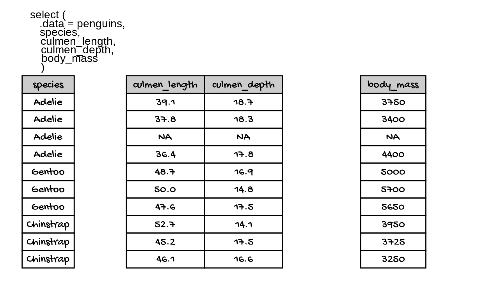

<div class="tutorial-exercise" data-label="ejemplo_5_2_1_4_1" data-caption="Code" data-completion="1" data-diagnostics="1" data-startover="1" data-lines="0">

```text
select(
  .data = penguins,
  species,
  culmen_length_mm,
  culmen_depth_mm,
  body_mass_g
  )

select(
  .data = penguins,
  species,
  culmen_length_mm:culmen_depth_mm,
  body_mass_g
  )

select(
  .data = penguins,
  -island,
  -flipper_length_mm,
  -sex
  )

select(
  .data = penguins,
  -(species:sex),
   species,
   culmen_length_mm,
   culmen_depth_mm,
   body_mass_g
  )
```

<script type="application/json" data-opts-chunk="1">{"fig.width":6.5,"fig.height":4,"fig.retina":2,"fig.align":"default","fig.keep":"high","fig.show":"asis","out.width":624,"warning":false,"error":false,"message":false,"exercise.df_print":"paged","exercise.timelimit":60,"exercise.checker":["function (label = NULL, solution_code = NULL, user_code = NULL, ","    check_code = NULL, envir_result = NULL, evaluate_result = NULL, ","    envir_prep = NULL, last_value = NULL, ...) ","{","    if (is.null(user_code)) {","        return(list(message = \"I didn't receive your code. Did you write any?\", ","            correct = FALSE, type = \"error\", location = \"append\"))","    }","    else {","        user_code <- parse(text = user_code)","        if (length(user_code) == 0) {","            return(list(message = \"I didn't receive your code. Did you write any?\", ","                correct = FALSE, type = \"error\", location = \"append\"))","        }","    }","    if (!is.null(solution_code)) {","        solution_code <- parse(text = solution_code)","        if (length(solution_code) == 0) {","            return(list(message = \"No solution is provided for this exercise.\", ","                correct = TRUE, type = \"info\", location = \"append\"))","        }","    }","    had_error_checking <- FALSE","    checked_result <- tryCatch({","        parsed_check_code <- parse(text = check_code)","        if (length(parsed_check_code) > 1) {","            for (i in 1:(length(parsed_check_code) - 1)) {","                eval(parsed_check_code[[i]], envir_prep)","            }","        }","        grading_code <- rlang::call_standardise(parsed_check_code[[length(parsed_check_code)]], ","            envir_prep)","        grader_args <- list(user_quo = rlang::as_quosure(user_code[[length(user_code)]], ","            envir_result))","        if (!is.null(solution_code)) {","            grader_args$solution_quo <- rlang::as_quosure(solution_code[[length(solution_code)]], ","                envir_prep)","        }","        learnr_args <- list(...)","        learnr_args$label <- label","        learnr_args$solution_code <- solution_code","        learnr_args$user_code <- user_code","        learnr_args$check_code <- check_code","        learnr_args$envir_result <- envir_result","        learnr_args$evaluate_result <- evaluate_result","        learnr_args$envir_prep <- envir_prep","        learnr_args$last_value <- last_value","        grading_code$grader_args <- grader_args","        grading_code$learnr_args <- learnr_args","        envir_prep$ans <- grader_args$user","        eval(grading_code, envir_prep)","    }, error = function(e) {","        message(\"\", e)","        had_error_checking <<- TRUE","        graded(correct = FALSE, message = \"Error occured while checking the submission\")","    })","    if (!checkmate::test_class(checked_result, \"grader_graded\")) {","        stop(\"`grade_learnr` should receive a `graded` value from every `-check` chunk\")","    }","    message_type <- if (had_error_checking) {","        \"warning\"","    }","    else {","        if (checked_result$correct) {","            \"success\"","        }","        else {","            \"error\"","        }","    }","    ret <- list(message = checked_result$message, correct = checked_result$correct, ","        type = message_type, location = \"append\")","    ret","}"]}</script></div>

+ Seleccionar columnas basadas en nombres parciales de columnas

Si se tiene una gran cantidad de columnas o variables con una estructura similar, se puede utilizar la concordancia parcial mediante la adición de `starts_with()`, `ends_with()` o `contains()` en la sentencia de selección.

:::example
#### Ejemplo 5.2.1.4.2
:::

<div class="tutorial-exercise" data-label="ejemplo_5_2_1_4_2" data-caption="Code" data-completion="1" data-diagnostics="1" data-startover="1" data-lines="0">

```text
select(
  .data = penguins,
  starts_with('culmen')
  )

select(
  .data = penguins,
  ends_with('mm')
  )

select(
  .data = penguins,
  contains('length')
  )
```

<script type="application/json" data-opts-chunk="1">{"fig.width":6.5,"fig.height":4,"fig.retina":2,"fig.align":"default","fig.keep":"high","fig.show":"asis","out.width":624,"warning":false,"error":false,"message":false,"exercise.df_print":"paged","exercise.timelimit":60,"exercise.checker":["function (label = NULL, solution_code = NULL, user_code = NULL, ","    check_code = NULL, envir_result = NULL, evaluate_result = NULL, ","    envir_prep = NULL, last_value = NULL, ...) ","{","    if (is.null(user_code)) {","        return(list(message = \"I didn't receive your code. Did you write any?\", ","            correct = FALSE, type = \"error\", location = \"append\"))","    }","    else {","        user_code <- parse(text = user_code)","        if (length(user_code) == 0) {","            return(list(message = \"I didn't receive your code. Did you write any?\", ","                correct = FALSE, type = \"error\", location = \"append\"))","        }","    }","    if (!is.null(solution_code)) {","        solution_code <- parse(text = solution_code)","        if (length(solution_code) == 0) {","            return(list(message = \"No solution is provided for this exercise.\", ","                correct = TRUE, type = \"info\", location = \"append\"))","        }","    }","    had_error_checking <- FALSE","    checked_result <- tryCatch({","        parsed_check_code <- parse(text = check_code)","        if (length(parsed_check_code) > 1) {","            for (i in 1:(length(parsed_check_code) - 1)) {","                eval(parsed_check_code[[i]], envir_prep)","            }","        }","        grading_code <- rlang::call_standardise(parsed_check_code[[length(parsed_check_code)]], ","            envir_prep)","        grader_args <- list(user_quo = rlang::as_quosure(user_code[[length(user_code)]], ","            envir_result))","        if (!is.null(solution_code)) {","            grader_args$solution_quo <- rlang::as_quosure(solution_code[[length(solution_code)]], ","                envir_prep)","        }","        learnr_args <- list(...)","        learnr_args$label <- label","        learnr_args$solution_code <- solution_code","        learnr_args$user_code <- user_code","        learnr_args$check_code <- check_code","        learnr_args$envir_result <- envir_result","        learnr_args$evaluate_result <- evaluate_result","        learnr_args$envir_prep <- envir_prep","        learnr_args$last_value <- last_value","        grading_code$grader_args <- grader_args","        grading_code$learnr_args <- learnr_args","        envir_prep$ans <- grader_args$user","        eval(grading_code, envir_prep)","    }, error = function(e) {","        message(\"\", e)","        had_error_checking <<- TRUE","        graded(correct = FALSE, message = \"Error occured while checking the submission\")","    })","    if (!checkmate::test_class(checked_result, \"grader_graded\")) {","        stop(\"`grade_learnr` should receive a `graded` value from every `-check` chunk\")","    }","    message_type <- if (had_error_checking) {","        \"warning\"","    }","    else {","        if (checked_result$correct) {","            \"success\"","        }","        else {","            \"error\"","        }","    }","    ret <- list(message = checked_result$message, correct = checked_result$correct, ","        type = message_type, location = \"append\")","    ret","}"]}</script></div>

+ Seleccionar columnas basadas en columnas preidentificadas

Puede identificar el nombre de las columnas inicialmente, y luego referirse a ellas dentro de la función `select()` por medio de la función `one_of()` o utilizando el operador `!!`.

:::example
#### Ejemplo 5.2.1.4.3
:::

<div class="tutorial-exercise" data-label="ejemplo_5_2_1_4_3" data-caption="Code" data-completion="1" data-diagnostics="1" data-startover="1" data-lines="0">

```text
variables_cualitativas <- c('species', 'island', 'sex')

select(
  .data = penguins,
  one_of(variables_cualitativas)
  )

select(
  .data = penguins,
  !!variables_cualitativas
  )
```

<script type="application/json" data-opts-chunk="1">{"fig.width":6.5,"fig.height":4,"fig.retina":2,"fig.align":"default","fig.keep":"high","fig.show":"asis","out.width":624,"warning":false,"error":false,"message":false,"exercise.df_print":"paged","exercise.timelimit":60,"exercise.checker":["function (label = NULL, solution_code = NULL, user_code = NULL, ","    check_code = NULL, envir_result = NULL, evaluate_result = NULL, ","    envir_prep = NULL, last_value = NULL, ...) ","{","    if (is.null(user_code)) {","        return(list(message = \"I didn't receive your code. Did you write any?\", ","            correct = FALSE, type = \"error\", location = \"append\"))","    }","    else {","        user_code <- parse(text = user_code)","        if (length(user_code) == 0) {","            return(list(message = \"I didn't receive your code. Did you write any?\", ","                correct = FALSE, type = \"error\", location = \"append\"))","        }","    }","    if (!is.null(solution_code)) {","        solution_code <- parse(text = solution_code)","        if (length(solution_code) == 0) {","            return(list(message = \"No solution is provided for this exercise.\", ","                correct = TRUE, type = \"info\", location = \"append\"))","        }","    }","    had_error_checking <- FALSE","    checked_result <- tryCatch({","        parsed_check_code <- parse(text = check_code)","        if (length(parsed_check_code) > 1) {","            for (i in 1:(length(parsed_check_code) - 1)) {","                eval(parsed_check_code[[i]], envir_prep)","            }","        }","        grading_code <- rlang::call_standardise(parsed_check_code[[length(parsed_check_code)]], ","            envir_prep)","        grader_args <- list(user_quo = rlang::as_quosure(user_code[[length(user_code)]], ","            envir_result))","        if (!is.null(solution_code)) {","            grader_args$solution_quo <- rlang::as_quosure(solution_code[[length(solution_code)]], ","                envir_prep)","        }","        learnr_args <- list(...)","        learnr_args$label <- label","        learnr_args$solution_code <- solution_code","        learnr_args$user_code <- user_code","        learnr_args$check_code <- check_code","        learnr_args$envir_result <- envir_result","        learnr_args$evaluate_result <- evaluate_result","        learnr_args$envir_prep <- envir_prep","        learnr_args$last_value <- last_value","        grading_code$grader_args <- grader_args","        grading_code$learnr_args <- learnr_args","        envir_prep$ans <- grader_args$user","        eval(grading_code, envir_prep)","    }, error = function(e) {","        message(\"\", e)","        had_error_checking <<- TRUE","        graded(correct = FALSE, message = \"Error occured while checking the submission\")","    })","    if (!checkmate::test_class(checked_result, \"grader_graded\")) {","        stop(\"`grade_learnr` should receive a `graded` value from every `-check` chunk\")","    }","    message_type <- if (had_error_checking) {","        \"warning\"","    }","    else {","        if (checked_result$correct) {","            \"success\"","        }","        else {","            \"error\"","        }","    }","    ret <- list(message = checked_result$message, correct = checked_result$correct, ","        type = message_type, location = \"append\")","    ret","}"]}</script></div>

+ Seleccionar columnas por su tipo de dato

La función `select_if()` permite seleccionar columnas en base a su tipo de dato. Para esto, se puede emplear las funciones `is.character()`, `is.numeric()`, `is.integer()`, `is.double()`, `is.logical()`, `is.factor()`.

:::example
#### Ejemplo 5.2.1.4.4
:::

<div class="tutorial-exercise" data-label="ejemplo_5_2_1_4_4" data-caption="Code" data-completion="1" data-diagnostics="1" data-startover="1" data-lines="0">

```text
select_if(
  penguins,
  is.factor
  )

select_if(
  penguins,
  ~!is.numeric(.)
  )
```

<script type="application/json" data-opts-chunk="1">{"fig.width":6.5,"fig.height":4,"fig.retina":2,"fig.align":"default","fig.keep":"high","fig.show":"asis","out.width":624,"warning":false,"error":false,"message":false,"exercise.df_print":"paged","exercise.timelimit":60,"exercise.checker":["function (label = NULL, solution_code = NULL, user_code = NULL, ","    check_code = NULL, envir_result = NULL, evaluate_result = NULL, ","    envir_prep = NULL, last_value = NULL, ...) ","{","    if (is.null(user_code)) {","        return(list(message = \"I didn't receive your code. Did you write any?\", ","            correct = FALSE, type = \"error\", location = \"append\"))","    }","    else {","        user_code <- parse(text = user_code)","        if (length(user_code) == 0) {","            return(list(message = \"I didn't receive your code. Did you write any?\", ","                correct = FALSE, type = \"error\", location = \"append\"))","        }","    }","    if (!is.null(solution_code)) {","        solution_code <- parse(text = solution_code)","        if (length(solution_code) == 0) {","            return(list(message = \"No solution is provided for this exercise.\", ","                correct = TRUE, type = \"info\", location = \"append\"))","        }","    }","    had_error_checking <- FALSE","    checked_result <- tryCatch({","        parsed_check_code <- parse(text = check_code)","        if (length(parsed_check_code) > 1) {","            for (i in 1:(length(parsed_check_code) - 1)) {","                eval(parsed_check_code[[i]], envir_prep)","            }","        }","        grading_code <- rlang::call_standardise(parsed_check_code[[length(parsed_check_code)]], ","            envir_prep)","        grader_args <- list(user_quo = rlang::as_quosure(user_code[[length(user_code)]], ","            envir_result))","        if (!is.null(solution_code)) {","            grader_args$solution_quo <- rlang::as_quosure(solution_code[[length(solution_code)]], ","                envir_prep)","        }","        learnr_args <- list(...)","        learnr_args$label <- label","        learnr_args$solution_code <- solution_code","        learnr_args$user_code <- user_code","        learnr_args$check_code <- check_code","        learnr_args$envir_result <- envir_result","        learnr_args$evaluate_result <- evaluate_result","        learnr_args$envir_prep <- envir_prep","        learnr_args$last_value <- last_value","        grading_code$grader_args <- grader_args","        grading_code$learnr_args <- learnr_args","        envir_prep$ans <- grader_args$user","        eval(grading_code, envir_prep)","    }, error = function(e) {","        message(\"\", e)","        had_error_checking <<- TRUE","        graded(correct = FALSE, message = \"Error occured while checking the submission\")","    })","    if (!checkmate::test_class(checked_result, \"grader_graded\")) {","        stop(\"`grade_learnr` should receive a `graded` value from every `-check` chunk\")","    }","    message_type <- if (had_error_checking) {","        \"warning\"","    }","    else {","        if (checked_result$correct) {","            \"success\"","        }","        else {","            \"error\"","        }","    }","    ret <- list(message = checked_result$message, correct = checked_result$correct, ","        type = message_type, location = \"append\")","    ret","}"]}</script></div>

:::exercise
#### Ejercicio 5.2.1.4.1

En el ejemplo anterior se seleccionaron solo las columnas o variables cuyo valor es de tipo distinto al numérico. Intente por favor seleccionar esta vez aquellas columnas o variables numéricas.
:::

<div class="tutorial-exercise" data-label="ejercicio_5_2_1_4_4" data-caption="Code" data-completion="1" data-diagnostics="1" data-startover="1" data-lines="0"><script type="application/json" data-opts-chunk="1">{"fig.width":6.5,"fig.height":4,"fig.retina":2,"fig.align":"default","fig.keep":"high","fig.show":"asis","out.width":624,"warning":false,"error":false,"message":false,"exercise.df_print":"paged","exercise.timelimit":60,"exercise.checker":["function (label = NULL, solution_code = NULL, user_code = NULL, ","    check_code = NULL, envir_result = NULL, evaluate_result = NULL, ","    envir_prep = NULL, last_value = NULL, ...) ","{","    if (is.null(user_code)) {","        return(list(message = \"I didn't receive your code. Did you write any?\", ","            correct = FALSE, type = \"error\", location = \"append\"))","    }","    else {","        user_code <- parse(text = user_code)","        if (length(user_code) == 0) {","            return(list(message = \"I didn't receive your code. Did you write any?\", ","                correct = FALSE, type = \"error\", location = \"append\"))","        }","    }","    if (!is.null(solution_code)) {","        solution_code <- parse(text = solution_code)","        if (length(solution_code) == 0) {","            return(list(message = \"No solution is provided for this exercise.\", ","                correct = TRUE, type = \"info\", location = \"append\"))","        }","    }","    had_error_checking <- FALSE","    checked_result <- tryCatch({","        parsed_check_code <- parse(text = check_code)","        if (length(parsed_check_code) > 1) {","            for (i in 1:(length(parsed_check_code) - 1)) {","                eval(parsed_check_code[[i]], envir_prep)","            }","        }","        grading_code <- rlang::call_standardise(parsed_check_code[[length(parsed_check_code)]], ","            envir_prep)","        grader_args <- list(user_quo = rlang::as_quosure(user_code[[length(user_code)]], ","            envir_result))","        if (!is.null(solution_code)) {","            grader_args$solution_quo <- rlang::as_quosure(solution_code[[length(solution_code)]], ","                envir_prep)","        }","        learnr_args <- list(...)","        learnr_args$label <- label","        learnr_args$solution_code <- solution_code","        learnr_args$user_code <- user_code","        learnr_args$check_code <- check_code","        learnr_args$envir_result <- envir_result","        learnr_args$evaluate_result <- evaluate_result","        learnr_args$envir_prep <- envir_prep","        learnr_args$last_value <- last_value","        grading_code$grader_args <- grader_args","        grading_code$learnr_args <- learnr_args","        envir_prep$ans <- grader_args$user","        eval(grading_code, envir_prep)","    }, error = function(e) {","        message(\"\", e)","        had_error_checking <<- TRUE","        graded(correct = FALSE, message = \"Error occured while checking the submission\")","    })","    if (!checkmate::test_class(checked_result, \"grader_graded\")) {","        stop(\"`grade_learnr` should receive a `graded` value from every `-check` chunk\")","    }","    message_type <- if (had_error_checking) {","        \"warning\"","    }","    else {","        if (checked_result$correct) {","            \"success\"","        }","        else {","            \"error\"","        }","    }","    ret <- list(message = checked_result$message, correct = checked_result$correct, ","        type = message_type, location = \"append\")","    ret","}"]}</script></div>

<div class="tutorial-exercise-support" data-label="ejercicio_5_2_1_4_4-solution" data-caption="Code" data-completion="1" data-diagnostics="1" data-startover="1" data-lines="0">

```text
select_if(
  penguins,
  is.numeric
  )

select_if(
  penguins,
  ~!is.factor(.)
  )
```

</div>

<div class="tutorial-exercise-support" data-label="ejercicio_5_2_1_4_4-check" data-caption="Code" data-completion="1" data-diagnostics="1" data-startover="1" data-lines="0">

```text
grade_code("¡Muy bien! Sigue así y lograras grandes avances.")
```

</div>

+ Uso de `select()` para renombrar columnas

Puede cambiar el nombre de las columnas o variables con la función `select()`.

:::example
#### Ejemplo 5.2.1.4.5
:::

<div class="tutorial-exercise" data-label="ejercicio_5_2_1_4_5" data-caption="Code" data-completion="1" data-diagnostics="1" data-startover="1" data-lines="0">

```text
select(
  .data = penguins,
  gender = sex
  )
```

<script type="application/json" data-opts-chunk="1">{"fig.width":6.5,"fig.height":4,"fig.retina":2,"fig.align":"default","fig.keep":"high","fig.show":"asis","out.width":624,"warning":false,"error":false,"message":false,"exercise.df_print":"paged","exercise.timelimit":60,"exercise.checker":["function (label = NULL, solution_code = NULL, user_code = NULL, ","    check_code = NULL, envir_result = NULL, evaluate_result = NULL, ","    envir_prep = NULL, last_value = NULL, ...) ","{","    if (is.null(user_code)) {","        return(list(message = \"I didn't receive your code. Did you write any?\", ","            correct = FALSE, type = \"error\", location = \"append\"))","    }","    else {","        user_code <- parse(text = user_code)","        if (length(user_code) == 0) {","            return(list(message = \"I didn't receive your code. Did you write any?\", ","                correct = FALSE, type = \"error\", location = \"append\"))","        }","    }","    if (!is.null(solution_code)) {","        solution_code <- parse(text = solution_code)","        if (length(solution_code) == 0) {","            return(list(message = \"No solution is provided for this exercise.\", ","                correct = TRUE, type = \"info\", location = \"append\"))","        }","    }","    had_error_checking <- FALSE","    checked_result <- tryCatch({","        parsed_check_code <- parse(text = check_code)","        if (length(parsed_check_code) > 1) {","            for (i in 1:(length(parsed_check_code) - 1)) {","                eval(parsed_check_code[[i]], envir_prep)","            }","        }","        grading_code <- rlang::call_standardise(parsed_check_code[[length(parsed_check_code)]], ","            envir_prep)","        grader_args <- list(user_quo = rlang::as_quosure(user_code[[length(user_code)]], ","            envir_result))","        if (!is.null(solution_code)) {","            grader_args$solution_quo <- rlang::as_quosure(solution_code[[length(solution_code)]], ","                envir_prep)","        }","        learnr_args <- list(...)","        learnr_args$label <- label","        learnr_args$solution_code <- solution_code","        learnr_args$user_code <- user_code","        learnr_args$check_code <- check_code","        learnr_args$envir_result <- envir_result","        learnr_args$evaluate_result <- evaluate_result","        learnr_args$envir_prep <- envir_prep","        learnr_args$last_value <- last_value","        grading_code$grader_args <- grader_args","        grading_code$learnr_args <- learnr_args","        envir_prep$ans <- grader_args$user","        eval(grading_code, envir_prep)","    }, error = function(e) {","        message(\"\", e)","        had_error_checking <<- TRUE","        graded(correct = FALSE, message = \"Error occured while checking the submission\")","    })","    if (!checkmate::test_class(checked_result, \"grader_graded\")) {","        stop(\"`grade_learnr` should receive a `graded` value from every `-check` chunk\")","    }","    message_type <- if (had_error_checking) {","        \"warning\"","    }","    else {","        if (checked_result$correct) {","            \"success\"","        }","        else {","            \"error\"","        }","    }","    ret <- list(message = checked_result$message, correct = checked_result$correct, ","        type = message_type, location = \"append\")","    ret","}"]}</script></div>

#### 5.2.1.5 Cambiar el nombre de las columnas con `rename()`

La función `rename()` permite cambiar los nombres de las columnas o variables.

:::example
#### Ejemplo 5.2.1.5.1
:::

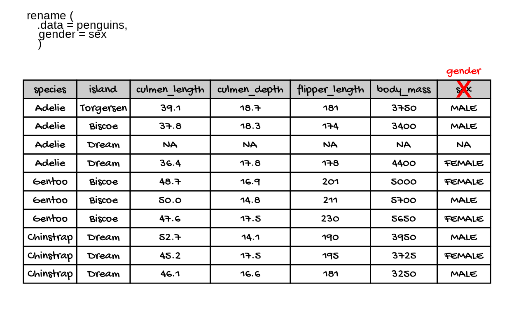

<div class="tutorial-exercise" data-label="ejemplo_5_2_1_5_1" data-caption="Code" data-completion="1" data-diagnostics="1" data-startover="1" data-lines="0">

```text
rename(
  .data = penguins,
  gender = sex
  )
```

<script type="application/json" data-opts-chunk="1">{"fig.width":6.5,"fig.height":4,"fig.retina":2,"fig.align":"default","fig.keep":"high","fig.show":"asis","out.width":624,"warning":false,"error":false,"message":false,"exercise.df_print":"paged","exercise.timelimit":60,"exercise.checker":["function (label = NULL, solution_code = NULL, user_code = NULL, ","    check_code = NULL, envir_result = NULL, evaluate_result = NULL, ","    envir_prep = NULL, last_value = NULL, ...) ","{","    if (is.null(user_code)) {","        return(list(message = \"I didn't receive your code. Did you write any?\", ","            correct = FALSE, type = \"error\", location = \"append\"))","    }","    else {","        user_code <- parse(text = user_code)","        if (length(user_code) == 0) {","            return(list(message = \"I didn't receive your code. Did you write any?\", ","                correct = FALSE, type = \"error\", location = \"append\"))","        }","    }","    if (!is.null(solution_code)) {","        solution_code <- parse(text = solution_code)","        if (length(solution_code) == 0) {","            return(list(message = \"No solution is provided for this exercise.\", ","                correct = TRUE, type = \"info\", location = \"append\"))","        }","    }","    had_error_checking <- FALSE","    checked_result <- tryCatch({","        parsed_check_code <- parse(text = check_code)","        if (length(parsed_check_code) > 1) {","            for (i in 1:(length(parsed_check_code) - 1)) {","                eval(parsed_check_code[[i]], envir_prep)","            }","        }","        grading_code <- rlang::call_standardise(parsed_check_code[[length(parsed_check_code)]], ","            envir_prep)","        grader_args <- list(user_quo = rlang::as_quosure(user_code[[length(user_code)]], ","            envir_result))","        if (!is.null(solution_code)) {","            grader_args$solution_quo <- rlang::as_quosure(solution_code[[length(solution_code)]], ","                envir_prep)","        }","        learnr_args <- list(...)","        learnr_args$label <- label","        learnr_args$solution_code <- solution_code","        learnr_args$user_code <- user_code","        learnr_args$check_code <- check_code","        learnr_args$envir_result <- envir_result","        learnr_args$evaluate_result <- evaluate_result","        learnr_args$envir_prep <- envir_prep","        learnr_args$last_value <- last_value","        grading_code$grader_args <- grader_args","        grading_code$learnr_args <- learnr_args","        envir_prep$ans <- grader_args$user","        eval(grading_code, envir_prep)","    }, error = function(e) {","        message(\"\", e)","        had_error_checking <<- TRUE","        graded(correct = FALSE, message = \"Error occured while checking the submission\")","    })","    if (!checkmate::test_class(checked_result, \"grader_graded\")) {","        stop(\"`grade_learnr` should receive a `graded` value from every `-check` chunk\")","    }","    message_type <- if (had_error_checking) {","        \"warning\"","    }","    else {","        if (checked_result$correct) {","            \"success\"","        }","        else {","            \"error\"","        }","    }","    ret <- list(message = checked_result$message, correct = checked_result$correct, ","        type = message_type, location = \"append\")","    ret","}"]}</script></div>

#### 5.2.1.6 Agregar nuevas columnas con `mutate()`

A menudo es útil agregar nuevas variables o columnas que son funciones de las ya existentes. Esto se puede hacer por medio de la función `mutate()`.

:::example
#### Ejemplo 5.2.1.6.1
:::

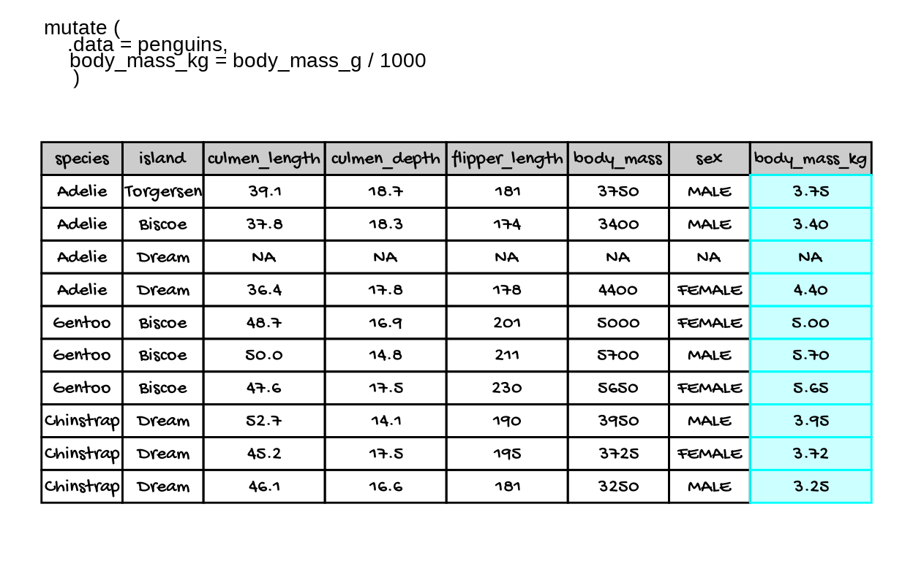

<div class="tutorial-exercise" data-label="ejemplo_5_2_1_6_1_a" data-caption="Code" data-completion="1" data-diagnostics="1" data-startover="1" data-lines="0">

```text
mutate(
  .data = penguins,
  body_mass_kg = body_mass_g / 1000
  )

transmute(
  .data = penguins,
  body_mass_kg = body_mass_g / 1000
  )
```

<script type="application/json" data-opts-chunk="1">{"fig.width":6.5,"fig.height":4,"fig.retina":2,"fig.align":"default","fig.keep":"high","fig.show":"asis","out.width":624,"warning":false,"error":false,"message":false,"exercise.df_print":"paged","exercise.timelimit":60,"exercise.checker":["function (label = NULL, solution_code = NULL, user_code = NULL, ","    check_code = NULL, envir_result = NULL, evaluate_result = NULL, ","    envir_prep = NULL, last_value = NULL, ...) ","{","    if (is.null(user_code)) {","        return(list(message = \"I didn't receive your code. Did you write any?\", ","            correct = FALSE, type = \"error\", location = \"append\"))","    }","    else {","        user_code <- parse(text = user_code)","        if (length(user_code) == 0) {","            return(list(message = \"I didn't receive your code. Did you write any?\", ","                correct = FALSE, type = \"error\", location = \"append\"))","        }","    }","    if (!is.null(solution_code)) {","        solution_code <- parse(text = solution_code)","        if (length(solution_code) == 0) {","            return(list(message = \"No solution is provided for this exercise.\", ","                correct = TRUE, type = \"info\", location = \"append\"))","        }","    }","    had_error_checking <- FALSE","    checked_result <- tryCatch({","        parsed_check_code <- parse(text = check_code)","        if (length(parsed_check_code) > 1) {","            for (i in 1:(length(parsed_check_code) - 1)) {","                eval(parsed_check_code[[i]], envir_prep)","            }","        }","        grading_code <- rlang::call_standardise(parsed_check_code[[length(parsed_check_code)]], ","            envir_prep)","        grader_args <- list(user_quo = rlang::as_quosure(user_code[[length(user_code)]], ","            envir_result))","        if (!is.null(solution_code)) {","            grader_args$solution_quo <- rlang::as_quosure(solution_code[[length(solution_code)]], ","                envir_prep)","        }","        learnr_args <- list(...)","        learnr_args$label <- label","        learnr_args$solution_code <- solution_code","        learnr_args$user_code <- user_code","        learnr_args$check_code <- check_code","        learnr_args$envir_result <- envir_result","        learnr_args$evaluate_result <- evaluate_result","        learnr_args$envir_prep <- envir_prep","        learnr_args$last_value <- last_value","        grading_code$grader_args <- grader_args","        grading_code$learnr_args <- learnr_args","        envir_prep$ans <- grader_args$user","        eval(grading_code, envir_prep)","    }, error = function(e) {","        message(\"\", e)","        had_error_checking <<- TRUE","        graded(correct = FALSE, message = \"Error occured while checking the submission\")","    })","    if (!checkmate::test_class(checked_result, \"grader_graded\")) {","        stop(\"`grade_learnr` should receive a `graded` value from every `-check` chunk\")","    }","    message_type <- if (had_error_checking) {","        \"warning\"","    }","    else {","        if (checked_result$correct) {","            \"success\"","        }","        else {","            \"error\"","        }","    }","    ret <- list(message = checked_result$message, correct = checked_result$correct, ","        type = message_type, location = \"append\")","    ret","}"]}</script></div>

<div class="tutorial-exercise" data-label="ejemplo_5_2_1_6_1_b" data-caption="Code" data-completion="1" data-diagnostics="1" data-startover="1" data-lines="0">

```text
mutate(
  .data = penguins,
  body_mass_g_VS_prom_body_mass = body_mass_g - round(mean(body_mass_g, na.rm = TRUE), digits = 1),
  body_mass_g_VS_min_body_mass = body_mass_g - min(body_mass_g, na.rm = TRUE)
  )
```

<script type="application/json" data-opts-chunk="1">{"fig.width":6.5,"fig.height":4,"fig.retina":2,"fig.align":"default","fig.keep":"high","fig.show":"asis","out.width":624,"warning":false,"error":false,"message":false,"exercise.df_print":"paged","exercise.timelimit":60,"exercise.checker":["function (label = NULL, solution_code = NULL, user_code = NULL, ","    check_code = NULL, envir_result = NULL, evaluate_result = NULL, ","    envir_prep = NULL, last_value = NULL, ...) ","{","    if (is.null(user_code)) {","        return(list(message = \"I didn't receive your code. Did you write any?\", ","            correct = FALSE, type = \"error\", location = \"append\"))","    }","    else {","        user_code <- parse(text = user_code)","        if (length(user_code) == 0) {","            return(list(message = \"I didn't receive your code. Did you write any?\", ","                correct = FALSE, type = \"error\", location = \"append\"))","        }","    }","    if (!is.null(solution_code)) {","        solution_code <- parse(text = solution_code)","        if (length(solution_code) == 0) {","            return(list(message = \"No solution is provided for this exercise.\", ","                correct = TRUE, type = \"info\", location = \"append\"))","        }","    }","    had_error_checking <- FALSE","    checked_result <- tryCatch({","        parsed_check_code <- parse(text = check_code)","        if (length(parsed_check_code) > 1) {","            for (i in 1:(length(parsed_check_code) - 1)) {","                eval(parsed_check_code[[i]], envir_prep)","            }","        }","        grading_code <- rlang::call_standardise(parsed_check_code[[length(parsed_check_code)]], ","            envir_prep)","        grader_args <- list(user_quo = rlang::as_quosure(user_code[[length(user_code)]], ","            envir_result))","        if (!is.null(solution_code)) {","            grader_args$solution_quo <- rlang::as_quosure(solution_code[[length(solution_code)]], ","                envir_prep)","        }","        learnr_args <- list(...)","        learnr_args$label <- label","        learnr_args$solution_code <- solution_code","        learnr_args$user_code <- user_code","        learnr_args$check_code <- check_code","        learnr_args$envir_result <- envir_result","        learnr_args$evaluate_result <- evaluate_result","        learnr_args$envir_prep <- envir_prep","        learnr_args$last_value <- last_value","        grading_code$grader_args <- grader_args","        grading_code$learnr_args <- learnr_args","        envir_prep$ans <- grader_args$user","        eval(grading_code, envir_prep)","    }, error = function(e) {","        message(\"\", e)","        had_error_checking <<- TRUE","        graded(correct = FALSE, message = \"Error occured while checking the submission\")","    })","    if (!checkmate::test_class(checked_result, \"grader_graded\")) {","        stop(\"`grade_learnr` should receive a `graded` value from every `-check` chunk\")","    }","    message_type <- if (had_error_checking) {","        \"warning\"","    }","    else {","        if (checked_result$correct) {","            \"success\"","        }","        else {","            \"error\"","        }","    }","    ret <- list(message = checked_result$message, correct = checked_result$correct, ","        type = message_type, location = \"append\")","    ret","}"]}</script></div>

+ Recodificación de columnas cualitativas

Para cambiar el nombre de los valores de las columnas o variables cualitativas, se puede usar la función `recode()` dentro de la función `mutate()`.

:::example
#### Ejemplo 5.2.1.6.2
:::

<div class="tutorial-exercise" data-label="ejemplo_5_2_1_6_2" data-caption="Code" data-completion="1" data-diagnostics="1" data-startover="1" data-lines="0">

```text
mutate(
  .data = penguins,
  sex_2 = recode(
    .x = sex,
    'FEMALE' = 'Hembra',
    'MALE' = 'Macho'
    )
  )
```

<script type="application/json" data-opts-chunk="1">{"fig.width":6.5,"fig.height":4,"fig.retina":2,"fig.align":"default","fig.keep":"high","fig.show":"asis","out.width":624,"warning":false,"error":false,"message":false,"exercise.df_print":"paged","exercise.timelimit":60,"exercise.checker":["function (label = NULL, solution_code = NULL, user_code = NULL, ","    check_code = NULL, envir_result = NULL, evaluate_result = NULL, ","    envir_prep = NULL, last_value = NULL, ...) ","{","    if (is.null(user_code)) {","        return(list(message = \"I didn't receive your code. Did you write any?\", ","            correct = FALSE, type = \"error\", location = \"append\"))","    }","    else {","        user_code <- parse(text = user_code)","        if (length(user_code) == 0) {","            return(list(message = \"I didn't receive your code. Did you write any?\", ","                correct = FALSE, type = \"error\", location = \"append\"))","        }","    }","    if (!is.null(solution_code)) {","        solution_code <- parse(text = solution_code)","        if (length(solution_code) == 0) {","            return(list(message = \"No solution is provided for this exercise.\", ","                correct = TRUE, type = \"info\", location = \"append\"))","        }","    }","    had_error_checking <- FALSE","    checked_result <- tryCatch({","        parsed_check_code <- parse(text = check_code)","        if (length(parsed_check_code) > 1) {","            for (i in 1:(length(parsed_check_code) - 1)) {","                eval(parsed_check_code[[i]], envir_prep)","            }","        }","        grading_code <- rlang::call_standardise(parsed_check_code[[length(parsed_check_code)]], ","            envir_prep)","        grader_args <- list(user_quo = rlang::as_quosure(user_code[[length(user_code)]], ","            envir_result))","        if (!is.null(solution_code)) {","            grader_args$solution_quo <- rlang::as_quosure(solution_code[[length(solution_code)]], ","                envir_prep)","        }","        learnr_args <- list(...)","        learnr_args$label <- label","        learnr_args$solution_code <- solution_code","        learnr_args$user_code <- user_code","        learnr_args$check_code <- check_code","        learnr_args$envir_result <- envir_result","        learnr_args$evaluate_result <- evaluate_result","        learnr_args$envir_prep <- envir_prep","        learnr_args$last_value <- last_value","        grading_code$grader_args <- grader_args","        grading_code$learnr_args <- learnr_args","        envir_prep$ans <- grader_args$user","        eval(grading_code, envir_prep)","    }, error = function(e) {","        message(\"\", e)","        had_error_checking <<- TRUE","        graded(correct = FALSE, message = \"Error occured while checking the submission\")","    })","    if (!checkmate::test_class(checked_result, \"grader_graded\")) {","        stop(\"`grade_learnr` should receive a `graded` value from every `-check` chunk\")","    }","    message_type <- if (had_error_checking) {","        \"warning\"","    }","    else {","        if (checked_result$correct) {","            \"success\"","        }","        else {","            \"error\"","        }","    }","    ret <- list(message = checked_result$message, correct = checked_result$correct, ","        type = message_type, location = \"append\")","    ret","}"]}</script></div>

+ Crear nuevas columnas cualitativas

Si desea convertir una columna numérica en una columna o variable cualitativa, puede hacer uso de la función `case_when()`.

:::example
#### Ejemplo 5.2.1.6.3
:::

<div class="tutorial-exercise" data-label="ejemplo_5_2_1_6_3" data-caption="Code" data-completion="1" data-diagnostics="1" data-startover="1" data-lines="0">

```text
mutate(
  .data = penguins,
  body_mass_2 = case_when(
    body_mass_g < 3400 ~ 'Liviano',
    body_mass_g >= 3400 & body_mass_g <= 4400 ~ 'Normal',
    body_mass_g > 4400 ~ 'Pesado'
    )
  )
```

<script type="application/json" data-opts-chunk="1">{"fig.width":6.5,"fig.height":4,"fig.retina":2,"fig.align":"default","fig.keep":"high","fig.show":"asis","out.width":624,"warning":false,"error":false,"message":false,"exercise.df_print":"paged","exercise.timelimit":60,"exercise.checker":["function (label = NULL, solution_code = NULL, user_code = NULL, ","    check_code = NULL, envir_result = NULL, evaluate_result = NULL, ","    envir_prep = NULL, last_value = NULL, ...) ","{","    if (is.null(user_code)) {","        return(list(message = \"I didn't receive your code. Did you write any?\", ","            correct = FALSE, type = \"error\", location = \"append\"))","    }","    else {","        user_code <- parse(text = user_code)","        if (length(user_code) == 0) {","            return(list(message = \"I didn't receive your code. Did you write any?\", ","                correct = FALSE, type = \"error\", location = \"append\"))","        }","    }","    if (!is.null(solution_code)) {","        solution_code <- parse(text = solution_code)","        if (length(solution_code) == 0) {","            return(list(message = \"No solution is provided for this exercise.\", ","                correct = TRUE, type = \"info\", location = \"append\"))","        }","    }","    had_error_checking <- FALSE","    checked_result <- tryCatch({","        parsed_check_code <- parse(text = check_code)","        if (length(parsed_check_code) > 1) {","            for (i in 1:(length(parsed_check_code) - 1)) {","                eval(parsed_check_code[[i]], envir_prep)","            }","        }","        grading_code <- rlang::call_standardise(parsed_check_code[[length(parsed_check_code)]], ","            envir_prep)","        grader_args <- list(user_quo = rlang::as_quosure(user_code[[length(user_code)]], ","            envir_result))","        if (!is.null(solution_code)) {","            grader_args$solution_quo <- rlang::as_quosure(solution_code[[length(solution_code)]], ","                envir_prep)","        }","        learnr_args <- list(...)","        learnr_args$label <- label","        learnr_args$solution_code <- solution_code","        learnr_args$user_code <- user_code","        learnr_args$check_code <- check_code","        learnr_args$envir_result <- envir_result","        learnr_args$evaluate_result <- evaluate_result","        learnr_args$envir_prep <- envir_prep","        learnr_args$last_value <- last_value","        grading_code$grader_args <- grader_args","        grading_code$learnr_args <- learnr_args","        envir_prep$ans <- grader_args$user","        eval(grading_code, envir_prep)","    }, error = function(e) {","        message(\"\", e)","        had_error_checking <<- TRUE","        graded(correct = FALSE, message = \"Error occured while checking the submission\")","    })","    if (!checkmate::test_class(checked_result, \"grader_graded\")) {","        stop(\"`grade_learnr` should receive a `graded` value from every `-check` chunk\")","    }","    message_type <- if (had_error_checking) {","        \"warning\"","    }","    else {","        if (checked_result$correct) {","            \"success\"","        }","        else {","            \"error\"","        }","    }","    ret <- list(message = checked_result$message, correct = checked_result$correct, ","        type = message_type, location = \"append\")","    ret","}"]}</script></div>

#### 5.2.1.7 Cambiar el orden de las columnas con `relocate()`

Una forma fácil de cambiar el orden de las columnas en el conjunto de datos es mediante el uso de la función `relocate()`.

:::example
#### Ejemplo 5.2.1.7.1
:::

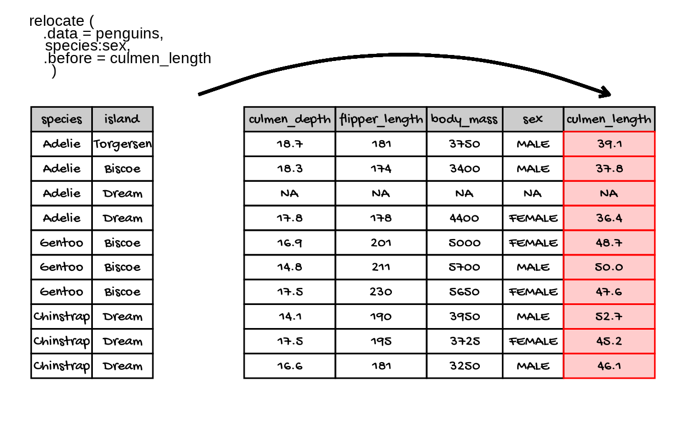

<div class="tutorial-exercise" data-label="ejemplo_5_2_1_7_1" data-caption="Code" data-completion="1" data-diagnostics="1" data-startover="1" data-lines="0">

```text
relocate(
  .data = penguins,
  species:sex,
  .before = culmen_length_mm
  )
```

<script type="application/json" data-opts-chunk="1">{"fig.width":6.5,"fig.height":4,"fig.retina":2,"fig.align":"default","fig.keep":"high","fig.show":"asis","out.width":624,"warning":false,"error":false,"message":false,"exercise.df_print":"paged","exercise.timelimit":60,"exercise.checker":["function (label = NULL, solution_code = NULL, user_code = NULL, ","    check_code = NULL, envir_result = NULL, evaluate_result = NULL, ","    envir_prep = NULL, last_value = NULL, ...) ","{","    if (is.null(user_code)) {","        return(list(message = \"I didn't receive your code. Did you write any?\", ","            correct = FALSE, type = \"error\", location = \"append\"))","    }","    else {","        user_code <- parse(text = user_code)","        if (length(user_code) == 0) {","            return(list(message = \"I didn't receive your code. Did you write any?\", ","                correct = FALSE, type = \"error\", location = \"append\"))","        }","    }","    if (!is.null(solution_code)) {","        solution_code <- parse(text = solution_code)","        if (length(solution_code) == 0) {","            return(list(message = \"No solution is provided for this exercise.\", ","                correct = TRUE, type = \"info\", location = \"append\"))","        }","    }","    had_error_checking <- FALSE","    checked_result <- tryCatch({","        parsed_check_code <- parse(text = check_code)","        if (length(parsed_check_code) > 1) {","            for (i in 1:(length(parsed_check_code) - 1)) {","                eval(parsed_check_code[[i]], envir_prep)","            }","        }","        grading_code <- rlang::call_standardise(parsed_check_code[[length(parsed_check_code)]], ","            envir_prep)","        grader_args <- list(user_quo = rlang::as_quosure(user_code[[length(user_code)]], ","            envir_result))","        if (!is.null(solution_code)) {","            grader_args$solution_quo <- rlang::as_quosure(solution_code[[length(solution_code)]], ","                envir_prep)","        }","        learnr_args <- list(...)","        learnr_args$label <- label","        learnr_args$solution_code <- solution_code","        learnr_args$user_code <- user_code","        learnr_args$check_code <- check_code","        learnr_args$envir_result <- envir_result","        learnr_args$evaluate_result <- evaluate_result","        learnr_args$envir_prep <- envir_prep","        learnr_args$last_value <- last_value","        grading_code$grader_args <- grader_args","        grading_code$learnr_args <- learnr_args","        envir_prep$ans <- grader_args$user","        eval(grading_code, envir_prep)","    }, error = function(e) {","        message(\"\", e)","        had_error_checking <<- TRUE","        graded(correct = FALSE, message = \"Error occured while checking the submission\")","    })","    if (!checkmate::test_class(checked_result, \"grader_graded\")) {","        stop(\"`grade_learnr` should receive a `graded` value from every `-check` chunk\")","    }","    message_type <- if (had_error_checking) {","        \"warning\"","    }","    else {","        if (checked_result$correct) {","            \"success\"","        }","        else {","            \"error\"","        }","    }","    ret <- list(message = checked_result$message, correct = checked_result$correct, ","        type = message_type, location = \"append\")","    ret","}"]}</script></div>

:::exercise
#### Ejercicio 5.2.1.7.1

En el ejemplo anterior la columna `culmen_length_mm` se movio hacia la última columna por medio de la función `.before()`. Intente por favor haciendo uso de la función `.after()` mover esa misma columna para que sea la primera columna.
:::

<div class="tutorial-exercise" data-label="ejercicio_5_2_1_7_1" data-caption="Code" data-completion="1" data-diagnostics="1" data-startover="1" data-lines="0"><script type="application/json" data-opts-chunk="1">{"fig.width":6.5,"fig.height":4,"fig.retina":2,"fig.align":"default","fig.keep":"high","fig.show":"asis","out.width":624,"warning":false,"error":false,"message":false,"exercise.df_print":"paged","exercise.timelimit":60,"exercise.checker":["function (label = NULL, solution_code = NULL, user_code = NULL, ","    check_code = NULL, envir_result = NULL, evaluate_result = NULL, ","    envir_prep = NULL, last_value = NULL, ...) ","{","    if (is.null(user_code)) {","        return(list(message = \"I didn't receive your code. Did you write any?\", ","            correct = FALSE, type = \"error\", location = \"append\"))","    }","    else {","        user_code <- parse(text = user_code)","        if (length(user_code) == 0) {","            return(list(message = \"I didn't receive your code. Did you write any?\", ","                correct = FALSE, type = \"error\", location = \"append\"))","        }","    }","    if (!is.null(solution_code)) {","        solution_code <- parse(text = solution_code)","        if (length(solution_code) == 0) {","            return(list(message = \"No solution is provided for this exercise.\", ","                correct = TRUE, type = \"info\", location = \"append\"))","        }","    }","    had_error_checking <- FALSE","    checked_result <- tryCatch({","        parsed_check_code <- parse(text = check_code)","        if (length(parsed_check_code) > 1) {","            for (i in 1:(length(parsed_check_code) - 1)) {","                eval(parsed_check_code[[i]], envir_prep)","            }","        }","        grading_code <- rlang::call_standardise(parsed_check_code[[length(parsed_check_code)]], ","            envir_prep)","        grader_args <- list(user_quo = rlang::as_quosure(user_code[[length(user_code)]], ","            envir_result))","        if (!is.null(solution_code)) {","            grader_args$solution_quo <- rlang::as_quosure(solution_code[[length(solution_code)]], ","                envir_prep)","        }","        learnr_args <- list(...)","        learnr_args$label <- label","        learnr_args$solution_code <- solution_code","        learnr_args$user_code <- user_code","        learnr_args$check_code <- check_code","        learnr_args$envir_result <- envir_result","        learnr_args$evaluate_result <- evaluate_result","        learnr_args$envir_prep <- envir_prep","        learnr_args$last_value <- last_value","        grading_code$grader_args <- grader_args","        grading_code$learnr_args <- learnr_args","        envir_prep$ans <- grader_args$user","        eval(grading_code, envir_prep)","    }, error = function(e) {","        message(\"\", e)","        had_error_checking <<- TRUE","        graded(correct = FALSE, message = \"Error occured while checking the submission\")","    })","    if (!checkmate::test_class(checked_result, \"grader_graded\")) {","        stop(\"`grade_learnr` should receive a `graded` value from every `-check` chunk\")","    }","    message_type <- if (had_error_checking) {","        \"warning\"","    }","    else {","        if (checked_result$correct) {","            \"success\"","        }","        else {","            \"error\"","        }","    }","    ret <- list(message = checked_result$message, correct = checked_result$correct, ","        type = message_type, location = \"append\")","    ret","}"]}</script></div>

<div class="tutorial-exercise-support" data-label="ejercicio_5_2_1_7_1-solution" data-caption="Code" data-completion="1" data-diagnostics="1" data-startover="1" data-lines="0">

```text
relocate(
  .data = penguins,
  species:sex,
  .after = culmen_length_mm
  )
```

</div>

#### 5.2.1.8 Resumir valores con `summarise()`/`summarize()` y `group_by()`

La función `summarise()` (o `summarize()`) permite obtener un nuevo conjunto de datos el cual contiene un resumen de una determinada columna, calculando un valor único de los múltiples valores en esa columna.

:::example
#### Ejemplo 5.2.1.8.1
:::

<div class="tutorial-exercise" data-label="ejemplo_5_2_1_8_1_a" data-caption="Code" data-completion="1" data-diagnostics="1" data-startover="1" data-lines="0">

```text
summarise(
  .data = penguins,
  Prom_length = round(mean(culmen_length_mm, na.rm = TRUE), digits = 2),
  Prom_depth = round(mean(culmen_depth_mm, na.rm = TRUE), digits = 2)
  )

Promedio <- function(x){
  x = na.omit(x)
  Suma = sum(x)
  Total = length(x)
  Media = Suma/Total
  print(Media)
  }


summarise(
  .data = penguins,
  Prom_length = Promedio(culmen_length_mm),
  Prom_depth = Promedio(culmen_depth_mm)
  )
```

<script type="application/json" data-opts-chunk="1">{"fig.width":6.5,"fig.height":4,"fig.retina":2,"fig.align":"default","fig.keep":"high","fig.show":"asis","out.width":624,"warning":false,"error":false,"message":false,"exercise.df_print":"paged","exercise.timelimit":60,"exercise.checker":["function (label = NULL, solution_code = NULL, user_code = NULL, ","    check_code = NULL, envir_result = NULL, evaluate_result = NULL, ","    envir_prep = NULL, last_value = NULL, ...) ","{","    if (is.null(user_code)) {","        return(list(message = \"I didn't receive your code. Did you write any?\", ","            correct = FALSE, type = \"error\", location = \"append\"))","    }","    else {","        user_code <- parse(text = user_code)","        if (length(user_code) == 0) {","            return(list(message = \"I didn't receive your code. Did you write any?\", ","                correct = FALSE, type = \"error\", location = \"append\"))","        }","    }","    if (!is.null(solution_code)) {","        solution_code <- parse(text = solution_code)","        if (length(solution_code) == 0) {","            return(list(message = \"No solution is provided for this exercise.\", ","                correct = TRUE, type = \"info\", location = \"append\"))","        }","    }","    had_error_checking <- FALSE","    checked_result <- tryCatch({","        parsed_check_code <- parse(text = check_code)","        if (length(parsed_check_code) > 1) {","            for (i in 1:(length(parsed_check_code) - 1)) {","                eval(parsed_check_code[[i]], envir_prep)","            }","        }","        grading_code <- rlang::call_standardise(parsed_check_code[[length(parsed_check_code)]], ","            envir_prep)","        grader_args <- list(user_quo = rlang::as_quosure(user_code[[length(user_code)]], ","            envir_result))","        if (!is.null(solution_code)) {","            grader_args$solution_quo <- rlang::as_quosure(solution_code[[length(solution_code)]], ","                envir_prep)","        }","        learnr_args <- list(...)","        learnr_args$label <- label","        learnr_args$solution_code <- solution_code","        learnr_args$user_code <- user_code","        learnr_args$check_code <- check_code","        learnr_args$envir_result <- envir_result","        learnr_args$evaluate_result <- evaluate_result","        learnr_args$envir_prep <- envir_prep","        learnr_args$last_value <- last_value","        grading_code$grader_args <- grader_args","        grading_code$learnr_args <- learnr_args","        envir_prep$ans <- grader_args$user","        eval(grading_code, envir_prep)","    }, error = function(e) {","        message(\"\", e)","        had_error_checking <<- TRUE","        graded(correct = FALSE, message = \"Error occured while checking the submission\")","    })","    if (!checkmate::test_class(checked_result, \"grader_graded\")) {","        stop(\"`grade_learnr` should receive a `graded` value from every `-check` chunk\")","    }","    message_type <- if (had_error_checking) {","        \"warning\"","    }","    else {","        if (checked_result$correct) {","            \"success\"","        }","        else {","            \"error\"","        }","    }","    ret <- list(message = checked_result$message, correct = checked_result$correct, ","        type = message_type, location = \"append\")","    ret","}"]}</script></div>

Usar la función `summarise()` puede ser útil por sí sola, pero es aún más útil cuando se usa para saber las diferencias entre grupos. Para hacer esto, se puede combinar con la función `group_by()`.

:::example
#### Ejemplo 5.2.1.8.2
:::

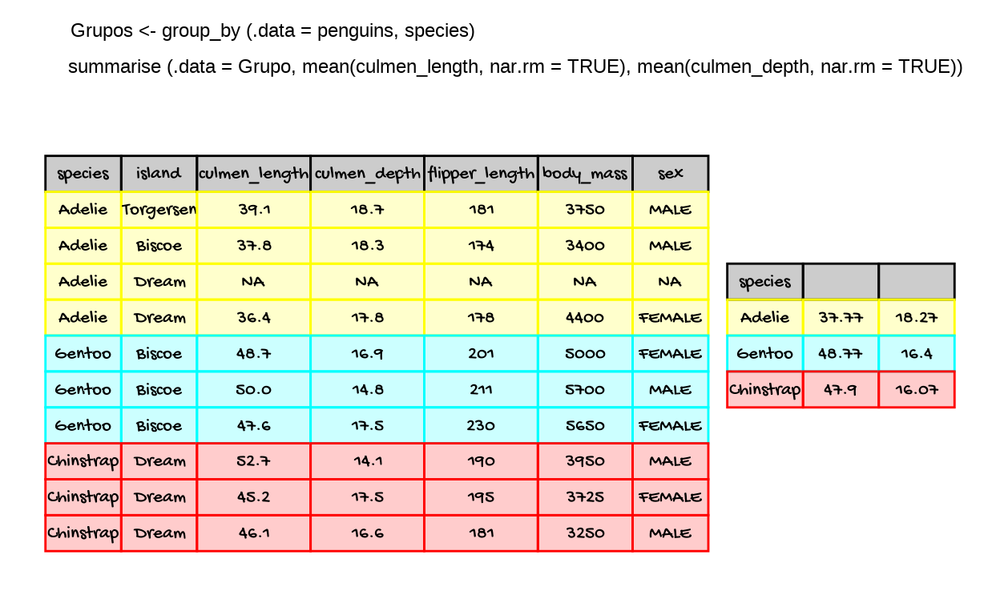

<div class="tutorial-exercise" data-label="ejemplo_5_2_1_8_1_b" data-caption="Code" data-completion="1" data-diagnostics="1" data-startover="1" data-lines="0">

```text
Grupos <- group_by(
  .data = penguins,
  species
  )
Grupos

summarise(
  .data = Grupos,
  Prom_lenght = round(mean(culmen_length_mm, na.rm = TRUE), digits = 2),
  Prom_depth = round(mean(culmen_depth_mm, na.rm = TRUE), digits = 2)
  )
```

<script type="application/json" data-opts-chunk="1">{"fig.width":6.5,"fig.height":4,"fig.retina":2,"fig.align":"default","fig.keep":"high","fig.show":"asis","out.width":624,"warning":false,"error":false,"message":false,"exercise.df_print":"paged","exercise.timelimit":60,"exercise.checker":["function (label = NULL, solution_code = NULL, user_code = NULL, ","    check_code = NULL, envir_result = NULL, evaluate_result = NULL, ","    envir_prep = NULL, last_value = NULL, ...) ","{","    if (is.null(user_code)) {","        return(list(message = \"I didn't receive your code. Did you write any?\", ","            correct = FALSE, type = \"error\", location = \"append\"))","    }","    else {","        user_code <- parse(text = user_code)","        if (length(user_code) == 0) {","            return(list(message = \"I didn't receive your code. Did you write any?\", ","                correct = FALSE, type = \"error\", location = \"append\"))","        }","    }","    if (!is.null(solution_code)) {","        solution_code <- parse(text = solution_code)","        if (length(solution_code) == 0) {","            return(list(message = \"No solution is provided for this exercise.\", ","                correct = TRUE, type = \"info\", location = \"append\"))","        }","    }","    had_error_checking <- FALSE","    checked_result <- tryCatch({","        parsed_check_code <- parse(text = check_code)","        if (length(parsed_check_code) > 1) {","            for (i in 1:(length(parsed_check_code) - 1)) {","                eval(parsed_check_code[[i]], envir_prep)","            }","        }","        grading_code <- rlang::call_standardise(parsed_check_code[[length(parsed_check_code)]], ","            envir_prep)","        grader_args <- list(user_quo = rlang::as_quosure(user_code[[length(user_code)]], ","            envir_result))","        if (!is.null(solution_code)) {","            grader_args$solution_quo <- rlang::as_quosure(solution_code[[length(solution_code)]], ","                envir_prep)","        }","        learnr_args <- list(...)","        learnr_args$label <- label","        learnr_args$solution_code <- solution_code","        learnr_args$user_code <- user_code","        learnr_args$check_code <- check_code","        learnr_args$envir_result <- envir_result","        learnr_args$evaluate_result <- evaluate_result","        learnr_args$envir_prep <- envir_prep","        learnr_args$last_value <- last_value","        grading_code$grader_args <- grader_args","        grading_code$learnr_args <- learnr_args","        envir_prep$ans <- grader_args$user","        eval(grading_code, envir_prep)","    }, error = function(e) {","        message(\"\", e)","        had_error_checking <<- TRUE","        graded(correct = FALSE, message = \"Error occured while checking the submission\")","    })","    if (!checkmate::test_class(checked_result, \"grader_graded\")) {","        stop(\"`grade_learnr` should receive a `graded` value from every `-check` chunk\")","    }","    message_type <- if (had_error_checking) {","        \"warning\"","    }","    else {","        if (checked_result$correct) {","            \"success\"","        }","        else {","            \"error\"","        }","    }","    ret <- list(message = checked_result$message, correct = checked_result$correct, ","        type = message_type, location = \"append\")","    ret","}"]}</script></div>

:::caution
La agrupación permite comparar rápidamente diferentes subconjuntos de los datos. La agrupación permite enmarcar la pregunta de análisis en términos de comparar grupos de observaciones, en lugar de observaciones individuales. Esta forma hace que sea más fácil hacer y responder preguntas complejas sobre los datos.
:::

#### 5.2.1.9 Resumir valores con `summarise()`/`summarize()` y `across()`

A menudo es útil realizar la misma operación en varias columnas. La función `across()` permite realizar esto.

:::example
#### Ejemplo 5.2.1.9.1
:::


<div class="tutorial-exercise" data-label="ejemplo_5_2_1_9_1" data-caption="Code" data-completion="1" data-diagnostics="1" data-startover="1" data-lines="0">

```text
summarise(
  .data = penguins,
  across(
    .cols = c(culmen_length_mm, culmen_depth_mm, flipper_length_mm),
    .fns = mean,
    na.rm = TRUE
    )
  )

summarise(
  .data = penguins,
  across(
    .cols = ends_with('mm'),
    .fns = mean,
    na.rm = TRUE
    )
  )

summarise(
  .data = penguins,
  across(
    .cols = where(is.numeric),
    .fns = mean,
    na.rm = TRUE
    ),
  across(
    .cols = where(is.factor),
    .fns = nlevels
    )
  )
```

<script type="application/json" data-opts-chunk="1">{"fig.width":6.5,"fig.height":4,"fig.retina":2,"fig.align":"default","fig.keep":"high","fig.show":"asis","out.width":624,"warning":false,"error":false,"message":false,"exercise.df_print":"paged","exercise.timelimit":60,"exercise.checker":["function (label = NULL, solution_code = NULL, user_code = NULL, ","    check_code = NULL, envir_result = NULL, evaluate_result = NULL, ","    envir_prep = NULL, last_value = NULL, ...) ","{","    if (is.null(user_code)) {","        return(list(message = \"I didn't receive your code. Did you write any?\", ","            correct = FALSE, type = \"error\", location = \"append\"))","    }","    else {","        user_code <- parse(text = user_code)","        if (length(user_code) == 0) {","            return(list(message = \"I didn't receive your code. Did you write any?\", ","                correct = FALSE, type = \"error\", location = \"append\"))","        }","    }","    if (!is.null(solution_code)) {","        solution_code <- parse(text = solution_code)","        if (length(solution_code) == 0) {","            return(list(message = \"No solution is provided for this exercise.\", ","                correct = TRUE, type = \"info\", location = \"append\"))","        }","    }","    had_error_checking <- FALSE","    checked_result <- tryCatch({","        parsed_check_code <- parse(text = check_code)","        if (length(parsed_check_code) > 1) {","            for (i in 1:(length(parsed_check_code) - 1)) {","                eval(parsed_check_code[[i]], envir_prep)","            }","        }","        grading_code <- rlang::call_standardise(parsed_check_code[[length(parsed_check_code)]], ","            envir_prep)","        grader_args <- list(user_quo = rlang::as_quosure(user_code[[length(user_code)]], ","            envir_result))","        if (!is.null(solution_code)) {","            grader_args$solution_quo <- rlang::as_quosure(solution_code[[length(solution_code)]], ","                envir_prep)","        }","        learnr_args <- list(...)","        learnr_args$label <- label","        learnr_args$solution_code <- solution_code","        learnr_args$user_code <- user_code","        learnr_args$check_code <- check_code","        learnr_args$envir_result <- envir_result","        learnr_args$evaluate_result <- evaluate_result","        learnr_args$envir_prep <- envir_prep","        learnr_args$last_value <- last_value","        grading_code$grader_args <- grader_args","        grading_code$learnr_args <- learnr_args","        envir_prep$ans <- grader_args$user","        eval(grading_code, envir_prep)","    }, error = function(e) {","        message(\"\", e)","        had_error_checking <<- TRUE","        graded(correct = FALSE, message = \"Error occured while checking the submission\")","    })","    if (!checkmate::test_class(checked_result, \"grader_graded\")) {","        stop(\"`grade_learnr` should receive a `graded` value from every `-check` chunk\")","    }","    message_type <- if (had_error_checking) {","        \"warning\"","    }","    else {","        if (checked_result$correct) {","            \"success\"","        }","        else {","            \"error\"","        }","    }","    ret <- list(message = checked_result$message, correct = checked_result$correct, ","        type = message_type, location = \"append\")","    ret","}"]}</script></div>

#### 5.2.1.10 Realización de operaciones secuenciales con `%>%`

Un enfoque para realizar análisis de datos complejos consiste en crear objetos intermedios para usar en dicho análisis. Este es un flujo de trabajo muy común.

:::example
#### Ejemplo 5.2.1.10.1
:::

<div class="tutorial-exercise" data-label="ejemplo_5_2_1_10_1_a" data-caption="Code" data-completion="1" data-diagnostics="1" data-startover="1" data-lines="0">

```text
a1 <- rename(
  .data = penguins,
  gender = sex
  )
a2 <- filter(
  .data = a1,
  gender == 'FEMALE'
  )
a3 <- mutate(
  .data = a2,
  body_mass_kg = body_mass_g / 1000
)

mutate(
  filter(
    rename(
      .data = penguins,
      gender = sex
      ),
    gender == 'FEMALE'
    ),
  body_mass_kg = body_mass_g / 1000
  )
```

<script type="application/json" data-opts-chunk="1">{"fig.width":6.5,"fig.height":4,"fig.retina":2,"fig.align":"default","fig.keep":"high","fig.show":"asis","out.width":624,"warning":false,"error":false,"message":false,"exercise.df_print":"paged","exercise.timelimit":60,"exercise.checker":["function (label = NULL, solution_code = NULL, user_code = NULL, ","    check_code = NULL, envir_result = NULL, evaluate_result = NULL, ","    envir_prep = NULL, last_value = NULL, ...) ","{","    if (is.null(user_code)) {","        return(list(message = \"I didn't receive your code. Did you write any?\", ","            correct = FALSE, type = \"error\", location = \"append\"))","    }","    else {","        user_code <- parse(text = user_code)","        if (length(user_code) == 0) {","            return(list(message = \"I didn't receive your code. Did you write any?\", ","                correct = FALSE, type = \"error\", location = \"append\"))","        }","    }","    if (!is.null(solution_code)) {","        solution_code <- parse(text = solution_code)","        if (length(solution_code) == 0) {","            return(list(message = \"No solution is provided for this exercise.\", ","                correct = TRUE, type = \"info\", location = \"append\"))","        }","    }","    had_error_checking <- FALSE","    checked_result <- tryCatch({","        parsed_check_code <- parse(text = check_code)","        if (length(parsed_check_code) > 1) {","            for (i in 1:(length(parsed_check_code) - 1)) {","                eval(parsed_check_code[[i]], envir_prep)","            }","        }","        grading_code <- rlang::call_standardise(parsed_check_code[[length(parsed_check_code)]], ","            envir_prep)","        grader_args <- list(user_quo = rlang::as_quosure(user_code[[length(user_code)]], ","            envir_result))","        if (!is.null(solution_code)) {","            grader_args$solution_quo <- rlang::as_quosure(solution_code[[length(solution_code)]], ","                envir_prep)","        }","        learnr_args <- list(...)","        learnr_args$label <- label","        learnr_args$solution_code <- solution_code","        learnr_args$user_code <- user_code","        learnr_args$check_code <- check_code","        learnr_args$envir_result <- envir_result","        learnr_args$evaluate_result <- evaluate_result","        learnr_args$envir_prep <- envir_prep","        learnr_args$last_value <- last_value","        grading_code$grader_args <- grader_args","        grading_code$learnr_args <- learnr_args","        envir_prep$ans <- grader_args$user","        eval(grading_code, envir_prep)","    }, error = function(e) {","        message(\"\", e)","        had_error_checking <<- TRUE","        graded(correct = FALSE, message = \"Error occured while checking the submission\")","    })","    if (!checkmate::test_class(checked_result, \"grader_graded\")) {","        stop(\"`grade_learnr` should receive a `graded` value from every `-check` chunk\")","    }","    message_type <- if (had_error_checking) {","        \"warning\"","    }","    else {","        if (checked_result$correct) {","            \"success\"","        }","        else {","            \"error\"","        }","    }","    ret <- list(message = checked_result$message, correct = checked_result$correct, ","        type = message_type, location = \"append\")","    ret","}"]}</script></div>

Para solucionar el problema que puede resultar del enfoque anterior, el paquete `dplyr` proporciona el operador de tubería (`%>%`). El `%>%` es un operador que permite encadenas funciones. Lo que hace es tomar la salida de una función y pasarla como entrada de la siguiente función.

:::example
#### Ejemplo 5.2.1.10.2
:::


<div class="tutorial-exercise" data-label="ejemplo_5_2_1_10_1_b" data-caption="Code" data-completion="1" data-diagnostics="1" data-startover="1" data-lines="0">

```text
Peso_fem_kg <- penguins %>%
  rename(gender = sex) %>%
  filter(gender == 'FEMALE') %>%
  mutate(body_mass_kg = body_mass_g / 1000)
Peso_fem_kg
```

<script type="application/json" data-opts-chunk="1">{"fig.width":6.5,"fig.height":4,"fig.retina":2,"fig.align":"default","fig.keep":"high","fig.show":"asis","out.width":624,"warning":false,"error":false,"message":false,"exercise.df_print":"paged","exercise.timelimit":60,"exercise.checker":["function (label = NULL, solution_code = NULL, user_code = NULL, ","    check_code = NULL, envir_result = NULL, evaluate_result = NULL, ","    envir_prep = NULL, last_value = NULL, ...) ","{","    if (is.null(user_code)) {","        return(list(message = \"I didn't receive your code. Did you write any?\", ","            correct = FALSE, type = \"error\", location = \"append\"))","    }","    else {","        user_code <- parse(text = user_code)","        if (length(user_code) == 0) {","            return(list(message = \"I didn't receive your code. Did you write any?\", ","                correct = FALSE, type = \"error\", location = \"append\"))","        }","    }","    if (!is.null(solution_code)) {","        solution_code <- parse(text = solution_code)","        if (length(solution_code) == 0) {","            return(list(message = \"No solution is provided for this exercise.\", ","                correct = TRUE, type = \"info\", location = \"append\"))","        }","    }","    had_error_checking <- FALSE","    checked_result <- tryCatch({","        parsed_check_code <- parse(text = check_code)","        if (length(parsed_check_code) > 1) {","            for (i in 1:(length(parsed_check_code) - 1)) {","                eval(parsed_check_code[[i]], envir_prep)","            }","        }","        grading_code <- rlang::call_standardise(parsed_check_code[[length(parsed_check_code)]], ","            envir_prep)","        grader_args <- list(user_quo = rlang::as_quosure(user_code[[length(user_code)]], ","            envir_result))","        if (!is.null(solution_code)) {","            grader_args$solution_quo <- rlang::as_quosure(solution_code[[length(solution_code)]], ","                envir_prep)","        }","        learnr_args <- list(...)","        learnr_args$label <- label","        learnr_args$solution_code <- solution_code","        learnr_args$user_code <- user_code","        learnr_args$check_code <- check_code","        learnr_args$envir_result <- envir_result","        learnr_args$evaluate_result <- evaluate_result","        learnr_args$envir_prep <- envir_prep","        learnr_args$last_value <- last_value","        grading_code$grader_args <- grader_args","        grading_code$learnr_args <- learnr_args","        envir_prep$ans <- grader_args$user","        eval(grading_code, envir_prep)","    }, error = function(e) {","        message(\"\", e)","        had_error_checking <<- TRUE","        graded(correct = FALSE, message = \"Error occured while checking the submission\")","    })","    if (!checkmate::test_class(checked_result, \"grader_graded\")) {","        stop(\"`grade_learnr` should receive a `graded` value from every `-check` chunk\")","    }","    message_type <- if (had_error_checking) {","        \"warning\"","    }","    else {","        if (checked_result$correct) {","            \"success\"","        }","        else {","            \"error\"","        }","    }","    ret <- list(message = checked_result$message, correct = checked_result$correct, ","        type = message_type, location = \"append\")","    ret","}"]}</script></div>

:::exercise
#### Ejercicio 5.2.1.10.1
Intente por favor calcular el valor medio de la longitud de la aleta (`flipper_length_mm`) de las tres especies de pinguinos del conjunto de datos `penguins`, pero que sean solo de sexo (`sex`) macho (`MALE`).
:::

<div class="tutorial-exercise" data-label="ejercicio_5_2_1_10_1" data-caption="Code" data-completion="1" data-diagnostics="1" data-startover="1" data-lines="0"><script type="application/json" data-opts-chunk="1">{"fig.width":6.5,"fig.height":4,"fig.retina":2,"fig.align":"default","fig.keep":"high","fig.show":"asis","out.width":624,"warning":false,"error":false,"message":false,"exercise.df_print":"paged","exercise.timelimit":60,"exercise.checker":["function (label = NULL, solution_code = NULL, user_code = NULL, ","    check_code = NULL, envir_result = NULL, evaluate_result = NULL, ","    envir_prep = NULL, last_value = NULL, ...) ","{","    if (is.null(user_code)) {","        return(list(message = \"I didn't receive your code. Did you write any?\", ","            correct = FALSE, type = \"error\", location = \"append\"))","    }","    else {","        user_code <- parse(text = user_code)","        if (length(user_code) == 0) {","            return(list(message = \"I didn't receive your code. Did you write any?\", ","                correct = FALSE, type = \"error\", location = \"append\"))","        }","    }","    if (!is.null(solution_code)) {","        solution_code <- parse(text = solution_code)","        if (length(solution_code) == 0) {","            return(list(message = \"No solution is provided for this exercise.\", ","                correct = TRUE, type = \"info\", location = \"append\"))","        }","    }","    had_error_checking <- FALSE","    checked_result <- tryCatch({","        parsed_check_code <- parse(text = check_code)","        if (length(parsed_check_code) > 1) {","            for (i in 1:(length(parsed_check_code) - 1)) {","                eval(parsed_check_code[[i]], envir_prep)","            }","        }","        grading_code <- rlang::call_standardise(parsed_check_code[[length(parsed_check_code)]], ","            envir_prep)","        grader_args <- list(user_quo = rlang::as_quosure(user_code[[length(user_code)]], ","            envir_result))","        if (!is.null(solution_code)) {","            grader_args$solution_quo <- rlang::as_quosure(solution_code[[length(solution_code)]], ","                envir_prep)","        }","        learnr_args <- list(...)","        learnr_args$label <- label","        learnr_args$solution_code <- solution_code","        learnr_args$user_code <- user_code","        learnr_args$check_code <- check_code","        learnr_args$envir_result <- envir_result","        learnr_args$evaluate_result <- evaluate_result","        learnr_args$envir_prep <- envir_prep","        learnr_args$last_value <- last_value","        grading_code$grader_args <- grader_args","        grading_code$learnr_args <- learnr_args","        envir_prep$ans <- grader_args$user","        eval(grading_code, envir_prep)","    }, error = function(e) {","        message(\"\", e)","        had_error_checking <<- TRUE","        graded(correct = FALSE, message = \"Error occured while checking the submission\")","    })","    if (!checkmate::test_class(checked_result, \"grader_graded\")) {","        stop(\"`grade_learnr` should receive a `graded` value from every `-check` chunk\")","    }","    message_type <- if (had_error_checking) {","        \"warning\"","    }","    else {","        if (checked_result$correct) {","            \"success\"","        }","        else {","            \"error\"","        }","    }","    ret <- list(message = checked_result$message, correct = checked_result$correct, ","        type = message_type, location = \"append\")","    ret","}"]}</script></div>

<div class="tutorial-exercise-support" data-label="ejercicio_5_2_1_10_1-solution" data-caption="Code" data-completion="1" data-diagnostics="1" data-startover="1" data-lines="0">

```text
penguins %>%
  filter(sex == 'MALE') %>%
  summarise(
    across(
      .cols = flipper_length_mm,
      .fns = mean,
      na.rm = TRUE
      )
  )
```

</div>

#### 5.2.1.11 Unir conjuntos de datos con `_join()`

A menudo los datos se pueden almacenar en múltiples conjuntos de datos. En algún momento se querrá acceder a la información de dichos conjuntos de datos, por lo cual necesitará una forma de poder combinarlos. A este proceso se le denomina unión (__join__) por la sencilla razón de que unira dichos conjuntos de datos.

El paquete `dplyr` cuenta con un conjunto de funciones de combinación para realizar este procedimiento.


<div class="row">
  <div class="col-md-6" markdown="1">
<table class="table table-striped table-bordered" style="width: auto !important; margin-left: auto; margin-right: auto;">
 <thead>
  <tr>
   <th style="text-align:left;"> ID </th>
   <th style="text-align:left;"> x1 </th>
  </tr>
 </thead>
<tbody>
  <tr>
   <td style="text-align:left;"> 1 </td>
   <td style="text-align:left;"> a1 </td>
  </tr>
  <tr>
   <td style="text-align:left;"> 2 </td>
   <td style="text-align:left;"> a2 </td>
  </tr>
</tbody>
</table>
  </div>
  <div class="col-md-6" markdown="1">
<table class="table table-striped table-bordered" style="width: auto !important; margin-left: auto; margin-right: auto;">
 <thead>
  <tr>
   <th style="text-align:left;"> ID </th>
   <th style="text-align:left;"> x2 </th>
  </tr>
 </thead>
<tbody>
  <tr>
   <td style="text-align:left;"> 2 </td>
   <td style="text-align:left;"> b1 </td>
  </tr>
  <tr>
   <td style="text-align:left;"> 3 </td>
   <td style="text-align:left;"> b2 </td>
  </tr>
</tbody>
</table>
  </div>
</div>

+ `inner_join()`

Esta unión retorna todas las columnas del primer y segundo conjunto de datos, pero solo retorna las filas del primer conjunto de datos que coinciden con el segundo conjunto de datos.

:::example
#### Ejemplo 5.2.1.11.1
:::


<div class="tutorial-exercise" data-label="ejemplo_5_2_1_11_1" data-caption="Code" data-completion="1" data-diagnostics="1" data-startover="1" data-lines="0">

```text
inner_join(
  x = Datos_a,
  y = Datos_b,
  by = 'ID'
  )
```

<script type="application/json" data-opts-chunk="1">{"fig.width":6.5,"fig.height":4,"fig.retina":2,"fig.align":"default","fig.keep":"high","fig.show":"asis","out.width":624,"warning":false,"error":false,"message":false,"exercise.df_print":"paged","exercise.timelimit":60,"exercise.checker":["function (label = NULL, solution_code = NULL, user_code = NULL, ","    check_code = NULL, envir_result = NULL, evaluate_result = NULL, ","    envir_prep = NULL, last_value = NULL, ...) ","{","    if (is.null(user_code)) {","        return(list(message = \"I didn't receive your code. Did you write any?\", ","            correct = FALSE, type = \"error\", location = \"append\"))","    }","    else {","        user_code <- parse(text = user_code)","        if (length(user_code) == 0) {","            return(list(message = \"I didn't receive your code. Did you write any?\", ","                correct = FALSE, type = \"error\", location = \"append\"))","        }","    }","    if (!is.null(solution_code)) {","        solution_code <- parse(text = solution_code)","        if (length(solution_code) == 0) {","            return(list(message = \"No solution is provided for this exercise.\", ","                correct = TRUE, type = \"info\", location = \"append\"))","        }","    }","    had_error_checking <- FALSE","    checked_result <- tryCatch({","        parsed_check_code <- parse(text = check_code)","        if (length(parsed_check_code) > 1) {","            for (i in 1:(length(parsed_check_code) - 1)) {","                eval(parsed_check_code[[i]], envir_prep)","            }","        }","        grading_code <- rlang::call_standardise(parsed_check_code[[length(parsed_check_code)]], ","            envir_prep)","        grader_args <- list(user_quo = rlang::as_quosure(user_code[[length(user_code)]], ","            envir_result))","        if (!is.null(solution_code)) {","            grader_args$solution_quo <- rlang::as_quosure(solution_code[[length(solution_code)]], ","                envir_prep)","        }","        learnr_args <- list(...)","        learnr_args$label <- label","        learnr_args$solution_code <- solution_code","        learnr_args$user_code <- user_code","        learnr_args$check_code <- check_code","        learnr_args$envir_result <- envir_result","        learnr_args$evaluate_result <- evaluate_result","        learnr_args$envir_prep <- envir_prep","        learnr_args$last_value <- last_value","        grading_code$grader_args <- grader_args","        grading_code$learnr_args <- learnr_args","        envir_prep$ans <- grader_args$user","        eval(grading_code, envir_prep)","    }, error = function(e) {","        message(\"\", e)","        had_error_checking <<- TRUE","        graded(correct = FALSE, message = \"Error occured while checking the submission\")","    })","    if (!checkmate::test_class(checked_result, \"grader_graded\")) {","        stop(\"`grade_learnr` should receive a `graded` value from every `-check` chunk\")","    }","    message_type <- if (had_error_checking) {","        \"warning\"","    }","    else {","        if (checked_result$correct) {","            \"success\"","        }","        else {","            \"error\"","        }","    }","    ret <- list(message = checked_result$message, correct = checked_result$correct, ","        type = message_type, location = \"append\")","    ret","}"]}</script></div>

:::caution
Generalmente, las uniones llevadas a cabo usando la función `inner_join()` no son apropiadas para su uso en el análisis de datos dado que es muy fácil perder observaciones.
:::

+ `left_join()`

Esta unión retorna todas las columnas del primer y segundo conjunto de datos, pero solo retorna las filas del conjunto de datos que se especifica en `x` como argumento.

:::example
#### Ejemplo 5.2.1.11.2
:::


<div class="tutorial-exercise" data-label="ejemplo_5_2_1_11_2" data-caption="Code" data-completion="1" data-diagnostics="1" data-startover="1" data-lines="0">

```text
left_join(
  x = Datos_a,
  y = Datos_b,
  by = 'ID'
  )
```

<script type="application/json" data-opts-chunk="1">{"fig.width":6.5,"fig.height":4,"fig.retina":2,"fig.align":"default","fig.keep":"high","fig.show":"asis","out.width":624,"warning":false,"error":false,"message":false,"exercise.df_print":"paged","exercise.timelimit":60,"exercise.checker":["function (label = NULL, solution_code = NULL, user_code = NULL, ","    check_code = NULL, envir_result = NULL, evaluate_result = NULL, ","    envir_prep = NULL, last_value = NULL, ...) ","{","    if (is.null(user_code)) {","        return(list(message = \"I didn't receive your code. Did you write any?\", ","            correct = FALSE, type = \"error\", location = \"append\"))","    }","    else {","        user_code <- parse(text = user_code)","        if (length(user_code) == 0) {","            return(list(message = \"I didn't receive your code. Did you write any?\", ","                correct = FALSE, type = \"error\", location = \"append\"))","        }","    }","    if (!is.null(solution_code)) {","        solution_code <- parse(text = solution_code)","        if (length(solution_code) == 0) {","            return(list(message = \"No solution is provided for this exercise.\", ","                correct = TRUE, type = \"info\", location = \"append\"))","        }","    }","    had_error_checking <- FALSE","    checked_result <- tryCatch({","        parsed_check_code <- parse(text = check_code)","        if (length(parsed_check_code) > 1) {","            for (i in 1:(length(parsed_check_code) - 1)) {","                eval(parsed_check_code[[i]], envir_prep)","            }","        }","        grading_code <- rlang::call_standardise(parsed_check_code[[length(parsed_check_code)]], ","            envir_prep)","        grader_args <- list(user_quo = rlang::as_quosure(user_code[[length(user_code)]], ","            envir_result))","        if (!is.null(solution_code)) {","            grader_args$solution_quo <- rlang::as_quosure(solution_code[[length(solution_code)]], ","                envir_prep)","        }","        learnr_args <- list(...)","        learnr_args$label <- label","        learnr_args$solution_code <- solution_code","        learnr_args$user_code <- user_code","        learnr_args$check_code <- check_code","        learnr_args$envir_result <- envir_result","        learnr_args$evaluate_result <- evaluate_result","        learnr_args$envir_prep <- envir_prep","        learnr_args$last_value <- last_value","        grading_code$grader_args <- grader_args","        grading_code$learnr_args <- learnr_args","        envir_prep$ans <- grader_args$user","        eval(grading_code, envir_prep)","    }, error = function(e) {","        message(\"\", e)","        had_error_checking <<- TRUE","        graded(correct = FALSE, message = \"Error occured while checking the submission\")","    })","    if (!checkmate::test_class(checked_result, \"grader_graded\")) {","        stop(\"`grade_learnr` should receive a `graded` value from every `-check` chunk\")","    }","    message_type <- if (had_error_checking) {","        \"warning\"","    }","    else {","        if (checked_result$correct) {","            \"success\"","        }","        else {","            \"error\"","        }","    }","    ret <- list(message = checked_result$message, correct = checked_result$correct, ","        type = message_type, location = \"append\")","    ret","}"]}</script></div>

+ `right_join()`

Esta función es opuesta a la función `left_join()`, en el sentido de que solo retorna las filas del conjunto de datos que se especifica en `y` como argumento.

:::example
#### Ejemplo 5.2.1.11.3
:::


<div class="tutorial-exercise" data-label="ejemplo_5_2_1_11_3" data-caption="Code" data-completion="1" data-diagnostics="1" data-startover="1" data-lines="0">

```text
right_join(
  x = Datos_a,
  y = Datos_b,
  by = 'ID'
  )
```

<script type="application/json" data-opts-chunk="1">{"fig.width":6.5,"fig.height":4,"fig.retina":2,"fig.align":"default","fig.keep":"high","fig.show":"asis","out.width":624,"warning":false,"error":false,"message":false,"exercise.df_print":"paged","exercise.timelimit":60,"exercise.checker":["function (label = NULL, solution_code = NULL, user_code = NULL, ","    check_code = NULL, envir_result = NULL, evaluate_result = NULL, ","    envir_prep = NULL, last_value = NULL, ...) ","{","    if (is.null(user_code)) {","        return(list(message = \"I didn't receive your code. Did you write any?\", ","            correct = FALSE, type = \"error\", location = \"append\"))","    }","    else {","        user_code <- parse(text = user_code)","        if (length(user_code) == 0) {","            return(list(message = \"I didn't receive your code. Did you write any?\", ","                correct = FALSE, type = \"error\", location = \"append\"))","        }","    }","    if (!is.null(solution_code)) {","        solution_code <- parse(text = solution_code)","        if (length(solution_code) == 0) {","            return(list(message = \"No solution is provided for this exercise.\", ","                correct = TRUE, type = \"info\", location = \"append\"))","        }","    }","    had_error_checking <- FALSE","    checked_result <- tryCatch({","        parsed_check_code <- parse(text = check_code)","        if (length(parsed_check_code) > 1) {","            for (i in 1:(length(parsed_check_code) - 1)) {","                eval(parsed_check_code[[i]], envir_prep)","            }","        }","        grading_code <- rlang::call_standardise(parsed_check_code[[length(parsed_check_code)]], ","            envir_prep)","        grader_args <- list(user_quo = rlang::as_quosure(user_code[[length(user_code)]], ","            envir_result))","        if (!is.null(solution_code)) {","            grader_args$solution_quo <- rlang::as_quosure(solution_code[[length(solution_code)]], ","                envir_prep)","        }","        learnr_args <- list(...)","        learnr_args$label <- label","        learnr_args$solution_code <- solution_code","        learnr_args$user_code <- user_code","        learnr_args$check_code <- check_code","        learnr_args$envir_result <- envir_result","        learnr_args$evaluate_result <- evaluate_result","        learnr_args$envir_prep <- envir_prep","        learnr_args$last_value <- last_value","        grading_code$grader_args <- grader_args","        grading_code$learnr_args <- learnr_args","        envir_prep$ans <- grader_args$user","        eval(grading_code, envir_prep)","    }, error = function(e) {","        message(\"\", e)","        had_error_checking <<- TRUE","        graded(correct = FALSE, message = \"Error occured while checking the submission\")","    })","    if (!checkmate::test_class(checked_result, \"grader_graded\")) {","        stop(\"`grade_learnr` should receive a `graded` value from every `-check` chunk\")","    }","    message_type <- if (had_error_checking) {","        \"warning\"","    }","    else {","        if (checked_result$correct) {","            \"success\"","        }","        else {","            \"error\"","        }","    }","    ret <- list(message = checked_result$message, correct = checked_result$correct, ","        type = message_type, location = \"append\")","    ret","}"]}</script></div>

+ `full_join()`

Esta unión retorna toda las columnas y filas de ambos conjunto de datos. De esta forma, retorna una fila para cualquier observación independiente si coinciden o no.

:::example
#### Ejemplo 5.2.1.11.4
:::


<div class="tutorial-exercise" data-label="ejemplo_5_2_1_11_4" data-caption="Code" data-completion="1" data-diagnostics="1" data-startover="1" data-lines="0">

```text
full_join(
  x = Datos_a,
  y = Datos_b,
  by = 'ID'
  )
```

<script type="application/json" data-opts-chunk="1">{"fig.width":6.5,"fig.height":4,"fig.retina":2,"fig.align":"default","fig.keep":"high","fig.show":"asis","out.width":624,"warning":false,"error":false,"message":false,"exercise.df_print":"paged","exercise.timelimit":60,"exercise.checker":["function (label = NULL, solution_code = NULL, user_code = NULL, ","    check_code = NULL, envir_result = NULL, evaluate_result = NULL, ","    envir_prep = NULL, last_value = NULL, ...) ","{","    if (is.null(user_code)) {","        return(list(message = \"I didn't receive your code. Did you write any?\", ","            correct = FALSE, type = \"error\", location = \"append\"))","    }","    else {","        user_code <- parse(text = user_code)","        if (length(user_code) == 0) {","            return(list(message = \"I didn't receive your code. Did you write any?\", ","                correct = FALSE, type = \"error\", location = \"append\"))","        }","    }","    if (!is.null(solution_code)) {","        solution_code <- parse(text = solution_code)","        if (length(solution_code) == 0) {","            return(list(message = \"No solution is provided for this exercise.\", ","                correct = TRUE, type = \"info\", location = \"append\"))","        }","    }","    had_error_checking <- FALSE","    checked_result <- tryCatch({","        parsed_check_code <- parse(text = check_code)","        if (length(parsed_check_code) > 1) {","            for (i in 1:(length(parsed_check_code) - 1)) {","                eval(parsed_check_code[[i]], envir_prep)","            }","        }","        grading_code <- rlang::call_standardise(parsed_check_code[[length(parsed_check_code)]], ","            envir_prep)","        grader_args <- list(user_quo = rlang::as_quosure(user_code[[length(user_code)]], ","            envir_result))","        if (!is.null(solution_code)) {","            grader_args$solution_quo <- rlang::as_quosure(solution_code[[length(solution_code)]], ","                envir_prep)","        }","        learnr_args <- list(...)","        learnr_args$label <- label","        learnr_args$solution_code <- solution_code","        learnr_args$user_code <- user_code","        learnr_args$check_code <- check_code","        learnr_args$envir_result <- envir_result","        learnr_args$evaluate_result <- evaluate_result","        learnr_args$envir_prep <- envir_prep","        learnr_args$last_value <- last_value","        grading_code$grader_args <- grader_args","        grading_code$learnr_args <- learnr_args","        envir_prep$ans <- grader_args$user","        eval(grading_code, envir_prep)","    }, error = function(e) {","        message(\"\", e)","        had_error_checking <<- TRUE","        graded(correct = FALSE, message = \"Error occured while checking the submission\")","    })","    if (!checkmate::test_class(checked_result, \"grader_graded\")) {","        stop(\"`grade_learnr` should receive a `graded` value from every `-check` chunk\")","    }","    message_type <- if (had_error_checking) {","        \"warning\"","    }","    else {","        if (checked_result$correct) {","            \"success\"","        }","        else {","            \"error\"","        }","    }","    ret <- list(message = checked_result$message, correct = checked_result$correct, ","        type = message_type, location = \"append\")","    ret","}"]}</script></div>

:::caution
Si deseas ver un resumen de las posibilidades que ofrece el paquete `dplyr` y profundizar más en su uso, puedes mirar su hoja de trucos [aquí](https://github.com/Leo4Luffy/Un_curso_amigable_sobre_R/blob/master/Documentos/cheat_sheet_dplyr.pdf).
:::

## 6. Visualización de datos

### 6.1 ¿Que es la visualización de datos? Definición e importancia

La __visualización de datos__ es la práctica de convertir datos en una representación gráfica. Para comprender cuán significativa es la visualización de los datos, un hecho simple es que a los cerebros humanos les resulta más difícil comprender datos complejos cuando están codificados en números y texto en comparación con los gráficos.

Es impensable cualquier sector profesional sin el uso de elementos de visualización, pues estos facilitan la transmisión de información. De las misma forma, es erróneo considerar a la visualización de datos como un recurso secundario o adicional, finalmente prescindible.

:::caution
El concepto de visualización de datos no es nuevo. De hecho, la visualización de datos ha [existido durante siglos](https://jorge-leonardo-lopez-martinez.shinyapps.io/historia_visualizacion/?_ga=2.152978873.160297420.1593535028-503089247.1593365860).
:::

<div class="row">
  <div class="col-md-6" markdown="1">
### 6.2 Visualización de datos con `ggplot2`

`ggplot2` es un paquete de `R` dedicado a la visualización de datos. Mediante su uso es posible construir casi cualquier tipo de gráfico.

Si bien `ggplot2` es un paquete de `R` que permite producir gráficos estadísticos como muchos otros paquetes, es diferente a la mayoría de estos paquetes de gráficos debido a que tiene una gramárica subyacente profunda: la __gramática de los gráficos__.
  </div>
  <div class="col-md-6" markdown="1">


<section style="text-align: center;"><small>Ilustracíon hecha por <font color = "black"><u>\@allison_horst</u></font>.</small></section>
  </div>
</div>

#### 6.2.1 Una gramática para la visualización de datos


Una gramática de gráficos es un marco que sigue un enfoque en capas para describir y construir visualizaciones o gráficos de manera estructurada.

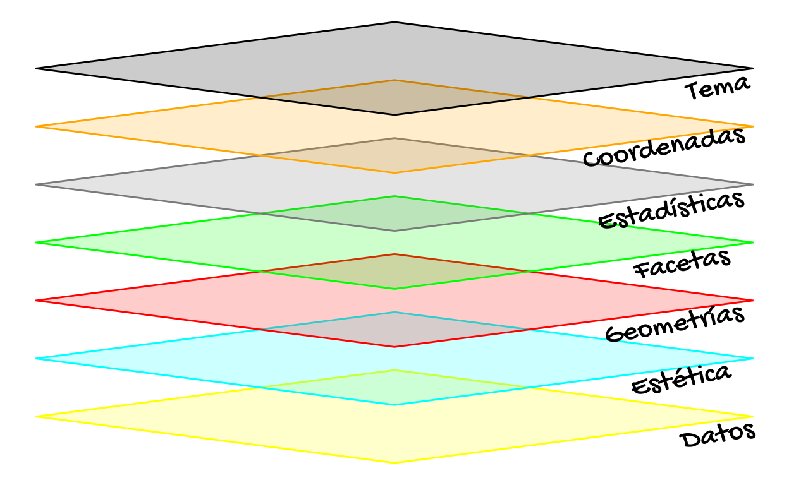

Para explicar el concepto de la gramática de gráficos en capas implementado en el paquete `ggplot2` se empleara el conjunto de datos [`pokemon`](https://github.com/cienciadedatos/datos-de-miercoles/tree/master/datos/2019/2019-07-10). Estos datos es uno de los muchos conjuntos de datos del proyecto [_Datos de miércoles_](https://github.com/cienciadedatos/datos-de-miercoles) cuyo propósito consiste en buscar que lo ususraios de `R` desarrollen habilidades de visualización y procesado de datos usando las herramientas del `tidyverse`.


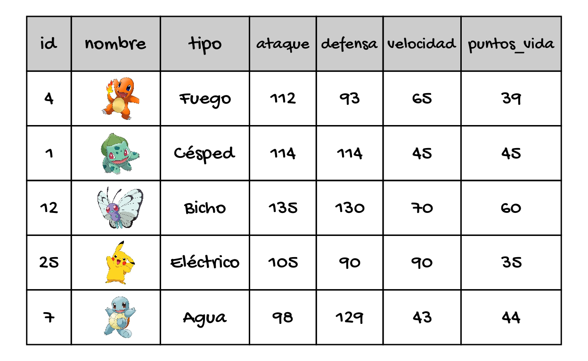

Como puedes ver, este conjunto de datos contiene siete variables:

1. En `id` se describe la identificación de cada pokémon.
2. En `nombre` podrá encontrar el nombre del pokémon.
3. En `tipo` se describe el tipo de pokémon (eléctrico, agua, veneno, fantasma, hielo, psíquico, entre otros).
4. En `ataque` podrá encontrar el daño que el pokémon puede causar en ataques.
5. En `defensa` podrá encontrar la resistencia del pokémon al daño ante ataques.
6. En `velocidad` se describe la velocidad del pokémon al atacar en cada ronda.
7. En `puntos_vida` se describe la cantidad de daño que puede resistir cada pokémon.


##### 6.2.1.1 Capas 1-2-3: datos-estética-geometrías

Estas son las capas que determinan la representación visual de los datos. Para asociar el gráfico a un conjunto de datos en específico se emplea el argumento `data`. Luego se define un mapeo haciendo uso de la función `aes()` dentro de `ggplot()` para seleccionar las variables a graficar. Por último, con `geoms` se indica cómo se representaran los datos en el gráfico.

:::example
#### Ejemplo 6.2.1.1.1
:::

<div class="tutorial-exercise" data-label="ejemplo_6_2_1_1_1" data-caption="Code" data-completion="1" data-diagnostics="1" data-startover="1" data-lines="0">

```text
pokemon <- pokemon %>%
  mutate(
    fuerza_total = ataque + defensa + velocidad + puntos_vida
    )

ggplot(
  data = pokemon,
  aes(x = ataque, y = fuerza_total)
  ) +
  geom_point()

#ggplot(
  #data = pokemon,
  #aes(x = ataque, y = fuerza_total)
  #) +
  #geom_point(
    #size = 3.4,
    #colour = 'yellow',
    #fill = 'yellow',
    #alpha = 0.4,
    #shape = 'square filled'
    #)
```

<script type="application/json" data-opts-chunk="1">{"fig.width":6.5,"fig.height":4,"fig.retina":2,"fig.align":"center","fig.keep":"high","fig.show":"asis","out.width":624,"warning":false,"error":false,"message":false,"exercise.df_print":"paged","exercise.timelimit":60,"exercise.checker":["function (label = NULL, solution_code = NULL, user_code = NULL, ","    check_code = NULL, envir_result = NULL, evaluate_result = NULL, ","    envir_prep = NULL, last_value = NULL, ...) ","{","    if (is.null(user_code)) {","        return(list(message = \"I didn't receive your code. Did you write any?\", ","            correct = FALSE, type = \"error\", location = \"append\"))","    }","    else {","        user_code <- parse(text = user_code)","        if (length(user_code) == 0) {","            return(list(message = \"I didn't receive your code. Did you write any?\", ","                correct = FALSE, type = \"error\", location = \"append\"))","        }","    }","    if (!is.null(solution_code)) {","        solution_code <- parse(text = solution_code)","        if (length(solution_code) == 0) {","            return(list(message = \"No solution is provided for this exercise.\", ","                correct = TRUE, type = \"info\", location = \"append\"))","        }","    }","    had_error_checking <- FALSE","    checked_result <- tryCatch({","        parsed_check_code <- parse(text = check_code)","        if (length(parsed_check_code) > 1) {","            for (i in 1:(length(parsed_check_code) - 1)) {","                eval(parsed_check_code[[i]], envir_prep)","            }","        }","        grading_code <- rlang::call_standardise(parsed_check_code[[length(parsed_check_code)]], ","            envir_prep)","        grader_args <- list(user_quo = rlang::as_quosure(user_code[[length(user_code)]], ","            envir_result))","        if (!is.null(solution_code)) {","            grader_args$solution_quo <- rlang::as_quosure(solution_code[[length(solution_code)]], ","                envir_prep)","        }","        learnr_args <- list(...)","        learnr_args$label <- label","        learnr_args$solution_code <- solution_code","        learnr_args$user_code <- user_code","        learnr_args$check_code <- check_code","        learnr_args$envir_result <- envir_result","        learnr_args$evaluate_result <- evaluate_result","        learnr_args$envir_prep <- envir_prep","        learnr_args$last_value <- last_value","        grading_code$grader_args <- grader_args","        grading_code$learnr_args <- learnr_args","        envir_prep$ans <- grader_args$user","        eval(grading_code, envir_prep)","    }, error = function(e) {","        message(\"\", e)","        had_error_checking <<- TRUE","        graded(correct = FALSE, message = \"Error occured while checking the submission\")","    })","    if (!checkmate::test_class(checked_result, \"grader_graded\")) {","        stop(\"`grade_learnr` should receive a `graded` value from every `-check` chunk\")","    }","    message_type <- if (had_error_checking) {","        \"warning\"","    }","    else {","        if (checked_result$correct) {","            \"success\"","        }","        else {","            \"error\"","        }","    }","    ret <- list(message = checked_result$message, correct = checked_result$correct, ","        type = message_type, location = \"append\")","    ret","}"]}</script></div>

<details><summary>Lista de colores en `R` y formas de puntos</summary>


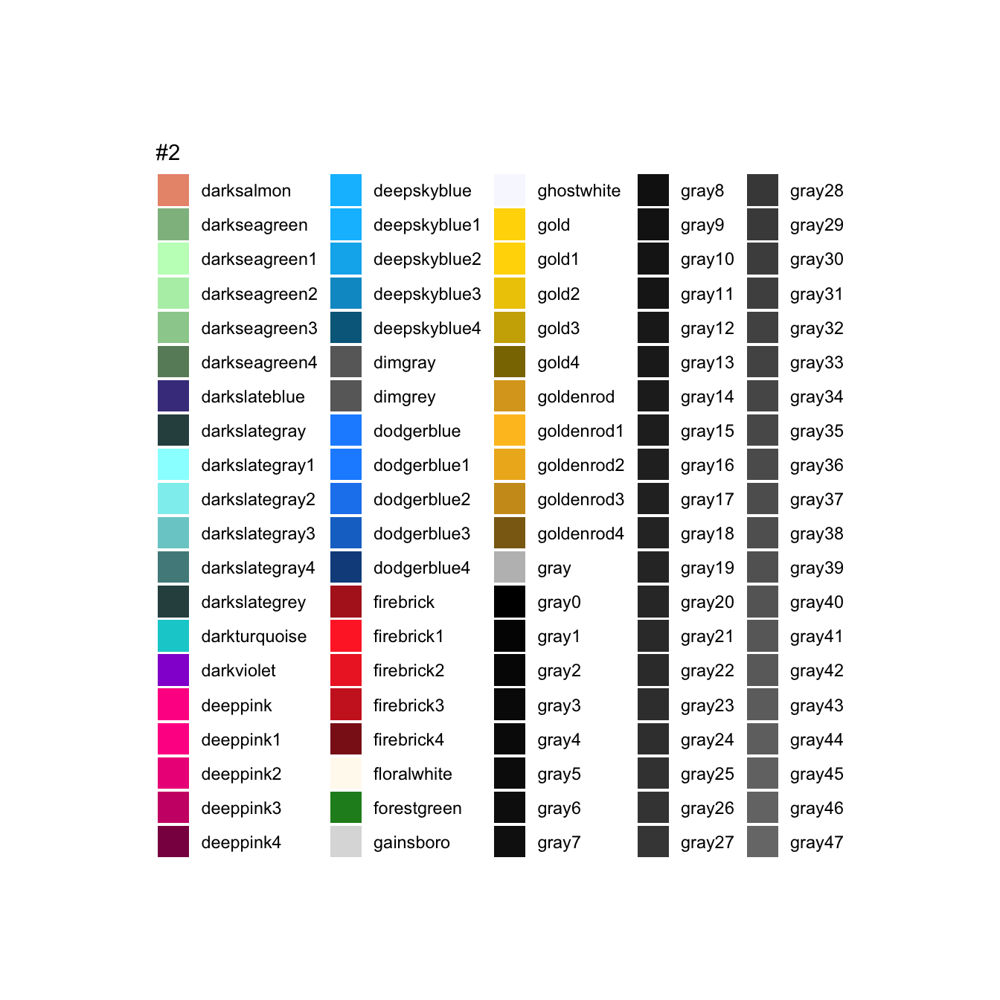

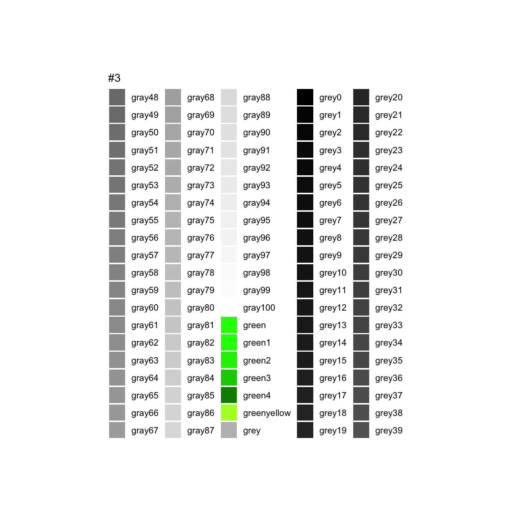

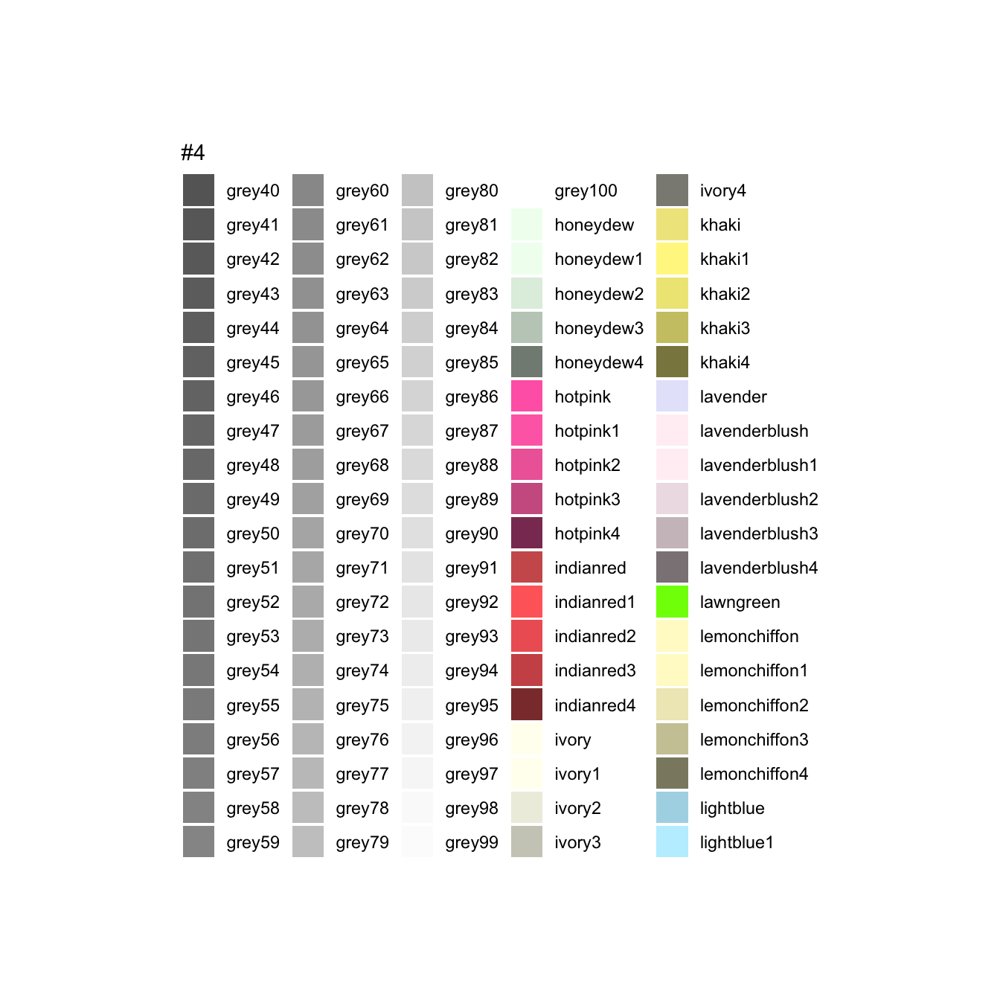


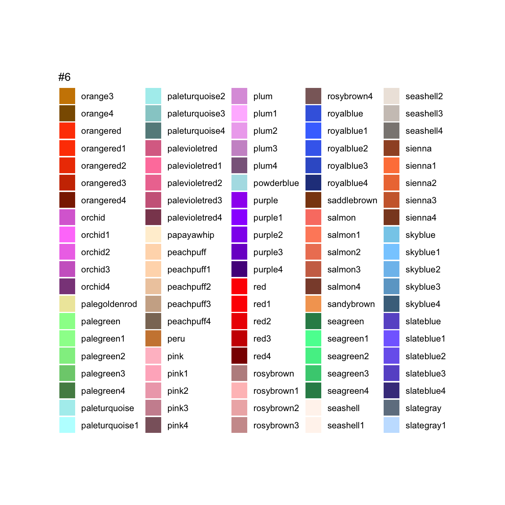


</details>

:::exercise
#### Ejercicio 6.2.1.1.1
En el ejemplo anterior se uso la función `aes()` para indicarle al `geom_point()` cuáles serían las posiciones `x` y `y` para cada punto. Sin embargo otra propiedad estetica que se puede modificar es el color de los puntos por medio del argumento `colour`. Intente por favor modificar el código anterior de modo que se coloreen los puntos de acuerdo al tipo de pokemon.
:::

<div class="tutorial-exercise" data-label="ejercicio_6_2_1_1_1" data-caption="Code" data-completion="1" data-diagnostics="1" data-startover="1" data-lines="0">

```text
pokemon <- pokemon %>%
  mutate(
    fuerza_total = ataque + defensa + velocidad + puntos_vida
    )
```

<script type="application/json" data-opts-chunk="1">{"fig.width":6.5,"fig.height":4,"fig.retina":2,"fig.align":"center","fig.keep":"high","fig.show":"asis","out.width":624,"warning":false,"error":false,"message":false,"exercise.df_print":"paged","exercise.timelimit":60,"exercise.checker":["function (label = NULL, solution_code = NULL, user_code = NULL, ","    check_code = NULL, envir_result = NULL, evaluate_result = NULL, ","    envir_prep = NULL, last_value = NULL, ...) ","{","    if (is.null(user_code)) {","        return(list(message = \"I didn't receive your code. Did you write any?\", ","            correct = FALSE, type = \"error\", location = \"append\"))","    }","    else {","        user_code <- parse(text = user_code)","        if (length(user_code) == 0) {","            return(list(message = \"I didn't receive your code. Did you write any?\", ","                correct = FALSE, type = \"error\", location = \"append\"))","        }","    }","    if (!is.null(solution_code)) {","        solution_code <- parse(text = solution_code)","        if (length(solution_code) == 0) {","            return(list(message = \"No solution is provided for this exercise.\", ","                correct = TRUE, type = \"info\", location = \"append\"))","        }","    }","    had_error_checking <- FALSE","    checked_result <- tryCatch({","        parsed_check_code <- parse(text = check_code)","        if (length(parsed_check_code) > 1) {","            for (i in 1:(length(parsed_check_code) - 1)) {","                eval(parsed_check_code[[i]], envir_prep)","            }","        }","        grading_code <- rlang::call_standardise(parsed_check_code[[length(parsed_check_code)]], ","            envir_prep)","        grader_args <- list(user_quo = rlang::as_quosure(user_code[[length(user_code)]], ","            envir_result))","        if (!is.null(solution_code)) {","            grader_args$solution_quo <- rlang::as_quosure(solution_code[[length(solution_code)]], ","                envir_prep)","        }","        learnr_args <- list(...)","        learnr_args$label <- label","        learnr_args$solution_code <- solution_code","        learnr_args$user_code <- user_code","        learnr_args$check_code <- check_code","        learnr_args$envir_result <- envir_result","        learnr_args$evaluate_result <- evaluate_result","        learnr_args$envir_prep <- envir_prep","        learnr_args$last_value <- last_value","        grading_code$grader_args <- grader_args","        grading_code$learnr_args <- learnr_args","        envir_prep$ans <- grader_args$user","        eval(grading_code, envir_prep)","    }, error = function(e) {","        message(\"\", e)","        had_error_checking <<- TRUE","        graded(correct = FALSE, message = \"Error occured while checking the submission\")","    })","    if (!checkmate::test_class(checked_result, \"grader_graded\")) {","        stop(\"`grade_learnr` should receive a `graded` value from every `-check` chunk\")","    }","    message_type <- if (had_error_checking) {","        \"warning\"","    }","    else {","        if (checked_result$correct) {","            \"success\"","        }","        else {","            \"error\"","        }","    }","    ret <- list(message = checked_result$message, correct = checked_result$correct, ","        type = message_type, location = \"append\")","    ret","}"]}</script></div>

<div class="tutorial-exercise-support" data-label="ejercicio_6_2_1_1_1-solution" data-caption="Code" data-completion="1" data-diagnostics="1" data-startover="1" data-lines="0">

```text
ggplot( # Primera forma
  data = pokemon,
  aes(x = ataque, y = fuerza_total, colour = tipo)
  ) +
  geom_point()
  
ggplot( # Segunda forma
  data = pokemon,
  aes(x = ataque, y = fuerza_total)
  ) +
  geom_point(aes(colour = tipo))
```

</div>

:::caution
Las asignaciones estéticas, definidas con la función `aes()`, describen cómo las variables se asignan a propiedades visuales o estéticas. Además de una posición horizontal (`x`) y vertical (`y`), cada punto puede tener también un tamaño (`size`), un color (`colour` y `fill`) y una forma (`shape`).
:::

##### 6.2.1.2 Capa 4: facetas

Las facetas son una de las capas más importantes para construir una visualización de datos efectiva. Las facetas consisten de múltiples gráficos de lado a lado utilizados para mostrar los niveles de una variable categórica. Hay dos tipos de facetado:

<div class="row">
  <div class="col-md-6" markdown="1">
+ `facet_wrap()`


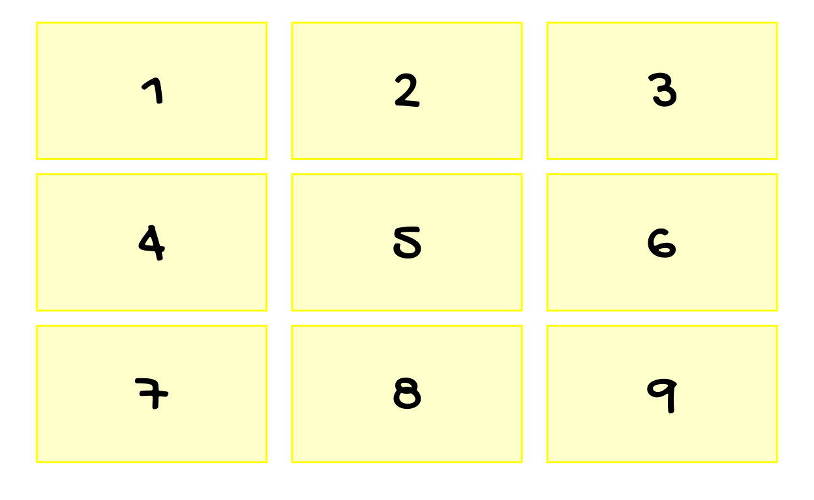
  </div>
  <div class="col-md-6" markdown="1">

+ `facet_grid()`


  </div>
</div>

:::example
#### Ejemplo 6.2.1.2.1
:::

<div class="tutorial-exercise" data-label="ejemplo_6_2_1_2_1" data-caption="Code" data-completion="1" data-diagnostics="1" data-startover="1" data-lines="0">

```text
pokemon <- pokemon %>%
  mutate(
    fuerza_total = ataque + defensa + velocidad + puntos_vida
    )

ggplot(
  data = pokemon,
  aes(x = ataque, y = fuerza_total, colour = tipo)
  ) +
  geom_point() #+
  #facet_wrap(~ tipo)

#ggplot(
  #data = pokemon,
  #aes(x = ataque, y = fuerza_total, colour = tipo)
  #) +
  #geom_point() +
  #facet_wrap(~ tipo, ncol = 3, dir = 'h') # "h" de horizontal.

#ggplot(
  #data = pokemon,
  #aes(x = ataque, y = fuerza_total, colour = tipo)
  #) +
  #geom_point() +
  #facet_wrap(~ tipo, nrow = 6, dir = 'v') # "v" de vertical.
```

<script type="application/json" data-opts-chunk="1">{"fig.width":6.5,"fig.height":4,"fig.retina":2,"fig.align":"center","fig.keep":"high","fig.show":"asis","out.width":624,"warning":false,"error":false,"message":false,"exercise.df_print":"paged","exercise.timelimit":60,"exercise.checker":["function (label = NULL, solution_code = NULL, user_code = NULL, ","    check_code = NULL, envir_result = NULL, evaluate_result = NULL, ","    envir_prep = NULL, last_value = NULL, ...) ","{","    if (is.null(user_code)) {","        return(list(message = \"I didn't receive your code. Did you write any?\", ","            correct = FALSE, type = \"error\", location = \"append\"))","    }","    else {","        user_code <- parse(text = user_code)","        if (length(user_code) == 0) {","            return(list(message = \"I didn't receive your code. Did you write any?\", ","                correct = FALSE, type = \"error\", location = \"append\"))","        }","    }","    if (!is.null(solution_code)) {","        solution_code <- parse(text = solution_code)","        if (length(solution_code) == 0) {","            return(list(message = \"No solution is provided for this exercise.\", ","                correct = TRUE, type = \"info\", location = \"append\"))","        }","    }","    had_error_checking <- FALSE","    checked_result <- tryCatch({","        parsed_check_code <- parse(text = check_code)","        if (length(parsed_check_code) > 1) {","            for (i in 1:(length(parsed_check_code) - 1)) {","                eval(parsed_check_code[[i]], envir_prep)","            }","        }","        grading_code <- rlang::call_standardise(parsed_check_code[[length(parsed_check_code)]], ","            envir_prep)","        grader_args <- list(user_quo = rlang::as_quosure(user_code[[length(user_code)]], ","            envir_result))","        if (!is.null(solution_code)) {","            grader_args$solution_quo <- rlang::as_quosure(solution_code[[length(solution_code)]], ","                envir_prep)","        }","        learnr_args <- list(...)","        learnr_args$label <- label","        learnr_args$solution_code <- solution_code","        learnr_args$user_code <- user_code","        learnr_args$check_code <- check_code","        learnr_args$envir_result <- envir_result","        learnr_args$evaluate_result <- evaluate_result","        learnr_args$envir_prep <- envir_prep","        learnr_args$last_value <- last_value","        grading_code$grader_args <- grader_args","        grading_code$learnr_args <- learnr_args","        envir_prep$ans <- grader_args$user","        eval(grading_code, envir_prep)","    }, error = function(e) {","        message(\"\", e)","        had_error_checking <<- TRUE","        graded(correct = FALSE, message = \"Error occured while checking the submission\")","    })","    if (!checkmate::test_class(checked_result, \"grader_graded\")) {","        stop(\"`grade_learnr` should receive a `graded` value from every `-check` chunk\")","    }","    message_type <- if (had_error_checking) {","        \"warning\"","    }","    else {","        if (checked_result$correct) {","            \"success\"","        }","        else {","            \"error\"","        }","    }","    ret <- list(message = checked_result$message, correct = checked_result$correct, ","        type = message_type, location = \"append\")","    ret","}"]}</script></div>

:::example
#### Ejemplo 6.2.1.2.2
:::

<div class="tutorial-exercise" data-label="ejemplo_6_2_1_2_2" data-caption="Code" data-completion="1" data-diagnostics="1" data-startover="1" data-lines="0">

```text
pokemon_2 <- pokemon %>%
  mutate(
    fuerza_total = ataque + defensa + velocidad + puntos_vida
    ) %>%
  inner_join(pokemon_2, 'nombre')
pokemon_2

#ggplot(
  #data = pokemon_2,
  #aes(x = ataque, y = fuerza_total)
  #) +
  #geom_point() +
  #facet_grid(tipo ~ tipo_2)

#ggplot(
  #data = pokemon_2,
  #aes(x = ataque, y = fuerza_total)
  #) +
  #geom_point() +
  #facet_grid(vars(tipo), vars(tipo_2))
```

<script type="application/json" data-opts-chunk="1">{"fig.width":6.5,"fig.height":4,"fig.retina":2,"fig.align":"center","fig.keep":"high","fig.show":"asis","out.width":624,"warning":false,"error":false,"message":false,"exercise.df_print":"paged","exercise.timelimit":60,"exercise.checker":["function (label = NULL, solution_code = NULL, user_code = NULL, ","    check_code = NULL, envir_result = NULL, evaluate_result = NULL, ","    envir_prep = NULL, last_value = NULL, ...) ","{","    if (is.null(user_code)) {","        return(list(message = \"I didn't receive your code. Did you write any?\", ","            correct = FALSE, type = \"error\", location = \"append\"))","    }","    else {","        user_code <- parse(text = user_code)","        if (length(user_code) == 0) {","            return(list(message = \"I didn't receive your code. Did you write any?\", ","                correct = FALSE, type = \"error\", location = \"append\"))","        }","    }","    if (!is.null(solution_code)) {","        solution_code <- parse(text = solution_code)","        if (length(solution_code) == 0) {","            return(list(message = \"No solution is provided for this exercise.\", ","                correct = TRUE, type = \"info\", location = \"append\"))","        }","    }","    had_error_checking <- FALSE","    checked_result <- tryCatch({","        parsed_check_code <- parse(text = check_code)","        if (length(parsed_check_code) > 1) {","            for (i in 1:(length(parsed_check_code) - 1)) {","                eval(parsed_check_code[[i]], envir_prep)","            }","        }","        grading_code <- rlang::call_standardise(parsed_check_code[[length(parsed_check_code)]], ","            envir_prep)","        grader_args <- list(user_quo = rlang::as_quosure(user_code[[length(user_code)]], ","            envir_result))","        if (!is.null(solution_code)) {","            grader_args$solution_quo <- rlang::as_quosure(solution_code[[length(solution_code)]], ","                envir_prep)","        }","        learnr_args <- list(...)","        learnr_args$label <- label","        learnr_args$solution_code <- solution_code","        learnr_args$user_code <- user_code","        learnr_args$check_code <- check_code","        learnr_args$envir_result <- envir_result","        learnr_args$evaluate_result <- evaluate_result","        learnr_args$envir_prep <- envir_prep","        learnr_args$last_value <- last_value","        grading_code$grader_args <- grader_args","        grading_code$learnr_args <- learnr_args","        envir_prep$ans <- grader_args$user","        eval(grading_code, envir_prep)","    }, error = function(e) {","        message(\"\", e)","        had_error_checking <<- TRUE","        graded(correct = FALSE, message = \"Error occured while checking the submission\")","    })","    if (!checkmate::test_class(checked_result, \"grader_graded\")) {","        stop(\"`grade_learnr` should receive a `graded` value from every `-check` chunk\")","    }","    message_type <- if (had_error_checking) {","        \"warning\"","    }","    else {","        if (checked_result$correct) {","            \"success\"","        }","        else {","            \"error\"","        }","    }","    ret <- list(message = checked_result$message, correct = checked_result$correct, ","        type = message_type, location = \"append\")","    ret","}"]}</script></div>

##### 6.2.1.3 Capa 5: estadísticas

La capa 5 de estadística (`stat_`), permite presentar resumenes estadísticos dentro de los gráficos por medio de una transformación estadística de los datos.

:::example
#### Ejemplo 6.2.1.3.1
:::

<div class="tutorial-exercise" data-label="ejemplo_6_2_1_3_1" data-caption="Code" data-completion="1" data-diagnostics="1" data-startover="1" data-lines="0">

```text
pokemon <- pokemon %>%
  mutate(
    fuerza_total = ataque + defensa + velocidad + puntos_vida
    )

Modelo <- lm(
  formula = fuerza_total ~ ataque, 
  data = pokemon
  )
summary(Modelo)

Int_Pend <- tribble(
  ~Intercepto, ~Pendiente,
       138.24,       1.96
  )

#ggplot(
  #data = pokemon,
  #aes(x = ataque, y = fuerza_total)
  #) +
  #geom_point() +
  #geom_abline(
    #data = Int_Pend, 
    #aes(intercept = Intercepto, slope = Pendiente)
    #)
  
#ggplot(
  #data = pokemon,
  #aes(x = ataque, y = fuerza_total)
  #) +
  #geom_point() +
  #stat_smooth(method = 'lm', colour = 'black')

#ggplot(
  #data = pokemon,
  #aes(x = ataque, y = fuerza_total, colour = tipo)
  #) +
  #geom_point() +
  #facet_wrap(~ tipo) +
  #stat_smooth(method = 'lm', colour = 'black')
```

<script type="application/json" data-opts-chunk="1">{"fig.width":6.5,"fig.height":4,"fig.retina":2,"fig.align":"center","fig.keep":"high","fig.show":"asis","out.width":624,"warning":false,"error":false,"message":false,"exercise.df_print":"paged","exercise.timelimit":60,"exercise.checker":["function (label = NULL, solution_code = NULL, user_code = NULL, ","    check_code = NULL, envir_result = NULL, evaluate_result = NULL, ","    envir_prep = NULL, last_value = NULL, ...) ","{","    if (is.null(user_code)) {","        return(list(message = \"I didn't receive your code. Did you write any?\", ","            correct = FALSE, type = \"error\", location = \"append\"))","    }","    else {","        user_code <- parse(text = user_code)","        if (length(user_code) == 0) {","            return(list(message = \"I didn't receive your code. Did you write any?\", ","                correct = FALSE, type = \"error\", location = \"append\"))","        }","    }","    if (!is.null(solution_code)) {","        solution_code <- parse(text = solution_code)","        if (length(solution_code) == 0) {","            return(list(message = \"No solution is provided for this exercise.\", ","                correct = TRUE, type = \"info\", location = \"append\"))","        }","    }","    had_error_checking <- FALSE","    checked_result <- tryCatch({","        parsed_check_code <- parse(text = check_code)","        if (length(parsed_check_code) > 1) {","            for (i in 1:(length(parsed_check_code) - 1)) {","                eval(parsed_check_code[[i]], envir_prep)","            }","        }","        grading_code <- rlang::call_standardise(parsed_check_code[[length(parsed_check_code)]], ","            envir_prep)","        grader_args <- list(user_quo = rlang::as_quosure(user_code[[length(user_code)]], ","            envir_result))","        if (!is.null(solution_code)) {","            grader_args$solution_quo <- rlang::as_quosure(solution_code[[length(solution_code)]], ","                envir_prep)","        }","        learnr_args <- list(...)","        learnr_args$label <- label","        learnr_args$solution_code <- solution_code","        learnr_args$user_code <- user_code","        learnr_args$check_code <- check_code","        learnr_args$envir_result <- envir_result","        learnr_args$evaluate_result <- evaluate_result","        learnr_args$envir_prep <- envir_prep","        learnr_args$last_value <- last_value","        grading_code$grader_args <- grader_args","        grading_code$learnr_args <- learnr_args","        envir_prep$ans <- grader_args$user","        eval(grading_code, envir_prep)","    }, error = function(e) {","        message(\"\", e)","        had_error_checking <<- TRUE","        graded(correct = FALSE, message = \"Error occured while checking the submission\")","    })","    if (!checkmate::test_class(checked_result, \"grader_graded\")) {","        stop(\"`grade_learnr` should receive a `graded` value from every `-check` chunk\")","    }","    message_type <- if (had_error_checking) {","        \"warning\"","    }","    else {","        if (checked_result$correct) {","            \"success\"","        }","        else {","            \"error\"","        }","    }","    ret <- list(message = checked_result$message, correct = checked_result$correct, ","        type = message_type, location = \"append\")","    ret","}"]}</script></div>

:::caution
Las funciones [`geom_`](https://ggplot2.tidyverse.org/reference/index.html#section-layer-geoms) tienen asociada una función `stat_` por defecto, que se encarga de realizar los cálculos pertinentes para obtener las variables necesarias para dibujar una determinada gráfica.
:::

:::example
#### Ejemplo 6.2.1.3.2
:::

<div class="row">
  <div class="col-md-6" markdown="1">
<div class="tutorial-exercise" data-label="ejemplo_6_2_1_3_2_1" data-caption="Code" data-completion="1" data-diagnostics="1" data-startover="1" data-lines="0">

```text
pokemon <- pokemon %>%
  mutate(
    fuerza_total = ataque + defensa + velocidad + puntos_vida
    )

ggplot(
  data = pokemon,
  aes(x = tipo, y = fuerza_total)
  ) +
  geom_point() #+
  #stat_summary(fun = mean, fun.min = min, fun.max = max, colour = 'yellow')
```

<script type="application/json" data-opts-chunk="1">{"fig.width":6.5,"fig.height":4,"fig.retina":2,"fig.align":"center","fig.keep":"high","fig.show":"asis","out.width":"380","warning":false,"error":false,"message":false,"exercise.df_print":"paged","exercise.timelimit":60,"exercise.checker":["function (label = NULL, solution_code = NULL, user_code = NULL, ","    check_code = NULL, envir_result = NULL, evaluate_result = NULL, ","    envir_prep = NULL, last_value = NULL, ...) ","{","    if (is.null(user_code)) {","        return(list(message = \"I didn't receive your code. Did you write any?\", ","            correct = FALSE, type = \"error\", location = \"append\"))","    }","    else {","        user_code <- parse(text = user_code)","        if (length(user_code) == 0) {","            return(list(message = \"I didn't receive your code. Did you write any?\", ","                correct = FALSE, type = \"error\", location = \"append\"))","        }","    }","    if (!is.null(solution_code)) {","        solution_code <- parse(text = solution_code)","        if (length(solution_code) == 0) {","            return(list(message = \"No solution is provided for this exercise.\", ","                correct = TRUE, type = \"info\", location = \"append\"))","        }","    }","    had_error_checking <- FALSE","    checked_result <- tryCatch({","        parsed_check_code <- parse(text = check_code)","        if (length(parsed_check_code) > 1) {","            for (i in 1:(length(parsed_check_code) - 1)) {","                eval(parsed_check_code[[i]], envir_prep)","            }","        }","        grading_code <- rlang::call_standardise(parsed_check_code[[length(parsed_check_code)]], ","            envir_prep)","        grader_args <- list(user_quo = rlang::as_quosure(user_code[[length(user_code)]], ","            envir_result))","        if (!is.null(solution_code)) {","            grader_args$solution_quo <- rlang::as_quosure(solution_code[[length(solution_code)]], ","                envir_prep)","        }","        learnr_args <- list(...)","        learnr_args$label <- label","        learnr_args$solution_code <- solution_code","        learnr_args$user_code <- user_code","        learnr_args$check_code <- check_code","        learnr_args$envir_result <- envir_result","        learnr_args$evaluate_result <- evaluate_result","        learnr_args$envir_prep <- envir_prep","        learnr_args$last_value <- last_value","        grading_code$grader_args <- grader_args","        grading_code$learnr_args <- learnr_args","        envir_prep$ans <- grader_args$user","        eval(grading_code, envir_prep)","    }, error = function(e) {","        message(\"\", e)","        had_error_checking <<- TRUE","        graded(correct = FALSE, message = \"Error occured while checking the submission\")","    })","    if (!checkmate::test_class(checked_result, \"grader_graded\")) {","        stop(\"`grade_learnr` should receive a `graded` value from every `-check` chunk\")","    }","    message_type <- if (had_error_checking) {","        \"warning\"","    }","    else {","        if (checked_result$correct) {","            \"success\"","        }","        else {","            \"error\"","        }","    }","    ret <- list(message = checked_result$message, correct = checked_result$correct, ","        type = message_type, location = \"append\")","    ret","}"]}</script></div>
  </div>
  <div class="col-md-6" markdown="1">
<div class="tutorial-exercise" data-label="ejemplo_6_2_1_3_2_2" data-caption="Code" data-completion="1" data-diagnostics="1" data-startover="1" data-lines="0">

```text
pokemon <- pokemon %>%
  mutate(
    fuerza_total = ataque + defensa + velocidad + puntos_vida
    )

ggplot(
  data = pokemon,
  aes(x = fuerza_total)
  ) +
  geom_histogram() #+
  #stat_bin(bins = 12)

#ggplot(
  #data = pokemon,
  #aes(x = fuerza_total, after_stat(density))
  #) +
  #geom_histogram()
```

<script type="application/json" data-opts-chunk="1">{"fig.width":6.5,"fig.height":4,"fig.retina":2,"fig.align":"center","fig.keep":"high","fig.show":"asis","out.width":"380","warning":false,"error":false,"message":false,"exercise.df_print":"paged","exercise.timelimit":60,"exercise.checker":["function (label = NULL, solution_code = NULL, user_code = NULL, ","    check_code = NULL, envir_result = NULL, evaluate_result = NULL, ","    envir_prep = NULL, last_value = NULL, ...) ","{","    if (is.null(user_code)) {","        return(list(message = \"I didn't receive your code. Did you write any?\", ","            correct = FALSE, type = \"error\", location = \"append\"))","    }","    else {","        user_code <- parse(text = user_code)","        if (length(user_code) == 0) {","            return(list(message = \"I didn't receive your code. Did you write any?\", ","                correct = FALSE, type = \"error\", location = \"append\"))","        }","    }","    if (!is.null(solution_code)) {","        solution_code <- parse(text = solution_code)","        if (length(solution_code) == 0) {","            return(list(message = \"No solution is provided for this exercise.\", ","                correct = TRUE, type = \"info\", location = \"append\"))","        }","    }","    had_error_checking <- FALSE","    checked_result <- tryCatch({","        parsed_check_code <- parse(text = check_code)","        if (length(parsed_check_code) > 1) {","            for (i in 1:(length(parsed_check_code) - 1)) {","                eval(parsed_check_code[[i]], envir_prep)","            }","        }","        grading_code <- rlang::call_standardise(parsed_check_code[[length(parsed_check_code)]], ","            envir_prep)","        grader_args <- list(user_quo = rlang::as_quosure(user_code[[length(user_code)]], ","            envir_result))","        if (!is.null(solution_code)) {","            grader_args$solution_quo <- rlang::as_quosure(solution_code[[length(solution_code)]], ","                envir_prep)","        }","        learnr_args <- list(...)","        learnr_args$label <- label","        learnr_args$solution_code <- solution_code","        learnr_args$user_code <- user_code","        learnr_args$check_code <- check_code","        learnr_args$envir_result <- envir_result","        learnr_args$evaluate_result <- evaluate_result","        learnr_args$envir_prep <- envir_prep","        learnr_args$last_value <- last_value","        grading_code$grader_args <- grader_args","        grading_code$learnr_args <- learnr_args","        envir_prep$ans <- grader_args$user","        eval(grading_code, envir_prep)","    }, error = function(e) {","        message(\"\", e)","        had_error_checking <<- TRUE","        graded(correct = FALSE, message = \"Error occured while checking the submission\")","    })","    if (!checkmate::test_class(checked_result, \"grader_graded\")) {","        stop(\"`grade_learnr` should receive a `graded` value from every `-check` chunk\")","    }","    message_type <- if (had_error_checking) {","        \"warning\"","    }","    else {","        if (checked_result$correct) {","            \"success\"","        }","        else {","            \"error\"","        }","    }","    ret <- list(message = checked_result$message, correct = checked_result$correct, ","        type = message_type, location = \"append\")","    ret","}"]}</script></div>
  </div>
</div>

##### 6.2.1.4 Capa 6: coordenadas

:::example
#### Ejemplo 6.2.1.4.1
:::

<div class="row">
  <div class="col-md-6" markdown="1">
<div class="tutorial-exercise" data-label="ejemplo_6_2_1_4_1_1" data-caption="Code" data-completion="1" data-diagnostics="1" data-startover="1" data-lines="0">

```text
pokemon <- pokemon %>%
  mutate(
    fuerza_total = ataque + defensa + velocidad + puntos_vida
    ) %>%
  group_by(tipo) %>%
  summarise(
    Prom_fuerza_total = mean(fuerza_total)
    )
```

<script type="application/json" data-opts-chunk="1">{"fig.width":6.5,"fig.height":4,"fig.retina":2,"fig.align":"center","fig.keep":"high","fig.show":"asis","out.width":"380","warning":false,"error":false,"message":false,"exercise.df_print":"paged","exercise.timelimit":60,"exercise.checker":["function (label = NULL, solution_code = NULL, user_code = NULL, ","    check_code = NULL, envir_result = NULL, evaluate_result = NULL, ","    envir_prep = NULL, last_value = NULL, ...) ","{","    if (is.null(user_code)) {","        return(list(message = \"I didn't receive your code. Did you write any?\", ","            correct = FALSE, type = \"error\", location = \"append\"))","    }","    else {","        user_code <- parse(text = user_code)","        if (length(user_code) == 0) {","            return(list(message = \"I didn't receive your code. Did you write any?\", ","                correct = FALSE, type = \"error\", location = \"append\"))","        }","    }","    if (!is.null(solution_code)) {","        solution_code <- parse(text = solution_code)","        if (length(solution_code) == 0) {","            return(list(message = \"No solution is provided for this exercise.\", ","                correct = TRUE, type = \"info\", location = \"append\"))","        }","    }","    had_error_checking <- FALSE","    checked_result <- tryCatch({","        parsed_check_code <- parse(text = check_code)","        if (length(parsed_check_code) > 1) {","            for (i in 1:(length(parsed_check_code) - 1)) {","                eval(parsed_check_code[[i]], envir_prep)","            }","        }","        grading_code <- rlang::call_standardise(parsed_check_code[[length(parsed_check_code)]], ","            envir_prep)","        grader_args <- list(user_quo = rlang::as_quosure(user_code[[length(user_code)]], ","            envir_result))","        if (!is.null(solution_code)) {","            grader_args$solution_quo <- rlang::as_quosure(solution_code[[length(solution_code)]], ","                envir_prep)","        }","        learnr_args <- list(...)","        learnr_args$label <- label","        learnr_args$solution_code <- solution_code","        learnr_args$user_code <- user_code","        learnr_args$check_code <- check_code","        learnr_args$envir_result <- envir_result","        learnr_args$evaluate_result <- evaluate_result","        learnr_args$envir_prep <- envir_prep","        learnr_args$last_value <- last_value","        grading_code$grader_args <- grader_args","        grading_code$learnr_args <- learnr_args","        envir_prep$ans <- grader_args$user","        eval(grading_code, envir_prep)","    }, error = function(e) {","        message(\"\", e)","        had_error_checking <<- TRUE","        graded(correct = FALSE, message = \"Error occured while checking the submission\")","    })","    if (!checkmate::test_class(checked_result, \"grader_graded\")) {","        stop(\"`grade_learnr` should receive a `graded` value from every `-check` chunk\")","    }","    message_type <- if (had_error_checking) {","        \"warning\"","    }","    else {","        if (checked_result$correct) {","            \"success\"","        }","        else {","            \"error\"","        }","    }","    ret <- list(message = checked_result$message, correct = checked_result$correct, ","        type = message_type, location = \"append\")","    ret","}"]}</script></div>
  </div>
  <div class="col-md-6" markdown="1">
<div class="tutorial-exercise" data-label="ejemplo_6_2_1_4_1_2" data-caption="Code" data-completion="1" data-diagnostics="1" data-startover="1" data-lines="0">

```text
pokemon <- pokemon %>%
  mutate(
    fuerza_total = ataque + defensa + velocidad + puntos_vida
    )
```

<script type="application/json" data-opts-chunk="1">{"fig.width":6.5,"fig.height":4,"fig.retina":2,"fig.align":"center","fig.keep":"high","fig.show":"asis","out.width":"380","warning":false,"error":false,"message":false,"exercise.df_print":"paged","exercise.timelimit":60,"exercise.checker":["function (label = NULL, solution_code = NULL, user_code = NULL, ","    check_code = NULL, envir_result = NULL, evaluate_result = NULL, ","    envir_prep = NULL, last_value = NULL, ...) ","{","    if (is.null(user_code)) {","        return(list(message = \"I didn't receive your code. Did you write any?\", ","            correct = FALSE, type = \"error\", location = \"append\"))","    }","    else {","        user_code <- parse(text = user_code)","        if (length(user_code) == 0) {","            return(list(message = \"I didn't receive your code. Did you write any?\", ","                correct = FALSE, type = \"error\", location = \"append\"))","        }","    }","    if (!is.null(solution_code)) {","        solution_code <- parse(text = solution_code)","        if (length(solution_code) == 0) {","            return(list(message = \"No solution is provided for this exercise.\", ","                correct = TRUE, type = \"info\", location = \"append\"))","        }","    }","    had_error_checking <- FALSE","    checked_result <- tryCatch({","        parsed_check_code <- parse(text = check_code)","        if (length(parsed_check_code) > 1) {","            for (i in 1:(length(parsed_check_code) - 1)) {","                eval(parsed_check_code[[i]], envir_prep)","            }","        }","        grading_code <- rlang::call_standardise(parsed_check_code[[length(parsed_check_code)]], ","            envir_prep)","        grader_args <- list(user_quo = rlang::as_quosure(user_code[[length(user_code)]], ","            envir_result))","        if (!is.null(solution_code)) {","            grader_args$solution_quo <- rlang::as_quosure(solution_code[[length(solution_code)]], ","                envir_prep)","        }","        learnr_args <- list(...)","        learnr_args$label <- label","        learnr_args$solution_code <- solution_code","        learnr_args$user_code <- user_code","        learnr_args$check_code <- check_code","        learnr_args$envir_result <- envir_result","        learnr_args$evaluate_result <- evaluate_result","        learnr_args$envir_prep <- envir_prep","        learnr_args$last_value <- last_value","        grading_code$grader_args <- grader_args","        grading_code$learnr_args <- learnr_args","        envir_prep$ans <- grader_args$user","        eval(grading_code, envir_prep)","    }, error = function(e) {","        message(\"\", e)","        had_error_checking <<- TRUE","        graded(correct = FALSE, message = \"Error occured while checking the submission\")","    })","    if (!checkmate::test_class(checked_result, \"grader_graded\")) {","        stop(\"`grade_learnr` should receive a `graded` value from every `-check` chunk\")","    }","    message_type <- if (had_error_checking) {","        \"warning\"","    }","    else {","        if (checked_result$correct) {","            \"success\"","        }","        else {","            \"error\"","        }","    }","    ret <- list(message = checked_result$message, correct = checked_result$correct, ","        type = message_type, location = \"append\")","    ret","}"]}</script></div>
  </div>
</div>

##### 6.2.1.5 Capa 7: tema


:::caution
Si deseas conocer más sobre la gramática de gráficos en capas propuesto por Hadley Wickham, te invitamos a revisar su articulo titulado [A layered grammar of graphics](https://github.com/Leo4Luffy/Un_curso_amigable_sobre_R/blob/master/Documentos/A%20Layered%20Grammar%20of%20Graphics.pdf) que cubre en detalle su propuesta en la construcción de gráficos y también habla sobre el paquete `ggplot2`.
:::


### 6.3 Gráficos estadísticos con `ggplot2`

Ya vimos como funciona la gramática de gráficas y las distintas capas que ponemos agregar y utilizar para crearlos, es hora de que pongamos en practica estos conceptos. Iniciemos viendo las capas individualmente partiendo de un esquema que no posee datos, para ello debemos cargar el paquete `ggplot2` y ejecutar la siguiente linea de código.

:::example
#### Ejemplo 6.3.1
:::

<div class="tutorial-exercise" data-label="addition_631" data-caption="Code" data-completion="1" data-diagnostics="1" data-startover="1" data-lines="0">

```text
# Cargando paquete
library(ggplot2)
# Esquema base
ggplot()
```

<script type="application/json" data-opts-chunk="1">{"fig.width":6.5,"fig.height":4,"fig.retina":2,"fig.align":"center","fig.keep":"high","fig.show":"asis","out.width":624,"warning":false,"error":false,"message":false,"exercise.df_print":"paged","exercise.timelimit":60,"exercise.checker":["function (label = NULL, solution_code = NULL, user_code = NULL, ","    check_code = NULL, envir_result = NULL, evaluate_result = NULL, ","    envir_prep = NULL, last_value = NULL, ...) ","{","    if (is.null(user_code)) {","        return(list(message = \"I didn't receive your code. Did you write any?\", ","            correct = FALSE, type = \"error\", location = \"append\"))","    }","    else {","        user_code <- parse(text = user_code)","        if (length(user_code) == 0) {","            return(list(message = \"I didn't receive your code. Did you write any?\", ","                correct = FALSE, type = \"error\", location = \"append\"))","        }","    }","    if (!is.null(solution_code)) {","        solution_code <- parse(text = solution_code)","        if (length(solution_code) == 0) {","            return(list(message = \"No solution is provided for this exercise.\", ","                correct = TRUE, type = \"info\", location = \"append\"))","        }","    }","    had_error_checking <- FALSE","    checked_result <- tryCatch({","        parsed_check_code <- parse(text = check_code)","        if (length(parsed_check_code) > 1) {","            for (i in 1:(length(parsed_check_code) - 1)) {","                eval(parsed_check_code[[i]], envir_prep)","            }","        }","        grading_code <- rlang::call_standardise(parsed_check_code[[length(parsed_check_code)]], ","            envir_prep)","        grader_args <- list(user_quo = rlang::as_quosure(user_code[[length(user_code)]], ","            envir_result))","        if (!is.null(solution_code)) {","            grader_args$solution_quo <- rlang::as_quosure(solution_code[[length(solution_code)]], ","                envir_prep)","        }","        learnr_args <- list(...)","        learnr_args$label <- label","        learnr_args$solution_code <- solution_code","        learnr_args$user_code <- user_code","        learnr_args$check_code <- check_code","        learnr_args$envir_result <- envir_result","        learnr_args$evaluate_result <- evaluate_result","        learnr_args$envir_prep <- envir_prep","        learnr_args$last_value <- last_value","        grading_code$grader_args <- grader_args","        grading_code$learnr_args <- learnr_args","        envir_prep$ans <- grader_args$user","        eval(grading_code, envir_prep)","    }, error = function(e) {","        message(\"\", e)","        had_error_checking <<- TRUE","        graded(correct = FALSE, message = \"Error occured while checking the submission\")","    })","    if (!checkmate::test_class(checked_result, \"grader_graded\")) {","        stop(\"`grade_learnr` should receive a `graded` value from every `-check` chunk\")","    }","    message_type <- if (had_error_checking) {","        \"warning\"","    }","    else {","        if (checked_result$correct) {","            \"success\"","        }","        else {","            \"error\"","        }","    }","    ret <- list(message = checked_result$message, correct = checked_result$correct, ","        type = message_type, location = \"append\")","    ret","}"]}</script></div>

Generalmente en la función `ggplot()` asignamos los datos que vamos a graficar usando el argumento data. Supongamos que tenemos un set de datos llamado "mis_datos", en este caso la función del esquema base con la capa de los datos quedaría de la forma `ggplot(data=mis_datos)`.

Continuemos manejando el esquema de un gráfico sin usar datos. El siguiente paso es agregar la capa de estética, la cual puede añadirse directamente en la función `ggplot()` con el argumento `mapping = aes()` o de manera independiente con la función `aes()`. Para el segundo caso debemos agregar una capa usando el operador `+`. Veamos los dos casos estableciendo valores arbitrarios tanto para x como para y.

<div class="tutorial-exercise" data-label="addition_631_1" data-caption="Code" data-completion="1" data-diagnostics="1" data-startover="1" data-lines="0">

```text
# Cargando paquete
library(ggplot2)
# Esquema base con mapping
ggplot(mapping = aes(x=0,y=0))
# Esquema base con aes()
ggplot()+
  aes(x=0,y=0)
```

<script type="application/json" data-opts-chunk="1">{"fig.width":6.5,"fig.height":4,"fig.retina":2,"fig.align":"center","fig.keep":"high","fig.show":"asis","out.width":624,"warning":false,"error":false,"message":false,"exercise.df_print":"paged","exercise.timelimit":60,"exercise.checker":["function (label = NULL, solution_code = NULL, user_code = NULL, ","    check_code = NULL, envir_result = NULL, evaluate_result = NULL, ","    envir_prep = NULL, last_value = NULL, ...) ","{","    if (is.null(user_code)) {","        return(list(message = \"I didn't receive your code. Did you write any?\", ","            correct = FALSE, type = \"error\", location = \"append\"))","    }","    else {","        user_code <- parse(text = user_code)","        if (length(user_code) == 0) {","            return(list(message = \"I didn't receive your code. Did you write any?\", ","                correct = FALSE, type = \"error\", location = \"append\"))","        }","    }","    if (!is.null(solution_code)) {","        solution_code <- parse(text = solution_code)","        if (length(solution_code) == 0) {","            return(list(message = \"No solution is provided for this exercise.\", ","                correct = TRUE, type = \"info\", location = \"append\"))","        }","    }","    had_error_checking <- FALSE","    checked_result <- tryCatch({","        parsed_check_code <- parse(text = check_code)","        if (length(parsed_check_code) > 1) {","            for (i in 1:(length(parsed_check_code) - 1)) {","                eval(parsed_check_code[[i]], envir_prep)","            }","        }","        grading_code <- rlang::call_standardise(parsed_check_code[[length(parsed_check_code)]], ","            envir_prep)","        grader_args <- list(user_quo = rlang::as_quosure(user_code[[length(user_code)]], ","            envir_result))","        if (!is.null(solution_code)) {","            grader_args$solution_quo <- rlang::as_quosure(solution_code[[length(solution_code)]], ","                envir_prep)","        }","        learnr_args <- list(...)","        learnr_args$label <- label","        learnr_args$solution_code <- solution_code","        learnr_args$user_code <- user_code","        learnr_args$check_code <- check_code","        learnr_args$envir_result <- envir_result","        learnr_args$evaluate_result <- evaluate_result","        learnr_args$envir_prep <- envir_prep","        learnr_args$last_value <- last_value","        grading_code$grader_args <- grader_args","        grading_code$learnr_args <- learnr_args","        envir_prep$ans <- grader_args$user","        eval(grading_code, envir_prep)","    }, error = function(e) {","        message(\"\", e)","        had_error_checking <<- TRUE","        graded(correct = FALSE, message = \"Error occured while checking the submission\")","    })","    if (!checkmate::test_class(checked_result, \"grader_graded\")) {","        stop(\"`grade_learnr` should receive a `graded` value from every `-check` chunk\")","    }","    message_type <- if (had_error_checking) {","        \"warning\"","    }","    else {","        if (checked_result$correct) {","            \"success\"","        }","        else {","            \"error\"","        }","    }","    ret <- list(message = checked_result$message, correct = checked_result$correct, ","        type = message_type, location = \"append\")","    ret","}"]}</script></div>

Después de estas dos capas se agrega la capa de geometrías, que en general depende de el tipo de gráfico que necesitemos o el que mejor se adapte a nuestros datos. Para conocer algunos gráficos  agruparemos algunos de ellos en 7 conjuntos:  1) Gráficos de distribución, 2) Gráficos de correlación, 3) Gráficos de clasificación y 4)Mapas.

#### 6.3.1 Gráficos de distribución

Estos gráficos se utilizan generalmente en variables continuas como edad, altura, masa, etc. Para iniciar esta sección de gráficos haremos el gráfico de densidad para la altura de los personajes de Starwars.

<div data-pagedtable="false">
  <script data-pagedtable-source type="application/json">
{"columns":[{"label":["name"],"name":[1],"type":["chr"],"align":["left"]},{"label":["height"],"name":[2],"type":["int"],"align":["right"]},{"label":["mass"],"name":[3],"type":["dbl"],"align":["right"]},{"label":["hair_color"],"name":[4],"type":["chr"],"align":["left"]},{"label":["skin_color"],"name":[5],"type":["chr"],"align":["left"]},{"label":["eye_color"],"name":[6],"type":["chr"],"align":["left"]},{"label":["birth_year"],"name":[7],"type":["dbl"],"align":["right"]},{"label":["sex"],"name":[8],"type":["chr"],"align":["left"]},{"label":["gender"],"name":[9],"type":["chr"],"align":["left"]},{"label":["homeworld"],"name":[10],"type":["chr"],"align":["left"]},{"label":["species"],"name":[11],"type":["chr"],"align":["left"]},{"label":["numero"],"name":[12],"type":["int"],"align":["right"]}],"data":[{"1":"Luke Skywalker","2":"172","3":"77.0","4":"blond","5":"fair","6":"blue","7":"19.0","8":"male","9":"masculine","10":"Tatooine","11":"Human","12":"1"},{"1":"C-3PO","2":"167","3":"75.0","4":"NA","5":"gold","6":"yellow","7":"112.0","8":"none","9":"masculine","10":"Tatooine","11":"Droid","12":"2"},{"1":"R2-D2","2":"96","3":"32.0","4":"NA","5":"white, blue","6":"red","7":"33.0","8":"none","9":"masculine","10":"Naboo","11":"Droid","12":"3"},{"1":"Darth Vader","2":"202","3":"136.0","4":"none","5":"white","6":"yellow","7":"41.9","8":"male","9":"masculine","10":"Tatooine","11":"Human","12":"4"},{"1":"Leia Organa","2":"150","3":"49.0","4":"brown","5":"light","6":"brown","7":"19.0","8":"female","9":"feminine","10":"Alderaan","11":"Human","12":"5"},{"1":"Owen Lars","2":"178","3":"120.0","4":"brown, grey","5":"light","6":"blue","7":"52.0","8":"male","9":"masculine","10":"Tatooine","11":"Human","12":"6"},{"1":"Beru Whitesun lars","2":"165","3":"75.0","4":"brown","5":"light","6":"blue","7":"47.0","8":"female","9":"feminine","10":"Tatooine","11":"Human","12":"7"},{"1":"R5-D4","2":"97","3":"32.0","4":"NA","5":"white, red","6":"red","7":"NA","8":"none","9":"masculine","10":"Tatooine","11":"Droid","12":"8"},{"1":"Biggs Darklighter","2":"183","3":"84.0","4":"black","5":"light","6":"brown","7":"24.0","8":"male","9":"masculine","10":"Tatooine","11":"Human","12":"9"},{"1":"Obi-Wan Kenobi","2":"182","3":"77.0","4":"auburn, white","5":"fair","6":"blue-gray","7":"57.0","8":"male","9":"masculine","10":"Stewjon","11":"Human","12":"10"},{"1":"Anakin Skywalker","2":"188","3":"84.0","4":"blond","5":"fair","6":"blue","7":"41.9","8":"male","9":"masculine","10":"Tatooine","11":"Human","12":"11"},{"1":"Wilhuff Tarkin","2":"180","3":"NA","4":"auburn, grey","5":"fair","6":"blue","7":"64.0","8":"male","9":"masculine","10":"Eriadu","11":"Human","12":"12"},{"1":"Chewbacca","2":"228","3":"112.0","4":"brown","5":"unknown","6":"blue","7":"200.0","8":"male","9":"masculine","10":"Kashyyyk","11":"Wookiee","12":"13"},{"1":"Han Solo","2":"180","3":"80.0","4":"brown","5":"fair","6":"brown","7":"29.0","8":"male","9":"masculine","10":"Corellia","11":"Human","12":"14"},{"1":"Greedo","2":"173","3":"74.0","4":"NA","5":"green","6":"black","7":"44.0","8":"male","9":"masculine","10":"Rodia","11":"Rodian","12":"15"},{"1":"Jabba Desilijic Tiure","2":"175","3":"1358.0","4":"NA","5":"green-tan, brown","6":"orange","7":"600.0","8":"hermaphroditic","9":"masculine","10":"Nal Hutta","11":"Hutt","12":"16"},{"1":"Wedge Antilles","2":"170","3":"77.0","4":"brown","5":"fair","6":"hazel","7":"21.0","8":"male","9":"masculine","10":"Corellia","11":"Human","12":"17"},{"1":"Jek Tono Porkins","2":"180","3":"110.0","4":"brown","5":"fair","6":"blue","7":"NA","8":"male","9":"masculine","10":"Bestine IV","11":"Human","12":"18"},{"1":"Yoda","2":"66","3":"17.0","4":"white","5":"green","6":"brown","7":"896.0","8":"male","9":"masculine","10":"NA","11":"Yoda's species","12":"19"},{"1":"Palpatine","2":"170","3":"75.0","4":"grey","5":"pale","6":"yellow","7":"82.0","8":"male","9":"masculine","10":"Naboo","11":"Human","12":"20"},{"1":"Boba Fett","2":"183","3":"78.2","4":"black","5":"fair","6":"brown","7":"31.5","8":"male","9":"masculine","10":"Kamino","11":"Human","12":"21"},{"1":"IG-88","2":"200","3":"140.0","4":"none","5":"metal","6":"red","7":"15.0","8":"none","9":"masculine","10":"NA","11":"Droid","12":"22"},{"1":"Bossk","2":"190","3":"113.0","4":"none","5":"green","6":"red","7":"53.0","8":"male","9":"masculine","10":"Trandosha","11":"Trandoshan","12":"23"},{"1":"Lando Calrissian","2":"177","3":"79.0","4":"black","5":"dark","6":"brown","7":"31.0","8":"male","9":"masculine","10":"Socorro","11":"Human","12":"24"},{"1":"Lobot","2":"175","3":"79.0","4":"none","5":"light","6":"blue","7":"37.0","8":"male","9":"masculine","10":"Bespin","11":"Human","12":"25"},{"1":"Ackbar","2":"180","3":"83.0","4":"none","5":"brown mottle","6":"orange","7":"41.0","8":"male","9":"masculine","10":"Mon Cala","11":"Mon Calamari","12":"26"},{"1":"Mon Mothma","2":"150","3":"NA","4":"auburn","5":"fair","6":"blue","7":"48.0","8":"female","9":"feminine","10":"Chandrila","11":"Human","12":"27"},{"1":"Arvel Crynyd","2":"NA","3":"NA","4":"brown","5":"fair","6":"brown","7":"NA","8":"male","9":"masculine","10":"NA","11":"Human","12":"28"},{"1":"Wicket Systri Warrick","2":"88","3":"20.0","4":"brown","5":"brown","6":"brown","7":"8.0","8":"male","9":"masculine","10":"Endor","11":"Ewok","12":"29"},{"1":"Nien Nunb","2":"160","3":"68.0","4":"none","5":"grey","6":"black","7":"NA","8":"male","9":"masculine","10":"Sullust","11":"Sullustan","12":"30"},{"1":"Qui-Gon Jinn","2":"193","3":"89.0","4":"brown","5":"fair","6":"blue","7":"92.0","8":"male","9":"masculine","10":"NA","11":"Human","12":"31"},{"1":"Nute Gunray","2":"191","3":"90.0","4":"none","5":"mottled green","6":"red","7":"NA","8":"male","9":"masculine","10":"Cato Neimoidia","11":"Neimodian","12":"32"},{"1":"Finis Valorum","2":"170","3":"NA","4":"blond","5":"fair","6":"blue","7":"91.0","8":"male","9":"masculine","10":"Coruscant","11":"Human","12":"33"},{"1":"Jar Jar Binks","2":"196","3":"66.0","4":"none","5":"orange","6":"orange","7":"52.0","8":"male","9":"masculine","10":"Naboo","11":"Gungan","12":"34"},{"1":"Roos Tarpals","2":"224","3":"82.0","4":"none","5":"grey","6":"orange","7":"NA","8":"male","9":"masculine","10":"Naboo","11":"Gungan","12":"35"},{"1":"Rugor Nass","2":"206","3":"NA","4":"none","5":"green","6":"orange","7":"NA","8":"male","9":"masculine","10":"Naboo","11":"Gungan","12":"36"},{"1":"Ric Olié","2":"183","3":"NA","4":"brown","5":"fair","6":"blue","7":"NA","8":"NA","9":"NA","10":"Naboo","11":"NA","12":"37"},{"1":"Watto","2":"137","3":"NA","4":"black","5":"blue, grey","6":"yellow","7":"NA","8":"male","9":"masculine","10":"Toydaria","11":"Toydarian","12":"38"},{"1":"Sebulba","2":"112","3":"40.0","4":"none","5":"grey, red","6":"orange","7":"NA","8":"male","9":"masculine","10":"Malastare","11":"Dug","12":"39"},{"1":"Quarsh Panaka","2":"183","3":"NA","4":"black","5":"dark","6":"brown","7":"62.0","8":"NA","9":"NA","10":"Naboo","11":"NA","12":"40"},{"1":"Shmi Skywalker","2":"163","3":"NA","4":"black","5":"fair","6":"brown","7":"72.0","8":"female","9":"feminine","10":"Tatooine","11":"Human","12":"41"},{"1":"Darth Maul","2":"175","3":"80.0","4":"none","5":"red","6":"yellow","7":"54.0","8":"male","9":"masculine","10":"Dathomir","11":"Zabrak","12":"42"},{"1":"Bib Fortuna","2":"180","3":"NA","4":"none","5":"pale","6":"pink","7":"NA","8":"male","9":"masculine","10":"Ryloth","11":"Twi'lek","12":"43"},{"1":"Ayla Secura","2":"178","3":"55.0","4":"none","5":"blue","6":"hazel","7":"48.0","8":"female","9":"feminine","10":"Ryloth","11":"Twi'lek","12":"44"},{"1":"Dud Bolt","2":"94","3":"45.0","4":"none","5":"blue, grey","6":"yellow","7":"NA","8":"male","9":"masculine","10":"Vulpter","11":"Vulptereen","12":"45"},{"1":"Gasgano","2":"122","3":"NA","4":"none","5":"white, blue","6":"black","7":"NA","8":"male","9":"masculine","10":"Troiken","11":"Xexto","12":"46"},{"1":"Ben Quadinaros","2":"163","3":"65.0","4":"none","5":"grey, green, yellow","6":"orange","7":"NA","8":"male","9":"masculine","10":"Tund","11":"Toong","12":"47"},{"1":"Mace Windu","2":"188","3":"84.0","4":"none","5":"dark","6":"brown","7":"72.0","8":"male","9":"masculine","10":"Haruun Kal","11":"Human","12":"48"},{"1":"Ki-Adi-Mundi","2":"198","3":"82.0","4":"white","5":"pale","6":"yellow","7":"92.0","8":"male","9":"masculine","10":"Cerea","11":"Cerean","12":"49"},{"1":"Kit Fisto","2":"196","3":"87.0","4":"none","5":"green","6":"black","7":"NA","8":"male","9":"masculine","10":"Glee Anselm","11":"Nautolan","12":"50"},{"1":"Eeth Koth","2":"171","3":"NA","4":"black","5":"brown","6":"brown","7":"NA","8":"male","9":"masculine","10":"Iridonia","11":"Zabrak","12":"51"},{"1":"Adi Gallia","2":"184","3":"50.0","4":"none","5":"dark","6":"blue","7":"NA","8":"female","9":"feminine","10":"Coruscant","11":"Tholothian","12":"52"},{"1":"Saesee Tiin","2":"188","3":"NA","4":"none","5":"pale","6":"orange","7":"NA","8":"male","9":"masculine","10":"Iktotch","11":"Iktotchi","12":"53"},{"1":"Yarael Poof","2":"264","3":"NA","4":"none","5":"white","6":"yellow","7":"NA","8":"male","9":"masculine","10":"Quermia","11":"Quermian","12":"54"},{"1":"Plo Koon","2":"188","3":"80.0","4":"none","5":"orange","6":"black","7":"22.0","8":"male","9":"masculine","10":"Dorin","11":"Kel Dor","12":"55"},{"1":"Mas Amedda","2":"196","3":"NA","4":"none","5":"blue","6":"blue","7":"NA","8":"male","9":"masculine","10":"Champala","11":"Chagrian","12":"56"},{"1":"Gregar Typho","2":"185","3":"85.0","4":"black","5":"dark","6":"brown","7":"NA","8":"male","9":"masculine","10":"Naboo","11":"Human","12":"57"},{"1":"Cordé","2":"157","3":"NA","4":"brown","5":"light","6":"brown","7":"NA","8":"female","9":"feminine","10":"Naboo","11":"Human","12":"58"},{"1":"Cliegg Lars","2":"183","3":"NA","4":"brown","5":"fair","6":"blue","7":"82.0","8":"male","9":"masculine","10":"Tatooine","11":"Human","12":"59"},{"1":"Poggle the Lesser","2":"183","3":"80.0","4":"none","5":"green","6":"yellow","7":"NA","8":"male","9":"masculine","10":"Geonosis","11":"Geonosian","12":"60"},{"1":"Luminara Unduli","2":"170","3":"56.2","4":"black","5":"yellow","6":"blue","7":"58.0","8":"female","9":"feminine","10":"Mirial","11":"Mirialan","12":"61"},{"1":"Barriss Offee","2":"166","3":"50.0","4":"black","5":"yellow","6":"blue","7":"40.0","8":"female","9":"feminine","10":"Mirial","11":"Mirialan","12":"62"},{"1":"Dormé","2":"165","3":"NA","4":"brown","5":"light","6":"brown","7":"NA","8":"female","9":"feminine","10":"Naboo","11":"Human","12":"63"},{"1":"Dooku","2":"193","3":"80.0","4":"white","5":"fair","6":"brown","7":"102.0","8":"male","9":"masculine","10":"Serenno","11":"Human","12":"64"},{"1":"Bail Prestor Organa","2":"191","3":"NA","4":"black","5":"tan","6":"brown","7":"67.0","8":"male","9":"masculine","10":"Alderaan","11":"Human","12":"65"},{"1":"Jango Fett","2":"183","3":"79.0","4":"black","5":"tan","6":"brown","7":"66.0","8":"male","9":"masculine","10":"Concord Dawn","11":"Human","12":"66"},{"1":"Zam Wesell","2":"168","3":"55.0","4":"blonde","5":"fair, green, yellow","6":"yellow","7":"NA","8":"female","9":"feminine","10":"Zolan","11":"Clawdite","12":"67"},{"1":"Dexter Jettster","2":"198","3":"102.0","4":"none","5":"brown","6":"yellow","7":"NA","8":"male","9":"masculine","10":"Ojom","11":"Besalisk","12":"68"},{"1":"Lama Su","2":"229","3":"88.0","4":"none","5":"grey","6":"black","7":"NA","8":"male","9":"masculine","10":"Kamino","11":"Kaminoan","12":"69"},{"1":"Taun We","2":"213","3":"NA","4":"none","5":"grey","6":"black","7":"NA","8":"female","9":"feminine","10":"Kamino","11":"Kaminoan","12":"70"},{"1":"Jocasta Nu","2":"167","3":"NA","4":"white","5":"fair","6":"blue","7":"NA","8":"female","9":"feminine","10":"Coruscant","11":"Human","12":"71"},{"1":"Ratts Tyerell","2":"79","3":"15.0","4":"none","5":"grey, blue","6":"unknown","7":"NA","8":"male","9":"masculine","10":"Aleen Minor","11":"Aleena","12":"72"},{"1":"R4-P17","2":"96","3":"NA","4":"none","5":"silver, red","6":"red, blue","7":"NA","8":"none","9":"feminine","10":"NA","11":"Droid","12":"73"},{"1":"Wat Tambor","2":"193","3":"48.0","4":"none","5":"green, grey","6":"unknown","7":"NA","8":"male","9":"masculine","10":"Skako","11":"Skakoan","12":"74"},{"1":"San Hill","2":"191","3":"NA","4":"none","5":"grey","6":"gold","7":"NA","8":"male","9":"masculine","10":"Muunilinst","11":"Muun","12":"75"},{"1":"Shaak Ti","2":"178","3":"57.0","4":"none","5":"red, blue, white","6":"black","7":"NA","8":"female","9":"feminine","10":"Shili","11":"Togruta","12":"76"},{"1":"Grievous","2":"216","3":"159.0","4":"none","5":"brown, white","6":"green, yellow","7":"NA","8":"male","9":"masculine","10":"Kalee","11":"Kaleesh","12":"77"},{"1":"Tarfful","2":"234","3":"136.0","4":"brown","5":"brown","6":"blue","7":"NA","8":"male","9":"masculine","10":"Kashyyyk","11":"Wookiee","12":"78"},{"1":"Raymus Antilles","2":"188","3":"79.0","4":"brown","5":"light","6":"brown","7":"NA","8":"male","9":"masculine","10":"Alderaan","11":"Human","12":"79"},{"1":"Sly Moore","2":"178","3":"48.0","4":"none","5":"pale","6":"white","7":"NA","8":"NA","9":"NA","10":"Umbara","11":"NA","12":"80"},{"1":"Tion Medon","2":"206","3":"80.0","4":"none","5":"grey","6":"black","7":"NA","8":"male","9":"masculine","10":"Utapau","11":"Pau'an","12":"81"},{"1":"Finn","2":"NA","3":"NA","4":"black","5":"dark","6":"dark","7":"NA","8":"male","9":"masculine","10":"NA","11":"Human","12":"82"},{"1":"Rey","2":"NA","3":"NA","4":"brown","5":"light","6":"hazel","7":"NA","8":"female","9":"feminine","10":"NA","11":"Human","12":"83"},{"1":"Poe Dameron","2":"NA","3":"NA","4":"brown","5":"light","6":"brown","7":"NA","8":"male","9":"masculine","10":"NA","11":"Human","12":"84"},{"1":"BB8","2":"NA","3":"NA","4":"none","5":"none","6":"black","7":"NA","8":"none","9":"masculine","10":"NA","11":"Droid","12":"85"},{"1":"Captain Phasma","2":"NA","3":"NA","4":"unknown","5":"unknown","6":"unknown","7":"NA","8":"NA","9":"NA","10":"NA","11":"NA","12":"86"},{"1":"Padmé Amidala","2":"165","3":"45.0","4":"brown","5":"light","6":"brown","7":"46.0","8":"female","9":"feminine","10":"Naboo","11":"Human","12":"87"}],"options":{"columns":{"min":{},"max":[10]},"rows":{"min":[10],"max":[10]},"pages":{}}}
  </script>
</div>

:::example
#### Ejemplo 6.3.1.1
:::

<div class="tutorial-exercise" data-label="addition_6311" data-caption="Code" data-completion="1" data-diagnostics="1" data-startover="1" data-lines="0">

```text
ggplot(data = Starwars)+ # Datos
  aes(x=height)+ # Estética
  geom_density() # Geometría 
```

<script type="application/json" data-opts-chunk="1">{"fig.width":6.5,"fig.height":4,"fig.retina":2,"fig.align":"center","fig.keep":"high","fig.show":"asis","out.width":624,"warning":false,"error":false,"message":false,"exercise.df_print":"paged","exercise.timelimit":60,"exercise.checker":["function (label = NULL, solution_code = NULL, user_code = NULL, ","    check_code = NULL, envir_result = NULL, evaluate_result = NULL, ","    envir_prep = NULL, last_value = NULL, ...) ","{","    if (is.null(user_code)) {","        return(list(message = \"I didn't receive your code. Did you write any?\", ","            correct = FALSE, type = \"error\", location = \"append\"))","    }","    else {","        user_code <- parse(text = user_code)","        if (length(user_code) == 0) {","            return(list(message = \"I didn't receive your code. Did you write any?\", ","                correct = FALSE, type = \"error\", location = \"append\"))","        }","    }","    if (!is.null(solution_code)) {","        solution_code <- parse(text = solution_code)","        if (length(solution_code) == 0) {","            return(list(message = \"No solution is provided for this exercise.\", ","                correct = TRUE, type = \"info\", location = \"append\"))","        }","    }","    had_error_checking <- FALSE","    checked_result <- tryCatch({","        parsed_check_code <- parse(text = check_code)","        if (length(parsed_check_code) > 1) {","            for (i in 1:(length(parsed_check_code) - 1)) {","                eval(parsed_check_code[[i]], envir_prep)","            }","        }","        grading_code <- rlang::call_standardise(parsed_check_code[[length(parsed_check_code)]], ","            envir_prep)","        grader_args <- list(user_quo = rlang::as_quosure(user_code[[length(user_code)]], ","            envir_result))","        if (!is.null(solution_code)) {","            grader_args$solution_quo <- rlang::as_quosure(solution_code[[length(solution_code)]], ","                envir_prep)","        }","        learnr_args <- list(...)","        learnr_args$label <- label","        learnr_args$solution_code <- solution_code","        learnr_args$user_code <- user_code","        learnr_args$check_code <- check_code","        learnr_args$envir_result <- envir_result","        learnr_args$evaluate_result <- evaluate_result","        learnr_args$envir_prep <- envir_prep","        learnr_args$last_value <- last_value","        grading_code$grader_args <- grader_args","        grading_code$learnr_args <- learnr_args","        envir_prep$ans <- grader_args$user","        eval(grading_code, envir_prep)","    }, error = function(e) {","        message(\"\", e)","        had_error_checking <<- TRUE","        graded(correct = FALSE, message = \"Error occured while checking the submission\")","    })","    if (!checkmate::test_class(checked_result, \"grader_graded\")) {","        stop(\"`grade_learnr` should receive a `graded` value from every `-check` chunk\")","    }","    message_type <- if (had_error_checking) {","        \"warning\"","    }","    else {","        if (checked_result$correct) {","            \"success\"","        }","        else {","            \"error\"","        }","    }","    ret <- list(message = checked_result$message, correct = checked_result$correct, ","        type = message_type, location = \"append\")","    ret","}"]}</script></div>

Sabemos que los personajes de Starwars no son todos del mismo genero, entonces modifiquemos el gráfico anterior utilizando facetas para distinguir por genero usando `facet_wrap()` y eliminado los personajes que no tiene genero definido. Ademas usemos el operador tubería ` %>% ` para realizar una operación secuencial que una directamente nuestros datos con el gráfico.

<div class="tutorial-exercise" data-label="addition_6311_1" data-caption="Code" data-completion="1" data-diagnostics="1" data-startover="1" data-lines="0">

```text
Starwars %>% 
  filter(!is.na(gender)) %>% 
  ggplot(data=.)+ # Datos (.)
  aes(x=height)+ # Estética
  geom_density()+ # Geometría
  facet_wrap(~gender) #Faceta
```

<script type="application/json" data-opts-chunk="1">{"fig.width":6.5,"fig.height":4,"fig.retina":2,"fig.align":"center","fig.keep":"high","fig.show":"asis","out.width":624,"warning":false,"error":false,"message":false,"exercise.df_print":"paged","exercise.timelimit":60,"exercise.checker":["function (label = NULL, solution_code = NULL, user_code = NULL, ","    check_code = NULL, envir_result = NULL, evaluate_result = NULL, ","    envir_prep = NULL, last_value = NULL, ...) ","{","    if (is.null(user_code)) {","        return(list(message = \"I didn't receive your code. Did you write any?\", ","            correct = FALSE, type = \"error\", location = \"append\"))","    }","    else {","        user_code <- parse(text = user_code)","        if (length(user_code) == 0) {","            return(list(message = \"I didn't receive your code. Did you write any?\", ","                correct = FALSE, type = \"error\", location = \"append\"))","        }","    }","    if (!is.null(solution_code)) {","        solution_code <- parse(text = solution_code)","        if (length(solution_code) == 0) {","            return(list(message = \"No solution is provided for this exercise.\", ","                correct = TRUE, type = \"info\", location = \"append\"))","        }","    }","    had_error_checking <- FALSE","    checked_result <- tryCatch({","        parsed_check_code <- parse(text = check_code)","        if (length(parsed_check_code) > 1) {","            for (i in 1:(length(parsed_check_code) - 1)) {","                eval(parsed_check_code[[i]], envir_prep)","            }","        }","        grading_code <- rlang::call_standardise(parsed_check_code[[length(parsed_check_code)]], ","            envir_prep)","        grader_args <- list(user_quo = rlang::as_quosure(user_code[[length(user_code)]], ","            envir_result))","        if (!is.null(solution_code)) {","            grader_args$solution_quo <- rlang::as_quosure(solution_code[[length(solution_code)]], ","                envir_prep)","        }","        learnr_args <- list(...)","        learnr_args$label <- label","        learnr_args$solution_code <- solution_code","        learnr_args$user_code <- user_code","        learnr_args$check_code <- check_code","        learnr_args$envir_result <- envir_result","        learnr_args$evaluate_result <- evaluate_result","        learnr_args$envir_prep <- envir_prep","        learnr_args$last_value <- last_value","        grading_code$grader_args <- grader_args","        grading_code$learnr_args <- learnr_args","        envir_prep$ans <- grader_args$user","        eval(grading_code, envir_prep)","    }, error = function(e) {","        message(\"\", e)","        had_error_checking <<- TRUE","        graded(correct = FALSE, message = \"Error occured while checking the submission\")","    })","    if (!checkmate::test_class(checked_result, \"grader_graded\")) {","        stop(\"`grade_learnr` should receive a `graded` value from every `-check` chunk\")","    }","    message_type <- if (had_error_checking) {","        \"warning\"","    }","    else {","        if (checked_result$correct) {","            \"success\"","        }","        else {","            \"error\"","        }","    }","    ret <- list(message = checked_result$message, correct = checked_result$correct, ","        type = message_type, location = \"append\")","    ret","}"]}</script></div>

Otra forma de diferenciar por género sin usar las facetas, es otorgar color a la variable distintiva, esto podemos hacerlo en la capa estética del gráfico agregando para este caso “color= gender”. Veamos cómo quedaría el gráfico.

<div class="tutorial-exercise" data-label="addition_6311_2" data-caption="Code" data-completion="1" data-diagnostics="1" data-startover="1" data-lines="0">

```text
Starwars %>% 
  filter(!is.na(gender)) %>% 
  ggplot(data=.)+ # Datos (.)
  aes(x=height,color=gender)+ # Estética con color
  geom_density() # Geometría
```

<script type="application/json" data-opts-chunk="1">{"fig.width":6.5,"fig.height":4,"fig.retina":2,"fig.align":"center","fig.keep":"high","fig.show":"asis","out.width":624,"warning":false,"error":false,"message":false,"exercise.df_print":"paged","exercise.timelimit":60,"exercise.checker":["function (label = NULL, solution_code = NULL, user_code = NULL, ","    check_code = NULL, envir_result = NULL, evaluate_result = NULL, ","    envir_prep = NULL, last_value = NULL, ...) ","{","    if (is.null(user_code)) {","        return(list(message = \"I didn't receive your code. Did you write any?\", ","            correct = FALSE, type = \"error\", location = \"append\"))","    }","    else {","        user_code <- parse(text = user_code)","        if (length(user_code) == 0) {","            return(list(message = \"I didn't receive your code. Did you write any?\", ","                correct = FALSE, type = \"error\", location = \"append\"))","        }","    }","    if (!is.null(solution_code)) {","        solution_code <- parse(text = solution_code)","        if (length(solution_code) == 0) {","            return(list(message = \"No solution is provided for this exercise.\", ","                correct = TRUE, type = \"info\", location = \"append\"))","        }","    }","    had_error_checking <- FALSE","    checked_result <- tryCatch({","        parsed_check_code <- parse(text = check_code)","        if (length(parsed_check_code) > 1) {","            for (i in 1:(length(parsed_check_code) - 1)) {","                eval(parsed_check_code[[i]], envir_prep)","            }","        }","        grading_code <- rlang::call_standardise(parsed_check_code[[length(parsed_check_code)]], ","            envir_prep)","        grader_args <- list(user_quo = rlang::as_quosure(user_code[[length(user_code)]], ","            envir_result))","        if (!is.null(solution_code)) {","            grader_args$solution_quo <- rlang::as_quosure(solution_code[[length(solution_code)]], ","                envir_prep)","        }","        learnr_args <- list(...)","        learnr_args$label <- label","        learnr_args$solution_code <- solution_code","        learnr_args$user_code <- user_code","        learnr_args$check_code <- check_code","        learnr_args$envir_result <- envir_result","        learnr_args$evaluate_result <- evaluate_result","        learnr_args$envir_prep <- envir_prep","        learnr_args$last_value <- last_value","        grading_code$grader_args <- grader_args","        grading_code$learnr_args <- learnr_args","        envir_prep$ans <- grader_args$user","        eval(grading_code, envir_prep)","    }, error = function(e) {","        message(\"\", e)","        had_error_checking <<- TRUE","        graded(correct = FALSE, message = \"Error occured while checking the submission\")","    })","    if (!checkmate::test_class(checked_result, \"grader_graded\")) {","        stop(\"`grade_learnr` should receive a `graded` value from every `-check` chunk\")","    }","    message_type <- if (had_error_checking) {","        \"warning\"","    }","    else {","        if (checked_result$correct) {","            \"success\"","        }","        else {","            \"error\"","        }","    }","    ret <- list(message = checked_result$message, correct = checked_result$correct, ","        type = message_type, location = \"append\")","    ret","}"]}</script></div>

Ahora hagamos modificaciones de imagen para personalizar y embellecer los dos gráficos anteriores, para ello utilizaremos argumentos como “alpha” y "fill" agregando ademas la capa de tema. También nos apoyaremos en la librería`patchwork` para fusionar los dos gráficos en uno solo. 

* Te recomendamos revisar la documentación de `patchwork` para entender su funcionamiento 

<div class="tutorial-exercise" data-label="addition_6311_3" data-caption="Code" data-completion="1" data-diagnostics="1" data-startover="1" data-lines="0">

```text
#libreria
library(patchwork)
base <- Starwars %>% 
  filter(!is.na(gender)) %>% 
  ggplot(data=.)+ # Datos (.)
  aes(x=height,color=gender,fill=gender)+ # Estética con color y relleno
  geom_density(alpha=.3) # Geometría

(base +theme_classic()) / # base con tema clásico
  (base +theme_dark()+facet_wrap(~gender)) #base con faceta y tema oscuro 
```

<script type="application/json" data-opts-chunk="1">{"fig.width":6.5,"fig.height":4,"fig.retina":2,"fig.align":"center","fig.keep":"high","fig.show":"asis","out.width":624,"warning":false,"error":false,"message":false,"exercise.df_print":"paged","exercise.timelimit":60,"exercise.checker":["function (label = NULL, solution_code = NULL, user_code = NULL, ","    check_code = NULL, envir_result = NULL, evaluate_result = NULL, ","    envir_prep = NULL, last_value = NULL, ...) ","{","    if (is.null(user_code)) {","        return(list(message = \"I didn't receive your code. Did you write any?\", ","            correct = FALSE, type = \"error\", location = \"append\"))","    }","    else {","        user_code <- parse(text = user_code)","        if (length(user_code) == 0) {","            return(list(message = \"I didn't receive your code. Did you write any?\", ","                correct = FALSE, type = \"error\", location = \"append\"))","        }","    }","    if (!is.null(solution_code)) {","        solution_code <- parse(text = solution_code)","        if (length(solution_code) == 0) {","            return(list(message = \"No solution is provided for this exercise.\", ","                correct = TRUE, type = \"info\", location = \"append\"))","        }","    }","    had_error_checking <- FALSE","    checked_result <- tryCatch({","        parsed_check_code <- parse(text = check_code)","        if (length(parsed_check_code) > 1) {","            for (i in 1:(length(parsed_check_code) - 1)) {","                eval(parsed_check_code[[i]], envir_prep)","            }","        }","        grading_code <- rlang::call_standardise(parsed_check_code[[length(parsed_check_code)]], ","            envir_prep)","        grader_args <- list(user_quo = rlang::as_quosure(user_code[[length(user_code)]], ","            envir_result))","        if (!is.null(solution_code)) {","            grader_args$solution_quo <- rlang::as_quosure(solution_code[[length(solution_code)]], ","                envir_prep)","        }","        learnr_args <- list(...)","        learnr_args$label <- label","        learnr_args$solution_code <- solution_code","        learnr_args$user_code <- user_code","        learnr_args$check_code <- check_code","        learnr_args$envir_result <- envir_result","        learnr_args$evaluate_result <- evaluate_result","        learnr_args$envir_prep <- envir_prep","        learnr_args$last_value <- last_value","        grading_code$grader_args <- grader_args","        grading_code$learnr_args <- learnr_args","        envir_prep$ans <- grader_args$user","        eval(grading_code, envir_prep)","    }, error = function(e) {","        message(\"\", e)","        had_error_checking <<- TRUE","        graded(correct = FALSE, message = \"Error occured while checking the submission\")","    })","    if (!checkmate::test_class(checked_result, \"grader_graded\")) {","        stop(\"`grade_learnr` should receive a `graded` value from every `-check` chunk\")","    }","    message_type <- if (had_error_checking) {","        \"warning\"","    }","    else {","        if (checked_result$correct) {","            \"success\"","        }","        else {","            \"error\"","        }","    }","    ret <- list(message = checked_result$message, correct = checked_result$correct, ","        type = message_type, location = \"append\")","    ret","}"]}</script></div>

Sigamos usando la misma variable “height” de Starwars para aprender cómo se hacen los gráficos de histograma, en este caso reuniremos todos los tipos de gráficos que hicimos en el ejemplo anterior en uno solo. Fijate muy bien en la sintaxis del código y todos los comentarios en él. El argumento “alpha” hace referencia a transparencia y el argumento “fill” a relleno.

:::example
#### Ejemplo 6.3.1.2
:::

<div class="tutorial-exercise" data-label="addition_6312" data-caption="Code" data-completion="1" data-diagnostics="1" data-startover="1" data-lines="0">

```text
# Gráfico base
base <- Starwars %>% 
  filter(!is.na(gender)) %>% 
  ggplot(data=.)+ # Datos (.)
  aes(x=height)+ # Estética básica 
  geom_histogram(alpha=.5) # Geometría
# opciones sobre la base 
base /
  (base +aes(fill=gender)+theme_classic()) / #base + estética con color +  tema clásico 
  (base +aes(fill=gender)+theme_dark()+facet_wrap(~gender)) #base + estética con color + faceta + tema clasico 
```

<script type="application/json" data-opts-chunk="1">{"fig.width":6.5,"fig.height":6.5,"fig.retina":2,"fig.align":"center","fig.keep":"high","fig.show":"asis","out.width":624,"warning":false,"error":false,"message":false,"exercise.df_print":"paged","exercise.timelimit":60,"exercise.checker":["function (label = NULL, solution_code = NULL, user_code = NULL, ","    check_code = NULL, envir_result = NULL, evaluate_result = NULL, ","    envir_prep = NULL, last_value = NULL, ...) ","{","    if (is.null(user_code)) {","        return(list(message = \"I didn't receive your code. Did you write any?\", ","            correct = FALSE, type = \"error\", location = \"append\"))","    }","    else {","        user_code <- parse(text = user_code)","        if (length(user_code) == 0) {","            return(list(message = \"I didn't receive your code. Did you write any?\", ","                correct = FALSE, type = \"error\", location = \"append\"))","        }","    }","    if (!is.null(solution_code)) {","        solution_code <- parse(text = solution_code)","        if (length(solution_code) == 0) {","            return(list(message = \"No solution is provided for this exercise.\", ","                correct = TRUE, type = \"info\", location = \"append\"))","        }","    }","    had_error_checking <- FALSE","    checked_result <- tryCatch({","        parsed_check_code <- parse(text = check_code)","        if (length(parsed_check_code) > 1) {","            for (i in 1:(length(parsed_check_code) - 1)) {","                eval(parsed_check_code[[i]], envir_prep)","            }","        }","        grading_code <- rlang::call_standardise(parsed_check_code[[length(parsed_check_code)]], ","            envir_prep)","        grader_args <- list(user_quo = rlang::as_quosure(user_code[[length(user_code)]], ","            envir_result))","        if (!is.null(solution_code)) {","            grader_args$solution_quo <- rlang::as_quosure(solution_code[[length(solution_code)]], ","                envir_prep)","        }","        learnr_args <- list(...)","        learnr_args$label <- label","        learnr_args$solution_code <- solution_code","        learnr_args$user_code <- user_code","        learnr_args$check_code <- check_code","        learnr_args$envir_result <- envir_result","        learnr_args$evaluate_result <- evaluate_result","        learnr_args$envir_prep <- envir_prep","        learnr_args$last_value <- last_value","        grading_code$grader_args <- grader_args","        grading_code$learnr_args <- learnr_args","        envir_prep$ans <- grader_args$user","        eval(grading_code, envir_prep)","    }, error = function(e) {","        message(\"\", e)","        had_error_checking <<- TRUE","        graded(correct = FALSE, message = \"Error occured while checking the submission\")","    })","    if (!checkmate::test_class(checked_result, \"grader_graded\")) {","        stop(\"`grade_learnr` should receive a `graded` value from every `-check` chunk\")","    }","    message_type <- if (had_error_checking) {","        \"warning\"","    }","    else {","        if (checked_result$correct) {","            \"success\"","        }","        else {","            \"error\"","        }","    }","    ret <- list(message = checked_result$message, correct = checked_result$correct, ","        type = message_type, location = \"append\")","    ret","}"]}</script></div>

Veamos otro tipo de gráfico que es conocido como Boxplot, para estos gráficos seguiremos usando los mismos datos que en los anteriores ejemplo, agregando las capas de estadísticas y coordenadas. Veamos un ejemplo para la variable “height” para cada genero.

:::example
#### Ejemplo 6.3.1.3
:::

<div class="tutorial-exercise" data-label="addition_6313" data-caption="Code" data-completion="1" data-diagnostics="1" data-startover="1" data-lines="0">

```text
# Gráfico base
Starwars %>% 
  filter(!is.na(gender)) %>% 
  ggplot(data=.)+ # Datos (.)
  aes(x=gender,y=height)+ # Estética básica 
  geom_boxplot(fill=NA)+ # geometría sin relleno
  stat_summary(fun=mean,geom="point", color="red") + # Estadísticas con geometría
  coord_flip() # Coordenadas invertidas
```

<script type="application/json" data-opts-chunk="1">{"fig.width":6.5,"fig.height":4,"fig.retina":2,"fig.align":"center","fig.keep":"high","fig.show":"asis","out.width":624,"warning":false,"error":false,"message":false,"exercise.df_print":"paged","exercise.timelimit":60,"exercise.checker":["function (label = NULL, solution_code = NULL, user_code = NULL, ","    check_code = NULL, envir_result = NULL, evaluate_result = NULL, ","    envir_prep = NULL, last_value = NULL, ...) ","{","    if (is.null(user_code)) {","        return(list(message = \"I didn't receive your code. Did you write any?\", ","            correct = FALSE, type = \"error\", location = \"append\"))","    }","    else {","        user_code <- parse(text = user_code)","        if (length(user_code) == 0) {","            return(list(message = \"I didn't receive your code. Did you write any?\", ","                correct = FALSE, type = \"error\", location = \"append\"))","        }","    }","    if (!is.null(solution_code)) {","        solution_code <- parse(text = solution_code)","        if (length(solution_code) == 0) {","            return(list(message = \"No solution is provided for this exercise.\", ","                correct = TRUE, type = \"info\", location = \"append\"))","        }","    }","    had_error_checking <- FALSE","    checked_result <- tryCatch({","        parsed_check_code <- parse(text = check_code)","        if (length(parsed_check_code) > 1) {","            for (i in 1:(length(parsed_check_code) - 1)) {","                eval(parsed_check_code[[i]], envir_prep)","            }","        }","        grading_code <- rlang::call_standardise(parsed_check_code[[length(parsed_check_code)]], ","            envir_prep)","        grader_args <- list(user_quo = rlang::as_quosure(user_code[[length(user_code)]], ","            envir_result))","        if (!is.null(solution_code)) {","            grader_args$solution_quo <- rlang::as_quosure(solution_code[[length(solution_code)]], ","                envir_prep)","        }","        learnr_args <- list(...)","        learnr_args$label <- label","        learnr_args$solution_code <- solution_code","        learnr_args$user_code <- user_code","        learnr_args$check_code <- check_code","        learnr_args$envir_result <- envir_result","        learnr_args$evaluate_result <- evaluate_result","        learnr_args$envir_prep <- envir_prep","        learnr_args$last_value <- last_value","        grading_code$grader_args <- grader_args","        grading_code$learnr_args <- learnr_args","        envir_prep$ans <- grader_args$user","        eval(grading_code, envir_prep)","    }, error = function(e) {","        message(\"\", e)","        had_error_checking <<- TRUE","        graded(correct = FALSE, message = \"Error occured while checking the submission\")","    })","    if (!checkmate::test_class(checked_result, \"grader_graded\")) {","        stop(\"`grade_learnr` should receive a `graded` value from every `-check` chunk\")","    }","    message_type <- if (had_error_checking) {","        \"warning\"","    }","    else {","        if (checked_result$correct) {","            \"success\"","        }","        else {","            \"error\"","        }","    }","    ret <- list(message = checked_result$message, correct = checked_result$correct, ","        type = message_type, location = \"append\")","    ret","}"]}</script></div>

El siguiente gráfico es conocido como el gráfico de violín y lo implementaremos igual que el boxplot salvo por la geometría.

:::example
#### Ejemplo 6.3.1.4
:::

<div class="tutorial-exercise" data-label="addition_6314" data-caption="Code" data-completion="1" data-diagnostics="1" data-startover="1" data-lines="0">

```text
# Gráfico base
Starwars %>% 
  filter(!is.na(gender)) %>% 
  ggplot(data=.)+ # Datos (.)
  aes(x=gender,y=height,fill=gender)+ # Estética básica con relleno
  geom_violin(alpha=.3)+ # geometría con transparencia
  stat_summary(fun=mean,geom="point", color="red") + # Estadísticas con geometría
  coord_flip() # Coordenadas invertidas
```

<script type="application/json" data-opts-chunk="1">{"fig.width":6.5,"fig.height":4,"fig.retina":2,"fig.align":"center","fig.keep":"high","fig.show":"asis","out.width":624,"warning":false,"error":false,"message":false,"exercise.df_print":"paged","exercise.timelimit":60,"exercise.checker":["function (label = NULL, solution_code = NULL, user_code = NULL, ","    check_code = NULL, envir_result = NULL, evaluate_result = NULL, ","    envir_prep = NULL, last_value = NULL, ...) ","{","    if (is.null(user_code)) {","        return(list(message = \"I didn't receive your code. Did you write any?\", ","            correct = FALSE, type = \"error\", location = \"append\"))","    }","    else {","        user_code <- parse(text = user_code)","        if (length(user_code) == 0) {","            return(list(message = \"I didn't receive your code. Did you write any?\", ","                correct = FALSE, type = \"error\", location = \"append\"))","        }","    }","    if (!is.null(solution_code)) {","        solution_code <- parse(text = solution_code)","        if (length(solution_code) == 0) {","            return(list(message = \"No solution is provided for this exercise.\", ","                correct = TRUE, type = \"info\", location = \"append\"))","        }","    }","    had_error_checking <- FALSE","    checked_result <- tryCatch({","        parsed_check_code <- parse(text = check_code)","        if (length(parsed_check_code) > 1) {","            for (i in 1:(length(parsed_check_code) - 1)) {","                eval(parsed_check_code[[i]], envir_prep)","            }","        }","        grading_code <- rlang::call_standardise(parsed_check_code[[length(parsed_check_code)]], ","            envir_prep)","        grader_args <- list(user_quo = rlang::as_quosure(user_code[[length(user_code)]], ","            envir_result))","        if (!is.null(solution_code)) {","            grader_args$solution_quo <- rlang::as_quosure(solution_code[[length(solution_code)]], ","                envir_prep)","        }","        learnr_args <- list(...)","        learnr_args$label <- label","        learnr_args$solution_code <- solution_code","        learnr_args$user_code <- user_code","        learnr_args$check_code <- check_code","        learnr_args$envir_result <- envir_result","        learnr_args$evaluate_result <- evaluate_result","        learnr_args$envir_prep <- envir_prep","        learnr_args$last_value <- last_value","        grading_code$grader_args <- grader_args","        grading_code$learnr_args <- learnr_args","        envir_prep$ans <- grader_args$user","        eval(grading_code, envir_prep)","    }, error = function(e) {","        message(\"\", e)","        had_error_checking <<- TRUE","        graded(correct = FALSE, message = \"Error occured while checking the submission\")","    })","    if (!checkmate::test_class(checked_result, \"grader_graded\")) {","        stop(\"`grade_learnr` should receive a `graded` value from every `-check` chunk\")","    }","    message_type <- if (had_error_checking) {","        \"warning\"","    }","    else {","        if (checked_result$correct) {","            \"success\"","        }","        else {","            \"error\"","        }","    }","    ret <- list(message = checked_result$message, correct = checked_result$correct, ","        type = message_type, location = \"append\")","    ret","}"]}</script></div>

Hasta el momento hemos visto gráficas con una sola geometría, ahora veamos gráficas con varias geometrías que incluya las dos gráficas anteriores y una tercera geometría conocida como `geom_jitter()`.

:::example
#### Ejemplo 6.3.1.5
:::

<div class="tutorial-exercise" data-label="addition_6315" data-caption="Code" data-completion="1" data-diagnostics="1" data-startover="1" data-lines="0">

```text
# Gráfico base
Starwars %>% 
  filter(!is.na(gender)) %>% 
  ggplot(data=.)+ # Datos (.)
  aes(x=gender,y=height,fill=gender,color=gender)+ # Estética color y  con relleno
  geom_boxplot(alpha=.2)+ # geometría boxplot con transparencia
  geom_violin(alpha=.3)+ # geometría violín con transparencia
  geom_jitter()+
  stat_summary(fun=mean,geom="point",size=6,shape=23,color="black") + # Estadísticas con geometría puntos
  coord_flip() + # Coordenadas invertidas
  theme_light() #tema
```

<script type="application/json" data-opts-chunk="1">{"fig.width":6.5,"fig.height":4,"fig.retina":2,"fig.align":"center","fig.keep":"high","fig.show":"asis","out.width":624,"warning":false,"error":false,"message":false,"exercise.df_print":"paged","exercise.timelimit":60,"exercise.checker":["function (label = NULL, solution_code = NULL, user_code = NULL, ","    check_code = NULL, envir_result = NULL, evaluate_result = NULL, ","    envir_prep = NULL, last_value = NULL, ...) ","{","    if (is.null(user_code)) {","        return(list(message = \"I didn't receive your code. Did you write any?\", ","            correct = FALSE, type = \"error\", location = \"append\"))","    }","    else {","        user_code <- parse(text = user_code)","        if (length(user_code) == 0) {","            return(list(message = \"I didn't receive your code. Did you write any?\", ","                correct = FALSE, type = \"error\", location = \"append\"))","        }","    }","    if (!is.null(solution_code)) {","        solution_code <- parse(text = solution_code)","        if (length(solution_code) == 0) {","            return(list(message = \"No solution is provided for this exercise.\", ","                correct = TRUE, type = \"info\", location = \"append\"))","        }","    }","    had_error_checking <- FALSE","    checked_result <- tryCatch({","        parsed_check_code <- parse(text = check_code)","        if (length(parsed_check_code) > 1) {","            for (i in 1:(length(parsed_check_code) - 1)) {","                eval(parsed_check_code[[i]], envir_prep)","            }","        }","        grading_code <- rlang::call_standardise(parsed_check_code[[length(parsed_check_code)]], ","            envir_prep)","        grader_args <- list(user_quo = rlang::as_quosure(user_code[[length(user_code)]], ","            envir_result))","        if (!is.null(solution_code)) {","            grader_args$solution_quo <- rlang::as_quosure(solution_code[[length(solution_code)]], ","                envir_prep)","        }","        learnr_args <- list(...)","        learnr_args$label <- label","        learnr_args$solution_code <- solution_code","        learnr_args$user_code <- user_code","        learnr_args$check_code <- check_code","        learnr_args$envir_result <- envir_result","        learnr_args$evaluate_result <- evaluate_result","        learnr_args$envir_prep <- envir_prep","        learnr_args$last_value <- last_value","        grading_code$grader_args <- grader_args","        grading_code$learnr_args <- learnr_args","        envir_prep$ans <- grader_args$user","        eval(grading_code, envir_prep)","    }, error = function(e) {","        message(\"\", e)","        had_error_checking <<- TRUE","        graded(correct = FALSE, message = \"Error occured while checking the submission\")","    })","    if (!checkmate::test_class(checked_result, \"grader_graded\")) {","        stop(\"`grade_learnr` should receive a `graded` value from every `-check` chunk\")","    }","    message_type <- if (had_error_checking) {","        \"warning\"","    }","    else {","        if (checked_result$correct) {","            \"success\"","        }","        else {","            \"error\"","        }","    }","    ret <- list(message = checked_result$message, correct = checked_result$correct, ","        type = message_type, location = \"append\")","    ret","}"]}</script></div>

#### 6.3.2 Gráficos de relación

Los siguientes gráficos corresponde a ilustraciones que muestran la relación entre dos o más variables continuas. Veamos el primero de ellos el cual se denomina gráfico de dispersión entre dos variables. Usaremos los datos de masa y altura de `Starwars` para relacionarlas en este gráfico.

:::example
#### Ejemplo 6.3.2.1
:::

<div class="tutorial-exercise" data-label="addition_6321" data-caption="Code" data-completion="1" data-diagnostics="1" data-startover="1" data-lines="0">

```text
Starwars %>% 
  filter(!is.na(gender)) %>% 
  filter(mass<quantile(Starwars$mass,probs = .99,na.rm = T)) %>% 
  ggplot(data = .)+ #Datos
  aes(x=height,y=mass,color=gender)+ #estética
  geom_point() # geometría
```

<script type="application/json" data-opts-chunk="1">{"fig.width":6.5,"fig.height":4,"fig.retina":2,"fig.align":"center","fig.keep":"high","fig.show":"asis","out.width":624,"warning":false,"error":false,"message":false,"exercise.df_print":"paged","exercise.timelimit":60,"exercise.checker":["function (label = NULL, solution_code = NULL, user_code = NULL, ","    check_code = NULL, envir_result = NULL, evaluate_result = NULL, ","    envir_prep = NULL, last_value = NULL, ...) ","{","    if (is.null(user_code)) {","        return(list(message = \"I didn't receive your code. Did you write any?\", ","            correct = FALSE, type = \"error\", location = \"append\"))","    }","    else {","        user_code <- parse(text = user_code)","        if (length(user_code) == 0) {","            return(list(message = \"I didn't receive your code. Did you write any?\", ","                correct = FALSE, type = \"error\", location = \"append\"))","        }","    }","    if (!is.null(solution_code)) {","        solution_code <- parse(text = solution_code)","        if (length(solution_code) == 0) {","            return(list(message = \"No solution is provided for this exercise.\", ","                correct = TRUE, type = \"info\", location = \"append\"))","        }","    }","    had_error_checking <- FALSE","    checked_result <- tryCatch({","        parsed_check_code <- parse(text = check_code)","        if (length(parsed_check_code) > 1) {","            for (i in 1:(length(parsed_check_code) - 1)) {","                eval(parsed_check_code[[i]], envir_prep)","            }","        }","        grading_code <- rlang::call_standardise(parsed_check_code[[length(parsed_check_code)]], ","            envir_prep)","        grader_args <- list(user_quo = rlang::as_quosure(user_code[[length(user_code)]], ","            envir_result))","        if (!is.null(solution_code)) {","            grader_args$solution_quo <- rlang::as_quosure(solution_code[[length(solution_code)]], ","                envir_prep)","        }","        learnr_args <- list(...)","        learnr_args$label <- label","        learnr_args$solution_code <- solution_code","        learnr_args$user_code <- user_code","        learnr_args$check_code <- check_code","        learnr_args$envir_result <- envir_result","        learnr_args$evaluate_result <- evaluate_result","        learnr_args$envir_prep <- envir_prep","        learnr_args$last_value <- last_value","        grading_code$grader_args <- grader_args","        grading_code$learnr_args <- learnr_args","        envir_prep$ans <- grader_args$user","        eval(grading_code, envir_prep)","    }, error = function(e) {","        message(\"\", e)","        had_error_checking <<- TRUE","        graded(correct = FALSE, message = \"Error occured while checking the submission\")","    })","    if (!checkmate::test_class(checked_result, \"grader_graded\")) {","        stop(\"`grade_learnr` should receive a `graded` value from every `-check` chunk\")","    }","    message_type <- if (had_error_checking) {","        \"warning\"","    }","    else {","        if (checked_result$correct) {","            \"success\"","        }","        else {","            \"error\"","        }","    }","    ret <- list(message = checked_result$message, correct = checked_result$correct, ","        type = message_type, location = \"append\")","    ret","}"]}</script></div>

Usando las mismas variables del ejemplo anterior veamos un gráfico de densidad de dos dimensiones. En general este gráfico es útil cuando nuestras variables a relacionar tiene una gran cantidad de observaciones que son difíciles de procesar por un `geom_point()`.

:::example
#### Ejemplo 6.3.2.2
:::

<div class="tutorial-exercise" data-label="addition_6322" data-caption="Code" data-completion="1" data-diagnostics="1" data-startover="1" data-lines="0">

```text
Starwars %>% 
  filter(!is.na(gender)) %>% 
  filter(mass<quantile(Starwars$mass,probs = .99,na.rm = T)) %>% 
  ggplot(data = .)+ #Datos
  aes(x=height,y=mass)+ # Estética
  stat_density_2d(aes(fill = ..density..), geom = "raster", contour = FALSE) #Estadística con geometría
```

<script type="application/json" data-opts-chunk="1">{"fig.width":6.5,"fig.height":4,"fig.retina":2,"fig.align":"center","fig.keep":"high","fig.show":"asis","out.width":624,"warning":false,"error":false,"message":false,"exercise.df_print":"paged","exercise.timelimit":60,"exercise.checker":["function (label = NULL, solution_code = NULL, user_code = NULL, ","    check_code = NULL, envir_result = NULL, evaluate_result = NULL, ","    envir_prep = NULL, last_value = NULL, ...) ","{","    if (is.null(user_code)) {","        return(list(message = \"I didn't receive your code. Did you write any?\", ","            correct = FALSE, type = \"error\", location = \"append\"))","    }","    else {","        user_code <- parse(text = user_code)","        if (length(user_code) == 0) {","            return(list(message = \"I didn't receive your code. Did you write any?\", ","                correct = FALSE, type = \"error\", location = \"append\"))","        }","    }","    if (!is.null(solution_code)) {","        solution_code <- parse(text = solution_code)","        if (length(solution_code) == 0) {","            return(list(message = \"No solution is provided for this exercise.\", ","                correct = TRUE, type = \"info\", location = \"append\"))","        }","    }","    had_error_checking <- FALSE","    checked_result <- tryCatch({","        parsed_check_code <- parse(text = check_code)","        if (length(parsed_check_code) > 1) {","            for (i in 1:(length(parsed_check_code) - 1)) {","                eval(parsed_check_code[[i]], envir_prep)","            }","        }","        grading_code <- rlang::call_standardise(parsed_check_code[[length(parsed_check_code)]], ","            envir_prep)","        grader_args <- list(user_quo = rlang::as_quosure(user_code[[length(user_code)]], ","            envir_result))","        if (!is.null(solution_code)) {","            grader_args$solution_quo <- rlang::as_quosure(solution_code[[length(solution_code)]], ","                envir_prep)","        }","        learnr_args <- list(...)","        learnr_args$label <- label","        learnr_args$solution_code <- solution_code","        learnr_args$user_code <- user_code","        learnr_args$check_code <- check_code","        learnr_args$envir_result <- envir_result","        learnr_args$evaluate_result <- evaluate_result","        learnr_args$envir_prep <- envir_prep","        learnr_args$last_value <- last_value","        grading_code$grader_args <- grader_args","        grading_code$learnr_args <- learnr_args","        envir_prep$ans <- grader_args$user","        eval(grading_code, envir_prep)","    }, error = function(e) {","        message(\"\", e)","        had_error_checking <<- TRUE","        graded(correct = FALSE, message = \"Error occured while checking the submission\")","    })","    if (!checkmate::test_class(checked_result, \"grader_graded\")) {","        stop(\"`grade_learnr` should receive a `graded` value from every `-check` chunk\")","    }","    message_type <- if (had_error_checking) {","        \"warning\"","    }","    else {","        if (checked_result$correct) {","            \"success\"","        }","        else {","            \"error\"","        }","    }","    ret <- list(message = checked_result$message, correct = checked_result$correct, ","        type = message_type, location = \"append\")","    ret","}"]}</script></div>

Otro tipo de gráfico que podemos realizar es el que relaciona el tiempo con una variable continua, estas son las denominadas series de tiempo. Para el siguiente ejemplo tomaremos la variable de precio del petróleo de el dataset `Seatbelts`, el cual corresponde  a una serie temporal que muestra los totales mensuales de conductores de automóviles en Gran Bretaña que murieron o resultaron gravemente heridos desde enero de 1969 hasta diciembre de 1984.  Para mayor  información del dataset ejecuta `?Seatbelts`

:::example
#### Ejemplo 6.3.2.3
:::

<div class="tutorial-exercise" data-label="addition_6323" data-caption="Code" data-completion="1" data-diagnostics="1" data-startover="1" data-lines="0">

```text
as.matrix(Seatbelts) %>% 
  data.frame()  %>% 
  mutate(date=seq(as.Date("1969-01-01"),as.Date("1984-12-01"), by="month")) %>% 
  ggplot(data=.)+ #Datos
  aes(x=date,y=PetrolPrice)+ #Estética
  geom_line()+ # Geometría de lineas
  geom_point()+ # Geometría de puntos 
  scale_x_date(date_breaks = "12 month",date_labels = "%y-%m")+ #Coordenadas 
  theme_light() # Tema
```

<script type="application/json" data-opts-chunk="1">{"fig.width":6.5,"fig.height":4,"fig.retina":2,"fig.align":"center","fig.keep":"high","fig.show":"asis","out.width":624,"warning":false,"error":false,"message":false,"exercise.df_print":"paged","exercise.timelimit":60,"exercise.checker":["function (label = NULL, solution_code = NULL, user_code = NULL, ","    check_code = NULL, envir_result = NULL, evaluate_result = NULL, ","    envir_prep = NULL, last_value = NULL, ...) ","{","    if (is.null(user_code)) {","        return(list(message = \"I didn't receive your code. Did you write any?\", ","            correct = FALSE, type = \"error\", location = \"append\"))","    }","    else {","        user_code <- parse(text = user_code)","        if (length(user_code) == 0) {","            return(list(message = \"I didn't receive your code. Did you write any?\", ","                correct = FALSE, type = \"error\", location = \"append\"))","        }","    }","    if (!is.null(solution_code)) {","        solution_code <- parse(text = solution_code)","        if (length(solution_code) == 0) {","            return(list(message = \"No solution is provided for this exercise.\", ","                correct = TRUE, type = \"info\", location = \"append\"))","        }","    }","    had_error_checking <- FALSE","    checked_result <- tryCatch({","        parsed_check_code <- parse(text = check_code)","        if (length(parsed_check_code) > 1) {","            for (i in 1:(length(parsed_check_code) - 1)) {","                eval(parsed_check_code[[i]], envir_prep)","            }","        }","        grading_code <- rlang::call_standardise(parsed_check_code[[length(parsed_check_code)]], ","            envir_prep)","        grader_args <- list(user_quo = rlang::as_quosure(user_code[[length(user_code)]], ","            envir_result))","        if (!is.null(solution_code)) {","            grader_args$solution_quo <- rlang::as_quosure(solution_code[[length(solution_code)]], ","                envir_prep)","        }","        learnr_args <- list(...)","        learnr_args$label <- label","        learnr_args$solution_code <- solution_code","        learnr_args$user_code <- user_code","        learnr_args$check_code <- check_code","        learnr_args$envir_result <- envir_result","        learnr_args$evaluate_result <- evaluate_result","        learnr_args$envir_prep <- envir_prep","        learnr_args$last_value <- last_value","        grading_code$grader_args <- grader_args","        grading_code$learnr_args <- learnr_args","        envir_prep$ans <- grader_args$user","        eval(grading_code, envir_prep)","    }, error = function(e) {","        message(\"\", e)","        had_error_checking <<- TRUE","        graded(correct = FALSE, message = \"Error occured while checking the submission\")","    })","    if (!checkmate::test_class(checked_result, \"grader_graded\")) {","        stop(\"`grade_learnr` should receive a `graded` value from every `-check` chunk\")","    }","    message_type <- if (had_error_checking) {","        \"warning\"","    }","    else {","        if (checked_result$correct) {","            \"success\"","        }","        else {","            \"error\"","        }","    }","    ret <- list(message = checked_result$message, correct = checked_result$correct, ","        type = message_type, location = \"append\")","    ret","}"]}</script></div>

Ya vimos cómo relacionar gráficamente dos variables continuas y una variable continua con el tiempo, veamos ahora cómo relacionar más de dos variables continuas en un gráfico. Para ello nos valdremos de la matriz de correlación de las 4 variables numéricas del dataset `iris`. Consulta la información del dataset con `?iris` para obtener más información.  

:::example
#### Ejemplo 6.3.2.4
:::

<div class="tutorial-exercise" data-label="addition_6324" data-caption="Code" data-completion="1" data-diagnostics="1" data-startover="1" data-lines="0">

```text
iris %>% 
  select_if(is.numeric) %>%
  cor(method = "pearson") %>% 
  as_tibble() %>%
  mutate(name=colnames(iris)[1:4]) %>% 
  relocate(name) %>% 
  pivot_longer(cols = 2:5,names_to="name_2",values_to="Corr") %>% 
  ggplot(data=.)+ #Datos
  aes(x=name,y=name_2,fill=Corr)+ # Estética
  geom_tile()+ # Geometría
  scale_fill_gradientn(colours = topo.colors(5),limits=c(-1,1),breaks=seq(-1,1,.2)) #Coordenadas
```

<script type="application/json" data-opts-chunk="1">{"fig.width":6.5,"fig.height":4,"fig.retina":2,"fig.align":"center","fig.keep":"high","fig.show":"asis","out.width":624,"warning":false,"error":false,"message":false,"exercise.df_print":"paged","exercise.timelimit":60,"exercise.checker":["function (label = NULL, solution_code = NULL, user_code = NULL, ","    check_code = NULL, envir_result = NULL, evaluate_result = NULL, ","    envir_prep = NULL, last_value = NULL, ...) ","{","    if (is.null(user_code)) {","        return(list(message = \"I didn't receive your code. Did you write any?\", ","            correct = FALSE, type = \"error\", location = \"append\"))","    }","    else {","        user_code <- parse(text = user_code)","        if (length(user_code) == 0) {","            return(list(message = \"I didn't receive your code. Did you write any?\", ","                correct = FALSE, type = \"error\", location = \"append\"))","        }","    }","    if (!is.null(solution_code)) {","        solution_code <- parse(text = solution_code)","        if (length(solution_code) == 0) {","            return(list(message = \"No solution is provided for this exercise.\", ","                correct = TRUE, type = \"info\", location = \"append\"))","        }","    }","    had_error_checking <- FALSE","    checked_result <- tryCatch({","        parsed_check_code <- parse(text = check_code)","        if (length(parsed_check_code) > 1) {","            for (i in 1:(length(parsed_check_code) - 1)) {","                eval(parsed_check_code[[i]], envir_prep)","            }","        }","        grading_code <- rlang::call_standardise(parsed_check_code[[length(parsed_check_code)]], ","            envir_prep)","        grader_args <- list(user_quo = rlang::as_quosure(user_code[[length(user_code)]], ","            envir_result))","        if (!is.null(solution_code)) {","            grader_args$solution_quo <- rlang::as_quosure(solution_code[[length(solution_code)]], ","                envir_prep)","        }","        learnr_args <- list(...)","        learnr_args$label <- label","        learnr_args$solution_code <- solution_code","        learnr_args$user_code <- user_code","        learnr_args$check_code <- check_code","        learnr_args$envir_result <- envir_result","        learnr_args$evaluate_result <- evaluate_result","        learnr_args$envir_prep <- envir_prep","        learnr_args$last_value <- last_value","        grading_code$grader_args <- grader_args","        grading_code$learnr_args <- learnr_args","        envir_prep$ans <- grader_args$user","        eval(grading_code, envir_prep)","    }, error = function(e) {","        message(\"\", e)","        had_error_checking <<- TRUE","        graded(correct = FALSE, message = \"Error occured while checking the submission\")","    })","    if (!checkmate::test_class(checked_result, \"grader_graded\")) {","        stop(\"`grade_learnr` should receive a `graded` value from every `-check` chunk\")","    }","    message_type <- if (had_error_checking) {","        \"warning\"","    }","    else {","        if (checked_result$correct) {","            \"success\"","        }","        else {","            \"error\"","        }","    }","    ret <- list(message = checked_result$message, correct = checked_result$correct, ","        type = message_type, location = \"append\")","    ret","}"]}</script></div>

#### 6.3.3 Gráficos de clasificación

Los gráficos de clasificación corresponden generalmente a conteos o resúmenes numéricos de variables categóricas. Como primer ejemplo veamos un gráfico de barras de el número de autos que tienen 4, 6 u 8 cilindros en el dataset `mtcars`. Para este caso la función `geom_bar()` hace automáticamente el conteo de los autos, `width` corresponde al grosor de las barras.

:::example
#### Ejemplo 6.3.3.1
:::

<div class="tutorial-exercise" data-label="addition_6331" data-caption="Code" data-completion="1" data-diagnostics="1" data-startover="1" data-lines="0">

```text
mtcars %>% 
  ggplot(data = .)+ #Datos
  aes(x=factor(cyl),fill=factor(cyl))+ #Estética
  geom_bar(width = .5) + #Geometría
  theme_linedraw() #tema
```

<script type="application/json" data-opts-chunk="1">{"fig.width":6.5,"fig.height":4,"fig.retina":2,"fig.align":"center","fig.keep":"high","fig.show":"asis","out.width":624,"warning":false,"error":false,"message":false,"exercise.df_print":"paged","exercise.timelimit":60,"exercise.checker":["function (label = NULL, solution_code = NULL, user_code = NULL, ","    check_code = NULL, envir_result = NULL, evaluate_result = NULL, ","    envir_prep = NULL, last_value = NULL, ...) ","{","    if (is.null(user_code)) {","        return(list(message = \"I didn't receive your code. Did you write any?\", ","            correct = FALSE, type = \"error\", location = \"append\"))","    }","    else {","        user_code <- parse(text = user_code)","        if (length(user_code) == 0) {","            return(list(message = \"I didn't receive your code. Did you write any?\", ","                correct = FALSE, type = \"error\", location = \"append\"))","        }","    }","    if (!is.null(solution_code)) {","        solution_code <- parse(text = solution_code)","        if (length(solution_code) == 0) {","            return(list(message = \"No solution is provided for this exercise.\", ","                correct = TRUE, type = \"info\", location = \"append\"))","        }","    }","    had_error_checking <- FALSE","    checked_result <- tryCatch({","        parsed_check_code <- parse(text = check_code)","        if (length(parsed_check_code) > 1) {","            for (i in 1:(length(parsed_check_code) - 1)) {","                eval(parsed_check_code[[i]], envir_prep)","            }","        }","        grading_code <- rlang::call_standardise(parsed_check_code[[length(parsed_check_code)]], ","            envir_prep)","        grader_args <- list(user_quo = rlang::as_quosure(user_code[[length(user_code)]], ","            envir_result))","        if (!is.null(solution_code)) {","            grader_args$solution_quo <- rlang::as_quosure(solution_code[[length(solution_code)]], ","                envir_prep)","        }","        learnr_args <- list(...)","        learnr_args$label <- label","        learnr_args$solution_code <- solution_code","        learnr_args$user_code <- user_code","        learnr_args$check_code <- check_code","        learnr_args$envir_result <- envir_result","        learnr_args$evaluate_result <- evaluate_result","        learnr_args$envir_prep <- envir_prep","        learnr_args$last_value <- last_value","        grading_code$grader_args <- grader_args","        grading_code$learnr_args <- learnr_args","        envir_prep$ans <- grader_args$user","        eval(grading_code, envir_prep)","    }, error = function(e) {","        message(\"\", e)","        had_error_checking <<- TRUE","        graded(correct = FALSE, message = \"Error occured while checking the submission\")","    })","    if (!checkmate::test_class(checked_result, \"grader_graded\")) {","        stop(\"`grade_learnr` should receive a `graded` value from every `-check` chunk\")","    }","    message_type <- if (had_error_checking) {","        \"warning\"","    }","    else {","        if (checked_result$correct) {","            \"success\"","        }","        else {","            \"error\"","        }","    }","    ret <- list(message = checked_result$message, correct = checked_result$correct, ","        type = message_type, location = \"append\")","    ret","}"]}</script></div>

En el casos de que nuestros datos tengan el conteo o variable de interés de nuestra variable categórica, podemos usar el  argumento `stat=”identity”` en `geom_bar()` para que este no sea calculado por la función, en cuyo caso debemos asignar adicionalmente el conteo o variable `y`.

<div class="tutorial-exercise" data-label="addition_6331_1" data-caption="Code" data-completion="1" data-diagnostics="1" data-startover="1" data-lines="0">

```text
mtcars %>% 
  group_by(cyl) %>% 
  summarise(n=n()) %>% 
  ggplot(data = .)+ #Datos
  aes(x=factor(cyl),fill=factor(cyl),y=n)+ # Estética
  geom_bar(stat ="identity", width = .5)+ # Geometría
  coord_flip() # Coordenadas invertidas
```

<script type="application/json" data-opts-chunk="1">{"fig.width":6.5,"fig.height":4,"fig.retina":2,"fig.align":"center","fig.keep":"high","fig.show":"asis","out.width":624,"warning":false,"error":false,"message":false,"exercise.df_print":"paged","exercise.timelimit":60,"exercise.checker":["function (label = NULL, solution_code = NULL, user_code = NULL, ","    check_code = NULL, envir_result = NULL, evaluate_result = NULL, ","    envir_prep = NULL, last_value = NULL, ...) ","{","    if (is.null(user_code)) {","        return(list(message = \"I didn't receive your code. Did you write any?\", ","            correct = FALSE, type = \"error\", location = \"append\"))","    }","    else {","        user_code <- parse(text = user_code)","        if (length(user_code) == 0) {","            return(list(message = \"I didn't receive your code. Did you write any?\", ","                correct = FALSE, type = \"error\", location = \"append\"))","        }","    }","    if (!is.null(solution_code)) {","        solution_code <- parse(text = solution_code)","        if (length(solution_code) == 0) {","            return(list(message = \"No solution is provided for this exercise.\", ","                correct = TRUE, type = \"info\", location = \"append\"))","        }","    }","    had_error_checking <- FALSE","    checked_result <- tryCatch({","        parsed_check_code <- parse(text = check_code)","        if (length(parsed_check_code) > 1) {","            for (i in 1:(length(parsed_check_code) - 1)) {","                eval(parsed_check_code[[i]], envir_prep)","            }","        }","        grading_code <- rlang::call_standardise(parsed_check_code[[length(parsed_check_code)]], ","            envir_prep)","        grader_args <- list(user_quo = rlang::as_quosure(user_code[[length(user_code)]], ","            envir_result))","        if (!is.null(solution_code)) {","            grader_args$solution_quo <- rlang::as_quosure(solution_code[[length(solution_code)]], ","                envir_prep)","        }","        learnr_args <- list(...)","        learnr_args$label <- label","        learnr_args$solution_code <- solution_code","        learnr_args$user_code <- user_code","        learnr_args$check_code <- check_code","        learnr_args$envir_result <- envir_result","        learnr_args$evaluate_result <- evaluate_result","        learnr_args$envir_prep <- envir_prep","        learnr_args$last_value <- last_value","        grading_code$grader_args <- grader_args","        grading_code$learnr_args <- learnr_args","        envir_prep$ans <- grader_args$user","        eval(grading_code, envir_prep)","    }, error = function(e) {","        message(\"\", e)","        had_error_checking <<- TRUE","        graded(correct = FALSE, message = \"Error occured while checking the submission\")","    })","    if (!checkmate::test_class(checked_result, \"grader_graded\")) {","        stop(\"`grade_learnr` should receive a `graded` value from every `-check` chunk\")","    }","    message_type <- if (had_error_checking) {","        \"warning\"","    }","    else {","        if (checked_result$correct) {","            \"success\"","        }","        else {","            \"error\"","        }","    }","    ret <- list(message = checked_result$message, correct = checked_result$correct, ","        type = message_type, location = \"append\")","    ret","}"]}</script></div>

Otra forma de generar un gráfico de barras es combinar dos geometrías y crear el gráfico denominado “lollipop”, el cual es una visualización un poco más llamativa que cumple el mismo fin con algunos toques estéticos.

:::example
#### Ejemplo 6.3.3.2
:::

<div class="tutorial-exercise" data-label="addition_6332" data-caption="Code" data-completion="1" data-diagnostics="1" data-startover="1" data-lines="0">

```text
data.frame( x=letters,
            y=sample(1:60,26,replace = T)) %>% 
  ggplot(data=.)+ #Datos
  aes(x=x,y=y)+ #Estética base
  geom_point(color="blue", size=4,alpha=0.5)+ #Geometría de puntos
  geom_segment(aes(x=x, xend=x, y=0, yend=y),color="skyblue")+ #Geometría de segmentos con estética adicional
  theme_classic() # Tema
```

<script type="application/json" data-opts-chunk="1">{"fig.width":6.5,"fig.height":4,"fig.retina":2,"fig.align":"center","fig.keep":"high","fig.show":"asis","out.width":624,"warning":false,"error":false,"message":false,"exercise.df_print":"paged","exercise.timelimit":60,"exercise.checker":["function (label = NULL, solution_code = NULL, user_code = NULL, ","    check_code = NULL, envir_result = NULL, evaluate_result = NULL, ","    envir_prep = NULL, last_value = NULL, ...) ","{","    if (is.null(user_code)) {","        return(list(message = \"I didn't receive your code. Did you write any?\", ","            correct = FALSE, type = \"error\", location = \"append\"))","    }","    else {","        user_code <- parse(text = user_code)","        if (length(user_code) == 0) {","            return(list(message = \"I didn't receive your code. Did you write any?\", ","                correct = FALSE, type = \"error\", location = \"append\"))","        }","    }","    if (!is.null(solution_code)) {","        solution_code <- parse(text = solution_code)","        if (length(solution_code) == 0) {","            return(list(message = \"No solution is provided for this exercise.\", ","                correct = TRUE, type = \"info\", location = \"append\"))","        }","    }","    had_error_checking <- FALSE","    checked_result <- tryCatch({","        parsed_check_code <- parse(text = check_code)","        if (length(parsed_check_code) > 1) {","            for (i in 1:(length(parsed_check_code) - 1)) {","                eval(parsed_check_code[[i]], envir_prep)","            }","        }","        grading_code <- rlang::call_standardise(parsed_check_code[[length(parsed_check_code)]], ","            envir_prep)","        grader_args <- list(user_quo = rlang::as_quosure(user_code[[length(user_code)]], ","            envir_result))","        if (!is.null(solution_code)) {","            grader_args$solution_quo <- rlang::as_quosure(solution_code[[length(solution_code)]], ","                envir_prep)","        }","        learnr_args <- list(...)","        learnr_args$label <- label","        learnr_args$solution_code <- solution_code","        learnr_args$user_code <- user_code","        learnr_args$check_code <- check_code","        learnr_args$envir_result <- envir_result","        learnr_args$evaluate_result <- evaluate_result","        learnr_args$envir_prep <- envir_prep","        learnr_args$last_value <- last_value","        grading_code$grader_args <- grader_args","        grading_code$learnr_args <- learnr_args","        envir_prep$ans <- grader_args$user","        eval(grading_code, envir_prep)","    }, error = function(e) {","        message(\"\", e)","        had_error_checking <<- TRUE","        graded(correct = FALSE, message = \"Error occured while checking the submission\")","    })","    if (!checkmate::test_class(checked_result, \"grader_graded\")) {","        stop(\"`grade_learnr` should receive a `graded` value from every `-check` chunk\")","    }","    message_type <- if (had_error_checking) {","        \"warning\"","    }","    else {","        if (checked_result$correct) {","            \"success\"","        }","        else {","            \"error\"","        }","    }","    ret <- list(message = checked_result$message, correct = checked_result$correct, ","        type = message_type, location = \"append\")","    ret","}"]}</script></div>

Retomemos los datos del número de cilindros de `mtcars` con su respectivo conteo y veamos un gráfico de barras modificado utilizando `coord_polar()`. Recuerda consultar la documentación de esta función para tener mayor claridad respecto al gráfico.

:::example
#### Ejemplo 6.3.3.3
:::

<div class="tutorial-exercise" data-label="addition_6333" data-caption="Code" data-completion="1" data-diagnostics="1" data-startover="1" data-lines="0">

```text
mtcars %>% 
  group_by(cyl) %>% 
  summarise(n=n()) %>% 
  ggplot(data=.)+ #Datos 
  aes(x=factor(cyl),y=n, fill=factor(cyl))+ # Estética
  geom_bar(stat = "identity")+ #Geometría
  scale_y_continuous(breaks = seq(0,16,2))+ #coordenadas
  coord_polar(theta="y") #Coordenadas
```

<script type="application/json" data-opts-chunk="1">{"fig.width":6.5,"fig.height":4,"fig.retina":2,"fig.align":"center","fig.keep":"high","fig.show":"asis","out.width":624,"warning":false,"error":false,"message":false,"exercise.df_print":"paged","exercise.timelimit":60,"exercise.checker":["function (label = NULL, solution_code = NULL, user_code = NULL, ","    check_code = NULL, envir_result = NULL, evaluate_result = NULL, ","    envir_prep = NULL, last_value = NULL, ...) ","{","    if (is.null(user_code)) {","        return(list(message = \"I didn't receive your code. Did you write any?\", ","            correct = FALSE, type = \"error\", location = \"append\"))","    }","    else {","        user_code <- parse(text = user_code)","        if (length(user_code) == 0) {","            return(list(message = \"I didn't receive your code. Did you write any?\", ","                correct = FALSE, type = \"error\", location = \"append\"))","        }","    }","    if (!is.null(solution_code)) {","        solution_code <- parse(text = solution_code)","        if (length(solution_code) == 0) {","            return(list(message = \"No solution is provided for this exercise.\", ","                correct = TRUE, type = \"info\", location = \"append\"))","        }","    }","    had_error_checking <- FALSE","    checked_result <- tryCatch({","        parsed_check_code <- parse(text = check_code)","        if (length(parsed_check_code) > 1) {","            for (i in 1:(length(parsed_check_code) - 1)) {","                eval(parsed_check_code[[i]], envir_prep)","            }","        }","        grading_code <- rlang::call_standardise(parsed_check_code[[length(parsed_check_code)]], ","            envir_prep)","        grader_args <- list(user_quo = rlang::as_quosure(user_code[[length(user_code)]], ","            envir_result))","        if (!is.null(solution_code)) {","            grader_args$solution_quo <- rlang::as_quosure(solution_code[[length(solution_code)]], ","                envir_prep)","        }","        learnr_args <- list(...)","        learnr_args$label <- label","        learnr_args$solution_code <- solution_code","        learnr_args$user_code <- user_code","        learnr_args$check_code <- check_code","        learnr_args$envir_result <- envir_result","        learnr_args$evaluate_result <- evaluate_result","        learnr_args$envir_prep <- envir_prep","        learnr_args$last_value <- last_value","        grading_code$grader_args <- grader_args","        grading_code$learnr_args <- learnr_args","        envir_prep$ans <- grader_args$user","        eval(grading_code, envir_prep)","    }, error = function(e) {","        message(\"\", e)","        had_error_checking <<- TRUE","        graded(correct = FALSE, message = \"Error occured while checking the submission\")","    })","    if (!checkmate::test_class(checked_result, \"grader_graded\")) {","        stop(\"`grade_learnr` should receive a `graded` value from every `-check` chunk\")","    }","    message_type <- if (had_error_checking) {","        \"warning\"","    }","    else {","        if (checked_result$correct) {","            \"success\"","        }","        else {","            \"error\"","        }","    }","    ret <- list(message = checked_result$message, correct = checked_result$correct, ","        type = message_type, location = \"append\")","    ret","}"]}</script></div>

Otro gráfico que se puede realizar con `coord_polar()` usando los datos del número de cilindros de `mtcars` es el siguiente.

:::example
#### Ejemplo 6.3.3.4
:::

<div class="tutorial-exercise" data-label="addition_6334" data-caption="Code" data-completion="1" data-diagnostics="1" data-startover="1" data-lines="0">

```text
mtcars %>% 
  ggplot(data=.) + #Datos
  aes(x = factor(1), fill = factor(cyl))+ #Estética
  geom_bar(width = 1, color="white")+ # Geometría
  coord_polar(theta = "y",start = pi / 3)+ #Coordenadas
  scale_fill_brewer(palette = 7)+  #Coordenadas
  theme_void() #Tema
```

<script type="application/json" data-opts-chunk="1">{"fig.width":6.5,"fig.height":4,"fig.retina":2,"fig.align":"center","fig.keep":"high","fig.show":"asis","out.width":624,"warning":false,"error":false,"message":false,"exercise.df_print":"paged","exercise.timelimit":60,"exercise.checker":["function (label = NULL, solution_code = NULL, user_code = NULL, ","    check_code = NULL, envir_result = NULL, evaluate_result = NULL, ","    envir_prep = NULL, last_value = NULL, ...) ","{","    if (is.null(user_code)) {","        return(list(message = \"I didn't receive your code. Did you write any?\", ","            correct = FALSE, type = \"error\", location = \"append\"))","    }","    else {","        user_code <- parse(text = user_code)","        if (length(user_code) == 0) {","            return(list(message = \"I didn't receive your code. Did you write any?\", ","                correct = FALSE, type = \"error\", location = \"append\"))","        }","    }","    if (!is.null(solution_code)) {","        solution_code <- parse(text = solution_code)","        if (length(solution_code) == 0) {","            return(list(message = \"No solution is provided for this exercise.\", ","                correct = TRUE, type = \"info\", location = \"append\"))","        }","    }","    had_error_checking <- FALSE","    checked_result <- tryCatch({","        parsed_check_code <- parse(text = check_code)","        if (length(parsed_check_code) > 1) {","            for (i in 1:(length(parsed_check_code) - 1)) {","                eval(parsed_check_code[[i]], envir_prep)","            }","        }","        grading_code <- rlang::call_standardise(parsed_check_code[[length(parsed_check_code)]], ","            envir_prep)","        grader_args <- list(user_quo = rlang::as_quosure(user_code[[length(user_code)]], ","            envir_result))","        if (!is.null(solution_code)) {","            grader_args$solution_quo <- rlang::as_quosure(solution_code[[length(solution_code)]], ","                envir_prep)","        }","        learnr_args <- list(...)","        learnr_args$label <- label","        learnr_args$solution_code <- solution_code","        learnr_args$user_code <- user_code","        learnr_args$check_code <- check_code","        learnr_args$envir_result <- envir_result","        learnr_args$evaluate_result <- evaluate_result","        learnr_args$envir_prep <- envir_prep","        learnr_args$last_value <- last_value","        grading_code$grader_args <- grader_args","        grading_code$learnr_args <- learnr_args","        envir_prep$ans <- grader_args$user","        eval(grading_code, envir_prep)","    }, error = function(e) {","        message(\"\", e)","        had_error_checking <<- TRUE","        graded(correct = FALSE, message = \"Error occured while checking the submission\")","    })","    if (!checkmate::test_class(checked_result, \"grader_graded\")) {","        stop(\"`grade_learnr` should receive a `graded` value from every `-check` chunk\")","    }","    message_type <- if (had_error_checking) {","        \"warning\"","    }","    else {","        if (checked_result$correct) {","            \"success\"","        }","        else {","            \"error\"","        }","    }","    ret <- list(message = checked_result$message, correct = checked_result$correct, ","        type = message_type, location = \"append\")","    ret","}"]}</script></div>

Otra forma de representar los datos del número de cilindros de `mtcars` con su respectivo conteo es con el gráfico de rosca, el cual combina dos geometrías y aplicar retoques estéticos para lograr una visualización más llamativa. Para este caso se necesita manipular los datos de una forma específica que veremos a continuación.

:::example
#### Ejemplo 6.3.3.5
:::

<div class="tutorial-exercise" data-label="addition_6335" data-caption="Code" data-completion="1" data-diagnostics="1" data-startover="1" data-lines="0">

```text
mtcars %>% 
  group_by(cyl) %>% 
  summarise(n=n()) %>% 
  mutate(frac=n/sum(n),
         ymax=cumsum(frac),
         ymin=c(0,head(ymax,-1)),
         pos=(ymax+ymin)/2,
         label=paste0(cyl,"\n valor:",n)) %>% 
  ggplot(data=.)+ #Datos
  aes(ymax=ymax, ymin=ymin, xmax=4, xmin=3, fill=factor(cyl))+ #Estética
  geom_rect() + #Geometría 1
  geom_text( x=2.5, aes(y=pos, label=label, color=factor(cyl)), size=4)+ #Geometría 2
  xlim(c(1, 4))+ # Coordenadas limites eje x
  coord_polar(theta="y")+ #Coordenadas
  scale_fill_viridis_d() + # Coordenadas escala de relleno
  scale_color_viridis_d() + # Coordenadas escala de color
  theme_void() #Tema
```

<script type="application/json" data-opts-chunk="1">{"fig.width":6.5,"fig.height":4,"fig.retina":2,"fig.align":"center","fig.keep":"high","fig.show":"asis","out.width":624,"warning":false,"error":false,"message":false,"exercise.df_print":"paged","exercise.timelimit":60,"exercise.checker":["function (label = NULL, solution_code = NULL, user_code = NULL, ","    check_code = NULL, envir_result = NULL, evaluate_result = NULL, ","    envir_prep = NULL, last_value = NULL, ...) ","{","    if (is.null(user_code)) {","        return(list(message = \"I didn't receive your code. Did you write any?\", ","            correct = FALSE, type = \"error\", location = \"append\"))","    }","    else {","        user_code <- parse(text = user_code)","        if (length(user_code) == 0) {","            return(list(message = \"I didn't receive your code. Did you write any?\", ","                correct = FALSE, type = \"error\", location = \"append\"))","        }","    }","    if (!is.null(solution_code)) {","        solution_code <- parse(text = solution_code)","        if (length(solution_code) == 0) {","            return(list(message = \"No solution is provided for this exercise.\", ","                correct = TRUE, type = \"info\", location = \"append\"))","        }","    }","    had_error_checking <- FALSE","    checked_result <- tryCatch({","        parsed_check_code <- parse(text = check_code)","        if (length(parsed_check_code) > 1) {","            for (i in 1:(length(parsed_check_code) - 1)) {","                eval(parsed_check_code[[i]], envir_prep)","            }","        }","        grading_code <- rlang::call_standardise(parsed_check_code[[length(parsed_check_code)]], ","            envir_prep)","        grader_args <- list(user_quo = rlang::as_quosure(user_code[[length(user_code)]], ","            envir_result))","        if (!is.null(solution_code)) {","            grader_args$solution_quo <- rlang::as_quosure(solution_code[[length(solution_code)]], ","                envir_prep)","        }","        learnr_args <- list(...)","        learnr_args$label <- label","        learnr_args$solution_code <- solution_code","        learnr_args$user_code <- user_code","        learnr_args$check_code <- check_code","        learnr_args$envir_result <- envir_result","        learnr_args$evaluate_result <- evaluate_result","        learnr_args$envir_prep <- envir_prep","        learnr_args$last_value <- last_value","        grading_code$grader_args <- grader_args","        grading_code$learnr_args <- learnr_args","        envir_prep$ans <- grader_args$user","        eval(grading_code, envir_prep)","    }, error = function(e) {","        message(\"\", e)","        had_error_checking <<- TRUE","        graded(correct = FALSE, message = \"Error occured while checking the submission\")","    })","    if (!checkmate::test_class(checked_result, \"grader_graded\")) {","        stop(\"`grade_learnr` should receive a `graded` value from every `-check` chunk\")","    }","    message_type <- if (had_error_checking) {","        \"warning\"","    }","    else {","        if (checked_result$correct) {","            \"success\"","        }","        else {","            \"error\"","        }","    }","    ret <- list(message = checked_result$message, correct = checked_result$correct, ","        type = message_type, location = \"append\")","    ret","}"]}</script></div>

Como último gráfico de esta sección tenemos las barras apiladas, que pueden ser útiles para ver conteos en simultáneo de dos variables categóricas. Para este caso representamos el conteo de cilindros y carburadores de los automóviles de `mtcars`.

:::example
#### Ejemplo 6.3.3.6
:::

<div class="tutorial-exercise" data-label="addition_6336" data-caption="Code" data-completion="1" data-diagnostics="1" data-startover="1" data-lines="0">

```text
mtcars %>% 
  ggplot(data=.)+ #Datos
  aes(x=factor(cyl),fill=factor(carb))+ #Estética
  geom_bar()+ #Geometría
  scale_fill_viridis_d(option = "plasma") #Coordenadas
```

<script type="application/json" data-opts-chunk="1">{"fig.width":6.5,"fig.height":4,"fig.retina":2,"fig.align":"center","fig.keep":"high","fig.show":"asis","out.width":624,"warning":false,"error":false,"message":false,"exercise.df_print":"paged","exercise.timelimit":60,"exercise.checker":["function (label = NULL, solution_code = NULL, user_code = NULL, ","    check_code = NULL, envir_result = NULL, evaluate_result = NULL, ","    envir_prep = NULL, last_value = NULL, ...) ","{","    if (is.null(user_code)) {","        return(list(message = \"I didn't receive your code. Did you write any?\", ","            correct = FALSE, type = \"error\", location = \"append\"))","    }","    else {","        user_code <- parse(text = user_code)","        if (length(user_code) == 0) {","            return(list(message = \"I didn't receive your code. Did you write any?\", ","                correct = FALSE, type = \"error\", location = \"append\"))","        }","    }","    if (!is.null(solution_code)) {","        solution_code <- parse(text = solution_code)","        if (length(solution_code) == 0) {","            return(list(message = \"No solution is provided for this exercise.\", ","                correct = TRUE, type = \"info\", location = \"append\"))","        }","    }","    had_error_checking <- FALSE","    checked_result <- tryCatch({","        parsed_check_code <- parse(text = check_code)","        if (length(parsed_check_code) > 1) {","            for (i in 1:(length(parsed_check_code) - 1)) {","                eval(parsed_check_code[[i]], envir_prep)","            }","        }","        grading_code <- rlang::call_standardise(parsed_check_code[[length(parsed_check_code)]], ","            envir_prep)","        grader_args <- list(user_quo = rlang::as_quosure(user_code[[length(user_code)]], ","            envir_result))","        if (!is.null(solution_code)) {","            grader_args$solution_quo <- rlang::as_quosure(solution_code[[length(solution_code)]], ","                envir_prep)","        }","        learnr_args <- list(...)","        learnr_args$label <- label","        learnr_args$solution_code <- solution_code","        learnr_args$user_code <- user_code","        learnr_args$check_code <- check_code","        learnr_args$envir_result <- envir_result","        learnr_args$evaluate_result <- evaluate_result","        learnr_args$envir_prep <- envir_prep","        learnr_args$last_value <- last_value","        grading_code$grader_args <- grader_args","        grading_code$learnr_args <- learnr_args","        envir_prep$ans <- grader_args$user","        eval(grading_code, envir_prep)","    }, error = function(e) {","        message(\"\", e)","        had_error_checking <<- TRUE","        graded(correct = FALSE, message = \"Error occured while checking the submission\")","    })","    if (!checkmate::test_class(checked_result, \"grader_graded\")) {","        stop(\"`grade_learnr` should receive a `graded` value from every `-check` chunk\")","    }","    message_type <- if (had_error_checking) {","        \"warning\"","    }","    else {","        if (checked_result$correct) {","            \"success\"","        }","        else {","            \"error\"","        }","    }","    ret <- list(message = checked_result$message, correct = checked_result$correct, ","        type = message_type, location = \"append\")","    ret","}"]}</script></div>

#### 6.3.4 Mapas

La cuestión con los mapas es un poco más compleja y para graficarlos tenemos múltiples geometrías que nos pueden ayudar como `geom_map()`, `geom_sf()`, `geom_polygon()`, etc. Sin embargo el uso de cada una de ellas depende exclusivamente del formato de los datos y para ello debemos relacionarnos más con análisis geoespacial. Para no adentrarnos y extendernos en los formatos de datos espaciales presentaremos dos breves ejemplos nombrando paquetes útiles para graficar mapas.

El primer ejemplo consiste en graficar el número de asesinatos por cada 100.000 personas en los distintos estados de norte america. Para graficar este mapa usamos los datos `USArrests`, te invito a que consultes su estructura y lo explores detalladamente. 

:::example
#### Ejemplo 6.3.4.1
:::

<div class="tutorial-exercise" data-label="addition_6341" data-caption="Code" data-completion="1" data-diagnostics="1" data-startover="1" data-lines="0">

```text
USArrests %>% 
  ggplot(data=.)+#Datos
  aes(x=long,y=lat,group=group,order=order,fill=Murder)+ #Estética
  geom_polygon(color="white")+ # Geometría
  scale_fill_distiller(palette = 4)+ #Coordenadas
  labs(title = "Asesinatos USA - 1973")+ # Etiquetas
  theme_void() #Tema
```

<script type="application/json" data-opts-chunk="1">{"fig.width":6.5,"fig.height":4,"fig.retina":2,"fig.align":"center","fig.keep":"high","fig.show":"asis","out.width":624,"warning":false,"error":false,"message":false,"exercise.df_print":"paged","exercise.timelimit":60,"exercise.checker":["function (label = NULL, solution_code = NULL, user_code = NULL, ","    check_code = NULL, envir_result = NULL, evaluate_result = NULL, ","    envir_prep = NULL, last_value = NULL, ...) ","{","    if (is.null(user_code)) {","        return(list(message = \"I didn't receive your code. Did you write any?\", ","            correct = FALSE, type = \"error\", location = \"append\"))","    }","    else {","        user_code <- parse(text = user_code)","        if (length(user_code) == 0) {","            return(list(message = \"I didn't receive your code. Did you write any?\", ","                correct = FALSE, type = \"error\", location = \"append\"))","        }","    }","    if (!is.null(solution_code)) {","        solution_code <- parse(text = solution_code)","        if (length(solution_code) == 0) {","            return(list(message = \"No solution is provided for this exercise.\", ","                correct = TRUE, type = \"info\", location = \"append\"))","        }","    }","    had_error_checking <- FALSE","    checked_result <- tryCatch({","        parsed_check_code <- parse(text = check_code)","        if (length(parsed_check_code) > 1) {","            for (i in 1:(length(parsed_check_code) - 1)) {","                eval(parsed_check_code[[i]], envir_prep)","            }","        }","        grading_code <- rlang::call_standardise(parsed_check_code[[length(parsed_check_code)]], ","            envir_prep)","        grader_args <- list(user_quo = rlang::as_quosure(user_code[[length(user_code)]], ","            envir_result))","        if (!is.null(solution_code)) {","            grader_args$solution_quo <- rlang::as_quosure(solution_code[[length(solution_code)]], ","                envir_prep)","        }","        learnr_args <- list(...)","        learnr_args$label <- label","        learnr_args$solution_code <- solution_code","        learnr_args$user_code <- user_code","        learnr_args$check_code <- check_code","        learnr_args$envir_result <- envir_result","        learnr_args$evaluate_result <- evaluate_result","        learnr_args$envir_prep <- envir_prep","        learnr_args$last_value <- last_value","        grading_code$grader_args <- grader_args","        grading_code$learnr_args <- learnr_args","        envir_prep$ans <- grader_args$user","        eval(grading_code, envir_prep)","    }, error = function(e) {","        message(\"\", e)","        had_error_checking <<- TRUE","        graded(correct = FALSE, message = \"Error occured while checking the submission\")","    })","    if (!checkmate::test_class(checked_result, \"grader_graded\")) {","        stop(\"`grade_learnr` should receive a `graded` value from every `-check` chunk\")","    }","    message_type <- if (had_error_checking) {","        \"warning\"","    }","    else {","        if (checked_result$correct) {","            \"success\"","        }","        else {","            \"error\"","        }","    }","    ret <- list(message = checked_result$message, correct = checked_result$correct, ","        type = message_type, location = \"append\")","    ret","}"]}</script></div>

El segundo ejemplo es un gráfico de homicidios en Colombia por departamentos para el año 2013.

:::example
#### Ejemplo 6.3.4.2
:::

<div class="tutorial-exercise" data-label="addition_6342" data-caption="Code" data-completion="1" data-diagnostics="1" data-startover="1" data-lines="0">

```text
departamentos %>% 
  ggplot(data=.)+ #Datos
  geom_polygon(aes(x=long,y=lat,group=group,order=order,fill=homicidios))+ #Geometría de forma
  geom_text(data = . %>% distinct(depto,lab_long,lab_lat), 
            aes(x=lab_long,y=lab_lat, label=depto),size=1.5)+ #Geometría de texto
  scale_fill_viridis_c()+ #Coordenadas escala de color
  labs(title = "Homicidios Colombia - 2013")+ # Etiquetas
  theme_void() #Tema
```

<script type="application/json" data-opts-chunk="1">{"fig.width":5.3,"fig.height":5,"fig.retina":2,"fig.align":"center","fig.keep":"high","fig.show":"asis","out.width":508.8,"warning":false,"error":false,"message":false,"exercise.df_print":"paged","exercise.timelimit":60,"exercise.checker":["function (label = NULL, solution_code = NULL, user_code = NULL, ","    check_code = NULL, envir_result = NULL, evaluate_result = NULL, ","    envir_prep = NULL, last_value = NULL, ...) ","{","    if (is.null(user_code)) {","        return(list(message = \"I didn't receive your code. Did you write any?\", ","            correct = FALSE, type = \"error\", location = \"append\"))","    }","    else {","        user_code <- parse(text = user_code)","        if (length(user_code) == 0) {","            return(list(message = \"I didn't receive your code. Did you write any?\", ","                correct = FALSE, type = \"error\", location = \"append\"))","        }","    }","    if (!is.null(solution_code)) {","        solution_code <- parse(text = solution_code)","        if (length(solution_code) == 0) {","            return(list(message = \"No solution is provided for this exercise.\", ","                correct = TRUE, type = \"info\", location = \"append\"))","        }","    }","    had_error_checking <- FALSE","    checked_result <- tryCatch({","        parsed_check_code <- parse(text = check_code)","        if (length(parsed_check_code) > 1) {","            for (i in 1:(length(parsed_check_code) - 1)) {","                eval(parsed_check_code[[i]], envir_prep)","            }","        }","        grading_code <- rlang::call_standardise(parsed_check_code[[length(parsed_check_code)]], ","            envir_prep)","        grader_args <- list(user_quo = rlang::as_quosure(user_code[[length(user_code)]], ","            envir_result))","        if (!is.null(solution_code)) {","            grader_args$solution_quo <- rlang::as_quosure(solution_code[[length(solution_code)]], ","                envir_prep)","        }","        learnr_args <- list(...)","        learnr_args$label <- label","        learnr_args$solution_code <- solution_code","        learnr_args$user_code <- user_code","        learnr_args$check_code <- check_code","        learnr_args$envir_result <- envir_result","        learnr_args$evaluate_result <- evaluate_result","        learnr_args$envir_prep <- envir_prep","        learnr_args$last_value <- last_value","        grading_code$grader_args <- grader_args","        grading_code$learnr_args <- learnr_args","        envir_prep$ans <- grader_args$user","        eval(grading_code, envir_prep)","    }, error = function(e) {","        message(\"\", e)","        had_error_checking <<- TRUE","        graded(correct = FALSE, message = \"Error occured while checking the submission\")","    })","    if (!checkmate::test_class(checked_result, \"grader_graded\")) {","        stop(\"`grade_learnr` should receive a `graded` value from every `-check` chunk\")","    }","    message_type <- if (had_error_checking) {","        \"warning\"","    }","    else {","        if (checked_result$correct) {","            \"success\"","        }","        else {","            \"error\"","        }","    }","    ret <- list(message = checked_result$message, correct = checked_result$correct, ","        type = message_type, location = \"append\")","    ret","}"]}</script></div>

Otros paquetes paquetes que podemos utilizar para graficar mapas y datos geoespaciales son `tmap` , `leaflet` , `ggmap` y algunas de sus dependencias, aunque estas tres son las más relacionadas con el `tidyverse`.

:::caution
Si deseas ver un resumen de las posibilidades que ofrece el paquete `ggplot2` y profundizar más en su uso, puedes mirar su hoja de trucos [aquí](https://github.com/Leo4Luffy/Un_curso_amigable_sobre_R/blob/master/Documentos/cheat_sheet_ggplot2.pdf).
:::

### 6.4 Animando sus visualizaciones de datos


<section style="text-align: center;"><small>Ilustracíon hecha por <font color = "black"><u>\@allison_horst</u></font>.</small></section>

A continuación podrá hechar un vistazo de la estructura del conjunto de datos `gapminder`:

<div class="tutorial-exercise" data-label="datos_gapminder" data-caption="Code" data-completion="1" data-diagnostics="1" data-startover="1" data-lines="0">

```text
gapminder::gapminder
```

<script type="application/json" data-opts-chunk="1">{"fig.width":6.5,"fig.height":4,"fig.retina":2,"fig.align":"default","fig.keep":"high","fig.show":"asis","out.width":624,"warning":false,"error":false,"message":false,"exercise.df_print":"paged","exercise.timelimit":60,"exercise.checker":["function (label = NULL, solution_code = NULL, user_code = NULL, ","    check_code = NULL, envir_result = NULL, evaluate_result = NULL, ","    envir_prep = NULL, last_value = NULL, ...) ","{","    if (is.null(user_code)) {","        return(list(message = \"I didn't receive your code. Did you write any?\", ","            correct = FALSE, type = \"error\", location = \"append\"))","    }","    else {","        user_code <- parse(text = user_code)","        if (length(user_code) == 0) {","            return(list(message = \"I didn't receive your code. Did you write any?\", ","                correct = FALSE, type = \"error\", location = \"append\"))","        }","    }","    if (!is.null(solution_code)) {","        solution_code <- parse(text = solution_code)","        if (length(solution_code) == 0) {","            return(list(message = \"No solution is provided for this exercise.\", ","                correct = TRUE, type = \"info\", location = \"append\"))","        }","    }","    had_error_checking <- FALSE","    checked_result <- tryCatch({","        parsed_check_code <- parse(text = check_code)","        if (length(parsed_check_code) > 1) {","            for (i in 1:(length(parsed_check_code) - 1)) {","                eval(parsed_check_code[[i]], envir_prep)","            }","        }","        grading_code <- rlang::call_standardise(parsed_check_code[[length(parsed_check_code)]], ","            envir_prep)","        grader_args <- list(user_quo = rlang::as_quosure(user_code[[length(user_code)]], ","            envir_result))","        if (!is.null(solution_code)) {","            grader_args$solution_quo <- rlang::as_quosure(solution_code[[length(solution_code)]], ","                envir_prep)","        }","        learnr_args <- list(...)","        learnr_args$label <- label","        learnr_args$solution_code <- solution_code","        learnr_args$user_code <- user_code","        learnr_args$check_code <- check_code","        learnr_args$envir_result <- envir_result","        learnr_args$evaluate_result <- evaluate_result","        learnr_args$envir_prep <- envir_prep","        learnr_args$last_value <- last_value","        grading_code$grader_args <- grader_args","        grading_code$learnr_args <- learnr_args","        envir_prep$ans <- grader_args$user","        eval(grading_code, envir_prep)","    }, error = function(e) {","        message(\"\", e)","        had_error_checking <<- TRUE","        graded(correct = FALSE, message = \"Error occured while checking the submission\")","    })","    if (!checkmate::test_class(checked_result, \"grader_graded\")) {","        stop(\"`grade_learnr` should receive a `graded` value from every `-check` chunk\")","    }","    message_type <- if (had_error_checking) {","        \"warning\"","    }","    else {","        if (checked_result$correct) {","            \"success\"","        }","        else {","            \"error\"","        }","    }","    ret <- list(message = checked_result$message, correct = checked_result$correct, ","        type = message_type, location = \"append\")","    ret","}"]}</script></div>

## 8. Comunicación de resultados


## 9. Referencias
preserveca805c90487fd428
preserve50c3212feaca394f
preserve85ca525860408272
preserveab0ea807898b2818
preserveeb6f950dca0808c7
preservea3d82c0a7fa2f01b
preserve9afa31833082e25f
preserveef43f146b4378686
preservebff9fa523aae85b8
preserveda0a0f343b5c2153
preservee16946901263ebf5
preserved08491faced2d016
preserve115b154b842c6466
preservef9621b6c854c4d79
preserve4d051eddcafa3046
preservef148b9d4558ae8ff
preserve6f528fab29a7387a
preserved248c5a6309ce007
preserve5f1c60d90f2a6d0f
preserve7f1522afc62aea45
preserve553815a45afda125
preserve9c134f4c46141534
preserve845a8e54c95e3035
preserve7f3e2ca99f4dd232
preserve4946087444c6dfba
preserve320548f836a1426a
preservead75ed449472e9a2
preserve36bd08eb68a7cabe
preserve6dad1bab5cc9a597
preserveb62abce3d6c08139
preserve79a57a49bbdee224
preserve1d54b66237bfe096
preservee0861f33bb9590ca
preservee4bb4f8f12140dc3
preserve90efda0faaadcb5d
preserve5d27a4f8c8b92d98
preserve7cbf34437df025d7
preserve91e882d8e7e9a174
preserve535b6854fb60f0b9
preserve41bd9ee9dc6abf62
preserve8e645f8ee8ec9848
preserved91862201b2708aa
preserveb5002b6c36bb5ea4
preserve8afe9c377a5a727a
preserve588bcb0dc174e8f2
preservea3585461a5fc823d
preserve46b8e16f61642711
preservea92d4228a9cdc29d
preserve1c54145e5255b8b9
preserve8972dc255c51578d
preserve35f6e3b9c2f269df
preserve84e15bbbdf315bc9
preserve5d9dfa301840be10
preserve0379c4f7da45e5bc
preserve3a17b4626102dec0
preserve7be093d2f17a78b5
preserve47aa5433467c6616
preserve4d04d5ad4969e465
preserve54d6d2c7fd7ccf59
preserve506f53d57623308e
preservee9a8ea9689b0cbf8
preserve2d594ee810a64699
preserve26333dec72794cd4
preserve8d9ad474c8c93f52
preserved5693253e4c8f829
preserveb3261eead6327a02
preserve37f6c17efcc4515b
preserve890069949fff7968
preserve976fb3ad24637557
preservea221452a49b4cae9
preservebc6d545536a3be0f
preserve5676fe96ee76a57f
preserveccd2c7ba9665e4a5
preserve037b07f855973388
preserved265cf6f527afa43
preserve33e3f41cbfcee7f4
preserveb7f512e9f0ee970e
preservef0f6f568dffc34a5
preserve12f2a9c1300a38bc
preserve2c0676268018e6a0
preservee7324de5cb1d2521
preserve7d281e603db81745
preserve524d92b8aafcf01e
preserve14f84deabdea810f
preserve8ca7f4faa79301db
preserve0cba8f9028b64036
preservea67f6207862daffb
preserve4e24c8d2785df772
preserve11db99250c213e43
preserve48579c8b4152ce45
preserve65379e40d08d1001
preservee3480cb072aec8d8
preserve0667ec3d25b43f8d
preserve9d28ffd3f05f29da
preserve9c082ac607b5345b
preserve932ad2e1bfb6068a
preservedc2cfd2aae62aa30
preserveb7a21b3cc663ee7b
preserve2bb648e40fccd02d
preserve5d3f028e099b2ac0
preservee885ba1712c84542
preserve5ebc7c7584e9a0bf
preserve7c573133033a758b
preservefe49b85209a5f309
preserve6bdff9842626f40a
preservef101f670cf7c59bd
preserve18ba47416aca4d22
preserve2f3b6018310d35bc
preserved28cce23535d18f6
preserve32e08471176c13d5
preservebf2595696c76c9a9
preservecb25e8acac4ce91d
preservef02f28fdf4ee3dae
preserveedff6a94e46101d1
preserveddc6e2e3f1b3810c
preserve6ce454afc72b5856
preservefb17f1fd0b907e7f
preserve8fd4287111492328
preserve93a954f68ecfb7a7
preservecc363c1955a070fb
preserveb68bd5378313bbae
preserve86c4ed2b90f7faf6
preserve07734053edb2d50f
preserve446a92d206d47523
preserveed393e5f74105cef
preserve92fa1750f22f6521
preservef12fe3b08e703f13
preserve3eba4f30f90e959a
preserve924153e56edab61a
preserve3d700f671bf52f33
preserve91e9941c55e2cdaf
preserveb290b18672d864da
preserve213e650a5b9de789
preservee830103253eb753b
preservea4ae9c772acf1fc2
preserve808008aad26994ee
preserve7ced225771e16c81
preserve0f16ce763b6d55cb
preserved80c635f688564f3
preserve4a87c0826830f27a
preservebf5613af5695f9ff
preserve7c354af12c162dbe
preserve15083facb25a18d9
preserve911d70b093f0cfb6
preservee83cbcbd81ce6b34
preserve66e7d64a69b4f2ed
preserve63258b7cbc718f1e
preserve6536a19508738bb7
preserve1c301cfd1b49bb00
preserveb7f8b7c8ba2a02c5
preserveaa4f082b9b14f6ff
preserve3d75d5013075a5c9
preserve12df5e64bf6ffd9b
preservea6c3a249d1ea379f
preservece34f2b4723fcfdb
preserve868ecb728eb6ec23
preserve8e7adac790a2d8c3
preserve8b5c6e6a2cd8f763
preserve7210beda9326f8c3
preserve9f3a75dcd51e34af
preserve2a0cf970967b5538
preserve9c7257242dcbffe0
preserve662e5a97beaa0368
preserve870906fd02a28f53
preserved1d53c6422cded55
preserve6701c7af845a83e5
preserve325e5dd62cbbcedd
preserved2e67b1f042f5fb8
preserve7fedf371febe89a1
preserve2169c7bf7dacc53e
preserveacfa3fb0d27d8ee9
preserve00a5bfb42293f404
preserve5d649e9f66ae179f
preservee162a58a5cbff545
preserve6a0d3fdf3b18f277
preserve158b26ee9d17164e
preserve0d99921db1eb79f2
preserve150e1d1f6853e579
preserve29df443370f83478
preserve6f7396a3c296bf3b
preservee6895149ce390c9b
preserve6fa48fe6c85416af
preservefc49842a9a38da2d
preservef80c1ed33eb6ae60
preserveb15e822154ff743e
preserve53f404fd6aa628a0
preserve3211580d538afd63
preserved89c0b49e551ff65
preserve855173b5a28b1001
preserve7bbff535aa579fce
preservefa043c38f94352d0
preserve8a58dc754f7bd90a
preserve21f4862fd5a4dcae
preservee09aac65d8240413
preserveab7485a49dc426ae
preserve8555eb895eee4b60
preservea02bd16ffc73940c
preservecb0898e36f2ca831
preservef1d4c1e44e832fef
preserve03cd883f7a672578
preservead4d03af2e091175
preservec3cc52890fb904cb
preserve4e5d29d90da60b1d
preserve6c5f9ed0f46fb0fd
preserveb02e35689297ac80
preservef41068a06ba55228
preservefd8ed2857840c587
preserve02b3372f0648d427
preservee5be308217e9e625
preservebd56966e13d00e57
preservebc130c4399e73e0a
preservebc241b0725676f2f
preserve876861d3a64a95dc
preserveac3f28fb2a70f7eb
preserve95fecb986b78c646
preserve612d40699552704f
preservec3ef9adc5c6ab414
preserve1d21e5513b57596e
preserve2fdc3f80c9af9e21
preserve09d3b1da34444d7a
preserve14c9216fe5d5b054
preserve3a22ddb87cf29485
preserve9853d7afe1e1baaf
preserve8eef9419c5124f33
preserved3dcd95a6b0981e1
preserve1fcb46e815ba46f1
preservec181dd4acb398248
preservea2c891f27861ba9f
preserved2e35ef4426b7af4
preserve20e4c5b9fae33783
<!--html_preserve-->
<script type="application/shiny-prerendered" data-context="dependencies">
{"type":"list","attributes":{},"value":[{"type":"list","attributes":{"names":{"type":"character","attributes":{},"value":["name","version","src","meta","script","stylesheet","head","attachment","package","all_files","pkgVersion"]},"class":{"type":"character","attributes":{},"value":["html_dependency"]}},"value":[{"type":"character","attributes":{},"value":["jquery"]},{"type":"character","attributes":{},"value":["1.11.3"]},{"type":"list","attributes":{"names":{"type":"character","attributes":{},"value":["file"]}},"value":[{"type":"character","attributes":{},"value":["rmd/h/jquery"]}]},{"type":"NULL"},{"type":"character","attributes":{},"value":["jquery.min.js"]},{"type":"NULL"},{"type":"NULL"},{"type":"NULL"},{"type":"character","attributes":{},"value":["rmarkdown"]},{"type":"logical","attributes":{},"value":[true]},{"type":"character","attributes":{},"value":["2.3"]}]},{"type":"list","attributes":{"names":{"type":"character","attributes":{},"value":["name","version","src","meta","script","stylesheet","head","attachment","package","all_files","pkgVersion"]},"class":{"type":"character","attributes":{},"value":["html_dependency"]}},"value":[{"type":"character","attributes":{},"value":["bootstrap"]},{"type":"character","attributes":{},"value":["3.3.5"]},{"type":"list","attributes":{"names":{"type":"character","attributes":{},"value":["file"]}},"value":[{"type":"character","attributes":{},"value":["rmd/h/bootstrap"]}]},{"type":"list","attributes":{"names":{"type":"character","attributes":{},"value":["viewport"]}},"value":[{"type":"character","attributes":{},"value":["width=device-width, initial-scale=1"]}]},{"type":"character","attributes":{},"value":["js/bootstrap.min.js","shim/html5shiv.min.js","shim/respond.min.js"]},{"type":"character","attributes":{},"value":["css/cerulean.min.css"]},{"type":"NULL"},{"type":"NULL"},{"type":"character","attributes":{},"value":["rmarkdown"]},{"type":"logical","attributes":{},"value":[true]},{"type":"character","attributes":{},"value":["2.3"]}]},{"type":"list","attributes":{"names":{"type":"character","attributes":{},"value":["name","version","src","meta","script","stylesheet","head","attachment","package","all_files","pkgVersion"]},"class":{"type":"character","attributes":{},"value":["html_dependency"]}},"value":[{"type":"character","attributes":{},"value":["pagedtable"]},{"type":"character","attributes":{},"value":["1.1"]},{"type":"list","attributes":{"names":{"type":"character","attributes":{},"value":["file"]}},"value":[{"type":"character","attributes":{},"value":["rmd/h/pagedtable-1.1"]}]},{"type":"NULL"},{"type":"character","attributes":{},"value":["js/pagedtable.js"]},{"type":"character","attributes":{},"value":["css/pagedtable.css"]},{"type":"NULL"},{"type":"NULL"},{"type":"character","attributes":{},"value":["rmarkdown"]},{"type":"logical","attributes":{},"value":[true]},{"type":"character","attributes":{},"value":["2.3"]}]},{"type":"list","attributes":{"names":{"type":"character","attributes":{},"value":["name","version","src","meta","script","stylesheet","head","attachment","package","all_files","pkgVersion"]},"class":{"type":"character","attributes":{},"value":["html_dependency"]}},"value":[{"type":"character","attributes":{},"value":["highlightjs"]},{"type":"character","attributes":{},"value":["9.12.0"]},{"type":"list","attributes":{"names":{"type":"character","attributes":{},"value":["file"]}},"value":[{"type":"character","attributes":{},"value":["rmd/h/highlightjs"]}]},{"type":"NULL"},{"type":"character","attributes":{},"value":["highlight.js"]},{"type":"character","attributes":{},"value":["textmate.css"]},{"type":"NULL"},{"type":"NULL"},{"type":"character","attributes":{},"value":["rmarkdown"]},{"type":"logical","attributes":{},"value":[true]},{"type":"character","attributes":{},"value":["2.3"]}]},{"type":"list","attributes":{"names":{"type":"character","attributes":{},"value":["name","version","src","meta","script","stylesheet","head","attachment","package","all_files","pkgVersion"]},"class":{"type":"character","attributes":{},"value":["html_dependency"]}},"value":[{"type":"character","attributes":{},"value":["tutorial"]},{"type":"character","attributes":{},"value":["0.10.1"]},{"type":"list","attributes":{"names":{"type":"character","attributes":{},"value":["file"]}},"value":[{"type":"character","attributes":{},"value":["lib/tutorial"]}]},{"type":"NULL"},{"type":"character","attributes":{},"value":["tutorial.js"]},{"type":"character","attributes":{},"value":["tutorial.css"]},{"type":"NULL"},{"type":"NULL"},{"type":"character","attributes":{},"value":["learnr"]},{"type":"logical","attributes":{},"value":[true]},{"type":"character","attributes":{},"value":["0.10.1"]}]},{"type":"list","attributes":{"names":{"type":"character","attributes":{},"value":["name","version","src","meta","script","stylesheet","head","attachment","package","all_files","pkgVersion"]},"class":{"type":"character","attributes":{},"value":["html_dependency"]}},"value":[{"type":"character","attributes":{},"value":["tutorial-autocompletion"]},{"type":"character","attributes":{},"value":["0.10.1"]},{"type":"list","attributes":{"names":{"type":"character","attributes":{},"value":["file"]}},"value":[{"type":"character","attributes":{},"value":["lib/tutorial"]}]},{"type":"NULL"},{"type":"character","attributes":{},"value":["tutorial-autocompletion.js"]},{"type":"NULL"},{"type":"NULL"},{"type":"NULL"},{"type":"character","attributes":{},"value":["learnr"]},{"type":"logical","attributes":{},"value":[true]},{"type":"character","attributes":{},"value":["0.10.1"]}]},{"type":"list","attributes":{"names":{"type":"character","attributes":{},"value":["name","version","src","meta","script","stylesheet","head","attachment","package","all_files","pkgVersion"]},"class":{"type":"character","attributes":{},"value":["html_dependency"]}},"value":[{"type":"character","attributes":{},"value":["tutorial-diagnostics"]},{"type":"character","attributes":{},"value":["0.10.1"]},{"type":"list","attributes":{"names":{"type":"character","attributes":{},"value":["file"]}},"value":[{"type":"character","attributes":{},"value":["lib/tutorial"]}]},{"type":"NULL"},{"type":"character","attributes":{},"value":["tutorial-diagnostics.js"]},{"type":"NULL"},{"type":"NULL"},{"type":"NULL"},{"type":"character","attributes":{},"value":["learnr"]},{"type":"logical","attributes":{},"value":[true]},{"type":"character","attributes":{},"value":["0.10.1"]}]},{"type":"list","attributes":{"names":{"type":"character","attributes":{},"value":["name","version","src","meta","script","stylesheet","head","attachment","package","all_files","pkgVersion"]},"class":{"type":"character","attributes":{},"value":["html_dependency"]}},"value":[{"type":"character","attributes":{},"value":["tutorial-format"]},{"type":"character","attributes":{},"value":["0.10.1"]},{"type":"list","attributes":{"names":{"type":"character","attributes":{},"value":["file"]}},"value":[{"type":"character","attributes":{},"value":["rmarkdown/templates/tutorial/resources"]}]},{"type":"NULL"},{"type":"character","attributes":{},"value":["tutorial-format.js"]},{"type":"character","attributes":{},"value":["tutorial-format.css","rstudio-theme.css"]},{"type":"NULL"},{"type":"NULL"},{"type":"character","attributes":{},"value":["learnr"]},{"type":"logical","attributes":{},"value":[true]},{"type":"character","attributes":{},"value":["0.10.1"]}]},{"type":"list","attributes":{"names":{"type":"character","attributes":{},"value":["name","version","src","meta","script","stylesheet","head","attachment","package","all_files","pkgVersion"]},"class":{"type":"character","attributes":{},"value":["html_dependency"]}},"value":[{"type":"character","attributes":{},"value":["jquery"]},{"type":"character","attributes":{},"value":["1.11.3"]},{"type":"list","attributes":{"names":{"type":"character","attributes":{},"value":["file"]}},"value":[{"type":"character","attributes":{},"value":["rmd/h/jquery"]}]},{"type":"NULL"},{"type":"character","attributes":{},"value":["jquery.min.js"]},{"type":"NULL"},{"type":"NULL"},{"type":"NULL"},{"type":"character","attributes":{},"value":["rmarkdown"]},{"type":"logical","attributes":{},"value":[true]},{"type":"character","attributes":{},"value":["2.3"]}]},{"type":"list","attributes":{"names":{"type":"character","attributes":{},"value":["name","version","src","meta","script","stylesheet","head","attachment","package","all_files","pkgVersion"]},"class":{"type":"character","attributes":{},"value":["html_dependency"]}},"value":[{"type":"character","attributes":{},"value":["navigation"]},{"type":"character","attributes":{},"value":["1.1"]},{"type":"list","attributes":{"names":{"type":"character","attributes":{},"value":["file"]}},"value":[{"type":"character","attributes":{},"value":["rmd/h/navigation-1.1"]}]},{"type":"NULL"},{"type":"character","attributes":{},"value":["tabsets.js"]},{"type":"NULL"},{"type":"NULL"},{"type":"NULL"},{"type":"character","attributes":{},"value":["rmarkdown"]},{"type":"logical","attributes":{},"value":[true]},{"type":"character","attributes":{},"value":["2.3"]}]},{"type":"list","attributes":{"names":{"type":"character","attributes":{},"value":["name","version","src","meta","script","stylesheet","head","attachment","package","all_files","pkgVersion"]},"class":{"type":"character","attributes":{},"value":["html_dependency"]}},"value":[{"type":"character","attributes":{},"value":["highlightjs"]},{"type":"character","attributes":{},"value":["9.12.0"]},{"type":"list","attributes":{"names":{"type":"character","attributes":{},"value":["file"]}},"value":[{"type":"character","attributes":{},"value":["rmd/h/highlightjs"]}]},{"type":"NULL"},{"type":"character","attributes":{},"value":["highlight.js"]},{"type":"character","attributes":{},"value":["default.css"]},{"type":"NULL"},{"type":"NULL"},{"type":"character","attributes":{},"value":["rmarkdown"]},{"type":"logical","attributes":{},"value":[true]},{"type":"character","attributes":{},"value":["2.3"]}]},{"type":"list","attributes":{"names":{"type":"character","attributes":{},"value":["name","version","src","meta","script","stylesheet","head","attachment","package","all_files","pkgVersion"]},"class":{"type":"character","attributes":{},"value":["html_dependency"]}},"value":[{"type":"character","attributes":{},"value":["jquery"]},{"type":"character","attributes":{},"value":["1.11.3"]},{"type":"list","attributes":{"names":{"type":"character","attributes":{},"value":["file"]}},"value":[{"type":"character","attributes":{},"value":["rmd/h/jquery"]}]},{"type":"NULL"},{"type":"character","attributes":{},"value":["jquery.min.js"]},{"type":"NULL"},{"type":"NULL"},{"type":"NULL"},{"type":"character","attributes":{},"value":["rmarkdown"]},{"type":"logical","attributes":{},"value":[true]},{"type":"character","attributes":{},"value":["2.3"]}]},{"type":"list","attributes":{"names":{"type":"character","attributes":{},"value":["name","version","src","meta","script","stylesheet","head","attachment","package","all_files","pkgVersion"]},"class":{"type":"character","attributes":{},"value":["html_dependency"]}},"value":[{"type":"character","attributes":{},"value":["font-awesome"]},{"type":"character","attributes":{},"value":["5.1.0"]},{"type":"list","attributes":{"names":{"type":"character","attributes":{},"value":["file"]}},"value":[{"type":"character","attributes":{},"value":["rmd/h/fontawesome"]}]},{"type":"NULL"},{"type":"NULL"},{"type":"character","attributes":{},"value":["css/all.css","css/v4-shims.css"]},{"type":"NULL"},{"type":"NULL"},{"type":"character","attributes":{},"value":["rmarkdown"]},{"type":"logical","attributes":{},"value":[true]},{"type":"character","attributes":{},"value":["2.3"]}]},{"type":"list","attributes":{"names":{"type":"character","attributes":{},"value":["name","version","src","meta","script","stylesheet","head","attachment","package","all_files","pkgVersion"]},"class":{"type":"character","attributes":{},"value":["html_dependency"]}},"value":[{"type":"character","attributes":{},"value":["bootbox"]},{"type":"character","attributes":{},"value":["4.4.0"]},{"type":"list","attributes":{"names":{"type":"character","attributes":{},"value":["file"]}},"value":[{"type":"character","attributes":{},"value":["lib/bootbox"]}]},{"type":"NULL"},{"type":"character","attributes":{},"value":["bootbox.min.js"]},{"type":"NULL"},{"type":"NULL"},{"type":"NULL"},{"type":"character","attributes":{},"value":["learnr"]},{"type":"logical","attributes":{},"value":[true]},{"type":"character","attributes":{},"value":["0.10.1"]}]},{"type":"list","attributes":{"names":{"type":"character","attributes":{},"value":["name","version","src","meta","script","stylesheet","head","attachment","package","all_files","pkgVersion"]},"class":{"type":"character","attributes":{},"value":["html_dependency"]}},"value":[{"type":"character","attributes":{},"value":["idb-keyvalue"]},{"type":"character","attributes":{},"value":["3.2.0"]},{"type":"list","attributes":{"names":{"type":"character","attributes":{},"value":["file"]}},"value":[{"type":"character","attributes":{},"value":["lib/idb-keyval"]}]},{"type":"NULL"},{"type":"character","attributes":{},"value":["idb-keyval-iife-compat.min.js"]},{"type":"NULL"},{"type":"NULL"},{"type":"NULL"},{"type":"character","attributes":{},"value":["learnr"]},{"type":"logical","attributes":{},"value":[false]},{"type":"character","attributes":{},"value":["0.10.1"]}]},{"type":"list","attributes":{"names":{"type":"character","attributes":{},"value":["name","version","src","meta","script","stylesheet","head","attachment","package","all_files","pkgVersion"]},"class":{"type":"character","attributes":{},"value":["html_dependency"]}},"value":[{"type":"character","attributes":{},"value":["tutorial"]},{"type":"character","attributes":{},"value":["0.10.1"]},{"type":"list","attributes":{"names":{"type":"character","attributes":{},"value":["file"]}},"value":[{"type":"character","attributes":{},"value":["lib/tutorial"]}]},{"type":"NULL"},{"type":"character","attributes":{},"value":["tutorial.js"]},{"type":"character","attributes":{},"value":["tutorial.css"]},{"type":"NULL"},{"type":"NULL"},{"type":"character","attributes":{},"value":["learnr"]},{"type":"logical","attributes":{},"value":[true]},{"type":"character","attributes":{},"value":["0.10.1"]}]},{"type":"list","attributes":{"names":{"type":"character","attributes":{},"value":["name","version","src","meta","script","stylesheet","head","attachment","package","all_files","pkgVersion"]},"class":{"type":"character","attributes":{},"value":["html_dependency"]}},"value":[{"type":"character","attributes":{},"value":["tutorial-autocompletion"]},{"type":"character","attributes":{},"value":["0.10.1"]},{"type":"list","attributes":{"names":{"type":"character","attributes":{},"value":["file"]}},"value":[{"type":"character","attributes":{},"value":["lib/tutorial"]}]},{"type":"NULL"},{"type":"character","attributes":{},"value":["tutorial-autocompletion.js"]},{"type":"NULL"},{"type":"NULL"},{"type":"NULL"},{"type":"character","attributes":{},"value":["learnr"]},{"type":"logical","attributes":{},"value":[true]},{"type":"character","attributes":{},"value":["0.10.1"]}]},{"type":"list","attributes":{"names":{"type":"character","attributes":{},"value":["name","version","src","meta","script","stylesheet","head","attachment","package","all_files","pkgVersion"]},"class":{"type":"character","attributes":{},"value":["html_dependency"]}},"value":[{"type":"character","attributes":{},"value":["tutorial-diagnostics"]},{"type":"character","attributes":{},"value":["0.10.1"]},{"type":"list","attributes":{"names":{"type":"character","attributes":{},"value":["file"]}},"value":[{"type":"character","attributes":{},"value":["lib/tutorial"]}]},{"type":"NULL"},{"type":"character","attributes":{},"value":["tutorial-diagnostics.js"]},{"type":"NULL"},{"type":"NULL"},{"type":"NULL"},{"type":"character","attributes":{},"value":["learnr"]},{"type":"logical","attributes":{},"value":[true]},{"type":"character","attributes":{},"value":["0.10.1"]}]},{"type":"list","attributes":{"names":{"type":"character","attributes":{},"value":["name","version","src","meta","script","stylesheet","head","attachment","package","all_files","pkgVersion"]},"class":{"type":"character","attributes":{},"value":["html_dependency"]}},"value":[{"type":"character","attributes":{},"value":["ace"]},{"type":"character","attributes":{},"value":["1.2.6"]},{"type":"list","attributes":{"names":{"type":"character","attributes":{},"value":["file"]}},"value":[{"type":"character","attributes":{},"value":["lib/ace"]}]},{"type":"NULL"},{"type":"character","attributes":{},"value":["ace.js"]},{"type":"NULL"},{"type":"NULL"},{"type":"NULL"},{"type":"character","attributes":{},"value":["learnr"]},{"type":"logical","attributes":{},"value":[true]},{"type":"character","attributes":{},"value":["0.10.1"]}]},{"type":"list","attributes":{"names":{"type":"character","attributes":{},"value":["name","version","src","meta","script","stylesheet","head","attachment","package","all_files","pkgVersion"]},"class":{"type":"character","attributes":{},"value":["html_dependency"]}},"value":[{"type":"character","attributes":{},"value":["clipboardjs"]},{"type":"character","attributes":{},"value":["1.5.15"]},{"type":"list","attributes":{"names":{"type":"character","attributes":{},"value":["file"]}},"value":[{"type":"character","attributes":{},"value":["lib/clipboardjs"]}]},{"type":"NULL"},{"type":"character","attributes":{},"value":["clipboard.min.js"]},{"type":"NULL"},{"type":"NULL"},{"type":"NULL"},{"type":"character","attributes":{},"value":["learnr"]},{"type":"logical","attributes":{},"value":[true]},{"type":"character","attributes":{},"value":["0.10.1"]}]},{"type":"list","attributes":{"names":{"type":"character","attributes":{},"value":["name","version","src","meta","script","stylesheet","head","attachment","package","all_files","pkgVersion"]},"class":{"type":"character","attributes":{},"value":["html_dependency"]}},"value":[{"type":"character","attributes":{},"value":["ace"]},{"type":"character","attributes":{},"value":["1.2.6"]},{"type":"list","attributes":{"names":{"type":"character","attributes":{},"value":["file"]}},"value":[{"type":"character","attributes":{},"value":["lib/ace"]}]},{"type":"NULL"},{"type":"character","attributes":{},"value":["ace.js"]},{"type":"NULL"},{"type":"NULL"},{"type":"NULL"},{"type":"character","attributes":{},"value":["learnr"]},{"type":"logical","attributes":{},"value":[true]},{"type":"character","attributes":{},"value":["0.10.1"]}]},{"type":"list","attributes":{"names":{"type":"character","attributes":{},"value":["name","version","src","meta","script","stylesheet","head","attachment","package","all_files","pkgVersion"]},"class":{"type":"character","attributes":{},"value":["html_dependency"]}},"value":[{"type":"character","attributes":{},"value":["clipboardjs"]},{"type":"character","attributes":{},"value":["1.5.15"]},{"type":"list","attributes":{"names":{"type":"character","attributes":{},"value":["file"]}},"value":[{"type":"character","attributes":{},"value":["lib/clipboardjs"]}]},{"type":"NULL"},{"type":"character","attributes":{},"value":["clipboard.min.js"]},{"type":"NULL"},{"type":"NULL"},{"type":"NULL"},{"type":"character","attributes":{},"value":["learnr"]},{"type":"logical","attributes":{},"value":[true]},{"type":"character","attributes":{},"value":["0.10.1"]}]},{"type":"list","attributes":{"names":{"type":"character","attributes":{},"value":["name","version","src","meta","script","stylesheet","head","attachment","package","all_files","pkgVersion"]},"class":{"type":"character","attributes":{},"value":["html_dependency"]}},"value":[{"type":"character","attributes":{},"value":["ace"]},{"type":"character","attributes":{},"value":["1.2.6"]},{"type":"list","attributes":{"names":{"type":"character","attributes":{},"value":["file"]}},"value":[{"type":"character","attributes":{},"value":["lib/ace"]}]},{"type":"NULL"},{"type":"character","attributes":{},"value":["ace.js"]},{"type":"NULL"},{"type":"NULL"},{"type":"NULL"},{"type":"character","attributes":{},"value":["learnr"]},{"type":"logical","attributes":{},"value":[true]},{"type":"character","attributes":{},"value":["0.10.1"]}]},{"type":"list","attributes":{"names":{"type":"character","attributes":{},"value":["name","version","src","meta","script","stylesheet","head","attachment","package","all_files","pkgVersion"]},"class":{"type":"character","attributes":{},"value":["html_dependency"]}},"value":[{"type":"character","attributes":{},"value":["clipboardjs"]},{"type":"character","attributes":{},"value":["1.5.15"]},{"type":"list","attributes":{"names":{"type":"character","attributes":{},"value":["file"]}},"value":[{"type":"character","attributes":{},"value":["lib/clipboardjs"]}]},{"type":"NULL"},{"type":"character","attributes":{},"value":["clipboard.min.js"]},{"type":"NULL"},{"type":"NULL"},{"type":"NULL"},{"type":"character","attributes":{},"value":["learnr"]},{"type":"logical","attributes":{},"value":[true]},{"type":"character","attributes":{},"value":["0.10.1"]}]},{"type":"list","attributes":{"names":{"type":"character","attributes":{},"value":["name","version","src","meta","script","stylesheet","head","attachment","package","all_files","pkgVersion"]},"class":{"type":"character","attributes":{},"value":["html_dependency"]}},"value":[{"type":"character","attributes":{},"value":["ace"]},{"type":"character","attributes":{},"value":["1.2.6"]},{"type":"list","attributes":{"names":{"type":"character","attributes":{},"value":["file"]}},"value":[{"type":"character","attributes":{},"value":["lib/ace"]}]},{"type":"NULL"},{"type":"character","attributes":{},"value":["ace.js"]},{"type":"NULL"},{"type":"NULL"},{"type":"NULL"},{"type":"character","attributes":{},"value":["learnr"]},{"type":"logical","attributes":{},"value":[true]},{"type":"character","attributes":{},"value":["0.10.1"]}]},{"type":"list","attributes":{"names":{"type":"character","attributes":{},"value":["name","version","src","meta","script","stylesheet","head","attachment","package","all_files","pkgVersion"]},"class":{"type":"character","attributes":{},"value":["html_dependency"]}},"value":[{"type":"character","attributes":{},"value":["clipboardjs"]},{"type":"character","attributes":{},"value":["1.5.15"]},{"type":"list","attributes":{"names":{"type":"character","attributes":{},"value":["file"]}},"value":[{"type":"character","attributes":{},"value":["lib/clipboardjs"]}]},{"type":"NULL"},{"type":"character","attributes":{},"value":["clipboard.min.js"]},{"type":"NULL"},{"type":"NULL"},{"type":"NULL"},{"type":"character","attributes":{},"value":["learnr"]},{"type":"logical","attributes":{},"value":[true]},{"type":"character","attributes":{},"value":["0.10.1"]}]},{"type":"list","attributes":{"names":{"type":"character","attributes":{},"value":["name","version","src","meta","script","stylesheet","head","attachment","package","all_files","pkgVersion"]},"class":{"type":"character","attributes":{},"value":["html_dependency"]}},"value":[{"type":"character","attributes":{},"value":["ace"]},{"type":"character","attributes":{},"value":["1.2.6"]},{"type":"list","attributes":{"names":{"type":"character","attributes":{},"value":["file"]}},"value":[{"type":"character","attributes":{},"value":["lib/ace"]}]},{"type":"NULL"},{"type":"character","attributes":{},"value":["ace.js"]},{"type":"NULL"},{"type":"NULL"},{"type":"NULL"},{"type":"character","attributes":{},"value":["learnr"]},{"type":"logical","attributes":{},"value":[true]},{"type":"character","attributes":{},"value":["0.10.1"]}]},{"type":"list","attributes":{"names":{"type":"character","attributes":{},"value":["name","version","src","meta","script","stylesheet","head","attachment","package","all_files","pkgVersion"]},"class":{"type":"character","attributes":{},"value":["html_dependency"]}},"value":[{"type":"character","attributes":{},"value":["clipboardjs"]},{"type":"character","attributes":{},"value":["1.5.15"]},{"type":"list","attributes":{"names":{"type":"character","attributes":{},"value":["file"]}},"value":[{"type":"character","attributes":{},"value":["lib/clipboardjs"]}]},{"type":"NULL"},{"type":"character","attributes":{},"value":["clipboard.min.js"]},{"type":"NULL"},{"type":"NULL"},{"type":"NULL"},{"type":"character","attributes":{},"value":["learnr"]},{"type":"logical","attributes":{},"value":[true]},{"type":"character","attributes":{},"value":["0.10.1"]}]},{"type":"list","attributes":{"names":{"type":"character","attributes":{},"value":["name","version","src","meta","script","stylesheet","head","attachment","package","all_files","pkgVersion"]},"class":{"type":"character","attributes":{},"value":["html_dependency"]}},"value":[{"type":"character","attributes":{},"value":["ace"]},{"type":"character","attributes":{},"value":["1.2.6"]},{"type":"list","attributes":{"names":{"type":"character","attributes":{},"value":["file"]}},"value":[{"type":"character","attributes":{},"value":["lib/ace"]}]},{"type":"NULL"},{"type":"character","attributes":{},"value":["ace.js"]},{"type":"NULL"},{"type":"NULL"},{"type":"NULL"},{"type":"character","attributes":{},"value":["learnr"]},{"type":"logical","attributes":{},"value":[true]},{"type":"character","attributes":{},"value":["0.10.1"]}]},{"type":"list","attributes":{"names":{"type":"character","attributes":{},"value":["name","version","src","meta","script","stylesheet","head","attachment","package","all_files","pkgVersion"]},"class":{"type":"character","attributes":{},"value":["html_dependency"]}},"value":[{"type":"character","attributes":{},"value":["clipboardjs"]},{"type":"character","attributes":{},"value":["1.5.15"]},{"type":"list","attributes":{"names":{"type":"character","attributes":{},"value":["file"]}},"value":[{"type":"character","attributes":{},"value":["lib/clipboardjs"]}]},{"type":"NULL"},{"type":"character","attributes":{},"value":["clipboard.min.js"]},{"type":"NULL"},{"type":"NULL"},{"type":"NULL"},{"type":"character","attributes":{},"value":["learnr"]},{"type":"logical","attributes":{},"value":[true]},{"type":"character","attributes":{},"value":["0.10.1"]}]},{"type":"list","attributes":{"names":{"type":"character","attributes":{},"value":["name","version","src","meta","script","stylesheet","head","attachment","package","all_files","pkgVersion"]},"class":{"type":"character","attributes":{},"value":["html_dependency"]}},"value":[{"type":"character","attributes":{},"value":["ace"]},{"type":"character","attributes":{},"value":["1.2.6"]},{"type":"list","attributes":{"names":{"type":"character","attributes":{},"value":["file"]}},"value":[{"type":"character","attributes":{},"value":["lib/ace"]}]},{"type":"NULL"},{"type":"character","attributes":{},"value":["ace.js"]},{"type":"NULL"},{"type":"NULL"},{"type":"NULL"},{"type":"character","attributes":{},"value":["learnr"]},{"type":"logical","attributes":{},"value":[true]},{"type":"character","attributes":{},"value":["0.10.1"]}]},{"type":"list","attributes":{"names":{"type":"character","attributes":{},"value":["name","version","src","meta","script","stylesheet","head","attachment","package","all_files","pkgVersion"]},"class":{"type":"character","attributes":{},"value":["html_dependency"]}},"value":[{"type":"character","attributes":{},"value":["clipboardjs"]},{"type":"character","attributes":{},"value":["1.5.15"]},{"type":"list","attributes":{"names":{"type":"character","attributes":{},"value":["file"]}},"value":[{"type":"character","attributes":{},"value":["lib/clipboardjs"]}]},{"type":"NULL"},{"type":"character","attributes":{},"value":["clipboard.min.js"]},{"type":"NULL"},{"type":"NULL"},{"type":"NULL"},{"type":"character","attributes":{},"value":["learnr"]},{"type":"logical","attributes":{},"value":[true]},{"type":"character","attributes":{},"value":["0.10.1"]}]},{"type":"list","attributes":{"names":{"type":"character","attributes":{},"value":["name","version","src","meta","script","stylesheet","head","attachment","package","all_files","pkgVersion"]},"class":{"type":"character","attributes":{},"value":["html_dependency"]}},"value":[{"type":"character","attributes":{},"value":["ace"]},{"type":"character","attributes":{},"value":["1.2.6"]},{"type":"list","attributes":{"names":{"type":"character","attributes":{},"value":["file"]}},"value":[{"type":"character","attributes":{},"value":["lib/ace"]}]},{"type":"NULL"},{"type":"character","attributes":{},"value":["ace.js"]},{"type":"NULL"},{"type":"NULL"},{"type":"NULL"},{"type":"character","attributes":{},"value":["learnr"]},{"type":"logical","attributes":{},"value":[true]},{"type":"character","attributes":{},"value":["0.10.1"]}]},{"type":"list","attributes":{"names":{"type":"character","attributes":{},"value":["name","version","src","meta","script","stylesheet","head","attachment","package","all_files","pkgVersion"]},"class":{"type":"character","attributes":{},"value":["html_dependency"]}},"value":[{"type":"character","attributes":{},"value":["clipboardjs"]},{"type":"character","attributes":{},"value":["1.5.15"]},{"type":"list","attributes":{"names":{"type":"character","attributes":{},"value":["file"]}},"value":[{"type":"character","attributes":{},"value":["lib/clipboardjs"]}]},{"type":"NULL"},{"type":"character","attributes":{},"value":["clipboard.min.js"]},{"type":"NULL"},{"type":"NULL"},{"type":"NULL"},{"type":"character","attributes":{},"value":["learnr"]},{"type":"logical","attributes":{},"value":[true]},{"type":"character","attributes":{},"value":["0.10.1"]}]},{"type":"list","attributes":{"names":{"type":"character","attributes":{},"value":["name","version","src","meta","script","stylesheet","head","attachment","package","all_files","pkgVersion"]},"class":{"type":"character","attributes":{},"value":["html_dependency"]}},"value":[{"type":"character","attributes":{},"value":["ace"]},{"type":"character","attributes":{},"value":["1.2.6"]},{"type":"list","attributes":{"names":{"type":"character","attributes":{},"value":["file"]}},"value":[{"type":"character","attributes":{},"value":["lib/ace"]}]},{"type":"NULL"},{"type":"character","attributes":{},"value":["ace.js"]},{"type":"NULL"},{"type":"NULL"},{"type":"NULL"},{"type":"character","attributes":{},"value":["learnr"]},{"type":"logical","attributes":{},"value":[true]},{"type":"character","attributes":{},"value":["0.10.1"]}]},{"type":"list","attributes":{"names":{"type":"character","attributes":{},"value":["name","version","src","meta","script","stylesheet","head","attachment","package","all_files","pkgVersion"]},"class":{"type":"character","attributes":{},"value":["html_dependency"]}},"value":[{"type":"character","attributes":{},"value":["clipboardjs"]},{"type":"character","attributes":{},"value":["1.5.15"]},{"type":"list","attributes":{"names":{"type":"character","attributes":{},"value":["file"]}},"value":[{"type":"character","attributes":{},"value":["lib/clipboardjs"]}]},{"type":"NULL"},{"type":"character","attributes":{},"value":["clipboard.min.js"]},{"type":"NULL"},{"type":"NULL"},{"type":"NULL"},{"type":"character","attributes":{},"value":["learnr"]},{"type":"logical","attributes":{},"value":[true]},{"type":"character","attributes":{},"value":["0.10.1"]}]},{"type":"list","attributes":{"names":{"type":"character","attributes":{},"value":["name","version","src","meta","script","stylesheet","head","attachment","package","all_files","pkgVersion"]},"class":{"type":"character","attributes":{},"value":["html_dependency"]}},"value":[{"type":"character","attributes":{},"value":["ace"]},{"type":"character","attributes":{},"value":["1.2.6"]},{"type":"list","attributes":{"names":{"type":"character","attributes":{},"value":["file"]}},"value":[{"type":"character","attributes":{},"value":["lib/ace"]}]},{"type":"NULL"},{"type":"character","attributes":{},"value":["ace.js"]},{"type":"NULL"},{"type":"NULL"},{"type":"NULL"},{"type":"character","attributes":{},"value":["learnr"]},{"type":"logical","attributes":{},"value":[true]},{"type":"character","attributes":{},"value":["0.10.1"]}]},{"type":"list","attributes":{"names":{"type":"character","attributes":{},"value":["name","version","src","meta","script","stylesheet","head","attachment","package","all_files","pkgVersion"]},"class":{"type":"character","attributes":{},"value":["html_dependency"]}},"value":[{"type":"character","attributes":{},"value":["clipboardjs"]},{"type":"character","attributes":{},"value":["1.5.15"]},{"type":"list","attributes":{"names":{"type":"character","attributes":{},"value":["file"]}},"value":[{"type":"character","attributes":{},"value":["lib/clipboardjs"]}]},{"type":"NULL"},{"type":"character","attributes":{},"value":["clipboard.min.js"]},{"type":"NULL"},{"type":"NULL"},{"type":"NULL"},{"type":"character","attributes":{},"value":["learnr"]},{"type":"logical","attributes":{},"value":[true]},{"type":"character","attributes":{},"value":["0.10.1"]}]},{"type":"list","attributes":{"names":{"type":"character","attributes":{},"value":["name","version","src","meta","script","stylesheet","head","attachment","package","all_files","pkgVersion"]},"class":{"type":"character","attributes":{},"value":["html_dependency"]}},"value":[{"type":"character","attributes":{},"value":["ace"]},{"type":"character","attributes":{},"value":["1.2.6"]},{"type":"list","attributes":{"names":{"type":"character","attributes":{},"value":["file"]}},"value":[{"type":"character","attributes":{},"value":["lib/ace"]}]},{"type":"NULL"},{"type":"character","attributes":{},"value":["ace.js"]},{"type":"NULL"},{"type":"NULL"},{"type":"NULL"},{"type":"character","attributes":{},"value":["learnr"]},{"type":"logical","attributes":{},"value":[true]},{"type":"character","attributes":{},"value":["0.10.1"]}]},{"type":"list","attributes":{"names":{"type":"character","attributes":{},"value":["name","version","src","meta","script","stylesheet","head","attachment","package","all_files","pkgVersion"]},"class":{"type":"character","attributes":{},"value":["html_dependency"]}},"value":[{"type":"character","attributes":{},"value":["clipboardjs"]},{"type":"character","attributes":{},"value":["1.5.15"]},{"type":"list","attributes":{"names":{"type":"character","attributes":{},"value":["file"]}},"value":[{"type":"character","attributes":{},"value":["lib/clipboardjs"]}]},{"type":"NULL"},{"type":"character","attributes":{},"value":["clipboard.min.js"]},{"type":"NULL"},{"type":"NULL"},{"type":"NULL"},{"type":"character","attributes":{},"value":["learnr"]},{"type":"logical","attributes":{},"value":[true]},{"type":"character","attributes":{},"value":["0.10.1"]}]},{"type":"list","attributes":{"names":{"type":"character","attributes":{},"value":["name","version","src","meta","script","stylesheet","head","attachment","package","all_files","pkgVersion"]},"class":{"type":"character","attributes":{},"value":["html_dependency"]}},"value":[{"type":"character","attributes":{},"value":["ace"]},{"type":"character","attributes":{},"value":["1.2.6"]},{"type":"list","attributes":{"names":{"type":"character","attributes":{},"value":["file"]}},"value":[{"type":"character","attributes":{},"value":["lib/ace"]}]},{"type":"NULL"},{"type":"character","attributes":{},"value":["ace.js"]},{"type":"NULL"},{"type":"NULL"},{"type":"NULL"},{"type":"character","attributes":{},"value":["learnr"]},{"type":"logical","attributes":{},"value":[true]},{"type":"character","attributes":{},"value":["0.10.1"]}]},{"type":"list","attributes":{"names":{"type":"character","attributes":{},"value":["name","version","src","meta","script","stylesheet","head","attachment","package","all_files","pkgVersion"]},"class":{"type":"character","attributes":{},"value":["html_dependency"]}},"value":[{"type":"character","attributes":{},"value":["clipboardjs"]},{"type":"character","attributes":{},"value":["1.5.15"]},{"type":"list","attributes":{"names":{"type":"character","attributes":{},"value":["file"]}},"value":[{"type":"character","attributes":{},"value":["lib/clipboardjs"]}]},{"type":"NULL"},{"type":"character","attributes":{},"value":["clipboard.min.js"]},{"type":"NULL"},{"type":"NULL"},{"type":"NULL"},{"type":"character","attributes":{},"value":["learnr"]},{"type":"logical","attributes":{},"value":[true]},{"type":"character","attributes":{},"value":["0.10.1"]}]},{"type":"list","attributes":{"names":{"type":"character","attributes":{},"value":["name","version","src","meta","script","stylesheet","head","attachment","package","all_files","pkgVersion"]},"class":{"type":"character","attributes":{},"value":["html_dependency"]}},"value":[{"type":"character","attributes":{},"value":["ace"]},{"type":"character","attributes":{},"value":["1.2.6"]},{"type":"list","attributes":{"names":{"type":"character","attributes":{},"value":["file"]}},"value":[{"type":"character","attributes":{},"value":["lib/ace"]}]},{"type":"NULL"},{"type":"character","attributes":{},"value":["ace.js"]},{"type":"NULL"},{"type":"NULL"},{"type":"NULL"},{"type":"character","attributes":{},"value":["learnr"]},{"type":"logical","attributes":{},"value":[true]},{"type":"character","attributes":{},"value":["0.10.1"]}]},{"type":"list","attributes":{"names":{"type":"character","attributes":{},"value":["name","version","src","meta","script","stylesheet","head","attachment","package","all_files","pkgVersion"]},"class":{"type":"character","attributes":{},"value":["html_dependency"]}},"value":[{"type":"character","attributes":{},"value":["clipboardjs"]},{"type":"character","attributes":{},"value":["1.5.15"]},{"type":"list","attributes":{"names":{"type":"character","attributes":{},"value":["file"]}},"value":[{"type":"character","attributes":{},"value":["lib/clipboardjs"]}]},{"type":"NULL"},{"type":"character","attributes":{},"value":["clipboard.min.js"]},{"type":"NULL"},{"type":"NULL"},{"type":"NULL"},{"type":"character","attributes":{},"value":["learnr"]},{"type":"logical","attributes":{},"value":[true]},{"type":"character","attributes":{},"value":["0.10.1"]}]},{"type":"list","attributes":{"names":{"type":"character","attributes":{},"value":["name","version","src","meta","script","stylesheet","head","attachment","package","all_files","pkgVersion"]},"class":{"type":"character","attributes":{},"value":["html_dependency"]}},"value":[{"type":"character","attributes":{},"value":["ace"]},{"type":"character","attributes":{},"value":["1.2.6"]},{"type":"list","attributes":{"names":{"type":"character","attributes":{},"value":["file"]}},"value":[{"type":"character","attributes":{},"value":["lib/ace"]}]},{"type":"NULL"},{"type":"character","attributes":{},"value":["ace.js"]},{"type":"NULL"},{"type":"NULL"},{"type":"NULL"},{"type":"character","attributes":{},"value":["learnr"]},{"type":"logical","attributes":{},"value":[true]},{"type":"character","attributes":{},"value":["0.10.1"]}]},{"type":"list","attributes":{"names":{"type":"character","attributes":{},"value":["name","version","src","meta","script","stylesheet","head","attachment","package","all_files","pkgVersion"]},"class":{"type":"character","attributes":{},"value":["html_dependency"]}},"value":[{"type":"character","attributes":{},"value":["clipboardjs"]},{"type":"character","attributes":{},"value":["1.5.15"]},{"type":"list","attributes":{"names":{"type":"character","attributes":{},"value":["file"]}},"value":[{"type":"character","attributes":{},"value":["lib/clipboardjs"]}]},{"type":"NULL"},{"type":"character","attributes":{},"value":["clipboard.min.js"]},{"type":"NULL"},{"type":"NULL"},{"type":"NULL"},{"type":"character","attributes":{},"value":["learnr"]},{"type":"logical","attributes":{},"value":[true]},{"type":"character","attributes":{},"value":["0.10.1"]}]},{"type":"list","attributes":{"names":{"type":"character","attributes":{},"value":["name","version","src","meta","script","stylesheet","head","attachment","package","all_files","pkgVersion"]},"class":{"type":"character","attributes":{},"value":["html_dependency"]}},"value":[{"type":"character","attributes":{},"value":["ace"]},{"type":"character","attributes":{},"value":["1.2.6"]},{"type":"list","attributes":{"names":{"type":"character","attributes":{},"value":["file"]}},"value":[{"type":"character","attributes":{},"value":["lib/ace"]}]},{"type":"NULL"},{"type":"character","attributes":{},"value":["ace.js"]},{"type":"NULL"},{"type":"NULL"},{"type":"NULL"},{"type":"character","attributes":{},"value":["learnr"]},{"type":"logical","attributes":{},"value":[true]},{"type":"character","attributes":{},"value":["0.10.1"]}]},{"type":"list","attributes":{"names":{"type":"character","attributes":{},"value":["name","version","src","meta","script","stylesheet","head","attachment","package","all_files","pkgVersion"]},"class":{"type":"character","attributes":{},"value":["html_dependency"]}},"value":[{"type":"character","attributes":{},"value":["clipboardjs"]},{"type":"character","attributes":{},"value":["1.5.15"]},{"type":"list","attributes":{"names":{"type":"character","attributes":{},"value":["file"]}},"value":[{"type":"character","attributes":{},"value":["lib/clipboardjs"]}]},{"type":"NULL"},{"type":"character","attributes":{},"value":["clipboard.min.js"]},{"type":"NULL"},{"type":"NULL"},{"type":"NULL"},{"type":"character","attributes":{},"value":["learnr"]},{"type":"logical","attributes":{},"value":[true]},{"type":"character","attributes":{},"value":["0.10.1"]}]},{"type":"list","attributes":{"names":{"type":"character","attributes":{},"value":["name","version","src","meta","script","stylesheet","head","attachment","package","all_files","pkgVersion"]},"class":{"type":"character","attributes":{},"value":["html_dependency"]}},"value":[{"type":"character","attributes":{},"value":["ace"]},{"type":"character","attributes":{},"value":["1.2.6"]},{"type":"list","attributes":{"names":{"type":"character","attributes":{},"value":["file"]}},"value":[{"type":"character","attributes":{},"value":["lib/ace"]}]},{"type":"NULL"},{"type":"character","attributes":{},"value":["ace.js"]},{"type":"NULL"},{"type":"NULL"},{"type":"NULL"},{"type":"character","attributes":{},"value":["learnr"]},{"type":"logical","attributes":{},"value":[true]},{"type":"character","attributes":{},"value":["0.10.1"]}]},{"type":"list","attributes":{"names":{"type":"character","attributes":{},"value":["name","version","src","meta","script","stylesheet","head","attachment","package","all_files","pkgVersion"]},"class":{"type":"character","attributes":{},"value":["html_dependency"]}},"value":[{"type":"character","attributes":{},"value":["clipboardjs"]},{"type":"character","attributes":{},"value":["1.5.15"]},{"type":"list","attributes":{"names":{"type":"character","attributes":{},"value":["file"]}},"value":[{"type":"character","attributes":{},"value":["lib/clipboardjs"]}]},{"type":"NULL"},{"type":"character","attributes":{},"value":["clipboard.min.js"]},{"type":"NULL"},{"type":"NULL"},{"type":"NULL"},{"type":"character","attributes":{},"value":["learnr"]},{"type":"logical","attributes":{},"value":[true]},{"type":"character","attributes":{},"value":["0.10.1"]}]},{"type":"list","attributes":{"names":{"type":"character","attributes":{},"value":["name","version","src","meta","script","stylesheet","head","attachment","package","all_files","pkgVersion"]},"class":{"type":"character","attributes":{},"value":["html_dependency"]}},"value":[{"type":"character","attributes":{},"value":["ace"]},{"type":"character","attributes":{},"value":["1.2.6"]},{"type":"list","attributes":{"names":{"type":"character","attributes":{},"value":["file"]}},"value":[{"type":"character","attributes":{},"value":["lib/ace"]}]},{"type":"NULL"},{"type":"character","attributes":{},"value":["ace.js"]},{"type":"NULL"},{"type":"NULL"},{"type":"NULL"},{"type":"character","attributes":{},"value":["learnr"]},{"type":"logical","attributes":{},"value":[true]},{"type":"character","attributes":{},"value":["0.10.1"]}]},{"type":"list","attributes":{"names":{"type":"character","attributes":{},"value":["name","version","src","meta","script","stylesheet","head","attachment","package","all_files","pkgVersion"]},"class":{"type":"character","attributes":{},"value":["html_dependency"]}},"value":[{"type":"character","attributes":{},"value":["clipboardjs"]},{"type":"character","attributes":{},"value":["1.5.15"]},{"type":"list","attributes":{"names":{"type":"character","attributes":{},"value":["file"]}},"value":[{"type":"character","attributes":{},"value":["lib/clipboardjs"]}]},{"type":"NULL"},{"type":"character","attributes":{},"value":["clipboard.min.js"]},{"type":"NULL"},{"type":"NULL"},{"type":"NULL"},{"type":"character","attributes":{},"value":["learnr"]},{"type":"logical","attributes":{},"value":[true]},{"type":"character","attributes":{},"value":["0.10.1"]}]},{"type":"list","attributes":{"names":{"type":"character","attributes":{},"value":["name","version","src","meta","script","stylesheet","head","attachment","package","all_files","pkgVersion"]},"class":{"type":"character","attributes":{},"value":["html_dependency"]}},"value":[{"type":"character","attributes":{},"value":["ace"]},{"type":"character","attributes":{},"value":["1.2.6"]},{"type":"list","attributes":{"names":{"type":"character","attributes":{},"value":["file"]}},"value":[{"type":"character","attributes":{},"value":["lib/ace"]}]},{"type":"NULL"},{"type":"character","attributes":{},"value":["ace.js"]},{"type":"NULL"},{"type":"NULL"},{"type":"NULL"},{"type":"character","attributes":{},"value":["learnr"]},{"type":"logical","attributes":{},"value":[true]},{"type":"character","attributes":{},"value":["0.10.1"]}]},{"type":"list","attributes":{"names":{"type":"character","attributes":{},"value":["name","version","src","meta","script","stylesheet","head","attachment","package","all_files","pkgVersion"]},"class":{"type":"character","attributes":{},"value":["html_dependency"]}},"value":[{"type":"character","attributes":{},"value":["clipboardjs"]},{"type":"character","attributes":{},"value":["1.5.15"]},{"type":"list","attributes":{"names":{"type":"character","attributes":{},"value":["file"]}},"value":[{"type":"character","attributes":{},"value":["lib/clipboardjs"]}]},{"type":"NULL"},{"type":"character","attributes":{},"value":["clipboard.min.js"]},{"type":"NULL"},{"type":"NULL"},{"type":"NULL"},{"type":"character","attributes":{},"value":["learnr"]},{"type":"logical","attributes":{},"value":[true]},{"type":"character","attributes":{},"value":["0.10.1"]}]},{"type":"list","attributes":{"names":{"type":"character","attributes":{},"value":["name","version","src","meta","script","stylesheet","head","attachment","package","all_files","pkgVersion"]},"class":{"type":"character","attributes":{},"value":["html_dependency"]}},"value":[{"type":"character","attributes":{},"value":["ace"]},{"type":"character","attributes":{},"value":["1.2.6"]},{"type":"list","attributes":{"names":{"type":"character","attributes":{},"value":["file"]}},"value":[{"type":"character","attributes":{},"value":["lib/ace"]}]},{"type":"NULL"},{"type":"character","attributes":{},"value":["ace.js"]},{"type":"NULL"},{"type":"NULL"},{"type":"NULL"},{"type":"character","attributes":{},"value":["learnr"]},{"type":"logical","attributes":{},"value":[true]},{"type":"character","attributes":{},"value":["0.10.1"]}]},{"type":"list","attributes":{"names":{"type":"character","attributes":{},"value":["name","version","src","meta","script","stylesheet","head","attachment","package","all_files","pkgVersion"]},"class":{"type":"character","attributes":{},"value":["html_dependency"]}},"value":[{"type":"character","attributes":{},"value":["clipboardjs"]},{"type":"character","attributes":{},"value":["1.5.15"]},{"type":"list","attributes":{"names":{"type":"character","attributes":{},"value":["file"]}},"value":[{"type":"character","attributes":{},"value":["lib/clipboardjs"]}]},{"type":"NULL"},{"type":"character","attributes":{},"value":["clipboard.min.js"]},{"type":"NULL"},{"type":"NULL"},{"type":"NULL"},{"type":"character","attributes":{},"value":["learnr"]},{"type":"logical","attributes":{},"value":[true]},{"type":"character","attributes":{},"value":["0.10.1"]}]},{"type":"list","attributes":{"names":{"type":"character","attributes":{},"value":["name","version","src","meta","script","stylesheet","head","attachment","package","all_files","pkgVersion"]},"class":{"type":"character","attributes":{},"value":["html_dependency"]}},"value":[{"type":"character","attributes":{},"value":["ace"]},{"type":"character","attributes":{},"value":["1.2.6"]},{"type":"list","attributes":{"names":{"type":"character","attributes":{},"value":["file"]}},"value":[{"type":"character","attributes":{},"value":["lib/ace"]}]},{"type":"NULL"},{"type":"character","attributes":{},"value":["ace.js"]},{"type":"NULL"},{"type":"NULL"},{"type":"NULL"},{"type":"character","attributes":{},"value":["learnr"]},{"type":"logical","attributes":{},"value":[true]},{"type":"character","attributes":{},"value":["0.10.1"]}]},{"type":"list","attributes":{"names":{"type":"character","attributes":{},"value":["name","version","src","meta","script","stylesheet","head","attachment","package","all_files","pkgVersion"]},"class":{"type":"character","attributes":{},"value":["html_dependency"]}},"value":[{"type":"character","attributes":{},"value":["clipboardjs"]},{"type":"character","attributes":{},"value":["1.5.15"]},{"type":"list","attributes":{"names":{"type":"character","attributes":{},"value":["file"]}},"value":[{"type":"character","attributes":{},"value":["lib/clipboardjs"]}]},{"type":"NULL"},{"type":"character","attributes":{},"value":["clipboard.min.js"]},{"type":"NULL"},{"type":"NULL"},{"type":"NULL"},{"type":"character","attributes":{},"value":["learnr"]},{"type":"logical","attributes":{},"value":[true]},{"type":"character","attributes":{},"value":["0.10.1"]}]},{"type":"list","attributes":{"names":{"type":"character","attributes":{},"value":["name","version","src","meta","script","stylesheet","head","attachment","package","all_files","pkgVersion"]},"class":{"type":"character","attributes":{},"value":["html_dependency"]}},"value":[{"type":"character","attributes":{},"value":["ace"]},{"type":"character","attributes":{},"value":["1.2.6"]},{"type":"list","attributes":{"names":{"type":"character","attributes":{},"value":["file"]}},"value":[{"type":"character","attributes":{},"value":["lib/ace"]}]},{"type":"NULL"},{"type":"character","attributes":{},"value":["ace.js"]},{"type":"NULL"},{"type":"NULL"},{"type":"NULL"},{"type":"character","attributes":{},"value":["learnr"]},{"type":"logical","attributes":{},"value":[true]},{"type":"character","attributes":{},"value":["0.10.1"]}]},{"type":"list","attributes":{"names":{"type":"character","attributes":{},"value":["name","version","src","meta","script","stylesheet","head","attachment","package","all_files","pkgVersion"]},"class":{"type":"character","attributes":{},"value":["html_dependency"]}},"value":[{"type":"character","attributes":{},"value":["clipboardjs"]},{"type":"character","attributes":{},"value":["1.5.15"]},{"type":"list","attributes":{"names":{"type":"character","attributes":{},"value":["file"]}},"value":[{"type":"character","attributes":{},"value":["lib/clipboardjs"]}]},{"type":"NULL"},{"type":"character","attributes":{},"value":["clipboard.min.js"]},{"type":"NULL"},{"type":"NULL"},{"type":"NULL"},{"type":"character","attributes":{},"value":["learnr"]},{"type":"logical","attributes":{},"value":[true]},{"type":"character","attributes":{},"value":["0.10.1"]}]},{"type":"list","attributes":{"names":{"type":"character","attributes":{},"value":["name","version","src","meta","script","stylesheet","head","attachment","package","all_files","pkgVersion"]},"class":{"type":"character","attributes":{},"value":["html_dependency"]}},"value":[{"type":"character","attributes":{},"value":["ace"]},{"type":"character","attributes":{},"value":["1.2.6"]},{"type":"list","attributes":{"names":{"type":"character","attributes":{},"value":["file"]}},"value":[{"type":"character","attributes":{},"value":["lib/ace"]}]},{"type":"NULL"},{"type":"character","attributes":{},"value":["ace.js"]},{"type":"NULL"},{"type":"NULL"},{"type":"NULL"},{"type":"character","attributes":{},"value":["learnr"]},{"type":"logical","attributes":{},"value":[true]},{"type":"character","attributes":{},"value":["0.10.1"]}]},{"type":"list","attributes":{"names":{"type":"character","attributes":{},"value":["name","version","src","meta","script","stylesheet","head","attachment","package","all_files","pkgVersion"]},"class":{"type":"character","attributes":{},"value":["html_dependency"]}},"value":[{"type":"character","attributes":{},"value":["clipboardjs"]},{"type":"character","attributes":{},"value":["1.5.15"]},{"type":"list","attributes":{"names":{"type":"character","attributes":{},"value":["file"]}},"value":[{"type":"character","attributes":{},"value":["lib/clipboardjs"]}]},{"type":"NULL"},{"type":"character","attributes":{},"value":["clipboard.min.js"]},{"type":"NULL"},{"type":"NULL"},{"type":"NULL"},{"type":"character","attributes":{},"value":["learnr"]},{"type":"logical","attributes":{},"value":[true]},{"type":"character","attributes":{},"value":["0.10.1"]}]},{"type":"list","attributes":{"names":{"type":"character","attributes":{},"value":["name","version","src","meta","script","stylesheet","head","attachment","package","all_files","pkgVersion"]},"class":{"type":"character","attributes":{},"value":["html_dependency"]}},"value":[{"type":"character","attributes":{},"value":["ace"]},{"type":"character","attributes":{},"value":["1.2.6"]},{"type":"list","attributes":{"names":{"type":"character","attributes":{},"value":["file"]}},"value":[{"type":"character","attributes":{},"value":["lib/ace"]}]},{"type":"NULL"},{"type":"character","attributes":{},"value":["ace.js"]},{"type":"NULL"},{"type":"NULL"},{"type":"NULL"},{"type":"character","attributes":{},"value":["learnr"]},{"type":"logical","attributes":{},"value":[true]},{"type":"character","attributes":{},"value":["0.10.1"]}]},{"type":"list","attributes":{"names":{"type":"character","attributes":{},"value":["name","version","src","meta","script","stylesheet","head","attachment","package","all_files","pkgVersion"]},"class":{"type":"character","attributes":{},"value":["html_dependency"]}},"value":[{"type":"character","attributes":{},"value":["clipboardjs"]},{"type":"character","attributes":{},"value":["1.5.15"]},{"type":"list","attributes":{"names":{"type":"character","attributes":{},"value":["file"]}},"value":[{"type":"character","attributes":{},"value":["lib/clipboardjs"]}]},{"type":"NULL"},{"type":"character","attributes":{},"value":["clipboard.min.js"]},{"type":"NULL"},{"type":"NULL"},{"type":"NULL"},{"type":"character","attributes":{},"value":["learnr"]},{"type":"logical","attributes":{},"value":[true]},{"type":"character","attributes":{},"value":["0.10.1"]}]},{"type":"list","attributes":{"names":{"type":"character","attributes":{},"value":["name","version","src","meta","script","stylesheet","head","attachment","package","all_files","pkgVersion"]},"class":{"type":"character","attributes":{},"value":["html_dependency"]}},"value":[{"type":"character","attributes":{},"value":["ace"]},{"type":"character","attributes":{},"value":["1.2.6"]},{"type":"list","attributes":{"names":{"type":"character","attributes":{},"value":["file"]}},"value":[{"type":"character","attributes":{},"value":["lib/ace"]}]},{"type":"NULL"},{"type":"character","attributes":{},"value":["ace.js"]},{"type":"NULL"},{"type":"NULL"},{"type":"NULL"},{"type":"character","attributes":{},"value":["learnr"]},{"type":"logical","attributes":{},"value":[true]},{"type":"character","attributes":{},"value":["0.10.1"]}]},{"type":"list","attributes":{"names":{"type":"character","attributes":{},"value":["name","version","src","meta","script","stylesheet","head","attachment","package","all_files","pkgVersion"]},"class":{"type":"character","attributes":{},"value":["html_dependency"]}},"value":[{"type":"character","attributes":{},"value":["clipboardjs"]},{"type":"character","attributes":{},"value":["1.5.15"]},{"type":"list","attributes":{"names":{"type":"character","attributes":{},"value":["file"]}},"value":[{"type":"character","attributes":{},"value":["lib/clipboardjs"]}]},{"type":"NULL"},{"type":"character","attributes":{},"value":["clipboard.min.js"]},{"type":"NULL"},{"type":"NULL"},{"type":"NULL"},{"type":"character","attributes":{},"value":["learnr"]},{"type":"logical","attributes":{},"value":[true]},{"type":"character","attributes":{},"value":["0.10.1"]}]},{"type":"list","attributes":{"names":{"type":"character","attributes":{},"value":["name","version","src","meta","script","stylesheet","head","attachment","package","all_files","pkgVersion"]},"class":{"type":"character","attributes":{},"value":["html_dependency"]}},"value":[{"type":"character","attributes":{},"value":["ace"]},{"type":"character","attributes":{},"value":["1.2.6"]},{"type":"list","attributes":{"names":{"type":"character","attributes":{},"value":["file"]}},"value":[{"type":"character","attributes":{},"value":["lib/ace"]}]},{"type":"NULL"},{"type":"character","attributes":{},"value":["ace.js"]},{"type":"NULL"},{"type":"NULL"},{"type":"NULL"},{"type":"character","attributes":{},"value":["learnr"]},{"type":"logical","attributes":{},"value":[true]},{"type":"character","attributes":{},"value":["0.10.1"]}]},{"type":"list","attributes":{"names":{"type":"character","attributes":{},"value":["name","version","src","meta","script","stylesheet","head","attachment","package","all_files","pkgVersion"]},"class":{"type":"character","attributes":{},"value":["html_dependency"]}},"value":[{"type":"character","attributes":{},"value":["clipboardjs"]},{"type":"character","attributes":{},"value":["1.5.15"]},{"type":"list","attributes":{"names":{"type":"character","attributes":{},"value":["file"]}},"value":[{"type":"character","attributes":{},"value":["lib/clipboardjs"]}]},{"type":"NULL"},{"type":"character","attributes":{},"value":["clipboard.min.js"]},{"type":"NULL"},{"type":"NULL"},{"type":"NULL"},{"type":"character","attributes":{},"value":["learnr"]},{"type":"logical","attributes":{},"value":[true]},{"type":"character","attributes":{},"value":["0.10.1"]}]},{"type":"list","attributes":{"names":{"type":"character","attributes":{},"value":["name","version","src","meta","script","stylesheet","head","attachment","package","all_files","pkgVersion"]},"class":{"type":"character","attributes":{},"value":["html_dependency"]}},"value":[{"type":"character","attributes":{},"value":["ace"]},{"type":"character","attributes":{},"value":["1.2.6"]},{"type":"list","attributes":{"names":{"type":"character","attributes":{},"value":["file"]}},"value":[{"type":"character","attributes":{},"value":["lib/ace"]}]},{"type":"NULL"},{"type":"character","attributes":{},"value":["ace.js"]},{"type":"NULL"},{"type":"NULL"},{"type":"NULL"},{"type":"character","attributes":{},"value":["learnr"]},{"type":"logical","attributes":{},"value":[true]},{"type":"character","attributes":{},"value":["0.10.1"]}]},{"type":"list","attributes":{"names":{"type":"character","attributes":{},"value":["name","version","src","meta","script","stylesheet","head","attachment","package","all_files","pkgVersion"]},"class":{"type":"character","attributes":{},"value":["html_dependency"]}},"value":[{"type":"character","attributes":{},"value":["clipboardjs"]},{"type":"character","attributes":{},"value":["1.5.15"]},{"type":"list","attributes":{"names":{"type":"character","attributes":{},"value":["file"]}},"value":[{"type":"character","attributes":{},"value":["lib/clipboardjs"]}]},{"type":"NULL"},{"type":"character","attributes":{},"value":["clipboard.min.js"]},{"type":"NULL"},{"type":"NULL"},{"type":"NULL"},{"type":"character","attributes":{},"value":["learnr"]},{"type":"logical","attributes":{},"value":[true]},{"type":"character","attributes":{},"value":["0.10.1"]}]},{"type":"list","attributes":{"names":{"type":"character","attributes":{},"value":["name","version","src","meta","script","stylesheet","head","attachment","package","all_files","pkgVersion"]},"class":{"type":"character","attributes":{},"value":["html_dependency"]}},"value":[{"type":"character","attributes":{},"value":["ace"]},{"type":"character","attributes":{},"value":["1.2.6"]},{"type":"list","attributes":{"names":{"type":"character","attributes":{},"value":["file"]}},"value":[{"type":"character","attributes":{},"value":["lib/ace"]}]},{"type":"NULL"},{"type":"character","attributes":{},"value":["ace.js"]},{"type":"NULL"},{"type":"NULL"},{"type":"NULL"},{"type":"character","attributes":{},"value":["learnr"]},{"type":"logical","attributes":{},"value":[true]},{"type":"character","attributes":{},"value":["0.10.1"]}]},{"type":"list","attributes":{"names":{"type":"character","attributes":{},"value":["name","version","src","meta","script","stylesheet","head","attachment","package","all_files","pkgVersion"]},"class":{"type":"character","attributes":{},"value":["html_dependency"]}},"value":[{"type":"character","attributes":{},"value":["clipboardjs"]},{"type":"character","attributes":{},"value":["1.5.15"]},{"type":"list","attributes":{"names":{"type":"character","attributes":{},"value":["file"]}},"value":[{"type":"character","attributes":{},"value":["lib/clipboardjs"]}]},{"type":"NULL"},{"type":"character","attributes":{},"value":["clipboard.min.js"]},{"type":"NULL"},{"type":"NULL"},{"type":"NULL"},{"type":"character","attributes":{},"value":["learnr"]},{"type":"logical","attributes":{},"value":[true]},{"type":"character","attributes":{},"value":["0.10.1"]}]},{"type":"list","attributes":{"names":{"type":"character","attributes":{},"value":["name","version","src","meta","script","stylesheet","head","attachment","package","all_files","pkgVersion"]},"class":{"type":"character","attributes":{},"value":["html_dependency"]}},"value":[{"type":"character","attributes":{},"value":["ace"]},{"type":"character","attributes":{},"value":["1.2.6"]},{"type":"list","attributes":{"names":{"type":"character","attributes":{},"value":["file"]}},"value":[{"type":"character","attributes":{},"value":["lib/ace"]}]},{"type":"NULL"},{"type":"character","attributes":{},"value":["ace.js"]},{"type":"NULL"},{"type":"NULL"},{"type":"NULL"},{"type":"character","attributes":{},"value":["learnr"]},{"type":"logical","attributes":{},"value":[true]},{"type":"character","attributes":{},"value":["0.10.1"]}]},{"type":"list","attributes":{"names":{"type":"character","attributes":{},"value":["name","version","src","meta","script","stylesheet","head","attachment","package","all_files","pkgVersion"]},"class":{"type":"character","attributes":{},"value":["html_dependency"]}},"value":[{"type":"character","attributes":{},"value":["clipboardjs"]},{"type":"character","attributes":{},"value":["1.5.15"]},{"type":"list","attributes":{"names":{"type":"character","attributes":{},"value":["file"]}},"value":[{"type":"character","attributes":{},"value":["lib/clipboardjs"]}]},{"type":"NULL"},{"type":"character","attributes":{},"value":["clipboard.min.js"]},{"type":"NULL"},{"type":"NULL"},{"type":"NULL"},{"type":"character","attributes":{},"value":["learnr"]},{"type":"logical","attributes":{},"value":[true]},{"type":"character","attributes":{},"value":["0.10.1"]}]},{"type":"list","attributes":{"names":{"type":"character","attributes":{},"value":["name","version","src","meta","script","stylesheet","head","attachment","package","all_files","pkgVersion"]},"class":{"type":"character","attributes":{},"value":["html_dependency"]}},"value":[{"type":"character","attributes":{},"value":["ace"]},{"type":"character","attributes":{},"value":["1.2.6"]},{"type":"list","attributes":{"names":{"type":"character","attributes":{},"value":["file"]}},"value":[{"type":"character","attributes":{},"value":["lib/ace"]}]},{"type":"NULL"},{"type":"character","attributes":{},"value":["ace.js"]},{"type":"NULL"},{"type":"NULL"},{"type":"NULL"},{"type":"character","attributes":{},"value":["learnr"]},{"type":"logical","attributes":{},"value":[true]},{"type":"character","attributes":{},"value":["0.10.1"]}]},{"type":"list","attributes":{"names":{"type":"character","attributes":{},"value":["name","version","src","meta","script","stylesheet","head","attachment","package","all_files","pkgVersion"]},"class":{"type":"character","attributes":{},"value":["html_dependency"]}},"value":[{"type":"character","attributes":{},"value":["clipboardjs"]},{"type":"character","attributes":{},"value":["1.5.15"]},{"type":"list","attributes":{"names":{"type":"character","attributes":{},"value":["file"]}},"value":[{"type":"character","attributes":{},"value":["lib/clipboardjs"]}]},{"type":"NULL"},{"type":"character","attributes":{},"value":["clipboard.min.js"]},{"type":"NULL"},{"type":"NULL"},{"type":"NULL"},{"type":"character","attributes":{},"value":["learnr"]},{"type":"logical","attributes":{},"value":[true]},{"type":"character","attributes":{},"value":["0.10.1"]}]},{"type":"list","attributes":{"names":{"type":"character","attributes":{},"value":["name","version","src","meta","script","stylesheet","head","attachment","package","all_files","pkgVersion"]},"class":{"type":"character","attributes":{},"value":["html_dependency"]}},"value":[{"type":"character","attributes":{},"value":["ace"]},{"type":"character","attributes":{},"value":["1.2.6"]},{"type":"list","attributes":{"names":{"type":"character","attributes":{},"value":["file"]}},"value":[{"type":"character","attributes":{},"value":["lib/ace"]}]},{"type":"NULL"},{"type":"character","attributes":{},"value":["ace.js"]},{"type":"NULL"},{"type":"NULL"},{"type":"NULL"},{"type":"character","attributes":{},"value":["learnr"]},{"type":"logical","attributes":{},"value":[true]},{"type":"character","attributes":{},"value":["0.10.1"]}]},{"type":"list","attributes":{"names":{"type":"character","attributes":{},"value":["name","version","src","meta","script","stylesheet","head","attachment","package","all_files","pkgVersion"]},"class":{"type":"character","attributes":{},"value":["html_dependency"]}},"value":[{"type":"character","attributes":{},"value":["clipboardjs"]},{"type":"character","attributes":{},"value":["1.5.15"]},{"type":"list","attributes":{"names":{"type":"character","attributes":{},"value":["file"]}},"value":[{"type":"character","attributes":{},"value":["lib/clipboardjs"]}]},{"type":"NULL"},{"type":"character","attributes":{},"value":["clipboard.min.js"]},{"type":"NULL"},{"type":"NULL"},{"type":"NULL"},{"type":"character","attributes":{},"value":["learnr"]},{"type":"logical","attributes":{},"value":[true]},{"type":"character","attributes":{},"value":["0.10.1"]}]},{"type":"list","attributes":{"names":{"type":"character","attributes":{},"value":["name","version","src","meta","script","stylesheet","head","attachment","package","all_files","pkgVersion"]},"class":{"type":"character","attributes":{},"value":["html_dependency"]}},"value":[{"type":"character","attributes":{},"value":["ace"]},{"type":"character","attributes":{},"value":["1.2.6"]},{"type":"list","attributes":{"names":{"type":"character","attributes":{},"value":["file"]}},"value":[{"type":"character","attributes":{},"value":["lib/ace"]}]},{"type":"NULL"},{"type":"character","attributes":{},"value":["ace.js"]},{"type":"NULL"},{"type":"NULL"},{"type":"NULL"},{"type":"character","attributes":{},"value":["learnr"]},{"type":"logical","attributes":{},"value":[true]},{"type":"character","attributes":{},"value":["0.10.1"]}]},{"type":"list","attributes":{"names":{"type":"character","attributes":{},"value":["name","version","src","meta","script","stylesheet","head","attachment","package","all_files","pkgVersion"]},"class":{"type":"character","attributes":{},"value":["html_dependency"]}},"value":[{"type":"character","attributes":{},"value":["clipboardjs"]},{"type":"character","attributes":{},"value":["1.5.15"]},{"type":"list","attributes":{"names":{"type":"character","attributes":{},"value":["file"]}},"value":[{"type":"character","attributes":{},"value":["lib/clipboardjs"]}]},{"type":"NULL"},{"type":"character","attributes":{},"value":["clipboard.min.js"]},{"type":"NULL"},{"type":"NULL"},{"type":"NULL"},{"type":"character","attributes":{},"value":["learnr"]},{"type":"logical","attributes":{},"value":[true]},{"type":"character","attributes":{},"value":["0.10.1"]}]},{"type":"list","attributes":{"names":{"type":"character","attributes":{},"value":["name","version","src","meta","script","stylesheet","head","attachment","package","all_files","pkgVersion"]},"class":{"type":"character","attributes":{},"value":["html_dependency"]}},"value":[{"type":"character","attributes":{},"value":["ace"]},{"type":"character","attributes":{},"value":["1.2.6"]},{"type":"list","attributes":{"names":{"type":"character","attributes":{},"value":["file"]}},"value":[{"type":"character","attributes":{},"value":["lib/ace"]}]},{"type":"NULL"},{"type":"character","attributes":{},"value":["ace.js"]},{"type":"NULL"},{"type":"NULL"},{"type":"NULL"},{"type":"character","attributes":{},"value":["learnr"]},{"type":"logical","attributes":{},"value":[true]},{"type":"character","attributes":{},"value":["0.10.1"]}]},{"type":"list","attributes":{"names":{"type":"character","attributes":{},"value":["name","version","src","meta","script","stylesheet","head","attachment","package","all_files","pkgVersion"]},"class":{"type":"character","attributes":{},"value":["html_dependency"]}},"value":[{"type":"character","attributes":{},"value":["clipboardjs"]},{"type":"character","attributes":{},"value":["1.5.15"]},{"type":"list","attributes":{"names":{"type":"character","attributes":{},"value":["file"]}},"value":[{"type":"character","attributes":{},"value":["lib/clipboardjs"]}]},{"type":"NULL"},{"type":"character","attributes":{},"value":["clipboard.min.js"]},{"type":"NULL"},{"type":"NULL"},{"type":"NULL"},{"type":"character","attributes":{},"value":["learnr"]},{"type":"logical","attributes":{},"value":[true]},{"type":"character","attributes":{},"value":["0.10.1"]}]},{"type":"list","attributes":{"names":{"type":"character","attributes":{},"value":["name","version","src","meta","script","stylesheet","head","attachment","package","all_files","pkgVersion"]},"class":{"type":"character","attributes":{},"value":["html_dependency"]}},"value":[{"type":"character","attributes":{},"value":["ace"]},{"type":"character","attributes":{},"value":["1.2.6"]},{"type":"list","attributes":{"names":{"type":"character","attributes":{},"value":["file"]}},"value":[{"type":"character","attributes":{},"value":["lib/ace"]}]},{"type":"NULL"},{"type":"character","attributes":{},"value":["ace.js"]},{"type":"NULL"},{"type":"NULL"},{"type":"NULL"},{"type":"character","attributes":{},"value":["learnr"]},{"type":"logical","attributes":{},"value":[true]},{"type":"character","attributes":{},"value":["0.10.1"]}]},{"type":"list","attributes":{"names":{"type":"character","attributes":{},"value":["name","version","src","meta","script","stylesheet","head","attachment","package","all_files","pkgVersion"]},"class":{"type":"character","attributes":{},"value":["html_dependency"]}},"value":[{"type":"character","attributes":{},"value":["clipboardjs"]},{"type":"character","attributes":{},"value":["1.5.15"]},{"type":"list","attributes":{"names":{"type":"character","attributes":{},"value":["file"]}},"value":[{"type":"character","attributes":{},"value":["lib/clipboardjs"]}]},{"type":"NULL"},{"type":"character","attributes":{},"value":["clipboard.min.js"]},{"type":"NULL"},{"type":"NULL"},{"type":"NULL"},{"type":"character","attributes":{},"value":["learnr"]},{"type":"logical","attributes":{},"value":[true]},{"type":"character","attributes":{},"value":["0.10.1"]}]},{"type":"list","attributes":{"names":{"type":"character","attributes":{},"value":["name","version","src","meta","script","stylesheet","head","attachment","package","all_files","pkgVersion"]},"class":{"type":"character","attributes":{},"value":["html_dependency"]}},"value":[{"type":"character","attributes":{},"value":["ace"]},{"type":"character","attributes":{},"value":["1.2.6"]},{"type":"list","attributes":{"names":{"type":"character","attributes":{},"value":["file"]}},"value":[{"type":"character","attributes":{},"value":["lib/ace"]}]},{"type":"NULL"},{"type":"character","attributes":{},"value":["ace.js"]},{"type":"NULL"},{"type":"NULL"},{"type":"NULL"},{"type":"character","attributes":{},"value":["learnr"]},{"type":"logical","attributes":{},"value":[true]},{"type":"character","attributes":{},"value":["0.10.1"]}]},{"type":"list","attributes":{"names":{"type":"character","attributes":{},"value":["name","version","src","meta","script","stylesheet","head","attachment","package","all_files","pkgVersion"]},"class":{"type":"character","attributes":{},"value":["html_dependency"]}},"value":[{"type":"character","attributes":{},"value":["clipboardjs"]},{"type":"character","attributes":{},"value":["1.5.15"]},{"type":"list","attributes":{"names":{"type":"character","attributes":{},"value":["file"]}},"value":[{"type":"character","attributes":{},"value":["lib/clipboardjs"]}]},{"type":"NULL"},{"type":"character","attributes":{},"value":["clipboard.min.js"]},{"type":"NULL"},{"type":"NULL"},{"type":"NULL"},{"type":"character","attributes":{},"value":["learnr"]},{"type":"logical","attributes":{},"value":[true]},{"type":"character","attributes":{},"value":["0.10.1"]}]},{"type":"list","attributes":{"names":{"type":"character","attributes":{},"value":["name","version","src","meta","script","stylesheet","head","attachment","package","all_files","pkgVersion"]},"class":{"type":"character","attributes":{},"value":["html_dependency"]}},"value":[{"type":"character","attributes":{},"value":["ace"]},{"type":"character","attributes":{},"value":["1.2.6"]},{"type":"list","attributes":{"names":{"type":"character","attributes":{},"value":["file"]}},"value":[{"type":"character","attributes":{},"value":["lib/ace"]}]},{"type":"NULL"},{"type":"character","attributes":{},"value":["ace.js"]},{"type":"NULL"},{"type":"NULL"},{"type":"NULL"},{"type":"character","attributes":{},"value":["learnr"]},{"type":"logical","attributes":{},"value":[true]},{"type":"character","attributes":{},"value":["0.10.1"]}]},{"type":"list","attributes":{"names":{"type":"character","attributes":{},"value":["name","version","src","meta","script","stylesheet","head","attachment","package","all_files","pkgVersion"]},"class":{"type":"character","attributes":{},"value":["html_dependency"]}},"value":[{"type":"character","attributes":{},"value":["clipboardjs"]},{"type":"character","attributes":{},"value":["1.5.15"]},{"type":"list","attributes":{"names":{"type":"character","attributes":{},"value":["file"]}},"value":[{"type":"character","attributes":{},"value":["lib/clipboardjs"]}]},{"type":"NULL"},{"type":"character","attributes":{},"value":["clipboard.min.js"]},{"type":"NULL"},{"type":"NULL"},{"type":"NULL"},{"type":"character","attributes":{},"value":["learnr"]},{"type":"logical","attributes":{},"value":[true]},{"type":"character","attributes":{},"value":["0.10.1"]}]},{"type":"list","attributes":{"names":{"type":"character","attributes":{},"value":["name","version","src","meta","script","stylesheet","head","attachment","package","all_files","pkgVersion"]},"class":{"type":"character","attributes":{},"value":["html_dependency"]}},"value":[{"type":"character","attributes":{},"value":["ace"]},{"type":"character","attributes":{},"value":["1.2.6"]},{"type":"list","attributes":{"names":{"type":"character","attributes":{},"value":["file"]}},"value":[{"type":"character","attributes":{},"value":["lib/ace"]}]},{"type":"NULL"},{"type":"character","attributes":{},"value":["ace.js"]},{"type":"NULL"},{"type":"NULL"},{"type":"NULL"},{"type":"character","attributes":{},"value":["learnr"]},{"type":"logical","attributes":{},"value":[true]},{"type":"character","attributes":{},"value":["0.10.1"]}]},{"type":"list","attributes":{"names":{"type":"character","attributes":{},"value":["name","version","src","meta","script","stylesheet","head","attachment","package","all_files","pkgVersion"]},"class":{"type":"character","attributes":{},"value":["html_dependency"]}},"value":[{"type":"character","attributes":{},"value":["clipboardjs"]},{"type":"character","attributes":{},"value":["1.5.15"]},{"type":"list","attributes":{"names":{"type":"character","attributes":{},"value":["file"]}},"value":[{"type":"character","attributes":{},"value":["lib/clipboardjs"]}]},{"type":"NULL"},{"type":"character","attributes":{},"value":["clipboard.min.js"]},{"type":"NULL"},{"type":"NULL"},{"type":"NULL"},{"type":"character","attributes":{},"value":["learnr"]},{"type":"logical","attributes":{},"value":[true]},{"type":"character","attributes":{},"value":["0.10.1"]}]},{"type":"list","attributes":{"names":{"type":"character","attributes":{},"value":["name","version","src","meta","script","stylesheet","head","attachment","package","all_files","pkgVersion"]},"class":{"type":"character","attributes":{},"value":["html_dependency"]}},"value":[{"type":"character","attributes":{},"value":["ace"]},{"type":"character","attributes":{},"value":["1.2.6"]},{"type":"list","attributes":{"names":{"type":"character","attributes":{},"value":["file"]}},"value":[{"type":"character","attributes":{},"value":["lib/ace"]}]},{"type":"NULL"},{"type":"character","attributes":{},"value":["ace.js"]},{"type":"NULL"},{"type":"NULL"},{"type":"NULL"},{"type":"character","attributes":{},"value":["learnr"]},{"type":"logical","attributes":{},"value":[true]},{"type":"character","attributes":{},"value":["0.10.1"]}]},{"type":"list","attributes":{"names":{"type":"character","attributes":{},"value":["name","version","src","meta","script","stylesheet","head","attachment","package","all_files","pkgVersion"]},"class":{"type":"character","attributes":{},"value":["html_dependency"]}},"value":[{"type":"character","attributes":{},"value":["clipboardjs"]},{"type":"character","attributes":{},"value":["1.5.15"]},{"type":"list","attributes":{"names":{"type":"character","attributes":{},"value":["file"]}},"value":[{"type":"character","attributes":{},"value":["lib/clipboardjs"]}]},{"type":"NULL"},{"type":"character","attributes":{},"value":["clipboard.min.js"]},{"type":"NULL"},{"type":"NULL"},{"type":"NULL"},{"type":"character","attributes":{},"value":["learnr"]},{"type":"logical","attributes":{},"value":[true]},{"type":"character","attributes":{},"value":["0.10.1"]}]},{"type":"list","attributes":{"names":{"type":"character","attributes":{},"value":["name","version","src","meta","script","stylesheet","head","attachment","package","all_files","pkgVersion"]},"class":{"type":"character","attributes":{},"value":["html_dependency"]}},"value":[{"type":"character","attributes":{},"value":["ace"]},{"type":"character","attributes":{},"value":["1.2.6"]},{"type":"list","attributes":{"names":{"type":"character","attributes":{},"value":["file"]}},"value":[{"type":"character","attributes":{},"value":["lib/ace"]}]},{"type":"NULL"},{"type":"character","attributes":{},"value":["ace.js"]},{"type":"NULL"},{"type":"NULL"},{"type":"NULL"},{"type":"character","attributes":{},"value":["learnr"]},{"type":"logical","attributes":{},"value":[true]},{"type":"character","attributes":{},"value":["0.10.1"]}]},{"type":"list","attributes":{"names":{"type":"character","attributes":{},"value":["name","version","src","meta","script","stylesheet","head","attachment","package","all_files","pkgVersion"]},"class":{"type":"character","attributes":{},"value":["html_dependency"]}},"value":[{"type":"character","attributes":{},"value":["clipboardjs"]},{"type":"character","attributes":{},"value":["1.5.15"]},{"type":"list","attributes":{"names":{"type":"character","attributes":{},"value":["file"]}},"value":[{"type":"character","attributes":{},"value":["lib/clipboardjs"]}]},{"type":"NULL"},{"type":"character","attributes":{},"value":["clipboard.min.js"]},{"type":"NULL"},{"type":"NULL"},{"type":"NULL"},{"type":"character","attributes":{},"value":["learnr"]},{"type":"logical","attributes":{},"value":[true]},{"type":"character","attributes":{},"value":["0.10.1"]}]},{"type":"list","attributes":{"names":{"type":"character","attributes":{},"value":["name","version","src","meta","script","stylesheet","head","attachment","package","all_files","pkgVersion"]},"class":{"type":"character","attributes":{},"value":["html_dependency"]}},"value":[{"type":"character","attributes":{},"value":["ace"]},{"type":"character","attributes":{},"value":["1.2.6"]},{"type":"list","attributes":{"names":{"type":"character","attributes":{},"value":["file"]}},"value":[{"type":"character","attributes":{},"value":["lib/ace"]}]},{"type":"NULL"},{"type":"character","attributes":{},"value":["ace.js"]},{"type":"NULL"},{"type":"NULL"},{"type":"NULL"},{"type":"character","attributes":{},"value":["learnr"]},{"type":"logical","attributes":{},"value":[true]},{"type":"character","attributes":{},"value":["0.10.1"]}]},{"type":"list","attributes":{"names":{"type":"character","attributes":{},"value":["name","version","src","meta","script","stylesheet","head","attachment","package","all_files","pkgVersion"]},"class":{"type":"character","attributes":{},"value":["html_dependency"]}},"value":[{"type":"character","attributes":{},"value":["clipboardjs"]},{"type":"character","attributes":{},"value":["1.5.15"]},{"type":"list","attributes":{"names":{"type":"character","attributes":{},"value":["file"]}},"value":[{"type":"character","attributes":{},"value":["lib/clipboardjs"]}]},{"type":"NULL"},{"type":"character","attributes":{},"value":["clipboard.min.js"]},{"type":"NULL"},{"type":"NULL"},{"type":"NULL"},{"type":"character","attributes":{},"value":["learnr"]},{"type":"logical","attributes":{},"value":[true]},{"type":"character","attributes":{},"value":["0.10.1"]}]},{"type":"list","attributes":{"names":{"type":"character","attributes":{},"value":["name","version","src","meta","script","stylesheet","head","attachment","package","all_files","pkgVersion"]},"class":{"type":"character","attributes":{},"value":["html_dependency"]}},"value":[{"type":"character","attributes":{},"value":["ace"]},{"type":"character","attributes":{},"value":["1.2.6"]},{"type":"list","attributes":{"names":{"type":"character","attributes":{},"value":["file"]}},"value":[{"type":"character","attributes":{},"value":["lib/ace"]}]},{"type":"NULL"},{"type":"character","attributes":{},"value":["ace.js"]},{"type":"NULL"},{"type":"NULL"},{"type":"NULL"},{"type":"character","attributes":{},"value":["learnr"]},{"type":"logical","attributes":{},"value":[true]},{"type":"character","attributes":{},"value":["0.10.1"]}]},{"type":"list","attributes":{"names":{"type":"character","attributes":{},"value":["name","version","src","meta","script","stylesheet","head","attachment","package","all_files","pkgVersion"]},"class":{"type":"character","attributes":{},"value":["html_dependency"]}},"value":[{"type":"character","attributes":{},"value":["clipboardjs"]},{"type":"character","attributes":{},"value":["1.5.15"]},{"type":"list","attributes":{"names":{"type":"character","attributes":{},"value":["file"]}},"value":[{"type":"character","attributes":{},"value":["lib/clipboardjs"]}]},{"type":"NULL"},{"type":"character","attributes":{},"value":["clipboard.min.js"]},{"type":"NULL"},{"type":"NULL"},{"type":"NULL"},{"type":"character","attributes":{},"value":["learnr"]},{"type":"logical","attributes":{},"value":[true]},{"type":"character","attributes":{},"value":["0.10.1"]}]},{"type":"list","attributes":{"names":{"type":"character","attributes":{},"value":["name","version","src","meta","script","stylesheet","head","attachment","package","all_files","pkgVersion"]},"class":{"type":"character","attributes":{},"value":["html_dependency"]}},"value":[{"type":"character","attributes":{},"value":["ace"]},{"type":"character","attributes":{},"value":["1.2.6"]},{"type":"list","attributes":{"names":{"type":"character","attributes":{},"value":["file"]}},"value":[{"type":"character","attributes":{},"value":["lib/ace"]}]},{"type":"NULL"},{"type":"character","attributes":{},"value":["ace.js"]},{"type":"NULL"},{"type":"NULL"},{"type":"NULL"},{"type":"character","attributes":{},"value":["learnr"]},{"type":"logical","attributes":{},"value":[true]},{"type":"character","attributes":{},"value":["0.10.1"]}]},{"type":"list","attributes":{"names":{"type":"character","attributes":{},"value":["name","version","src","meta","script","stylesheet","head","attachment","package","all_files","pkgVersion"]},"class":{"type":"character","attributes":{},"value":["html_dependency"]}},"value":[{"type":"character","attributes":{},"value":["clipboardjs"]},{"type":"character","attributes":{},"value":["1.5.15"]},{"type":"list","attributes":{"names":{"type":"character","attributes":{},"value":["file"]}},"value":[{"type":"character","attributes":{},"value":["lib/clipboardjs"]}]},{"type":"NULL"},{"type":"character","attributes":{},"value":["clipboard.min.js"]},{"type":"NULL"},{"type":"NULL"},{"type":"NULL"},{"type":"character","attributes":{},"value":["learnr"]},{"type":"logical","attributes":{},"value":[true]},{"type":"character","attributes":{},"value":["0.10.1"]}]},{"type":"list","attributes":{"names":{"type":"character","attributes":{},"value":["name","version","src","meta","script","stylesheet","head","attachment","package","all_files","pkgVersion"]},"class":{"type":"character","attributes":{},"value":["html_dependency"]}},"value":[{"type":"character","attributes":{},"value":["ace"]},{"type":"character","attributes":{},"value":["1.2.6"]},{"type":"list","attributes":{"names":{"type":"character","attributes":{},"value":["file"]}},"value":[{"type":"character","attributes":{},"value":["lib/ace"]}]},{"type":"NULL"},{"type":"character","attributes":{},"value":["ace.js"]},{"type":"NULL"},{"type":"NULL"},{"type":"NULL"},{"type":"character","attributes":{},"value":["learnr"]},{"type":"logical","attributes":{},"value":[true]},{"type":"character","attributes":{},"value":["0.10.1"]}]},{"type":"list","attributes":{"names":{"type":"character","attributes":{},"value":["name","version","src","meta","script","stylesheet","head","attachment","package","all_files","pkgVersion"]},"class":{"type":"character","attributes":{},"value":["html_dependency"]}},"value":[{"type":"character","attributes":{},"value":["clipboardjs"]},{"type":"character","attributes":{},"value":["1.5.15"]},{"type":"list","attributes":{"names":{"type":"character","attributes":{},"value":["file"]}},"value":[{"type":"character","attributes":{},"value":["lib/clipboardjs"]}]},{"type":"NULL"},{"type":"character","attributes":{},"value":["clipboard.min.js"]},{"type":"NULL"},{"type":"NULL"},{"type":"NULL"},{"type":"character","attributes":{},"value":["learnr"]},{"type":"logical","attributes":{},"value":[true]},{"type":"character","attributes":{},"value":["0.10.1"]}]},{"type":"list","attributes":{"names":{"type":"character","attributes":{},"value":["name","version","src","meta","script","stylesheet","head","attachment","package","all_files","pkgVersion"]},"class":{"type":"character","attributes":{},"value":["html_dependency"]}},"value":[{"type":"character","attributes":{},"value":["ace"]},{"type":"character","attributes":{},"value":["1.2.6"]},{"type":"list","attributes":{"names":{"type":"character","attributes":{},"value":["file"]}},"value":[{"type":"character","attributes":{},"value":["lib/ace"]}]},{"type":"NULL"},{"type":"character","attributes":{},"value":["ace.js"]},{"type":"NULL"},{"type":"NULL"},{"type":"NULL"},{"type":"character","attributes":{},"value":["learnr"]},{"type":"logical","attributes":{},"value":[true]},{"type":"character","attributes":{},"value":["0.10.1"]}]},{"type":"list","attributes":{"names":{"type":"character","attributes":{},"value":["name","version","src","meta","script","stylesheet","head","attachment","package","all_files","pkgVersion"]},"class":{"type":"character","attributes":{},"value":["html_dependency"]}},"value":[{"type":"character","attributes":{},"value":["clipboardjs"]},{"type":"character","attributes":{},"value":["1.5.15"]},{"type":"list","attributes":{"names":{"type":"character","attributes":{},"value":["file"]}},"value":[{"type":"character","attributes":{},"value":["lib/clipboardjs"]}]},{"type":"NULL"},{"type":"character","attributes":{},"value":["clipboard.min.js"]},{"type":"NULL"},{"type":"NULL"},{"type":"NULL"},{"type":"character","attributes":{},"value":["learnr"]},{"type":"logical","attributes":{},"value":[true]},{"type":"character","attributes":{},"value":["0.10.1"]}]},{"type":"list","attributes":{"names":{"type":"character","attributes":{},"value":["name","version","src","meta","script","stylesheet","head","attachment","package","all_files","pkgVersion"]},"class":{"type":"character","attributes":{},"value":["html_dependency"]}},"value":[{"type":"character","attributes":{},"value":["ace"]},{"type":"character","attributes":{},"value":["1.2.6"]},{"type":"list","attributes":{"names":{"type":"character","attributes":{},"value":["file"]}},"value":[{"type":"character","attributes":{},"value":["lib/ace"]}]},{"type":"NULL"},{"type":"character","attributes":{},"value":["ace.js"]},{"type":"NULL"},{"type":"NULL"},{"type":"NULL"},{"type":"character","attributes":{},"value":["learnr"]},{"type":"logical","attributes":{},"value":[true]},{"type":"character","attributes":{},"value":["0.10.1"]}]},{"type":"list","attributes":{"names":{"type":"character","attributes":{},"value":["name","version","src","meta","script","stylesheet","head","attachment","package","all_files","pkgVersion"]},"class":{"type":"character","attributes":{},"value":["html_dependency"]}},"value":[{"type":"character","attributes":{},"value":["clipboardjs"]},{"type":"character","attributes":{},"value":["1.5.15"]},{"type":"list","attributes":{"names":{"type":"character","attributes":{},"value":["file"]}},"value":[{"type":"character","attributes":{},"value":["lib/clipboardjs"]}]},{"type":"NULL"},{"type":"character","attributes":{},"value":["clipboard.min.js"]},{"type":"NULL"},{"type":"NULL"},{"type":"NULL"},{"type":"character","attributes":{},"value":["learnr"]},{"type":"logical","attributes":{},"value":[true]},{"type":"character","attributes":{},"value":["0.10.1"]}]},{"type":"list","attributes":{"names":{"type":"character","attributes":{},"value":["name","version","src","meta","script","stylesheet","head","attachment","package","all_files","pkgVersion"]},"class":{"type":"character","attributes":{},"value":["html_dependency"]}},"value":[{"type":"character","attributes":{},"value":["ace"]},{"type":"character","attributes":{},"value":["1.2.6"]},{"type":"list","attributes":{"names":{"type":"character","attributes":{},"value":["file"]}},"value":[{"type":"character","attributes":{},"value":["lib/ace"]}]},{"type":"NULL"},{"type":"character","attributes":{},"value":["ace.js"]},{"type":"NULL"},{"type":"NULL"},{"type":"NULL"},{"type":"character","attributes":{},"value":["learnr"]},{"type":"logical","attributes":{},"value":[true]},{"type":"character","attributes":{},"value":["0.10.1"]}]},{"type":"list","attributes":{"names":{"type":"character","attributes":{},"value":["name","version","src","meta","script","stylesheet","head","attachment","package","all_files","pkgVersion"]},"class":{"type":"character","attributes":{},"value":["html_dependency"]}},"value":[{"type":"character","attributes":{},"value":["clipboardjs"]},{"type":"character","attributes":{},"value":["1.5.15"]},{"type":"list","attributes":{"names":{"type":"character","attributes":{},"value":["file"]}},"value":[{"type":"character","attributes":{},"value":["lib/clipboardjs"]}]},{"type":"NULL"},{"type":"character","attributes":{},"value":["clipboard.min.js"]},{"type":"NULL"},{"type":"NULL"},{"type":"NULL"},{"type":"character","attributes":{},"value":["learnr"]},{"type":"logical","attributes":{},"value":[true]},{"type":"character","attributes":{},"value":["0.10.1"]}]},{"type":"list","attributes":{"names":{"type":"character","attributes":{},"value":["name","version","src","meta","script","stylesheet","head","attachment","package","all_files","pkgVersion"]},"class":{"type":"character","attributes":{},"value":["html_dependency"]}},"value":[{"type":"character","attributes":{},"value":["ace"]},{"type":"character","attributes":{},"value":["1.2.6"]},{"type":"list","attributes":{"names":{"type":"character","attributes":{},"value":["file"]}},"value":[{"type":"character","attributes":{},"value":["lib/ace"]}]},{"type":"NULL"},{"type":"character","attributes":{},"value":["ace.js"]},{"type":"NULL"},{"type":"NULL"},{"type":"NULL"},{"type":"character","attributes":{},"value":["learnr"]},{"type":"logical","attributes":{},"value":[true]},{"type":"character","attributes":{},"value":["0.10.1"]}]},{"type":"list","attributes":{"names":{"type":"character","attributes":{},"value":["name","version","src","meta","script","stylesheet","head","attachment","package","all_files","pkgVersion"]},"class":{"type":"character","attributes":{},"value":["html_dependency"]}},"value":[{"type":"character","attributes":{},"value":["clipboardjs"]},{"type":"character","attributes":{},"value":["1.5.15"]},{"type":"list","attributes":{"names":{"type":"character","attributes":{},"value":["file"]}},"value":[{"type":"character","attributes":{},"value":["lib/clipboardjs"]}]},{"type":"NULL"},{"type":"character","attributes":{},"value":["clipboard.min.js"]},{"type":"NULL"},{"type":"NULL"},{"type":"NULL"},{"type":"character","attributes":{},"value":["learnr"]},{"type":"logical","attributes":{},"value":[true]},{"type":"character","attributes":{},"value":["0.10.1"]}]},{"type":"list","attributes":{"names":{"type":"character","attributes":{},"value":["name","version","src","meta","script","stylesheet","head","attachment","package","all_files","pkgVersion"]},"class":{"type":"character","attributes":{},"value":["html_dependency"]}},"value":[{"type":"character","attributes":{},"value":["ace"]},{"type":"character","attributes":{},"value":["1.2.6"]},{"type":"list","attributes":{"names":{"type":"character","attributes":{},"value":["file"]}},"value":[{"type":"character","attributes":{},"value":["lib/ace"]}]},{"type":"NULL"},{"type":"character","attributes":{},"value":["ace.js"]},{"type":"NULL"},{"type":"NULL"},{"type":"NULL"},{"type":"character","attributes":{},"value":["learnr"]},{"type":"logical","attributes":{},"value":[true]},{"type":"character","attributes":{},"value":["0.10.1"]}]},{"type":"list","attributes":{"names":{"type":"character","attributes":{},"value":["name","version","src","meta","script","stylesheet","head","attachment","package","all_files","pkgVersion"]},"class":{"type":"character","attributes":{},"value":["html_dependency"]}},"value":[{"type":"character","attributes":{},"value":["clipboardjs"]},{"type":"character","attributes":{},"value":["1.5.15"]},{"type":"list","attributes":{"names":{"type":"character","attributes":{},"value":["file"]}},"value":[{"type":"character","attributes":{},"value":["lib/clipboardjs"]}]},{"type":"NULL"},{"type":"character","attributes":{},"value":["clipboard.min.js"]},{"type":"NULL"},{"type":"NULL"},{"type":"NULL"},{"type":"character","attributes":{},"value":["learnr"]},{"type":"logical","attributes":{},"value":[true]},{"type":"character","attributes":{},"value":["0.10.1"]}]},{"type":"list","attributes":{"names":{"type":"character","attributes":{},"value":["name","version","src","meta","script","stylesheet","head","attachment","package","all_files","pkgVersion"]},"class":{"type":"character","attributes":{},"value":["html_dependency"]}},"value":[{"type":"character","attributes":{},"value":["ace"]},{"type":"character","attributes":{},"value":["1.2.6"]},{"type":"list","attributes":{"names":{"type":"character","attributes":{},"value":["file"]}},"value":[{"type":"character","attributes":{},"value":["lib/ace"]}]},{"type":"NULL"},{"type":"character","attributes":{},"value":["ace.js"]},{"type":"NULL"},{"type":"NULL"},{"type":"NULL"},{"type":"character","attributes":{},"value":["learnr"]},{"type":"logical","attributes":{},"value":[true]},{"type":"character","attributes":{},"value":["0.10.1"]}]},{"type":"list","attributes":{"names":{"type":"character","attributes":{},"value":["name","version","src","meta","script","stylesheet","head","attachment","package","all_files","pkgVersion"]},"class":{"type":"character","attributes":{},"value":["html_dependency"]}},"value":[{"type":"character","attributes":{},"value":["clipboardjs"]},{"type":"character","attributes":{},"value":["1.5.15"]},{"type":"list","attributes":{"names":{"type":"character","attributes":{},"value":["file"]}},"value":[{"type":"character","attributes":{},"value":["lib/clipboardjs"]}]},{"type":"NULL"},{"type":"character","attributes":{},"value":["clipboard.min.js"]},{"type":"NULL"},{"type":"NULL"},{"type":"NULL"},{"type":"character","attributes":{},"value":["learnr"]},{"type":"logical","attributes":{},"value":[true]},{"type":"character","attributes":{},"value":["0.10.1"]}]},{"type":"list","attributes":{"names":{"type":"character","attributes":{},"value":["name","version","src","meta","script","stylesheet","head","attachment","package","all_files","pkgVersion"]},"class":{"type":"character","attributes":{},"value":["html_dependency"]}},"value":[{"type":"character","attributes":{},"value":["ace"]},{"type":"character","attributes":{},"value":["1.2.6"]},{"type":"list","attributes":{"names":{"type":"character","attributes":{},"value":["file"]}},"value":[{"type":"character","attributes":{},"value":["lib/ace"]}]},{"type":"NULL"},{"type":"character","attributes":{},"value":["ace.js"]},{"type":"NULL"},{"type":"NULL"},{"type":"NULL"},{"type":"character","attributes":{},"value":["learnr"]},{"type":"logical","attributes":{},"value":[true]},{"type":"character","attributes":{},"value":["0.10.1"]}]},{"type":"list","attributes":{"names":{"type":"character","attributes":{},"value":["name","version","src","meta","script","stylesheet","head","attachment","package","all_files","pkgVersion"]},"class":{"type":"character","attributes":{},"value":["html_dependency"]}},"value":[{"type":"character","attributes":{},"value":["clipboardjs"]},{"type":"character","attributes":{},"value":["1.5.15"]},{"type":"list","attributes":{"names":{"type":"character","attributes":{},"value":["file"]}},"value":[{"type":"character","attributes":{},"value":["lib/clipboardjs"]}]},{"type":"NULL"},{"type":"character","attributes":{},"value":["clipboard.min.js"]},{"type":"NULL"},{"type":"NULL"},{"type":"NULL"},{"type":"character","attributes":{},"value":["learnr"]},{"type":"logical","attributes":{},"value":[true]},{"type":"character","attributes":{},"value":["0.10.1"]}]},{"type":"list","attributes":{"names":{"type":"character","attributes":{},"value":["name","version","src","meta","script","stylesheet","head","attachment","package","all_files","pkgVersion"]},"class":{"type":"character","attributes":{},"value":["html_dependency"]}},"value":[{"type":"character","attributes":{},"value":["ace"]},{"type":"character","attributes":{},"value":["1.2.6"]},{"type":"list","attributes":{"names":{"type":"character","attributes":{},"value":["file"]}},"value":[{"type":"character","attributes":{},"value":["lib/ace"]}]},{"type":"NULL"},{"type":"character","attributes":{},"value":["ace.js"]},{"type":"NULL"},{"type":"NULL"},{"type":"NULL"},{"type":"character","attributes":{},"value":["learnr"]},{"type":"logical","attributes":{},"value":[true]},{"type":"character","attributes":{},"value":["0.10.1"]}]},{"type":"list","attributes":{"names":{"type":"character","attributes":{},"value":["name","version","src","meta","script","stylesheet","head","attachment","package","all_files","pkgVersion"]},"class":{"type":"character","attributes":{},"value":["html_dependency"]}},"value":[{"type":"character","attributes":{},"value":["clipboardjs"]},{"type":"character","attributes":{},"value":["1.5.15"]},{"type":"list","attributes":{"names":{"type":"character","attributes":{},"value":["file"]}},"value":[{"type":"character","attributes":{},"value":["lib/clipboardjs"]}]},{"type":"NULL"},{"type":"character","attributes":{},"value":["clipboard.min.js"]},{"type":"NULL"},{"type":"NULL"},{"type":"NULL"},{"type":"character","attributes":{},"value":["learnr"]},{"type":"logical","attributes":{},"value":[true]},{"type":"character","attributes":{},"value":["0.10.1"]}]},{"type":"list","attributes":{"names":{"type":"character","attributes":{},"value":["name","version","src","meta","script","stylesheet","head","attachment","package","all_files","pkgVersion"]},"class":{"type":"character","attributes":{},"value":["html_dependency"]}},"value":[{"type":"character","attributes":{},"value":["ace"]},{"type":"character","attributes":{},"value":["1.2.6"]},{"type":"list","attributes":{"names":{"type":"character","attributes":{},"value":["file"]}},"value":[{"type":"character","attributes":{},"value":["lib/ace"]}]},{"type":"NULL"},{"type":"character","attributes":{},"value":["ace.js"]},{"type":"NULL"},{"type":"NULL"},{"type":"NULL"},{"type":"character","attributes":{},"value":["learnr"]},{"type":"logical","attributes":{},"value":[true]},{"type":"character","attributes":{},"value":["0.10.1"]}]},{"type":"list","attributes":{"names":{"type":"character","attributes":{},"value":["name","version","src","meta","script","stylesheet","head","attachment","package","all_files","pkgVersion"]},"class":{"type":"character","attributes":{},"value":["html_dependency"]}},"value":[{"type":"character","attributes":{},"value":["clipboardjs"]},{"type":"character","attributes":{},"value":["1.5.15"]},{"type":"list","attributes":{"names":{"type":"character","attributes":{},"value":["file"]}},"value":[{"type":"character","attributes":{},"value":["lib/clipboardjs"]}]},{"type":"NULL"},{"type":"character","attributes":{},"value":["clipboard.min.js"]},{"type":"NULL"},{"type":"NULL"},{"type":"NULL"},{"type":"character","attributes":{},"value":["learnr"]},{"type":"logical","attributes":{},"value":[true]},{"type":"character","attributes":{},"value":["0.10.1"]}]},{"type":"list","attributes":{"names":{"type":"character","attributes":{},"value":["name","version","src","meta","script","stylesheet","head","attachment","package","all_files","pkgVersion"]},"class":{"type":"character","attributes":{},"value":["html_dependency"]}},"value":[{"type":"character","attributes":{},"value":["ace"]},{"type":"character","attributes":{},"value":["1.2.6"]},{"type":"list","attributes":{"names":{"type":"character","attributes":{},"value":["file"]}},"value":[{"type":"character","attributes":{},"value":["lib/ace"]}]},{"type":"NULL"},{"type":"character","attributes":{},"value":["ace.js"]},{"type":"NULL"},{"type":"NULL"},{"type":"NULL"},{"type":"character","attributes":{},"value":["learnr"]},{"type":"logical","attributes":{},"value":[true]},{"type":"character","attributes":{},"value":["0.10.1"]}]},{"type":"list","attributes":{"names":{"type":"character","attributes":{},"value":["name","version","src","meta","script","stylesheet","head","attachment","package","all_files","pkgVersion"]},"class":{"type":"character","attributes":{},"value":["html_dependency"]}},"value":[{"type":"character","attributes":{},"value":["clipboardjs"]},{"type":"character","attributes":{},"value":["1.5.15"]},{"type":"list","attributes":{"names":{"type":"character","attributes":{},"value":["file"]}},"value":[{"type":"character","attributes":{},"value":["lib/clipboardjs"]}]},{"type":"NULL"},{"type":"character","attributes":{},"value":["clipboard.min.js"]},{"type":"NULL"},{"type":"NULL"},{"type":"NULL"},{"type":"character","attributes":{},"value":["learnr"]},{"type":"logical","attributes":{},"value":[true]},{"type":"character","attributes":{},"value":["0.10.1"]}]},{"type":"list","attributes":{"names":{"type":"character","attributes":{},"value":["name","version","src","meta","script","stylesheet","head","attachment","package","all_files","pkgVersion"]},"class":{"type":"character","attributes":{},"value":["html_dependency"]}},"value":[{"type":"character","attributes":{},"value":["ace"]},{"type":"character","attributes":{},"value":["1.2.6"]},{"type":"list","attributes":{"names":{"type":"character","attributes":{},"value":["file"]}},"value":[{"type":"character","attributes":{},"value":["lib/ace"]}]},{"type":"NULL"},{"type":"character","attributes":{},"value":["ace.js"]},{"type":"NULL"},{"type":"NULL"},{"type":"NULL"},{"type":"character","attributes":{},"value":["learnr"]},{"type":"logical","attributes":{},"value":[true]},{"type":"character","attributes":{},"value":["0.10.1"]}]},{"type":"list","attributes":{"names":{"type":"character","attributes":{},"value":["name","version","src","meta","script","stylesheet","head","attachment","package","all_files","pkgVersion"]},"class":{"type":"character","attributes":{},"value":["html_dependency"]}},"value":[{"type":"character","attributes":{},"value":["clipboardjs"]},{"type":"character","attributes":{},"value":["1.5.15"]},{"type":"list","attributes":{"names":{"type":"character","attributes":{},"value":["file"]}},"value":[{"type":"character","attributes":{},"value":["lib/clipboardjs"]}]},{"type":"NULL"},{"type":"character","attributes":{},"value":["clipboard.min.js"]},{"type":"NULL"},{"type":"NULL"},{"type":"NULL"},{"type":"character","attributes":{},"value":["learnr"]},{"type":"logical","attributes":{},"value":[true]},{"type":"character","attributes":{},"value":["0.10.1"]}]},{"type":"list","attributes":{"names":{"type":"character","attributes":{},"value":["name","version","src","meta","script","stylesheet","head","attachment","package","all_files","pkgVersion"]},"class":{"type":"character","attributes":{},"value":["html_dependency"]}},"value":[{"type":"character","attributes":{},"value":["ace"]},{"type":"character","attributes":{},"value":["1.2.6"]},{"type":"list","attributes":{"names":{"type":"character","attributes":{},"value":["file"]}},"value":[{"type":"character","attributes":{},"value":["lib/ace"]}]},{"type":"NULL"},{"type":"character","attributes":{},"value":["ace.js"]},{"type":"NULL"},{"type":"NULL"},{"type":"NULL"},{"type":"character","attributes":{},"value":["learnr"]},{"type":"logical","attributes":{},"value":[true]},{"type":"character","attributes":{},"value":["0.10.1"]}]},{"type":"list","attributes":{"names":{"type":"character","attributes":{},"value":["name","version","src","meta","script","stylesheet","head","attachment","package","all_files","pkgVersion"]},"class":{"type":"character","attributes":{},"value":["html_dependency"]}},"value":[{"type":"character","attributes":{},"value":["clipboardjs"]},{"type":"character","attributes":{},"value":["1.5.15"]},{"type":"list","attributes":{"names":{"type":"character","attributes":{},"value":["file"]}},"value":[{"type":"character","attributes":{},"value":["lib/clipboardjs"]}]},{"type":"NULL"},{"type":"character","attributes":{},"value":["clipboard.min.js"]},{"type":"NULL"},{"type":"NULL"},{"type":"NULL"},{"type":"character","attributes":{},"value":["learnr"]},{"type":"logical","attributes":{},"value":[true]},{"type":"character","attributes":{},"value":["0.10.1"]}]},{"type":"list","attributes":{"names":{"type":"character","attributes":{},"value":["name","version","src","meta","script","stylesheet","head","attachment","package","all_files","pkgVersion"]},"class":{"type":"character","attributes":{},"value":["html_dependency"]}},"value":[{"type":"character","attributes":{},"value":["ace"]},{"type":"character","attributes":{},"value":["1.2.6"]},{"type":"list","attributes":{"names":{"type":"character","attributes":{},"value":["file"]}},"value":[{"type":"character","attributes":{},"value":["lib/ace"]}]},{"type":"NULL"},{"type":"character","attributes":{},"value":["ace.js"]},{"type":"NULL"},{"type":"NULL"},{"type":"NULL"},{"type":"character","attributes":{},"value":["learnr"]},{"type":"logical","attributes":{},"value":[true]},{"type":"character","attributes":{},"value":["0.10.1"]}]},{"type":"list","attributes":{"names":{"type":"character","attributes":{},"value":["name","version","src","meta","script","stylesheet","head","attachment","package","all_files","pkgVersion"]},"class":{"type":"character","attributes":{},"value":["html_dependency"]}},"value":[{"type":"character","attributes":{},"value":["clipboardjs"]},{"type":"character","attributes":{},"value":["1.5.15"]},{"type":"list","attributes":{"names":{"type":"character","attributes":{},"value":["file"]}},"value":[{"type":"character","attributes":{},"value":["lib/clipboardjs"]}]},{"type":"NULL"},{"type":"character","attributes":{},"value":["clipboard.min.js"]},{"type":"NULL"},{"type":"NULL"},{"type":"NULL"},{"type":"character","attributes":{},"value":["learnr"]},{"type":"logical","attributes":{},"value":[true]},{"type":"character","attributes":{},"value":["0.10.1"]}]},{"type":"list","attributes":{"names":{"type":"character","attributes":{},"value":["name","version","src","meta","script","stylesheet","head","attachment","package","all_files","pkgVersion"]},"class":{"type":"character","attributes":{},"value":["html_dependency"]}},"value":[{"type":"character","attributes":{},"value":["ace"]},{"type":"character","attributes":{},"value":["1.2.6"]},{"type":"list","attributes":{"names":{"type":"character","attributes":{},"value":["file"]}},"value":[{"type":"character","attributes":{},"value":["lib/ace"]}]},{"type":"NULL"},{"type":"character","attributes":{},"value":["ace.js"]},{"type":"NULL"},{"type":"NULL"},{"type":"NULL"},{"type":"character","attributes":{},"value":["learnr"]},{"type":"logical","attributes":{},"value":[true]},{"type":"character","attributes":{},"value":["0.10.1"]}]},{"type":"list","attributes":{"names":{"type":"character","attributes":{},"value":["name","version","src","meta","script","stylesheet","head","attachment","package","all_files","pkgVersion"]},"class":{"type":"character","attributes":{},"value":["html_dependency"]}},"value":[{"type":"character","attributes":{},"value":["clipboardjs"]},{"type":"character","attributes":{},"value":["1.5.15"]},{"type":"list","attributes":{"names":{"type":"character","attributes":{},"value":["file"]}},"value":[{"type":"character","attributes":{},"value":["lib/clipboardjs"]}]},{"type":"NULL"},{"type":"character","attributes":{},"value":["clipboard.min.js"]},{"type":"NULL"},{"type":"NULL"},{"type":"NULL"},{"type":"character","attributes":{},"value":["learnr"]},{"type":"logical","attributes":{},"value":[true]},{"type":"character","attributes":{},"value":["0.10.1"]}]},{"type":"list","attributes":{"names":{"type":"character","attributes":{},"value":["name","version","src","meta","script","stylesheet","head","attachment","package","all_files","pkgVersion"]},"class":{"type":"character","attributes":{},"value":["html_dependency"]}},"value":[{"type":"character","attributes":{},"value":["ace"]},{"type":"character","attributes":{},"value":["1.2.6"]},{"type":"list","attributes":{"names":{"type":"character","attributes":{},"value":["file"]}},"value":[{"type":"character","attributes":{},"value":["lib/ace"]}]},{"type":"NULL"},{"type":"character","attributes":{},"value":["ace.js"]},{"type":"NULL"},{"type":"NULL"},{"type":"NULL"},{"type":"character","attributes":{},"value":["learnr"]},{"type":"logical","attributes":{},"value":[true]},{"type":"character","attributes":{},"value":["0.10.1"]}]},{"type":"list","attributes":{"names":{"type":"character","attributes":{},"value":["name","version","src","meta","script","stylesheet","head","attachment","package","all_files","pkgVersion"]},"class":{"type":"character","attributes":{},"value":["html_dependency"]}},"value":[{"type":"character","attributes":{},"value":["clipboardjs"]},{"type":"character","attributes":{},"value":["1.5.15"]},{"type":"list","attributes":{"names":{"type":"character","attributes":{},"value":["file"]}},"value":[{"type":"character","attributes":{},"value":["lib/clipboardjs"]}]},{"type":"NULL"},{"type":"character","attributes":{},"value":["clipboard.min.js"]},{"type":"NULL"},{"type":"NULL"},{"type":"NULL"},{"type":"character","attributes":{},"value":["learnr"]},{"type":"logical","attributes":{},"value":[true]},{"type":"character","attributes":{},"value":["0.10.1"]}]},{"type":"list","attributes":{"names":{"type":"character","attributes":{},"value":["name","version","src","meta","script","stylesheet","head","attachment","package","all_files","pkgVersion"]},"class":{"type":"character","attributes":{},"value":["html_dependency"]}},"value":[{"type":"character","attributes":{},"value":["ace"]},{"type":"character","attributes":{},"value":["1.2.6"]},{"type":"list","attributes":{"names":{"type":"character","attributes":{},"value":["file"]}},"value":[{"type":"character","attributes":{},"value":["lib/ace"]}]},{"type":"NULL"},{"type":"character","attributes":{},"value":["ace.js"]},{"type":"NULL"},{"type":"NULL"},{"type":"NULL"},{"type":"character","attributes":{},"value":["learnr"]},{"type":"logical","attributes":{},"value":[true]},{"type":"character","attributes":{},"value":["0.10.1"]}]},{"type":"list","attributes":{"names":{"type":"character","attributes":{},"value":["name","version","src","meta","script","stylesheet","head","attachment","package","all_files","pkgVersion"]},"class":{"type":"character","attributes":{},"value":["html_dependency"]}},"value":[{"type":"character","attributes":{},"value":["clipboardjs"]},{"type":"character","attributes":{},"value":["1.5.15"]},{"type":"list","attributes":{"names":{"type":"character","attributes":{},"value":["file"]}},"value":[{"type":"character","attributes":{},"value":["lib/clipboardjs"]}]},{"type":"NULL"},{"type":"character","attributes":{},"value":["clipboard.min.js"]},{"type":"NULL"},{"type":"NULL"},{"type":"NULL"},{"type":"character","attributes":{},"value":["learnr"]},{"type":"logical","attributes":{},"value":[true]},{"type":"character","attributes":{},"value":["0.10.1"]}]},{"type":"list","attributes":{"names":{"type":"character","attributes":{},"value":["name","version","src","meta","script","stylesheet","head","attachment","package","all_files","pkgVersion"]},"class":{"type":"character","attributes":{},"value":["html_dependency"]}},"value":[{"type":"character","attributes":{},"value":["ace"]},{"type":"character","attributes":{},"value":["1.2.6"]},{"type":"list","attributes":{"names":{"type":"character","attributes":{},"value":["file"]}},"value":[{"type":"character","attributes":{},"value":["lib/ace"]}]},{"type":"NULL"},{"type":"character","attributes":{},"value":["ace.js"]},{"type":"NULL"},{"type":"NULL"},{"type":"NULL"},{"type":"character","attributes":{},"value":["learnr"]},{"type":"logical","attributes":{},"value":[true]},{"type":"character","attributes":{},"value":["0.10.1"]}]},{"type":"list","attributes":{"names":{"type":"character","attributes":{},"value":["name","version","src","meta","script","stylesheet","head","attachment","package","all_files","pkgVersion"]},"class":{"type":"character","attributes":{},"value":["html_dependency"]}},"value":[{"type":"character","attributes":{},"value":["clipboardjs"]},{"type":"character","attributes":{},"value":["1.5.15"]},{"type":"list","attributes":{"names":{"type":"character","attributes":{},"value":["file"]}},"value":[{"type":"character","attributes":{},"value":["lib/clipboardjs"]}]},{"type":"NULL"},{"type":"character","attributes":{},"value":["clipboard.min.js"]},{"type":"NULL"},{"type":"NULL"},{"type":"NULL"},{"type":"character","attributes":{},"value":["learnr"]},{"type":"logical","attributes":{},"value":[true]},{"type":"character","attributes":{},"value":["0.10.1"]}]},{"type":"list","attributes":{"names":{"type":"character","attributes":{},"value":["name","version","src","meta","script","stylesheet","head","attachment","package","all_files","pkgVersion"]},"class":{"type":"character","attributes":{},"value":["html_dependency"]}},"value":[{"type":"character","attributes":{},"value":["ace"]},{"type":"character","attributes":{},"value":["1.2.6"]},{"type":"list","attributes":{"names":{"type":"character","attributes":{},"value":["file"]}},"value":[{"type":"character","attributes":{},"value":["lib/ace"]}]},{"type":"NULL"},{"type":"character","attributes":{},"value":["ace.js"]},{"type":"NULL"},{"type":"NULL"},{"type":"NULL"},{"type":"character","attributes":{},"value":["learnr"]},{"type":"logical","attributes":{},"value":[true]},{"type":"character","attributes":{},"value":["0.10.1"]}]},{"type":"list","attributes":{"names":{"type":"character","attributes":{},"value":["name","version","src","meta","script","stylesheet","head","attachment","package","all_files","pkgVersion"]},"class":{"type":"character","attributes":{},"value":["html_dependency"]}},"value":[{"type":"character","attributes":{},"value":["clipboardjs"]},{"type":"character","attributes":{},"value":["1.5.15"]},{"type":"list","attributes":{"names":{"type":"character","attributes":{},"value":["file"]}},"value":[{"type":"character","attributes":{},"value":["lib/clipboardjs"]}]},{"type":"NULL"},{"type":"character","attributes":{},"value":["clipboard.min.js"]},{"type":"NULL"},{"type":"NULL"},{"type":"NULL"},{"type":"character","attributes":{},"value":["learnr"]},{"type":"logical","attributes":{},"value":[true]},{"type":"character","attributes":{},"value":["0.10.1"]}]},{"type":"list","attributes":{"names":{"type":"character","attributes":{},"value":["name","version","src","meta","script","stylesheet","head","attachment","package","all_files","pkgVersion"]},"class":{"type":"character","attributes":{},"value":["html_dependency"]}},"value":[{"type":"character","attributes":{},"value":["ace"]},{"type":"character","attributes":{},"value":["1.2.6"]},{"type":"list","attributes":{"names":{"type":"character","attributes":{},"value":["file"]}},"value":[{"type":"character","attributes":{},"value":["lib/ace"]}]},{"type":"NULL"},{"type":"character","attributes":{},"value":["ace.js"]},{"type":"NULL"},{"type":"NULL"},{"type":"NULL"},{"type":"character","attributes":{},"value":["learnr"]},{"type":"logical","attributes":{},"value":[true]},{"type":"character","attributes":{},"value":["0.10.1"]}]},{"type":"list","attributes":{"names":{"type":"character","attributes":{},"value":["name","version","src","meta","script","stylesheet","head","attachment","package","all_files","pkgVersion"]},"class":{"type":"character","attributes":{},"value":["html_dependency"]}},"value":[{"type":"character","attributes":{},"value":["clipboardjs"]},{"type":"character","attributes":{},"value":["1.5.15"]},{"type":"list","attributes":{"names":{"type":"character","attributes":{},"value":["file"]}},"value":[{"type":"character","attributes":{},"value":["lib/clipboardjs"]}]},{"type":"NULL"},{"type":"character","attributes":{},"value":["clipboard.min.js"]},{"type":"NULL"},{"type":"NULL"},{"type":"NULL"},{"type":"character","attributes":{},"value":["learnr"]},{"type":"logical","attributes":{},"value":[true]},{"type":"character","attributes":{},"value":["0.10.1"]}]},{"type":"list","attributes":{"names":{"type":"character","attributes":{},"value":["name","version","src","meta","script","stylesheet","head","attachment","package","all_files","pkgVersion"]},"class":{"type":"character","attributes":{},"value":["html_dependency"]}},"value":[{"type":"character","attributes":{},"value":["ace"]},{"type":"character","attributes":{},"value":["1.2.6"]},{"type":"list","attributes":{"names":{"type":"character","attributes":{},"value":["file"]}},"value":[{"type":"character","attributes":{},"value":["lib/ace"]}]},{"type":"NULL"},{"type":"character","attributes":{},"value":["ace.js"]},{"type":"NULL"},{"type":"NULL"},{"type":"NULL"},{"type":"character","attributes":{},"value":["learnr"]},{"type":"logical","attributes":{},"value":[true]},{"type":"character","attributes":{},"value":["0.10.1"]}]},{"type":"list","attributes":{"names":{"type":"character","attributes":{},"value":["name","version","src","meta","script","stylesheet","head","attachment","package","all_files","pkgVersion"]},"class":{"type":"character","attributes":{},"value":["html_dependency"]}},"value":[{"type":"character","attributes":{},"value":["clipboardjs"]},{"type":"character","attributes":{},"value":["1.5.15"]},{"type":"list","attributes":{"names":{"type":"character","attributes":{},"value":["file"]}},"value":[{"type":"character","attributes":{},"value":["lib/clipboardjs"]}]},{"type":"NULL"},{"type":"character","attributes":{},"value":["clipboard.min.js"]},{"type":"NULL"},{"type":"NULL"},{"type":"NULL"},{"type":"character","attributes":{},"value":["learnr"]},{"type":"logical","attributes":{},"value":[true]},{"type":"character","attributes":{},"value":["0.10.1"]}]},{"type":"list","attributes":{"names":{"type":"character","attributes":{},"value":["name","version","src","meta","script","stylesheet","head","attachment","package","all_files","pkgVersion"]},"class":{"type":"character","attributes":{},"value":["html_dependency"]}},"value":[{"type":"character","attributes":{},"value":["ace"]},{"type":"character","attributes":{},"value":["1.2.6"]},{"type":"list","attributes":{"names":{"type":"character","attributes":{},"value":["file"]}},"value":[{"type":"character","attributes":{},"value":["lib/ace"]}]},{"type":"NULL"},{"type":"character","attributes":{},"value":["ace.js"]},{"type":"NULL"},{"type":"NULL"},{"type":"NULL"},{"type":"character","attributes":{},"value":["learnr"]},{"type":"logical","attributes":{},"value":[true]},{"type":"character","attributes":{},"value":["0.10.1"]}]},{"type":"list","attributes":{"names":{"type":"character","attributes":{},"value":["name","version","src","meta","script","stylesheet","head","attachment","package","all_files","pkgVersion"]},"class":{"type":"character","attributes":{},"value":["html_dependency"]}},"value":[{"type":"character","attributes":{},"value":["clipboardjs"]},{"type":"character","attributes":{},"value":["1.5.15"]},{"type":"list","attributes":{"names":{"type":"character","attributes":{},"value":["file"]}},"value":[{"type":"character","attributes":{},"value":["lib/clipboardjs"]}]},{"type":"NULL"},{"type":"character","attributes":{},"value":["clipboard.min.js"]},{"type":"NULL"},{"type":"NULL"},{"type":"NULL"},{"type":"character","attributes":{},"value":["learnr"]},{"type":"logical","attributes":{},"value":[true]},{"type":"character","attributes":{},"value":["0.10.1"]}]},{"type":"list","attributes":{"names":{"type":"character","attributes":{},"value":["name","version","src","meta","script","stylesheet","head","attachment","package","all_files","pkgVersion"]},"class":{"type":"character","attributes":{},"value":["html_dependency"]}},"value":[{"type":"character","attributes":{},"value":["ace"]},{"type":"character","attributes":{},"value":["1.2.6"]},{"type":"list","attributes":{"names":{"type":"character","attributes":{},"value":["file"]}},"value":[{"type":"character","attributes":{},"value":["lib/ace"]}]},{"type":"NULL"},{"type":"character","attributes":{},"value":["ace.js"]},{"type":"NULL"},{"type":"NULL"},{"type":"NULL"},{"type":"character","attributes":{},"value":["learnr"]},{"type":"logical","attributes":{},"value":[true]},{"type":"character","attributes":{},"value":["0.10.1"]}]},{"type":"list","attributes":{"names":{"type":"character","attributes":{},"value":["name","version","src","meta","script","stylesheet","head","attachment","package","all_files","pkgVersion"]},"class":{"type":"character","attributes":{},"value":["html_dependency"]}},"value":[{"type":"character","attributes":{},"value":["clipboardjs"]},{"type":"character","attributes":{},"value":["1.5.15"]},{"type":"list","attributes":{"names":{"type":"character","attributes":{},"value":["file"]}},"value":[{"type":"character","attributes":{},"value":["lib/clipboardjs"]}]},{"type":"NULL"},{"type":"character","attributes":{},"value":["clipboard.min.js"]},{"type":"NULL"},{"type":"NULL"},{"type":"NULL"},{"type":"character","attributes":{},"value":["learnr"]},{"type":"logical","attributes":{},"value":[true]},{"type":"character","attributes":{},"value":["0.10.1"]}]},{"type":"list","attributes":{"names":{"type":"character","attributes":{},"value":["name","version","src","meta","script","stylesheet","head","attachment","package","all_files","pkgVersion"]},"class":{"type":"character","attributes":{},"value":["html_dependency"]}},"value":[{"type":"character","attributes":{},"value":["ace"]},{"type":"character","attributes":{},"value":["1.2.6"]},{"type":"list","attributes":{"names":{"type":"character","attributes":{},"value":["file"]}},"value":[{"type":"character","attributes":{},"value":["lib/ace"]}]},{"type":"NULL"},{"type":"character","attributes":{},"value":["ace.js"]},{"type":"NULL"},{"type":"NULL"},{"type":"NULL"},{"type":"character","attributes":{},"value":["learnr"]},{"type":"logical","attributes":{},"value":[true]},{"type":"character","attributes":{},"value":["0.10.1"]}]},{"type":"list","attributes":{"names":{"type":"character","attributes":{},"value":["name","version","src","meta","script","stylesheet","head","attachment","package","all_files","pkgVersion"]},"class":{"type":"character","attributes":{},"value":["html_dependency"]}},"value":[{"type":"character","attributes":{},"value":["clipboardjs"]},{"type":"character","attributes":{},"value":["1.5.15"]},{"type":"list","attributes":{"names":{"type":"character","attributes":{},"value":["file"]}},"value":[{"type":"character","attributes":{},"value":["lib/clipboardjs"]}]},{"type":"NULL"},{"type":"character","attributes":{},"value":["clipboard.min.js"]},{"type":"NULL"},{"type":"NULL"},{"type":"NULL"},{"type":"character","attributes":{},"value":["learnr"]},{"type":"logical","attributes":{},"value":[true]},{"type":"character","attributes":{},"value":["0.10.1"]}]},{"type":"list","attributes":{"names":{"type":"character","attributes":{},"value":["name","version","src","meta","script","stylesheet","head","attachment","package","all_files","pkgVersion"]},"class":{"type":"character","attributes":{},"value":["html_dependency"]}},"value":[{"type":"character","attributes":{},"value":["ace"]},{"type":"character","attributes":{},"value":["1.2.6"]},{"type":"list","attributes":{"names":{"type":"character","attributes":{},"value":["file"]}},"value":[{"type":"character","attributes":{},"value":["lib/ace"]}]},{"type":"NULL"},{"type":"character","attributes":{},"value":["ace.js"]},{"type":"NULL"},{"type":"NULL"},{"type":"NULL"},{"type":"character","attributes":{},"value":["learnr"]},{"type":"logical","attributes":{},"value":[true]},{"type":"character","attributes":{},"value":["0.10.1"]}]},{"type":"list","attributes":{"names":{"type":"character","attributes":{},"value":["name","version","src","meta","script","stylesheet","head","attachment","package","all_files","pkgVersion"]},"class":{"type":"character","attributes":{},"value":["html_dependency"]}},"value":[{"type":"character","attributes":{},"value":["clipboardjs"]},{"type":"character","attributes":{},"value":["1.5.15"]},{"type":"list","attributes":{"names":{"type":"character","attributes":{},"value":["file"]}},"value":[{"type":"character","attributes":{},"value":["lib/clipboardjs"]}]},{"type":"NULL"},{"type":"character","attributes":{},"value":["clipboard.min.js"]},{"type":"NULL"},{"type":"NULL"},{"type":"NULL"},{"type":"character","attributes":{},"value":["learnr"]},{"type":"logical","attributes":{},"value":[true]},{"type":"character","attributes":{},"value":["0.10.1"]}]},{"type":"list","attributes":{"names":{"type":"character","attributes":{},"value":["name","version","src","meta","script","stylesheet","head","attachment","package","all_files","pkgVersion"]},"class":{"type":"character","attributes":{},"value":["html_dependency"]}},"value":[{"type":"character","attributes":{},"value":["ace"]},{"type":"character","attributes":{},"value":["1.2.6"]},{"type":"list","attributes":{"names":{"type":"character","attributes":{},"value":["file"]}},"value":[{"type":"character","attributes":{},"value":["lib/ace"]}]},{"type":"NULL"},{"type":"character","attributes":{},"value":["ace.js"]},{"type":"NULL"},{"type":"NULL"},{"type":"NULL"},{"type":"character","attributes":{},"value":["learnr"]},{"type":"logical","attributes":{},"value":[true]},{"type":"character","attributes":{},"value":["0.10.1"]}]},{"type":"list","attributes":{"names":{"type":"character","attributes":{},"value":["name","version","src","meta","script","stylesheet","head","attachment","package","all_files","pkgVersion"]},"class":{"type":"character","attributes":{},"value":["html_dependency"]}},"value":[{"type":"character","attributes":{},"value":["clipboardjs"]},{"type":"character","attributes":{},"value":["1.5.15"]},{"type":"list","attributes":{"names":{"type":"character","attributes":{},"value":["file"]}},"value":[{"type":"character","attributes":{},"value":["lib/clipboardjs"]}]},{"type":"NULL"},{"type":"character","attributes":{},"value":["clipboard.min.js"]},{"type":"NULL"},{"type":"NULL"},{"type":"NULL"},{"type":"character","attributes":{},"value":["learnr"]},{"type":"logical","attributes":{},"value":[true]},{"type":"character","attributes":{},"value":["0.10.1"]}]},{"type":"list","attributes":{"names":{"type":"character","attributes":{},"value":["name","version","src","meta","script","stylesheet","head","attachment","package","all_files","pkgVersion"]},"class":{"type":"character","attributes":{},"value":["html_dependency"]}},"value":[{"type":"character","attributes":{},"value":["ace"]},{"type":"character","attributes":{},"value":["1.2.6"]},{"type":"list","attributes":{"names":{"type":"character","attributes":{},"value":["file"]}},"value":[{"type":"character","attributes":{},"value":["lib/ace"]}]},{"type":"NULL"},{"type":"character","attributes":{},"value":["ace.js"]},{"type":"NULL"},{"type":"NULL"},{"type":"NULL"},{"type":"character","attributes":{},"value":["learnr"]},{"type":"logical","attributes":{},"value":[true]},{"type":"character","attributes":{},"value":["0.10.1"]}]},{"type":"list","attributes":{"names":{"type":"character","attributes":{},"value":["name","version","src","meta","script","stylesheet","head","attachment","package","all_files","pkgVersion"]},"class":{"type":"character","attributes":{},"value":["html_dependency"]}},"value":[{"type":"character","attributes":{},"value":["clipboardjs"]},{"type":"character","attributes":{},"value":["1.5.15"]},{"type":"list","attributes":{"names":{"type":"character","attributes":{},"value":["file"]}},"value":[{"type":"character","attributes":{},"value":["lib/clipboardjs"]}]},{"type":"NULL"},{"type":"character","attributes":{},"value":["clipboard.min.js"]},{"type":"NULL"},{"type":"NULL"},{"type":"NULL"},{"type":"character","attributes":{},"value":["learnr"]},{"type":"logical","attributes":{},"value":[true]},{"type":"character","attributes":{},"value":["0.10.1"]}]},{"type":"list","attributes":{"names":{"type":"character","attributes":{},"value":["name","version","src","meta","script","stylesheet","head","attachment","package","all_files","pkgVersion"]},"class":{"type":"character","attributes":{},"value":["html_dependency"]}},"value":[{"type":"character","attributes":{},"value":["ace"]},{"type":"character","attributes":{},"value":["1.2.6"]},{"type":"list","attributes":{"names":{"type":"character","attributes":{},"value":["file"]}},"value":[{"type":"character","attributes":{},"value":["lib/ace"]}]},{"type":"NULL"},{"type":"character","attributes":{},"value":["ace.js"]},{"type":"NULL"},{"type":"NULL"},{"type":"NULL"},{"type":"character","attributes":{},"value":["learnr"]},{"type":"logical","attributes":{},"value":[true]},{"type":"character","attributes":{},"value":["0.10.1"]}]},{"type":"list","attributes":{"names":{"type":"character","attributes":{},"value":["name","version","src","meta","script","stylesheet","head","attachment","package","all_files","pkgVersion"]},"class":{"type":"character","attributes":{},"value":["html_dependency"]}},"value":[{"type":"character","attributes":{},"value":["clipboardjs"]},{"type":"character","attributes":{},"value":["1.5.15"]},{"type":"list","attributes":{"names":{"type":"character","attributes":{},"value":["file"]}},"value":[{"type":"character","attributes":{},"value":["lib/clipboardjs"]}]},{"type":"NULL"},{"type":"character","attributes":{},"value":["clipboard.min.js"]},{"type":"NULL"},{"type":"NULL"},{"type":"NULL"},{"type":"character","attributes":{},"value":["learnr"]},{"type":"logical","attributes":{},"value":[true]},{"type":"character","attributes":{},"value":["0.10.1"]}]},{"type":"list","attributes":{"names":{"type":"character","attributes":{},"value":["name","version","src","meta","script","stylesheet","head","attachment","package","all_files","pkgVersion"]},"class":{"type":"character","attributes":{},"value":["html_dependency"]}},"value":[{"type":"character","attributes":{},"value":["ace"]},{"type":"character","attributes":{},"value":["1.2.6"]},{"type":"list","attributes":{"names":{"type":"character","attributes":{},"value":["file"]}},"value":[{"type":"character","attributes":{},"value":["lib/ace"]}]},{"type":"NULL"},{"type":"character","attributes":{},"value":["ace.js"]},{"type":"NULL"},{"type":"NULL"},{"type":"NULL"},{"type":"character","attributes":{},"value":["learnr"]},{"type":"logical","attributes":{},"value":[true]},{"type":"character","attributes":{},"value":["0.10.1"]}]},{"type":"list","attributes":{"names":{"type":"character","attributes":{},"value":["name","version","src","meta","script","stylesheet","head","attachment","package","all_files","pkgVersion"]},"class":{"type":"character","attributes":{},"value":["html_dependency"]}},"value":[{"type":"character","attributes":{},"value":["clipboardjs"]},{"type":"character","attributes":{},"value":["1.5.15"]},{"type":"list","attributes":{"names":{"type":"character","attributes":{},"value":["file"]}},"value":[{"type":"character","attributes":{},"value":["lib/clipboardjs"]}]},{"type":"NULL"},{"type":"character","attributes":{},"value":["clipboard.min.js"]},{"type":"NULL"},{"type":"NULL"},{"type":"NULL"},{"type":"character","attributes":{},"value":["learnr"]},{"type":"logical","attributes":{},"value":[true]},{"type":"character","attributes":{},"value":["0.10.1"]}]},{"type":"list","attributes":{"names":{"type":"character","attributes":{},"value":["name","version","src","meta","script","stylesheet","head","attachment","package","all_files","pkgVersion"]},"class":{"type":"character","attributes":{},"value":["html_dependency"]}},"value":[{"type":"character","attributes":{},"value":["ace"]},{"type":"character","attributes":{},"value":["1.2.6"]},{"type":"list","attributes":{"names":{"type":"character","attributes":{},"value":["file"]}},"value":[{"type":"character","attributes":{},"value":["lib/ace"]}]},{"type":"NULL"},{"type":"character","attributes":{},"value":["ace.js"]},{"type":"NULL"},{"type":"NULL"},{"type":"NULL"},{"type":"character","attributes":{},"value":["learnr"]},{"type":"logical","attributes":{},"value":[true]},{"type":"character","attributes":{},"value":["0.10.1"]}]},{"type":"list","attributes":{"names":{"type":"character","attributes":{},"value":["name","version","src","meta","script","stylesheet","head","attachment","package","all_files","pkgVersion"]},"class":{"type":"character","attributes":{},"value":["html_dependency"]}},"value":[{"type":"character","attributes":{},"value":["clipboardjs"]},{"type":"character","attributes":{},"value":["1.5.15"]},{"type":"list","attributes":{"names":{"type":"character","attributes":{},"value":["file"]}},"value":[{"type":"character","attributes":{},"value":["lib/clipboardjs"]}]},{"type":"NULL"},{"type":"character","attributes":{},"value":["clipboard.min.js"]},{"type":"NULL"},{"type":"NULL"},{"type":"NULL"},{"type":"character","attributes":{},"value":["learnr"]},{"type":"logical","attributes":{},"value":[true]},{"type":"character","attributes":{},"value":["0.10.1"]}]},{"type":"list","attributes":{"names":{"type":"character","attributes":{},"value":["name","version","src","meta","script","stylesheet","head","attachment","package","all_files","pkgVersion"]},"class":{"type":"character","attributes":{},"value":["html_dependency"]}},"value":[{"type":"character","attributes":{},"value":["ace"]},{"type":"character","attributes":{},"value":["1.2.6"]},{"type":"list","attributes":{"names":{"type":"character","attributes":{},"value":["file"]}},"value":[{"type":"character","attributes":{},"value":["lib/ace"]}]},{"type":"NULL"},{"type":"character","attributes":{},"value":["ace.js"]},{"type":"NULL"},{"type":"NULL"},{"type":"NULL"},{"type":"character","attributes":{},"value":["learnr"]},{"type":"logical","attributes":{},"value":[true]},{"type":"character","attributes":{},"value":["0.10.1"]}]},{"type":"list","attributes":{"names":{"type":"character","attributes":{},"value":["name","version","src","meta","script","stylesheet","head","attachment","package","all_files","pkgVersion"]},"class":{"type":"character","attributes":{},"value":["html_dependency"]}},"value":[{"type":"character","attributes":{},"value":["clipboardjs"]},{"type":"character","attributes":{},"value":["1.5.15"]},{"type":"list","attributes":{"names":{"type":"character","attributes":{},"value":["file"]}},"value":[{"type":"character","attributes":{},"value":["lib/clipboardjs"]}]},{"type":"NULL"},{"type":"character","attributes":{},"value":["clipboard.min.js"]},{"type":"NULL"},{"type":"NULL"},{"type":"NULL"},{"type":"character","attributes":{},"value":["learnr"]},{"type":"logical","attributes":{},"value":[true]},{"type":"character","attributes":{},"value":["0.10.1"]}]},{"type":"list","attributes":{"names":{"type":"character","attributes":{},"value":["name","version","src","meta","script","stylesheet","head","attachment","package","all_files","pkgVersion"]},"class":{"type":"character","attributes":{},"value":["html_dependency"]}},"value":[{"type":"character","attributes":{},"value":["ace"]},{"type":"character","attributes":{},"value":["1.2.6"]},{"type":"list","attributes":{"names":{"type":"character","attributes":{},"value":["file"]}},"value":[{"type":"character","attributes":{},"value":["lib/ace"]}]},{"type":"NULL"},{"type":"character","attributes":{},"value":["ace.js"]},{"type":"NULL"},{"type":"NULL"},{"type":"NULL"},{"type":"character","attributes":{},"value":["learnr"]},{"type":"logical","attributes":{},"value":[true]},{"type":"character","attributes":{},"value":["0.10.1"]}]},{"type":"list","attributes":{"names":{"type":"character","attributes":{},"value":["name","version","src","meta","script","stylesheet","head","attachment","package","all_files","pkgVersion"]},"class":{"type":"character","attributes":{},"value":["html_dependency"]}},"value":[{"type":"character","attributes":{},"value":["clipboardjs"]},{"type":"character","attributes":{},"value":["1.5.15"]},{"type":"list","attributes":{"names":{"type":"character","attributes":{},"value":["file"]}},"value":[{"type":"character","attributes":{},"value":["lib/clipboardjs"]}]},{"type":"NULL"},{"type":"character","attributes":{},"value":["clipboard.min.js"]},{"type":"NULL"},{"type":"NULL"},{"type":"NULL"},{"type":"character","attributes":{},"value":["learnr"]},{"type":"logical","attributes":{},"value":[true]},{"type":"character","attributes":{},"value":["0.10.1"]}]},{"type":"list","attributes":{"names":{"type":"character","attributes":{},"value":["name","version","src","meta","script","stylesheet","head","attachment","package","all_files","pkgVersion"]},"class":{"type":"character","attributes":{},"value":["html_dependency"]}},"value":[{"type":"character","attributes":{},"value":["ace"]},{"type":"character","attributes":{},"value":["1.2.6"]},{"type":"list","attributes":{"names":{"type":"character","attributes":{},"value":["file"]}},"value":[{"type":"character","attributes":{},"value":["lib/ace"]}]},{"type":"NULL"},{"type":"character","attributes":{},"value":["ace.js"]},{"type":"NULL"},{"type":"NULL"},{"type":"NULL"},{"type":"character","attributes":{},"value":["learnr"]},{"type":"logical","attributes":{},"value":[true]},{"type":"character","attributes":{},"value":["0.10.1"]}]},{"type":"list","attributes":{"names":{"type":"character","attributes":{},"value":["name","version","src","meta","script","stylesheet","head","attachment","package","all_files","pkgVersion"]},"class":{"type":"character","attributes":{},"value":["html_dependency"]}},"value":[{"type":"character","attributes":{},"value":["clipboardjs"]},{"type":"character","attributes":{},"value":["1.5.15"]},{"type":"list","attributes":{"names":{"type":"character","attributes":{},"value":["file"]}},"value":[{"type":"character","attributes":{},"value":["lib/clipboardjs"]}]},{"type":"NULL"},{"type":"character","attributes":{},"value":["clipboard.min.js"]},{"type":"NULL"},{"type":"NULL"},{"type":"NULL"},{"type":"character","attributes":{},"value":["learnr"]},{"type":"logical","attributes":{},"value":[true]},{"type":"character","attributes":{},"value":["0.10.1"]}]},{"type":"list","attributes":{"names":{"type":"character","attributes":{},"value":["name","version","src","meta","script","stylesheet","head","attachment","package","all_files","pkgVersion"]},"class":{"type":"character","attributes":{},"value":["html_dependency"]}},"value":[{"type":"character","attributes":{},"value":["ace"]},{"type":"character","attributes":{},"value":["1.2.6"]},{"type":"list","attributes":{"names":{"type":"character","attributes":{},"value":["file"]}},"value":[{"type":"character","attributes":{},"value":["lib/ace"]}]},{"type":"NULL"},{"type":"character","attributes":{},"value":["ace.js"]},{"type":"NULL"},{"type":"NULL"},{"type":"NULL"},{"type":"character","attributes":{},"value":["learnr"]},{"type":"logical","attributes":{},"value":[true]},{"type":"character","attributes":{},"value":["0.10.1"]}]},{"type":"list","attributes":{"names":{"type":"character","attributes":{},"value":["name","version","src","meta","script","stylesheet","head","attachment","package","all_files","pkgVersion"]},"class":{"type":"character","attributes":{},"value":["html_dependency"]}},"value":[{"type":"character","attributes":{},"value":["clipboardjs"]},{"type":"character","attributes":{},"value":["1.5.15"]},{"type":"list","attributes":{"names":{"type":"character","attributes":{},"value":["file"]}},"value":[{"type":"character","attributes":{},"value":["lib/clipboardjs"]}]},{"type":"NULL"},{"type":"character","attributes":{},"value":["clipboard.min.js"]},{"type":"NULL"},{"type":"NULL"},{"type":"NULL"},{"type":"character","attributes":{},"value":["learnr"]},{"type":"logical","attributes":{},"value":[true]},{"type":"character","attributes":{},"value":["0.10.1"]}]},{"type":"list","attributes":{"names":{"type":"character","attributes":{},"value":["name","version","src","meta","script","stylesheet","head","attachment","package","all_files","pkgVersion"]},"class":{"type":"character","attributes":{},"value":["html_dependency"]}},"value":[{"type":"character","attributes":{},"value":["ace"]},{"type":"character","attributes":{},"value":["1.2.6"]},{"type":"list","attributes":{"names":{"type":"character","attributes":{},"value":["file"]}},"value":[{"type":"character","attributes":{},"value":["lib/ace"]}]},{"type":"NULL"},{"type":"character","attributes":{},"value":["ace.js"]},{"type":"NULL"},{"type":"NULL"},{"type":"NULL"},{"type":"character","attributes":{},"value":["learnr"]},{"type":"logical","attributes":{},"value":[true]},{"type":"character","attributes":{},"value":["0.10.1"]}]},{"type":"list","attributes":{"names":{"type":"character","attributes":{},"value":["name","version","src","meta","script","stylesheet","head","attachment","package","all_files","pkgVersion"]},"class":{"type":"character","attributes":{},"value":["html_dependency"]}},"value":[{"type":"character","attributes":{},"value":["clipboardjs"]},{"type":"character","attributes":{},"value":["1.5.15"]},{"type":"list","attributes":{"names":{"type":"character","attributes":{},"value":["file"]}},"value":[{"type":"character","attributes":{},"value":["lib/clipboardjs"]}]},{"type":"NULL"},{"type":"character","attributes":{},"value":["clipboard.min.js"]},{"type":"NULL"},{"type":"NULL"},{"type":"NULL"},{"type":"character","attributes":{},"value":["learnr"]},{"type":"logical","attributes":{},"value":[true]},{"type":"character","attributes":{},"value":["0.10.1"]}]},{"type":"list","attributes":{"names":{"type":"character","attributes":{},"value":["name","version","src","meta","script","stylesheet","head","attachment","package","all_files","pkgVersion"]},"class":{"type":"character","attributes":{},"value":["html_dependency"]}},"value":[{"type":"character","attributes":{},"value":["ace"]},{"type":"character","attributes":{},"value":["1.2.6"]},{"type":"list","attributes":{"names":{"type":"character","attributes":{},"value":["file"]}},"value":[{"type":"character","attributes":{},"value":["lib/ace"]}]},{"type":"NULL"},{"type":"character","attributes":{},"value":["ace.js"]},{"type":"NULL"},{"type":"NULL"},{"type":"NULL"},{"type":"character","attributes":{},"value":["learnr"]},{"type":"logical","attributes":{},"value":[true]},{"type":"character","attributes":{},"value":["0.10.1"]}]},{"type":"list","attributes":{"names":{"type":"character","attributes":{},"value":["name","version","src","meta","script","stylesheet","head","attachment","package","all_files","pkgVersion"]},"class":{"type":"character","attributes":{},"value":["html_dependency"]}},"value":[{"type":"character","attributes":{},"value":["clipboardjs"]},{"type":"character","attributes":{},"value":["1.5.15"]},{"type":"list","attributes":{"names":{"type":"character","attributes":{},"value":["file"]}},"value":[{"type":"character","attributes":{},"value":["lib/clipboardjs"]}]},{"type":"NULL"},{"type":"character","attributes":{},"value":["clipboard.min.js"]},{"type":"NULL"},{"type":"NULL"},{"type":"NULL"},{"type":"character","attributes":{},"value":["learnr"]},{"type":"logical","attributes":{},"value":[true]},{"type":"character","attributes":{},"value":["0.10.1"]}]},{"type":"list","attributes":{"names":{"type":"character","attributes":{},"value":["name","version","src","meta","script","stylesheet","head","attachment","package","all_files","pkgVersion"]},"class":{"type":"character","attributes":{},"value":["html_dependency"]}},"value":[{"type":"character","attributes":{},"value":["ace"]},{"type":"character","attributes":{},"value":["1.2.6"]},{"type":"list","attributes":{"names":{"type":"character","attributes":{},"value":["file"]}},"value":[{"type":"character","attributes":{},"value":["lib/ace"]}]},{"type":"NULL"},{"type":"character","attributes":{},"value":["ace.js"]},{"type":"NULL"},{"type":"NULL"},{"type":"NULL"},{"type":"character","attributes":{},"value":["learnr"]},{"type":"logical","attributes":{},"value":[true]},{"type":"character","attributes":{},"value":["0.10.1"]}]},{"type":"list","attributes":{"names":{"type":"character","attributes":{},"value":["name","version","src","meta","script","stylesheet","head","attachment","package","all_files","pkgVersion"]},"class":{"type":"character","attributes":{},"value":["html_dependency"]}},"value":[{"type":"character","attributes":{},"value":["clipboardjs"]},{"type":"character","attributes":{},"value":["1.5.15"]},{"type":"list","attributes":{"names":{"type":"character","attributes":{},"value":["file"]}},"value":[{"type":"character","attributes":{},"value":["lib/clipboardjs"]}]},{"type":"NULL"},{"type":"character","attributes":{},"value":["clipboard.min.js"]},{"type":"NULL"},{"type":"NULL"},{"type":"NULL"},{"type":"character","attributes":{},"value":["learnr"]},{"type":"logical","attributes":{},"value":[true]},{"type":"character","attributes":{},"value":["0.10.1"]}]},{"type":"list","attributes":{"names":{"type":"character","attributes":{},"value":["name","version","src","meta","script","stylesheet","head","attachment","package","all_files","pkgVersion"]},"class":{"type":"character","attributes":{},"value":["html_dependency"]}},"value":[{"type":"character","attributes":{},"value":["ace"]},{"type":"character","attributes":{},"value":["1.2.6"]},{"type":"list","attributes":{"names":{"type":"character","attributes":{},"value":["file"]}},"value":[{"type":"character","attributes":{},"value":["lib/ace"]}]},{"type":"NULL"},{"type":"character","attributes":{},"value":["ace.js"]},{"type":"NULL"},{"type":"NULL"},{"type":"NULL"},{"type":"character","attributes":{},"value":["learnr"]},{"type":"logical","attributes":{},"value":[true]},{"type":"character","attributes":{},"value":["0.10.1"]}]},{"type":"list","attributes":{"names":{"type":"character","attributes":{},"value":["name","version","src","meta","script","stylesheet","head","attachment","package","all_files","pkgVersion"]},"class":{"type":"character","attributes":{},"value":["html_dependency"]}},"value":[{"type":"character","attributes":{},"value":["clipboardjs"]},{"type":"character","attributes":{},"value":["1.5.15"]},{"type":"list","attributes":{"names":{"type":"character","attributes":{},"value":["file"]}},"value":[{"type":"character","attributes":{},"value":["lib/clipboardjs"]}]},{"type":"NULL"},{"type":"character","attributes":{},"value":["clipboard.min.js"]},{"type":"NULL"},{"type":"NULL"},{"type":"NULL"},{"type":"character","attributes":{},"value":["learnr"]},{"type":"logical","attributes":{},"value":[true]},{"type":"character","attributes":{},"value":["0.10.1"]}]},{"type":"list","attributes":{"names":{"type":"character","attributes":{},"value":["name","version","src","meta","script","stylesheet","head","attachment","package","all_files","pkgVersion"]},"class":{"type":"character","attributes":{},"value":["html_dependency"]}},"value":[{"type":"character","attributes":{},"value":["ace"]},{"type":"character","attributes":{},"value":["1.2.6"]},{"type":"list","attributes":{"names":{"type":"character","attributes":{},"value":["file"]}},"value":[{"type":"character","attributes":{},"value":["lib/ace"]}]},{"type":"NULL"},{"type":"character","attributes":{},"value":["ace.js"]},{"type":"NULL"},{"type":"NULL"},{"type":"NULL"},{"type":"character","attributes":{},"value":["learnr"]},{"type":"logical","attributes":{},"value":[true]},{"type":"character","attributes":{},"value":["0.10.1"]}]},{"type":"list","attributes":{"names":{"type":"character","attributes":{},"value":["name","version","src","meta","script","stylesheet","head","attachment","package","all_files","pkgVersion"]},"class":{"type":"character","attributes":{},"value":["html_dependency"]}},"value":[{"type":"character","attributes":{},"value":["clipboardjs"]},{"type":"character","attributes":{},"value":["1.5.15"]},{"type":"list","attributes":{"names":{"type":"character","attributes":{},"value":["file"]}},"value":[{"type":"character","attributes":{},"value":["lib/clipboardjs"]}]},{"type":"NULL"},{"type":"character","attributes":{},"value":["clipboard.min.js"]},{"type":"NULL"},{"type":"NULL"},{"type":"NULL"},{"type":"character","attributes":{},"value":["learnr"]},{"type":"logical","attributes":{},"value":[true]},{"type":"character","attributes":{},"value":["0.10.1"]}]},{"type":"list","attributes":{"names":{"type":"character","attributes":{},"value":["name","version","src","meta","script","stylesheet","head","attachment","package","all_files","pkgVersion"]},"class":{"type":"character","attributes":{},"value":["html_dependency"]}},"value":[{"type":"character","attributes":{},"value":["ace"]},{"type":"character","attributes":{},"value":["1.2.6"]},{"type":"list","attributes":{"names":{"type":"character","attributes":{},"value":["file"]}},"value":[{"type":"character","attributes":{},"value":["lib/ace"]}]},{"type":"NULL"},{"type":"character","attributes":{},"value":["ace.js"]},{"type":"NULL"},{"type":"NULL"},{"type":"NULL"},{"type":"character","attributes":{},"value":["learnr"]},{"type":"logical","attributes":{},"value":[true]},{"type":"character","attributes":{},"value":["0.10.1"]}]},{"type":"list","attributes":{"names":{"type":"character","attributes":{},"value":["name","version","src","meta","script","stylesheet","head","attachment","package","all_files","pkgVersion"]},"class":{"type":"character","attributes":{},"value":["html_dependency"]}},"value":[{"type":"character","attributes":{},"value":["clipboardjs"]},{"type":"character","attributes":{},"value":["1.5.15"]},{"type":"list","attributes":{"names":{"type":"character","attributes":{},"value":["file"]}},"value":[{"type":"character","attributes":{},"value":["lib/clipboardjs"]}]},{"type":"NULL"},{"type":"character","attributes":{},"value":["clipboard.min.js"]},{"type":"NULL"},{"type":"NULL"},{"type":"NULL"},{"type":"character","attributes":{},"value":["learnr"]},{"type":"logical","attributes":{},"value":[true]},{"type":"character","attributes":{},"value":["0.10.1"]}]},{"type":"list","attributes":{"names":{"type":"character","attributes":{},"value":["name","version","src","meta","script","stylesheet","head","attachment","package","all_files","pkgVersion"]},"class":{"type":"character","attributes":{},"value":["html_dependency"]}},"value":[{"type":"character","attributes":{},"value":["ace"]},{"type":"character","attributes":{},"value":["1.2.6"]},{"type":"list","attributes":{"names":{"type":"character","attributes":{},"value":["file"]}},"value":[{"type":"character","attributes":{},"value":["lib/ace"]}]},{"type":"NULL"},{"type":"character","attributes":{},"value":["ace.js"]},{"type":"NULL"},{"type":"NULL"},{"type":"NULL"},{"type":"character","attributes":{},"value":["learnr"]},{"type":"logical","attributes":{},"value":[true]},{"type":"character","attributes":{},"value":["0.10.1"]}]},{"type":"list","attributes":{"names":{"type":"character","attributes":{},"value":["name","version","src","meta","script","stylesheet","head","attachment","package","all_files","pkgVersion"]},"class":{"type":"character","attributes":{},"value":["html_dependency"]}},"value":[{"type":"character","attributes":{},"value":["clipboardjs"]},{"type":"character","attributes":{},"value":["1.5.15"]},{"type":"list","attributes":{"names":{"type":"character","attributes":{},"value":["file"]}},"value":[{"type":"character","attributes":{},"value":["lib/clipboardjs"]}]},{"type":"NULL"},{"type":"character","attributes":{},"value":["clipboard.min.js"]},{"type":"NULL"},{"type":"NULL"},{"type":"NULL"},{"type":"character","attributes":{},"value":["learnr"]},{"type":"logical","attributes":{},"value":[true]},{"type":"character","attributes":{},"value":["0.10.1"]}]},{"type":"list","attributes":{"names":{"type":"character","attributes":{},"value":["name","version","src","meta","script","stylesheet","head","attachment","package","all_files","pkgVersion"]},"class":{"type":"character","attributes":{},"value":["html_dependency"]}},"value":[{"type":"character","attributes":{},"value":["ace"]},{"type":"character","attributes":{},"value":["1.2.6"]},{"type":"list","attributes":{"names":{"type":"character","attributes":{},"value":["file"]}},"value":[{"type":"character","attributes":{},"value":["lib/ace"]}]},{"type":"NULL"},{"type":"character","attributes":{},"value":["ace.js"]},{"type":"NULL"},{"type":"NULL"},{"type":"NULL"},{"type":"character","attributes":{},"value":["learnr"]},{"type":"logical","attributes":{},"value":[true]},{"type":"character","attributes":{},"value":["0.10.1"]}]},{"type":"list","attributes":{"names":{"type":"character","attributes":{},"value":["name","version","src","meta","script","stylesheet","head","attachment","package","all_files","pkgVersion"]},"class":{"type":"character","attributes":{},"value":["html_dependency"]}},"value":[{"type":"character","attributes":{},"value":["clipboardjs"]},{"type":"character","attributes":{},"value":["1.5.15"]},{"type":"list","attributes":{"names":{"type":"character","attributes":{},"value":["file"]}},"value":[{"type":"character","attributes":{},"value":["lib/clipboardjs"]}]},{"type":"NULL"},{"type":"character","attributes":{},"value":["clipboard.min.js"]},{"type":"NULL"},{"type":"NULL"},{"type":"NULL"},{"type":"character","attributes":{},"value":["learnr"]},{"type":"logical","attributes":{},"value":[true]},{"type":"character","attributes":{},"value":["0.10.1"]}]},{"type":"list","attributes":{"names":{"type":"character","attributes":{},"value":["name","version","src","meta","script","stylesheet","head","attachment","package","all_files","pkgVersion"]},"class":{"type":"character","attributes":{},"value":["html_dependency"]}},"value":[{"type":"character","attributes":{},"value":["ace"]},{"type":"character","attributes":{},"value":["1.2.6"]},{"type":"list","attributes":{"names":{"type":"character","attributes":{},"value":["file"]}},"value":[{"type":"character","attributes":{},"value":["lib/ace"]}]},{"type":"NULL"},{"type":"character","attributes":{},"value":["ace.js"]},{"type":"NULL"},{"type":"NULL"},{"type":"NULL"},{"type":"character","attributes":{},"value":["learnr"]},{"type":"logical","attributes":{},"value":[true]},{"type":"character","attributes":{},"value":["0.10.1"]}]},{"type":"list","attributes":{"names":{"type":"character","attributes":{},"value":["name","version","src","meta","script","stylesheet","head","attachment","package","all_files","pkgVersion"]},"class":{"type":"character","attributes":{},"value":["html_dependency"]}},"value":[{"type":"character","attributes":{},"value":["clipboardjs"]},{"type":"character","attributes":{},"value":["1.5.15"]},{"type":"list","attributes":{"names":{"type":"character","attributes":{},"value":["file"]}},"value":[{"type":"character","attributes":{},"value":["lib/clipboardjs"]}]},{"type":"NULL"},{"type":"character","attributes":{},"value":["clipboard.min.js"]},{"type":"NULL"},{"type":"NULL"},{"type":"NULL"},{"type":"character","attributes":{},"value":["learnr"]},{"type":"logical","attributes":{},"value":[true]},{"type":"character","attributes":{},"value":["0.10.1"]}]},{"type":"list","attributes":{"names":{"type":"character","attributes":{},"value":["name","version","src","meta","script","stylesheet","head","attachment","package","all_files","pkgVersion"]},"class":{"type":"character","attributes":{},"value":["html_dependency"]}},"value":[{"type":"character","attributes":{},"value":["ace"]},{"type":"character","attributes":{},"value":["1.2.6"]},{"type":"list","attributes":{"names":{"type":"character","attributes":{},"value":["file"]}},"value":[{"type":"character","attributes":{},"value":["lib/ace"]}]},{"type":"NULL"},{"type":"character","attributes":{},"value":["ace.js"]},{"type":"NULL"},{"type":"NULL"},{"type":"NULL"},{"type":"character","attributes":{},"value":["learnr"]},{"type":"logical","attributes":{},"value":[true]},{"type":"character","attributes":{},"value":["0.10.1"]}]},{"type":"list","attributes":{"names":{"type":"character","attributes":{},"value":["name","version","src","meta","script","stylesheet","head","attachment","package","all_files","pkgVersion"]},"class":{"type":"character","attributes":{},"value":["html_dependency"]}},"value":[{"type":"character","attributes":{},"value":["clipboardjs"]},{"type":"character","attributes":{},"value":["1.5.15"]},{"type":"list","attributes":{"names":{"type":"character","attributes":{},"value":["file"]}},"value":[{"type":"character","attributes":{},"value":["lib/clipboardjs"]}]},{"type":"NULL"},{"type":"character","attributes":{},"value":["clipboard.min.js"]},{"type":"NULL"},{"type":"NULL"},{"type":"NULL"},{"type":"character","attributes":{},"value":["learnr"]},{"type":"logical","attributes":{},"value":[true]},{"type":"character","attributes":{},"value":["0.10.1"]}]},{"type":"list","attributes":{"names":{"type":"character","attributes":{},"value":["name","version","src","meta","script","stylesheet","head","attachment","package","all_files","pkgVersion"]},"class":{"type":"character","attributes":{},"value":["html_dependency"]}},"value":[{"type":"character","attributes":{},"value":["ace"]},{"type":"character","attributes":{},"value":["1.2.6"]},{"type":"list","attributes":{"names":{"type":"character","attributes":{},"value":["file"]}},"value":[{"type":"character","attributes":{},"value":["lib/ace"]}]},{"type":"NULL"},{"type":"character","attributes":{},"value":["ace.js"]},{"type":"NULL"},{"type":"NULL"},{"type":"NULL"},{"type":"character","attributes":{},"value":["learnr"]},{"type":"logical","attributes":{},"value":[true]},{"type":"character","attributes":{},"value":["0.10.1"]}]},{"type":"list","attributes":{"names":{"type":"character","attributes":{},"value":["name","version","src","meta","script","stylesheet","head","attachment","package","all_files","pkgVersion"]},"class":{"type":"character","attributes":{},"value":["html_dependency"]}},"value":[{"type":"character","attributes":{},"value":["clipboardjs"]},{"type":"character","attributes":{},"value":["1.5.15"]},{"type":"list","attributes":{"names":{"type":"character","attributes":{},"value":["file"]}},"value":[{"type":"character","attributes":{},"value":["lib/clipboardjs"]}]},{"type":"NULL"},{"type":"character","attributes":{},"value":["clipboard.min.js"]},{"type":"NULL"},{"type":"NULL"},{"type":"NULL"},{"type":"character","attributes":{},"value":["learnr"]},{"type":"logical","attributes":{},"value":[true]},{"type":"character","attributes":{},"value":["0.10.1"]}]},{"type":"list","attributes":{"names":{"type":"character","attributes":{},"value":["name","version","src","meta","script","stylesheet","head","attachment","package","all_files","pkgVersion"]},"class":{"type":"character","attributes":{},"value":["html_dependency"]}},"value":[{"type":"character","attributes":{},"value":["ace"]},{"type":"character","attributes":{},"value":["1.2.6"]},{"type":"list","attributes":{"names":{"type":"character","attributes":{},"value":["file"]}},"value":[{"type":"character","attributes":{},"value":["lib/ace"]}]},{"type":"NULL"},{"type":"character","attributes":{},"value":["ace.js"]},{"type":"NULL"},{"type":"NULL"},{"type":"NULL"},{"type":"character","attributes":{},"value":["learnr"]},{"type":"logical","attributes":{},"value":[true]},{"type":"character","attributes":{},"value":["0.10.1"]}]},{"type":"list","attributes":{"names":{"type":"character","attributes":{},"value":["name","version","src","meta","script","stylesheet","head","attachment","package","all_files","pkgVersion"]},"class":{"type":"character","attributes":{},"value":["html_dependency"]}},"value":[{"type":"character","attributes":{},"value":["clipboardjs"]},{"type":"character","attributes":{},"value":["1.5.15"]},{"type":"list","attributes":{"names":{"type":"character","attributes":{},"value":["file"]}},"value":[{"type":"character","attributes":{},"value":["lib/clipboardjs"]}]},{"type":"NULL"},{"type":"character","attributes":{},"value":["clipboard.min.js"]},{"type":"NULL"},{"type":"NULL"},{"type":"NULL"},{"type":"character","attributes":{},"value":["learnr"]},{"type":"logical","attributes":{},"value":[true]},{"type":"character","attributes":{},"value":["0.10.1"]}]},{"type":"list","attributes":{"names":{"type":"character","attributes":{},"value":["name","version","src","meta","script","stylesheet","head","attachment","package","all_files","pkgVersion"]},"class":{"type":"character","attributes":{},"value":["html_dependency"]}},"value":[{"type":"character","attributes":{},"value":["ace"]},{"type":"character","attributes":{},"value":["1.2.6"]},{"type":"list","attributes":{"names":{"type":"character","attributes":{},"value":["file"]}},"value":[{"type":"character","attributes":{},"value":["lib/ace"]}]},{"type":"NULL"},{"type":"character","attributes":{},"value":["ace.js"]},{"type":"NULL"},{"type":"NULL"},{"type":"NULL"},{"type":"character","attributes":{},"value":["learnr"]},{"type":"logical","attributes":{},"value":[true]},{"type":"character","attributes":{},"value":["0.10.1"]}]},{"type":"list","attributes":{"names":{"type":"character","attributes":{},"value":["name","version","src","meta","script","stylesheet","head","attachment","package","all_files","pkgVersion"]},"class":{"type":"character","attributes":{},"value":["html_dependency"]}},"value":[{"type":"character","attributes":{},"value":["clipboardjs"]},{"type":"character","attributes":{},"value":["1.5.15"]},{"type":"list","attributes":{"names":{"type":"character","attributes":{},"value":["file"]}},"value":[{"type":"character","attributes":{},"value":["lib/clipboardjs"]}]},{"type":"NULL"},{"type":"character","attributes":{},"value":["clipboard.min.js"]},{"type":"NULL"},{"type":"NULL"},{"type":"NULL"},{"type":"character","attributes":{},"value":["learnr"]},{"type":"logical","attributes":{},"value":[true]},{"type":"character","attributes":{},"value":["0.10.1"]}]},{"type":"list","attributes":{"names":{"type":"character","attributes":{},"value":["name","version","src","meta","script","stylesheet","head","attachment","package","all_files","pkgVersion"]},"class":{"type":"character","attributes":{},"value":["html_dependency"]}},"value":[{"type":"character","attributes":{},"value":["ace"]},{"type":"character","attributes":{},"value":["1.2.6"]},{"type":"list","attributes":{"names":{"type":"character","attributes":{},"value":["file"]}},"value":[{"type":"character","attributes":{},"value":["lib/ace"]}]},{"type":"NULL"},{"type":"character","attributes":{},"value":["ace.js"]},{"type":"NULL"},{"type":"NULL"},{"type":"NULL"},{"type":"character","attributes":{},"value":["learnr"]},{"type":"logical","attributes":{},"value":[true]},{"type":"character","attributes":{},"value":["0.10.1"]}]},{"type":"list","attributes":{"names":{"type":"character","attributes":{},"value":["name","version","src","meta","script","stylesheet","head","attachment","package","all_files","pkgVersion"]},"class":{"type":"character","attributes":{},"value":["html_dependency"]}},"value":[{"type":"character","attributes":{},"value":["clipboardjs"]},{"type":"character","attributes":{},"value":["1.5.15"]},{"type":"list","attributes":{"names":{"type":"character","attributes":{},"value":["file"]}},"value":[{"type":"character","attributes":{},"value":["lib/clipboardjs"]}]},{"type":"NULL"},{"type":"character","attributes":{},"value":["clipboard.min.js"]},{"type":"NULL"},{"type":"NULL"},{"type":"NULL"},{"type":"character","attributes":{},"value":["learnr"]},{"type":"logical","attributes":{},"value":[true]},{"type":"character","attributes":{},"value":["0.10.1"]}]},{"type":"list","attributes":{"names":{"type":"character","attributes":{},"value":["name","version","src","meta","script","stylesheet","head","attachment","package","all_files","pkgVersion"]},"class":{"type":"character","attributes":{},"value":["html_dependency"]}},"value":[{"type":"character","attributes":{},"value":["ace"]},{"type":"character","attributes":{},"value":["1.2.6"]},{"type":"list","attributes":{"names":{"type":"character","attributes":{},"value":["file"]}},"value":[{"type":"character","attributes":{},"value":["lib/ace"]}]},{"type":"NULL"},{"type":"character","attributes":{},"value":["ace.js"]},{"type":"NULL"},{"type":"NULL"},{"type":"NULL"},{"type":"character","attributes":{},"value":["learnr"]},{"type":"logical","attributes":{},"value":[true]},{"type":"character","attributes":{},"value":["0.10.1"]}]},{"type":"list","attributes":{"names":{"type":"character","attributes":{},"value":["name","version","src","meta","script","stylesheet","head","attachment","package","all_files","pkgVersion"]},"class":{"type":"character","attributes":{},"value":["html_dependency"]}},"value":[{"type":"character","attributes":{},"value":["clipboardjs"]},{"type":"character","attributes":{},"value":["1.5.15"]},{"type":"list","attributes":{"names":{"type":"character","attributes":{},"value":["file"]}},"value":[{"type":"character","attributes":{},"value":["lib/clipboardjs"]}]},{"type":"NULL"},{"type":"character","attributes":{},"value":["clipboard.min.js"]},{"type":"NULL"},{"type":"NULL"},{"type":"NULL"},{"type":"character","attributes":{},"value":["learnr"]},{"type":"logical","attributes":{},"value":[true]},{"type":"character","attributes":{},"value":["0.10.1"]}]},{"type":"list","attributes":{"names":{"type":"character","attributes":{},"value":["name","version","src","meta","script","stylesheet","head","attachment","package","all_files","pkgVersion"]},"class":{"type":"character","attributes":{},"value":["html_dependency"]}},"value":[{"type":"character","attributes":{},"value":["ace"]},{"type":"character","attributes":{},"value":["1.2.6"]},{"type":"list","attributes":{"names":{"type":"character","attributes":{},"value":["file"]}},"value":[{"type":"character","attributes":{},"value":["lib/ace"]}]},{"type":"NULL"},{"type":"character","attributes":{},"value":["ace.js"]},{"type":"NULL"},{"type":"NULL"},{"type":"NULL"},{"type":"character","attributes":{},"value":["learnr"]},{"type":"logical","attributes":{},"value":[true]},{"type":"character","attributes":{},"value":["0.10.1"]}]},{"type":"list","attributes":{"names":{"type":"character","attributes":{},"value":["name","version","src","meta","script","stylesheet","head","attachment","package","all_files","pkgVersion"]},"class":{"type":"character","attributes":{},"value":["html_dependency"]}},"value":[{"type":"character","attributes":{},"value":["clipboardjs"]},{"type":"character","attributes":{},"value":["1.5.15"]},{"type":"list","attributes":{"names":{"type":"character","attributes":{},"value":["file"]}},"value":[{"type":"character","attributes":{},"value":["lib/clipboardjs"]}]},{"type":"NULL"},{"type":"character","attributes":{},"value":["clipboard.min.js"]},{"type":"NULL"},{"type":"NULL"},{"type":"NULL"},{"type":"character","attributes":{},"value":["learnr"]},{"type":"logical","attributes":{},"value":[true]},{"type":"character","attributes":{},"value":["0.10.1"]}]},{"type":"list","attributes":{"names":{"type":"character","attributes":{},"value":["name","version","src","meta","script","stylesheet","head","attachment","package","all_files","pkgVersion"]},"class":{"type":"character","attributes":{},"value":["html_dependency"]}},"value":[{"type":"character","attributes":{},"value":["ace"]},{"type":"character","attributes":{},"value":["1.2.6"]},{"type":"list","attributes":{"names":{"type":"character","attributes":{},"value":["file"]}},"value":[{"type":"character","attributes":{},"value":["lib/ace"]}]},{"type":"NULL"},{"type":"character","attributes":{},"value":["ace.js"]},{"type":"NULL"},{"type":"NULL"},{"type":"NULL"},{"type":"character","attributes":{},"value":["learnr"]},{"type":"logical","attributes":{},"value":[true]},{"type":"character","attributes":{},"value":["0.10.1"]}]},{"type":"list","attributes":{"names":{"type":"character","attributes":{},"value":["name","version","src","meta","script","stylesheet","head","attachment","package","all_files","pkgVersion"]},"class":{"type":"character","attributes":{},"value":["html_dependency"]}},"value":[{"type":"character","attributes":{},"value":["clipboardjs"]},{"type":"character","attributes":{},"value":["1.5.15"]},{"type":"list","attributes":{"names":{"type":"character","attributes":{},"value":["file"]}},"value":[{"type":"character","attributes":{},"value":["lib/clipboardjs"]}]},{"type":"NULL"},{"type":"character","attributes":{},"value":["clipboard.min.js"]},{"type":"NULL"},{"type":"NULL"},{"type":"NULL"},{"type":"character","attributes":{},"value":["learnr"]},{"type":"logical","attributes":{},"value":[true]},{"type":"character","attributes":{},"value":["0.10.1"]}]},{"type":"list","attributes":{"names":{"type":"character","attributes":{},"value":["name","version","src","meta","script","stylesheet","head","attachment","package","all_files","pkgVersion"]},"class":{"type":"character","attributes":{},"value":["html_dependency"]}},"value":[{"type":"character","attributes":{},"value":["ace"]},{"type":"character","attributes":{},"value":["1.2.6"]},{"type":"list","attributes":{"names":{"type":"character","attributes":{},"value":["file"]}},"value":[{"type":"character","attributes":{},"value":["lib/ace"]}]},{"type":"NULL"},{"type":"character","attributes":{},"value":["ace.js"]},{"type":"NULL"},{"type":"NULL"},{"type":"NULL"},{"type":"character","attributes":{},"value":["learnr"]},{"type":"logical","attributes":{},"value":[true]},{"type":"character","attributes":{},"value":["0.10.1"]}]},{"type":"list","attributes":{"names":{"type":"character","attributes":{},"value":["name","version","src","meta","script","stylesheet","head","attachment","package","all_files","pkgVersion"]},"class":{"type":"character","attributes":{},"value":["html_dependency"]}},"value":[{"type":"character","attributes":{},"value":["clipboardjs"]},{"type":"character","attributes":{},"value":["1.5.15"]},{"type":"list","attributes":{"names":{"type":"character","attributes":{},"value":["file"]}},"value":[{"type":"character","attributes":{},"value":["lib/clipboardjs"]}]},{"type":"NULL"},{"type":"character","attributes":{},"value":["clipboard.min.js"]},{"type":"NULL"},{"type":"NULL"},{"type":"NULL"},{"type":"character","attributes":{},"value":["learnr"]},{"type":"logical","attributes":{},"value":[true]},{"type":"character","attributes":{},"value":["0.10.1"]}]},{"type":"list","attributes":{"names":{"type":"character","attributes":{},"value":["name","version","src","meta","script","stylesheet","head","attachment","package","all_files","pkgVersion"]},"class":{"type":"character","attributes":{},"value":["html_dependency"]}},"value":[{"type":"character","attributes":{},"value":["ace"]},{"type":"character","attributes":{},"value":["1.2.6"]},{"type":"list","attributes":{"names":{"type":"character","attributes":{},"value":["file"]}},"value":[{"type":"character","attributes":{},"value":["lib/ace"]}]},{"type":"NULL"},{"type":"character","attributes":{},"value":["ace.js"]},{"type":"NULL"},{"type":"NULL"},{"type":"NULL"},{"type":"character","attributes":{},"value":["learnr"]},{"type":"logical","attributes":{},"value":[true]},{"type":"character","attributes":{},"value":["0.10.1"]}]},{"type":"list","attributes":{"names":{"type":"character","attributes":{},"value":["name","version","src","meta","script","stylesheet","head","attachment","package","all_files","pkgVersion"]},"class":{"type":"character","attributes":{},"value":["html_dependency"]}},"value":[{"type":"character","attributes":{},"value":["clipboardjs"]},{"type":"character","attributes":{},"value":["1.5.15"]},{"type":"list","attributes":{"names":{"type":"character","attributes":{},"value":["file"]}},"value":[{"type":"character","attributes":{},"value":["lib/clipboardjs"]}]},{"type":"NULL"},{"type":"character","attributes":{},"value":["clipboard.min.js"]},{"type":"NULL"},{"type":"NULL"},{"type":"NULL"},{"type":"character","attributes":{},"value":["learnr"]},{"type":"logical","attributes":{},"value":[true]},{"type":"character","attributes":{},"value":["0.10.1"]}]},{"type":"list","attributes":{"names":{"type":"character","attributes":{},"value":["name","version","src","meta","script","stylesheet","head","attachment","package","all_files","pkgVersion"]},"class":{"type":"character","attributes":{},"value":["html_dependency"]}},"value":[{"type":"character","attributes":{},"value":["ace"]},{"type":"character","attributes":{},"value":["1.2.6"]},{"type":"list","attributes":{"names":{"type":"character","attributes":{},"value":["file"]}},"value":[{"type":"character","attributes":{},"value":["lib/ace"]}]},{"type":"NULL"},{"type":"character","attributes":{},"value":["ace.js"]},{"type":"NULL"},{"type":"NULL"},{"type":"NULL"},{"type":"character","attributes":{},"value":["learnr"]},{"type":"logical","attributes":{},"value":[true]},{"type":"character","attributes":{},"value":["0.10.1"]}]},{"type":"list","attributes":{"names":{"type":"character","attributes":{},"value":["name","version","src","meta","script","stylesheet","head","attachment","package","all_files","pkgVersion"]},"class":{"type":"character","attributes":{},"value":["html_dependency"]}},"value":[{"type":"character","attributes":{},"value":["clipboardjs"]},{"type":"character","attributes":{},"value":["1.5.15"]},{"type":"list","attributes":{"names":{"type":"character","attributes":{},"value":["file"]}},"value":[{"type":"character","attributes":{},"value":["lib/clipboardjs"]}]},{"type":"NULL"},{"type":"character","attributes":{},"value":["clipboard.min.js"]},{"type":"NULL"},{"type":"NULL"},{"type":"NULL"},{"type":"character","attributes":{},"value":["learnr"]},{"type":"logical","attributes":{},"value":[true]},{"type":"character","attributes":{},"value":["0.10.1"]}]},{"type":"list","attributes":{"names":{"type":"character","attributes":{},"value":["name","version","src","meta","script","stylesheet","head","attachment","package","all_files","pkgVersion"]},"class":{"type":"character","attributes":{},"value":["html_dependency"]}},"value":[{"type":"character","attributes":{},"value":["ace"]},{"type":"character","attributes":{},"value":["1.2.6"]},{"type":"list","attributes":{"names":{"type":"character","attributes":{},"value":["file"]}},"value":[{"type":"character","attributes":{},"value":["lib/ace"]}]},{"type":"NULL"},{"type":"character","attributes":{},"value":["ace.js"]},{"type":"NULL"},{"type":"NULL"},{"type":"NULL"},{"type":"character","attributes":{},"value":["learnr"]},{"type":"logical","attributes":{},"value":[true]},{"type":"character","attributes":{},"value":["0.10.1"]}]},{"type":"list","attributes":{"names":{"type":"character","attributes":{},"value":["name","version","src","meta","script","stylesheet","head","attachment","package","all_files","pkgVersion"]},"class":{"type":"character","attributes":{},"value":["html_dependency"]}},"value":[{"type":"character","attributes":{},"value":["clipboardjs"]},{"type":"character","attributes":{},"value":["1.5.15"]},{"type":"list","attributes":{"names":{"type":"character","attributes":{},"value":["file"]}},"value":[{"type":"character","attributes":{},"value":["lib/clipboardjs"]}]},{"type":"NULL"},{"type":"character","attributes":{},"value":["clipboard.min.js"]},{"type":"NULL"},{"type":"NULL"},{"type":"NULL"},{"type":"character","attributes":{},"value":["learnr"]},{"type":"logical","attributes":{},"value":[true]},{"type":"character","attributes":{},"value":["0.10.1"]}]},{"type":"list","attributes":{"names":{"type":"character","attributes":{},"value":["name","version","src","meta","script","stylesheet","head","attachment","package","all_files","pkgVersion"]},"class":{"type":"character","attributes":{},"value":["html_dependency"]}},"value":[{"type":"character","attributes":{},"value":["ace"]},{"type":"character","attributes":{},"value":["1.2.6"]},{"type":"list","attributes":{"names":{"type":"character","attributes":{},"value":["file"]}},"value":[{"type":"character","attributes":{},"value":["lib/ace"]}]},{"type":"NULL"},{"type":"character","attributes":{},"value":["ace.js"]},{"type":"NULL"},{"type":"NULL"},{"type":"NULL"},{"type":"character","attributes":{},"value":["learnr"]},{"type":"logical","attributes":{},"value":[true]},{"type":"character","attributes":{},"value":["0.10.1"]}]},{"type":"list","attributes":{"names":{"type":"character","attributes":{},"value":["name","version","src","meta","script","stylesheet","head","attachment","package","all_files","pkgVersion"]},"class":{"type":"character","attributes":{},"value":["html_dependency"]}},"value":[{"type":"character","attributes":{},"value":["clipboardjs"]},{"type":"character","attributes":{},"value":["1.5.15"]},{"type":"list","attributes":{"names":{"type":"character","attributes":{},"value":["file"]}},"value":[{"type":"character","attributes":{},"value":["lib/clipboardjs"]}]},{"type":"NULL"},{"type":"character","attributes":{},"value":["clipboard.min.js"]},{"type":"NULL"},{"type":"NULL"},{"type":"NULL"},{"type":"character","attributes":{},"value":["learnr"]},{"type":"logical","attributes":{},"value":[true]},{"type":"character","attributes":{},"value":["0.10.1"]}]},{"type":"list","attributes":{"names":{"type":"character","attributes":{},"value":["name","version","src","meta","script","stylesheet","head","attachment","package","all_files","pkgVersion"]},"class":{"type":"character","attributes":{},"value":["html_dependency"]}},"value":[{"type":"character","attributes":{},"value":["ace"]},{"type":"character","attributes":{},"value":["1.2.6"]},{"type":"list","attributes":{"names":{"type":"character","attributes":{},"value":["file"]}},"value":[{"type":"character","attributes":{},"value":["lib/ace"]}]},{"type":"NULL"},{"type":"character","attributes":{},"value":["ace.js"]},{"type":"NULL"},{"type":"NULL"},{"type":"NULL"},{"type":"character","attributes":{},"value":["learnr"]},{"type":"logical","attributes":{},"value":[true]},{"type":"character","attributes":{},"value":["0.10.1"]}]},{"type":"list","attributes":{"names":{"type":"character","attributes":{},"value":["name","version","src","meta","script","stylesheet","head","attachment","package","all_files","pkgVersion"]},"class":{"type":"character","attributes":{},"value":["html_dependency"]}},"value":[{"type":"character","attributes":{},"value":["clipboardjs"]},{"type":"character","attributes":{},"value":["1.5.15"]},{"type":"list","attributes":{"names":{"type":"character","attributes":{},"value":["file"]}},"value":[{"type":"character","attributes":{},"value":["lib/clipboardjs"]}]},{"type":"NULL"},{"type":"character","attributes":{},"value":["clipboard.min.js"]},{"type":"NULL"},{"type":"NULL"},{"type":"NULL"},{"type":"character","attributes":{},"value":["learnr"]},{"type":"logical","attributes":{},"value":[true]},{"type":"character","attributes":{},"value":["0.10.1"]}]},{"type":"list","attributes":{"names":{"type":"character","attributes":{},"value":["name","version","src","meta","script","stylesheet","head","attachment","package","all_files","pkgVersion"]},"class":{"type":"character","attributes":{},"value":["html_dependency"]}},"value":[{"type":"character","attributes":{},"value":["ace"]},{"type":"character","attributes":{},"value":["1.2.6"]},{"type":"list","attributes":{"names":{"type":"character","attributes":{},"value":["file"]}},"value":[{"type":"character","attributes":{},"value":["lib/ace"]}]},{"type":"NULL"},{"type":"character","attributes":{},"value":["ace.js"]},{"type":"NULL"},{"type":"NULL"},{"type":"NULL"},{"type":"character","attributes":{},"value":["learnr"]},{"type":"logical","attributes":{},"value":[true]},{"type":"character","attributes":{},"value":["0.10.1"]}]},{"type":"list","attributes":{"names":{"type":"character","attributes":{},"value":["name","version","src","meta","script","stylesheet","head","attachment","package","all_files","pkgVersion"]},"class":{"type":"character","attributes":{},"value":["html_dependency"]}},"value":[{"type":"character","attributes":{},"value":["clipboardjs"]},{"type":"character","attributes":{},"value":["1.5.15"]},{"type":"list","attributes":{"names":{"type":"character","attributes":{},"value":["file"]}},"value":[{"type":"character","attributes":{},"value":["lib/clipboardjs"]}]},{"type":"NULL"},{"type":"character","attributes":{},"value":["clipboard.min.js"]},{"type":"NULL"},{"type":"NULL"},{"type":"NULL"},{"type":"character","attributes":{},"value":["learnr"]},{"type":"logical","attributes":{},"value":[true]},{"type":"character","attributes":{},"value":["0.10.1"]}]},{"type":"list","attributes":{"names":{"type":"character","attributes":{},"value":["name","version","src","meta","script","stylesheet","head","attachment","package","all_files","pkgVersion"]},"class":{"type":"character","attributes":{},"value":["html_dependency"]}},"value":[{"type":"character","attributes":{},"value":["ace"]},{"type":"character","attributes":{},"value":["1.2.6"]},{"type":"list","attributes":{"names":{"type":"character","attributes":{},"value":["file"]}},"value":[{"type":"character","attributes":{},"value":["lib/ace"]}]},{"type":"NULL"},{"type":"character","attributes":{},"value":["ace.js"]},{"type":"NULL"},{"type":"NULL"},{"type":"NULL"},{"type":"character","attributes":{},"value":["learnr"]},{"type":"logical","attributes":{},"value":[true]},{"type":"character","attributes":{},"value":["0.10.1"]}]},{"type":"list","attributes":{"names":{"type":"character","attributes":{},"value":["name","version","src","meta","script","stylesheet","head","attachment","package","all_files","pkgVersion"]},"class":{"type":"character","attributes":{},"value":["html_dependency"]}},"value":[{"type":"character","attributes":{},"value":["clipboardjs"]},{"type":"character","attributes":{},"value":["1.5.15"]},{"type":"list","attributes":{"names":{"type":"character","attributes":{},"value":["file"]}},"value":[{"type":"character","attributes":{},"value":["lib/clipboardjs"]}]},{"type":"NULL"},{"type":"character","attributes":{},"value":["clipboard.min.js"]},{"type":"NULL"},{"type":"NULL"},{"type":"NULL"},{"type":"character","attributes":{},"value":["learnr"]},{"type":"logical","attributes":{},"value":[true]},{"type":"character","attributes":{},"value":["0.10.1"]}]},{"type":"list","attributes":{"names":{"type":"character","attributes":{},"value":["name","version","src","meta","script","stylesheet","head","attachment","package","all_files","pkgVersion"]},"class":{"type":"character","attributes":{},"value":["html_dependency"]}},"value":[{"type":"character","attributes":{},"value":["ace"]},{"type":"character","attributes":{},"value":["1.2.6"]},{"type":"list","attributes":{"names":{"type":"character","attributes":{},"value":["file"]}},"value":[{"type":"character","attributes":{},"value":["lib/ace"]}]},{"type":"NULL"},{"type":"character","attributes":{},"value":["ace.js"]},{"type":"NULL"},{"type":"NULL"},{"type":"NULL"},{"type":"character","attributes":{},"value":["learnr"]},{"type":"logical","attributes":{},"value":[true]},{"type":"character","attributes":{},"value":["0.10.1"]}]},{"type":"list","attributes":{"names":{"type":"character","attributes":{},"value":["name","version","src","meta","script","stylesheet","head","attachment","package","all_files","pkgVersion"]},"class":{"type":"character","attributes":{},"value":["html_dependency"]}},"value":[{"type":"character","attributes":{},"value":["clipboardjs"]},{"type":"character","attributes":{},"value":["1.5.15"]},{"type":"list","attributes":{"names":{"type":"character","attributes":{},"value":["file"]}},"value":[{"type":"character","attributes":{},"value":["lib/clipboardjs"]}]},{"type":"NULL"},{"type":"character","attributes":{},"value":["clipboard.min.js"]},{"type":"NULL"},{"type":"NULL"},{"type":"NULL"},{"type":"character","attributes":{},"value":["learnr"]},{"type":"logical","attributes":{},"value":[true]},{"type":"character","attributes":{},"value":["0.10.1"]}]},{"type":"list","attributes":{"names":{"type":"character","attributes":{},"value":["name","version","src","meta","script","stylesheet","head","attachment","package","all_files","pkgVersion"]},"class":{"type":"character","attributes":{},"value":["html_dependency"]}},"value":[{"type":"character","attributes":{},"value":["ace"]},{"type":"character","attributes":{},"value":["1.2.6"]},{"type":"list","attributes":{"names":{"type":"character","attributes":{},"value":["file"]}},"value":[{"type":"character","attributes":{},"value":["lib/ace"]}]},{"type":"NULL"},{"type":"character","attributes":{},"value":["ace.js"]},{"type":"NULL"},{"type":"NULL"},{"type":"NULL"},{"type":"character","attributes":{},"value":["learnr"]},{"type":"logical","attributes":{},"value":[true]},{"type":"character","attributes":{},"value":["0.10.1"]}]},{"type":"list","attributes":{"names":{"type":"character","attributes":{},"value":["name","version","src","meta","script","stylesheet","head","attachment","package","all_files","pkgVersion"]},"class":{"type":"character","attributes":{},"value":["html_dependency"]}},"value":[{"type":"character","attributes":{},"value":["clipboardjs"]},{"type":"character","attributes":{},"value":["1.5.15"]},{"type":"list","attributes":{"names":{"type":"character","attributes":{},"value":["file"]}},"value":[{"type":"character","attributes":{},"value":["lib/clipboardjs"]}]},{"type":"NULL"},{"type":"character","attributes":{},"value":["clipboard.min.js"]},{"type":"NULL"},{"type":"NULL"},{"type":"NULL"},{"type":"character","attributes":{},"value":["learnr"]},{"type":"logical","attributes":{},"value":[true]},{"type":"character","attributes":{},"value":["0.10.1"]}]},{"type":"list","attributes":{"names":{"type":"character","attributes":{},"value":["name","version","src","meta","script","stylesheet","head","attachment","package","all_files","pkgVersion"]},"class":{"type":"character","attributes":{},"value":["html_dependency"]}},"value":[{"type":"character","attributes":{},"value":["ace"]},{"type":"character","attributes":{},"value":["1.2.6"]},{"type":"list","attributes":{"names":{"type":"character","attributes":{},"value":["file"]}},"value":[{"type":"character","attributes":{},"value":["lib/ace"]}]},{"type":"NULL"},{"type":"character","attributes":{},"value":["ace.js"]},{"type":"NULL"},{"type":"NULL"},{"type":"NULL"},{"type":"character","attributes":{},"value":["learnr"]},{"type":"logical","attributes":{},"value":[true]},{"type":"character","attributes":{},"value":["0.10.1"]}]},{"type":"list","attributes":{"names":{"type":"character","attributes":{},"value":["name","version","src","meta","script","stylesheet","head","attachment","package","all_files","pkgVersion"]},"class":{"type":"character","attributes":{},"value":["html_dependency"]}},"value":[{"type":"character","attributes":{},"value":["clipboardjs"]},{"type":"character","attributes":{},"value":["1.5.15"]},{"type":"list","attributes":{"names":{"type":"character","attributes":{},"value":["file"]}},"value":[{"type":"character","attributes":{},"value":["lib/clipboardjs"]}]},{"type":"NULL"},{"type":"character","attributes":{},"value":["clipboard.min.js"]},{"type":"NULL"},{"type":"NULL"},{"type":"NULL"},{"type":"character","attributes":{},"value":["learnr"]},{"type":"logical","attributes":{},"value":[true]},{"type":"character","attributes":{},"value":["0.10.1"]}]},{"type":"list","attributes":{"names":{"type":"character","attributes":{},"value":["name","version","src","meta","script","stylesheet","head","attachment","package","all_files","pkgVersion"]},"class":{"type":"character","attributes":{},"value":["html_dependency"]}},"value":[{"type":"character","attributes":{},"value":["ace"]},{"type":"character","attributes":{},"value":["1.2.6"]},{"type":"list","attributes":{"names":{"type":"character","attributes":{},"value":["file"]}},"value":[{"type":"character","attributes":{},"value":["lib/ace"]}]},{"type":"NULL"},{"type":"character","attributes":{},"value":["ace.js"]},{"type":"NULL"},{"type":"NULL"},{"type":"NULL"},{"type":"character","attributes":{},"value":["learnr"]},{"type":"logical","attributes":{},"value":[true]},{"type":"character","attributes":{},"value":["0.10.1"]}]},{"type":"list","attributes":{"names":{"type":"character","attributes":{},"value":["name","version","src","meta","script","stylesheet","head","attachment","package","all_files","pkgVersion"]},"class":{"type":"character","attributes":{},"value":["html_dependency"]}},"value":[{"type":"character","attributes":{},"value":["clipboardjs"]},{"type":"character","attributes":{},"value":["1.5.15"]},{"type":"list","attributes":{"names":{"type":"character","attributes":{},"value":["file"]}},"value":[{"type":"character","attributes":{},"value":["lib/clipboardjs"]}]},{"type":"NULL"},{"type":"character","attributes":{},"value":["clipboard.min.js"]},{"type":"NULL"},{"type":"NULL"},{"type":"NULL"},{"type":"character","attributes":{},"value":["learnr"]},{"type":"logical","attributes":{},"value":[true]},{"type":"character","attributes":{},"value":["0.10.1"]}]},{"type":"list","attributes":{"names":{"type":"character","attributes":{},"value":["name","version","src","meta","script","stylesheet","head","attachment","package","all_files","pkgVersion"]},"class":{"type":"character","attributes":{},"value":["html_dependency"]}},"value":[{"type":"character","attributes":{},"value":["ace"]},{"type":"character","attributes":{},"value":["1.2.6"]},{"type":"list","attributes":{"names":{"type":"character","attributes":{},"value":["file"]}},"value":[{"type":"character","attributes":{},"value":["lib/ace"]}]},{"type":"NULL"},{"type":"character","attributes":{},"value":["ace.js"]},{"type":"NULL"},{"type":"NULL"},{"type":"NULL"},{"type":"character","attributes":{},"value":["learnr"]},{"type":"logical","attributes":{},"value":[true]},{"type":"character","attributes":{},"value":["0.10.1"]}]},{"type":"list","attributes":{"names":{"type":"character","attributes":{},"value":["name","version","src","meta","script","stylesheet","head","attachment","package","all_files","pkgVersion"]},"class":{"type":"character","attributes":{},"value":["html_dependency"]}},"value":[{"type":"character","attributes":{},"value":["clipboardjs"]},{"type":"character","attributes":{},"value":["1.5.15"]},{"type":"list","attributes":{"names":{"type":"character","attributes":{},"value":["file"]}},"value":[{"type":"character","attributes":{},"value":["lib/clipboardjs"]}]},{"type":"NULL"},{"type":"character","attributes":{},"value":["clipboard.min.js"]},{"type":"NULL"},{"type":"NULL"},{"type":"NULL"},{"type":"character","attributes":{},"value":["learnr"]},{"type":"logical","attributes":{},"value":[true]},{"type":"character","attributes":{},"value":["0.10.1"]}]},{"type":"list","attributes":{"names":{"type":"character","attributes":{},"value":["name","version","src","meta","script","stylesheet","head","attachment","package","all_files","pkgVersion"]},"class":{"type":"character","attributes":{},"value":["html_dependency"]}},"value":[{"type":"character","attributes":{},"value":["ace"]},{"type":"character","attributes":{},"value":["1.2.6"]},{"type":"list","attributes":{"names":{"type":"character","attributes":{},"value":["file"]}},"value":[{"type":"character","attributes":{},"value":["lib/ace"]}]},{"type":"NULL"},{"type":"character","attributes":{},"value":["ace.js"]},{"type":"NULL"},{"type":"NULL"},{"type":"NULL"},{"type":"character","attributes":{},"value":["learnr"]},{"type":"logical","attributes":{},"value":[true]},{"type":"character","attributes":{},"value":["0.10.1"]}]},{"type":"list","attributes":{"names":{"type":"character","attributes":{},"value":["name","version","src","meta","script","stylesheet","head","attachment","package","all_files","pkgVersion"]},"class":{"type":"character","attributes":{},"value":["html_dependency"]}},"value":[{"type":"character","attributes":{},"value":["clipboardjs"]},{"type":"character","attributes":{},"value":["1.5.15"]},{"type":"list","attributes":{"names":{"type":"character","attributes":{},"value":["file"]}},"value":[{"type":"character","attributes":{},"value":["lib/clipboardjs"]}]},{"type":"NULL"},{"type":"character","attributes":{},"value":["clipboard.min.js"]},{"type":"NULL"},{"type":"NULL"},{"type":"NULL"},{"type":"character","attributes":{},"value":["learnr"]},{"type":"logical","attributes":{},"value":[true]},{"type":"character","attributes":{},"value":["0.10.1"]}]},{"type":"list","attributes":{"names":{"type":"character","attributes":{},"value":["name","version","src","meta","script","stylesheet","head","attachment","package","all_files","pkgVersion"]},"class":{"type":"character","attributes":{},"value":["html_dependency"]}},"value":[{"type":"character","attributes":{},"value":["ace"]},{"type":"character","attributes":{},"value":["1.2.6"]},{"type":"list","attributes":{"names":{"type":"character","attributes":{},"value":["file"]}},"value":[{"type":"character","attributes":{},"value":["lib/ace"]}]},{"type":"NULL"},{"type":"character","attributes":{},"value":["ace.js"]},{"type":"NULL"},{"type":"NULL"},{"type":"NULL"},{"type":"character","attributes":{},"value":["learnr"]},{"type":"logical","attributes":{},"value":[true]},{"type":"character","attributes":{},"value":["0.10.1"]}]},{"type":"list","attributes":{"names":{"type":"character","attributes":{},"value":["name","version","src","meta","script","stylesheet","head","attachment","package","all_files","pkgVersion"]},"class":{"type":"character","attributes":{},"value":["html_dependency"]}},"value":[{"type":"character","attributes":{},"value":["clipboardjs"]},{"type":"character","attributes":{},"value":["1.5.15"]},{"type":"list","attributes":{"names":{"type":"character","attributes":{},"value":["file"]}},"value":[{"type":"character","attributes":{},"value":["lib/clipboardjs"]}]},{"type":"NULL"},{"type":"character","attributes":{},"value":["clipboard.min.js"]},{"type":"NULL"},{"type":"NULL"},{"type":"NULL"},{"type":"character","attributes":{},"value":["learnr"]},{"type":"logical","attributes":{},"value":[true]},{"type":"character","attributes":{},"value":["0.10.1"]}]},{"type":"list","attributes":{"names":{"type":"character","attributes":{},"value":["name","version","src","meta","script","stylesheet","head","attachment","package","all_files","pkgVersion"]},"class":{"type":"character","attributes":{},"value":["html_dependency"]}},"value":[{"type":"character","attributes":{},"value":["ace"]},{"type":"character","attributes":{},"value":["1.2.6"]},{"type":"list","attributes":{"names":{"type":"character","attributes":{},"value":["file"]}},"value":[{"type":"character","attributes":{},"value":["lib/ace"]}]},{"type":"NULL"},{"type":"character","attributes":{},"value":["ace.js"]},{"type":"NULL"},{"type":"NULL"},{"type":"NULL"},{"type":"character","attributes":{},"value":["learnr"]},{"type":"logical","attributes":{},"value":[true]},{"type":"character","attributes":{},"value":["0.10.1"]}]},{"type":"list","attributes":{"names":{"type":"character","attributes":{},"value":["name","version","src","meta","script","stylesheet","head","attachment","package","all_files","pkgVersion"]},"class":{"type":"character","attributes":{},"value":["html_dependency"]}},"value":[{"type":"character","attributes":{},"value":["clipboardjs"]},{"type":"character","attributes":{},"value":["1.5.15"]},{"type":"list","attributes":{"names":{"type":"character","attributes":{},"value":["file"]}},"value":[{"type":"character","attributes":{},"value":["lib/clipboardjs"]}]},{"type":"NULL"},{"type":"character","attributes":{},"value":["clipboard.min.js"]},{"type":"NULL"},{"type":"NULL"},{"type":"NULL"},{"type":"character","attributes":{},"value":["learnr"]},{"type":"logical","attributes":{},"value":[true]},{"type":"character","attributes":{},"value":["0.10.1"]}]},{"type":"list","attributes":{"names":{"type":"character","attributes":{},"value":["name","version","src","meta","script","stylesheet","head","attachment","package","all_files","pkgVersion"]},"class":{"type":"character","attributes":{},"value":["html_dependency"]}},"value":[{"type":"character","attributes":{},"value":["ace"]},{"type":"character","attributes":{},"value":["1.2.6"]},{"type":"list","attributes":{"names":{"type":"character","attributes":{},"value":["file"]}},"value":[{"type":"character","attributes":{},"value":["lib/ace"]}]},{"type":"NULL"},{"type":"character","attributes":{},"value":["ace.js"]},{"type":"NULL"},{"type":"NULL"},{"type":"NULL"},{"type":"character","attributes":{},"value":["learnr"]},{"type":"logical","attributes":{},"value":[true]},{"type":"character","attributes":{},"value":["0.10.1"]}]},{"type":"list","attributes":{"names":{"type":"character","attributes":{},"value":["name","version","src","meta","script","stylesheet","head","attachment","package","all_files","pkgVersion"]},"class":{"type":"character","attributes":{},"value":["html_dependency"]}},"value":[{"type":"character","attributes":{},"value":["clipboardjs"]},{"type":"character","attributes":{},"value":["1.5.15"]},{"type":"list","attributes":{"names":{"type":"character","attributes":{},"value":["file"]}},"value":[{"type":"character","attributes":{},"value":["lib/clipboardjs"]}]},{"type":"NULL"},{"type":"character","attributes":{},"value":["clipboard.min.js"]},{"type":"NULL"},{"type":"NULL"},{"type":"NULL"},{"type":"character","attributes":{},"value":["learnr"]},{"type":"logical","attributes":{},"value":[true]},{"type":"character","attributes":{},"value":["0.10.1"]}]},{"type":"list","attributes":{"names":{"type":"character","attributes":{},"value":["name","version","src","meta","script","stylesheet","head","attachment","package","all_files","pkgVersion"]},"class":{"type":"character","attributes":{},"value":["html_dependency"]}},"value":[{"type":"character","attributes":{},"value":["ace"]},{"type":"character","attributes":{},"value":["1.2.6"]},{"type":"list","attributes":{"names":{"type":"character","attributes":{},"value":["file"]}},"value":[{"type":"character","attributes":{},"value":["lib/ace"]}]},{"type":"NULL"},{"type":"character","attributes":{},"value":["ace.js"]},{"type":"NULL"},{"type":"NULL"},{"type":"NULL"},{"type":"character","attributes":{},"value":["learnr"]},{"type":"logical","attributes":{},"value":[true]},{"type":"character","attributes":{},"value":["0.10.1"]}]},{"type":"list","attributes":{"names":{"type":"character","attributes":{},"value":["name","version","src","meta","script","stylesheet","head","attachment","package","all_files","pkgVersion"]},"class":{"type":"character","attributes":{},"value":["html_dependency"]}},"value":[{"type":"character","attributes":{},"value":["clipboardjs"]},{"type":"character","attributes":{},"value":["1.5.15"]},{"type":"list","attributes":{"names":{"type":"character","attributes":{},"value":["file"]}},"value":[{"type":"character","attributes":{},"value":["lib/clipboardjs"]}]},{"type":"NULL"},{"type":"character","attributes":{},"value":["clipboard.min.js"]},{"type":"NULL"},{"type":"NULL"},{"type":"NULL"},{"type":"character","attributes":{},"value":["learnr"]},{"type":"logical","attributes":{},"value":[true]},{"type":"character","attributes":{},"value":["0.10.1"]}]},{"type":"list","attributes":{"names":{"type":"character","attributes":{},"value":["name","version","src","meta","script","stylesheet","head","attachment","package","all_files","pkgVersion"]},"class":{"type":"character","attributes":{},"value":["html_dependency"]}},"value":[{"type":"character","attributes":{},"value":["ace"]},{"type":"character","attributes":{},"value":["1.2.6"]},{"type":"list","attributes":{"names":{"type":"character","attributes":{},"value":["file"]}},"value":[{"type":"character","attributes":{},"value":["lib/ace"]}]},{"type":"NULL"},{"type":"character","attributes":{},"value":["ace.js"]},{"type":"NULL"},{"type":"NULL"},{"type":"NULL"},{"type":"character","attributes":{},"value":["learnr"]},{"type":"logical","attributes":{},"value":[true]},{"type":"character","attributes":{},"value":["0.10.1"]}]},{"type":"list","attributes":{"names":{"type":"character","attributes":{},"value":["name","version","src","meta","script","stylesheet","head","attachment","package","all_files","pkgVersion"]},"class":{"type":"character","attributes":{},"value":["html_dependency"]}},"value":[{"type":"character","attributes":{},"value":["clipboardjs"]},{"type":"character","attributes":{},"value":["1.5.15"]},{"type":"list","attributes":{"names":{"type":"character","attributes":{},"value":["file"]}},"value":[{"type":"character","attributes":{},"value":["lib/clipboardjs"]}]},{"type":"NULL"},{"type":"character","attributes":{},"value":["clipboard.min.js"]},{"type":"NULL"},{"type":"NULL"},{"type":"NULL"},{"type":"character","attributes":{},"value":["learnr"]},{"type":"logical","attributes":{},"value":[true]},{"type":"character","attributes":{},"value":["0.10.1"]}]},{"type":"list","attributes":{"names":{"type":"character","attributes":{},"value":["name","version","src","meta","script","stylesheet","head","attachment","package","all_files","pkgVersion"]},"class":{"type":"character","attributes":{},"value":["html_dependency"]}},"value":[{"type":"character","attributes":{},"value":["ace"]},{"type":"character","attributes":{},"value":["1.2.6"]},{"type":"list","attributes":{"names":{"type":"character","attributes":{},"value":["file"]}},"value":[{"type":"character","attributes":{},"value":["lib/ace"]}]},{"type":"NULL"},{"type":"character","attributes":{},"value":["ace.js"]},{"type":"NULL"},{"type":"NULL"},{"type":"NULL"},{"type":"character","attributes":{},"value":["learnr"]},{"type":"logical","attributes":{},"value":[true]},{"type":"character","attributes":{},"value":["0.10.1"]}]},{"type":"list","attributes":{"names":{"type":"character","attributes":{},"value":["name","version","src","meta","script","stylesheet","head","attachment","package","all_files","pkgVersion"]},"class":{"type":"character","attributes":{},"value":["html_dependency"]}},"value":[{"type":"character","attributes":{},"value":["clipboardjs"]},{"type":"character","attributes":{},"value":["1.5.15"]},{"type":"list","attributes":{"names":{"type":"character","attributes":{},"value":["file"]}},"value":[{"type":"character","attributes":{},"value":["lib/clipboardjs"]}]},{"type":"NULL"},{"type":"character","attributes":{},"value":["clipboard.min.js"]},{"type":"NULL"},{"type":"NULL"},{"type":"NULL"},{"type":"character","attributes":{},"value":["learnr"]},{"type":"logical","attributes":{},"value":[true]},{"type":"character","attributes":{},"value":["0.10.1"]}]},{"type":"list","attributes":{"names":{"type":"character","attributes":{},"value":["name","version","src","meta","script","stylesheet","head","attachment","package","all_files","pkgVersion"]},"class":{"type":"character","attributes":{},"value":["html_dependency"]}},"value":[{"type":"character","attributes":{},"value":["ace"]},{"type":"character","attributes":{},"value":["1.2.6"]},{"type":"list","attributes":{"names":{"type":"character","attributes":{},"value":["file"]}},"value":[{"type":"character","attributes":{},"value":["lib/ace"]}]},{"type":"NULL"},{"type":"character","attributes":{},"value":["ace.js"]},{"type":"NULL"},{"type":"NULL"},{"type":"NULL"},{"type":"character","attributes":{},"value":["learnr"]},{"type":"logical","attributes":{},"value":[true]},{"type":"character","attributes":{},"value":["0.10.1"]}]},{"type":"list","attributes":{"names":{"type":"character","attributes":{},"value":["name","version","src","meta","script","stylesheet","head","attachment","package","all_files","pkgVersion"]},"class":{"type":"character","attributes":{},"value":["html_dependency"]}},"value":[{"type":"character","attributes":{},"value":["clipboardjs"]},{"type":"character","attributes":{},"value":["1.5.15"]},{"type":"list","attributes":{"names":{"type":"character","attributes":{},"value":["file"]}},"value":[{"type":"character","attributes":{},"value":["lib/clipboardjs"]}]},{"type":"NULL"},{"type":"character","attributes":{},"value":["clipboard.min.js"]},{"type":"NULL"},{"type":"NULL"},{"type":"NULL"},{"type":"character","attributes":{},"value":["learnr"]},{"type":"logical","attributes":{},"value":[true]},{"type":"character","attributes":{},"value":["0.10.1"]}]},{"type":"list","attributes":{"names":{"type":"character","attributes":{},"value":["name","version","src","meta","script","stylesheet","head","attachment","package","all_files","pkgVersion"]},"class":{"type":"character","attributes":{},"value":["html_dependency"]}},"value":[{"type":"character","attributes":{},"value":["ace"]},{"type":"character","attributes":{},"value":["1.2.6"]},{"type":"list","attributes":{"names":{"type":"character","attributes":{},"value":["file"]}},"value":[{"type":"character","attributes":{},"value":["lib/ace"]}]},{"type":"NULL"},{"type":"character","attributes":{},"value":["ace.js"]},{"type":"NULL"},{"type":"NULL"},{"type":"NULL"},{"type":"character","attributes":{},"value":["learnr"]},{"type":"logical","attributes":{},"value":[true]},{"type":"character","attributes":{},"value":["0.10.1"]}]},{"type":"list","attributes":{"names":{"type":"character","attributes":{},"value":["name","version","src","meta","script","stylesheet","head","attachment","package","all_files","pkgVersion"]},"class":{"type":"character","attributes":{},"value":["html_dependency"]}},"value":[{"type":"character","attributes":{},"value":["clipboardjs"]},{"type":"character","attributes":{},"value":["1.5.15"]},{"type":"list","attributes":{"names":{"type":"character","attributes":{},"value":["file"]}},"value":[{"type":"character","attributes":{},"value":["lib/clipboardjs"]}]},{"type":"NULL"},{"type":"character","attributes":{},"value":["clipboard.min.js"]},{"type":"NULL"},{"type":"NULL"},{"type":"NULL"},{"type":"character","attributes":{},"value":["learnr"]},{"type":"logical","attributes":{},"value":[true]},{"type":"character","attributes":{},"value":["0.10.1"]}]},{"type":"list","attributes":{"names":{"type":"character","attributes":{},"value":["name","version","src","meta","script","stylesheet","head","attachment","package","all_files","pkgVersion"]},"class":{"type":"character","attributes":{},"value":["html_dependency"]}},"value":[{"type":"character","attributes":{},"value":["ace"]},{"type":"character","attributes":{},"value":["1.2.6"]},{"type":"list","attributes":{"names":{"type":"character","attributes":{},"value":["file"]}},"value":[{"type":"character","attributes":{},"value":["lib/ace"]}]},{"type":"NULL"},{"type":"character","attributes":{},"value":["ace.js"]},{"type":"NULL"},{"type":"NULL"},{"type":"NULL"},{"type":"character","attributes":{},"value":["learnr"]},{"type":"logical","attributes":{},"value":[true]},{"type":"character","attributes":{},"value":["0.10.1"]}]},{"type":"list","attributes":{"names":{"type":"character","attributes":{},"value":["name","version","src","meta","script","stylesheet","head","attachment","package","all_files","pkgVersion"]},"class":{"type":"character","attributes":{},"value":["html_dependency"]}},"value":[{"type":"character","attributes":{},"value":["clipboardjs"]},{"type":"character","attributes":{},"value":["1.5.15"]},{"type":"list","attributes":{"names":{"type":"character","attributes":{},"value":["file"]}},"value":[{"type":"character","attributes":{},"value":["lib/clipboardjs"]}]},{"type":"NULL"},{"type":"character","attributes":{},"value":["clipboard.min.js"]},{"type":"NULL"},{"type":"NULL"},{"type":"NULL"},{"type":"character","attributes":{},"value":["learnr"]},{"type":"logical","attributes":{},"value":[true]},{"type":"character","attributes":{},"value":["0.10.1"]}]},{"type":"list","attributes":{"names":{"type":"character","attributes":{},"value":["name","version","src","meta","script","stylesheet","head","attachment","package","all_files","pkgVersion"]},"class":{"type":"character","attributes":{},"value":["html_dependency"]}},"value":[{"type":"character","attributes":{},"value":["ace"]},{"type":"character","attributes":{},"value":["1.2.6"]},{"type":"list","attributes":{"names":{"type":"character","attributes":{},"value":["file"]}},"value":[{"type":"character","attributes":{},"value":["lib/ace"]}]},{"type":"NULL"},{"type":"character","attributes":{},"value":["ace.js"]},{"type":"NULL"},{"type":"NULL"},{"type":"NULL"},{"type":"character","attributes":{},"value":["learnr"]},{"type":"logical","attributes":{},"value":[true]},{"type":"character","attributes":{},"value":["0.10.1"]}]},{"type":"list","attributes":{"names":{"type":"character","attributes":{},"value":["name","version","src","meta","script","stylesheet","head","attachment","package","all_files","pkgVersion"]},"class":{"type":"character","attributes":{},"value":["html_dependency"]}},"value":[{"type":"character","attributes":{},"value":["clipboardjs"]},{"type":"character","attributes":{},"value":["1.5.15"]},{"type":"list","attributes":{"names":{"type":"character","attributes":{},"value":["file"]}},"value":[{"type":"character","attributes":{},"value":["lib/clipboardjs"]}]},{"type":"NULL"},{"type":"character","attributes":{},"value":["clipboard.min.js"]},{"type":"NULL"},{"type":"NULL"},{"type":"NULL"},{"type":"character","attributes":{},"value":["learnr"]},{"type":"logical","attributes":{},"value":[true]},{"type":"character","attributes":{},"value":["0.10.1"]}]},{"type":"list","attributes":{"names":{"type":"character","attributes":{},"value":["name","version","src","meta","script","stylesheet","head","attachment","package","all_files","pkgVersion"]},"class":{"type":"character","attributes":{},"value":["html_dependency"]}},"value":[{"type":"character","attributes":{},"value":["ace"]},{"type":"character","attributes":{},"value":["1.2.6"]},{"type":"list","attributes":{"names":{"type":"character","attributes":{},"value":["file"]}},"value":[{"type":"character","attributes":{},"value":["lib/ace"]}]},{"type":"NULL"},{"type":"character","attributes":{},"value":["ace.js"]},{"type":"NULL"},{"type":"NULL"},{"type":"NULL"},{"type":"character","attributes":{},"value":["learnr"]},{"type":"logical","attributes":{},"value":[true]},{"type":"character","attributes":{},"value":["0.10.1"]}]},{"type":"list","attributes":{"names":{"type":"character","attributes":{},"value":["name","version","src","meta","script","stylesheet","head","attachment","package","all_files","pkgVersion"]},"class":{"type":"character","attributes":{},"value":["html_dependency"]}},"value":[{"type":"character","attributes":{},"value":["clipboardjs"]},{"type":"character","attributes":{},"value":["1.5.15"]},{"type":"list","attributes":{"names":{"type":"character","attributes":{},"value":["file"]}},"value":[{"type":"character","attributes":{},"value":["lib/clipboardjs"]}]},{"type":"NULL"},{"type":"character","attributes":{},"value":["clipboard.min.js"]},{"type":"NULL"},{"type":"NULL"},{"type":"NULL"},{"type":"character","attributes":{},"value":["learnr"]},{"type":"logical","attributes":{},"value":[true]},{"type":"character","attributes":{},"value":["0.10.1"]}]},{"type":"list","attributes":{"names":{"type":"character","attributes":{},"value":["name","version","src","meta","script","stylesheet","head","attachment","package","all_files","pkgVersion"]},"class":{"type":"character","attributes":{},"value":["html_dependency"]}},"value":[{"type":"character","attributes":{},"value":["ace"]},{"type":"character","attributes":{},"value":["1.2.6"]},{"type":"list","attributes":{"names":{"type":"character","attributes":{},"value":["file"]}},"value":[{"type":"character","attributes":{},"value":["lib/ace"]}]},{"type":"NULL"},{"type":"character","attributes":{},"value":["ace.js"]},{"type":"NULL"},{"type":"NULL"},{"type":"NULL"},{"type":"character","attributes":{},"value":["learnr"]},{"type":"logical","attributes":{},"value":[true]},{"type":"character","attributes":{},"value":["0.10.1"]}]},{"type":"list","attributes":{"names":{"type":"character","attributes":{},"value":["name","version","src","meta","script","stylesheet","head","attachment","package","all_files","pkgVersion"]},"class":{"type":"character","attributes":{},"value":["html_dependency"]}},"value":[{"type":"character","attributes":{},"value":["clipboardjs"]},{"type":"character","attributes":{},"value":["1.5.15"]},{"type":"list","attributes":{"names":{"type":"character","attributes":{},"value":["file"]}},"value":[{"type":"character","attributes":{},"value":["lib/clipboardjs"]}]},{"type":"NULL"},{"type":"character","attributes":{},"value":["clipboard.min.js"]},{"type":"NULL"},{"type":"NULL"},{"type":"NULL"},{"type":"character","attributes":{},"value":["learnr"]},{"type":"logical","attributes":{},"value":[true]},{"type":"character","attributes":{},"value":["0.10.1"]}]},{"type":"list","attributes":{"names":{"type":"character","attributes":{},"value":["name","version","src","meta","script","stylesheet","head","attachment","package","all_files","pkgVersion"]},"class":{"type":"character","attributes":{},"value":["html_dependency"]}},"value":[{"type":"character","attributes":{},"value":["ace"]},{"type":"character","attributes":{},"value":["1.2.6"]},{"type":"list","attributes":{"names":{"type":"character","attributes":{},"value":["file"]}},"value":[{"type":"character","attributes":{},"value":["lib/ace"]}]},{"type":"NULL"},{"type":"character","attributes":{},"value":["ace.js"]},{"type":"NULL"},{"type":"NULL"},{"type":"NULL"},{"type":"character","attributes":{},"value":["learnr"]},{"type":"logical","attributes":{},"value":[true]},{"type":"character","attributes":{},"value":["0.10.1"]}]},{"type":"list","attributes":{"names":{"type":"character","attributes":{},"value":["name","version","src","meta","script","stylesheet","head","attachment","package","all_files","pkgVersion"]},"class":{"type":"character","attributes":{},"value":["html_dependency"]}},"value":[{"type":"character","attributes":{},"value":["clipboardjs"]},{"type":"character","attributes":{},"value":["1.5.15"]},{"type":"list","attributes":{"names":{"type":"character","attributes":{},"value":["file"]}},"value":[{"type":"character","attributes":{},"value":["lib/clipboardjs"]}]},{"type":"NULL"},{"type":"character","attributes":{},"value":["clipboard.min.js"]},{"type":"NULL"},{"type":"NULL"},{"type":"NULL"},{"type":"character","attributes":{},"value":["learnr"]},{"type":"logical","attributes":{},"value":[true]},{"type":"character","attributes":{},"value":["0.10.1"]}]},{"type":"list","attributes":{"names":{"type":"character","attributes":{},"value":["name","version","src","meta","script","stylesheet","head","attachment","package","all_files","pkgVersion"]},"class":{"type":"character","attributes":{},"value":["html_dependency"]}},"value":[{"type":"character","attributes":{},"value":["ace"]},{"type":"character","attributes":{},"value":["1.2.6"]},{"type":"list","attributes":{"names":{"type":"character","attributes":{},"value":["file"]}},"value":[{"type":"character","attributes":{},"value":["lib/ace"]}]},{"type":"NULL"},{"type":"character","attributes":{},"value":["ace.js"]},{"type":"NULL"},{"type":"NULL"},{"type":"NULL"},{"type":"character","attributes":{},"value":["learnr"]},{"type":"logical","attributes":{},"value":[true]},{"type":"character","attributes":{},"value":["0.10.1"]}]},{"type":"list","attributes":{"names":{"type":"character","attributes":{},"value":["name","version","src","meta","script","stylesheet","head","attachment","package","all_files","pkgVersion"]},"class":{"type":"character","attributes":{},"value":["html_dependency"]}},"value":[{"type":"character","attributes":{},"value":["clipboardjs"]},{"type":"character","attributes":{},"value":["1.5.15"]},{"type":"list","attributes":{"names":{"type":"character","attributes":{},"value":["file"]}},"value":[{"type":"character","attributes":{},"value":["lib/clipboardjs"]}]},{"type":"NULL"},{"type":"character","attributes":{},"value":["clipboard.min.js"]},{"type":"NULL"},{"type":"NULL"},{"type":"NULL"},{"type":"character","attributes":{},"value":["learnr"]},{"type":"logical","attributes":{},"value":[true]},{"type":"character","attributes":{},"value":["0.10.1"]}]},{"type":"list","attributes":{"names":{"type":"character","attributes":{},"value":["name","version","src","meta","script","stylesheet","head","attachment","package","all_files","pkgVersion"]},"class":{"type":"character","attributes":{},"value":["html_dependency"]}},"value":[{"type":"character","attributes":{},"value":["ace"]},{"type":"character","attributes":{},"value":["1.2.6"]},{"type":"list","attributes":{"names":{"type":"character","attributes":{},"value":["file"]}},"value":[{"type":"character","attributes":{},"value":["lib/ace"]}]},{"type":"NULL"},{"type":"character","attributes":{},"value":["ace.js"]},{"type":"NULL"},{"type":"NULL"},{"type":"NULL"},{"type":"character","attributes":{},"value":["learnr"]},{"type":"logical","attributes":{},"value":[true]},{"type":"character","attributes":{},"value":["0.10.1"]}]},{"type":"list","attributes":{"names":{"type":"character","attributes":{},"value":["name","version","src","meta","script","stylesheet","head","attachment","package","all_files","pkgVersion"]},"class":{"type":"character","attributes":{},"value":["html_dependency"]}},"value":[{"type":"character","attributes":{},"value":["clipboardjs"]},{"type":"character","attributes":{},"value":["1.5.15"]},{"type":"list","attributes":{"names":{"type":"character","attributes":{},"value":["file"]}},"value":[{"type":"character","attributes":{},"value":["lib/clipboardjs"]}]},{"type":"NULL"},{"type":"character","attributes":{},"value":["clipboard.min.js"]},{"type":"NULL"},{"type":"NULL"},{"type":"NULL"},{"type":"character","attributes":{},"value":["learnr"]},{"type":"logical","attributes":{},"value":[true]},{"type":"character","attributes":{},"value":["0.10.1"]}]},{"type":"list","attributes":{"names":{"type":"character","attributes":{},"value":["name","version","src","meta","script","stylesheet","head","attachment","package","all_files","pkgVersion"]},"class":{"type":"character","attributes":{},"value":["html_dependency"]}},"value":[{"type":"character","attributes":{},"value":["ace"]},{"type":"character","attributes":{},"value":["1.2.6"]},{"type":"list","attributes":{"names":{"type":"character","attributes":{},"value":["file"]}},"value":[{"type":"character","attributes":{},"value":["lib/ace"]}]},{"type":"NULL"},{"type":"character","attributes":{},"value":["ace.js"]},{"type":"NULL"},{"type":"NULL"},{"type":"NULL"},{"type":"character","attributes":{},"value":["learnr"]},{"type":"logical","attributes":{},"value":[true]},{"type":"character","attributes":{},"value":["0.10.1"]}]},{"type":"list","attributes":{"names":{"type":"character","attributes":{},"value":["name","version","src","meta","script","stylesheet","head","attachment","package","all_files","pkgVersion"]},"class":{"type":"character","attributes":{},"value":["html_dependency"]}},"value":[{"type":"character","attributes":{},"value":["clipboardjs"]},{"type":"character","attributes":{},"value":["1.5.15"]},{"type":"list","attributes":{"names":{"type":"character","attributes":{},"value":["file"]}},"value":[{"type":"character","attributes":{},"value":["lib/clipboardjs"]}]},{"type":"NULL"},{"type":"character","attributes":{},"value":["clipboard.min.js"]},{"type":"NULL"},{"type":"NULL"},{"type":"NULL"},{"type":"character","attributes":{},"value":["learnr"]},{"type":"logical","attributes":{},"value":[true]},{"type":"character","attributes":{},"value":["0.10.1"]}]},{"type":"list","attributes":{"names":{"type":"character","attributes":{},"value":["name","version","src","meta","script","stylesheet","head","attachment","package","all_files","pkgVersion"]},"class":{"type":"character","attributes":{},"value":["html_dependency"]}},"value":[{"type":"character","attributes":{},"value":["ace"]},{"type":"character","attributes":{},"value":["1.2.6"]},{"type":"list","attributes":{"names":{"type":"character","attributes":{},"value":["file"]}},"value":[{"type":"character","attributes":{},"value":["lib/ace"]}]},{"type":"NULL"},{"type":"character","attributes":{},"value":["ace.js"]},{"type":"NULL"},{"type":"NULL"},{"type":"NULL"},{"type":"character","attributes":{},"value":["learnr"]},{"type":"logical","attributes":{},"value":[true]},{"type":"character","attributes":{},"value":["0.10.1"]}]},{"type":"list","attributes":{"names":{"type":"character","attributes":{},"value":["name","version","src","meta","script","stylesheet","head","attachment","package","all_files","pkgVersion"]},"class":{"type":"character","attributes":{},"value":["html_dependency"]}},"value":[{"type":"character","attributes":{},"value":["clipboardjs"]},{"type":"character","attributes":{},"value":["1.5.15"]},{"type":"list","attributes":{"names":{"type":"character","attributes":{},"value":["file"]}},"value":[{"type":"character","attributes":{},"value":["lib/clipboardjs"]}]},{"type":"NULL"},{"type":"character","attributes":{},"value":["clipboard.min.js"]},{"type":"NULL"},{"type":"NULL"},{"type":"NULL"},{"type":"character","attributes":{},"value":["learnr"]},{"type":"logical","attributes":{},"value":[true]},{"type":"character","attributes":{},"value":["0.10.1"]}]},{"type":"list","attributes":{"names":{"type":"character","attributes":{},"value":["name","version","src","meta","script","stylesheet","head","attachment","package","all_files","pkgVersion"]},"class":{"type":"character","attributes":{},"value":["html_dependency"]}},"value":[{"type":"character","attributes":{},"value":["ace"]},{"type":"character","attributes":{},"value":["1.2.6"]},{"type":"list","attributes":{"names":{"type":"character","attributes":{},"value":["file"]}},"value":[{"type":"character","attributes":{},"value":["lib/ace"]}]},{"type":"NULL"},{"type":"character","attributes":{},"value":["ace.js"]},{"type":"NULL"},{"type":"NULL"},{"type":"NULL"},{"type":"character","attributes":{},"value":["learnr"]},{"type":"logical","attributes":{},"value":[true]},{"type":"character","attributes":{},"value":["0.10.1"]}]},{"type":"list","attributes":{"names":{"type":"character","attributes":{},"value":["name","version","src","meta","script","stylesheet","head","attachment","package","all_files","pkgVersion"]},"class":{"type":"character","attributes":{},"value":["html_dependency"]}},"value":[{"type":"character","attributes":{},"value":["clipboardjs"]},{"type":"character","attributes":{},"value":["1.5.15"]},{"type":"list","attributes":{"names":{"type":"character","attributes":{},"value":["file"]}},"value":[{"type":"character","attributes":{},"value":["lib/clipboardjs"]}]},{"type":"NULL"},{"type":"character","attributes":{},"value":["clipboard.min.js"]},{"type":"NULL"},{"type":"NULL"},{"type":"NULL"},{"type":"character","attributes":{},"value":["learnr"]},{"type":"logical","attributes":{},"value":[true]},{"type":"character","attributes":{},"value":["0.10.1"]}]},{"type":"list","attributes":{"names":{"type":"character","attributes":{},"value":["name","version","src","meta","script","stylesheet","head","attachment","package","all_files","pkgVersion"]},"class":{"type":"character","attributes":{},"value":["html_dependency"]}},"value":[{"type":"character","attributes":{},"value":["ace"]},{"type":"character","attributes":{},"value":["1.2.6"]},{"type":"list","attributes":{"names":{"type":"character","attributes":{},"value":["file"]}},"value":[{"type":"character","attributes":{},"value":["lib/ace"]}]},{"type":"NULL"},{"type":"character","attributes":{},"value":["ace.js"]},{"type":"NULL"},{"type":"NULL"},{"type":"NULL"},{"type":"character","attributes":{},"value":["learnr"]},{"type":"logical","attributes":{},"value":[true]},{"type":"character","attributes":{},"value":["0.10.1"]}]},{"type":"list","attributes":{"names":{"type":"character","attributes":{},"value":["name","version","src","meta","script","stylesheet","head","attachment","package","all_files","pkgVersion"]},"class":{"type":"character","attributes":{},"value":["html_dependency"]}},"value":[{"type":"character","attributes":{},"value":["clipboardjs"]},{"type":"character","attributes":{},"value":["1.5.15"]},{"type":"list","attributes":{"names":{"type":"character","attributes":{},"value":["file"]}},"value":[{"type":"character","attributes":{},"value":["lib/clipboardjs"]}]},{"type":"NULL"},{"type":"character","attributes":{},"value":["clipboard.min.js"]},{"type":"NULL"},{"type":"NULL"},{"type":"NULL"},{"type":"character","attributes":{},"value":["learnr"]},{"type":"logical","attributes":{},"value":[true]},{"type":"character","attributes":{},"value":["0.10.1"]}]},{"type":"list","attributes":{"names":{"type":"character","attributes":{},"value":["name","version","src","meta","script","stylesheet","head","attachment","package","all_files","pkgVersion"]},"class":{"type":"character","attributes":{},"value":["html_dependency"]}},"value":[{"type":"character","attributes":{},"value":["ace"]},{"type":"character","attributes":{},"value":["1.2.6"]},{"type":"list","attributes":{"names":{"type":"character","attributes":{},"value":["file"]}},"value":[{"type":"character","attributes":{},"value":["lib/ace"]}]},{"type":"NULL"},{"type":"character","attributes":{},"value":["ace.js"]},{"type":"NULL"},{"type":"NULL"},{"type":"NULL"},{"type":"character","attributes":{},"value":["learnr"]},{"type":"logical","attributes":{},"value":[true]},{"type":"character","attributes":{},"value":["0.10.1"]}]},{"type":"list","attributes":{"names":{"type":"character","attributes":{},"value":["name","version","src","meta","script","stylesheet","head","attachment","package","all_files","pkgVersion"]},"class":{"type":"character","attributes":{},"value":["html_dependency"]}},"value":[{"type":"character","attributes":{},"value":["clipboardjs"]},{"type":"character","attributes":{},"value":["1.5.15"]},{"type":"list","attributes":{"names":{"type":"character","attributes":{},"value":["file"]}},"value":[{"type":"character","attributes":{},"value":["lib/clipboardjs"]}]},{"type":"NULL"},{"type":"character","attributes":{},"value":["clipboard.min.js"]},{"type":"NULL"},{"type":"NULL"},{"type":"NULL"},{"type":"character","attributes":{},"value":["learnr"]},{"type":"logical","attributes":{},"value":[true]},{"type":"character","attributes":{},"value":["0.10.1"]}]},{"type":"list","attributes":{"names":{"type":"character","attributes":{},"value":["name","version","src","meta","script","stylesheet","head","attachment","package","all_files","pkgVersion"]},"class":{"type":"character","attributes":{},"value":["html_dependency"]}},"value":[{"type":"character","attributes":{},"value":["ace"]},{"type":"character","attributes":{},"value":["1.2.6"]},{"type":"list","attributes":{"names":{"type":"character","attributes":{},"value":["file"]}},"value":[{"type":"character","attributes":{},"value":["lib/ace"]}]},{"type":"NULL"},{"type":"character","attributes":{},"value":["ace.js"]},{"type":"NULL"},{"type":"NULL"},{"type":"NULL"},{"type":"character","attributes":{},"value":["learnr"]},{"type":"logical","attributes":{},"value":[true]},{"type":"character","attributes":{},"value":["0.10.1"]}]},{"type":"list","attributes":{"names":{"type":"character","attributes":{},"value":["name","version","src","meta","script","stylesheet","head","attachment","package","all_files","pkgVersion"]},"class":{"type":"character","attributes":{},"value":["html_dependency"]}},"value":[{"type":"character","attributes":{},"value":["clipboardjs"]},{"type":"character","attributes":{},"value":["1.5.15"]},{"type":"list","attributes":{"names":{"type":"character","attributes":{},"value":["file"]}},"value":[{"type":"character","attributes":{},"value":["lib/clipboardjs"]}]},{"type":"NULL"},{"type":"character","attributes":{},"value":["clipboard.min.js"]},{"type":"NULL"},{"type":"NULL"},{"type":"NULL"},{"type":"character","attributes":{},"value":["learnr"]},{"type":"logical","attributes":{},"value":[true]},{"type":"character","attributes":{},"value":["0.10.1"]}]},{"type":"list","attributes":{"names":{"type":"character","attributes":{},"value":["name","version","src","meta","script","stylesheet","head","attachment","package","all_files","pkgVersion"]},"class":{"type":"character","attributes":{},"value":["html_dependency"]}},"value":[{"type":"character","attributes":{},"value":["ace"]},{"type":"character","attributes":{},"value":["1.2.6"]},{"type":"list","attributes":{"names":{"type":"character","attributes":{},"value":["file"]}},"value":[{"type":"character","attributes":{},"value":["lib/ace"]}]},{"type":"NULL"},{"type":"character","attributes":{},"value":["ace.js"]},{"type":"NULL"},{"type":"NULL"},{"type":"NULL"},{"type":"character","attributes":{},"value":["learnr"]},{"type":"logical","attributes":{},"value":[true]},{"type":"character","attributes":{},"value":["0.10.1"]}]},{"type":"list","attributes":{"names":{"type":"character","attributes":{},"value":["name","version","src","meta","script","stylesheet","head","attachment","package","all_files","pkgVersion"]},"class":{"type":"character","attributes":{},"value":["html_dependency"]}},"value":[{"type":"character","attributes":{},"value":["clipboardjs"]},{"type":"character","attributes":{},"value":["1.5.15"]},{"type":"list","attributes":{"names":{"type":"character","attributes":{},"value":["file"]}},"value":[{"type":"character","attributes":{},"value":["lib/clipboardjs"]}]},{"type":"NULL"},{"type":"character","attributes":{},"value":["clipboard.min.js"]},{"type":"NULL"},{"type":"NULL"},{"type":"NULL"},{"type":"character","attributes":{},"value":["learnr"]},{"type":"logical","attributes":{},"value":[true]},{"type":"character","attributes":{},"value":["0.10.1"]}]},{"type":"list","attributes":{"names":{"type":"character","attributes":{},"value":["name","version","src","meta","script","stylesheet","head","attachment","package","all_files","pkgVersion"]},"class":{"type":"character","attributes":{},"value":["html_dependency"]}},"value":[{"type":"character","attributes":{},"value":["ace"]},{"type":"character","attributes":{},"value":["1.2.6"]},{"type":"list","attributes":{"names":{"type":"character","attributes":{},"value":["file"]}},"value":[{"type":"character","attributes":{},"value":["lib/ace"]}]},{"type":"NULL"},{"type":"character","attributes":{},"value":["ace.js"]},{"type":"NULL"},{"type":"NULL"},{"type":"NULL"},{"type":"character","attributes":{},"value":["learnr"]},{"type":"logical","attributes":{},"value":[true]},{"type":"character","attributes":{},"value":["0.10.1"]}]},{"type":"list","attributes":{"names":{"type":"character","attributes":{},"value":["name","version","src","meta","script","stylesheet","head","attachment","package","all_files","pkgVersion"]},"class":{"type":"character","attributes":{},"value":["html_dependency"]}},"value":[{"type":"character","attributes":{},"value":["clipboardjs"]},{"type":"character","attributes":{},"value":["1.5.15"]},{"type":"list","attributes":{"names":{"type":"character","attributes":{},"value":["file"]}},"value":[{"type":"character","attributes":{},"value":["lib/clipboardjs"]}]},{"type":"NULL"},{"type":"character","attributes":{},"value":["clipboard.min.js"]},{"type":"NULL"},{"type":"NULL"},{"type":"NULL"},{"type":"character","attributes":{},"value":["learnr"]},{"type":"logical","attributes":{},"value":[true]},{"type":"character","attributes":{},"value":["0.10.1"]}]},{"type":"list","attributes":{"names":{"type":"character","attributes":{},"value":["name","version","src","meta","script","stylesheet","head","attachment","package","all_files","pkgVersion"]},"class":{"type":"character","attributes":{},"value":["html_dependency"]}},"value":[{"type":"character","attributes":{},"value":["ace"]},{"type":"character","attributes":{},"value":["1.2.6"]},{"type":"list","attributes":{"names":{"type":"character","attributes":{},"value":["file"]}},"value":[{"type":"character","attributes":{},"value":["lib/ace"]}]},{"type":"NULL"},{"type":"character","attributes":{},"value":["ace.js"]},{"type":"NULL"},{"type":"NULL"},{"type":"NULL"},{"type":"character","attributes":{},"value":["learnr"]},{"type":"logical","attributes":{},"value":[true]},{"type":"character","attributes":{},"value":["0.10.1"]}]},{"type":"list","attributes":{"names":{"type":"character","attributes":{},"value":["name","version","src","meta","script","stylesheet","head","attachment","package","all_files","pkgVersion"]},"class":{"type":"character","attributes":{},"value":["html_dependency"]}},"value":[{"type":"character","attributes":{},"value":["clipboardjs"]},{"type":"character","attributes":{},"value":["1.5.15"]},{"type":"list","attributes":{"names":{"type":"character","attributes":{},"value":["file"]}},"value":[{"type":"character","attributes":{},"value":["lib/clipboardjs"]}]},{"type":"NULL"},{"type":"character","attributes":{},"value":["clipboard.min.js"]},{"type":"NULL"},{"type":"NULL"},{"type":"NULL"},{"type":"character","attributes":{},"value":["learnr"]},{"type":"logical","attributes":{},"value":[true]},{"type":"character","attributes":{},"value":["0.10.1"]}]},{"type":"list","attributes":{"names":{"type":"character","attributes":{},"value":["name","version","src","meta","script","stylesheet","head","attachment","package","all_files","pkgVersion"]},"class":{"type":"character","attributes":{},"value":["html_dependency"]}},"value":[{"type":"character","attributes":{},"value":["ace"]},{"type":"character","attributes":{},"value":["1.2.6"]},{"type":"list","attributes":{"names":{"type":"character","attributes":{},"value":["file"]}},"value":[{"type":"character","attributes":{},"value":["lib/ace"]}]},{"type":"NULL"},{"type":"character","attributes":{},"value":["ace.js"]},{"type":"NULL"},{"type":"NULL"},{"type":"NULL"},{"type":"character","attributes":{},"value":["learnr"]},{"type":"logical","attributes":{},"value":[true]},{"type":"character","attributes":{},"value":["0.10.1"]}]},{"type":"list","attributes":{"names":{"type":"character","attributes":{},"value":["name","version","src","meta","script","stylesheet","head","attachment","package","all_files","pkgVersion"]},"class":{"type":"character","attributes":{},"value":["html_dependency"]}},"value":[{"type":"character","attributes":{},"value":["clipboardjs"]},{"type":"character","attributes":{},"value":["1.5.15"]},{"type":"list","attributes":{"names":{"type":"character","attributes":{},"value":["file"]}},"value":[{"type":"character","attributes":{},"value":["lib/clipboardjs"]}]},{"type":"NULL"},{"type":"character","attributes":{},"value":["clipboard.min.js"]},{"type":"NULL"},{"type":"NULL"},{"type":"NULL"},{"type":"character","attributes":{},"value":["learnr"]},{"type":"logical","attributes":{},"value":[true]},{"type":"character","attributes":{},"value":["0.10.1"]}]},{"type":"list","attributes":{"names":{"type":"character","attributes":{},"value":["name","version","src","meta","script","stylesheet","head","attachment","package","all_files","pkgVersion"]},"class":{"type":"character","attributes":{},"value":["html_dependency"]}},"value":[{"type":"character","attributes":{},"value":["ace"]},{"type":"character","attributes":{},"value":["1.2.6"]},{"type":"list","attributes":{"names":{"type":"character","attributes":{},"value":["file"]}},"value":[{"type":"character","attributes":{},"value":["lib/ace"]}]},{"type":"NULL"},{"type":"character","attributes":{},"value":["ace.js"]},{"type":"NULL"},{"type":"NULL"},{"type":"NULL"},{"type":"character","attributes":{},"value":["learnr"]},{"type":"logical","attributes":{},"value":[true]},{"type":"character","attributes":{},"value":["0.10.1"]}]},{"type":"list","attributes":{"names":{"type":"character","attributes":{},"value":["name","version","src","meta","script","stylesheet","head","attachment","package","all_files","pkgVersion"]},"class":{"type":"character","attributes":{},"value":["html_dependency"]}},"value":[{"type":"character","attributes":{},"value":["clipboardjs"]},{"type":"character","attributes":{},"value":["1.5.15"]},{"type":"list","attributes":{"names":{"type":"character","attributes":{},"value":["file"]}},"value":[{"type":"character","attributes":{},"value":["lib/clipboardjs"]}]},{"type":"NULL"},{"type":"character","attributes":{},"value":["clipboard.min.js"]},{"type":"NULL"},{"type":"NULL"},{"type":"NULL"},{"type":"character","attributes":{},"value":["learnr"]},{"type":"logical","attributes":{},"value":[true]},{"type":"character","attributes":{},"value":["0.10.1"]}]},{"type":"list","attributes":{"names":{"type":"character","attributes":{},"value":["name","version","src","meta","script","stylesheet","head","attachment","package","all_files","pkgVersion"]},"class":{"type":"character","attributes":{},"value":["html_dependency"]}},"value":[{"type":"character","attributes":{},"value":["ace"]},{"type":"character","attributes":{},"value":["1.2.6"]},{"type":"list","attributes":{"names":{"type":"character","attributes":{},"value":["file"]}},"value":[{"type":"character","attributes":{},"value":["lib/ace"]}]},{"type":"NULL"},{"type":"character","attributes":{},"value":["ace.js"]},{"type":"NULL"},{"type":"NULL"},{"type":"NULL"},{"type":"character","attributes":{},"value":["learnr"]},{"type":"logical","attributes":{},"value":[true]},{"type":"character","attributes":{},"value":["0.10.1"]}]},{"type":"list","attributes":{"names":{"type":"character","attributes":{},"value":["name","version","src","meta","script","stylesheet","head","attachment","package","all_files","pkgVersion"]},"class":{"type":"character","attributes":{},"value":["html_dependency"]}},"value":[{"type":"character","attributes":{},"value":["clipboardjs"]},{"type":"character","attributes":{},"value":["1.5.15"]},{"type":"list","attributes":{"names":{"type":"character","attributes":{},"value":["file"]}},"value":[{"type":"character","attributes":{},"value":["lib/clipboardjs"]}]},{"type":"NULL"},{"type":"character","attributes":{},"value":["clipboard.min.js"]},{"type":"NULL"},{"type":"NULL"},{"type":"NULL"},{"type":"character","attributes":{},"value":["learnr"]},{"type":"logical","attributes":{},"value":[true]},{"type":"character","attributes":{},"value":["0.10.1"]}]},{"type":"list","attributes":{"names":{"type":"character","attributes":{},"value":["name","version","src","meta","script","stylesheet","head","attachment","package","all_files","pkgVersion"]},"class":{"type":"character","attributes":{},"value":["html_dependency"]}},"value":[{"type":"character","attributes":{},"value":["ace"]},{"type":"character","attributes":{},"value":["1.2.6"]},{"type":"list","attributes":{"names":{"type":"character","attributes":{},"value":["file"]}},"value":[{"type":"character","attributes":{},"value":["lib/ace"]}]},{"type":"NULL"},{"type":"character","attributes":{},"value":["ace.js"]},{"type":"NULL"},{"type":"NULL"},{"type":"NULL"},{"type":"character","attributes":{},"value":["learnr"]},{"type":"logical","attributes":{},"value":[true]},{"type":"character","attributes":{},"value":["0.10.1"]}]},{"type":"list","attributes":{"names":{"type":"character","attributes":{},"value":["name","version","src","meta","script","stylesheet","head","attachment","package","all_files","pkgVersion"]},"class":{"type":"character","attributes":{},"value":["html_dependency"]}},"value":[{"type":"character","attributes":{},"value":["clipboardjs"]},{"type":"character","attributes":{},"value":["1.5.15"]},{"type":"list","attributes":{"names":{"type":"character","attributes":{},"value":["file"]}},"value":[{"type":"character","attributes":{},"value":["lib/clipboardjs"]}]},{"type":"NULL"},{"type":"character","attributes":{},"value":["clipboard.min.js"]},{"type":"NULL"},{"type":"NULL"},{"type":"NULL"},{"type":"character","attributes":{},"value":["learnr"]},{"type":"logical","attributes":{},"value":[true]},{"type":"character","attributes":{},"value":["0.10.1"]}]},{"type":"list","attributes":{"names":{"type":"character","attributes":{},"value":["name","version","src","meta","script","stylesheet","head","attachment","package","all_files","pkgVersion"]},"class":{"type":"character","attributes":{},"value":["html_dependency"]}},"value":[{"type":"character","attributes":{},"value":["ace"]},{"type":"character","attributes":{},"value":["1.2.6"]},{"type":"list","attributes":{"names":{"type":"character","attributes":{},"value":["file"]}},"value":[{"type":"character","attributes":{},"value":["lib/ace"]}]},{"type":"NULL"},{"type":"character","attributes":{},"value":["ace.js"]},{"type":"NULL"},{"type":"NULL"},{"type":"NULL"},{"type":"character","attributes":{},"value":["learnr"]},{"type":"logical","attributes":{},"value":[true]},{"type":"character","attributes":{},"value":["0.10.1"]}]},{"type":"list","attributes":{"names":{"type":"character","attributes":{},"value":["name","version","src","meta","script","stylesheet","head","attachment","package","all_files","pkgVersion"]},"class":{"type":"character","attributes":{},"value":["html_dependency"]}},"value":[{"type":"character","attributes":{},"value":["clipboardjs"]},{"type":"character","attributes":{},"value":["1.5.15"]},{"type":"list","attributes":{"names":{"type":"character","attributes":{},"value":["file"]}},"value":[{"type":"character","attributes":{},"value":["lib/clipboardjs"]}]},{"type":"NULL"},{"type":"character","attributes":{},"value":["clipboard.min.js"]},{"type":"NULL"},{"type":"NULL"},{"type":"NULL"},{"type":"character","attributes":{},"value":["learnr"]},{"type":"logical","attributes":{},"value":[true]},{"type":"character","attributes":{},"value":["0.10.1"]}]},{"type":"list","attributes":{"names":{"type":"character","attributes":{},"value":["name","version","src","meta","script","stylesheet","head","attachment","package","all_files","pkgVersion"]},"class":{"type":"character","attributes":{},"value":["html_dependency"]}},"value":[{"type":"character","attributes":{},"value":["ace"]},{"type":"character","attributes":{},"value":["1.2.6"]},{"type":"list","attributes":{"names":{"type":"character","attributes":{},"value":["file"]}},"value":[{"type":"character","attributes":{},"value":["lib/ace"]}]},{"type":"NULL"},{"type":"character","attributes":{},"value":["ace.js"]},{"type":"NULL"},{"type":"NULL"},{"type":"NULL"},{"type":"character","attributes":{},"value":["learnr"]},{"type":"logical","attributes":{},"value":[true]},{"type":"character","attributes":{},"value":["0.10.1"]}]},{"type":"list","attributes":{"names":{"type":"character","attributes":{},"value":["name","version","src","meta","script","stylesheet","head","attachment","package","all_files","pkgVersion"]},"class":{"type":"character","attributes":{},"value":["html_dependency"]}},"value":[{"type":"character","attributes":{},"value":["clipboardjs"]},{"type":"character","attributes":{},"value":["1.5.15"]},{"type":"list","attributes":{"names":{"type":"character","attributes":{},"value":["file"]}},"value":[{"type":"character","attributes":{},"value":["lib/clipboardjs"]}]},{"type":"NULL"},{"type":"character","attributes":{},"value":["clipboard.min.js"]},{"type":"NULL"},{"type":"NULL"},{"type":"NULL"},{"type":"character","attributes":{},"value":["learnr"]},{"type":"logical","attributes":{},"value":[true]},{"type":"character","attributes":{},"value":["0.10.1"]}]},{"type":"list","attributes":{"names":{"type":"character","attributes":{},"value":["name","version","src","meta","script","stylesheet","head","attachment","package","all_files","pkgVersion"]},"class":{"type":"character","attributes":{},"value":["html_dependency"]}},"value":[{"type":"character","attributes":{},"value":["ace"]},{"type":"character","attributes":{},"value":["1.2.6"]},{"type":"list","attributes":{"names":{"type":"character","attributes":{},"value":["file"]}},"value":[{"type":"character","attributes":{},"value":["lib/ace"]}]},{"type":"NULL"},{"type":"character","attributes":{},"value":["ace.js"]},{"type":"NULL"},{"type":"NULL"},{"type":"NULL"},{"type":"character","attributes":{},"value":["learnr"]},{"type":"logical","attributes":{},"value":[true]},{"type":"character","attributes":{},"value":["0.10.1"]}]},{"type":"list","attributes":{"names":{"type":"character","attributes":{},"value":["name","version","src","meta","script","stylesheet","head","attachment","package","all_files","pkgVersion"]},"class":{"type":"character","attributes":{},"value":["html_dependency"]}},"value":[{"type":"character","attributes":{},"value":["clipboardjs"]},{"type":"character","attributes":{},"value":["1.5.15"]},{"type":"list","attributes":{"names":{"type":"character","attributes":{},"value":["file"]}},"value":[{"type":"character","attributes":{},"value":["lib/clipboardjs"]}]},{"type":"NULL"},{"type":"character","attributes":{},"value":["clipboard.min.js"]},{"type":"NULL"},{"type":"NULL"},{"type":"NULL"},{"type":"character","attributes":{},"value":["learnr"]},{"type":"logical","attributes":{},"value":[true]},{"type":"character","attributes":{},"value":["0.10.1"]}]},{"type":"list","attributes":{"names":{"type":"character","attributes":{},"value":["name","version","src","meta","script","stylesheet","head","attachment","package","all_files","pkgVersion"]},"class":{"type":"character","attributes":{},"value":["html_dependency"]}},"value":[{"type":"character","attributes":{},"value":["ace"]},{"type":"character","attributes":{},"value":["1.2.6"]},{"type":"list","attributes":{"names":{"type":"character","attributes":{},"value":["file"]}},"value":[{"type":"character","attributes":{},"value":["lib/ace"]}]},{"type":"NULL"},{"type":"character","attributes":{},"value":["ace.js"]},{"type":"NULL"},{"type":"NULL"},{"type":"NULL"},{"type":"character","attributes":{},"value":["learnr"]},{"type":"logical","attributes":{},"value":[true]},{"type":"character","attributes":{},"value":["0.10.1"]}]},{"type":"list","attributes":{"names":{"type":"character","attributes":{},"value":["name","version","src","meta","script","stylesheet","head","attachment","package","all_files","pkgVersion"]},"class":{"type":"character","attributes":{},"value":["html_dependency"]}},"value":[{"type":"character","attributes":{},"value":["clipboardjs"]},{"type":"character","attributes":{},"value":["1.5.15"]},{"type":"list","attributes":{"names":{"type":"character","attributes":{},"value":["file"]}},"value":[{"type":"character","attributes":{},"value":["lib/clipboardjs"]}]},{"type":"NULL"},{"type":"character","attributes":{},"value":["clipboard.min.js"]},{"type":"NULL"},{"type":"NULL"},{"type":"NULL"},{"type":"character","attributes":{},"value":["learnr"]},{"type":"logical","attributes":{},"value":[true]},{"type":"character","attributes":{},"value":["0.10.1"]}]},{"type":"list","attributes":{"names":{"type":"character","attributes":{},"value":["name","version","src","meta","script","stylesheet","head","attachment","package","all_files","pkgVersion"]},"class":{"type":"character","attributes":{},"value":["html_dependency"]}},"value":[{"type":"character","attributes":{},"value":["ace"]},{"type":"character","attributes":{},"value":["1.2.6"]},{"type":"list","attributes":{"names":{"type":"character","attributes":{},"value":["file"]}},"value":[{"type":"character","attributes":{},"value":["lib/ace"]}]},{"type":"NULL"},{"type":"character","attributes":{},"value":["ace.js"]},{"type":"NULL"},{"type":"NULL"},{"type":"NULL"},{"type":"character","attributes":{},"value":["learnr"]},{"type":"logical","attributes":{},"value":[true]},{"type":"character","attributes":{},"value":["0.10.1"]}]},{"type":"list","attributes":{"names":{"type":"character","attributes":{},"value":["name","version","src","meta","script","stylesheet","head","attachment","package","all_files","pkgVersion"]},"class":{"type":"character","attributes":{},"value":["html_dependency"]}},"value":[{"type":"character","attributes":{},"value":["clipboardjs"]},{"type":"character","attributes":{},"value":["1.5.15"]},{"type":"list","attributes":{"names":{"type":"character","attributes":{},"value":["file"]}},"value":[{"type":"character","attributes":{},"value":["lib/clipboardjs"]}]},{"type":"NULL"},{"type":"character","attributes":{},"value":["clipboard.min.js"]},{"type":"NULL"},{"type":"NULL"},{"type":"NULL"},{"type":"character","attributes":{},"value":["learnr"]},{"type":"logical","attributes":{},"value":[true]},{"type":"character","attributes":{},"value":["0.10.1"]}]},{"type":"list","attributes":{"names":{"type":"character","attributes":{},"value":["name","version","src","meta","script","stylesheet","head","attachment","package","all_files","pkgVersion"]},"class":{"type":"character","attributes":{},"value":["html_dependency"]}},"value":[{"type":"character","attributes":{},"value":["ace"]},{"type":"character","attributes":{},"value":["1.2.6"]},{"type":"list","attributes":{"names":{"type":"character","attributes":{},"value":["file"]}},"value":[{"type":"character","attributes":{},"value":["lib/ace"]}]},{"type":"NULL"},{"type":"character","attributes":{},"value":["ace.js"]},{"type":"NULL"},{"type":"NULL"},{"type":"NULL"},{"type":"character","attributes":{},"value":["learnr"]},{"type":"logical","attributes":{},"value":[true]},{"type":"character","attributes":{},"value":["0.10.1"]}]},{"type":"list","attributes":{"names":{"type":"character","attributes":{},"value":["name","version","src","meta","script","stylesheet","head","attachment","package","all_files","pkgVersion"]},"class":{"type":"character","attributes":{},"value":["html_dependency"]}},"value":[{"type":"character","attributes":{},"value":["clipboardjs"]},{"type":"character","attributes":{},"value":["1.5.15"]},{"type":"list","attributes":{"names":{"type":"character","attributes":{},"value":["file"]}},"value":[{"type":"character","attributes":{},"value":["lib/clipboardjs"]}]},{"type":"NULL"},{"type":"character","attributes":{},"value":["clipboard.min.js"]},{"type":"NULL"},{"type":"NULL"},{"type":"NULL"},{"type":"character","attributes":{},"value":["learnr"]},{"type":"logical","attributes":{},"value":[true]},{"type":"character","attributes":{},"value":["0.10.1"]}]},{"type":"list","attributes":{"names":{"type":"character","attributes":{},"value":["name","version","src","meta","script","stylesheet","head","attachment","package","all_files","pkgVersion"]},"class":{"type":"character","attributes":{},"value":["html_dependency"]}},"value":[{"type":"character","attributes":{},"value":["ace"]},{"type":"character","attributes":{},"value":["1.2.6"]},{"type":"list","attributes":{"names":{"type":"character","attributes":{},"value":["file"]}},"value":[{"type":"character","attributes":{},"value":["lib/ace"]}]},{"type":"NULL"},{"type":"character","attributes":{},"value":["ace.js"]},{"type":"NULL"},{"type":"NULL"},{"type":"NULL"},{"type":"character","attributes":{},"value":["learnr"]},{"type":"logical","attributes":{},"value":[true]},{"type":"character","attributes":{},"value":["0.10.1"]}]},{"type":"list","attributes":{"names":{"type":"character","attributes":{},"value":["name","version","src","meta","script","stylesheet","head","attachment","package","all_files","pkgVersion"]},"class":{"type":"character","attributes":{},"value":["html_dependency"]}},"value":[{"type":"character","attributes":{},"value":["clipboardjs"]},{"type":"character","attributes":{},"value":["1.5.15"]},{"type":"list","attributes":{"names":{"type":"character","attributes":{},"value":["file"]}},"value":[{"type":"character","attributes":{},"value":["lib/clipboardjs"]}]},{"type":"NULL"},{"type":"character","attributes":{},"value":["clipboard.min.js"]},{"type":"NULL"},{"type":"NULL"},{"type":"NULL"},{"type":"character","attributes":{},"value":["learnr"]},{"type":"logical","attributes":{},"value":[true]},{"type":"character","attributes":{},"value":["0.10.1"]}]},{"type":"list","attributes":{"names":{"type":"character","attributes":{},"value":["name","version","src","meta","script","stylesheet","head","attachment","package","all_files","pkgVersion"]},"class":{"type":"character","attributes":{},"value":["html_dependency"]}},"value":[{"type":"character","attributes":{},"value":["ace"]},{"type":"character","attributes":{},"value":["1.2.6"]},{"type":"list","attributes":{"names":{"type":"character","attributes":{},"value":["file"]}},"value":[{"type":"character","attributes":{},"value":["lib/ace"]}]},{"type":"NULL"},{"type":"character","attributes":{},"value":["ace.js"]},{"type":"NULL"},{"type":"NULL"},{"type":"NULL"},{"type":"character","attributes":{},"value":["learnr"]},{"type":"logical","attributes":{},"value":[true]},{"type":"character","attributes":{},"value":["0.10.1"]}]},{"type":"list","attributes":{"names":{"type":"character","attributes":{},"value":["name","version","src","meta","script","stylesheet","head","attachment","package","all_files","pkgVersion"]},"class":{"type":"character","attributes":{},"value":["html_dependency"]}},"value":[{"type":"character","attributes":{},"value":["clipboardjs"]},{"type":"character","attributes":{},"value":["1.5.15"]},{"type":"list","attributes":{"names":{"type":"character","attributes":{},"value":["file"]}},"value":[{"type":"character","attributes":{},"value":["lib/clipboardjs"]}]},{"type":"NULL"},{"type":"character","attributes":{},"value":["clipboard.min.js"]},{"type":"NULL"},{"type":"NULL"},{"type":"NULL"},{"type":"character","attributes":{},"value":["learnr"]},{"type":"logical","attributes":{},"value":[true]},{"type":"character","attributes":{},"value":["0.10.1"]}]},{"type":"list","attributes":{"names":{"type":"character","attributes":{},"value":["name","version","src","meta","script","stylesheet","head","attachment","package","all_files","pkgVersion"]},"class":{"type":"character","attributes":{},"value":["html_dependency"]}},"value":[{"type":"character","attributes":{},"value":["ace"]},{"type":"character","attributes":{},"value":["1.2.6"]},{"type":"list","attributes":{"names":{"type":"character","attributes":{},"value":["file"]}},"value":[{"type":"character","attributes":{},"value":["lib/ace"]}]},{"type":"NULL"},{"type":"character","attributes":{},"value":["ace.js"]},{"type":"NULL"},{"type":"NULL"},{"type":"NULL"},{"type":"character","attributes":{},"value":["learnr"]},{"type":"logical","attributes":{},"value":[true]},{"type":"character","attributes":{},"value":["0.10.1"]}]},{"type":"list","attributes":{"names":{"type":"character","attributes":{},"value":["name","version","src","meta","script","stylesheet","head","attachment","package","all_files","pkgVersion"]},"class":{"type":"character","attributes":{},"value":["html_dependency"]}},"value":[{"type":"character","attributes":{},"value":["clipboardjs"]},{"type":"character","attributes":{},"value":["1.5.15"]},{"type":"list","attributes":{"names":{"type":"character","attributes":{},"value":["file"]}},"value":[{"type":"character","attributes":{},"value":["lib/clipboardjs"]}]},{"type":"NULL"},{"type":"character","attributes":{},"value":["clipboard.min.js"]},{"type":"NULL"},{"type":"NULL"},{"type":"NULL"},{"type":"character","attributes":{},"value":["learnr"]},{"type":"logical","attributes":{},"value":[true]},{"type":"character","attributes":{},"value":["0.10.1"]}]},{"type":"list","attributes":{"names":{"type":"character","attributes":{},"value":["name","version","src","meta","script","stylesheet","head","attachment","package","all_files","pkgVersion"]},"class":{"type":"character","attributes":{},"value":["html_dependency"]}},"value":[{"type":"character","attributes":{},"value":["ace"]},{"type":"character","attributes":{},"value":["1.2.6"]},{"type":"list","attributes":{"names":{"type":"character","attributes":{},"value":["file"]}},"value":[{"type":"character","attributes":{},"value":["lib/ace"]}]},{"type":"NULL"},{"type":"character","attributes":{},"value":["ace.js"]},{"type":"NULL"},{"type":"NULL"},{"type":"NULL"},{"type":"character","attributes":{},"value":["learnr"]},{"type":"logical","attributes":{},"value":[true]},{"type":"character","attributes":{},"value":["0.10.1"]}]},{"type":"list","attributes":{"names":{"type":"character","attributes":{},"value":["name","version","src","meta","script","stylesheet","head","attachment","package","all_files","pkgVersion"]},"class":{"type":"character","attributes":{},"value":["html_dependency"]}},"value":[{"type":"character","attributes":{},"value":["clipboardjs"]},{"type":"character","attributes":{},"value":["1.5.15"]},{"type":"list","attributes":{"names":{"type":"character","attributes":{},"value":["file"]}},"value":[{"type":"character","attributes":{},"value":["lib/clipboardjs"]}]},{"type":"NULL"},{"type":"character","attributes":{},"value":["clipboard.min.js"]},{"type":"NULL"},{"type":"NULL"},{"type":"NULL"},{"type":"character","attributes":{},"value":["learnr"]},{"type":"logical","attributes":{},"value":[true]},{"type":"character","attributes":{},"value":["0.10.1"]}]},{"type":"list","attributes":{"names":{"type":"character","attributes":{},"value":["name","version","src","meta","script","stylesheet","head","attachment","package","all_files","pkgVersion"]},"class":{"type":"character","attributes":{},"value":["html_dependency"]}},"value":[{"type":"character","attributes":{},"value":["ace"]},{"type":"character","attributes":{},"value":["1.2.6"]},{"type":"list","attributes":{"names":{"type":"character","attributes":{},"value":["file"]}},"value":[{"type":"character","attributes":{},"value":["lib/ace"]}]},{"type":"NULL"},{"type":"character","attributes":{},"value":["ace.js"]},{"type":"NULL"},{"type":"NULL"},{"type":"NULL"},{"type":"character","attributes":{},"value":["learnr"]},{"type":"logical","attributes":{},"value":[true]},{"type":"character","attributes":{},"value":["0.10.1"]}]},{"type":"list","attributes":{"names":{"type":"character","attributes":{},"value":["name","version","src","meta","script","stylesheet","head","attachment","package","all_files","pkgVersion"]},"class":{"type":"character","attributes":{},"value":["html_dependency"]}},"value":[{"type":"character","attributes":{},"value":["clipboardjs"]},{"type":"character","attributes":{},"value":["1.5.15"]},{"type":"list","attributes":{"names":{"type":"character","attributes":{},"value":["file"]}},"value":[{"type":"character","attributes":{},"value":["lib/clipboardjs"]}]},{"type":"NULL"},{"type":"character","attributes":{},"value":["clipboard.min.js"]},{"type":"NULL"},{"type":"NULL"},{"type":"NULL"},{"type":"character","attributes":{},"value":["learnr"]},{"type":"logical","attributes":{},"value":[true]},{"type":"character","attributes":{},"value":["0.10.1"]}]},{"type":"list","attributes":{"names":{"type":"character","attributes":{},"value":["name","version","src","meta","script","stylesheet","head","attachment","package","all_files","pkgVersion"]},"class":{"type":"character","attributes":{},"value":["html_dependency"]}},"value":[{"type":"character","attributes":{},"value":["ace"]},{"type":"character","attributes":{},"value":["1.2.6"]},{"type":"list","attributes":{"names":{"type":"character","attributes":{},"value":["file"]}},"value":[{"type":"character","attributes":{},"value":["lib/ace"]}]},{"type":"NULL"},{"type":"character","attributes":{},"value":["ace.js"]},{"type":"NULL"},{"type":"NULL"},{"type":"NULL"},{"type":"character","attributes":{},"value":["learnr"]},{"type":"logical","attributes":{},"value":[true]},{"type":"character","attributes":{},"value":["0.10.1"]}]},{"type":"list","attributes":{"names":{"type":"character","attributes":{},"value":["name","version","src","meta","script","stylesheet","head","attachment","package","all_files","pkgVersion"]},"class":{"type":"character","attributes":{},"value":["html_dependency"]}},"value":[{"type":"character","attributes":{},"value":["clipboardjs"]},{"type":"character","attributes":{},"value":["1.5.15"]},{"type":"list","attributes":{"names":{"type":"character","attributes":{},"value":["file"]}},"value":[{"type":"character","attributes":{},"value":["lib/clipboardjs"]}]},{"type":"NULL"},{"type":"character","attributes":{},"value":["clipboard.min.js"]},{"type":"NULL"},{"type":"NULL"},{"type":"NULL"},{"type":"character","attributes":{},"value":["learnr"]},{"type":"logical","attributes":{},"value":[true]},{"type":"character","attributes":{},"value":["0.10.1"]}]},{"type":"list","attributes":{"names":{"type":"character","attributes":{},"value":["name","version","src","meta","script","stylesheet","head","attachment","package","all_files","pkgVersion"]},"class":{"type":"character","attributes":{},"value":["html_dependency"]}},"value":[{"type":"character","attributes":{},"value":["ace"]},{"type":"character","attributes":{},"value":["1.2.6"]},{"type":"list","attributes":{"names":{"type":"character","attributes":{},"value":["file"]}},"value":[{"type":"character","attributes":{},"value":["lib/ace"]}]},{"type":"NULL"},{"type":"character","attributes":{},"value":["ace.js"]},{"type":"NULL"},{"type":"NULL"},{"type":"NULL"},{"type":"character","attributes":{},"value":["learnr"]},{"type":"logical","attributes":{},"value":[true]},{"type":"character","attributes":{},"value":["0.10.1"]}]},{"type":"list","attributes":{"names":{"type":"character","attributes":{},"value":["name","version","src","meta","script","stylesheet","head","attachment","package","all_files","pkgVersion"]},"class":{"type":"character","attributes":{},"value":["html_dependency"]}},"value":[{"type":"character","attributes":{},"value":["clipboardjs"]},{"type":"character","attributes":{},"value":["1.5.15"]},{"type":"list","attributes":{"names":{"type":"character","attributes":{},"value":["file"]}},"value":[{"type":"character","attributes":{},"value":["lib/clipboardjs"]}]},{"type":"NULL"},{"type":"character","attributes":{},"value":["clipboard.min.js"]},{"type":"NULL"},{"type":"NULL"},{"type":"NULL"},{"type":"character","attributes":{},"value":["learnr"]},{"type":"logical","attributes":{},"value":[true]},{"type":"character","attributes":{},"value":["0.10.1"]}]},{"type":"list","attributes":{"names":{"type":"character","attributes":{},"value":["name","version","src","meta","script","stylesheet","head","attachment","package","all_files","pkgVersion"]},"class":{"type":"character","attributes":{},"value":["html_dependency"]}},"value":[{"type":"character","attributes":{},"value":["ace"]},{"type":"character","attributes":{},"value":["1.2.6"]},{"type":"list","attributes":{"names":{"type":"character","attributes":{},"value":["file"]}},"value":[{"type":"character","attributes":{},"value":["lib/ace"]}]},{"type":"NULL"},{"type":"character","attributes":{},"value":["ace.js"]},{"type":"NULL"},{"type":"NULL"},{"type":"NULL"},{"type":"character","attributes":{},"value":["learnr"]},{"type":"logical","attributes":{},"value":[true]},{"type":"character","attributes":{},"value":["0.10.1"]}]},{"type":"list","attributes":{"names":{"type":"character","attributes":{},"value":["name","version","src","meta","script","stylesheet","head","attachment","package","all_files","pkgVersion"]},"class":{"type":"character","attributes":{},"value":["html_dependency"]}},"value":[{"type":"character","attributes":{},"value":["clipboardjs"]},{"type":"character","attributes":{},"value":["1.5.15"]},{"type":"list","attributes":{"names":{"type":"character","attributes":{},"value":["file"]}},"value":[{"type":"character","attributes":{},"value":["lib/clipboardjs"]}]},{"type":"NULL"},{"type":"character","attributes":{},"value":["clipboard.min.js"]},{"type":"NULL"},{"type":"NULL"},{"type":"NULL"},{"type":"character","attributes":{},"value":["learnr"]},{"type":"logical","attributes":{},"value":[true]},{"type":"character","attributes":{},"value":["0.10.1"]}]},{"type":"list","attributes":{"names":{"type":"character","attributes":{},"value":["name","version","src","meta","script","stylesheet","head","attachment","package","all_files","pkgVersion"]},"class":{"type":"character","attributes":{},"value":["html_dependency"]}},"value":[{"type":"character","attributes":{},"value":["kePrint"]},{"type":"character","attributes":{},"value":["0.0.1"]},{"type":"list","attributes":{"names":{"type":"character","attributes":{},"value":["file"]}},"value":[{"type":"character","attributes":{},"value":["kePrint-0.0.1"]}]},{"type":"NULL"},{"type":"character","attributes":{},"value":["kePrint.js"]},{"type":"NULL"},{"type":"NULL"},{"type":"NULL"},{"type":"character","attributes":{},"value":["kableExtra"]},{"type":"logical","attributes":{},"value":[true]},{"type":"character","attributes":{},"value":["1.1.0"]}]},{"type":"list","attributes":{"names":{"type":"character","attributes":{},"value":["name","version","src","meta","script","stylesheet","head","attachment","package","all_files","pkgVersion"]},"class":{"type":"character","attributes":{},"value":["html_dependency"]}},"value":[{"type":"character","attributes":{},"value":["kePrint"]},{"type":"character","attributes":{},"value":["0.0.1"]},{"type":"list","attributes":{"names":{"type":"character","attributes":{},"value":["file"]}},"value":[{"type":"character","attributes":{},"value":["kePrint-0.0.1"]}]},{"type":"NULL"},{"type":"character","attributes":{},"value":["kePrint.js"]},{"type":"NULL"},{"type":"NULL"},{"type":"NULL"},{"type":"character","attributes":{},"value":["kableExtra"]},{"type":"logical","attributes":{},"value":[true]},{"type":"character","attributes":{},"value":["1.1.0"]}]},{"type":"list","attributes":{"names":{"type":"character","attributes":{},"value":["name","version","src","meta","script","stylesheet","head","attachment","package","all_files","pkgVersion"]},"class":{"type":"character","attributes":{},"value":["html_dependency"]}},"value":[{"type":"character","attributes":{},"value":["kePrint"]},{"type":"character","attributes":{},"value":["0.0.1"]},{"type":"list","attributes":{"names":{"type":"character","attributes":{},"value":["file"]}},"value":[{"type":"character","attributes":{},"value":["kePrint-0.0.1"]}]},{"type":"NULL"},{"type":"character","attributes":{},"value":["kePrint.js"]},{"type":"NULL"},{"type":"NULL"},{"type":"NULL"},{"type":"character","attributes":{},"value":["kableExtra"]},{"type":"logical","attributes":{},"value":[true]},{"type":"character","attributes":{},"value":["1.1.0"]}]},{"type":"list","attributes":{"names":{"type":"character","attributes":{},"value":["name","version","src","meta","script","stylesheet","head","attachment","package","all_files","pkgVersion"]},"class":{"type":"character","attributes":{},"value":["html_dependency"]}},"value":[{"type":"character","attributes":{},"value":["kePrint"]},{"type":"character","attributes":{},"value":["0.0.1"]},{"type":"list","attributes":{"names":{"type":"character","attributes":{},"value":["file"]}},"value":[{"type":"character","attributes":{},"value":["kePrint-0.0.1"]}]},{"type":"NULL"},{"type":"character","attributes":{},"value":["kePrint.js"]},{"type":"NULL"},{"type":"NULL"},{"type":"NULL"},{"type":"character","attributes":{},"value":["kableExtra"]},{"type":"logical","attributes":{},"value":[true]},{"type":"character","attributes":{},"value":["1.1.0"]}]},{"type":"list","attributes":{"names":{"type":"character","attributes":{},"value":["name","version","src","meta","script","stylesheet","head","attachment","package","all_files","pkgVersion"]},"class":{"type":"character","attributes":{},"value":["html_dependency"]}},"value":[{"type":"character","attributes":{},"value":["kePrint"]},{"type":"character","attributes":{},"value":["0.0.1"]},{"type":"list","attributes":{"names":{"type":"character","attributes":{},"value":["file"]}},"value":[{"type":"character","attributes":{},"value":["kePrint-0.0.1"]}]},{"type":"NULL"},{"type":"character","attributes":{},"value":["kePrint.js"]},{"type":"NULL"},{"type":"NULL"},{"type":"NULL"},{"type":"character","attributes":{},"value":["kableExtra"]},{"type":"logical","attributes":{},"value":[true]},{"type":"character","attributes":{},"value":["1.1.0"]}]},{"type":"list","attributes":{"names":{"type":"character","attributes":{},"value":["name","version","src","meta","script","stylesheet","head","attachment","package","all_files","pkgVersion"]},"class":{"type":"character","attributes":{},"value":["html_dependency"]}},"value":[{"type":"character","attributes":{},"value":["ace"]},{"type":"character","attributes":{},"value":["1.2.6"]},{"type":"list","attributes":{"names":{"type":"character","attributes":{},"value":["file"]}},"value":[{"type":"character","attributes":{},"value":["lib/ace"]}]},{"type":"NULL"},{"type":"character","attributes":{},"value":["ace.js"]},{"type":"NULL"},{"type":"NULL"},{"type":"NULL"},{"type":"character","attributes":{},"value":["learnr"]},{"type":"logical","attributes":{},"value":[true]},{"type":"character","attributes":{},"value":["0.10.1"]}]},{"type":"list","attributes":{"names":{"type":"character","attributes":{},"value":["name","version","src","meta","script","stylesheet","head","attachment","package","all_files","pkgVersion"]},"class":{"type":"character","attributes":{},"value":["html_dependency"]}},"value":[{"type":"character","attributes":{},"value":["clipboardjs"]},{"type":"character","attributes":{},"value":["1.5.15"]},{"type":"list","attributes":{"names":{"type":"character","attributes":{},"value":["file"]}},"value":[{"type":"character","attributes":{},"value":["lib/clipboardjs"]}]},{"type":"NULL"},{"type":"character","attributes":{},"value":["clipboard.min.js"]},{"type":"NULL"},{"type":"NULL"},{"type":"NULL"},{"type":"character","attributes":{},"value":["learnr"]},{"type":"logical","attributes":{},"value":[true]},{"type":"character","attributes":{},"value":["0.10.1"]}]},{"type":"list","attributes":{"names":{"type":"character","attributes":{},"value":["name","version","src","meta","script","stylesheet","head","attachment","package","all_files","pkgVersion"]},"class":{"type":"character","attributes":{},"value":["html_dependency"]}},"value":[{"type":"character","attributes":{},"value":["ace"]},{"type":"character","attributes":{},"value":["1.2.6"]},{"type":"list","attributes":{"names":{"type":"character","attributes":{},"value":["file"]}},"value":[{"type":"character","attributes":{},"value":["lib/ace"]}]},{"type":"NULL"},{"type":"character","attributes":{},"value":["ace.js"]},{"type":"NULL"},{"type":"NULL"},{"type":"NULL"},{"type":"character","attributes":{},"value":["learnr"]},{"type":"logical","attributes":{},"value":[true]},{"type":"character","attributes":{},"value":["0.10.1"]}]},{"type":"list","attributes":{"names":{"type":"character","attributes":{},"value":["name","version","src","meta","script","stylesheet","head","attachment","package","all_files","pkgVersion"]},"class":{"type":"character","attributes":{},"value":["html_dependency"]}},"value":[{"type":"character","attributes":{},"value":["clipboardjs"]},{"type":"character","attributes":{},"value":["1.5.15"]},{"type":"list","attributes":{"names":{"type":"character","attributes":{},"value":["file"]}},"value":[{"type":"character","attributes":{},"value":["lib/clipboardjs"]}]},{"type":"NULL"},{"type":"character","attributes":{},"value":["clipboard.min.js"]},{"type":"NULL"},{"type":"NULL"},{"type":"NULL"},{"type":"character","attributes":{},"value":["learnr"]},{"type":"logical","attributes":{},"value":[true]},{"type":"character","attributes":{},"value":["0.10.1"]}]},{"type":"list","attributes":{"names":{"type":"character","attributes":{},"value":["name","version","src","meta","script","stylesheet","head","attachment","package","all_files","pkgVersion"]},"class":{"type":"character","attributes":{},"value":["html_dependency"]}},"value":[{"type":"character","attributes":{},"value":["ace"]},{"type":"character","attributes":{},"value":["1.2.6"]},{"type":"list","attributes":{"names":{"type":"character","attributes":{},"value":["file"]}},"value":[{"type":"character","attributes":{},"value":["lib/ace"]}]},{"type":"NULL"},{"type":"character","attributes":{},"value":["ace.js"]},{"type":"NULL"},{"type":"NULL"},{"type":"NULL"},{"type":"character","attributes":{},"value":["learnr"]},{"type":"logical","attributes":{},"value":[true]},{"type":"character","attributes":{},"value":["0.10.1"]}]},{"type":"list","attributes":{"names":{"type":"character","attributes":{},"value":["name","version","src","meta","script","stylesheet","head","attachment","package","all_files","pkgVersion"]},"class":{"type":"character","attributes":{},"value":["html_dependency"]}},"value":[{"type":"character","attributes":{},"value":["clipboardjs"]},{"type":"character","attributes":{},"value":["1.5.15"]},{"type":"list","attributes":{"names":{"type":"character","attributes":{},"value":["file"]}},"value":[{"type":"character","attributes":{},"value":["lib/clipboardjs"]}]},{"type":"NULL"},{"type":"character","attributes":{},"value":["clipboard.min.js"]},{"type":"NULL"},{"type":"NULL"},{"type":"NULL"},{"type":"character","attributes":{},"value":["learnr"]},{"type":"logical","attributes":{},"value":[true]},{"type":"character","attributes":{},"value":["0.10.1"]}]},{"type":"list","attributes":{"names":{"type":"character","attributes":{},"value":["name","version","src","meta","script","stylesheet","head","attachment","package","all_files","pkgVersion"]},"class":{"type":"character","attributes":{},"value":["html_dependency"]}},"value":[{"type":"character","attributes":{},"value":["ace"]},{"type":"character","attributes":{},"value":["1.2.6"]},{"type":"list","attributes":{"names":{"type":"character","attributes":{},"value":["file"]}},"value":[{"type":"character","attributes":{},"value":["lib/ace"]}]},{"type":"NULL"},{"type":"character","attributes":{},"value":["ace.js"]},{"type":"NULL"},{"type":"NULL"},{"type":"NULL"},{"type":"character","attributes":{},"value":["learnr"]},{"type":"logical","attributes":{},"value":[true]},{"type":"character","attributes":{},"value":["0.10.1"]}]},{"type":"list","attributes":{"names":{"type":"character","attributes":{},"value":["name","version","src","meta","script","stylesheet","head","attachment","package","all_files","pkgVersion"]},"class":{"type":"character","attributes":{},"value":["html_dependency"]}},"value":[{"type":"character","attributes":{},"value":["clipboardjs"]},{"type":"character","attributes":{},"value":["1.5.15"]},{"type":"list","attributes":{"names":{"type":"character","attributes":{},"value":["file"]}},"value":[{"type":"character","attributes":{},"value":["lib/clipboardjs"]}]},{"type":"NULL"},{"type":"character","attributes":{},"value":["clipboard.min.js"]},{"type":"NULL"},{"type":"NULL"},{"type":"NULL"},{"type":"character","attributes":{},"value":["learnr"]},{"type":"logical","attributes":{},"value":[true]},{"type":"character","attributes":{},"value":["0.10.1"]}]},{"type":"list","attributes":{"names":{"type":"character","attributes":{},"value":["name","version","src","meta","script","stylesheet","head","attachment","package","all_files","pkgVersion"]},"class":{"type":"character","attributes":{},"value":["html_dependency"]}},"value":[{"type":"character","attributes":{},"value":["ace"]},{"type":"character","attributes":{},"value":["1.2.6"]},{"type":"list","attributes":{"names":{"type":"character","attributes":{},"value":["file"]}},"value":[{"type":"character","attributes":{},"value":["lib/ace"]}]},{"type":"NULL"},{"type":"character","attributes":{},"value":["ace.js"]},{"type":"NULL"},{"type":"NULL"},{"type":"NULL"},{"type":"character","attributes":{},"value":["learnr"]},{"type":"logical","attributes":{},"value":[true]},{"type":"character","attributes":{},"value":["0.10.1"]}]},{"type":"list","attributes":{"names":{"type":"character","attributes":{},"value":["name","version","src","meta","script","stylesheet","head","attachment","package","all_files","pkgVersion"]},"class":{"type":"character","attributes":{},"value":["html_dependency"]}},"value":[{"type":"character","attributes":{},"value":["clipboardjs"]},{"type":"character","attributes":{},"value":["1.5.15"]},{"type":"list","attributes":{"names":{"type":"character","attributes":{},"value":["file"]}},"value":[{"type":"character","attributes":{},"value":["lib/clipboardjs"]}]},{"type":"NULL"},{"type":"character","attributes":{},"value":["clipboard.min.js"]},{"type":"NULL"},{"type":"NULL"},{"type":"NULL"},{"type":"character","attributes":{},"value":["learnr"]},{"type":"logical","attributes":{},"value":[true]},{"type":"character","attributes":{},"value":["0.10.1"]}]},{"type":"list","attributes":{"names":{"type":"character","attributes":{},"value":["name","version","src","meta","script","stylesheet","head","attachment","package","all_files","pkgVersion"]},"class":{"type":"character","attributes":{},"value":["html_dependency"]}},"value":[{"type":"character","attributes":{},"value":["ace"]},{"type":"character","attributes":{},"value":["1.2.6"]},{"type":"list","attributes":{"names":{"type":"character","attributes":{},"value":["file"]}},"value":[{"type":"character","attributes":{},"value":["lib/ace"]}]},{"type":"NULL"},{"type":"character","attributes":{},"value":["ace.js"]},{"type":"NULL"},{"type":"NULL"},{"type":"NULL"},{"type":"character","attributes":{},"value":["learnr"]},{"type":"logical","attributes":{},"value":[true]},{"type":"character","attributes":{},"value":["0.10.1"]}]},{"type":"list","attributes":{"names":{"type":"character","attributes":{},"value":["name","version","src","meta","script","stylesheet","head","attachment","package","all_files","pkgVersion"]},"class":{"type":"character","attributes":{},"value":["html_dependency"]}},"value":[{"type":"character","attributes":{},"value":["clipboardjs"]},{"type":"character","attributes":{},"value":["1.5.15"]},{"type":"list","attributes":{"names":{"type":"character","attributes":{},"value":["file"]}},"value":[{"type":"character","attributes":{},"value":["lib/clipboardjs"]}]},{"type":"NULL"},{"type":"character","attributes":{},"value":["clipboard.min.js"]},{"type":"NULL"},{"type":"NULL"},{"type":"NULL"},{"type":"character","attributes":{},"value":["learnr"]},{"type":"logical","attributes":{},"value":[true]},{"type":"character","attributes":{},"value":["0.10.1"]}]},{"type":"list","attributes":{"names":{"type":"character","attributes":{},"value":["name","version","src","meta","script","stylesheet","head","attachment","package","all_files","pkgVersion"]},"class":{"type":"character","attributes":{},"value":["html_dependency"]}},"value":[{"type":"character","attributes":{},"value":["ace"]},{"type":"character","attributes":{},"value":["1.2.6"]},{"type":"list","attributes":{"names":{"type":"character","attributes":{},"value":["file"]}},"value":[{"type":"character","attributes":{},"value":["lib/ace"]}]},{"type":"NULL"},{"type":"character","attributes":{},"value":["ace.js"]},{"type":"NULL"},{"type":"NULL"},{"type":"NULL"},{"type":"character","attributes":{},"value":["learnr"]},{"type":"logical","attributes":{},"value":[true]},{"type":"character","attributes":{},"value":["0.10.1"]}]},{"type":"list","attributes":{"names":{"type":"character","attributes":{},"value":["name","version","src","meta","script","stylesheet","head","attachment","package","all_files","pkgVersion"]},"class":{"type":"character","attributes":{},"value":["html_dependency"]}},"value":[{"type":"character","attributes":{},"value":["clipboardjs"]},{"type":"character","attributes":{},"value":["1.5.15"]},{"type":"list","attributes":{"names":{"type":"character","attributes":{},"value":["file"]}},"value":[{"type":"character","attributes":{},"value":["lib/clipboardjs"]}]},{"type":"NULL"},{"type":"character","attributes":{},"value":["clipboard.min.js"]},{"type":"NULL"},{"type":"NULL"},{"type":"NULL"},{"type":"character","attributes":{},"value":["learnr"]},{"type":"logical","attributes":{},"value":[true]},{"type":"character","attributes":{},"value":["0.10.1"]}]},{"type":"list","attributes":{"names":{"type":"character","attributes":{},"value":["name","version","src","meta","script","stylesheet","head","attachment","package","all_files","pkgVersion"]},"class":{"type":"character","attributes":{},"value":["html_dependency"]}},"value":[{"type":"character","attributes":{},"value":["ace"]},{"type":"character","attributes":{},"value":["1.2.6"]},{"type":"list","attributes":{"names":{"type":"character","attributes":{},"value":["file"]}},"value":[{"type":"character","attributes":{},"value":["lib/ace"]}]},{"type":"NULL"},{"type":"character","attributes":{},"value":["ace.js"]},{"type":"NULL"},{"type":"NULL"},{"type":"NULL"},{"type":"character","attributes":{},"value":["learnr"]},{"type":"logical","attributes":{},"value":[true]},{"type":"character","attributes":{},"value":["0.10.1"]}]},{"type":"list","attributes":{"names":{"type":"character","attributes":{},"value":["name","version","src","meta","script","stylesheet","head","attachment","package","all_files","pkgVersion"]},"class":{"type":"character","attributes":{},"value":["html_dependency"]}},"value":[{"type":"character","attributes":{},"value":["clipboardjs"]},{"type":"character","attributes":{},"value":["1.5.15"]},{"type":"list","attributes":{"names":{"type":"character","attributes":{},"value":["file"]}},"value":[{"type":"character","attributes":{},"value":["lib/clipboardjs"]}]},{"type":"NULL"},{"type":"character","attributes":{},"value":["clipboard.min.js"]},{"type":"NULL"},{"type":"NULL"},{"type":"NULL"},{"type":"character","attributes":{},"value":["learnr"]},{"type":"logical","attributes":{},"value":[true]},{"type":"character","attributes":{},"value":["0.10.1"]}]},{"type":"list","attributes":{"names":{"type":"character","attributes":{},"value":["name","version","src","meta","script","stylesheet","head","attachment","package","all_files","pkgVersion"]},"class":{"type":"character","attributes":{},"value":["html_dependency"]}},"value":[{"type":"character","attributes":{},"value":["ace"]},{"type":"character","attributes":{},"value":["1.2.6"]},{"type":"list","attributes":{"names":{"type":"character","attributes":{},"value":["file"]}},"value":[{"type":"character","attributes":{},"value":["lib/ace"]}]},{"type":"NULL"},{"type":"character","attributes":{},"value":["ace.js"]},{"type":"NULL"},{"type":"NULL"},{"type":"NULL"},{"type":"character","attributes":{},"value":["learnr"]},{"type":"logical","attributes":{},"value":[true]},{"type":"character","attributes":{},"value":["0.10.1"]}]},{"type":"list","attributes":{"names":{"type":"character","attributes":{},"value":["name","version","src","meta","script","stylesheet","head","attachment","package","all_files","pkgVersion"]},"class":{"type":"character","attributes":{},"value":["html_dependency"]}},"value":[{"type":"character","attributes":{},"value":["clipboardjs"]},{"type":"character","attributes":{},"value":["1.5.15"]},{"type":"list","attributes":{"names":{"type":"character","attributes":{},"value":["file"]}},"value":[{"type":"character","attributes":{},"value":["lib/clipboardjs"]}]},{"type":"NULL"},{"type":"character","attributes":{},"value":["clipboard.min.js"]},{"type":"NULL"},{"type":"NULL"},{"type":"NULL"},{"type":"character","attributes":{},"value":["learnr"]},{"type":"logical","attributes":{},"value":[true]},{"type":"character","attributes":{},"value":["0.10.1"]}]},{"type":"list","attributes":{"names":{"type":"character","attributes":{},"value":["name","version","src","meta","script","stylesheet","head","attachment","package","all_files","pkgVersion"]},"class":{"type":"character","attributes":{},"value":["html_dependency"]}},"value":[{"type":"character","attributes":{},"value":["ace"]},{"type":"character","attributes":{},"value":["1.2.6"]},{"type":"list","attributes":{"names":{"type":"character","attributes":{},"value":["file"]}},"value":[{"type":"character","attributes":{},"value":["lib/ace"]}]},{"type":"NULL"},{"type":"character","attributes":{},"value":["ace.js"]},{"type":"NULL"},{"type":"NULL"},{"type":"NULL"},{"type":"character","attributes":{},"value":["learnr"]},{"type":"logical","attributes":{},"value":[true]},{"type":"character","attributes":{},"value":["0.10.1"]}]},{"type":"list","attributes":{"names":{"type":"character","attributes":{},"value":["name","version","src","meta","script","stylesheet","head","attachment","package","all_files","pkgVersion"]},"class":{"type":"character","attributes":{},"value":["html_dependency"]}},"value":[{"type":"character","attributes":{},"value":["clipboardjs"]},{"type":"character","attributes":{},"value":["1.5.15"]},{"type":"list","attributes":{"names":{"type":"character","attributes":{},"value":["file"]}},"value":[{"type":"character","attributes":{},"value":["lib/clipboardjs"]}]},{"type":"NULL"},{"type":"character","attributes":{},"value":["clipboard.min.js"]},{"type":"NULL"},{"type":"NULL"},{"type":"NULL"},{"type":"character","attributes":{},"value":["learnr"]},{"type":"logical","attributes":{},"value":[true]},{"type":"character","attributes":{},"value":["0.10.1"]}]},{"type":"list","attributes":{"names":{"type":"character","attributes":{},"value":["name","version","src","meta","script","stylesheet","head","attachment","package","all_files","pkgVersion"]},"class":{"type":"character","attributes":{},"value":["html_dependency"]}},"value":[{"type":"character","attributes":{},"value":["ace"]},{"type":"character","attributes":{},"value":["1.2.6"]},{"type":"list","attributes":{"names":{"type":"character","attributes":{},"value":["file"]}},"value":[{"type":"character","attributes":{},"value":["lib/ace"]}]},{"type":"NULL"},{"type":"character","attributes":{},"value":["ace.js"]},{"type":"NULL"},{"type":"NULL"},{"type":"NULL"},{"type":"character","attributes":{},"value":["learnr"]},{"type":"logical","attributes":{},"value":[true]},{"type":"character","attributes":{},"value":["0.10.1"]}]},{"type":"list","attributes":{"names":{"type":"character","attributes":{},"value":["name","version","src","meta","script","stylesheet","head","attachment","package","all_files","pkgVersion"]},"class":{"type":"character","attributes":{},"value":["html_dependency"]}},"value":[{"type":"character","attributes":{},"value":["clipboardjs"]},{"type":"character","attributes":{},"value":["1.5.15"]},{"type":"list","attributes":{"names":{"type":"character","attributes":{},"value":["file"]}},"value":[{"type":"character","attributes":{},"value":["lib/clipboardjs"]}]},{"type":"NULL"},{"type":"character","attributes":{},"value":["clipboard.min.js"]},{"type":"NULL"},{"type":"NULL"},{"type":"NULL"},{"type":"character","attributes":{},"value":["learnr"]},{"type":"logical","attributes":{},"value":[true]},{"type":"character","attributes":{},"value":["0.10.1"]}]},{"type":"list","attributes":{"names":{"type":"character","attributes":{},"value":["name","version","src","meta","script","stylesheet","head","attachment","package","all_files","pkgVersion"]},"class":{"type":"character","attributes":{},"value":["html_dependency"]}},"value":[{"type":"character","attributes":{},"value":["ace"]},{"type":"character","attributes":{},"value":["1.2.6"]},{"type":"list","attributes":{"names":{"type":"character","attributes":{},"value":["file"]}},"value":[{"type":"character","attributes":{},"value":["lib/ace"]}]},{"type":"NULL"},{"type":"character","attributes":{},"value":["ace.js"]},{"type":"NULL"},{"type":"NULL"},{"type":"NULL"},{"type":"character","attributes":{},"value":["learnr"]},{"type":"logical","attributes":{},"value":[true]},{"type":"character","attributes":{},"value":["0.10.1"]}]},{"type":"list","attributes":{"names":{"type":"character","attributes":{},"value":["name","version","src","meta","script","stylesheet","head","attachment","package","all_files","pkgVersion"]},"class":{"type":"character","attributes":{},"value":["html_dependency"]}},"value":[{"type":"character","attributes":{},"value":["clipboardjs"]},{"type":"character","attributes":{},"value":["1.5.15"]},{"type":"list","attributes":{"names":{"type":"character","attributes":{},"value":["file"]}},"value":[{"type":"character","attributes":{},"value":["lib/clipboardjs"]}]},{"type":"NULL"},{"type":"character","attributes":{},"value":["clipboard.min.js"]},{"type":"NULL"},{"type":"NULL"},{"type":"NULL"},{"type":"character","attributes":{},"value":["learnr"]},{"type":"logical","attributes":{},"value":[true]},{"type":"character","attributes":{},"value":["0.10.1"]}]},{"type":"list","attributes":{"names":{"type":"character","attributes":{},"value":["name","version","src","meta","script","stylesheet","head","attachment","package","all_files","pkgVersion"]},"class":{"type":"character","attributes":{},"value":["html_dependency"]}},"value":[{"type":"character","attributes":{},"value":["ace"]},{"type":"character","attributes":{},"value":["1.2.6"]},{"type":"list","attributes":{"names":{"type":"character","attributes":{},"value":["file"]}},"value":[{"type":"character","attributes":{},"value":["lib/ace"]}]},{"type":"NULL"},{"type":"character","attributes":{},"value":["ace.js"]},{"type":"NULL"},{"type":"NULL"},{"type":"NULL"},{"type":"character","attributes":{},"value":["learnr"]},{"type":"logical","attributes":{},"value":[true]},{"type":"character","attributes":{},"value":["0.10.1"]}]},{"type":"list","attributes":{"names":{"type":"character","attributes":{},"value":["name","version","src","meta","script","stylesheet","head","attachment","package","all_files","pkgVersion"]},"class":{"type":"character","attributes":{},"value":["html_dependency"]}},"value":[{"type":"character","attributes":{},"value":["clipboardjs"]},{"type":"character","attributes":{},"value":["1.5.15"]},{"type":"list","attributes":{"names":{"type":"character","attributes":{},"value":["file"]}},"value":[{"type":"character","attributes":{},"value":["lib/clipboardjs"]}]},{"type":"NULL"},{"type":"character","attributes":{},"value":["clipboard.min.js"]},{"type":"NULL"},{"type":"NULL"},{"type":"NULL"},{"type":"character","attributes":{},"value":["learnr"]},{"type":"logical","attributes":{},"value":[true]},{"type":"character","attributes":{},"value":["0.10.1"]}]},{"type":"list","attributes":{"names":{"type":"character","attributes":{},"value":["name","version","src","meta","script","stylesheet","head","attachment","package","all_files","pkgVersion"]},"class":{"type":"character","attributes":{},"value":["html_dependency"]}},"value":[{"type":"character","attributes":{},"value":["ace"]},{"type":"character","attributes":{},"value":["1.2.6"]},{"type":"list","attributes":{"names":{"type":"character","attributes":{},"value":["file"]}},"value":[{"type":"character","attributes":{},"value":["lib/ace"]}]},{"type":"NULL"},{"type":"character","attributes":{},"value":["ace.js"]},{"type":"NULL"},{"type":"NULL"},{"type":"NULL"},{"type":"character","attributes":{},"value":["learnr"]},{"type":"logical","attributes":{},"value":[true]},{"type":"character","attributes":{},"value":["0.10.1"]}]},{"type":"list","attributes":{"names":{"type":"character","attributes":{},"value":["name","version","src","meta","script","stylesheet","head","attachment","package","all_files","pkgVersion"]},"class":{"type":"character","attributes":{},"value":["html_dependency"]}},"value":[{"type":"character","attributes":{},"value":["clipboardjs"]},{"type":"character","attributes":{},"value":["1.5.15"]},{"type":"list","attributes":{"names":{"type":"character","attributes":{},"value":["file"]}},"value":[{"type":"character","attributes":{},"value":["lib/clipboardjs"]}]},{"type":"NULL"},{"type":"character","attributes":{},"value":["clipboard.min.js"]},{"type":"NULL"},{"type":"NULL"},{"type":"NULL"},{"type":"character","attributes":{},"value":["learnr"]},{"type":"logical","attributes":{},"value":[true]},{"type":"character","attributes":{},"value":["0.10.1"]}]},{"type":"list","attributes":{"names":{"type":"character","attributes":{},"value":["name","version","src","meta","script","stylesheet","head","attachment","package","all_files","pkgVersion"]},"class":{"type":"character","attributes":{},"value":["html_dependency"]}},"value":[{"type":"character","attributes":{},"value":["ace"]},{"type":"character","attributes":{},"value":["1.2.6"]},{"type":"list","attributes":{"names":{"type":"character","attributes":{},"value":["file"]}},"value":[{"type":"character","attributes":{},"value":["lib/ace"]}]},{"type":"NULL"},{"type":"character","attributes":{},"value":["ace.js"]},{"type":"NULL"},{"type":"NULL"},{"type":"NULL"},{"type":"character","attributes":{},"value":["learnr"]},{"type":"logical","attributes":{},"value":[true]},{"type":"character","attributes":{},"value":["0.10.1"]}]},{"type":"list","attributes":{"names":{"type":"character","attributes":{},"value":["name","version","src","meta","script","stylesheet","head","attachment","package","all_files","pkgVersion"]},"class":{"type":"character","attributes":{},"value":["html_dependency"]}},"value":[{"type":"character","attributes":{},"value":["clipboardjs"]},{"type":"character","attributes":{},"value":["1.5.15"]},{"type":"list","attributes":{"names":{"type":"character","attributes":{},"value":["file"]}},"value":[{"type":"character","attributes":{},"value":["lib/clipboardjs"]}]},{"type":"NULL"},{"type":"character","attributes":{},"value":["clipboard.min.js"]},{"type":"NULL"},{"type":"NULL"},{"type":"NULL"},{"type":"character","attributes":{},"value":["learnr"]},{"type":"logical","attributes":{},"value":[true]},{"type":"character","attributes":{},"value":["0.10.1"]}]},{"type":"list","attributes":{"names":{"type":"character","attributes":{},"value":["name","version","src","meta","script","stylesheet","head","attachment","package","all_files","pkgVersion"]},"class":{"type":"character","attributes":{},"value":["html_dependency"]}},"value":[{"type":"character","attributes":{},"value":["ace"]},{"type":"character","attributes":{},"value":["1.2.6"]},{"type":"list","attributes":{"names":{"type":"character","attributes":{},"value":["file"]}},"value":[{"type":"character","attributes":{},"value":["lib/ace"]}]},{"type":"NULL"},{"type":"character","attributes":{},"value":["ace.js"]},{"type":"NULL"},{"type":"NULL"},{"type":"NULL"},{"type":"character","attributes":{},"value":["learnr"]},{"type":"logical","attributes":{},"value":[true]},{"type":"character","attributes":{},"value":["0.10.1"]}]},{"type":"list","attributes":{"names":{"type":"character","attributes":{},"value":["name","version","src","meta","script","stylesheet","head","attachment","package","all_files","pkgVersion"]},"class":{"type":"character","attributes":{},"value":["html_dependency"]}},"value":[{"type":"character","attributes":{},"value":["clipboardjs"]},{"type":"character","attributes":{},"value":["1.5.15"]},{"type":"list","attributes":{"names":{"type":"character","attributes":{},"value":["file"]}},"value":[{"type":"character","attributes":{},"value":["lib/clipboardjs"]}]},{"type":"NULL"},{"type":"character","attributes":{},"value":["clipboard.min.js"]},{"type":"NULL"},{"type":"NULL"},{"type":"NULL"},{"type":"character","attributes":{},"value":["learnr"]},{"type":"logical","attributes":{},"value":[true]},{"type":"character","attributes":{},"value":["0.10.1"]}]},{"type":"list","attributes":{"names":{"type":"character","attributes":{},"value":["name","version","src","meta","script","stylesheet","head","attachment","package","all_files","pkgVersion"]},"class":{"type":"character","attributes":{},"value":["html_dependency"]}},"value":[{"type":"character","attributes":{},"value":["ace"]},{"type":"character","attributes":{},"value":["1.2.6"]},{"type":"list","attributes":{"names":{"type":"character","attributes":{},"value":["file"]}},"value":[{"type":"character","attributes":{},"value":["lib/ace"]}]},{"type":"NULL"},{"type":"character","attributes":{},"value":["ace.js"]},{"type":"NULL"},{"type":"NULL"},{"type":"NULL"},{"type":"character","attributes":{},"value":["learnr"]},{"type":"logical","attributes":{},"value":[true]},{"type":"character","attributes":{},"value":["0.10.1"]}]},{"type":"list","attributes":{"names":{"type":"character","attributes":{},"value":["name","version","src","meta","script","stylesheet","head","attachment","package","all_files","pkgVersion"]},"class":{"type":"character","attributes":{},"value":["html_dependency"]}},"value":[{"type":"character","attributes":{},"value":["clipboardjs"]},{"type":"character","attributes":{},"value":["1.5.15"]},{"type":"list","attributes":{"names":{"type":"character","attributes":{},"value":["file"]}},"value":[{"type":"character","attributes":{},"value":["lib/clipboardjs"]}]},{"type":"NULL"},{"type":"character","attributes":{},"value":["clipboard.min.js"]},{"type":"NULL"},{"type":"NULL"},{"type":"NULL"},{"type":"character","attributes":{},"value":["learnr"]},{"type":"logical","attributes":{},"value":[true]},{"type":"character","attributes":{},"value":["0.10.1"]}]},{"type":"list","attributes":{"names":{"type":"character","attributes":{},"value":["name","version","src","meta","script","stylesheet","head","attachment","package","all_files","pkgVersion"]},"class":{"type":"character","attributes":{},"value":["html_dependency"]}},"value":[{"type":"character","attributes":{},"value":["ace"]},{"type":"character","attributes":{},"value":["1.2.6"]},{"type":"list","attributes":{"names":{"type":"character","attributes":{},"value":["file"]}},"value":[{"type":"character","attributes":{},"value":["lib/ace"]}]},{"type":"NULL"},{"type":"character","attributes":{},"value":["ace.js"]},{"type":"NULL"},{"type":"NULL"},{"type":"NULL"},{"type":"character","attributes":{},"value":["learnr"]},{"type":"logical","attributes":{},"value":[true]},{"type":"character","attributes":{},"value":["0.10.1"]}]},{"type":"list","attributes":{"names":{"type":"character","attributes":{},"value":["name","version","src","meta","script","stylesheet","head","attachment","package","all_files","pkgVersion"]},"class":{"type":"character","attributes":{},"value":["html_dependency"]}},"value":[{"type":"character","attributes":{},"value":["clipboardjs"]},{"type":"character","attributes":{},"value":["1.5.15"]},{"type":"list","attributes":{"names":{"type":"character","attributes":{},"value":["file"]}},"value":[{"type":"character","attributes":{},"value":["lib/clipboardjs"]}]},{"type":"NULL"},{"type":"character","attributes":{},"value":["clipboard.min.js"]},{"type":"NULL"},{"type":"NULL"},{"type":"NULL"},{"type":"character","attributes":{},"value":["learnr"]},{"type":"logical","attributes":{},"value":[true]},{"type":"character","attributes":{},"value":["0.10.1"]}]},{"type":"list","attributes":{"names":{"type":"character","attributes":{},"value":["name","version","src","meta","script","stylesheet","head","attachment","package","all_files","pkgVersion"]},"class":{"type":"character","attributes":{},"value":["html_dependency"]}},"value":[{"type":"character","attributes":{},"value":["ace"]},{"type":"character","attributes":{},"value":["1.2.6"]},{"type":"list","attributes":{"names":{"type":"character","attributes":{},"value":["file"]}},"value":[{"type":"character","attributes":{},"value":["lib/ace"]}]},{"type":"NULL"},{"type":"character","attributes":{},"value":["ace.js"]},{"type":"NULL"},{"type":"NULL"},{"type":"NULL"},{"type":"character","attributes":{},"value":["learnr"]},{"type":"logical","attributes":{},"value":[true]},{"type":"character","attributes":{},"value":["0.10.1"]}]},{"type":"list","attributes":{"names":{"type":"character","attributes":{},"value":["name","version","src","meta","script","stylesheet","head","attachment","package","all_files","pkgVersion"]},"class":{"type":"character","attributes":{},"value":["html_dependency"]}},"value":[{"type":"character","attributes":{},"value":["clipboardjs"]},{"type":"character","attributes":{},"value":["1.5.15"]},{"type":"list","attributes":{"names":{"type":"character","attributes":{},"value":["file"]}},"value":[{"type":"character","attributes":{},"value":["lib/clipboardjs"]}]},{"type":"NULL"},{"type":"character","attributes":{},"value":["clipboard.min.js"]},{"type":"NULL"},{"type":"NULL"},{"type":"NULL"},{"type":"character","attributes":{},"value":["learnr"]},{"type":"logical","attributes":{},"value":[true]},{"type":"character","attributes":{},"value":["0.10.1"]}]},{"type":"list","attributes":{"names":{"type":"character","attributes":{},"value":["name","version","src","meta","script","stylesheet","head","attachment","package","all_files","pkgVersion"]},"class":{"type":"character","attributes":{},"value":["html_dependency"]}},"value":[{"type":"character","attributes":{},"value":["ace"]},{"type":"character","attributes":{},"value":["1.2.6"]},{"type":"list","attributes":{"names":{"type":"character","attributes":{},"value":["file"]}},"value":[{"type":"character","attributes":{},"value":["lib/ace"]}]},{"type":"NULL"},{"type":"character","attributes":{},"value":["ace.js"]},{"type":"NULL"},{"type":"NULL"},{"type":"NULL"},{"type":"character","attributes":{},"value":["learnr"]},{"type":"logical","attributes":{},"value":[true]},{"type":"character","attributes":{},"value":["0.10.1"]}]},{"type":"list","attributes":{"names":{"type":"character","attributes":{},"value":["name","version","src","meta","script","stylesheet","head","attachment","package","all_files","pkgVersion"]},"class":{"type":"character","attributes":{},"value":["html_dependency"]}},"value":[{"type":"character","attributes":{},"value":["clipboardjs"]},{"type":"character","attributes":{},"value":["1.5.15"]},{"type":"list","attributes":{"names":{"type":"character","attributes":{},"value":["file"]}},"value":[{"type":"character","attributes":{},"value":["lib/clipboardjs"]}]},{"type":"NULL"},{"type":"character","attributes":{},"value":["clipboard.min.js"]},{"type":"NULL"},{"type":"NULL"},{"type":"NULL"},{"type":"character","attributes":{},"value":["learnr"]},{"type":"logical","attributes":{},"value":[true]},{"type":"character","attributes":{},"value":["0.10.1"]}]},{"type":"list","attributes":{"names":{"type":"character","attributes":{},"value":["name","version","src","meta","script","stylesheet","head","attachment","package","all_files","pkgVersion"]},"class":{"type":"character","attributes":{},"value":["html_dependency"]}},"value":[{"type":"character","attributes":{},"value":["ace"]},{"type":"character","attributes":{},"value":["1.2.6"]},{"type":"list","attributes":{"names":{"type":"character","attributes":{},"value":["file"]}},"value":[{"type":"character","attributes":{},"value":["lib/ace"]}]},{"type":"NULL"},{"type":"character","attributes":{},"value":["ace.js"]},{"type":"NULL"},{"type":"NULL"},{"type":"NULL"},{"type":"character","attributes":{},"value":["learnr"]},{"type":"logical","attributes":{},"value":[true]},{"type":"character","attributes":{},"value":["0.10.1"]}]},{"type":"list","attributes":{"names":{"type":"character","attributes":{},"value":["name","version","src","meta","script","stylesheet","head","attachment","package","all_files","pkgVersion"]},"class":{"type":"character","attributes":{},"value":["html_dependency"]}},"value":[{"type":"character","attributes":{},"value":["clipboardjs"]},{"type":"character","attributes":{},"value":["1.5.15"]},{"type":"list","attributes":{"names":{"type":"character","attributes":{},"value":["file"]}},"value":[{"type":"character","attributes":{},"value":["lib/clipboardjs"]}]},{"type":"NULL"},{"type":"character","attributes":{},"value":["clipboard.min.js"]},{"type":"NULL"},{"type":"NULL"},{"type":"NULL"},{"type":"character","attributes":{},"value":["learnr"]},{"type":"logical","attributes":{},"value":[true]},{"type":"character","attributes":{},"value":["0.10.1"]}]},{"type":"list","attributes":{"names":{"type":"character","attributes":{},"value":["name","version","src","meta","script","stylesheet","head","attachment","package","all_files","pkgVersion"]},"class":{"type":"character","attributes":{},"value":["html_dependency"]}},"value":[{"type":"character","attributes":{},"value":["ace"]},{"type":"character","attributes":{},"value":["1.2.6"]},{"type":"list","attributes":{"names":{"type":"character","attributes":{},"value":["file"]}},"value":[{"type":"character","attributes":{},"value":["lib/ace"]}]},{"type":"NULL"},{"type":"character","attributes":{},"value":["ace.js"]},{"type":"NULL"},{"type":"NULL"},{"type":"NULL"},{"type":"character","attributes":{},"value":["learnr"]},{"type":"logical","attributes":{},"value":[true]},{"type":"character","attributes":{},"value":["0.10.1"]}]},{"type":"list","attributes":{"names":{"type":"character","attributes":{},"value":["name","version","src","meta","script","stylesheet","head","attachment","package","all_files","pkgVersion"]},"class":{"type":"character","attributes":{},"value":["html_dependency"]}},"value":[{"type":"character","attributes":{},"value":["clipboardjs"]},{"type":"character","attributes":{},"value":["1.5.15"]},{"type":"list","attributes":{"names":{"type":"character","attributes":{},"value":["file"]}},"value":[{"type":"character","attributes":{},"value":["lib/clipboardjs"]}]},{"type":"NULL"},{"type":"character","attributes":{},"value":["clipboard.min.js"]},{"type":"NULL"},{"type":"NULL"},{"type":"NULL"},{"type":"character","attributes":{},"value":["learnr"]},{"type":"logical","attributes":{},"value":[true]},{"type":"character","attributes":{},"value":["0.10.1"]}]},{"type":"list","attributes":{"names":{"type":"character","attributes":{},"value":["name","version","src","meta","script","stylesheet","head","attachment","package","all_files","pkgVersion"]},"class":{"type":"character","attributes":{},"value":["html_dependency"]}},"value":[{"type":"character","attributes":{},"value":["ace"]},{"type":"character","attributes":{},"value":["1.2.6"]},{"type":"list","attributes":{"names":{"type":"character","attributes":{},"value":["file"]}},"value":[{"type":"character","attributes":{},"value":["lib/ace"]}]},{"type":"NULL"},{"type":"character","attributes":{},"value":["ace.js"]},{"type":"NULL"},{"type":"NULL"},{"type":"NULL"},{"type":"character","attributes":{},"value":["learnr"]},{"type":"logical","attributes":{},"value":[true]},{"type":"character","attributes":{},"value":["0.10.1"]}]},{"type":"list","attributes":{"names":{"type":"character","attributes":{},"value":["name","version","src","meta","script","stylesheet","head","attachment","package","all_files","pkgVersion"]},"class":{"type":"character","attributes":{},"value":["html_dependency"]}},"value":[{"type":"character","attributes":{},"value":["clipboardjs"]},{"type":"character","attributes":{},"value":["1.5.15"]},{"type":"list","attributes":{"names":{"type":"character","attributes":{},"value":["file"]}},"value":[{"type":"character","attributes":{},"value":["lib/clipboardjs"]}]},{"type":"NULL"},{"type":"character","attributes":{},"value":["clipboard.min.js"]},{"type":"NULL"},{"type":"NULL"},{"type":"NULL"},{"type":"character","attributes":{},"value":["learnr"]},{"type":"logical","attributes":{},"value":[true]},{"type":"character","attributes":{},"value":["0.10.1"]}]},{"type":"list","attributes":{"names":{"type":"character","attributes":{},"value":["name","version","src","meta","script","stylesheet","head","attachment","package","all_files","pkgVersion"]},"class":{"type":"character","attributes":{},"value":["html_dependency"]}},"value":[{"type":"character","attributes":{},"value":["ace"]},{"type":"character","attributes":{},"value":["1.2.6"]},{"type":"list","attributes":{"names":{"type":"character","attributes":{},"value":["file"]}},"value":[{"type":"character","attributes":{},"value":["lib/ace"]}]},{"type":"NULL"},{"type":"character","attributes":{},"value":["ace.js"]},{"type":"NULL"},{"type":"NULL"},{"type":"NULL"},{"type":"character","attributes":{},"value":["learnr"]},{"type":"logical","attributes":{},"value":[true]},{"type":"character","attributes":{},"value":["0.10.1"]}]},{"type":"list","attributes":{"names":{"type":"character","attributes":{},"value":["name","version","src","meta","script","stylesheet","head","attachment","package","all_files","pkgVersion"]},"class":{"type":"character","attributes":{},"value":["html_dependency"]}},"value":[{"type":"character","attributes":{},"value":["clipboardjs"]},{"type":"character","attributes":{},"value":["1.5.15"]},{"type":"list","attributes":{"names":{"type":"character","attributes":{},"value":["file"]}},"value":[{"type":"character","attributes":{},"value":["lib/clipboardjs"]}]},{"type":"NULL"},{"type":"character","attributes":{},"value":["clipboard.min.js"]},{"type":"NULL"},{"type":"NULL"},{"type":"NULL"},{"type":"character","attributes":{},"value":["learnr"]},{"type":"logical","attributes":{},"value":[true]},{"type":"character","attributes":{},"value":["0.10.1"]}]},{"type":"list","attributes":{"names":{"type":"character","attributes":{},"value":["name","version","src","meta","script","stylesheet","head","attachment","package","all_files","pkgVersion"]},"class":{"type":"character","attributes":{},"value":["html_dependency"]}},"value":[{"type":"character","attributes":{},"value":["ace"]},{"type":"character","attributes":{},"value":["1.2.6"]},{"type":"list","attributes":{"names":{"type":"character","attributes":{},"value":["file"]}},"value":[{"type":"character","attributes":{},"value":["lib/ace"]}]},{"type":"NULL"},{"type":"character","attributes":{},"value":["ace.js"]},{"type":"NULL"},{"type":"NULL"},{"type":"NULL"},{"type":"character","attributes":{},"value":["learnr"]},{"type":"logical","attributes":{},"value":[true]},{"type":"character","attributes":{},"value":["0.10.1"]}]},{"type":"list","attributes":{"names":{"type":"character","attributes":{},"value":["name","version","src","meta","script","stylesheet","head","attachment","package","all_files","pkgVersion"]},"class":{"type":"character","attributes":{},"value":["html_dependency"]}},"value":[{"type":"character","attributes":{},"value":["clipboardjs"]},{"type":"character","attributes":{},"value":["1.5.15"]},{"type":"list","attributes":{"names":{"type":"character","attributes":{},"value":["file"]}},"value":[{"type":"character","attributes":{},"value":["lib/clipboardjs"]}]},{"type":"NULL"},{"type":"character","attributes":{},"value":["clipboard.min.js"]},{"type":"NULL"},{"type":"NULL"},{"type":"NULL"},{"type":"character","attributes":{},"value":["learnr"]},{"type":"logical","attributes":{},"value":[true]},{"type":"character","attributes":{},"value":["0.10.1"]}]},{"type":"list","attributes":{"names":{"type":"character","attributes":{},"value":["name","version","src","meta","script","stylesheet","head","attachment","package","all_files","pkgVersion"]},"class":{"type":"character","attributes":{},"value":["html_dependency"]}},"value":[{"type":"character","attributes":{},"value":["ace"]},{"type":"character","attributes":{},"value":["1.2.6"]},{"type":"list","attributes":{"names":{"type":"character","attributes":{},"value":["file"]}},"value":[{"type":"character","attributes":{},"value":["lib/ace"]}]},{"type":"NULL"},{"type":"character","attributes":{},"value":["ace.js"]},{"type":"NULL"},{"type":"NULL"},{"type":"NULL"},{"type":"character","attributes":{},"value":["learnr"]},{"type":"logical","attributes":{},"value":[true]},{"type":"character","attributes":{},"value":["0.10.1"]}]},{"type":"list","attributes":{"names":{"type":"character","attributes":{},"value":["name","version","src","meta","script","stylesheet","head","attachment","package","all_files","pkgVersion"]},"class":{"type":"character","attributes":{},"value":["html_dependency"]}},"value":[{"type":"character","attributes":{},"value":["clipboardjs"]},{"type":"character","attributes":{},"value":["1.5.15"]},{"type":"list","attributes":{"names":{"type":"character","attributes":{},"value":["file"]}},"value":[{"type":"character","attributes":{},"value":["lib/clipboardjs"]}]},{"type":"NULL"},{"type":"character","attributes":{},"value":["clipboard.min.js"]},{"type":"NULL"},{"type":"NULL"},{"type":"NULL"},{"type":"character","attributes":{},"value":["learnr"]},{"type":"logical","attributes":{},"value":[true]},{"type":"character","attributes":{},"value":["0.10.1"]}]},{"type":"list","attributes":{"names":{"type":"character","attributes":{},"value":["name","version","src","meta","script","stylesheet","head","attachment","package","all_files","pkgVersion"]},"class":{"type":"character","attributes":{},"value":["html_dependency"]}},"value":[{"type":"character","attributes":{},"value":["ace"]},{"type":"character","attributes":{},"value":["1.2.6"]},{"type":"list","attributes":{"names":{"type":"character","attributes":{},"value":["file"]}},"value":[{"type":"character","attributes":{},"value":["lib/ace"]}]},{"type":"NULL"},{"type":"character","attributes":{},"value":["ace.js"]},{"type":"NULL"},{"type":"NULL"},{"type":"NULL"},{"type":"character","attributes":{},"value":["learnr"]},{"type":"logical","attributes":{},"value":[true]},{"type":"character","attributes":{},"value":["0.10.1"]}]},{"type":"list","attributes":{"names":{"type":"character","attributes":{},"value":["name","version","src","meta","script","stylesheet","head","attachment","package","all_files","pkgVersion"]},"class":{"type":"character","attributes":{},"value":["html_dependency"]}},"value":[{"type":"character","attributes":{},"value":["clipboardjs"]},{"type":"character","attributes":{},"value":["1.5.15"]},{"type":"list","attributes":{"names":{"type":"character","attributes":{},"value":["file"]}},"value":[{"type":"character","attributes":{},"value":["lib/clipboardjs"]}]},{"type":"NULL"},{"type":"character","attributes":{},"value":["clipboard.min.js"]},{"type":"NULL"},{"type":"NULL"},{"type":"NULL"},{"type":"character","attributes":{},"value":["learnr"]},{"type":"logical","attributes":{},"value":[true]},{"type":"character","attributes":{},"value":["0.10.1"]}]},{"type":"list","attributes":{"names":{"type":"character","attributes":{},"value":["name","version","src","meta","script","stylesheet","head","attachment","package","all_files","pkgVersion"]},"class":{"type":"character","attributes":{},"value":["html_dependency"]}},"value":[{"type":"character","attributes":{},"value":["ace"]},{"type":"character","attributes":{},"value":["1.2.6"]},{"type":"list","attributes":{"names":{"type":"character","attributes":{},"value":["file"]}},"value":[{"type":"character","attributes":{},"value":["lib/ace"]}]},{"type":"NULL"},{"type":"character","attributes":{},"value":["ace.js"]},{"type":"NULL"},{"type":"NULL"},{"type":"NULL"},{"type":"character","attributes":{},"value":["learnr"]},{"type":"logical","attributes":{},"value":[true]},{"type":"character","attributes":{},"value":["0.10.1"]}]},{"type":"list","attributes":{"names":{"type":"character","attributes":{},"value":["name","version","src","meta","script","stylesheet","head","attachment","package","all_files","pkgVersion"]},"class":{"type":"character","attributes":{},"value":["html_dependency"]}},"value":[{"type":"character","attributes":{},"value":["clipboardjs"]},{"type":"character","attributes":{},"value":["1.5.15"]},{"type":"list","attributes":{"names":{"type":"character","attributes":{},"value":["file"]}},"value":[{"type":"character","attributes":{},"value":["lib/clipboardjs"]}]},{"type":"NULL"},{"type":"character","attributes":{},"value":["clipboard.min.js"]},{"type":"NULL"},{"type":"NULL"},{"type":"NULL"},{"type":"character","attributes":{},"value":["learnr"]},{"type":"logical","attributes":{},"value":[true]},{"type":"character","attributes":{},"value":["0.10.1"]}]},{"type":"list","attributes":{"names":{"type":"character","attributes":{},"value":["name","version","src","meta","script","stylesheet","head","attachment","package","all_files","pkgVersion"]},"class":{"type":"character","attributes":{},"value":["html_dependency"]}},"value":[{"type":"character","attributes":{},"value":["ace"]},{"type":"character","attributes":{},"value":["1.2.6"]},{"type":"list","attributes":{"names":{"type":"character","attributes":{},"value":["file"]}},"value":[{"type":"character","attributes":{},"value":["lib/ace"]}]},{"type":"NULL"},{"type":"character","attributes":{},"value":["ace.js"]},{"type":"NULL"},{"type":"NULL"},{"type":"NULL"},{"type":"character","attributes":{},"value":["learnr"]},{"type":"logical","attributes":{},"value":[true]},{"type":"character","attributes":{},"value":["0.10.1"]}]},{"type":"list","attributes":{"names":{"type":"character","attributes":{},"value":["name","version","src","meta","script","stylesheet","head","attachment","package","all_files","pkgVersion"]},"class":{"type":"character","attributes":{},"value":["html_dependency"]}},"value":[{"type":"character","attributes":{},"value":["clipboardjs"]},{"type":"character","attributes":{},"value":["1.5.15"]},{"type":"list","attributes":{"names":{"type":"character","attributes":{},"value":["file"]}},"value":[{"type":"character","attributes":{},"value":["lib/clipboardjs"]}]},{"type":"NULL"},{"type":"character","attributes":{},"value":["clipboard.min.js"]},{"type":"NULL"},{"type":"NULL"},{"type":"NULL"},{"type":"character","attributes":{},"value":["learnr"]},{"type":"logical","attributes":{},"value":[true]},{"type":"character","attributes":{},"value":["0.10.1"]}]},{"type":"list","attributes":{"names":{"type":"character","attributes":{},"value":["name","version","src","meta","script","stylesheet","head","attachment","package","all_files","pkgVersion"]},"class":{"type":"character","attributes":{},"value":["html_dependency"]}},"value":[{"type":"character","attributes":{},"value":["ace"]},{"type":"character","attributes":{},"value":["1.2.6"]},{"type":"list","attributes":{"names":{"type":"character","attributes":{},"value":["file"]}},"value":[{"type":"character","attributes":{},"value":["lib/ace"]}]},{"type":"NULL"},{"type":"character","attributes":{},"value":["ace.js"]},{"type":"NULL"},{"type":"NULL"},{"type":"NULL"},{"type":"character","attributes":{},"value":["learnr"]},{"type":"logical","attributes":{},"value":[true]},{"type":"character","attributes":{},"value":["0.10.1"]}]},{"type":"list","attributes":{"names":{"type":"character","attributes":{},"value":["name","version","src","meta","script","stylesheet","head","attachment","package","all_files","pkgVersion"]},"class":{"type":"character","attributes":{},"value":["html_dependency"]}},"value":[{"type":"character","attributes":{},"value":["clipboardjs"]},{"type":"character","attributes":{},"value":["1.5.15"]},{"type":"list","attributes":{"names":{"type":"character","attributes":{},"value":["file"]}},"value":[{"type":"character","attributes":{},"value":["lib/clipboardjs"]}]},{"type":"NULL"},{"type":"character","attributes":{},"value":["clipboard.min.js"]},{"type":"NULL"},{"type":"NULL"},{"type":"NULL"},{"type":"character","attributes":{},"value":["learnr"]},{"type":"logical","attributes":{},"value":[true]},{"type":"character","attributes":{},"value":["0.10.1"]}]},{"type":"list","attributes":{"names":{"type":"character","attributes":{},"value":["name","version","src","meta","script","stylesheet","head","attachment","package","all_files","pkgVersion"]},"class":{"type":"character","attributes":{},"value":["html_dependency"]}},"value":[{"type":"character","attributes":{},"value":["ace"]},{"type":"character","attributes":{},"value":["1.2.6"]},{"type":"list","attributes":{"names":{"type":"character","attributes":{},"value":["file"]}},"value":[{"type":"character","attributes":{},"value":["lib/ace"]}]},{"type":"NULL"},{"type":"character","attributes":{},"value":["ace.js"]},{"type":"NULL"},{"type":"NULL"},{"type":"NULL"},{"type":"character","attributes":{},"value":["learnr"]},{"type":"logical","attributes":{},"value":[true]},{"type":"character","attributes":{},"value":["0.10.1"]}]},{"type":"list","attributes":{"names":{"type":"character","attributes":{},"value":["name","version","src","meta","script","stylesheet","head","attachment","package","all_files","pkgVersion"]},"class":{"type":"character","attributes":{},"value":["html_dependency"]}},"value":[{"type":"character","attributes":{},"value":["clipboardjs"]},{"type":"character","attributes":{},"value":["1.5.15"]},{"type":"list","attributes":{"names":{"type":"character","attributes":{},"value":["file"]}},"value":[{"type":"character","attributes":{},"value":["lib/clipboardjs"]}]},{"type":"NULL"},{"type":"character","attributes":{},"value":["clipboard.min.js"]},{"type":"NULL"},{"type":"NULL"},{"type":"NULL"},{"type":"character","attributes":{},"value":["learnr"]},{"type":"logical","attributes":{},"value":[true]},{"type":"character","attributes":{},"value":["0.10.1"]}]},{"type":"list","attributes":{"names":{"type":"character","attributes":{},"value":["name","version","src","meta","script","stylesheet","head","attachment","package","all_files","pkgVersion"]},"class":{"type":"character","attributes":{},"value":["html_dependency"]}},"value":[{"type":"character","attributes":{},"value":["ace"]},{"type":"character","attributes":{},"value":["1.2.6"]},{"type":"list","attributes":{"names":{"type":"character","attributes":{},"value":["file"]}},"value":[{"type":"character","attributes":{},"value":["lib/ace"]}]},{"type":"NULL"},{"type":"character","attributes":{},"value":["ace.js"]},{"type":"NULL"},{"type":"NULL"},{"type":"NULL"},{"type":"character","attributes":{},"value":["learnr"]},{"type":"logical","attributes":{},"value":[true]},{"type":"character","attributes":{},"value":["0.10.1"]}]},{"type":"list","attributes":{"names":{"type":"character","attributes":{},"value":["name","version","src","meta","script","stylesheet","head","attachment","package","all_files","pkgVersion"]},"class":{"type":"character","attributes":{},"value":["html_dependency"]}},"value":[{"type":"character","attributes":{},"value":["clipboardjs"]},{"type":"character","attributes":{},"value":["1.5.15"]},{"type":"list","attributes":{"names":{"type":"character","attributes":{},"value":["file"]}},"value":[{"type":"character","attributes":{},"value":["lib/clipboardjs"]}]},{"type":"NULL"},{"type":"character","attributes":{},"value":["clipboard.min.js"]},{"type":"NULL"},{"type":"NULL"},{"type":"NULL"},{"type":"character","attributes":{},"value":["learnr"]},{"type":"logical","attributes":{},"value":[true]},{"type":"character","attributes":{},"value":["0.10.1"]}]},{"type":"list","attributes":{"names":{"type":"character","attributes":{},"value":["name","version","src","meta","script","stylesheet","head","attachment","package","all_files","pkgVersion"]},"class":{"type":"character","attributes":{},"value":["html_dependency"]}},"value":[{"type":"character","attributes":{},"value":["ace"]},{"type":"character","attributes":{},"value":["1.2.6"]},{"type":"list","attributes":{"names":{"type":"character","attributes":{},"value":["file"]}},"value":[{"type":"character","attributes":{},"value":["lib/ace"]}]},{"type":"NULL"},{"type":"character","attributes":{},"value":["ace.js"]},{"type":"NULL"},{"type":"NULL"},{"type":"NULL"},{"type":"character","attributes":{},"value":["learnr"]},{"type":"logical","attributes":{},"value":[true]},{"type":"character","attributes":{},"value":["0.10.1"]}]},{"type":"list","attributes":{"names":{"type":"character","attributes":{},"value":["name","version","src","meta","script","stylesheet","head","attachment","package","all_files","pkgVersion"]},"class":{"type":"character","attributes":{},"value":["html_dependency"]}},"value":[{"type":"character","attributes":{},"value":["clipboardjs"]},{"type":"character","attributes":{},"value":["1.5.15"]},{"type":"list","attributes":{"names":{"type":"character","attributes":{},"value":["file"]}},"value":[{"type":"character","attributes":{},"value":["lib/clipboardjs"]}]},{"type":"NULL"},{"type":"character","attributes":{},"value":["clipboard.min.js"]},{"type":"NULL"},{"type":"NULL"},{"type":"NULL"},{"type":"character","attributes":{},"value":["learnr"]},{"type":"logical","attributes":{},"value":[true]},{"type":"character","attributes":{},"value":["0.10.1"]}]},{"type":"list","attributes":{"names":{"type":"character","attributes":{},"value":["name","version","src","meta","script","stylesheet","head","attachment","package","all_files","pkgVersion"]},"class":{"type":"character","attributes":{},"value":["html_dependency"]}},"value":[{"type":"character","attributes":{},"value":["ace"]},{"type":"character","attributes":{},"value":["1.2.6"]},{"type":"list","attributes":{"names":{"type":"character","attributes":{},"value":["file"]}},"value":[{"type":"character","attributes":{},"value":["lib/ace"]}]},{"type":"NULL"},{"type":"character","attributes":{},"value":["ace.js"]},{"type":"NULL"},{"type":"NULL"},{"type":"NULL"},{"type":"character","attributes":{},"value":["learnr"]},{"type":"logical","attributes":{},"value":[true]},{"type":"character","attributes":{},"value":["0.10.1"]}]},{"type":"list","attributes":{"names":{"type":"character","attributes":{},"value":["name","version","src","meta","script","stylesheet","head","attachment","package","all_files","pkgVersion"]},"class":{"type":"character","attributes":{},"value":["html_dependency"]}},"value":[{"type":"character","attributes":{},"value":["clipboardjs"]},{"type":"character","attributes":{},"value":["1.5.15"]},{"type":"list","attributes":{"names":{"type":"character","attributes":{},"value":["file"]}},"value":[{"type":"character","attributes":{},"value":["lib/clipboardjs"]}]},{"type":"NULL"},{"type":"character","attributes":{},"value":["clipboard.min.js"]},{"type":"NULL"},{"type":"NULL"},{"type":"NULL"},{"type":"character","attributes":{},"value":["learnr"]},{"type":"logical","attributes":{},"value":[true]},{"type":"character","attributes":{},"value":["0.10.1"]}]},{"type":"list","attributes":{"names":{"type":"character","attributes":{},"value":["name","version","src","meta","script","stylesheet","head","attachment","package","all_files","pkgVersion"]},"class":{"type":"character","attributes":{},"value":["html_dependency"]}},"value":[{"type":"character","attributes":{},"value":["ace"]},{"type":"character","attributes":{},"value":["1.2.6"]},{"type":"list","attributes":{"names":{"type":"character","attributes":{},"value":["file"]}},"value":[{"type":"character","attributes":{},"value":["lib/ace"]}]},{"type":"NULL"},{"type":"character","attributes":{},"value":["ace.js"]},{"type":"NULL"},{"type":"NULL"},{"type":"NULL"},{"type":"character","attributes":{},"value":["learnr"]},{"type":"logical","attributes":{},"value":[true]},{"type":"character","attributes":{},"value":["0.10.1"]}]},{"type":"list","attributes":{"names":{"type":"character","attributes":{},"value":["name","version","src","meta","script","stylesheet","head","attachment","package","all_files","pkgVersion"]},"class":{"type":"character","attributes":{},"value":["html_dependency"]}},"value":[{"type":"character","attributes":{},"value":["clipboardjs"]},{"type":"character","attributes":{},"value":["1.5.15"]},{"type":"list","attributes":{"names":{"type":"character","attributes":{},"value":["file"]}},"value":[{"type":"character","attributes":{},"value":["lib/clipboardjs"]}]},{"type":"NULL"},{"type":"character","attributes":{},"value":["clipboard.min.js"]},{"type":"NULL"},{"type":"NULL"},{"type":"NULL"},{"type":"character","attributes":{},"value":["learnr"]},{"type":"logical","attributes":{},"value":[true]},{"type":"character","attributes":{},"value":["0.10.1"]}]},{"type":"list","attributes":{"names":{"type":"character","attributes":{},"value":["name","version","src","meta","script","stylesheet","head","attachment","package","all_files","pkgVersion"]},"class":{"type":"character","attributes":{},"value":["html_dependency"]}},"value":[{"type":"character","attributes":{},"value":["ace"]},{"type":"character","attributes":{},"value":["1.2.6"]},{"type":"list","attributes":{"names":{"type":"character","attributes":{},"value":["file"]}},"value":[{"type":"character","attributes":{},"value":["lib/ace"]}]},{"type":"NULL"},{"type":"character","attributes":{},"value":["ace.js"]},{"type":"NULL"},{"type":"NULL"},{"type":"NULL"},{"type":"character","attributes":{},"value":["learnr"]},{"type":"logical","attributes":{},"value":[true]},{"type":"character","attributes":{},"value":["0.10.1"]}]},{"type":"list","attributes":{"names":{"type":"character","attributes":{},"value":["name","version","src","meta","script","stylesheet","head","attachment","package","all_files","pkgVersion"]},"class":{"type":"character","attributes":{},"value":["html_dependency"]}},"value":[{"type":"character","attributes":{},"value":["clipboardjs"]},{"type":"character","attributes":{},"value":["1.5.15"]},{"type":"list","attributes":{"names":{"type":"character","attributes":{},"value":["file"]}},"value":[{"type":"character","attributes":{},"value":["lib/clipboardjs"]}]},{"type":"NULL"},{"type":"character","attributes":{},"value":["clipboard.min.js"]},{"type":"NULL"},{"type":"NULL"},{"type":"NULL"},{"type":"character","attributes":{},"value":["learnr"]},{"type":"logical","attributes":{},"value":[true]},{"type":"character","attributes":{},"value":["0.10.1"]}]},{"type":"list","attributes":{"names":{"type":"character","attributes":{},"value":["name","version","src","meta","script","stylesheet","head","attachment","package","all_files","pkgVersion"]},"class":{"type":"character","attributes":{},"value":["html_dependency"]}},"value":[{"type":"character","attributes":{},"value":["ace"]},{"type":"character","attributes":{},"value":["1.2.6"]},{"type":"list","attributes":{"names":{"type":"character","attributes":{},"value":["file"]}},"value":[{"type":"character","attributes":{},"value":["lib/ace"]}]},{"type":"NULL"},{"type":"character","attributes":{},"value":["ace.js"]},{"type":"NULL"},{"type":"NULL"},{"type":"NULL"},{"type":"character","attributes":{},"value":["learnr"]},{"type":"logical","attributes":{},"value":[true]},{"type":"character","attributes":{},"value":["0.10.1"]}]},{"type":"list","attributes":{"names":{"type":"character","attributes":{},"value":["name","version","src","meta","script","stylesheet","head","attachment","package","all_files","pkgVersion"]},"class":{"type":"character","attributes":{},"value":["html_dependency"]}},"value":[{"type":"character","attributes":{},"value":["clipboardjs"]},{"type":"character","attributes":{},"value":["1.5.15"]},{"type":"list","attributes":{"names":{"type":"character","attributes":{},"value":["file"]}},"value":[{"type":"character","attributes":{},"value":["lib/clipboardjs"]}]},{"type":"NULL"},{"type":"character","attributes":{},"value":["clipboard.min.js"]},{"type":"NULL"},{"type":"NULL"},{"type":"NULL"},{"type":"character","attributes":{},"value":["learnr"]},{"type":"logical","attributes":{},"value":[true]},{"type":"character","attributes":{},"value":["0.10.1"]}]},{"type":"list","attributes":{"names":{"type":"character","attributes":{},"value":["name","version","src","meta","script","stylesheet","head","attachment","package","all_files","pkgVersion"]},"class":{"type":"character","attributes":{},"value":["html_dependency"]}},"value":[{"type":"character","attributes":{},"value":["ace"]},{"type":"character","attributes":{},"value":["1.2.6"]},{"type":"list","attributes":{"names":{"type":"character","attributes":{},"value":["file"]}},"value":[{"type":"character","attributes":{},"value":["lib/ace"]}]},{"type":"NULL"},{"type":"character","attributes":{},"value":["ace.js"]},{"type":"NULL"},{"type":"NULL"},{"type":"NULL"},{"type":"character","attributes":{},"value":["learnr"]},{"type":"logical","attributes":{},"value":[true]},{"type":"character","attributes":{},"value":["0.10.1"]}]},{"type":"list","attributes":{"names":{"type":"character","attributes":{},"value":["name","version","src","meta","script","stylesheet","head","attachment","package","all_files","pkgVersion"]},"class":{"type":"character","attributes":{},"value":["html_dependency"]}},"value":[{"type":"character","attributes":{},"value":["clipboardjs"]},{"type":"character","attributes":{},"value":["1.5.15"]},{"type":"list","attributes":{"names":{"type":"character","attributes":{},"value":["file"]}},"value":[{"type":"character","attributes":{},"value":["lib/clipboardjs"]}]},{"type":"NULL"},{"type":"character","attributes":{},"value":["clipboard.min.js"]},{"type":"NULL"},{"type":"NULL"},{"type":"NULL"},{"type":"character","attributes":{},"value":["learnr"]},{"type":"logical","attributes":{},"value":[true]},{"type":"character","attributes":{},"value":["0.10.1"]}]},{"type":"list","attributes":{"names":{"type":"character","attributes":{},"value":["name","version","src","meta","script","stylesheet","head","attachment","package","all_files","pkgVersion"]},"class":{"type":"character","attributes":{},"value":["html_dependency"]}},"value":[{"type":"character","attributes":{},"value":["ace"]},{"type":"character","attributes":{},"value":["1.2.6"]},{"type":"list","attributes":{"names":{"type":"character","attributes":{},"value":["file"]}},"value":[{"type":"character","attributes":{},"value":["lib/ace"]}]},{"type":"NULL"},{"type":"character","attributes":{},"value":["ace.js"]},{"type":"NULL"},{"type":"NULL"},{"type":"NULL"},{"type":"character","attributes":{},"value":["learnr"]},{"type":"logical","attributes":{},"value":[true]},{"type":"character","attributes":{},"value":["0.10.1"]}]},{"type":"list","attributes":{"names":{"type":"character","attributes":{},"value":["name","version","src","meta","script","stylesheet","head","attachment","package","all_files","pkgVersion"]},"class":{"type":"character","attributes":{},"value":["html_dependency"]}},"value":[{"type":"character","attributes":{},"value":["clipboardjs"]},{"type":"character","attributes":{},"value":["1.5.15"]},{"type":"list","attributes":{"names":{"type":"character","attributes":{},"value":["file"]}},"value":[{"type":"character","attributes":{},"value":["lib/clipboardjs"]}]},{"type":"NULL"},{"type":"character","attributes":{},"value":["clipboard.min.js"]},{"type":"NULL"},{"type":"NULL"},{"type":"NULL"},{"type":"character","attributes":{},"value":["learnr"]},{"type":"logical","attributes":{},"value":[true]},{"type":"character","attributes":{},"value":["0.10.1"]}]},{"type":"list","attributes":{"names":{"type":"character","attributes":{},"value":["name","version","src","meta","script","stylesheet","head","attachment","package","all_files","pkgVersion"]},"class":{"type":"character","attributes":{},"value":["html_dependency"]}},"value":[{"type":"character","attributes":{},"value":["kePrint"]},{"type":"character","attributes":{},"value":["0.0.1"]},{"type":"list","attributes":{"names":{"type":"character","attributes":{},"value":["file"]}},"value":[{"type":"character","attributes":{},"value":["kePrint-0.0.1"]}]},{"type":"NULL"},{"type":"character","attributes":{},"value":["kePrint.js"]},{"type":"NULL"},{"type":"NULL"},{"type":"NULL"},{"type":"character","attributes":{},"value":["kableExtra"]},{"type":"logical","attributes":{},"value":[true]},{"type":"character","attributes":{},"value":["1.1.0"]}]},{"type":"list","attributes":{"names":{"type":"character","attributes":{},"value":["name","version","src","meta","script","stylesheet","head","attachment","package","all_files","pkgVersion"]},"class":{"type":"character","attributes":{},"value":["html_dependency"]}},"value":[{"type":"character","attributes":{},"value":["kePrint"]},{"type":"character","attributes":{},"value":["0.0.1"]},{"type":"list","attributes":{"names":{"type":"character","attributes":{},"value":["file"]}},"value":[{"type":"character","attributes":{},"value":["kePrint-0.0.1"]}]},{"type":"NULL"},{"type":"character","attributes":{},"value":["kePrint.js"]},{"type":"NULL"},{"type":"NULL"},{"type":"NULL"},{"type":"character","attributes":{},"value":["kableExtra"]},{"type":"logical","attributes":{},"value":[true]},{"type":"character","attributes":{},"value":["1.1.0"]}]},{"type":"list","attributes":{"names":{"type":"character","attributes":{},"value":["name","version","src","meta","script","stylesheet","head","attachment","package","all_files","pkgVersion"]},"class":{"type":"character","attributes":{},"value":["html_dependency"]}},"value":[{"type":"character","attributes":{},"value":["ace"]},{"type":"character","attributes":{},"value":["1.2.6"]},{"type":"list","attributes":{"names":{"type":"character","attributes":{},"value":["file"]}},"value":[{"type":"character","attributes":{},"value":["lib/ace"]}]},{"type":"NULL"},{"type":"character","attributes":{},"value":["ace.js"]},{"type":"NULL"},{"type":"NULL"},{"type":"NULL"},{"type":"character","attributes":{},"value":["learnr"]},{"type":"logical","attributes":{},"value":[true]},{"type":"character","attributes":{},"value":["0.10.1"]}]},{"type":"list","attributes":{"names":{"type":"character","attributes":{},"value":["name","version","src","meta","script","stylesheet","head","attachment","package","all_files","pkgVersion"]},"class":{"type":"character","attributes":{},"value":["html_dependency"]}},"value":[{"type":"character","attributes":{},"value":["clipboardjs"]},{"type":"character","attributes":{},"value":["1.5.15"]},{"type":"list","attributes":{"names":{"type":"character","attributes":{},"value":["file"]}},"value":[{"type":"character","attributes":{},"value":["lib/clipboardjs"]}]},{"type":"NULL"},{"type":"character","attributes":{},"value":["clipboard.min.js"]},{"type":"NULL"},{"type":"NULL"},{"type":"NULL"},{"type":"character","attributes":{},"value":["learnr"]},{"type":"logical","attributes":{},"value":[true]},{"type":"character","attributes":{},"value":["0.10.1"]}]},{"type":"list","attributes":{"names":{"type":"character","attributes":{},"value":["name","version","src","meta","script","stylesheet","head","attachment","package","all_files","pkgVersion"]},"class":{"type":"character","attributes":{},"value":["html_dependency"]}},"value":[{"type":"character","attributes":{},"value":["ace"]},{"type":"character","attributes":{},"value":["1.2.6"]},{"type":"list","attributes":{"names":{"type":"character","attributes":{},"value":["file"]}},"value":[{"type":"character","attributes":{},"value":["lib/ace"]}]},{"type":"NULL"},{"type":"character","attributes":{},"value":["ace.js"]},{"type":"NULL"},{"type":"NULL"},{"type":"NULL"},{"type":"character","attributes":{},"value":["learnr"]},{"type":"logical","attributes":{},"value":[true]},{"type":"character","attributes":{},"value":["0.10.1"]}]},{"type":"list","attributes":{"names":{"type":"character","attributes":{},"value":["name","version","src","meta","script","stylesheet","head","attachment","package","all_files","pkgVersion"]},"class":{"type":"character","attributes":{},"value":["html_dependency"]}},"value":[{"type":"character","attributes":{},"value":["clipboardjs"]},{"type":"character","attributes":{},"value":["1.5.15"]},{"type":"list","attributes":{"names":{"type":"character","attributes":{},"value":["file"]}},"value":[{"type":"character","attributes":{},"value":["lib/clipboardjs"]}]},{"type":"NULL"},{"type":"character","attributes":{},"value":["clipboard.min.js"]},{"type":"NULL"},{"type":"NULL"},{"type":"NULL"},{"type":"character","attributes":{},"value":["learnr"]},{"type":"logical","attributes":{},"value":[true]},{"type":"character","attributes":{},"value":["0.10.1"]}]},{"type":"list","attributes":{"names":{"type":"character","attributes":{},"value":["name","version","src","meta","script","stylesheet","head","attachment","package","all_files","pkgVersion"]},"class":{"type":"character","attributes":{},"value":["html_dependency"]}},"value":[{"type":"character","attributes":{},"value":["ace"]},{"type":"character","attributes":{},"value":["1.2.6"]},{"type":"list","attributes":{"names":{"type":"character","attributes":{},"value":["file"]}},"value":[{"type":"character","attributes":{},"value":["lib/ace"]}]},{"type":"NULL"},{"type":"character","attributes":{},"value":["ace.js"]},{"type":"NULL"},{"type":"NULL"},{"type":"NULL"},{"type":"character","attributes":{},"value":["learnr"]},{"type":"logical","attributes":{},"value":[true]},{"type":"character","attributes":{},"value":["0.10.1"]}]},{"type":"list","attributes":{"names":{"type":"character","attributes":{},"value":["name","version","src","meta","script","stylesheet","head","attachment","package","all_files","pkgVersion"]},"class":{"type":"character","attributes":{},"value":["html_dependency"]}},"value":[{"type":"character","attributes":{},"value":["clipboardjs"]},{"type":"character","attributes":{},"value":["1.5.15"]},{"type":"list","attributes":{"names":{"type":"character","attributes":{},"value":["file"]}},"value":[{"type":"character","attributes":{},"value":["lib/clipboardjs"]}]},{"type":"NULL"},{"type":"character","attributes":{},"value":["clipboard.min.js"]},{"type":"NULL"},{"type":"NULL"},{"type":"NULL"},{"type":"character","attributes":{},"value":["learnr"]},{"type":"logical","attributes":{},"value":[true]},{"type":"character","attributes":{},"value":["0.10.1"]}]},{"type":"list","attributes":{"names":{"type":"character","attributes":{},"value":["name","version","src","meta","script","stylesheet","head","attachment","package","all_files","pkgVersion"]},"class":{"type":"character","attributes":{},"value":["html_dependency"]}},"value":[{"type":"character","attributes":{},"value":["ace"]},{"type":"character","attributes":{},"value":["1.2.6"]},{"type":"list","attributes":{"names":{"type":"character","attributes":{},"value":["file"]}},"value":[{"type":"character","attributes":{},"value":["lib/ace"]}]},{"type":"NULL"},{"type":"character","attributes":{},"value":["ace.js"]},{"type":"NULL"},{"type":"NULL"},{"type":"NULL"},{"type":"character","attributes":{},"value":["learnr"]},{"type":"logical","attributes":{},"value":[true]},{"type":"character","attributes":{},"value":["0.10.1"]}]},{"type":"list","attributes":{"names":{"type":"character","attributes":{},"value":["name","version","src","meta","script","stylesheet","head","attachment","package","all_files","pkgVersion"]},"class":{"type":"character","attributes":{},"value":["html_dependency"]}},"value":[{"type":"character","attributes":{},"value":["clipboardjs"]},{"type":"character","attributes":{},"value":["1.5.15"]},{"type":"list","attributes":{"names":{"type":"character","attributes":{},"value":["file"]}},"value":[{"type":"character","attributes":{},"value":["lib/clipboardjs"]}]},{"type":"NULL"},{"type":"character","attributes":{},"value":["clipboard.min.js"]},{"type":"NULL"},{"type":"NULL"},{"type":"NULL"},{"type":"character","attributes":{},"value":["learnr"]},{"type":"logical","attributes":{},"value":[true]},{"type":"character","attributes":{},"value":["0.10.1"]}]},{"type":"list","attributes":{"names":{"type":"character","attributes":{},"value":["name","version","src","meta","script","stylesheet","head","attachment","package","all_files","pkgVersion"]},"class":{"type":"character","attributes":{},"value":["html_dependency"]}},"value":[{"type":"character","attributes":{},"value":["ace"]},{"type":"character","attributes":{},"value":["1.2.6"]},{"type":"list","attributes":{"names":{"type":"character","attributes":{},"value":["file"]}},"value":[{"type":"character","attributes":{},"value":["lib/ace"]}]},{"type":"NULL"},{"type":"character","attributes":{},"value":["ace.js"]},{"type":"NULL"},{"type":"NULL"},{"type":"NULL"},{"type":"character","attributes":{},"value":["learnr"]},{"type":"logical","attributes":{},"value":[true]},{"type":"character","attributes":{},"value":["0.10.1"]}]},{"type":"list","attributes":{"names":{"type":"character","attributes":{},"value":["name","version","src","meta","script","stylesheet","head","attachment","package","all_files","pkgVersion"]},"class":{"type":"character","attributes":{},"value":["html_dependency"]}},"value":[{"type":"character","attributes":{},"value":["clipboardjs"]},{"type":"character","attributes":{},"value":["1.5.15"]},{"type":"list","attributes":{"names":{"type":"character","attributes":{},"value":["file"]}},"value":[{"type":"character","attributes":{},"value":["lib/clipboardjs"]}]},{"type":"NULL"},{"type":"character","attributes":{},"value":["clipboard.min.js"]},{"type":"NULL"},{"type":"NULL"},{"type":"NULL"},{"type":"character","attributes":{},"value":["learnr"]},{"type":"logical","attributes":{},"value":[true]},{"type":"character","attributes":{},"value":["0.10.1"]}]},{"type":"list","attributes":{"names":{"type":"character","attributes":{},"value":["name","version","src","meta","script","stylesheet","head","attachment","package","all_files","pkgVersion"]},"class":{"type":"character","attributes":{},"value":["html_dependency"]}},"value":[{"type":"character","attributes":{},"value":["ace"]},{"type":"character","attributes":{},"value":["1.2.6"]},{"type":"list","attributes":{"names":{"type":"character","attributes":{},"value":["file"]}},"value":[{"type":"character","attributes":{},"value":["lib/ace"]}]},{"type":"NULL"},{"type":"character","attributes":{},"value":["ace.js"]},{"type":"NULL"},{"type":"NULL"},{"type":"NULL"},{"type":"character","attributes":{},"value":["learnr"]},{"type":"logical","attributes":{},"value":[true]},{"type":"character","attributes":{},"value":["0.10.1"]}]},{"type":"list","attributes":{"names":{"type":"character","attributes":{},"value":["name","version","src","meta","script","stylesheet","head","attachment","package","all_files","pkgVersion"]},"class":{"type":"character","attributes":{},"value":["html_dependency"]}},"value":[{"type":"character","attributes":{},"value":["clipboardjs"]},{"type":"character","attributes":{},"value":["1.5.15"]},{"type":"list","attributes":{"names":{"type":"character","attributes":{},"value":["file"]}},"value":[{"type":"character","attributes":{},"value":["lib/clipboardjs"]}]},{"type":"NULL"},{"type":"character","attributes":{},"value":["clipboard.min.js"]},{"type":"NULL"},{"type":"NULL"},{"type":"NULL"},{"type":"character","attributes":{},"value":["learnr"]},{"type":"logical","attributes":{},"value":[true]},{"type":"character","attributes":{},"value":["0.10.1"]}]},{"type":"list","attributes":{"names":{"type":"character","attributes":{},"value":["name","version","src","meta","script","stylesheet","head","attachment","package","all_files","pkgVersion"]},"class":{"type":"character","attributes":{},"value":["html_dependency"]}},"value":[{"type":"character","attributes":{},"value":["ace"]},{"type":"character","attributes":{},"value":["1.2.6"]},{"type":"list","attributes":{"names":{"type":"character","attributes":{},"value":["file"]}},"value":[{"type":"character","attributes":{},"value":["lib/ace"]}]},{"type":"NULL"},{"type":"character","attributes":{},"value":["ace.js"]},{"type":"NULL"},{"type":"NULL"},{"type":"NULL"},{"type":"character","attributes":{},"value":["learnr"]},{"type":"logical","attributes":{},"value":[true]},{"type":"character","attributes":{},"value":["0.10.1"]}]},{"type":"list","attributes":{"names":{"type":"character","attributes":{},"value":["name","version","src","meta","script","stylesheet","head","attachment","package","all_files","pkgVersion"]},"class":{"type":"character","attributes":{},"value":["html_dependency"]}},"value":[{"type":"character","attributes":{},"value":["clipboardjs"]},{"type":"character","attributes":{},"value":["1.5.15"]},{"type":"list","attributes":{"names":{"type":"character","attributes":{},"value":["file"]}},"value":[{"type":"character","attributes":{},"value":["lib/clipboardjs"]}]},{"type":"NULL"},{"type":"character","attributes":{},"value":["clipboard.min.js"]},{"type":"NULL"},{"type":"NULL"},{"type":"NULL"},{"type":"character","attributes":{},"value":["learnr"]},{"type":"logical","attributes":{},"value":[true]},{"type":"character","attributes":{},"value":["0.10.1"]}]},{"type":"list","attributes":{"names":{"type":"character","attributes":{},"value":["name","version","src","meta","script","stylesheet","head","attachment","package","all_files","pkgVersion"]},"class":{"type":"character","attributes":{},"value":["html_dependency"]}},"value":[{"type":"character","attributes":{},"value":["ace"]},{"type":"character","attributes":{},"value":["1.2.6"]},{"type":"list","attributes":{"names":{"type":"character","attributes":{},"value":["file"]}},"value":[{"type":"character","attributes":{},"value":["lib/ace"]}]},{"type":"NULL"},{"type":"character","attributes":{},"value":["ace.js"]},{"type":"NULL"},{"type":"NULL"},{"type":"NULL"},{"type":"character","attributes":{},"value":["learnr"]},{"type":"logical","attributes":{},"value":[true]},{"type":"character","attributes":{},"value":["0.10.1"]}]},{"type":"list","attributes":{"names":{"type":"character","attributes":{},"value":["name","version","src","meta","script","stylesheet","head","attachment","package","all_files","pkgVersion"]},"class":{"type":"character","attributes":{},"value":["html_dependency"]}},"value":[{"type":"character","attributes":{},"value":["clipboardjs"]},{"type":"character","attributes":{},"value":["1.5.15"]},{"type":"list","attributes":{"names":{"type":"character","attributes":{},"value":["file"]}},"value":[{"type":"character","attributes":{},"value":["lib/clipboardjs"]}]},{"type":"NULL"},{"type":"character","attributes":{},"value":["clipboard.min.js"]},{"type":"NULL"},{"type":"NULL"},{"type":"NULL"},{"type":"character","attributes":{},"value":["learnr"]},{"type":"logical","attributes":{},"value":[true]},{"type":"character","attributes":{},"value":["0.10.1"]}]},{"type":"list","attributes":{"names":{"type":"character","attributes":{},"value":["name","version","src","meta","script","stylesheet","head","attachment","package","all_files","pkgVersion"]},"class":{"type":"character","attributes":{},"value":["html_dependency"]}},"value":[{"type":"character","attributes":{},"value":["ace"]},{"type":"character","attributes":{},"value":["1.2.6"]},{"type":"list","attributes":{"names":{"type":"character","attributes":{},"value":["file"]}},"value":[{"type":"character","attributes":{},"value":["lib/ace"]}]},{"type":"NULL"},{"type":"character","attributes":{},"value":["ace.js"]},{"type":"NULL"},{"type":"NULL"},{"type":"NULL"},{"type":"character","attributes":{},"value":["learnr"]},{"type":"logical","attributes":{},"value":[true]},{"type":"character","attributes":{},"value":["0.10.1"]}]},{"type":"list","attributes":{"names":{"type":"character","attributes":{},"value":["name","version","src","meta","script","stylesheet","head","attachment","package","all_files","pkgVersion"]},"class":{"type":"character","attributes":{},"value":["html_dependency"]}},"value":[{"type":"character","attributes":{},"value":["clipboardjs"]},{"type":"character","attributes":{},"value":["1.5.15"]},{"type":"list","attributes":{"names":{"type":"character","attributes":{},"value":["file"]}},"value":[{"type":"character","attributes":{},"value":["lib/clipboardjs"]}]},{"type":"NULL"},{"type":"character","attributes":{},"value":["clipboard.min.js"]},{"type":"NULL"},{"type":"NULL"},{"type":"NULL"},{"type":"character","attributes":{},"value":["learnr"]},{"type":"logical","attributes":{},"value":[true]},{"type":"character","attributes":{},"value":["0.10.1"]}]},{"type":"list","attributes":{"names":{"type":"character","attributes":{},"value":["name","version","src","meta","script","stylesheet","head","attachment","package","all_files","pkgVersion"]},"class":{"type":"character","attributes":{},"value":["html_dependency"]}},"value":[{"type":"character","attributes":{},"value":["ace"]},{"type":"character","attributes":{},"value":["1.2.6"]},{"type":"list","attributes":{"names":{"type":"character","attributes":{},"value":["file"]}},"value":[{"type":"character","attributes":{},"value":["lib/ace"]}]},{"type":"NULL"},{"type":"character","attributes":{},"value":["ace.js"]},{"type":"NULL"},{"type":"NULL"},{"type":"NULL"},{"type":"character","attributes":{},"value":["learnr"]},{"type":"logical","attributes":{},"value":[true]},{"type":"character","attributes":{},"value":["0.10.1"]}]},{"type":"list","attributes":{"names":{"type":"character","attributes":{},"value":["name","version","src","meta","script","stylesheet","head","attachment","package","all_files","pkgVersion"]},"class":{"type":"character","attributes":{},"value":["html_dependency"]}},"value":[{"type":"character","attributes":{},"value":["clipboardjs"]},{"type":"character","attributes":{},"value":["1.5.15"]},{"type":"list","attributes":{"names":{"type":"character","attributes":{},"value":["file"]}},"value":[{"type":"character","attributes":{},"value":["lib/clipboardjs"]}]},{"type":"NULL"},{"type":"character","attributes":{},"value":["clipboard.min.js"]},{"type":"NULL"},{"type":"NULL"},{"type":"NULL"},{"type":"character","attributes":{},"value":["learnr"]},{"type":"logical","attributes":{},"value":[true]},{"type":"character","attributes":{},"value":["0.10.1"]}]},{"type":"list","attributes":{"names":{"type":"character","attributes":{},"value":["name","version","src","meta","script","stylesheet","head","attachment","package","all_files","pkgVersion"]},"class":{"type":"character","attributes":{},"value":["html_dependency"]}},"value":[{"type":"character","attributes":{},"value":["ace"]},{"type":"character","attributes":{},"value":["1.2.6"]},{"type":"list","attributes":{"names":{"type":"character","attributes":{},"value":["file"]}},"value":[{"type":"character","attributes":{},"value":["lib/ace"]}]},{"type":"NULL"},{"type":"character","attributes":{},"value":["ace.js"]},{"type":"NULL"},{"type":"NULL"},{"type":"NULL"},{"type":"character","attributes":{},"value":["learnr"]},{"type":"logical","attributes":{},"value":[true]},{"type":"character","attributes":{},"value":["0.10.1"]}]},{"type":"list","attributes":{"names":{"type":"character","attributes":{},"value":["name","version","src","meta","script","stylesheet","head","attachment","package","all_files","pkgVersion"]},"class":{"type":"character","attributes":{},"value":["html_dependency"]}},"value":[{"type":"character","attributes":{},"value":["clipboardjs"]},{"type":"character","attributes":{},"value":["1.5.15"]},{"type":"list","attributes":{"names":{"type":"character","attributes":{},"value":["file"]}},"value":[{"type":"character","attributes":{},"value":["lib/clipboardjs"]}]},{"type":"NULL"},{"type":"character","attributes":{},"value":["clipboard.min.js"]},{"type":"NULL"},{"type":"NULL"},{"type":"NULL"},{"type":"character","attributes":{},"value":["learnr"]},{"type":"logical","attributes":{},"value":[true]},{"type":"character","attributes":{},"value":["0.10.1"]}]},{"type":"list","attributes":{"names":{"type":"character","attributes":{},"value":["name","version","src","meta","script","stylesheet","head","attachment","package","all_files","pkgVersion"]},"class":{"type":"character","attributes":{},"value":["html_dependency"]}},"value":[{"type":"character","attributes":{},"value":["ace"]},{"type":"character","attributes":{},"value":["1.2.6"]},{"type":"list","attributes":{"names":{"type":"character","attributes":{},"value":["file"]}},"value":[{"type":"character","attributes":{},"value":["lib/ace"]}]},{"type":"NULL"},{"type":"character","attributes":{},"value":["ace.js"]},{"type":"NULL"},{"type":"NULL"},{"type":"NULL"},{"type":"character","attributes":{},"value":["learnr"]},{"type":"logical","attributes":{},"value":[true]},{"type":"character","attributes":{},"value":["0.10.1"]}]},{"type":"list","attributes":{"names":{"type":"character","attributes":{},"value":["name","version","src","meta","script","stylesheet","head","attachment","package","all_files","pkgVersion"]},"class":{"type":"character","attributes":{},"value":["html_dependency"]}},"value":[{"type":"character","attributes":{},"value":["clipboardjs"]},{"type":"character","attributes":{},"value":["1.5.15"]},{"type":"list","attributes":{"names":{"type":"character","attributes":{},"value":["file"]}},"value":[{"type":"character","attributes":{},"value":["lib/clipboardjs"]}]},{"type":"NULL"},{"type":"character","attributes":{},"value":["clipboard.min.js"]},{"type":"NULL"},{"type":"NULL"},{"type":"NULL"},{"type":"character","attributes":{},"value":["learnr"]},{"type":"logical","attributes":{},"value":[true]},{"type":"character","attributes":{},"value":["0.10.1"]}]},{"type":"list","attributes":{"names":{"type":"character","attributes":{},"value":["name","version","src","meta","script","stylesheet","head","attachment","package","all_files","pkgVersion"]},"class":{"type":"character","attributes":{},"value":["html_dependency"]}},"value":[{"type":"character","attributes":{},"value":["ace"]},{"type":"character","attributes":{},"value":["1.2.6"]},{"type":"list","attributes":{"names":{"type":"character","attributes":{},"value":["file"]}},"value":[{"type":"character","attributes":{},"value":["lib/ace"]}]},{"type":"NULL"},{"type":"character","attributes":{},"value":["ace.js"]},{"type":"NULL"},{"type":"NULL"},{"type":"NULL"},{"type":"character","attributes":{},"value":["learnr"]},{"type":"logical","attributes":{},"value":[true]},{"type":"character","attributes":{},"value":["0.10.1"]}]},{"type":"list","attributes":{"names":{"type":"character","attributes":{},"value":["name","version","src","meta","script","stylesheet","head","attachment","package","all_files","pkgVersion"]},"class":{"type":"character","attributes":{},"value":["html_dependency"]}},"value":[{"type":"character","attributes":{},"value":["clipboardjs"]},{"type":"character","attributes":{},"value":["1.5.15"]},{"type":"list","attributes":{"names":{"type":"character","attributes":{},"value":["file"]}},"value":[{"type":"character","attributes":{},"value":["lib/clipboardjs"]}]},{"type":"NULL"},{"type":"character","attributes":{},"value":["clipboard.min.js"]},{"type":"NULL"},{"type":"NULL"},{"type":"NULL"},{"type":"character","attributes":{},"value":["learnr"]},{"type":"logical","attributes":{},"value":[true]},{"type":"character","attributes":{},"value":["0.10.1"]}]},{"type":"list","attributes":{"names":{"type":"character","attributes":{},"value":["name","version","src","meta","script","stylesheet","head","attachment","package","all_files","pkgVersion"]},"class":{"type":"character","attributes":{},"value":["html_dependency"]}},"value":[{"type":"character","attributes":{},"value":["ace"]},{"type":"character","attributes":{},"value":["1.2.6"]},{"type":"list","attributes":{"names":{"type":"character","attributes":{},"value":["file"]}},"value":[{"type":"character","attributes":{},"value":["lib/ace"]}]},{"type":"NULL"},{"type":"character","attributes":{},"value":["ace.js"]},{"type":"NULL"},{"type":"NULL"},{"type":"NULL"},{"type":"character","attributes":{},"value":["learnr"]},{"type":"logical","attributes":{},"value":[true]},{"type":"character","attributes":{},"value":["0.10.1"]}]},{"type":"list","attributes":{"names":{"type":"character","attributes":{},"value":["name","version","src","meta","script","stylesheet","head","attachment","package","all_files","pkgVersion"]},"class":{"type":"character","attributes":{},"value":["html_dependency"]}},"value":[{"type":"character","attributes":{},"value":["clipboardjs"]},{"type":"character","attributes":{},"value":["1.5.15"]},{"type":"list","attributes":{"names":{"type":"character","attributes":{},"value":["file"]}},"value":[{"type":"character","attributes":{},"value":["lib/clipboardjs"]}]},{"type":"NULL"},{"type":"character","attributes":{},"value":["clipboard.min.js"]},{"type":"NULL"},{"type":"NULL"},{"type":"NULL"},{"type":"character","attributes":{},"value":["learnr"]},{"type":"logical","attributes":{},"value":[true]},{"type":"character","attributes":{},"value":["0.10.1"]}]},{"type":"list","attributes":{"names":{"type":"character","attributes":{},"value":["name","version","src","meta","script","stylesheet","head","attachment","package","all_files","pkgVersion"]},"class":{"type":"character","attributes":{},"value":["html_dependency"]}},"value":[{"type":"character","attributes":{},"value":["ace"]},{"type":"character","attributes":{},"value":["1.2.6"]},{"type":"list","attributes":{"names":{"type":"character","attributes":{},"value":["file"]}},"value":[{"type":"character","attributes":{},"value":["lib/ace"]}]},{"type":"NULL"},{"type":"character","attributes":{},"value":["ace.js"]},{"type":"NULL"},{"type":"NULL"},{"type":"NULL"},{"type":"character","attributes":{},"value":["learnr"]},{"type":"logical","attributes":{},"value":[true]},{"type":"character","attributes":{},"value":["0.10.1"]}]},{"type":"list","attributes":{"names":{"type":"character","attributes":{},"value":["name","version","src","meta","script","stylesheet","head","attachment","package","all_files","pkgVersion"]},"class":{"type":"character","attributes":{},"value":["html_dependency"]}},"value":[{"type":"character","attributes":{},"value":["clipboardjs"]},{"type":"character","attributes":{},"value":["1.5.15"]},{"type":"list","attributes":{"names":{"type":"character","attributes":{},"value":["file"]}},"value":[{"type":"character","attributes":{},"value":["lib/clipboardjs"]}]},{"type":"NULL"},{"type":"character","attributes":{},"value":["clipboard.min.js"]},{"type":"NULL"},{"type":"NULL"},{"type":"NULL"},{"type":"character","attributes":{},"value":["learnr"]},{"type":"logical","attributes":{},"value":[true]},{"type":"character","attributes":{},"value":["0.10.1"]}]},{"type":"list","attributes":{"names":{"type":"character","attributes":{},"value":["name","version","src","meta","script","stylesheet","head","attachment","package","all_files","pkgVersion"]},"class":{"type":"character","attributes":{},"value":["html_dependency"]}},"value":[{"type":"character","attributes":{},"value":["ace"]},{"type":"character","attributes":{},"value":["1.2.6"]},{"type":"list","attributes":{"names":{"type":"character","attributes":{},"value":["file"]}},"value":[{"type":"character","attributes":{},"value":["lib/ace"]}]},{"type":"NULL"},{"type":"character","attributes":{},"value":["ace.js"]},{"type":"NULL"},{"type":"NULL"},{"type":"NULL"},{"type":"character","attributes":{},"value":["learnr"]},{"type":"logical","attributes":{},"value":[true]},{"type":"character","attributes":{},"value":["0.10.1"]}]},{"type":"list","attributes":{"names":{"type":"character","attributes":{},"value":["name","version","src","meta","script","stylesheet","head","attachment","package","all_files","pkgVersion"]},"class":{"type":"character","attributes":{},"value":["html_dependency"]}},"value":[{"type":"character","attributes":{},"value":["clipboardjs"]},{"type":"character","attributes":{},"value":["1.5.15"]},{"type":"list","attributes":{"names":{"type":"character","attributes":{},"value":["file"]}},"value":[{"type":"character","attributes":{},"value":["lib/clipboardjs"]}]},{"type":"NULL"},{"type":"character","attributes":{},"value":["clipboard.min.js"]},{"type":"NULL"},{"type":"NULL"},{"type":"NULL"},{"type":"character","attributes":{},"value":["learnr"]},{"type":"logical","attributes":{},"value":[true]},{"type":"character","attributes":{},"value":["0.10.1"]}]},{"type":"list","attributes":{"names":{"type":"character","attributes":{},"value":["name","version","src","meta","script","stylesheet","head","attachment","package","all_files","pkgVersion"]},"class":{"type":"character","attributes":{},"value":["html_dependency"]}},"value":[{"type":"character","attributes":{},"value":["ace"]},{"type":"character","attributes":{},"value":["1.2.6"]},{"type":"list","attributes":{"names":{"type":"character","attributes":{},"value":["file"]}},"value":[{"type":"character","attributes":{},"value":["lib/ace"]}]},{"type":"NULL"},{"type":"character","attributes":{},"value":["ace.js"]},{"type":"NULL"},{"type":"NULL"},{"type":"NULL"},{"type":"character","attributes":{},"value":["learnr"]},{"type":"logical","attributes":{},"value":[true]},{"type":"character","attributes":{},"value":["0.10.1"]}]},{"type":"list","attributes":{"names":{"type":"character","attributes":{},"value":["name","version","src","meta","script","stylesheet","head","attachment","package","all_files","pkgVersion"]},"class":{"type":"character","attributes":{},"value":["html_dependency"]}},"value":[{"type":"character","attributes":{},"value":["clipboardjs"]},{"type":"character","attributes":{},"value":["1.5.15"]},{"type":"list","attributes":{"names":{"type":"character","attributes":{},"value":["file"]}},"value":[{"type":"character","attributes":{},"value":["lib/clipboardjs"]}]},{"type":"NULL"},{"type":"character","attributes":{},"value":["clipboard.min.js"]},{"type":"NULL"},{"type":"NULL"},{"type":"NULL"},{"type":"character","attributes":{},"value":["learnr"]},{"type":"logical","attributes":{},"value":[true]},{"type":"character","attributes":{},"value":["0.10.1"]}]},{"type":"list","attributes":{"names":{"type":"character","attributes":{},"value":["name","version","src","meta","script","stylesheet","head","attachment","package","all_files","pkgVersion"]},"class":{"type":"character","attributes":{},"value":["html_dependency"]}},"value":[{"type":"character","attributes":{},"value":["ace"]},{"type":"character","attributes":{},"value":["1.2.6"]},{"type":"list","attributes":{"names":{"type":"character","attributes":{},"value":["file"]}},"value":[{"type":"character","attributes":{},"value":["lib/ace"]}]},{"type":"NULL"},{"type":"character","attributes":{},"value":["ace.js"]},{"type":"NULL"},{"type":"NULL"},{"type":"NULL"},{"type":"character","attributes":{},"value":["learnr"]},{"type":"logical","attributes":{},"value":[true]},{"type":"character","attributes":{},"value":["0.10.1"]}]},{"type":"list","attributes":{"names":{"type":"character","attributes":{},"value":["name","version","src","meta","script","stylesheet","head","attachment","package","all_files","pkgVersion"]},"class":{"type":"character","attributes":{},"value":["html_dependency"]}},"value":[{"type":"character","attributes":{},"value":["clipboardjs"]},{"type":"character","attributes":{},"value":["1.5.15"]},{"type":"list","attributes":{"names":{"type":"character","attributes":{},"value":["file"]}},"value":[{"type":"character","attributes":{},"value":["lib/clipboardjs"]}]},{"type":"NULL"},{"type":"character","attributes":{},"value":["clipboard.min.js"]},{"type":"NULL"},{"type":"NULL"},{"type":"NULL"},{"type":"character","attributes":{},"value":["learnr"]},{"type":"logical","attributes":{},"value":[true]},{"type":"character","attributes":{},"value":["0.10.1"]}]},{"type":"list","attributes":{"names":{"type":"character","attributes":{},"value":["name","version","src","meta","script","stylesheet","head","attachment","package","all_files","pkgVersion"]},"class":{"type":"character","attributes":{},"value":["html_dependency"]}},"value":[{"type":"character","attributes":{},"value":["ace"]},{"type":"character","attributes":{},"value":["1.2.6"]},{"type":"list","attributes":{"names":{"type":"character","attributes":{},"value":["file"]}},"value":[{"type":"character","attributes":{},"value":["lib/ace"]}]},{"type":"NULL"},{"type":"character","attributes":{},"value":["ace.js"]},{"type":"NULL"},{"type":"NULL"},{"type":"NULL"},{"type":"character","attributes":{},"value":["learnr"]},{"type":"logical","attributes":{},"value":[true]},{"type":"character","attributes":{},"value":["0.10.1"]}]},{"type":"list","attributes":{"names":{"type":"character","attributes":{},"value":["name","version","src","meta","script","stylesheet","head","attachment","package","all_files","pkgVersion"]},"class":{"type":"character","attributes":{},"value":["html_dependency"]}},"value":[{"type":"character","attributes":{},"value":["clipboardjs"]},{"type":"character","attributes":{},"value":["1.5.15"]},{"type":"list","attributes":{"names":{"type":"character","attributes":{},"value":["file"]}},"value":[{"type":"character","attributes":{},"value":["lib/clipboardjs"]}]},{"type":"NULL"},{"type":"character","attributes":{},"value":["clipboard.min.js"]},{"type":"NULL"},{"type":"NULL"},{"type":"NULL"},{"type":"character","attributes":{},"value":["learnr"]},{"type":"logical","attributes":{},"value":[true]},{"type":"character","attributes":{},"value":["0.10.1"]}]},{"type":"list","attributes":{"names":{"type":"character","attributes":{},"value":["name","version","src","meta","script","stylesheet","head","attachment","package","all_files","pkgVersion"]},"class":{"type":"character","attributes":{},"value":["html_dependency"]}},"value":[{"type":"character","attributes":{},"value":["ace"]},{"type":"character","attributes":{},"value":["1.2.6"]},{"type":"list","attributes":{"names":{"type":"character","attributes":{},"value":["file"]}},"value":[{"type":"character","attributes":{},"value":["lib/ace"]}]},{"type":"NULL"},{"type":"character","attributes":{},"value":["ace.js"]},{"type":"NULL"},{"type":"NULL"},{"type":"NULL"},{"type":"character","attributes":{},"value":["learnr"]},{"type":"logical","attributes":{},"value":[true]},{"type":"character","attributes":{},"value":["0.10.1"]}]},{"type":"list","attributes":{"names":{"type":"character","attributes":{},"value":["name","version","src","meta","script","stylesheet","head","attachment","package","all_files","pkgVersion"]},"class":{"type":"character","attributes":{},"value":["html_dependency"]}},"value":[{"type":"character","attributes":{},"value":["clipboardjs"]},{"type":"character","attributes":{},"value":["1.5.15"]},{"type":"list","attributes":{"names":{"type":"character","attributes":{},"value":["file"]}},"value":[{"type":"character","attributes":{},"value":["lib/clipboardjs"]}]},{"type":"NULL"},{"type":"character","attributes":{},"value":["clipboard.min.js"]},{"type":"NULL"},{"type":"NULL"},{"type":"NULL"},{"type":"character","attributes":{},"value":["learnr"]},{"type":"logical","attributes":{},"value":[true]},{"type":"character","attributes":{},"value":["0.10.1"]}]},{"type":"list","attributes":{"names":{"type":"character","attributes":{},"value":["name","version","src","meta","script","stylesheet","head","attachment","package","all_files","pkgVersion"]},"class":{"type":"character","attributes":{},"value":["html_dependency"]}},"value":[{"type":"character","attributes":{},"value":["ace"]},{"type":"character","attributes":{},"value":["1.2.6"]},{"type":"list","attributes":{"names":{"type":"character","attributes":{},"value":["file"]}},"value":[{"type":"character","attributes":{},"value":["lib/ace"]}]},{"type":"NULL"},{"type":"character","attributes":{},"value":["ace.js"]},{"type":"NULL"},{"type":"NULL"},{"type":"NULL"},{"type":"character","attributes":{},"value":["learnr"]},{"type":"logical","attributes":{},"value":[true]},{"type":"character","attributes":{},"value":["0.10.1"]}]},{"type":"list","attributes":{"names":{"type":"character","attributes":{},"value":["name","version","src","meta","script","stylesheet","head","attachment","package","all_files","pkgVersion"]},"class":{"type":"character","attributes":{},"value":["html_dependency"]}},"value":[{"type":"character","attributes":{},"value":["clipboardjs"]},{"type":"character","attributes":{},"value":["1.5.15"]},{"type":"list","attributes":{"names":{"type":"character","attributes":{},"value":["file"]}},"value":[{"type":"character","attributes":{},"value":["lib/clipboardjs"]}]},{"type":"NULL"},{"type":"character","attributes":{},"value":["clipboard.min.js"]},{"type":"NULL"},{"type":"NULL"},{"type":"NULL"},{"type":"character","attributes":{},"value":["learnr"]},{"type":"logical","attributes":{},"value":[true]},{"type":"character","attributes":{},"value":["0.10.1"]}]},{"type":"list","attributes":{"names":{"type":"character","attributes":{},"value":["name","version","src","meta","script","stylesheet","head","attachment","package","all_files","pkgVersion"]},"class":{"type":"character","attributes":{},"value":["html_dependency"]}},"value":[{"type":"character","attributes":{},"value":["ace"]},{"type":"character","attributes":{},"value":["1.2.6"]},{"type":"list","attributes":{"names":{"type":"character","attributes":{},"value":["file"]}},"value":[{"type":"character","attributes":{},"value":["lib/ace"]}]},{"type":"NULL"},{"type":"character","attributes":{},"value":["ace.js"]},{"type":"NULL"},{"type":"NULL"},{"type":"NULL"},{"type":"character","attributes":{},"value":["learnr"]},{"type":"logical","attributes":{},"value":[true]},{"type":"character","attributes":{},"value":["0.10.1"]}]},{"type":"list","attributes":{"names":{"type":"character","attributes":{},"value":["name","version","src","meta","script","stylesheet","head","attachment","package","all_files","pkgVersion"]},"class":{"type":"character","attributes":{},"value":["html_dependency"]}},"value":[{"type":"character","attributes":{},"value":["clipboardjs"]},{"type":"character","attributes":{},"value":["1.5.15"]},{"type":"list","attributes":{"names":{"type":"character","attributes":{},"value":["file"]}},"value":[{"type":"character","attributes":{},"value":["lib/clipboardjs"]}]},{"type":"NULL"},{"type":"character","attributes":{},"value":["clipboard.min.js"]},{"type":"NULL"},{"type":"NULL"},{"type":"NULL"},{"type":"character","attributes":{},"value":["learnr"]},{"type":"logical","attributes":{},"value":[true]},{"type":"character","attributes":{},"value":["0.10.1"]}]},{"type":"list","attributes":{"names":{"type":"character","attributes":{},"value":["name","version","src","meta","script","stylesheet","head","attachment","package","all_files","pkgVersion"]},"class":{"type":"character","attributes":{},"value":["html_dependency"]}},"value":[{"type":"character","attributes":{},"value":["ace"]},{"type":"character","attributes":{},"value":["1.2.6"]},{"type":"list","attributes":{"names":{"type":"character","attributes":{},"value":["file"]}},"value":[{"type":"character","attributes":{},"value":["lib/ace"]}]},{"type":"NULL"},{"type":"character","attributes":{},"value":["ace.js"]},{"type":"NULL"},{"type":"NULL"},{"type":"NULL"},{"type":"character","attributes":{},"value":["learnr"]},{"type":"logical","attributes":{},"value":[true]},{"type":"character","attributes":{},"value":["0.10.1"]}]},{"type":"list","attributes":{"names":{"type":"character","attributes":{},"value":["name","version","src","meta","script","stylesheet","head","attachment","package","all_files","pkgVersion"]},"class":{"type":"character","attributes":{},"value":["html_dependency"]}},"value":[{"type":"character","attributes":{},"value":["clipboardjs"]},{"type":"character","attributes":{},"value":["1.5.15"]},{"type":"list","attributes":{"names":{"type":"character","attributes":{},"value":["file"]}},"value":[{"type":"character","attributes":{},"value":["lib/clipboardjs"]}]},{"type":"NULL"},{"type":"character","attributes":{},"value":["clipboard.min.js"]},{"type":"NULL"},{"type":"NULL"},{"type":"NULL"},{"type":"character","attributes":{},"value":["learnr"]},{"type":"logical","attributes":{},"value":[true]},{"type":"character","attributes":{},"value":["0.10.1"]}]},{"type":"list","attributes":{"names":{"type":"character","attributes":{},"value":["name","version","src","meta","script","stylesheet","head","attachment","package","all_files","pkgVersion"]},"class":{"type":"character","attributes":{},"value":["html_dependency"]}},"value":[{"type":"character","attributes":{},"value":["ace"]},{"type":"character","attributes":{},"value":["1.2.6"]},{"type":"list","attributes":{"names":{"type":"character","attributes":{},"value":["file"]}},"value":[{"type":"character","attributes":{},"value":["lib/ace"]}]},{"type":"NULL"},{"type":"character","attributes":{},"value":["ace.js"]},{"type":"NULL"},{"type":"NULL"},{"type":"NULL"},{"type":"character","attributes":{},"value":["learnr"]},{"type":"logical","attributes":{},"value":[true]},{"type":"character","attributes":{},"value":["0.10.1"]}]},{"type":"list","attributes":{"names":{"type":"character","attributes":{},"value":["name","version","src","meta","script","stylesheet","head","attachment","package","all_files","pkgVersion"]},"class":{"type":"character","attributes":{},"value":["html_dependency"]}},"value":[{"type":"character","attributes":{},"value":["clipboardjs"]},{"type":"character","attributes":{},"value":["1.5.15"]},{"type":"list","attributes":{"names":{"type":"character","attributes":{},"value":["file"]}},"value":[{"type":"character","attributes":{},"value":["lib/clipboardjs"]}]},{"type":"NULL"},{"type":"character","attributes":{},"value":["clipboard.min.js"]},{"type":"NULL"},{"type":"NULL"},{"type":"NULL"},{"type":"character","attributes":{},"value":["learnr"]},{"type":"logical","attributes":{},"value":[true]},{"type":"character","attributes":{},"value":["0.10.1"]}]},{"type":"list","attributes":{"names":{"type":"character","attributes":{},"value":["name","version","src","meta","script","stylesheet","head","attachment","package","all_files","pkgVersion"]},"class":{"type":"character","attributes":{},"value":["html_dependency"]}},"value":[{"type":"character","attributes":{},"value":["ace"]},{"type":"character","attributes":{},"value":["1.2.6"]},{"type":"list","attributes":{"names":{"type":"character","attributes":{},"value":["file"]}},"value":[{"type":"character","attributes":{},"value":["lib/ace"]}]},{"type":"NULL"},{"type":"character","attributes":{},"value":["ace.js"]},{"type":"NULL"},{"type":"NULL"},{"type":"NULL"},{"type":"character","attributes":{},"value":["learnr"]},{"type":"logical","attributes":{},"value":[true]},{"type":"character","attributes":{},"value":["0.10.1"]}]},{"type":"list","attributes":{"names":{"type":"character","attributes":{},"value":["name","version","src","meta","script","stylesheet","head","attachment","package","all_files","pkgVersion"]},"class":{"type":"character","attributes":{},"value":["html_dependency"]}},"value":[{"type":"character","attributes":{},"value":["clipboardjs"]},{"type":"character","attributes":{},"value":["1.5.15"]},{"type":"list","attributes":{"names":{"type":"character","attributes":{},"value":["file"]}},"value":[{"type":"character","attributes":{},"value":["lib/clipboardjs"]}]},{"type":"NULL"},{"type":"character","attributes":{},"value":["clipboard.min.js"]},{"type":"NULL"},{"type":"NULL"},{"type":"NULL"},{"type":"character","attributes":{},"value":["learnr"]},{"type":"logical","attributes":{},"value":[true]},{"type":"character","attributes":{},"value":["0.10.1"]}]},{"type":"list","attributes":{"names":{"type":"character","attributes":{},"value":["name","version","src","meta","script","stylesheet","head","attachment","package","all_files","pkgVersion"]},"class":{"type":"character","attributes":{},"value":["html_dependency"]}},"value":[{"type":"character","attributes":{},"value":["ace"]},{"type":"character","attributes":{},"value":["1.2.6"]},{"type":"list","attributes":{"names":{"type":"character","attributes":{},"value":["file"]}},"value":[{"type":"character","attributes":{},"value":["lib/ace"]}]},{"type":"NULL"},{"type":"character","attributes":{},"value":["ace.js"]},{"type":"NULL"},{"type":"NULL"},{"type":"NULL"},{"type":"character","attributes":{},"value":["learnr"]},{"type":"logical","attributes":{},"value":[true]},{"type":"character","attributes":{},"value":["0.10.1"]}]},{"type":"list","attributes":{"names":{"type":"character","attributes":{},"value":["name","version","src","meta","script","stylesheet","head","attachment","package","all_files","pkgVersion"]},"class":{"type":"character","attributes":{},"value":["html_dependency"]}},"value":[{"type":"character","attributes":{},"value":["clipboardjs"]},{"type":"character","attributes":{},"value":["1.5.15"]},{"type":"list","attributes":{"names":{"type":"character","attributes":{},"value":["file"]}},"value":[{"type":"character","attributes":{},"value":["lib/clipboardjs"]}]},{"type":"NULL"},{"type":"character","attributes":{},"value":["clipboard.min.js"]},{"type":"NULL"},{"type":"NULL"},{"type":"NULL"},{"type":"character","attributes":{},"value":["learnr"]},{"type":"logical","attributes":{},"value":[true]},{"type":"character","attributes":{},"value":["0.10.1"]}]},{"type":"list","attributes":{"names":{"type":"character","attributes":{},"value":["name","version","src","meta","script","stylesheet","head","attachment","package","all_files","pkgVersion"]},"class":{"type":"character","attributes":{},"value":["html_dependency"]}},"value":[{"type":"character","attributes":{},"value":["ace"]},{"type":"character","attributes":{},"value":["1.2.6"]},{"type":"list","attributes":{"names":{"type":"character","attributes":{},"value":["file"]}},"value":[{"type":"character","attributes":{},"value":["lib/ace"]}]},{"type":"NULL"},{"type":"character","attributes":{},"value":["ace.js"]},{"type":"NULL"},{"type":"NULL"},{"type":"NULL"},{"type":"character","attributes":{},"value":["learnr"]},{"type":"logical","attributes":{},"value":[true]},{"type":"character","attributes":{},"value":["0.10.1"]}]},{"type":"list","attributes":{"names":{"type":"character","attributes":{},"value":["name","version","src","meta","script","stylesheet","head","attachment","package","all_files","pkgVersion"]},"class":{"type":"character","attributes":{},"value":["html_dependency"]}},"value":[{"type":"character","attributes":{},"value":["clipboardjs"]},{"type":"character","attributes":{},"value":["1.5.15"]},{"type":"list","attributes":{"names":{"type":"character","attributes":{},"value":["file"]}},"value":[{"type":"character","attributes":{},"value":["lib/clipboardjs"]}]},{"type":"NULL"},{"type":"character","attributes":{},"value":["clipboard.min.js"]},{"type":"NULL"},{"type":"NULL"},{"type":"NULL"},{"type":"character","attributes":{},"value":["learnr"]},{"type":"logical","attributes":{},"value":[true]},{"type":"character","attributes":{},"value":["0.10.1"]}]},{"type":"list","attributes":{"names":{"type":"character","attributes":{},"value":["name","version","src","meta","script","stylesheet","head","attachment","package","all_files","pkgVersion"]},"class":{"type":"character","attributes":{},"value":["html_dependency"]}},"value":[{"type":"character","attributes":{},"value":["ace"]},{"type":"character","attributes":{},"value":["1.2.6"]},{"type":"list","attributes":{"names":{"type":"character","attributes":{},"value":["file"]}},"value":[{"type":"character","attributes":{},"value":["lib/ace"]}]},{"type":"NULL"},{"type":"character","attributes":{},"value":["ace.js"]},{"type":"NULL"},{"type":"NULL"},{"type":"NULL"},{"type":"character","attributes":{},"value":["learnr"]},{"type":"logical","attributes":{},"value":[true]},{"type":"character","attributes":{},"value":["0.10.1"]}]},{"type":"list","attributes":{"names":{"type":"character","attributes":{},"value":["name","version","src","meta","script","stylesheet","head","attachment","package","all_files","pkgVersion"]},"class":{"type":"character","attributes":{},"value":["html_dependency"]}},"value":[{"type":"character","attributes":{},"value":["clipboardjs"]},{"type":"character","attributes":{},"value":["1.5.15"]},{"type":"list","attributes":{"names":{"type":"character","attributes":{},"value":["file"]}},"value":[{"type":"character","attributes":{},"value":["lib/clipboardjs"]}]},{"type":"NULL"},{"type":"character","attributes":{},"value":["clipboard.min.js"]},{"type":"NULL"},{"type":"NULL"},{"type":"NULL"},{"type":"character","attributes":{},"value":["learnr"]},{"type":"logical","attributes":{},"value":[true]},{"type":"character","attributes":{},"value":["0.10.1"]}]},{"type":"list","attributes":{"names":{"type":"character","attributes":{},"value":["name","version","src","meta","script","stylesheet","head","attachment","package","all_files","pkgVersion"]},"class":{"type":"character","attributes":{},"value":["html_dependency"]}},"value":[{"type":"character","attributes":{},"value":["ace"]},{"type":"character","attributes":{},"value":["1.2.6"]},{"type":"list","attributes":{"names":{"type":"character","attributes":{},"value":["file"]}},"value":[{"type":"character","attributes":{},"value":["lib/ace"]}]},{"type":"NULL"},{"type":"character","attributes":{},"value":["ace.js"]},{"type":"NULL"},{"type":"NULL"},{"type":"NULL"},{"type":"character","attributes":{},"value":["learnr"]},{"type":"logical","attributes":{},"value":[true]},{"type":"character","attributes":{},"value":["0.10.1"]}]},{"type":"list","attributes":{"names":{"type":"character","attributes":{},"value":["name","version","src","meta","script","stylesheet","head","attachment","package","all_files","pkgVersion"]},"class":{"type":"character","attributes":{},"value":["html_dependency"]}},"value":[{"type":"character","attributes":{},"value":["clipboardjs"]},{"type":"character","attributes":{},"value":["1.5.15"]},{"type":"list","attributes":{"names":{"type":"character","attributes":{},"value":["file"]}},"value":[{"type":"character","attributes":{},"value":["lib/clipboardjs"]}]},{"type":"NULL"},{"type":"character","attributes":{},"value":["clipboard.min.js"]},{"type":"NULL"},{"type":"NULL"},{"type":"NULL"},{"type":"character","attributes":{},"value":["learnr"]},{"type":"logical","attributes":{},"value":[true]},{"type":"character","attributes":{},"value":["0.10.1"]}]},{"type":"list","attributes":{"names":{"type":"character","attributes":{},"value":["name","version","src","meta","script","stylesheet","head","attachment","package","all_files","pkgVersion"]},"class":{"type":"character","attributes":{},"value":["html_dependency"]}},"value":[{"type":"character","attributes":{},"value":["ace"]},{"type":"character","attributes":{},"value":["1.2.6"]},{"type":"list","attributes":{"names":{"type":"character","attributes":{},"value":["file"]}},"value":[{"type":"character","attributes":{},"value":["lib/ace"]}]},{"type":"NULL"},{"type":"character","attributes":{},"value":["ace.js"]},{"type":"NULL"},{"type":"NULL"},{"type":"NULL"},{"type":"character","attributes":{},"value":["learnr"]},{"type":"logical","attributes":{},"value":[true]},{"type":"character","attributes":{},"value":["0.10.1"]}]},{"type":"list","attributes":{"names":{"type":"character","attributes":{},"value":["name","version","src","meta","script","stylesheet","head","attachment","package","all_files","pkgVersion"]},"class":{"type":"character","attributes":{},"value":["html_dependency"]}},"value":[{"type":"character","attributes":{},"value":["clipboardjs"]},{"type":"character","attributes":{},"value":["1.5.15"]},{"type":"list","attributes":{"names":{"type":"character","attributes":{},"value":["file"]}},"value":[{"type":"character","attributes":{},"value":["lib/clipboardjs"]}]},{"type":"NULL"},{"type":"character","attributes":{},"value":["clipboard.min.js"]},{"type":"NULL"},{"type":"NULL"},{"type":"NULL"},{"type":"character","attributes":{},"value":["learnr"]},{"type":"logical","attributes":{},"value":[true]},{"type":"character","attributes":{},"value":["0.10.1"]}]},{"type":"list","attributes":{"names":{"type":"character","attributes":{},"value":["name","version","src","meta","script","stylesheet","head","attachment","package","all_files","pkgVersion"]},"class":{"type":"character","attributes":{},"value":["html_dependency"]}},"value":[{"type":"character","attributes":{},"value":["ace"]},{"type":"character","attributes":{},"value":["1.2.6"]},{"type":"list","attributes":{"names":{"type":"character","attributes":{},"value":["file"]}},"value":[{"type":"character","attributes":{},"value":["lib/ace"]}]},{"type":"NULL"},{"type":"character","attributes":{},"value":["ace.js"]},{"type":"NULL"},{"type":"NULL"},{"type":"NULL"},{"type":"character","attributes":{},"value":["learnr"]},{"type":"logical","attributes":{},"value":[true]},{"type":"character","attributes":{},"value":["0.10.1"]}]},{"type":"list","attributes":{"names":{"type":"character","attributes":{},"value":["name","version","src","meta","script","stylesheet","head","attachment","package","all_files","pkgVersion"]},"class":{"type":"character","attributes":{},"value":["html_dependency"]}},"value":[{"type":"character","attributes":{},"value":["clipboardjs"]},{"type":"character","attributes":{},"value":["1.5.15"]},{"type":"list","attributes":{"names":{"type":"character","attributes":{},"value":["file"]}},"value":[{"type":"character","attributes":{},"value":["lib/clipboardjs"]}]},{"type":"NULL"},{"type":"character","attributes":{},"value":["clipboard.min.js"]},{"type":"NULL"},{"type":"NULL"},{"type":"NULL"},{"type":"character","attributes":{},"value":["learnr"]},{"type":"logical","attributes":{},"value":[true]},{"type":"character","attributes":{},"value":["0.10.1"]}]},{"type":"list","attributes":{"names":{"type":"character","attributes":{},"value":["name","version","src","meta","script","stylesheet","head","attachment","package","all_files","pkgVersion"]},"class":{"type":"character","attributes":{},"value":["html_dependency"]}},"value":[{"type":"character","attributes":{},"value":["ace"]},{"type":"character","attributes":{},"value":["1.2.6"]},{"type":"list","attributes":{"names":{"type":"character","attributes":{},"value":["file"]}},"value":[{"type":"character","attributes":{},"value":["lib/ace"]}]},{"type":"NULL"},{"type":"character","attributes":{},"value":["ace.js"]},{"type":"NULL"},{"type":"NULL"},{"type":"NULL"},{"type":"character","attributes":{},"value":["learnr"]},{"type":"logical","attributes":{},"value":[true]},{"type":"character","attributes":{},"value":["0.10.1"]}]},{"type":"list","attributes":{"names":{"type":"character","attributes":{},"value":["name","version","src","meta","script","stylesheet","head","attachment","package","all_files","pkgVersion"]},"class":{"type":"character","attributes":{},"value":["html_dependency"]}},"value":[{"type":"character","attributes":{},"value":["clipboardjs"]},{"type":"character","attributes":{},"value":["1.5.15"]},{"type":"list","attributes":{"names":{"type":"character","attributes":{},"value":["file"]}},"value":[{"type":"character","attributes":{},"value":["lib/clipboardjs"]}]},{"type":"NULL"},{"type":"character","attributes":{},"value":["clipboard.min.js"]},{"type":"NULL"},{"type":"NULL"},{"type":"NULL"},{"type":"character","attributes":{},"value":["learnr"]},{"type":"logical","attributes":{},"value":[true]},{"type":"character","attributes":{},"value":["0.10.1"]}]},{"type":"list","attributes":{"names":{"type":"character","attributes":{},"value":["name","version","src","meta","script","stylesheet","head","attachment","package","all_files","pkgVersion"]},"class":{"type":"character","attributes":{},"value":["html_dependency"]}},"value":[{"type":"character","attributes":{},"value":["ace"]},{"type":"character","attributes":{},"value":["1.2.6"]},{"type":"list","attributes":{"names":{"type":"character","attributes":{},"value":["file"]}},"value":[{"type":"character","attributes":{},"value":["lib/ace"]}]},{"type":"NULL"},{"type":"character","attributes":{},"value":["ace.js"]},{"type":"NULL"},{"type":"NULL"},{"type":"NULL"},{"type":"character","attributes":{},"value":["learnr"]},{"type":"logical","attributes":{},"value":[true]},{"type":"character","attributes":{},"value":["0.10.1"]}]},{"type":"list","attributes":{"names":{"type":"character","attributes":{},"value":["name","version","src","meta","script","stylesheet","head","attachment","package","all_files","pkgVersion"]},"class":{"type":"character","attributes":{},"value":["html_dependency"]}},"value":[{"type":"character","attributes":{},"value":["clipboardjs"]},{"type":"character","attributes":{},"value":["1.5.15"]},{"type":"list","attributes":{"names":{"type":"character","attributes":{},"value":["file"]}},"value":[{"type":"character","attributes":{},"value":["lib/clipboardjs"]}]},{"type":"NULL"},{"type":"character","attributes":{},"value":["clipboard.min.js"]},{"type":"NULL"},{"type":"NULL"},{"type":"NULL"},{"type":"character","attributes":{},"value":["learnr"]},{"type":"logical","attributes":{},"value":[true]},{"type":"character","attributes":{},"value":["0.10.1"]}]},{"type":"list","attributes":{"names":{"type":"character","attributes":{},"value":["name","version","src","meta","script","stylesheet","head","attachment","package","all_files","pkgVersion"]},"class":{"type":"character","attributes":{},"value":["html_dependency"]}},"value":[{"type":"character","attributes":{},"value":["ace"]},{"type":"character","attributes":{},"value":["1.2.6"]},{"type":"list","attributes":{"names":{"type":"character","attributes":{},"value":["file"]}},"value":[{"type":"character","attributes":{},"value":["lib/ace"]}]},{"type":"NULL"},{"type":"character","attributes":{},"value":["ace.js"]},{"type":"NULL"},{"type":"NULL"},{"type":"NULL"},{"type":"character","attributes":{},"value":["learnr"]},{"type":"logical","attributes":{},"value":[true]},{"type":"character","attributes":{},"value":["0.10.1"]}]},{"type":"list","attributes":{"names":{"type":"character","attributes":{},"value":["name","version","src","meta","script","stylesheet","head","attachment","package","all_files","pkgVersion"]},"class":{"type":"character","attributes":{},"value":["html_dependency"]}},"value":[{"type":"character","attributes":{},"value":["clipboardjs"]},{"type":"character","attributes":{},"value":["1.5.15"]},{"type":"list","attributes":{"names":{"type":"character","attributes":{},"value":["file"]}},"value":[{"type":"character","attributes":{},"value":["lib/clipboardjs"]}]},{"type":"NULL"},{"type":"character","attributes":{},"value":["clipboard.min.js"]},{"type":"NULL"},{"type":"NULL"},{"type":"NULL"},{"type":"character","attributes":{},"value":["learnr"]},{"type":"logical","attributes":{},"value":[true]},{"type":"character","attributes":{},"value":["0.10.1"]}]},{"type":"list","attributes":{"names":{"type":"character","attributes":{},"value":["name","version","src","meta","script","stylesheet","head","attachment","package","all_files","pkgVersion"]},"class":{"type":"character","attributes":{},"value":["html_dependency"]}},"value":[{"type":"character","attributes":{},"value":["ace"]},{"type":"character","attributes":{},"value":["1.2.6"]},{"type":"list","attributes":{"names":{"type":"character","attributes":{},"value":["file"]}},"value":[{"type":"character","attributes":{},"value":["lib/ace"]}]},{"type":"NULL"},{"type":"character","attributes":{},"value":["ace.js"]},{"type":"NULL"},{"type":"NULL"},{"type":"NULL"},{"type":"character","attributes":{},"value":["learnr"]},{"type":"logical","attributes":{},"value":[true]},{"type":"character","attributes":{},"value":["0.10.1"]}]},{"type":"list","attributes":{"names":{"type":"character","attributes":{},"value":["name","version","src","meta","script","stylesheet","head","attachment","package","all_files","pkgVersion"]},"class":{"type":"character","attributes":{},"value":["html_dependency"]}},"value":[{"type":"character","attributes":{},"value":["clipboardjs"]},{"type":"character","attributes":{},"value":["1.5.15"]},{"type":"list","attributes":{"names":{"type":"character","attributes":{},"value":["file"]}},"value":[{"type":"character","attributes":{},"value":["lib/clipboardjs"]}]},{"type":"NULL"},{"type":"character","attributes":{},"value":["clipboard.min.js"]},{"type":"NULL"},{"type":"NULL"},{"type":"NULL"},{"type":"character","attributes":{},"value":["learnr"]},{"type":"logical","attributes":{},"value":[true]},{"type":"character","attributes":{},"value":["0.10.1"]}]},{"type":"list","attributes":{"names":{"type":"character","attributes":{},"value":["name","version","src","meta","script","stylesheet","head","attachment","package","all_files","pkgVersion"]},"class":{"type":"character","attributes":{},"value":["html_dependency"]}},"value":[{"type":"character","attributes":{},"value":["ace"]},{"type":"character","attributes":{},"value":["1.2.6"]},{"type":"list","attributes":{"names":{"type":"character","attributes":{},"value":["file"]}},"value":[{"type":"character","attributes":{},"value":["lib/ace"]}]},{"type":"NULL"},{"type":"character","attributes":{},"value":["ace.js"]},{"type":"NULL"},{"type":"NULL"},{"type":"NULL"},{"type":"character","attributes":{},"value":["learnr"]},{"type":"logical","attributes":{},"value":[true]},{"type":"character","attributes":{},"value":["0.10.1"]}]},{"type":"list","attributes":{"names":{"type":"character","attributes":{},"value":["name","version","src","meta","script","stylesheet","head","attachment","package","all_files","pkgVersion"]},"class":{"type":"character","attributes":{},"value":["html_dependency"]}},"value":[{"type":"character","attributes":{},"value":["clipboardjs"]},{"type":"character","attributes":{},"value":["1.5.15"]},{"type":"list","attributes":{"names":{"type":"character","attributes":{},"value":["file"]}},"value":[{"type":"character","attributes":{},"value":["lib/clipboardjs"]}]},{"type":"NULL"},{"type":"character","attributes":{},"value":["clipboard.min.js"]},{"type":"NULL"},{"type":"NULL"},{"type":"NULL"},{"type":"character","attributes":{},"value":["learnr"]},{"type":"logical","attributes":{},"value":[true]},{"type":"character","attributes":{},"value":["0.10.1"]}]},{"type":"list","attributes":{"names":{"type":"character","attributes":{},"value":["name","version","src","meta","script","stylesheet","head","attachment","package","all_files","pkgVersion"]},"class":{"type":"character","attributes":{},"value":["html_dependency"]}},"value":[{"type":"character","attributes":{},"value":["ace"]},{"type":"character","attributes":{},"value":["1.2.6"]},{"type":"list","attributes":{"names":{"type":"character","attributes":{},"value":["file"]}},"value":[{"type":"character","attributes":{},"value":["lib/ace"]}]},{"type":"NULL"},{"type":"character","attributes":{},"value":["ace.js"]},{"type":"NULL"},{"type":"NULL"},{"type":"NULL"},{"type":"character","attributes":{},"value":["learnr"]},{"type":"logical","attributes":{},"value":[true]},{"type":"character","attributes":{},"value":["0.10.1"]}]},{"type":"list","attributes":{"names":{"type":"character","attributes":{},"value":["name","version","src","meta","script","stylesheet","head","attachment","package","all_files","pkgVersion"]},"class":{"type":"character","attributes":{},"value":["html_dependency"]}},"value":[{"type":"character","attributes":{},"value":["clipboardjs"]},{"type":"character","attributes":{},"value":["1.5.15"]},{"type":"list","attributes":{"names":{"type":"character","attributes":{},"value":["file"]}},"value":[{"type":"character","attributes":{},"value":["lib/clipboardjs"]}]},{"type":"NULL"},{"type":"character","attributes":{},"value":["clipboard.min.js"]},{"type":"NULL"},{"type":"NULL"},{"type":"NULL"},{"type":"character","attributes":{},"value":["learnr"]},{"type":"logical","attributes":{},"value":[true]},{"type":"character","attributes":{},"value":["0.10.1"]}]}]}
</script>
<!--/html_preserve-->
<!--html_preserve-->
<script type="application/shiny-prerendered" data-context="execution_dependencies">
{"type":"list","attributes":{"names":{"type":"character","attributes":{},"value":["packages"]}},"value":[{"type":"list","attributes":{"names":{"type":"character","attributes":{},"value":["packages","version"]},"class":{"type":"character","attributes":{},"value":["data.frame"]},"row.names":{"type":"integer","attributes":{},"value":[1,2,3,4,5,6,7,8,9,10,11,12,13,14,15,16,17,18,19,20,21,22,23,24,25,26,27,28,29,30,31,32,33,34,35,36,37,38,39,40,41,42,43,44,45,46,47,48,49,50,51,52,53,54,55,56,57,58,59,60,61,62,63,64,65,66,67,68,69,70,71,72,73,74,75,76,77,78,79,80,81,82,83,84,85,86,87,88,89,90,91,92,93,94,95,96]}},"value":[{"type":"character","attributes":{},"value":["assertthat","backports","base","blob","broom","cellranger","checkmate","cli","colorspace","compiler","crayon","curl","CursoR","datasets","DBI","dbplyr","digest","dplyr","DSR","ellipsis","evaluate","fansi","fastmap","fontawesome","forcats","fs","gapminder","generics","ggplot2","glue","gradethis","graphics","grDevices","grid","gridGraphics","gtable","haven","highr","hms","htmltools","htmlwidgets","httpuv","httr","jpeg","jsonlite","kableExtra","knitr","later","learnr","lifecycle","lubridate","magrittr","markdown","methods","mime","modelr","munsell","palmerpenguins","patchwork","pillar","pkgconfig","promises","purrr","R6","Rcpp","readr","readxl","reprex","rlang","rmarkdown","rprojroot","rstudioapi","rvest","scales","shiny","showtext","showtextdb","stats","stringi","stringr","sysfonts","tibble","tidyr","tidyselect","tidyverse","timevis","tools","utils","vctrs","viridisLite","webshot","withr","xfun","xml2","xtable","yaml"]},{"type":"character","attributes":{},"value":["0.2.1","1.1.8","3.6.0","1.2.1","0.7.0","1.1.0","2.0.0","2.0.2","1.4-1","3.6.0","1.3.4","4.3","0.1.0","3.6.0","1.1.0","1.4.4","0.6.25","1.0.0","0.1","0.3.1","0.14","0.4.1","1.0.1","0.1.0","0.5.0","1.4.2","0.3.0","0.0.2","3.3.2","1.4.1.9000","0.1.0.9002","3.6.0","3.6.0","3.6.0","0.4-1","0.3.0","2.3.1","0.8","0.5.3","0.5.0","1.5.1","1.5.4.9000","1.4.1","0.1-8.1","1.7.0","1.1.0","1.29","1.1.0.1","0.10.1","0.2.0","1.7.9","1.5","1.1","3.6.0","0.9","0.1.8","0.5.0","0.1.0","0.0.1","1.4.6","2.0.3","1.1.1","0.3.4","2.4.1","1.0.5","1.3.1","1.3.1","0.3.0","0.4.7","2.3","1.3-2","0.11","0.3.5","1.1.1","1.5.0","0.7","2.0","3.6.0","1.4.6","1.4.0","0.8","3.0.3","1.1.0","1.1.0","1.3.0","0.5.0.9005","3.6.0","3.6.0","0.3.1","0.3.0","0.5.2","2.2.0","0.15","1.3.2","1.8-4","2.2.1"]}]}]}
</script>
<!--/html_preserve-->
